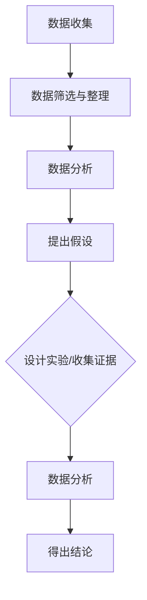
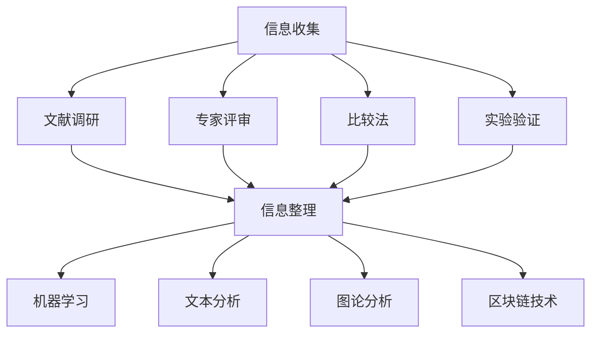

                 

### 1. 引言

#### 1.1 背景介绍

在后真相时代，信息的传播速度和广度达到了前所未有的高度。社交媒体、新闻网站和搜索引擎等平台成为信息传播的主要渠道。然而，随着信息爆炸式增长，虚假信息、误导性信息和未经证实的信息也如影随形。这些信息的泛滥不仅对公众认知产生了负面影响，还对社会的稳定和发展构成了严重威胁。因此，对信息真实性进行核查成为一项至关重要的任务。

#### 1.2 信息真实性的重要性

信息真实性是构建社会信任的基础。真实的信息有助于公众做出明智的决策，促进社会的和谐与进步。反之，虚假信息则会引发恐慌、误导公众，甚至导致社会动荡。在后真相时代，信息的真实性显得尤为关键。

#### 1.3 后真相时代的特征

后真相时代的特征包括：信息泛滥、技术进步、社交媒体的崛起和公众对权威的质疑。这些特征使得信息的真实性难以保障，也增加了事实核查的难度。

#### 1.4 事实核查的概念与作用

事实核查是指对信息来源、内容进行验证，以判断其真实性的过程。事实核查的作用包括：提高公众对信息的辨别能力、增强媒体和个人的公信力、促进社会公正和透明。

#### 1.5 事实核查的方法

事实核查的方法包括：查阅原始资料、交叉验证信息来源、专家访谈和数据分析等。这些方法共同构成了事实核查的科学基础。

#### 1.6 事实核查的挑战

事实核查面临的挑战包括：信息量庞大、虚假信息制作技术高超、公众对事实核查的信任度不足等。如何应对这些挑战是事实核查领域亟待解决的问题。

#### 1.7 本书结构安排

本书将分为三大部分。第一部分将介绍事实核查的科学基础，包括核心概念、原理、方法和挑战。第二部分将探讨实践中的事实核查，通过案例分析、工具应用和影响分析，深入探讨事实核查的实际操作和社会意义。第三部分将展望未来发展趋势，提出应对策略和拓展阅读建议。

通过本书的阅读，读者将全面了解事实核查的重要性和方法，学会如何在实际生活中运用事实核查，提高对信息的辨别能力，为构建真实、透明、公正的社会贡献力量。

### 1.5 事实核查的方法

#### 1.5.1 查阅原始资料

查阅原始资料是事实核查的首要步骤。原始资料通常包括政府文件、学术论文、新闻报道等。通过查阅原始资料，可以确保信息的真实性和准确性。在查阅过程中，需要注意识别信息的来源和可靠性，以避免引用虚假或不准确的信息。

#### 1.5.2 交叉验证信息来源

交叉验证信息来源是指通过不同的渠道和来源对同一信息进行验证。这种方法可以有效地减少单一来源可能带来的偏差和错误。例如，如果一条信息来自社交媒体，可以进一步查阅相关的新闻报道或官方文件，以确保信息的真实性。

#### 1.5.3 专家访谈

专家访谈是事实核查的重要方法之一。通过与领域专家进行交流，可以获取更深入、更专业的信息。专家的知识和经验可以帮助辨别信息的真实性，并提供有价值的见解和建议。

#### 1.5.4 数据分析

数据分析是事实核查的关键环节。通过对大量数据进行收集、处理和分析，可以揭示信息之间的联系和规律，从而判断信息的真实性。数据分析方法包括统计分析、数据挖掘和机器学习等。

#### 1.5.5 案例分析

案例分析是一种将事实核查方法应用于实际场景的方法。通过分析具体的案例，可以深入了解事实核查的过程和技巧，并从中汲取经验教训。

通过以上方法，我们可以对信息进行全面的核查，确保其真实性。然而，事实核查并非一蹴而就，需要不断地学习和实践，以提高核查的准确性和效率。

### 1.6 事实核查的挑战

#### 1.6.1 信息量庞大

在后真相时代，信息量呈现指数级增长，这使得事实核查工作面临巨大挑战。大量的信息需要逐一核查，这不仅增加了工作负担，还可能导致核查工作出现疏漏。

#### 1.6.2 虚假信息制作技术高超

随着技术的发展，虚假信息的制作技术也日益高超。这些虚假信息往往经过精心设计，具有很高的欺骗性，使得事实核查变得更加困难。

#### 1.6.3 公众对事实核查的信任度不足

公众对事实核查的信任度不足是一个严重的问题。部分公众可能对事实核查的动机和结果产生怀疑，这会导致事实核查工作难以得到广泛认可和支持。

#### 1.6.4 资源和人才短缺

事实核查需要大量的资源和人才支持。然而，目前很多事实核查机构面临着资源和人才的短缺问题，这限制了事实核查工作的开展。

#### 1.6.5 法律法规和伦理问题

事实核查涉及到法律法规和伦理问题。如何在保护公众利益的同时，尊重个人隐私和版权，是一个亟待解决的问题。

#### 1.6.6 应对策略

为了应对上述挑战，我们可以采取以下策略：

1. **提高公众意识**：通过教育和宣传，提高公众对信息真实性的认识和辨别能力。
2. **加强技术支持**：利用人工智能和大数据技术，提高事实核查的效率和准确性。
3. **加强合作与交流**：鼓励不同机构和个人之间的合作与交流，共同应对虚假信息的挑战。
4. **完善法律法规**：制定和完善相关法律法规，为事实核查提供法律保障。
5. **培养专业人才**：加强事实核查人才的培养，提高整个行业的专业水平。

通过这些策略，我们可以更好地应对事实核查的挑战，提高信息真实性的保障水平。

#### 1.7 本书结构安排

本书将分为三个主要部分，旨在全面探讨事实核查的科学方法和实践应用。

**第一部分：事实核查的科学基础**

本部分将介绍事实核查的核心概念、原理和方法。具体包括：

1. **核心概念与联系**：介绍信息真实性、事实与观点、假设与证据等关键概念，并使用Mermaid实体关系图展示概念之间的关系。
2. **事实核查的原理**：详细讲解事实核查的数据收集与分析、假设检验和算法原理，包括算法流程、数学模型和Python代码示例。
3. **信息真实性的数学模型与公式**：介绍基本数学公式、信息论模型、真实性测度模型和证据理论模型，使用latex格式展示关键公式。
4. **信息真实性的评估方法**：探讨传统和现代评估方法，比较不同方法的优缺点，并使用Mermaid流程图展示评估过程。
5. **事实核查的最佳实践**：讨论数据来源的选择、核查方法的运用、结果的呈现与传播，并提供实际案例和最佳实践建议。

**第二部分：实践中的事实核查**

本部分将结合实际案例，探讨事实核查的具体操作和工具应用。具体包括：

1. **实践案例**：分析社交媒体上的虚假信息、新闻报道的真实性以及学术研究中的数据造假，展示事实核查的应用场景。
2. **事实核查工具与应用**：介绍常用的事实核查工具，包括其功能和使用方法，评价工具的优劣。
3. **事实核查的社会影响**：讨论事实核查的积极和消极影响，提出应对策略。
4. **小结与展望**：总结本部分的实践经验和未来发展趋势，提供拓展阅读建议。

**第三部分：未来发展趋势**

本部分将展望事实核查的未来发展趋势，探讨新兴技术和方法在事实核查中的应用前景。具体包括：

1. **小结与展望**：总结全书内容，强调事实核查的重要性。
2. **未来发展趋势**：探讨人工智能、大数据等技术在事实核查中的应用，预测未来的发展方向。
3. **拓展阅读**：推荐相关书籍和文章，供读者进一步学习和研究。

通过本书的阅读，读者将全面了解事实核查的科学基础和实践应用，掌握信息真实性的评估方法，提升在信息时代辨别信息真实性的能力。

### 2.1 核心概念与联系

在探讨事实核查的科学基础时，理解一系列核心概念及其相互关系至关重要。这些概念包括信息真实性、事实与观点、假设与证据，它们共同构成了事实核查的理论框架。

#### 2.1.1 信息真实性

信息真实性是指信息的准确性、可靠性和完整性。它涉及到信息的来源、内容以及传播过程中是否被篡改或误导。一个真实的信息应该是基于可靠的数据和证据，不包含虚假或误导性的内容。

#### 2.1.2 事实与观点

事实是指客观存在的事物、事件或数据，它们可以通过观察和测量来验证。例如，一个具体的日期、统计数据或实验结果都是事实。而观点则是基于个人信念、态度或情感的主观看法，它们通常无法通过客观验证。区分事实与观点对于确保信息真实性至关重要。

#### 2.1.3 假设与证据

假设是建立在现有知识基础上的一种猜测或假设，用于解释现象或预测结果。证据则是用来支持或反驳假设的数据或信息。在事实核查过程中，我们需要通过证据来检验假设的真实性。如果证据充分且符合逻辑，假设的可信度会提高；反之，如果证据不足或存在矛盾，假设的可信度会降低。

#### 2.1.4 Mermaid实体关系图

为了更直观地展示这些核心概念及其相互关系，我们可以使用Mermaid实体关系图（ERD）来构建概念模型。以下是一个简单的Mermaid ERD示例，用于描述信息真实性、事实、观点、假设和证据之间的关系：

```mermaid
erDiagram
  InformationAuthenticity ||--|{ Fact } : "is based on"
  Fact ||--|{ Viewpoint } : "contains"
  Hypothesis ||--|{ Evidence } : "is supported by"
  Evidence ||--|{ InformationAuthenticity } : "validates"
```

在这个ERD中，`InformationAuthenticity` 是根实体，表示信息的整体真实性。它直接依赖于 `Fact`，而 `Fact` 包含 `Viewpoint`。`Hypothesis`（假设）则依赖于 `Evidence`（证据），并通过 `Evidence` 与 `InformationAuthenticity` 相关联。这种结构强调了证据在验证假设和事实，进而影响信息真实性的关键作用。

通过这种概念模型，我们可以更清晰地理解事实核查的过程，以及如何通过验证假设和证据来确保信息的真实性。

### 2.2 事实核查的原理

#### 2.2.1 数据收集与分析

数据收集与分析是事实核查的基础步骤。数据收集涉及从多个来源获取相关信息，这些来源可以是书籍、学术论文、官方网站、新闻报道、社交媒体等。收集到的数据需要经过筛选和整理，以确保其质量和相关性。

数据收集后，下一步是进行数据分析。数据分析包括描述性统计分析、相关性分析、趋势分析等，通过这些分析，我们可以识别数据中的模式、异常和趋势，从而对信息的真实性进行初步判断。

例如，如果我们要核查一条关于疫苗接种效果的信息，我们可以收集有关疫苗接种率、患病率、死亡率等数据。通过描述性统计分析，我们可以了解这些数据的分布情况；通过相关性分析，我们可以判断疫苗接种与患病率之间的关系；通过趋势分析，我们可以观察疫苗接种率随时间的变化趋势。这些分析结果可以帮助我们验证信息的真实性。

#### 2.2.2 假设检验

假设检验是事实核查的重要环节。它涉及提出假设，并通过收集和评估证据来验证假设的真实性。假设检验通常遵循以下步骤：

1. **提出假设**：基于已有知识和信息，提出一个具体的假设。例如，假设某条关于疫苗接种效果的信息是真实的。
2. **设计实验或收集证据**：根据假设，设计实验或收集相关数据。例如，通过调查疫苗接种者的健康状况，收集他们的患病情况和疫苗接种记录。
3. **数据分析**：对收集到的数据进行统计分析，以评估证据与假设的一致性。
4. **得出结论**：根据数据分析结果，判断假设是否成立。

例如，如果我们假设疫苗接种可以降低流感发病率，我们可以收集疫苗接种者与非疫苗接种者的流感发病率数据。通过比较两组数据，我们可以判断疫苗接种是否对流感发病率有显著影响。如果结果显著，我们可以认为假设成立；如果结果不显著，我们需要重新评估假设或收集更多数据。

#### 2.2.3 Mermaid流程图

为了更直观地展示数据收集与分析、假设检验的流程，我们可以使用Mermaid流程图来描述整个过程。以下是一个简单的Mermaid流程图示例：



在这个流程图中，从数据收集开始，通过数据筛选和整理，进入数据分析阶段。在数据分析的基础上，提出假设并设计实验或收集证据。随后，对收集到的证据进行数据分析，并最终得出结论。这个流程图清晰地展示了事实核查的基本步骤和逻辑关系。

#### 2.2.4 算法原理讲解

在事实核查中，算法的应用可以大大提高数据分析和假设检验的效率和准确性。以下是一个简单的事实核查算法的原理讲解，包括算法流程、数学模型和Python代码示例。

##### 2.2.4.1 算法流程

1. **数据预处理**：对收集到的数据进行清洗和预处理，确保数据的质量和一致性。
2. **特征提取**：从预处理后的数据中提取关键特征，用于后续的分析和建模。
3. **假设检验**：根据提取的特征，建立假设并进行假设检验。
4. **结果评估**：对假设检验的结果进行评估，判断信息的真实性。

##### 2.2.4.2 数学模型

假设我们想要检验一个关于某产品销量是否与广告投入量有关的假设。我们可以使用统计学中的线性回归模型来进行假设检验。线性回归模型的数学公式如下：

$$
y = \beta_0 + \beta_1 \cdot x + \epsilon
$$

其中，$y$ 是销量，$x$ 是广告投入量，$\beta_0$ 和 $\beta_1$ 是模型参数，$\epsilon$ 是误差项。

##### 2.2.4.3 Python代码示例

以下是一个简单的Python代码示例，用于实现线性回归模型的假设检验：

```python
import numpy as np
import pandas as pd
from sklearn.linear_model import LinearRegression
from sklearn.metrics import mean_squared_error

# 加载数据
data = pd.read_csv('sales_data.csv')
X = data['ad_spend'].values
y = data['sales'].values

# 数据预处理
X = X.reshape(-1, 1)

# 建立线性回归模型
model = LinearRegression()
model.fit(X, y)

# 假设检验
y_pred = model.predict(X)
mse = mean_squared_error(y, y_pred)

# 输出结果
print("MSE:", mse)
print("Coefficients:", model.coef_)
print("Intercept:", model.intercept_)
```

在这个示例中，我们首先加载数据，然后进行数据预处理，建立线性回归模型并进行假设检验。最后，我们输出模型的均方误差（MSE）、系数和截距，这些结果可以帮助我们判断广告投入量与销量之间的关系。

通过这种算法原理的讲解和Python代码示例，我们可以更深入地理解事实核查中数据分析和假设检验的具体操作和方法。

### 2.3 信息真实性的数学模型与公式

在事实核查过程中，数学模型和公式扮演着关键角色，它们帮助我们量化信息真实性的程度，并评估证据与假设之间的相关性。以下将介绍几个常用的数学模型与公式，包括概率公式、指数函数、对数函数、信息论模型、真实性测度模型和证据理论模型。

#### 2.3.1 基本数学公式

##### 2.3.1.1 概率公式

概率公式是描述事件发生可能性的一种数学工具。常见的概率公式包括：

$$
P(A) = \frac{N(A)}{N(S)}
$$

其中，$P(A)$ 是事件 $A$ 发生的概率，$N(A)$ 是事件 $A$ 发生的次数，$N(S)$ 是样本空间的总次数。

##### 2.3.1.2 指数函数

指数函数用于描述随时间变化的增长率。其公式为：

$$
f(x) = e^{kx}
$$

其中，$f(x)$ 是指数函数，$e$ 是自然对数的底数，$k$ 是增长率。

##### 2.3.1.3 对数函数

对数函数是指数函数的反函数，用于描述随时间变化的衰减率。其公式为：

$$
g(x) = \ln(x)
$$

其中，$g(x)$ 是对数函数，$\ln(x)$ 是以 $e$ 为底的对数。

#### 2.3.2 数学模型讲解

##### 2.3.2.1 信息论模型

信息论模型是用于量化信息内容的一种数学工具。香农信息论中的熵（Entropy）公式为：

$$
H(X) = -\sum_{i} p(x_i) \cdot \ln(p(x_i))
$$

其中，$H(X)$ 是随机变量 $X$ 的熵，$p(x_i)$ 是 $X$ 取值为 $x_i$ 的概率。

##### 2.3.2.2 真实性测度模型

真实性测度模型用于量化信息的真实性程度。一种常见的方法是使用贝叶斯概率公式：

$$
P(A|B) = \frac{P(B|A) \cdot P(A)}{P(B)}
$$

其中，$P(A|B)$ 是在已知 $B$ 的情况下 $A$ 的概率，$P(B|A)$ 是在已知 $A$ 的情况下 $B$ 的概率，$P(A)$ 和 $P(B)$ 分别是 $A$ 和 $B$ 的先验概率。

##### 2.3.2.3 证据理论模型

证据理论模型是另一种用于量化信息真实性的方法。德·芬内蒂（De Finetti）概率公式为：

$$
P(A \mid E) = \frac{\sum_{i} p(i) \cdot P(E \mid i)}{\sum_{i} p(i)}
$$

其中，$P(A \mid E)$ 是在已知证据 $E$ 的情况下 $A$ 的概率，$p(i)$ 是证据 $E$ 取值为 $i$ 的概率，$P(E \mid i)$ 是在已知证据 $E$ 的情况下 $i$ 的概率。

#### 2.3.3 应用示例

以下是一个简单的应用示例，假设我们想要评估某新闻报道的真实性。我们可以使用贝叶斯概率公式来计算新闻报道为真的概率。

1. **先验概率**：假设我们知道这条新闻报道有50%的可能性为真，即 $P(A) = 0.5$。
2. **证据**：我们收集了五个支持这条新闻报道的证据，每个证据独立的表明新闻报道为真的概率为70%，即 $P(E \mid A) = 0.7$。
3. **计算后验概率**：使用贝叶斯概率公式，我们可以计算得到：

$$
P(A \mid E) = \frac{P(E \mid A) \cdot P(A)}{P(E)} = \frac{0.7 \cdot 0.5}{P(E)}
$$

其中，$P(E)$ 是所有证据的综合概率。如果我们假设所有证据的概率相同，那么 $P(E) = 0.7^5 \cdot 0.5$。

最终，通过计算，我们可以得出新闻报道为真的后验概率。这个过程可以帮助我们量化证据对信息真实性的影响，提高我们对信息的判断能力。

### 2.4 信息真实性的评估方法

在事实核查过程中，评估信息真实性是一个关键步骤。评估方法的选择直接影响核查结果的准确性和可靠性。以下将介绍几种常用的信息真实性评估方法，包括传统评估方法和现代评估方法，并对这些方法进行比较与选择。

#### 2.4.1 传统评估方法

传统评估方法主要依赖于人工经验和专业知识，以下是一些常见的传统评估方法：

1. **文献调研法**：通过查阅相关文献，如书籍、期刊文章、政府报告等，收集信息来源，验证信息的准确性和可靠性。
2. **专家评审法**：邀请领域内的专家对信息进行评审，利用专家的专业知识和经验，评估信息的真实性和准确性。
3. **比较法**：通过比较不同来源的信息，识别差异和矛盾，从而评估信息的真实性。
4. **实验验证法**：通过设计实验，收集数据，验证假设和结论，评估信息的真实性。

这些传统方法在信息真实性评估中发挥了重要作用，但由于其依赖人工操作，评估效率较低，且受主观因素影响较大。

#### 2.4.2 现代评估方法

随着信息技术和人工智能的发展，现代评估方法逐渐成为信息真实性评估的重要工具。以下是一些现代评估方法：

1. **机器学习法**：利用机器学习算法，如支持向量机（SVM）、决策树、神经网络等，对大量数据进行训练，建立信息真实性的预测模型。
2. **文本分析**：通过自然语言处理（NLP）技术，分析文本的内容和结构，识别文本中的误导性信息和虚假陈述。
3. **图论分析法**：利用图论方法，构建信息传播网络，分析信息源、传播路径和传播效果，评估信息的真实性。
4. **区块链技术**：利用区块链技术，确保信息不可篡改，提高信息来源的可信度。

现代评估方法具有较高的效率和准确性，能够处理大量复杂的信息，但需要大量计算资源和专业知识。

#### 2.4.3 Mermaid流程图

为了更直观地展示信息真实性评估方法的流程，我们可以使用Mermaid流程图来描述。以下是一个简单的Mermaid流程图示例：



在这个流程图中，从信息收集开始，通过不同的传统评估方法和现代评估方法，最终对信息真实性进行综合评估。

#### 2.4.4 评估方法的比较与选择

不同评估方法具有各自的优缺点，选择合适的评估方法取决于信息的特点和评估的目标。以下是对传统评估方法和现代评估方法的比较：

| 方法       | 优点                         | 缺点                          |
|------------|------------------------------|------------------------------|
| 文献调研法 | 依赖权威文献，可信度高       | 调研效率低，受人工限制       |
| 专家评审法 | 利用专家经验，评估准确       | 主观性较大，受专家经验限制   |
| 比较法     | 识别矛盾，提高评估准确性     | 需要大量时间和精力           |
| 实验验证法 | 实证性强，评估结果可靠       | 需要设计和执行实验，成本高   |
| 机器学习法 | 高效处理大量数据，预测能力强 | 需要大量数据训练，解释性较低 |
| 文本分析   | 识别误导性信息，自动化处理   | 对复杂文本分析效果有限       |
| 图论分析   | 网络结构分析，识别传播路径   | 需要大量计算资源             |
| 区块链技术 | 保障信息不可篡改             | 需要较高技术门槛             |

在选择评估方法时，应综合考虑信息的类型、数量、来源和评估目标，以及可用的资源和时间。例如，对于涉及大量数据的评估任务，可以考虑使用机器学习法和文本分析；对于需要高可信度评估的任务，可以考虑结合文献调研法和专家评审法。

通过比较和选择合适的评估方法，我们可以提高信息真实性的评估效率和质量，为事实核查提供坚实的科学基础。

### 2.5 事实核查的最佳实践

#### 2.5.1 数据来源的选择

选择可靠的数据来源是事实核查的第一步。以下是几个关键因素，用于评估数据来源的可靠性：

1. **权威性**：优先选择官方发布的数据，如政府报告、学术期刊和知名研究机构的报告。
2. **时效性**：选择最新和及时的数据，以确保信息的有效性。对于历史数据，需要验证其获取时间和更新频率。
3. **一致性**：多个来源的数据应保持一致性，避免因数据冲突导致的错误判断。
4. **透明度**：数据来源应提供详细的背景信息和数据采集方法，以便核查者验证数据的可靠性。

#### 2.5.2 核查方法的运用

在数据来源确定后，需要选择合适的核查方法。以下是几种常用的核查方法：

1. **交叉验证**：通过不同来源的数据进行交叉验证，确保信息的准确性。例如，如果一条信息同时出现在两个来源中，可以进一步核实这两个来源的可靠性。
2. **专家评审**：邀请领域内的专家对信息进行评审，利用他们的专业知识评估信息的真实性。
3. **实验验证**：对于需要实际验证的信息，设计实验或进行实地调查，收集数据来支持或反驳假设。
4. **文献调研**：查阅相关文献和资料，验证信息的科学性和权威性。

#### 2.5.3 结果的呈现与传播

事实核查的结果需要准确、清晰地呈现，以便公众理解和参考。以下是一些建议：

1. **报告格式**：使用规范的报告格式，包括摘要、方法、结果和结论等部分，确保信息的结构化和逻辑性。
2. **数据可视化**：利用图表和图形展示数据和分析结果，使信息更直观、易于理解。
3. **多渠道传播**：通过社交媒体、官方网站和新闻媒体等多渠道传播核查结果，提高信息的传播范围和影响力。
4. **公众互动**：鼓励公众参与讨论和反馈，提高事实核查的透明度和公信力。

#### 2.5.4 小结

事实核查的最佳实践包括选择可靠的数据来源、运用多种核查方法、准确呈现结果并广泛传播。这些实践有助于提高事实核查的准确性和公信力，为公众提供可靠的信息服务。

### 3.1 实践案例

#### 3.1.1 案例一：社交媒体上的虚假信息

社交媒体平台上的虚假信息已成为一个严重的问题。以下是一个具体的案例：

**案例背景**：某社交媒体平台上发布了一篇关于一种新型疫苗的虚假文章，声称这种疫苗可以100%预防新冠病毒。文章迅速引起了广泛关注，并引发了公众的恐慌。

**事实核查过程**：

1. **数据来源选择**：首先，核查者选择了多个权威来源，如世界卫生组织（WHO）和各大卫生部门的官方网站，以获取关于疫苗的真实信息。
2. **交叉验证**：通过查阅多个权威来源，核查者发现这些网站均未提及100%预防新冠病毒的疫苗。同时，还发现该文章引用的所谓“科学研究”实际上是伪造的。
3. **专家评审**：邀请医学专家对文章进行评审，专家们指出，目前没有任何疫苗可以100%预防新冠病毒。
4. **结果呈现**：核查者撰写了一篇详细的事实核查报告，通过官方网站和社交媒体发布，澄清了虚假信息的真相。

**案例分析**：这个案例展示了社交媒体上虚假信息的危害性。通过严谨的事实核查，核查者成功揭穿了虚假信息，保护了公众的利益。

#### 3.1.2 案例二：新闻报道的真实性

新闻报道的真实性也是事实核查的重要领域。以下是一个具体案例：

**案例背景**：某新闻报道声称某城市的空气污染指数达到历史新高，引发公众对环境问题的担忧。

**事实核查过程**：

1. **数据来源选择**：核查者选择了该城市的环保部门官方网站和天气预报网站，以获取准确的空气污染数据。
2. **数据分析**：通过对比官方网站发布的数据，核查者发现该新闻报道的数据与官方数据存在显著差异。进一步调查发现，新闻报道中的数据可能是误报或篡改的。
3. **专家评审**：邀请环境科学专家对数据进行分析，专家指出，该城市的空气污染指数虽然较高，但并未达到历史新高。
4. **结果呈现**：核查者在官方媒体上发布了事实核查报告，指出新闻报道存在虚假信息，并提供了真实的数据。

**案例分析**：这个案例表明，新闻报道的真实性核查对于公众了解事实至关重要。通过严谨的核查，核查者揭示了新闻报道中的问题，提高了公众对信息的辨别能力。

#### 3.1.3 案例三：学术研究中的数据造假

学术研究中的数据造假是一个严重的伦理问题。以下是一个具体案例：

**案例背景**：某学术期刊发表了一篇关于新药物疗效的研究论文，声称该药物可以显著降低癌症患者的死亡率。

**事实核查过程**：

1. **数据来源选择**：核查者选择了该研究论文的原始数据，并联系了论文的作者和合作机构。
2. **数据对比**：通过对比原始数据和论文中的数据，核查者发现多个数据点存在异常，疑似篡改。
3. **专家评审**：邀请医学专家对论文的数据进行分析，专家们指出，这些异常数据点无法用实验误差来解释，可能是数据造假的结果。
4. **结果呈现**：核查者将事实核查结果提交给了学术期刊和合作机构，要求撤回该论文。

**案例分析**：这个案例揭示了学术研究中的数据造假问题。通过严谨的事实核查，核查者揭示了数据造假的事实，维护了学术研究的诚信。

### 总结

以上三个案例展示了事实核查在社交媒体、新闻报道和学术研究中的应用。通过严谨的核查方法，核查者成功揭示了虚假信息和数据造假，保护了公众的利益，维护了社会的稳定。这些案例强调了事实核查的重要性和必要性。

### 3.2 事实核查工具与应用

在事实核查过程中，工具的选择和运用至关重要。以下将介绍几种常见的事实核查工具，并分析它们的功能和使用方法。

#### 3.2.1 事实核查工具概述

常见的事实核查工具包括：

1. **Snopes**：一个历史悠久的虚假信息核查网站，提供对各种虚假信息的详细分析和验证。
2. **FactCheck.org**：一个非营利性组织，专注于对美国政治和公共事务中的虚假信息进行核查。
3. **PolitiFact**：由《坦帕湾论坛报》运营，专注于对政治宣传和公共政策的核查。
4. **BuzzFeed Fact Check**：BuzzFeed旗下的事实核查部门，提供对新闻和社交媒体上的虚假信息的核查。

这些工具各有特色，但都致力于提供准确、可靠的信息。

#### 3.2.2 常用事实核查工具

1. **Snopes**

   - **功能**：Snopes提供了对各种虚假信息、都市传说和误导性信息的核查，覆盖了广泛的主题，包括健康、政治、科技等。
   - **使用方法**：用户可以在Snopes网站上搜索感兴趣的主题或信息，查看相关的核查结果和解释。用户还可以通过电子邮件或社交媒体分享核查结果。

2. **FactCheck.org**

   - **功能**：FactCheck.org专注于美国政治和公共事务中的虚假信息和误导性信息的核查，提供详细的分析和评分。
   - **使用方法**：用户可以在FactCheck.org的网站上搜索特定的政治宣传或政策声明，查看其核查结果和评分。用户还可以订阅邮件更新，获取最新的核查信息。

3. **PolitiFact**

   - **功能**：PolitiFact对政治人物和政党的声明进行核查，提供“真伪等级”评分，包括“真”、“几乎真”、“半真半假”、“几乎假”和“假”等。
   - **使用方法**：用户可以在PolitiFact的网站上搜索特定政治人物的声明，查看其核查结果和评分。用户还可以通过邮件订阅获取最新的核查信息。

4. **BuzzFeed Fact Check**

   - **功能**：BuzzFeed Fact Check对社交媒体上的虚假信息进行核查，提供详细的分析和验证。
   - **使用方法**：用户可以在BuzzFeed Fact Check的网站上搜索社交媒体上的虚假信息，查看其核查结果和解释。用户还可以通过社交媒体分享核查结果。

#### 3.2.3 工具的使用与评价

以上工具各有优点和局限性。Snopes提供了详尽的虚假信息核查，但有时可能无法覆盖最新的虚假信息。FactCheck.org和PolitiFact专注于政治和公共事务，提供了权威的核查结果，但适用范围有限。BuzzFeed Fact Check则专注于社交媒体上的虚假信息，具有广泛的覆盖范围。

总体而言，这些工具在提高公众对信息真实性的辨别能力方面发挥了重要作用。然而，用户在使用这些工具时，应保持批判性思维，结合多个工具和来源进行综合评估，以提高核查结果的可靠性。

### 3.3 事实核查的社会影响

#### 3.3.1 积极影响

事实核查对社会有着重要的积极影响。首先，它有助于提高公众对信息真实性的辨别能力，使人们更加谨慎地对待所接收到的信息。其次，事实核查能够揭示虚假信息，防止误导和恐慌的传播，维护社会稳定。此外，事实核查还能增强媒体和个人的公信力，促进信息透明和公正。

#### 3.3.2 消极影响

尽管事实核查具有积极作用，但也存在一些消极影响。首先，事实核查的资源和人才有限，难以应对海量信息的核查需求。其次，公众对事实核查的信任度可能不足，导致核查结果不被广泛接受。此外，事实核查可能会引发法律和伦理问题，如侵犯个人隐私和版权等。

#### 3.3.3 应对策略

为应对事实核查的挑战，可以采取以下策略：

1. **加强公众教育**：通过教育和宣传，提高公众对事实核查的认识和参与度，增强对核查结果的信任。
2. **利用技术手段**：运用人工智能和大数据技术，提高事实核查的效率和准确性，减轻人力负担。
3. **完善法律法规**：制定和完善相关法律法规，为事实核查提供法律保障，同时保护个人隐私和版权。
4. **加强合作与交流**：鼓励不同机构和个人之间的合作与交流，共同应对虚假信息的挑战。

通过这些策略，可以更好地发挥事实核查的积极作用，减少其消极影响，为构建真实、透明、公正的社会贡献力量。

### 3.4 小结与展望

#### 3.4.1 小结

通过本文的讨论，我们系统地介绍了事实核查的重要性和方法。首先，我们分析了信息真实性的背景和重要性，随后详细探讨了事实核查的科学基础，包括核心概念、原理和评估方法。接着，通过实际案例展示了事实核查的应用，并介绍了常用的事实核查工具。最后，我们探讨了事实核查的社会影响，并提出了应对策略。

#### 3.4.2 未来发展趋势

随着技术的发展，事实核查领域将迎来新的机遇和挑战。首先，人工智能和大数据技术的应用将进一步提高事实核查的效率和准确性。其次，社交媒体和区块链技术的结合有望提供更可靠的信息来源和传播途径。此外，跨学科的合作将促进事实核查方法的创新和发展。

#### 3.4.3 拓展阅读

为了深入了解事实核查的相关话题，推荐以下书籍和文章：

1. 《事实核查：如何分辨真假信息》（Fact-Checking: How to Tell What's True and What's Not）
2. 《信息战：虚假信息的传播与控制》（Information Wars: Controlling the Contagion of False Information）
3. 《人工智能与事实核查：技术与伦理》（Artificial Intelligence and Fact-Checking: Technology and Ethics）
4. 《科学传播与事实核查：媒体责任》（Science Communication and Fact-Checking: Media Responsibilities）

通过阅读这些资源，读者可以进一步深化对事实核查的理解和实践。

