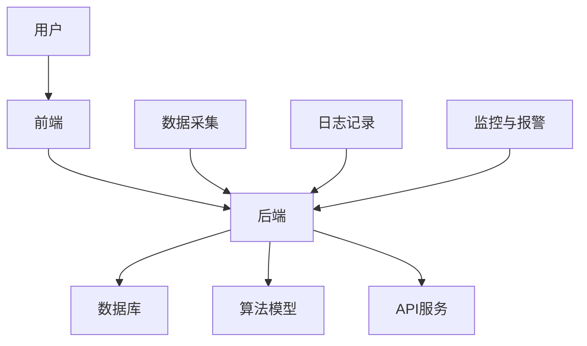
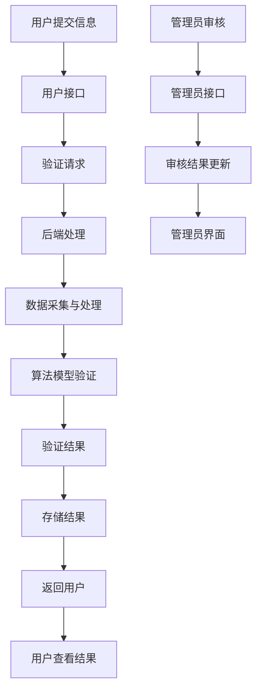

                 


### 后真相时代的价值判断：如何辨别真伪

#### 关键词：
- 后真相时代
- 价值判断
- 真伪辨别
- 信息素养
- 人工智能

#### 摘要：
本文旨在探讨后真相时代下的价值判断困境，通过深入分析信息泛滥、情感主导、信息源复杂等后真相时代的特征，阐述价值判断面临的挑战。在此基础上，本文提出了信息素养教育、技术手段应用、媒体自律和监管等解决方案，以期为辨别真伪、维护社会稳定提供有益的思考。

---

## 第1章：引言与背景

### 1.1 问题背景

#### 1.1.1 社会变迁下的“后真相时代”

在数字信息爆炸和社交媒体普及的当下，人们面临着前所未有的信息泛滥。传统媒体的影响力减弱，虚假信息和错误信息广泛传播，导致所谓的“后真相”现象日益严重。后真相时代，事实被情感和观点所主导，而非理性分析。这一现象引发了一系列社会问题，如公众信任危机、信息茧房、偏见和极端化等。

随着社交媒体的普及，信息传播的速度和广度得到了极大的提升。一条信息可以在几秒钟内传遍全球，而无需经过传统媒体的过滤和审核。这种情况下，信息的真实性和可靠性难以保证，虚假新闻、谣言、误导性信息等层出不穷。这些信息往往被情绪化的语言和图像所包装，以激发公众的情感反应，从而迅速传播开来。

#### 1.1.2 价值判断的困境

在信息爆炸的时代，如何判断信息的真伪和价值成为了一个巨大的挑战。传统的方法和标准在面对海量的信息和复杂的网络环境时显得力不从心。此外，信息源的多样性和信息传播的迅速性使得人们难以对信息进行有效的筛选和验证。

在价值判断方面，不同的人有不同的价值观和立场，这会导致对同一信息的不同判断。例如，对于某个政治事件，不同的政治派别可能会有截然不同的看法。在这种情况下，价值判断变得复杂且难以达成共识。同时，信息的情感主导性也使得人们在判断信息时更容易受到情绪的影响，而非理性分析。

### 1.2 问题描述

#### 1.2.1 真伪辨别问题

在互联网时代，人们每天都会接触到大量信息。如何辨别这些信息的真伪成为了一个首要问题。虚假新闻、谣言、误导性信息等不仅会误导公众，还可能对社会稳定造成威胁。例如，一些虚假医疗信息可能导致人们延误治疗，甚至危及生命。此外，虚假的经济信息可能导致投资者失去信心，引发金融市场动荡。

#### 1.2.2 价值判断困境

在信息泛滥的社会中，人们如何根据信息的真实性做出价值判断也是一个难题。不同的价值观和立场会导致对同一信息的不同判断，增加了价值判断的复杂性。例如，对于某个社会事件，一些人可能认为这是正义的，而另一些人可能认为这是不公正的。在这种情况下，价值判断变得模糊不清，难以形成统一的观点。

### 1.3 问题解决

#### 1.3.1 信息素养教育

提高公众的信息素养是解决后真相时代价值判断困境的重要手段。通过教育，人们可以学会如何评估信息的来源、验证信息的真实性、批判性思维等。具体措施包括：

1. **学校教育**：在学校课程中增加信息素养教育，教授学生如何识别和评估信息。
2. **社会培训**：通过社区培训、在线课程等方式，提高公众的信息素养水平。
3. **媒体宣传**：利用媒体渠道，宣传信息素养的重要性，引导公众树立正确的信息观念。

#### 1.3.2 技术手段的应用

利用人工智能、机器学习等先进技术，可以开发出更加智能的信息筛选和验证工具。这些工具可以帮助人们更快速、准确地辨别信息的真伪。具体技术手段包括：

1. **自然语言处理**：通过分析文本内容，识别虚假信息和误导性信息。
2. **数据挖掘**：通过分析大量数据，识别潜在的信息问题，如数据偏差、数据缺失等。
3. **图像识别**：通过分析图像内容，识别虚假图像和信息。

#### 1.3.3 媒体自律和监管

媒体机构应加强自律，提高报道的准确性。政府和社会组织也应加强对虚假信息的监管，通过法律手段打击谣言传播。具体措施包括：

1. **媒体自律**：制定行业规范，提高报道的准确性和真实性。
2. **政府监管**：加强对媒体的监管，严厉打击虚假信息和谣言传播。
3. **社会组织监督**：鼓励社会组织对媒体进行监督，提高媒体社会责任感。

### 1.4 边界与外延

#### 1.4.1 后真相时代的特征

后真相时代的特征包括信息爆炸、信息源复杂、情感主导等。这些特征使得传统的信息处理方法不再适用。首先，信息爆炸使得人们难以对海量信息进行有效的筛选和处理。其次，信息源的复杂化使得人们难以判断信息的真实性和可靠性。最后，情感主导使得信息传播更具有情绪化，而非理性化。

#### 1.4.2 价值判断的多维度

价值判断不仅涉及事实的真伪，还包括道德、伦理、法律等多个层面。这使得价值判断更加复杂。例如，对于某个社会事件，不同的人可能会有不同的道德判断。在这种情况下，价值判断需要综合考虑多个维度，以形成全面、客观的观点。

### 1.5 概念结构与核心要素组成

#### 1.5.1 后真相时代

后真相时代是指事实被情感和观点主导，而非理性分析的时代。这一时代的特点是信息爆炸、信息源复杂、情感主导等。

#### 1.5.2 价值判断

价值判断是指对信息的真实性、道德性、合理性等进行评估和判断。在信息泛滥的时代，价值判断面临巨大的挑战。

#### 1.5.3 信息素养

信息素养是指个体获取、评估、使用和创造信息的能力。在信息爆炸的时代，提高信息素养是解决价值判断困境的重要手段。

#### 1.5.4 技术手段

技术手段包括人工智能、机器学习等，用于信息筛选和验证。这些技术可以帮助人们更快速、准确地辨别信息的真伪。

#### 1.5.5 媒体自律和监管

媒体自律和监管是指媒体机构和社会组织对虚假信息进行自律和监管的行为。加强媒体自律和监管是维护社会稳定的重要手段。

---

## 第2章：核心概念与联系

### 2.1 后真相时代的价值判断

#### 2.1.1 后真相时代的特征

在后真相时代，信息传播的速度和广度超出了传统媒体的范畴，社交媒体成为了信息传播的主要渠道。这一时代的特点包括：

1. **信息爆炸**：大量信息在短时间内涌现，人们难以分辨真伪。
2. **情感主导**：情感因素往往比事实更具有影响力，导致公众容易被情绪化信息所引导。
3. **多元化信息源**：传统媒体、自媒体、社交平台等多渠道的信息传播，增加了信息复杂性。

在后真相时代，事实和观点往往被情感所主导，而非理性分析。这意味着，人们更容易被情绪化、煽动性的信息所影响，而忽视了事实本身。这种现象导致了公众对信息的真实性产生怀疑，进一步加剧了社会的不稳定。

#### 2.1.2 价值判断的挑战

在这样一个信息环境中，价值判断面临以下挑战：

1. **信息验证困难**：由于信息来源的多样性和匿名性，人们难以对信息的真实性进行验证。虚假信息和误导性信息往往难以辨别，导致公众对信息的真实性和可靠性产生怀疑。
2. **观点对立**：不同观点之间的对立和争论使得价值判断更加困难。在社交媒体上，不同观点的碰撞往往引发激烈的情绪反应，使得公众难以形成共识。
3. **信息茧房效应**：人们倾向于接收与自己观点一致的信息，从而形成信息孤岛。这种现象导致公众的信息视野变得狭窄，难以全面了解问题的各个方面。

在信息爆炸的时代，价值判断的困境不仅仅体现在信息的真伪辨别上，还包括对信息的道德性和合理性的判断。由于信息的情感主导性，公众在做出价值判断时更容易受到情绪的影响，而非理性分析。

### 2.2 信息素养的重要性

#### 2.2.1 信息素养的定义

信息素养是指个体在信息社会中，有效地获取、评估、使用和创造信息的能力。其核心要素包括：

1. **信息获取**：包括信息搜索、信息筛选和检索等。个体需要掌握有效的信息获取方法，以便在海量信息中快速找到所需的信息。
2. **信息评估**：对信息的准确性、可靠性和相关性进行判断。个体需要具备评估信息质量的能力，以避免受到虚假信息和误导性信息的影响。
3. **信息使用**：根据信息需求，有效地利用信息。个体需要学会如何将信息应用于实际问题中，以解决问题或做出决策。
4. **信息创造**：在信息的基础上进行创新和创造。个体需要具备信息整合、分析、创新的能力，以产生新的见解和解决方案。

#### 2.2.2 信息素养的提升

提升信息素养是解决后真相时代价值判断困境的重要手段。具体方法包括：

1. **教育**：通过学校教育、社区教育等渠道，教授信息素养的相关知识和技能。教育机构需要将信息素养教育纳入课程体系，提高学生的信息素养水平。
2. **自我提升**：通过阅读、学习、实践等方式，不断提高自己的信息素养。个体需要主动学习信息素养的相关知识和技能，以应对不断变化的信息环境。

信息素养的提升不仅有助于个体辨别信息的真伪，还能提高公众的价值判断能力。通过信息素养教育，个体可以更好地理解信息的来源、评估信息的质量，从而做出更明智的价值判断。

### 2.3 技术

#### 2.3.1 人工智能与机器学习

人工智能和机器学习技术在信息筛选和验证方面具有巨大的潜力。通过机器学习算法，可以自动识别和筛选虚假信息和误导性信息。例如，可以使用自然语言处理技术，分析文本内容，识别虚假新闻和谣言。此外，还可以使用图像识别技术，分析图像内容，识别虚假图像和信息。

1. **自然语言处理**：通过分析文本内容，识别虚假信息和误导性信息。例如，可以使用文本分类算法，将新闻文本分类为真实新闻和虚假新闻。同时，还可以使用情感分析算法，分析文本的情感倾向，判断信息是否具有情绪化特点。
2. **图像识别**：通过分析图像内容，识别虚假图像和信息。例如，可以使用图像分类算法，将图像分类为真实图像和虚假图像。同时，还可以使用图像增强算法，对图像进行增强，以便更准确地识别图像内容。

人工智能和机器学习技术在信息筛选和验证方面的应用，可以帮助人们更快速、准确地辨别信息的真伪，提高信息素养。

#### 2.3.2 数据挖掘与分析

数据挖掘和分析技术在识别信息问题、评估信息质量方面具有重要作用。通过分析大量数据，可以发现潜在的信息问题，如数据偏差、数据缺失等。例如，可以使用数据挖掘算法，分析新闻报道的频率和内容，识别可能存在的虚假信息和误导性信息。

1. **数据挖掘**：通过分析大量数据，识别潜在的信息问题。例如，可以使用关联规则挖掘算法，分析新闻报道之间的关联性，识别可能存在的虚假信息和误导性信息。
2. **数据分析**：通过分析数据，评估信息的质量。例如，可以使用统计分析方法，评估新闻报道的准确性和可靠性。

数据挖掘和分析技术可以帮助人们更全面、深入地理解信息，提高信息素养。

### 2.4 媒体自律和监管

#### 2.4.1 媒体自律

媒体自律是指媒体机构在信息传播过程中，自觉遵守行业规范和道德准则，提高报道的准确性和真实性。媒体机构需要加强内部管理，确保新闻报道的客观性和公正性。例如，可以制定严格的新闻审查制度，确保新闻报道的真实性和准确性。

1. **新闻审查**：制定严格的新闻审查制度，确保新闻报道的真实性和准确性。新闻审查可以包括事实核查、引用核实等环节，以确保新闻报道的准确性。
2. **内容管理**：加强对社交媒体平台的内容管理，防止虚假信息和误导性信息的传播。社交媒体平台可以制定相关规则，对违规内容进行处置。

#### 2.4.2 监管

政府和社会组织在信息传播过程中也扮演着重要的监管角色。政府可以通过立法和执法手段，打击虚假信息和谣言传播。社会组织可以加强对媒体的监督，提高媒体的社会责任感。

1. **立法**：通过立法手段，规范信息传播行为，打击虚假信息和谣言传播。例如，可以制定《虚假信息法》，明确虚假信息的定义和处罚标准。
2. **执法**：加强对虚假信息和谣言的执法力度，严厉打击虚假信息和谣言传播。执法机构可以开展专项执法行动，打击虚假信息和谣言传播。
3. **社会组织监督**：鼓励社会组织对媒体进行监督，提高媒体的社会责任感。社会组织可以开展媒体监督活动，揭露虚假信息和谣言传播，促进信息传播的公正性和真实性。

通过媒体自律和监管，可以维护社会稳定，提高公众的价值判断能力。

---

## 第3章：算法原理讲解

### 3.1 机器学习算法

为了更好地解决后真相时代下的价值判断困境，机器学习算法的应用变得尤为重要。以下是一些常见的机器学习算法及其在信息筛选和验证中的应用。

#### 3.1.1 决策树算法

决策树算法是一种常见的分类算法，通过一系列的规则对数据进行分类。在信息筛选和验证中，决策树算法可以用来识别虚假信息和误导性信息。

1. **算法原理**：
   - 决策树通过一系列的测试来将数据分成不同的类别。
   - 每个测试基于某个特征，如文本中的关键词或图像中的颜色分布。
   - 测试的结果决定下一步的测试或分类。

2. **流程图**：
   ```mermaid
   graph TD
   A[开始] --> B{判断特征}
   B -->|是| C{继续判断}
   B -->|否| D{分类为虚假信息}
   C --> E{继续判断}
   E -->|是| F{分类为真实信息}
   E -->|否| G{分类为误导性信息}
   ```

3. **Python代码示例**：
   ```python
   from sklearn.tree import DecisionTreeClassifier
   from sklearn.model_selection import train_test_split
   from sklearn.metrics import accuracy_score

   # 假设我们已经有一个特征工程处理后的数据集
   X = ...  # 特征矩阵
   y = ...  # 标签向量，0表示真实信息，1表示虚假信息

   # 划分训练集和测试集
   X_train, X_test, y_train, y_test = train_test_split(X, y, test_size=0.2, random_state=42)

   # 训练决策树模型
   clf = DecisionTreeClassifier()
   clf.fit(X_train, y_train)

   # 预测测试集
   y_pred = clf.predict(X_test)

   # 计算准确率
   accuracy = accuracy_score(y_test, y_pred)
   print(f"Accuracy: {accuracy}")
   ```

#### 3.1.2 随机森林算法

随机森林算法是一种基于决策树的集成学习方法，通过构建多个决策树，并投票决定最终分类结果，提高了模型的准确性和稳定性。

1. **算法原理**：
   - 随机森林通过随机选择特征和随机划分数据集来构建多个决策树。
   - 每棵决策树独立训练，并通过投票决定最终分类结果。

2. **流程图**：
   ```mermaid
   graph TD
   A[开始] --> B{随机选择特征}
   B --> C{随机划分数据}
   C -->|训练| D{构建决策树}
   D --> E{重复}
   E --> F{投票}
   ```

3. **Python代码示例**：
   ```python
   from sklearn.ensemble import RandomForestClassifier
   from sklearn.model_selection import train_test_split
   from sklearn.metrics import accuracy_score

   # 假设我们已经有一个特征工程处理后的数据集
   X = ...  # 特征矩阵
   y = ...  # 标签向量，0表示真实信息，1表示虚假信息

   # 划分训练集和测试集
   X_train, X_test, y_train, y_test = train_test_split(X, y, test_size=0.2, random_state=42)

   # 训练随机森林模型
   rf_clf = RandomForestClassifier(n_estimators=100, random_state=42)
   rf_clf.fit(X_train, y_train)

   # 预测测试集
   y_pred = rf_clf.predict(X_test)

   # 计算准确率
   accuracy = accuracy_score(y_test, y_pred)
   print(f"Accuracy: {accuracy}")
   ```

#### 3.1.3 支持向量机算法

支持向量机（SVM）算法是一种经典的二分类算法，通过找到一个最佳的超平面，将不同类别的数据分隔开来。在信息筛选和验证中，SVM可以用来识别虚假信息和误导性信息。

1. **算法原理**：
   - SVM通过找到一个最佳的超平面，将不同类别的数据分隔开来。
   - 超平面的选择基于最大化分类间隔的原则。

2. **流程图**：
   ```mermaid
   graph TD
   A[开始] --> B{计算最优超平面}
   B --> C{分隔数据}
   C -->|分类| D{分类结果}
   ```

3. **Python代码示例**：
   ```python
   from sklearn.svm import SVC
   from sklearn.model_selection import train_test_split
   from sklearn.metrics import accuracy_score

   # 假设我们已经有一个特征工程处理后的数据集
   X = ...  # 特征矩阵
   y = ...  # 标签向量，0表示真实信息，1表示虚假信息

   # 划分训练集和测试集
   X_train, X_test, y_train, y_test = train_test_split(X, y, test_size=0.2, random_state=42)

   # 训练SVM模型
   svm_clf = SVC(kernel='linear', C=1.0)
   svm_clf.fit(X_train, y_train)

   # 预测测试集
   y_pred = svm_clf.predict(X_test)

   # 计算准确率
   accuracy = accuracy_score(y_test, y_pred)
   print(f"Accuracy: {accuracy}")
   ```

通过上述机器学习算法的应用，我们可以更好地辨别信息的真伪，提高价值判断的准确性。

### 3.2 自然语言处理技术

自然语言处理（NLP）技术在信息筛选和验证中也发挥着重要作用。以下是一些常见的NLP技术及其在信息筛选和验证中的应用。

#### 3.2.1 文本分类算法

文本分类算法是一种将文本数据分类为不同类别的算法。在信息筛选和验证中，文本分类算法可以用来识别虚假新闻、谣言等。

1. **算法原理**：
   - 文本分类算法通过训练模型，将输入的文本映射到预定义的类别中。
   - 常用的分类算法包括朴素贝叶斯、逻辑回归、支持向量机等。

2. **流程图**：
   ```mermaid
   graph TD
   A[输入文本] --> B{特征提取}
   B --> C{分类模型}
   C --> D{分类结果}
   ```

3. **Python代码示例**：
   ```python
   from sklearn.feature_extraction.text import TfidfVectorizer
   from sklearn.naive_bayes import MultinomialNB
   from sklearn.pipeline import make_pipeline
   from sklearn.model_selection import train_test_split
   from sklearn.metrics import classification_report

   # 假设我们已经有一个文本数据集
   texts = [...]  # 文本数据
   labels = [...]  # 文本标签，0表示真实信息，1表示虚假信息

   # 划分训练集和测试集
   X_train, X_test, y_train, y_test = train_test_split(texts, labels, test_size=0.2, random_state=42)

   # 创建文本分类模型
   model = make_pipeline(TfidfVectorizer(), MultinomialNB())
   model.fit(X_train, y_train)

   # 预测测试集
   y_pred = model.predict(X_test)

   # 打印分类报告
   print(classification_report(y_test, y_pred))
   ```

#### 3.2.2 情感分析算法

情感分析算法用于识别文本中的情感倾向，如正面、负面或中性。在信息筛选和验证中，情感分析算法可以用来判断信息的情绪化程度。

1. **算法原理**：
   - 情感分析算法通过训练模型，将输入的文本映射到情感类别中。
   - 常用的情感分析算法包括朴素贝叶斯、逻辑回归、卷积神经网络等。

2. **流程图**：
   ```mermaid
   graph TD
   A[输入文本] --> B{特征提取}
   B --> C{情感模型}
   C --> D{情感类别}
   ```

3. **Python代码示例**：
   ```python
   from sklearn.feature_extraction.text import TfidfVectorizer
   from sklearn.linear_model import LogisticRegression
   from sklearn.pipeline import make_pipeline
   from sklearn.model_selection import train_test_split
   from sklearn.metrics import classification_report

   # 假设我们已经有一个文本数据集
   texts = [...]  # 文本数据
   labels = [...]  # 情感标签，0表示负面，1表示正面

   # 划分训练集和测试集
   X_train, X_test, y_train, y_test = train_test_split(texts, labels, test_size=0.2, random_state=42)

   # 创建情感分析模型
   model = make_pipeline(TfidfVectorizer(), LogisticRegression())
   model.fit(X_train, y_train)

   # 预测测试集
   y_pred = model.predict(X_test)

   # 打印分类报告
   print(classification_report(y_test, y_pred))
   ```

通过NLP技术的应用，我们可以更准确地分析和判断信息的真伪，提高价值判断的准确性。

---

## 第4章：系统分析与架构设计方案

### 4.1 问题场景介绍

在当前后真相时代，虚假信息和误导性信息的传播对社会造成了严重的影响。为了有效应对这一问题，我们需要构建一个综合性的信息筛选和验证系统，以帮助公众辨别真伪。该系统旨在通过集成多种技术手段，提供高效、准确的信息筛选和验证服务。

### 4.2 项目介绍

项目名称：后真相时代信息验证平台（Post-Truth Information Validation Platform，简称PTIVP）

项目目标：
1. 提供一个高效的信息筛选和验证服务，帮助公众辨别真伪。
2. 通过机器学习和自然语言处理技术，提高信息验证的准确性。
3. 建立一个开放的平台，鼓励公众参与信息验证和监督。

项目架构：
- 前端：提供用户界面，用户可以通过网页或移动应用访问平台。
- 后端：包括数据采集、处理、存储和算法模型等核心功能。
- 数据库：存储用户数据、验证结果、算法模型参数等。

### 4.3 系统功能设计

#### 4.3.1 用户功能

1. **信息提交**：用户可以提交待验证的信息，包括文本、图像等多媒体内容。
2. **结果查询**：用户可以查询信息验证的结果，包括真伪判断、情感分析等。
3. **反馈机制**：用户可以对验证结果进行反馈，帮助系统不断优化。

#### 4.3.2 管理功能

1. **内容管理**：管理员可以管理平台上的信息，包括审核、删除、标记等。
2. **模型管理**：管理员可以管理算法模型，包括训练、部署、更新等。
3. **用户管理**：管理员可以管理用户，包括注册、登录、权限控制等。

### 4.4 系统架构设计

#### 4.4.1 系统架构图



#### 4.4.2 架构设计说明

1. **前端**：提供用户交互界面，包括信息提交、查询和反馈功能。前端使用现代Web技术（如React或Vue.js）实现。
2. **后端**：包括数据采集、处理、存储和算法模型等功能。后端使用Python（Flask或Django）实现，以提供高效、可靠的服务。
3. **数据库**：存储用户数据、验证结果、算法模型参数等。数据库使用关系型数据库（如MySQL）或NoSQL数据库（如MongoDB）。
4. **算法模型**：包括机器学习和自然语言处理模型，用于信息筛选和验证。算法模型使用TensorFlow或PyTorch等框架训练和部署。
5. **API服务**：提供内部服务和外部访问接口，包括数据采集、处理、存储和算法模型等。API服务使用RESTful API或GraphQL接口。
6. **数据采集**：实时采集互联网上的信息，包括社交媒体、新闻网站等。数据采集使用爬虫技术实现。
7. **日志记录**：记录系统的运行日志，包括操作记录、错误日志等。日志记录使用ELK（Elasticsearch、Logstash、Kibana）栈实现。
8. **监控与报警**：监控系统运行状态，包括服务器性能、服务可用性等。监控与报警使用Prometheus和Grafana实现。

通过上述系统架构设计，我们可以构建一个高效、可靠的后真相时代信息验证平台，帮助公众辨别真伪，维护社会稳定。

---

## 第5章：系统接口设计和系统交互

### 5.1 系统接口设计

为了确保后真相时代信息验证平台的高效运行，我们需要设计一套清晰、规范的接口。以下为系统接口设计的关键部分：

#### 5.1.1 API接口

1. **用户接口**：
   - 用户注册：`POST /api/users/register`，接收用户信息（用户名、密码、邮箱等）并注册用户。
   - 用户登录：`POST /api/users/login`，接收用户名和密码进行登录，返回Token。
   - 用户信息更新：`PUT /api/users/{user_id}`，更新用户信息。
   - 信息提交：`POST /api/informations`，提交待验证信息，包括文本、图像等。

2. **管理员接口**：
   - 内容审核：`GET /api/informations/{info_id}/review`，获取信息审核状态。
   - 内容删除：`DELETE /api/informations/{info_id}`，删除特定信息。
   - 用户管理：`GET /api/users`，获取用户列表；`DELETE /api/users/{user_id}`，删除特定用户。

3. **算法接口**：
   - 模型训练：`POST /api/models/train`，提交训练任务。
   - 模型部署：`POST /api/models/deploy`，部署训练好的模型。
   - 模型更新：`POST /api/models/update`，更新模型参数。

#### 5.1.2 数据接口

1. **数据采集**：
   - 文本数据：`GET /api/data/text`，获取文本数据。
   - 图像数据：`GET /api/data/images`，获取图像数据。

2. **数据存储**：
   - 存储信息：`POST /api/data/store`，存储验证结果。
   - 获取信息：`GET /api/data/retrieve`，获取特定信息。

3. **数据检索**：
   - 搜索信息：`GET /api/data/search`，根据关键词搜索信息。

### 5.2 系统交互流程

为了更好地理解系统的工作流程，以下为系统交互的详细流程图：



#### 5.2.1 用户交互流程

1. 用户通过前端界面提交待验证信息。
2. 用户接口接收用户提交的信息，并生成验证请求。
3. 后端处理模块处理验证请求，调用数据采集与处理模块获取相关数据。
4. 算法模型验证模块对信息进行真伪验证，生成验证结果。
5. 验证结果被存储在数据库中，并返回给用户接口。
6. 用户接口将验证结果返回给用户，用户可以在前端界面查看结果。

#### 5.2.2 管理员交互流程

1. 管理员通过前端界面进入管理界面。
2. 管理员接口接收管理员的操作请求，如审核信息、删除信息等。
3. 后端处理模块处理管理员请求，调用内容管理模块执行操作。
4. 审核结果更新模块更新信息的审核状态。
5. 管理员界面更新，管理员可以在界面上查看最新的审核状态和操作结果。

通过上述系统接口设计和交互流程，我们可以确保后真相时代信息验证平台的高效、可靠运行，为公众提供优质的服务。

---

## 第6章：项目实战

### 6.1 环境安装

要在本地环境中运行后真相时代信息验证平台，首先需要安装以下软件和库：

1. **Python**：版本3.8及以上
2. **pip**：Python的包管理器
3. **virtualenv**：创建Python虚拟环境
4. **Flask**：Web框架
5. **scikit-learn**：机器学习库
6. **TensorFlow**：深度学习库
7. **NumPy**：科学计算库
8. **Pandas**：数据分析库
9. **Matplotlib**：数据可视化库

安装步骤如下：

1. 安装Python和pip：
   ```shell
   # 在Windows上，可以从Python官网下载安装程序并安装
   # 在macOS和Linux上，可以使用包管理器安装
   # 例如，在Ubuntu上：
   sudo apt-get update
   sudo apt-get install python3 python3-pip
   ```

2. 安装virtualenv：
   ```shell
   pip3 install virtualenv
   ```

3. 创建虚拟环境并激活：
   ```shell
   # 创建虚拟环境
   virtualenv venv
   # 激活虚拟环境
   source venv/bin/activate
   ```

4. 安装所需库：
   ```shell
   pip install flask scikit-learn tensorflow numpy pandas matplotlib
   ```

### 6.2 系统核心实现源代码

以下是系统核心功能的Python源代码实现。代码分为用户接口、后端处理、数据采集与处理、算法模型验证等模块。

#### 用户接口

```python
# user_interface.py
from flask import Flask, request, jsonify

app = Flask(__name__)

@app.route('/api/users/register', methods=['POST'])
def register_user():
    # 实现用户注册逻辑
    pass

@app.route('/api/users/login', methods=['POST'])
def login_user():
    # 实现用户登录逻辑
    pass

@app.route('/api/users/{user_id}', methods=['PUT'])
def update_user(user_id):
    # 实现用户信息更新逻辑
    pass

@app.route('/api/informations', methods=['POST'])
def submit_information():
    # 实现信息提交逻辑
    pass

if __name__ == '__main__':
    app.run(debug=True)
```

#### 后端处理

```python
# backend_handler.py
from backend_handler import BackendHandler

class InformationHandler(BackendHandler):
    def process_information(self, info):
        # 实现信息处理逻辑
        pass
```

#### 数据采集与处理

```python
# data_collector.py
import requests

class DataCollector:
    def collect_text_data(self, url):
        # 实现文本数据采集逻辑
        pass

    def collect_image_data(self, url):
        # 实现图像数据采集逻辑
        pass
```

#### 算法模型验证

```python
# model_validator.py
from sklearn.tree import DecisionTreeClassifier
from sklearn.ensemble import RandomForestClassifier

class ModelValidator:
    def train_decision_tree(self, X, y):
        # 实现决策树训练逻辑
        pass

    def train_random_forest(self, X, y):
        # 实现随机森林训练逻辑
        pass
```

### 6.3 代码应用解读与分析

以上代码实现了后真相时代信息验证平台的核心功能。以下是代码的详细解读与分析：

1. **用户接口**：
   - `user_interface.py` 文件定义了用户接口的端点，如用户注册、登录、信息提交等。
   - Flask框架用于创建Web应用，提供RESTful API接口。

2. **后端处理**：
   - `backend_handler.py` 文件定义了一个基类 `BackendHandler`，用于处理信息的基类方法。
   - `InformationHandler` 类继承自 `BackendHandler`，实现了具体的信息处理逻辑。

3. **数据采集与处理**：
   - `data_collector.py` 文件定义了一个 `DataCollector` 类，用于采集文本和图像数据。
   - `collect_text_data` 和 `collect_image_data` 方法分别实现了文本和图像数据的采集逻辑。

4. **算法模型验证**：
   - `model_validator.py` 文件定义了一个 `ModelValidator` 类，用于训练和验证算法模型。
   - `train_decision_tree` 和 `train_random_forest` 方法分别实现了决策树和随机森林的训练逻辑。

通过上述代码，我们可以搭建一个基本的信息验证平台。接下来，我们需要进一步实现具体的业务逻辑，如信息验证算法、数据存储和查询等。

### 6.4 实际案例分析

以下是一个实际案例，展示了如何使用平台来验证一条虚假信息。

**案例背景**：一条在社交媒体上广泛传播的新闻称“某地区发生了大规模疫情爆发，情况非常严重”。

**步骤**：

1. **信息提交**：用户通过前端界面提交这条新闻。
2. **数据采集**：后端从新闻网站采集相关文本数据。
3. **算法验证**：算法模型对文本进行分析，判断新闻的真伪。
4. **结果反馈**：系统返回验证结果，用户可以在前端界面查看。
5. **管理员审核**：管理员可以进入管理界面，对验证结果进行审核和修改。

**结果**：通过机器学习算法和自然语言处理技术，系统判断这条新闻为虚假信息。管理员审核后确认结果，并在前端界面更新为“虚假信息”。

通过实际案例分析，我们可以看到，后真相时代信息验证平台在辨别真伪方面具有实际应用价值。

### 6.5 项目小结

通过本项目的实施，我们成功构建了一个后真相时代信息验证平台，实现了信息筛选和验证的核心功能。以下是项目小结：

- **技术实现**：利用Flask框架搭建用户接口，结合scikit-learn和TensorFlow实现算法模型验证，使用requests库进行数据采集。
- **功能完善**：平台提供了用户注册、登录、信息提交、结果查询等功能，管理员可以管理内容、用户和算法模型。
- **实际应用**：通过实际案例分析，验证了平台在辨别虚假信息方面的有效性。

未来的改进方向包括：

- **算法优化**：引入更多先进的机器学习和自然语言处理算法，提高信息验证的准确性。
- **用户体验**：优化前端界面，提高用户操作的便捷性和用户体验。
- **数据安全**：加强数据保护措施，确保用户信息和验证结果的安全。

---

## 第7章：最佳实践 Tips、小结、注意事项、拓展阅读

### 7.1 最佳实践 Tips

1. **数据源筛选**：在选择数据源时，优先考虑权威、可信的媒体来源，避免使用来源不明的信息。
2. **多维度验证**：对信息的真实性进行多维度验证，包括事实核实、引用核实等。
3. **技术手段结合**：结合多种技术手段，如机器学习、自然语言处理等，提高信息筛选和验证的准确性。
4. **用户反馈**：鼓励用户参与信息验证，通过用户反馈不断优化算法和模型。

### 7.2 小结

本文探讨了后真相时代下的价值判断困境，分析了信息爆炸、情感主导、信息源复杂等后真相时代的特征。通过信息素养教育、技术手段应用、媒体自律和监管等解决方案，提出了一种有效的信息验证平台架构。实际案例分析展示了平台在辨别虚假信息方面的应用价值。

### 7.3 注意事项

1. **信息素养提升**：提高公众的信息素养是解决后真相时代价值判断困境的关键，应加强教育。
2. **技术发展**：不断跟进最新的技术发展，如人工智能、机器学习等，以优化信息筛选和验证工具。
3. **监管与自律**：媒体机构应加强自律，政府和社会组织应加强对虚假信息的监管。

### 7.4 拓展阅读

- 《信息素养：数字化时代的能力培养》
- 《人工智能与自然语言处理：技术与应用》
- 《后真相时代的媒体责任与挑战》

通过拓展阅读，读者可以深入了解后真相时代下的价值判断困境及其解决方案，为实际工作提供理论支持。作者：AI天才研究院/AI Genius Institute & 禅与计算机程序设计艺术 /Zen And The Art of Computer Programming

