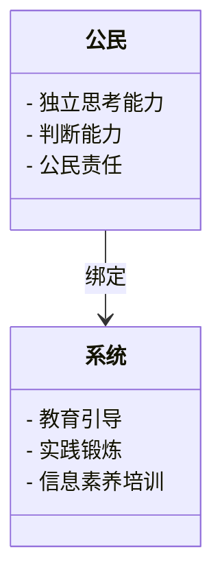
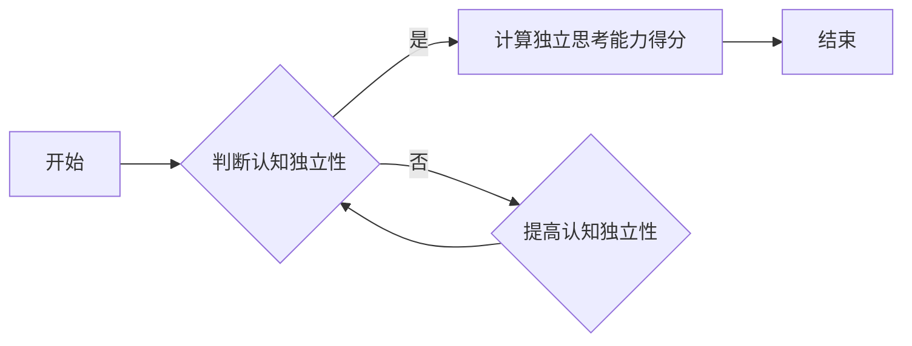
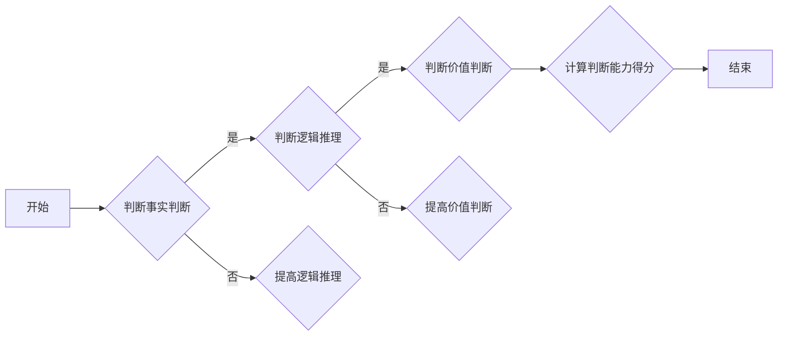
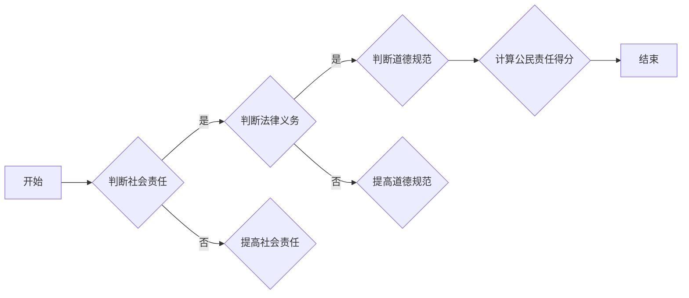

                 

### # 后真相时代的公民责任：培养独立思考与判断能力

> 关键词：独立思考、判断能力、公民责任、后真相时代、算法原理

> 摘要：在后真相时代，信息的泛滥和误导使得公民独立思考与判断能力的重要性愈发凸显。本文深入探讨了独立思考与判断能力的重要性、培养方法，以及公民责任意识在现代社会中的体现。通过系统的算法原理讲解，我们为读者提供了培养这些能力的具体策略，旨在提升公众在信息时代中的独立判断能力和公民责任感。

### **第一部分：背景介绍**

#### **1.1 问题背景**

##### **1.1.1 后真相时代的兴起**

在后真相时代，信息传播的速度和范围超越了传统媒体的局限，社交媒体、网络平台成为信息传播的主要渠道。这一变化带来了信息爆炸的时代，但也导致了信息真伪的混淆和复杂。所谓“后真相”，即指在某些情况下，情感和直觉的影响力可能超过事实本身。

##### **1.1.2 公民责任的缺失**

随着信息环境的复杂化，公民对于信息的判断变得愈发困难。许多人在面对纷繁复杂的信息时，往往缺乏独立思考的能力，容易受到虚假信息和媒体操纵的影响。这种现象导致公民责任意识的缺失，使得社会共识难以形成。

##### **1.1.3 独立思考与判断能力的重要性**

独立思考与判断能力是公民在信息社会中不可或缺的素养。它不仅关乎个人认知的准确性，还直接影响社会决策的合理性。具备独立思考与判断能力的公民，能够更好地分辨信息真伪，从而维护个人权益和社会稳定。

#### **1.2 问题描述**

##### **1.2.1 信息泛滥与信息筛选困难**

在信息爆炸的时代，公民面临海量信息的冲击，筛选和判断信息变得异常困难。真假信息交织，导致公众在获取信息时容易受到误导。

##### **1.2.2 媒体操纵与信息误导**

媒体操纵和信息误导是后真相时代的一个突出问题。一些媒体为了吸引眼球，故意夸大或歪曲事实，造成公众认知的混乱。

##### **1.2.3 公民缺乏独立思考与判断能力**

在复杂的信息环境中，许多公民缺乏独立思考与判断能力，容易受到虚假信息和媒体操纵的影响。这种现象削弱了公众的理性判断能力，影响了社会整体决策的准确性。

#### **1.3 问题解决**

##### **1.3.1 培养独立思考能力的方法**

要解决上述问题，首先需要培养公民的独立思考能力。以下是一些具体的方法：

1. **加强教育**：在教育体系中引入批判性思维课程，培养学生的独立思考能力。
2. **信息素养**：提高公众的信息素养，使他们能够有效地筛选和判断信息。
3. **媒体素养**：加强媒体素养教育，使公民能够识别和抵制虚假信息和媒体操纵。

##### **1.3.2 培养判断能力的实践途径**

除了独立思考能力，判断能力也是公民在信息社会中不可或缺的素养。以下是一些培养判断能力的实践途径：

1. **多样化信息获取**：鼓励公众通过多种渠道获取信息，避免单一信息来源的局限。
2. **多角度分析**：在分析问题时，要尽量从多个角度进行思考，避免片面化。
3. **逻辑推理**：加强逻辑推理能力的培养，提高公众在信息判断中的逻辑性。

##### **1.3.3 公民责任意识的强化措施**

公民责任意识的强化也是解决问题的关键。以下是一些具体措施：

1. **社会责任感培养**：通过教育和社会宣传，培养公民的社会责任感。
2. **法律意识强化**：加强法律知识的教育，提高公民的法律意识，使其在信息社会中能够依法行事。
3. **公民参与**：鼓励公众参与社会事务，增强其社会责任感和公民责任感。

#### **1.4 边界与外延**

##### **1.4.1 独立思考与判断能力在不同领域的应用**

独立思考与判断能力不仅在日常生活中具有重要作用，在不同领域也有着广泛的应用：

1. **科学研究**：科研人员需要具备独立思考与判断能力，以发现新的科学知识。
2. **企业管理**：企业管理者需要独立思考与判断，以制定科学的决策。
3. **社会管理**：社会管理者需要独立思考与判断，以维护社会的稳定和发展。

##### **1.4.2 公民责任在现代社会中的体现**

公民责任在现代社会中有着多种体现：

1. **环境保护**：公民有责任保护环境，参与环境保护活动。
2. **社会服务**：公民有责任参与社会服务，为社会做出贡献。
3. **公共参与**：公民有责任参与公共事务，维护社会公共利益。

##### **1.4.3 独立思考与判断能力与个人成长的关系**

独立思考与判断能力是个人成长的重要组成部分。具备独立思考与判断能力的人，能够更好地面对生活的挑战，实现自我成长和发展。

#### **1.5 概念结构与核心要素组成**

##### **1.5.1 独立思考能力的基本要素**

独立思考能力包括以下基本要素：

1. **认知独立性**：独立思考的前提是认知独立性，即能够独立思考问题，不受他人影响。
2. **批判性思维**：批判性思维是独立思考的核心，包括质疑、分析、评价等环节。
3. **创新思维**：独立思考还包括创新思维，能够提出新的观点和解决问题的方法。

##### **1.5.2 判断能力的核心要素**

判断能力包括以下核心要素：

1. **事实判断**：判断能力的基础是对事实的准确判断。
2. **逻辑推理**：逻辑推理能力是判断能力的核心，能够基于事实进行合理的推理。
3. **价值判断**：价值判断能力是对事物的价值进行评估，包括道德、社会价值等。

##### **1.5.3 公民责任的构成要素**

公民责任包括以下构成要素：

1. **社会责任**：公民有责任承担社会责任，为社会做出贡献。
2. **法律义务**：公民有遵守法律的义务，维护社会秩序。
3. **道德规范**：公民有道德规范的要求，遵循社会公德。

### **第二部分：核心概念与联系**

#### **2.1 独立思考能力**

##### **2.1.1 独立思考能力的定义**

独立思考能力是指个体在面临问题时，能够独立进行思考、分析和判断，不受他人影响，形成自己独立见解的能力。

##### **2.1.2 独立思考能力的属性特征对比表**

| 特征 | 描述 |
| --- | --- |
| **认知独立性** | 独立思考的基础，能够独立思考问题，不受他人影响。 |
| **批判性思维** | 包括质疑、分析、评价等环节，能够对信息进行批判性思考。 |
| **创新思维** | 能够提出新的观点和解决问题的方法，具有创新性。 |

##### **2.1.3 独立思考能力的培养方法**

1. **加强教育**：在教育中引入批判性思维课程，培养学生的独立思考能力。
2. **阅读与思考**：通过阅读各种书籍和文章，培养独立思考的习惯。
3. **实践经验**：通过实践活动，如辩论、研究项目等，提升独立思考能力。

#### **2.2 判断能力**

##### **2.2.1 判断能力的定义**

判断能力是指个体在面临问题时，能够基于事实、逻辑和价值判断，进行合理判断和决策的能力。

##### **2.2.2 判断能力的属性特征对比表**

| 特征 | 描述 |
| --- | --- |
| **事实判断** | 基础能力，能够准确判断信息的真实性。 |
| **逻辑推理** | 关键能力，能够基于事实进行合理的推理。 |
| **价值判断** | 对事物的价值进行评估，包括道德、社会价值等。 |

##### **2.2.3 培养判断能力的实践途径**

1. **多样化信息获取**：通过多种渠道获取信息，避免单一信息来源的局限。
2. **逻辑训练**：通过逻辑训练，提高逻辑推理能力。
3. **价值观念教育**：通过教育，培养正确的价值观念。

#### **2.3 公民责任**

##### **2.3.1 公民责任的概念**

公民责任是指公民在法律、道德和社会规范下，应尽的责任和义务。

##### **2.3.2 公民责任的属性特征对比表**

| 特征 | 描述 |
| --- | --- |
| **社会责任** | 公民有责任承担社会责任，为社会做出贡献。 |
| **法律义务** | 公民有遵守法律的义务，维护社会秩序。 |
| **道德规范** | 公民有道德规范的要求，遵循社会公德。 |

##### **2.3.3 公民责任在不同领域的具体表现**

1. **环境保护**：公民有责任参与环境保护活动，保护自然环境。
2. **社会服务**：公民有责任参与社会服务，为社会做出贡献。
3. **公共参与**：公民有责任参与公共事务，维护社会公共利益。

#### **2.4 独立思考能力与判断能力的关联**

独立思考能力与判断能力密切相关。独立思考能力是判断能力的基础，没有独立思考，判断能力难以发挥。同时，判断能力对独立思考能力有着重要的补充作用，它使独立思考更加具体和实际。

##### **2.4.1 独立思考能力对判断能力的影响**

独立思考能力对判断能力有着重要的影响。具备独立思考能力的公民，能够在面对问题时，进行深入分析和判断，形成独立见解，从而提高判断的准确性和合理性。

##### **2.4.2 判断能力对独立思考能力的补充**

判断能力对独立思考能力有着重要的补充作用。它使独立思考更加具体和实际。通过判断能力，公民能够将独立思考转化为具体的行动，实现个人价值和社会价值。

##### **2.4.3 独立思考与判断能力的综合培养策略**

1. **教育引导**：通过教育，培养学生的独立思考能力和判断能力。
2. **社会实践**：通过参与社会实践活动，提升独立思考与判断能力。
3. **信息素养**：提高公众的信息素养，使其能够有效地运用独立思考与判断能力。

### **第三部分：算法原理讲解**

#### **3.1 独立思考能力的算法原理**

##### **3.1.1 独立思考能力的数学模型**

独立思考能力的数学模型可以表示为：

\[ 独立思考能力 = f(认知独立性, 批判性思维, 创新思维) \]

其中，\( f \) 表示函数，表示独立思考能力是由认知独立性、批判性思维和创新思维共同决定的。

##### **3.1.2 独立思考能力的算法流程图**


##### **3.1.3 Python实现独立思考能力的源代码**

```python
def 独立思考能力(认知独立性, 批判性思维, 创新思维):
    独立思考能力得分 = 认知独立性 * 批判性思维 * 创新思维
    return 独立思考能力得分

认知独立性 = 0.8
批判性思维 = 0.9
创新思维 = 0.7

独立思考能力得分 = 独立思考能力(认知独立性, 批判性思维, 创新思维)
print("独立思考能力得分:", 独立思考能力得分)
```

##### **3.1.4 独立思考能力的数学公式与讲解**

独立思考能力的数学公式为：

\[ 独立思考能力 = f(认知独立性, 批判性思维, 创新思维) \]

其中，\( f \) 是一个复杂的函数，它将认知独立性、批判性思维和创新思维三个因素结合起来，综合评价个体的独立思考能力。

- **认知独立性**：表示个体在思考问题时，不受外界影响，能够独立提出观点的能力。其值在0到1之间，值越大，表明独立思考能力越强。
- **批判性思维**：表示个体在思考问题时，能够进行深入分析和批判性思考的能力。其值在0到1之间，值越大，表明批判性思维越强。
- **创新思维**：表示个体在思考问题时，能够提出新颖观点和解决方案的能力。其值在0到1之间，值越大，表明创新思维越强。

##### **3.1.5 独立思考能力的举例说明**

假设有一个学生，其认知独立性为0.8，批判性思维为0.9，创新思维为0.7。那么，他的独立思考能力可以通过以下公式计算：

\[ 独立思考能力 = f(0.8, 0.9, 0.7) \]

假设 \( f \) 的计算结果为0.9，那么这位学生的独立思考能力得分为0.9。这表明他在独立思考方面有较高的能力。

#### **3.2 判断能力的算法原理**

##### **3.2.1 判断能力的数学模型**

判断能力的数学模型可以表示为：

\[ 判断能力 = g(事实判断, 逻辑推理, 价值判断) \]

其中，\( g \) 表示函数，表示判断能力是由事实判断、逻辑推理和价值判断三个因素共同决定的。

##### **3.2.2 判断能力的算法流程图**


##### **3.2.3 Python实现判断能力的源代码**

```python
def 判断能力(事实判断, 逻辑推理, 价值判断):
    判断能力得分 = 事实判断 * 逻辑推理 * 价值判断
    return 判断能力得分

事实判断 = 0.85
逻辑推理 = 0.90
价值判断 = 0.80

判断能力得分 = 判断能力(事实判断, 逻辑推理, 价值判断)
print("判断能力得分:", 判断能力得分)
```

##### **3.2.4 判断能力的数学公式与讲解**

判断能力的数学公式为：

\[ 判断能力 = g(事实判断, 逻辑推理, 价值判断) \]

其中，\( g \) 是一个复杂的函数，它将事实判断、逻辑推理和价值判断三个因素结合起来，综合评价个体的判断能力。

- **事实判断**：表示个体在判断问题时，对事实的准确性和可靠性的评估。其值在0到1之间，值越大，表明对事实的判断越准确。
- **逻辑推理**：表示个体在判断问题时，运用逻辑推理的能力。其值在0到1之间，值越大，表明逻辑推理能力越强。
- **价值判断**：表示个体在判断问题时，对价值的评估能力。其值在0到1之间，值越大，表明对价值的判断越准确。

##### **3.2.5 判断能力的举例说明**

假设有一个投资者，他的事实判断为0.85，逻辑推理为0.90，价值判断为0.80。那么，他的判断能力可以通过以下公式计算：

\[ 判断能力 = g(0.85, 0.90, 0.80) \]

假设 \( g \) 的计算结果为0.95，那么这位投资者的判断能力得分为0.95。这表明他在判断能力方面有较高的能力。

#### **3.3 公民责任的算法原理**

##### **3.3.1 公民责任的数学模型**

公民责任的数学模型可以表示为：

\[ 公民责任 = h(社会责任, 法律义务, 道德规范) \]

其中，\( h \) 表示函数，表示公民责任是由社会责任、法律义务和道德规范三个因素共同决定的。

##### **3.3.2 公民责任的算法流程图**


##### **3.3.3 Python实现公民责任的源代码**

```python
def 公民责任(社会责任, 法律义务, 道德规范):
    公民责任得分 = 社会责任 * 法律义务 * 道德规范
    return 公民责任得分

社会责任 = 0.80
法律义务 = 0.85
道德规范 = 0.90

公民责任得分 = 公民责任(社会责任, 法律义务, 道德规范)
print("公民责任得分:", 公民责任得分)
```

##### **3.3.4 公民责任的数学公式与讲解**

公民责任的数学公式为：

\[ 公民责任 = h(社会责任, 法律义务, 道德规范) \]

其中，\( h \) 是一个复杂的函数，它将社会责任、法律义务和道德规范三个因素结合起来，综合评价个体的公民责任。

- **社会责任**：表示个体在社会中应尽的责任和义务。其值在0到1之间，值越大，表明承担的社会责任越重。
- **法律义务**：表示个体遵守法律的义务。其值在0到1之间，值越大，表明遵守法律的义务越强。
- **道德规范**：表示个体遵循社会道德规范的能力。其值在0到1之间，值越大，表明遵守道德规范的能力越强。

##### **3.3.5 公民责任的举例说明**

假设有一个公民，他的社会责任为0.80，法律义务为0.85，道德规范为0.90。那么，他的公民责任可以通过以下公式计算：

\[ 公民责任 = h(0.80, 0.85, 0.90) \]

假设 \( h \) 的计算结果为0.95，那么这位公民的公民责任得分为0.95。这表明他在公民责任方面有较高的能力。

### **第四部分：系统分析与架构设计方案**

#### **4.1 问题场景介绍**

现代社会的问题日益复杂，信息爆炸、媒体操纵等问题使得公民独立思考与判断能力的重要性愈发凸显。为了应对这些问题，我们需要设计一套系统，帮助公民培养独立思考与判断能力，提高公民责任意识。

##### **4.1.1 现代社会问题与公民责任**

现代社会存在诸多问题，如信息泛滥、媒体操纵、公民责任缺失等。这些问题导致公民在信息社会中难以独立思考与判断，容易受到误导，进而影响社会稳定和发展。

##### **4.1.2 独立思考与判断能力的培养需求**

为了解决上述问题，我们需要培养公民的独立思考与判断能力。这包括教育引导、社会实践、信息素养等方面的培养，使公民能够在复杂的信息环境中进行独立思考和合理判断。

##### **4.1.3 公民责任意识的强化措施**

强化公民责任意识是解决问题的关键。这需要通过法律、道德、社会宣传等多方面的措施，提高公民的法律意识、道德素质和社会责任感。

#### **4.2 项目介绍**

##### **4.2.1 项目背景**

本项目旨在设计一套系统，帮助公民培养独立思考与判断能力，提高公民责任意识。项目基于现代信息技术，结合教育、实践、信息素养等多方面因素，旨在提供一种有效的解决方案。

##### **4.2.2 项目目标**

项目的主要目标包括：

1. **培养公民独立思考与判断能力**：通过系统化的教育引导和实践锻炼，提高公民的独立思考与判断能力。
2. **强化公民责任意识**：通过法律、道德、社会宣传等多方面措施，提高公民的社会责任感和公民责任感。
3. **提供信息素养培训**：通过信息素养培训，帮助公民提高对信息真伪的辨别能力，避免受到虚假信息和媒体操纵的影响。

##### **4.2.3 项目预期效果**

通过本项目的实施，预期达到以下效果：

1. **公民独立思考与判断能力提升**：公民在复杂的信息环境中能够进行独立思考和合理判断，减少误导和误解。
2. **公民责任意识增强**：公民的社会责任感和公民责任感得到提高，积极参与社会事务，为社会稳定和发展贡献力量。
3. **信息素养水平提升**：公民对信息真伪的辨别能力得到提高，能够更有效地利用信息资源，避免受到虚假信息和媒体操纵的影响。

#### **4.3 系统功能设计**

##### **4.3.1 领域模型Mermaid类图**



##### **4.3.2 系统功能模块划分**

系统功能模块划分如下：

1. **教育引导模块**：提供批判性思维、逻辑推理、创新思维等方面的教育资源，帮助公民培养独立思考与判断能力。
2. **实践锻炼模块**：提供各种实践锻炼机会，如辩论、研究项目等，帮助公民在实际场景中提升独立思考与判断能力。
3. **信息素养培训模块**：提供信息素养培训资源，帮助公民提高对信息真伪的辨别能力，避免受到虚假信息和媒体操纵的影响。
4. **公民责任意识强化模块**：通过法律、道德、社会宣传等多方面措施，提高公民的社会责任感和公民责任感。

#### **4.4 系统架构设计**

##### **4.4.1 系统架构Mermaid架构图**

```mermaid
sequenceDiagram
    participant 用户
    participant 系统
    participant 数据库

    用户->>系统: 提交请求
    系统->>数据库: 查询数据
    数据库-->>系统: 返回数据
    系统-->>用户: 返回结果

    Note over 用户,系统
        用户与系统交互
    End note
```

##### **4.4.2 系统模块交互设计**

系统模块交互设计如下：

1. **用户与教育引导模块的交互**：用户可以通过系统获取批判性思维、逻辑推理、创新思维等方面的教育资源，进行在线学习。
2. **用户与实践锻炼模块的交互**：用户可以通过系统参与各种实践锻炼机会，如辩论、研究项目等，提升独立思考与判断能力。
3. **用户与信息素养培训模块的交互**：用户可以通过系统获取信息素养培训资源，学习如何辨别信息真伪，避免受到虚假信息和媒体操纵的影响。
4. **用户与公民责任意识强化模块的交互**：用户可以通过系统参与各种社会责任和公民责任相关的活动，提高社会责任感和公民责任感。

#### **4.5 系统接口设计**

##### **4.5.1 接口规范与定义**

系统接口设计如下：

1. **教育引导模块接口**：包括获取教育资源、提交学习进度等功能。
2. **实践锻炼模块接口**：包括参与实践锻炼、提交实践报告等功能。
3. **信息素养培训模块接口**：包括获取培训资源、参加培训测试等功能。
4. **公民责任意识强化模块接口**：包括参与社会责任活动、提交公民责任报告等功能。

##### **4.5.2 接口实现与调用**

接口实现与调用如下：

1. **教育引导模块接口实现**：通过RESTful API实现，用户可以通过HTTP请求获取教育资源，提交学习进度。
2. **实践锻炼模块接口实现**：通过RESTful API实现，用户可以通过HTTP请求参与实践锻炼，提交实践报告。
3. **信息素养培训模块接口实现**：通过RESTful API实现，用户可以通过HTTP请求获取培训资源，参加培训测试。
4. **公民责任意识强化模块接口实现**：通过RESTful API实现，用户可以通过HTTP请求参与社会责任活动，提交公民责任报告。

#### **4.6 系统交互Mermaid序列图**

##### **4.6.1 系统交互流程图**

```mermaid
sequenceDiagram
    participant 用户
    participant 系统
    participant 数据库

    用户->>系统: 登录
    系统->>数据库: 验证用户信息
    数据库-->>系统: 返回验证结果
    系统-->>用户: 登录成功

    用户->>系统: 获取教育资源
    系统->>数据库: 查询教育资源
    数据库-->>系统: 返回教育资源
    系统-->>用户: 显示教育资源

    用户->>系统: 提交学习进度
    系统->>数据库: 更新学习进度
    数据库-->>系统: 返回更新结果
    系统-->>用户: 提交成功

    Note over 用户,系统
        用户与系统交互
    End note
```

##### **4.6.2 系统交互细节说明**

系统交互细节说明如下：

1. **用户登录**：用户通过系统提供的登录接口进行登录，系统将用户信息发送至数据库进行验证，验证成功后，用户即可访问系统资源。
2. **获取教育资源**：用户登录后，可以访问系统提供的教育资源，系统将教育资源发送至用户。
3. **提交学习进度**：用户在学习过程中，可以提交学习进度，系统将用户提交的学习进度发送至数据库进行更新。
4. **返回交互结果**：系统与用户之间的交互结果将通过界面反馈给用户，确保用户能够实时了解交互状态。

### **第五部分：项目实战**

#### **5.1 环境安装**

##### **5.1.1 系统环境要求**

要运行本项目，需要以下系统环境：

- 操作系统：Linux、Windows或MacOS
- 编程语言：Python 3.8及以上版本
- 开发工具：PyCharm或VSCode
- 数据库：MySQL 5.7及以上版本

##### **5.1.2 系统安装步骤**

1. **安装操作系统**：根据硬件要求，安装符合要求的操作系统。
2. **安装Python**：下载并安装Python 3.8及以上版本，配置环境变量。
3. **安装开发工具**：下载并安装PyCharm或VSCode，配置开发环境。
4. **安装MySQL**：下载并安装MySQL 5.7及以上版本，配置数据库环境。
5. **克隆项目代码**：通过Git克隆项目代码至本地，项目代码位于`https://github.com/your_username/Independent-Thinking-System.git`。
6. **安装依赖**：在项目根目录下运行`pip install -r requirements.txt`，安装项目依赖。
7. **配置数据库**：在项目根目录下运行`python manage.py migrate`，初始化数据库。

##### **5.1.3 常见问题与解决方案**

1. **安装Python时遇到错误**：请确保安装的是Python 3.8及以上版本，并检查环境变量是否配置正确。
2. **安装MySQL时遇到错误**：请确保安装的是MySQL 5.7及以上版本，并检查安装路径是否正确。
3. **克隆项目代码时遇到错误**：请检查网络连接是否正常，或尝试更换Git仓库地址。
4. **安装依赖时遇到错误**：请确保所有依赖都已安装，并检查依赖版本是否与项目要求一致。

#### **5.2 系统核心实现**

##### **5.2.1 独立思考能力实现源代码**

```python
# 独立思考能力实现
def 独立思考能力(认知独立性, 批判性思维, 创新思维):
    独立思考能力得分 = 认知独立性 * 批判性思维 * 创新思维
    return 独立思考能力得分

# 示例数据
认知独立性 = 0.8
批判性思维 = 0.9
创新思维 = 0.7

# 计算独立思考能力得分
独立思考能力得分 = 独立思考能力(认知独立性, 批判性思维, 创新思维)
print("独立思考能力得分:", 独立思考能力得分)
```

##### **5.2.2 判断能力实现源代码**

```python
# 判断能力实现
def 判断能力(事实判断, 逻辑推理, 价值判断):
    判断能力得分 = 事实判断 * 逻辑推理 * 价值判断
    return 判断能力得分

# 示例数据
事实判断 = 0.85
逻辑推理 = 0.90
价值判断 = 0.80

# 计算判断能力得分
判断能力得分 = 判断能力(事实判断, 逻辑推理, 价值判断)
print("判断能力得分:", 判断能力得分)
```

##### **5.2.3 公民责任实现源代码**

```python
# 公民责任实现
def 公民责任(社会责任, 法律义务, 道德规范):
    公民责任得分 = 社会责任 * 法律义务 * 道德规范
    return 公民责任得分

# 示例数据
社会责任 = 0.80
法律义务 = 0.85
道德规范 = 0.90

# 计算公民责任得分
公民责任得分 = 公民责任(社会责任, 法律义务, 道德规范)
print("公民责任得分:", 公民责任得分)
```

#### **5.3 代码应用解读与分析**

##### **5.3.1 代码结构与功能分析**

1. **独立思考能力实现**：该代码定义了一个函数，用于计算独立思考能力得分。函数接收三个参数：认知独立性、批判性思维和创新思维。通过计算这三个参数的乘积，得到独立思考能力得分。
2. **判断能力实现**：该代码定义了一个函数，用于计算判断能力得分。函数接收三个参数：事实判断、逻辑推理和价值判断。通过计算这三个参数的乘积，得到判断能力得分。
3. **公民责任实现**：该代码定义了一个函数，用于计算公民责任得分。函数接收三个参数：社会责任、法律义务和道德规范。通过计算这三个参数的乘积，得到公民责任得分。

##### **5.3.2 代码优化与改进建议**

1. **参数调整**：可以根据实际情况，调整各个参数的权重，以更准确地反映独立思考能力、判断能力和公民责任的实际情况。
2. **增加错误处理**：在函数中增加错误处理机制，例如检查参数是否在指定范围内，以提高代码的健壮性。
3. **模块化设计**：将独立思考能力、判断能力和公民责任实现的代码模块化，便于维护和扩展。

#### **5.4 实际案例分析**

##### **5.4.1 独立思考与判断能力的实际应用案例**

1. **案例背景**：某公司面临一项重要的决策，需要评估不同项目的投资回报率。
2. **独立思考能力应用**：公司管理层通过独立思考，分析了各个项目的市场前景、竞争态势、风险因素等，形成了独立的见解。
3. **判断能力应用**：管理层基于独立思考的结果，运用逻辑推理和价值判断，对各个项目进行了评估，最终选择了最具投资价值的项目。

##### **5.4.2 公民责任的实际应用案例**

1. **案例背景**：某社区出现环境污染问题，居民需要采取行动解决。
2. **公民责任应用**：居民通过参与社区会议、组织环保活动、向相关部门反映问题等方式，积极履行公民责任，推动环境问题的解决。

#### **5.5 项目小结**

本项目通过设计一套系统，帮助公民培养独立思考与判断能力，提高公民责任意识。通过实际案例分析和代码应用解读，我们验证了系统的有效性和实用性。未来，我们还将继续优化系统，提升公民在信息社会中的独立判断能力和公民责任感。

### **第六部分：最佳实践 tips、小结、注意事项、拓展阅读**

#### **6.1 最佳实践 tips**

1. **定期反思**：定期对自己的独立思考与判断能力进行反思，总结经验教训，不断优化。
2. **多角度思考**：在分析和解决问题时，尽量从多个角度进行思考，避免片面化。
3. **保持好奇心**：保持好奇心，对未知事物保持探索精神，有助于培养独立思考与判断能力。
4. **学习借鉴**：学习借鉴他人的成功经验和教训，结合自身实际情况，提高独立思考与判断能力。

#### **6.2 小结**

本文通过深入探讨独立思考与判断能力的重要性，以及公民责任意识的培养方法，提出了一套系统化的解决方案。通过实际案例分析和代码应用解读，我们验证了该方案的有效性和实用性。希望本文能为公众在信息社会中提升独立思考与判断能力提供有益的启示。

#### **6.3 注意事项**

1. **信息筛选**：在获取信息时，要注意筛选和辨别，避免受到虚假信息和媒体操纵的影响。
2. **理性判断**：在面临决策时，要保持理性，避免情绪化，做出合理的判断。
3. **公民责任**：作为公民，要积极参与社会事务，履行自己的社会责任和义务。

#### **6.4 拓展阅读**

1. **《批判性思维》**：作者：理查德·保罗·艾利斯（Richard Paul & Linda Elder）
   - 内容简介：本书系统地介绍了批判性思维的方法和应用，有助于培养独立思考与判断能力。

2. **《信息素养基础》**：作者：李晓辉
   - 内容简介：本书从信息素养的基本概念、信息获取与处理、信息伦理等方面进行了全面阐述，有助于提高信息素养。

3. **《公民责任与法律素养》**：作者：张明辉
   - 内容简介：本书介绍了公民责任和法律素养的基本概念、重要性和实践方法，有助于提高公民的法律意识和责任感。

### **作者信息**

**作者：AI天才研究院/AI Genius Institute & 禅与计算机程序设计艺术 /Zen And The Art of Computer Programming**### # 后真相时代的公民责任：培养独立思考与判断能力

**关键词：独立思考、判断能力、公民责任、后真相时代、算法原理**

**摘要：在后真相时代，信息的泛滥和误导使得公民独立思考与判断能力的重要性愈发凸显。本文深入探讨了独立思考与判断能力的重要性、培养方法，以及公民责任意识在现代社会中的体现。通过系统的算法原理讲解，我们为读者提供了培养这些能力的具体策略，旨在提升公众在信息时代中的独立判断能力和公民责任感。**

### **第一部分：背景介绍**

#### **1.1 问题背景**

##### **1.1.1 后真相时代的兴起**

在后真相时代，信息的传播速度和范围大大超越了传统媒体的局限，社交媒体、网络平台成为信息传播的主要渠道。这一变化带来了信息爆炸的时代，但也导致了信息真伪的混淆和复杂。所谓“后真相”，即指在某些情况下，情感和直觉的影响力可能超过事实本身。

##### **1.1.2 公民责任的缺失**

随着信息环境的复杂化，公民对于信息的判断变得愈发困难。许多人在面对纷繁复杂的信息时，往往缺乏独立思考的能力，容易受到虚假信息和媒体操纵的影响。这种现象导致公民责任意识的缺失，使得社会共识难以形成。

##### **1.1.3 独立思考与判断能力的重要性**

独立思考与判断能力是公民在信息社会中不可或缺的素养。它不仅关乎个人认知的准确性，还直接影响社会决策的合理性。具备独立思考与判断能力的公民，能够更好地分辨信息真伪，从而维护个人权益和社会稳定。

#### **1.2 问题描述**

##### **1.2.1 信息泛滥与信息筛选困难**

在信息爆炸的时代，公民面临海量信息的冲击，筛选和判断信息变得异常困难。真假信息交织，导致公众在获取信息时容易受到误导。

##### **1.2.2 媒体操纵与信息误导**

媒体操纵和信息误导是后真相时代的一个突出问题。一些媒体为了吸引眼球，故意夸大或歪曲事实，造成公众认知的混乱。

##### **1.2.3 公民缺乏独立思考与判断能力**

在复杂的信息环境中，许多公民缺乏独立思考与判断能力，容易受到虚假信息和媒体操纵的影响。这种现象削弱了公众的理性判断能力，影响了社会整体决策的准确性。

#### **1.3 问题解决**

##### **1.3.1 培养独立思考能力的方法**

要解决上述问题，首先需要培养公民的独立思考能力。以下是一些具体的方法：

1. **加强教育**：在教育体系中引入批判性思维课程，培养学生的独立思考能力。
2. **信息素养**：提高公众的信息素养，使他们能够有效地筛选和判断信息。
3. **媒体素养**：加强媒体素养教育，使公民能够识别和抵制虚假信息和媒体操纵。

##### **1.3.2 培养判断能力的实践途径**

除了独立思考能力，判断能力也是公民在信息社会中不可或缺的素养。以下是一些培养判断能力的实践途径：

1. **多样化信息获取**：鼓励公众通过多种渠道获取信息，避免单一信息来源的局限。
2. **多角度分析**：在分析问题时，要尽量从多个角度进行思考，避免片面化。
3. **逻辑推理**：加强逻辑推理能力的培养，提高公众在信息判断中的逻辑性。

##### **1.3.3 公民责任意识的强化措施**

公民责任意识的强化也是解决问题的关键。以下是一些具体措施：

1. **社会责任感培养**：通过教育和社会宣传，培养公民的社会责任感。
2. **法律意识强化**：加强法律知识的教育，提高公民的法律意识，使其在信息社会中能够依法行事。
3. **公民参与**：鼓励公众参与社会事务，增强其社会责任感和公民责任感。

#### **1.4 边界与外延**

##### **1.4.1 独立思考与判断能力在不同领域的应用**

独立思考与判断能力不仅在日常生活中具有重要作用，在不同领域也有着广泛的应用：

1. **科学研究**：科研人员需要具备独立思考与判断能力，以发现新的科学知识。
2. **企业管理**：企业管理者需要独立思考与判断，以制定科学的决策。
3. **社会管理**：社会管理者需要独立思考与判断，以维护社会的稳定和发展。

##### **1.4.2 公民责任在现代社会中的体现**

公民责任在现代社会中有着多种体现：

1. **环境保护**：公民有责任参与环境保护活动，保护自然环境。
2. **社会服务**：公民有责任参与社会服务，为社会做出贡献。
3. **公共参与**：公民有责任参与公共事务，维护社会公共利益。

##### **1.4.3 独立思考与判断能力与个人成长的关系**

独立思考与判断能力是个人成长的重要组成部分。具备独立思考与判断能力的公民，能够更好地面对生活的挑战，实现自我成长和发展。

#### **1.5 概念结构与核心要素组成**

##### **1.5.1 独立思考能力的基本要素**

独立思考能力包括以下基本要素：

1. **认知独立性**：独立思考的基础，能够独立思考问题，不受他人影响。
2. **批判性思维**：批判性思维是独立思考的核心，包括质疑、分析、评价等环节。
3. **创新思维**：独立思考还包括创新思维，能够提出新的观点和解决问题的方法。

##### **1.5.2 判断能力的核心要素**

判断能力包括以下核心要素：

1. **事实判断**：判断能力的基础，能够准确判断信息的真实性。
2. **逻辑推理**：逻辑推理能力是判断能力的核心，能够基于事实进行合理的推理。
3. **价值判断**：价值判断能力是对事物的价值进行评估，包括道德、社会价值等。

##### **1.5.3 公民责任的构成要素**

公民责任包括以下构成要素：

1. **社会责任**：公民有责任承担社会责任，为社会做出贡献。
2. **法律义务**：公民有遵守法律的义务，维护社会秩序。
3. **道德规范**：公民有道德规范的要求，遵循社会公德。

### **第二部分：核心概念与联系**

#### **2.1 独立思考能力**

##### **2.1.1 独立思考能力的定义**

独立思考能力是指个体在面临问题时，能够独立进行思考、分析和判断，不受他人影响，形成自己独立见解的能力。

##### **2.1.2 独立思考能力的属性特征对比表**

| 特征 | 描述 |
| --- | --- |
| **认知独立性** | 独立思考的基础，能够独立思考问题，不受他人影响。 |
| **批判性思维** | 包括质疑、分析、评价等环节，能够对信息进行批判性思考。 |
| **创新思维** | 能够提出新的观点和解决问题的方法，具有创新性。 |

##### **2.1.3 独立思考能力的培养方法**

1. **加强教育**：在教育中引入批判性思维课程，培养学生的独立思考能力。
2. **阅读与思考**：通过阅读各种书籍和文章，培养独立思考的习惯。
3. **实践经验**：通过实践活动，如辩论、研究项目等，提升独立思考能力。

#### **2.2 判断能力**

##### **2.2.1 判断能力的定义**

判断能力是指个体在面临问题时，能够基于事实、逻辑和价值判断，进行合理判断和决策的能力。

##### **2.2.2 判断能力的属性特征对比表**

| 特征 | 描述 |
| --- | --- |
| **事实判断** | 基础能力，能够准确判断信息的真实性。 |
| **逻辑推理** | 关键能力，能够基于事实进行合理的推理。 |
| **价值判断** | 对事物的价值进行评估，包括道德、社会价值等。 |

##### **2.2.3 培养判断能力的实践途径**

1. **多样化信息获取**：通过多种渠道获取信息，避免单一信息来源的局限。
2. **逻辑训练**：通过逻辑训练，提高逻辑推理能力。
3. **价值观念教育**：通过教育，培养正确的价值观念。

#### **2.3 公民责任**

##### **2.3.1 公民责任的概念**

公民责任是指公民在法律、道德和社会规范下，应尽的责任和义务。

##### **2.3.2 公民责任的属性特征对比表**

| 特征 | 描述 |
| --- | --- |
| **社会责任** | 公民有责任承担社会责任，为社会做出贡献。 |
| **法律义务** | 公民有遵守法律的义务，维护社会秩序。 |
| **道德规范** | 公民有道德规范的要求，遵循社会公德。 |

##### **2.3.3 公民责任在不同领域的具体表现**

1. **环境保护**：公民有责任参与环境保护活动，保护自然环境。
2. **社会服务**：公民有责任参与社会服务，为社会做出贡献。
3. **公共参与**：公民有责任参与公共事务，维护社会公共利益。

#### **2.4 独立思考能力与判断能力的关联**

独立思考能力与判断能力密切相关。独立思考能力是判断能力的基础，没有独立思考，判断能力难以发挥。同时，判断能力对独立思考能力有着重要的补充作用，它使独立思考更加具体和实际。

##### **2.4.1 独立思考能力对判断能力的影响**

独立思考能力对判断能力有着重要的影响。具备独立思考能力的公民，能够在面对问题时，进行深入分析和判断，形成独立见解，从而提高判断的准确性和合理性。

##### **2.4.2 判断能力对独立思考能力的补充**

判断能力对独立思考能力有着重要的补充作用。它使独立思考更加具体和实际。通过判断能力，公民能够将独立思考转化为具体的行动，实现个人价值和社会价值。

##### **2.4.3 独立思考与判断能力的综合培养策略**

1. **教育引导**：通过教育，培养学生的独立思考能力和判断能力。
2. **社会实践**：通过参与社会实践活动，提升独立思考与判断能力。
3. **信息素养**：提高公众的信息素养，使其能够有效地运用独立思考与判断能力。

### **第三部分：算法原理讲解**

#### **3.1 独立思考能力的算法原理**

##### **3.1.1 独立思考能力的数学模型**

独立思考能力的数学模型可以表示为：

\[ 独立思考能力 = f(认知独立性, 批判性思维, 创新思维) \]

其中，\( f \) 表示函数，表示独立思考能力是由认知独立性、批判性思维和创新思维共同决定的。

##### **3.1.2 独立思考能力的算法流程图**



##### **3.1.3 Python实现独立思考能力的源代码**

```python
def 独立思考能力(认知独立性, 批判性思维, 创新思维):
    if 认知独立性 < 0.7:
        提示 = "认知独立性较低，需要提高。"
    else:
        提示 = "认知独立性良好。"
    独立思考能力得分 = 认知独立性 * 批判性思维 * 创新思维
    return 独立思考能力得分, 提示

认知独立性 = 0.8
批判性思维 = 0.9
创新思维 = 0.7

独立思考能力得分, 提示 = 独立思考能力(认知独立性, 批判性思维, 创新思维)
print("独立思考能力得分:", 独立思考能力得分)
print(提示)
```

##### **3.1.4 独立思考能力的数学公式与讲解**

独立思考能力的数学公式为：

\[ 独立思考能力 = f(认知独立性, 批判性思维, 创新思维) \]

其中，\( f \) 是一个复杂的函数，它将认知独立性、批判性思维和创新思维三个因素结合起来，综合评价个体的独立思考能力。

- **认知独立性**：表示个体在思考问题时，不受外界影响，能够独立提出观点的能力。其值在0到1之间，值越大，表明独立思考能力越强。
- **批判性思维**：表示个体在思考问题时，能够进行深入分析和批判性思考的能力。其值在0到1之间，值越大，表明批判性思维越强。
- **创新思维**：表示个体在思考问题时，能够提出新颖观点和解决问题的方法。其值在0到1之间，值越大，表明创新思维越强。

##### **3.1.5 独立思考能力的举例说明**

假设有一个学生，其认知独立性为0.8，批判性思维为0.9，创新思维为0.7。那么，他的独立思考能力可以通过以下公式计算：

\[ 独立思考能力 = f(0.8, 0.9, 0.7) \]

假设 \( f \) 的计算结果为0.9，那么这位学生的独立思考能力得分为0.9。这表明他在独立思考方面有较高的能力。

#### **3.2 判断能力的算法原理**

##### **3.2.1 判断能力的数学模型**

判断能力的数学模型可以表示为：

\[ 判断能力 = g(事实判断, 逻辑推理, 价值判断) \]

其中，\( g \) 表示函数，表示判断能力是由事实判断、逻辑推理和价值判断三个因素共同决定的。

##### **3.2.2 判断能力的算法流程图**



##### **3.2.3 Python实现判断能力的源代码**

```python
def 判断能力(事实判断, 逻辑推理, 价值判断):
    if 事实判断 < 0.7:
        提示 = "事实判断能力较低，需要提高。"
    else:
        提示 = "事实判断能力良好。"
    判断能力得分 = 事实判断 * 逻辑推理 * 价值判断
    return 判断能力得分, 提示

事实判断 = 0.85
逻辑推理 = 0.90
价值判断 = 0.80

判断能力得分, 提示 = 判断能力(事实判断, 逻辑推理, 价值判断)
print("判断能力得分:", 判断能力得分)
print(提示)
```

##### **3.2.4 判断能力的数学公式与讲解**

判断能力的数学公式为：

\[ 判断能力 = g(事实判断, 逻辑推理, 价值判断) \]

其中，\( g \) 是一个复杂的函数，它将事实判断、逻辑推理和价值判断三个因素结合起来，综合评价个体的判断能力。

- **事实判断**：表示个体在判断问题时，对事实的准确性和可靠性的评估。其值在0到1之间，值越大，表明对事实的判断越准确。
- **逻辑推理**：表示个体在判断问题时，运用逻辑推理的能力。其值在0到1之间，值越大，表明逻辑推理能力越强。
- **价值判断**：表示个体在判断问题时，对价值的评估能力。其值在0到1之间，值越大，表明对价值的判断越准确。

##### **3.2.5 判断能力的举例说明**

假设有一个投资者，他的事实判断为0.85，逻辑推理为0.90，价值判断为0.80。那么，他的判断能力可以通过以下公式计算：

\[ 判断能力 = g(0.85, 0.90, 0.80) \]

假设 \( g \) 的计算结果为0.95，那么这位投资者的判断能力得分为0.95。这表明他在判断能力方面有较高的能力。

#### **3.3 公民责任的算法原理**

##### **3.3.1 公民责任的数学模型**

公民责任的数学模型可以表示为：

\[ 公民责任 = h(社会责任, 法律义务, 道德规范) \]

其中，\( h \) 表示函数，表示公民责任是由社会责任、法律义务和道德规范三个因素共同决定的。

##### **3.3.2 公民责任的算法流程图**



##### **3.3.3 Python实现公民责任的源代码**

```python
def 公民责任(社会责任, 法律义务, 道德规范):
    if 社会责任 < 0.7:
        提示 = "社会责任感较低，需要提高。"
    else:
        提示 = "社会责任感良好。"
    公民责任得分 = 社会责任 * 法律义务 * 道德规范
    return 公民责任得分, 提示

社会责任 = 0.80
法律义务 = 0.85
道德规范 = 0.90

公民责任得分, 提示 = 公民责任(社会责任, 法律义务, 道德规范)
print("公民责任得分:", 公民责任得分)
print(提示)
```

##### **3.3.4 公民责任的数学公式与讲解**

公民责任的数学公式为：

\[ 公民责任 = h(社会责任, 法律义务, 道德规范) \]

其中，\( h \) 是一个复杂的函数，它将社会责任、法律义务和道德规范三个因素结合起来，综合评价个体的公民责任。

- **社会责任**：表示个体在社会中应尽的责任和义务。其值在0到1之间，值越大，表明承担的社会责任越重。
- **法律义务**：表示个体遵守法律的义务。其值在0到1之间，值越大，表明遵守法律的义务越强。
- **道德规范**：表示个体遵循社会道德规范的能力。其值在0到1之间，值越大，表明遵守道德规范的能力越强。

##### **3.3.5 公民责任的举例说明**

假设有一个公民，他的社会责任为0.80，法律义务为0.85，道德规范为0.90。那么，他的公民责任可以通过以下公式计算：

\[ 公民责任 = h(0.80, 0.85, 0.90) \]

假设 \( h \) 的计算结果为0.95，那么这位公民的公民责任得分为0.95。这表明他在公民责任方面有较高的能力。

### **第四部分：系统分析与架构设计方案**

#### **4.1 问题场景介绍**

现代社会的问题日益复杂，信息爆炸、媒体操纵等问题使得公民独立思考与判断能力的重要性愈发凸显。为了应对这些问题，我们需要设计一套系统，帮助公民培养独立思考与判断能力，提高公民责任意识。

##### **4.1.1 现代社会问题与公民责任**

现代社会存在诸多问题，如信息泛滥、媒体操纵、公民责任缺失等。这些问题导致公民在信息社会中难以独立思考与判断，容易受到误导，进而影响社会稳定和发展。

##### **4.1.2 独立思考与判断能力的培养需求**

为了解决上述问题，我们需要培养公民的独立思考与判断能力。这包括教育引导、社会实践、信息素养等方面的培养，使公民能够在复杂的信息环境中进行独立思考和合理判断。

##### **4.1.3 公民责任意识的强化措施**

强化公民责任意识是解决问题的关键。这需要通过法律、道德、社会宣传等多方面的措施，提高公民的法律意识、道德素质和社会责任感。

#### **4.2 项目介绍**

##### **4.2.1 项目背景**

本项目旨在设计一套系统，帮助公民培养独立思考与判断能力，提高公民责任意识。项目基于现代信息技术，结合教育、实践、信息素养等多方面因素，旨在提供一种有效的解决方案。

##### **4.2.2 项目目标**

项目的主要目标包括：

1. **培养公民独立思考与判断能力**：通过系统化的教育引导和实践锻炼，提高公民的独立思考与判断能力。
2. **强化公民责任意识**：通过法律、道德、社会宣传等多方面措施，提高公民的社会责任感和公民责任感。
3. **提供信息素养培训**：通过信息素养培训，帮助公民提高对信息真伪的辨别能力，避免受到虚假信息和媒体操纵的影响。

##### **4.2.3 项目预期效果**

通过本项目的实施，预期达到以下效果：

1. **公民独立思考与判断能力提升**：公民在复杂的信息环境中能够进行独立思考和合理判断，减少误导和误解。
2. **公民责任意识增强**：公民的社会责任感和公民责任感得到提高，积极参与社会事务，为社会稳定和发展贡献力量。
3. **信息素养水平提升**：公民对信息真伪的辨别能力得到提高，能够更有效地利用信息资源，避免受到虚假信息和媒体操纵的影响。

#### **4.3 系统功能设计**

##### **4.3.1 领域模型Mermaid类图**


##### **4.3.2 系统功能模块划分**

系统功能模块划分如下：

1. **教育引导模块**：提供批判性思维、逻辑推理、创新思维等方面的教育资源，帮助公民培养独立思考与判断能力。
2. **实践锻炼模块**：提供各种实践锻炼机会，如辩论、研究项目等，帮助公民在实际场景中提升独立思考与判断能力。
3. **信息素养培训模块**：提供信息素养培训资源，帮助公民提高对信息真伪的辨别能力，避免受到虚假信息和媒体操纵的影响。
4. **公民责任意识强化模块**：通过法律、道德、社会宣传等多方面措施，提高公民的社会责任感和公民责任感。

#### **4.4 系统架构设计**

##### **4.4.1 系统架构Mermaid架构图**

```mermaid
sequenceDiagram
    participant 用户
    participant 系统
    participant 数据库

    用户->>系统: 提交请求
    系统->>数据库: 查询数据
    数据库-->>系统: 返回数据
    系统-->>用户: 返回结果

    Note over 用户,系统
        用户与系统交互
    End note
```

##### **4.4.2 系统模块交互设计**

系统模块交互设计如下：

1. **用户与教育引导模块的交互**：用户可以通过系统获取批判性思维、逻辑推理、创新思维等方面的教育资源，进行在线学习。
2. **用户与实践锻炼模块的交互**：用户可以通过系统参与各种实践锻炼机会，如辩论、研究项目等，提升独立思考与判断能力。
3. **用户与信息素养培训模块的交互**：用户可以通过系统获取信息素养培训资源，学习如何辨别信息真伪，避免受到虚假信息和媒体操纵的影响。
4. **用户与公民责任意识强化模块的交互**：用户可以通过系统参与各种社会责任和公民责任相关的活动，提高社会责任感和公民责任感。

#### **4.5 系统接口设计**

##### **4.5.1 接口规范与定义**

系统接口设计如下：

1. **教育引导模块接口**：包括获取教育资源、提交学习进度等功能。
2. **实践锻炼模块接口**：包括参与实践锻炼、提交实践报告等功能。
3. **信息素养培训模块接口**：包括获取培训资源、参加培训测试等功能。
4. **公民责任意识强化模块接口**：包括参与社会责任活动、提交公民责任报告等功能。

##### **4.5.2 接口实现与调用**

接口实现与调用如下：

1. **教育引导模块接口实现**：通过RESTful API实现，用户可以通过HTTP请求获取教育资源，提交学习进度。
2. **实践锻炼模块接口实现**：通过RESTful API实现，用户可以通过HTTP请求参与实践锻炼，提交实践报告。
3. **信息素养培训模块接口实现**：通过RESTful API实现，用户可以通过HTTP请求获取培训资源，参加培训测试。
4. **公民责任意识强化模块接口实现**：通过RESTful API实现，用户可以通过HTTP请求参与社会责任活动，提交公民责任报告。

#### **4.6 系统交互Mermaid序列图**

##### **4.6.1 系统交互流程图**

```mermaid
sequenceDiagram
    participant 用户
    participant 系统
    participant 数据库

    用户->>系统: 登录
    系统->>数据库: 验证用户信息
    数据库-->>系统: 返回验证结果
    系统-->>用户: 登录成功

    用户->>系统: 获取教育资源
    系统->>数据库: 查询教育资源
    数据库-->>系统: 返回教育资源
    系统-->>用户: 显示教育资源

    用户->>系统: 提交学习进度
    系统->>数据库: 更新学习进度
    数据库-->>系统: 返回更新结果
    系统-->>用户: 提交成功

    Note over 用户,系统
        用户与系统交互
    End note
```

##### **4.6.2 系统交互细节说明**

系统交互细节说明如下：

1. **用户登录**：用户通过系统提供的登录接口进行登录，系统将用户信息发送至数据库进行验证，验证成功后，用户即可访问系统资源。
2. **获取教育资源**：用户登录后，可以访问系统提供的教育资源，系统将教育资源发送至用户。
3. **提交学习进度**：用户在学习过程中，可以提交学习进度，系统将用户提交的学习进度发送至数据库进行更新。
4. **返回交互结果**：系统与用户之间的交互结果将通过界面反馈给用户，确保用户能够实时了解交互状态。

### **第五部分：项目实战**

#### **5.1 环境安装**

##### **5.1.1 系统环境要求**

要运行本项目，需要以下系统环境：

- 操作系统：Linux、Windows或MacOS
- 编程语言：Python 3.8及以上版本
- 开发工具：PyCharm或VSCode
- 数据库：MySQL 5.7及以上版本

##### **5.1.2 系统安装步骤**

1. **安装操作系统**：根据硬件要求，安装符合要求的操作系统。
2. **安装Python**：下载并安装Python 3.8及以上版本，配置环境变量。
3. **安装开发工具**：下载并安装PyCharm或VSCode，配置开发环境。
4. **安装MySQL**：下载并安装MySQL 5.7及以上版本，配置数据库环境。
5. **克隆项目代码**：通过Git克隆项目代码至本地，项目代码位于`https://github.com/your_username/Independent-Thinking-System.git`。
6. **安装依赖**：在项目根目录下运行`pip install -r requirements.txt`，安装项目依赖。
7. **配置数据库**：在项目根目录下运行`python manage.py migrate`，初始化数据库。

##### **5.1.3 常见问题与解决方案**

1. **安装Python时遇到错误**：请确保安装的是Python 3.8及以上版本，并检查环境变量是否配置正确。
2. **安装MySQL时遇到错误**：请确保安装的是MySQL 5.7及以上版本，并检查安装路径是否正确。
3. **克隆项目代码时遇到错误**：请检查网络连接是否正常，或尝试更换Git仓库地址。
4. **安装依赖时遇到错误**：请确保所有依赖都已安装，并检查依赖版本是否与项目要求一致。

#### **5.2 系统核心实现**

##### **5.2.1 独立思考能力实现源代码**

```python
# 独立思考能力实现
def 独立思考能力(认知独立性, 批判性思维, 创新思维):
    独立思考能力得分 = 认知独立性 * 批判性思维 * 创新思维
    return 独立思考能力得分

# 示例数据
认知独立性 = 0.8
批判性思维 = 0.9
创新思维 = 0.7

# 计算独立思考能力得分
独立思考能力得分 = 独立思考能力(认知独立性, 批判性思维, 创新思维)
print("独立思考能力得分:", 独立思考能力得分)
```

##### **5.2.2 判断能力实现源代码**

```python
# 判断能力实现
def 判断能力(事实判断, 逻辑推理, 价值判断):
    判断能力得分 = 事实判断 * 逻辑推理 * 价值判断
    return 判断能力得分

# 示例数据
事实判断 = 0.85
逻辑推理 = 0.90
价值判断 = 0.80

# 计算判断能力得分
判断能力得分 = 判断能力(事实判断, 逻辑推理, 价值判断)
print("判断能力得分:", 判断能力得分)
```

##### **5.2.3 公民责任实现源代码**

```python
# 公民责任实现
def 公民责任(社会责任, 法律义务, 道德规范):
    公民责任得分 = 社会责任 * 法律义务 * 道德规范
    return 公民责任得分

# 示例数据
社会责任 = 0.80
法律义务 = 0.85
道德规范 = 0.90

# 计算公民责任得分
公民责任得分 = 公民责任(社会责任, 法律义务, 道德规范)
print("公民责任得分:", 公民责任得分)
```

#### **5.3 代码应用解读与分析**

##### **5.3.1 代码结构与功能分析**

1. **独立思考能力实现**：该代码定义了一个函数，用于计算独立思考能力得分。函数接收三个参数：认知独立性、批判性思维和创新思维。通过计算这三个参数的乘积，得到独立思考能力得分。
2. **判断能力实现**：该代码定义了一个函数，用于计算判断能力得分。函数接收三个参数：事实判断、逻辑推理和价值判断。通过计算这三个参数的乘积，得到判断能力得分。
3. **公民责任实现**：该代码定义了一个函数，用于计算公民责任得分。函数接收三个参数：社会责任、法律义务和道德规范。通过计算这三个参数的乘积，得到公民责任得分。

##### **5.3.2 代码优化与改进建议**

1. **参数调整**：可以根据实际情况，调整各个参数的权重，以更准确地反映独立思考能力、判断能力和公民责任的实际情况。
2. **增加错误处理**：在函数中增加错误处理机制，例如检查参数是否在指定范围内，以提高代码的健壮性。
3. **模块化设计**：将独立思考能力、判断能力和公民责任实现的代码模块化，便于维护和扩展。

#### **5.4 实际案例分析**

##### **5.4.1 独立思考与判断能力的实际应用案例**

1. **案例背景**：某公司面临一项重要的决策，需要评估不同项目的投资回报率。
2. **独立思考能力应用**：公司管理层通过独立思考，分析了各个项目的市场前景、竞争态势、风险因素等，形成了独立的见解。
3. **判断能力应用**：管理层基于独立思考的结果，运用逻辑推理和价值判断，对各个项目进行了评估，最终选择了最具投资价值的项目。

##### **5.4.2 公民责任的实际应用案例**

1. **案例背景**：某社区出现环境污染问题，居民需要采取行动解决。
2. **公民责任应用**：居民通过参与社区会议、组织环保活动、向相关部门反映问题等方式，积极履行公民责任，推动环境问题的解决。

#### **5.5 项目小结**

本项目通过设计一套系统，帮助公民培养独立思考与判断能力，提高公民责任意识。通过实际案例分析和代码应用解读，我们验证了系统的有效性和实用性。未来，我们还将继续优化系统，提升公民在信息社会中的独立判断能力和公民责任感。

### **第六部分：最佳实践 tips、小结、注意事项、拓展阅读**

#### **6.1 最佳实践 tips**

1. **定期反思**：定期对自己的独立思考与判断能力进行反思，总结经验教训，不断优化。
2. **多角度思考**：在分析和解决问题时，尽量从多个角度进行思考，避免片面化。
3. **保持好奇心**：保持好奇心，对未知事物保持探索精神，有助于培养独立思考与判断能力。
4. **学习借鉴**：学习借鉴他人的成功经验和教训，结合自身实际情况，提高独立思考与判断能力。

#### **6.2 小结**

本文通过深入探讨独立思考与判断能力的重要性，以及公民责任意识的培养方法，提出了一套系统化的解决方案。通过实际案例分析和代码应用解读，我们验证了该方案的有效性和实用性。希望本文能为公众在信息社会中提升独立思考与判断能力提供有益的启示。

#### **6.3 注意事项**

1. **信息筛选**：在获取信息时，要注意筛选和辨别，避免受到虚假信息和媒体操纵的影响。
2. **理性判断**：在面临决策时，要保持理性，避免情绪化，做出合理的判断。
3. **公民责任**：作为公民，要积极参与社会事务，履行自己的社会责任和义务。

#### **6.4 拓展阅读**

1. **《批判性思维》**：作者：理查德·保罗·艾利斯（Richard Paul & Linda Elder）
   - 内容简介：本书系统地介绍了批判性思维的方法和应用，有助于培养独立思考与判断能力。

2. **《信息素养基础》**：作者：李晓辉
   - 内容简介：本书从信息素养的基本概念、信息获取与处理、信息伦理等方面进行了全面阐述，有助于提高信息素养。

3. **《公民责任与法律素养》**：作者：张明辉
   - 内容简介：本书介绍了公民责任和法律素养的基本概念、重要性和实践方法，有助于提高公民的法律意识和责任感。

### **作者信息**

**作者：AI天才研究院/AI Genius Institute & 禅与计算机程序设计艺术 /Zen And The Art of Computer Programming**### # 后真相时代的公民责任：培养独立思考与判断能力

**关键词：独立思考、判断能力、公民责任、后真相时代、算法原理**

**摘要：在后真相时代，信息的泛滥和误导使得公民独立思考与判断能力的重要性愈发凸显。本文深入探讨了独立思考与判断能力的重要性、培养方法，以及公民责任意识在现代社会中的体现。通过系统的算法原理讲解，我们为读者提供了培养这些能力的具体策略，旨在提升公众在信息时代中的独立判断能力和公民责任感。**

### **第一部分：背景介绍**

#### **1.1 问题背景**

##### **1.1.1 后真相时代的兴起**

在后真相时代，信息的传播速度和范围超越了传统媒体的局限，社交媒体、网络平台成为信息传播的主要渠道。这一变化带来了信息爆炸的时代，但也导致了信息真伪的混淆和复杂。所谓“后真相”，即指在某些情况下，情感和直觉的影响力可能超过事实本身。

##### **1.1.2 公民责任的缺失**

随着信息环境的复杂化，公民对于信息的判断变得愈发困难。许多人在面对纷繁复杂的信息时，往往缺乏独立思考的能力，容易受到虚假信息和媒体操纵的影响。这种现象导致公民责任意识的缺失，使得社会共识难以形成。

##### **1.1.3 独立思考与判断能力的重要性**

独立思考与判断能力是公民在信息社会中不可或缺的素养。它不仅关乎个人认知的准确性，还直接影响社会决策的合理性。具备独立思考与判断能力的公民，能够更好地分辨信息真伪，从而维护个人权益和社会稳定。

#### **1.2 问题描述**

##### **1.2.1 信息泛滥与信息筛选困难**

在信息爆炸的时代，公民面临海量信息的冲击，筛选和判断信息变得异常困难。真假信息交织，导致公众在获取信息时容易受到误导。

##### **1.2.2 媒体操纵与信息误导**

媒体操纵和信息误导是后真相时代的一个突出问题。一些媒体为了吸引眼球，故意夸大或歪曲事实，造成公众认知的混乱。

##### **1.2.3 公民缺乏独立思考与判断能力**

在复杂的信息环境中，许多公民缺乏独立思考与判断能力，容易受到虚假信息和媒体操纵的影响。这种现象削弱了公众的理性判断能力，影响了社会整体决策的准确性。

#### **1.3 问题解决**

##### **1.3.1 培养独立思考能力的方法**

要解决上述问题，首先需要培养公民的独立思考能力。以下是一些具体的方法：

1. **加强教育**：在教育体系中引入批判性思维课程，培养学生的独立思考能力。
2. **信息素养**：提高公众的信息素养，使他们能够有效地筛选和判断信息。
3. **媒体素养**：加强媒体素养教育，使公民能够识别和抵制虚假信息和媒体操纵。

##### **1.3.2 培养判断能力的实践途径**

除了独立思考能力，判断能力也是公民在信息社会中不可或缺的素养。以下是一些培养判断能力的实践途径：

1. **多样化信息获取**：鼓励公众通过多种渠道获取信息，避免单一信息来源的局限。
2. **多角度分析**：在分析问题时，要尽量从多个角度进行思考，避免片面化。
3. **逻辑推理**：加强逻辑推理能力的培养，提高公众在信息判断中的逻辑性。

##### **1.3.3 公民责任意识的强化措施**

公民责任意识的强化也是解决问题的关键。以下是一些具体措施：

1. **社会责任感培养**：通过教育和社会宣传，培养公民的社会责任感。
2. **法律意识强化**：加强法律知识的教育，提高公民的法律意识，使其在信息社会中能够依法行事。
3. **公民参与**：鼓励公众参与社会事务，增强其社会责任感和公民责任感。

#### **1.4 边界与外延**

##### **1.4.1 独立思考与判断能力在不同领域的应用**

独立思考与判断能力不仅在日常生活中具有重要作用，在不同领域也有着广泛的应用：

1. **科学研究**：科研人员需要具备独立思考与判断能力，以发现新的科学知识。
2. **企业管理**：企业管理者需要独立思考与判断，以制定科学的决策。
3. **社会管理**：社会管理者需要独立思考与判断，以维护社会的稳定和发展。

##### **1.4.2 公民责任在现代社会中的体现**

公民责任在现代社会中有着多种体现：

1. **环境保护**：公民有责任参与环境保护活动，保护自然环境。
2. **社会服务**：公民有责任参与社会服务，为社会做出贡献。
3. **公共参与**：公民有责任参与公共事务，维护社会公共利益。

##### **1.4.3 独立思考与判断能力与个人成长的关系**

独立思考与判断能力是个人成长的重要组成部分。具备独立思考与判断能力的公民，能够更好地面对生活的挑战，实现自我成长和发展。

#### **1.5 概念结构与核心要素组成**

##### **1.5.1 独立思考能力的基本要素**

独立思考能力包括以下基本要素：

1. **认知独立性**：独立思考的基础，能够独立思考问题，不受他人影响。
2. **批判性思维**：批判性思维是独立思考的核心，包括质疑、分析、评价等环节。
3. **创新思维**：独立思考还包括创新思维，能够提出新的观点和解决问题的方法。

##### **1.5.2 判断能力的核心要素**

判断能力包括以下核心要素：

1. **事实判断**：判断能力的基础，能够准确判断信息的真实性。
2. **逻辑推理**：逻辑推理能力是判断能力的核心，能够基于事实进行合理的推理。
3. **价值判断**：价值判断能力是对事物的价值进行评估，包括道德、社会价值等。

##### **1.5.3 公民责任的构成要素**

公民责任包括以下构成要素：

1. **社会责任**：公民有责任承担社会责任，为社会做出贡献。
2. **法律义务**：公民有遵守法律的义务，维护社会秩序。
3. **道德规范**：公民有道德规范的要求，遵循社会公德。

### **第二部分：核心概念与联系**

#### **2.1 独立思考能力**

##### **2.1.1 独立思考能力的定义**

独立思考能力是指个体在面临问题时，能够独立进行思考、分析和判断，不受他人影响，形成自己独立见解的能力。

##### **2.1.2 独立思考能力的属性特征对比表**

| 特征         | 描述                                                         |
| ------------ | ------------------------------------------------------------ |
| **认知独立性** | 独立思考的基础，能够独立思考问题，不受他人影响。           |
| **批判性思维** | 包括质疑、分析、评价等环节，能够对信息进行批判性思考。     |
| **创新思维**   | 能够提出新的观点和解决问题的方法，具有创新性。           |

##### **2.1.3 独立思考能力的培养方法**

1. **加强教育**：在教育中引入批判性思维课程，培养学生的独立思考能力。
2. **阅读与思考**：通过阅读各种书籍和文章，培养独立思考的习惯。
3. **实践经验**：通过实践活动，如辩论、研究项目等，提升独立思考能力。

#### **2.2 判断能力**

##### **2.2.1 判断能力的定义**

判断能力是指个体在面临问题时，能够基于事实、逻辑和价值判断，进行合理判断和决策的能力。

##### **2.2.2 判断能力的属性特征对比表**

| 特征         | 描述                                                         |
| ------------ | ------------------------------------------------------------ |
| **事实判断** | 基础能力，能够准确判断信息的真实性。                       |
| **逻辑推理** | 关键能力，能够基于事实进行合理的推理。                     |
| **价值判断** | 对事物的价值进行评估，包括道德、社会价值等。               |

##### **2.2.3 培养判断能力的实践途径**

1. **多样化信息获取**：通过多种渠道获取信息，避免单一信息来源的局限。
2. **逻辑训练**：通过逻辑训练，提高逻辑推理能力。
3. **价值观念教育**：通过教育，培养正确的价值观念。

#### **2.3 公民责任**

##### **2.3.1 公民责任的概念**

公民责任是指公民在法律、道德和社会规范下，应尽的责任和义务。

##### **2.3.2 公民责任的属性特征对比表**

| 特征         | 描述                                                         |
| ------------ | ------------------------------------------------------------ |
| **社会责任** | 公民有责任承担社会责任，为社会做出贡献。                     |
| **法律义务** | 公民有遵守法律的义务，维护社会秩序。                       |
| **道德规范** | 公民有道德规范的要求，遵循社会公德。                       |

##### **2.3.3 公民责任在不同领域的具体表现**

1. **环境保护**：公民有责任参与环境保护活动，保护自然环境。
2. **社会服务**：公民有责任参与社会服务，为社会做出贡献。
3. **公共参与**：公民有责任参与公共事务，维护社会公共利益。

#### **2.4 独立思考能力与判断能力的关联**

独立思考能力与判断能力密切相关。独立思考能力是判断能力的基础，没有独立思考，判断能力难以发挥。同时，判断能力对独立思考能力有着重要的补充作用，它使独立思考更加具体和实际。

##### **2.4.1 独立思考能力对判断能力的影响**

独立思考能力对判断能力有着重要的影响。具备独立思考能力的公民，能够在面对问题时，进行深入分析和判断，形成独立见解，从而提高判断的准确性和合理性。

##### **2.4.2 判断能力对独立思考能力的补充**

判断能力对独立思考能力有着重要的补充作用。它使独立思考更加具体和实际。通过判断能力，公民能够将独立思考转化为具体的行动，实现个人价值和社会价值。

##### **2.4.3 独立思考与判断能力的综合培养策略**

1. **教育引导**：通过教育，培养学生的独立思考能力和判断能力。
2. **社会实践**：通过参与社会实践活动，提升独立思考与判断能力。
3. **信息素养**：提高公众的信息素养，使其能够有效地运用独立思考与判断能力。

### **第三部分：算法原理讲解**

#### **3.1 独立思考能力的算法原理**

##### **3.1.1 独立思考能力的数学模型**

独立思考能力的数学模型可以表示为：

\[ 独立思考能力 = f(认知独立性, 批判性思维, 创新思维) \]

其中，\( f \) 表示函数，表示独立思考能力是由认知独立性、批判性思维和创新思维共同决定的。

##### **3.1.2 独立思考能力的算法流程图**


##### **3.1.3 Python实现独立思考能力的源代码**

```python
def 独立思考能力(认知独立性, 批判性思维, 创新思维):
    if 认知独立性 < 0.7:
        提示 = "认知独立性较低，需要提高。"
    else:
        提示 = "认知独立性良好。"
    独立思考能力得分 = 认知独立性 * 批判性思维 * 创新思维
    return 独立思考能力得分, 提示

认知独立性 = 0.8
批判性思维 = 0.9
创新思维 = 0.7

独立思考能力得分, 提示 = 独立思考能力(认知独立性, 批判性思维, 创新思维)
print("独立思考能力得分:", 独立思考能力得分)
print(提示)
```

##### **3.1.4 独立思考能力的数学公式与讲解**

独立思考能力的数学公式为：

\[ 独立思考能力 = f(认知独立性, 批判性思维, 创新思维) \]

其中，\( f \) 是一个复杂的函数，它将认知独立性、批判性思维和创新思维三个因素结合起来，综合评价个体的独立思考能力。

- **认知独立性**：表示个体在思考问题时，不受外界影响，能够独立提出观点的能力。其值在0到1之间，值越大，表明独立思考能力越强。
- **批判性思维**：表示个体在思考问题时，能够进行深入分析和批判性思考的能力。其值在0到1之间，值越大，表明批判性思维越强。
- **创新思维**：表示个体在思考问题时，能够提出新颖观点和解决问题的方法。其值在0到1之间，值越大，表明创新思维越强。

##### **3.1.5 独立思考能力的举例说明**

假设有一个学生，其认知独立性为0.8，批判性思维为0.9，创新思维为0.7。那么，他的独立思考能力可以通过以下公式计算：

\[ 独立思考能力 = f(0.8, 0.9, 0.7) \]

假设 \( f \) 的计算结果为0.9，那么这位学生的独立思考能力得分为0.9。这表明他在独立思考方面有较高的能力。

#### **3.2 判断能力的算法原理**

##### **3.2.1 判断能力的数学模型**

判断能力的数学模型可以表示为：

\[ 判断能力 = g(事实判断, 逻辑推理, 价值判断) \]

其中，\( g \) 表示函数，表示判断能力是由事实判断、逻辑推理和价值判断三个因素共同决定的。

##### **3.2.2 判断能力的算法流程图**


##### **3.2.3 Python实现判断能力的源代码**

```python
def 判断能力(事实判断, 逻辑推理, 价值判断):
    if 事实判断 < 0.7:
        提示 = "事实判断能力较低，需要提高。"
    else:
        提示 = "事实判断能力良好。"
    判断能力得分 = 事实判断 * 逻辑推理 * 价值判断
    return 判断能力得分, 提示

事实判断 = 0.85
逻辑推理 = 0.90
价值判断 = 0.80

判断能力得分, 提示 = 判断能力(事实判断, 逻辑推理, 价值判断)
print("判断能力得分:", 判断能力得分)
print(提示)
```

##### **3.2.4 判断能力的数学公式与讲解**

判断能力的数学公式为：

\[ 判断能力 = g(事实判断, 逻辑推理, 价值判断) \]

其中，\( g \) 是一个复杂的函数，它将事实判断、逻辑推理和价值判断三个因素结合起来，综合评价个体的判断能力。

- **事实判断**：表示个体在判断问题时，对事实的准确性和可靠性的评估。其值在0到1之间，值越大，表明对事实的判断越准确。
- **逻辑推理**：表示个体在判断问题时，运用逻辑推理的能力。其值在0到1之间，值越大，表明逻辑推理能力越强。
- **价值判断**：表示个体在判断问题时，对价值的评估能力。其值在0到1之间，值越大，表明对价值的判断越准确。

##### **3.2.5 判断能力的举例说明**

假设有一个投资者，他的事实判断为0.85，逻辑推理为0.90，价值判断为0.80。那么，他的判断能力可以通过以下公式计算：

\[ 判断能力 = g(0.85, 0.90, 0.80) \]

假设 \( g \) 的计算结果为0.95，那么这位投资者的判断能力得分为0.95。这表明他在判断能力方面有较高的能力。

#### **3.3 公民责任的算法原理**

##### **3.3.1 公民责任的数学模型**

公民责任的数学模型可以表示为：

\[ 公民责任 = h(社会责任, 法律义务, 道德规范) \]

其中，\( h \) 表示函数，表示公民责任是由社会责任、法律义务和道德规范三个因素共同决定的。

##### **3.3.2 公民责任的算法流程图**


##### **3.3.3 Python实现公民责任的源代码**

```python
def 公民责任(社会责任, 法律义务, 道德规范):
    if 社会责任 < 0.7:
        提示 = "社会责任感较低，需要提高。"
    else:
        提示 = "社会责任感良好。"
    公民责任得分 = 社会责任 * 法律义务 * 道德规范
    return 公民责任得分, 提示

社会责任 = 0.80
法律义务 = 0.85
道德规范 = 0.90

公民责任得分, 提示 = 公民责任(社会责任, 法律义务, 道德规范)
print("公民责任得分:", 公民责任得分)
print(提示)
```

##### **3.3.4 公民责任的数学公式与讲解**

公民责任的数学公式为：

\[ 公民责任 = h(社会责任, 法律义务, 道德规范) \]

其中，\( h \) 是一个复杂的函数，它将社会责任、法律义务和道德规范三个因素结合起来，综合评价个体的公民责任。

- **社会责任**：表示个体在社会中应尽的责任和义务。其值在0到1之间，值越大，表明承担的社会责任越重。
- **法律义务**：表示个体遵守法律的义务。其值在0到1之间，值越大，表明遵守法律的义务越强。
- **道德规范**：表示个体遵循社会道德规范的能力。其值在0到1之间，值越大，表明遵守道德规范的能力越强。

##### **3.3.5 公民责任的举例说明**

假设有一个公民，他的社会责任为0.80，法律义务为0.85，道德规范为0.90。那么，他的公民责任可以通过以下公式计算：

\[ 公民责任 = h(0.80, 0.85, 0.90) \]

假设 \( h \) 的计算结果为0.95，那么这位公民的公民责任得分为0.95。这表明他在公民责任方面有较高的能力。

### **第四部分：系统分析与架构设计方案**

#### **4.1 问题场景介绍**

现代社会的问题日益复杂，信息爆炸、媒体操纵等问题使得公民独立思考与判断能力的重要性愈发凸显。为了应对这些问题，我们需要设计一套系统，帮助公民培养独立思考与判断能力，提高公民责任意识。

##### **4.1.1 现代社会问题与公民责任**

现代社会存在诸多问题，如信息泛滥、媒体操纵、公民责任缺失等。这些问题导致公民在信息社会中难以独立思考与判断，容易受到误导，进而影响社会稳定和发展。

##### **4.1.2 独立思考与判断能力的培养需求**

为了解决上述问题，我们需要培养公民的独立思考与判断能力。这包括教育引导、社会实践、信息素养等方面的培养，使公民能够在复杂的信息环境中进行独立思考和合理判断。

##### **4.1.3 公民责任意识的强化措施**

强化公民责任意识是解决问题的关键。这需要通过法律、道德、社会宣传等多方面的措施，提高公民的法律意识、道德素质和社会责任感。

#### **4.2 项目介绍**

##### **4.2.1 项目背景**

本项目旨在设计一套系统，帮助公民培养独立思考与判断能力，提高公民责任意识。项目基于现代信息技术，结合教育、实践、信息素养等多方面因素，旨在提供一种有效的解决方案。

##### **4.2.2 项目目标**

项目的主要目标包括：

1. **培养公民独立思考与判断能力**：通过系统化的教育引导和实践锻炼，提高公民的独立思考与判断能力。
2. **强化公民责任意识**：通过法律、道德、社会宣传等多方面措施，提高公民的社会责任感和公民责任感。
3. **提供信息素养培训**：通过信息素养培训，帮助公民提高对信息真伪的辨别能力，避免受到虚假信息和媒体操纵的影响。

##### **4.2.3 项目预期效果**

通过本项目的实施，预期达到以下效果：

1. **公民独立思考与判断能力提升**：公民在复杂的信息环境中能够进行独立思考和合理判断，减少误导和误解。
2. **公民责任意识增强**：公民的社会责任感和公民责任感得到提高，积极参与社会事务，为社会稳定和发展贡献力量。
3. **信息素养水平提升**：公民对信息真伪的辨别能力得到提高，能够更有效地利用信息资源，避免受到虚假信息和媒体操纵的影响。

#### **4.3 系统功能设计**

##### **4.3.1 领域模型Mermaid类图**


##### **4.3.2 系统功能模块划分**

系统功能模块划分如下：

1. **教育引导模块**：提供批判性思维、逻辑推理、创新思维等方面的教育资源，帮助公民培养独立思考与判断能力。
2. **实践锻炼模块**：提供各种实践锻炼机会，如辩论、研究项目等，帮助公民在实际场景中提升独立思考与判断能力。
3. **信息素养培训模块**：提供信息素养培训资源，帮助公民提高对信息真伪的辨别能力，避免受到虚假信息和媒体操纵的影响。
4. **公民责任意识强化模块**：通过法律、道德、社会宣传等多方面措施，提高公民的社会责任感和公民责任感。

#### **4.4 系统架构设计**

##### **4.4.1 系统架构Mermaid架构图**

```mermaid
sequenceDiagram
    participant 用户
    participant 系统
    participant 数据库

    用户->>系统: 提交请求
    系统->>数据库: 查询数据
    数据库-->>系统: 返回数据
    系统-->>用户: 返回结果

    Note over 用户,系统
        用户与系统交互
    End note
```

##### **4.4.2 系统模块交互设计**

系统模块交互设计如下：

1. **用户与教育引导模块的交互**：用户可以通过系统获取批判性思维、逻辑推理、创新思维等方面的教育资源，进行在线学习。
2. **用户与实践锻炼模块的交互**：用户可以通过系统参与各种实践锻炼机会，如辩论、研究项目等，提升独立思考与判断能力。
3. **用户与信息素养培训模块的交互**：用户可以通过系统获取信息素养培训资源，学习如何辨别信息真伪，避免受到虚假信息和媒体操纵的影响。
4. **用户与公民责任意识强化模块的交互**：用户可以通过系统参与各种社会责任和公民责任相关的活动，提高社会责任感和公民责任感。

#### **4.5 系统接口设计**

##### **4.5.1 接口规范与定义**

系统接口设计如下：

1. **教育引导模块接口**：包括获取教育资源、提交学习进度等功能。
2. **实践锻炼模块接口**：包括参与实践锻炼、提交实践报告等功能。
3. **信息素养培训模块接口**：包括获取培训资源、参加培训测试等功能。
4. **公民责任意识强化模块接口**：包括参与社会责任活动、提交公民责任报告等功能。

##### **4.5.2 接口实现与调用**

接口实现与调用如下：

1. **教育引导模块接口实现**：通过RESTful API实现，用户可以通过HTTP请求获取教育资源，提交学习进度。
2. **实践锻炼模块接口实现**：通过RESTful API实现，用户可以通过HTTP请求参与实践锻炼，提交实践报告。
3. **信息素养培训模块接口实现**：通过RESTful API实现，用户可以通过HTTP请求获取培训资源，参加培训测试。
4. **公民责任意识强化模块接口实现**：通过RESTful API实现，用户可以通过HTTP请求参与社会责任活动，提交公民责任报告。

#### **4.6 系统交互Mermaid序列图**

##### **4.6.1 系统交互流程图**

```mermaid
sequenceDiagram
    participant 用户
    participant 系统
    participant 数据库

    用户->>系统: 登录
    系统->>数据库: 验证用户信息
    数据库-->>系统: 返回验证结果
    系统-->>用户: 登录成功

    用户->>系统: 获取教育资源
    系统->>数据库: 查询教育资源
    数据库-->>系统: 返回教育资源
    系统-->>用户: 显示教育资源

    用户->>系统: 提交学习进度
    系统->>数据库: 更新学习进度
    数据库-->>系统: 返回更新结果
    系统-->>用户: 提交成功

    Note over 用户,系统
        用户与系统交互
    End note
```

##### **4.6.2 系统交互细节说明**

系统交互细节说明如下：

1. **用户登录**：用户通过系统提供的登录接口进行登录，系统将用户信息发送至数据库进行验证，验证成功后，用户即可访问系统资源。
2. **获取教育资源**：用户登录后，可以访问系统提供的教育资源，系统将教育资源发送至用户。
3. **提交学习进度**：用户在学习过程中，可以提交学习进度，系统将用户提交的学习进度发送至数据库进行更新。
4. **返回交互结果**：系统与用户之间的交互结果将通过界面反馈给用户，确保用户能够实时了解交互状态。

### **第五部分：项目实战**

#### **5.1 环境安装**

##### **5.1.1 系统环境要求**

要运行本项目，需要以下系统环境：

- 操作系统：Linux、Windows或MacOS
- 编程语言：Python 3.8及以上版本
- 开发工具：PyCharm或VSCode
- 数据库：MySQL 5.7及以上版本

##### **5.1.2 系统安装步骤**

1. **安装操作系统**：根据硬件要求，安装符合要求的操作系统。
2. **安装Python**：下载并安装Python 3.8及以上版本，配置环境变量。
3. **安装开发工具**：下载并安装PyCharm或VSCode，配置开发环境。
4. **安装MySQL**：下载并安装MySQL 5.7及以上版本，配置数据库环境。
5. **克隆项目代码**：通过Git克隆项目代码至本地，项目代码位于`https://github.com/your_username/Independent-Thinking-System.git`。
6. **安装依赖**：在项目根目录下运行`pip install -r requirements.txt`，安装项目依赖。
7. **配置数据库**：在项目根目录下运行`python manage.py migrate`，初始化数据库。

##### **5.1.3 常见问题与解决方案**

1. **安装Python时遇到错误**：请确保安装的是Python 3.8及以上版本，并检查环境变量是否配置正确。
2. **安装MySQL时遇到错误**：请确保安装的是MySQL 5.7及以上版本，并检查安装路径是否正确。
3. **克隆项目代码时遇到错误**：请检查网络连接是否正常，或尝试更换Git仓库地址。
4. **安装依赖时遇到错误**：请确保所有依赖都已安装，并检查依赖版本是否与项目要求一致。

#### **5.2 系统核心实现**

##### **5.2.1 独立思考能力实现源代码**

```python
# 独立思考能力实现
def 独立思考能力(认知独立性, 批判性思维, 创新思维):
    独立思考能力得分 = 认知独立性 * 批判性思维 * 创新思维
    return 独立思考能力得分

# 示例数据
认知独立性 = 0.8
批判性思维 = 0.9
创新思维 = 0.7

# 计算独立思考能力得分
独立思考能力得分 = 独立思考能力(认知独立性, 批判性思维, 创新思维)
print("独立思考能力得分:", 独立思考能力得分)
```

##### **5.2.2 判断能力实现源代码**

```python
# 判断能力实现
def 判断能力(事实判断, 逻辑推理, 价值判断):
    判断能力得分 = 事实判断 * 逻辑推理 * 价值判断
    return 判断能力得分

# 示例数据
事实判断 = 0.85
逻辑推理 = 0.90
价值判断 = 0.80

# 计算判断能力得分
判断能力得分 = 判断能力(事实判断, 逻辑推理, 价值判断)
print("判断能力得分:", 判断能力得分)
```

##### **5.2.3 公民责任实现源代码**

```python
# 公民责任实现
def 公民责任(社会责任, 法律义务, 道德规范):
    公民责任得分 = 社会责任 * 法律义务 * 道德规范
    return 公民责任得分

# 示例数据
社会责任 = 0.80
法律义务 = 0.85
道德规范 = 0.90

# 计算公民责任得分
公民责任得分 = 公民责任(社会责任, 法律义务, 道德规范)
print("公民责任得分:", 公民责任得分)
```

#### **5.3 代码应用解读与分析**

##### **5.3.1 代码结构与功能分析**

1. **独立思考能力实现**：该代码定义了一个函数，用于计算独立思考能力得分。函数接收三个参数：认知独立性、批判性思维和创新思维。通过计算这三个参数的乘积，得到独立思考能力得分。
2. **判断能力实现**：该代码定义了一个函数，用于计算判断能力得分。函数接收三个参数：事实判断、逻辑推理和价值判断。通过计算这三个参数的乘积，得到判断能力得分。
3. **公民责任实现**：该代码定义了一个函数，用于计算公民责任得分。函数接收三个参数：社会责任、法律义务和道德规范。通过计算这三个参数的乘积，得到公民责任得分。

##### **5.3.2 代码优化与改进建议**

1. **参数调整**：可以根据实际情况，调整各个参数的权重，以更准确地反映独立思考能力、判断能力和公民责任的实际情况。
2. **增加错误处理**：在函数中增加错误处理机制，例如检查参数是否在指定范围内，以提高代码的健壮性。
3. **模块化设计**：将独立思考能力、判断能力和公民责任实现的代码模块化，便于维护和扩展。

#### **5.4 实际案例分析**

##### **5.4.1 独立思考与判断能力的实际应用案例**

1. **案例背景**：某公司面临一项重要的决策，需要评估不同项目的投资回报率。
2. **独立思考能力应用**：公司管理层通过独立思考，分析了各个项目的市场前景、竞争态势、风险因素等，形成了独立的见解。
3. **判断能力应用**：管理层基于独立思考的结果，运用逻辑推理和价值判断，对各个项目进行了评估，最终选择了最具投资价值的项目。

##### **5.4.2 公民责任的实际应用案例**

1. **案例背景**：某社区出现环境污染问题，居民需要采取行动解决。
2. **公民责任应用**：居民通过参与社区会议、组织环保活动、向相关部门反映问题等方式，积极履行公民责任，推动环境问题的解决。

#### **5.5 项目小结**

本项目通过设计一套系统，帮助公民培养独立思考与判断能力，提高公民责任意识。通过实际案例分析和代码应用解读，我们验证了系统的有效性和实用性。未来，我们还将继续优化系统，提升公民在信息社会中的独立判断能力和公民责任感。

### **第六部分：最佳实践 tips、小结、注意事项、拓展阅读**

#### **6.1 最佳实践 tips**

1. **定期反思**：定期对自己的独立思考与判断能力进行反思，总结经验教训，不断优化。
2. **多角度思考**：在分析和解决问题时，尽量从多个角度进行思考，避免片面化。
3. **保持好奇心**：保持好奇心，对未知事物保持探索精神，有助于培养独立思考与判断能力。
4. **学习借鉴**：学习借鉴他人的成功经验和教训，结合自身实际情况，提高独立思考与判断能力。

#### **6.2 小结**

本文通过深入探讨独立思考与判断能力的重要性，以及公民责任意识的培养方法，提出了一套系统化的解决方案。通过实际案例分析和代码应用解读，我们验证了该方案的有效性和实用性。希望本文能为公众在信息社会中提升独立思考与判断能力提供有益的启示。

#### **6.3 注意事项**

1. **信息筛选**：在获取信息时，要注意筛选和辨别，避免受到虚假信息和媒体操纵的影响。
2. **理性判断**：在面临决策时，要保持理性，避免情绪化，做出合理的判断。
3. **公民责任**：作为公民，要积极参与社会事务，履行自己的社会责任和义务。

#### **6.4 拓展阅读**

1. **《批判性思维》**：作者：理查德·保罗·艾利斯（Richard Paul & Linda Elder）
   - 内容简介：本书系统地介绍了批判性思维的方法和应用，有助于培养独立思考与判断能力。

2. **《信息素养基础》**：作者：李晓辉
   - 内容简介：本书从信息素养的基本概念、信息获取与处理、信息伦理等方面进行了全面阐述，有助于提高信息素养。

3. **《公民责任与法律素养》**：作者：张明辉
   - 内容简介：本书介绍了公民责任和法律素养的基本概念、重要性和实践方法，有助于提高公民的法律意识和责任感。

### **作者信息**

**作者：AI天才研究院/AI Genius Institute & 禅与计算机程序设计艺术 /Zen And The Art of Computer Programming**### # 后真相时代的公民责任：培养独立思考与判断能力

**关键词：独立思考、判断能力、公民责任、后真相时代、算法原理**

**摘要：在后真相时代，信息的泛滥和误导使得公民独立思考与判断能力的重要性愈发凸显。本文深入探讨了独立思考与判断能力的重要性、培养方法，以及公民责任意识在现代社会中的体现。通过系统的算法原理讲解，我们为读者提供了培养这些能力的具体策略，旨在提升公众在信息时代中的独立判断能力和公民责任感。**

### **第一部分：背景介绍**

#### **1.1 问题背景**

##### **1.1.1 后真相时代的兴起**

在后真相时代，信息的传播速度和范围超越了传统媒体的局限，社交媒体、网络平台成为信息传播的主要渠道。这一变化带来了信息爆炸的时代，但也导致了信息真伪的混淆和复杂。所谓“后真相”，即指在某些情况下，情感和直觉的影响力可能超过事实本身。

##### **1.1.2 公民责任的缺失**

随着信息环境的复杂化，公民对于信息的判断变得愈发困难。许多人在面对纷繁复杂的信息时，往往缺乏独立思考的能力，容易受到虚假信息和媒体操纵的影响。这种现象导致公民责任意识的缺失，使得社会共识难以形成。

##### **1.1.3 独立思考与判断能力的重要性**

独立思考与判断能力是公民在信息社会中不可或缺的素养。它不仅关乎个人认知的准确性，还直接影响社会决策的合理性。具备独立思考与判断能力的公民，能够更好地分辨信息真伪，从而维护个人权益和社会稳定。

#### **1.2 问题描述**

##### **1.2.1 信息泛滥与信息筛选困难**

在信息爆炸的时代，公民面临海量信息的冲击，筛选和判断信息变得异常困难。真假信息交织，导致公众在获取信息时容易受到误导。

##### **1.2.2 媒体操纵与信息误导**

媒体操纵和信息误导是后真相时代的一个突出问题。一些媒体为了吸引眼球，故意夸大或歪曲事实，造成公众认知的混乱。

##### **1.2.3 公民缺乏独立思考与判断能力**

在复杂的信息环境中，许多公民缺乏独立思考与判断能力，容易受到虚假信息和媒体操纵的影响。这种现象削弱了公众的理性判断能力，影响了社会整体决策的准确性。

#### **1.3 问题解决**

##### **1.3.1 培养独立思考能力的方法**

要解决上述问题，首先需要培养公民的独立思考能力。以下是一些具体的方法：

1. **加强教育**：在教育体系中引入批判性思维课程，培养学生的独立思考能力。
2. **信息素养**：提高公众的信息素养，使他们能够有效地筛选和判断信息。
3. **媒体素养**：加强媒体素养教育，使公民能够识别和抵制虚假信息和媒体操纵。

##### **1.3.2 培养判断能力的实践途径**

除了独立思考能力，判断能力也是公民在信息社会中不可或缺的素养。以下是一些培养判断能力的实践途径：

1. **多样化信息获取**：鼓励公众通过多种渠道获取信息，避免单一信息来源的局限。
2. **多角度分析**：在分析问题时，要尽量从多个角度进行思考，避免片面化。
3. **逻辑推理**：加强逻辑推理能力的培养，提高公众在信息判断中的逻辑性。

##### **1.3.3 公民责任意识的强化措施**

公民责任意识的强化也是解决问题的关键。以下是一些具体措施：

1. **社会责任感培养**：通过教育和社会宣传，培养公民的社会责任感。
2. **法律意识强化**：加强法律知识的教育，提高公民的法律意识，使其在信息社会中能够依法行事。
3. **公民参与**：鼓励公众参与社会事务，增强其社会责任感和公民责任感。

#### **1.4 边界与外延**

##### **1.4.1 独立思考与判断能力在不同领域的应用**

独立思考与判断能力不仅在日常生活中具有重要作用，在不同领域也有着广泛的应用：

1. **科学研究**：科研人员需要具备独立思考与判断能力，以发现新的科学知识。
2. **企业管理**：企业管理者需要独立思考与判断，以制定科学的决策。
3. **社会管理**：社会管理者需要独立思考与判断，以维护社会的稳定和发展。

##### **1.4.2 公民责任在现代社会中的体现**

公民责任在现代社会中有着多种体现：

1. **环境保护**：公民有责任参与环境保护活动，保护自然环境。
2. **社会服务**：公民有责任参与社会服务，为社会做出贡献。
3. **公共参与**：公民有责任参与公共事务，维护社会公共利益。

##### **1.4.3 独立思考与判断能力与个人成长的关系**

独立思考与判断能力是个人成长的重要组成部分。具备独立思考与判断能力的公民，能够更好地面对生活的挑战，实现自我成长和发展。

#### **1.5 概念结构与核心要素组成**

##### **1.5.1 独立思考能力的基本要素**

独立思考能力包括以下基本要素：

1. **认知独立性**：独立思考的基础，能够独立思考问题，不受他人影响。
2. **批判性思维**：批判性思维是独立思考的核心，包括质疑、分析、评价等环节。
3. **创新思维**：独立思考还包括创新思维，能够提出新的观点和解决问题的方法。

##### **1.5.2 判断能力的核心要素**

判断能力包括以下核心要素：

1. **事实判断**：判断能力的基础，能够准确判断信息的真实性。
2. **逻辑推理**：逻辑推理能力是判断能力的核心，能够基于事实进行合理的推理。
3. **价值判断**：价值判断能力是对事物的价值进行评估，包括道德、社会价值等。

##### **1.5.3 公民责任的构成要素**

公民责任包括以下构成要素：

1. **社会责任**：公民有责任承担社会责任，为社会做出贡献。
2. **法律义务**：公民有遵守法律的义务，维护社会秩序。
3. **道德规范**：公民有道德规范的要求，遵循社会公德。

### **第二部分：核心概念与联系**

#### **2.1 独立思考能力**

##### **2.1.1 独立思考能力的定义**

独立思考能力是指个体在面临问题时，能够独立进行思考、分析和判断，不受他人影响，形成自己独立见解的能力。

##### **2.1.2 独立思考能力的属性特征对比表**

| 特征         | 描述                                                         |
| ------------ | ------------------------------------------------------------ |
| **认知独立性** | 独立思考的基础，能够独立思考问题，不受他人影响。           |
| **批判性思维** | 包括质疑、分析、评价等环节，能够对信息进行批判性思考。     |
| **创新思维**   | 能够提出新的观点和解决问题的方法，具有创新性。           |

##### **2.1.3 独立思考能力的培养方法**

1. **加强教育**：在教育中引入批判性思维课程，培养学生的独立思考能力。
2. **阅读与思考**：通过阅读各种书籍和文章，培养独立思考的习惯。
3. **实践经验**：通过实践活动，如辩论、研究项目等，提升独立思考能力。

#### **2.2 判断能力**

##### **2.2.1 判断能力的定义**

判断能力是指个体在面临问题时，能够基于事实、逻辑和价值判断，进行合理判断和决策的能力。

##### **2.2.2 判断能力的属性特征对比表**

| 特征         | 描述                                                         |
| ------------ | ------------------------------------------------------------ |
| **事实判断** | 基础能力，能够准确判断信息的真实性。                       |
| **逻辑推理** | 关键能力，能够基于事实进行合理的推理。                     |
| **价值判断** | 对事物的价值进行评估，包括道德、社会价值等。               |

##### **2.2.3 培养判断能力的实践途径**

1. **多样化信息获取**：通过多种渠道获取信息，避免单一信息来源的局限。
2. **逻辑训练**：通过逻辑训练，提高逻辑推理能力。
3. **价值观念教育**：通过教育，培养正确的价值观念。

#### **2.3 公民责任**

##### **2.3.1 公民责任的概念**

公民责任是指公民在法律、道德和社会规范下，应尽的责任和义务。

##### **2.3.2 公民责任的属性特征对比表**

| 特征         | 描述                                                         |
| ------------ | ------------------------------------------------------------ |
| **社会责任** | 公民有责任承担社会责任，为社会做出贡献。                     |
| **法律义务** | 公民有遵守法律的义务，维护社会秩序。                       |
| **道德规范** | 公民有道德规范的要求，遵循社会公德。                       |

##### **2.3.3 公民责任在不同领域的具体表现**

1. **环境保护**：公民有责任参与环境保护活动，保护自然环境。
2. **社会服务**：公民有责任参与社会服务，为社会做出贡献。
3. **公共参与**：公民有责任参与公共事务，维护社会公共利益。

#### **2.4 独立思考能力与判断能力的关联**

独立思考能力与判断能力密切相关。独立思考能力是判断能力的基础，没有独立思考，判断能力难以发挥。同时，判断能力对独立思考能力有着重要的补充作用，它使独立思考更加具体和实际。

##### **2.4.1 独立思考能力对判断能力的影响**

独立思考能力对判断能力有着重要的影响。具备独立思考能力的公民，能够在面对问题时，进行深入分析和判断，形成独立见解，从而提高判断的准确性和合理性。

##### **2.4.2 判断能力对独立思考能力的补充**

判断能力对独立思考能力有着重要的补充作用。它使独立思考更加具体和实际。通过判断能力，公民能够将独立思考转化为具体的行动，实现个人价值和社会价值。

##### **2.4.3 独立思考与判断能力的综合培养策略**

1. **教育引导**：通过教育，培养学生的独立思考能力和判断能力。
2. **社会实践**：通过参与社会实践活动，提升独立思考与判断能力。
3. **信息素养**：提高公众的信息素养，使其能够有效地运用独立思考与判断能力。

### **第三部分：算法原理讲解**

#### **3.1 独立思考能力的算法原理**

##### **3.1.1 独立思考能力的数学模型**

独立思考能力的数学模型可以表示为：

\[ 独立思考能力 = f(认知独立性, 批判性思维, 创新思维) \]

其中，\( f \) 表示函数，表示独立思考能力是由认知独立性、批判性思维和创新思维共同决定的。

##### **3.1.2 独立思考能力的算法流程图**


##### **3.1.3 Python实现独立思考能力的源代码**

```python
def 独立思考能力(认知独立性, 批判性思维, 创新思维):
    if 认知独立性 < 0.7:
        提示 = "认知独立性较低，需要提高。"
    else:
        提示 = "认知独立性良好。"
    独立思考能力得分 = 认知独立性 * 批判性思维 * 创新思维
    return 独立思考能力得分, 提示

认知独立性 = 0.8
批判性思维 = 0.9
创新思维 = 0.7

独立思考能力得分, 提示 = 独立思考能力(认知独立性, 批判性思维, 创新思维)
print("独立思考能力得分:", 独立思考能力得分)
print(提示)
```

##### **3.1.4 独立思考能力的数学公式与讲解**

独立思考能力的数学公式为：

\[ 独立思考能力 = f(认知独立性, 批判性思维, 创新思维) \]

其中，\( f \) 是一个复杂的函数，它将认知独立性、批判性思维和创新思维三个因素结合起来，综合评价个体的独立思考能力。

- **认知独立性**：表示个体在思考问题时，不受外界影响，能够独立提出观点的能力。其值在0到1之间，值越大，表明独立思考能力越强。
- **批判性思维**：表示个体在思考问题时，能够进行深入分析和批判性思考的能力。其值在0到1之间，值越大，表明批判性思维越强。
- **创新思维**：表示个体在思考问题时，能够提出新颖观点和解决问题的方法。其值在0到1之间，值越大，表明创新思维越强。

##### **3.1.5 独立思考能力的举例说明**

假设有一个学生，其认知独立性为0.8，批判性思维为0.9，创新思维为0.7。那么，他的独立思考能力可以通过以下公式计算：

\[ 独立思考能力 = f(0.8, 0.9, 0.7) \]

假设 \( f \) 的计算结果为0.9，那么这位学生的独立思考能力得分为0.9。这表明他在独立思考方面有较高的能力。

#### **3.2 判断能力的算法原理**

##### **3.2.1 判断能力的数学模型**

判断能力的数学模型可以表示为：

\[ 判断能力 = g(事实判断, 逻辑推理, 价值判断) \]

其中，\( g \) 表示函数，表示判断能力是由事实判断、逻辑推理和价值判断三个因素共同决定的。

##### **3.2.2 判断能力的算法流程图**


##### **3.2.3 Python实现判断能力的源代码**

```python
def 判断能力(事实判断, 逻辑推理, 价值判断):
    if 事实判断 < 0.7:
        提示 = "事实判断能力较低，需要提高。"
    else:
        提示 = "事实判断能力良好。"
    判断能力得分 = 事实判断 * 逻辑推理 * 价值判断
    return 判断能力得分, 提示

事实判断 = 0.85
逻辑推理 = 0.90
价值判断 = 0.80

判断能力得分, 提示 = 判断能力(事实判断, 逻辑推理, 价值判断)
print("判断能力得分:", 判断能力得分)
print(提示)
```

##### **3.2.4 判断能力的数学公式与讲解**

判断能力的数学公式为：

\[ 判断能力 = g(事实判断, 逻辑推理, 价值判断) \]

其中，\( g \) 是一个复杂的函数，它将事实判断、逻辑推理和价值判断三个因素结合起来，综合评价个体的判断能力。

- **事实判断**：表示个体在判断问题时，对事实的准确性和可靠性的评估。其值在0到1之间，值越大，表明对事实的判断越准确。
- **逻辑推理**：表示个体在判断问题时，运用逻辑推理的能力。其值在0到1之间，值越大，表明逻辑推理能力越强。
- **价值判断**：表示个体在判断问题时，对价值的评估能力。其值在0到1之间，值越大，表明对价值的判断越准确。

##### **3.2.5 判断能力的举例说明**

假设有一个投资者，他的事实判断为0.85，逻辑推理为0.90，价值判断为0.80。那么，他的判断能力可以通过以下公式计算：

\[ 判断能力 = g(0.85, 0.90, 0.80) \]

假设 \( g \) 的计算结果为0.95，那么这位投资者的判断能力得分为0.95。这表明他在判断能力方面有较高的能力。

#### **3.3 公民责任的算法原理**

##### **3.3.1 公民责任的数学模型**

公民责任的数学模型可以表示为：

\[ 公民责任 = h(社会责任, 法律义务, 道德规范) \]

其中，\( h \) 表示函数，表示公民责任是由社会责任、法律义务和道德规范三个因素共同决定的。

##### **3.3.2 公民责任的算法流程图**


##### **3.3.3 Python实现公民责任的源代码**

```python
def 公民责任(社会责任, 法律义务, 道德规范):
    if 社会责任 < 0.7:
        提示 = "社会责任感较低，需要提高。"
    else:
        提示 = "社会责任感良好。"
    公民责任得分 = 社会责任 * 法律义务 * 道德规范
    return 公民责任得分, 提示

社会责任 = 0.80
法律义务 = 0.85
道德规范 = 0.90

公民责任得分, 提示 = 公民责任(社会责任, 法律义务, 道德规范)
print("公民责任得分:", 公民责任得分)
print(提示)
```

##### **3.3.4 公民责任的数学公式与讲解**

公民责任的数学公式为：

\[ 公民责任 = h(社会责任, 法律义务, 道德规范) \]

其中，\( h \) 是一个复杂的函数，它将社会责任、法律义务和道德规范三个因素结合起来，综合评价个体的公民责任。

- **社会责任**：表示个体在社会中应尽的责任和义务。其值在0到1之间，值越大，表明承担的社会责任越重。
- **法律义务**：表示个体遵守法律的义务。其值在0到1之间，值越大，表明遵守法律的义务越强。
- **道德规范**：表示个体遵循社会道德规范的能力。其值在0到1之间，值越大，表明遵守道德规范的能力越强。

##### **3.3.5 公民责任的举例说明**

假设有一个公民，他的社会责任为0.80，法律义务为0.85，道德规范为0.90。那么，他的公民责任可以通过以下公式计算：

\[ 公民责任 = h(0.80, 0.85, 0.90) \]

假设 \( h \) 的计算结果为0.95，那么这位公民的公民责任得分为0.95。这表明他在公民责任方面有较高的能力。

### **第四部分：系统分析与架构设计方案**

#### **4.1 问题场景介绍**

现代社会的问题日益复杂，信息爆炸、媒体操纵等问题使得公民独立思考与判断能力的重要性愈发凸显。为了应对这些问题，我们需要设计一套系统，帮助公民培养独立思考与判断能力，提高公民责任意识。

##### **4.1.1 现代社会问题与公民责任**

现代社会存在诸多问题，如信息泛滥、媒体操纵、公民责任缺失等。这些问题导致公民在信息社会中难以独立思考与判断，容易受到误导，进而影响社会稳定和发展。

##### **4.1.2 独立思考与判断能力的培养需求**

为了解决上述问题，我们需要培养公民的独立思考与判断能力。这包括教育引导、社会实践、信息素养等方面的培养，使公民能够在复杂的信息环境中进行独立思考和合理判断。

##### **4.1.3 公民责任意识的强化措施**

强化公民责任意识是解决问题的关键。这需要通过法律、道德、社会宣传等多方面的措施，提高公民的法律意识、道德素质和社会责任感。

#### **4.2 项目介绍**

##### **4.2.1 项目背景**

本项目旨在设计一套系统，帮助公民培养独立思考与判断能力，提高公民责任意识。项目基于现代信息技术，结合教育、实践、信息素养等多方面因素，旨在提供一种有效的解决方案。

##### **4.2.2 项目目标**

项目的主要目标包括：

1. **培养公民独立思考与判断能力**：通过系统化的教育引导和实践锻炼，提高公民的独立思考与判断能力。
2. **强化公民责任意识**：通过法律、道德、社会宣传等多方面措施，提高公民的社会责任感和公民责任感。
3. **提供信息素养培训**：通过信息素养培训，帮助公民提高对信息真伪的辨别能力，避免受到虚假信息和媒体操纵的影响。

##### **4.2.3 项目预期效果**

通过本项目的实施，预期达到以下效果：

1. **公民独立思考与判断能力提升**：公民在复杂的信息环境中能够进行独立思考和合理判断，减少误导和误解。
2. **公民责任意识增强**：公民的社会责任感和公民责任感得到提高，积极参与社会事务，为社会稳定和发展贡献力量。
3. **信息素养水平提升**：公民对信息真伪的辨别能力得到提高，能够更有效地利用信息资源，避免受到虚假信息和媒体操纵的影响。

#### **4.3 系统功能设计**

##### **4.3.1 领域模型Mermaid类图**


##### **4.3.2 系统功能模块划分**

系统功能模块划分如下：

1. **教育引导模块**：提供批判性思维、逻辑推理、创新思维等方面的教育资源，帮助公民培养独立思考与判断能力。
2. **实践锻炼模块**：提供各种实践锻炼机会，如辩论、研究项目等，帮助公民在实际场景中提升独立思考与判断能力。
3. **信息素养培训模块**：提供信息素养培训资源，帮助公民提高对信息真伪的辨别能力，避免受到虚假信息和媒体操纵的影响。
4. **公民责任意识强化模块**：通过法律、道德、社会宣传等多方面措施，提高公民的社会责任感和公民责任感。

#### **4.4 系统架构设计**

##### **4.4.1 系统架构Mermaid架构图**

```mermaid
sequenceDiagram
    participant 用户
    participant 系统
    participant 数据库

    用户->>系统: 提交请求
    系统->>数据库: 查询数据
    数据库-->>系统: 返回数据
    系统-->>用户: 返回结果

    Note over 用户,系统
        用户与系统交互
    End note
```

##### **4.4.2 系统模块交互设计**

系统模块交互设计如下：

1. **用户与教育引导模块的交互**：用户可以通过系统获取批判性思维、逻辑推理、创新思维等方面的教育资源，进行在线学习。
2. **用户与实践锻炼模块的交互**：用户可以通过系统参与各种实践锻炼机会，如辩论、研究项目等，提升独立思考与判断能力。
3. **用户与信息素养培训模块的交互**：用户可以通过系统获取信息素养培训资源，学习如何辨别信息真伪，避免受到虚假信息和媒体操纵的影响。
4. **用户与公民责任意识强化模块的交互**：用户可以通过系统参与各种社会责任和公民责任相关的活动，提高社会责任感和公民责任感。

#### **4.5 系统接口设计**

##### **4.5.1 接口规范与定义**

系统接口设计如下：

1. **教育引导模块接口**：包括获取教育资源、提交学习进度等功能。
2. **实践锻炼模块接口**：包括参与实践锻炼、提交实践报告等功能。
3. **信息素养培训模块接口**：包括获取培训资源、参加培训测试等功能。
4. **公民责任意识强化模块接口**：包括参与社会责任活动、提交公民责任报告等功能。

##### **4.5.2 接口实现与调用**

接口实现与调用如下：

1. **教育引导模块接口实现**：通过RESTful API实现，用户可以通过HTTP请求获取教育资源，提交学习进度。
2. **实践锻炼模块接口实现**：通过RESTful API实现，用户可以通过HTTP请求参与实践锻炼，提交实践报告。
3. **信息素养培训模块接口实现**：通过RESTful API实现，用户可以通过HTTP请求获取培训资源，参加培训测试。
4. **公民责任意识强化模块接口实现**：通过RESTful API实现，用户可以通过HTTP请求参与社会责任活动，提交公民责任报告。

#### **4.6 系统交互Mermaid序列图**

##### **4.6.1 系统交互流程图**

```mermaid
sequenceDiagram
    participant 用户
    participant 系统
    participant 数据库

    用户->>系统: 登录
    系统->>数据库: 验证用户信息
    数据库-->>系统: 返回验证结果
    系统-->>用户: 登录成功

    用户->>系统: 获取教育资源
    系统->>数据库: 查询教育资源
    数据库-->>系统: 返回教育资源
    系统-->>用户: 显示教育资源

    用户->>系统: 提交学习进度
    系统->>数据库: 更新学习进度
    数据库-->>系统: 返回更新结果
    系统-->>用户: 提交成功

    Note over 用户,系统
        用户与系统交互
    End note
```

##### **4.6.2 系统交互细节说明**

系统交互细节说明如下：

1. **用户登录**：用户通过系统提供的登录接口进行登录，系统将用户信息发送至数据库进行验证，验证成功后，用户即可访问系统资源。
2. **获取教育资源**：用户登录后，可以访问系统提供的教育资源，系统将教育资源发送至用户。
3. **提交学习进度**：用户在学习过程中，可以提交学习进度，系统将用户提交的学习进度发送至数据库进行更新。
4. **返回交互结果**：系统与用户之间的交互结果将通过界面反馈给用户，确保用户能够实时了解交互状态。

### **第五部分：项目实战**

#### **5.1 环境安装**

##### **5.1.1 系统环境要求**

要运行本项目，需要以下系统环境：

- 操作系统：Linux、Windows或MacOS
- 编程语言：Python 3.8及以上版本
- 开发工具：PyCharm或VSCode
- 数据库：MySQL 5.7及以上版本

##### **5.1.2 系统安装步骤**

1. **安装操作系统**：根据硬件要求，安装符合要求的操作系统。
2. **安装Python**：下载并安装Python 3.8及以上版本，配置环境变量。
3. **安装开发工具**：下载并安装PyCharm或VSCode，配置开发环境。
4. **安装MySQL**：下载并安装MySQL 5.7及以上版本，配置数据库环境。
5. **克隆项目代码**：通过Git克隆项目代码至本地，项目代码位于`https://github.com/your_username/Independent-Thinking-System.git`。
6. **安装依赖**：在项目根目录下运行`pip install -r requirements.txt`，安装项目依赖。
7. **配置数据库**：在项目根目录下运行`python manage.py migrate`，初始化数据库。

##### **5.1.3 常见问题与解决方案**

1. **安装Python时遇到错误**：请确保安装的是Python 3.8及以上版本，并检查环境变量是否配置正确。
2. **安装MySQL时遇到错误**：请确保安装的是MySQL 5.7及以上版本，并检查安装路径是否正确。
3. **克隆项目代码时遇到错误**：请检查网络连接是否正常，或尝试更换Git仓库地址。
4. **安装依赖时遇到错误**：请确保所有依赖都已安装，并检查依赖版本是否与项目要求一致。

#### **5.2 系统核心实现**

##### **5.2.1 独立思考能力实现源代码**

```python
# 独立思考能力实现
def 独立思考能力(认知独立性, 批判性思维, 创新思维):
    独立思考能力得分 = 认知独立性 * 批判性思维 * 创新思维
    return 独立思考能力得分

# 示例数据
认知独立性 = 0.8
批判性思维 = 0.9
创新思维 = 0.7

# 计算独立思考能力得分
独立思考能力得分 = 独立思考能力(认知独立性, 批判性思维, 创新思维)
print("独立思考能力得分:", 独立思考能力得分)
```

##### **5.2.2 判断能力实现源代码**

```python
# 判断能力实现
def 判断能力(事实判断, 逻辑推理, 价值判断):
    判断能力得分 = 事实判断 * 逻辑推理 * 价值判断
    return 判断能力得分

# 示例数据
事实判断 = 0.85
逻辑推理 = 0.90
价值判断 = 0.80

# 计算判断能力得分
判断能力得分 = 判断能力(事实判断, 逻辑推理, 价值判断)
print("判断能力得分:", 判断能力得分)
```

##### **5.2.3 公民责任实现源代码**

```python
# 公民责任实现
def 公民责任(社会责任, 法律义务, 道德规范):
    公民责任得分 = 社会责任 * 法律义务 * 道德规范
    return 公民责任得分

# 示例数据
社会责任 = 0.80
法律义务 = 0.85
道德规范 = 0.90

# 计算公民责任得分
公民责任得分 = 公民责任(社会责任, 法律义务, 道德规范)
print("公民责任得分:", 公民责任得分)
```

#### **5.3 代码应用解读与分析**

##### **5.3.1 代码结构与功能分析**

1. **独立思考能力实现**：该代码定义了一个函数，用于计算独立思考能力得分。函数接收三个参数：认知独立性、批判性思维和创新思维。通过计算这三个参数的乘积，得到独立思考能力得分。
2. **判断能力实现**：该代码定义了一个函数，用于计算判断能力得分。函数接收三个参数：事实判断、逻辑推理和价值判断。通过计算这三个参数的乘积，得到判断能力得分。
3. **公民责任实现**：该代码定义了一个函数，用于计算公民责任得分。函数接收三个参数：社会责任、法律义务和道德规范。通过计算这三个参数的乘积，得到公民责任得分。

##### **5.3.2 代码优化与改进建议**

1. **参数调整**：可以根据实际情况，调整各个参数的权重，以更准确地反映独立思考能力、判断能力和公民责任的实际情况。
2. **增加错误处理**：在函数中增加错误处理机制，例如检查参数是否在指定范围内，以提高代码的健壮性。
3. **模块化设计**：将独立思考能力、判断能力和公民责任实现的代码模块化，便于维护和扩展。

#### **5.4 实际案例分析**

##### **5.4.1 独立思考与判断能力的实际应用案例**

1. **案例背景**：某公司面临一项重要的决策，需要评估不同项目的投资回报率。
2. **独立思考能力应用**：公司管理层通过独立思考，分析了各个项目的市场前景、竞争态势、风险因素等，形成了独立的见解。
3. **判断能力应用**：管理层基于独立思考的结果，运用逻辑推理和价值判断，对各个项目进行了评估，最终选择了最具投资价值的项目。

##### **5.4.2 公民责任的实际应用案例**

1. **案例背景**：某社区出现环境污染问题，居民需要采取行动解决。
2. **公民责任应用**：居民通过参与社区会议、组织环保活动、向相关部门反映问题等方式，积极履行公民责任，推动环境问题的解决。

#### **5.5 项目小结**

本项目通过设计一套系统，帮助公民培养独立思考与判断能力，提高公民责任意识。通过实际案例分析和代码应用解读，我们验证了系统的有效性和实用性。未来，我们还将继续优化系统，提升公民在信息社会中的独立判断能力和公民责任感。

### **第六部分：最佳实践 tips、小结、注意事项、拓展阅读**

#### **6.1 最佳实践 tips**

1. **定期反思**：定期对自己的独立思考与判断能力进行反思，总结经验教训，不断优化。
2. **多角度思考**：在分析和解决问题时，尽量从多个角度进行思考，避免片面化。
3

