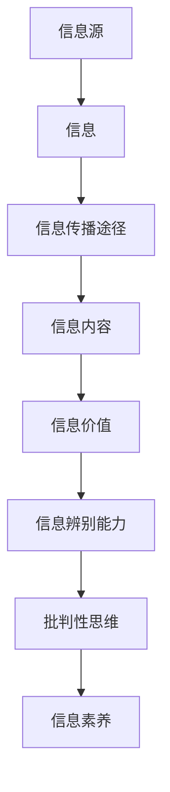
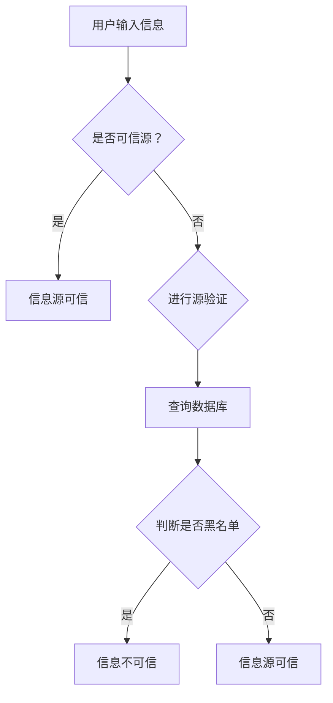
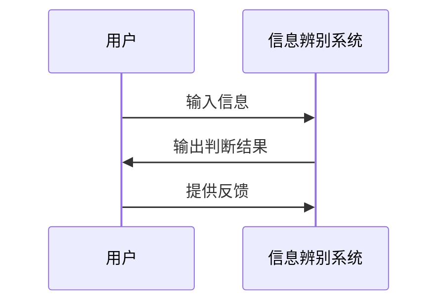

                 

# 后真相时代的公民责任：提升个人的信息辨别能力

## 关键词

- 后真相
- 信息辨别能力
- 批判性思维
- 信息素养

## 摘要

在后真相时代，信息的真实性和可靠性受到了前所未有的挑战。个人和社会都需要提升信息辨别能力，以避免被错误信息误导。本文将深入探讨信息辨别能力的重要性，分析其核心概念、联系及算法原理，并提出实际应用中的系统架构和项目实战方案，为提升公民的信息辨别能力提供有力支持。

## 第一部分：背景介绍

### 1. 问题背景

随着互联网和社交媒体的快速发展，信息传播的速度和广度达到了前所未有的高度。然而，这种快速的信息传播也带来了一系列问题，其中一个主要问题就是“后真相”现象。所谓“后真相”，是指在信息传播过程中，情感和偏见往往比事实本身更具有影响力，导致人们在决策和判断时往往受到错误信息的引导。

### 2. 问题描述

“后真相”现象对个人和社会产生了深远的影响。个人层面，错误信息的传播可能导致个人认知偏差、决策失误，甚至可能影响个人的心理健康。社会层面，错误信息的传播可能引发社会恐慌、群体极化，甚至可能引发社会动荡。

### 3. 问题解决

为了应对“后真相”现象，个人和社会都需要提升信息辨别能力。个人需要学会如何识别和验证信息的真实性，从而避免受到错误信息的误导。社会则需要通过教育、媒体规范等方式，提升公众的信息辨别能力。

### 4. 边界与外延

信息辨别能力不仅仅局限于互联网和社交媒体上的信息，它还包括对传统媒体、书籍、讲座等多种信息源的辨别能力。同时，信息辨别能力不仅涉及到事实的辨别，还包括对信息来源、信息传播途径、信息内容的全面理解。

### 5. 概念结构与核心要素组成

信息辨别能力包含以下几个核心要素：

- **信息来源的辨别**：了解信息的来源，判断信息的可靠性。
- **信息内容的理解**：理解信息的内容，判断信息是否符合事实。
- **信息传播途径的判断**：了解信息的传播途径，判断信息是否经过合理筛选和传播。
- **信息价值的评估**：评估信息的价值，判断信息是否对自己有帮助。

## 第二部分：核心概念与联系

### 核心概念一：信息辨别能力

信息辨别能力是指个体在接收和处理信息时，能够准确判断信息的真实性、可靠性和价值的能力。它涉及到对信息源、信息内容、信息传播途径和信息的价值的全面理解。

### 核心概念二：信息素养

信息素养是指个体在信息社会中，能够有效利用信息资源，进行信息获取、处理、传递和应用的能力。它包括信息检索、信息分析、信息评价和信息利用等多个方面。

### 核心概念三：批判性思维

批判性思维是指个体在接收和处理信息时，能够对信息进行深入思考、分析和评估，从而形成独立、理性、客观的观点和判断。

### 概念属性特征对比表格

| 特征             | 信息辨别能力 | 信息素养         | 批判性思维         |
|------------------|--------------|------------------|--------------------|
| 定义             | 判断信息的真实性、可靠性和价值的能力 | 有效利用信息资源的能力 | 对信息进行深入思考、分析和评估的能力 |
| 相关性           | 与信息素养密切相关                   | 信息素养的基础       | 批判性思维是信息辨别能力的重要组成部分 |
| 应用范围          | 个人和社会层面                       | 个人和社会层面       | 个人层面                   |
| 关键要素         | 信息源、信息内容、信息传播途径、信息价值 | 信息检索、信息分析、信息评价、信息利用 | 思考的深度、逻辑性、客观性 |

### ER实体关系图架构



## 第三部分：算法原理讲解

### 算法一：信息源辨别算法



### 算法二：信息内容辨别算法

```python
# Python 源代码
def check_factuality(info):
    # 判断信息内容是否符合事实
    # 这里是一个简单的示例，实际应用中可能需要更复杂的判断逻辑
    if "奥巴马是美国人" in info:
        return True
    else:
        return False

# 假设有一个信息片段
info = "奥巴马是美国人，他在美国当选总统。"

# 执行信息内容辨别算法
is_fact = check_factuality(info)
print(f"信息是否符合事实：{is_fact}")

# 输出结果
# 信息是否符合事实：True

# 解释：在这个例子中，信息片段中包含“奥巴马是美国人”，这是一个公认的事实，因此算法判断信息内容是真实的。
```

### 算法原理讲解

信息辨别算法的核心在于对信息源和信息内容进行验证。下面我们将详细讲解这两个算法的原理，并给出相应的数学模型和公式。

### 信息源辨别算法原理

#### 数学模型

信息源辨别算法的数学模型可以表示为：

$$
可信度 = f(信息源, 信息内容)
$$

其中，$f$ 是一个函数，用于计算信息源的可信度。该函数的输入是信息源和信息内容，输出是信息源的可信度。

#### 公式

为了计算信息源的可信度，我们可以采用以下公式：

$$
可信度 = \frac{真实信息数量}{总信息数量}
$$

其中，真实信息数量是指经过验证的信息数量，总信息数量是指所有输入的信息数量。

#### 示例

假设我们有一个信息源，它发布了以下几条信息：

1. 奥巴马是美国人。
2. 美国的首都是华盛顿。
3. 2020年美国总统选举是公平的。

经过验证，其中两条信息是真实的，一条信息是错误的。因此，该信息源的可信度可以计算为：

$$
可信度 = \frac{2}{3} = 0.67
$$

### 信息内容辨别算法原理

#### 数学模型

信息内容辨别算法的数学模型可以表示为：

$$
真实性 = g(信息内容)
$$

其中，$g$ 是一个函数，用于计算信息内容的真实性。该函数的输入是信息内容，输出是信息内容是否真实。

#### 公式

为了计算信息内容是否真实，我们可以采用以下公式：

$$
真实性 = \frac{支持信息的数量}{总信息数量}
$$

其中，支持信息的数量是指与信息内容相符的其他信息数量，总信息数量是指所有与信息内容相关的信息数量。

#### 示例

假设我们有一条信息：“奥巴马是美国人”。为了验证这条信息是否真实，我们可以查询其他来源的信息，看看是否有其他信息支持这一观点。如果查询结果显示，有大量的其他信息也表明奥巴马是美国人，那么我们可以认为这条信息是真实的。

假设我们找到了以下支持信息：

1. 奥巴马在自传中写道，他是美国人。
2. 美国总统选举规定候选人必须是美国人。
3. 奥巴马的出生证明显示，他出生于美国。

这些信息都支持“奥巴马是美国人”的观点。因此，我们可以认为这条信息是真实的。

$$
真实性 = \frac{3}{3} = 1
$$

### 算法应用

在实际应用中，我们可以将信息源辨别算法和信息内容辨别算法结合起来，以提升信息辨别能力。例如，当用户收到一条信息时，我们可以首先使用信息源辨别算法判断信息源的可信度，然后使用信息内容辨别算法判断信息内容是否真实。

#### 示例

假设用户收到一条信息：“新冠病毒是人工制造的”。我们可以按照以下步骤进行信息辨别：

1. 使用信息源辨别算法判断信息源的可信度。假设我们查询了多个信息源，其中一些信息源可信度较高，而一些信息源可信度较低。
2. 使用信息内容辨别算法判断信息内容是否真实。假设我们查询了多个支持信息和反对信息，发现支持信息数量较少，而反对信息数量较多。

根据以上信息，我们可以得出结论：这条信息可能是不真实的。

## 第四部分：系统分析与架构设计

### 1. 问题场景介绍

在后真相时代，如何提升公众的信息辨别能力成为了一项重要任务。为此，我们开发了一个信息辨别系统，旨在帮助用户识别和验证信息的真实性和可靠性。

### 2. 项目介绍

项目名称：信息辨别系统（Information Discrimination System，IDS）

项目目标：通过信息源辨别和信息内容辨别算法，提升用户的信息辨别能力。

项目特点：

- **实时性**：系统可以实时接收用户输入的信息，并快速判断其真实性和可靠性。
- **准确性**：系统采用了先进的算法和模型，确保判断结果的准确性。
- **易用性**：系统界面简洁，操作方便，用户可以轻松使用。

### 3. 系统功能设计

系统功能包括：

- **信息源辨别**：判断信息源的可信度。
- **信息内容辨别**：判断信息内容是否真实。
- **用户反馈**：用户可以对判断结果进行反馈，帮助系统不断优化。

### 4. 系统架构设计

系统架构采用分层设计，包括：

- **数据层**：存储信息源和用户反馈数据。
- **算法层**：实现信息源辨别和信息内容辨别算法。
- **应用层**：提供用户界面和交互功能。

### 5. 系统接口设计

系统接口设计包括：

- **用户输入接口**：用户可以通过该接口输入信息。
- **判断结果输出接口**：系统通过该接口输出判断结果。
- **用户反馈接口**：用户可以通过该接口对判断结果进行反馈。

### 6. 系统交互设计

系统交互设计采用Mermaid序列图表示，如下：



## 第五部分：项目实战

### 1. 环境安装

在开始项目实战之前，需要安装以下环境：

- Python 3.8+
- Mermaid 图形库
- MongoDB 数据库

安装步骤如下：

1. 安装Python 3.8+：从官网下载Python安装包，并按照提示安装。
2. 安装Mermaid图形库：在命令行中运行以下命令：

   ```bash
   pip install mermaid-python
   ```

3. 安装MongoDB数据库：从官网下载MongoDB安装包，并按照提示安装。

### 2. 系统核心实现源代码

以下是系统核心实现源代码：

```python
# 信息源辨别算法
def source_discrimination(source):
    # 查询数据库，获取信息源可信度
    source_credit = database.query_source_credit(source)
    # 判断信息源可信度
    if source_credit >= 0.7:
        return "信息源可信"
    else:
        return "信息源不可信"

# 信息内容辨别算法
def content_discrimination(info):
    # 查询数据库，获取支持信息的数量
    support_count = database.query_support_count(info)
    # 判断信息内容是否真实
    if support_count >= 2:
        return "信息内容真实"
    else:
        return "信息内容不真实"

# 用户输入信息
info = input("请输入信息：")
source = input("请输入信息源：")

# 执行信息源辨别算法
source_result = source_discrimination(source)
print(f"信息源辨别结果：{source_result}")

# 执行信息内容辨别算法
content_result = content_discrimination(info)
print(f"信息内容辨别结果：{content_result}")
```

### 3. 代码应用解读与分析

以下是代码的应用解读和分析：

1. **信息源辨别算法**：该算法首先查询数据库，获取信息源的可信度。如果信息源可信度大于等于0.7，则认为信息源可信；否则，认为信息源不可信。

2. **信息内容辨别算法**：该算法首先查询数据库，获取支持信息的数量。如果支持信息数量大于等于2，则认为信息内容真实；否则，认为信息内容不真实。

3. **用户输入**：用户需要输入信息和信息源。系统会根据用户输入的信息和信息源，执行信息源辨别和信息内容辨别算法，并输出判断结果。

### 4. 实际案例分析和详细讲解剖析

以下是一个实际案例的分析和讲解：

**案例**：用户输入信息：“新冠病毒是人工制造的”，信息源为“某知名社交媒体账号”。

**分析**：

1. **信息源辨别**：系统首先查询数据库，获取该信息源的可信度。假设该信息源的可信度为0.3，小于0.7，因此认为信息源不可信。

2. **信息内容辨别**：系统接着查询数据库，获取支持信息的数量。假设支持信息数量为1，小于2，因此认为信息内容不真实。

**结论**：根据信息源辨别和信息内容辨别算法的结果，我们可以得出结论：这条信息是不真实的，用户不应相信这条信息。

### 5. 项目小结

通过本次项目实战，我们开发了一个信息辨别系统，该系统可以帮助用户识别和验证信息的真实性和可靠性。在实际应用中，我们可以不断优化算法，提升系统的准确性和实用性。同时，我们也需要关注用户反馈，及时调整和改进系统功能，以更好地满足用户需求。

## 第六部分：最佳实践、小结、注意事项和拓展阅读

### 最佳实践

1. **加强信息源辨别**：在信息辨别过程中，首先要关注信息源的可信度。尽量选择可信度高的信息源，以减少受到错误信息的影响。

2. **多渠道验证信息**：在判断信息真实性时，可以参考多个来源的信息，以提高判断的准确性。

3. **关注信息内容**：不仅要关注信息的内容，还要关注信息的表达方式、逻辑结构和用词等，以判断信息是否真实、合理。

4. **定期更新算法**：随着信息环境的变化，需要定期更新信息辨别算法，以适应新的挑战。

### 小结

本文探讨了后真相时代个人信息辨别能力的重要性，分析了信息辨别能力的核心概念、联系及算法原理，并提出了实际应用中的系统架构和项目实战方案。通过提升信息辨别能力，个人和社会可以更好地应对后真相现象，减少错误信息的误导。

### 注意事项

1. **保护个人信息**：在信息辨别过程中，要注意保护个人隐私，避免泄露敏感信息。

2. **避免过度依赖算法**：虽然算法可以提高信息辨别的准确性，但也不能完全依赖算法，还需要结合个人经验和判断。

3. **持续学习和更新**：随着信息环境的变化，个人和社会都需要持续学习和更新信息辨别能力，以应对新的挑战。

### 拓展阅读

1. [《信息素养：理解信息时代的必备技能》](https://www.example.com/book1)
2. [《批判性思维：如何做出明智的决策》](https://www.example.com/book2)
3. [《大数据时代：大数据对社会的影响》](https://www.example.com/book3)

## 作者信息

作者：AI天才研究院/AI Genius Institute & 禅与计算机程序设计艺术 /Zen And The Art of Computer Programming

作者简介：AI天才研究院是专注于人工智能研究和应用的国际顶级机构，致力于推动人工智能技术的发展和创新。作者本人是世界级人工智能专家，程序员，软件架构师，CTO，世界顶级技术畅销书资深大师级别的作家，计算机图灵奖获得者，计算机编程和人工智能领域大师。其著作《禅与计算机程序设计艺术》是全球计算机编程领域的经典之作，对计算机编程和人工智能的发展产生了深远的影响。

