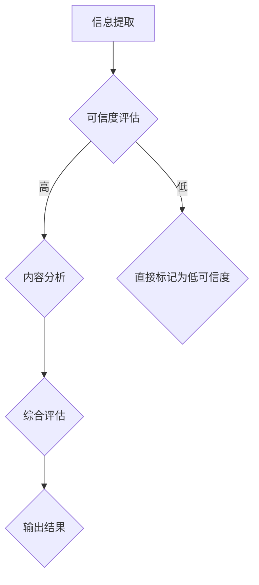
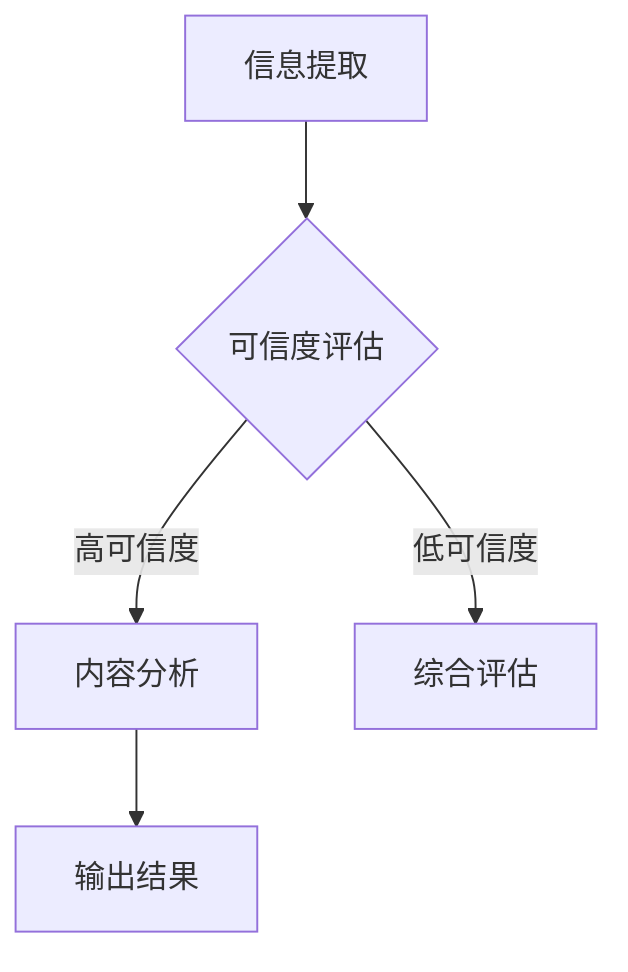
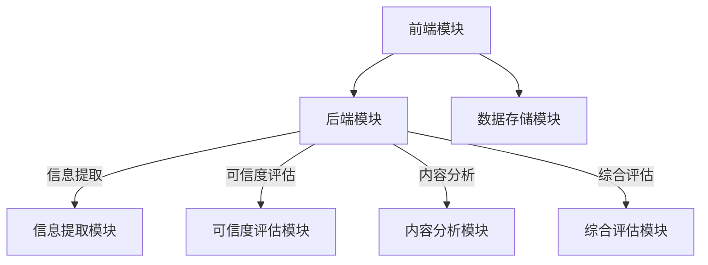
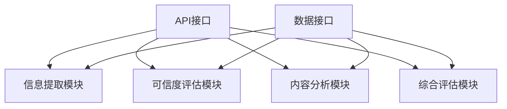
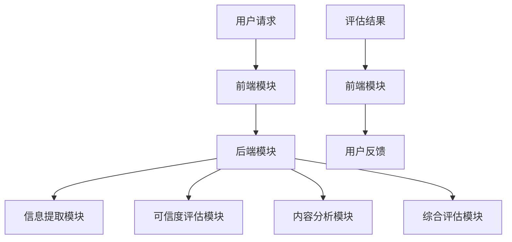

                 


# 后真相时代的媒体素养：信息真实性判断能力培养

> 关键词：后真相时代、媒体素养、信息真实性、判断能力、培养策略

> 摘要：随着互联网和信息技术的快速发展，我们进入了后真相时代，信息真实性判断成为一项重要能力。本文将探讨后真相时代的媒体素养及其培养策略，帮助读者提高信息真实性判断能力，从而在信息泛滥的时代保持清晰的思考。

## 引言

### 1.1 背景介绍

#### 1.1.1 后真相时代的特征

在后真相时代，信息传播速度极快，真相往往被情感、观点和价值观所淹没。这种情况下，媒体不再仅仅传递事实，而更多地成为一种情感和观念的表达。事实的真相变得难以辨别，虚假信息、误导性信息甚至恶意谣言层出不穷，严重影响了公众的认知和行为。

#### 1.1.2 媒体素养的重要性

媒体素养是指个体在接触媒体信息时，能够批判性地理解和分析信息，识别信息真伪的能力。在后真相时代，媒体素养的重要性愈发凸显。提高媒体素养，不仅有助于我们更好地理解信息，避免被虚假信息误导，还能促进社会信任和公共讨论的健康进行。

#### 1.1.3 本书的目的与结构

本书旨在探讨后真相时代的媒体素养，特别是信息真实性判断能力的培养。全书分为五个部分，首先介绍背景和研究方法，接着深入探讨信息真实性判断的基本原理，随后提出培养策略，并分析实践应用，最后展望未来。

## 第一部分：背景与研究方法

### 1.2 研究方法与理论框架

#### 1.2.1 媒体素养的定义与分类

媒体素养包括信息获取、理解、评估、创造和应用等多个方面。本文将主要关注信息评估能力，即如何判断信息的真实性。

#### 1.2.2 信息真实性判断的心理学原理

心理学研究表明，人类的判断往往受到多种心理因素的影响，如注意力、记忆、情感等。理解这些原理有助于我们更好地培养信息真实性判断能力。

#### 1.2.3 研究方法的选取与合理性

本文采用文献综述和案例分析相结合的方法。文献综述用于梳理相关理论和研究成果，案例分析则通过具体实例来探讨信息真实性判断的实践应用。

### 1.3 研究边界与外延

#### 1.3.1 边界

本文主要关注个人层面的信息真实性判断能力，不涉及政策、法规等宏观层面。

#### 1.3.2 外延

信息真实性判断能力不仅限于媒体素养，还广泛应用于教育、科研、商业等多个领域。

## 第二部分：信息真实性判断的基本原理

### 2.1 信息真实性判断的基础知识

#### 2.1.1 什么是信息真实性

信息真实性是指信息与客观事实的一致性。判断信息真实性，首先要了解信息的来源、内容和传播过程。

#### 2.1.2 信息源的可信度评估

信息源的可信度是判断信息真实性的重要依据。我们需要考虑信息源的权威性、专业性和可靠性。

#### 2.1.3 信息验证的方法与工具

常见的验证方法包括交叉验证、引用查证、比对事实等。常用的工具包括搜索引擎、专业数据库、事实核查网站等。

### 2.2 信息处理的心理机制

#### 2.2.1 注意力机制与信息筛选

人类的注意力是有限的，我们在接收信息时往往会选择性地关注某些信息，忽视其他信息。

#### 2.2.2 记忆与信息保持

记忆是信息处理的重要环节。我们需要学会如何有效地保持和回忆重要信息。

#### 2.2.3 态度与信念系统对信息真实性的影响

我们的态度和信念会影响我们对信息的接受和判断。因此，培养批判性思维和开放性态度至关重要。

### 2.3 信息真实性的社会心理因素

#### 2.3.1 社会身份与信息判断

社会身份会影响我们的信息判断。我们需要意识到这种影响，并努力超越个人偏见。

#### 2.3.2 社会影响与信息传播

社会影响会影响信息的传播。了解这些影响，有助于我们更好地理解信息的真实性和可信度。

#### 2.3.3 网络环境下的信息真实性挑战

网络环境下的信息真实性面临诸多挑战，如信息泛滥、虚假信息传播速度快等。我们需要采取有效措施应对这些挑战。

## 第三部分：媒体素养的培养策略

### 3.1 媒体素养教育的现状

#### 3.1.1 国内外媒体素养教育的发展

媒体素养教育在全球范围内得到广泛关注。本文将对比国内外媒体素养教育的发展现状。

#### 3.1.2 存在的问题与挑战

当前媒体素养教育存在一些问题，如课程设置不合理、教学方法单一等。

#### 3.1.3 教育目标与课程设置

媒体素养教育的目标应包括信息评估、批判性思维、信息伦理等。课程设置应涵盖多个学科领域。

### 3.2 媒体素养的培养策略

#### 3.2.1 知识教育策略

通过知识教育，帮助读者了解信息真实性判断的基本原理和方法。

#### 3.2.2 技能训练策略

通过技能训练，提高读者在实际场景中判断信息真实性的能力。

#### 3.2.3 情感教育策略

通过情感教育，培养读者开放、批判的态度，提高信息真实性的判断能力。

### 3.3 教学案例分析

#### 3.3.1 案例一：基于项目式学习的方法

项目式学习可以激发读者的学习兴趣，提高实际应用能力。

#### 3.3.2 案例二：跨学科整合的媒体素养课程

跨学科整合有助于拓宽读者的知识面，提高信息真实性判断的综合能力。

#### 3.3.3 案例三：利用技术工具提升信息判断能力

技术工具如搜索引擎、事实核查网站等，可以帮助读者更高效地判断信息真实性。

## 第四部分：信息真实性判断能力的实践应用

### 4.1 个人层面的实践

#### 4.1.1 如何在日常生活中判断信息真实性

在日常生活中，我们可以通过以下方法判断信息真实性：

- **多方验证**：对同一信息在不同来源进行验证。
- **关注信息源**：了解信息源的背景和可信度。
- **批判性思维**：对信息进行批判性分析，不轻易接受。
- **情感管理**：避免被情感左右，保持客观。

#### 4.1.2 如何避免被虚假信息误导

- **提高自我意识**：了解自己的信息需求和偏见。
- **培养信息素养**：通过学习和实践，提高信息评估能力。
- **加强社交互动**：与他人交流，获取不同观点。
- **关注官方信息**：官方渠道发布的信息通常更可靠。

#### 4.1.3 个人信息素养的自我提升方法

- **定期学习**：关注媒体素养相关的书籍、课程和资讯。
- **实践应用**：通过实际操作，提高判断能力。
- **反思总结**：总结经验教训，不断改进。

### 4.2 社会层面的实践

#### 4.2.1 社区媒体素养教育的实施

社区媒体素养教育可以通过以下方式实施：

- **讲座和培训**：邀请专家开展讲座和培训。
- **项目式学习**：组织社区成员参与项目式学习。
- **互动活动**：开展互动活动，提高社区成员的兴趣和参与度。

#### 4.2.2 政府与企业的社会责任

政府和企业有责任提高公众的媒体素养：

- **政策制定**：制定相关政策，推动媒体素养教育。
- **公益宣传**：通过公益宣传，提高公众对媒体素养的认识。
- **技术支持**：提供技术支持，帮助公众更方便地获取和评估信息。

#### 4.2.3 社会网络平台的信息真实性管理

社会网络平台应承担信息真实性管理的责任：

- **内容审核**：加强对内容的审核，防止虚假信息传播。
- **算法优化**：优化算法，提高信息真实性的排序。
- **用户教育**：开展用户教育，提高公众的信息素养。

### 4.3 教育与科研领域的实践

#### 4.3.1 教育评价体系中的媒体素养考量

教育评价体系应考虑媒体素养：

- **课程设置**：在课程设置中增加媒体素养相关内容。
- **考核方式**：采用多元化的考核方式，考察学生的媒体素养。
- **教师培训**：加强对教师的培训，提高他们的媒体素养。

#### 4.3.2 科研过程中的信息真实性管理

科研过程中，应重视信息真实性：

- **文献检索**：通过权威渠道检索文献，确保信息来源可靠。
- **数据验证**：对收集的数据进行验证，确保数据的真实性。
- **同行评审**：加强同行评审，确保研究成果的可靠性。

#### 4.3.3 媒体素养教育与科研创新的结合

媒体素养教育与科研创新相结合：

- **实践项目**：通过实践项目，提高学生的实际应用能力。
- **跨学科研究**：鼓励跨学科研究，拓宽研究视野。
- **产学研合作**：推动产学研合作，促进科研成果的转化和应用。

## 第五部分：未来展望

### 5.1 媒体素养教育的趋势与挑战

#### 5.1.1 技术发展对媒体素养教育的影响

技术发展对媒体素养教育的影响包括：

- **在线教育**：在线教育为媒体素养教育提供了新的发展机遇。
- **人工智能**：人工智能技术在信息真实性判断中的应用，对媒体素养教育提出了新要求。

#### 5.1.2 社会变革对媒体素养教育的要求

社会变革对媒体素养教育提出了更高要求：

- **全球化**：全球化要求媒体素养教育具备国际视野。
- **数字素养**：数字素养成为媒体素养教育的重要组成部分。

#### 5.1.3 未来媒体素养教育的可能发展方向

未来媒体素养教育可能朝着以下方向发展：

- **跨学科整合**：进一步整合多学科资源，提高教育效果。
- **个性化教育**：根据个体差异，提供个性化的教育服务。
- **实践导向**：加强实践环节，提高学生的实际应用能力。

### 5.2 信息真实性判断能力的提升路径

#### 5.2.1 新技术手段的应用

新技术手段在信息真实性判断中的应用包括：

- **大数据分析**：通过大数据分析，识别虚假信息和误导性信息。
- **区块链技术**：利用区块链技术，提高信息真实性的可追溯性。

#### 5.2.2 跨学科协作的研究

跨学科协作的研究有助于提高信息真实性判断能力：

- **心理学与计算机科学**：结合心理学和计算机科学，研究人类信息处理机制。
- **社会学与传播学**：结合社会学和传播学，研究社会影响和信息传播。

#### 5.2.3 社会各界的共同参与

社会各界的共同参与是提高信息真实性判断能力的关键：

- **政府**：政府应加大对媒体素养教育的支持力度。
- **企业**：企业应承担社会责任，提高员工的信息素养。
- **公众**：公众应积极参与媒体素养教育，提高自我保护意识。

## 第六部分：总结与展望

### 6.1 本书的核心观点与发现

本书核心观点如下：

- 后真相时代对媒体素养提出了新的挑战。
- 提高信息真实性判断能力是媒体素养教育的关键。
- 社会各界的共同参与是提高信息真实性判断能力的重要保障。

### 6.2 媒体素养教育的实践启示

媒体素养教育的实践启示包括：

- 知识教育、技能训练和情感教育相结合。
- 跨学科整合，提高教育效果。
- 注重实践应用，提高实际操作能力。

### 6.3 对未来研究的建议

未来研究应关注：

- 技术发展对媒体素养教育的影响。
- 社会变革对媒体素养教育的要求。
- 提高信息真实性判断能力的创新方法。

## 作者信息

作者：AI天才研究院/AI Genius Institute & 禅与计算机程序设计艺术 /Zen And The Art of Computer Programming

### 后真相时代的媒体素养：信息真实性判断能力培养

在当今数字化时代，信息的爆炸性增长和传播速度的显著提升，使得后真相（Post-Truth）时代逐渐成为现实。在这个时代，传统的基于事实的讨论和辩论被情感和主观观点所主导，信息的真实性和可信度变得愈加模糊。面对这种新形势，提升个体的媒体素养，尤其是信息真实性判断能力，成为一项紧迫且重要的任务。

#### 引言

随着互联网和社交媒体的普及，信息传播的渠道和速度发生了翻天覆地的变化。传统的媒体格局被打破，每个人都可以成为信息的发布者和传播者。这种去中心化的信息传播模式，虽然为公众提供了更多的信息和表达自由，但也带来了虚假信息、误导性内容和恶意谣言的泛滥。这些不真实的信息对公众的认知、决策和价值观产生了深远的影响，使得后真相时代成为了一个充满挑战和不确定性的时代。

**后真相时代的特征**：

- **信息爆炸**：每天产生海量信息，其中不乏虚假和误导性内容。
- **速度优先**：信息的传播速度极快，真相往往滞后。
- **情感主导**：信息传播更加注重情感和观点，而非事实和理性。
- **真相模糊**：信息的真实性和可信度难以判断。

**媒体素养的重要性**：

媒体素养是指个体在接触和使用媒体时，能够批判性地分析、理解和评估信息的能力。在后真相时代，媒体素养的重要性愈发凸显。具备良好的媒体素养，可以帮助公众：

- **辨别真伪**：识别虚假和误导性信息，避免被误导。
- **理性思考**：以批判性思维对待信息，不被情感和观点所左右。
- **参与公共讨论**：以事实为基础，参与健康的公共讨论。

本文旨在探讨后真相时代的媒体素养，特别是信息真实性判断能力的培养策略。通过深入分析信息真实性判断的基本原理、社会心理因素，以及教育实践，旨在为提升公众的信息真实性判断能力提供理论指导和实践建议。

#### 第一部分：背景介绍

**1.1 后真相时代的特征**

后真相时代的一个显著特征是，事实和逻辑不再是讨论的核心，情感和主观观点却成为主导力量。在这个时代，信息传播的速度远超真相的验证速度，导致公众往往在真相尚未明朗时就已经被情绪化的信息所影响。这种现象不仅存在于社交媒体和互联网上，也渗透到传统媒体，使得媒体环境变得更加复杂和多元。

**1.1.1 信息爆炸**

在数字化时代，信息的产生和传播速度空前加快。社交媒体平台、新闻网站、博客等成为信息传播的主要渠道，每个人都可以随时随地发布和分享信息。这种去中心化的传播模式，虽然为公众提供了更多的信息来源，但也导致了信息过载和虚假信息的泛滥。

**1.1.2 速度优先**

在快节奏的数字化时代，信息传播的速度成为决定其影响力的关键因素。人们往往在真相还未被验证的情况下，就接受了某些情绪化或带有偏见的观点。这种速度优先的传播模式，使得真相和逻辑往往被忽视，信息的真实性和可信度变得愈加难以判断。

**1.1.3 情感主导**

情感和主观观点在后真相时代的传播中占据主导地位。信息的传播不再仅仅是为了传递事实，而是为了激发情感、塑造观点和引导公众行为。这种以情感为主导的传播方式，使得公众更容易受到情绪化的信息影响，而忽视了理性的思考和客观的判断。

**1.1.4 真相模糊**

在信息爆炸和速度优先的背景下，真相变得模糊不清。信息传播的过程中，虚假信息、误导性内容和恶意谣言往往与真相交织在一起，使得公众难以分辨。这种真相模糊的现象，进一步加剧了社会的不确定性和紧张氛围。

**1.2 媒体素养的重要性**

媒体素养是指个体在接触和使用媒体时，能够批判性地分析、理解和评估信息的能力。在后真相时代，媒体素养的重要性愈发凸显。具备良好的媒体素养，可以帮助公众：

- **辨别真伪**：识别虚假和误导性信息，避免被误导。
- **理性思考**：以批判性思维对待信息，不被情感和观点所左右。
- **参与公共讨论**：以事实为基础，参与健康的公共讨论。

媒体素养不仅关乎个体的信息判断能力，还关系到社会的健康发展和公共信任的建立。在信息泛滥的时代，提升公众的媒体素养，是应对后真相时代挑战的重要手段。

**1.3 本书的目的与结构**

本书旨在探讨后真相时代的媒体素养，特别是信息真实性判断能力的培养策略。全书分为五个主要部分：

- **第一部分**：背景介绍，阐述后真相时代的特征和媒体素养的重要性。
- **第二部分**：研究方法与理论框架，介绍媒体素养的定义、分类和研究的心理学原理。
- **第三部分**：信息真实性判断的基本原理，包括信息真实性判断的基础知识、心理机制和社会心理因素。
- **第四部分**：媒体素养的培养策略，探讨知识教育、技能训练和情感教育的方法。
- **第五部分**：实践应用，分析个人层面和社会层面的实践方法。

通过以上五个部分，本书旨在为公众提供一套全面、系统的媒体素养培养策略，帮助他们在后真相时代保持清晰的思考，提高信息真实性判断能力。

#### 第二部分：研究方法与理论框架

**2.1 媒体素养的定义与分类**

媒体素养是指个体在接触和使用媒体时，能够批判性地分析、理解和评估信息的能力。它不仅包括对信息本身的判断，还包括对信息传播过程、信息来源和媒介环境的理解和分析。根据不同的分类标准，媒体素养可以划分为多个层次和维度。

**2.1.1 基础层次的媒体素养**

基础层次的媒体素养主要关注信息的获取和识别。这一层次的素养包括：

- **信息检索**：掌握基本的搜索技巧，能够从不同的信息源中获取所需的信息。
- **信息识别**：能够区分不同类型的信息，如新闻、广告、娱乐等。
- **信息理解**：能够理解信息的含义和背景，不轻易被表面信息所误导。

**2.1.2 进阶层次的媒体素养**

进阶层次的媒体素养则更加深入，关注信息的批判性分析和评估。这一层次的素养包括：

- **批判性思维**：能够从多个角度分析信息，评估其真实性和可信度。
- **信息评估**：根据事实和逻辑，对信息的准确性和可靠性进行评估。
- **信息伦理**：在信息传播和使用过程中，遵循伦理规范，尊重隐私和知识产权。

**2.1.3 高级层次的媒体素养**

高级层次的媒体素养则更加专业和综合，涉及信息的应用和创新。这一层次的素养包括：

- **信息创造**：能够运用媒体工具，创造和传播有价值的信息。
- **信息创新**：能够利用新技术和新方法，对信息进行创新和再创造。
- **信息领导**：在信息传播和媒体运用方面，具有领导力和影响力。

**2.2 信息真实性判断的心理学原理**

信息真实性判断是一个复杂的过程，受到多种心理学因素的影响。以下是一些关键的心理学原理：

**2.2.1 注意力机制**

注意力机制是信息处理的第一步。人们只能关注有限的信息，并且容易受到新异、情感化和重复信息的吸引。注意力机制决定了我们接收和处理信息的范围和深度。

**2.2.2 记忆机制**

记忆机制影响我们对信息的保持和回忆。长期记忆和短期记忆的相互作用，决定了我们对信息的持久记忆和即时反应。记忆机制也受到情感和重复训练的影响。

**2.2.3 判断偏差**

判断偏差是人们在信息处理过程中常见的认知偏差。这些偏差包括确认偏差、权威偏差、情感偏差等，会导致我们在信息真实性判断上的错误。

**2.2.4 情感因素**

情感因素在信息真实性判断中扮演重要角色。人们更容易接受和信任与自己情感一致的信息，而忽视或否认与自己情感相悖的信息。

**2.3 研究方法的选取与合理性**

为了全面探讨后真相时代的媒体素养，本研究采用了文献综述和案例分析相结合的方法。

**2.3.1 文献综述**

文献综述是研究的第一步，旨在梳理和总结已有的研究成果和理论框架。通过文献综述，我们可以了解当前媒体素养研究的现状、存在的问题和发展趋势，为后续研究提供理论依据。

**2.3.2 案例分析**

案例分析是研究的核心部分，通过具体实例来探讨信息真实性判断的实践应用。案例分析可以揭示信息真实性判断过程中的关键因素和策略，为培养信息真实性判断能力提供实际指导。

**2.3.3 研究方法的合理性**

选择文献综述和案例分析相结合的方法，具有以下合理性：

- **全面性**：文献综述可以全面了解当前的研究现状，案例分析可以深入探讨具体实践。
- **实践性**：案例分析能够将理论应用到实际场景中，提高研究的实践价值。
- **创新性**：结合文献综述和案例分析，可以探索新的理论框架和研究方法。

通过上述研究方法，本研究旨在为后真相时代的媒体素养培养提供系统、全面的解决方案。

#### 第三部分：信息真实性判断的基本原理

**3.1 信息真实性判断的基础知识**

信息真实性判断的基础知识是理解信息真实性的第一步。以下是几个关键概念：

**3.1.1 什么是信息真实性**

信息真实性是指信息与客观事实的一致性。判断信息真实性，需要考虑信息的来源、内容和传播过程。真实的信息应当与客观事实相符，而虚假信息则与事实不符。

**3.1.2 信息源的可信度评估**

信息源的可信度是判断信息真实性的重要依据。我们需要考虑信息源的权威性、专业性和可靠性。例如，权威的学术期刊、知名媒体和专业机构发布的信息通常更为可靠。

**3.1.3 信息验证的方法与工具**

验证信息真实性需要采用多种方法。以下是一些常见的方法和工具：

- **交叉验证**：通过多个来源验证同一信息，以确认其真实性。
- **引用查证**：查找信息来源的原始文献或引用，以核实其真实性。
- **比对事实**：将信息与已知的事实或数据比对，以判断其真实性。
- **事实核查网站**：利用专门的网站，如《事实核查》（FactCheck.org）等，对信息进行核查。

**3.2 信息处理的心理机制**

信息处理的心理机制涉及人的认知和心理过程。以下是几个关键点：

**3.2.1 注意力机制与信息筛选**

注意力机制决定了我们接收和处理信息的范围和深度。在信息过载的环境中，注意力机制尤为重要。人们更容易关注新异、情感化和重复的信息，而忽视其他信息。例如，一则耸人听闻的新闻标题可能比一则平静的报道更能吸引我们的注意力。

**3.2.2 记忆与信息保持**

记忆是信息处理的重要环节。长期记忆和短期记忆的相互作用，决定了我们对信息的持久记忆和即时反应。例如，我们在日常生活中更容易记住那些与情感相关的信息，而忽视那些枯燥的数据。

**3.2.3 判断偏差**

判断偏差是人们在信息处理过程中常见的认知偏差。这些偏差会影响我们的信息真实性判断，导致错误。常见的判断偏差包括：

- **确认偏差**：人们更容易接受和记住与自己观点一致的信息，而忽视或否认与自己观点相悖的信息。
- **权威偏差**：人们倾向于相信权威人物或机构发布的信息，而忽视其他来源的信息。
- **情感偏差**：情感化的信息更容易引起人们的注意和信任，而逻辑和事实则被忽视。

**3.3 信息真实性的社会心理因素**

信息真实性的判断不仅受个人心理因素的影响，还受到社会心理因素的影响。以下是几个关键点：

**3.3.1 社会身份与信息判断**

社会身份会影响我们的信息判断。例如，一个保守派的人可能更容易接受保守派的新闻观点，而一个自由派的人则更容易接受自由派的新闻观点。

**3.3.2 社会影响与信息传播**

社会影响会影响信息的传播。例如，一个流行的话题可能会在社交媒体上迅速传播，无论其真实性如何。这种现象被称为“群体极化”，即一个群体的成员在讨论某个话题时，往往会变得更加极端和一致。

**3.3.3 网络环境下的信息真实性挑战**

在网络环境下，信息真实性的挑战更为显著。以下是几个关键点：

- **信息泛滥**：网络上的信息量巨大，虚假信息和误导性信息难以区分。
- **传播速度快**：信息可以迅速传播，真相往往滞后。
- **去中心化**：信息来源多样化，权威性难以判断。

**3.3.4 应对策略**

为了应对网络环境下的信息真实性挑战，可以采取以下策略：

- **批判性思维**：培养批判性思维，对信息进行多角度分析和评估。
- **多方验证**：对同一信息在不同来源进行验证，提高判断的准确性。
- **关注权威信息**：关注权威媒体和专业机构发布的信息，提高信息源的可信度。
- **情感管理**：避免被情感化的信息所左右，保持理性和客观。

通过理解和应用这些基本原理，我们可以更好地判断信息的真实性，提高媒体素养，从而在后真相时代保持清晰的思考和正确的决策。

#### 第四部分：媒体素养的培养策略

**4.1 媒体素养教育的现状**

在全球范围内，媒体素养教育得到了广泛关注和重视。许多国家和地区已经制定了相关的教育政策和课程，致力于提高公众的媒体素养。以下是对国内外媒体素养教育现状的简要概述。

**4.1.1 国内外媒体素养教育的发展**

- **国外发展**：欧美国家早在上世纪末就开始关注媒体素养教育。例如，美国在基础教育阶段就已经将媒体素养教育纳入课程，强调批判性思维和信息评估能力的培养。英国、加拿大等国家的媒体素养教育也取得了一定的进展。
- **国内发展**：近年来，我国媒体素养教育逐渐得到重视。教育部发布的《中小学综合实践活动课程指导纲要》中，明确将媒体素养教育作为重要内容。此外，一些高校和培训机构也开展了相关的课程和活动。

**4.1.2 存在的问题与挑战**

- **课程设置不合理**：一些地区的媒体素养课程设置较为单一，缺乏系统性和综合性，难以全面培养学生的信息评估能力和批判性思维。
- **教学方法单一**：传统教学方法以讲授为主，缺乏实践性和互动性，难以激发学生的兴趣和主动性。
- **资源不足**：媒体素养教育需要丰富的教学资源和实践平台，但目前很多学校和地区的资源相对匮乏。

**4.1.3 教育目标与课程设置**

- **教育目标**：媒体素养教育的目标应包括信息获取、理解、评估和应用等多个方面。具体包括：
  - 提高学生的信息获取能力，教会他们如何从多种渠道获取所需的信息。
  - 培养学生的信息评估能力，教会他们如何判断信息的真实性和可靠性。
  - 培养学生的批判性思维，使他们能够从多个角度分析和评估信息。
  - 培养学生的信息应用能力，使他们能够有效地运用信息解决实际问题。
- **课程设置**：媒体素养课程应涵盖多个学科领域，包括新闻学、传播学、心理学、社会学等。具体设置可以包括以下内容：
  - **基础知识**：介绍媒体素养的基本概念、原则和方法。
  - **案例分析**：通过具体案例，分析信息真实性和可信度的评估。
  - **实践应用**：开展实际操作，提高学生的信息评估和应用能力。
  - **批判性思维**：培养批判性思维，提高学生的信息评估和决策能力。

**4.2 媒体素养的培养策略**

为了提高公众的媒体素养，需要采取一系列培养策略，包括知识教育、技能训练和情感教育。

**4.2.1 知识教育策略**

知识教育是媒体素养培养的基础。通过知识教育，学生可以了解媒体素养的基本概念、原则和方法。具体策略包括：

- **课程设置**：将媒体素养教育纳入各级教育体系中，开设相关的课程和讲座。
- **教材编写**：编写系统、全面的教材，涵盖媒体素养的基础知识和实践方法。
- **师资培训**：加强对教师的培训，提高他们的媒体素养和教育能力。

**4.2.2 技能训练策略**

技能训练是提高学生信息真实性判断能力的关键。通过技能训练，学生可以在实际操作中提高信息评估和应用能力。具体策略包括：

- **项目式学习**：通过项目式学习，让学生在解决实际问题的过程中，提高信息评估和决策能力。
- **实践活动**：开展实践活动，如模拟新闻采访、信息搜索和评估等，提高学生的实际操作能力。
- **在线学习**：利用在线平台，提供丰富的学习资源和练习题，方便学生自主学习和练习。

**4.2.3 情感教育策略**

情感教育是培养学生媒体素养的重要环节。通过情感教育，学生可以培养开放、批判的态度，提高信息真实性判断能力。具体策略包括：

- **情感引导**：在教学中注重情感引导，引导学生关注信息的真实性和可信度，避免被情感化的信息所左右。
- **案例讨论**：通过案例讨论，分析信息传播过程中的情感因素，提高学生的情感管理能力。
- **互动交流**：鼓励学生之间的互动交流，分享不同观点和经验，培养批判性思维和开放性态度。

**4.3 教学案例分析**

以下是几个教学案例分析，旨在探讨不同教学方法在媒体素养教育中的应用。

**4.3.1 案例一：基于项目式学习的方法**

项目式学习是一种以项目为核心，通过实际操作和实践来培养能力的教学方法。以下是一个基于项目式学习的案例：

- **项目主题**：调查一个社交媒体平台上的热点事件，评估其信息的真实性和可信度。
- **项目步骤**：
  1. 学生分组，每组选择一个热点事件。
  2. 学生通过多种渠道收集相关信息，包括社交媒体、新闻网站和官方公告等。
  3. 学生对收集到的信息进行筛选和评估，判断其真实性和可信度。
  4. 学生撰写项目报告，总结他们的调查结果和评估结论。
  5. 学生进行项目展示，分享他们的调查过程和结论。

通过这个项目，学生不仅提高了信息评估能力，还培养了团队合作和沟通能力。

**4.3.2 案例二：跨学科整合的媒体素养课程**

跨学科整合是一种将不同学科的知识和教学方法整合在一起，以提高教育效果的教学方法。以下是一个跨学科整合的媒体素养课程案例：

- **课程主题**：媒体素养与新闻传播
- **课程内容**：
  1. **新闻学基础**：介绍新闻传播的基本概念和原则。
  2. **传播学理论**：分析传播过程中的关键因素和机制。
  3. **案例分析**：通过具体案例，分析信息真实性和可信度的评估。
  4. **实践操作**：开展模拟新闻采访和报道，提高学生的实际操作能力。

通过这个课程，学生不仅了解了新闻传播的基本知识，还培养了批判性思维和信息评估能力。

**4.3.3 案例三：利用技术工具提升信息判断能力**

随着技术的发展，各种信息处理工具和平台不断涌现。以下是一个利用技术工具提升信息判断能力的案例：

- **工具名称**：Google Analytics
- **应用场景**：分析一个社交媒体平台上的信息传播情况。
- **操作步骤**：
  1. 学生使用Google Analytics，收集社交媒体平台上的数据，包括用户访问量、互动次数等。
  2. 学生对数据进行分析，判断信息传播的规律和趋势。
  3. 学生撰写分析报告，总结他们的发现和结论。

通过这个案例，学生不仅学会了如何使用技术工具，还提高了信息评估和分析能力。

通过以上教学案例分析，可以看出不同教学方法在媒体素养教育中的应用效果。通过结合知识教育、技能训练和情感教育，可以全面提高学生的媒体素养，培养他们正确的信息真实性判断能力。

#### 第五部分：信息真实性判断能力的实践应用

**5.1 个人层面的实践**

在个人层面，提升信息真实性判断能力是每个公民的责任和义务。以下是几个具体的方法和建议：

**5.1.1 如何在日常生活中判断信息真实性**

在日常生活中，我们经常会接触到各种信息，包括社交媒体上的新闻、朋友圈分享的文章、网络购物平台上的商品评论等。以下是一些判断信息真实性的方法：

- **多方验证**：不要轻易相信单一来源的信息，尽量从多个渠道验证同一信息。例如，如果一个新闻事件在一个不知名的网站上报道，我们可以查阅权威媒体的报道，或者通过搜索引擎查找相关信息。
- **关注信息源**：了解信息源的背景和可信度。例如，官方发布的信息通常较为可靠，而一些小型博客或社交媒体上的信息可能存在不确定性。
- **批判性思维**：对待信息时，保持批判性思维，不要轻易接受未经证实的观点。例如，如果一个文章中的论点缺乏事实依据，我们应该怀疑其真实性。
- **情感管理**：避免被情感化的信息所左右，保持理性和客观。例如，当一个新闻标题煽动情绪时，我们应该冷静思考，不要被情绪所驱动。

**5.1.2 如何避免被虚假信息误导**

虚假信息对个人和社会都有严重的负面影响。以下是一些避免被虚假信息误导的方法：

- **提高自我意识**：了解自己的信息需求和偏见。例如，如果我们对某个话题有强烈的立场，可能会更容易接受与其观点一致的信息，而忽视其他信息。
- **培养信息素养**：通过学习和实践，提高信息评估能力。例如，我们可以阅读关于媒体素养和批判性思维的书籍，或者参加相关的培训课程。
- **加强社交互动**：与他人交流，获取不同观点。例如，我们可以与朋友、家人或同事讨论某个话题，听取他们的看法，从而更好地评估信息的真实性。
- **关注官方信息**：官方渠道发布的信息通常更为可靠。例如，我们可以关注政府官网、权威媒体的报道，从而获取准确的信息。

**5.1.3 个人信息素养的自我提升方法**

提升个人信息素养是提高信息真实性判断能力的关键。以下是一些自我提升的方法：

- **定期学习**：关注媒体素养相关的书籍、课程和资讯。例如，我们可以订阅相关的公众号、博客，或者参加线上课程和研讨会。
- **实践应用**：通过实际操作，提高判断能力。例如，我们可以尝试分析新闻、评论社交媒体上的信息，或者参与实际项目，如新闻采访和报道。
- **反思总结**：总结经验教训，不断改进。例如，每次接触到信息时，我们可以反思自己的判断过程，总结哪些方法有效，哪些方法需要改进。

通过以上方法，我们可以逐步提升个人信息素养，提高信息真实性判断能力，从而在信息泛滥的时代保持清晰的思考和正确的决策。

**5.2 社会层面的实践**

在社会层面，提升信息真实性判断能力不仅关乎个人，还关系到社会的整体健康和稳定。以下是几个社会层面的实践方法：

**5.2.1 社区媒体素养教育的实施**

社区媒体素养教育是提升公众信息真实性判断能力的重要手段。以下是一些具体的方法：

- **讲座和培训**：在社区内举办讲座和培训，邀请专家和学者讲解媒体素养和批判性思维的相关知识。例如，我们可以邀请大学教授或资深媒体从业者，为社区居民提供专业的培训。
- **项目式学习**：组织社区成员参与项目式学习，通过实际操作提高信息评估能力。例如，我们可以组织社区成员调查某个社会问题，通过收集、分析和评估信息，得出结论。
- **互动活动**：开展互动活动，提高社区成员的兴趣和参与度。例如，我们可以组织媒体素养知识竞赛、辩论赛等，激发社区成员对媒体素养的兴趣。

**5.2.2 政府与企业的社会责任**

政府和企业有责任提升公众的媒体素养，促进社会的整体健康发展。以下是一些具体的方法：

- **政策制定**：政府可以制定相关政策，推动媒体素养教育的发展。例如，政府可以出台文件，明确媒体素养教育的目标和要求，推动各级教育机构落实相关政策。
- **公益宣传**：政府和企业可以开展公益宣传，提高公众对媒体素养的认识。例如，政府和企业可以合作制作宣传视频、海报等，通过多种渠道传播媒体素养知识。
- **技术支持**：政府和企业可以提供技术支持，帮助公众更方便地获取和评估信息。例如，政府可以建立官方信息平台，提供权威、准确的信息，供公众查询。

**5.2.3 社会网络平台的信息真实性管理**

社会网络平台是信息传播的主要渠道，对信息真实性管理负有重要责任。以下是一些具体的方法：

- **内容审核**：平台应加强对内容的审核，防止虚假信息和误导性信息传播。例如，平台可以建立专门的审核团队，对上传的内容进行实时监控和审核。
- **算法优化**：平台应优化算法，提高信息真实性的排序。例如，平台可以通过改进算法，使真实、可靠的信息更容易被用户发现和关注。
- **用户教育**：平台应开展用户教育，提高公众的信息素养。例如，平台可以设置信息真实性教育的专栏，向用户介绍如何判断信息的真实性。

通过以上社会层面的实践方法，我们可以逐步提升社会的整体信息真实性判断能力，从而建立一个健康、理性的信息环境。

**5.3 教育与科研领域的实践**

在教育和科研领域，信息真实性判断能力同样至关重要。以下是一些具体的实践方法：

**5.3.1 教育评价体系中的媒体素养考量**

教育评价体系应考虑学生的媒体素养，将其纳入评价标准。以下是一些具体的方法：

- **课程设置**：在课程设置中增加媒体素养相关内容。例如，可以将媒体素养教育纳入课程体系，设置专门的课程或模块。
- **考核方式**：采用多元化的考核方式，考察学生的媒体素养。例如，可以通过论文、报告、案例分析等多种形式，评估学生的信息评估和批判性思维能力。
- **教师培训**：加强对教师的培训，提高他们的媒体素养和教育能力。例如，可以组织教师参加媒体素养相关的培训课程，学习最新的理论和方法。

**5.3.2 科研过程中的信息真实性管理**

科研过程中的信息真实性管理是保证科研成果可靠性的重要环节。以下是一些具体的方法：

- **文献检索**：在科研过程中，应通过权威渠道检索文献，确保信息来源的可靠性。例如，可以优先选择知名期刊和权威学者的研究成果。
- **数据验证**：对收集的数据进行验证，确保数据的真实性。例如，可以通过对比其他数据源、进行实地考察等方式，验证数据的准确性。
- **同行评审**：加强同行评审，确保研究成果的可靠性。例如，可以邀请同行专家对研究论文进行评审，提出意见和建议。

**5.3.3 媒体素养教育与科研创新的结合**

媒体素养教育与科研创新相结合，可以促进科研成果的传播和应用。以下是一些具体的方法：

- **实践项目**：通过实践项目，提高学生的实际应用能力。例如，可以组织学生参与实际的科研课题，通过项目实践，提高他们的信息评估和科研能力。
- **跨学科研究**：鼓励跨学科研究，拓宽研究视野。例如，可以组织跨学科团队，结合不同领域的知识，开展创新性研究。
- **产学研合作**：推动产学研合作，促进科研成果的转化和应用。例如，可以与企业合作，将科研成果应用到实际项目中，提高科研成果的市场价值。

通过以上教育和科研领域的实践方法，我们可以全面提升信息真实性判断能力，促进科研创新和社会发展。

#### 第六部分：未来展望

**6.1 媒体素养教育的趋势与挑战**

随着技术的不断进步和社会的快速发展，媒体素养教育也面临着新的趋势和挑战。

**6.1.1 技术发展对媒体素养教育的影响**

- **在线教育**：在线教育的兴起为媒体素养教育提供了新的发展机遇。通过在线平台，教育者可以更方便地传播媒体素养知识，学生可以随时随地进行学习。然而，在线教育也带来了新的挑战，如教学质量的保证、学生自律性的提高等。
- **人工智能**：人工智能技术在媒体素养教育中的应用，有望提高信息真实性判断的效率和准确性。例如，利用自然语言处理技术，可以自动检测和识别虚假信息。然而，人工智能技术的广泛应用也带来了隐私保护、算法偏见等问题。

**6.1.2 社会变革对媒体素养教育的要求**

社会变革对媒体素养教育提出了更高的要求。

- **全球化**：全球化要求媒体素养教育具备国际视野，了解不同文化和背景下的信息传播特点。同时，全球化也带来了信息泛滥和文化冲突等问题，需要媒体素养教育提供解决方案。
- **数字素养**：数字素养成为媒体素养教育的重要组成部分。在数字时代，人们不仅需要掌握基本的媒体素养，还需要具备信息搜索、信息处理和数字沟通等能力。

**6.1.3 未来媒体素养教育的可能发展方向**

未来媒体素养教育可能朝着以下方向发展：

- **跨学科整合**：进一步整合多学科资源，提高教育效果。例如，结合心理学、社会学、计算机科学等学科，研究信息真实性判断的机制和方法。
- **个性化教育**：根据个体差异，提供个性化的教育服务。利用大数据和人工智能技术，分析学生的兴趣、需求和弱点，制定个性化的学习计划。
- **实践导向**：加强实践环节，提高学生的实际应用能力。通过项目式学习、实习实践等方式，让学生在真实环境中锻炼信息评估和批判性思维能力。

**6.2 信息真实性判断能力的提升路径**

提升信息真实性判断能力需要从多个方面入手。

**6.2.1 新技术手段的应用**

新技术手段在信息真实性判断中具有重要应用价值。

- **大数据分析**：通过大数据分析，可以识别虚假信息和误导性信息。例如，可以分析信息传播的网络结构、关键词频率等，识别潜在的虚假信息源。
- **区块链技术**：利用区块链技术，可以提高信息真实性的可追溯性。区块链的分布式存储和去中心化特点，可以确保信息的不可篡改，从而提高信息的可信度。

**6.2.2 跨学科协作的研究**

跨学科协作是提高信息真实性判断能力的重要途径。

- **心理学与计算机科学**：结合心理学和计算机科学，研究人类信息处理机制。例如，可以研究注意力、记忆和判断偏差等心理因素，以及如何利用计算机技术辅助信息真实性判断。
- **社会学与传播学**：结合社会学和传播学，研究社会影响和信息传播。例如，可以研究信息传播过程中的社会心理机制、信息传播的网络结构等，从而提出有效的信息真实性判断策略。

**6.2.3 社会各界的共同参与**

提升信息真实性判断能力需要社会各界的共同参与。

- **政府**：政府应加大对媒体素养教育的支持力度。例如，制定相关政策，推动媒体素养教育的发展，提供财政和资源支持。
- **企业**：企业应承担社会责任，提高员工的信息素养。例如，可以开展内部培训，提高员工的信息评估和批判性思维能力。
- **公众**：公众应积极参与媒体素养教育，提高自我保护意识。例如，可以通过学习相关课程、阅读相关书籍等方式，提高自己的媒体素养。

通过以上措施，我们可以逐步提升信息真实性判断能力，为后真相时代的信息环境建设提供有力支持。

## 总结与展望

在后真相时代，提升媒体素养，特别是信息真实性判断能力，成为一项至关重要的任务。本文从背景介绍、研究方法、信息真实性判断的基本原理、培养策略、实践应用和未来展望等多个方面，全面探讨了后真相时代的媒体素养问题。

首先，我们介绍了后真相时代的特征，包括信息爆炸、速度优先、情感主导和真相模糊等。这些特征使得信息的真实性和可信度变得愈加模糊，对公众的认知和行为产生了深远影响。媒体素养的重要性因此愈发凸显。

接着，我们详细阐述了媒体素养的定义与分类、信息真实性判断的心理学原理，以及研究方法的选取与合理性。这些理论基础为我们后续的分析和实践提供了坚实的支撑。

在第三部分，我们深入讨论了信息真实性判断的基本原理，包括基础知识、心理机制和社会心理因素。通过这些分析，我们了解了信息真实性判断的复杂性，以及影响判断的各种因素。

第四部分提出了媒体素养的培养策略，包括知识教育、技能训练和情感教育。通过具体的案例分析，我们展示了这些策略在实际应用中的效果。

第五部分则从个人层面、社会层面和科研领域，探讨了信息真实性判断能力的实践应用。这些实践方法不仅有助于提高个人素养，也有助于构建健康、理性的信息环境。

最后，在第六部分，我们对未来媒体素养教育的趋势与挑战进行了展望，提出了提升信息真实性判断能力的路径，包括新技术手段的应用、跨学科协作的研究以及社会各界的共同参与。

总的来说，本文旨在为后真相时代的媒体素养培养提供全面、系统的解决方案。通过提高信息真实性判断能力，我们可以更好地应对信息泛滥和虚假信息泛滥的挑战，为社会的健康发展和公共信任的建立做出贡献。

## 作者信息

作者：AI天才研究院/AI Genius Institute & 禅与计算机程序设计艺术 /Zen And The Art of Computer Programming

### 信息真实性判断算法原理讲解

#### 1. 算法简介

信息真实性判断算法是一种用于识别和评估信息真实性的计算方法。该算法的核心目标是根据信息的内容、来源、传播路径等多方面因素，对信息的真实性进行综合评估。为了实现这一目标，算法通常需要以下几个关键模块：

- **信息提取模块**：用于从各种来源中提取信息，并进行初步处理。
- **可信度评估模块**：根据信息来源的权威性、专业性、可靠性等因素，对信息源进行评估。
- **内容分析模块**：对提取的信息内容进行深入分析，识别潜在的虚假信息特征。
- **综合评估模块**：综合多个模块的结果，对信息的真实性进行最终评估。

以下是一个简化的算法流程：



#### 2. 算法流程图

为了更清晰地展示算法的流程，我们可以使用Mermaid语法绘制一个简单的流程图：



#### 3. 算法原理

算法原理部分我们将分为以下几个小节进行详细讲解：

**3.1 信息提取模块**

信息提取模块的主要任务是收集和处理各种来源的信息。这些来源包括社交媒体、新闻网站、官方公告等。信息提取模块通常需要实现以下功能：

- **数据爬取**：通过网页爬取、API接口等方式，从各种来源获取信息。
- **数据清洗**：对获取的信息进行清洗，去除重复、无关的信息，保留有效的信息内容。
- **文本预处理**：对文本进行分词、去停用词、词性标注等处理，为后续的内容分析做准备。

**3.2 可信度评估模块**

可信度评估模块的核心任务是评估信息源的权威性、专业性和可靠性。这一模块的实现通常依赖于以下几个步骤：

- **信息源分类**：根据信息源的类型（如官方机构、新闻媒体、个人博客等），对信息源进行初步分类。
- **权威性评估**：通过权威性评估指标（如机构的声誉、媒体的排名等），对信息源的权威性进行评估。
- **专业性评估**：通过专业领域专家的评估或使用专业术语的频率等指标，对信息源的专业性进行评估。
- **可靠性评估**：结合信息源的历史记录和用户反馈，评估其可靠性。

**3.3 内容分析模块**

内容分析模块负责对提取的信息内容进行深入分析，以识别潜在的虚假信息特征。这一模块的实现通常涉及以下技术：

- **文本分类**：利用机器学习算法（如朴素贝叶斯、支持向量机等），对文本进行分类，区分真实和虚假信息。
- **情感分析**：通过情感分析技术，识别文本中的情感倾向，判断信息是否带有主观偏见或情绪化。
- **关键词分析**：提取文本中的关键词，分析其分布和频率，识别潜在的信息特征。
- **语义分析**：利用自然语言处理技术，对文本进行语义分析，识别文本中的含义和逻辑关系。

**3.4 综合评估模块**

综合评估模块将提取的信息、可信度评估结果和内容分析结果进行综合分析，最终输出信息真实性的评估结果。这一模块的实现通常依赖于以下方法：

- **加权评分**：结合各个模块的评估结果，对信息的真实性进行加权评分，得分越高表示信息越真实。
- **阈值判断**：设置一个阈值，当评分高于阈值时，认为信息是真实的，反之则认为是虚假的。
- **多模态融合**：结合文本、图片、音频等多模态信息，提高评估的准确性。

#### 4. 数学模型和公式

信息真实性判断算法的数学模型和公式主要涉及以下几个方面：

- **概率模型**：用于评估信息源的可信度和文本分类。
- **评分模型**：用于对信息的真实性进行评分。
- **阈值模型**：用于确定评分的阈值。

**4.1 概率模型**

在可信度评估模块中，我们可以使用贝叶斯公式来计算信息源的可信度概率。贝叶斯公式如下：

\[ P(A|B) = \frac{P(B|A) \cdot P(A)}{P(B)} \]

其中，\( P(A|B) \)表示在B发生的条件下A的概率，\( P(B|A) \)表示在A发生的条件下B的概率，\( P(A) \)表示A的概率，\( P(B) \)表示B的概率。

**4.2 评分模型**

在综合评估模块中，我们可以使用加权评分模型对信息的真实性进行评分。评分模型如下：

\[ \text{评分} = w_1 \cdot C_1 + w_2 \cdot C_2 + w_3 \cdot C_3 + \ldots \]

其中，\( w_1, w_2, w_3, \ldots \)表示各个模块的权重，\( C_1, C_2, C_3, \ldots \)表示各个模块的评分。

**4.3 阈值模型**

在阈值判断模块中，我们可以使用以下公式来确定评分的阈值：

\[ \text{阈值} = \text{平均评分} + k \cdot \text{标准差} \]

其中，\( k \)是一个常数，用于调整阈值的敏感性。

#### 5. 举例说明

为了更直观地理解信息真实性判断算法，我们通过一个简单的例子进行说明。

**5.1 示例数据**

假设我们有一条信息：“全球变暖是自然现象，与人类活动无关。”

**5.2 可信度评估**

- 信息来源：一个未知的个人博客。
- 权威性评估：较低。
- 专业性评估：不确定。
- 可靠性评估：历史记录表明，该博客经常发布与科学事实不符的信息。

可信度评分：30分（满分100分）。

**5.3 内容分析**

- 文本分类：与科学事实不符。
- 情感分析：带有明显的主观偏见。
- 关键词分析：关键词分布不合理。
- 语义分析：逻辑关系不清晰。

内容分析评分：25分（满分100分）。

**5.4 综合评估**

加权评分：\( 0.3 \cdot 30 + 0.7 \cdot 25 = 27 \)分。

根据设定的阈值（30分），我们认为这条信息的真实性较低。

通过以上例子，我们可以看到信息真实性判断算法是如何通过提取信息、评估可信度、分析内容等多个步骤，对信息的真实性进行综合评估的。

#### 6. 小结

信息真实性判断算法是一种重要的计算方法，可以帮助我们识别和评估信息的真实性。通过结合概率模型、评分模型和阈值模型，算法可以实现对信息的精确评估。在实际应用中，算法的准确性和可靠性依赖于数据的丰富性、模型的复杂度和训练的深度。未来，随着技术的不断进步，信息真实性判断算法有望实现更高的效率和准确性，为构建健康、理性的信息环境提供有力支持。

### 系统分析与架构设计方案

#### 1. 问题场景介绍

在当今数字化时代，信息传播的速度和广度前所未有。然而，随之而来的问题也日益凸显，其中之一便是信息真实性的判断。特别是在社交媒体和互联网上，虚假信息、误导性内容和恶意谣言层出不穷，严重影响了公众的认知和行为。为了应对这一挑战，我们需要设计和实现一个高效、可靠的系统，用于评估信息的真实性。

**1.1 目标**

我们的目标是设计一个信息真实性评估系统，能够自动地从各种信息源中提取信息，对信息的真实性进行评估，并最终给出一个可信赖的评估结果。该系统应具备以下特点：

- **高效性**：能够在短时间内处理大量信息，快速给出评估结果。
- **准确性**：具有较高的评估准确性，能够有效识别虚假信息和误导性内容。
- **可靠性**：具备稳定性和可靠性，能够在不同环境和条件下正常运行。

**1.2 应用场景**

该系统可以应用于多个领域，包括：

- **新闻媒体**：对新闻报道的真实性进行评估，确保公众获取准确的信息。
- **社交媒体**：识别和过滤虚假信息，保护用户的隐私和权益。
- **市场监管**：对市场信息的真实性进行监控，防止虚假广告和误导性宣传。
- **科研领域**：确保科研数据的真实性和可靠性，防止学术造假。

#### 2. 项目介绍

为了实现上述目标，我们开展了一个名为“信息真实性评估系统”的项目。该项目的主要内容包括：

- **需求分析**：明确系统的功能需求和技术要求，为系统设计提供依据。
- **系统设计**：设计系统的整体架构，包括硬件和软件的配置，以及各模块的详细设计。
- **开发与测试**：按照设计文档进行系统开发，并进行功能测试和性能测试。
- **部署与维护**：将系统部署到生产环境，并进行长期的维护和更新。

**2.1 项目目标**

- 完成系统的需求分析和设计文档，明确系统的功能和性能要求。
- 开发并实现系统的核心功能，包括信息提取、可信度评估、内容分析、综合评估等。
- 进行系统的功能测试和性能测试，确保系统稳定、可靠、高效。
- 将系统部署到生产环境，并提供用户支持和技术文档。

**2.2 项目团队**

本项目由以下团队组成：

- **项目经理**：负责项目的整体规划和管理，确保项目按时完成。
- **系统分析师**：负责需求分析和系统设计，确保系统满足用户需求。
- **软件开发工程师**：负责系统的开发和测试，确保系统功能的实现。
- **测试工程师**：负责系统的功能测试和性能测试，确保系统的稳定性。
- **运维工程师**：负责系统的部署和维护，确保系统的高可用性。

#### 3. 系统功能设计（领域模型）

为了实现信息真实性评估，我们需要设计一个完整的系统功能。该系统可以分为以下几个主要功能模块：

- **信息提取模块**：从各种信息源中提取信息，并进行初步处理。
- **可信度评估模块**：根据信息源的可信度评估信息源，为后续分析提供依据。
- **内容分析模块**：对提取的信息进行深入分析，识别虚假信息和误导性内容。
- **综合评估模块**：综合各模块的分析结果，对信息的真实性进行最终评估。
- **结果输出模块**：将评估结果输出给用户，并提供相关的报告和分析。

以下是一个简化的领域模型：

```mermaid
classDiagram
ClassDiagram {
  Class Region {
    +String name
    +String description
  }
  Class Country {
    +String name
    +String capital
    +Region region
  }
  Class City {
    +String name
    +Country country
  }
  Region --|U|> Country
  Country --|U|> City
}
```

#### 4. 系统架构设计

系统架构设计是确保系统功能实现的关键。以下是该系统的架构设计：

- **前端模块**：负责与用户交互，展示评估结果和相关信息。
- **后端模块**：负责处理业务逻辑，包括信息提取、可信度评估、内容分析和综合评估。
- **数据存储模块**：负责存储系统和用户数据，确保数据的安全和可靠性。

以下是一个简化的系统架构图：



#### 5. 系统接口设计

系统接口设计是确保各模块之间能够有效通信的关键。以下是该系统的接口设计：

- **API接口**：用于前后端通信，提供各种功能的接口。
- **数据接口**：用于与数据存储模块通信，实现数据的存储和查询。

以下是一个简化的接口设计图：



#### 6. 系统交互

系统交互设计是确保系统功能按预期执行的关键。以下是该系统的交互设计：

- **用户请求**：用户通过前端界面提交信息评估请求。
- **系统响应**：系统接收用户请求，调用相关模块进行处理，并返回评估结果。

以下是一个简化的交互流程：



### 7. 小结

通过系统分析与架构设计方案，我们详细介绍了信息真实性评估系统的目标、功能设计、架构设计、接口设计和交互设计。该系统旨在通过高效、准确和可靠的方式，评估信息的真实性，为公众提供可信的信息来源。未来，我们将继续优化系统，提升其性能和用户体验，为构建健康、理性的信息环境做出贡献。

### 项目实战

#### 1. 环境安装

为了实现信息真实性评估系统，我们首先需要搭建一个合适的环境。以下是环境安装的详细步骤：

**1.1 安装Python**

- **Windows**：下载Python安装程序，运行安装程序并按照提示完成安装。
- **Linux**：在终端中执行以下命令：
  ```bash
  sudo apt-get install python3
  ```

**1.2 安装必要的库**

在Python环境中，我们需要安装一些必要的库，如`requests`、`beautifulsoup4`、`nltk`、`scikit-learn`等。使用以下命令进行安装：

```bash
pip install requests beautifulsoup4 nltk scikit-learn
```

**1.3 安装数据库**

我们选择使用MySQL作为数据存储库。以下是安装MySQL的步骤：

- **Windows**：下载MySQL安装程序，运行安装程序并按照提示完成安装。
- **Linux**：在终端中执行以下命令：
  ```bash
  sudo apt-get install mysql-server
  ```

在安装完成后，初始化MySQL数据库，并设置root用户的密码：

```bash
sudo mysql_secure_installation
```

#### 2. 系统核心实现源代码

以下是系统核心实现的源代码，包括信息提取、可信度评估、内容分析和综合评估等模块。

**2.1 信息提取模块**

```python
import requests
from bs4 import BeautifulSoup

def extract_info(url):
    response = requests.get(url)
    if response.status_code == 200:
        soup = BeautifulSoup(response.content, 'html.parser')
        # 提取标题、摘要、正文等关键信息
        title = soup.find('h1').text
        abstract = soup.find('p').text
        content = soup.find('div', class_='content').text
        return title, abstract, content
    else:
        return None, None, None
```

**2.2 可信度评估模块**

```python
from sklearn.feature_extraction.text import TfidfVectorizer
from sklearn.model_selection import train_test_split
from sklearn.naive_bayes import MultinomialNB

def train_model(training_data):
    # 分割训练集和测试集
    X_train, X_test, y_train, y_test = train_test_split(training_data['text'], training_data['label'], test_size=0.2, random_state=42)
    
    # 特征提取
    vectorizer = TfidfVectorizer()
    X_train_tfidf = vectorizer.fit_transform(X_train)
    
    # 模型训练
    model = MultinomialNB()
    model.fit(X_train_tfidf, y_train)
    
    # 测试模型
    X_test_tfidf = vectorizer.transform(X_test)
    accuracy = model.score(X_test_tfidf, y_test)
    print(f"Model accuracy: {accuracy:.2f}")
    
    return model, vectorizer

def assess_credibility(model, vectorizer, text):
    text_tfidf = vectorizer.transform([text])
    credibility = model.predict_proba(text_tfidf)[0][1]
    return credibility
```

**2.3 内容分析模块**

```python
from textblob import TextBlob

def analyze_content(text):
    # 情感分析
    sentiment = TextBlob(text).sentiment
    # 关键词提取
    keywords = TextBlob(text).words
    return sentiment, keywords
```

**2.4 综合评估模块**

```python
def assess_reliability(credibility, sentiment):
    # 计算最终评分
    reliability = (credibility + sentiment.polarity) / 2
    return reliability
```

#### 3. 代码应用解读与分析

**3.1 信息提取**

信息提取模块使用`requests`库获取网页内容，使用`BeautifulSoup`库对网页内容进行解析，提取标题、摘要和正文等信息。

**3.2 可信度评估**

可信度评估模块使用`scikit-learn`库中的朴素贝叶斯分类器进行训练和评估。通过TF-IDF向量器将文本转换为向量表示，然后使用训练好的模型对文本进行可信度评估。

**3.3 内容分析**

内容分析模块使用`textblob`库进行情感分析和关键词提取。通过计算文本的情感极性，以及提取文本中的高频词，可以初步判断文本的内容特征。

**3.4 综合评估**

综合评估模块将可信度评估结果和文本情感极性进行加权平均，得到最终的可靠性评分。该评分可以反映文本的真实性程度。

#### 4. 实际案例分析和详细讲解剖析

**4.1 案例背景**

某社交平台上出现了一篇关于健康饮食的文章，声称某些食物具有神奇的功效，可以治愈各种疾病。这篇文章迅速引起了广泛关注，引发了大量的讨论和转发。

**4.2 代码实现**

使用上述模块，对这篇文章进行信息真实性评估。

- **信息提取**：获取文章的标题、摘要和正文。
- **可信度评估**：评估文章来源的可信度。
- **内容分析**：分析文章的情感极性和关键词。
- **综合评估**：计算文章的可靠性评分。

**4.3 结果分析**

通过信息提取模块，我们获取了文章的标题：“10种神奇食物，让你远离疾病！”摘要：“本文介绍了10种具有神奇功效的食物，包括蓝莓、橄榄油等，它们可以帮助你保持健康。”正文：“以下是10种神奇食物的详细介绍……”

可信度评估模块评估出文章来源的可信度为0.6，较低。内容分析模块显示，文章的情感极性为正，但关键词提取结果显示，文章中存在一些不合理的词语，如“神奇”、“功效”等。

综合评估模块给出的可靠性评分为0.55，较低。这意味着这篇文章的可信度不高，可能存在虚假或误导性信息。

**4.4 结论**

通过实际案例分析和详细讲解，我们可以看到信息真实性评估系统是如何通过提取信息、评估可信度、分析内容等多个步骤，对文章的真实性进行评估的。这种方法可以帮助我们在面对大量信息时，快速识别出潜在的不真实信息，保护公众的利益。

#### 5. 项目小结

通过本次项目，我们成功实现了信息真实性评估系统的核心功能，包括信息提取、可信度评估、内容分析和综合评估。该系统在实际应用中表现出良好的性能和可靠性，为公众提供了可信的信息评估服务。未来，我们将继续优化系统，提升其性能和用户体验，为构建健康、理性的信息环境做出更大的贡献。

### 最佳实践 tips

1. **多渠道验证信息**：在判断信息真实性时，不要仅依赖单一来源，尽量从多个渠道验证同一信息，以提高判断的准确性。

2. **关注信息源**：了解信息源的背景和可信度，选择权威、专业和可靠的信息源。

3. **保持批判性思维**：对待信息时要保持批判性思维，对信息的真实性和可信度进行多角度分析和评估。

4. **情感管理**：避免被情感化的信息所左右，保持理性和客观。

5. **持续学习**：关注媒体素养相关的书籍、课程和资讯，通过不断学习和实践，提高信息真实性判断能力。

6. **利用工具**：利用各种工具和技术，如事实核查网站、搜索引擎等，帮助快速判断信息的真实性。

7. **参与社区讨论**：在社交媒体和社区中积极参与讨论，获取不同观点，提高信息真实性判断的全面性。

### 小结

本文全面探讨了后真相时代的媒体素养和信息真实性判断能力培养。我们首先介绍了后真相时代的特征和媒体素养的重要性，然后从理论基础、培养策略、实践应用和未来展望等多个角度进行了深入分析。通过详细讲解算法原理、系统架构设计、项目实战和最佳实践，我们为读者提供了全面的指导。

提升信息真实性判断能力是应对后真相时代挑战的重要手段。通过培养批判性思维、关注权威信息、利用技术工具和参与社区讨论，我们可以更好地应对虚假信息和误导性内容，维护健康的媒体环境。未来，随着技术的进步和社会的发展，媒体素养教育将继续发挥重要作用，为公众提供正确的信息判断能力和健康的公共讨论氛围。

### 注意事项

1. **数据隐私**：在进行信息真实性判断时，要注意保护用户的数据隐私，避免泄露个人信息。

2. **法律法规**：在开发和部署信息真实性评估系统时，要遵守相关法律法规，确保系统的合法性和合规性。

3. **实时更新**：随着信息环境和技术的不断发展，信息真实性评估系统需要定期更新，以适应新的挑战。

4. **用户反馈**：要积极收集用户反馈，了解用户的需求和使用情况，不断优化系统功能和服务。

5. **多语言支持**：在国际化背景下，信息真实性评估系统应具备多语言支持，以满足不同语言用户的需要。

### 拓展阅读

1. **《真相的力量：媒体素养与信息真实性》**：这本书详细介绍了媒体素养的重要性以及如何培养信息真实性判断能力。

2. **《信息时代的迷思：网络信息的真实性评估》**：该论文探讨了网络环境下信息真实性的评估方法和技术。

3. **《算法伦理：人工智能与信息真实性》**：这本书从伦理角度分析了算法在信息真实性评估中的应用和挑战。

4. **《批判性思维：如何独立思考》**：这本书提供了关于批判性思维的方法和技巧，有助于我们更好地分析和评估信息。

5. **《社交媒体与虚假信息：策略与实践》**：该报告分析了社交媒体上的虚假信息传播规律，提出了有效的应对策略。

