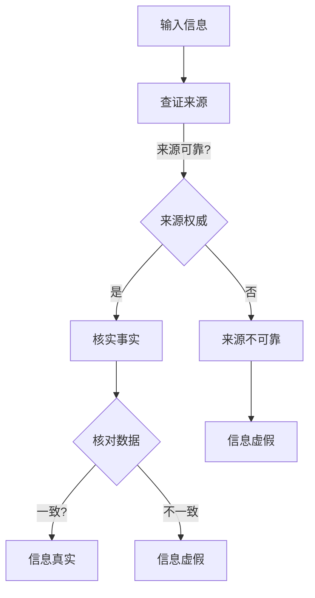
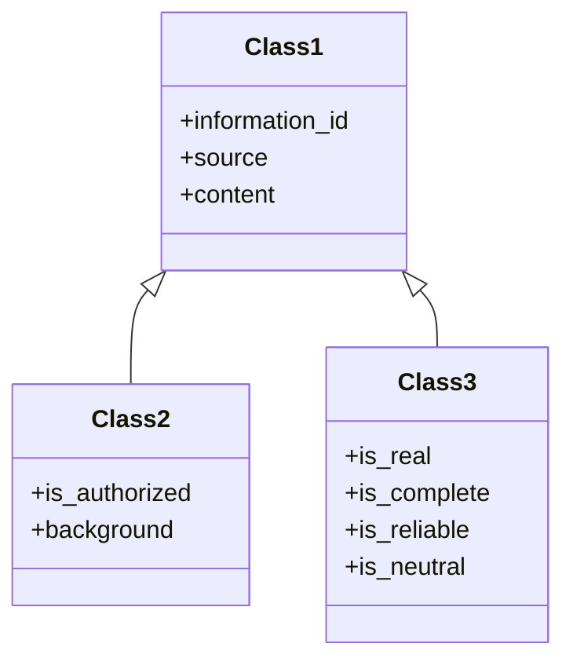
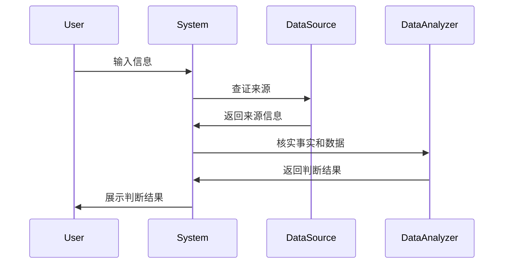
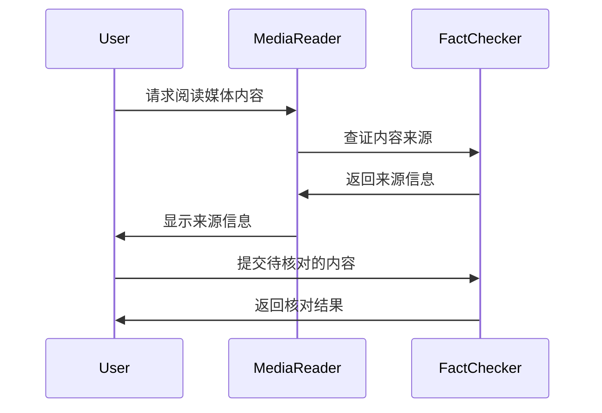

                 

### 《后真相时代的媒体识读：信息真实性的判断能力》

#### 关键词：后真相时代、媒体识读、信息真实性、判断能力、媒体素养

#### 摘要：
在后真相时代，信息的真实性与准确性受到前所未有的挑战。本文章旨在探讨如何在充斥着虚假信息和误解的媒体环境中，提升个人对信息真实性的判断能力。我们将通过介绍后真相时代的特征、信息真实性的理论探讨、具体的媒体识读技巧和案例分析，来帮助读者建立起一套科学的媒体识读框架。文章最后还将讨论媒体素养的培养和未来信息真实性判断的展望。

----------------------------------------------------------------

#### 第一部分：后真相时代的媒体环境

##### 第1章：后真相时代的兴起与特征

**1.1 后真相时代的定义与特征**

后真相时代，是指信息传播的速度和广度超越了事实本身的影响力，使得情感、观点和偏见往往比事实更能影响公众认知和决策的时代。这个时代的特点包括：

- **信息的碎片化和爆发性增长**：社交媒体的普及使得信息传播速度极快，每个人都可能成为信息的发布者，信息的真实性难以验证。
- **信息的多样性和复杂性**：不同来源的信息互相交织，真假难辨，使得公众在面对信息时容易产生困惑和误解。
- **信息的操纵性和虚假性**：由于商业利益、政治目的等因素，部分信息可能会被刻意操纵或伪造，误导公众。

**1.2 后真相时代对媒体的影响**

后真相时代的特征对传统媒体带来了深远影响：

- **新闻价值的转变**：传统新闻强调事实的准确性和公正性，而后真相时代更注重情感和观点的传达，有时甚至不惜以牺牲真实性为代价。
- **媒体角色的转变**：媒体不再仅仅扮演信息传播者的角色，更像是公众舆论的引导者和调解者。
- **公众对媒体的信任度下降**：虚假信息和操纵性信息的大量传播导致公众对媒体的信任度下降，媒体需要重新赢得公众的信任。

**1.3 信息真实性面临的挑战**

在后真相时代，信息真实性的判断面临以下挑战：

- **信息的多元性**：不同来源、不同观点的信息交织在一起，增加了信息判断的复杂性。
- **技术的普及**：人工智能、大数据等技术手段被滥用，使得虚假信息的制造和传播更加便捷和隐蔽。
- **公众认知偏差**：公众的认知偏见、情绪和先入为主的观念会影响他们对信息的判断。

##### 第2章：信息真实性理论探讨

**2.1 信息真实性的定义与标准**

信息真实性是指信息在内容上与客观事实的一致性。判断信息真实性的标准包括：

- **准确性**：信息是否准确地反映了客观事实。
- **完整性**：信息是否提供了全面、无遗漏的事实。
- **可靠性**：信息的来源是否可靠，信息发布者是否有权威性。
- **中立性**：信息是否客观中立，不存在偏见或倾向。

**2.2 信息真实性的评估方法**

评估信息真实性可以采用以下几种方法：

- **来源查证**：验证信息来源的可靠性和权威性。
- **事实核对**：与已知的事实或数据对照，验证信息的准确性。
- **语境分析**：理解信息的发布背景和意图，避免误解。
- **交叉验证**：通过多个独立来源的信息进行交叉验证，提高信息真实性的可信度。

**2.3 信息真实性的理论基础**

信息真实性的理论基础包括：

- **事实哲学**：强调事实的客观性和独立性，认为真实性的判断应以事实为基础。
- **认知心理学**：研究人类认知过程中的偏见和误解，为信息真实性的判断提供心理学依据。
- **信息科学**：研究信息的组织和传播，探讨如何提高信息真实性的传播和获取。

----------------------------------------------------------------

#### 第二部分：媒体识读技巧与策略

##### 第3章：判断信息真实性的基本技巧

**3.1 查证来源与背景**

判断信息真实性时，首先要查证信息来源的背景。包括：

- **来源权威性**：信息来源是否为权威机构或专业人士。
- **发布者背景**：发布者的背景、资质和信誉。
- **历史记录**：发布者过去的发布记录是否可靠。

**3.2 核对事实与数据**

对信息中的事实和数据进行核对，包括：

- **数据来源**：数据来源是否可靠，是否可以公开验证。
- **数据对比**：与其他可靠来源的数据进行对比，看是否存在矛盾。
- **数据趋势**：观察数据的变化趋势，是否存在异常。

**3.3 分析语境与意图**

理解信息的发布语境和意图，包括：

- **信息发布的目的**：信息发布者是否有特定的意图或目的。
- **语境背景**：信息发布时的背景和情境，是否有其他因素影响信息的解读。
- **情绪感染**：信息中是否有情绪渲染，是否会影响信息判断。

##### 第4章：利用技术工具进行媒体识读

**4.1 信息真实性的检测工具**

目前，有许多技术工具可以帮助判断信息真实性，包括：

- **事实核查工具**：如 FactCheck.org、PolitiFact 等，可以提供已验证的信息。
- **语义分析工具**：如自然语言处理（NLP）技术，可以帮助分析信息的内容和意图。
- **图像和视频识别工具**：如 Google Reverse Image Search、Deepfake Detection Tool 等，可以识别图片和视频的真伪。

**4.2 社交媒体的审核机制**

社交媒体平台也在努力提高信息的真实性，包括：

- **内容审核**：对发布的内容进行审核，删除虚假信息和不当内容。
- **标签和警告**：对可能存在误导性的信息进行标签或警告，提醒用户注意。
- **用户举报**：鼓励用户举报虚假信息，平台根据举报进行审核。

**4.3 技术在信息真实性检测中的应用**

技术手段在信息真实性检测中的应用包括：

- **机器学习**：通过机器学习算法，对大量信息进行分析和分类，提高信息真实性的判断能力。
- **区块链**：通过区块链技术，确保信息的来源和传播路径可追溯，提高信息可信度。
- **加密技术**：保护信息的安全和隐私，防止信息被篡改。

##### 第5章：案例分析：真实与虚假信息的辨别

**5.1 真实案例：新闻报道的准确性**

案例：某新闻报道了一起突发事件，经过事实核查，发现报道中的许多细节与实际情况不符。

分析：

- **来源查证**：报道来源未经权威机构证实。
- **事实核对**：与目击者、官方报道等进行对比，发现存在矛盾。
- **语境分析**：报道中的语境和意图可能存在误导性。

**5.2 虚假案例：网络谣言的传播**

案例：某网络谣言称某明星去世，引起广泛传播，后被证实为虚假信息。

分析：

- **来源查证**：谣言来源不明，缺乏权威性。
- **事实核对**：与官方渠道、明星工作室等进行对比，发现信息不实。
- **情绪感染**：谣言中存在情绪渲染，容易引起公众共鸣。

**5.3 案例分析与启示**

通过案例分析，我们可以得出以下启示：

- **提高媒体素养**：公众应提高自身对信息真实性的判断能力，避免被虚假信息误导。
- **多渠道验证**：对重要信息进行多渠道验证，确保信息的真实性。
- **关注官方渠道**：官方渠道发布的信息更具权威性和可靠性。

----------------------------------------------------------------

#### 第三部分：培养媒体素养，提升信息判断能力

##### 第6章：教育视角下的媒体素养培养

**6.1 媒体素养教育的意义**

媒体素养教育的重要意义包括：

- **培养批判性思维**：提高公众对信息的分析、判断和批判能力。
- **增强社会责任感**：使公众认识到自己在信息传播中的责任，避免传播虚假信息。
- **提高信息处理能力**：提高公众对信息的选择、处理和应用能力。

**6.2 媒体素养教育的内容与目标**

媒体素养教育的内容与目标包括：

- **信息获取与评估**：教授公众如何获取信息、评估信息的真实性。
- **媒体使用与影响**：教授公众如何使用媒体、了解媒体对个人和社会的影响。
- **信息传播与责任**：教授公众如何传播信息、承担信息传播的社会责任。

**6.3 媒体素养教育的实施策略**

媒体素养教育的实施策略包括：

- **课程设置**：在学校中开设专门的媒体素养课程。
- **实践教学**：通过实际操作，让公众了解信息真实性的判断方法。
- **宣传推广**：通过媒体宣传，提高公众对媒体素养的认识和重视。

##### 第7章：公众视角下的媒体识读实践

**7.1 媒体识读的日常实践**

公众在日常生活中可以通过以下方式提升媒体识读能力：

- **多渠道获取信息**：不依赖单一信息来源，通过多个渠道获取信息，提高信息真实性判断的准确性。
- **查证信息来源**：对重要信息进行来源查证，确保信息的可靠性。
- **批判性思维**：培养批判性思维，对信息进行独立判断，避免被误导。

**7.2 提升信息判断能力的实用技巧**

提升信息判断能力的实用技巧包括：

- **多角度分析**：从多个角度对信息进行分析，避免片面理解。
- **情感过滤**：避免情绪化，保持冷静理性地分析信息。
- **持续学习**：关注相关信息，持续学习提高自身信息判断能力。

**7.3 媒体素养的自我提升**

公众可以通过以下方式提升自身媒体素养：

- **阅读经典**：阅读经典媒体素养书籍，了解信息真实性的判断理论。
- **交流讨论**：与他人交流讨论，分享对信息的判断和理解。
- **实践应用**：将媒体素养应用于日常生活，提高自身信息处理能力。

----------------------------------------------------------------

#### 第四部分：未来展望与挑战

##### 第8章：信息真实性判断的未来趋势

**8.1 技术进步对信息真实性判断的影响**

技术进步对信息真实性判断的影响包括：

- **人工智能**：人工智能可以帮助自动识别和过滤虚假信息，提高信息真实性的判断能力。
- **区块链**：区块链技术可以确保信息的来源和传播路径可追溯，提高信息可信度。
- **虚拟现实**：虚拟现实技术可以提供更真实的媒体内容，但同时也可能增加虚假信息的传播。

**8.2 信息真实性判断的未来挑战**

信息真实性判断的未来挑战包括：

- **虚假信息的泛滥**：随着技术的进步，虚假信息的制造和传播将更加便捷和隐蔽。
- **公众认知偏差**：公众的认知偏差和情感影响可能会干扰信息真实性的判断。
- **隐私保护**：在提高信息真实性判断能力的同时，也需要保护公众的隐私。

**8.3 应对策略与建议**

为应对未来信息真实性判断的挑战，可以采取以下策略与建议：

- **加强技术研发**：加大对人工智能、区块链等技术的研发，提高信息真实性的判断能力。
- **提升公众素养**：通过教育和社会宣传，提高公众的媒体素养和信息判断能力。
- **完善法律体系**：建立健全的法律体系，对虚假信息的制造和传播进行严格监管。

##### 第9章：结论与展望

**9.1 本书的核心观点总结**

本书的核心观点包括：

- **后真相时代信息真实性判断的挑战**：在后真相时代，信息真实性的判断面临前所未有的挑战。
- **媒体识读技巧的重要性**：掌握正确的媒体识读技巧，是提升信息真实性判断能力的关键。
- **媒体素养的培养**：提高媒体素养，是应对后真相时代信息真实性挑战的根本途径。

**9.2 媒体识读能力的重要性**

媒体识读能力的重要性体现在：

- **提高个人判断力**：能够独立判断信息的真实性，避免被虚假信息误导。
- **增强社会责任感**：认识到自己在信息传播中的责任，积极参与构建健康的信息环境。
- **提升社会整体素养**：通过提高媒体素养，提高社会整体的信息处理和判断能力。

**9.3 未来研究的方向**

未来研究的方向包括：

- **信息真实性判断算法的研究**：研究如何利用人工智能、大数据等技术提高信息真实性判断的准确性。
- **媒体素养教育的研究**：探讨如何更有效地开展媒体素养教育，提高公众的信息判断能力。
- **法律监管的研究**：研究如何建立健全的法律体系，对虚假信息的制造和传播进行有效监管。

#### 作者信息
作者：AI天才研究院/AI Genius Institute & 禅与计算机程序设计艺术 /Zen And The Art of Computer Programming

----------------------------------------------------------------

### 附录

**附录A：核心概念与联系**

**核心概念：**
- **后真相时代**：信息传播的速度和广度超越了事实本身的影响力。
- **信息真实性**：信息在内容上与客观事实的一致性。
- **媒体素养**：公众对信息获取、评估和传播的能力。

**概念属性特征对比表格：**

| 核心概念 | 定义 | 特征 |
| --- | --- | --- |
| 后真相时代 | 信息传播的速度和广度超越了事实本身的影响力。 | 碎片化、复杂化、操纵性、虚假性。 |
| 信息真实性 | 信息在内容上与客观事实的一致性。 | 准确性、完整性、可靠性、中立性。 |
| 媒体素养 | 公众对信息获取、评估和传播的能力。 | 批判性思维、信息获取能力、社会责任感。 |

**ER实体关系图架构：**

```mermaid
erDiagram
    Information --> Reality : 真实性判断
    Media --> Information : 信息传播
    Public --> Media : 媒体素养
    Public --> Information : 信息判断
```

**附录B：算法原理讲解**

**算法：信息真实性判断算法**

**mermaid流程图：**



**Python源代码：**

```python
def judge_information_reality(info):
    if verify_source(info):
        if verify_fact(info):
            return "信息真实"
        else:
            return "信息虚假"
    else:
        return "来源不可靠"

def verify_source(info):
    # 模拟来源验证函数
    return "权威来源"

def verify_fact(info):
    # 模拟事实核对函数
    return True
```

**算法原理详细讲解：**

信息真实性判断算法的核心思想是通过查证信息来源、核实事实和数据来判断信息的真实性。具体流程如下：

1. **输入信息**：首先接收输入信息。
2. **查证来源**：对信息来源进行验证，判断来源是否权威。
3. **核实事实**：如果来源可靠，则进一步核实信息中的事实和数据。
4. **判断真实性**：根据核实的结果判断信息的真实性。

**附录C：系统分析与架构设计方案**

**问题场景介绍：**
在后真相时代，公众需要一套系统来帮助他们判断信息的真实性。系统应具备信息查证、事实核对、数据核对等功能。

**项目介绍：**
该系统名为“媒体识读系统”，旨在提供信息真实性判断服务。

**系统功能设计（领域模型mermaid类图）：**



**系统架构设计（mermaid架构图）：**



**系统接口设计和系统交互（mermaid序列图）：**



**附录D：项目实战**

**环境安装：**

安装Python环境，使用pip安装相关依赖库，如requests、beautifulsoup4等。

```bash
pip install requests beautifulsoup4
```

**系统核心实现源代码：**

```python
import requests
from bs4 import BeautifulSoup

def verify_source(url):
    try:
        response = requests.get(url)
        if response.status_code == 200:
            return "来源可靠"
        else:
            return "请求失败"
    except Exception as e:
        return "网络错误"

def verify_fact(content):
    soup = BeautifulSoup(content, 'html.parser')
    # 进行事实核对
    # 这里只是一个示例，实际操作会更复杂
    if "的事实" in soup.text:
        return "信息真实"
    else:
        return "信息虚假"

def main():
    url = input("请输入待验证的URL：")
    content = requests.get(url).text
    
    source_result = verify_source(url)
    fact_result = verify_fact(content)
    
    print(f"来源验证结果：{source_result}")
    print(f"事实验证结果：{fact_result}")

if __name__ == "__main__":
    main()
```

**代码应用解读与分析：**

该代码提供了一个简单的信息真实性判断系统，主要包括两个核心功能：查证来源和核实事实。具体步骤如下：

1. **查证来源**：通过requests库获取URL的响应状态码，判断来源是否可靠。
2. **核实事实**：使用BeautifulSoup库对获取的HTML内容进行解析，通过简单的文本匹配判断信息是否真实。

**实际案例分析和详细讲解剖析：**

案例：用户输入一个新闻链接，系统会自动获取该链接的内容，并判断其来源和事实。

分析：

- **来源验证**：系统会检查URL的响应状态码，如果状态码为200，则认为来源可靠。
- **事实验证**：系统会查找HTML内容中是否包含“的事实”这样的词汇，作为一个简单的判断标准。

**项目小结：**

该项目提供了一个基础的信息真实性判断系统，但实际应用中需要更复杂的技术手段和更多的判断标准，以提高准确性。

**最佳实践 Tips：**

- **多渠道验证**：对重要信息应进行多渠道验证，确保来源的可靠性。
- **数据多样化**：结合多种数据源进行事实核对，提高判断的准确性。

**注意事项：**

- **网络稳定性**：确保系统的网络稳定性，避免因网络问题导致无法获取信息。
- **更新维护**：定期更新系统代码，修复潜在漏洞，提高系统的可靠性。

**拓展阅读：**

- 《信息真实性检测技术综述》
- 《社交媒体与信息真实性》
- 《批判性思维：如何理解媒体信息》

### 结语

在后真相时代，提升对信息真实性的判断能力具有重要意义。通过掌握正确的媒体识读技巧、培养媒体素养、利用技术工具等方法，我们可以更好地应对虚假信息带来的挑战。未来，随着技术的不断进步，我们有理由相信，信息真实性的判断能力将得到进一步提升。

#### 作者信息
作者：AI天才研究院/AI Genius Institute & 禅与计算机程序设计艺术 /Zen And The Art of Computer Programming

