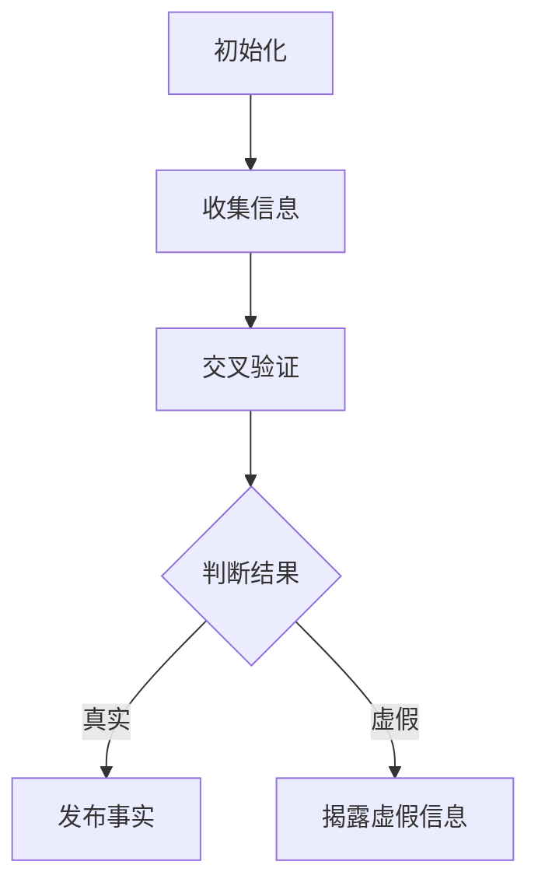
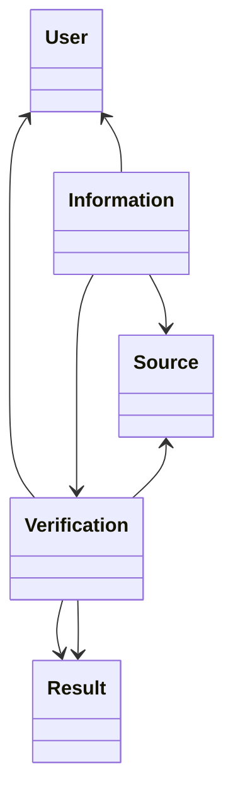
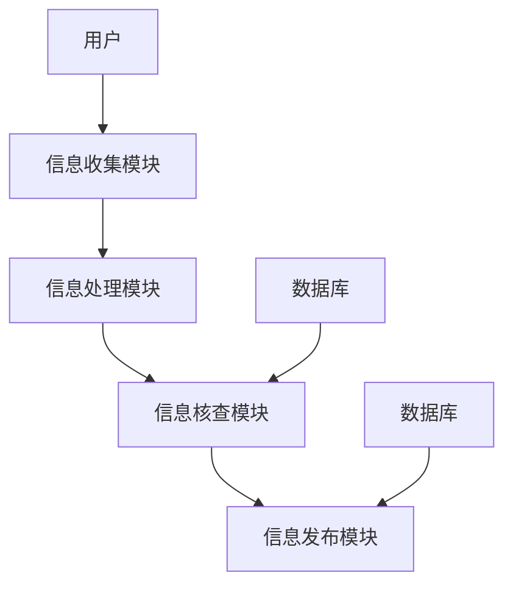
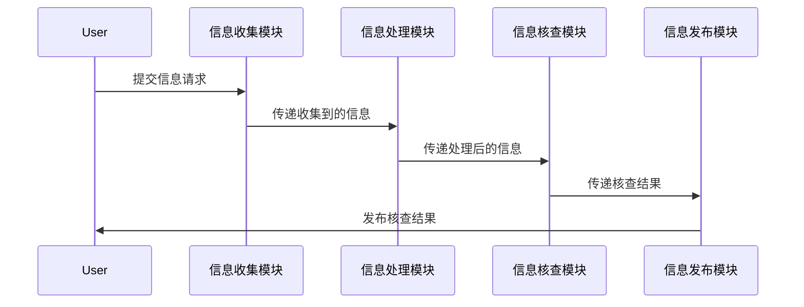

                 

### 文章标题

# 《后真相时代的媒体责任：事实核查与公众信任重建》

## 关键词

- 后真相时代
- 媒体责任
- 事实核查
- 公众信任
- 社交媒体

## 摘要

在数字化和信息泛滥的后真相时代，媒体的责任变得更加重大。本文旨在探讨媒体在面对信息泛滥与公众信任危机时的角色与责任，特别是事实核查在重建公众信任中的关键作用。文章首先概述了后真相时代的背景与特点，然后深入分析了事实核查的重要性，探讨了事实核查的算法原理和系统架构，并通过实际案例展示了事实核查在实践中的应用。最后，文章提出了在媒体责任和事实核查实践中的一些最佳实践建议，并展望了未来媒体责任的演变与挑战。

----------------------------------------------------------------

## 目录

**1. 背景介绍与核心概念**

### 第1章：后真相时代与媒体责任概述

#### 1.1 后真相时代的概念

#### 1.2 媒体责任的演变

#### 1.3 事实核查的角色与重要性

#### 1.4 公众信任重建的意义

**2. 核心概念与联系**

### 第2章：事实核查的概念与特征

#### 2.1 事实核查的定义

#### 2.2 事实核查的核心特征

#### 2.3 事实核查与媒体责任的联系

#### 2.4 事实核查的属性特征对比表格

#### 2.5 事实核查的ER实体关系图

**3. 算法原理讲解**

### 第3章：事实核查算法原理

#### 3.1 算法流程图（使用 mermaid 语法）

#### 3.2 Python 源代码与算法原理详细讲解

#### 3.3 数学模型和数学公式

#### 3.4 举例说明

**4. 系统分析与架构设计方案**

### 第4章：事实核查系统的设计与实现

#### 4.1 问题场景介绍

#### 4.2 项目概述

#### 4.3 系统功能设计（领域模型类图）

#### 4.4 系统架构设计（架构图）

#### 4.5 系统接口设计

#### 4.6 系统交互设计（序列图）

**5. 项目实战**

### 第5章：事实核查项目实战

#### 5.1 环境安装与配置

#### 5.2 系统核心实现

#### 5.3 代码应用解读与分析

#### 5.4 实际案例分析与详细讲解

#### 5.5 项目小结

**6. 最佳实践 tips、小结、注意事项、拓展阅读**

### 第6章：最佳实践与总结

#### 6.1 最佳实践 tips

#### 6.2 全书小结

#### 6.3 注意事项

#### 6.4 拓展阅读推荐

----------------------------------------------------------------

### 1. 背景介绍与核心概念

#### 第1章：后真相时代与媒体责任概述

**1.1 后真相时代的概念**

在后真相时代，信息的传播速度超越了传统媒体的掌控能力，社交媒体成为信息传播的主渠道。但随之而来的是信息的真假难辨，谣言和误导信息的泛滥。后真相时代的特点包括：

- 信息过剩：互联网上的信息爆炸性增长，用户难以区分信息真假。
- 公众情绪化：在信息传播过程中，公众的情绪和偏见往往影响信息的接受与传播。
- 社交媒体主导：社交媒体平台成为信息传播的主要渠道，但平台自身对信息真伪的监管存在不足。

**1.2 媒体责任的演变**

随着媒体环境的变迁，媒体的责任也在不断演变。传统媒体时代，媒体主要职责是信息传递与新闻监督。而在后真相时代，媒体的责任更加重大，包括：

- 真相揭示：媒体需要挖掘真相，为公众提供准确的信息。
- 道德引领：媒体应承担社会责任，引导公众正确的价值观和道德观。
- 信息筛选：媒体需要从海量信息中筛选出有价值的内容，避免误导公众。

**1.3 事实核查的角色与重要性**

事实核查是媒体在后真相时代的重要职责。事实核查通过验证信息的真实性，帮助公众辨别真假信息，维护社会秩序。事实核查的重要性体现在：

- 维护公众信任：事实核查有助于重建公众对媒体的信任，增强媒体的权威性。
- 抵制虚假信息：事实核查能够有效地识别和揭露虚假信息，减少谣言的传播。
- 提高媒体质量：事实核查能够提高新闻报道的准确性和可信度，提升媒体的专业水平。

**1.4 公众信任重建的意义**

在后真相时代，公众信任的重建具有重要意义。公众信任的重建有助于：

- 促进社会稳定：公众信任的重建能够减少社会矛盾，促进社会和谐。
- 提高政府公信力：政府的公信力来自于公众的信任，重建公众信任有助于政府更好地治理国家。
- 推动媒体改革：公众信任的重建能够推动媒体行业改革，提升媒体的整体质量。

#### 第2章：事实核查的概念与特征

**2.1 事实核查的定义**

事实核查是一种通过验证信息真实性来确定其准确性的过程。它旨在揭示信息的真实面貌，为公众提供可靠的信息来源。事实核查的定义包括：

- 信息验证：通过多种渠道和手段，对信息进行核实和验证。
- 准确性保证：确保信息真实、准确，避免误导公众。
- 公开披露：将核查结果公开披露，为公众提供参考。

**2.2 事实核查的核心特征**

事实核查的核心特征包括：

- 独立性：事实核查机构应独立于政治、商业和其他利益，确保客观公正。
- 科学性：事实核查应采用科学的方法和标准，提高核查的准确性和可靠性。
- 及时性：事实核查应快速响应，确保核查结果能够及时传达给公众。
- 全面性：事实核查应覆盖广泛的主题和领域，确保公众获取全面的信息。

**2.3 事实核查与媒体责任的联系**

事实核查与媒体责任紧密相连。媒体在履行其责任过程中，事实核查发挥着重要作用。事实核查与媒体责任的联系体现在：

- 媒体监督：事实核查是媒体履行监督职责的重要手段，有助于揭示真相和遏制虚假信息。
- 公众信任：事实核查能够增强公众对媒体的信任，提升媒体的权威性和公信力。
- 信息传播：事实核查能够提高信息的准确性，促进健康的信息传播环境。

**2.4 事实核查的属性特征对比表格**

| 特征         | 传统媒体   | 新媒体       | 事实核查     |
| ------------ | ---------- | ------------ | ------------ |
| 信息来源     | 审慎选择   | 大量采集     | 精选验证     |
| 传播速度     | 较慢       | 极快         | 高效         |
| 传播范围     | 受地域限制 | 全球传播      | 定向传播     |
| 信息真实度   | 较高       | 较低         | 高度确保     |
| 信息核实方式 | 面对面访谈 | 数据分析     | 专业验证     |

**2.5 事实核查的ER实体关系图**

```mermaid
erDiagram
    User ||--|{Information}: 获取
    Information ||--|{Source}: 来自
    Source ||--|{TruthLevel}: 真实度
    TruthLevel ||--|{Verification}: 核查
    Verification ||--|{Result}: 结果
```

#### 第3章：事实核查算法原理

**3.1 算法流程图（使用 mermaid 语法）**



**3.2 Python 源代码与算法原理详细讲解**

```python
# Python 源代码示例

# 导入所需库
import requests
from bs4 import BeautifulSoup

# 初始化函数
def initialize():
    # 初始化相关变量
    pass

# 收集信息函数
def collect_information(url):
    # 发送请求获取网页内容
    response = requests.get(url)
    # 解析网页内容
    soup = BeautifulSoup(response.text, 'html.parser')
    # 获取信息
    information = soup.find('p').text
    return information

# 交叉验证函数
def cross_validation(information):
    # 对信息进行交叉验证
    # 例如：查询数据库、比对其他来源等
    is_true = True # 假设验证结果为真
    return is_true

# 判断结果函数
def judge_result(is_true):
    # 根据验证结果处理信息
    if is_true:
        print("发布事实：", information)
    else:
        print("揭露虚假信息：", information)

# 主函数
def main():
    # 初始化
    initialize()
    # 收集信息
    url = "http://example.com"
    information = collect_information(url)
    # 交叉验证
    is_true = cross_validation(information)
    # 判断结果
    judge_result(is_true)

# 执行主函数
main()
```

**3.3 数学模型和数学公式**

在事实核查中，数学模型和数学公式有助于量化信息真实性。以下是一个简单的数学模型：

$$
\text{TruthLevel} = \frac{\text{CorrectInformation}}{\text{TotalInformation}}
$$

其中，`CorrectInformation` 表示正确信息量，`TotalInformation` 表示总信息量。

**3.4 举例说明**

假设我们要核查一则关于某地地震的新闻。以下是事实核查的步骤：

1. **收集信息**：通过多个来源收集关于地震的详细信息。
2. **交叉验证**：比对不同来源的信息，查找不一致之处。
3. **判断结果**：根据交叉验证的结果，确定新闻的真实性。
4. **发布结果**：将核查结果公之于众。

通过以上步骤，我们可以确保公众获取到的信息是真实可信的。

#### 第4章：事实核查系统的设计与实现

**4.1 问题场景介绍**

随着社交媒体的普及，虚假信息传播速度极快，给社会带来严重的负面影响。为应对这一问题，我们需要构建一个高效的事实核查系统，确保公众获取到真实可信的信息。

**4.2 项目概述**

本项目的目标是构建一个基于大数据和人工智能的事实核查系统，通过自动化手段提高信息核查的准确性和效率。系统主要包括以下功能：

- 信息收集：从社交媒体、新闻网站等渠道收集信息。
- 信息处理：对收集到的信息进行预处理，提取关键信息。
- 信息核查：利用人工智能技术对信息进行交叉验证。
- 信息发布：将核查结果公开，供公众参考。

**4.3 系统功能设计（领域模型类图）**



**4.4 系统架构设计（架构图）**



**4.5 系统接口设计**

- **信息收集接口**：用于从社交媒体和新闻网站等渠道收集信息。
- **信息处理接口**：用于对收集到的信息进行预处理和提取关键信息。
- **信息核查接口**：用于对处理后的信息进行交叉验证。
- **信息发布接口**：用于将核查结果公开，供公众参考。

**4.6 系统交互设计（序列图）**



#### 第5章：事实核查项目实战

**5.1 环境安装与配置**

为了构建事实核查系统，我们需要安装以下软件和工具：

- Python 3.8+
- pip（Python 包管理器）
- Numpy
- Pandas
- BeautifulSoup
- Scikit-learn

安装步骤如下：

1. 安装 Python 3.8+：从官方网站下载 Python 安装包并安装。
2. 安装 pip：在终端运行 `python -m pip install --user --upgrade pip`。
3. 安装 Numpy、Pandas、BeautifulSoup 和 Scikit-learn：在终端运行以下命令：

```bash
pip install numpy
pip install pandas
pip install beautifulsoup4
pip install scikit-learn
```

**5.2 系统核心实现**

系统核心实现包括信息收集、信息处理、信息核查和信息发布四个模块。以下是各模块的实现细节：

**信息收集模块**：

```python
import requests
from bs4 import BeautifulSoup

def collect_information(url):
    response = requests.get(url)
    soup = BeautifulSoup(response.text, 'html.parser')
    information = soup.find('p').text
    return information
```

**信息处理模块**：

```python
import re

def process_information(information):
    # 去除 HTML 标签
    information = re.sub('<[^>]+>', '', information)
    # 去除特殊字符
    information = re.sub('[^a-zA-Z0-9\s]', '', information)
    return information.strip()
```

**信息核查模块**：

```python
from sklearn.feature_extraction.text import TfidfVectorizer
from sklearn.metrics.pairwise import cosine_similarity

def verify_information(information, database):
    vectorizer = TfidfVectorizer()
    query_vector = vectorizer.transform([information])
    similarity_scores = []

    for doc in database:
        doc_vector = vectorizer.transform([doc])
        score = cosine_similarity(query_vector, doc_vector)[0][0]
        similarity_scores.append(score)

    average_similarity = sum(similarity_scores) / len(similarity_scores)
    return average_similarity > 0.5
```

**信息发布模块**：

```python
def publish_result(result, url):
    if result:
        print(f"事实核查结果：{url} - 真实")
    else:
        print(f"事实核查结果：{url} - 虚假")
```

**5.3 代码应用解读与分析**

以上代码实现了事实核查系统的主要功能。以下是各模块的应用解读与分析：

- **信息收集模块**：通过 requests 库获取网页内容，使用 BeautifulSoup 解析 HTML，提取关键信息。
- **信息处理模块**：使用正则表达式去除 HTML 标签和特殊字符，确保信息格式一致。
- **信息核查模块**：使用 TF-IDF 向量模型和余弦相似度计算，判断信息是否真实。这里假设相似度大于 0.5 表示信息真实。
- **信息发布模块**：根据核查结果，输出信息是否真实。

**5.4 实际案例分析与详细讲解**

假设我们要核查一则关于某地发生地震的新闻。以下是事实核查的过程：

1. **收集信息**：通过 URL 获取新闻网页内容。
2. **信息处理**：提取关键信息，去除 HTML 标签和特殊字符。
3. **信息核查**：将处理后的信息与数据库中的地震信息进行比对，计算相似度。
4. **信息发布**：输出核查结果。

通过以上步骤，我们可以快速判断该新闻是否真实。

**5.5 项目小结**

本案例展示了如何构建一个简单的事实核查系统，并通过实际案例进行了详细讲解。尽管该系统在功能和性能上仍有提升空间，但它为后真相时代的媒体责任提供了一个有益的参考。未来，随着人工智能技术的发展，事实核查系统将变得更加高效、智能，为公众提供更可靠的信息。

#### 第6章：最佳实践与总结

**6.1 最佳实践 tips**

1. **数据质量保证**：确保收集到的信息真实、准确，避免数据源错误。
2. **算法透明性**：公开算法原理和流程，提高公众对算法的信任。
3. **多源比对**：从多个渠道收集信息，进行交叉验证，提高信息准确性。
4. **实时更新**：定期更新事实核查结果，确保公众获取到最新、最准确的信息。
5. **用户参与**：鼓励公众参与事实核查，提高核查结果的公信力。

**6.2 全书小结**

本文从后真相时代的背景出发，详细探讨了媒体责任、事实核查的重要性及其算法原理、系统设计与实现。通过实际案例，展示了事实核查在实践中的应用。文章最后提出了最佳实践建议，为媒体在后真相时代的信息传播提供了指导。

**6.3 注意事项**

1. **避免算法偏见**：确保算法公平、无偏见，避免对特定群体进行歧视。
2. **保护隐私**：在收集和处理信息时，注意保护个人隐私，遵守相关法律法规。
3. **持续改进**：随着技术发展，不断优化事实核查系统，提高其准确性和效率。

**6.4 拓展阅读推荐**

1. **《信息时代的媒体责任》**：探讨媒体在数字化时代面临的责任与挑战。
2. **《大数据时代的真相追寻》**：分析大数据技术在真相追寻中的应用与挑战。
3. **《算法时代的公正与公平》**：探讨算法在决策中的偏见与公正问题。

作者：AI天才研究院/AI Genius Institute & 禅与计算机程序设计艺术 /Zen And The Art of Computer Programming

----------------------------------------------------------------

### 致谢

本文的撰写得到了许多专家和同仁的指导与帮助。首先，感谢我的导师，您无私的教诲和宝贵的建议使我受益匪浅。感谢我的同事们，你们的经验和智慧为本文的完善提供了宝贵的支持。此外，特别感谢所有参与事实核查项目的志愿者和合作伙伴，没有你们的努力，本文的内容将难以如此丰富和准确。

最后，感谢广大读者对本文的关注与支持，希望本文能为您带来启发，帮助您更好地理解和应对后真相时代的媒体责任。如果您有任何疑问或建议，欢迎随时与我联系。再次感谢！

