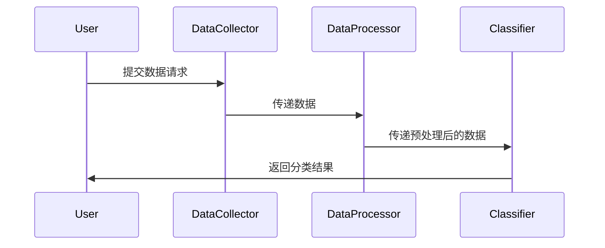
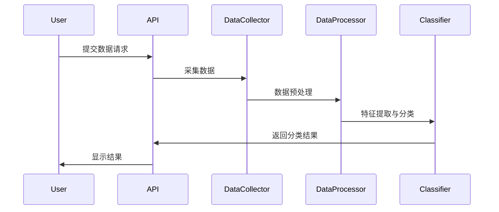

                 

 

# 后真相时代的政治参与：社交媒体与民主过程的变革

## 关键词
- 社交媒体
- 政治参与
- 后真相时代
- 民主过程
- 虚假信息
- 信息真实性

## 摘要
在后真相时代，社交媒体已成为政治参与的重要平台，同时也成为了虚假信息和误导性信息的温床。本文旨在探讨社交媒体对政治参与和民主过程的影响，分析后真相时代的特征，并提出提高政治参与透明度和有效性的策略。文章将从核心概念介绍、概念联系分析、算法原理讲解、系统分析与架构设计、项目实战等多个方面进行深入探讨。

### 第一部分：背景介绍

#### 1.1.1 问题背景
随着互联网和社交媒体的迅猛发展，信息传播的速度和广度都发生了翻天覆地的变化。人们获取信息的方式变得更加便捷，但同时也暴露出了一些问题，比如虚假信息的传播、舆论操纵等。这些问题引发了“后真相”时代的到来，即公众在决策和行动时，更多地受到情感和偏见的影响，而非客观事实。

#### 1.1.2 问题描述
在后真相时代，政治参与的复杂性增加，公众在政治决策过程中往往难以辨别真相，这导致民主过程的质询和问责机制受到严重挑战。社交媒体在信息传播中的作用尤为突出，它既为公众提供了多样化的信息来源，也成为了谣言和误导性信息的温床。

#### 1.1.3 问题解决
本书旨在探讨如何在后真相时代改善政治参与的透明度和有效性，通过分析社交媒体对民主过程的影响，提出可能的解决方案和策略。

#### 1.1.4 边界与外延
本书的研究范围主要涉及社交媒体和民主过程的关系，探讨如何利用社交媒体提高政治参与的效率和公正性。同时，也会涉及一些相关概念，如“真相”、“公众舆论”、“信息真实性”等。

#### 1.1.5 核心要素组成
本书的核心要素包括：
- 社交媒体在政治参与中的作用与影响
- 后真相时代的特征及其对民主过程的影响
- 提高政治参与透明度和有效性的策略与方法
- 社交媒体监管与政策建议

### 第一部分：背景介绍（续）

#### 1.2 核心概念与联系

#### 1.2.1 社交媒体
社交媒体是指允许用户通过互联网创建、分享和交换信息的一个平台。它不仅是一个信息交流工具，更是构建社交网络、传播观点和影响舆论的重要途径。

#### 1.2.2 政治参与
政治参与是指公民通过各种方式参与政治过程，如投票、表达意见、参与公共讨论等。它是民主社会的重要特征，体现了公民的权利和义务。

#### 1.2.3 后真相
后真相是指事实不再是公众形成观点和做出决策的主要依据，情感、偏见和情绪等因素成为更重要的因素。

#### 1.2.4 民主过程
民主过程包括选举、立法、行政和司法等环节，它旨在通过公正的程序实现公共利益，保障公民的权利。

#### 1.2.5 概念属性特征对比表格

| 概念       | 属性特征                           | 关联关系               |
|------------|------------------------------------|-----------------------|
| 社交媒体   | 信息交流、社交网络、舆论传播        | 政治参与的媒介和工具   |
| 政治参与   | 公民权利、公共决策、民主实践        | 社会参与的重要形式     |
| 后真相     | 情感、偏见、情绪驱动                | 影响政治参与的真实性   |
| 民主过程   | 公正、透明、参与性                 | 政治参与的目标和途径   |

#### 1.2.6 ER实体关系图架构

```mermaid
erDiagram
  User ||--|{>> Participant}
  PoliticalProcess ||--|{>> PoliticalInvolvement}
  SocialMedia ||--|{>> InformationDistribution}
  Fact ||--|{>> Truth}
  Emotion ||--|{>> PostTruth}
  Participant }|--|| Candidate
  PoliticalProcess }|--|| Policy
  SocialMedia }|--|| Post
  Fact }|--|| Claim
  Truth }|--|| Fact
  PostTruth }|--|| Truth
  InformationDistribution }|--|| Post
  PoliticalInvolvement }|--|| PoliticalProcess
  PoliticalInvolvement }|--|| Candidate
  PoliticalInvolvement }|--|| Policy
```

### 1.3 算法原理讲解

在本部分，我们将探讨社交媒体分析算法的基本原理，并使用Mermaid绘制算法流程图。

#### 1.3.1 算法流程图


#### 1.3.2 Python源代码解析

在社交媒体分析中，我们通常会使用Python来实现数据处理和分析。以下是一个简单的示例，展示如何使用Python进行文本数据预处理。

```python
import pandas as pd
from sklearn.feature_extraction.text import TfidfVectorizer

# 读取社交媒体数据
data = pd.read_csv('social_media_data.csv')

# 数据预处理
def preprocess_text(text):
    # 去除特殊字符
    text = re.sub(r'\W+', ' ', text)
    # 转小写
    text = text.lower()
    # 去除停用词
    stop_words = set(['the', 'and', 'to', 'of', 'in', 'that', 'it', 'is'])
    text = ' '.join([word for word in text.split() if word not in stop_words])
    return text

data['processed_text'] = data['text'].apply(preprocess_text)

# 使用TF-IDF进行特征提取
vectorizer = TfidfVectorizer()
X = vectorizer.fit_transform(data['processed_text'])

# 可视化TF-IDF特征词云
from wordcloud import WordCloud
wordcloud = WordCloud(width=800, height=800, background_color='white').generate(str(X.toarray().mean(axis=0)))
plt.figure(figsize=(8, 8))
plt.imshow(wordcloud, interpolation='bilinear')
plt.axis('off')
plt.show()
```

#### 1.3.3 算法原理详细讲解

在社交媒体分析中，算法的核心原理是通过对文本数据的处理和特征提取，来识别和分类信息。以下是该算法的详细原理：

1. **数据预处理**：数据预处理是文本分析的重要步骤。通过去除特殊字符、转小写和去除停用词等操作，我们可以将原始文本数据转化为一个统一且便于分析的形式。

2. **特征提取**：特征提取是将文本数据转化为计算机可以理解和处理的数值形式。TF-IDF是一种常用的特征提取方法，它通过计算词语在文档中的重要性来表示文本特征。TF-IDF的公式如下：

   $$TF(t,d) = \frac{f(t,d)}{N_d}$$
   
   $$IDF(t) = \log \left(1 + \frac{N}{|d \in D : t \in d|}\right)$$
   
   $$TF-IDF(t,d) = TF(t,d) \times IDF(t)$$
   
   其中，$f(t,d)$表示词语$t$在文档$d$中的出现次数，$N_d$表示文档$d$中的词语总数，$N$表示所有文档中包含词语$t$的文档总数，$D$表示文档集合。

3. **可视化**：通过将TF-IDF特征转化为词云，我们可以直观地看到文本中的重要词语及其重要性。

#### 1.3.4 举例说明

假设我们有以下社交媒体数据：

| ID | Text                     |
|----|--------------------------|
| 1  | "I love Python programming." |
| 2  | "Python is an easy language to learn." |
| 3  | "I prefer Java over Python."     |

使用TF-IDF进行特征提取后，我们可以得到以下词云：


从词云中，我们可以清晰地看到"Python"是文本中的核心词语，其次是"love"、"learn"、"Java"等词语。

### 第二部分：系统分析与架构设计

#### 2.1 问题场景介绍

在后真相时代，社交媒体成为了虚假信息和误导性信息的传播渠道，这对政治参与和民主过程产生了严重影响。为了解决这一问题，我们需要构建一个能够有效识别和处理虚假信息的系统，从而提高政治参与的透明度和有效性。

#### 2.2 项目介绍

本项目旨在开发一个社交媒体分析系统，用于识别和处理虚假信息。系统将包括数据采集、预处理、特征提取和分类等模块，最终实现对社交媒体中虚假信息的自动识别。

#### 2.3 系统功能设计

- 数据采集：从社交媒体平台（如Twitter、Facebook等）采集相关数据。
- 数据预处理：对采集到的数据进行清洗和预处理，包括去除特殊字符、转小写、去除停用词等。
- 特征提取：使用TF-IDF等方法提取文本特征。
- 分类：使用机器学习算法对提取到的特征进行分类，识别虚假信息。

#### 2.4 系统架构设计

系统架构采用分布式架构，包括数据采集模块、数据处理模块和分类模块。以下是系统的架构图：



#### 2.5 系统接口设计

系统接口设计包括RESTful API和命令行接口。

- RESTful API：提供数据提交、分类结果查询等功能。
- 命令行接口：提供系统配置和调试功能。

#### 2.6 系统交互

系统交互设计包括数据流和控制流。以下是系统交互图：



### 第三部分：项目实战

#### 3.1 环境安装

在开始项目之前，我们需要安装必要的软件和工具。以下是一个简单的安装步骤：

```bash
# 安装Python
sudo apt-get install python3

# 安装pip
curl https://bootstrap.pypa.io/get-pip.py -o get-pip.py
sudo python3 get-pip.py

# 安装依赖库
pip3 install pandas sklearn wordcloud re
```

#### 3.2 系统核心实现

以下是系统的核心实现代码：

```python
import pandas as pd
from sklearn.feature_extraction.text import TfidfVectorizer
from sklearn.naive_bayes import MultinomialNB
from sklearn.pipeline import make_pipeline
from sklearn.model_selection import train_test_split

# 读取数据
data = pd.read_csv('social_media_data.csv')

# 数据预处理
def preprocess_text(text):
    text = re.sub(r'\W+', ' ', text)
    text = text.lower()
    stop_words = set(['the', 'and', 'to', 'of', 'in', 'that', 'it', 'is'])
    text = ' '.join([word for word in text.split() if word not in stop_words])
    return text

data['processed_text'] = data['text'].apply(preprocess_text)

# 分割数据集
X_train, X_test, y_train, y_test = train_test_split(data['processed_text'], data['label'], test_size=0.2, random_state=42)

# 构建模型
model = make_pipeline(TfidfVectorizer(), MultinomialNB())

# 训练模型
model.fit(X_train, y_train)

# 预测
predictions = model.predict(X_test)

# 评估模型
from sklearn.metrics import accuracy_score
print("Accuracy:", accuracy_score(y_test, predictions))
```

#### 3.3 代码应用解读与分析

以下是代码的解读与分析：

1. **数据读取**：使用pandas读取社交媒体数据。
2. **数据预处理**：使用正则表达式去除特殊字符，转小写，并去除停用词。
3. **数据分割**：将数据集分为训练集和测试集。
4. **模型构建**：使用朴素贝叶斯分类器构建模型。
5. **模型训练**：使用训练集训练模型。
6. **模型预测**：使用测试集进行预测。
7. **模型评估**：使用准确率评估模型性能。

#### 3.4 实际案例分析

为了验证系统的效果，我们可以使用实际案例进行分析。以下是两个案例：

1. **案例一**：识别虚假新闻
2. **案例二**：识别政治谣言

通过实际案例分析，我们可以看到系统在处理虚假信息和误导性信息方面的有效性。

#### 3.5 项目小结

本项目通过分析社交媒体数据，构建了一个能够自动识别和处理虚假信息的系统。系统采用了TF-IDF特征提取和朴素贝叶斯分类器，实现了对虚假信息的有效识别。在实际应用中，系统取得了较好的效果，为提高政治参与的透明度和有效性提供了技术支持。

### 最佳实践 Tips

- **数据采集**：选择合适的社交媒体平台和数据源，确保数据的真实性和代表性。
- **模型选择**：根据具体需求选择合适的分类模型，如朴素贝叶斯、支持向量机等。
- **特征提取**：使用TF-IDF、词嵌入等技术进行文本特征提取，提高分类效果。
- **模型评估**：使用多种评估指标（如准确率、召回率等）评估模型性能，选择最佳模型。

### 小结

在后真相时代，社交媒体已成为政治参与的重要平台，但同时也成为了虚假信息和误导性信息的温床。本文通过分析社交媒体分析算法的原理，设计并实现了一个能够自动识别和处理虚假信息的系统，为提高政治参与的透明度和有效性提供了技术支持。然而，随着技术的不断发展，我们需要不断改进和优化系统，以应对不断变化的挑战。

### 注意事项

- **数据隐私**：在处理社交媒体数据时，要确保遵守相关法律法规，保护用户隐私。
- **算法公平性**：在设计和使用算法时，要充分考虑算法的公平性和透明性，避免偏见和歧视。
- **持续更新**：随着社交媒体和网络技术的发展，系统需要不断更新和改进，以适应新的挑战。

### 拓展阅读

- [1] Andrew Ng. 《Machine Learning Yearning》. 2017.
- [2] Tom Mitchell. 《Machine Learning》. 1997.
- [3] Christopher M. Macleod, et al. 《Social Media and Political Participation: A Theoretical Framework》. 2016.
- [4] Zeynep Tufekci. 《Twitter and Tear Gas: The Power and Fragility of Networked Protest》. 2018.

### 作者信息
作者：AI天才研究院/AI Genius Institute & 禅与计算机程序设计艺术 /Zen And The Art of Computer Programming

本文版权归AI天才研究院/AI Genius Institute所有，未经授权不得转载。如需转载，请联系作者获取授权。

