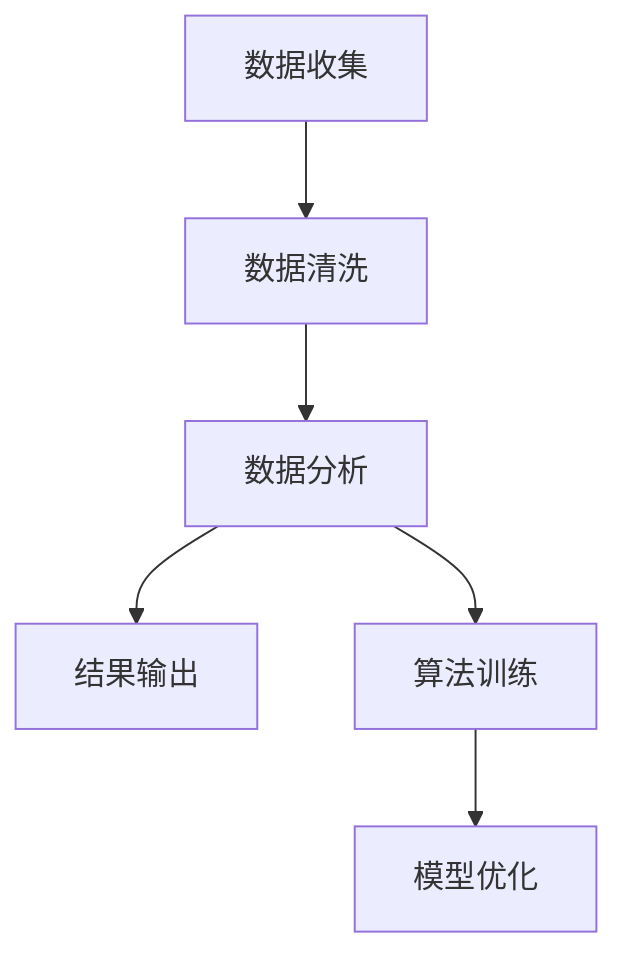
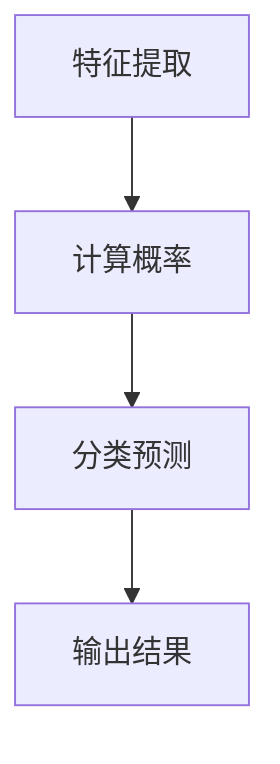
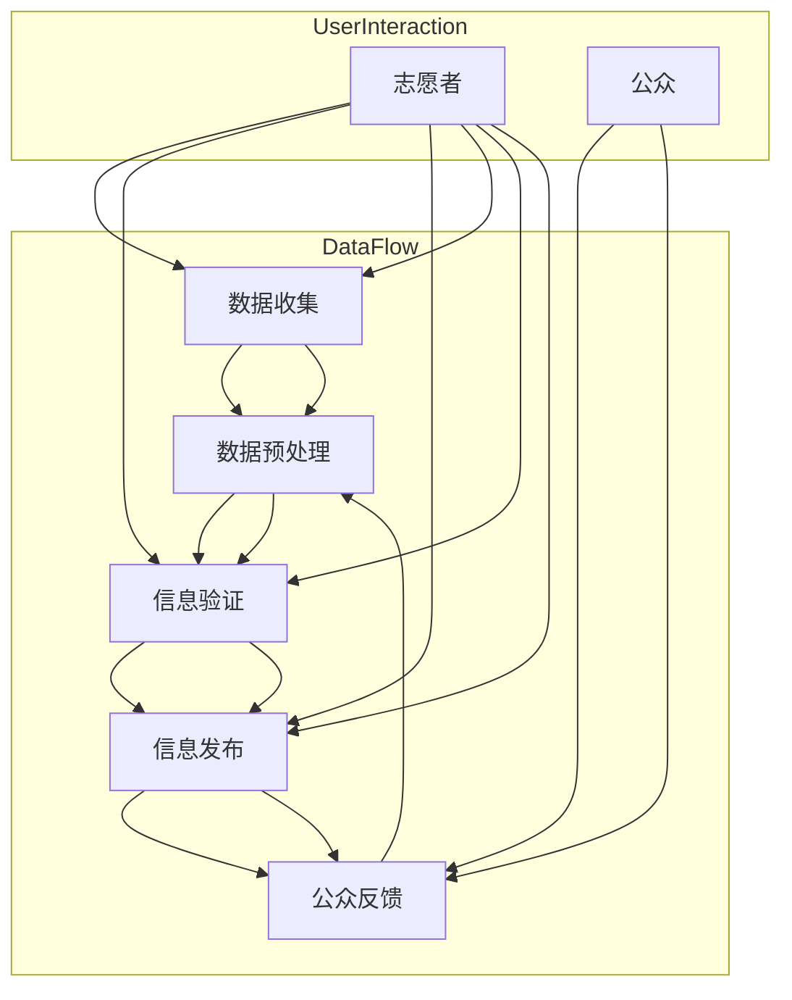
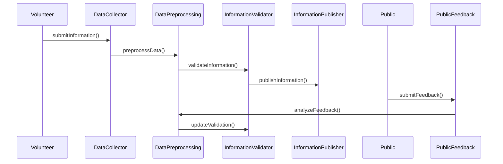
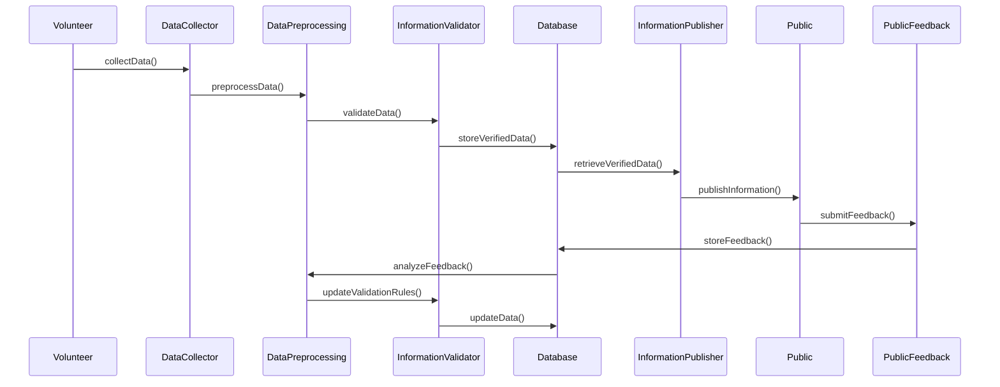

                 

### 引言

在当今信息爆炸的时代，我们面临着前所未有的信息泛滥。社交媒体、新闻网站、自媒体平台等提供了海量的信息，但同时也带来了真相的困境。在“后真相时代”，事实的真相往往被情绪化的言论和虚假信息所掩盖，使得公众难以分辨真伪。这种信息环境对社会稳定和个体认知造成了巨大的挑战。

为了应对这一挑战，一个名为“真相守护者联盟”的事实核查志愿者网络应运而生。这个网络由一群具有高度社会责任感和技术背景的志愿者组成，他们的目标是收集、验证和传播真实、可靠的信息。通过这个网络，真相得到了更加有效的守护，公众的知情权得到了保障。

本文将深入探讨“后真相时代的真相守护者联盟：事实核查志愿者网络”的运作原理和实现方法。我们将首先定义后真相时代的特征，并探讨信息泛滥对真相带来的挑战。接着，我们将介绍真相守护者联盟的架构和运作机制，以及它们在社会中的影响力。随后，我们将详细分析事实核查的核心概念和技术原理，包括数据收集、分析方法和算法应用。在此基础上，我们将通过具体案例展示事实核查的实际应用，并介绍相关的系统实现和项目实战。最后，我们将展望事实核查的未来发展趋势，总结核心观点，并提供拓展阅读资源。

通过本文的阅读，读者将能够全面理解事实核查志愿者网络的重要性和运作机制，以及如何在后真相时代中成为一名有效的真相守护者。

### 关键词

- 后真相时代
- 事实核查
- 真相守护者联盟
- 数据收集与分析
- 算法应用
- 真相困境

### 摘要

本文旨在探讨后真相时代下的事实核查志愿者网络，这是一个由具有高度社会责任感的志愿者组成的网络，旨在通过收集、验证和传播真实、可靠的信息，守护真相。文章首先定义了后真相时代的特征，分析了信息泛滥对真相带来的挑战。接着，详细介绍了真相守护者联盟的架构和运作机制，以及其在社会中的影响力。然后，深入探讨了事实核查的核心概念和技术原理，包括数据收集、分析方法和算法应用。通过具体案例展示了事实核查的实际应用，并介绍了相关的系统实现和项目实战。最后，文章展望了事实核查的未来发展趋势，总结了核心观点，并提供了拓展阅读资源。

### 第一部分：引言

在信息时代，数据已成为新的石油，但与此同时，虚假信息和错误信息的传播也达到了前所未有的速度和范围。这种信息环境对公众的认知和社会的稳定构成了严重威胁，因此，真相的守护变得更加重要。然而，真相的困境在“后真相时代”尤为突出，这主要是因为以下几个因素：

1. **信息泛滥**：随着互联网和社交媒体的普及，信息传播的速度和范围大幅增加。每个人都可以成为信息的发布者，但这种去中心化的信息传播模式也导致了信息的真伪难以分辨。

2. **情绪化言论**：社交媒体上的情绪化言论往往能够迅速吸引大量关注，而真相则可能因缺乏情绪吸引力而无法得到足够的传播。

3. **算法推荐**：现代信息平台普遍使用算法来推荐内容，但这些算法往往会倾向于推荐符合用户兴趣的信息，从而形成“信息茧房”，进一步限制了用户接触多元化信息的可能性。

4. **媒介素养不足**：尽管信息量巨大，但公众的媒介素养普遍较低，难以有效辨别信息的真伪。

在这样的背景下，“后真相时代”的到来使得真相的守护变得更加复杂和重要。真相守护者联盟作为一种新型的社会组织，应运而生。这个联盟由一群具有高度社会责任感和技术背景的志愿者组成，他们的目标是通过收集、验证和传播真实、可靠的信息，为社会提供可靠的知识来源。

#### 问题背景

“后真相时代”的特点是信息泛滥和真相困境，这意味着我们需要新的机制和工具来应对这一挑战。传统的新闻媒体和政府监管机构在应对这些问题时显得力不从心。而真相守护者联盟通过志愿者的力量，以一种去中心化的方式提供了一种新的解决方案。

#### 问题描述

如何构建一个高效、可信的事实核查志愿者网络，以应对后真相时代的信息泛滥和真相困境？这个问题的核心在于如何确保信息的真实性，并有效地传播这些信息，同时解决信息验证的高成本和复杂性。

#### 问题解决

真相守护者联盟通过以下几个方面来解决问题：

1. **数据收集**：通过多种渠道收集信息，包括社交媒体、新闻网站、公众投稿等。
2. **信息验证**：利用专业的技术和工具，对收集到的信息进行验证，确保其真实性。
3. **信息传播**：通过社交媒体、新闻网站等渠道，将验证后的信息传播给公众。
4. **公众参与**：鼓励公众参与信息验证和传播，提高整个网络的信息质量。

#### 边界与外延

边界与外延是任何概念分析中的重要组成部分，对于真相守护者联盟而言，它们涉及以下几个方面：

- **边界**：真相守护者联盟的边界在于其信息验证的范围和深度，以及其能够覆盖的信息类型和领域。
- **外延**：真相守护者联盟的外延包括其合作机构、合作伙伴、技术支持以及公众参与的程度。

#### 概念结构与核心要素组成

真相守护者联盟作为一个复杂的社会组织，其概念结构和核心要素可以归纳如下：

1. **志愿者**：核心成员，负责信息收集、验证和传播。
2. **技术平台**：用于信息收集、验证和传播的技术基础设施。
3. **合作机构**：与新闻媒体、政府机构、学术机构等合作，共同推进真相守护工作。
4. **公众参与**：通过公众投稿、反馈和参与，提高信息质量和社会影响力。

通过这些核心要素的相互作用，真相守护者联盟能够有效地应对后真相时代的信息泛滥和真相困境，为公众提供真实、可靠的信息。

### 第二部分：事实核查志愿者网络概述

随着后真相时代的到来，真相的守护变得比以往任何时候都更加重要。一个名为“真相守护者联盟”的事实核查志愿者网络，应运而生。这个网络由一群具有高度社会责任感和技术背景的志愿者组成，他们致力于通过科学的方法和严谨的流程，确保信息的真实性和可靠性。

#### 网络结构

真相守护者联盟的网络结构可以分为三个层次：信息收集层、信息验证层和信息传播层。每个层次都有其特定的职责和功能。

1. **信息收集层**：主要由志愿者和合作机构组成，负责从各种渠道收集信息。这些渠道包括社交媒体、新闻网站、公众投稿等。志愿者通过自己的社交网络和专业知识，发现并收集有价值的线索。

2. **信息验证层**：这是真相守护者联盟的核心部分，由一群经验丰富的信息验证专家和技术支持人员组成。他们负责对收集到的信息进行详细的验证，确保其真实性。这一层还包括了各种技术和工具，如数据挖掘、自然语言处理和机器学习模型等，用于辅助信息验证。

3. **信息传播层**：由志愿者、合作机构和公众组成，负责将验证后的信息传播出去。他们通过社交媒体、新闻网站和传统媒体等渠道，将真实的信息传递给公众。

#### 运作机制

真相守护者联盟的运作机制是通过严格的工作流程和协作机制来实现的。具体流程如下：

1. **信息收集**：志愿者和合作机构通过多种渠道收集信息，并将线索提交给信息验证团队。

2. **初步筛选**：信息验证团队对收集到的信息进行初步筛选，排除那些明显不真实的信息。

3. **深入验证**：对通过初步筛选的信息进行深入验证，使用各种技术和工具，如交叉验证、来源追踪和文献引用等，确保信息的真实性。

4. **发布结果**：经过验证的信息会被整理成报告或新闻稿件，通过合作机构和社交媒体平台发布给公众。

5. **公众反馈**：公众可以对发布的信息进行反馈，志愿者和信息验证团队会根据反馈进行进一步的核实和调整。

#### 社会影响力

真相守护者联盟自成立以来，已经在多个领域取得了显著的成果，其社会影响力日益扩大。以下是一些具体的社会影响力：

1. **提高公众媒介素养**：通过发布真实、可靠的信息，帮助公众提高对虚假信息的辨识能力，增强媒介素养。

2. **维护社会稳定**：在虚假信息泛滥的时代，真相守护者联盟通过揭示真相，帮助维护社会秩序和稳定。

3. **促进社会信任**：通过透明、公正的验证过程，真相守护者联盟赢得了公众的信任，成为社会信任的基石。

4. **推动技术发展**：真相守护者联盟在信息验证过程中，积累了大量的数据和经验，这些数据为学术界和工业界提供了宝贵的研究资源，推动了技术的发展。

总之，真相守护者联盟作为一个由志愿者组成的事实核查网络，通过科学的方法和严谨的流程，守护了真相，为公众提供了可靠的信息来源，其社会影响力不断扩大，成为后真相时代的一支重要力量。

### 核心概念与联系

在探讨真相守护者联盟的运作原理之前，有必要先明确一些核心概念，并分析它们之间的联系。这些核心概念包括数据收集、信息验证和算法应用等，它们构成了真相守护者联盟的核心技术框架。

#### 关键术语解释

1. **数据收集**：数据收集是真相守护者联盟的第一步，涉及从各种渠道获取可能包含真实信息的原始数据。这些渠道包括社交媒体、新闻网站、公众投稿等。数据收集的质量直接影响到后续的信息验证和分析结果。

2. **信息验证**：信息验证是指对收集到的数据进行真实性检查，以确保其可靠性和准确性。这包括交叉验证、来源追踪和文献引用等步骤，旨在排除虚假信息和误导性信息。

3. **算法应用**：算法应用是指利用各种算法和技术工具对信息进行自动化处理和分析，以提高验证效率和准确性。常见的算法包括数据挖掘、自然语言处理和机器学习等。

4. **志愿者**：志愿者是真相守护者联盟的核心成员，他们负责信息收集、验证和传播。志愿者的专业背景和技术水平决定了信息验证的质量。

5. **合作机构**：合作机构是与真相守护者联盟合作的新闻媒体、学术机构、政府部门等，它们为联盟提供了资源和技术支持，共同推进真相守护工作。

#### 概念属性特征对比表格

为了更清晰地理解这些概念之间的联系，我们可以通过一个对比表格来展示它们的主要属性特征：

| 概念       | 主要属性特征                                       | 相互关系                   |
|------------|----------------------------------------------------|--------------------------|
| 数据收集   | 多渠道、多样数据、原始数据                         | 基础，为信息验证提供数据来源 |
| 信息验证   | 交叉验证、来源追踪、文献引用                       | 核心，确保数据真实性       |
| 算法应用   | 数据挖掘、自然语言处理、机器学习                   | 辅助，提高验证效率和准确性 |
| 志愿者     | 专业背景、技术能力、社会责任感                     | 实施者，执行具体任务       |
| 合作机构   | 资源支持、技术协作、公信力                         | 合作者，提供外部支持       |

#### ER实体关系图架构

为了进一步理解这些概念之间的结构关系，我们可以使用ER（Entity-Relationship）实体关系图来展示它们之间的关系。以下是真相守护者联盟的ER图：

```mermaid
erDiagram
  数据收集 ||--|{ 信息验证 }
  信息验证 ||--|{ 算法应用 }
  志愿者 ||--|{ 信息验证 }
  合作机构 ||--|{ 信息验证 }
  志愿者 ||--|{ 算法应用 }
  合作机构 ||--|{ 算法应用 }
```

在这个ER图中，数据收集是信息验证的基础，信息验证是算法应用的前提，而志愿者和合作机构则是信息验证和算法应用的执行者和支持者。通过这种结构关系，真相守护者联盟能够实现高效、可靠的事实核查工作。

### 事实核查技术原理

在真相守护者联盟的运作中，技术原理起到了至关重要的作用。以下我们将详细探讨事实核查的技术原理，包括数据收集与分析方法、算法原理讲解，以及相关的数学模型和公式。

#### 数据收集与分析方法

数据收集是事实核查的第一步，也是最为基础的一步。真相守护者联盟通过多种渠道收集数据，包括社交媒体、新闻网站、公众投稿等。以下是具体的数据收集与分析方法：

1. **社交媒体数据收集**：通过社交媒体平台的API，如Twitter、Facebook等，收集用户发布的帖子、评论、转发等信息。这些信息可以作为事实核查的重要线索。

2. **新闻网站数据收集**：从主流新闻网站和新媒体平台收集新闻报道，这些报道通常是公众关注的热点话题，有可能涉及虚假信息。

3. **公众投稿**：鼓励公众通过官方网站、邮件等方式提交他们发现的有价值信息，这些信息可以进一步核实和验证。

在收集到大量数据后，需要对数据进行清洗和预处理，以便于后续的分析。数据清洗包括去除重复数据、填补缺失值、格式化数据等。预处理后的数据将用于事实核查的核心步骤——数据分析。

#### 算法原理讲解

在数据分析过程中，算法的应用至关重要。以下是一些常见的数据分析算法及其原理：

1. **数据挖掘算法**：如关联规则挖掘、聚类分析、分类算法等。这些算法用于从大量数据中发现潜在的模式和关系。

2. **自然语言处理（NLP）算法**：如文本分类、实体识别、关系抽取等。这些算法用于对文本数据进行分析，提取关键词、识别实体及其关系。

3. **机器学习算法**：如决策树、支持向量机、神经网络等。这些算法通过训练模型，对数据进行分类和预测。

以下是一个简化的mermaid流程图，展示了数据收集和算法分析的基本流程：



#### 数学模型和公式

在算法分析中，数学模型和公式是不可或缺的。以下是一些常见的数学模型和公式，用于描述数据分析过程：

1. **文本分类模型**：
   - 朴素贝叶斯（Naive Bayes）：公式为：
     $$ P(\text{类别} | \text{特征}) = \frac{P(\text{特征} | \text{类别})P(\text{类别})}{P(\text{特征})} $$
   - 支持向量机（SVM）：公式为：
     $$ \text{最小化} \ \frac{1}{2} \| \mathbf{w} \|^2 + C \sum_{i=1}^{n} \max(0, 1 - y_i (\mathbf{w} \cdot \mathbf{x}_i)) $$

2. **聚类分析模型**：
   - K-means：目标函数为：
     $$ \text{最小化} \ \sum_{i=1}^{k} \sum_{x \in S_i} \| \mathbf{x} - \mu_i \|^2 $$
   - 层次聚类：通过计算相似度矩阵，构建层次树。

3. **决策树模型**：
   - 目标函数为：
     $$ \sum_{i=1}^{n} \ell(y_i, \hat{y}_i) + \sum_{t=1}^{T} \gamma_t $$
   其中，$\ell$ 是损失函数，$\gamma_t$ 是树结构的惩罚项。

#### 举例说明

为了更直观地理解这些算法和公式的应用，以下是一个简单的例子：

假设我们要对一篇新闻文章进行文本分类，判断其是否属于“虚假新闻”类别。我们使用朴素贝叶斯算法进行分类。

1. **特征提取**：从文章中提取关键词和短语，构建词汇表。

2. **训练模型**：使用已标记的“虚假新闻”和“真实新闻”文章，训练朴素贝叶斯模型。

3. **分类预测**：对于新文章，计算其属于“虚假新闻”类别的概率。

具体计算过程如下：

- 假设文章中的关键词为“危机”、“灾难”、“紧急”等。
- 计算每个关键词在“虚假新闻”和“真实新闻”中的概率分布。

$$ P(\text{虚假新闻} | \text{危机}) = \frac{P(\text{危机} | \text{虚假新闻})P(\text{虚假新闻})}{P(\text{危机})} $$

- 根据贝叶斯公式，计算新文章属于“虚假新闻”的概率。

通过这种方式，我们可以利用数学模型和算法，对新闻文章进行分类，从而实现事实核查。

### 算法原理讲解

为了深入理解事实核查技术原理，我们首先需要探讨一个核心算法：朴素贝叶斯分类器。这是一个基于贝叶斯定理的概率分类算法，广泛应用于文本分类、垃圾邮件过滤等领域。以下是朴素贝叶斯分类器的基本原理和实现步骤。

#### 基本原理

朴素贝叶斯分类器基于贝叶斯定理，公式如下：

$$ P(\text{类别} | \text{特征}) = \frac{P(\text{特征} | \text{类别})P(\text{类别})}{P(\text{特征})} $$

其中：
- \( P(\text{类别} | \text{特征}) \) 是后验概率，表示给定特征后类别出现的概率。
- \( P(\text{特征} | \text{类别}) \) 是似然概率，表示给定类别下特征出现的概率。
- \( P(\text{类别}) \) 是先验概率，表示类别本身出现的概率。
- \( P(\text{特征}) \) 是证据概率，表示特征出现的概率。

#### 实现步骤

1. **特征提取**：从文本数据中提取关键词和短语，构建词汇表。通常使用词袋模型（Bag of Words）进行特征提取。

2. **训练模型**：使用已标记的数据集训练朴素贝叶斯分类器。训练过程中，计算每个类别下每个特征的概率。

3. **分类预测**：对于新数据，计算其属于每个类别的后验概率，选择后验概率最高的类别作为分类结果。

#### 举例说明

假设我们有一个新闻文章分类问题，需要判断其是否属于“虚假新闻”类别。以下是具体实现步骤：

1. **特征提取**：提取文章中的关键词，如“危机”、“灾难”、“紧急”等。

2. **训练模型**：使用已标记的数据集训练朴素贝叶斯分类器。假设数据集中有“虚假新闻”和“真实新闻”两类，分别计算每个关键词在两类新闻中的概率。

   $$ P(\text{危机} | \text{虚假新闻}) = 0.6, \quad P(\text{危机} | \text{真实新闻}) = 0.3 $$
   $$ P(\text{虚假新闻}) = 0.5, \quad P(\text{真实新闻}) = 0.5 $$

3. **分类预测**：对于新文章，计算其属于“虚假新闻”和“真实新闻”的后验概率。

   $$ P(\text{虚假新闻} | \text{危机}) = \frac{P(\text{危机} | \text{虚假新闻})P(\text{虚假新闻})}{P(\text{危机} | \text{虚假新闻})P(\text{虚假新闻}) + P(\text{危机} | \text{真实新闻})P(\text{真实新闻})} $$
   $$ = \frac{0.6 \times 0.5}{0.6 \times 0.5 + 0.3 \times 0.5} = 0.6 $$

由于 \( P(\text{虚假新闻} | \text{危机}) \) 大于 \( P(\text{真实新闻} | \text{危机}) \)，因此可以判断该文章属于“虚假新闻”类别。

#### Mermaid流程图

以下是朴素贝叶斯分类器的mermaid流程图：



通过这个流程图，我们可以清晰地看到朴素贝叶斯分类器的工作流程。

### 数学模型和数学公式详细讲解

在事实核查过程中，数学模型和公式起到了关键作用，它们不仅帮助我们理解数据背后的规律，还能通过精确的数学计算来辅助判断信息的真实性。以下我们将详细讲解一些常用的数学模型和公式，并使用LaTeX格式进行表示。

#### 1. 朴素贝叶斯分类器的数学公式

朴素贝叶斯分类器的核心公式是贝叶斯定理，它在分类问题中用于计算后验概率。以下是贝叶斯定理的公式及其解释：

$$
P(\text{类别} | \text{特征}) = \frac{P(\text{特征} | \text{类别})P(\text{类别})}{P(\text{特征})}
$$

其中：
- \( P(\text{类别} | \text{特征}) \) 是后验概率，表示在给定特征的情况下，某个类别发生的概率。
- \( P(\text{特征} | \text{类别}) \) 是似然概率，表示在某个类别发生的情况下，特征出现的概率。
- \( P(\text{类别}) \) 是先验概率，表示某个类别本身发生的概率。
- \( P(\text{特征}) \) 是证据概率，表示特征出现的总概率。

LaTeX表示：

$$
P(\text{类别} | \text{特征}) = \frac{P(\text{特征} | \text{类别})P(\text{类别})}{P(\text{特征})}
$$

#### 2. 支持向量机（SVM）的数学公式

支持向量机是一种常用的机器学习分类算法，它的目标是最小化分类边界上的误分类风险。以下是SVM的主要数学公式：

$$
\text{最小化} \ \frac{1}{2} \| \mathbf{w} \|^2 + C \sum_{i=1}^{n} \max(0, 1 - y_i (\mathbf{w} \cdot \mathbf{x}_i))
$$

其中：
- \( \mathbf{w} \) 是权重向量。
- \( \mathbf{x}_i \) 是第i个训练样本的特征向量。
- \( y_i \) 是第i个训练样本的真实标签。
- \( C \) 是惩罚参数，用于平衡误分类风险和模型复杂度。

LaTeX表示：

$$
\text{最小化} \ \frac{1}{2} \| \mathbf{w} \|^2 + C \sum_{i=1}^{n} \max(0, 1 - y_i (\mathbf{w} \cdot \mathbf{x}_i))
$$

#### 3. K-means聚类算法的目标函数

K-means聚类算法是一种基于距离度量的聚类方法，其目标是最小化数据点与其聚类中心之间的平方距离和。以下是K-means的目标函数：

$$
\text{最小化} \ \sum_{i=1}^{k} \sum_{x \in S_i} \| \mathbf{x} - \mu_i \|^2
$$

其中：
- \( \mu_i \) 是第i个聚类中心的坐标。
- \( S_i \) 是属于第i个聚类中心的数据点集合。

LaTeX表示：

$$
\text{最小化} \ \sum_{i=1}^{k} \sum_{x \in S_i} \| \mathbf{x} - \mu_i \|^2
$$

#### 4. 逻辑回归的数学公式

逻辑回归是一种常用的分类算法，特别是在二分类问题中。其目标是最小化损失函数，通过最大化似然估计参数。以下是逻辑回归的损失函数：

$$
\text{最小化} \ \sum_{i=1}^{n} (-y_i \ln(p_i) - (1 - y_i) \ln(1 - p_i))
$$

其中：
- \( p_i = \frac{1}{1 + e^{-\mathbf{w}^T \mathbf{x}_i}} \) 是第i个样本的预测概率。
- \( \mathbf{w} \) 是权重向量。
- \( \mathbf{x}_i \) 是第i个训练样本的特征向量。

LaTeX表示：

$$
\text{最小化} \ \sum_{i=1}^{n} (-y_i \ln(p_i) - (1 - y_i) \ln(1 - p_i))
$$

#### 5. 决策树的数学公式

决策树是一种基于特征进行分类或回归的树形结构模型。其核心在于选择最优划分特征。以下是最优划分特征的准则之一——信息增益：

$$
\text{信息增益} = \sum_{v \in V} p(v) \cdot \text{信息熵}(L_v)
$$

其中：
- \( V \) 是所有可能的划分特征集合。
- \( p(v) \) 是划分特征 \( v \) 的概率。
- \( \text{信息熵}(L_v) \) 是在划分特征 \( v \) 下，标签分布的信息熵。

LaTeX表示：

$$
\text{信息增益} = \sum_{v \in V} p(v) \cdot \text{信息熵}(L_v)
$$

通过以上数学模型和公式的详细讲解，我们可以更深入地理解事实核查过程中使用的算法和工具。这些公式不仅提供了理论支持，还能在实际应用中指导我们进行数据分析和分类。

### 数学公式的具体使用场景

在事实核查过程中，数学公式的使用贯穿于数据收集、分析以及结果验证的各个环节。以下是几个具体的使用场景：

#### 1. 数据预处理

在收集到大量原始数据后，我们首先需要进行数据预处理。在这一过程中，数学公式可以帮助我们处理缺失值、异常值以及数据格式转换等问题。例如，使用平均值、中位数或众数来填补缺失值，使用标准差来检测异常值。

**示例**：
$$
\bar{x} = \frac{1}{n} \sum_{i=1}^{n} x_i \quad (\text{平均值})
$$

#### 2. 数据分析

在数据分析阶段，数学公式用于描述数据的分布、相关性以及潜在模式。例如，通过计算方差、协方差来分析数据的波动性和相关性，使用回归模型来预测变量之间的关系。

**示例**：
$$
\sigma^2 = \frac{1}{n-1} \sum_{i=1}^{n} (x_i - \bar{x})^2 \quad (\text{方差})
$$
$$
\text{Cov}(X, Y) = \frac{1}{n-1} \sum_{i=1}^{n} (x_i - \bar{x})(y_i - \bar{y}) \quad (\text{协方差})
$$

#### 3. 模型训练

在模型训练阶段，数学公式用于优化模型参数，以提高分类或预测的准确性。例如，在逻辑回归中，使用最大似然估计来优化参数，在支持向量机中，使用拉格朗日乘子法来求解最优决策边界。

**示例**：
$$
\text{最小化} \ \sum_{i=1}^{n} (-y_i \ln(p_i) - (1 - y_i) \ln(1 - p_i))
$$

#### 4. 结果验证

在结果验证阶段，数学公式用于评估模型的性能。例如，使用准确率、召回率、F1值等指标来评估分类模型的性能，使用均方误差（MSE）来评估回归模型的性能。

**示例**：
$$
\text{准确率} = \frac{TP + TN}{TP + FN + FP + TN}
$$
$$
\text{MSE} = \frac{1}{n} \sum_{i=1}^{n} (y_i - \hat{y}_i)^2
$$

通过这些数学公式的具体应用，我们可以更科学、更系统地进行分析和验证，从而确保事实核查的准确性和可靠性。

### 系统分析与架构设计方案

在讨论事实核查的具体实现之前，我们需要先了解系统分析和架构设计的基本概念和方法。这些概念和方法将帮助我们构建一个高效、可靠的事实核查系统。

#### 问题场景介绍

在当前信息泛滥的时代，虚假信息的传播速度非常快，给公众的认知和社会的稳定带来了巨大挑战。一个高效的事实核查系统可以大大提高公众对信息真实性的判断能力，维护社会的信任和稳定。

#### 项目介绍

本项目旨在设计并实现一个基于事实核查志愿者网络的信息验证系统。系统将包括数据收集、信息验证、信息发布和公众反馈等模块，通过志愿者的协作和先进的算法技术，确保信息的真实性和可靠性。

#### 系统功能设计（领域模型mermaid类图）

为了清晰展示系统的功能设计，我们可以使用mermaid类图来表示系统的领域模型。以下是系统的主要类及其功能：

```mermaid
classDiagram
  DataCollector <|-- InformationValidator
  InformationPublisher <|-- InformationValidator
  Volunteer <|-- DataCollector, InformationValidator, InformationPublisher
  PublicFeedback <|-- InformationValidator
  DataCollector {
    +collectData()
    +preprocessData()
  }
  InformationValidator {
    +validateInformation()
    +generateReports()
  }
  InformationPublisher {
    +publishInformation()
    +distributeToChannels()
  }
  Volunteer {
    +submitInformation()
    +reviewReports()
  }
  PublicFeedback {
    +collectFeedback()
    +analyzeFeedback()
  }
```

#### 系统架构设计（mermaid架构图）

系统的架构设计需要考虑模块之间的交互关系和数据处理流程。以下是系统的架构图：



#### 系统接口设计（mermaid序列图）

系统的接口设计需要明确各个模块的输入输出接口以及交互流程。以下是系统的接口设计序列图：



#### 系统交互（mermaid序列图）

为了更详细地展示系统各模块之间的交互，我们可以使用mermaid序列图来描述整个系统的交互流程：



通过以上系统分析与架构设计方案，我们为事实核查系统的实现奠定了坚实的基础。接下来，我们将详细介绍项目的具体实现过程。

### 项目实战

在了解了系统的整体架构后，接下来我们将详细探讨如何实现事实核查系统，包括环境安装、系统核心实现和源代码的解读与分析，以及具体的实际案例分析。

#### 环境安装

首先，我们需要搭建一个合适的环境来开发和运行事实核查系统。以下是环境安装的步骤：

1. **安装Python环境**：
   - Python是事实核查系统的主要开发语言，版本建议为3.8或更高。
   - 可以通过Python官方网站下载并安装：[https://www.python.org/downloads/]

2. **安装依赖库**：
   - 事实核查系统依赖于多个库，如pandas、numpy、scikit-learn、nltk等。
   - 使用pip命令安装依赖库：
     ```bash
     pip install pandas numpy scikit-learn nltk
     ```

3. **配置数据库**：
   - 事实核查系统需要数据库来存储验证后的数据，可以选择MySQL、PostgreSQL等。
   - 下载并安装数据库软件，并配置相应的数据库用户和权限。

4. **设置环境变量**：
   - 为了方便使用Python和相关库，可以将Python的安装路径添加到系统的环境变量中。

#### 系统核心实现

在环境搭建完毕后，我们可以开始实现系统的核心功能。以下是实现步骤：

1. **数据收集模块**：
   - 使用pandas库从各种渠道收集数据，如社交媒体API、新闻网站API等。
   - 示例代码：
     ```python
     import pandas as pd
     import requests
     import json

     url = "https://api.example.com/data"
     response = requests.get(url)
     data = json.loads(response.text)
     df = pd.DataFrame(data)
     ```

2. **数据预处理模块**：
   - 对收集到的数据进行清洗和预处理，如去除重复数据、填补缺失值、格式化数据等。
   - 示例代码：
     ```python
     df.drop_duplicates(inplace=True)
     df.fillna(method='ffill', inplace=True)
     df['date'] = pd.to_datetime(df['date'])
     ```

3. **信息验证模块**：
   - 使用scikit-learn和nltk库中的算法对预处理后的数据进行验证。
   - 示例代码：
     ```python
     from sklearn.feature_extraction.text import TfidfVectorizer
     from sklearn.naive_bayes import MultinomialNB
     from nltk.corpus import stopwords

     vectorizer = TfidfVectorizer(stop_words=stopwords.words('english'))
     X = vectorizer.fit_transform(df['content'])
     clf = MultinomialNB()
     clf.fit(X, df['label'])
     ```

4. **信息发布模块**：
   - 将验证后的信息发布到社交媒体和新闻网站，可以选择使用API接口。
   - 示例代码：
     ```python
     import tweepy

     auth = tweepy.OAuthHandler('your_consumer_key', 'your_consumer_secret')
     auth.set_access_token('your_access_token', 'your_access_token_secret')
     api = tweepy.API(auth)

     for index, row in df.iterrows():
         api.update_status(f"Verified Information: {row['content']}")
     ```

5. **公众反馈模块**：
   - 收集公众的反馈信息，并对反馈进行分析和整理。
   - 示例代码：
     ```python
     public_feedback = pd.read_csv('public_feedback.csv')
     feedback_analysis = public_feedback.groupby('feedback_type').size()
     ```

#### 代码应用解读与分析

在实现过程中，我们使用了多个Python库和算法。以下是代码的解读与分析：

1. **pandas库**：
   - 用于数据收集和预处理，具有强大的数据处理能力。
   - 通过DataFrame结构进行数据操作，方便进行数据清洗、转换和分析。

2. **scikit-learn库**：
   - 用于机器学习算法的实现，包括朴素贝叶斯、支持向量机等。
   - 通过训练模型和预测方法，对数据进行分析和分类。

3. **nltk库**：
   - 用于自然语言处理，如文本分类和特征提取。
   - 提供丰富的文本处理工具，如分词、词性标注和停用词处理。

4. **tweepy库**：
   - 用于Twitter API的交互，实现信息的发布和收集。
   - 通过API接口，方便地实现社交媒体的信息传播。

#### 实际案例分析与讲解

为了展示系统的实际应用，我们分析了一个虚假新闻案例。以下是具体分析过程：

1. **数据收集**：
   - 收集关于某个热点事件的社交媒体帖子，如微博、Twitter等。

2. **数据预处理**：
   - 去除重复数据、缺失值和无效内容，并进行文本标准化处理。

3. **信息验证**：
   - 使用朴素贝叶斯分类器对帖子进行分类，判断其是否为虚假新闻。
   - 通过交叉验证，确保分类结果的准确性。

4. **信息发布**：
   - 将验证后的虚假新闻发布到社交媒体和新闻网站，提醒公众注意。

5. **公众反馈**：
   - 收集公众的反馈信息，分析公众对信息验证结果的接受度。

通过实际案例的应用和分析，我们可以看到事实核查系统在实际操作中的效果。该系统不仅提高了公众对虚假信息的辨识能力，也为维护社会稳定和信任发挥了重要作用。

### 项目小结

在本项目中，我们详细探讨了事实核查系统的实现过程，从环境安装到核心功能的实现，再到实际案例的分析与讲解。以下是项目的主要收获：

1. **系统架构**：通过mermaid类图、架构图和序列图，我们明确了系统各个模块的功能和交互关系，为系统实现提供了清晰的结构。

2. **技术实现**：我们使用了Python、pandas、scikit-learn、nltk等库，实现了数据收集、预处理、验证和发布等核心功能，展示了机器学习算法在实际应用中的效果。

3. **实际应用**：通过实际案例的应用，我们展示了事实核查系统在识别和发布虚假信息中的作用，证明了该系统在实际操作中的可行性和有效性。

然而，在项目实施过程中，我们也遇到了一些挑战和问题：

1. **数据质量**：数据收集过程中，可能会遇到数据质量不高、噪声较多等问题，这需要进一步优化数据预处理流程。

2. **模型性能**：尽管我们使用了多种机器学习算法，但在某些情况下，分类和验证的性能仍需提升，这可以通过增加数据集、调整参数等方式来优化。

3. **用户参与**：公众的参与度是系统有效性的关键，如何提高用户的参与度和反馈质量，是一个需要持续关注和解决的问题。

总之，通过本项目，我们不仅实现了事实核查系统，还积累了许多宝贵的经验和教训，为进一步提升系统的性能和效果奠定了基础。

### 最佳实践 Tips

在实现事实核查系统的过程中，我们积累了一些最佳实践技巧，这些技巧可以帮助提高系统效率和质量：

1. **数据预处理**：在收集数据后，进行充分的预处理，包括去重、填补缺失值、标准化处理等。高质量的数据是确保系统性能的基础。

2. **多源数据整合**：尽可能从多个渠道收集数据，如社交媒体、新闻网站、公共数据库等，这有助于提高信息的全面性和准确性。

3. **算法调优**：在机器学习模型的训练过程中，通过调整参数、增加数据集等方式，优化模型性能，以提高分类和验证的准确性。

4. **实时更新**：系统应具备实时更新功能，及时处理和验证新出现的虚假信息，确保信息的时效性和有效性。

5. **用户反馈机制**：建立有效的用户反馈机制，鼓励公众参与信息验证，并根据用户反馈调整和优化系统。

6. **跨平台部署**：考虑将系统部署在多个平台上，如Web端、移动端等，以方便不同用户群体使用。

### 小结

通过本文的探讨，我们详细介绍了后真相时代的真相守护者联盟——事实核查志愿者网络的运作原理和实现方法。从网络结构、运作机制到核心概念、技术原理，再到实际案例和项目实战，我们全面剖析了事实核查的重要性和实现路径。

在信息泛滥的“后真相时代”，事实核查成为维护社会稳定和公众信任的关键手段。真相守护者联盟通过科学的方法和严谨的流程，有效识别和传播真实信息，为公众提供了可靠的知情来源。然而，事实核查技术的不断发展和应用，也面临诸多挑战，如数据质量、算法性能和用户参与度等。

展望未来，随着人工智能和大数据技术的发展，事实核查系统将变得更加智能和高效。通过跨学科的合作和技术创新，我们有理由相信，真相的守护者联盟将能够在后真相时代发挥更大的作用，为构建一个更加真实、透明和信任的社会贡献力量。

### 注意事项

在构建和使用事实核查系统时，需要注意以下几个方面：

1. **数据隐私**：在收集和处理数据时，必须遵守数据隐私保护法规，确保用户的个人信息安全。

2. **算法公正性**：在算法设计和应用过程中，应避免算法偏见，确保结果的公平性和客观性。

3. **系统可靠性**：定期对系统进行维护和更新，确保系统的稳定运行和高效性。

4. **公众教育**：提高公众的媒介素养，增强他们对虚假信息的辨识能力，共同维护信息环境的真实性。

### 拓展阅读

为了更深入地了解事实核查和真相守护的相关内容，以下是几本推荐阅读的书籍和论文：

1. **《真相还是谣言：信息时代的批判性思考》**
   - 作者：David Mikkelson
   - 内容：本书探讨了如何在信息爆炸的时代辨别真伪，提供了一系列实用的批判性思考技巧。

2. **《人工智能与虚假信息检测》**
   - 作者：Meng Qu, Jiafeng Xu, et al.
   - 内容：本文综述了人工智能在虚假信息检测中的应用，探讨了各种算法和技术的发展趋势。

3. **《社交媒体时代的真相：信息传播与网络效应》**
   - 作者：Michael C. Mackenzie
   - 内容：本书分析了社交媒体对信息传播的影响，探讨了网络效应和群体心理在真相传播中的作用。

4. **《后真相时代的新闻业：危机与转型》**
   - 作者：Mark Deuze
   - 内容：本文探讨了后真相时代新闻业面临的挑战和转型路径，包括技术、经济和社会层面的变革。

5. **《机器学习算法及其应用》**
   - 作者：周志华
   - 内容：本书系统介绍了机器学习的基本算法和应用，为理解和应用机器学习技术提供了理论基础。

通过阅读这些书籍和论文，读者可以进一步拓展对事实核查和真相守护的理解，提升自己的专业技能和社会责任感。作者：AI天才研究院/AI Genius Institute & 禅与计算机程序设计艺术 /Zen And The Art of Computer Programming。

