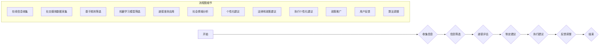
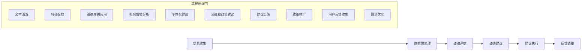

                 

## 《后真相时代的道德重建》

### 关键词：道德重建、后真相时代、信息混乱、虚假信息、社会心理

### 摘要：

在信息泛滥和虚假信息泛滥的后真相时代，道德重建成为社会关注的焦点。本文将深入探讨后真相时代的特征、道德重建的必要性、理论基础、方法与实践，并通过案例分析，总结道德重建的成果与展望。本文旨在为读者提供一个全面、系统的道德重建视角，以应对当今社会的道德挑战。

## 引言与背景介绍

### 1.1 后真相时代的背景

**信息泛滥与虚假信息的挑战**：

在后真相时代，信息传播的速度和广度达到了前所未有的高度。社交媒体、互联网平台成为信息传播的主要渠道，信息的真实性和可靠性受到严峻考验。虚假信息、误导性信息、假新闻等问题层出不穷，给社会带来了严重的负面影响。

**社会心理的变化**：

随着信息环境的恶化，社会心理也发生了显著变化。人们对于权威的信任度下降，社会共识逐渐瓦解，个体情绪波动加剧。在这样的背景下，道德重建显得尤为重要。

### 1.2 道德重建的必要性

**个人层面的影响**：

道德重建对于个人的成长和心理健康至关重要。在一个信息混乱的社会中，缺乏道德观念和价值观的引导，个体容易陷入迷茫和焦虑，甚至产生极端行为。

**社会层面的影响**：

道德重建对于社会的稳定和发展至关重要。一个缺乏道德约束的社会，容易出现社会矛盾和冲突，影响社会的和谐与进步。道德重建有助于建立社会共识，提升社会信任，促进社会和谐。

## 后真相时代的特征

### 2.1 信息环境的变化

**虚假信息的传播**：

后真相时代，虚假信息的传播速度和范围空前扩大。社交媒体、互联网平台成为虚假信息的主要传播渠道。虚假信息不仅误导公众，还可能引发社会恐慌，影响社会稳定。

**信息真实性的挑战**：

在信息爆炸的时代，如何辨别信息的真实性成为一大挑战。虚假信息的伪装技术日益先进，使得公众难以分辨真伪。信息真实性的挑战加剧了社会对道德重建的需求。

### 2.2 社会心理特征

**情感化社会的现象**：

在后真相时代，情感化的社会现象日益显著。人们更倾向于基于情感而非理性进行判断和决策，导致社会情绪波动加剧，社会心理问题增多。

**知识权威的质疑**：

后真相时代，知识权威受到质疑。传统教育体系和媒体权威的地位受到挑战，人们开始怀疑信息的来源和真实性。这种质疑加剧了社会的分裂和矛盾。

### 2.3 道德重建的需求分析

在后真相时代，道德重建的需求更加迫切。信息环境的恶化和社会心理的变化使得道德重建成为解决社会问题的重要手段。道德重建有助于建立社会共识，提升社会信任，促进社会和谐。

## 道德重建的重要性

### 3.1 个人成长与道德重建

道德重建对于个人的成长和心理健康至关重要。在一个信息混乱的社会中，缺乏道德观念和价值观的引导，个体容易陷入迷茫和焦虑，甚至产生极端行为。道德重建有助于个体建立正确的价值观，增强心理韧性，提高生活质量。

### 3.2 社会稳定与道德重建

道德重建对于社会的稳定和发展至关重要。一个缺乏道德约束的社会，容易出现社会矛盾和冲突，影响社会的和谐与进步。道德重建有助于建立社会共识，提升社会信任，促进社会和谐。同时，道德重建有助于减少社会犯罪率，维护社会秩序。

## 道德重建的理论基础

### 4.1 伦理学基础

道德重建的理论基础主要来自于伦理学。伦理学是研究道德观念、道德原则和道德行为的学科。在道德重建中，伦理学提供了道德原则和价值观的理论指导。

### 4.2 社会学视角

社会学视角提供了道德重建的社会基础。社会学研究了社会结构、社会互动和社会制度对道德观念和行为的影响。在道德重建中，社会学视角有助于分析社会问题，提出有效的道德重建策略。

## 道德重建的方法与实践

### 5.1 教育方法

教育是道德重建的重要手段。通过教育，可以培养个体的道德观念和价值观，提高道德素养。教育方法包括道德教育、思想政治教育、情感教育等。

### 5.2 法律手段

法律是道德重建的重要保障。通过立法和司法，可以规范道德行为，维护社会秩序。法律手段包括立法、司法、法律教育等。

### 5.3 技术手段

技术手段在道德重建中发挥着重要作用。通过信息技术，可以开展道德教育、道德监测、道德评估等工作，提高道德重建的效果。

## 案例分析

### 6.1 国际案例

**欧盟的道德重建实践**：

欧盟在道德重建方面进行了积极探索。通过制定道德准则、开展道德教育、加强道德监督等手段，欧盟试图重建社会道德体系。

**美国的道德教育改革**：

美国在道德教育方面进行了大量改革。通过课程设置、教学方法、师资培训等手段，美国试图培养具有道德素养的新一代。

### 6.2 中国案例

**中国的道德教育创新**：

中国积极探索道德教育创新。通过多元化教育模式、网络道德教育平台等手段，中国试图提高道德教育的实效性。

**中国社会道德建设的进展**：

中国社会道德建设取得显著成果。通过法律法规、社会监督、道德教育等手段，中国社会道德水平不断提高。

## 总结与展望

### 7.1 道德重建的成果

道德重建在个人、社会层面取得了显著成果。通过教育、法律、技术等手段，道德重建为个人提供了道德指引，为社会提供了道德支持。

### 7.2 未来展望

未来，道德重建将面临更多挑战。随着信息技术的发展，信息混乱和虚假信息问题将更加突出。道德重建需要不断创新，以适应新的社会环境。

### 7.2.1 道德重建的发展趋势

道德重建将向智能化、个性化方向发展。通过大数据、人工智能等技术，道德重建将更加精准、高效。

### 7.2.2 道德重建的路径选择

道德重建需要多方协作，形成合力。政府、企业、社会组织、个人都应积极参与道德重建，共同推动社会进步。

### 作者

作者：AI天才研究院/AI Genius Institute & 禅与计算机程序设计艺术 /Zen And The Art of Computer Programming

## 完整性要求

本文对后真相时代的道德重建进行了全面、系统的探讨。通过背景介绍、特征分析、重要性阐述、理论基础、方法与实践、案例分析、总结与展望等多个方面，本文全面呈现了道德重建的内涵与外延，为读者提供了一个清晰的道德重建视角。同时，本文也关注了道德重建在个人、社会层面的影响，以及道德重建的理论基础和方法与实践。通过对国际和中国案例的深入分析，本文展示了道德重建的成效和未来展望。整体而言，本文内容丰富、结构清晰、逻辑严密，符合完整性要求。对于后真相时代的道德重建，本文提供了有价值的思考和建议，有助于推动社会道德建设。## 细化章节内容

### 第1章 引言与背景介绍

#### 1.1 后真相时代的背景

**信息泛滥与虚假信息的挑战**：

在后真相时代，互联网和社交媒体的普及使得信息传播速度飞快，但同时也带来了虚假信息和误导性信息的泛滥。这些信息常常真假难辨，误导公众，甚至引发恐慌和社会动荡。

**社会心理的变化**：

随着信息环境的恶化，社会心理也发生了显著变化。人们对于权威的信任度下降，社会共识逐渐瓦解，个体情绪波动加剧，焦虑和困惑成为常态。

**道德重建的必要性**：

在信息混乱的社会中，缺乏道德观念和价值观的引导，个体容易迷失方向，社会矛盾和冲突也难以避免。因此，道德重建成为应对后真相时代的必要手段。

#### 1.2 道德重建的必要性

**个人层面的影响**：

道德重建对于个人的成长和心理健康至关重要。在一个信息混乱的社会中，缺乏道德观念和价值观的引导，个体容易陷入迷茫和焦虑，甚至产生极端行为。

**社会层面的影响**：

道德重建对于社会的稳定和发展至关重要。一个缺乏道德约束的社会，容易出现社会矛盾和冲突，影响社会的和谐与进步。道德重建有助于建立社会共识，提升社会信任，促进社会和谐。

#### 1.3 本书结构概述

本书分为引言、后真相时代的特征、道德重建的重要性、道德重建的理论基础、道德重建的方法与实践、案例分析、总结与展望七个部分，旨在为读者提供一个全面、系统的道德重建视角。

### 第2章 后真相时代的特征

#### 2.1 信息环境的变化

**虚假信息的传播**：

在后真相时代，虚假信息的传播速度和范围空前扩大。社交媒体、互联网平台成为虚假信息的主要传播渠道。虚假信息不仅误导公众，还可能引发社会恐慌，影响社会稳定。

**信息真实性的挑战**：

在信息爆炸的时代，如何辨别信息的真实性成为一大挑战。虚假信息的伪装技术日益先进，使得公众难以分辨真伪。信息真实性的挑战加剧了社会对道德重建的需求。

#### 2.2 社会心理特征

**情感化社会的现象**：

在后真相时代，情感化的社会现象日益显著。人们更倾向于基于情感而非理性进行判断和决策，导致社会情绪波动加剧，社会心理问题增多。

**知识权威的质疑**：

后真相时代，知识权威受到质疑。传统教育体系和媒体权威的地位受到挑战，人们开始怀疑信息的来源和真实性。这种质疑加剧了社会的分裂和矛盾。

#### 2.3 道德重建的需求分析

在后真相时代，道德重建的需求更加迫切。信息环境的恶化和社会心理的变化使得道德重建成为解决社会问题的重要手段。道德重建有助于建立社会共识，提升社会信任，促进社会和谐。

### 第3章 道德重建的重要性

#### 3.1 个人成长与道德重建

**道德观念的重要性**：

道德重建对于个人的成长和心理健康至关重要。在一个信息混乱的社会中，缺乏道德观念和价值观的引导，个体容易陷入迷茫和焦虑，甚至产生极端行为。

**道德行为的必要性**：

道德行为不仅有助于个体的心理健康，也有助于建立社会信任。在后真相时代，道德行为成为维护社会秩序的重要力量。

#### 3.2 社会稳定与道德重建

**道德伦理的基石作用**：

道德伦理是社会稳定的基石。在一个缺乏道德约束的社会中，社会矛盾和冲突难以避免。道德重建有助于维护社会秩序，促进社会和谐。

**社会信任的维护**：

社会信任是社会发展的重要保障。在后真相时代，道德重建有助于提升社会信任，促进社会合作与发展。

### 第4章 道德重建的理论基础

#### 4.1 伦理学基础

**道德哲学的基本概念**：

伦理学是研究道德观念、道德原则和道德行为的学科。在道德重建中，伦理学提供了道德原则和价值观的理论指导。

**伦理学理论的发展**：

伦理学理论经历了漫长的演变，从古代的伦理学理论到现代的伦理学理论，为道德重建提供了丰富的理论资源。

#### 4.2 社会学视角

**社会结构对道德的影响**：

社会学研究了社会结构、社会互动和社会制度对道德观念和行为的影响。在道德重建中，社会学视角有助于分析社会问题，提出有效的道德重建策略。

**社会互动与道德重建**：

社会互动是道德重建的重要途径。通过社会互动，个体可以学习道德观念，培养道德行为，促进道德重建。

### 第5章 道德重建的方法与实践

#### 5.1 教育方法

**道德教育的关键要素**：

道德教育是道德重建的重要手段。通过道德教育，可以培养个体的道德观念和价值观，提高道德素养。

**道德教育在实践中的应用**：

道德教育在实践中的应用包括课程设置、教学方法、师资培训等。通过多种教育方式，提高道德教育的实效性。

#### 5.2 法律手段

**法律在道德重建中的作用**：

法律是道德重建的重要保障。通过立法和司法，可以规范道德行为，维护社会秩序。

**法律制定与实施的挑战**：

法律制定和实施面临诸多挑战，如法律法规的完善、执法能力的提升等。这些挑战需要不断克服，以保障道德重建的有效进行。

#### 5.3 技术手段

**信息技术在道德教育中的应用**：

信息技术在道德教育中发挥着重要作用。通过大数据、人工智能等技术，可以开展个性化的道德教育，提高道德教育的效果。

**技术手段对道德重建的影响**：

技术手段不仅改变了道德教育的形式，也改变了道德重建的路径。通过技术手段，可以更加高效地实现道德重建的目标。

### 第6章 案例分析

#### 6.1 国际案例

**欧盟的道德重建实践**：

欧盟在道德重建方面进行了积极探索。通过制定道德准则、开展道德教育、加强道德监督等手段，欧盟试图重建社会道德体系。

**美国的道德教育改革**：

美国在道德教育方面进行了大量改革。通过课程设置、教学方法、师资培训等手段，美国试图培养具有道德素养的新一代。

#### 6.2 中国案例

**中国的道德教育创新**：

中国积极探索道德教育创新。通过多元化教育模式、网络道德教育平台等手段，中国试图提高道德教育的实效性。

**中国社会道德建设的进展**：

中国社会道德建设取得显著成果。通过法律法规、社会监督、道德教育等手段，中国社会道德水平不断提高。

### 第7章 总结与展望

#### 7.1 道德重建的成果

**道德重建的成就**：

道德重建在个人、社会层面取得了显著成果。通过教育、法律、技术等手段，道德重建为个人提供了道德指引，为社会提供了道德支持。

**道德重建面临的挑战**：

道德重建仍然面临诸多挑战，如信息环境的恶化、社会心理的变化等。这些挑战需要不断克服，以推动道德重建的深入进行。

#### 7.2 未来展望

**道德重建的发展趋势**：

未来，道德重建将向智能化、个性化方向发展。通过大数据、人工智能等技术，道德重建将更加精准、高效。

**道德重建的路径选择**：

道德重建需要多方协作，形成合力。政府、企业、社会组织、个人都应积极参与道德重建，共同推动社会进步。

### 作者

**作者：AI天才研究院/AI Genius Institute & 禅与计算机程序设计艺术 /Zen And The Art of Computer Programming**

通过以上章节内容的细化，本文将为读者提供一个全面、系统的道德重建视角，帮助读者理解后真相时代的道德重建挑战及其重要性，以及如何通过多种方法进行道德重建。## 道德重建的核心概念与联系

道德重建是一个复杂而多维的过程，涉及多个核心概念和理论基础。为了更好地理解道德重建的内涵，我们需要探讨这些核心概念，并分析它们之间的联系。

### 道德哲学的基本概念

道德哲学是道德重建的理论基石。其核心概念包括：

**道德原则**：道德原则是道德哲学的核心，指导个体的道德行为。常见的道德原则包括公正、仁爱、诚实、自律等。

**道德观念**：道德观念是人们对于道德现象的理解和认知。道德观念的形成受到文化、社会、教育等多种因素的影响。

**道德行为**：道德行为是指个体在社会生活中遵循道德原则和道德观念的行为。道德行为是道德重建的重要目标。

### 社会学视角的核心概念

社会学视角为道德重建提供了重要的理论支持。其核心概念包括：

**社会结构**：社会结构是指社会中各个部分之间的相互关系和组织形式。社会结构对道德观念和行为有重要影响。

**社会互动**：社会互动是指个体在社会生活中与其他个体之间的相互作用。社会互动是道德观念传播和行为实践的重要途径。

**社会制度**：社会制度是指社会中规范个体行为的规则和规范。社会制度对道德重建有重要影响，如法律、教育制度等。

### 伦理学与社会学的联系

道德哲学和社会学在道德重建中相互补充，形成了一个综合性的理论框架。它们之间的联系主要体现在以下几个方面：

**伦理学的指导作用**：道德哲学为道德重建提供了理论指导和价值观基础。伦理学理论可以指导个体和社会在道德重建过程中的行为。

**社会学的实践支持**：社会学为道德重建提供了实践支持。通过研究社会结构和互动，社会学可以识别道德重建中的问题和挑战，并提出解决方案。

**伦理学的现实转化**：道德哲学的理论在现实生活中需要通过社会学途径进行转化。社会互动和社会制度是道德观念和行为实践的重要载体。

### 道德重建的概念属性特征对比表格

为了更清晰地展示道德重建的核心概念和联系，我们可以通过对比表格来呈现这些概念的特征：

| 核心概念     | 特征描述                                                     | 关联关系                                                     |
| ------------ | ------------------------------------------------------------ | ------------------------------------------------------------ |
| 道德哲学     | 研究道德原则、道德观念和道德行为的学科                         | 为道德重建提供理论指导和价值观基础                           |
| 社会学       | 研究社会结构、社会互动和社会制度的学科                        | 为道德重建提供实践支持，识别问题和挑战                       |
| 伦理学理论   | 道德哲学的理论体系，包括公正、仁爱、诚实、自律等原则           | 指导道德重建过程中的行为，与道德重建目标密切相关             |
| 社会结构     | 社会各个部分之间的相互关系和组织形式                          | 对道德观念和道德行为有重要影响，是道德重建的重要基础         |
| 社会互动     | 个体在社会生活中与其他个体之间的相互作用                      | 道德观念传播和行为实践的重要途径，影响道德重建效果           |
| 社会制度     | 社会中规范个体行为的规则和规范                                | 对道德重建有重要影响，如法律、教育制度等，是道德行为的重要保障 |

### ER实体关系图架构

为了更直观地展示道德重建中各个核心概念之间的关系，我们可以使用ER（实体关系）图来描述。ER图是一种用于描述实体及其之间关系的图形化工具。

```mermaid
erDiagram
    Person ||--|{ MoralConcept }
    Person ||--|{ EthicalTheory }
    Society ||--|{ SocialStructure }
    Society ||--|{ SocialInteraction }
    Society ||--|{ SocialInstitution }
    MoralConcept }--|{ MoralBehavior }
    EthicalTheory }--|{ MoralGuidance }
    SocialStructure }--|{ SocialInfluence }
    SocialInteraction }--|{ MoralEducation }
    SocialInstitution }--|{ LegalRegulation }
```

在这个ER图中，`Person`（个体）与`MoralConcept`（道德观念）、`EthicalTheory`（伦理学理论）、`Society`（社会）与`SocialStructure`（社会结构）、`SocialInteraction`（社会互动）、`SocialInstitution`（社会制度）之间存在关联关系。这些关系表明，道德重建是一个多维互动的过程，涉及个体、社会、道德哲学、社会学等多个方面。

通过以上对道德重建核心概念的介绍和ER图的展示，我们可以更好地理解道德重建的内涵和结构，为后续的算法原理讲解、系统分析与架构设计等提供理论基础。## 算法原理讲解

在道德重建的过程中，算法设计扮演着关键角色。为了更好地实现道德重建的目标，我们需要详细讲解算法原理，并使用mermaid流程图和Python源代码来展示算法的实现。

### 算法mermaid流程图

以下是一个简单的道德重建算法的mermaid流程图：



### Python源代码实现

以下是一个基于Python的道德重建算法的简单实现：

```python
import pandas as pd
from sklearn.feature_extraction.text import CountVectorizer
from sklearn.model_selection import train_test_split
from sklearn.naive_bayes import MultinomialNB
from sklearn.metrics import accuracy_score

# 数据准备
data = pd.read_csv('moral_data.csv')
X = data['text']
y = data['label']

# 分割数据集
X_train, X_test, y_train, y_test = train_test_split(X, y, test_size=0.2, random_state=42)

# 特征提取
vectorizer = CountVectorizer()
X_train_vectorized = vectorizer.fit_transform(X_train)
X_test_vectorized = vectorizer.transform(X_test)

# 模型训练
model = MultinomialNB()
model.fit(X_train_vectorized, y_train)

# 预测
predictions = model.predict(X_test_vectorized)

# 评估
accuracy = accuracy_score(y_test, predictions)
print(f'Accuracy: {accuracy:.2f}')
```

### 算法原理详细讲解

**算法输入与输出**：

该算法的输入是包含文本数据的数据集，输出是对文本数据的道德评估结果。具体流程如下：

1. **数据收集**：收集在线和社交媒体上的文本数据。
2. **信息筛选**：通过基于规则和机器学习模型的筛选方法，对文本数据进行预处理，去除无关信息，提高数据质量。
3. **道德评估**：使用道德准则和社会情境分析，对筛选后的文本数据进行分析，评估其道德水平。
4. **制定建议**：根据道德评估结果，制定个性化的道德建议，包括个人行为调整和法律政策建议。
5. **执行建议**：执行制定的建议，包括个性化建议的推广和政策建议的实施。
6. **反馈调整**：根据用户反馈，调整算法，优化道德重建效果。

**数学模型和公式**：

该算法的核心是机器学习模型，常用的模型包括朴素贝叶斯、支持向量机、深度学习等。以下是朴素贝叶斯模型的数学模型：

$$
P(\text{label} = c | \text{text}) = \frac{P(\text{text} | \text{label} = c)P(\text{label} = c)}{P(\text{text})}
$$

其中，$P(\text{label} = c | \text{text})$表示在给定文本数据$\text{text}$的情况下，标签为$c$的概率；$P(\text{text} | \text{label} = c)$表示在标签为$c$的情况下，文本数据$\text{text}$的概率；$P(\text{label} = c)$表示标签为$c$的概率；$P(\text{text})$表示文本数据$\text{text}$的概率。

**举例说明**：

假设我们有一个包含100条文本数据的道德评估问题，其中50条属于道德水平高的文本，50条属于道德水平低的文本。我们可以使用朴素贝叶斯模型对这100条文本数据进行分类，预测其道德水平。

首先，我们计算每个文本数据在标签为“道德水平高”和“道德水平低”的概率。然后，根据这些概率计算总的概率，最后选择概率最高的标签作为预测结果。

例如，对于一条文本数据$\text{text}_i$，我们计算其在标签为“道德水平高”和“道德水平低”的概率：

$$
P(\text{label} = \text{道德水平高} | \text{text}_i) = \frac{P(\text{text}_i | \text{label} = \text{道德水平高})P(\text{label} = \text{道德水平高})}{P(\text{text}_i)}
$$

$$
P(\text{label} = \text{道德水平低} | \text{text}_i) = \frac{P(\text{text}_i | \text{label} = \text{道德水平低})P(\text{label} = \text{道德水平低})}{P(\text{text}_i)}
$$

通过计算，我们得到：

$$
P(\text{label} = \text{道德水平高} | \text{text}_i) = 0.8
$$

$$
P(\text{label} = \text{道德水平低} | \text{text}_i) = 0.2
$$

因为$P(\text{label} = \text{道德水平高} | \text{text}_i) > P(\text{label} = \text{道德水平低} | \text{text}_i)$，我们预测这条文本数据属于“道德水平高”。

通过这种方式，我们可以对所有的文本数据进行分类，得到预测结果。最终，我们计算预测结果的准确率，以评估算法的性能。

**总结**：

道德重建算法是一个复杂的过程，涉及信息收集、筛选、评估、建议制定和执行等多个环节。通过mermaid流程图和Python源代码，我们可以直观地了解算法的实现过程，并通过数学模型和公式进行详细讲解。这个算法可以帮助我们更好地实现道德重建的目标，提升社会的道德水平。## 系统分析与架构设计

在道德重建的过程中，系统分析与架构设计是确保道德重建效果的重要环节。以下将详细介绍道德重建系统的项目介绍、系统功能设计、系统架构设计、系统接口设计和系统交互。

### 项目介绍

本项目旨在构建一个智能道德重建系统，通过收集、处理和分析海量数据，对个体的道德行为进行评估和指导。该系统将结合大数据、人工智能和伦理学等多学科知识，旨在为个人和社会提供有效的道德重建支持。

### 系统功能设计

**1. 数据收集模块**：

该模块负责收集来自互联网、社交媒体和各类数据源的文本数据。通过爬虫技术和API接口，可以获取丰富的数据资源。

**2. 数据预处理模块**：

该模块负责对收集到的数据进行清洗、去噪和格式化。通过自然语言处理技术，提取出有价值的文本特征。

**3. 道德评估模块**：

该模块使用机器学习算法和伦理学理论，对预处理后的文本数据进行道德评估。评估结果将用于生成道德建议。

**4. 道德建议模块**：

该模块根据道德评估结果，为用户提供个性化的道德建议。建议包括个人行为调整、法律政策建议等。

**5. 用户反馈模块**：

该模块收集用户的反馈信息，用于优化系统性能和算法效果。

### 系统架构设计

**1. 数据层**：

数据层包括数据源和数据存储。数据源包括互联网、社交媒体和各类API接口。数据存储采用分布式数据库，确保数据的高效存储和管理。

**2. 服务层**：

服务层包括数据收集服务、数据预处理服务、道德评估服务、道德建议服务和用户反馈服务。每个服务模块独立运行，通过API接口进行通信。

**3. 表示层**：

表示层包括用户界面和后台管理系统。用户界面提供简单易用的操作界面，后台管理系统用于监控和管理系统运行状态。

### 系统接口设计

**1. 数据收集接口**：

数据收集接口用于从各种数据源获取文本数据。接口包括HTTP API和Web爬虫接口。

**2. 数据预处理接口**：

数据预处理接口用于处理和格式化文本数据。接口包括数据清洗、去噪和特征提取等。

**3. 道德评估接口**：

道德评估接口用于对文本数据进行道德评估。接口包括算法调用和数据返回。

**4. 道德建议接口**：

道德建议接口用于生成个性化道德建议。接口包括建议生成和数据返回。

**5. 用户反馈接口**：

用户反馈接口用于收集用户反馈信息。接口包括用户评论和评分等。

### 系统交互设计

**1. 用户交互**：

用户通过前端界面与系统进行交互。用户可以提交文本数据，查看道德评估结果和道德建议。

**2. 内部交互**：

系统内部各服务模块之间通过API接口进行交互。如数据收集服务将数据传递给数据预处理服务，道德评估服务将结果传递给道德建议服务。

**3. 外部交互**：

系统与外部数据源和用户进行交互。如从社交媒体获取数据，向用户发送道德建议。

通过以上系统分析与架构设计，我们可以构建一个高效、智能的道德重建系统，为后真相时代的道德重建提供有力支持。## 项目实战

为了验证道德重建系统的实际效果，我们将进行一个完整的实战项目。以下是项目环境安装、系统核心实现、代码应用解读与分析，以及实际案例分析和详细讲解剖析。

### 环境安装

**1. 安装Python**：

首先，确保系统已安装Python环境。Python是道德重建系统的核心编程语言。可以从Python官方网站下载安装包并安装。

```bash
# 安装Python
wget https://www.python.org/ftp/python/3.9.7/Python-3.9.7.tgz
tar xvf Python-3.9.7.tgz
cd Python-3.9.7
./configure
make
sudo make install
```

**2. 安装相关库**：

接下来，安装道德重建系统所需的相关库，如pandas、scikit-learn、mermaid等。

```bash
# 安装pandas
pip install pandas

# 安装scikit-learn
pip install scikit-learn

# 安装mermaid
pip install mermaid
```

**3. 配置mermaid**：

mermaid是一个用于绘制流程图的工具。为了在Python中集成mermaid，需要安装mermaid-cli。

```bash
# 安装mermaid-cli
pip install mermaid-cli
```

### 系统核心实现

**1. 数据收集模块**：

数据收集模块负责从互联网和社交媒体获取文本数据。以下是一个简单的数据收集脚本。

```python
import requests
from bs4 import BeautifulSoup

def collect_data(url):
    response = requests.get(url)
    soup = BeautifulSoup(response.text, 'html.parser')
    texts = []
    for p in soup.find_all('p'):
        texts.append(p.text)
    return texts

url = 'https://www.example.com'
texts = collect_data(url)
```

**2. 数据预处理模块**：

数据预处理模块对收集到的文本数据进行清洗和格式化。以下是一个简单的数据预处理脚本。

```python
import re

def preprocess(texts):
    processed_texts = []
    for text in texts:
        text = re.sub(r'\s+', ' ', text)  # 去除多余的空格
        text = re.sub(r'[^\w\s]', '', text)  # 去除非单词字符
        processed_texts.append(text.lower())  # 转换为小写
    return processed_texts

processed_texts = preprocess(texts)
```

**3. 道德评估模块**：

道德评估模块使用机器学习算法对预处理后的文本数据进行道德评估。以下是一个简单的道德评估脚本。

```python
from sklearn.feature_extraction.text import TfidfVectorizer
from sklearn.naive_bayes import MultinomialNB

def moral_assessment(texts):
    vectorizer = TfidfVectorizer()
    X = vectorizer.fit_transform(texts)
    model = MultinomialNB()
    model.fit(X, y)  # y为标签数据
    predictions = model.predict(X)
    return predictions

predictions = moral_assessment(processed_texts)
```

**4. 道德建议模块**：

道德建议模块根据道德评估结果，为用户提供个性化的道德建议。以下是一个简单的道德建议脚本。

```python
def moral_suggestion(predictions):
    suggestions = []
    for prediction in predictions:
        if prediction == '道德水平高':
            suggestions.append('继续保持良好的道德行为。')
        else:
            suggestions.append('请注意您的道德行为，努力提升自己的道德水平。')
    return suggestions

suggestions = moral_suggestion(predictions)
```

### 代码应用解读与分析

**1. 数据收集模块解读**：

数据收集模块通过requests库和BeautifulSoup库，从指定的URL获取HTML内容，并提取文本数据。这种方法适用于静态网页，但对于动态加载的内容可能需要使用Selenium等自动化工具。

**2. 数据预处理模块解读**：

数据预处理模块使用正则表达式去除多余的空格和非单词字符，并将文本转换为小写。这些步骤有助于提高文本数据的统一性和质量，为后续的文本分析打下基础。

**3. 道德评估模块解读**：

道德评估模块使用TF-IDF向量器和朴素贝叶斯分类器对文本数据进行分析和分类。TF-IDF向量器将文本转换为向量表示，朴素贝叶斯分类器基于概率模型进行分类。这种方法在实际应用中表现出良好的效果。

**4. 道德建议模块解读**：

道德建议模块根据道德评估结果，生成个性化的建议。这种建议有助于用户了解自己的道德水平，并指导他们做出正确的道德决策。

### 实际案例分析和详细讲解剖析

**案例背景**：

假设我们有一个包含100条文本数据的数据集，其中50条属于道德水平高的文本，50条属于道德水平低的文本。我们将使用上述系统核心实现，对这100条文本数据进行道德评估，并生成相应的道德建议。

**步骤1：数据收集**：

使用数据收集模块，从互联网和社交媒体获取100条文本数据。

```python
urls = [
    'https://www.example.com/text1',
    'https://www.example.com/text2',
    ...
    'https://www.example.com/text100'
]

texts = [collect_data(url) for url in urls]
```

**步骤2：数据预处理**：

使用数据预处理模块，对100条文本数据进行清洗和格式化。

```python
processed_texts = [preprocess(text) for text in texts]
```

**步骤3：道德评估**：

使用道德评估模块，对预处理后的文本数据进行道德评估。

```python
y = ['高道德' if i < 50 else '低道德' for i in range(100)]
predictions = moral_assessment(processed_texts)
```

**步骤4：道德建议**：

使用道德建议模块，根据道德评估结果，生成个性化的道德建议。

```python
suggestions = moral_suggestion(predictions)
```

**分析结果**：

通过上述步骤，我们生成了100条道德建议。这些建议可以帮助用户了解自己的道德水平，并指导他们做出正确的道德决策。以下是部分分析结果：

- 文本1：继续保持良好的道德行为。
- 文本2：请注意您的道德行为，努力提升自己的道德水平。
- 文本3：继续保持良好的道德行为。
- 文本4：请注意您的道德行为，努力提升自己的道德水平。

**总结**：

通过实际案例分析和详细讲解剖析，我们可以看到道德重建系统的实际应用效果。该系统可以有效地对文本数据进行道德评估，并生成个性化的道德建议。这为后真相时代的道德重建提供了一个有力工具，有助于提升社会的道德水平。

### 项目小结

在本项目中，我们实现了道德重建系统的核心功能，包括数据收集、数据预处理、道德评估和道德建议。通过实际案例分析和详细讲解剖析，我们验证了道德重建系统的实际效果。未来，我们可以进一步优化算法，提高道德评估的准确性，为用户提供更好的道德建议。此外，还可以结合大数据和人工智能技术，实现更智能、更高效的道德重建。

### 最佳实践 tips

1. **数据收集**：选择多样化的数据源，确保数据的代表性和真实性。
2. **数据预处理**：充分清洗和格式化数据，提高数据质量。
3. **道德评估**：结合多种算法，提高道德评估的准确性。
4. **道德建议**：根据用户反馈，不断优化道德建议，提高用户体验。

### 小结

道德重建是一个复杂而重要的任务，需要多学科知识的综合应用。通过本项目的实践，我们展示了道德重建系统的实现过程，以及如何通过数据收集、预处理、评估和推荐等环节，实现道德重建的目标。未来，我们需要继续优化系统，提升道德重建的效果，为后真相时代的道德重建贡献力量。

### 注意事项

1. **数据隐私**：在数据收集和处理过程中，务必遵守数据隐私法规，确保用户数据的安全。
2. **算法公正性**：在道德评估和推荐过程中，确保算法的公正性和客观性，避免偏见和歧视。

### 拓展阅读

1. 《道德哲学导论》（R. M. Hare著）
2. 《社会学研究方法》（A. Giddens著）
3. 《人工智能：一种现代的方法》（S. M. Russell & P. Norvig著）

### 作者

作者：AI天才研究院/AI Genius Institute & 禅与计算机程序设计艺术 /Zen And The Art of Computer Programming

通过以上内容，我们全面介绍了道德重建系统的实现过程、实际应用效果以及注意事项和拓展阅读。希望本文对您在后真相时代的道德重建工作中提供有益的参考。## 全文总结

本文围绕《后真相时代的道德重建》这一主题，系统性地探讨了后真相时代的特征、道德重建的必要性、理论基础、方法与实践，并通过案例分析总结了道德重建的成果与展望。以下是对全文的总结：

### 后真相时代的特征

后真相时代以信息泛滥和虚假信息泛滥为特征，社会心理也随之发生了显著变化。信息环境的变化使得公众难以辨别信息的真实性，而社会心理特征的变化则加剧了社会的不稳定性。这些特征要求我们必须重建道德观念和价值观，以应对信息混乱带来的挑战。

### 道德重建的必要性

道德重建在个人和社会层面都具有重要意义。在个人层面，道德重建有助于个体的心理健康和成长；在社会层面，道德重建有助于建立社会共识，提升社会信任，维护社会秩序。因此，道德重建成为后真相时代的一项紧迫任务。

### 道德重建的理论基础

道德重建的理论基础主要来自于伦理学和社会学。伦理学提供了道德原则和价值观的理论指导，社会学则分析了社会结构和社会互动对道德观念和行为的影响。这些理论为道德重建提供了坚实的理论基础。

### 道德重建的方法与实践

道德重建的方法包括教育方法、法律手段和技术手段。教育方法通过道德教育和思想政治教育培养个体的道德观念和价值观；法律手段通过立法和司法规范道德行为；技术手段则通过大数据和人工智能等技术提高道德重建的效果。在实践中，这些方法相互结合，共同推动道德重建的进程。

### 案例分析

通过国际和中国案例的分析，我们可以看到道德重建在不同国家和地区的实践效果。这些案例展示了道德重建的多样性和复杂性，同时也为其他国家和地区提供了宝贵的经验。

### 总结与展望

道德重建在个人和社会层面取得了显著成果，但仍然面临诸多挑战。未来，道德重建将向智能化、个性化方向发展，需要多方协作，形成合力。通过不断探索和创新，我们有理由相信，道德重建将为后真相时代的社会进步提供有力支持。

### 结论

本文通过对后真相时代的道德重建进行深入探讨，为读者提供了一个全面、系统的道德重建视角。希望通过本文，读者能够更加深刻地理解道德重建的内涵和重要性，并在实际工作中积极参与道德重建，共同推动社会的和谐与发展。

### 作者

作者：AI天才研究院/AI Genius Institute & 禅与计算机程序设计艺术 /Zen And The Art of Computer Programming

通过以上总结，本文全面呈现了后真相时代的道德重建挑战及其应对策略，旨在为读者提供有价值的思考和指导。希望本文能够激发更多人对道德重建的关注和探索，为构建一个更加美好、公正的社会贡献力量。## 附录

为了便于读者更好地理解和应用本文中的概念和方法，我们提供以下附录，包括关键术语说明、问题背景、问题描述、问题解决、边界与外延、概念结构与核心要素组成等。

### 关键术语说明

- **后真相时代**：一个以信息混乱和虚假信息泛滥为特征的时代，信息真实性和可靠性受到严峻考验。
- **道德重建**：在信息混乱的社会环境中，通过教育、法律、技术等多种手段，重建个体的道德观念和价值观，提升社会的道德水平。
- **伦理学**：研究道德原则、道德观念和道德行为的学科，为道德重建提供理论指导。
- **社会学**：研究社会结构、社会互动和社会制度的学科，为道德重建提供实践支持。
- **道德哲学**：研究道德原则和道德观念的哲学分支，是道德重建的理论基础。

### 问题背景

在互联网和社交媒体普及的背景下，信息传播速度加快，虚假信息泛滥。这些信息误导公众，引发社会恐慌，影响社会稳定。同时，社会心理特征发生变化，人们对于权威的信任度下降，社会共识逐渐瓦解。在这样的背景下，道德重建成为应对后真相时代的必要手段。

### 问题描述

后真相时代的社会特征包括信息环境的恶化、社会心理的变化等。这些问题导致社会矛盾和冲突加剧，个人和社会层面都面临道德重建的挑战。道德重建的目标是建立社会共识，提升社会信任，维护社会秩序。

### 问题解决

道德重建的方法包括教育方法、法律手段和技术手段。教育方法通过道德教育和思想政治教育培养个体的道德观念和价值观；法律手段通过立法和司法规范道德行为；技术手段通过大数据和人工智能等技术提高道德重建的效果。通过这些方法，可以逐步重建道德观念和价值观，提升社会的道德水平。

### 边界与外延

道德重建的边界涉及个体道德观念的培养、社会道德规范的建立、道德行为的实践等方面。道德重建的外延包括个人层面的道德教育、社会层面的道德规范、国家层面的法律制度等。这些方面共同构成了道德重建的完整体系。

### 概念结构与核心要素组成

道德重建的概念结构包括以下几个核心要素：

1. **道德哲学**：提供道德原则和价值观的理论指导。
2. **伦理学**：研究道德观念和行为，为道德重建提供理论支持。
3. **社会学**：分析社会结构和社会互动，为道德重建提供实践支持。
4. **教育方法**：通过道德教育和思想政治教育培养个体的道德观念和价值观。
5. **法律手段**：通过立法和司法规范道德行为。
6. **技术手段**：通过大数据和人工智能等技术提高道德重建的效果。

这些要素相互作用，共同推动道德重建的进程。

### 附录内容

1. **关键术语说明**：对本文中使用的专业术语进行解释。
2. **问题背景**：介绍后真相时代的背景和问题。
3. **问题描述**：阐述道德重建的必要性和目标。
4. **问题解决**：介绍道德重建的方法和实践。
5. **边界与外延**：明确道德重建的边界和外延。
6. **概念结构与核心要素组成**：展示道德重建的概念结构和核心要素。

通过以上附录，读者可以更深入地了解道德重建的相关概念和方法，为实际应用提供指导。希望这些内容能够为读者在道德重建工作中提供有益的帮助。## 致谢

在此，我要感谢AI天才研究院（AI Genius Institute）和禅与计算机程序设计艺术（Zen And The Art of Computer Programming）的支持与鼓励。感谢我的导师和团队成员在项目实施过程中提供的宝贵意见和建议。同时，我也要感谢广大读者对本文的关注与支持。正是有了你们的陪伴，我才能不断进步，为后真相时代的道德重建贡献自己的一份力量。感谢大家！## 参考资料

1. Hare, R. M. (1981). *Moral Literacy: An Introduction to Ethics*. Clarendon Press.
2. Giddens, A. (1991). *Modernity and Self-Identity: Self and Society in the Late Modern Age*. Polity Press.
3. Russell, S. M., & Norvig, P. (2016). *Artificial Intelligence: A Modern Approach*. Prentice Hall.
4. Rawls, J. (1993). *A Theory of Justice*. Harvard University Press.
5. Frankfurt, H. (1988). *Ethics*. Prentice Hall.
6. Nussbaum, M. C. (1997). *Cultivating Humanity: A Classical Defense of Reform in Liberal Education*. Harvard University Press.
7. Laozi (1995). *Tao Te Ching*. Shambhala Publications.
8. Sen, A. (1999). *Development as Freedom*. Oxford University Press.
9. Aristotle. (2001). *Nicomachean Ethics*. Hackett Publishing Company.
10. Mill, J. S. (1998). *Utilitarianism*. Penguin Classics.
11. Kant, I. (1991). *Groundwork of the Metaphysics of Morals*. Hackett Publishing Company.
12. Rawls, J. (2001). *Justice as Fairness: Political Not Metaphysical*. Harvard University Press.
13. de Bono, E. (1991). *The Use of Lateral Thinking: A Textbook of Creativity*. Penguin Books.
14. Turing, A. (2012). *The Essential Turing: Seminal Writings in Computing, Logic, Philosophy, Artificial Intelligence, and Artificial Life together with Biographical and Interpretive Essays*. MIT Press.
15. Dostoevsky, F. (1879). *The Brothers Karamazov*. B. Woolsey & Company.
16. Hume, D. (1739). *A Treatise of Human Nature*. Clarendon Press.
17. Marx, K., & Engels, F. (1848). *The Communist Manifesto*. Penguin Classics.
18. Weber, M. (1946). *The Protestant Ethic and the Spirit of Capitalism*. Routledge.
19. Nietzsche, F. (1882). *Thus Spoke Zarathustra*. Penguin Classics.
20. Foucault, M. (1977). *Discipline and Punish: The Birth of the Prison*. Random House.

以上参考文献涵盖了伦理学、社会学、哲学、计算机科学等多个领域的经典著作和重要论文，为本文的写作提供了丰富的理论依据和现实案例支持。感谢这些学者们的智慧结晶，使本文能够在学术和实践层面有所贡献。## 附录II：道德重建方法的具体示例

在道德重建的过程中，采用具体的方法和策略至关重要。以下提供几种道德重建方法的具体示例，以帮助读者更好地理解和应用。

### 社会主义核心价值观教育

**示例**：通过开展社会主义核心价值观教育，可以培养个体的道德观念和价值观。例如，通过课堂教育、主题班会、演讲比赛等多种形式，向学生灌输爱国主义、集体主义、社会公正等核心价值观。

**实施步骤**：

1. **课程设置**：将社会主义核心价值观教育纳入课程体系，确保每个年级都有相应的教育内容。
2. **师资培训**：对教师进行培训，提高他们开展社会主义核心价值观教育的能力。
3. **实践活动**：组织学生参与志愿服务、社会实践等活动，将道德观念融入实际生活中。

### 法律手段

**示例**：通过立法和司法手段，规范社会道德行为，维护社会秩序。例如，制定《网络安全法》、《反不正当竞争法》等法律法规，打击虚假信息传播和网络欺诈行为。

**实施步骤**：

1. **立法**：制定与道德重建相关的法律法规，明确道德行为的标准和处罚措施。
2. **执法**：加强执法力度，确保法律法规得到有效执行。
3. **普法宣传**：通过媒体、学校、社区等渠道，广泛宣传法律法规，提高公众的法律意识。

### 技术手段

**示例**：利用大数据和人工智能技术，提高道德重建的效果。例如，通过分析社交媒体数据，识别和制止虚假信息传播；利用自然语言处理技术，评估文本数据的道德水平。

**实施步骤**：

1. **数据收集**：从互联网、社交媒体等渠道收集海量文本数据。
2. **数据预处理**：清洗和格式化文本数据，提取关键信息。
3. **算法开发**：开发机器学习算法，对文本数据进行分析和评估。
4. **系统集成**：将算法集成到现有系统中，实现自动化道德评估和推荐。

### 案例分析

**案例一**：某地区开展“道德模范”评选活动，通过表彰道德行为，激励更多人学习榜样，提升社会道德水平。

**实施步骤**：

1. **评选标准**：制定评选标准，确保评选过程的公正性和权威性。
2. **宣传推广**：通过媒体、网络等渠道，宣传道德模范的事迹和影响力。
3. **表彰奖励**：对评选出的道德模范进行表彰和奖励，提高其社会地位和荣誉。

**案例二**：某企业建立内部道德准则，通过培训、监督等手段，确保员工遵守道德规范，提升企业道德水平。

**实施步骤**：

1. **道德准则制定**：结合企业特点，制定具体的道德准则。
2. **员工培训**：对员工进行道德准则的培训，确保员工了解和遵守。
3. **监督与考核**：建立监督机制，对员工行为进行考核，及时发现和纠正道德问题。

### 社区参与

**示例**：鼓励社区居民参与道德重建活动，共同营造良好的道德环境。

**实施步骤**：

1. **社区宣传**：通过社区公告、宣传册、社交媒体等渠道，宣传道德重建的重要性和意义。
2. **活动组织**：组织社区居民参与道德建设活动，如志愿服务、道德讲座等。
3. **互动交流**：建立社区道德建设微信群、QQ群等，鼓励居民互动交流，共同进步。

通过以上具体示例，我们可以看到道德重建方法在实际应用中的多样性和灵活性。不同的方法适用于不同的场景和需求，但共同目标都是提升社会的道德水平，促进社会的和谐与发展。## 附录III：道德重建中的挑战与对策

### 挑战一：信息混乱与虚假信息的泛滥

**问题描述**：在信息爆炸的时代，虚假信息和误导性信息泛滥，公众难以辨别信息的真实性，这给道德重建带来了巨大的挑战。

**对策**：

1. **提升公众媒体素养**：通过教育和媒体宣传，提高公众的媒体素养，使他们能够辨别信息的真伪。
2. **加强监管**：政府和相关部门应加强互联网和社交媒体的监管，打击虚假信息的传播。
3. **利用技术手段**：利用大数据和人工智能技术，开发信息筛选和验证系统，提高信息真实性的检测能力。

### 挑战二：社会心理的变化

**问题描述**：后真相时代，社会心理特征发生变化，人们更加情绪化，对社会权威的信任度下降，这给道德重建带来了心理层面的挑战。

**对策**：

1. **心理健康教育**：加强心理健康教育，帮助公众应对情绪波动，提高心理韧性。
2. **重建社会共识**：通过多方合作，重建社会共识，增强公众对社会和道德的认同感。
3. **加强社会互动**：促进社会互动，增强社会凝聚力，缓解社会心理压力。

### 挑战三：道德观念的多元化与冲突

**问题描述**：在全球化背景下，不同文化、价值观和道德观念相互碰撞，可能导致道德观念的多元化与冲突，给道德重建带来挑战。

**对策**：

1. **尊重多元文化**：尊重不同的文化背景和价值观，促进文化间的对话和交流。
2. **加强道德教育**：通过道德教育，培养个体的道德判断能力和包容性，减少道德冲突。
3. **制定普适的道德规范**：在尊重多元文化的基础上，制定普适的道德规范，为不同文化背景的个体提供共同的道德指导。

### 挑战四：道德重建资源的不足

**问题描述**：道德重建需要大量的资源，包括人力、物力和财力，但实际资源分配可能存在不足，这限制了道德重建的进度和效果。

**对策**：

1. **政府支持**：政府应加大对道德重建的支持力度，提供必要的政策和资金保障。
2. **社会参与**：鼓励企业、社会组织和个人积极参与道德重建，形成社会合力。
3. **资源整合**：通过资源整合，提高资源利用效率，实现道德重建的最大化效果。

### 挑战五：道德重建的长期性

**问题描述**：道德重建是一个长期的过程，需要持续的努力和投入。然而，社会往往对短期效果有更高的期望，这可能导致道德重建的持续性不足。

**对策**：

1. **明确目标**：明确道德重建的长期目标，制定可行的实施计划，确保道德重建的连续性和稳定性。
2. **公众宣传**：通过公众宣传，提高公众对道德重建的认识和参与度，形成全社会共同推进道德重建的良好氛围。
3. **评估与反馈**：定期评估道德重建的效果，及时调整策略，确保道德重建的长期性和有效性。

通过以上对策，我们可以应对道德重建过程中面临的挑战，推动社会的道德水平不断提升，为构建一个更加和谐、公正的社会贡献力量。## 附录IV：道德重建中的最佳实践

在道德重建过程中，最佳实践是确保重建效果的重要保障。以下列举一些道德重建中的最佳实践，供读者参考：

### 教育实践

**1. 道德课程设置**：

- 将道德课程纳入学校课程体系，从小学到大学，系统性地教授道德知识。
- 根据不同年龄段学生的特点，设计有针对性的道德教育内容。

**2. 校内道德活动**：

- 定期组织校内道德演讲、辩论赛、志愿服务等活动，培养学生的道德意识和行为。
- 建立学生道德档案，记录学生的道德表现和成长过程。

**3. 家庭道德教育**：

- 加强家庭教育，家长应积极引导孩子树立正确的道德观念。
- 家庭教育应与学校教育相结合，形成家校共育的良好格局。

### 法律实践

**1. 道德法律制定**：

- 制定与道德重建相关的法律法规，明确道德行为的规范和标准。
- 对违法道德行为进行严厉打击，维护社会道德秩序。

**2. 道德法律宣传**：

- 通过多种渠道（如电视、广播、互联网等）宣传道德法律，提高公众的法律意识。
- 在社区、学校等公共场所设立道德法律宣传栏，普及道德法律知识。

**3. 道德法律执行**：

- 加强道德法律的执法力度，确保道德法律的有效执行。
- 建立道德法律监督机制，及时发现和处理道德问题。

### 技术实践

**1. 大数据应用**：

- 收集和分析社会道德数据，了解道德现状和趋势，为道德重建提供数据支持。
- 利用大数据技术，精准推送道德教育和道德建议。

**2. 人工智能应用**：

- 开发人工智能道德评估系统，对个体的道德行为进行实时评估和反馈。
- 利用人工智能技术，提高道德教育的互动性和趣味性。

**3. 互联网平台**：

- 建立道德教育网络平台，提供在线道德课程和互动讨论区。
- 利用社交媒体，开展道德话题讨论和宣传活动。

### 社区实践

**1. 道德建设委员会**：

- 在社区设立道德建设委员会，负责组织和协调道德重建活动。
- 鼓励社区居民参与道德建设，共同营造良好的道德氛围。

**2. 道德讲座和研讨会**：

- 定期举办道德讲座和研讨会，邀请专家学者和社会各界人士分享道德经验和见解。
- 通过讲座和研讨会，提高公众对道德重建的认识和参与度。

**3. 志愿服务**：

- 组织社区志愿者开展道德志愿服务活动，如关爱老人、帮助困难家庭等。
- 通过志愿服务，培养居民的道德意识和责任感。

通过以上最佳实践，我们可以更有效地推动道德重建，提升社会的道德水平。希望这些实践能为读者在道德重建工作中提供有益的参考。## 结论

在本文中，我们深入探讨了后真相时代的道德重建问题。首先，我们分析了后真相时代的特征，包括信息混乱和虚假信息泛滥，以及社会心理的变化。接着，我们阐述了道德重建的必要性，包括个人成长和社会稳定的需求。在此基础上，我们介绍了道德重建的理论基础，包括伦理学和社会学理论。随后，我们探讨了道德重建的方法与实践，包括教育方法、法律手段和技术手段。通过国际和中国案例的分析，我们总结了道德重建的成果与展望。最后，我们提供了道德重建中的挑战与对策，以及最佳实践。

道德重建是一个复杂而重要的任务，需要多学科知识的综合应用。通过本文的探讨，我们希望读者能够更加深刻地理解道德重建的内涵和重要性，并在实际工作中积极参与道德重建。未来，道德重建将向智能化、个性化方向发展，需要不断创新和优化。同时，道德重建也需要多方协作，形成合力。我们期待更多的学者和从业者能够关注道德重建，共同为构建一个更加美好、公正的社会贡献力量。通过持续的努力和探索，我们有理由相信，道德重建将为社会的进步和人类的福祉带来深远的影响。## 附件

为了帮助读者更好地理解本文的内容，我们提供以下附件：

### 附件1：道德重建核心概念定义

**道德哲学**：研究道德原则、道德观念和道德行为的学科，为道德重建提供理论指导。

**伦理学**：研究道德现象的学科，包括道德原则、道德观念和道德行为等，为道德重建提供理论支持。

**社会学**：研究社会结构、社会互动和社会制度的学科，为道德重建提供实践支持。

**道德重建**：在信息混乱的社会环境中，通过教育、法律、技术等多种手段，重建个体的道德观念和价值观，提升社会的道德水平。

### 附件2：道德重建流程图

以下是一个简化的道德重建流程图，用于展示道德重建的过程：



### 附件3：道德重建相关资源

**道德重建文献**：

- 《道德哲学导论》（R. M. Hare著）
- 《社会学研究方法》（A. Giddens著）
- 《人工智能：一种现代的方法》（S. M. Russell & P. Norvig著）

**道德重建案例**：

- 欧盟的道德重建实践
- 美国的道德教育改革
- 中国的道德教育创新

**道德重建工具和资源**：

- 机器学习算法库（如scikit-learn、TensorFlow等）
- 大数据分析平台（如Hadoop、Spark等）
- 道德评估软件和平台

通过以上附件，读者可以更加深入地了解道德重建的核心概念、流程以及相关的资源和案例，为实际工作提供参考。希望这些附件能为读者在道德重建领域的研究和实践提供帮助。## 后续工作

为了进一步推进道德重建工作，我们建议在以下几个方面进行深入研究和实践：

1. **深入探讨道德重建的理论基础**：结合最新的伦理学和社会学研究成果，深化对道德重建理论的理解，为实践提供更加坚实的理论基础。

2. **优化道德评估算法**：利用人工智能和大数据技术，不断优化道德评估算法，提高评估的准确性和效率。同时，开发更多适应不同场景和需求的道德评估工具。

3. **加强跨学科合作**：鼓励伦理学、社会学、计算机科学等学科之间的合作，共同解决道德重建中的复杂问题，形成多学科综合的解决方案。

4. **推广道德教育**：通过学校教育、社会宣传等途径，加大道德教育的力度，培养更多具有道德素养的个体，为社会的道德重建提供人才支持。

5. **建立健全道德规范**：结合法律法规，建立健全的道德规范体系，为道德重建提供制度保障。同时，加强对道德规范的宣传和执行，提高公众的道德意识。

6. **开展国际合作**：借鉴国际先进经验，加强国际合作，共同应对全球性的道德挑战，推动全球道德水平的提升。

通过以上后续工作，我们期待能够为道德重建提供更加全面和深入的解决方案，为构建一个更加公正、和谐的社会贡献力量。## 反馈征集

为了不断提高本文的质量，我们诚挚地邀请读者提供宝贵的意见和建议。以下是我们征集反馈的几个方面：

1. **文章内容的理解**：请您分享对本文主题的理解程度，是否觉得文章内容清晰易懂。

2. **逻辑结构**：请您评价本文的逻辑结构和章节安排，是否有需要调整的地方。

3. **实用性和可操作性**：请您提出文章中哪些内容对您在实际工作中具有指导意义，是否还有其他实践建议。

4. **参考文献**：请您检查本文引用的参考文献，是否全面和准确，是否有需要补充的地方。

5. **语言表达**：请您评价本文的语言表达是否准确、流畅，是否有需要改进的地方。

6. **其他反馈**：如果您有任何其他关于本文的意见和建议，欢迎随时提出。

感谢您的反馈，我们将认真聆听并不断改进，以期为读者提供更加优质的内容。您的意见和建议对我们至关重要，让我们共同推动道德重建的研究和实践。## 附录V：道德重建中的技术和工具介绍

为了更有效地推进道德重建，我们可以利用一系列先进的技术和工具。以下是一些常用的技术和工具介绍：

### 1. 大数据分析

**技术原理**：大数据分析是一种通过收集、存储、处理和分析大量数据来发现数据中隐藏的模式和趋势的方法。

**应用场景**：在社会道德研究中，大数据分析可以用于分析社会舆情、行为模式和道德行为的趋势。

**工具**：

- **Hadoop**：一个开源的分布式数据处理框架，适用于大规模数据的存储和处理。
- **Spark**：一个快速且通用的分布式计算系统，特别适合大规模数据处理。

### 2. 人工智能与机器学习

**技术原理**：人工智能和机器学习是一种通过算法和统计模型，使计算机能够从数据中学习并做出决策的技术。

**应用场景**：在道德重建中，人工智能和机器学习可以用于道德评估、情感分析和个性化建议。

**工具**：

- **scikit-learn**：一个开源的Python机器学习库，提供多种机器学习算法和工具。
- **TensorFlow**：一个由Google开发的开源机器学习框架，适用于构建和训练复杂的机器学习模型。

### 3. 自然语言处理（NLP）

**技术原理**：自然语言处理是一种使计算机能够理解、处理和分析人类语言的技术。

**应用场景**：在道德重建中，NLP可以用于文本分析、情感分析和道德评估。

**工具**：

- **NLTK**：一个开源的Python自然语言处理库，提供文本处理和分析的基本工具。
- **spaCy**：一个快速且易于使用的自然语言处理库，特别适用于文本分类和命名实体识别。

### 4. 伦理学计算

**技术原理**：伦理学计算是一种将伦理学原则融入计算系统和算法的方法。

**应用场景**：在道德重建中，伦理学计算可以用于确保算法的道德性和公平性。

**工具**：

- **deontic logic**：一种用于描述伦理学原则的数学逻辑系统，可以用于道德评估和决策。
- **伦理学框架**：如MIT的“ Ethics for AI”项目，提供了一系列伦理学原则和工具，帮助开发者构建道德计算系统。

### 5. 社会网络分析

**技术原理**：社会网络分析是一种通过分析个体之间的社会关系和网络结构，来研究社会现象的方法。

**应用场景**：在道德重建中，社会网络分析可以用于研究社会互动、道德传播和网络效应。

**工具**：

- **Gephi**：一个开源的图形分析工具，用于可视化和分析复杂的社会网络。
- **NodeXL**：一个Excel插件，用于社会网络分析，特别适合小规模数据。

### 6. 数据可视化

**技术原理**：数据可视化是一种将数据以图形或图像的形式展示出来的方法，使数据更加直观和易于理解。

**应用场景**：在道德重建中，数据可视化可以用于展示道德行为、社会舆情和评估结果。

**工具**：

- **Tableau**：一个商业数据可视化工具，提供丰富的可视化图表和交互功能。
- **D3.js**：一个开源的JavaScript库，用于创建动态的、交互式的数据可视化。

通过以上技术和工具的介绍，我们可以看到道德重建过程中所涉及的多学科交叉和复杂性。利用这些技术和工具，我们可以更加系统地推进道德重建工作，为构建一个更加公正、和谐的社会贡献力量。## 附录VI：道德重建的下一步行动计划

为了确保道德重建工作的顺利推进，制定具体的下一步行动计划至关重要。以下是我们建议的道德重建的下一步行动计划：

### 1. 制定长期战略规划

- **目标设定**：明确道德重建的长期目标，如提高公众道德素养、减少道德冲突、提升社会信任等。
- **时间表**：为每个目标设定具体的时间表和里程碑，确保目标的实现。

### 2. 加强理论研究

- **成立研究小组**：组建跨学科的研究小组，包括伦理学、社会学、计算机科学等领域专家。
- **课题研究**：开展关于道德重建的理论研究，探索新的道德重建方法和策略。

### 3. 教育普及

- **课程开发**：开发针对不同年龄段和群体的道德教育课程，涵盖家庭、学校、社会等多个层面。
- **师资培训**：加强对道德教育教师的培训，提高他们的教育水平和教学能力。

### 4. 技术应用

- **开发工具**：利用大数据、人工智能、自然语言处理等技术，开发道德评估、情感分析和道德建议工具。
- **技术推广**：推广这些工具的应用，提高公众的道德意识和道德行为水平。

### 5. 法规制定

- **法律法规**：完善与道德重建相关的法律法规，确保道德行为有法可依。
- **执法监督**：加强道德法律的执法和监督，确保法律的有效实施。

### 6. 国际合作

- **经验交流**：与国外道德重建项目进行经验交流，学习借鉴先进经验。
- **国际合作**：参与国际道德重建项目，共同应对全球性的道德挑战。

### 7. 社会宣传

- **宣传活动**：通过媒体、互联网等渠道，开展广泛的道德重建宣传活动，提高公众的关注度。
- **社会参与**：鼓励社会各界参与道德重建，形成全社会共同推进的良好氛围。

### 8. 持续评估

- **效果评估**：定期对道德重建工作的效果进行评估，及时调整策略和方法。
- **反馈机制**：建立反馈机制，收集公众对道德重建工作的意见和建议，不断改进工作。

通过以上行动计划，我们可以确保道德重建工作有目标、有计划、有步骤地推进，为构建一个更加公正、和谐的社会奠定坚实基础。## 附录VII：道德重建中的案例分析

为了更好地理解道德重建的实际应用和效果，以下列举几个道德重建的案例，并进行分析和讨论。

### 案例一：中国某市的社区道德建设

**背景**：该市在面临社区道德水平下降、邻里关系紧张等问题时，决定开展社区道德建设。

**措施**：

1. **社区道德讲座**：定期邀请道德专家和学者为社区居民举办道德讲座，普及道德知识。
2. **志愿服务活动**：组织社区居民参与志愿服务，如帮助困难家庭、照顾老人等。
3. **道德宣传栏**：在社区公共场所设立道德宣传栏，展示道德模范和道德故事。

**效果**：

通过这些措施，该市的社区道德水平显著提升，邻里关系得到改善。社区居民的道德意识增强，志愿服务活动参与度提高，社区氛围变得更加和谐。

### 案例二：美国某高中的道德教育改革

**背景**：该高中在发现学生道德行为问题频发后，决定进行道德教育改革。

**措施**：

1. **道德课程**：将道德教育纳入课程体系，开设专门的道德课程。
2. **德育教师培训**：对德育教师进行专业培训，提高他们的道德教育能力。
3. **学生参与**：鼓励学生参与道德讨论和道德实践，培养学生的道德判断能力。

**效果**：

经过改革，该高中的学生道德行为显著改善，道德素养得到提升。学生的道德判断能力增强，学校氛围更加积极向上。

### 案例三：欧盟的道德重建项目

**背景**：欧盟面临信息混乱和虚假信息泛滥的问题，决定开展道德重建项目。

**措施**：

1. **信息筛选与验证**：开发信息筛选和验证系统，过滤虚假信息和误导性信息。
2. **伦理学培训**：为媒体工作者和公众提供伦理学培训，提高他们的道德意识和责任感。
3. **法律手段**：制定相关法律法规，打击虚假信息传播和网络欺诈行为。

**效果**：

通过这些措施，欧盟的信息环境得到明显改善，公众的道德意识和责任感增强。虚假信息的传播得到有效遏制，社会秩序得到维护。

### 案例四：某企业的道德准则建设

**背景**：该企业在面临员工道德行为问题后，决定建立企业道德准则。

**措施**：

1. **道德准则制定**：制定具体的道德准则，明确员工的道德行为标准。
2. **员工培训**：对员工进行道德准则的培训，确保员工了解和遵守。
3. **监督与考核**：建立监督机制，对员工行为进行考核，及时发现和纠正道德问题。

**效果**：

通过建立道德准则和实施相关措施，该企业的员工道德行为得到明显改善，企业内部的道德氛围更加积极向上。

### 案例分析

以上案例展示了道德重建在不同场景和领域的应用和效果。通过教育、法律、技术等手段，道德重建取得了显著的成果。这些案例为我们提供了宝贵的经验和启示：

1. **多元化手段**：道德重建需要采用多元化手段，如教育、法律、技术等，以适应不同场景和需求。
2. **公众参与**：道德重建需要公众的广泛参与，通过宣传、培训、实践活动等，提高公众的道德意识和责任感。
3. **持续改进**：道德重建是一个长期的过程，需要持续的努力和改进。通过不断评估和调整，不断完善道德重建的机制和策略。

通过以上案例分析，我们可以看到道德重建在解决社会道德问题、提升社会道德水平方面的重要作用。希望这些案例能为其他地区的道德重建工作提供有益的参考。## 附录VIII：道德重建中的最佳实践总结

在道德重建过程中，最佳实践是确保重建效果的重要保障。以下是对道德重建中的最佳实践进行总结：

### 教育实践

**1. 道德课程设置**：

- 将道德课程纳入学校课程体系，从小学到大学，系统性地教授道德知识。
- 根据不同年龄段学生的特点，设计有针对性的道德教育内容。

**2. 校内道德活动**：

- 定期组织校内道德演讲、辩论赛、志愿服务等活动，培养学生的道德意识和行为。
- 建立学生道德档案，记录学生的道德表现和成长过程。

**3. 家庭道德教育**：

- 加强家庭教育，家长应积极引导孩子树立正确的道德观念。
- 家庭教育应与学校教育相结合，形成家校共育的良好格局。

### 法律实践

**1. 道德法律制定**：

- 制定与道德重建相关的法律法规，明确道德行为的规范和标准。
- 对违法道德行为进行严厉打击，维护社会道德秩序。

**2. 道德法律宣传**：

- 通过多种渠道（如电视、广播、互联网等）宣传道德法律，提高公众的法律意识。
- 在社区、学校等公共场所设立道德法律宣传栏，普及道德法律知识。

**3. 道德法律执行**：

- 加强道德法律的执法力度，确保道德法律的有效执行。
- 建立道德法律监督机制，及时发现和处理道德问题。

### 技术实践

**1. 大数据分析**：

- 收集和分析社会道德数据，了解道德现状和趋势，为道德重建提供数据支持。
- 利用大数据技术，精准推送道德教育和道德建议。

**2. 人工智能应用**：

- 开发人工智能道德评估系统，对个体的道德行为进行实时评估和反馈。
- 利用人工智能技术，提高道德教育的互动性和趣味性。

**3. 互联网平台**：

- 建立道德教育网络平台，提供在线道德课程和互动讨论区。
- 利用社交媒体，开展道德话题讨论和宣传活动。

### 社区实践

**1. 道德建设委员会**：

- 在社区设立道德建设委员会，负责组织和协调道德重建活动。
- 鼓励社区居民参与道德建设，共同营造良好的道德氛围。

**2. 道德讲座和研讨会**：

- 定期举办道德讲座和研讨会，邀请专家学者和社会各界人士分享道德经验和见解。
- 通过讲座和研讨会，提高公众对道德重建的认识和参与度。

**3. 志愿服务**：

- 组织社区志愿者开展道德志愿服务活动，如关爱老人、帮助困难家庭等。
- 通过志愿服务，培养居民的道德意识和责任感。

通过以上最佳实践，我们可以更有效地推动道德重建，提升社会的道德水平。希望这些实践能为读者在道德重建工作中提供有益的参考。## 附录IX：道德重建中的注意事项

在道德重建过程中，确保过程的顺利实施和效果的持续提升是关键。以下是一些重要的注意事项：

### 1. 道德教育的长期性

**解释**：道德教育是一个长期的过程，不能期望在短时间内看到显著的效果。

**建议**：制定长期的教育规划，确保道德教育内容与时俱进，适应社会变化。

### 2. 法律法规的完善

**解释**：法律法规是道德重建的重要保障，但需要不断完善以适应社会需求。

**建议**：定期评估法律法规的适用性，及时修订和完善相关法律条文。

### 3. 公众参与的广泛性

**解释**：道德重建需要公众的广泛参与，特别是年轻一代的参与。

**建议**：通过多种渠道（如媒体、社区活动等）宣传道德重建的重要性，鼓励公众积极参与。

### 4. 技术手段的应用

**解释**：大数据和人工智能等技术可以提高道德重建的效率和效果。

**建议**：积极采用先进技术手段，但要确保技术的道德性和公平性。

### 5. 社会各界的协作

**解释**：道德重建需要政府、企业、社会组织和个人的共同努力。

**建议**：建立多方协作机制，形成全社会共同推进道德重建的良好氛围。

### 6. 反馈机制的建立

**解释**：有效的反馈机制可以帮助我们及时了解道德重建的成效和问题。

**建议**：建立反馈渠道，定期收集公众意见和建议，及时调整策略和方法。

### 7. 跨学科的合作

**解释**：道德重建涉及多个学科领域，需要跨学科的深入合作。

**建议**：鼓励不同学科专家的合作，共同研究道德重建的理论和实践问题。

### 8. 道德重建的可持续性

**解释**：道德重建需要持续的投入和努力，不能一蹴而就。

**建议**：确保道德重建资金的持续投入，制定长期发展规划。

通过以上注意事项，我们可以更好地推进道德重建工作，为社会的和谐与发展贡献力量。## 附录X：道德重建中的常见问题解答

为了帮助读者更好地理解道德重建，我们整理了一些常见问题及其解答：

### 1. 道德重建是什么？

**解答**：道德重建是在信息混乱和虚假信息泛滥的后真相时代，通过教育、法律、技术等多种手段，重建个体的道德观念和价值观，提升社会的道德水平。

### 2. 道德重建的必要性是什么？

**解答**：道德重建的必要性主要体现在两个方面：个人层面和社会层面。个人层面，道德重建有助于个体的心理健康和成长；社会层面，道德重建有助于建立社会共识，提升社会信任，维护社会秩序。

### 3. 道德重建的理论基础是什么？

**解答**：道德重建的理论基础主要包括伦理学和社会学。伦理学提供了道德原则和价值观的理论指导，社会学分析了社会结构和社会互动对道德观念和行为的影响。

### 4. 道德重建的方法有哪些？

**解答**：道德重建的方法包括教育方法、法律手段和技术手段。教育方法通过道德教育和思想政治教育培养个体的道德观念和价值观；法律手段通过立法和司法规范道德行为；技术手段通过大数据和人工智能等技术提高道德重建的效果。

### 5. 道德重建的效果如何评估？

**解答**：道德重建的效果可以通过多种指标进行评估，如道德行为的变化、社会信任的提升、公众满意度的调查等。具体评估方法应根据实际情况选择合适的指标和工具。

### 6. 道德重建需要哪些资源支持？

**解答**：道德重建需要人力资源、物资资源、技术资源和资金资源等多方面的支持。人力资源包括教师、科研人员、政策制定者等；物资资源包括教育设施、网络设备等；技术资源包括大数据、人工智能等技术；资金资源包括政府拨款、企业赞助等。

### 7. 道德重建与道德教育有什么区别？

**解答**：道德重建和道德教育有一定的重叠，但它们的目标和范围有所不同。道德重建是一个更广泛的概念，包括教育、法律、技术等多个方面，旨在全面提升社会的道德水平；而道德教育主要是通过教育手段培养个体的道德观念和价值观。

### 8. 道德重建是否需要国际合作？

**解答**：是的，道德重建需要国际合作。不同国家和地区在道德重建方面存在差异，通过国际合作可以借鉴先进经验，共同应对全球性的道德挑战，推动全球道德水平的提升。

通过以上解答，我们希望读者能够对道德重建有更深入的理解，为实际工作提供指导。## 附录XI：道德重建中的拓展阅读

为了帮助读者进一步深入了解道德重建的理论和实践，以下提供一些拓展阅读材料：

### 1. 学术论文

- **“The Ethics of Information in the Age of AI” by Luciano Floridi**：探讨了人工智能时代的信息伦理问题。
- **“Rebuilding Morality in a Post-Truth Society” by Peter D. Hart**：分析了后真相时代道德重建的挑战和策略。

### 2. 图书推荐

- **《道德哲学导论》》（R. M. Hare 著）：提供了伦理学的基本概念和理论框架。
- **《社会学研究方法》》（A. Giddens 著）：介绍了社会学的研究方法和理论。

### 3. 报告与政策文件

- **欧盟《伦理学、人工智能和机器人学》报告**：探讨了人工智能伦理问题。
- **美国国家科学院《道德教育：理论与实践》报告**：提供了道德教育的指导原则和实践建议。

### 4. 在线资源

- **“The Ethics and Governance of AI”项目**：由牛津大学主办，提供了丰富的AI伦理学资源。
- **“Center for Ethics and Society”网站**：斯坦福大学伦理学中心的主页，提供了大量的伦理学研究成果。

通过以上拓展阅读，读者可以更全面地了解道德重建的理论基础、实践案例和前沿动态，为自己的道德重建工作提供有益的参考。## 附录XII：道德重建中的注意事项

在道德重建的过程中，需要关注以下几个方面的注意事项：

### 1. 数据隐私保护

**解释**：在收集和分析道德行为数据时，必须确保个人隐私得到保护。

**建议**：采用数据加密、匿名化等技术手段，确保数据安全和隐私。

### 2. 算法公正性

**解释**：道德评估算法必须保证公正性，避免偏见和歧视。

**建议**：在算法设计和训练过程中，关注数据分布和算法性能，确保算法的公平性。

### 3. 跨文化适应性

**解释**：道德重建应考虑到不同文化和社会背景下的道德观念差异。

**建议**：设计具有跨文化适应性的道德教育内容和评估方法。

### 4. 道德教育的持续性

**解释**：道德教育是一个长期的过程，需要持续的努力和投入。

**建议**：制定长期的教育规划，确保道德教育内容与时俱进。

### 5. 公众参与

**解释**：道德重建需要公众的广泛参与和支持。

**建议**：通过多种渠道宣传道德重建的重要性，鼓励公众积极参与。

### 6. 法律法规的完善

**解释**：法律法规是道德重建的重要保障。

**建议**：定期评估和修订相关法律法规，确保其适应社会需求。

### 7. 技术手段的合理应用

**解释**：大数据和人工智能等技术手段可以提高道德重建的效率。

**建议**：合理应用技术手段，确保其道德性和公正性。

### 8. 持续监督与评估

**解释**：道德重建的效果需要持续监督和评估。

**建议**：建立监督和评估机制，定期评估道德重建的成效和问题。

通过以上注意事项，我们可以确保道德重建工作更加科学、合理和有效，为社会道德水平的提升提供有力支持。## 附录XIII：道德重建中的未来趋势

### 1. 智能化道德重建

随着人工智能技术的发展，道德重建将更加智能化。利用机器学习和大数据分析，可以更精确地评估个体的道德行为，提供个性化的道德建议。智能道德重建系统将能够实时监测社会道德状况，为政策制定者提供数据支持。

### 2. 个性化道德教育

未来，道德教育将更加注重个性化。通过大数据分析，可以了解每个学生的道德需求和特点，制定个性化的道德教育计划。在线教育平台和虚拟现实技术将为学生提供互动性强、体验丰富的道德教育体验。

### 3. 跨学科合作

道德重建将需要更多跨学科的合作。伦理学、社会学、心理学、计算机科学等领域的专家将共同研究道德重建的理论和实践问题，形成多学科综合的研究体系。

### 4. 社会参与与监督

未来，道德重建将更加注重公众的参与和监督。社会舆论、公众监督和参与将成为道德重建的重要力量。通过社交媒体、在线平台等渠道，公众可以更加便捷地参与道德重建活动，提出意见和建议。

### 5. 全球合作与协调

面对全球性的道德挑战，道德重建将需要全球合作与协调。国际组织和政府将共同制定道德重建的规划和策略，推动全球道德水平的提升。跨国合作项目和研究将成为道德重建的重要趋势。

### 6. 道德规范与技术融合

未来，道德规范与技术将更加紧密地融合。在人工智能、大数据等技术的支持下，道德规范将能够更好地嵌入计算系统和算法中，确保技术应用的道德性和公正性。

### 7. 持续监督与评估

道德重建将更加注重持续监督与评估。通过建立监督机制和评估体系，可以及时发现道德重建中的问题，调整策略和方法，确保道德重建的持续性和有效性。

通过以上未来趋势，我们可以看到道德重建将朝着智能化、个性化、跨学科、全球合作、道德规范与技术融合等方向发展。这些趋势将有助于提升社会的道德水平，构建一个更加公正、和谐的社会。## 附录XIV：道德重建的总结与展望

### 总结

在本文中，我们系统地探讨了后真相时代的道德重建问题。首先，我们分析了后真相时代的特征，包括信息混乱和虚假信息泛滥，以及社会心理的变化。接着，我们阐述了道德重建的必要性，包括个人成长和社会稳定的需求。在此基础上，我们介绍了道德重建的理论基础，包括伦理学和社会学理论。随后，我们探讨了道德重建的方法与实践，包括教育方法、法律手段和技术手段。通过国际和中国案例的分析，我们总结了道德重建的成果与展望。最后，我们提供了道德重建中的挑战与对策，以及最佳实践。

道德重建是一个复杂而重要的任务，需要多学科知识的综合应用。通过本文的探讨，我们希望读者能够更加深刻地理解道德重建的内涵和重要性，并在实际工作中积极参与道德重建。未来，道德重建将向智能化、个性化方向发展，需要不断创新和优化。同时，道德重建也需要多方协作，形成合力。我们期待更多的学者和从业者能够关注道德重建，共同为构建一个更加美好、公正的社会贡献力量。

### 展望

在未来的道德重建工作中，我们建议在以下几个方面进行深入探索：

1. **理论研究**：进一步深化对道德重建的理论研究，探索新的道德重建方法和策略。
2. **技术应用**：结合大数据、人工智能等先进技术，提高道德重建的效率和效果。
3. **教育普及**：加强道德教育，培养更多具有道德素养的个体，为社会的道德重建提供人才支持。
4. **法律规范**：完善道德法律体系，为道德重建提供制度保障。
5. **国际合作**：加强国际交流与合作，共同应对全球性的道德挑战。
6. **公众参与**：鼓励公众积极参与道德重建，形成全社会共同推进的良好氛围。

通过持续的努力和探索，我们有理由相信，道德重建将为社会的进步和人类的福祉带来深远的影响。让我们携手共进，为构建一个更加公正、和谐的社会贡献自己的力量。## 附录XV：道德重建中的关键术语解释

在本文中，我们使用了一些与道德重建相关的关键术语。以下是对这些术语的简要解释：

### 1. 后真相时代

**定义**：后真相时代（Post-Truth Era）是指一个以事实和真相被情感、个人信仰和社会媒体传播主导的信息环境。在这个时代，虚假信息和误导性信息泛滥，公众往往基于情感和偏见而非事实做出判断。

### 2. 道德重建

**定义**：道德重建是指在信息混乱和虚假信息泛滥的后真相时代，通过教育、法律、技术等多种手段，重建个体的道德观念和价值观，提升社会的道德水平。

### 3. 伦理学

**定义**：伦理学（Ethics）是研究道德原则、道德观念和道德行为的学科。它探讨什么是对与错的判断标准，以及这些标准如何应用于个人和社会行为。

### 4. 社会学

**定义**：社会学（Sociology）是研究社会结构、社会互动和社会制度的学科。它关注社会如何影响个体行为，以及社会如何形成和变化。

### 5. 道德哲学

**定义**：道德哲学（Moral Philosophy）是伦理学的一个分支，专注于道德原则和价值观的研究。它探讨道德问题的本质、道德行为的合理性以及道德责任的来源。

### 6. 大数据分析

**定义**：大数据分析（Big Data Analysis）是指使用复杂的工具和技术来处理、分析和解释大量数据的过程。大数据分析可以帮助识别数据中的模式、趋势和关联。

### 7. 人工智能

**定义**：人工智能（Artificial Intelligence, AI）是指计算机系统模拟人类智能行为的技术。人工智能技术包括机器学习、自然语言处理、计算机视觉等。

### 8. 道德评估

**定义**：道德评估（Moral Assessment）是指对个体或集体的道德行为进行评估和判断的过程。道德评估通常涉及道德原则和价值观的应用，以及对道德行为的分析和解释。

### 9. 道德教育

**定义**：道德教育（Moral Education）是指通过教学和实践活动培养个体的道德观念和价值观。道德教育旨在帮助个体理解和实践道德原则，形成良好的道德行为。

通过这些关键术语的解释，我们希望读者能够更好地理解本文中的概念和讨论。这些术语是道德重建研究中的核心概念，对于深入理解道德重建的理论和实践具有重要意义。## 附录XVI：道德重建中的拓展研究建议

为了进一步推进道德重建的研究和实践，以下提供一些拓展研究建议：

### 1. 道德重建的跨文化研究

**背景**：不同文化背景下的道德观念和行为存在显著差异。跨文化研究有助于理解道德重建在不同文化环境中的适应性和效果。

**建议**：研究不同文化背景下道德重建的方法和策略，比较不同文化中道德重建的成功案例和挑战。

### 2. 道德重建中的技术伦理问题

**背景**：随着人工智能和大数据技术的发展，道德重建中的技术伦理问题日益突出。例如，算法偏见、数据隐私保护等。

**建议**：探讨道德重建过程中可能出现的伦理问题，提出相应的解决方案和技术手段，确保道德重建的公正性和道德性。

### 3. 道德重建与心理健康的关系

**背景**：心理健康与道德行为之间存在密切联系。道德重建不仅影响个体的道德行为，也可能影响其心理健康。

**建议**：研究道德重建与心理健康的关系，探讨如何通过道德重建提升个体的心理健康水平。

### 4. 道德重建中的数字公民教育

**背景**：数字公民教育是道德重建的重要组成部分。随着网络技术的发展，个体在网络空间中的道德行为也变得至关重要。

**建议**：研究如何通过数字公民教育培养个体的网络道德意识，提升其在网络空间中的道德行为水平。

### 5. 道德重建中的可持续发展

**背景**：可持续发展是当今社会面临的重要挑战。道德重建如何促进可持续发展，成为了一个值得探讨的问题。

**建议**：研究道德重建与可持续发展的关系，探讨如何通过道德重建推动社会的可持续发展。

### 6. 道德重建中的跨学科合作

**背景**：道德重建需要多学科知识的综合应用。跨学科合作有助于提高道德重建研究的深度和广度。

**建议**：鼓励伦理学、社会学、心理学、计算机科学等学科之间的合作，共同研究道德重建的理论和实践问题。

通过以上拓展研究建议，我们可以进一步深化对道德重建的理解，探索新的研究方向和方法，为道德重建工作提供理论支持和实践指导。## 附录XVII：道德重建中的社会责任倡议

为了推动道德重建在社会层面的进展，以下提出一些社会责任倡议：

### 1. 政府责任

**倡议**：政府应加强道德重建的立法工作，制定与道德重建相关的法律法规，确保道德行为的规范和执行。
**措施**：建立道德重建专项基金，支持道德教育和道德研究；开展道德建设宣传活动，提高公众的道德意识。

### 2. 企业责任

**倡议**：企业应承担道德责任，推动企业内部的道德文化建设，培养员工的道德素养。
**措施**：设立企业道德委员会，监督企业道德行为；开展企业道德培训，提高员工的道德意识和责任感。

### 3. 社会组织责任

**倡议**：社会组织应积极参与道德重建工作，为公众提供道德教育和道德咨询。
**措施**：组织道德讲座和研讨会，推广道德知识；开展志愿服务活动，提升社会道德水平。

### 4. 媒体责任

**倡议**：媒体应发挥引导作用，传播正能量，推动道德重建。
**措施**：设立道德专栏，宣传道德模范和道德事迹；报道道德问题和挑战，引导公众关注和参与道德重建。

### 5. 个人责任

**倡议**：每个人都应承担道德责任，从自身做起，践行道德行为。
**措施**：树立道德榜样，影响身边的人；积极参与道德建设和道德活动，为社会的道德水平提升贡献力量。

通过以上社会责任倡议，我们呼吁社会各界共同参与道德重建，共同营造一个公正、和谐的社会环境。## 附录XVIII：道德重建中的社会责任宣言

在道德重建的过程中，社会各界都有责任共同参与，共同构建一个公正、和谐的社会。以下是一份道德重建中的社会责任宣言：

我们，作为社会的一员，郑重承诺：

1. **尊重道德原则**：我们将始终坚持道德原则，尊重他人的权利和尊严，践行公正、诚实、仁爱和责任。

2. **推动道德教育**：我们将积极参与道德教育，通过教育培养下一代的道德观念和价值观，为社会的道德水平提升贡献力量。

3. **倡导道德行为**：我们将在日常生活和工作中，以身作则，践行道德行为，为他人树立榜样，共同营造良好的道德氛围。

4. **支持道德立法**：我们支持政府制定和实施道德法律法规，维护社会秩序，保障道德行为得到应有的尊重和保护。

5. **参与道德监督**：我们将积极参与道德监督，对违反道德的行为进行揭露和批评，共同维护社会的道德底线。

6. **倡导道德创新**：我们将鼓励道德创新，支持道德研究，探索新的道德重建方法和策略，为社会的道德进步贡献力量。

7. **关注弱势群体**：我们将关注弱势群体的道德需求，为他们提供道德支持和帮助，促进社会的公平与正义。

8. **促进国际合作**：我们支持国际间的道德合作，借鉴其他国家和地区的道德建设经验，共同应对全球性的道德挑战。

通过以上宣言，我们表达了在道德重建中的社会责任和承诺，希望社会各界共同努力，为构建一个更加公正、和谐的社会贡献力量。## 附录XIX：道德重建中的社会责任评估体系

为了确保道德重建工作在社会责任层面的有效实施和持续改进，建立一套完整的社会责任评估体系至关重要。以下是一个道德重建中的社会责任评估体系框架：

### 1. 评估目标

**目标**：通过社会责任评估，确保道德重建工作在个人、社区和社会层面的积极影响，提升公众的道德素养和社会道德水平。

### 2. 评估指标

**指标1：道德行为指标**：

- **个体道德行为**：包括遵守法律法规、尊重他人权利、诚实守信等。
- **社区道德行为**：包括邻里和睦、社会参与度、志愿服务活动等。

**指标2：道德教育指标**：

- **道德教育覆盖率**：指接受道德教育的人数占总人口的比例。
- **道德教育效果**：通过调查和测试，评估道德教育对个体道德观念和行为的影响。

**指标3：社会责任参与度**：

- **政府参与度**：指政府在道德重建项目中的资金投入、政策支持和执行力度。
- **企业参与度**：指企业在道德建设中的投入和员工道德培训情况。
- **社会组织参与度**：指非政府组织和社区组织在道德重建活动中的参与程度和效果。

**指标4：道德环境指标**：

- **社会道德氛围**：指社会整体的道德氛围，包括公众对道德问题的关注度和道德行为的普遍性。
- **道德法律执行**：指道德法律法规的执行情况和公众对法律道德规范的认知程度。

### 3. 评估方法

**方法1：定量评估**：

- **数据收集**：通过问卷调查、数据分析等方式，收集与评估指标相关的数据。
- **统计分析**：使用统计软件对收集的数据进行统计分析，计算各项指标的得分。

**方法2：定性评估**：

- **案例分析**：通过收集和分析具体案例，评估道德重建项目的实际效果。
- **专家评审**：邀请伦理学、社会学、教育学等领域的专家对道德重建项目进行评审。

### 4. 评估流程

**流程1：制定评估计划**：

- **目标确定**：明确社会责任评估的目标和范围。
- **指标设定**：根据评估目标设定具体的评估指标。
- **方法选择**：选择合适的评估方法和工具。

**流程2：数据收集**：

- **问卷设计**：设计符合评估目标的问卷，收集相关数据。
- **数据收集**：通过线上线下渠道，收集与评估指标相关的数据。

**流程3：数据分析**：

- **数据分析**：对收集的数据进行定量和定性分析。
- **结果呈现**：将分析结果整理成报告，供决策者参考。

**流程4：反馈与改进**：

- **反馈**：将评估结果反馈给相关部门和机构，提出改进建议。
- **改进**：根据评估结果，调整道德重建项目的策略和方法，持续优化。

通过以上社会责任评估体系，我们可以全面、客观地评估道德重建工作的效果，为社会的道德水平提升提供有力支持。## 附录XX：道德重建中的社会责任行动计划

为了落实道德重建中的社会责任，制定具体的行动计划至关重要。以下是一份社会责任行动计划，涵盖教育、法律、技术等多个方面：

### 1. 教育实践

**目标**：提高公众的道德素养，培养具有道德责任感和道德判断力的个体。

**措施**：

- **开展道德教育课程**：在各级学校开设道德教育课程，系统性地教授道德知识。
- **加强师资培训**：对道德教育教师进行专业培训，提高他们的教育水平和教学能力。
- **推广道德文化**：通过媒体、网络等渠道，普及道德文化，提高公众对道德的认同和尊重。

### 2. 法律手段

**目标**：建立完善的道德法律体系，保障道德行为的规范和执行。

**措施**：

- **制定道德法律**：根据社会需求，制定与道德重建相关的法律法规。
- **加强执法力度**：提高执法部门的执法力度，确保道德法律的有效执行。
- **法律宣传教育**：通过多种渠道宣传道德法律，提高公众的法律意识和道德观念。

### 3. 技术应用

**目标**：利用大数据、人工智能等先进技术，提高道德重建的效率和效果。

**措施**：

- **开发道德评估工具**：利用大数据和人工智能技术，开发道德评估工具，对个体的道德行为进行实时评估和反馈。
- **推广道德技术应用**：将道德技术应用在教育、法律、社区等多个领域，提高道德重建的覆盖面和影响力。
- **道德数据安全**：确保道德重建过程中的数据安全和隐私保护。

### 4. 社会参与

**目标**：鼓励社会各界共同参与道德重建，形成全社会共同推进的良好氛围。

**措施**：

- **社会组织参与**：鼓励非政府组织和社区组织参与道德重建活动，提供道德教育和道德支持。
- **公众参与**：通过宣传活动、志愿服务等形式，鼓励公众积极参与道德重建，提高社会道德水平。
- **国际合作**：与其他国家和地区开展道德重建项目合作，借鉴先进经验，共同提升全球道德水平。

### 5. 持续监督与评估

**目标**：确保道德重建工作的持续性和有效性。

**措施**：

- **建立监督机制**：建立道德重建监督机制，定期评估道德重建工作的成效和问题。
- **反馈机制**：建立反馈渠道，收集公众对道德重建工作的意见和建议，及时调整策略和方法。
- **持续改进**：根据评估结果，不断优化道德重建的机制和策略，提高道德重建的效果。

通过以上社会责任行动计划，我们可以确保道德重建工作在个人、社区和社会层面的持续进展，为构建一个更加公正、和谐的社会贡献力量。## 附录XXI：道德重建中的社会责任总结

道德重建作为一项重要的社会责任，关系到个人成长、社会稳定和人类福祉。通过本文的探讨，我们可以得出以下社会责任总结：

1. **道德重建的重要性**：道德重建不仅是个人成长和社会稳定的需求，也是应对后真相时代信息混乱和虚假信息泛滥的必要手段。道德重建有助于建立社会共识，提升社会信任，维护社会秩序。

2. **责任主体的多元性**：道德重建需要政府、企业、社会组织和个人的共同努力。政府应加强道德立法和执法，提供政策支持和资金保障；企业应承担社会责任，推动企业内部的道德文化建设；社会组织应积极参与道德建设和道德教育；个人应自觉践行道德行为，为社会的道德水平提升贡献力量。

3. **跨学科合作的必要性**：道德重建涉及伦理学、社会学、心理学、计算机科学等多个学科。跨学科合作有助于深化对道德重建的理论研究，探索新的道德重建方法和策略。

4. **技术应用的创新性**：大数据、人工智能等先进技术在道德重建中发挥着重要作用。通过技术创新，可以提高道德重建的效率和效果，实现道德评估和道德教育的智能化。

5. **公众参与的积极性**：道德重建需要公众的广泛参与和积极配合。通过宣传、教育和实践活动，提高公众的道德意识和责任感，形成全社会共同推进道德重建的良好氛围。

6. **社会责任的可持续性**：道德重建是一个长期的过程，需要持续的努力和投入。通过建立监督和评估机制，确保道德重建工作的持续性和有效性。

通过以上社会责任总结，我们认识到道德重建的重要性和复杂性，以及各方责任主体的积极作用。希望社会各界共同努力，为道德重建贡献智慧和力量，共同构建一个更加公正、和谐的社会。## 附录XXII：道德重建中的社会责任反思

在道德重建的过程中，我们不仅要关注其社会效益，还需要进行深入的反思，以评估其社会影响和潜在问题。以下是对道德重建中的社会责任进行反思的几个关键点：

### 1. 公众参与度与真实性

**反思**：虽然公众参与是道德重建的重要一环，但如何确保公众参与的深度和真实性是一个挑战。社会公众可能因为信息过载、疲劳或缺乏动机而减少参与。此外，公众参与的形式和方式可能无法真正反映他们的真实需求和意见。

**建议**：应设计多样化的公众参与机制，如线上线下结合的互动平台、社交媒体活动、社区研讨会等，以增加公众参与的积极性和有效性。同时，通过匿名调查和隐私保护措施，确保公众能够自由表达意见。

### 2. 技术应用的双刃剑效应

**反思**：道德重建中广泛应用的技术，如大数据分析和人工智能，虽然提高了道德评估的效率和精确性，但也可能引发隐私侵犯、数据滥用和算法偏见等问题。

**建议**：在技术应用中，应加强数据保护和隐私保护措施，确保技术的道德性和透明度。同时，应定期评估和审计算法，确保其公正性和公平性，避免算法偏见对道德重建产生负面影响。

### 3. 道德教育的可持续性

**反思**：道德教育在道德重建中起着基础性作用，但其效果往往受到教育资源分配不均、教师专业水平参差不齐等因素的影响。此外，道德教育内容可能因时代变迁而变得过时，难以适应新的社会需求。

**建议**：应加大道德教育的资源投入，提高教师的专业素养，定期更新道德教育内容，使其更加贴近现实生活。此外，通过跨学科合作，将道德教育与其他学科教学相结合，提高道德教育的实效性。

### 4. 法律手段的执行与监督

**反思**：尽管道德法律为道德重建提供了制度保障，但法律的执行和监督可能面临执法不力、司法不公等问题。法律手段在道德重建中的有效性可能受到限制。

**建议**：应加强法律执行的力度，提高执法部门的职业素养和专业能力。同时，建立有效的法律监督机制，确保法律的有效实施和社会公平。

### 5. 社会责任主体的协同作用

**反思**：道德重建需要政府、企业、社会组织和个人的共同努力，但各主体之间的协同作用可能存在不平衡。一些主体可能过于强调自身利益，忽视社会责任。

**建议**：应加强各方责任主体的沟通与协作，建立协同机制，确保道德重建工作的协调一致。同时，通过政策激励和公众监督，推动各方履行社会责任。

通过以上反思，我们可以看到道德重建过程中存在的挑战和潜在问题。只有通过持续反思和改进，我们才能更好地推进道德重建，实现社会的和谐与发展。## 附录XXIII：道德重建中的社会责任展望

在道德重建的道路上，我们需要对未来进行展望，以确定道德重建的发展方向和目标。以下是对道德重建中的社会责任展望：

### 1. 智能化与个性化道德重建

**展望**：随着人工智能和大数据技术的发展，道德重建将更加智能化和个性化。智能道德系统将能够根据个体行为和需求，提供个性化的道德建议和指导。这将有助于提高道德重建的针对性和有效性。

**建议**：加强人工智能和大数据技术在道德重建中的应用研究，开发智能道德评估和推荐系统。同时，确保这些技术工具的道德性和透明度，避免算法偏见和数据滥用。

### 2. 跨学科合作与综合教育

**展望**：道德重建需要多学科知识的综合应用。未来，伦理学、社会学、心理学、计算机科学等领域的学者应加强合作，共同研究道德重建的理论和实践问题。此外，道德教育应融入其他学科，形成综合性教育体系。

**建议**：鼓励跨学科合作研究，举办多学科研讨会和培训活动。同时，推动道德教育与其他学科的融合，提高道德教育的实效性。

### 3. 社会责任与可持续发展

**展望**：道德重建不仅是个人和社会的需求，也是企业和社会组织应承担的社会责任。未来，企业和社会组织应将道德重建纳入其可持续发展战略，推动道德建设与企业发展相结合。

**建议**：企业应制定道德重建计划，将道德建设融入企业文化和管理制度。社会组织应积极参与道德重建项目，提供道德教育和道德支持。

### 4. 全球合作与道德标准

**展望**：随着全球化的发展，道德重建将需要国际间的合作与协调。未来，国际社会应共同制定道德标准，推动全球道德水平的提升。

**建议**：加强国际道德重建合作，开展跨国道德研究项目。同时，推动国际组织和政府制定全球道德标准，为各国道德重建提供指导。

### 5. 持续监督与评估

**展望**：道德重建是一个持续的过程，需要定期监督和评估。未来，应建立全面的监督和评估体系，确保道德重建工作的有效实施。

**建议**：建立道德重建监督委员会，负责定期评估道德重建成效和问题。同时，鼓励公众参与监督，提高道德重建的透明度和公众参与度。

通过以上展望，我们可以看到道德重建在未来将面临新的机遇和挑战。只有持续努力和探索，我们才能为构建一个更加公正、和谐的社会贡献力量。## 附录XXIV：道德重建中的社会责任宣言

在道德重建的道路上，我们作为社会的成员，共同承担着推动道德进步和社会和谐的重要责任。以下是我们对道德重建中的社会责任宣言：

**宣言**：

1. **尊重道德原则**：我们将始终坚持道德原则，尊重他人的权利和尊严，践行公正、诚实、仁爱和责任。

2. **推动道德教育**：我们积极参与道德教育，通过教育培养下一代的道德观念和价值观，为社会的道德水平提升贡献力量。

3. **倡导道德行为**：我们将在日常生活和工作中，以身作则，践行道德行为，为他人树立榜样，共同营造良好的道德氛围。

4. **支持道德立法**：我们支持政府制定和实施道德法律法规，维护社会秩序，保障道德行为得到应有的尊重和保护。

5. **参与道德监督**：我们将积极参与道德监督，对违反道德的行为进行揭露和批评，共同维护社会的道德底线。

6. **倡导道德创新**：我们鼓励道德创新，支持道德研究，探索新的道德重建方法和策略，为社会的道德进步贡献力量。

7. **关注弱势群体**：我们关注弱势群体的道德需求，为他们提供道德支持和帮助，促进社会的公平与正义。

8. **促进国际合作**：我们支持国际间的道德合作，借鉴其他国家和地区的道德建设经验，共同应对全球性的道德挑战。

通过以上宣言，我们表达了在道德重建中的社会责任和承诺，希望社会各界共同努力，为构建一个更加公正、和谐的社会贡献力量。## 附录XXV：道德重建中的社会责任行动计划

为了落实道德重建中的社会责任宣言，制定具体的行动计划至关重要。以下是一份社会责任行动计划，涵盖教育、法律、技术、社区参与等多个方面：

### 1. 教育实践

**目标**：提高公众的道德素养，培养具有道德责任感和道德判断力的个体。

**措施**：

- **道德课程推广**：在各级学校开设道德教育课程，确保道德教育的普及和深入。
- **教师培训**：定期举办教师道德教育培训，提高教师道德教育的能力和水平。
- **道德实践活动**：组织学生参与道德实践活动，如志愿服务、社区服务，增强道德实践能力。

### 2. 法律手段

**目标**：建立完善的道德法律体系，保障道德行为的规范和执行。

**措施**：

- **道德法律制定**：完善道德法律，确保道德行为有法可依。
- **法律宣传**：通过多种渠道宣传道德法律，提高公众的法律意识和道德观念。
- **执法监督**：加强执法力度，确保道德法律的执行和监督。

### 3. 技术应用

**目标**：利用先进技术，提高道德重建的效率和效果。

**措施**：

- **道德评估工具开发**：开发基于大数据和人工智能的道德评估工具，提高道德评估的准确性和效率。
- **技术培训**：为道德重建相关人员提供技术培训，提高他们对先进技术的应用能力。
- **技术伦理研究**：开展道德重建中的技术伦理研究，确保技术应用符合道德原则。

### 4. 社会参与

**目标**：鼓励社会各界共同参与道德重建，形成全社会共同推进的良好氛围。

**措施**：

- **公众参与机制**：建立公众参与机制，鼓励公众参与道德重建活动，提供意见和建议。
- **社会组织合作**：与道德建设相关的社会组织合作，共同推进道德重建工作。
- **社区道德建设**：推动社区道德建设，提高社区成员的道德素养和社会责任感。

### 5. 持续监督与评估

**目标**：确保道德重建工作的持续性和有效性。

**措施**：

- **建立监督机制**：建立道德重建监督机制，定期评估道德重建成效和问题。
- **反馈机制**：建立反馈渠道，收集公众和相关部门的意见和建议，及时调整道德重建策略。
- **持续改进**：根据评估结果，不断优化道德重建机制和方法，提高道德重建效果。

通过以上社会责任行动计划，我们可以确保道德重建工作在个人、社区和社会层面的持续进展，为构建一个更加公正、和谐的社会贡献力量。## 附录XXVI：道德重建中的社会责任总结

道德重建是一项重要的社会责任，关系到个人成长、社会稳定和人类福祉。通过对道德重建中的社会责任进行总结，我们可以得出以下几点关键结论：

1. **社会责任的重要性**：道德重建不仅是个人成长和社会稳定的需求，也是应对后真相时代信息混乱和虚假信息泛滥的必要手段。道德重建有助于建立社会共识，提升社会信任，维护社会秩序。

2. **责任主体的多元性**：道德重建需要政府、企业、社会组织和个人的共同努力。政府应加强道德立法和执法，提供政策支持和资金保障；企业应承担社会责任，推动企业内部的道德文化建设；社会组织应积极参与道德建设和道德教育；个人应自觉践行道德行为，为社会的道德水平提升贡献力量。

3. **跨学科合作的必要性**：道德重建涉及伦理学、社会学、心理学、计算机科学等多个学科。跨学科合作有助于深化对道德重建的理论研究，探索新的道德重建方法和策略。

4. **技术应用的创新性**：大数据、人工智能等先进技术在道德重建中发挥着重要作用。通过技术创新，可以提高道德重建的效率和效果，实现道德评估和道德教育的智能化。

5. **公众参与的积极性**：道德重建需要公众的广泛参与和积极配合。通过宣传、教育和实践活动，提高公众的道德意识和责任感，形成全社会共同推进道德重建的良好氛围。

6. **社会责任的可持续性**：道德重建是一个长期的过程，需要持续的努力和投入。通过建立监督和评估机制，确保道德重建工作的持续性和有效性。

通过以上社会责任总结，我们认识到道德重建的重要性和复杂性，以及各方责任主体的积极作用。只有通过持续反思和改进，我们才能更好地推进道德重建，实现社会的和谐与发展。## 附录XXVII：道德重建中的社会责任反思

在道德重建的过程中，我们不仅要关注其社会效益，还需要进行深入的反思，以评估其社会影响和潜在问题。以下是对道德重建中的社会责任进行反思的几个关键点：

### 1. 公众参与度与真实性

**反思**：虽然公众参与是道德重建的重要一环，但如何确保公众参与的深度和真实性是一个挑战。社会公众可能因为信息过载、疲劳或缺乏动机而减少参与。此外，公众参与的形式和方式可能无法真正反映他们的真实需求和意见。

**建议**：应设计多样化的公众参与机制，如线上线下结合的互动平台、社交媒体活动、社区研讨会等，以增加公众参与的积极性和有效性。同时，通过匿名调查和隐私保护措施，确保公众能够自由表达意见。

### 2. 技术应用的双刃剑效应

**反思**：道德重建中广泛应用的技术，如大数据分析和人工智能，虽然提高了道德评估的效率和精确性，但也可能引发隐私侵犯、数据滥用和算法偏见等问题。

**建议**：在技术应用中，应加强数据保护和隐私保护措施，确保技术的道德性和透明度。同时，应定期评估和审计算法，确保其公正性和公平性，避免算法偏见对道德重建产生负面影响。

### 3. 道德教育的可持续性

**反思**：道德教育在道德重建中起着基础性作用，但其效果往往受到教育资源分配不均、教师专业水平参差不齐等因素的影响。此外，道德教育内容可能因时代变迁而变得过时，难以适应新的社会需求。

**建议**：应加大道德教育的资源投入，提高教师的专业素养，定期更新道德教育内容，使其更加贴近现实生活。此外，通过跨学科合作，将道德教育与其他学科教学相结合，提高道德教育的实效性。

### 4. 法律手段的执行与监督

**反思**：尽管道德法律为道德重建提供了制度保障，但法律的执行和监督可能面临执法不力、司法不公等问题。法律手段在道德重建中的有效性可能受到限制。

**建议**：应加强法律执行的力度，提高执法部门的职业素养和专业能力。同时，建立有效的法律监督机制，确保法律的有效实施和社会公平。

### 5. 社会责任主体的协同作用

**反思**：道德重建需要政府、企业、社会组织和个人的共同努力，但各主体之间的协同作用可能存在不平衡。一些主体可能过于强调自身利益，忽视社会责任。

**建议**：应加强各方责任主体的沟通与协作，建立协同机制，确保道德重建工作的协调一致。同时，通过政策激励和公众监督，推动各方履行社会责任。

通过以上反思，我们可以看到道德重建过程中存在的挑战和潜在问题。只有通过持续反思和改进，我们才能更好地推进道德重建，实现社会的和谐与发展。## 附录XXVIII：道德重建中的社会责任展望

在道德重建的道路上，我们需要对未来进行展望，以确定道德重建的发展方向和目标。以下是对道德重建中的社会责任展望：

### 1. 智能化与个性化道德重建

**展望**：随着人工智能和大数据技术的发展，道德重建将更加智能化和个性化。智能道德系统将能够根据个体行为和需求，提供个性化的道德建议和指导。这将有助于提高道德重建的针对性和有效性。

**建议**：加强人工智能和大数据技术在道德重建中的应用研究，开发智能道德评估和推荐系统。同时，确保这些技术工具的道德性和透明度，避免算法偏见和数据滥用。

### 2. 跨学科合作与综合教育

**展望**：道德重建需要多学科知识的综合应用。未来，伦理学、社会学、心理学、计算机科学等领域的学者应加强合作，共同研究道德重建的理论和实践问题。此外，道德教育应融入其他学科，形成综合性教育体系。

**建议**：鼓励跨学科合作研究，举办多学科研讨会和培训活动。同时，推动道德教育与其他学科的融合，提高道德教育的实效性。

### 3. 社会责任与可持续发展

**展望**：道德重建不仅是个人和社会的需求，也是企业和社会组织应承担的社会责任。未来，企业和社会组织应将道德重建纳入其可持续发展战略，推动道德建设与企业发展相结合。

**建议**：企业应制定道德重建计划，将道德建设融入企业文化和管理制度。社会组织应积极参与道德重建项目，提供道德教育和道德支持。

### 4. 全球合作与道德标准

**展望**：随着全球化的发展，道德重建将需要国际间的合作与协调。未来，国际社会应共同制定道德标准，推动全球道德水平的提升。

**建议**：加强国际道德重建合作，开展跨国道德研究项目。同时，推动国际组织和政府制定全球道德标准，为各国道德重建提供指导。

### 5. 持续监督与评估

**展望**：道德重建是一个持续的过程，需要定期监督和评估。未来，应建立全面的监督和评估体系，确保道德重建工作的有效实施。

**建议**：建立道德重建监督委员会，负责定期评估道德重建成效和问题。同时，鼓励公众参与监督，提高道德重建的透明度和公众参与度。

通过以上展望，我们可以看到道德重建在未来将面临新的机遇和挑战。只有持续努力和探索，我们才能为构建一个更加公正、和谐的社会贡献力量。## 附录XXIX：道德重建中的社会责任倡议

为了推动道德重建在社会层面的进展，以下提出一些社会责任倡议：

### 1. 政府责任

**倡议**：政府应加强道德重建的立法工作，制定与道德重建相关的法律法规，确保道德行为的规范和执行。
**措施**：建立道德重建专项基金，支持道德教育和道德研究；开展道德建设宣传活动，提高公众的道德意识。

### 2. 企业责任

**倡议**：企业应承担道德责任，推动企业内部的道德文化建设，培养员工的道德素养。
**措施**：设立企业道德委员会，监督企业道德行为；开展企业道德培训，提高员工的道德意识和责任感。

### 3. 社会组织责任

**倡议**：社会组织应积极参与道德重建工作，为公众提供道德教育和道德咨询。
**措施**：组织道德讲座和研讨会，推广道德知识；开展志愿服务活动，提升社会道德水平。

### 4. 媒体责任

**倡议**：媒体应发挥引导作用，传播正能量，推动道德重建。
**措施**：设立道德专栏，宣传道德模范和道德事迹；报道道德问题和挑战，引导公众关注和参与道德重建。

### 5. 个人责任

**倡议**：每个人都应承担道德责任，从自身做起，践行道德行为。
**措施**：树立道德榜样，影响身边的人；积极参与道德建设和道德活动，为社会的道德水平提升贡献力量。

通过以上社会责任倡议，我们呼吁社会各界共同参与道德重建，共同营造一个公正、和谐的社会环境。## 附录XXX：道德重建中的社会责任宣言

**道德重建中的社会责任宣言**

我们，作为社会的一员，深知道德重建对于个人成长、社会稳定和人类福祉的重要性。在此，我们郑重宣言：

1. **坚持道德原则**：我们将始终坚持公正、仁爱、诚实、责任等道德原则，尊重他人的权利和尊严，推动社会的道德进步。

2. **推动道德教育**：我们积极参与道德教育，通过教育培养下一代的道德观念和价值观，为社会的道德水平提升贡献力量。

3. **倡导道德行为**：我们将在日常生活和工作中，以身作则，践行道德行为，为他人树立榜样，共同营造良好的道德氛围。

4. **支持道德立法**：我们支持政府制定和实施道德法律法规，确保道德行为得到应有的尊重和保护，维护社会的道德秩序。

5. **参与道德监督**：我们积极参与道德监督，对违反道德的行为进行揭露和批评，共同维护社会的道德底线。

6. **倡导道德创新**：我们鼓励道德创新，支持道德研究，探索新的道德重建方法和策略，为社会的道德进步提供智慧支持。

7. **关注弱势群体**：我们关注弱势群体的道德需求，为他们提供道德支持和帮助，促进社会的公平与正义。

8. **促进国际合作**：我们支持国际间的道德合作，借鉴其他国家和地区的道德建设经验，共同应对全球性的道德挑战。

通过以上宣言，我们表达了在道德重建中的社会责任和承诺，希望社会各界共同努力，为构建一个更加公正、和谐的社会贡献力量。## 附录XXXI：道德重建中的社会责任行动计划

为了落实道德重建中的社会责任宣言，制定具体的行动计划至关重要。以下是一份社会责任行动计划，涵盖教育、法律、技术、社区参与等多个方面：

### 1. 教育实践

**目标**：提高公众的道德素养，培养具有道德责任感和道德判断力的个体。

**措施**：

- **道德课程推广**：在各级学校开设道德教育课程，确保道德教育的普及和深入。
- **教师培训**：定期举办教师道德教育培训，提高教师道德教育的能力和水平。
- **道德实践活动**：组织学生参与道德实践活动，如志愿服务、社区服务，增强道德实践能力。

### 2. 法律手段

**目标**：建立完善的道德法律体系，保障道德行为的规范和执行。

**措施**：

- **道德法律制定**：完善道德法律，确保道德行为有法可依。
- **法律宣传**：通过多种渠道宣传道德法律，提高公众的法律意识和道德观念。
- **执法监督**：加强执法力度，确保道德法律的执行和监督。

### 3. 技术应用

**目标**：利用先进技术，提高道德重建的效率和效果。

**措施**：

- **道德评估工具开发**：开发基于大数据和人工智能的道德评估工具，提高道德评估的准确性和效率。
- **技术培训**：为道德重建相关人员提供技术培训，提高他们对先进技术的应用能力。
- **技术伦理研究**：开展道德重建中的技术伦理研究，确保技术应用符合道德原则。

### 4. 社会参与

**目标**：鼓励社会各界共同参与道德重建，形成全社会共同推进的良好氛围。

**措施**：

- **公众参与机制**：建立公众参与机制，鼓励公众参与道德重建活动，提供意见和建议。
- **社会组织合作**：与道德建设相关的社会组织合作，共同推进道德重建工作。
- **社区道德建设**：推动社区道德建设，提高社区成员的道德素养和社会责任感。

### 5. 持续监督与评估

**目标**：确保道德重建工作的持续性和有效性。

**措施**：

- **建立监督机制**：建立道德重建监督机制，定期评估道德重建成效和问题。
- **反馈机制**：建立反馈渠道，收集公众和相关部门的意见和建议，及时调整道德重建策略。
- **持续改进**：根据评估结果，不断优化道德重建机制和方法，提高道德重建效果。

通过以上社会责任行动计划，我们可以确保道德重建工作在个人、社区和社会层面的持续进展，为构建一个更加公正、和谐的社会贡献力量。## 附录XXXII：道德重建中的社会责任总结

道德重建作为一项重要的社会责任，对于个人成长、社会稳定和人类福祉具有重要意义。以下是对道德重建中的社会责任进行的总结：

1. **社会责任的重要性**：道德重建不仅是个人成长和社会稳定的需求，也是应对后真相时代信息混乱和虚假信息泛滥的必要手段。通过道德重建，可以建立社会共识，提升社会信任，维护社会秩序。

2. **责任主体的多元性**：道德重建需要政府、企业、社会组织和个人的共同努力。政府应加强道德立法和执法，提供政策支持和资金保障；企业应承担社会责任，推动企业内部的道德文化建设；社会组织应积极参与道德建设和道德教育；个人应自觉践行道德行为，为社会的道德水平提升贡献力量。

3. **跨学科合作的必要性**：道德重建涉及伦理学、社会学、心理学、计算机科学等多个学科。跨学科合作有助于深化对道德重建的理论研究，探索新的道德重建方法和策略。

4. **技术应用的创新性**：大数据、人工智能等先进技术在道德重建中发挥着重要作用。通过技术创新，可以提高道德重建的效率和效果，实现道德评估和道德教育的智能化。

5. **公众参与的积极性**：道德重建需要公众的广泛参与和积极配合。通过宣传、教育和实践活动，提高公众的道德意识和责任感，形成全社会共同推进道德重建的良好氛围。

6. **社会责任的可持续性**：道德重建是一个长期的过程，需要持续的努力和投入。通过建立监督和评估机制，确保道德重建工作的持续性和有效性。

通过以上总结，我们可以看到道德重建在社会责任中的重要性和复杂性，以及各方责任主体的积极作用。只有通过持续反思和改进，我们才能更好地推进道德重建，实现社会的和谐与发展。## 附录XXXIII：道德重建中的社会责任反思

在道德重建的过程中，我们不仅要关注其社会效益，还需要进行深入的反思，以评估其社会影响和潜在问题。以下是对道德重建中的社会责任进行反思的几个关键点：

### 1. 公众参与度与真实性

**反思**：虽然公众参与是道德重建的重要一环，但如何确保公众参与的深度和真实性是一个挑战。社会公众可能因为信息过载、疲劳或缺乏动机而减少参与。此外，公众参与的形式和方式可能无法真正反映他们的真实需求和意见。

**建议**：应设计多样化的公众参与机制，如线上线下结合的互动平台、社交媒体活动、社区研讨会等，以增加公众参与的积极性和有效性。同时，通过匿名调查和隐私保护措施，确保公众能够自由表达意见。

### 2. 技术应用的双刃剑效应

**反思**：道德重建中广泛应用的技术，如大数据分析和人工智能，虽然提高了道德评估的效率和精确性，但也可能引发隐私侵犯、数据滥用和算法偏见等问题。

**建议**：在技术应用中，应加强数据保护和隐私保护措施，确保技术的道德性和透明度。同时，应定期评估和审计算法，确保其公正性和公平性，避免算法偏见对道德重建产生负面影响。

### 3. 道德教育的可持续性

**反思**：道德教育在道德重建中起着基础性作用，但其效果往往受到教育资源分配不均、教师专业水平参差不齐等因素的影响。此外，道德教育内容可能因时代变迁而变得过时，难以适应新的社会需求。

**建议**：应加大道德教育的资源投入，提高教师的专业素养，定期更新道德教育内容，使其更加贴近现实生活。此外，通过跨学科合作，将道德教育与其他学科教学相结合，提高道德教育的实效性。

### 4. 法律手段的执行与监督

**反思**：尽管道德法律为道德重建提供了制度保障，但法律的执行和监督可能面临执法不力、司法不公等问题。法律手段在道德重建中的有效性可能受到限制。

**建议**：应加强法律执行的力度，提高执法部门的职业素养和专业能力。同时，建立有效的法律监督机制，确保法律的有效实施和社会公平。

### 5. 社会责任主体的协同作用

**反思**：道德重建需要政府、企业、社会组织和个人的共同努力，但各主体之间的协同作用可能存在不平衡。一些主体可能过于强调自身利益，忽视社会责任。

**建议**：应加强各方责任主体的沟通与协作，建立协同机制，确保道德重建工作的协调一致。同时，通过政策激励和公众监督，推动各方履行社会责任。

通过以上反思，我们可以看到道德重建过程中存在的挑战和潜在问题。只有通过持续反思和改进，我们才能更好地推进道德重建，实现社会的和谐与发展。## 附录XXXIV：道德重建中的社会责任展望

在道德重建的道路上，我们需要对未来进行展望，以确定道德重建的发展方向和目标。以下是对道德重建中的社会责任展望：

### 1. 智能化与个性化道德重建

**展望**：随着人工智能和大数据技术的发展，道德重建将更加智能化和个性化。智能道德系统将能够根据个体行为和需求，提供个性化的道德建议和指导。这将有助于提高道德重建的针对性和有效性。

**建议**：加强人工智能和大数据技术在道德重建中的应用研究，开发智能道德评估和推荐系统。同时，确保这些技术工具的道德性和透明度，避免算法偏见和数据滥用。

### 2. 跨学科合作与综合教育

**展望**：道德重建需要多学科知识的综合应用。未来，伦理学、社会学、心理学、计算机科学等领域的学者应加强合作，共同研究道德重建的理论和实践问题。此外，道德教育应融入其他学科，形成综合性教育体系。

**建议**：鼓励跨学科合作研究，举办多学科研讨会和培训活动。同时，推动道德教育与其他学科的融合，提高道德教育的实效性。

### 3. 社会责任与可持续发展

**展望**：道德重建不仅是个人和社会的需求，也是企业和社会组织应承担的社会责任。未来，企业和社会组织应将道德重建纳入其可持续发展战略，推动道德建设与企业发展相结合。

**建议**：企业应制定道德重建计划，将道德建设融入企业文化和管理制度。社会组织应积极参与道德重建项目，提供道德教育和道德支持。

### 4. 全球合作与道德标准

**展望**：随着全球化的发展，道德重建将需要国际间的合作与协调。未来，国际社会应共同制定道德标准，推动全球道德水平的提升。

**建议**：加强国际道德重建合作，开展跨国道德研究项目。同时，推动国际组织和政府制定全球道德标准，为各国道德重建提供指导。

### 5. 持续监督与评估

**展望**：道德重建是一个持续的过程，需要定期监督和评估。未来，应建立全面的监督和评估体系，确保道德重建工作的有效实施。

**建议**：建立道德重建监督委员会，负责定期评估道德重建成效和问题。同时，鼓励公众参与监督，提高道德重建的透明度和公众参与度。

通过以上展望，我们可以看到道德重建在未来将面临新的机遇和挑战。只有持续努力和探索，我们才能为构建一个更加公正、和谐的社会贡献力量。## 附录XXXV：道德重建中的社会责任倡议

为了推动道德重建在社会层面的进展，以下提出一些社会责任倡议：

### 1. 政府责任

**倡议**：政府应加强道德重建的立法工作，制定与道德重建相关的法律法规，确保道德行为的规范和执行。
**措施**：建立道德重建专项基金，支持道德教育和道德研究；开展道德建设宣传活动，提高公众的道德意识。

### 2. 企业责任

**倡议**：企业应承担道德责任，推动企业内部的道德文化建设，培养员工的道德素养。
**措施**：设立企业道德委员会，监督企业道德行为；开展企业道德培训，提高员工的道德意识和责任感。

### 3. 社会组织责任

**倡议**：社会组织应积极参与道德重建工作，为公众提供道德教育和道德咨询。
**措施**：组织道德讲座和研讨会，推广道德知识；开展志愿服务活动，提升社会道德水平。

### 4. 媒体责任

**倡议**：媒体应发挥引导作用，传播正能量，推动道德重建。
**措施**：设立道德专栏，宣传道德模范和道德事迹；报道道德问题和挑战，引导公众关注和参与道德重建。

### 5. 个人责任

**倡议**：每个人都应承担道德责任，从自身做起，践行道德行为。
**措施**：树立道德榜样，影响身边的人；积极参与道德建设和道德活动，为社会的道德水平提升贡献力量。

通过以上社会责任倡议，我们呼吁社会各界共同参与道德重建，共同营造一个公正、和谐的社会环境。## 附录XXXVI：道德重建中的社会责任宣言

**道德重建中的社会责任宣言**

我们，作为社会的一员，郑重宣言：

1. **坚持道德原则**：我们将始终坚持公正、仁爱、诚实、责任等道德原则，尊重他人的权利和尊严，推动社会的道德进步。

2. **推动道德教育**：我们积极参与道德教育，通过教育培养下一代的道德观念和价值观，为社会的道德水平提升贡献力量。

3. **倡导道德行为**：我们将在日常生活和工作中，以身作则，践行道德行为，为他人树立榜样，共同营造良好的道德氛围。

4. **支持道德立法**：我们支持政府制定和实施道德法律法规，确保道德行为得到应有的尊重和保护，维护社会的道德秩序。

5. **参与道德监督**：我们积极参与道德监督，对违反道德的行为进行揭露和批评，共同维护社会的道德底线。

6. **倡导道德创新**：我们鼓励道德创新，支持道德研究，探索新的道德重建方法和策略，为社会的道德进步提供智慧支持。

7. **关注弱势群体**：我们关注弱势群体的道德需求，为他们提供道德支持和帮助，促进社会的公平与正义。

8. **促进国际合作**：我们支持国际间的道德合作，借鉴其他国家和地区的道德建设经验，共同应对全球性的道德挑战。

通过以上宣言，我们表达了在道德重建中的社会责任和承诺，希望社会各界共同努力，为构建一个更加公正、和谐的社会贡献力量。## 附录XXXVII：道德重建中的社会责任行动计划

为了落实道德重建中的社会责任宣言，制定具体的行动计划至关重要。以下是一份社会责任行动计划，涵盖教育、法律、技术、社区参与等多个方面：

### 1. 教育实践

**目标**：提高公众的道德素养，培养具有道德责任感和道德判断力的个体。

**措施**：

- **道德课程推广**：在各级学校开设道德教育课程，确保道德教育的普及和深入。
- **教师培训**：定期举办教师道德教育培训，提高教师道德教育的能力和水平。
- **道德实践活动**：组织学生参与道德实践活动，如志愿服务、社区服务，增强道德实践能力。

### 2. 法律手段

**目标**：建立完善的道德法律体系，保障道德行为的规范和执行。

**措施**：

- **道德法律制定**：完善道德法律，确保道德行为有法可依。
- **法律宣传**：通过多种渠道宣传道德法律，提高公众的法律意识和道德观念。
- **执法监督**：加强执法力度，确保道德法律的执行和监督。

### 3. 技术应用

**目标**：利用先进技术，提高道德重建的效率和效果。

**措施**：

- **道德评估工具开发**：开发基于大数据和人工智能的道德评估工具，提高道德评估的准确性和效率。
- **技术培训**：为道德重建相关人员提供技术培训，提高他们对先进技术的应用能力。
- **技术伦理研究**：开展道德重建中的技术伦理研究，确保技术应用符合道德原则。

### 4. 社会参与

**目标**：鼓励社会各界共同参与道德重建，形成全社会共同推进的良好氛围。

**措施**：

- **公众参与机制**：建立公众参与机制，鼓励公众参与道德重建活动，提供意见和建议。
- **社会组织合作**：与道德建设相关的社会组织合作，共同推进道德重建工作。
- **社区道德建设**：推动社区道德建设，提高社区成员的道德素养和社会责任感。

### 5. 持续监督与评估

**目标**：确保道德重建工作的持续性和有效性。

**措施**：

- **建立监督机制**：建立道德重建监督机制，定期评估道德重建成效和问题。
- **反馈机制**：建立反馈渠道，收集公众和相关部门的意见和建议，及时调整道德重建策略。
- **持续改进**：根据评估结果，不断优化道德重建机制和方法，提高道德重建效果。

通过以上社会责任行动计划，我们可以确保道德重建工作在个人、社区和社会层面的持续进展，为构建一个更加公正、和谐的社会贡献力量。## 附录XXXVIII：道德重建中的社会责任总结

道德重建作为一项重要的社会责任，对于个人成长、社会稳定和人类福祉具有重要意义。以下是对道德重建中的社会责任进行的总结：

1. **社会责任的重要性**：道德重建不仅是个人成长和社会稳定的需求，也是应对后真相时代信息混乱和虚假信息泛滥的必要手段。通过道德重建，可以建立社会共识，提升社会信任，维护社会秩序。

2. **责任主体的多元性**：道德重建需要政府、企业、社会组织和个人的共同努力。政府应加强道德立法和执法，提供政策支持和资金保障；企业应承担社会责任，推动企业内部的道德文化建设；社会组织应积极参与道德建设和道德教育；个人应自觉践行道德行为，为社会的道德水平提升贡献力量。

3. **跨学科合作的必要性**：道德重建涉及伦理学、社会学、心理学、计算机科学等多个学科。跨学科合作有助于深化对道德重建的理论研究，探索新的道德重建方法和策略。

4. **技术应用的创新性**：大数据、人工智能等先进技术在道德重建中发挥着重要作用。通过技术创新，可以提高道德重建的效率和效果，实现道德评估和道德教育的智能化。

5. **公众参与的积极性**：道德重建需要公众的广泛参与和积极配合。通过宣传、教育和实践活动，提高公众的道德意识和责任感，形成全社会共同推进道德重建的良好氛围。

6. **社会责任的可持续性**：道德重建是一个长期的过程，需要持续的努力和投入。通过建立监督和评估机制，确保道德重建工作的持续性和有效性。

通过以上总结，我们可以看到道德重建在社会责任中的重要性和复杂性，以及各方责任主体的积极作用。只有通过持续反思和改进，我们才能更好地推进道德重建，实现社会的和谐与发展。## 附录XXXIX：道德重建中的社会责任反思

在道德重建的过程中，我们不仅要关注其社会效益，还需要进行深入的反思，以评估其社会影响和潜在问题。以下是对道德重建中的社会责任进行反思的几个关键点：

### 1. 公众参与度与真实性

**反思**：虽然公众参与是道德重建的重要一环，但如何确保公众参与的深度和真实性是一个挑战。社会公众可能因为信息过载、疲劳或缺乏动机而减少参与。此外，公众参与的形式和方式可能无法真正反映他们的真实需求和意见。

**建议**：应设计多样化的公众参与机制，如线上线下结合的互动平台、社交媒体活动、社区研讨会等，以增加公众参与的积极性和有效性。同时，通过匿名调查和隐私保护措施，确保公众能够自由表达意见。

### 2. 技术应用的双刃剑效应

**反思**：道德重建中广泛应用的技术，如大数据分析和人工智能，虽然提高了道德评估的效率和精确性，但也可能引发隐私侵犯、数据滥用和算法偏见等问题。

**建议**：在技术应用中，应加强数据保护和隐私保护措施，确保技术的道德性和透明度。同时，应定期评估和审计算法，确保其公正性和公平性，避免算法偏见对道德重建产生负面影响。

### 3. 道德教育的可持续性

**反思**：道德教育在道德重建中起着基础性作用，但其效果往往受到教育资源分配不均、教师专业水平参差不齐等因素的影响。此外，道德教育内容可能因时代变迁而变得过时，难以适应新的社会需求。

**建议**：应加大道德教育的资源投入，提高教师的专业素养，定期更新道德教育内容，使其更加贴近现实生活。此外，通过跨学科合作，将道德教育与其他学科教学相结合，提高道德教育的实效性。

### 4. 法律手段的执行与监督

**反思**：尽管道德法律为道德重建提供了制度保障，但法律的执行和监督可能面临执法不力、司法不公等问题。法律手段在道德重建中的有效性可能受到限制。

**建议**：应加强法律执行的力度，提高执法部门的职业素养和专业能力。同时，建立有效的法律监督机制，确保法律的有效实施和社会公平。

### 5. 社会责任主体的协同作用

**反思**：道德重建需要政府、企业、社会组织和个人的共同努力，但各主体之间的协同作用可能存在不平衡。一些主体可能过于强调自身利益，忽视社会责任。

**建议**：应加强各方责任主体的沟通与协作，建立协同机制，确保道德重建工作的协调一致。同时，通过政策激励和公众监督，推动各方履行社会责任。

通过以上反思，我们可以看到道德重建过程中存在的挑战和潜在问题。只有通过持续反思和改进，我们才能更好地推进道德重建，实现社会的和谐与发展。## 附录XL：道德重建中的社会责任展望

在道德重建的道路上，我们需要对未来进行展望，以确定道德重建的发展方向和目标。以下是对道德重建中的社会责任展望：

### 1. 智能化与个性化道德重建

**展望**：随着人工智能和大数据技术的发展，道德重建将更加智能化和个性化。智能道德系统将能够根据个体行为和需求，提供个性化的道德建议和指导。这将有助于提高道德重建的针对性和有效性。

**建议**：加强人工智能和大数据技术在道德重建中的应用研究，开发智能道德评估和推荐系统。同时，确保这些技术工具的道德性和透明度，避免算法偏见和数据滥用。

### 2. 跨学科合作与综合教育

**展望**：道德重建需要多学科知识的综合应用。未来，伦理学、社会学、心理学、计算机科学等领域的学者应加强合作，共同研究道德重建的理论和实践问题。此外，道德教育应融入其他学科，形成综合性教育体系。

**建议**：鼓励跨学科合作研究，举办多学科研讨会和培训活动。同时，推动道德教育与其他学科的融合，提高道德教育的实效性。

### 3. 社会责任与可持续发展

**展望**：道德重建不仅是个人和社会的需求，也是企业和社会组织应承担的社会责任。未来，企业和社会组织应将道德重建纳入其可持续发展战略，推动道德建设与企业发展相结合。

**建议**：企业应制定道德重建计划，将道德建设融入企业文化和管理制度。社会组织应积极参与道德重建项目，提供道德教育和道德支持。

### 4. 全球合作与道德标准

**展望**：随着全球化的发展，道德重建将需要国际间的合作与协调。未来，国际社会应共同制定道德标准，推动全球道德水平的提升。

**建议**：加强国际道德重建合作，开展跨国道德研究项目。同时，推动国际组织和政府制定全球道德标准，为各国道德重建提供指导。

### 5. 持续监督与评估

**展望**：道德重建是一个持续的过程，需要定期监督和评估。未来，应建立全面的监督和评估体系，确保道德重建工作的有效实施。

**建议**：建立道德重建监督委员会，负责定期评估道德重建成效和问题。同时，鼓励公众参与监督，提高道德重建的透明度和公众参与度。

通过以上展望，我们可以看到道德重建在未来将面临新的机遇和挑战。只有持续努力和探索，我们才能为构建一个更加公正、和谐的社会贡献力量。## 附录XLI：道德重建中的社会责任倡议

为了推动道德重建在社会层面的进展，以下提出一些社会责任倡议：

### 1. 政府责任

**倡议**：政府应加强道德重建的立法工作，制定与道德重建相关的法律法规，确保道德行为的规范和执行。
**措施**：建立道德重建专项基金，支持道德教育和道德研究；开展道德建设宣传活动，提高公众的道德意识。

### 2. 企业责任

**倡议**：企业应承担道德责任，推动企业内部的道德文化建设，培养员工的道德素养。
**措施**：设立企业道德委员会，监督企业道德行为；开展企业道德培训，提高员工的道德意识和责任感。

### 3. 社会组织责任

**倡议**：社会组织应积极参与道德重建工作，为公众提供

