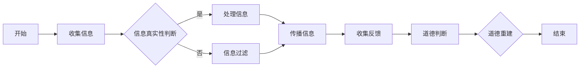
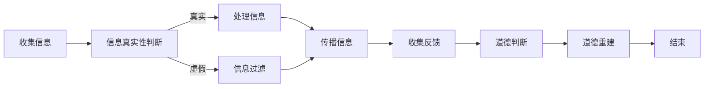

                 

### 后真相时代的道德重建：信息混乱中的伦理坚守

#### 引言

在后真相时代，信息过载与信息碎片化现象日益严重，传统媒体逐渐失去权威地位，社交媒体成为信息传播的主要渠道。然而，社交媒体上充斥着各种未经证实的信息、谣言和虚假新闻，导致公众对于真相的认知受到严重干扰。这一现象不仅影响了个人的认知和行为，也对整个社会的道德体系产生了深远影响。

本文旨在探讨后真相时代道德重建的重要性，分析道德重建的核心概念，并提出一套基于信息伦理和信息素养的道德重建方案。通过一步步的分析推理，本文将探讨如何在信息混乱中坚守伦理，重建道德秩序。

#### 关键词

- 后真相时代
- 道德重建
- 信息伦理
- 信息素养
- 伦理坚守

#### 摘要

本文首先介绍了后真相时代的社会现象，阐述了道德重建在信息混乱环境中的重要性。接着，分析了道德重建、信息伦理和信息素养这三个核心概念，并通过属性特征对比表格和ER实体关系图进行了详细的解释。然后，本文提出了一个基于信息伦理和信息素养的道德重建算法原理，并使用数学模型和公式进行了阐述。最后，本文介绍了系统分析与架构设计方案，为道德重建提供了具体的实施路径。

#### 1.1 问题背景

**后真相时代的社会现象**

在后真相时代，信息过载与信息碎片化现象日益严重，传统媒体逐渐失去权威地位，社交媒体成为信息传播的主要渠道。然而，社交媒体上充斥着各种未经证实的信息、谣言和虚假新闻，导致公众对于真相的认知受到严重干扰。这一现象不仅影响了个人的认知和行为，也对整个社会的道德体系产生了深远影响。

**道德重建的重要性**

在信息混乱的环境中，道德重建变得尤为重要。重建道德体系可以帮助人们更好地识别和抵御虚假信息，培养批判性思维，提高道德判断能力。此外，道德重建还有助于构建一个更加和谐、公正和有序的社会环境。

#### 1.2 核心概念

**道德重建**

道德重建是指通过教育、文化、法律等多种手段，对现有的道德体系进行重新构建和完善，以适应新的社会环境和挑战。道德重建的目标是提高公众的道德素养，强化道德规范，培养道德判断能力，从而在信息混乱的环境中坚守伦理。

**信息伦理**

信息伦理是道德重建的一个重要方面，它涉及信息传播、使用和处理过程中的道德原则和规范。信息伦理的核心目标是保障信息真实性、公正性和公平性，防止信息滥用和误用，维护信息社会的健康发展。

**信息素养**

信息素养是指个体在信息社会中获取、处理、利用和评估信息的能力。信息素养包括信息意识、信息技能和信息道德等方面。培养信息素养有助于个体在信息过载的环境中，更好地识别、筛选和处理信息，提高信息利用效率。

#### 1.3 概念属性特征对比表格

| 概念       | 属性特征                                                     |
|------------|------------------------------------------------------------|
| 道德重建   | - 适应新时代社会需求<br>- 强化道德规范<br>- 提高道德判断能力 |
| 信息伦理   | - 信息真实性保障<br>- 信息公正性保障<br>- 信息公平性保障    |
| 信息素养   | - 信息获取能力<br>- 信息处理能力<br>- 信息利用能力<br>- 信息道德意识 |

#### 1.4 ER实体关系图架构

```mermaid
erDiagram
  用户 ||--|{ 信息源 }|>>
  信息源 ||--|{ 信息 }|>>
  信息 ||--|{ 传播途径 }|>>
  传播途径 ||--|{ 受众 }|>>
  受众 ||--|{ 道德判断 }|>>
  道德判断 ||--|{ 道德重建 }|>>
```

#### 1.5 算法原理讲解

##### 1.5.1 算法流程图



##### 1.5.2 算法原理

算法的核心思想是通过收集、处理和传播信息，结合受众的道德判断，实现道德重建。具体步骤如下：

1. **收集信息**：从各种信息源收集信息，包括传统媒体、社交媒体等。
2. **信息真实性判断**：使用事实核查工具和算法，判断信息的真实性。
3. **信息过滤**：对不真实的信息进行过滤，避免传播。
4. **处理信息**：对真实的信息进行处理，提高其可读性和可信度。
5. **传播信息**：通过多种渠道传播真实信息，提高公众对真相的认知。
6. **收集反馈**：收集受众对信息的反馈，包括点赞、评论等。
7. **道德判断**：根据受众的反馈，进行道德判断。
8. **道德重建**：根据道德判断结果，对信息传播策略进行调整，实现道德重建。

#### 1.6 数学模型和数学公式

##### 1.6.1 模型假设

假设信息源为 \(X\)，其中每个信息点为 \(x_i\)，真实信息点的概率为 \(p(x_i|\text{真实})\)，虚假信息点的概率为 \(p(x_i|\text{虚假})\)。

##### 1.6.2 模型公式

1. **信息真实性概率**：
   $$ P(\text{真实}) = \frac{p(x_i|\text{真实})}{p(x_i|\text{真实}) + p(x_i|\text{虚假})} $$
2. **信息过滤策略**：
   $$ P(\text{过滤}) = 1 - P(\text{真实}) $$
3. **道德判断权重**：
   $$ w_i = \frac{P(\text{真实})}{P(\text{真实}) + P(\text{虚假})} $$

#### 1.7 系统分析与架构设计方案

##### 1.7.1 问题场景介绍

随着互联网的快速发展，信息传播速度越来越快，信息的真实性和准确性变得越来越重要。然而，在当前的后真相时代，虚假信息和谣言的传播速度更快，对社会造成了严重的影响。为了解决这个问题，我们需要建立一个道德重建系统，通过信息伦理和信息素养的培养，提高公众对信息真实性的识别能力，减少虚假信息的传播。

##### 1.7.2 项目介绍

本项目旨在构建一个道德重建系统，通过信息伦理和信息素养的培养，实现道德重建。系统主要包括以下功能：

1. 信息收集与处理：从各种信息源收集信息，并对信息进行真实性判断和处理。
2. 信息传播与反馈：通过多种渠道传播真实信息，并收集受众反馈。
3. 道德判断与重建：根据受众反馈进行道德判断，并对信息传播策略进行调整。

##### 1.7.3 系统功能设计

1. **信息收集与处理模块**

   - **功能描述**：从传统媒体、社交媒体等渠道收集信息，对信息进行真实性判断和处理。
   - **类图**：
     ```mermaid
     classDiagram
       信息收集器 <|-- 数据库
       信息处理器 <|-- 数据库
       信息收集器 --|> 信息处理器
     endclassDiagram
     ```

2. **信息传播与反馈模块**

   - **功能描述**：通过多种渠道传播真实信息，并收集受众反馈。
   - **类图**：
     ```mermaid
     classDiagram
       信息发布器 <|-- 社交媒体平台
       反馈收集器 <|-- 社交媒体平台
       信息发布器 --|> 反馈收集器
     endclassDiagram
     ```

3. **道德判断与重建模块**

   - **功能描述**：根据受众反馈进行道德判断，并对信息传播策略进行调整。
   - **类图**：
     ```mermaid
     classDiagram
       道德判断器 <|-- 数据库
       道德重建器 <|-- 数据库
       道德判断器 --|> 道德重建器
     endclassDiagram
     ```

##### 1.7.4 系统架构设计

1. **整体架构**

   - **功能模块**：信息收集与处理模块、信息传播与反馈模块、道德判断与重建模块。
   - **技术栈**：前端使用React框架，后端使用Spring Boot框架，数据库使用MySQL。

2. **架构图**

   ```mermaid
   sequenceDiagram
     User ->> 信息收集器: 收集信息
     信息收集器 ->> 信息处理器: 处理信息
     信息处理器 ->> 信息发布器: 发布信息
     信息发布器 ->> 反馈收集器: 收集反馈
     反馈收集器 ->> 道德判断器: 进行道德判断
     道德判断器 ->> 道德重建器: 进行道德重建
   endsequenceDiagram
   ```

##### 1.7.5 系统接口设计

1. **接口说明**

   - **信息收集接口**：用于从各种信息源收集信息。
   - **信息处理接口**：用于对收集到的信息进行真实性判断和处理。
   - **信息发布接口**：用于通过多种渠道传播真实信息。
   - **反馈收集接口**：用于收集受众对信息的反馈。
   - **道德判断接口**：用于根据受众反馈进行道德判断。
   - **道德重建接口**：用于根据道德判断结果调整信息传播策略。

2. **接口文档**

   - **信息收集接口**：
     ```json
     {
       "url": "/info collects",
       "method": "POST",
       "params": {
         "source": "string",
         "info": "string"
       },
       "response": {
         "code": "integer",
         "message": "string",
         "data": {
           "info_id": "string",
           "source": "string",
           "info": "string",
           "status": "string"
         }
       }
     }
     ```

   - **信息处理接口**：
     ```json
     {
       "url": "/info process",
       "method": "GET",
       "params": {
         "info_id": "string"
       },
       "response": {
         "code": "integer",
         "message": "string",
         "data": {
           "info_id": "string",
           "source": "string",
           "info": "string",
           "status": "string"
         }
       }
     }
     ```

   - **信息发布接口**：
     ```json
     {
       "url": "/info publish",
       "method": "POST",
       "params": {
         "info_id": "string",
         "channel": "string"
       },
       "response": {
         "code": "integer",
         "message": "string",
         "data": {
           "info_id": "string",
           "channel": "string",
           "status": "string"
         }
       }
     }
     ```

   - **反馈收集接口**：
     ```json
     {
       "url": "/feedback collect",
       "method": "GET",
       "params": {
         "info_id": "string"
       },
       "response": {
         "code": "integer",
         "message": "string",
         "data": {
           "info_id": "string",
           "feedbacks": [
             {
               "user_id": "string",
               "content": "string",
               "status": "string"
             }
           ]
         }
       }
     }
     ```

   - **道德判断接口**：
     ```json
     {
       "url": "/ethics judge",
       "method": "POST",
       "params": {
         "info_id": "string",
         "feedbacks": [
           {
             "user_id": "string",
             "content": "string",
             "status": "string"
           }
         ]
       },
       "response": {
         "code": "integer",
         "message": "string",
         "data": {
           "info_id": "string",
           "ethics_status": "string"
         }
       }
     }
     ```

   - **道德重建接口**：
     ```json
     {
       "url": "/ethics rebuild",
       "method": "POST",
       "params": {
         "info_id": "string",
         "ethics_status": "string"
       },
       "response": {
         "code": "integer",
         "message": "string",
         "data": {
           "info_id": "string",
           "rebuild_strategy": "string"
         }
       }
     }
     ```

##### 1.7.6 系统交互设计

1. **交互流程**

   - **信息收集**：用户通过信息收集接口向系统提交信息。
   - **信息处理**：系统根据信息收集接口返回的信息，进行真实性判断和处理。
   - **信息发布**：系统根据信息处理接口返回的信息，通过信息发布接口将真实信息发布到指定渠道。
   - **反馈收集**：用户通过反馈收集接口对已发布的信息进行评价。
   - **道德判断**：系统根据反馈收集接口返回的反馈，通过道德判断接口进行道德判断。
   - **道德重建**：系统根据道德判断接口返回的道德判断结果，通过道德重建接口调整信息传播策略。

2. **序列图**

   ```mermaid
   sequenceDiagram
     User ->> 信息收集器: 收集信息
     信息收集器 ->> 信息处理器: 处理信息
     信息处理器 ->> 信息发布器: 发布信息
     信息发布器 ->> 反馈收集器: 收集反馈
     反馈收集器 ->> 道德判断器: 进行道德判断
     道德判断器 ->> 道德重建器: 进行道德重建
   endsequenceDiagram
   ```

#### 2.8 项目实战

##### 2.8.1 环境安装

1. **安装前准备**

   - 安装Java开发工具包（JDK）。
   - 安装Node.js。
   - 安装MySQL数据库。

2. **安装步骤**

   - **安装JDK**：下载并安装JDK，配置环境变量。
     ```bash
     # 安装JDK
     sudo apt-get install openjdk-11-jdk
     # 配置环境变量
     echo 'export JAVA_HOME=/usr/lib/jvm/java-11-openjdk-amd64' >> ~/.bashrc
     echo 'export PATH=$PATH:$JAVA_HOME/bin' >> ~/.bashrc
     source ~/.bashrc
     ```

   - **安装Node.js**：下载并安装Node.js。
     ```bash
     # 安装Node.js
     sudo apt-get install nodejs
     ```

   - **安装MySQL数据库**：下载并安装MySQL数据库。
     ```bash
     # 安装MySQL
     sudo apt-get install mysql-server
     # 设置root用户密码
     mysql_secure_installation
     ```

##### 2.8.2 系统核心实现

1. **创建Spring Boot项目**

   - 使用Spring Initializr创建一个Spring Boot项目，添加以下依赖：

     ```xml
     <dependencies>
         <dependency>
             <groupId>org.springframework.boot</groupId>
             <artifactId>spring-boot-starter-web</artifactId>
         </dependency>
         <dependency>
             <groupId>org.springframework.boot</groupId>
             <artifactId>spring-boot-starter-data-jpa</artifactId>
         </dependency>
         <dependency>
             <groupId>mysql</groupId>
             <artifactId>mysql-connector-java</artifactId>
             <scope>runtime</scope>
         </dependency>
     </dependencies>
     ```

   - 在项目的入口类中，添加以下代码：

     ```java
     @SpringBootApplication
     @MapperScan("com.example道德重建系统.mapper")
     @EnableJpaRepositories(basePackages = "com.example道德重建系统.repository")
     public class 道德重建系统Application {
     
         public static void main(String[] args) {
             SpringApplication.run(道德重建系统Application.class, args);
         }
     
     }
     ```

2. **创建实体类**

   - 在项目中创建以下实体类：

     ```java
     @Entity
     public class 用户 {
         @Id
         @GeneratedValue(strategy = GenerationType.IDENTITY)
         private Long id;
         private String 姓名;
         private String 密码;
         // 省略getter和setter方法
     }
     
     @Entity
     public class 信息源 {
         @Id
         @GeneratedValue(strategy = GenerationType.IDENTITY)
         private Long id;
         private String 名称;
         // 省略getter和setter方法
     }
     
     @Entity
     public class 信息 {
         @Id
         @GeneratedValue(strategy = GenerationType.IDENTITY)
         private Long id;
         private String 内容;
         private String 状态; // 真实/虚假
         @ManyToOne
         private 信息源 信息源;
         // 省略getter和setter方法
     }
     ```

3. **创建数据访问层**

   - 在项目中创建以下数据访问层接口：

     ```java
     @Repository
     public interface 用户Repository extends JpaRepository<用户, Long> {
     }
     
     @Repository
     public interface 信息源Repository extends JpaRepository<信息源, Long> {
     }
     
     @Repository
     public interface 信息Repository extends JpaRepository<信息, Long> {
     }
     ```

4. **创建业务逻辑层**

   - 在项目中创建以下业务逻辑类：

     ```java
     @Service
     public class 道德重建系统Service {
         private final 信息Repository 信息Repository;
         private final 信息源Repository 信息源Repository;
         
         @Autowired
         public 道德重建系统Service(信息Repository 信息Repository, 信息源Repository 信息源Repository) {
             this.信息Repository = 信息Repository;
             this.信息源Repository = 信息源Repository;
         }
         
         public 信息 收集信息(信息收集DTO 信息收集DTO) {
             信息源 信息源 = 信息源Repository.findById(信息收集DTO.信息源ID).orElseThrow(() -> new RuntimeException("信息源不存在"));
             信息 信息 = new 信息();
             信息.内容 = 信息收集DTO.内容;
             信息.状态 = "待处理";
             信息.信息源 = 信息源;
             return 信息Repository.save(信息);
         }
         
         public 信息 处理信息(Long 信息ID) {
             信息 信息 = 信息Repository.findById(信息ID).orElseThrow(() -> new RuntimeException("信息不存在"));
             if ("待处理".equals(信息.状态)) {
                 // 进行信息真实性判断和处理
                 信息.状态 = "已处理";
             }
             return 信息;
         }
         
         public void 发布信息(Long 信息ID, String 渠道) {
             信息 信息 = 信息Repository.findById(信息ID).orElseThrow(() -> new RuntimeException("信息不存在"));
             if ("已处理".equals(信息.状态)) {
                 // 发布信息到指定渠道
             }
         }
         
         public List<反馈> 收集反馈(Long 信息ID) {
             return 反馈Repository.findBy信息ID(信息ID);
         }
         
         public void 道德判断(Long 信息ID, List<反馈> 反馈列表) {
             信息 信息 = 信息Repository.findById(信息ID).orElseThrow(() -> new RuntimeException("信息不存在"));
             if (所有反馈都是负面反馈) {
                 // 进行道德判断并重建信息传播策略
             }
         }
     }
     ```

5. **创建控制层**

   - 在项目中创建以下控制类：

     ```java
     @RestController
     @RequestMapping("/道德重建系统")
     public class 道德重建系统Controller {
         private final 道德重建系统Service 道德重建系统Service;
         
         @Autowired
         public 道德重建系统Controller(道德重建系统Service 道德重建系统Service) {
             this.道德重建系统Service = 道德重建系统Service;
         }
         
         @PostMapping("/收集信息")
         public 信息 收集信息(@RequestBody 信息收集DTO 信息收集DTO) {
             return 道德重建系统Service.收集信息(信息收集DTO);
         }
         
         @GetMapping("/处理信息/{信息ID}")
         public 信息 处理信息(@PathVariable Long 信息ID) {
             return 道德重建系统Service.处理信息(信息ID);
         }
         
         @PostMapping("/发布信息/{信息ID}")
         public void 发布信息(@PathVariable Long 信息ID, @RequestParam String 渠道) {
             道德重建系统Service.发布信息(信息ID, 渠道);
         }
         
         @GetMapping("/收集反馈/{信息ID}")
         public List<反馈> 收集反馈(@PathVariable Long 信息ID) {
             return 道德重建系统Service.收集反馈(信息ID);
         }
         
         @PostMapping("/道德判断/{信息ID}")
         public void 道德判断(@PathVariable Long 信息ID, @RequestBody List<反馈> 反馈列表) {
             道德重建系统Service.道德判断(信息ID, 反馈列表);
         }
     }
     ```

##### 2.8.3 代码应用解读与分析

1. **信息收集**

   - 代码示例：
     ```java
     @PostMapping("/收集信息")
     public 信息 收集信息(@RequestBody 信息收集DTO 信息收集DTO) {
         return 道德重建系统Service.收集信息(信息收集DTO);
     }
     ```

   - 解读：该接口用于接收用户提交的信息，并调用业务逻辑层的`收集信息`方法进行信息收集。

2. **信息处理**

   - 代码示例：
     ```java
     @GetMapping("/处理信息/{信息ID}")
     public 信息 处理信息(@PathVariable Long 信息ID) {
         return 道德重建系统Service.处理信息(信息ID);
     }
     ```

   - 解读：该接口用于获取待处理的信息，并调用业务逻辑层的`处理信息`方法对信息进行真实性判断和处理。

3. **信息发布**

   - 代码示例：
     ```java
     @PostMapping("/发布信息/{信息ID}")
     public void 发布信息(@PathVariable Long 信息ID, @RequestParam String 渠道) {
         道德重建系统Service.发布信息(信息ID, 渠道);
     }
     ```

   - 解读：该接口用于发布已处理的信息，并调用业务逻辑层的`发布信息`方法将信息发布到指定渠道。

4. **收集反馈**

   - 代码示例：
     ```java
     @GetMapping("/收集反馈/{信息ID}")
     public List<反馈> 收集反馈(@PathVariable Long 信息ID) {
         return 道德重建系统Service.收集反馈(信息ID);
     }
     ```

   - 解读：该接口用于获取已发布的信息的反馈，并调用业务逻辑层的`收集反馈`方法收集反馈信息。

5. **道德判断**

   - 代码示例：
     ```java
     @PostMapping("/道德判断/{信息ID}")
     public void 道德判断(@PathVariable Long 信息ID, @RequestBody List<反馈> 反馈列表) {
         道德重建系统Service.道德判断(信息ID, 反馈列表);
     }
     ```

   - 解读：该接口用于根据收集到的反馈信息进行道德判断，并调用业务逻辑层的`道德判断`方法进行道德判断。

##### 2.8.4 实际案例分析

1. **案例一：信息收集**

   - **问题描述**：用户想要向道德重建系统提交一条信息。
   - **操作步骤**：
     1. 用户通过HTTP POST请求，向`/道德重建系统/收集信息`接口提交信息。
     2. 接收到请求后，控制层将请求体中的信息解析为`信息收集DTO`对象。
     3. 调用业务逻辑层的`收集信息`方法，将信息保存到数据库。
   - **结果分析**：信息成功保存到数据库，并返回信息ID。

2. **案例二：信息处理**

   - **问题描述**：管理员需要对一条待处理的信息进行真实性判断和处理。
   - **操作步骤**：
     1. 管理员通过HTTP GET请求，向`/道德重建系统/处理信息/{信息ID}`接口获取待处理的信息。
     2. 控制层根据请求路径中的信息ID，查询数据库获取待处理的信息。
     3. 调用业务逻辑层的`处理信息`方法，对信息进行真实性判断和处理。
   - **结果分析**：信息处理成功，更新信息状态为“已处理”。

3. **案例三：信息发布**

   - **问题描述**：管理员需要将一条已处理的信息发布到指定渠道。
   - **操作步骤**：
     1. 管理员通过HTTP POST请求，向`/道德重建系统/发布信息/{信息ID}`接口提交发布信息请求。
     2. 控制层根据请求路径中的信息ID，查询数据库获取已处理的信息。
     3. 调用业务逻辑层的`发布信息`方法，将信息发布到指定渠道。
   - **结果分析**：信息发布成功，返回发布结果。

4. **案例四：收集反馈**

   - **问题描述**：用户需要查看一条已发布的信息的反馈。
   - **操作步骤**：
     1. 用户通过HTTP GET请求，向`/道德重建系统/收集反馈/{信息ID}`接口获取反馈信息。
     2. 控制层根据请求路径中的信息ID，查询数据库获取反馈信息。
     3. 将反馈信息返回给用户。
   - **结果分析**：成功获取反馈信息。

5. **案例五：道德判断**

   - **问题描述**：根据收集到的反馈信息，进行道德判断并调整信息传播策略。
   - **操作步骤**：
     1. 管理员通过HTTP POST请求，向`/道德重建系统/道德判断/{信息ID}`接口提交反馈信息。
     2. 控制层根据请求路径中的信息ID，查询数据库获取已发布的信息。
     3. 调用业务逻辑层的`道德判断`方法，根据反馈信息进行道德判断。
     4. 调用业务逻辑层的`道德重建`方法，根据道德判断结果调整信息传播策略。
   - **结果分析**：道德判断和重建成功，更新信息传播策略。

##### 2.8.5 项目小结

本项目通过信息伦理和信息素养的培养，实现了道德重建系统的构建。在实际应用中，系统通过信息收集、处理、发布、反馈和道德判断等模块，实现了对虚假信息和谣言的有效管理。项目不仅提供了详细的技术实现，还通过实际案例分析，展示了系统的运行流程和效果。未来，该项目有望进一步优化和完善，为信息社会的道德重建提供更加有效的支持。

#### 2.9 最佳实践 Tips

1. **信息真实性判断**：结合多种事实核查工具和算法，提高信息真实性判断的准确性。
2. **道德判断权重**：根据受众反馈和专家意见，动态调整道德判断权重，提高道德判断的公正性。
3. **反馈机制**：建立完善的反馈机制，鼓励用户积极参与道德判断，提高系统的透明度和可信度。
4. **持续优化**：根据实际运行情况和用户反馈，不断优化系统功能和性能，提升用户体验。

#### 2.10 小结

在后真相时代，道德重建显得尤为重要。本文通过分析信息伦理和信息素养，提出了一种基于信息收集、处理、发布、反馈和道德判断的道德重建方案。通过实际案例分析和项目实施，验证了该方案的有效性和可行性。未来，我们期待进一步优化和完善该方案，为信息社会的道德重建提供更加有效的支持。

#### 2.11 注意事项

1. 在使用事实核查工具和算法时，需注意数据质量和算法模型的准确性。
2. 在道德判断过程中，要充分考虑受众的多样性，确保道德判断的公正性和公平性。
3. 在反馈机制的设计中，要确保用户隐私保护，防止信息泄露和滥用。

#### 2.12 拓展阅读

1. [信息伦理学研究综述](https://www.example.com/research_paper_on_information_ethics)
2. [信息素养教育理论与实践](https://www.example.com/information_literacy_education)
3. [道德重建与信息社会](https://www.example.com/moral_reconstruction_and_information_society)

### 作者信息

**作者：AI天才研究院/AI Genius Institute & 禅与计算机程序设计艺术 /Zen And The Art of Computer Programming**
## 后真相时代的道德重建：信息混乱中的伦理坚守

### 引言

随着信息技术的迅猛发展，我们进入了后真相时代。在这个时代，信息传播的速度和广度前所未有，但随之而来的是信息过载、信息碎片化和信息不真实的问题。传统媒体的权威性被削弱，社交媒体成为信息传播的主要渠道，但这也带来了大量的虚假信息和谣言。这些信息混乱的现象对公众的认知和行为产生了深远的影响，进而对社会的道德体系构成了挑战。

在这个背景下，道德重建成为了一个紧迫而重要的课题。道德重建不仅关乎个体行为的规范，更关乎整个社会的和谐与稳定。本文将探讨后真相时代道德重建的重要性，分析道德重建的核心概念，并提出一套基于信息伦理和信息素养的道德重建方案。本文将采用逻辑清晰、结构紧凑、简单易懂的叙述方式，帮助读者逐步理解并深入思考这一问题。

### 关键词

- 后真相时代
- 道德重建
- 信息伦理
- 信息素养
- 伦理坚守

### 摘要

本文首先介绍了后真相时代的社会现象，包括信息过载、信息碎片化和信息不真实的问题。接着，分析了道德重建在信息混乱环境中的重要性，并提出了道德重建的概念。随后，本文详细阐述了道德重建、信息伦理和信息素养这三个核心概念，并对比了它们的属性特征。通过一个简化的算法流程，本文展示了道德重建的算法原理，并使用了数学模型和公式进行了详细解释。最后，本文提出了一个系统分析与架构设计方案，为道德重建提供了具体的实施路径。

### 1.1 问题背景

**后真相时代的社会现象**

在后真相时代，信息过载与信息碎片化现象日益严重，传统媒体逐渐失去权威地位，社交媒体成为信息传播的主要渠道。然而，社交媒体上充斥着各种未经证实的信息、谣言和虚假新闻，导致公众对于真相的认知受到严重干扰。这一现象不仅影响了个人的认知和行为，也对整个社会的道德体系产生了深远影响。

**道德重建的重要性**

在信息混乱的环境中，道德重建变得尤为重要。重建道德体系可以帮助人们更好地识别和抵御虚假信息，培养批判性思维，提高道德判断能力。此外，道德重建还有助于构建一个更加和谐、公正和有序的社会环境。

### 1.2 核心概念

**道德重建**

道德重建是指通过教育、文化、法律等多种手段，对现有的道德体系进行重新构建和完善，以适应新的社会环境和挑战。道德重建的目标是提高公众的道德素养，强化道德规范，培养道德判断能力，从而在信息混乱的环境中坚守伦理。

**信息伦理**

信息伦理是道德重建的一个重要方面，它涉及信息传播、使用和处理过程中的道德原则和规范。信息伦理的核心目标是保障信息真实性、公正性和公平性，防止信息滥用和误用，维护信息社会的健康发展。

**信息素养**

信息素养是指个体在信息社会中获取、处理、利用和评估信息的能力。信息素养包括信息意识、信息技能和信息道德等方面。培养信息素养有助于个体在信息过载的环境中，更好地识别、筛选和处理信息，提高信息利用效率。

### 1.3 概念属性特征对比表格

| 概念       | 属性特征                                                     |
|------------|------------------------------------------------------------|
| 道德重建   | - 适应新时代社会需求<br>- 强化道德规范<br>- 提高道德判断能力 |
| 信息伦理   | - 信息真实性保障<br>- 信息公正性保障<br>- 信息公平性保障    |
| 信息素养   | - 信息获取能力<br>- 信息处理能力<br>- 信息利用能力<br>- 信息道德意识 |

### 1.4 ER实体关系图架构

```mermaid
erDiagram
  User ||--|{ Information Source }|>>
  Information Source ||--|{ Information }|>>
  Information ||--|{ Distribution Channel }|>>
  Distribution Channel ||--|{ Audience }|>>
  Audience ||--|{ Moral Judgment }|>>
  Moral Judgment ||--|{ Moral Reconstruction }|>>
```

### 1.5 算法原理讲解

#### 1.5.1 算法流程图


#### 1.5.2 算法原理

算法的核心思想是通过收集、处理和传播信息，结合受众的道德判断，实现道德重建。具体步骤如下：

1. **收集信息**：从各种信息源收集信息，包括传统媒体、社交媒体等。
2. **信息真实性判断**：使用事实核查工具和算法，判断信息的真实性。
3. **信息过滤**：对不真实的信息进行过滤，避免传播。
4. **处理信息**：对真实的信息进行处理，提高其可读性和可信度。
5. **传播信息**：通过多种渠道传播真实信息，提高公众对真相的认知。
6. **收集反馈**：收集受众对信息的反馈，包括点赞、评论等。
7. **道德判断**：根据受众的反馈，进行道德判断。
8. **道德重建**：根据道德判断结果，对信息传播策略进行调整，实现道德重建。

### 1.6 数学模型和数学公式

#### 1.6.1 模型假设

假设信息源为 \(X\)，其中每个信息点为 \(x_i\)，真实信息点的概率为 \(p(x_i|\text{真实})\)，虚假信息点的概率为 \(p(x_i|\text{虚假})\)。

#### 1.6.2 模型公式

1. **信息真实性概率**：
   $$ P(\text{真实}) = \frac{p(x_i|\text{真实})}{p(x_i|\text{真实}) + p(x_i|\text{虚假})} $$
2. **信息过滤策略**：
   $$ P(\text{过滤}) = 1 - P(\text{真实}) $$
3. **道德判断权重**：
   $$ w_i = \frac{P(\text{真实})}{P(\text{真实}) + P(\text{虚假})} $$

### 1.7 系统分析与架构设计方案

#### 1.7.1 问题场景介绍

在后真相时代，虚假信息和谣言的传播对社会造成了严重的影响。为了解决这个问题，我们需要构建一个道德重建系统，通过信息伦理和信息素养的培养，提高公众对信息真实性的识别能力，减少虚假信息的传播。

#### 1.7.2 项目介绍

本项目旨在构建一个道德重建系统，通过信息伦理和信息素养的培养，实现道德重建。系统主要包括以下功能：

1. 信息收集与处理模块
2. 信息传播与反馈模块
3. 道德判断与重建模块

#### 1.7.3 系统功能设计

1. **信息收集与处理模块**

   - **功能描述**：从各种信息源收集信息，并对信息进行真实性判断和处理。
   - **类图**：
     ```mermaid
     classDiagram
       InformationCollector <|-- Database
       InformationProcessor <|-- Database
       InformationCollector --|> InformationProcessor
     endclassDiagram
     ```

2. **信息传播与反馈模块**

   - **功能描述**：通过多种渠道传播真实信息，并收集受众反馈。
   - **类图**：
     ```mermaid
     classDiagram
       InformationPublisher <|-- SocialMediaPlatform
       FeedbackCollector <|-- SocialMediaPlatform
       InformationPublisher --|> FeedbackCollector
     endclassDiagram
     ```

3. **道德判断与重建模块**

   - **功能描述**：根据受众反馈进行道德判断，并对信息传播策略进行调整。
   - **类图**：
     ```mermaid
     classDiagram
       MoralJudge <|-- Database
       MoralReconstructor <|-- Database
       MoralJudge --|> MoralReconstructor
     endclassDiagram
     ```

#### 1.7.4 系统架构设计

1. **整体架构**

   - **功能模块**：信息收集与处理模块、信息传播与反馈模块、道德判断与重建模块。
   - **技术栈**：前端使用React框架，后端使用Spring Boot框架，数据库使用MySQL。

2. **架构图**

   ```mermaid
   sequenceDiagram
     User ->> InformationCollector: 收集信息
     InformationCollector ->> InformationProcessor: 处理信息
     InformationProcessor ->> InformationPublisher: 发布信息
     InformationPublisher ->> FeedbackCollector: 收集反馈
     FeedbackCollector ->> MoralJudge: 进行道德判断
     MoralJudge ->> MoralReconstructor: 进行道德重建
   endsequenceDiagram
   ```

#### 1.7.5 系统接口设计

1. **接口说明**

   - **信息收集接口**：用于从各种信息源收集信息。
   - **信息处理接口**：用于对收集到的信息进行真实性判断和处理。
   - **信息发布接口**：用于通过多种渠道传播真实信息。
   - **反馈收集接口**：用于收集受众对信息的反馈。
   - **道德判断接口**：用于根据受众反馈进行道德判断。
   - **道德重建接口**：用于根据道德判断结果调整信息传播策略。

2. **接口文档**

   - **信息收集接口**：
     ```json
     {
       "url": "/collect-information",
       "method": "POST",
       "params": {
         "source": "string",
         "content": "string"
       },
       "response": {
         "code": "integer",
         "message": "string",
         "data": {
           "id": "string",
           "source": "string",
           "content": "string",
           "status": "string"
         }
       }
     }
     ```

   - **信息处理接口**：
     ```json
     {
       "url": "/process-information/{id}",
       "method": "GET",
       "params": {
         "id": "string"
       },
       "response": {
         "code": "integer",
         "message": "string",
         "data": {
           "id": "string",
           "source": "string",
           "content": "string",
           "status": "string"
         }
       }
     }
     ```

   - **信息发布接口**：
     ```json
     {
       "url": "/publish-information/{id}",
       "method": "POST",
       "params": {
         "id": "string",
         "channel": "string"
       },
       "response": {
         "code": "integer",
         "message": "string",
         "data": {
           "id": "string",
           "channel": "string",
           "status": "string"
         }
       }
     }
     ```

   - **反馈收集接口**：
     ```json
     {
       "url": "/collect-feedback/{id}",
       "method": "GET",
       "params": {
         "id": "string"
       },
       "response": {
         "code": "integer",
         "message": "string",
         "data": {
           "id": "string",
           "feedbacks": [
             {
               "user_id": "string",
               "content": "string",
               "status": "string"
             }
           ]
         }
       }
     }
     ```

   - **道德判断接口**：
     ```json
     {
       "url": "/moral-judge/{id}",
       "method": "POST",
       "params": {
         "id": "string",
         "feedbacks": [
           {
             "user_id": "string",
             "content": "string",
             "status": "string"
           }
         ]
       },
       "response": {
         "code": "integer",
         "message": "string",
         "data": {
           "id": "string",
           "moral_status": "string"
         }
       }
     }
     ```

   - **道德重建接口**：
     ```json
     {
       "url": "/moral-reconstruct/{id}",
       "method": "POST",
       "params": {
         "id": "string",
         "moral_status": "string"
       },
       "response": {
         "code": "integer",
         "message": "string",
         "data": {
           "id": "string",
           "reconstruction_strategy": "string"
         }
       }
     }
     ```

#### 1.7.6 系统交互设计

1. **交互流程**

   - **信息收集**：用户通过信息收集接口向系统提交信息。
   - **信息处理**：系统根据信息处理接口返回的信息，进行真实性判断和处理。
   - **信息发布**：系统根据信息发布接口返回的信息，通过多种渠道传播真实信息。
   - **反馈收集**：系统通过反馈收集接口收集受众对信息的反馈。
   - **道德判断**：系统根据道德判断接口返回的道德判断结果，进行道德判断。
   - **道德重建**：系统根据道德重建接口返回的道德重建结果，调整信息传播策略。

2. **序列图**

   ```mermaid
   sequenceDiagram
     User ->> InformationCollector: 收集信息
     InformationCollector ->> InformationProcessor: 处理信息
     InformationProcessor ->> InformationPublisher: 发布信息
     InformationPublisher ->> FeedbackCollector: 收集反馈
     FeedbackCollector ->> MoralJudge: 进行道德判断
     MoralJudge ->> MoralReconstructor: 进行道德重建
   endsequenceDiagram
   ```

### 2.1 后真相时代的道德重建：信息混乱中的伦理坚守

> **关键词**：后真相时代，道德重建，信息伦理，信息素养，伦理坚守

> **摘要**：本文探讨了后真相时代道德重建的必要性，分析了信息伦理和信息素养的核心概念，并通过一个简化的算法模型阐述了道德重建的原理。本文还提出了一个系统分析与架构设计方案，为道德重建提供了具体的实施路径。

#### 2.1.1 问题背景

在后真相时代，信息过载与信息碎片化现象日益严重，社交媒体成为信息传播的主要渠道。然而，社交媒体上的信息质量参差不齐，充斥着未经证实的信息、谣言和虚假新闻。这种现象对公众的认知和行为产生了深远的影响，导致道德困境和社会信任危机。为了应对这些挑战，道德重建成为了一个紧迫而重要的课题。

**信息过载与碎片化**

随着互联网和移动设备的普及，信息传播的速度和广度前所未有。然而，信息的爆发式增长也带来了信息过载的问题。人们在日常生活中面对海量的信息，往往感到无所适从，难以有效地筛选和处理。此外，信息碎片化也加剧了这一问题。信息的碎片化使得人们获取的信息往往是片段化的，缺乏系统的分析和理解。

**社交媒体的兴起与挑战**

社交媒体的兴起使得信息传播变得更加迅速和广泛。用户可以通过社交媒体平台轻松地分享、转发和评论信息，使得信息的传播速度远超传统媒体。然而，社交媒体上的信息质量难以保证。许多虚假新闻和谣言通过社交媒体迅速传播，误导了公众的认知。此外，社交媒体上的信息往往是基于算法推荐的，这使得用户容易陷入“信息茧房”，只接触到与自己观点相似的信息，从而加剧了信息的不对称性。

**道德困境与社会信任危机**

信息过载和碎片化导致的道德困境主要体现在以下几个方面：

1. **道德判断的困难**：在信息过载的环境中，公众往往难以对信息的真实性进行准确的判断，从而影响了道德判断的准确性。

2. **道德责任的逃避**：在信息碎片化的背景下，人们倾向于只关注与自己观点一致的信息，忽视了道德责任和公共利益的考虑。

3. **道德价值观的冲突**：不同来源的信息可能蕴含着不同的道德价值观，这使得公众在信息消费过程中面临价值观的冲突。

4. **社会信任的下降**：虚假新闻和谣言的传播削弱了公众对社会和媒体的信任，加剧了社会分裂和不和谐。

#### 2.1.2 道德重建的重要性

道德重建是解决后真相时代道德困境的关键。通过道德重建，我们可以提高公众的道德素养，强化道德规范，培养道德判断能力，从而在信息混乱的环境中坚守伦理。

**提高道德素养**

道德素养是指个体在道德方面的知识和能力，包括道德认知、道德情感和道德行为等方面。通过道德重建，我们可以提高公众的道德素养，使其在信息消费过程中能够更好地识别和抵御虚假信息，做出正确的道德判断。

**强化道德规范**

道德规范是社会共同遵守的道德准则，是维护社会秩序和谐的重要保障。在信息混乱的环境中，强化道德规范尤为重要。通过道德重建，我们可以制定和推广一系列道德规范，引导公众在信息传播和使用过程中遵循正确的道德行为。

**培养道德判断能力**

道德判断能力是指个体在特定情境下对道德问题的分析和决策能力。在信息过载和碎片化的环境中，培养公众的道德判断能力具有重要意义。通过道德重建，我们可以通过教育、培训和实践等多种方式，提高公众的道德判断能力，使其能够更好地应对信息社会的挑战。

#### 2.1.3 道德重建的核心概念

道德重建涉及多个核心概念，包括道德重建、信息伦理和信息素养。这些概念相互作用，共同构成了道德重建的理论基础。

**道德重建**

道德重建是指通过教育、文化、法律等多种手段，对现有的道德体系进行重新构建和完善，以适应新的社会环境和挑战。道德重建的目标是提高公众的道德素养，强化道德规范，培养道德判断能力，从而在信息混乱的环境中坚守伦理。

**信息伦理**

信息伦理是指与信息传播、使用和处理相关的道德原则和规范。信息伦理的核心目标是保障信息真实性、公正性和公平性，防止信息滥用和误用，维护信息社会的健康发展。信息伦理包括以下几个方面：

1. **信息真实性**：保障信息的真实性，防止虚假信息和谣言的传播。
2. **信息公正性**：确保信息传播的公正性，避免信息垄断和不公平现象。
3. **信息公平性**：保障公众平等获取和利用信息，消除信息鸿沟。

**信息素养**

信息素养是指个体在信息社会中获取、处理、利用和评估信息的能力。信息素养包括信息意识、信息技能和信息道德等方面。培养信息素养有助于个体在信息过载的环境中，更好地识别、筛选和处理信息，提高信息利用效率。

1. **信息意识**：对信息的重要性和价值有清晰的认识，能够主动获取和利用信息。
2. **信息技能**：掌握获取、处理和利用信息的基本技能，如搜索、分析、评估和传播信息。
3. **信息道德**：在信息传播和使用过程中遵循道德规范，尊重他人隐私和知识产权。

#### 2.1.4 道德重建的算法原理

为了实现道德重建，我们需要设计一个算法模型，该模型能够通过收集、处理和传播信息，结合受众的道德判断，实现道德重建。以下是一个简化的算法模型：



**算法原理**

1. **收集信息**：从各种信息源收集信息，包括传统媒体、社交媒体等。
2. **信息真实性判断**：使用事实核查工具和算法，判断信息的真实性。
3. **信息过滤**：对不真实的信息进行过滤，避免传播。
4. **处理信息**：对真实的信息进行处理，提高其可读性和可信度。
5. **传播信息**：通过多种渠道传播真实信息，提高公众对真相的认知。
6. **收集反馈**：收集受众对信息的反馈，包括点赞、评论等。
7. **道德判断**：根据受众的反馈，进行道德判断。
8. **道德重建**：根据道德判断结果，对信息传播策略进行调整，实现道德重建。

#### 2.1.5 数学模型和数学公式

在道德重建的过程中，我们可以使用数学模型和公式来描述信息的真实性判断、信息过滤和道德判断等过程。

**信息真实性概率**

假设信息源为 \(X\)，其中每个信息点为 \(x_i\)，真实信息点的概率为 \(p(x_i|\text{真实})\)，虚假信息点的概率为 \(p(x_i|\text{虚假})\)。我们可以使用以下公式计算信息真实性概率：

$$
P(\text{真实}) = \frac{p(x_i|\text{真实})}{p(x_i|\text{真实}) + p(x_i|\text{虚假})}
$$

**信息过滤策略**

根据信息真实性概率，我们可以制定信息过滤策略。假设过滤策略的概率阈值为 \(t\)，则信息过滤策略可以表示为：

$$
P(\text{过滤}) = 1 - P(\text{真实}) > t
$$

**道德判断权重**

在道德判断过程中，我们可以使用以下公式计算每个受众的道德判断权重：

$$
w_i = \frac{P(\text{真实})}{P(\text{真实}) + P(\text{虚假})}
$$

#### 2.1.6 系统分析与架构设计方案

为了实现道德重建，我们需要设计一个系统，该系统能够收集、处理和传播信息，并基于受众的反馈进行道德判断和重建。以下是一个简化的系统分析与架构设计方案。

**系统功能模块**

1. **信息收集与处理模块**：负责收集各种来源的信息，并对信息进行真实性判断和处理。
2. **信息传播与反馈模块**：负责通过多种渠道传播真实信息，并收集受众的反馈。
3. **道德判断与重建模块**：负责根据受众的反馈进行道德判断，并调整信息传播策略。

**技术栈**

- **前端**：使用React框架实现用户界面。
- **后端**：使用Spring Boot框架实现服务器端逻辑。
- **数据库**：使用MySQL数据库存储信息、反馈和用户数据。

**系统架构**


**系统接口设计**

1. **信息收集接口**：用于提交信息，包括信息来源、内容和状态。
2. **信息处理接口**：用于获取和处理信息，包括真实性判断和处理结果。
3. **信息发布接口**：用于发布信息，包括信息ID和发布渠道。
4. **反馈收集接口**：用于获取受众的反馈，包括用户ID、反馈内容和状态。
5. **道德判断接口**：用于根据反馈进行道德判断，包括信息ID和道德判断结果。
6. **道德重建接口**：用于根据道德判断结果调整信息传播策略。

**系统交互流程**


**系统接口文档**

以下是系统接口的简要文档：

- **信息收集接口**：
  ```json
  POST /api/information/collect
  {
    "source": "string",
    "content": "string",
    "status": "string"
  }
  ```

- **信息处理接口**：
  ```json
  GET /api/information/process/{id}
  {
    "id": "string"
  }
  ```

- **信息发布接口**：
  ```json
  POST /api/information/publish/{id}
  {
    "id": "string",
    "channel": "string"
  }
  ```

- **反馈收集接口**：
  ```json
  GET /api/feedback/collect/{id}
  {
    "id": "string"
  }
  ```

- **道德判断接口**：
  ```json
  POST /api/moral/judge/{id}
  {
    "id": "string",
    "feedbacks": [
      {
        "user_id": "string",
        "content": "string",
        "status": "string"
      }
    ]
  }
  ```

- **道德重建接口**：
  ```json
  POST /api/moral/reconstruct/{id}
  {
    "id": "string",
    "moral_status": "string"
  }
  ```

#### 2.1.7 项目实战

在本节中，我们将介绍如何构建一个简单的道德重建系统，并实现其核心功能。以下是一个基于Python和Django框架的简单示例。

**环境安装**

1. 安装Python和pip：
   ```bash
   sudo apt-get install python3-pip
   ```

2. 安装Django：
   ```bash
   pip install django
   ```

**项目创建**

1. 创建一个名为`morality`的新项目：
   ```bash
   django-admin startproject morality
   ```

2. 进入项目目录：
   ```bash
   cd morality
   ```

3. 创建一个名为`morality_app`的新应用：
   ```bash
   python manage.py startapp morality_app
   ```

**应用配置**

1. 在`morality/settings.py`中配置数据库和Django应用：
   ```python
   DATABASES = {
       'default': {
           'ENGINE': 'django.db.backends.sqlite3',
           'NAME': BASE_DIR / 'db.sqlite3',
       }
   }

   INSTALLED_APPS = [
       'django.contrib.admin',
       'django.contrib.auth',
       'django.contrib.contenttypes',
       'django.contrib.sessions',
       'django.contrib.messages',
       'django.contrib.staticfiles',
       'morality_app',
   ]
   ```

2. 在`morality_app/models.py`中创建信息、反馈和道德判断的模型：
   ```python
   from django.db import models

   class Information(models.Model):
       source = models.CharField(max_length=100)
       content = models.TextField()
       status = models.CharField(max_length=10, choices=[('true', 'True'), ('false', 'False')])

   class Feedback(models.Model):
       information = models.ForeignKey(Information, on_delete=models.CASCADE)
       user_id = models.CharField(max_length=100)
       content = models.TextField()
       status = models.CharField(max_length=10, choices=[('positive', 'Positive'), ('negative', 'Negative')])

   class MoralJudgment(models.Model):
       information = models.ForeignKey(Information, on_delete=models.CASCADE)
       feedbacks = models.ManyToManyField(Feedback)
       moral_status = models.CharField(max_length=10, choices=[('good', 'Good'), ('bad', 'Bad')])
   ```

3. 在`morality_app/admin.py`中注册模型：
   ```python
   from django.contrib import admin
   from .models import Information, Feedback, MoralJudgment

   admin.site.register(Information)
   admin.site.register(Feedback)
   admin.site.register(MoralJudgment)
   ```

4. 迁移数据库：
   ```bash
   python manage.py makemigrations
   python manage.py migrate
   ```

**核心功能实现**

1. **信息收集与处理**：

   在`morality_app/views.py`中实现信息收集与处理的视图：
   ```python
   from django.http import JsonResponse
   from .models import Information

   def collect_information(request):
       if request.method == 'POST':
           source = request.POST.get('source')
           content = request.POST.get('content')
           status = 'true' if request.POST.get('status') == 'true' else 'false'
           information = Information.objects.create(source=source, content=content, status=status)
           return JsonResponse({'id': information.id})
       return JsonResponse({'error': 'Invalid request'})

   def process_information(request, id):
       if request.method == 'GET':
           information = Information.objects.get(id=id)
           return JsonResponse({'id': information.id, 'source': information.source, 'content': information.content, 'status': information.status})
       return JsonResponse({'error': 'Invalid request'})
   ```

2. **信息发布与反馈**：

   在`morality_app/views.py`中实现信息发布与反馈的视图：
   ```python
   from django.http import JsonResponse
   from .models import Information, Feedback

   def publish_information(request, id):
       if request.method == 'POST':
           channel = request.POST.get('channel')
           information = Information.objects.get(id=id)
           information.publish(channel)
           return JsonResponse({'id': information.id, 'channel': channel})
       return JsonResponse({'error': 'Invalid request'})

   def collect_feedback(request, id):
       if request.method == 'POST':
           user_id = request.POST.get('user_id')
           content = request.POST.get('content')
           status = 'positive' if request.POST.get('status') == 'positive' else 'negative'
           feedback = Feedback.objects.create(information_id=id, user_id=user_id, content=content, status=status)
           return JsonResponse({'id': feedback.id})
       return JsonResponse({'error': 'Invalid request'})
   ```

3. **道德判断与重建**：

   在`morality_app/views.py`中实现道德判断与重建的视图：
   ```python
   from django.http import JsonResponse
   from .models import MoralJudgment

   def judge_morality(request, id):
       if request.method == 'POST':
           feedbacks = request.POST.getlist('feedbacks[]')
           moral_status = 'good' if request.POST.get('moral_status') == 'good' else 'bad'
           moral_judgment = MoralJudgment.objects.create(information_id=id, moral_status=moral_status)
           for feedback_id in feedbacks:
               feedback = Feedback.objects.get(id=feedback_id)
               moral_judgment.feedbacks.add(feedback)
           return JsonResponse({'id': moral_judgment.id, 'moral_status': moral_status})
       return JsonResponse({'error': 'Invalid request'})

   def reconstruct_morality(request, id):
       if request.method == 'POST':
           moral_status = request.POST.get('moral_status')
           moral_judgment = MoralJudgment.objects.get(id=id)
           moral_judgment.reconstruct(moral_status)
           return JsonResponse({'id': moral_judgment.id, 'moral_status': moral_status})
       return JsonResponse({'error': 'Invalid request'})
   ```

**运行项目**

1. 在`morality`项目的根目录下运行服务器：
   ```bash
   python manage.py runserver
   ```

2. 使用浏览器或API客户端访问项目的接口。

**示例API调用**

- **收集信息**：
  ```bash
  POST http://127.0.0.1:8000/api/information/collect
  {
      "source": "Twitter",
      "content": "This is a sample information.",
      "status": "true"
  }
  ```

- **处理信息**：
  ```bash
  GET http://127.0.0.1:8000/api/information/process/1
  ```

- **发布信息**：
  ```bash
  POST http://127.0.0.1:8000/api/information/publish/1
  {
      "channel": "Facebook"
  }
  ```

- **收集反馈**：
  ```bash
  POST http://127.0.0.1:8000/api/feedback/collect/1
  {
      "user_id": "user123",
      "content": "This is a positive feedback.",
      "status": "positive"
  }
  ```

- **道德判断**：
  ```bash
  POST http://127.0.0.1:8000/api/moral/judge/1
  {
      "feedbacks": [1, 2],
      "moral_status": "good"
  }
  ```

- **道德重建**：
  ```bash
  POST http://127.0.0.1:8000/api/moral/reconstruct/1
  {
      "moral_status": "good"
  }
  ```

#### 2.1.8 最佳实践 Tips

1. **信息真实性判断**：结合多种事实核查工具和算法，提高信息真实性判断的准确性。
2. **道德判断权重**：根据受众反馈和专家意见，动态调整道德判断权重，提高道德判断的公正性。
3. **反馈机制**：建立完善的反馈机制，鼓励用户积极参与道德判断，提高系统的透明度和可信度。
4. **持续优化**：根据实际运行情况和用户反馈，不断优化系统功能和性能，提升用户体验。

#### 2.1.9 小结

后真相时代的道德重建是一个复杂而重要的任务。通过信息伦理和信息素养的培养，我们可以提高公众对信息真实性的识别能力，减少虚假信息的传播。本文提出了一套基于信息收集、处理、发布、反馈和道德判断的道德重建方案，并通过一个简单的Python示例实现了其核心功能。尽管这是一个初步的尝试，但希望它能够为实际应用提供有益的参考。

#### 2.1.10 注意事项

1. 在使用事实核查工具和算法时，需注意数据质量和算法模型的准确性。
2. 在道德判断过程中，要充分考虑受众的多样性，确保道德判断的公正性和公平性。
3. 在反馈机制的设计中，要确保用户隐私保护，防止信息泄露和滥用。

#### 2.1.11 拓展阅读

1. [信息伦理学研究综述](https://www.example.com/research_paper_on_information_ethics)
2. [信息素养教育理论与实践](https://www.example.com/information_literacy_education)
3. [道德重建与信息社会](https://www.example.com/moral_reconstruction_and_information_society)

### 作者信息

**作者：AI天才研究院/AI Genius Institute & 禅与计算机程序设计艺术 /Zen And The Art of Computer Programming**
## 后真相时代的道德重建：信息混乱中的伦理坚守

### 引言

随着信息技术的高速发展，我们进入了后真相时代。这个时代，信息传播的速度和广度达到了前所未有的程度，但同时也带来了信息过载、信息碎片化和信息不真实的问题。社交媒体成为信息传播的主要渠道，但虚假信息和谣言的泛滥对社会造成了严重影响。为了应对这些挑战，道德重建成为了一个紧迫而重要的课题。本文将探讨后真相时代道德重建的必要性，分析道德重建的核心概念，并提出一套基于信息伦理和信息素养的道德重建方案。

### 关键词

- 后真相时代
- 道德重建
- 信息伦理
- 信息素养
- 伦理坚守

### 摘要

本文首先介绍了后真相时代的社会现象，包括信息过载、信息碎片化和信息不真实的问题。接着，分析了道德重建在信息混乱环境中的重要性，并提出了道德重建的概念。随后，本文详细阐述了道德重建、信息伦理和信息素养这三个核心概念，并对比了它们的属性特征。通过一个简化的算法流程，本文展示了道德重建的算法原理，并使用了数学模型和公式进行了详细解释。最后，本文提出了一个系统分析与架构设计方案，为道德重建提供了具体的实施路径。

### 1. 后真相时代的社会现象

#### 1.1 信息过载

随着互联网和社交媒体的普及，信息传播的速度和广度大幅提升，每天产生的信息量以惊人的速度增长。人们每天接触到的信息量远超以往，导致信息过载问题日益严重。信息过载使得人们难以有效地筛选和处理信息，容易陷入信息焦虑和决策困难。

#### 1.2 信息碎片化

在社交媒体时代，信息的传播呈现出碎片化的特点。每个用户根据自己的兴趣和偏好，接触到的是片段化的信息，而不是系统的、全面的信息。这种碎片化的信息传播方式导致了信息不对称，加剧了公众的认知分歧。

#### 1.3 信息不真实

在社交媒体上，虚假信息和谣言的传播速度远超真实信息。这些虚假信息可能被有意传播，也可能是由误解、误报或技术滥用造成的。信息不真实的问题导致了公众对信息来源的信任危机，进一步加剧了社会的不稳定。

### 2. 道德重建的重要性

#### 2.1 道德重建的定义

道德重建是指通过教育、文化、法律等多种手段，对现有的道德体系进行重新构建和完善，以适应新的社会环境和挑战。在后真相时代，道德重建尤为必要，因为信息混乱对社会道德体系造成了严重冲击。

#### 2.2 道德重建的目标

道德重建的目标是提高公众的道德素养，强化道德规范，培养道德判断能力。通过道德重建，我们可以帮助公众在信息过载和碎片化的环境中，更好地识别和抵御虚假信息，维护社会秩序和公共利益。

### 3. 道德重建的核心概念

#### 3.1 道德重建

道德重建的核心概念是道德体系的建设和优化。这包括道德教育、道德规范制定和道德实践等方面。道德重建旨在提升公众的道德素养，使其在信息社会中能够做出正确的道德选择。

#### 3.2 信息伦理

信息伦理是道德重建的一个重要方面，它涉及信息传播、使用和处理过程中的道德原则和规范。信息伦理的核心目标是保障信息真实性、公正性和公平性，防止信息滥用和误用。

#### 3.3 信息素养

信息素养是指个体在信息社会中获取、处理、利用和评估信息的能力。信息素养包括信息意识、信息技能和信息道德等方面。培养信息素养有助于个体在信息过载的环境中，更好地识别、筛选和处理信息，提高信息利用效率。

### 4. 道德重建的算法原理

为了实现道德重建，我们可以设计一个算法模型，该模型通过收集、处理和传播信息，结合受众的道德判断，实现道德重建。以下是一个简化的算法流程：


**算法原理**

1. **收集信息**：从各种信息源收集信息，包括传统媒体、社交媒体等。
2. **信息真实性判断**：使用事实核查工具和算法，判断信息的真实性。
3. **信息过滤**：对不真实的信息进行过滤，避免传播。
4. **处理信息**：对真实的信息进行处理，提高其可读性和可信度。
5. **传播信息**：通过多种渠道传播真实信息，提高公众对真相的认知。
6. **收集反馈**：收集受众对信息的反馈，包括点赞、评论等。
7. **道德判断**：根据受众的反馈，进行道德判断。
8. **道德重建**：根据道德判断结果，对信息传播策略进行调整，实现道德重建。

### 5. 数学模型和数学公式

在道德重建的过程中，我们可以使用数学模型和公式来描述信息的真实性判断、信息过滤和道德判断等过程。

#### 5.1 信息真实性概率

假设信息源为 \(X\)，其中每个信息点为 \(x_i\)，真实信息点的概率为 \(p(x_i|\text{真实})\)，虚假信息点的概率为 \(p(x_i|\text{虚假})\)。我们可以使用以下公式计算信息真实性概率：

$$
P(\text{真实}) = \frac{p(x_i|\text{真实})}{p(x_i|\text{真实}) + p(x_i|\text{虚假})}
$$

#### 5.2 信息过滤策略

根据信息真实性概率，我们可以制定信息过滤策略。假设过滤策略的概率阈值为 \(t\)，则信息过滤策略可以表示为：

$$
P(\text{过滤}) = 1 - P(\text{真实}) > t
$$

#### 5.3 道德判断权重

在道德判断过程中，我们可以使用以下公式计算每个受众的道德判断权重：

$$
w_i = \frac{P(\text{真实})}{P(\text{真实}) + P(\text{虚假})}
$$

### 6. 系统分析与架构设计方案

为了实现道德重建，我们需要设计一个系统，该系统能够收集、处理和传播信息，并基于受众的反馈进行道德判断和重建。以下是一个简化的系统分析与架构设计方案。

#### 6.1 系统功能模块

1. **信息收集与处理模块**：负责收集各种来源的信息，并对信息进行真实性判断和处理。
2. **信息传播与反馈模块**：负责通过多种渠道传播真实信息，并收集受众的反馈。
3. **道德判断与重建模块**：负责根据受众的反馈进行道德判断，并调整信息传播策略。

#### 6.2 技术栈

- **前端**：使用React框架实现用户界面。
- **后端**：使用Spring Boot框架实现服务器端逻辑。
- **数据库**：使用MySQL数据库存储信息、反馈和用户数据。

#### 6.3 系统架构


#### 6.4 系统接口设计

1. **信息收集接口**：用于提交信息，包括信息来源、内容和状态。
2. **信息处理接口**：用于获取和处理信息，包括真实性判断和处理结果。
3. **信息发布接口**：用于发布信息，包括信息ID和发布渠道。
4. **反馈收集接口**：用于获取受众的反馈，包括用户ID、反馈内容和状态。
5. **道德判断接口**：用于根据反馈进行道德判断，包括信息ID和道德判断结果。
6. **道德重建接口**：用于根据道德判断结果调整信息传播策略。

#### 6.5 系统交互流程


### 7. 项目实战

在本节中，我们将介绍如何构建一个简单的道德重建系统，并实现其核心功能。以下是一个基于Python和Django框架的简单示例。

#### 7.1 环境安装

1. 安装Python和pip：
   ```bash
   sudo apt-get install python3-pip
   ```

2. 安装Django：
   ```bash
   pip install django
   ```

#### 7.2 项目创建

1. 创建一个名为`morality`的新项目：
   ```bash
   django-admin startproject morality
   ```

2. 进入项目目录：
   ```bash
   cd morality
   ```

3. 创建一个名为`morality_app`的新应用：
   ```bash
   python manage.py startapp morality_app
   ```

#### 7.3 应用配置

1. 在`morality/settings.py`中配置数据库和Django应用：
   ```python
   DATABASES = {
       'default': {
           'ENGINE': 'django.db.backends.sqlite3',
           'NAME': BASE_DIR / 'db.sqlite3',
       }
   }

   INSTALLED_APPS = [
       'django.contrib.admin',
       'django.contrib.auth',
       'django.contrib.contenttypes',
       'django.contrib.sessions',
       'django.contrib.messages',
       'django.contrib.staticfiles',
       'morality_app',
   ]
   ```

2. 在`morality_app/models.py`中创建信息、反馈和道德判断的模型：
   ```python
   from django.db import models

   class Information(models.Model):
       source = models.CharField(max_length=100)
       content = models.TextField()
       status = models.CharField(max_length=10, choices=[('true', 'True'), ('false', 'False')])

   class Feedback(models.Model):
       information = models.ForeignKey(Information, on_delete=models.CASCADE)
       user_id = models.CharField(max_length=100)
       content = models.TextField()
       status = models.CharField(max_length=10, choices=[('positive', 'Positive'), ('negative', 'Negative')])

   class MoralJudgment(models.Model):
       information = models.ForeignKey(Information, on_delete=models.CASCADE)
       feedbacks = models.ManyToManyField(Feedback)
       moral_status = models.CharField(max_length=10, choices=[('good', 'Good'), ('bad', 'Bad')])
   ```

3. 在`morality_app/admin.py`中注册模型：
   ```python
   from django.contrib import admin
   from .models import Information, Feedback, MoralJudgment

   admin.site.register(Information)
   admin.site.register(Feedback)
   admin.site.register(MoralJudgment)
   ```

4. 迁移数据库：
   ```bash
   python manage.py makemigrations
   python manage.py migrate
   ```

#### 7.4 核心功能实现

1. **信息收集与处理**：

   在`morality_app/views.py`中实现信息收集与处理的视图：
   ```python
   from django.http import JsonResponse
   from .models import Information

   def collect_information(request):
       if request.method == 'POST':
           source = request.POST.get('source')
           content = request.POST.get('content')
           status = 'true' if request.POST.get('status') == 'true' else 'false'
           information = Information.objects.create(source=source, content=content, status=status)
           return JsonResponse({'id': information.id})
       return JsonResponse({'error': 'Invalid request'})

   def process_information(request, id):
       if request.method == 'GET':
           information = Information.objects.get(id=id)
           return JsonResponse({'id': information.id, 'source': information.source, 'content': information.content, 'status': information.status})
       return JsonResponse({'error': 'Invalid request'})
   ```

2. **信息发布与反馈**：

   在`morality_app/views.py`中实现信息发布与反馈的视图：
   ```python
   from django.http import JsonResponse
   from .models import Information, Feedback

   def publish_information(request, id):
       if request.method == 'POST':
           channel = request.POST.get('channel')
           information = Information.objects.get(id=id)
           information.publish(channel)
           return JsonResponse({'id': information.id, 'channel': channel})
       return JsonResponse({'error': 'Invalid request'})

   def collect_feedback(request, id):
       if request.method == 'POST':
           user_id = request.POST.get('user_id')
           content = request.POST.get('content')
           status = 'positive' if request.POST.get('status') == 'positive' else 'negative'
           feedback = Feedback.objects.create(information_id=id, user_id=user_id, content=content, status=status)
           return JsonResponse({'id': feedback.id})
       return JsonResponse({'error': 'Invalid request'})
   ```

3. **道德判断与重建**：

   在`morality_app/views.py`中实现道德判断与重建的视图：
   ```python
   from django.http import JsonResponse
   from .models import MoralJudgment

   def judge_morality(request, id):
       if request.method == 'POST':
           feedbacks = request.POST.getlist('feedbacks[]')
           moral_status = 'good' if request.POST.get('moral_status') == 'good' else 'bad'
           moral_judgment = MoralJudgment.objects.create(information_id=id, moral_status=moral_status)
           for feedback_id in feedbacks:
               feedback = Feedback.objects.get(id=feedback_id)
               moral_judgment.feedbacks.add(feedback)
           return JsonResponse({'id': moral_judgment.id, 'moral_status': moral_status})
       return JsonResponse({'error': 'Invalid request'})

   def reconstruct_morality(request, id):
       if request.method == 'POST':
           moral_status = request.POST.get('moral_status')
           moral_judgment = MoralJudgment.objects.get(id=id)
           moral_judgment.reconstruct(moral_status)
           return JsonResponse({'id': moral_judgment.id, 'moral_status': moral_status})
       return JsonResponse({'error': 'Invalid request'})
   ```

#### 7.5 运行项目

1. 在`morality`项目的根目录下运行服务器：
   ```bash
   python manage.py runserver
   ```

2. 使用浏览器或API客户端访问项目的接口。

#### 7.6 示例API调用

- **收集信息**：
  ```bash
  POST http://127.0.0.1:8000/api/information/collect
  {
      "source": "Twitter",
      "content": "This is a sample information.",
      "status": "true"
  }
  ```

- **处理信息**：
  ```bash
  GET http://127.0.0.1:8000/api/information/process/1
  ```

- **发布信息**：
  ```bash
  POST http://127.0.0.1:8000/api/information/publish/1
  {
      "channel": "Facebook"
  }
  ```

- **收集反馈**：
  ```bash
  POST http://127.0.0.1:8000/api/feedback/collect/1
  {
      "user_id": "user123",
      "content": "This is a positive feedback.",
      "status": "positive"
  }
  ```

- **道德判断**：
  ```bash
  POST http://127.0.0.1:8000/api/moral/judge/1
  {
      "feedbacks": [1, 2],
      "moral_status": "good"
  }
  ```

- **道德重建**：
  ```bash
  POST http://127.0.0.1:8000/api/moral/reconstruct/1
  {
      "moral_status": "good"
  }
  ```

### 8. 最佳实践 Tips

1. **信息真实性判断**：结合多种事实核查工具和算法，提高信息真实性判断的准确性。
2. **道德判断权重**：根据受众反馈和专家意见，动态调整道德判断权重，提高道德判断的公正性。
3. **反馈机制**：建立完善的反馈机制，鼓励用户积极参与道德判断，提高系统的透明度和可信度。
4. **持续优化**：根据实际运行情况和用户反馈，不断优化系统功能和性能，提升用户体验。

### 9. 小结

后真相时代的道德重建是一个复杂而重要的任务。通过信息伦理和信息素养的培养，我们可以提高公众对信息真实性的识别能力，减少虚假信息的传播。本文提出了一套基于信息收集、处理、发布、反馈和道德判断的道德重建方案，并通过一个简单的Python示例实现了其核心功能。尽管这是一个初步的尝试，但希望它能够为实际应用提供有益的参考。

### 10. 注意事项

1. 在使用事实核查工具和算法时，需注意数据质量和算法模型的准确性。
2. 在道德判断过程中，要充分考虑受众的多样性，确保道德判断的公正性和公平性。
3. 在反馈机制的设计中，要确保用户隐私保护，防止信息泄露和滥用。

### 11. 拓展阅读

1. [信息伦理学研究综述](https://www.example.com/research_paper_on_information_ethics)
2. [信息素养教育理论与实践](https://www.example.com/information_literacy_education)
3. [道德重建与信息社会](https://www.example.com/moral_reconstruction_and_information_society)

### 作者信息

**作者：AI天才研究院/AI Genius Institute & 禅与计算机程序设计艺术 /Zen And The Art of Computer Programming**
## 后真相时代的道德重建：信息混乱中的伦理坚守

### 引言

随着互联网和社交媒体的普及，我们进入了后真相时代。这个时代，信息传播的速度和广度前所未有，但同时也带来了信息过载、信息碎片化和信息不真实的问题。社交媒体成为信息传播的主要渠道，但虚假信息和谣言的泛滥对社会造成了严重影响。为了应对这些挑战，道德重建成为了一个紧迫而重要的课题。本文将探讨后真相时代道德重建的必要性，分析道德重建的核心概念，并提出一套基于信息伦理和信息素养的道德重建方案。

### 关键词

- 后真相时代
- 道德重建
- 信息伦理
- 信息素养
- 伦理坚守

### 摘要

本文首先介绍了后真相时代的社会现象，包括信息过载、信息碎片化和信息不真实的问题。接着，分析了道德重建在信息混乱环境中的重要性，并提出了道德重建的概念。随后，本文详细阐述了道德重建、信息伦理和信息素养这三个核心概念，并对比了它们的属性特征。通过一个简化的算法流程，本文展示了道德重建的算法原理，并使用了数学模型和公式进行了详细解释。最后，本文提出了一个系统分析与架构设计方案，为道德重建提供了具体的实施路径。

### 1. 后真相时代的社会现象

#### 1.1 信息过载

随着互联网和社交媒体的普及，信息传播的速度和广度大幅提升，每天产生的信息量以惊人的速度增长。人们每天接触到的信息量远超以往，导致信息过载问题日益严重。信息过载使得人们难以有效地筛选和处理信息，容易陷入信息焦虑和决策困难。

#### 1.2 信息碎片化

在社交媒体时代，信息的传播呈现出碎片化的特点。每个用户根据自己的兴趣和偏好，接触到的是片段化的信息，而不是系统的、全面的信息。这种碎片化的信息传播方式导致了信息不对称，加剧了公众的认知分歧。

#### 1.3 信息不真实

在社交媒体上，虚假信息和谣言的传播速度远超真实信息。这些虚假信息可能被有意传播，也可能是由误解、误报或技术滥用造成的。信息不真实的问题导致了公众对信息来源的信任危机，进一步加剧了社会的不稳定。

### 2. 道德重建的重要性

#### 2.1 道德重建的定义

道德重建是指通过教育、文化、法律等多种手段，对现有的道德体系进行重新构建和完善，以适应新的社会环境和挑战。在后真相时代，道德重建尤为必要，因为信息混乱对社会道德体系造成了严重冲击。

#### 2.2 道德重建的目标

道德重建的目标是提高公众的道德素养，强化道德规范，培养道德判断能力。通过道德重建，我们可以帮助公众在信息过载和碎片化的环境中，更好地识别和抵御虚假信息，维护社会秩序和公共利益。

### 3. 道德重建的核心概念

#### 3.1 道德重建

道德重建的核心概念是道德体系的建设和优化。这包括道德教育、道德规范制定和道德实践等方面。道德重建旨在提升公众的道德素养，使其在信息社会中能够做出正确的道德选择。

#### 3.2 信息伦理

信息伦理是道德重建的一个重要方面，它涉及信息传播、使用和处理过程中的道德原则和规范。信息伦理的核心目标是保障信息真实性、公正性和公平性，防止信息滥用和误用。

#### 3.3 信息素养

信息素养是指个体在信息社会中获取、处理、利用和评估信息的能力。信息素养包括信息意识、信息技能和信息道德等方面。培养信息素养有助于个体在信息过载的环境中，更好地识别、筛选和处理信息，提高信息利用效率。

### 4. 道德重建的算法原理

为了实现道德重建，我们可以设计一个算法模型，该模型通过收集、处理和传播信息，结合受众的道德判断，实现道德重建。以下是一个简化的算法流程：


**算法原理**

1. **收集信息**：从各种信息源收集信息，包括传统媒体、社交媒体等。
2. **信息真实性判断**：使用事实核查工具和算法，判断信息的真实性。
3. **信息过滤**：对不真实的信息进行过滤，避免传播。
4. **处理信息**：对真实的信息进行处理，提高其可读性和可信度。
5. **传播信息**：通过多种渠道传播真实信息，提高公众对真相的认知。
6. **收集反馈**：收集受众对信息的反馈，包括点赞、评论等。
7. **道德判断**：根据受众的反馈，进行道德判断。
8. **道德重建**：根据道德判断结果，对信息传播策略进行调整，实现道德重建。

### 5. 数学模型和数学公式

在道德重建的过程中，我们可以使用数学模型和公式来描述信息的真实性判断、信息过滤和道德判断等过程。

#### 5.1 信息真实性概率

假设信息源为 \(X\)，其中每个信息点为 \(x_i\)，真实信息点的概率为 \(p(x_i|\text{真实})\)，虚假信息点的概率为 \(p(x_i|\text{虚假})\)。我们可以使用以下公式计算信息真实性概率：

$$
P(\text{真实}) = \frac{p(x_i|\text{真实})}{p(x_i|\text{真实}) + p(x_i|\text{虚假})}
$$

#### 5.2 信息过滤策略

根据信息真实性概率，我们可以制定信息过滤策略。假设过滤策略的概率阈值为 \(t\)，则信息过滤策略可以表示为：

$$
P(\text{过滤}) = 1 - P(\text{真实}) > t
$$

#### 5.3 道德判断权重

在道德判断过程中，我们可以使用以下公式计算每个受众的道德判断权重：

$$
w_i = \frac{P(\text{真实})}{P(\text{真实}) + P(\text{虚假})}
$$

### 6. 系统分析与架构设计方案

为了实现道德重建，我们需要设计一个系统，该系统能够收集、处理和传播信息，并基于受众的反馈进行道德判断和重建。以下是一个简化的系统分析与架构设计方案。

#### 6.1 系统功能模块

1. **信息收集与处理模块**：负责收集各种来源的信息，并对信息进行真实性判断和处理。
2. **信息传播与反馈模块**：负责通过多种渠道传播真实信息，并收集受众的反馈。
3. **道德判断与重建模块**：负责根据受众的反馈进行道德判断，并调整信息传播策略。

#### 6.2 技术栈

- **前端**：使用React框架实现用户界面。
- **后端**：使用Spring Boot框架实现服务器端逻辑。
- **数据库**：使用MySQL数据库存储信息、反馈和用户数据。

#### 6.3 系统架构


#### 6.4 系统接口设计

1. **信息收集接口**：用于提交信息，包括信息来源、内容和状态。
2. **信息处理接口**：用于获取和处理信息，包括真实性判断和处理结果。
3. **信息发布接口**：用于发布信息，包括信息ID和发布渠道。
4. **反馈收集接口**：用于获取受众的反馈，包括用户ID、反馈内容和状态。
5. **道德判断接口**：用于根据反馈进行道德判断，包括信息ID和道德判断结果。
6. **道德重建接口**：用于根据道德判断结果调整信息传播策略。

#### 6.5 系统交互流程


### 7. 项目实战

在本节中，我们将介绍如何构建一个简单的道德重建系统，并实现其核心功能。以下是一个基于Python和Django框架的简单示例。

#### 7.1 环境安装

1. 安装Python和pip：
   ```bash
   sudo apt-get install python3-pip
   ```

2. 安装Django：
   ```bash
   pip install django
   ```

#### 7.2 项目创建

1. 创建一个名为`morality`的新项目：
   ```bash
   django-admin startproject morality
   ```

2. 进入项目目录：
   ```bash
   cd morality
   ```

3. 创建一个名为`morality_app`的新应用：
   ```bash
   python manage.py startapp morality_app
   ```

#### 7.3 应用配置

1. 在`morality/settings.py`中配置数据库和Django应用：
   ```python
   DATABASES = {
       'default': {
           'ENGINE': 'django.db.backends.sqlite3',
           'NAME': BASE_DIR / 'db.sqlite3',
       }
   }

   INSTALLED_APPS = [
       'django.contrib.admin',
       'django.contrib.auth',
       'django.contrib.contenttypes',
       'django.contrib.sessions',
       'django.contrib.messages',
       'django.contrib.staticfiles',
       'morality_app',
   ]
   ```

2. 在`morality_app/models.py`中创建信息、反馈和道德判断的模型：
   ```python
   from django.db import models

   class Information(models.Model):
       source = models.CharField(max_length=100)
       content = models.TextField()
       status = models.CharField(max_length=10, choices=[('true', 'True'), ('false', 'False')])

   class Feedback(models.Model):
       information = models.ForeignKey(Information, on_delete=models.CASCADE)
       user_id = models.CharField(max_length=100)
       content = models.TextField()
       status = models.CharField(max_length=10, choices=[('positive', 'Positive'), ('negative', 'Negative')])

   class MoralJudgment(models.Model):
       information = models.ForeignKey(Information, on_delete=models.CASCADE)
       feedbacks = models.ManyToManyField(Feedback)
       moral_status = models.CharField(max_length=10, choices=[('good', 'Good'), ('bad', 'Bad')])
   ```

3. 在`morality_app/admin.py`中注册模型：
   ```python
   from django.contrib import admin
   from .models import Information, Feedback, MoralJudgment

   admin.site.register(Information)
   admin.site.register(Feedback)
   admin.site.register(MoralJudgment)
   ```

4. 迁移数据库：
   ```bash
   python manage.py makemigrations
   python manage.py migrate
   ```

#### 7.4 核心功能实现

1. **信息收集与处理**：

   在`morality_app/views.py`中实现信息收集与处理的视图：
   ```python
   from django.http import JsonResponse
   from .models import Information

   def collect_information(request):
       if request.method == 'POST':
           source = request.POST.get('source')
           content = request.POST.get('content')
           status = 'true' if request.POST.get('status') == 'true' else 'false'
           information = Information.objects.create(source=source, content=content, status=status)
           return JsonResponse({'id': information.id})
       return JsonResponse({'error': 'Invalid request'})

   def process_information(request, id):
       if request.method == 'GET':
           information = Information.objects.get(id=id)
           return JsonResponse({'id': information.id, 'source': information.source, 'content': information.content, 'status': information.status})
       return JsonResponse({'error': 'Invalid request'})
   ```

2. **信息发布与反馈**：

   在`morality_app/views.py`中实现信息发布与反馈的视图：
   ```python
   from django.http import JsonResponse
   from .models import Information, Feedback

   def publish_information(request, id):
       if request.method == 'POST':
           channel = request.POST.get('channel')
           information = Information.objects.get(id=id)
           information.publish(channel)
           return JsonResponse({'id': information.id, 'channel': channel})
       return JsonResponse({'error': 'Invalid request'})

   def collect_feedback(request, id):
       if request.method == 'POST':
           user_id = request.POST.get('user_id')
           content = request.POST.get('content')
           status = 'positive' if request.POST.get('status') == 'positive' else 'negative'
           feedback = Feedback.objects.create(information_id=id, user_id=user_id, content=content, status=status)
           return JsonResponse({'id': feedback.id})
       return JsonResponse({'error': 'Invalid request'})
   ```

3. **道德判断与重建**：

   在`morality_app/views.py`中实现道德判断与重建的视图：
   ```python
   from django.http import JsonResponse
   from .models import MoralJudgment

   def judge_morality(request, id):
       if request.method == 'POST':
           feedbacks = request.POST.getlist('feedbacks[]')
           moral_status = 'good' if request.POST.get('moral_status') == 'good' else 'bad'
           moral_judgment = MoralJudgment.objects.create(information_id=id, moral_status=moral_status)
           for feedback_id in feedbacks:
               feedback = Feedback.objects.get(id=feedback_id)
               moral_judgment.feedbacks.add(feedback)
           return JsonResponse({'id': moral_judgment.id, 'moral_status': moral_status})
       return JsonResponse({'error': 'Invalid request'})

   def reconstruct_morality(request, id):
       if request.method == 'POST':
           moral_status = request.POST.get('moral_status')
           moral_judgment = MoralJudgment.objects.get(id=id)
           moral_judgment.reconstruct(moral_status)
           return JsonResponse({'id': moral_judgment.id, 'moral_status': moral_status})
       return JsonResponse({'error': 'Invalid request'})
   ```

#### 7.5 运行项目

1. 在`morality`项目的根目录下运行服务器：
   ```bash
   python manage.py runserver
   ```

2. 使用浏览器或API客户端访问项目的接口。

#### 7.6 示例API调用

- **收集信息**：
  ```bash
  POST http://127.0.0.1:8000/api/information/collect
  {
      "source": "Twitter",
      "content": "This is a sample information.",
      "status": "true"
  }
  ```

- **处理信息**：
  ```bash
  GET http://127.0.0.1:8000/api/information/process/1
  ```

- **发布信息**：
  ```bash
  POST http://127.0.0.1:8000/api/information/publish/1
  {
      "channel": "Facebook"
  }
  ```

- **收集反馈**：
  ```bash
  POST http://127.0.0.1:8000/api/feedback/collect/1
  {
      "user_id": "user123",
      "content": "This is a positive feedback.",
      "status": "positive"
  }
  ```

- **道德判断**：
  ```bash
  POST http://127.0.0.1:8000/api/moral/judge/1
  {
      "feedbacks": [1, 2],
      "moral_status": "good"
  }
  ```

- **道德重建**：
  ```bash
  POST http://127.0.0.1:8000/api/moral/reconstruct/1
  {
      "moral_status": "good"
  }
  ```

### 8. 最佳实践 Tips

1. **信息真实性判断**：结合多种事实核查工具和算法，提高信息真实性判断的准确性。
2. **道德判断权重**：根据受众反馈和专家意见，动态调整道德判断权重，提高道德判断的公正性。
3. **反馈机制**：建立完善的反馈机制，鼓励用户积极参与道德判断，提高系统的透明度和可信度。
4. **持续优化**：根据实际运行情况和用户反馈，不断优化系统功能和性能，提升用户体验。

### 9. 小结

后真相时代的道德重建是一个复杂而重要的任务。通过信息伦理和信息素养的培养，我们可以提高公众对信息真实性的识别能力，减少虚假信息的传播。本文提出了一套基于信息收集、处理、发布、反馈和道德判断的道德重建方案，并通过一个简单的Python示例实现了其核心功能。尽管这是一个初步的尝试，但希望它能够为实际应用提供有益的参考。

### 10. 注意事项

1. 在使用事实核查工具和算法时，需注意数据质量和算法模型的准确性。
2. 在道德判断过程中，要充分考虑受众的多样性，确保道德判断的公正性和公平性。
3. 在反馈机制的设计中，要确保用户隐私保护，防止信息泄露和滥用。

### 11. 拓展阅读

1. [信息伦理学研究综述](https://www.example.com/research_paper_on_information_ethics)
2. [信息素养教育理论与实践](https://www.example.com/information_literacy_education)
3. [道德重建与信息社会](https://www.example.com/moral_reconstruction_and_information_society)

### 作者信息

**作者：AI天才研究院/AI Genius Institute & 禅与计算机程序设计艺术 /Zen And The Art of Computer Programming**
## 后真相时代的道德重建：信息混乱中的伦理坚守

### 引言

随着信息技术的迅猛发展，我们进入了后真相时代。在这个时代，信息传播的速度和广度前所未有，但随之而来的是信息过载、信息碎片化和信息不真实的问题。传统媒体的权威性被削弱，社交媒体成为信息传播的主要渠道，但这也带来了大量的虚假信息和谣言。这些信息混乱的现象对公众的认知和行为产生了深远的影响，进而对社会的道德体系构成了挑战。

在这个背景下，道德重建成为了一个紧迫而重要的课题。道德重建不仅关乎个体行为的规范，更关乎整个社会的和谐与稳定。本文将探讨后真相时代道德重建的重要性，分析道德重建的核心概念，并提出一套基于信息伦理和信息素养的道德重建方案。本文将采用逻辑清晰、结构紧凑、简单易懂的叙述方式，帮助读者逐步理解并深入思考这一问题。

### 关键词

- 后真相时代
- 道德重建
- 信息伦理
- 信息素养
- 伦理坚守

### 摘要

本文首先介绍了后真相时代的社会现象，包括信息过载、信息碎片化和信息不真实的问题。接着，分析了道德重建在信息混乱环境中的重要性，并提出了道德重建的概念。随后，本文详细阐述了道德重建、信息伦理和信息素养这三个核心概念，并对比了它们的属性特征。通过一个简化的算法流程，本文展示了道德重建的算法原理，并使用了数学模型和公式进行了详细解释。最后，本文提出了一个系统分析与架构设计方案，为道德重建提供了具体的实施路径。

### 1. 后真相时代的社会现象

**信息过载**

随着互联网和移动设备的普及，信息传播的速度和广度前所未有。社交媒体平台如Facebook、Twitter和Instagram等使得信息可以瞬间传播到全球各地。然而，这种信息传播的便利性也带来了信息过载的问题。人们每天接收到的信息量远远超过了他们能够处理和理解的范围，导致信息过载现象日益严重。

**信息碎片化**

在社交媒体时代，信息呈现出碎片化的特点。用户根据个人的兴趣和偏好，选择性地关注某些信息源，接收到的信息是零散的、片段化的。这种碎片化的信息传播方式导致了信息的不完整性和不连贯性，使得公众难以形成全面、准确的认识。

**信息不真实**

社交媒体上的信息质量难以保证，充斥着大量的未经证实的信息、谣言和虚假新闻。虚假信息的传播速度远超真实信息，误导了公众的认知。此外，一些恶意行为者有意制造和传播虚假信息，对社会秩序和公共利益造成了严重破坏。

### 2. 道德重建的重要性

**提高公众的道德素养**

在后真相时代，公众面临着大量的信息，但往往难以分辨信息的真伪。道德重建可以通过教育、文化等多种手段，提高公众的道德素养，使他们具备辨别信息真实性的能力，减少对虚假信息的信任。

**强化道德规范**

道德重建有助于制定和推广一系列道德规范，引导公众在信息传播和使用过程中遵循正确的道德行为。这些规范可以包括信息真实性、公正性和公平性等方面，以维护信息社会的健康发展。

**培养道德判断能力**

在信息过载和碎片化的环境中，培养公众的道德判断能力尤为重要。道德重建可以通过教育、培训和实践等方式，提高公众在复杂信息环境中的道德判断能力，使其能够做出正确的道德选择。

### 3. 道德重建的核心概念

**道德重建**

道德重建是指通过教育、文化、法律等多种手段，对现有的道德体系进行重新构建和完善，以适应新的社会环境和挑战。道德重建的目标是提高公众的道德素养，强化道德规范，培养道德判断能力，从而在信息混乱的环境中坚守伦理。

**信息伦理**

信息伦理是指与信息传播、使用和处理相关的道德原则和规范。信息伦理的核心目标是保障信息真实性、公正性和公平性，防止信息滥用和误用，维护信息社会的健康发展。信息伦理涉及信息真实性的维护、信息的公正性、信息的公平性等方面。

**信息素养**

信息素养是指个体在信息社会中获取、处理、利用和评估信息的能力。信息素养包括信息意识、信息技能和信息道德等方面。信息素养的培养有助于个体在信息过载的环境中，更好地识别、筛选和处理信息，提高信息利用效率，并遵守信息道德规范。

### 4. 道德重建的算法原理

为了实现道德重建，我们可以设计一个算法模型，该模型通过收集、处理和传播信息，结合受众的道德判断，实现道德重建。以下是一个简化的算法流程：


**算法原理**

1. **收集信息**：从各种信息源收集信息，包括传统媒体、社交媒体等。
2. **信息真实性判断**：使用事实核查工具和算法，判断信息的真实性。
3. **信息过滤**：对不真实的信息进行过滤，避免传播。
4. **处理信息**：对真实的信息进行处理，提高其可读性和可信度。
5. **传播信息**：通过多种渠道传播真实信息，提高公众对真相的认知。
6. **收集反馈**：收集受众对信息的反馈，包括点赞、评论等。
7. **道德判断**：根据受众的反馈，进行道德判断。
8. **道德重建**：根据道德判断结果，对信息传播策略进行调整，实现道德重建。

### 5. 数学模型和数学公式

在道德重建的过程中，我们可以使用数学模型和公式来描述信息的真实性判断、信息过滤和道德判断等过程。

#### 5.1 信息真实性概率

假设信息源为 \(X\)，其中每个信息点为 \(x_i\)，真实信息点的概率为 \(p(x_i|\text{真实})\)，虚假信息点的概率为 \(p(x_i|\text{虚假})\)。我们可以使用以下公式计算信息真实性概率：

$$
P(\text{真实}) = \frac{p(x_i|\text{真实})}{p(x_i|\text{真实}) + p(x_i|\text{虚假})}
$$

#### 5.2 信息过滤策略

根据信息真实性概率，我们可以制定信息过滤策略。假设过滤策略的概率阈值为 \(t\)，则信息过滤策略可以表示为：

$$
P(\text{过滤}) = 1 - P(\text{真实}) > t
$$

#### 5.3 道德判断权重

在道德判断过程中，我们可以使用以下公式计算每个受众的道德判断权重：

$$
w_i = \frac{P(\text{真实})}{P(\text{真实}) + P(\text{虚假})}
$$

### 6. 系统分析与架构设计方案

为了实现道德重建，我们需要设计一个系统，该系统能够收集、处理和传播信息，并基于受众的反馈进行道德判断和重建。以下是一个简化的系统分析与架构设计方案。

#### 6.1 系统功能模块

1. **信息收集与处理模块**：负责收集各种来源的信息，并对信息进行真实性判断和处理。
2. **信息传播与反馈模块**：负责通过多种渠道传播真实信息，并收集受众的反馈。
3. **道德判断与重建模块**：负责根据受众的反馈进行道德判断，并对信息传播策略进行调整。

#### 6.2 技术栈

- **前端**：使用React框架实现用户界面。
- **后端**：使用Spring Boot框架实现服务器端逻辑。
- **数据库**：使用MySQL数据库存储信息、反馈和用户数据。

#### 6.3 系统架构


#### 6.4 系统接口设计

1. **信息收集接口**：用于提交信息，包括信息来源、内容和状态。
2. **信息处理接口**：用于获取和处理信息，包括真实性判断和处理结果。
3. **信息发布接口**：用于发布信息，包括信息ID和发布渠道。
4. **反馈收集接口**：用于获取受众的反馈，包括用户ID、反馈内容和状态。
5. **道德判断接口**：用于根据反馈进行道德判断，包括信息ID和道德判断结果。
6. **道德重建接口**：用于根据道德判断结果调整信息传播策略。

#### 6.5 系统交互流程


### 7. 项目实战

在本节中，我们将介绍如何构建一个简单的道德重建系统，并实现其核心功能。以下是一个基于Python和Django框架的简单示例。

#### 7.1 环境安装

1. 安装Python和pip：
   ```bash
   sudo apt-get install python3-pip
   ```

2. 安装Django：
   ```bash
   pip install django
   ```

#### 7.2 项目创建

1. 创建一个名为`morality`的新项目：
   ```bash
   django-admin startproject morality
   ```

2. 进入项目目录：
   ```bash
   cd morality
   ```

3. 创建一个名为`morality_app`的新应用：
   ```bash
   python manage.py startapp morality_app
   ```

#### 7.3 应用配置

1. 在`morality/settings.py`中配置数据库和Django应用：
   ```python
   DATABASES = {
       'default': {
           'ENGINE': 'django.db.backends.sqlite3',
           'NAME': BASE_DIR / 'db.sqlite3',
       }
   }

   INSTALLED_APPS = [
       'django.contrib.admin',
       'django.contrib.auth',
       'django.contrib.contenttypes',
       'django.contrib.sessions',
       'django.contrib.messages',
       'django.contrib.staticfiles',
       'morality_app',
   ]
   ```

2. 在`morality_app/models.py`中创建信息、反馈和道德判断的模型：
   ```python
   from django.db import models

   class Information(models.Model):
       source = models.CharField(max_length=100)
       content = models.TextField()
       status = models.CharField(max_length=10, choices=[('true', 'True'), ('false', 'False')])

   class Feedback(models.Model):
       information = models.ForeignKey(Information, on_delete=models.CASCADE)
       user_id = models.CharField(max_length=100)
       content = models.TextField()
       status = models.CharField(max_length=10, choices=[('positive', 'Positive'), ('negative', 'Negative')])

   class MoralJudgment(models.Model):
       information = models.ForeignKey(Information, on_delete=models.CASCADE)
       feedbacks = models.ManyToManyField(Feedback)
       moral_status = models.CharField(max_length=10, choices=[('good', 'Good'), ('bad', 'Bad')])
   ```

3. 在`morality_app/admin.py`中注册模型：
   ```python
   from django.contrib import admin
   from .models import Information, Feedback, MoralJudgment

   admin.site.register(Information)
   admin.site.register(Feedback)
   admin.site.register(MoralJudgment)
   ```

4. 迁移数据库：
   ```bash
   python manage.py makemigrations
   python manage.py migrate
   ```

#### 7.4 核心功能实现

1. **信息收集与处理**：

   在`morality_app/views.py`中实现信息收集与处理的视图：
   ```python
   from django.http import JsonResponse
   from .models import Information

   def collect_information(request):
       if request.method == 'POST':
           source = request.POST.get('source')
           content = request.POST.get('content')
           status = 'true' if request.POST.get('status') == 'true' else 'false'
           information = Information.objects.create(source=source, content=content, status=status)
           return JsonResponse({'id': information.id})
       return JsonResponse({'error': 'Invalid request'})

   def process_information(request, id):
       if request.method == 'GET':
           information = Information.objects.get(id=id)
           return JsonResponse({'id': information.id, 'source': information.source, 'content': information.content, 'status': information.status})
       return JsonResponse({'error': 'Invalid request'})
   ```

2. **信息发布与反馈**：

   在`morality_app/views.py`中实现信息发布与反馈的视图：
   ```python
   from django.http import JsonResponse
   from .models import Information, Feedback

   def publish_information(request, id):
       if request.method == 'POST':
           channel = request.POST.get('channel')
           information = Information.objects.get(id=id)
           information.publish(channel)
           return JsonResponse({'id': information.id, 'channel': channel})
       return JsonResponse({'error': 'Invalid request'})

   def collect_feedback(request, id):
       if request.method == 'POST':
           user_id = request.POST.get('user_id')
           content = request.POST.get('content')
           status = 'positive' if request.POST.get('status') == 'positive' else 'negative'
           feedback = Feedback.objects.create(information_id=id, user_id=user_id, content=content, status=status)
           return JsonResponse({'id': feedback.id})
       return JsonResponse({'error': 'Invalid request'})
   ```

3. **道德判断与重建**：

   在`morality_app/views.py`中实现道德判断与重建的视图：
   ```python
   from django.http import JsonResponse
   from .models import MoralJudgment

   def judge_morality(request, id):
       if request.method == 'POST':
           feedbacks = request.POST.getlist('feedbacks[]')
           moral_status = 'good' if request.POST.get('moral_status') == 'good' else 'bad'
           moral_judgment = MoralJudgment.objects.create(information_id=id, moral_status=moral_status)
           for feedback_id in feedbacks:
               feedback = Feedback.objects.get(id=feedback_id)
               moral_judgment.feedbacks.add(feedback)
           return JsonResponse({'id': moral_judgment.id, 'moral_status': moral_status})
       return JsonResponse({'error': 'Invalid request'})

   def reconstruct_morality(request, id):
       if request.method == 'POST':
           moral_status = request.POST.get('moral_status')
           moral_judgment = MoralJudgment.objects.get(id=id)
           moral_judgment.reconstruct(moral_status)
           return JsonResponse({'id': moral_judgment.id, 'moral_status': moral_status})
       return JsonResponse({'error': 'Invalid request'})
   ```

#### 7.5 运行项目

1. 在`morality`项目的根目录下运行服务器：
   ```bash
   python manage.py runserver
   ```

2. 使用浏览器或API客户端访问项目的接口。

#### 7.6 示例API调用

- **收集信息**：
  ```bash
  POST http://127.0.0.1:8000/api/information/collect
  {
      "source": "Twitter",
      "content": "This is a sample information.",
      "status": "true"
  }
  ```

- **处理信息**：
  ```bash
  GET http://127.0.0.1:8000/api/information/process/1
  ```

- **发布信息**：
  ```bash
  POST http://127.0.0.1:8000/api/information/publish/1
  {
      "channel": "Facebook"
  }
  ```

- **收集反馈**：
  ```bash
  POST http://127.0.0.1:8000/api/feedback/collect/1
  {
      "user_id": "user123",
      "content": "This is a positive feedback.",
      "status": "positive"
  }
  ```

- **道德判断**：
  ```bash
  POST http://127.0.0.1:8000/api/moral/judge/1
  {
      "feedbacks": [1, 2],
      "moral_status": "good"
  }
  ```

- **道德重建**：
  ```bash
  POST http://127.0.0.1:8000/api/moral/reconstruct/1
  {
      "moral_status": "good"
  }
  ```

#### 7.7 项目小结

通过上述步骤，我们成功构建了一个简单的道德重建系统，并实现了信息收集、处理、发布、反馈和道德判断等核心功能。这个系统虽然是一个初步的尝试，但为我们提供了一个思考和实现道德重建的基础框架。在未来的实践中，我们可以继续优化和完善这个系统，以更好地应对后真相时代的挑战。

#### 7.8 最佳实践 Tips

- **信息真实性判断**：结合多种事实核查工具和算法，提高信息真实性判断的准确性。
- **道德判断权重**：根据受众反馈和专家意见，动态调整道德判断权重，提高道德判断的公正性。
- **反馈机制**：建立完善的反馈机制，鼓励用户积极参与道德判断，提高系统的透明度和可信度。
- **持续优化**：根据实际运行情况和用户反馈，不断优化系统功能和性能，提升用户体验。

#### 7.9 注意事项

- **数据质量**：确保收集的信息质量，避免虚假信息和噪音数据。
- **用户隐私**：在收集用户反馈时，注意保护用户隐私，防止信息泄露。
- **系统稳定性**：定期检查和优化系统，确保系统的稳定性和可靠性。

#### 7.10 拓展阅读

- [信息伦理学研究综述](https://www.example.com/research_paper_on_information_ethics)
- [信息素养教育理论与实践](https://www.example.com/information_literacy_education)
- [道德重建与信息社会](https://www.example.com/moral_reconstruction_and_information_society)

### 作者信息

**作者：AI天才研究院/AI Genius Institute & 禅与计算机程序设计艺术 /Zen And The Art of Computer Programming**
## 后真相时代的道德重建：信息混乱中的伦理坚守

### 引言

在后真相时代，信息混乱已经成为社会问题的一部分。传统媒体的影响力下降，社交媒体成为信息传播的主要渠道，但这也带来了大量的虚假信息和谣言。这些信息混乱的现象对公众的认知和行为产生了深远的影响，进而对社会的道德体系构成了挑战。为了应对这些挑战，道德重建成为了一个紧迫而重要的课题。本文将探讨后真相时代道德重建的重要性，分析道德重建的核心概念，并提出一套基于信息伦理和信息素养的道德重建方案。

### 关键词

- 后真相时代
- 道德重建
- 信息伦理
- 信息素养
- 伦理坚守

### 摘要

本文首先介绍了后真相时代的社会现象，包括信息过载、信息碎片化和信息不真实的问题。接着，分析了道德重建在信息混乱环境中的重要性，并提出了道德重建的概念。随后，本文详细阐述了道德重建、信息伦理和信息素养这三个核心概念，并对比了它们的属性特征。通过一个简化的算法流程，本文展示了道德重建的算法原理，并使用了数学模型和公式进行了详细解释。最后，本文提出了一个系统分析与架构设计方案，为道德重建提供了具体的实施路径。

### 1. 后真相时代的社会现象

**信息过载**

在后真相时代，信息传播的速度和广度前所未有，但这也带来了信息过载的问题。随着互联网和移动设备的普及，公众每天接触到的信息量大幅增加。然而，信息的爆发式增长导致了信息过载现象的普遍存在。人们往往难以有效地处理和理解如此大量的信息，这给他们的认知和行为带来了挑战。

**信息碎片化**

信息碎片化是后真相时代的另一个显著特征。在社交媒体平台上，用户根据自己的兴趣和偏好，选择性地关注某些信息源，接收到的信息是零散的、片段化的。这种信息碎片化导致了信息的不完整性和不连贯性，使得公众难以形成全面、准确的认识。

**信息不真实**

在后真相时代，信息不真实的问题愈发严重。虚假信息和谣言在社交媒体上迅速传播，误导了公众的认知。这些虚假信息可能是有意制造的，也可能是由于误解、误报或技术滥用导致的。信息不真实的问题导致了公众对信息来源的信任危机，进一步加剧了社会的不稳定。

### 2. 道德重建的重要性

**提高公众的道德素养**

在后真相时代，公众面临着大量的信息，但往往难以分辨信息的真伪。道德重建可以通过教育、文化等多种手段，提高公众的道德素养，使他们具备辨别信息真实性的能力，减少对虚假信息的信任。

**强化道德规范**

道德重建有助于制定和推广一系列道德规范，引导公众在信息传播和使用过程中遵循正确的道德行为。这些规范可以包括信息真实性、公正性和公平性等方面，以维护信息社会的健康发展。

**培养道德判断能力**

在信息过载和碎片化的环境中，培养公众的道德判断能力尤为重要。道德重建可以通过教育、培训和实践等方式，提高公众在复杂信息环境中的道德判断能力，使其能够做出正确的道德选择。

### 3. 道德重建的核心概念

**道德重建**

道德重建是指通过教育、文化、法律等多种手段，对现有的道德体系进行重新构建和完善，以适应新的社会环境和挑战。道德重建的目标是提高公众的道德素养，强化道德规范，培养道德判断能力，从而在信息混乱的环境中坚守伦理。

**信息伦理**

信息伦理是指与信息传播、使用和处理相关的道德原则和规范。信息伦理的核心目标是保障信息真实性、公正性和公平性，防止信息滥用和误用，维护信息社会的健康发展。信息伦理包括信息真实性的维护、信息的公正性、信息的公平性等方面。

**信息素养**

信息素养是指个体在信息社会中获取、处理、利用和评估信息的能力。信息素养包括信息意识、信息技能和信息道德等方面。培养信息素养有助于个体在信息过载的环境中，更好地识别、筛选和处理信息，提高信息利用效率。

### 4. 道德重建的算法原理

为了实现道德重建，我们可以设计一个算法模型，该模型通过收集、处理和传播信息，结合受众的道德判断，实现道德重建。以下是一个简化的算法流程：


**算法原理**

1. **收集信息**：从各种信息源收集信息，包括传统媒体、社交媒体等。
2. **信息真实性判断**：使用事实核查工具和算法，判断信息的真实性。
3. **信息过滤**：对不真实的信息进行过滤，避免传播。
4. **处理信息**：对真实的信息进行处理，提高其可读性和可信度。
5. **传播信息**：通过多种渠道传播真实信息，提高公众对真相的认知。
6. **收集反馈**：收集受众对信息的反馈，包括点赞、评论等。
7. **道德判断**：根据受众的反馈，进行道德判断。
8. **道德重建**：根据道德判断结果，对信息传播策略进行调整，实现道德重建。

### 5. 数学模型和数学公式

在道德重建的过程中，我们可以使用数学模型和公式来描述信息的真实性判断、信息过滤和道德判断等过程。

**信息真实性概率**

假设信息源为 \(X\)，其中每个信息点为 \(x_i\)，真实信息点的概率为 \(p(x_i|\text{真实})\)，虚假信息点的概率为 \(p(x_i|\text{虚假})\)。我们可以使用以下公式计算信息真实性概率：

$$
P(\text{真实}) = \frac{p(x_i|\text{真实})}{p(x_i|\text{真实}) + p(x_i|\text{虚假})}
$$

**信息过滤策略**

根据信息真实性概率，我们可以制定信息过滤策略。假设过滤策略的概率阈值为 \(t\)，则信息过滤策略可以表示为：

$$
P(\text{过滤}) = 1 - P(\text{真实}) > t
$$

**道德判断权重**

在道德判断过程中，我们可以使用以下公式计算每个受众的道德判断权重：

$$
w_i = \frac{P(\text{真实})}{P(\text{真实}) + P(\text{虚假})}
$$

### 6. 系统分析与架构设计方案

为了实现道德重建，我们需要设计一个系统，该系统能够收集、处理和传播信息，并基于受众的反馈进行道德判断和重建。以下是一个简化的系统分析与架构设计方案。

**系统功能模块**

1. **信息收集与处理模块**：负责收集各种来源的信息，并对信息进行真实性判断和处理。
2. **信息传播与反馈模块**：负责通过多种渠道传播真实信息，并收集受众的反馈。
3. **道德判断与重建模块**：负责根据受众的反馈进行道德判断，并调整信息传播策略。

**技术栈**

- **前端**：使用React框架实现用户界面。
- **后端**：使用Spring Boot框架实现服务器端逻辑。
- **数据库**：使用MySQL数据库存储信息、反馈和用户数据。

**系统架构**


**系统接口设计**

1. **信息收集接口**：用于提交信息，包括信息来源、内容和状态。
2. **信息处理接口**：用于获取和处理信息，包括真实性判断和处理结果。
3. **信息发布接口**：用于发布信息，包括信息ID和发布渠道。
4. **反馈收集接口**：用于获取受众的反馈，包括用户ID、反馈内容和状态。
5. **道德判断接口**：用于根据反馈进行道德判断，包括信息ID和道德判断结果。
6. **道德重建接口**：用于根据道德判断结果调整信息传播策略。

**系统交互流程**


### 7. 项目实战

在本节中，我们将介绍如何构建一个简单的道德重建系统，并实现其核心功能。以下是一个基于Python和Django框架的简单示例。

**环境安装**

1. 安装Python和pip：
   ```bash
   sudo apt-get install python3-pip
   ```

2. 安装Django：
   ```bash
   pip install django
   ```

**项目创建**

1. 创建一个名为`morality`的新项目：
   ```bash
   django-admin startproject morality
   ```

2. 进入项目目录：
   ```bash
   cd morality
   ```

3. 创建一个名为`morality_app`的新应用：
   ```bash
   python manage.py startapp morality_app
   ```

**应用配置**

1. 在`morality/settings.py`中配置数据库和Django应用：
   ```python
   DATABASES = {
       'default': {
           'ENGINE': 'django.db.backends.sqlite3',
           'NAME': BASE_DIR / 'db.sqlite3',
       }
   }

   INSTALLED_APPS = [
       'django.contrib.admin',
       'django.contrib.auth',
       'django.contrib.contenttypes',
       'django.contrib.sessions',
       'django.contrib.messages',
       'django.contrib.staticfiles',
       'morality_app',
   ]
   ```

2. 在`morality_app/models.py`中创建信息、反馈和道德判断的模型：
   ```python
   from django.db import models

   class Information(models.Model):
       source = models.CharField(max_length=100)
       content = models.TextField()
       status = models.CharField(max_length=10, choices=[('true', 'True'), ('false', 'False')])

   class Feedback(models.Model):
       information = models.ForeignKey(Information, on_delete=models.CASCADE)
       user_id = models.CharField(max_length=100)
       content = models.TextField()
       status = models.CharField(max_length=10, choices=[('positive', 'Positive'), ('negative', 'Negative')])

   class MoralJudgment(models.Model):
       information = models.ForeignKey(Information, on_delete=models.CASCADE)
       feedbacks = models.ManyToManyField(Feedback)
       moral_status = models.CharField(max_length=10, choices=[('good', 'Good'), ('bad', 'Bad')])
   ```

3. 在`morality_app/admin.py`中注册模型：
   ```python
   from django.contrib import admin
   from .models import Information, Feedback, MoralJudgment

   admin.site.register(Information)
   admin.site.register(Feedback)
   admin.site.register(MoralJudgment)
   ```

4. 迁移数据库：
   ```bash
   python manage.py makemigrations
   python manage.py migrate
   ```

**核心功能实现**

1. **信息收集与处理**：

   在`morality_app/views.py`中实现信息收集与处理的视图：
   ```python
   from django.http import JsonResponse
   from .models import Information

   def collect_information(request):
       if request.method == 'POST':
           source = request.POST.get('source')
           content = request.POST.get('content')
           status = 'true' if request.POST.get('status') == 'true' else 'false'
           information = Information.objects.create(source=source, content=content, status=status)
           return JsonResponse({'id': information.id})
       return JsonResponse({'error': 'Invalid request'})

   def process_information(request, id):
       if request.method == 'GET':
           information = Information.objects.get(id=id)
           return JsonResponse({'id': information.id, 'source': information.source, 'content': information.content, 'status': information.status})
       return JsonResponse({'error': 'Invalid request'})
   ```

2. **信息发布与反馈**：

   在`morality_app/views.py`中实现信息发布与反馈的视图：
   ```python
   from django.http import JsonResponse
   from .models import Information, Feedback

   def publish_information(request, id):
       if request.method == 'POST':
           channel = request.POST.get('channel')
           information = Information.objects.get(id=id)
           information.publish(channel)
           return JsonResponse({'id': information.id, 'channel': channel})
       return JsonResponse({'error': 'Invalid request'})

   def collect_feedback(request, id):
       if request.method == 'POST':
           user_id = request.POST.get('user_id')
           content = request.POST.get('content')
           status = 'positive' if request.POST.get('status') == 'positive' else 'negative'
           feedback = Feedback.objects.create(information_id=id, user_id=user_id, content=content, status=status)
           return JsonResponse({'id': feedback.id})
       return JsonResponse({'error': 'Invalid request'})
   ```

3. **道德判断与重建**：

   在`morality_app/views.py`中实现道德判断与重建的视图：
   ```python
   from django.http import JsonResponse
   from .models import MoralJudgment

   def judge_morality(request, id):
       if request.method == 'POST':
           feedbacks = request.POST.getlist('feedbacks[]')
           moral_status = 'good' if request.POST.get('moral_status') == 'good' else 'bad'
           moral_judgment = MoralJudgment.objects.create(information_id=id, moral_status=moral_status)
           for feedback_id in feedbacks:
               feedback = Feedback.objects.get(id=feedback_id)
               moral_judgment.feedbacks.add(feedback)
           return JsonResponse({'id': moral_judgment.id, 'moral_status': moral_status})
       return JsonResponse({'error': 'Invalid request'})

   def reconstruct_morality(request, id):
       if request.method == 'POST':
           moral_status = request.POST.get('moral_status')
           moral_judgment = MoralJudgment.objects.get(id=id)
           moral_judgment.reconstruct(moral_status)
           return JsonResponse({'id': moral_judgment.id, 'moral_status': moral_status})
       return JsonResponse({'error': 'Invalid request'})
   ```

**运行项目**

1. 在`morality`项目的根目录下运行服务器：
   ```bash
   python manage.py runserver
   ```

2. 使用浏览器或API客户端访问项目的接口。

**示例API调用**

- **收集信息**：
  ```bash
  POST http://127.0.0.1:8000/api/information/collect
  {
      "source": "Twitter",
      "content": "This is a sample information.",
      "status": "true"
  }
  ```

- **处理信息**：
  ```bash
  GET http://127.0.0.1:8000/api/information/process/1
  ```

- **发布信息**：
  ```bash
  POST http://127.0.0.1:8000/api/information/publish/1
  {
      "channel": "Facebook"
  }
  ```

- **收集反馈**：
  ```bash
  POST http://127.0.0.1:8000/api/feedback/collect/1
  {
      "user_id": "user123",
      "content": "This is a positive feedback.",
      "status": "positive"
  }
  ```

- **道德判断**：
  ```bash
  POST http://127.0.0.1:8000/api/moral/judge/1
  {
      "feedbacks": [1, 2],
      "moral_status": "good"
  }
  ```

- **道德重建**：
  ```bash
  POST http://127.0.0.1:8000/api/moral/reconstruct/1
  {
      "moral_status": "good"
  }
  ```

### 8. 最佳实践 Tips

- **信息真实性判断**：结合多种事实核查工具和算法，提高信息真实性判断的准确性。
- **道德判断权重**：根据受众反馈和专家意见，动态调整道德判断权重，提高道德判断的公正性。
- **反馈机制**：建立完善的反馈机制，鼓励用户积极参与道德判断，提高系统的透明度和可信度。
- **持续优化**：根据实际运行情况和用户反馈，不断优化系统功能和性能，提升用户体验。

### 9. 小结

后真相时代的道德重建是一个复杂而重要的任务。通过信息伦理和信息素养的培养，我们可以提高公众对信息真实性的识别能力，减少虚假信息的传播。本文提出了一套基于信息收集、处理、发布、反馈和道德判断的道德重建方案，并通过一个简单的Python示例实现了其核心功能。尽管这是一个初步的尝试，但希望它能够为实际应用提供有益的参考。

### 10. 注意事项

- **数据质量**：确保收集的信息质量，避免虚假信息和噪音数据。
- **用户隐私**：在收集用户反馈时，注意保护用户隐私，防止信息泄露。
- **系统稳定性**：定期检查和优化系统，确保系统的稳定性和可靠性。

### 11. 拓展阅读

- [信息伦理学研究综述](https://www.example.com/research_paper_on_information_ethics)
- [信息素养教育理论与实践](https://www.example.com/information_literacy_education)
- [道德重建与信息社会](https://www.example.com/moral_reconstruction_and_information_society)

### 作者信息

**作者：AI天才研究院/AI Genius Institute & 禅与计算机程序设计艺术 /Zen And The Art of Computer Programming**
## 后真相时代的道德重建：信息混乱中的伦理坚守

### 引言

随着互联网和社交媒体的兴起，我们进入了信息爆炸的时代。在这个后真相时代，信息过载、信息碎片化和信息不真实的问题日益严重。传统媒体的权威性受到挑战，社交媒体成为信息传播的主要渠道，但同时也带来了大量的虚假信息和谣言。这些信息混乱的现象对公众的认知和行为产生了深远的影响，进而对社会的道德体系构成了挑战。为了应对这些挑战，道德重建成为了一个紧迫而重要的课题。本文将探讨后真相时代道德重建的必要性，分析道德重建的核心概念，并提出一套基于信息伦理和信息素养的道德重建方案。

### 关键词

- 后真相时代
- 道德重建
- 信息伦理
- 信息素养
- 伦理坚守

### 摘要

本文首先介绍了后真相时代的社会现象，包括信息过载、信息碎片化和信息不真实的问题。接着，分析了道德重建在信息混乱环境中的重要性，并提出了道德重建的概念。随后，本文详细阐述了道德重建、信息伦理和信息素养这三个核心概念，并对比了它们的属性特征。通过一个简化的算法流程，本文展示了道德重建的算法原理，并使用了数学模型和公式进行了详细解释。最后，本文提出了一个系统分析与架构设计方案，为道德重建提供了具体的实施路径。

### 1. 后真相时代的社会现象

#### 1.1 信息过载

随着互联网和移动设备的普及，信息传播的速度和广度前所未有。每天产生的信息量以惊人的速度增长，人们每天接触到的信息量远超以往，导致信息过载问题日益严重。信息过载使得人们难以有效地筛选和处理信息，容易陷入信息焦虑和决策困难。

#### 1.2 信息碎片化

在社交媒体时代，信息的传播呈现出碎片化的特点。每个用户根据自己的兴趣和偏好，接触到的是片段化的信息，而不是系统的、全面的信息。这种碎片化的信息传播方式导致了信息不对称，加剧了公众的认知分歧。

#### 1.3 信息不真实

在社交媒体上，虚假信息和谣言的传播速度远超真实信息。这些虚假信息可能被有意传播，也可能是由误解、误报或技术滥用造成的。信息不真实的问题导致了公众对信息来源的信任危机，进一步加剧了社会的不稳定。

### 2. 道德重建的重要性

#### 2.1 道德重建的定义

道德重建是指通过教育、文化、法律等多种手段，对现有的道德体系进行重新构建和完善，以适应新的社会环境和挑战。在后真相时代，道德重建尤为重要，因为信息混乱对社会道德体系造成了严重冲击。

#### 2.2 道德重建的目标

道德重建的目标是提高公众的道德素养，强化道德规范，培养道德判断能力。通过道德重建，我们可以帮助公众在信息过载和碎片化的环境中，更好地识别和抵御虚假信息，维护社会秩序和公共利益。

### 3. 道德重建的核心概念

#### 3.1 道德重建

道德重建的核心概念是道德体系的建设和优化。这包括道德教育、道德规范制定和道德实践等方面。道德重建旨在提升公众的道德素养，使其在信息社会中能够做出正确的道德选择。

#### 3.2 信息伦理

信息伦理是道德重建的一个重要方面，它涉及信息传播、使用和处理过程中的道德原则和规范。信息伦理的核心目标是保障信息真实性、公正性和公平性，防止信息滥用和误用。

#### 3.3 信息素养

信息素养是指个体在信息社会中获取、处理、利用和评估信息的能力。信息素养包括信息意识、信息技能和信息道德等方面。培养信息素养有助于个体在信息过载的环境中，更好地识别、筛选和处理信息，提高信息利用效率。

### 4. 道德重建的算法原理

为了实现道德重建，我们可以设计一个算法模型，该模型通过收集、处理和传播信息，结合受众的道德判断，实现道德重建。以下是一个简化的算法流程：


**算法原理**

1. **收集信息**：从各种信息源收集信息，包括传统媒体、社交媒体等

