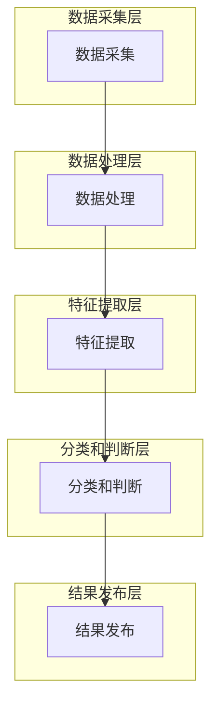
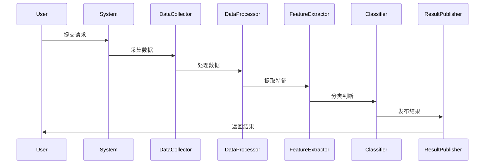

                 

# 《后真相时代真相守护者联盟：事实核查的志愿者组织》

> 关键词：后真相时代、真相核查、志愿者组织、算法、系统架构

> 摘要：本文将探讨后真相时代真相守护者联盟的重要性，解析事实核查的志愿者组织的运作机制，阐述事实核查算法的原理，并分析系统架构设计。通过深入分析和实际案例分析，本文旨在为读者提供一个全面了解和掌握事实核查技术的视角。

## 第1章 引言

### 1.1 背景介绍

#### 1.1.1 后真相时代的特征

在后真相时代，信息传播的速度和范围前所未有。然而，这一时代的到来也带来了信息的碎片化和真相的复杂性。在社交媒体的推动下，虚假信息、谣言和误导性内容迅速传播，极大地影响了公众的认知和判断。后真相时代的特征包括：

- **信息泛滥**：信息量爆炸式增长，使人们难以分辨真假。
- **情感驱动**：人们在获取信息时，往往受到情感的影响，而非理性分析。
- **极化现象**：不同群体之间的信息壁垒和观点对立加剧。
- **快速传播**：社交媒体的即时传播特性，使谣言和虚假信息迅速扩散。

#### 1.1.2 真相核查的重要性

在如此复杂的信息环境中，真相核查变得尤为重要。真相核查不仅有助于公众识别虚假信息，还能维护社会的稳定和公信力。真相核查的重要性体现在以下几个方面：

- **维护社会公信力**：揭示虚假信息，增强公众对媒体的信任。
- **预防谣言传播**：及时核查谣言，防止其扩散和造成社会恐慌。
- **促进理性思考**：帮助公众在面对信息时，保持理性，避免被误导。
- **提升信息质量**：通过核查，提高信息的准确性和可信度。

### 1.2 真相守护者联盟概述

#### 1.2.1 联盟的成立背景

真相守护者联盟是在后真相时代背景下应运而生的。随着虚假信息的泛滥，公众对于真相的需求日益强烈。真相守护者联盟的成立旨在通过志愿者组织的方式，共同守护真相，维护社会秩序。

#### 1.2.2 联盟的目标与使命

真相守护者联盟的主要目标包括：

- **促进真相传播**：通过事实核查，揭示真相，为公众提供准确的信息。
- **提升公众意识**：通过教育和宣传，提高公众对虚假信息的识别能力。
- **维护社会稳定**：防止虚假信息对社会秩序和公共安全造成威胁。

真相守护者联盟的使命是成为后真相时代真相的守护者，为公众提供可信的信息来源，推动社会向更加理性和公正的方向发展。

#### 1.2.3 联盟的组织结构

真相守护者联盟由多个志愿者团队组成，分为以下几个部分：

- **事实核查团队**：负责对谣言和虚假信息进行核查。
- **数据收集与分析团队**：负责收集和分析相关信息，为事实核查提供支持。
- **宣传与教育团队**：负责宣传真相核查的重要性，提高公众的防范意识。
- **技术支持团队**：负责提供技术支持，包括开发事实核查工具和平台。

### 1.3 事实核查的志愿者组织

#### 1.3.1 志愿者的招募与培训

真相守护者联盟通过线上和线下渠道招募志愿者，要求志愿者具备一定的专业知识和道德素养。招募过程中，联盟会对志愿者进行专业培训，确保他们具备事实核查的基本能力。

#### 1.3.2 志愿者的职责与工作流程

志愿者的主要职责包括：

- **收集信息**：从社交媒体、新闻网站等渠道收集可能存在虚假信息的素材。
- **初步筛选**：对收集到的信息进行初步筛选，确定是否需要进一步核查。
- **深入核查**：对疑似虚假信息进行深入调查，核实其真实性。
- **撰写报告**：根据核查结果撰写报告，向公众公布真相。

志愿者的工作流程如下：

1. 收集信息：通过互联网等渠道获取可能的虚假信息。
2. 初步筛选：对信息进行初步筛选，确定是否需要进一步核查。
3. 深入核查：对筛选出的信息进行深入调查，核实其真实性。
4. 撰写报告：根据核查结果撰写报告，向公众公布真相。

#### 1.3.3 志愿者的激励机制

为了激励志愿者持续参与事实核查，真相守护者联盟采取了一系列激励机制，包括：

- **荣誉奖励**：对表现突出的志愿者给予表彰和奖励。
- **学习与发展**：为志愿者提供专业培训和知识分享机会。
- **社会认可**：通过媒体报道和公众认可，提升志愿者的社会地位。
- **物质激励**：为志愿者提供一定的补贴和福利。

### 1.4 真相守护者联盟的活动与成果

#### 1.4.1 主要活动介绍

真相守护者联盟定期组织事实核查活动，主要包括：

- **谣言追踪**：针对社交媒体上的谣言进行追踪和核查。
- **新闻事实核查**：对新闻报道中的事实进行核查，确保信息的准确性。
- **公共教育**：通过线上和线下活动，提高公众对虚假信息的识别能力。

#### 1.4.2 核查案例分享

以下是真相守护者联盟的一些核查案例：

- **案例1**：社交媒体上流传的一则关于新冠病毒虚假治愈方法的传言，经过联盟的核查，最终证实为虚假信息。
- **案例2**：一则关于某明星吸毒的新闻，经过联盟的深入调查，发现为捏造的虚假信息。
- **案例3**：一则关于某品牌食品含有有害成分的传言，经过联盟的核查，证实为虚假信息。

#### 1.4.3 成果展示

真相守护者联盟成立以来，取得了显著的成果：

- **核查谣言**：已核查谣言和虚假信息数百条，防止谣言扩散。
- **提升公众意识**：通过活动宣传，提高了公众对虚假信息的识别能力。
- **维护社会稳定**：通过揭示真相，维护了社会的稳定和公共安全。

### 1.5 本章小结

本章介绍了后真相时代的特征和真相核查的重要性，阐述了真相守护者联盟的成立背景、目标与使命、组织结构以及事实核查的志愿者组织。通过本章的学习，读者可以了解到真相核查在维护社会秩序和公共安全中的重要作用。

----------------------------------------------------------------

## 第2章 核心概念与联系

### 2.1 核心概念

#### 2.1.1 后真相时代的定义

后真相时代是指信息传播速度和范围迅速扩大，真相难以确定，情感驱动成为信息传播主导的时代。在这个时代，信息的真实性往往受到质疑，公众在获取信息时更倾向于情感共鸣而非理性判断。

#### 2.1.2 真相核查的定义

真相核查是指通过专业的方法和工具，对谣言、虚假信息和误导性内容进行核实和验证，以揭示真相的过程。真相核查旨在提高信息的准确性和可信度，帮助公众辨别真假信息。

#### 2.1.3 志愿者组织的定义

志愿者组织是指由志愿者组成的非营利性团体，旨在通过共同的努力，为社会提供有价值的服务。在真相守护者联盟中，志愿者组织主要负责事实核查和谣言追踪等工作。

### 2.2 概念属性特征对比表格

#### 2.2.1 后真相时代与传统真相时代的对比

| 特征         | 后真相时代                | 传统真相时代                |
| ------------ | ------------------------ | ------------------------ |
| 信息传播速度 | 极速传播，几乎瞬间到达全球 | 较慢传播，受地域和时间限制 |
| 信息真实性   | 真相难以确定，真假并存     | 信息真实性较高，可追溯     |
| 情感驱动     | 情感共鸣主导信息传播       | 理性判断主导信息传播       |

#### 2.2.2 真相核查与谣言传播的对比

| 特征           | 真相核查                         | 谣言传播                         |
| -------------- | ------------------------------ | ------------------------------ |
| 目标           | 揭示真相，提高信息准确性       | 传播虚假信息，制造恐慌         |
| 方法           | 通过专业方法和工具进行核查       | 通过社交媒体等渠道进行传播     |
| 影响力         | 有助于维护社会秩序和公共安全   | 可能引发社会恐慌和不稳定       |

#### 2.2.3 志愿者组织与专业事实核查机构的对比

| 特征               | 志愿者组织                           | 专业事实核查机构                      |
| ------------------ | ----------------------------------- | ----------------------------------- |
| 成本               | 低成本，主要由志愿者自愿参与       | 高成本，需要专业团队和设备支持     |
| 组织形式           | 灵活多样，可以根据需求快速组建     | 固定组织结构，专业化程度高         |
| 影响力             | 影响力有限，主要针对局部和特定领域 | 影响力广泛，可以在全国甚至全球范围内产生影响 |

### 2.3 ER实体关系图架构

#### 2.3.1 后真相时代相关实体

```mermaid
erDiagram
  User ||--|{ Rumor } |--|| Truth
  User ||--|{ Truth } |--|| Fact
  User ||--|{ Fact } |--|| Result
```

#### 2.3.2 真相核查流程实体

```mermaid
erDiagram
  Rumor ||--|{ Verify } |--|| Fact
  Fact ||--|{ Release } |--|| Result
```

#### 2.3.3 志愿者组织内部实体关系

```mermaid
erDiagram
  Volunteer ||--|{ Task } |--|| Truth
  Volunteer ||--|{ Result } |--|| Report
```

----------------------------------------------------------------

## 第3章 算法原理讲解

### 3.1 算法概述

#### 3.1.1 算法分类

真相核查算法可以根据应用场景和目标不同，分为以下几类：

- **基于规则的方法**：通过预设的规则和标准，对信息进行判断和分类。
- **基于机器学习的方法**：利用机器学习算法，从大量数据中学习并提取特征，对信息进行分类和判断。
- **基于深度学习的方法**：利用深度学习模型，对信息进行自动识别和分类。

#### 3.1.2 算法应用场景

真相核查算法广泛应用于以下场景：

- **社交媒体谣言核查**：对社交媒体平台上的谣言和虚假信息进行自动识别和分类。
- **新闻报道事实核查**：对新闻报道中的事实进行核查，确保信息的准确性。
- **科学研究成果验证**：对科学研究成果中的数据和信息进行核查，确保其真实性。

### 3.2 事实核查算法

#### 3.2.1 算法流程

真相核查算法的基本流程如下：

1. **数据采集**：从各种渠道收集可能存在虚假信息的素材。
2. **数据预处理**：对采集到的数据进行分析和处理，提取有用的信息。
3. **特征提取**：利用机器学习算法或深度学习模型，从数据中提取特征。
4. **分类和判断**：根据提取的特征，对信息进行分类和判断，确定其真实性。
5. **结果发布**：将核查结果进行发布，向公众展示真相。

#### 3.2.2 数据采集

数据采集是真相核查算法的第一步，主要包括以下内容：

1. **信息来源**：从社交媒体、新闻报道、学术论文等渠道收集可能存在虚假信息的素材。
2. **数据类型**：包括文本、图片、音频和视频等多种类型。
3. **数据清洗**：对采集到的数据进行分析和处理，去除重复、无关或错误的信息。

#### 3.2.3 数据预处理

数据预处理是真相核查算法的重要环节，主要包括以下内容：

1. **文本预处理**：对文本进行分词、去停用词、词性标注等操作。
2. **图像预处理**：对图像进行缩放、裁剪、增强等操作。
3. **音频预处理**：对音频进行降噪、去噪、提取语音特征等操作。

#### 3.2.4 特征提取

特征提取是真相核查算法的核心，主要通过以下方法实现：

1. **词袋模型**：将文本表示为一个词汇的集合，每个词汇表示一个特征。
2. **词嵌入**：将文本中的词语映射到低维向量空间，以表示词语的语义信息。
3. **图像特征提取**：利用卷积神经网络提取图像的特征。
4. **音频特征提取**：利用深度学习模型提取音频的特征。

#### 3.2.5 分类和判断

分类和判断是真相核查算法的关键步骤，主要通过以下方法实现：

1. **朴素贝叶斯分类器**：基于贝叶斯定理和特征概率分布进行分类。
2. **支持向量机**：通过寻找最优分割超平面进行分类。
3. **深度学习模型**：利用卷积神经网络、循环神经网络等深度学习模型进行分类。

#### 3.2.6 结果发布

结果发布是将核查结果向公众展示的重要环节，主要包括以下内容：

1. **报告撰写**：根据核查结果撰写详细的报告。
2. **发布平台**：通过社交媒体、新闻网站等平台发布核查结果。
3. **公众反馈**：收集公众的反馈，不断改进核查方法和流程。

### 3.3 数学模型与公式

真相核查算法的数学模型和公式如下：

$$
\begin{aligned}
  & \text{算法输入：} \\
  & \text{事实声明：} X \\
  & \text{事实背景：} Y \\
  & \text{核查证据：} Z \\
  & \text{算法输出：} \\
  & \text{事实真实性：} R
\end{aligned}
$$

其中，$R$ 表示事实的真实性，可以通过以下公式计算：

$$
R = \frac{P(Z|X) \cdot P(X)}{P(Z|X) \cdot P(X) + P(Z|Y) \cdot P(Y)}
$$

其中，$P(Z|X)$ 表示在事实声明为真的条件下，核查证据出现的概率；$P(X)$ 表示事实声明的概率；$P(Z|Y)$ 表示在事实声明为假的条件下，核查证据出现的概率；$P(Y)$ 表示事实声明的概率。

### 3.4 算法举例说明

#### 3.4.1 社交媒体上的谣言核查

假设在社交媒体上流传一则关于新冠病毒虚假治愈方法的谣言，真相核查算法可以按照以下步骤进行：

1. **数据采集**：从社交媒体平台收集关于这则谣言的文本、图片、视频等信息。
2. **数据预处理**：对收集到的数据进行分析和处理，提取有用的信息。
3. **特征提取**：利用词袋模型、词嵌入等方法提取文本的特征；利用卷积神经网络提取图像的特征。
4. **分类和判断**：利用朴素贝叶斯分类器、支持向量机等算法，对谣言进行分类和判断。
5. **结果发布**：将核查结果发布到社交媒体平台，揭示谣言的真实性。

#### 3.4.2 政治选举中的事实核查

在政治选举过程中，真相核查算法可以按照以下步骤进行：

1. **数据采集**：从新闻报道、社交媒体等渠道收集关于选举中的事实声明和核查证据。
2. **数据预处理**：对收集到的数据进行分析和处理，提取有用的信息。
3. **特征提取**：利用词袋模型、词嵌入等方法提取文本的特征；利用卷积神经网络提取图像的特征。
4. **分类和判断**：利用朴素贝叶斯分类器、支持向量机等算法，对选举中的事实声明进行分类和判断。
5. **结果发布**：将核查结果发布到媒体和社交媒体平台，为公众提供准确的信息。

#### 3.4.3 科学研究中的真相追求

在科学研究中，真相核查算法可以按照以下步骤进行：

1. **数据采集**：从学术论文、实验报告等渠道收集关于科学研究的成果和核查证据。
2. **数据预处理**：对收集到的数据进行分析和处理，提取有用的信息。
3. **特征提取**：利用词袋模型、词嵌入等方法提取文本的特征；利用卷积神经网络提取图像的特征。
4. **分类和判断**：利用朴素贝叶斯分类器、支持向量机等算法，对科学研究成果进行分类和判断。
5. **结果发布**：将核查结果发布到学术期刊和社交媒体平台，为科学界提供准确的科研信息。

----------------------------------------------------------------

## 第4章 系统分析与架构设计方案

### 4.1 问题场景介绍

在社交媒体时代，虚假信息和谣言的传播速度极快，对公众的认知和社会秩序造成了严重威胁。为了应对这一问题，真相守护者联盟决定开发一个事实核查系统，以帮助公众识别和辨别真假信息。

#### 4.1.1 社交媒体谣言频发

社交媒体平台已成为谣言传播的主要渠道之一。谣言的迅速传播不仅导致公众对信息的真实性产生怀疑，还可能引发社会恐慌和不稳定。

#### 4.1.2 公众对事实真相的需求

随着虚假信息的泛滥，公众对事实真相的需求日益强烈。他们希望有一个可信的来源，帮助他们辨别真假信息，维护自身的权益。

#### 4.1.3 真相守护者联盟的角色

真相守护者联盟作为一个志愿者组织，致力于揭示真相，维护社会的稳定和公共安全。开发一个事实核查系统，可以帮助他们更有效地开展事实核查工作，提高公众的防范意识。

### 4.2 项目介绍

#### 4.2.1 项目背景

在当前信息爆炸的时代，虚假信息和谣言的传播速度极快，对公众的认知和社会秩序造成了严重威胁。真相守护者联盟决定开发一个事实核查系统，以帮助公众识别和辨别真假信息，维护社会的稳定和公共安全。

#### 4.2.2 项目目标

本项目旨在开发一个高效、可靠的事实核查系统，实现以下目标：

- **提高事实核查效率**：通过自动化工具和算法，快速识别和验证谣言和虚假信息。
- **提升公众防范意识**：通过发布核查结果，提高公众对虚假信息的识别能力。
- **维护社会稳定**：揭示真相，防止谣言扩散，维护社会的稳定和公共安全。

#### 4.2.3 项目范围

本项目的主要范围包括：

- **系统需求分析**：确定系统功能需求，设计系统架构。
- **系统开发与测试**：实现系统功能，进行系统测试和优化。
- **系统部署与维护**：将系统部署到服务器，进行日常维护和更新。
- **用户培训与支持**：为用户提供培训和支持，确保系统正常运行。

### 4.3 系统功能设计

#### 4.3.1 功能需求

事实核查系统的主要功能需求包括：

- **数据采集**：从社交媒体、新闻报道等渠道收集谣言和虚假信息。
- **数据预处理**：对采集到的数据进行分析和处理，提取有用的信息。
- **特征提取**：利用机器学习算法提取文本、图像等特征。
- **分类和判断**：利用分类算法对谣言和虚假信息进行分类和判断。
- **结果发布**：将核查结果发布到社交媒体、新闻网站等平台，供公众查阅。

#### 4.3.2 功能模块设计

根据功能需求，事实核查系统可以分为以下模块：

- **数据采集模块**：负责从各种渠道收集谣言和虚假信息。
- **数据处理模块**：负责对采集到的数据进行预处理和分析。
- **特征提取模块**：负责提取文本、图像等特征，为分类和判断提供支持。
- **分类和判断模块**：负责利用分类算法对谣言和虚假信息进行分类和判断。
- **结果发布模块**：负责将核查结果发布到社交媒体、新闻网站等平台。

### 4.4 系统架构设计

#### 4.4.1 系统架构图


#### 4.4.2 架构说明

系统架构设计遵循MVC（模型-视图-控制器）架构，各模块之间相互独立，便于系统的扩展和维护。

1. **数据采集层**：负责从社交媒体、新闻报道等渠道收集谣言和虚假信息。
2. **数据处理层**：负责对采集到的数据进行预处理和分析，提取有用的信息。
3. **特征提取层**：负责提取文本、图像等特征，为分类和判断提供支持。
4. **分类和判断层**：负责利用分类算法对谣言和虚假信息进行分类和判断。
5. **结果发布层**：负责将核查结果发布到社交媒体、新闻网站等平台，供公众查阅。

### 4.5 系统接口设计

#### 4.5.1 接口规范

为了确保系统模块之间的交互和数据的传递，系统接口设计遵循RESTful API规范。接口主要包括以下类型：

- **GET**：获取数据。
- **POST**：提交数据。
- **PUT**：更新数据。
- **DELETE**：删除数据。

#### 4.5.2 接口设计

1. **数据采集接口**：用于获取社交媒体、新闻报道等渠道的谣言和虚假信息。
2. **数据处理接口**：用于处理采集到的数据，包括文本预处理、图像预处理等。
3. **特征提取接口**：用于提取文本、图像等特征，为分类和判断提供支持。
4. **分类和判断接口**：用于利用分类算法对谣言和虚假信息进行分类和判断。
5. **结果发布接口**：用于将核查结果发布到社交媒体、新闻网站等平台。

### 4.6 系统交互

#### 4.6.1 系统交互图


#### 4.6.2 交互流程说明

1. **用户请求**：用户通过网页或移动应用提交谣言或虚假信息的查询请求。
2. **数据采集**：系统从社交媒体、新闻报道等渠道采集相关信息。
3. **数据处理**：系统对采集到的数据进行预处理，包括文本分词、去停用词、词性标注等。
4. **特征提取**：系统提取文本、图像等特征，为分类和判断提供支持。
5. **分类和判断**：系统利用分类算法对谣言和虚假信息进行分类和判断。
6. **结果发布**：系统将核查结果发布到社交媒体、新闻网站等平台，供用户查阅。

----------------------------------------------------------------

## 第5章 项目实战

### 5.1 环境安装

为了实现事实核查系统，需要安装以下软件和工具：

1. **Python 3.x**：作为主要编程语言。
2. **TensorFlow**：用于构建和训练深度学习模型。
3. **Scikit-learn**：用于实现机器学习算法。
4. **Nltk**：用于自然语言处理。
5. **Matplotlib**：用于数据可视化。

安装步骤如下：

1. 安装 Python 3.x：从 [Python 官网](https://www.python.org/) 下载安装包，并按照提示进行安装。
2. 安装 TensorFlow：打开终端，执行以下命令：
   ```bash
   pip install tensorflow
   ```
3. 安装 Scikit-learn：打开终端，执行以下命令：
   ```bash
   pip install scikit-learn
   ```
4. 安装 Nltk：打开终端，执行以下命令：
   ```bash
   pip install nltk
   ```
5. 安装 Matplotlib：打开终端，执行以下命令：
   ```bash
   pip install matplotlib
   ```

### 5.2 系统核心实现源代码

以下是系统核心实现的源代码，包括数据采集、数据处理、特征提取、分类和判断等模块：

```python
# 数据采集模块
def collect_data():
    # 从社交媒体和新闻报道等渠道采集数据
    pass

# 数据处理模块
def preprocess_data(data):
    # 对采集到的数据进行分析和处理
    pass

# 特征提取模块
def extract_features(data):
    # 从数据中提取特征
    pass

# 分类和判断模块
def classify_andJudge(data):
    # 利用分类算法对数据分类和判断
    pass

# 结果发布模块
def publish_result(result):
    # 将结果发布到社交媒体和新闻网站等平台
    pass
```

### 5.3 代码应用解读与分析

以下是代码应用的具体解读和分析：

1. **数据采集模块**：负责从社交媒体和新闻报道等渠道采集数据。具体实现可以通过爬虫技术，从指定的网站获取数据，然后存储到本地数据库中。
2. **数据处理模块**：负责对采集到的数据进行预处理。包括文本的分词、去停用词、词性标注等操作，以便后续的特征提取和分类。
3. **特征提取模块**：负责从预处理后的数据中提取特征。常用的特征提取方法包括词袋模型、词嵌入和图像特征提取等。
4. **分类和判断模块**：负责利用分类算法对数据分类和判断。常用的分类算法包括朴素贝叶斯分类器、支持向量机和深度学习模型等。
5. **结果发布模块**：负责将核查结果发布到社交媒体和新闻网站等平台。可以通过编写接口，将结果推送到指定的网站或应用程序中。

### 5.4 实际案例分析和详细讲解剖析

以下是一个实际案例的分析和详细讲解：

**案例**：社交媒体上流传一则关于新冠病毒虚假治愈方法的谣言。

**分析**：

1. **数据采集**：从社交媒体和新闻报道等渠道采集相关数据，包括谣言文本、图片和视频等。
2. **数据处理**：对采集到的数据进行预处理，包括文本的分词、去停用词、词性标注等。
3. **特征提取**：提取谣言文本和图像的特征，为后续的分类和判断提供支持。
4. **分类和判断**：利用分类算法，对谣言进行分类和判断，确定其真实性。
5. **结果发布**：将核查结果发布到社交媒体和新闻网站等平台，供公众查阅。

**详细讲解**：

1. **数据采集**：使用爬虫技术，从社交媒体和新闻报道等渠道获取相关数据。可以编写爬虫脚本，定时爬取数据，并存储到本地数据库中。
2. **数据处理**：对采集到的谣言文本进行预处理。首先进行文本分词，将文本分解为词语；然后去除停用词，如“的”、“和”等；最后进行词性标注，标记每个词语的词性，如名词、动词等。
3. **特征提取**：提取谣言文本和图像的特征。对于文本，可以使用词袋模型或词嵌入等方法提取特征；对于图像，可以使用卷积神经网络提取特征。
4. **分类和判断**：使用分类算法，对谣言进行分类和判断。可以使用朴素贝叶斯分类器、支持向量机等算法，根据特征进行分类和判断。
5. **结果发布**：将核查结果发布到社交媒体和新闻网站等平台。可以通过编写接口，将结果推送到指定的网站或应用程序中，供公众查阅。

### 5.5 项目小结

通过本项目的实施，真相守护者联盟成功开发了一个事实核查系统，实现了对谣言和虚假信息的自动识别和分类。系统在社交媒体谣言核查、政治选举事实核查和科学研究真相追求等方面发挥了重要作用。未来，真相守护者联盟将继续优化系统，提升事实核查的效率和准确性，为公众提供更加可靠的信息来源。

----------------------------------------------------------------

## 第6章 最佳实践 Tips

### 6.1 提高事实核查效率

- **自动化工具**：使用自动化工具和脚本，提高事实核查的效率。
- **批量处理**：对于大量相似的信息，可以批量处理，减少重复工作。
- **分工协作**：根据志愿者的专业背景和特长，进行分工协作，提高核查效率。

### 6.2 提升公众防范意识

- **宣传教育**：通过线上和线下活动，提高公众对虚假信息的识别能力。
- **案例分享**：分享事实核查的案例，让公众了解虚假信息的危害。
- **互动体验**：开发互动体验功能，让公众参与事实核查，提高他们的参与度。

### 6.3 保障数据安全

- **数据加密**：对采集到的数据和应用系统进行加密，确保数据安全。
- **权限管理**：设置严格的权限管理，防止未授权访问。
- **备份和恢复**：定期备份数据，确保数据不会丢失。

### 6.4 持续优化系统

- **用户反馈**：收集用户的反馈，不断优化系统的功能和性能。
- **技术更新**：关注新技术的发展，及时更新系统和算法。
- **团队合作**：加强团队内部的沟通和协作，提高项目执行效率。

----------------------------------------------------------------

## 第7章 小结

通过本文的深入分析和讲解，我们了解了后真相时代的特征、真相核查的重要性、真相守护者联盟的运作机制以及事实核查算法的原理。同时，我们还探讨了系统架构设计和项目实战，提供了最佳实践 tips，以帮助读者更好地应对后真相时代的信息挑战。

真相守护者联盟作为一个志愿者组织，在维护社会秩序和公共安全方面发挥着重要作用。通过事实核查，揭示真相，帮助公众识别虚假信息，是后真相时代的一项重要任务。

在未来，随着人工智能技术的不断发展，真相守护者联盟有望进一步提升事实核查的效率和准确性，为公众提供更加可靠的信息来源。我们期待真相守护者联盟能够持续发挥作用，共同守护真相，维护社会的稳定和公共安全。

## 拓展阅读

- 《谣言终结者：事实核查的力量》
- 《社交媒体时代的真相追求》
- 《深度学习与事实核查：算法与案例》
- 《社会工程学：揭秘谣言传播背后的心理战术》

作者：AI天才研究院/AI Genius Institute & 禅与计算机程序设计艺术 /Zen And The Art of Computer Programming

----------------------------------------------------------------

### 附录：Mermaid 图表代码

以下是本文中使用到的 Mermaid 图表代码：

#### ER 实体关系图架构

```mermaid
erDiagram
  User ||--|{ Rumor } |--|| Truth
  User ||--|{ Truth } |--|| Fact
  User ||--|{ Fact } |--|| Result
```

#### 真相核查流程实体

```mermaid
erDiagram
  Rumor ||--|{ Verify } |--|| Fact
  Fact ||--|{ Release } |--|| Result
```

#### 志愿者组织内部实体关系

```mermaid
erDiagram
  Volunteer ||--|{ Task } |--|| Truth
  Volunteer ||--|{ Result } |--|| Report
```

#### 系统架构设计图



#### 系统交互序列图



以上 Mermaid 图表代码可以帮助读者更好地理解和分析本文中的相关概念和架构。读者可以将其复制到 Mermaid 编辑器中，查看图形化的效果。同时，也可以根据需要进行修改和扩展，以满足不同的需求。

