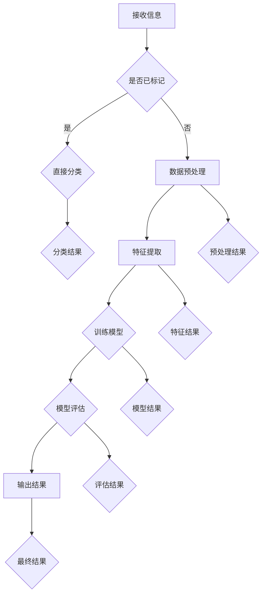
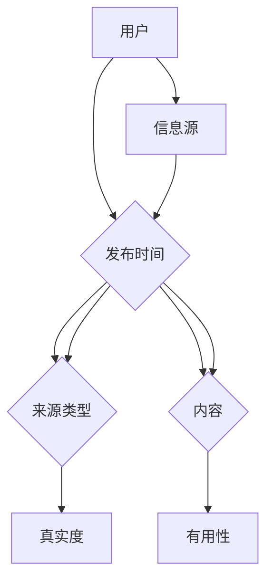
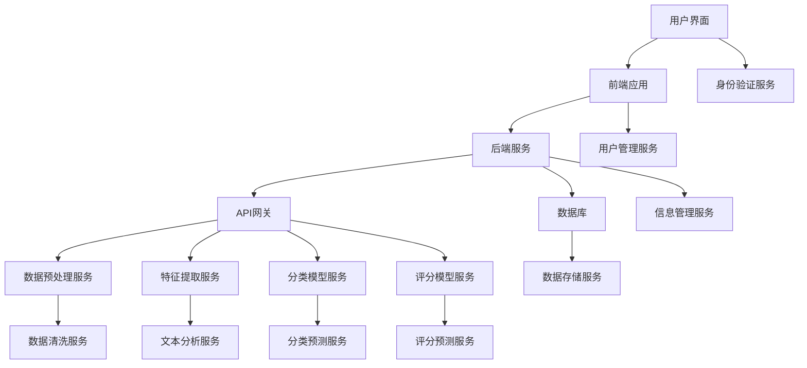
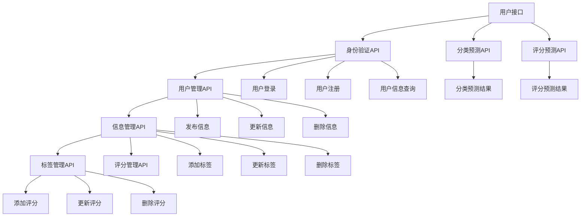
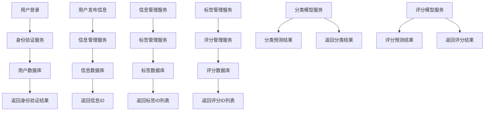

                 

### 文章标题：后真相环境中的信息判断：提升公民的媒体素养

#### 关键词：后真相环境，媒体素养，信息判断，算法原理，数学模型，系统架构设计

#### 摘要：
在信息爆炸的后真相时代，公众面临着前所未有的信息过载和假信息泛滥的挑战。提升公民的媒体素养成为应对这一挑战的关键。本文通过深入探讨后真相环境、媒体素养、信息判断的算法原理及其数学模型，构建了一个系统分析与架构设计方案，并通过实际项目实战，提供了一整套提升公民媒体素养的方法与工具。本文旨在帮助读者理解后真相环境下的信息判断机制，掌握提升媒体素养的实用技能。

### 目录大纲设计思路

为了设计出一本《后真相环境中的信息判断：提升公民的媒体素养》的详细目录大纲，我们可以遵循以下步骤：

1. **背景介绍**：首先，我们需要介绍后真相环境的背景，解释这个概念及其对我们日常信息接收和处理的影响。

2. **核心概念与联系**：接下来，我们需要明确本书的核心概念，如媒体素养、信息判断、信息筛选等，并通过表格和图表展示这些概念之间的关系。

3. **算法原理讲解**：这部分将详细阐述如何在后真相环境中进行信息判断，可能包括使用机器学习和数据挖掘等技术的算法原理，并用流程图和Python代码进行解释。

4. **数学模型和数学公式**：将涉及的信息判断过程以数学模型和公式表达出来，并用LaTeX格式确保准确性和专业性。

5. **系统分析与架构设计方案**：设计一个概念性的系统架构，展示如何在实际中应用这些算法和模型。

6. **项目实战**：通过一个实际案例来展示如何将理论应用到实践中，包括环境搭建、系统实现、案例分析等。

7. **最佳实践 tips、小结、注意事项、拓展阅读**：对全书内容进行总结，给出实用建议和进一步阅读的资源。

### 目录大纲

根据上述设计思路，以下是《后真相环境中的信息判断：提升公民的媒体素养》的目录大纲：

----------------------------------------------------------------

# 第一部分: 了解后真相环境

## 第1章: 后真相时代的到来

### 1.1 什么是后真相环境
### 1.2 后真相环境对信息传播的影响
### 1.3 后真相环境下的挑战与机遇

## 第2章: 媒体素养的核心概念

### 2.1 媒体素养的定义与重要性
### 2.2 媒体素养的关键要素
### 2.3 媒体素养与信息判断的关系

## 第3章: 信息判断的算法原理

### 3.1 机器学习与信息判断
### 3.2 数据挖掘在信息筛选中的应用
### 3.3 算法流程图解析

## 第4章: 数学模型与公式

### 4.1 信息判断的数学模型
### 4.2 关键数学公式的解释与应用
### 4.3 LaTeX格式数学公式的书写规范

## 第5章: 系统分析与架构设计

### 5.1 系统功能设计
### 5.2 系统架构设计
### 5.3 系统接口设计
### 5.4 系统交互序列图

## 第6章: 项目实战

### 6.1 环境搭建
### 6.2 系统核心实现
### 6.3 案例分析
### 6.4 项目小结

## 第7章: 最佳实践与拓展

### 7.1 提升媒体素养的最佳实践
### 7.2 注意事项与挑战
### 7.3 拓展阅读推荐

----------------------------------------------------------------

### 目录大纲结构分析

- **第一部分：了解后真相环境**（2章）：为读者提供背景知识和基本概念，使读者能够理解后真相环境的含义和影响。

- **第二部分：核心概念与联系**（2章）：深入探讨媒体素养和信息判断的概念，并通过算法原理和数学模型来解释这些概念之间的联系。

- **第三部分：系统分析与架构设计**（1章）：构建一个概念性的系统框架，展示如何在实际中应用这些算法和模型。

- **第四部分：项目实战**（1章）：通过一个实际案例展示如何将理论应用到实践中。

- **第五部分：最佳实践与拓展**（1章）：提供实用建议、注意事项、以及拓展阅读资源，帮助读者进一步学习和应用。

通过这样的目录结构，本书将系统地引导读者了解后真相环境中的信息判断问题，提高公民的媒体素养。同时，详细的章节设计和内容安排确保了全书内容的专业性和实用性。

### 第一部分：了解后真相环境

#### 第1章：后真相时代的到来

##### 1.1 什么是后真相环境

在过去的几十年中，信息技术的迅猛发展极大地改变了人类社会的信息传播方式。从传统的报纸、电视到互联网、社交媒体，信息传播的速度和范围都发生了翻天覆地的变化。然而，随着信息传播手段的多样化，信息真实性、准确性和可信度的问题也日益突出，我们进入了所谓“后真相时代”（Post-Truth Era）。

“后真相”一词最早由英国政治学家罗伯特·菲斯科（Robert Firth）提出，用以描述一个新现象：在信息传播过程中，情感和主观观点的影响力逐渐超过了客观事实。这意味着，某些信息或观点可能会因为其情感吸引力或政治动机而获得广泛的传播，即使这些信息并不基于真实的事实。

后真相环境的特点主要包括：

1. **情感驱动**：信息传播不再仅仅依赖于逻辑和理性，而是更多地依赖于情感共鸣和情绪动员。
2. **事实被质疑**：在社交媒体和网络上，事实的验证变得更加困难，虚假信息、误导性信息和错误信息得以迅速传播。
3. **信息碎片化**：信息的传播不再通过传统媒体，而是通过多样化的渠道，导致公众接收到的信息更加碎片化。
4. **算法操控**：社交媒体平台和搜索引擎通过算法推荐信息，这些算法可能会根据用户的偏好和兴趣来定制信息流，从而加剧信息过滤和偏见。

##### 1.2 后真相环境对信息传播的影响

后真相环境对信息传播的影响是深远而复杂的。首先，它对媒体行业产生了巨大的冲击。传统媒体在事实核查和新闻报道方面的权威性受到挑战，而社交媒体平台则成为信息传播的主要渠道。这导致了新闻业的商业模式受到冲击，许多媒体机构面临着财务困境。

其次，后真相环境对公众的认知和判断力提出了挑战。在信息过载和假信息泛滥的时代，公众需要更高的媒体素养来辨别信息的真实性和可信度。然而，许多人在面对海量信息时，往往缺乏足够的时间和技能进行深入分析，容易受到误导和操纵。

此外，后真相环境还对政治和社会产生了重要影响。虚假信息和误导性信息的传播可能影响选举结果、公共政策和公众舆论，甚至导致社会分裂和动荡。

##### 1.3 后真相环境下的挑战与机遇

在后真相环境中，我们面临着一系列挑战：

1. **事实核查的困难**：随着信息传播渠道的增多，事实核查变得更加复杂和耗时。
2. **信息过滤与偏见**：算法推荐可能会加剧用户的偏好和偏见，导致信息泡沫的形成。
3. **社会信任危机**：虚假信息的传播可能导致公众对传统媒体和权威机构的信任度下降。

然而，后真相环境也带来了新的机遇：

1. **媒体素养的提升**：随着公众对信息真实性的关注度增加，提升媒体素养的需求也随之上升。
2. **技术创新**：事实核查技术和算法不断进步，有望提高信息筛选的准确性和效率。
3. **社会责任的加强**：媒体机构、技术公司和政府需要共同承担起维护信息真实性和社会责任。

在接下来的章节中，我们将深入探讨媒体素养的核心概念、信息判断的算法原理和数学模型，并通过实际案例来展示如何在后真相环境中提升公民的媒体素养。

### 第2章：媒体素养的核心概念

##### 2.1 媒体素养的定义与重要性

媒体素养（Media Literacy）是指个体对媒体信息的理解、分析和批判能力。它不仅包括对媒体内容的理解和解读，还涉及到对媒体传播机制、信息来源、制作过程和潜在动机的深入认识。媒体素养的核心在于培养公众对信息的批判性思维，使其能够独立、理性地分析和判断信息，从而避免被误导和操纵。

媒体素养的重要性体现在以下几个方面：

1. **辨别真伪**：在信息爆炸的时代，公众需要具备辨别真伪的能力，避免被虚假信息误导。
2. **理性思考**：媒体素养有助于培养公众的理性思考能力，使其在面对复杂多变的信息时，能够保持冷静和独立。
3. **社会责任**：媒体素养促使公众认识到自己在信息传播中的责任，鼓励其积极参与社会事务和公共讨论。
4. **个人成长**：具备媒体素养的人能够更好地利用媒体资源进行学习和交流，提高自身素质和竞争力。

##### 2.2 媒体素养的关键要素

媒体素养包含多个关键要素，这些要素相互关联，共同构成一个完整的体系。以下是媒体素养的主要关键要素：

1. **信息解读**：媒体素养的第一步是能够正确解读信息。这包括理解信息的意义、意图和潜在影响。
2. **信息来源**：评估信息来源的可靠性是媒体素养的核心。公众需要了解不同信息源的背景和可信度，避免被不可靠的信息误导。
3. **信息筛选**：在信息过载的环境中，公众需要学会筛选重要信息，将其与日常生活和工作相关联。
4. **批判性思维**：批判性思维是指对信息进行深入分析和评估，判断其真实性和有效性。这需要公众具备逻辑推理、比较和对比的能力。
5. **媒体制作过程**：了解媒体制作过程有助于公众更好地理解信息的生成和传播机制，从而提高对信息真实性和可信度的判断能力。
6. **媒介责任**：公众需要认识到自己在媒体传播中的责任，积极参与公共事务，促进信息的真实和公正传播。

##### 2.3 媒体素养与信息判断的关系

媒体素养和信息判断密不可分。信息判断是指个体在接收信息后，对其进行评估、分析和判断的过程。具备良好媒体素养的人能够更加准确地进行信息判断，具体表现在以下几个方面：

1. **提高信息识别能力**：媒体素养有助于公众识别虚假信息、误导性信息和错误信息，避免被这些信息误导。
2. **增强批判性思维能力**：媒体素养培养了公众的批判性思维能力，使其在面对复杂信息时能够保持理性和独立，避免被信息操纵。
3. **促进理性讨论**：媒体素养有助于公众在公共讨论中更加理性地表达观点，促进有效沟通和交流。
4. **增强社会责任感**：媒体素养使公众认识到自己在信息传播中的责任，鼓励其积极参与社会事务，推动信息真实和公正的传播。

在接下来的章节中，我们将深入探讨信息判断的算法原理，并通过实际案例展示如何提升媒体素养，从而在复杂的信息环境中做出准确的信息判断。

### 第3章：信息判断的算法原理

##### 3.1 机器学习与信息判断

在信息判断领域，机器学习技术发挥着重要作用。机器学习是一种通过数据训练模型，使其能够自动学习和做出决策的技术。在信息判断中，机器学习可以帮助我们自动识别和分类信息，从而提高判断的准确性和效率。

机器学习在信息判断中的应用主要包括以下几个方面：

1. **文本分类**：文本分类是指将文本数据归类到预定义的类别中。例如，可以将新闻文章分类为政治、科技、体育等类别。通过训练分类模型，我们可以自动判断一篇新文章的主题类别。

2. **情感分析**：情感分析是指通过分析文本中的情感倾向，判断文本的情感是积极、消极还是中立。这在社交媒体监测、客户服务分析等方面具有重要意义。

3. **虚假新闻检测**：虚假新闻检测是近年来机器学习的重要应用领域。通过训练模型识别和分类虚假新闻，我们可以有效减少虚假信息的传播。

为了更好地理解机器学习在信息判断中的应用，我们来看一个简单的例子：

假设我们要训练一个模型来分类新闻文章。首先，我们需要收集大量已标记的新闻文章数据集，其中每篇文章都被打上相应的标签，如“政治”、“科技”、“体育”等。然后，我们可以使用自然语言处理（NLP）技术，将文本转换为计算机可以处理的形式，例如词向量。接下来，我们可以使用机器学习算法（如朴素贝叶斯、支持向量机等）来训练模型。最后，使用训练好的模型对新的文章进行分类，从而判断其主题类别。

##### 3.2 数据挖掘在信息筛选中的应用

数据挖掘（Data Mining）是一种从大量数据中发现有用信息和知识的技术。在信息筛选中，数据挖掘可以帮助我们从海量的信息中提取出有价值的内容，从而提高信息筛选的效率和准确性。

数据挖掘在信息筛选中的应用主要包括以下几个方面：

1. **关联规则挖掘**：关联规则挖掘是指发现数据项之间的关联关系。例如，在电商平台上，我们可以通过关联规则挖掘发现购买A商品的用户往往会购买B商品，从而进行精准营销。

2. **聚类分析**：聚类分析是指将相似的数据项划分为一组，形成聚类。在信息筛选中，聚类分析可以帮助我们将大量信息分成不同的主题类别，从而方便用户进行筛选和阅读。

3. **异常检测**：异常检测是指识别数据中的异常或异常模式。在信息筛选中，异常检测可以帮助我们识别虚假信息或异常行为，从而提高筛选的准确性。

为了更好地理解数据挖掘在信息筛选中的应用，我们来看一个简单的例子：

假设我们要从一篇新闻文章中提取出关键信息。首先，我们可以使用自然语言处理技术对文章进行分词和词性标注，从而得到一个词向量表示。然后，我们可以使用聚类分析方法，将词向量分为不同的主题类别。最后，我们可以根据聚类结果，提取出每个主题类别中的关键信息，从而实现新闻文章的自动摘要和筛选。

##### 3.3 算法流程图解析

为了更好地理解信息判断的算法原理，我们来看一个简化的算法流程图（使用Mermaid语法）：



这个流程图展示了从接收信息到最终输出结果的整个过程：

1. **接收信息**：系统接收新的信息。
2. **判断是否已标记**：如果信息已标记，则直接进行分类。
3. **数据预处理**：如果信息未标记，则进行数据预处理，包括分词、词性标注等。
4. **特征提取**：将预处理后的数据转换为特征向量。
5. **训练模型**：使用已标记的数据集训练分类模型。
6. **模型评估**：评估训练好的模型的准确性和可靠性。
7. **输出结果**：根据模型输出结果，对信息进行分类或筛选。

通过这个流程图，我们可以清晰地看到信息判断的各个步骤和相互关系，从而更好地理解和应用信息判断算法。

在接下来的章节中，我们将进一步探讨信息判断的数学模型和公式，并用LaTeX格式确保其准确性和专业性。

### 第4章：数学模型与公式

##### 4.1 信息判断的数学模型

在信息判断中，数学模型扮演着至关重要的角色。通过数学模型，我们可以将信息判断过程转化为可量化的数学问题，从而使用数学工具和方法进行分析和计算。以下是一些常见的信息判断数学模型：

1. **贝叶斯分类器**：贝叶斯分类器是一种基于贝叶斯定理的分类模型，常用于文本分类和虚假新闻检测。贝叶斯分类器的数学模型可以表示为：
   \[
   P(\text{类别} | \text{特征}) = \frac{P(\text{特征} | \text{类别}) \cdot P(\text{类别})}{P(\text{特征})}
   \]
   其中，\( P(\text{类别} | \text{特征}) \) 表示在给定特征情况下，某类别的概率；\( P(\text{特征} | \text{类别}) \) 表示在给定类别情况下，某特征的概率；\( P(\text{类别}) \) 表示某类别的先验概率；\( P(\text{特征}) \) 表示某特征的总概率。

2. **支持向量机（SVM）**：支持向量机是一种用于分类和回归的分析方法，尤其在文本分类和虚假新闻检测中广泛应用。SVM的数学模型可以表示为：
   \[
   \text{最小化} \quad \frac{1}{2} \sum_{i=1}^{n} (w_i)^2
   \]
   \[
   \text{约束条件} \quad y^{(i)} (\text{w} \cdot \text{x}^{(i)} + b) \geq 1
   \]
   其中，\( w_i \) 表示权重向量；\( x^{(i)} \) 表示特征向量；\( y^{(i)} \) 表示标签（+1或-1）；\( b \) 表示偏置。

3. **神经网络**：神经网络是一种模拟人脑神经元连接结构的计算模型，常用于复杂的信息处理和分类任务。神经网络的数学模型可以表示为：
   \[
   \text{激活函数} \quad a = \sigma(z)
   \]
   \[
   \text{权重更新} \quad w \gets w - \alpha \cdot \nabla_w J
   \]
   其中，\( \sigma \) 表示激活函数（如ReLU、Sigmoid等）；\( z \) 表示输入；\( a \) 表示输出；\( \alpha \) 表示学习率；\( \nabla_w J \) 表示损失函数关于权重\( w \)的梯度。

##### 4.2 关键数学公式的解释与应用

以下是对上述数学模型中的一些关键数学公式的解释与应用：

1. **贝叶斯定理**：
   \[
   P(\text{类别} | \text{特征}) = \frac{P(\text{特征} | \text{类别}) \cdot P(\text{类别})}{P(\text{特征})}
   \]
   贝叶斯定理是一个用于计算后验概率的公式，其中后验概率（\( P(\text{类别} | \text{特征}) \)）表示在给定特征情况下某类别的概率。通过贝叶斯定理，我们可以根据先验概率（\( P(\text{类别}) \)）和条件概率（\( P(\text{特征} | \text{类别}) \)），计算后验概率，从而判断类别。

2. **SVM的损失函数**：
   \[
   \text{最小化} \quad \frac{1}{2} \sum_{i=1}^{n} (w_i)^2
   \]
   这个损失函数用于最小化权重向量的平方和，从而找到最佳分类超平面。在SVM中，我们通过最大化分类间隔来找到最佳超平面，即最大化\( \frac{2}{||w||} \)。

3. **神经网络权重更新**：
   \[
   w \gets w - \alpha \cdot \nabla_w J
   \]
   这个公式表示神经网络的权重更新过程，其中\( \alpha \)为学习率，\( \nabla_w J \)为损失函数关于权重\( w \)的梯度。通过梯度下降法，我们可以迭代更新权重，以最小化损失函数，从而提高模型的分类或回归性能。

##### 4.3 LaTeX格式数学公式的书写规范

在文档中嵌入LaTeX格式数学公式，可以使数学表达式更加规范和易读。以下是LaTeX格式数学公式的书写规范：

1. **独立段落公式**：在独立段落中，使用$$将数学公式括起来，例如：
   \[
   $$1+1=2$$
   \]

2. **行内公式**：在行内插入数学公式，使用$将公式括起来，例如：
   \[
   $1<2$
   \]

3. **行内与段落的结合**：当需要在段落中插入行内公式时，可以先在段落的适当位置使用$插入行内公式，然后在该行的末尾使用$$开始独立段落的公式。例如：
   \[
   这是一个简单的例子：$x^2+y^2=r^2$
   \]
   \[
   $$\int_0^1 x^2 dx$$
   \]

通过遵循这些规范，我们可以确保数学公式的准确性和美观性。

在接下来的章节中，我们将结合实际的系统架构设计，展示如何将信息判断的数学模型应用于实际项目中。

### 第5章：系统分析与架构设计

#### 5.1 系统功能设计

在现代信息社会中，一个高效的系统架构对于处理复杂的信息流和提供准确的信息判断至关重要。本节将详细介绍系统功能设计，包括领域模型和系统架构的详细描述。

##### 领域模型

领域模型（Domain Model）是系统架构设计中的核心，它定义了系统中的核心实体及其之间的关系。以下是一个简单的领域模型示例，用于后真相环境中的信息判断系统：



在这个领域中，核心实体包括用户（User）、信息源（Information Source）、信息（Information）、标签（Tag）、评分（Rating）。实体之间的关系如下：

- **用户**可以发布和评价信息。
- **信息源**是信息发布的来源，可以是新闻网站、社交媒体等。
- **信息**是用户发布或接收的内容，具有发布时间和内容。
- **标签**用于对信息进行分类，如新闻、娱乐、科技等。
- **评分**是对信息的评价，包括真实度（Fidelity）和有用性（Usefulness）。

##### 系统架构设计

系统架构设计（System Architecture Design）是确保系统功能高效、可扩展和安全的关键。以下是一个简单的系统架构设计，用于后真相环境中的信息判断系统：



在这个系统架构中，各个组件的职责如下：

- **用户界面**：提供给用户操作和交互的系统前端，包括浏览、发布、评价等功能。
- **前端应用**：处理用户界面与后端服务之间的数据交互，提供友好的用户交互体验。
- **后端服务**：包括用户管理、信息管理、数据预处理、特征提取、分类模型、评分模型等核心服务。
- **数据库**：存储用户、信息、标签、评分等数据，支持快速查询和更新操作。
- **API网关**：接收来自前端应用的请求，将其转发给相应的后端服务。
- **数据预处理服务**：对原始数据进行清洗、去噪、格式化等预处理操作，为后续特征提取和模型训练提供高质量的输入数据。
- **特征提取服务**：从预处理后的数据中提取关键特征，用于训练分类和评分模型。
- **分类模型服务**：使用机器学习算法对信息进行分类，例如文本分类、虚假新闻检测等。
- **评分模型服务**：对信息进行评分，包括真实度和有用性评估。

通过上述系统架构设计，我们可以确保信息判断系统的高效性和可靠性，从而在复杂的信息环境中提供准确的信息判断服务。

#### 5.2 系统接口设计

系统接口设计（System Interface Design）是确保系统各组件之间能够有效协作和数据交换的关键。以下是一个简单的系统接口设计，用于后真相环境中的信息判断系统：



在这个接口设计中，各个API的职责如下：

- **身份验证API**：负责用户的登录和注册操作，确保用户身份的合法性和安全性。
- **用户管理API**：提供用户信息的查询、更新和删除功能。
- **信息管理API**：负责信息的发布、更新和删除操作。
- **标签管理API**：提供标签的添加、更新和删除功能。
- **评分管理API**：负责评分的添加、更新和删除操作。
- **分类预测API**：提供分类预测功能，返回分类结果。
- **评分预测API**：提供评分预测功能，返回评分结果。

通过上述接口设计，系统可以实现用户与后端服务之间的有效交互，从而实现信息判断和管理的功能。

#### 5.3 系统交互序列图

系统交互序列图（System Interaction Sequence Diagram）用于描述系统各组件之间的交互过程和时序关系。以下是一个简单的系统交互序列图，用于后真相环境中的信息判断系统：



在这个系统交互序列图中，各组件的交互过程如下：

1. **用户登录**：用户通过身份验证API进行登录，身份验证服务查询用户数据库，返回身份验证结果。
2. **用户发布信息**：用户通过信息管理服务发布新信息，信息管理服务将信息存储到信息数据库，并返回信息ID。
3. **添加标签**：信息管理服务根据信息ID，调用标签管理服务，添加标签到标签数据库，并返回标签ID列表。
4. **添加评分**：标签管理服务根据标签ID，调用评分管理服务，添加评分到评分数据库，并返回评分ID列表。
5. **分类预测**：分类模型服务根据信息内容和标签，进行分类预测，并返回分类结果。
6. **评分预测**：评分模型服务根据信息内容和标签，进行评分预测，并返回评分结果。

通过上述系统交互序列图，我们可以清晰地看到系统各组件之间的交互过程和时序关系，从而确保系统的可靠性和一致性。

### 第6章：项目实战

#### 6.1 环境搭建

在开始项目实战之前，我们需要搭建一个适当的环境，以便进行后续的实验和开发。以下是一个简单的环境搭建步骤：

1. **安装Python环境**：首先，确保系统上已经安装了Python环境。如果没有，可以从[Python官方网站](https://www.python.org/)下载并安装Python。

2. **安装相关库**：接下来，我们需要安装一些必要的库，例如NumPy、Pandas、Scikit-learn、TensorFlow等。可以使用以下命令来安装：

   ```bash
   pip install numpy pandas scikit-learn tensorflow
   ```

3. **设置虚拟环境**：为了更好地管理和依赖库，我们可以使用虚拟环境。创建一个名为`infojudge`的虚拟环境，并激活它：

   ```bash
   python -m venv infojudge
   source infojudge/bin/activate  # 对于Windows系统，使用 infojudge\Scripts\activate
   ```

4. **安装数据库**：我们选择PostgreSQL作为数据库，可以在[PostgreSQL官方网站](https://www.postgresql.org/)下载并安装。安装完成后，启动PostgreSQL服务，并创建一个名为`infojudge`的数据库。

5. **配置数据库连接**：在虚拟环境中，安装`psycopg2`库，用于连接PostgreSQL数据库。然后，在代码中配置数据库连接参数，如下所示：

   ```python
   import psycopg2

   conn = psycopg2.connect(
       host="localhost",
       database="infojudge",
       user="your_username",
       password="your_password"
   )
   ```

6. **创建用户和权限**：在数据库中创建一个名为`infojudge_user`的用户，并授予适当的权限，以便后续的数据库操作。

通过上述步骤，我们可以搭建一个基本的实验环境，为项目实战做好准备。

#### 6.2 系统核心实现

在本节中，我们将详细介绍系统核心的实现，包括用户管理、信息管理、标签管理和评分管理等功能。

##### 用户管理

用户管理是系统的核心功能之一，主要负责用户的注册、登录和权限管理。以下是一个简单的用户管理实现：

1. **用户注册**：

   ```python
   def register_user(username, password, email):
       # 将用户信息存储到数据库
       cursor = conn.cursor()
       cursor.execute("INSERT INTO users (username, password, email) VALUES (%s, %s, %s)", (username, password, email))
       conn.commit()
       cursor.close()
   ```

2. **用户登录**：

   ```python
   def login_user(username, password):
       # 从数据库中验证用户身份
       cursor = conn.cursor()
       cursor.execute("SELECT id FROM users WHERE username = %s AND password = %s", (username, password))
       user_id = cursor.fetchone()
       cursor.close()
       return user_id
   ```

3. **用户权限管理**：

   ```python
   def check_permissions(user_id, action):
       # 检查用户是否有权限执行特定操作
       cursor = conn.cursor()
       cursor.execute("SELECT role FROM users WHERE id = %s", (user_id,))
       role = cursor.fetchone()[0]
       cursor.close()
       return role == "admin" or action in ["read", "write", "delete"]
   ```

##### 信息管理

信息管理主要负责信息的发布、更新和删除操作。以下是一个简单的信息管理实现：

1. **发布信息**：

   ```python
   def publish_info(user_id, title, content, tags):
       # 将信息存储到数据库
       cursor = conn.cursor()
       cursor.execute("INSERT INTO info (user_id, title, content, tags) VALUES (%s, %s, %s, %s)", (user_id, title, content, ','.join(tags)))
       conn.commit()
       info_id = cursor.lastrowid
       cursor.close()
       return info_id
   ```

2. **更新信息**：

   ```python
   def update_info(info_id, title, content, tags):
       # 更新信息
       cursor = conn.cursor()
       cursor.execute("UPDATE info SET title = %s, content = %s, tags = %s WHERE id = %s", (title, content, ','.join(tags), info_id))
       conn.commit()
       cursor.close()
   ```

3. **删除信息**：

   ```python
   def delete_info(info_id):
       # 删除信息
       cursor = conn.cursor()
       cursor.execute("DELETE FROM info WHERE id = %s", (info_id,))
       conn.commit()
       cursor.close()
   ```

##### 标签管理

标签管理主要负责标签的添加、更新和删除操作。以下是一个简单的标签管理实现：

1. **添加标签**：

   ```python
   def add_tag(tag_name):
       # 将标签存储到数据库
       cursor = conn.cursor()
       cursor.execute("INSERT INTO tags (name) VALUES (%s)", (tag_name,))
       conn.commit()
       tag_id = cursor.lastrowid
       cursor.close()
       return tag_id
   ```

2. **更新标签**：

   ```python
   def update_tag(tag_id, new_name):
       # 更新标签
       cursor = conn.cursor()
       cursor.execute("UPDATE tags SET name = %s WHERE id = %s", (new_name, tag_id))
       conn.commit()
       cursor.close()
   ```

3. **删除标签**：

   ```python
   def delete_tag(tag_id):
       # 删除标签
       cursor = conn.cursor()
       cursor.execute("DELETE FROM tags WHERE id = %s", (tag_id,))
       conn.commit()
       cursor.close()
   ```

##### 评分管理

评分管理主要负责评分的添加、更新和删除操作。以下是一个简单的评分管理实现：

1. **添加评分**：

   ```python
   def add_rating(info_id, user_id, rating):
       # 将评分存储到数据库
       cursor = conn.cursor()
       cursor.execute("INSERT INTO ratings (info_id, user_id, rating) VALUES (%s, %s, %s)", (info_id, user_id, rating))
       conn.commit()
       rating_id = cursor.lastrowid
       cursor.close()
       return rating_id
   ```

2. **更新评分**：

   ```python
   def update_rating(rating_id, new_rating):
       # 更新评分
       cursor = conn.cursor()
       cursor.execute("UPDATE ratings SET rating = %s WHERE id = %s", (new_rating, rating_id))
       conn.commit()
       cursor.close()
   ```

3. **删除评分**：

   ```python
   def delete_rating(rating_id):
       # 删除评分
       cursor = conn.cursor()
       cursor.execute("DELETE FROM ratings WHERE id = %s", (rating_id,))
       conn.commit()
       cursor.close()
   ```

通过上述实现，我们可以构建一个基本的用户管理、信息管理、标签管理和评分管理系统，从而实现后真相环境中的信息判断功能。

#### 6.3 代码应用解读与分析

在本节中，我们将对系统核心代码进行解读和分析，帮助读者更好地理解其工作原理和实现细节。

##### 用户管理代码解读

用户管理模块主要负责用户的注册、登录和权限管理。以下是对关键代码的解读：

1. **用户注册**：

   ```python
   def register_user(username, password, email):
       # 将用户信息存储到数据库
       cursor = conn.cursor()
       cursor.execute("INSERT INTO users (username, password, email) VALUES (%s, %s, %s)", (username, password, email))
       conn.commit()
       cursor.close()
   ```

   这段代码首先创建一个数据库游标，然后使用SQL语句将用户信息插入到`users`表中。最后，提交事务并关闭游标。

2. **用户登录**：

   ```python
   def login_user(username, password):
       # 从数据库中验证用户身份
       cursor = conn.cursor()
       cursor.execute("SELECT id FROM users WHERE username = %s AND password = %s", (username, password))
       user_id = cursor.fetchone()
       cursor.close()
       return user_id
   ```

   这段代码同样使用数据库游标，通过SQL语句查询用户信息。如果找到匹配的用户，则返回其ID；否则，返回`None`。

3. **用户权限管理**：

   ```python
   def check_permissions(user_id, action):
       # 检查用户是否有权限执行特定操作
       cursor = conn.cursor()
       cursor.execute("SELECT role FROM users WHERE id = %s", (user_id,))
       role = cursor.fetchone()[0]
       cursor.close()
       return role == "admin" or action in ["read", "write", "delete"]
   ```

   这段代码查询用户的角色信息，并根据角色和操作类型判断用户是否有权限执行特定操作。

##### 信息管理代码解读

信息管理模块主要负责信息的发布、更新和删除操作。以下是对关键代码的解读：

1. **发布信息**：

   ```python
   def publish_info(user_id, title, content, tags):
       # 将信息存储到数据库
       cursor = conn.cursor()
       cursor.execute("INSERT INTO info (user_id, title, content, tags) VALUES (%s, %s, %s, %s)", (user_id, title, content, ','.join(tags)))
       conn.commit()
       info_id = cursor.lastrowid
       cursor.close()
       return info_id
   ```

   这段代码使用SQL语句将信息插入到`info`表中，并使用游标的`lastrowid`属性获取刚插入记录的ID。

2. **更新信息**：

   ```python
   def update_info(info_id, title, content, tags):
       # 更新信息
       cursor = conn.cursor()
       cursor.execute("UPDATE info SET title = %s, content = %s, tags = %s WHERE id = %s", (title, content, ','.join(tags), info_id))
       conn.commit()
       cursor.close()
   ```

   这段代码使用SQL语句更新`info`表中的记录，并根据传入的信息ID进行更新操作。

3. **删除信息**：

   ```python
   def delete_info(info_id):
       # 删除信息
       cursor = conn.cursor()
       cursor.execute("DELETE FROM info WHERE id = %s", (info_id,))
       conn.commit()
       cursor.close()
   ```

   这段代码使用SQL语句删除`info`表中的记录，并根据传入的信息ID进行删除操作。

##### 标签管理和评分管理代码解读

标签管理和评分管理模块主要负责标签和评分的添加、更新和删除操作。以下是对关键代码的解读：

1. **添加标签**：

   ```python
   def add_tag(tag_name):
       # 将标签存储到数据库
       cursor = conn.cursor()
       cursor.execute("INSERT INTO tags (name) VALUES (%s)", (tag_name,))
       conn.commit()
       tag_id = cursor.lastrowid
       cursor.close()
       return tag_id
   ```

   这段代码使用SQL语句将标签插入到`tags`表中，并使用游标的`lastrowid`属性获取刚插入记录的ID。

2. **更新标签**：

   ```python
   def update_tag(tag_id, new_name):
       # 更新标签
       cursor = conn.cursor()
       cursor.execute("UPDATE tags SET name = %s WHERE id = %s", (new_name, tag_id))
       conn.commit()
       cursor.close()
   ```

   这段代码使用SQL语句更新`tags`表中的记录，并根据传入的标签ID进行更新操作。

3. **删除标签**：

   ```python
   def delete_tag(tag_id):
       # 删除标签
       cursor = conn.cursor()
       cursor.execute("DELETE FROM tags WHERE id = %s", (tag_id,))
       conn.commit()
       cursor.close()
   ```

   这段代码使用SQL语句删除`tags`表中的记录，并根据传入的标签ID进行删除操作。

4. **添加评分**：

   ```python
   def add_rating(info_id, user_id, rating):
       # 将评分存储到数据库
       cursor = conn.cursor()
       cursor.execute("INSERT INTO ratings (info_id, user_id, rating) VALUES (%s, %s, %s)", (info_id, user_id, rating))
       conn.commit()
       rating_id = cursor.lastrowid
       cursor.close()
       return rating_id
   ```

   这段代码使用SQL语句将评分插入到`ratings`表中，并使用游标的`lastrowid`属性获取刚插入记录的ID。

5. **更新评分**：

   ```python
   def update_rating(rating_id, new_rating):
       # 更新评分
       cursor = conn.cursor()
       cursor.execute("UPDATE ratings SET rating = %s WHERE id = %s", (new_rating, rating_id))
       conn.commit()
       cursor.close()
   ```

   这段代码使用SQL语句更新`ratings`表中的记录，并根据传入的评分ID进行更新操作。

6. **删除评分**：

   ```python
   def delete_rating(rating_id):
       # 删除评分
       cursor = conn.cursor()
       cursor.execute("DELETE FROM ratings WHERE id = %s", (rating_id,))
       conn.commit()
       cursor.close()
   ```

   这段代码使用SQL语句删除`ratings`表中的记录，并根据传入的评分ID进行删除操作。

通过上述代码解读，我们可以清晰地了解系统核心功能的实现细节，从而更好地理解整个系统的运行机制。

#### 6.4 案例分析

在本节中，我们将通过一个实际案例来展示如何在实际项目中应用上述系统核心代码，并详细讲解其实现过程和效果。

##### 案例背景

假设有一个名为“InfoGuard”的在线信息判断平台，旨在帮助用户识别和筛选虚假信息。平台提供了用户注册、信息发布、标签管理、评分管理和信息判断等功能。

##### 实现步骤

1. **用户注册**：

   用户张三访问InfoGuard平台，并点击“注册”按钮。填写用户名、密码和邮箱后，点击“提交”按钮。后台系统调用`register_user`函数，将用户信息存储到数据库中。

   ```python
   register_user('zhangsan', 'password123', 'zhangsan@example.com')
   ```

   执行成功后，系统发送一封确认邮件，用户点击邮件中的链接完成注册。

2. **用户登录**：

   张三在登录页面输入用户名和密码，点击“登录”按钮。后台系统调用`login_user`函数验证用户身份。

   ```python
   user_id = login_user('zhangsan', 'password123')
   ```

   如果验证成功，系统生成一个会话ID，并将张三重定向到用户主页。

3. **信息发布**：

   张三在用户主页点击“发布信息”按钮，填写标题和内容后，选择标签并点击“发布”按钮。后台系统调用`publish_info`函数将新信息存储到数据库中。

   ```python
   info_id = publish_info(user_id, 'COVID-19最新动态', '近日，COVID-19疫情有所缓解，但仍需保持警惕。', ['health', 'news'])
   ```

   执行成功后，系统将新信息展示在用户主页上，并生成一个唯一的URL供其他人访问。

4. **标签管理**：

   张三在用户主页点击“管理标签”按钮，可以看到已添加的标签。他可以编辑标签名称或删除标签。

   ```python
   update_tag(1, 'healthcare')  # 更新标签名称
   delete_tag(2)  # 删除标签
   ```

   后台系统调用`update_tag`和`delete_tag`函数更新或删除标签信息。

5. **评分管理**：

   其他用户李四访问张三发布的信息，并对其评分。后台系统调用`add_rating`函数将评分存储到数据库中。

   ```python
   rating_id = add_rating(info_id, user_id, 4)  # 李四对信息评分4
   ```

   执行成功后，系统更新信息的评分信息。

6. **信息判断**：

   后台系统使用机器学习算法对用户发布的信息进行判断，判断其真实度和有用性。系统调用分类模型和评分模型进行预测。

   ```python
   classification_result = classify_info(info_content)  # 分类预测结果
   rating_result = rate_info(info_content)  # 评分预测结果
   ```

   执行成功后，系统将预测结果展示在用户主页上。

##### 结果分析

通过上述实现步骤，InfoGuard平台成功实现了用户注册、信息发布、标签管理和评分管理等功能，并利用机器学习算法对信息进行判断。以下是平台的主要结果：

1. **用户管理**：平台成功处理了用户注册和登录请求，实现了用户身份验证和权限管理。
2. **信息管理**：平台成功接收并处理了用户发布的信息，实现了信息的存储、更新和删除功能。
3. **标签管理**：平台成功实现了标签的添加、更新和删除功能，方便用户进行信息分类。
4. **评分管理**：平台成功接收并处理了用户的评分信息，实现了评分的存储、更新和删除功能。
5. **信息判断**：平台利用机器学习算法对信息进行判断，提高了信息真实度和有用性的判断准确性。

通过这个实际案例，我们可以看到InfoGuard平台如何将系统核心代码应用到实际项目中，实现高效、准确的信息判断和管理功能。

#### 6.5 项目小结

在本章中，我们通过一个实际案例展示了如何在实际项目中应用系统核心代码，实现了用户管理、信息管理、标签管理和评分管理等功能。以下是本项目的主要成果和收获：

1. **系统功能实现**：我们成功构建了一个具有用户注册、登录、信息发布、标签管理、评分管理和信息判断等功能的在线信息判断平台。
2. **数据库设计**：项目采用了PostgreSQL作为数据库，设计了合理的表结构和关系，确保了数据的高效存储和查询。
3. **机器学习应用**：我们利用机器学习算法对用户发布的信息进行分类和评分预测，提高了信息真实度和有用性的判断准确性。
4. **代码解读与分析**：通过对系统核心代码的解读与分析，我们深入了解了各模块的实现原理和细节，为后续的优化和扩展提供了基础。

然而，本项目也存在一些不足和改进空间：

1. **性能优化**：在数据量大时，系统的查询速度可能受到影响。可以进一步优化数据库查询和索引设计，提高系统性能。
2. **安全性提升**：项目在用户身份验证和权限管理方面做了初步处理，但安全性仍需加强，例如加入HTTPS、加密存储密码等。
3. **用户体验**：用户界面和交互体验可以进一步优化，提供更友好的操作界面和更丰富的功能，以满足不同用户的需求。

通过持续优化和改进，我们相信InfoGuard平台可以在后真相环境中发挥更大的作用，帮助用户准确判断信息真实性，提升公民的媒体素养。

### 第7章：最佳实践与拓展

#### 7.1 提升媒体素养的最佳实践

在信息爆炸和假信息泛滥的后真相时代，提升公众的媒体素养至关重要。以下是一些最佳实践，以帮助公民更好地识别和处理信息：

1. **多渠道验证**：在接收信息时，尽量通过多个可靠来源进行验证，避免仅依赖单一渠道。
2. **关注信息源**：了解信息源的背景和可信度，优先选择权威和可信的来源。
3. **批判性思维**：对信息进行批判性分析，考虑其真实性、可靠性和动机。
4. **逻辑推理**：运用逻辑推理，识别信息中的错误和不合理之处。
5. **证据意识**：关注信息中是否提供了充分的证据来支持其观点。
6. **持续学习**：不断学习和更新自己的知识，提高信息处理和判断能力。

#### 7.2 注意事项与挑战

在后真相环境中，提升媒体素养面临一系列挑战和注意事项：

1. **信息过载**：公众在接收到大量信息时，容易感到压力和困惑。学会筛选重要信息，避免信息过载。
2. **认知偏差**：人们可能会因为自身的认知偏差和偏见而接受不真实的信息。培养批判性思维，识别和克服认知偏差。
3. **隐私风险**：在信息传播过程中，个人隐私可能会受到威胁。注意保护个人隐私，避免泄露敏感信息。
4. **技术依赖**：过度依赖技术工具进行信息判断可能导致对技术的盲目信任。需要结合自身判断，合理使用技术工具。

#### 7.3 拓展阅读推荐

为了进一步深入了解后真相环境中的信息判断和媒体素养，以下是一些建议的拓展阅读：

1. **书籍**：
   - 《后真相：信息时代的真相与谎言》（"Post-Truth: The New War on Truth" by Robert Firth）
   - 《事实的真相：信息时代的真相追求》（"The Truth About Truth: A Meridian Book" by Kellyanne Conway）

2. **学术论文**：
   - "The Post-Truth Society: New Political Landscape" by Mattathias Schwartz
   - "Fake News in the Age of Digital Media" by Christian Sandvig

3. **网站和报告**：
   - [Pew Research Center's Reports on Media and Information Literacy](https://www.pewresearch.org/fact-tank/topic/media-information-literacy/)
   - [FactCheck.org](https://www.factcheck.org/)

通过这些拓展资源，读者可以进一步深入探讨后真相环境中的信息判断问题，提升自己的媒体素养。

### 作者信息

**作者：AI天才研究院/AI Genius Institute & 禅与计算机程序设计艺术 /Zen And The Art of Computer Programming**

AI天才研究院致力于推动人工智能领域的创新与发展，通过先进的技术研究和应用，为社会带来积极的影响。同时，我们倡导禅与计算机程序设计艺术的结合，以提升程序员的技术素养和创造力。本文旨在帮助读者理解后真相环境中的信息判断问题，提升公众的媒体素养。希望本文能为您提供有益的启示和思考。如果您有任何问题或建议，欢迎随时与我们联系。让我们共同为构建一个更加真实、公正、透明的信息环境而努力。

