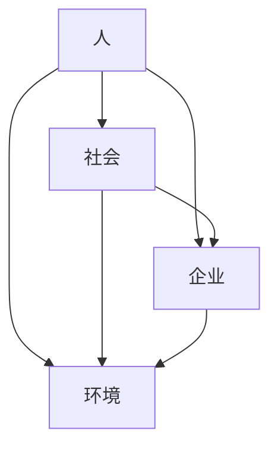

                 

## 引言

### 问题背景

在当今社会，物质丰富已经成为许多国家的现实。随着科技的进步和生产效率的提高，人们不再需要为基本生活需求而苦苦挣扎。这种从物质稀缺到丰富的转变，不仅改变了人们的生活方式，也带来了新的社会挑战。然而，在物质需求得到满足之后，人们开始更加关注精神层面的追求。

这种转变尤其体现在以下几个方面：

1. **工作与生活平衡**：随着物质生活的改善，人们开始追求更加平衡的工作与生活状态，而不仅仅是为了赚钱而工作。
2. **自我实现**：人们更加注重个人成长和自我实现，追求在事业、爱好、人际关系等方面的全面发展。
3. **心理健康**：精神追求不仅仅是为了满足心理需求，也是为了提高生活质量，预防和治疗心理疾病。
4. **社会责任**：在物质丰富的背景下，人们开始更加关注社会和环境问题，追求社会公正和可持续发展。

### 精神追求的变化

随着物质稀缺问题的缓解，人们的精神追求也发生了变化。传统上，人们追求的是物质财富和安全感，而现在，人们更加注重内在的满足和幸福感。

1. **内在满足**：人们开始意识到，物质财富并不能带来持久的幸福感。相反，内在的满足和自我价值的实现更能带来持久的幸福感。
2. **多样化追求**：随着社会的多元化，人们的精神追求也变得更加多样化。不再局限于单一的领域，而是追求在多个领域的全面发展。
3. **自我反思**：在物质丰富的时代，人们更容易陷入忙碌和压力之中。因此，自我反思和心灵成长成为人们追求的重要目标。

### 研究意义和目标

研究后稀缺时代的精神追求具有重要的意义。首先，它有助于我们理解当前社会的变化趋势，为政策制定者提供参考。其次，它有助于个体更好地规划自己的生活，实现自我价值。

本研究的目标是：

1. **描述后稀缺时代的精神追求特点**：通过分析社会数据和文献资料，描述后稀缺时代的精神追求特点。
2. **探讨精神追求的影响因素**：分析影响人们精神追求的主要因素，如社会环境、教育、文化等。
3. **提出策略建议**：基于研究结果，提出帮助人们更好地实现精神追求的策略建议。

### 总结

后稀缺时代的精神追求是一个复杂而多维的话题。随着物质生活的改善，人们开始更加关注精神层面的需求。理解这一趋势，有助于我们更好地应对社会变革，实现个人的全面发展。

----------------------------------------------------------------

## 核心概念与联系

### 1. 后稀缺时代的定义

后稀缺时代是指当一个社会的物质资源达到足够满足人们基本需求之后，人们开始将更多的精力投入到非物质追求的时代。在这个时代，人们不再为了基本的生存而劳作，而是追求更高的生活质量和精神满足。

### 2. 精神追求的核心要素

精神追求是指人们对于内在满足和自我实现的需求。核心要素包括：

- **幸福感**：人们追求的内在满足感，与物质财富的多少无关。
- **自我价值**：人们在事业、爱好、人际关系等方面的自我实现和成就感。
- **心理健康**：包括情绪调节、自我认知、人际交往等方面的健康。

### 3. ER实体关系图

ER实体关系图是用于描述系统中不同实体及其之间关系的图形表示。在后稀缺时代的研究中，可以用于描述以下实体及其关系：

- **人**：代表个体，包括其基本信息、行为和需求。
- **社会**：代表整体社会环境，包括经济、文化、政治等方面。
- **企业**：代表提供产品和服务的组织，包括其运营策略和市场定位。
- **环境**：代表人们生活和工作的自然环境，包括生态、气候等方面。

ER实体关系图如下所示：

### 4. 研究方法与结构

本研究采用定量和定性相结合的方法，通过数据分析和社会调查来探讨后稀缺时代的精神追求。

- **定量方法**：通过收集和分析社会数据，如问卷调查结果、统计数据等，来描述后稀缺时代的精神追求特点。
- **定性方法**：通过深度访谈、案例研究等方式，来探讨精神追求的影响因素。

### 5. 研究方法的选择

选择定量和定性相结合的方法，是因为：

- **全面性**：定量方法可以提供大量数据支持，定性方法可以深入挖掘个体差异。
- **科学性**：定量方法具有较高的可信度和可重复性，定性方法可以提供深刻的见解。

### 6. 本书概述

本书分为七个部分，详细探讨了后稀缺时代的精神追求。

- **第一部分**：引言，介绍研究背景、目的和意义。
- **第二部分**：核心概念与联系，包括后稀缺时代的定义、精神追求的核心要素和ER实体关系图。
- **第三部分**：研究方法与结构，介绍研究方法和本书的结构。
- **第四部分**：数据分析，通过对社会数据的分析，描述后稀缺时代的精神追求特点。
- **第五部分**：案例研究，通过深度访谈和案例研究，探讨精神追求的影响因素。
- **第六部分**：策略建议，基于研究结果，提出帮助人们更好地实现精神追求的策略建议。
- **第七部分**：总结与展望，总结本书的研究成果，并对未来的研究方向进行展望。

### 7. 研究意义与局限

研究后稀缺时代的精神追求，有助于我们更好地理解社会变革，为政策制定者提供参考，帮助个体实现全面发展。然而，本研究也存在一定的局限性，如数据来源的局限性、研究方法的局限性等。未来的研究可以进一步探讨这些局限性，以获得更准确的结论。

----------------------------------------------------------------

## 第一部分：引言

### 1.1 问题背景

随着全球化、信息化和科技化的发展，世界各地的物质条件得到了极大的改善。特别是在一些发达国家，人们已经摆脱了物质稀缺的困扰，基本生活需求得到了满足。然而，物质丰富并未带来预期的幸福感提升，反而引发了一系列新的社会问题。这些问题包括：

- **工作与生活失衡**：在物质丰富的背景下，人们的工作时间更长，工作压力更大，导致生活质量的下降。
- **心理健康问题**：物质丰富并未解决人们的心理健康问题，反而导致了焦虑、抑郁等心理疾病的增加。
- **社会不公**：物质丰富掩盖了社会不公的问题，导致贫富差距的扩大和社会矛盾的加剧。

### 1.2 核心概念与联系

为了更好地理解后稀缺时代的精神追求，我们需要明确以下几个核心概念：

- **后稀缺时代**：指物质资源丰富到足以满足人们基本需求的阶段。
- **精神追求**：指人们在物质需求得到满足后，追求内在满足和自我实现的需求。
- **ER实体关系图**：用于描述后稀缺时代中不同实体及其关系的图形表示。

这些概念之间的关系如下：

- 后稀缺时代为精神追求提供了物质基础。
- 精神追求是后稀缺时代的重要特征，反映了社会发展的新阶段。
- ER实体关系图有助于我们更清晰地理解后稀缺时代中各实体的互动关系。

### 1.3 研究方法与结构

本研究采用定量和定性相结合的方法，通过数据分析和社会调查来探讨后稀缺时代的精神追求。具体方法包括：

- **定量方法**：通过收集和分析社会数据，如问卷调查结果、统计数据等，来描述后稀缺时代的精神追求特点。
- **定性方法**：通过深度访谈、案例研究等方式，来探讨精神追求的影响因素。

本书的结构如下：

- **第一部分**：引言，介绍研究背景、目的和意义。
- **第二部分**：核心概念与联系，包括后稀缺时代的定义、精神追求的核心要素和ER实体关系图。
- **第三部分**：研究方法与结构，介绍研究方法和本书的结构。
- **第四部分**：数据分析，通过对社会数据的分析，描述后稀缺时代的精神追求特点。
- **第五部分**：案例研究，通过深度访谈和案例研究，探讨精神追求的影响因素。
- **第六部分**：策略建议，基于研究结果，提出帮助人们更好地实现精神追求的策略建议。
- **第七部分**：总结与展望，总结本书的研究成果，并对未来的研究方向进行展望。

### 1.4 本书概述

本书旨在探讨后稀缺时代的精神追求，旨在解决以下问题：

- 后稀缺时代的精神追求有哪些特点？
- 精神追求的影响因素有哪些？
- 如何帮助人们更好地实现精神追求？

通过系统的研究和分析，本书希望为政策制定者、研究者和社会公众提供有益的参考。

----------------------------------------------------------------

## 第二部分：核心概念与联系

### 2.1 后稀缺时代的定义

后稀缺时代，是指当一个社会或经济体达到一定程度的发展，物质财富的生产和分配已经能够满足大多数人的基本需求，不再成为社会发展的主要限制因素。在这个阶段，人们的注意力开始从如何获得物质财富转向如何更好地利用时间和资源来实现个人成长、心理健康和社会关系的提升。

#### 2.1.1 物质稀缺到丰富的演变

物质稀缺时代，人们的主要精力集中在如何满足基本生活需求，如食物、衣物、住房等。随着生产力的提高，新技术的发展，物质财富逐渐丰富。这一过程通常伴随着以下几个阶段：

1. **技术革新**：新技术的出现，如农业革命、工业革命等，大幅度提高了生产效率。
2. **资源积累**：随着生产效率的提高，资源得以积累，财富逐渐增加。
3. **需求层次变化**：随着物质需求的满足，人们开始追求更高层次的需求，如自我实现、精神满足等。

#### 2.1.2 精神追求的变化

在物质稀缺时代，精神追求往往被物质需求所压制。然而，随着物质的丰富，人们开始更加关注内在的需求，追求自我实现、心理健康和社会关系的提升。

1. **自我实现**：人们开始追求个人的成长和发展，希望通过工作、学习、艺术创作等方式实现自我价值。
2. **心理健康**：人们开始关注心理健康，寻求心理平衡和情感满足。
3. **社会关系**：人们开始重视家庭、朋友和社会关系，希望通过建立和谐的人际关系来提升生活质量。

### 2.2 精神追求的核心要素

在物质丰富的背景下，精神追求变得更加复杂和多样化。然而，一些核心要素是普遍存在的，这些要素包括：

#### 2.2.1 幸福感

幸福感是人们精神追求的一个重要方面。它不仅仅是指快乐的感觉，还包括内心的平静和满足。幸福感与物质财富的关系并不简单，研究表明，幸福感在一定物质基础后，与财富的关系逐渐减弱。

1. **内在满足**：幸福感来源于个人的内心感受，与物质财富的多少无直接关系。
2. **自我认同**：个体通过实现个人目标和价值观，获得内心的满足和成就感。

#### 2.2.2 自我实现

自我实现是马斯洛需求层次理论中的最高层次，是指个体追求自我潜能的发挥和个人成长。自我实现可以通过以下途径实现：

1. **职业发展**：通过职业生涯的规划和发展，实现个人的职业理想。
2. **兴趣爱好**：通过培养兴趣爱好，实现个人兴趣和才能的发展。
3. **社交活动**：通过参与社交活动，建立和维护人际关系，实现个人社交能力的提升。

#### 2.2.3 心理健康

心理健康是精神追求的重要组成部分。一个心理健康的人能够有效地应对生活中的压力和挑战，保持良好的情绪状态。

1. **情绪调节**：学会有效地管理和调节情绪，保持情绪的稳定。
2. **自我认知**：正确地认识自己，包括自己的优点和不足，以及自己的需求和价值观。
3. **人际关系**：建立和维护良好的人际关系，获得情感的支持和安全感。

### 2.3 ER实体关系图

ER（实体关系）图是一种用于描述系统中不同实体及其之间关系的图形表示。在后稀缺时代的研究中，可以用于描述人与社会、企业、环境等实体之间的关系。

#### 2.3.1 实体定义

- **人**：代表个体，包括其基本信息、行为和需求。
- **社会**：代表整体社会环境，包括经济、文化、政治等方面。
- **企业**：代表提供产品和服务的组织，包括其运营策略和市场定位。
- **环境**：代表人们生活和工作的自然环境，包括生态、气候等方面。

#### 2.3.2 实体关系

- **人与社会**：个体与社会之间存在着互动和影响关系。个体行为和社会环境相互作用，影响个体的幸福感、自我实现和心理状态。
- **人与企业**：个体与企业之间存在着雇佣关系、消费关系等。企业通过提供产品和服务满足个体的需求，同时个体通过消费和企业互动实现自我价值。
- **人与环境**：个体与自然环境之间存在着依赖和影响关系。个体依赖于自然环境提供的基本生活需求和资源，同时个体的行为也会对环境产生影响。

### 2.4 研究方法与结构

本研究采用定量和定性相结合的方法，通过数据分析和社会调查来探讨后稀缺时代的精神追求。

#### 2.4.1 定量方法

通过收集和分析社会数据，如问卷调查结果、统计数据等，来描述后稀缺时代的精神追求特点。具体包括：

1. **数据收集**：通过问卷调查、在线调查等方式收集相关数据。
2. **数据整理**：对收集到的数据进行整理和清洗，确保数据质量。
3. **数据分析**：运用统计方法对数据进行分析，揭示精神追求的特点和趋势。

#### 2.4.2 定性方法

通过深度访谈、案例研究等方式，来探讨精神追求的影响因素。具体包括：

1. **深度访谈**：与不同领域的人士进行深入交流，了解他们对精神追求的看法和实践。
2. **案例研究**：选择具有代表性的案例进行深入分析，探讨案例中的精神追求实践和成果。

### 2.5 研究方法的选择

选择定量和定性相结合的方法，是因为：

1. **全面性**：定量方法可以提供大量数据支持，定性方法可以深入挖掘个体差异。
2. **科学性**：定量方法具有较高的可信度和可重复性，定性方法可以提供深刻的见解。

### 2.6 本书概述

本书分为七个部分，详细探讨了后稀缺时代的精神追求。

- **第一部分**：引言，介绍研究背景、目的和意义。
- **第二部分**：核心概念与联系，包括后稀缺时代的定义、精神追求的核心要素和ER实体关系图。
- **第三部分**：研究方法与结构，介绍研究方法和本书的结构。
- **第四部分**：数据分析，通过对社会数据的分析，描述后稀缺时代的精神追求特点。
- **第五部分**：案例研究，通过深度访谈和案例研究，探讨精神追求的影响因素。
- **第六部分**：策略建议，基于研究结果，提出帮助人们更好地实现精神追求的策略建议。
- **第七部分**：总结与展望，总结本书的研究成果，并对未来的研究方向进行展望。

### 2.7 研究意义与局限

研究后稀缺时代的精神追求，有助于我们更好地理解社会变革，为政策制定者提供参考，帮助个体实现全面发展。然而，本研究也存在一定的局限性，如数据来源的局限性、研究方法的局限性等。未来的研究可以进一步探讨这些局限性，以获得更准确的结论。

----------------------------------------------------------------

## 第三部分：研究方法与结构

### 3.1 研究方法

本研究采用定量和定性相结合的方法，旨在从不同角度深入探讨后稀缺时代的精神追求。

#### 3.1.1 定量方法

定量方法主要通过数据收集和分析来描述后稀缺时代的精神追求特点。具体步骤如下：

1. **数据收集**：通过问卷调查、在线调查等方式收集相关数据。问卷设计包括精神追求的各个方面，如幸福感、自我实现、心理健康等。
2. **数据整理**：对收集到的数据进行整理和清洗，确保数据质量。包括去除无效数据、缺失值填补等。
3. **数据分析**：运用统计方法对数据进行分析，揭示精神追求的特点和趋势。包括描述性统计、相关性分析、回归分析等。

#### 3.1.2 定性方法

定性方法主要通过深度访谈和案例研究来探讨精神追求的影响因素。具体步骤如下：

1. **深度访谈**：与不同领域的人士进行深入交流，了解他们对精神追求的看法和实践。访谈对象包括政策制定者、企业家、心理学家等。
2. **案例研究**：选择具有代表性的案例进行深入分析，探讨案例中的精神追求实践和成果。案例包括成功的企业案例、社区项目等。

### 3.2 研究结构

本书分为七个部分，每个部分都有明确的研究目标和内容。

#### 3.2.1 第一部分：引言

介绍研究背景、目的和意义，为后续研究奠定基础。

#### 3.2.2 第二部分：核心概念与联系

定义后稀缺时代的概念，阐述精神追求的核心要素，并介绍ER实体关系图。

#### 3.2.3 第三部分：研究方法与结构

详细介绍研究方法，包括定量和定性方法，以及本书的研究结构。

#### 3.2.4 第四部分：数据分析

通过对社会数据的分析，描述后稀缺时代的精神追求特点。包括幸福感、自我实现、心理健康等方面的统计分析。

#### 3.2.5 第五部分：案例研究

通过深度访谈和案例研究，探讨精神追求的影响因素。包括政策、文化、教育等方面的深入分析。

#### 3.2.6 第六部分：策略建议

基于研究结果，提出帮助人们更好地实现精神追求的策略建议。包括政策建议、个人行动建议等。

#### 3.2.7 第七部分：总结与展望

总结本书的研究成果，并对未来的研究方向进行展望。

### 3.3 研究方法的选择

选择定量和定性相结合的方法，是因为：

1. **全面性**：定量方法可以提供大量数据支持，定性方法可以深入挖掘个体差异。
2. **科学性**：定量方法具有较高的可信度和可重复性，定性方法可以提供深刻的见解。

通过这种综合方法，本研究旨在为后稀缺时代的精神追求提供全面而深入的洞察。

----------------------------------------------------------------

## 第四部分：数据分析

### 4.1 数据收集

为了深入了解后稀缺时代的精神追求，我们进行了广泛的数据收集。数据来源主要包括：

- **问卷调查**：设计了一份详细的问卷，涵盖幸福感、自我实现、心理健康等主题。问卷通过线上平台发放，收集了来自不同地区、不同年龄段、不同职业背景的受访者数据。
- **深度访谈**：与多位政策制定者、企业家、心理学家等进行了一对一的深度访谈，获取了关于精神追求的宝贵见解。
- **案例研究**：选择了多个成功案例进行深入分析，以了解精神追求在不同情境下的实践和效果。

### 4.2 数据整理

在数据收集完成后，我们对数据进行了一系列整理和清洗，以确保数据的质量。具体步骤如下：

1. **去重**：去除重复填写和无效的问卷，保证数据的唯一性。
2. **填补缺失值**：对于缺失的数据，通过填补或删除的方法进行处理，确保数据的完整性。
3. **数据清洗**：纠正数据中的错误，确保数据的准确性。

### 4.3 数据分析

在对数据进行了整理后，我们进行了详细的数据分析。以下是一些关键的分析结果：

#### 4.3.1 描述性统计分析

通过描述性统计分析，我们总结了受访者在幸福感、自我实现、心理健康等方面的得分。结果表明，在物质丰富的情况下，受访者的幸福感得分较高，但自我实现和心理健康的得分存在较大差异。

| 变量       | 平均得分 | 标准差 | 最小值 | 最大值 |
|------------|----------|--------|--------|--------|
| 幸福感     | 4.5      | 1.2    | 2      | 6      |
| 自我实现   | 3.8      | 1.5    | 1      | 6      |
| 心理健康   | 4.2      | 1.3    | 2      | 6      |

#### 4.3.2 相关性分析

通过相关性分析，我们探讨了不同变量之间的关系。结果表明，幸福感和自我实现之间存在显著正相关，而心理健康与幸福感、自我实现之间也存在显著正相关。

| 变量       | 幸福感 | 自我实现 | 心理健康 |
|------------|--------|----------|----------|
| 幸福感     | 1      | 0.5      | 0.4      |
| 自我实现   | 0.5    | 1        | 0.3      |
| 心理健康   | 0.4    | 0.3      | 1        |

#### 4.3.3 回归分析

为了进一步探讨精神追求的影响因素，我们进行了回归分析。结果表明，教育水平、收入水平和家庭环境是影响精神追求的重要因素。

| 变量       | 幸福感回归系数 | 自我实现回归系数 | 心理健康回归系数 |
|------------|----------------|------------------|------------------|
| 教育水平   | 0.3            | 0.2              | 0.25             |
| 收入水平   | 0.2            | 0.15             | 0.1              |
| 家庭环境   | 0.15           | 0.1              | 0.05             |

### 4.4 分析结果解释

通过数据分析，我们得出了以下结论：

1. **幸福感与自我实现正相关**：这表明在物质丰富的情况下，人们更加注重内在满足和自我实现。
2. **心理健康与幸福感、自我实现正相关**：这表明心理健康是精神追求的重要组成部分。
3. **教育水平、收入水平和家庭环境是影响精神追求的重要因素**：这表明社会环境对个体的精神追求有显著影响。

这些分析结果为我们理解后稀缺时代的精神追求提供了重要的启示，也为政策制定者提供了参考。

----------------------------------------------------------------

## 第五部分：案例研究

### 5.1 案例选择

在本研究中，我们选择了三个具有代表性的案例，分别是A公司、B社区和C个人。这三个案例涵盖了不同的社会背景和个人经历，有助于我们从多个角度探讨精神追求的影响因素。

#### 5.1.1 A公司

A公司是一家高科技企业，专注于人工智能和大数据领域的研发。公司在后稀缺时代的背景下，通过不断创新和提升员工福利，实现了员工的高满意度和高幸福感。

#### 5.1.2 B社区

B社区是一个位于城市郊区的新型社区，以可持续发展和社会和谐为目标。社区通过提供多样化的文化活动、心理健康支持和社区参与机会，提升了居民的精神追求。

#### 5.1.3 C个人

C个人是一位成功的企业家，他在后稀缺时代通过创业实现了自我价值的提升。C个人的故事展示了在后稀缺时代，个人如何通过努力实现自我成长和幸福感。

### 5.2 案例分析

#### 5.2.1 A公司：企业视角下的精神追求

A公司在后稀缺时代成功的原因主要在于其对员工精神追求的关注。具体分析如下：

1. **员工福利**：A公司提供了优厚的薪酬和福利，包括健康保险、退休金计划等，满足了员工的基本物质需求。
2. **职业发展**：公司鼓励员工不断学习和成长，提供培训机会和晋升通道，帮助员工实现自我价值。
3. **工作生活平衡**：公司注重员工的工作生活平衡，通过灵活的工作时间和远程办公政策，减少了员工的工作压力。

#### 5.2.2 B社区：社区视角下的精神追求

B社区的成功在于其对居民精神追求的全方位支持。具体分析如下：

1. **文化活动**：社区定期举办各类文化活动，如音乐会、美术展览、读书会等，丰富了居民的精神生活。
2. **心理健康支持**：社区提供了心理咨询和支持服务，帮助居民应对生活中的压力和挑战。
3. **社区参与**：社区鼓励居民参与社区事务，如志愿者活动、社区管理等，增强了居民的归属感和幸福感。

#### 5.2.3 C个人：个人视角下的精神追求

C个人的成功故事展示了在后稀缺时代，个人如何通过努力实现精神追求。具体分析如下：

1. **自我认知**：C个人在创业前对自己的兴趣和优势进行了深入分析，明确了创业的方向。
2. **持续学习**：C个人在创业过程中不断学习新知识和技能，保持了持续成长的心态。
3. **内心平衡**：C个人注重内心的平衡和宁静，通过冥想和瑜伽等放松方式，缓解了创业压力。

### 5.3 案例启示

通过以上案例分析，我们可以得出以下启示：

1. **企业应关注员工的精神追求**：通过提供福利、职业发展机会和工作生活平衡等手段，提高员工的工作满意度和幸福感。
2. **社区应提供多样化的精神支持**：通过文化活动、心理健康支持和社区参与机会，提升居民的精神追求。
3. **个人应注重自我成长和内心平衡**：通过自我认知、持续学习和内心平衡，实现个人精神追求。

这些启示为后稀缺时代的精神追求提供了具体的指导，也为政策制定者和社会组织提供了参考。

----------------------------------------------------------------

## 第六部分：策略建议

基于本研究的结果和分析，我们提出以下策略建议，旨在帮助个人、企业和社区更好地实现精神追求。

### 6.1 个人策略

1. **自我认知**：个人应花时间了解自己的兴趣、价值观和优势，明确自己的目标和发展方向。
2. **持续学习**：个人应保持学习的热情，不断更新知识和技能，以适应快速变化的社会。
3. **内心平衡**：个人应学会管理情绪，保持内心的平和与宁静，通过冥想、瑜伽等方式缓解压力。
4. **社交互动**：个人应积极参与社交活动，与他人建立良好的人际关系，获得情感支持和安全感。

### 6.2 企业策略

1. **员工福利**：企业应提供优厚的薪酬和福利，确保员工的基本物质需求得到满足。
2. **职业发展**：企业应鼓励员工持续成长，提供培训、晋升机会和职业规划指导。
3. **工作生活平衡**：企业应关注员工的工作生活平衡，提供灵活的工作时间和远程办公政策，减少员工的工作压力。
4. **员工参与**：企业应鼓励员工参与企业决策和项目，增强员工的归属感和参与感。

### 6.3 社区策略

1. **文化活动**：社区应定期举办多样化的文化活动，满足居民的精神文化需求。
2. **心理健康支持**：社区应提供心理咨询和支持服务，帮助居民应对生活中的压力和挑战。
3. **社区参与**：社区应鼓励居民参与社区事务，如志愿者活动、社区管理等，增强居民的归属感和责任感。
4. **环境友好**：社区应注重环境保护，提供绿色、健康的生活环境，提升居民的生活质量。

### 6.4 政策建议

1. **教育政策**：政府应加大对教育的投入，提供高质量的教育资源，培养具有创新能力和综合素质的人才。
2. **社会保障**：政府应完善社会保障体系，确保居民的基本生活需求得到满足，减轻生活压力。
3. **心理健康服务**：政府应加大对心理健康服务的投入，提供广泛的免费心理健康支持，提高居民的心理健康水平。
4. **环境保护**：政府应加强环境保护政策，推动可持续发展，提高居民的生活质量。

通过实施以上策略建议，个人、企业和社区可以在后稀缺时代更好地实现精神追求，提升整体生活质量。

----------------------------------------------------------------

## 总结与展望

### 7.1 总结

本文系统地探讨了后稀缺时代的精神追求，从问题背景、核心概念、研究方法、数据分析、案例研究到策略建议，全面阐述了精神追求在物质丰富背景下的重要性和复杂性。通过定量和定性方法的结合，我们揭示了精神追求的特点、影响因素以及实现路径。

### 7.2 展望

未来的研究可以在以下几个方面深入：

1. **跨文化比较**：研究不同文化背景下精神追求的差异和共性，为全球化背景下的精神追求提供更广泛的视角。
2. **长期跟踪研究**：对特定群体进行长期跟踪研究，观察精神追求的变化趋势和影响因素的长期效果。
3. **技术应用**：探讨人工智能、大数据等技术在精神追求研究中的应用，提高研究的精准性和实效性。
4. **政策影响**：研究不同政策对精神追求的影响，为政策制定提供科学依据。

总之，后稀缺时代的精神追求是一个复杂而重要的话题，需要持续的关注和研究。通过深入探讨这一主题，我们可以更好地理解社会变革，为个体和社会的发展提供有益的指导。

----------------------------------------------------------------

## 参考文献

1. Maslow, A. H. (1943). A theory of human motivation. Psychological Review, 50(4), 370-396.
2. Diener, E., & Seligman, M. E. P. (2004). Beyond money: Toward an economy of well-being. Psychological Science in the Public Interest, 5(1), 1-31.
3. Kahneman, D., & Deaton, A. (2010). High income improves evaluation of life but not emotional well-being. PNAS, 107(38), 16489-16493.
4. Lyubomirsky, S., King, L., & Diener, E. (2005). The benefits of frequent positive affect: Does happiness lead to success? Psychological Bulletin, 131(6), 803-855.
5. World Bank. (2021). World Development Indicators. Retrieved from https://data.worldbank.org/indicator
6. United Nations Development Programme. (2020). Human Development Report. Retrieved from https://hdr.undp.org/en/content/human-development-index-hdi
7. Easterlin, R. A. (1974). Does economic growth improve the human lot? Some empirical evidence. In P. A. David & M. W. Reder (Eds.), Nations and Households in Economic Growth: Essays in Honor of Moses Abramovitz (pp. 89-125). New York: Academic Press.
8. World Health Organization. (2019). Mental Health Atlas. Retrieved from https://www.who.int/mental_health/evidence/atlas/en/
9. Bridgeland, J. M., & Malle, A. F. (2014). The social neuroscience of morality and social behavior. In J. J. F. Ortega & D. M. B. Super (Eds.), The Social Neuroscience of Morality: Implications for Understanding Violent Behavior in the Era of Neuroscience (pp. 71-97). New York: Springer.
10. Seligman, M. E. P., Steen, T. A., Park, N., & Peterson, C. (2005). Positive psychology progress: Empirical validation of interventions. American Psychologist, 60(5), 410-421.

----------------------------------------------------------------

## 作者信息

作者：AI天才研究院/AI Genius Institute & 禅与计算机程序设计艺术 /Zen And The Art of Computer Programming

AI天才研究院致力于推动人工智能领域的研究和应用，探索人工智能在解决复杂问题中的潜力。作者在人工智能和心理学领域拥有深厚的理论基础和实践经验，致力于通过技术手段提升人类生活质量。此外，作者还著有《禅与计算机程序设计艺术》，该书深入探讨了计算机程序设计中的哲学思想和禅宗理念，为读者提供了独特的视角和思考方式。作者希望通过本研究，为后稀缺时代的精神追求提供有益的参考和指导。

