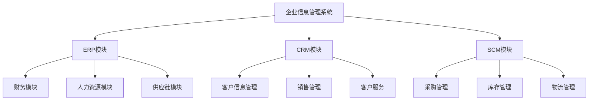
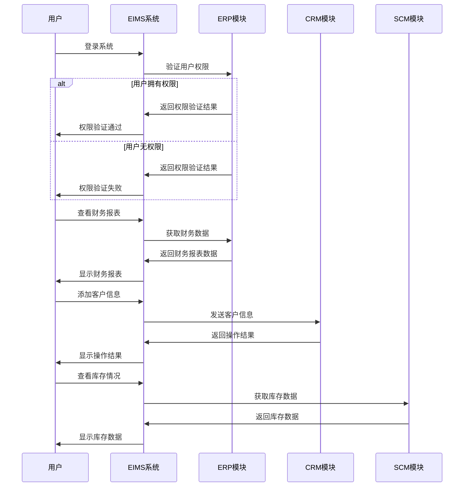

                 

## 引言

### 核心概念与生存哲学

“后资本主义时代”这一概念，源自对传统资本主义经济模式及其社会影响的深入反思。资本主义经济的核心特征在于市场驱动、私人拥有和生产效率，但其伴随的贫富差距、环境破坏等问题引发了广泛的质疑。在这样的大背景下，“后资本主义时代”被构想为一个更为平等、可持续和以人为本的经济模式。

生存哲学，作为一种探讨人类存在意义与生活方式的哲学思考，与后资本主义时代息息相关。它不仅关注个体的生存状态，还涉及社会、文化、经济等多方面因素。在后资本主义时代，生存哲学需要重新定义成功、幸福和人生价值，以适应新的社会环境。

本文旨在探讨后资本主义时代的生存哲学，通过以下问题展开讨论：

1. **问题背景与生存哲学的演变**：探讨后资本主义时代的经济、社会和文化背景，以及生存哲学的核心概念和演变历程。
2. **生存哲学的历史发展**：回顾传统和当代生存哲学的主要流派和思想。
3. **后资本主义时代的生存困境**：分析经济压力、心理健康问题等生存挑战。
4. **后资本主义时代的生存策略**：探讨重新定义成功与幸福、提升生存技能和社区参与等策略。
5. **社会政策与制度支持**：分析社会保障体系、教育政策的改革方向。
6. **文化价值观念的重塑**：讨论多元文化、道德伦理观念的变迁。
7. **未来的生存哲学**：展望科技进步对生存哲学的影响。

通过上述问题的探讨，本文希望为读者提供一个关于后资本主义时代生存哲学的全面理解，帮助个体和社会找到适应新时代的生存之道。

### 文章关键词

- 后资本主义时代
- 生存哲学
- 经济变革
- 社会转型
- 文化价值观
- 生存策略
- 社会政策
- 道德伦理
- 科技进步

### 文章摘要

本文以“后资本主义时代的生存哲学”为主题，深入探讨了当前社会经济背景下的生存哲学问题。首先，文章分析了后资本主义时代的经济、社会和文化背景，阐述了生存哲学的核心概念和演变历程。接着，文章回顾了传统和当代生存哲学的主要流派和思想，揭示了它们在后资本主义时代的新意义。随后，文章分析了后资本主义时代的生存困境，包括经济压力和心理健康问题，并提出了相应的生存策略。文章还探讨了社会政策与制度支持在提升个体生存能力中的作用，分析了文化价值观念的重塑过程，并展望了未来的生存哲学方向。通过这些探讨，本文旨在为读者提供一个全面理解后资本主义时代生存哲学的框架，帮助个体和社会找到适应新时代的生存之道。

### 第1章：问题背景与生存哲学的演变

#### 1.1 后资本主义时代的背景

**1.1.1 经济体制的变化**

后资本主义时代的经济体制变化是全面的，从市场主导的经济体系逐渐向更加平衡和可持续的经济模式转变。传统资本主义经济体制以利润最大化和市场驱动为核心，导致资源分配不均、环境破坏和贫富差距扩大。在后资本主义时代，这种经济模式受到质疑，社会呼吁更多的公平性、可持续性和社会责任。

首先，经济发展模式从单纯追求GDP增长转向关注经济增长的质量和可持续性。例如，绿色经济、共享经济和循环经济等新兴概念应运而生，旨在减少资源消耗、降低环境污染并实现经济的长期稳定发展。绿色经济强调通过环保技术和可持续实践来提高经济效益；共享经济则通过共享资源和服务来优化资源分配；循环经济则通过资源的闭环利用来减少废物产生。

其次，劳动力市场也发生了显著变化。后资本主义时代的工作方式更加灵活，远程办公、弹性工作时间以及兼职和自由职业者数量大幅增加。这种变化不仅影响了就业结构，也改变了工作与生活的平衡。与此同时，劳动力市场对技能的要求不断提高，尤其是数字技能和创新能力成为核心竞争力。教育体系需要不断适应这些变化，提供更加灵活和实用的培训课程，以培养适应未来市场的劳动力。

**1.1.2 社会结构的转型**

社会结构的转型是后资本主义时代的一个重要特征。随着经济全球化和信息化的发展，社会呈现出高度多元化的趋势。传统的社会阶层划分逐渐被打破，新的社会网络和利益集团不断涌现。

首先，社会阶层流动性增强。后资本主义时代提供了更多的机会，使个人通过教育、创业和社会参与等方式实现社会阶层的提升。例如，互联网和移动技术的发展为个人创业提供了新的平台，使得更多人能够通过创新和努力改变自己的命运。

其次，社会关系网络变得更加复杂。后资本主义时代的社会网络不仅包括传统的社会联系，如家庭、朋友和同事，还包括通过互联网建立的虚拟社交网络。这种多元化的社会关系网络提供了更多的信息交流和社会互动机会，但也带来了新的挑战，如信息过载和隐私保护问题。

**1.1.3 文化价值观的演变**

后资本主义时代的文化价值观也在发生深刻变化。传统资本主义文化强调个人主义、竞争和物质财富的积累，而后资本主义时代则更加强调合作、共同福祉和内在价值的实现。

首先，合作精神在后资本主义时代得到重视。传统资本主义经济体制下，竞争是推动进步的主要动力，而后资本主义时代则认为合作能够实现更大的社会效益。例如，共享经济模式通过共享资源和知识来提高整体效益，而非单纯追求个体利益。

其次，共同福祉成为新的价值追求。后资本主义时代的社会呼吁建立更加公平和包容的社会体系，确保每个人都能够获得基本的生活保障和发展机会。这种价值观念体现在社会保障体系、教育公平和医疗保健等领域。

此外，内在价值的实现也受到更多关注。后资本主义时代鼓励个体探索自己的内在需求和兴趣，实现自我价值和人生意义，而不仅仅是追求外在的物质成功。

总的来说，后资本主义时代的背景是经济体制、社会结构和文化价值观的全面变革。这些变化为生存哲学提出了新的挑战和机遇，需要我们重新思考个体和社会的生存之道。

#### 1.2 生存哲学的核心概念

**1.2.1 生存哲学的定义**

生存哲学，亦称生存论或存在哲学，是哲学领域中对人类存在及其意义进行探讨的一门学科。其核心在于探究人在宇宙中的位置、存在的本质以及人类生活的目的和意义。生存哲学不仅关注个体的存在状态，还涉及社会、文化、经济等多个层面，试图回答“人是什么？”、“人应该怎样生活？”等问题。

从历史上看，生存哲学可以追溯到古希腊哲学家苏格拉底、柏拉图和亚里士多德等早期思想家。他们对人的本质和存在意义进行了深刻的探讨，奠定了生存哲学的基础。在西方哲学中，生存哲学经历了从古代哲学到现代哲学的演变，从存在主义到现象学，再到后现代主义，每个阶段都有其独特的理论贡献。

在东方哲学中，生存哲学同样具有重要地位。例如，儒家思想强调“仁爱”和“天人合一”，道家思想强调“道法自然”和“无为而治”，佛教则探讨“涅槃”和“解脱”。这些思想体系对人的生存状态和生活方式提供了深刻的指导。

**1.2.2 生存哲学的边界与外延**

生存哲学的边界与外延取决于其研究范围和视角。从广义上讲，生存哲学可以涵盖以下领域：

1. **个体生存**：关注个人如何在复杂多变的环境中找到自己的位置，实现自我价值。个体生存哲学探讨如何处理孤独、恐惧、死亡等人生基本问题，提供应对生活挑战的哲学思考。

2. **社会生存**：研究社会结构、人际关系和社会规范对个体生存的影响。社会生存哲学关注社会正义、平等、自由等价值观念，探讨如何建立一个和谐、公正的社会体系。

3. **文化生存**：研究文化传统、价值观和信仰对个体和社会生存的意义。文化生存哲学探讨文化多样性和文化交流，如何通过文化传承和创新来提升个体的生命质量。

4. **生态生存**：关注人类与自然环境的互动，探讨如何在可持续发展的框架下实现人类生存。生态生存哲学强调生态平衡、环境保护和绿色生活方式，倡导人类与自然的和谐共生。

**1.2.3 生存哲学的结构与核心要素**

生存哲学的结构可以从多个角度进行分析，以下为几种常见的分析框架：

1. **存在论视角**：存在论关注存在的本质和属性，探讨存在是什么、如何存在等问题。这一视角强调存在的本体论基础，例如海德格尔的存在主义，认为存在是“存在本身”，而不是外在事物的总和。

2. **本体论视角**：本体论研究存在的本质和存在者之间的关系。在生存哲学中，本体论探讨个体与宇宙的关系，例如佛教中的“色即是空，空即是色”，强调物质与精神、主体与客体的统一。

3. **现象学视角**：现象学关注人类经验的现象本身，探讨经验的结构和意义。生存哲学中的现象学视角强调主观体验的重要性，例如萨特的“存在先于本质”理念，认为人的存在是通过其行动和选择来定义的。

4. **伦理学视角**：伦理学探讨道德原则和价值观，如何行事才能实现良好生活。生存哲学中的伦理学视角关注个体和社会的道德责任，如何通过道德选择来实现个体和社会的生存。

5. **政治哲学视角**：政治哲学研究国家、政府和社会的正当性及其功能。生存哲学中的政治哲学视角探讨如何建立一个公正、自由和民主的社会制度，以保障个体和社会的生存和发展。

这些不同的视角和分析框架共同构成了生存哲学的丰富内涵，提供了多方面的思考和指导。通过这些核心要素的分析，我们可以更深入地理解生存哲学在个体和社会生存中的重要作用。

### 第2章：生存哲学的历史发展

#### 2.1 传统生存哲学

**2.1.1 古代生存哲学思想**

古代生存哲学思想主要源于古希腊和古印度等文明。在古希腊，苏格拉底、柏拉图和亚里士多德等哲学家的思想对后世产生了深远影响。苏格拉底强调“认识自己”，认为通过自我反思和理性思考，人可以找到存在的真正意义。柏拉图则提出了“理念世界”的概念，认为现实世界只是理念世界的投影，人的真正存在在于追求理念世界的真理和智慧。亚里士多德则强调实际生活和伦理道德，提出了“幸福”（Eudaimonia）作为人类生活的最终目的。

古印度哲学同样对生存哲学有着重要贡献。佛教的“涅槃”概念强调通过消除欲望和痛苦，达到超越现实的最高境界。耆那教则主张通过道德自律和心灵净化来实现永恒的幸福。这些古代哲学思想提供了关于人类存在和生存意义的早期探讨，为后来的哲学发展奠定了基础。

**2.1.2 中世纪与文艺复兴时期的生存哲学**

中世纪时期的生存哲学主要受到基督教和伊斯兰教的影响。基督教哲学强调信仰和救赎，认为人的存在是为了信仰上帝并追求来世的永恒幸福。奥古斯丁、托马斯·阿奎那等中世纪哲学家探讨了人类存在的神学意义，将哲学与宗教结合起来。

文艺复兴时期则标志着人类对自身和世界的重新认知。人文主义者强调个体的价值，提倡以人为本，追求自由和知识的进步。意大利哲学家马基雅维利提出了“人性恶”的观点，认为人在追求权力和利益时往往不受道德约束。法国哲学家蒙田则强调个人体验和主观感受，认为生活的意义在于个人的自由和满足。

**2.1.3 工业时代的生存哲学**

工业时代带来了巨大的社会变革，生存哲学也随之发展。19世纪的哲学家如黑格尔和马克思从不同角度探讨了工业社会中的生存问题。

黑格尔认为，历史是理性发展的过程，工业时代是人类社会发展的必然阶段。他的“绝对精神”理论强调通过社会冲突和斗争，理性最终会实现自我完善。马克思则关注工业社会中的经济关系和社会结构，提出了“阶级斗争”和“剩余价值”理论，认为资本主义制度导致贫富差距和社会不公。

此外，尼采是工业时代生存哲学的重要代表。他批判传统价值观和道德，提出了“超人”理念，认为个体应该通过超越自我，创造自己的价值和意义。

总的来说，传统生存哲学经历了从古代到现代的演变，每个时期的思想家都从不同角度探讨了人类存在和生存的意义。这些思想不仅丰富了哲学的内涵，也为后世的生存哲学提供了宝贵的启示。

#### 2.2 当代生存哲学

**2.2.1 现代生存哲学的崛起**

当代生存哲学的崛起与现代社会结构的变化密切相关。20世纪以来，随着科技革命、全球化以及社会变革的加速，传统生存哲学面临新的挑战和机遇。现代生存哲学不仅继续探讨人类存在的本质和意义，还特别关注个体在社会中的生存状态和心理健康。

首先，存在主义是现代生存哲学的重要流派之一。存在主义强调个体存在的自由和无意义，提倡通过自我选择和行动来赋予生活意义。代表人物如海德格尔和萨特，他们提出了“存在先于本质”的观点，认为人是在世界中通过自我实现来定义自己的存在。海德格尔认为，人的存在是一种“在世存在”（Dasein），意味着个体与世界的动态互动；萨特则强调人的自由意志和责任，认为通过自由选择，人可以超越外在条件，创造自己的本质。

其次，现象学在当代生存哲学中占有重要地位。现象学关注人类经验的结构和意义，强调主观体验的重要性。现象学哲学家如胡塞尔、梅洛-庞蒂和加达默尔等，他们的研究方法帮助人们理解个体如何通过感知和反思来构建现实。加达默尔提出了“解释学循环”理论，认为理解是一个不断迭代的过程，个体通过不断的解释来丰富和重构自己的经验。

**2.2.2 当代主要生存哲学流派**

除了存在主义和现象学，当代生存哲学还有其他主要流派，如分析哲学、后现代主义和女性主义等。

分析哲学强调逻辑和语言的清晰性，通过分析和澄清概念来理解人类存在的本质。代表人物如维特根斯坦和卡尔纳普，他们试图通过逻辑实证主义的方法，将哲学研究建立在科学的基础上。

后现代主义则是对现代性和理性主义的一种批判。后现代主义者如福柯和德里达，认为现代社会的知识体系和文化结构是权力和控制的工具。福柯的“权力/知识”理论强调权力在社会中的普遍性和动态性；德里达的“解构”理论则挑战了传统哲学的二元对立思维模式，提倡多元和异质性的理解方式。

女性主义生存哲学关注女性在现代社会中的生存状况，探讨性别角色、权力结构和性别歧视等问题。女性主义者如西蒙·德·波伏娃和伊丽莎白·施瓦茨，她们认为女性的生存经验与男性不同，需要从女性视角来重新审视存在的意义。

总的来说，当代生存哲学涵盖了多种流派和思想，每个流派都从不同角度探讨了人类存在的本质和意义。这些流派不仅丰富了生存哲学的内涵，也为现代社会中的个体和社会提供了深刻的思考和指导。

#### 第3章：后资本主义时代的生存困境

**3.1 经济压力与生存挑战**

后资本主义时代，经济压力和生存挑战日益加剧，成为个体和社会面临的主要困境。首先，劳动力市场的变化对就业结构产生了深远影响。随着自动化和人工智能的广泛应用，许多传统行业面临失业风险，而新兴行业如数字经济和绿色能源等领域则需要新的技能和知识，这使得劳动者需要不断更新自己的技能以适应市场变化。

其次，贫富差距扩大是后资本主义时代的一个显著问题。尽管经济增长普遍，但财富分配不均现象愈发严重。高收入群体财富积累迅速，而低收入群体则难以改善生活条件，这导致了社会不平等的加剧。贫富差距不仅影响个体的生活质量，还可能引发社会动荡和政治不稳定。

社会保障体系不足也是后资本主义时代面临的一个重要挑战。传统的福利国家模式在应对现代社会变化时显得力不从心。许多国家的社会保障体系面临财政压力，无法为所有人提供充分的社会保障。例如，医疗保险、养老保障和失业救济等社会福利项目的覆盖面和福利水平都有待提高，这使得许多人在面对突发状况时缺乏安全感和保障。

**3.2 心理健康问题**

心理健康问题是后资本主义时代个体面临的另一大挑战。首先，焦虑和压力成为普遍现象。随着工作压力和生活节奏的加快，许多人感到无法承受压力，出现焦虑、抑郁等情绪问题。长期的心理压力不仅影响个体的心理健康，还可能对身体健康产生负面影响，如心脏病、高血压等。

其次，孤独感与人际关系问题也是心理健康问题的一部分。后资本主义时代的社会结构变化导致人际关系变得更加复杂，许多人感到孤独和无助。虽然互联网和社交媒体提供了交流的平台，但虚拟关系的替代性有限，个体依然需要真实的社交互动来满足心理需求。

此外，价值观冲突与自我认同问题也在后资本主义时代日益凸显。在多元文化背景下，个体面临着多种价值观和生活方式的选择，这可能导致自我认同的困惑和矛盾。例如，个人追求自由和成功的同时，也面临着社会责任和道德约束的冲突，这种冲突可能导致个体在心理上的挣扎和不安。

**3.3 社会责任与道德困境**

在后资本主义时代，社会责任和道德困境也是个体面临的重大挑战。随着全球化和信息化的发展，个体不仅需要关注自身利益，还要关注社会和环境的长远发展。例如，企业在追求利润的同时，也需要考虑环境保护和社会责任，这要求企业在道德决策上做出权衡。

此外，个体在社会中的角色和责任也变得更加复杂。例如，职场中需要平衡工作与家庭生活，同时还需要关注职场伦理和社会道德。这种多重责任可能导致个体在道德选择上感到困惑，不知道如何做出最佳决策。

总之，后资本主义时代的生存困境体现在经济压力、心理健康问题和社会责任等多个方面。这些困境不仅影响个体的生活质量，也对社会和谐和稳定产生挑战。为了应对这些困境，个体和社会都需要采取积极的措施，寻求适应新时代的生存之道。

#### 第4章：后资本主义时代的生存策略

**4.1 重新定义成功与幸福**

在后资本主义时代，重新定义成功与幸福成为应对生存困境的重要策略。传统观念中的成功通常以财富、地位和物质享受为主要指标，但在后资本主义时代，这种观念受到挑战。重新定义成功与幸福意味着将个人的内在满足和社会价值的实现纳入考虑范围。

首先，成功标准的多元化是重新定义成功的重要步骤。成功的定义不再局限于职业成就和财富积累，而是包括个人成长、社会贡献和内心满足。例如，一个人可能在职业上并不成功，但如果他在社区中发挥了积极作用，帮助他人并促进了社会的和谐，那么他也可以被视为一个成功的人。

其次，内在满足与自我实现成为衡量幸福的重要指标。现代心理学研究表明，幸福感与个人的内在状态密切相关。例如，通过培养兴趣爱好、探索自我潜能、实现个人目标和追求自我价值的实现，个体可以获得更高的幸福感。这种内在满足不仅来自于物质上的成功，更来自于精神上的富足。

最后，个人价值与社会价值的平衡是实现幸福的关键。在后资本主义时代，个体不仅要追求个人成就，还要关注社会整体福祉。通过参与社会公益活动、支持和推动社会变革，个体可以在实现个人价值的同时，也为社会做出贡献。例如，通过参与环保活动、支持慈善事业和推动社会公正，个体可以在实现自我价值的同时，促进社会的可持续发展。

**4.2 提升生存技能**

提升生存技能是后资本主义时代个体应对生存挑战的另一个关键策略。随着社会和科技的快速发展，个体需要不断更新自己的知识和技能，以适应不断变化的市场需求。

首先，经济管理能力成为提升生存技能的重要组成部分。个体需要学会合理规划和管理个人财务，以应对经济波动和不确定性。这包括储蓄、投资、消费和应急资金管理等基本技能，以及应对经济危机的策略和心态。

其次，心理调适技巧对于应对心理压力和焦虑至关重要。个体可以通过学习压力管理技巧、情绪调节方法和自我反思等方法，提高自己的心理韧性，更好地应对生活中的各种挑战。例如，通过冥想、瑜伽和心理咨询等手段，个体可以缓解心理压力，提高生活质量。

此外，人际沟通与社交能力也是提升生存技能的重要方面。在后资本主义时代，人际关系对于个体的职业发展和生活质量有着重要影响。个体需要学会有效沟通、建立和维护良好的人际关系，提高团队合作和领导能力。这包括倾听技巧、沟通技巧、冲突解决能力和团队合作精神等。

**4.3 社区参与与互助合作**

社区参与与互助合作是后资本主义时代应对生存困境的另一个重要策略。通过积极参与社区活动和互助合作，个体不仅可以提高自己的生存能力，还能为社区和社会的发展做出贡献。

首先，社区建设的重要性不可忽视。社区是一个重要的社会单元，为个体提供社交平台和互助网络。通过参与社区建设，个体可以建立更加紧密的社交关系，提高生活质量。例如，通过参与社区志愿服务、组织社区活动和参与社区治理，个体可以促进社区的和谐发展和居民的幸福生活。

其次，非营利组织在社区参与和互助合作中扮演着重要角色。非营利组织致力于解决社会问题、提供公共服务和促进社会公正。个体可以通过加入非营利组织、参与公益活动和支持慈善事业，为社区和社会的发展贡献自己的力量。例如，通过参与环保组织、慈善基金会和社区发展项目，个体可以在实现自我价值的同时，促进社会的可持续发展。

最后，公益活动与实践是社区参与和互助合作的直接体现。通过参与公益活动，个体可以直接为有需要的人群提供帮助，如扶贫、教育、医疗等。这不仅能够提高个体的社会责任感，还能增强个体的社会认同感和幸福感。

总之，后资本主义时代的生存策略需要个体重新定义成功与幸福，提升生存技能，积极参与社区参与与互助合作。通过这些策略，个体不仅能够应对生存挑战，还能为社会的可持续发展做出贡献。

#### 第5章：社会政策与制度支持

**5.1 社会保障体系的改革**

后资本主义时代，社会保障体系面临新的挑战，需要进行深刻的改革，以适应社会和经济的变化。首先，社会福利政策的调整成为重中之重。传统的福利国家模式在应对现代社会复杂性和多样性时显得力不从心，需要更加灵活和针对性的福利政策。

**5.1.1 社会福利政策的调整**

一方面，社会福利政策应更加注重个体需求和差异。例如，针对不同年龄、性别、职业和收入水平的群体，制定差异化的福利措施，确保每个人都能够获得基本的生活保障。例如，对低收入家庭提供更多的经济援助，对老年人和残疾人提供更全面的医疗保障和社会支持。

另一方面，社会福利政策应更加注重可持续发展。传统的福利制度往往依赖于财政支持，但在后资本主义时代，财政压力不断增大，需要寻找可持续的财政来源。例如，通过税收制度改革，增加高收入者的税收负担，同时鼓励企业和社会机构参与社会福利项目，形成多元化的资金来源。

**5.1.2 财政可持续性与公平性**

财政可持续性是社会保障体系改革的关键。为了确保社会福利政策的长期稳定性，必须制定合理的财政预算和管理机制。这包括严格控制财政支出，提高资金使用效率，同时确保公平性。

首先，财政支出应更加透明和公开。通过建立公开的财政预算和审计制度，确保社会福利资金的使用符合公众利益，减少浪费和腐败现象。

其次，应建立健全的财政监管机制。设立独立的财政监管机构，对财政支出进行监督和评估，确保资金使用的合理性和有效性。此外，应加强税收征管，提高税收合规率，确保财政收入的稳定增长。

**5.1.3 多元化社会保障模式**

多元化社会保障模式是后资本主义时代社会保障体系的重要发展方向。传统的单一社会保障模式难以应对复杂多变的社会需求，需要引入多元化的社会保障机制。

首先，应鼓励企业和社会机构参与社会保障。例如，企业可以通过设立企业年金、补充医疗保险等福利项目，提高员工的福利待遇。同时，社会机构可以通过提供公益服务、志愿服务等方式，补充政府社会保障的不足。

其次，应发展多元化的社会保障项目。例如，建立全民医疗保障制度，确保每个人都能获得基本的医疗服务。此外，还可以设立社会保障基金，用于支持社会福利项目和发展。

总之，后资本主义时代的社会保障体系改革需要从社会福利政策的调整、财政可持续性与公平性以及多元化社会保障模式等方面进行全方位的思考和布局。通过这些改革，可以更好地保障个体和社会的生存和发展，应对后资本主义时代带来的挑战。

**5.2 教育与培训政策的调整**

在后资本主义时代，教育与培训政策的调整至关重要，以应对不断变化的经济和社会需求。首先，教育资源的均衡分配是实现教育公平的关键。传统教育资源分配存在明显的不均衡现象，导致城乡、地区和阶层之间教育水平的差异。为了缩小这种差距，应加大对农村和贫困地区教育的投入，提高教育资源的配置效率。例如，通过建设优质学校、提供教育资源补助、支持教师培训等方式，提高农村和贫困地区的教育水平。

**5.2.1 教育资源的均衡分配**

教育资源的均衡分配不仅涉及物质资源的分配，还包括教育机会和教育质量的均衡。政府应制定相关政策，确保教育资源的公平分配。例如，通过制定教育补助政策，支持贫困家庭子女接受优质教育；通过优化教育资源配置，提高农村和贫困地区的教育设施和师资力量。

**5.2.2 终身学习与职业培训**

终身学习与职业培训是适应后资本主义时代的重要策略。随着科技的快速发展，知识更新速度加快，传统的一次性教育模式已经无法满足个体和社会的发展需求。终身学习强调个体在一生中不断学习和更新知识，以适应职业发展和个人成长的需求。为了支持终身学习，政府和社会应提供多样化的学习机会和资源，例如在线课程、职业培训项目、继续教育机会等。

**5.2.3 终身学习与职业培训的重要性**

终身学习和职业培训不仅有助于提升个人的职业竞争力，还能促进社会的整体发展。通过职业培训，劳动者可以掌握新的技能和知识，提高就业能力和职业发展空间。例如，针对新兴产业和高端服务业的培训项目，可以帮助劳动者适应新职业需求，提高就业率和薪资水平。此外，终身学习和职业培训还可以促进社会的创新和进步，培养更多的创新型人才，推动经济社会的可持续发展。

**5.2.4 创新教育的推动**

创新教育是后资本主义时代教育改革的重要方向。传统教育注重知识传授和技能培养，而创新教育则强调培养个体的创新思维和解决问题的能力。通过创新教育，学生不仅能够掌握专业知识，还能培养批判性思维、创造性思维和团队合作能力。例如，通过项目式学习、探究式学习和跨学科学习等方式，激发学生的学习兴趣和创造力。

总之，教育与培训政策的调整是实现后资本主义时代个体和社会可持续发展的关键。通过教育资源的均衡分配、终身学习与职业培训以及创新教育的推动，可以提升个体的综合素质和职业竞争力，促进社会的和谐与进步。

### 第6章：文化价值观念的重塑

#### 6.1 文化的多元性

后资本主义时代，文化的多元性成为社会发展的一个显著特征。全球化使得不同文化之间的交流日益频繁，这既带来了文化的融合，也带来了文化冲突。全球化不仅促进了文化的传播和交流，还使得文化多样性得以在更广泛的范围内展现。例如，跨国公司和互联网的发展使得不同文化背景的员工和用户能够方便地相互交流，从而丰富了文化内涵。

然而，全球化也带来了文化同化的问题。在全球化过程中，强势文化往往对其他文化产生更大的影响，可能导致文化多样性的丧失。例如，全球流行文化如好莱坞电影、国际音乐和社交媒体等，在很大程度上影响了其他国家的文化传统和价值观。这种文化同化现象引发了一些人对文化保护和多样性保护的担忧。

**6.1.1 全球化与文化同化**

全球化与文化同化的关系是复杂的。一方面，全球化推动了文化多样性的发展，使得不同文化能够相互借鉴和融合，产生新的文化形态。例如，国际美食节和文化节等活动，成为不同文化交融的舞台。另一方面，全球化也加剧了文化同化的趋势，强势文化在全球范围内传播，可能导致其他文化的边缘化。

为了应对全球化带来的文化同化问题，一些国家和地区采取了文化保护措施。例如，通过立法保护本国传统文化，鼓励文化多样性的发展和传承。同时，教育和公共宣传也被用来提升公民的文化认同感和保护意识。

**6.1.2 文化冲突与融合**

文化冲突与融合是全球化过程中不可避免的现实。不同文化在价值观、信仰、习俗和行为规范等方面存在差异，这些差异可能导致文化冲突。例如，宗教信仰的差异可能引发社会冲突，而不同的饮食习惯和礼仪也可能导致误解和矛盾。

然而，文化冲突并不意味着文化多样性的终结。相反，通过积极的对话和交流，不同文化可以相互理解和尊重，实现文化的融合。例如，多元文化社区通过举办文化交流活动、设立文化中心等方式，促进不同文化之间的互动和理解，从而减少文化冲突，增强文化多样性。

**6.1.3 当代文化生产与消费**

当代文化生产与消费呈现出多样化和碎片化的趋势。在互联网和数字技术的推动下，个体可以更加自由地参与文化的生产和消费。例如，通过社交媒体平台，用户可以分享自己的创作，参与文化讨论，甚至影响文化趋势。

此外，数字技术也改变了文化的传播方式。传统媒体如电视、报纸等的影响力逐渐减弱，而社交媒体、在线视频平台等新兴媒体形式成为文化传播的主要渠道。这些平台不仅提供了丰富的文化内容，还促进了用户之间的互动和参与，使得文化生产与消费更加民主化和多样化。

**6.2 道德与伦理观念的变迁**

后资本主义时代，道德与伦理观念也经历了深刻的变迁。随着社会的发展和科技的进步，传统道德与伦理观念面临着新的挑战和质疑。

**6.2.1 道德相对论与道德多元性**

道德相对论强调道德观念是文化和社会的产物，不同文化和社会对道德的理解和标准可能存在差异。例如，某些文化可能认为诚实是重要的道德准则，而其他文化可能更注重家庭和社区的和谐。这种道德相对论的观点挑战了传统道德观念的一元化，认为道德是多元和相对的。

道德多元性是后资本主义时代的一个显著特征。随着全球化和文化交流的加深，不同文化的道德观念相互碰撞和融合，形成了一个多元化的道德体系。在这个体系中，个体需要学会尊重和理解不同文化的道德观念，避免因文化差异而产生的冲突和误解。

**6.2.2 新伦理观念的兴起**

在后资本主义时代，一些新的伦理观念逐渐兴起，对传统伦理观念进行了补充和拓展。例如，环境伦理关注人类与自然环境的互动，强调可持续发展和生态保护。关怀伦理则强调个体的情感需求和人际关系，倡导在决策过程中考虑他人的感受和利益。

新伦理观念的兴起反映了社会对人类存在和生活方式的深刻反思。随着社会问题的复杂化，传统伦理观念已经无法完全应对新的挑战，需要新的伦理观念来补充和拓展。这些新伦理观念不仅为个体提供了行为指南，也为社会提供了道德框架，促进社会的和谐与进步。

**6.2.3 道德决策与社会责任**

道德决策与社会责任是后资本主义时代个体和社会面临的重大课题。在多元化的道德体系中，个体需要在复杂的环境中做出道德决策，同时承担相应的社会责任。

首先，道德决策需要个体具备良好的道德判断能力。个体需要了解不同道德观念的基本原则，掌握道德推理的方法，以便在具体情境中做出合理的道德选择。例如，在面对道德困境时，个体需要权衡不同道德准则的重要性，选择最符合伦理标准的行动。

其次，社会责任是道德决策的重要组成部分。个体在做出道德决策时，不仅需要考虑自己的利益，还要考虑社会整体利益。这意味着个体需要承担起保护环境、关爱他人和促进社会公正等社会责任。例如，通过参与公益活动、支持社会变革和推动社会公正，个体可以为社会的可持续发展做出贡献。

总之，后资本主义时代文化的多元性、道德与伦理观念的变迁为个体和社会带来了新的挑战和机遇。通过理解和尊重不同文化的道德观念，个体可以在多元化的道德体系中找到自己的位置，做出合理的道德决策，同时承担起社会责任，为社会的和谐与进步贡献自己的力量。

### 第7章：未来的生存哲学

#### 7.1 科技进步与生存哲学的演变

科技进步是后资本主义时代生存哲学演变的重要推动力。人工智能（AI）、大数据、区块链等技术的迅猛发展，不仅改变了我们的生活方式，也对生存哲学提出了新的挑战和机遇。首先，人工智能的应用使得人类社会进入了一个智能化时代，从日常生活的便捷到工业生产的自动化，AI正在深刻改变我们的生产方式和社会结构。

**7.1.1 人工智能的影响**

人工智能技术的普及使得人类在决策、学习和创新等方面取得了显著进展。例如，在医疗领域，AI算法可以辅助医生进行诊断和治疗，提高医疗服务的效率和准确性。在教育领域，智能教育平台可以根据学生的个性化和学习进度提供定制化的教学方案，促进教育公平。然而，人工智能的发展也引发了一些伦理和哲学问题，如数据隐私、算法偏见和就业替代等。这些问题需要我们重新思考人类与技术的共生关系，探索如何在科技进步中保持人的价值和尊严。

**7.1.2 生态危机与可持续发展**

生态危机是后资本主义时代生存哲学面临的重大挑战之一。全球气候变化、资源枯竭和环境污染等问题严重威胁人类的生存环境。为了应对这些挑战，可持续发展成为新时代生存哲学的重要内容。

大数据和物联网技术的应用为生态监测和环境保护提供了强大的支持。通过实时数据采集和分析，可以及时发现和应对环境问题。例如，智能传感器可以监测空气和水质，为环境治理提供科学依据。区块链技术则通过其去中心化和不可篡改的特性，为绿色能源交易和碳排放管理提供了新的解决方案。这些技术的应用不仅有助于提高环境保护的效率，还促进了社会对生态问题的共同关注和参与。

**7.1.3 后人类时代的生存哲学**

随着科技进步，人类社会的未来可能进入一个“后人类时代”。生物技术、基因编辑和人工智能等领域的突破，使得人类对自身生命的理解和控制能力达到了新的高度。例如，基因编辑技术CRISPR使得科学家可以修改基因序列，预防和治疗遗传疾病；人工智能则可以模拟和优化生物系统的运行。这些技术的应用不仅改变了我们对生命的认知，也引发了关于人类存在意义和生存价值的深刻反思。

在后人类时代，生存哲学需要重新审视人类与自然、科技与伦理的关系。如何平衡科技进步与人类价值观的冲突，如何在保持人类独特性的同时，实现科技与伦理的和谐共生，成为后人类时代生存哲学的重要课题。

**7.2 未来社会发展的趋势与挑战**

未来社会发展的趋势和挑战是多元且复杂的。全球化与地方化、社会公正与公平等问题的交织，使得未来的社会格局充满不确定性。

**7.2.1 全球化与地方化的双重趋势**

全球化推动了全球贸易、资本流动和文化交流，促进了世界经济的整合和繁荣。然而，全球化也带来了资源分配不均、文化同质化和贫富差距扩大等问题。为了应对这些挑战，地方化趋势逐渐兴起，许多国家和地区开始重视本土文化、产业和社区发展。地方化强调社区的自主性和多样性，通过推动本地经济、文化和生态建设，增强社区的韧性和活力。

全球化与地方化的双重趋势需要找到一个平衡点，以实现全球合作与地方创新的有机结合。例如，通过建立跨国合作机制，促进资源和技术共享，同时保护和发扬地方特色，可以在全球化背景下实现可持续发展。

**7.2.2 社会公正与公平的挑战**

社会公正与公平是未来社会发展的重要目标。然而，实现社会公正和公平面临着诸多挑战。经济不平等、教育资源分配不均、社会歧视等问题仍然存在，严重影响了社会的稳定和和谐。

为了应对这些挑战，需要采取综合性措施。首先，通过税收和社会福利制度改革，减少贫富差距，提高社会公平。其次，加强教育公平，确保每个人都能获得优质的教育资源，提高劳动力市场的竞争力。此外，应加强对社会歧视的立法和执法，保障每个人的平等权利。

**7.2.3 生存哲学的未来方向**

未来生存哲学的发展方向将取决于科技进步、社会变革和人类价值观的互动。首先，生存哲学需要更加关注科技伦理问题，确保科技进步符合人类价值和伦理标准。例如，如何在人工智能和基因编辑等技术的应用中，保障人的尊严和权利，防止技术滥用和伦理风险。

其次，生存哲学需要更加注重生态和可持续发展，将环境保护和社会福祉纳入哲学思考的核心。例如，通过探讨生态伦理和可持续发展的原则，为人类社会的长远发展提供理论支持。

最后，生存哲学需要更加关注个体和社区的关系，强调个体与社会的和谐共生。例如，通过探讨共同体伦理和社群关系，为个体在社会中找到归属感和价值感提供哲学指导。

总之，未来社会发展的趋势与挑战为生存哲学提出了新的课题和机遇。通过科技进步和社会变革，我们可以探索出更加公正、可持续和人性化的生存之道。

### 附录：案例分析

**A.1 案例一：后资本主义时代的公司文化**

**1.1.1 公司文化的变革**

后资本主义时代的公司文化正经历着深刻的变革，从传统的以利润为核心向更加注重社会责任和员工福祉的方向转变。这种变革源于社会对可持续发展和人文关怀的日益重视，以及企业对长期成功和员工忠诚度的追求。

首先，公司文化从“竞争驱动”转向“合作共享”。在传统资本主义文化中，竞争是推动进步的主要动力，但后资本主义时代更加强调团队合作和共享成功。公司通过鼓励员工之间的合作，共同解决难题，提升整体绩效。例如，谷歌和微软等科技巨头通过设立内部创新实验室和跨部门合作项目，激发员工的创造力和合作精神。

其次，公司文化从“物质激励”转向“内在满足”。在传统观念中，物质激励如高薪和奖金是吸引和留住人才的主要手段，但在后资本主义时代，员工更加看重工作本身的满足感和成就感。公司通过提供有意义的工作任务、培训机会和职业发展路径，增强员工的内在动机和忠诚度。

**1.1.2 公司治理与员工福利**

公司治理和员工福利是后资本主义时代公司文化的重要组成部分。有效的公司治理不仅关系到企业的长期发展，也关系到员工的福祉和社会责任。

首先，公司治理从“股东至上”转向“利益相关者平衡”。在传统资本主义中，股东利益被视为企业最重要的利益，但在后资本主义时代，企业认识到员工、客户、社区和环境等利益相关者的重要性。公司通过建立多元化的治理结构，确保各方利益得到平衡和尊重。

其次，员工福利得到显著提升。公司不仅提供基本的薪资和福利，还注重员工的身心健康和工作生活平衡。例如，谷歌和苹果等公司提供灵活的工作时间、远程办公选择和员工心理健康支持，以提升员工的满意度和生产力。

**1.1.3 成功案例分析**

**案例：奈飞（Netflix）**

奈飞是后资本主义时代公司文化的成功典范。奈飞通过以下几方面实现了公司文化的变革：

1. **企业文化宣言**：奈飞制定了《员工行为准则》，明确公司价值观，强调透明、开放和以员工为中心的文化。这一准则不仅体现在公司内部，也通过社交媒体等渠道对外传播，增强了员工的认同感和自豪感。

2. **员工自主权**：奈飞赋予员工较大的自主权，鼓励员工创新和尝试。公司采用“自由与责任”的管理模式，员工可以自由地提出创意和改进方案，并在团队中共同决策。这种自主权激发了员工的创造力和工作热情。

3. **员工关怀**：奈飞关注员工的身心健康和职业发展。公司提供全面的健康保险、家庭支持计划和职业培训机会，帮助员工在工作和生活中获得平衡和支持。

通过这些措施，奈飞成功打造了一种以员工为中心、创新驱动和高度灵活的公司文化，不仅提升了员工的满意度和生产力，也为公司的长期成功奠定了基础。

**A.2 案例二：后资本主义时代的社区建设**

**2.1.1 社区参与的机制**

后资本主义时代，社区建设越来越依赖居民的积极参与。有效的社区参与机制能够激发居民的积极性，共同推动社区的发展。

**2.1.2 公益项目与社区发展**

公益项目是社区发展的重要驱动力。通过公益项目，社区能够解决一些紧迫的社会问题，提高居民的生活质量。以下是一些成功的公益项目：

1. **社区花园**：社区花园项目通过鼓励居民共同种植蔬菜和花卉，不仅美化了环境，还促进了居民之间的交流和合作。社区花园还提供教育机会，教授居民种植技巧和生态知识。

2. **老年关怀项目**：许多社区通过建立老年关怀中心，为老年人提供日常照顾、社交活动和健康咨询。这些项目不仅改善了老年人的生活质量，也增强了社区成员的凝聚力。

**2.1.3 社区建设的成功经验**

**案例：纽约的“布鲁克林桥公园”**

布鲁克林桥公园是纽约市社区建设的成功案例。该项目通过以下几方面实现了社区的可持续发展：

1. **多方合作**：布鲁克林桥公园的建设得到了政府、非营利组织、企业和居民的共同支持。这种多方合作模式确保了项目的高效推进和长期维护。

2. **社区参与**：社区居民在公园的设计和建设过程中发挥了重要作用。居民提供了宝贵的意见和建议，参与了公园的规划和管理。这种参与不仅增强了居民的主人翁意识，也提高了项目的社区接受度。

3. **环保理念**：布鲁克林桥公园在建设过程中注重环保，采用了可持续的设计和材料。例如，公园的绿化植被选择本地物种，减少了水资源消耗，并利用太阳能和风能等可再生能源。

通过这些措施，布鲁克林桥公园不仅成为了一个美丽的公共空间，还促进了社区的团结和可持续发展。这个案例为其他社区建设提供了宝贵的经验和启示。

### 结语

#### 总结与展望

本文通过深入探讨后资本主义时代的生存哲学，系统地分析了经济、社会、文化和伦理等多个方面的问题。从后资本主义时代的背景出发，我们探讨了生存哲学的核心概念和历史发展，揭示了其在现代社会中的重要地位。随后，文章分析了后资本主义时代面临的生存困境，包括经济压力、心理健康问题和社会责任等，并提出了相应的生存策略。

通过讨论社会政策与制度支持、文化价值观念的重塑以及科技进步对未来生存哲学的影响，本文为后资本主义时代的个体和社会提供了全方位的思考和指导。附录中的案例分析进一步丰富了文章内容，展示了实际操作中的成功经验和挑战。

展望未来，生存哲学将面临更多的挑战和机遇。科技进步、全球化和多元文化的融合将继续深刻影响人类的存在方式和价值观念。个体和社会需要不断适应这些变化，探索新的生存之道。本文呼吁读者在追求个人成就的同时，关注社会整体福祉，积极参与社会建设和环境保护，为构建一个更加公正、可持续和人性化的社会共同努力。

#### 作者信息

作者：AI天才研究院/AI Genius Institute & 禅与计算机程序设计艺术 /Zen And The Art of Computer Programming

### 附录：具体问题与深入讨论

**Q1：在后资本主义时代，如何平衡个人自由与社会责任？**

在后资本主义时代，个人自由与社会责任之间的平衡是一个复杂的议题。一方面，个人自由是现代社会的基本价值，强调个体的独立性和自主选择权。另一方面，社会责任则要求个体在追求个人利益的同时，考虑社会整体利益。为了实现二者的平衡，可以采取以下措施：

1. **立法与政策支持**：通过制定相关法律和政策，明确个人自由与社会责任的边界。例如，通过法律规定企业社会责任，确保企业在追求利润的同时，承担相应的社会义务。

2. **教育和宣传**：加强社会教育和宣传，提高公众对社会责任的认识。通过教育，培养个体的社会责任感，使其在日常生活中能够自觉地平衡个人自由与社会责任。

3. **社区参与**：鼓励个人积极参与社区建设和社会公益活动，通过实际行动体现社会责任。例如，参与环保活动、社区志愿服务和慈善捐助等，既实现了个人自由，又为社会做出了贡献。

4. **利益相关者对话**：建立多元的利益相关者对话机制，确保个人自由与社会责任之间的互动和协调。通过对话，个人可以更好地了解社会责任的要求，同时社会也可以听取个人的需求和意见。

**Q2：如何在全球化背景下保护和传承本土文化？**

全球化带来了文化交流和融合，但同时也对本土文化保护提出了挑战。为了在全球化背景下保护和传承本土文化，可以采取以下措施：

1. **文化立法与政策**：通过立法和政策保护本土文化，明确文化保护的法律地位和责任。例如，设立文化保护区、文化遗产保护基金等，确保本土文化的传承和发展。

2. **教育和宣传**：加强对本土文化的教育和宣传，提高公众对本土文化价值的认识。通过学校教育、文化活动和文化节等形式，传承和弘扬本土文化。

3. **社区参与与传承**：鼓励社区成员积极参与本土文化的保护和传承。例如，通过社区文化中心、传统工艺工坊等平台，培养社区成员的文化自豪感和传承意识。

4. **跨国合作与交流**：通过跨国合作和文化交流，促进本土文化在国际上的传播和认知。例如，通过国际文化节、文化展览和学术交流等形式，推广本土文化，增强其国际影响力。

5. **数字化保护与传播**：利用现代科技手段，对本土文化进行数字化保护和传播。通过互联网和多媒体平台，将本土文化的资料、知识和故事传播到全球，使其得到更广泛的认知和尊重。

**Q3：在后资本主义时代，如何应对环境危机和可持续发展问题？**

后资本主义时代，环境危机和可持续发展问题日益严峻，需要全球社会的共同努力。为了应对这些挑战，可以采取以下措施：

1. **政策和法规**：通过制定严格的环保政策和法规，限制污染排放，保护自然生态。例如，实施碳交易制度、制定环保法规和加强环境监管等。

2. **技术创新**：推动环保技术的研发和应用，提高资源利用效率，减少环境污染。例如，发展清洁能源技术、推广节能减排技术和实施绿色制造工艺等。

3. **公众参与**：鼓励公众积极参与环境保护和可持续发展活动。例如，通过环境教育、公益活动和环保志愿活动等形式，提高公众的环境意识和参与度。

4. **国际合作**：加强国际合作，共同应对全球环境问题。通过国际环保组织、多边环境协议和全球治理机制，推动全球环境治理和可持续发展。

5. **绿色金融**：发展绿色金融，鼓励投资和资金流向环保和可持续项目。例如，通过绿色债券、绿色基金和绿色信贷等形式，支持环保产业和企业发展。

6. **可持续发展教育**：加强可持续发展教育，培养公众的可持续发展意识和技能。例如，在学校和社区开展环境教育、可持续发展课程和培训项目等，提高公众对可持续发展的认识和实践能力。

**Q4：在后资本主义时代，如何实现社会公正与公平？**

实现社会公正与公平是后资本主义时代的重要任务。为了实现这一目标，可以采取以下措施：

1. **政策和制度改革**：通过改革政策和制度，消除社会不平等和歧视。例如，实施公平税收政策、保障教育公平和就业机会公平等。

2. **经济干预**：通过经济手段，调节社会财富分配，减少贫富差距。例如，通过收入再分配、社会保障和福利政策等，帮助低收入群体改善生活条件。

3. **教育和培训**：提供优质的教育和培训机会，提高劳动者的素质和就业能力。通过教育公平，打破社会阶层固化的障碍。

4. **公共服务**：完善公共服务体系，确保每个人都能获得基本的生活保障和公共服务。例如，提供充足的医疗、教育和住房资源，保障公民的基本生活需求。

5. **社会参与**：鼓励公众参与社会事务，通过民主制度和公民参与机制，保障公民的权利和利益。例如，通过公民投票、社区参与和公共听证会等形式，增强社会的公平性和透明度。

6. **道德教育**：加强道德教育，培养公民的道德观念和社会责任感。通过教育，提高公众对公正和公平的认识，促进社会成员之间的相互理解和尊重。

**Q5：在后资本主义时代，如何应对心理健康问题？**

心理健康问题是后资本主义时代个体面临的重大挑战。为了应对心理健康问题，可以采取以下措施：

1. **心理健康教育**：普及心理健康知识，提高公众对心理健康的重视。通过学校和社区开展心理健康教育，帮助个体了解和应对常见的心理问题。

2. **心理健康服务**：提供多样化的心理健康服务，包括心理咨询、心理治疗和心理健康支持。通过建立心理健康服务中心，为公众提供方便快捷的心理健康服务。

3. **心理健康政策**：制定相关政策，保障心理健康服务的普及和公平。例如，通过医疗保险制度，确保每个人都能够负担得起心理健康服务。

4. **社会支持系统**：建立社会支持系统，为心理健康问题提供社会支持。例如，通过家庭支持、社区支持和志愿者服务，为个体提供情感和心理支持。

5. **工作与生活平衡**：鼓励企业和机构提供灵活的工作时间和工作方式，帮助员工实现工作与生活的平衡。通过减少工作压力，提高员工的生活质量和心理健康水平。

6. **心理健康宣传**：加强心理健康宣传，消除心理健康问题的污名化。通过媒体和公共活动，提高公众对心理健康的关注和理解。

通过上述措施，可以有效地应对后资本主义时代的心理健康问题，提高公众的生活质量和心理健康水平。

### 系统分析与架构设计

#### 问题场景介绍

在后资本主义时代，随着经济全球化和信息技术的发展，企业面临着激烈的市场竞争和快速变化的市场需求。为了提高企业的市场竞争力，实现业务的快速迭代和灵活响应，企业需要一个高效、可扩展和可靠的信息系统来支持其业务运营。本项目的目标是设计并实现一个企业信息管理系统（EIMS），该系统将集成企业资源计划（ERP）、客户关系管理（CRM）和供应链管理（SCM）等功能，为企业提供全面的业务支持和数据分析能力。

#### 项目介绍

**项目名称**：企业信息管理系统（EIMS）

**项目目标**：
- 提高企业运营效率，实现业务流程自动化。
- 实现数据的集中管理和共享，提高数据利用效率。
- 提供实时业务监控和分析，支持企业决策。
- 支持企业业务的灵活扩展和个性化定制。

**项目范围**：
- 企业资源计划（ERP）：包括财务、人力资源、供应链等模块。
- 客户关系管理（CRM）：包括客户信息管理、销售管理、客户服务等功能。
- 供应链管理（SCM）：包括采购、库存管理、物流管理等模块。

#### 系统功能设计

**1. 企业资源计划（ERP）**

- **财务模块**：实现财务报表、账务管理、预算控制等功能。
- **人力资源模块**：实现员工信息管理、招聘管理、薪资管理、绩效考核等功能。
- **供应链模块**：实现采购管理、库存管理、物流管理等功能。

**2. 客户关系管理（CRM）**

- **客户信息管理**：实现客户信息记录、分类和管理。
- **销售管理**：实现销售计划、销售执行、销售分析等功能。
- **客户服务**：实现客户咨询、投诉处理、客户关怀等功能。

**3. 供应链管理（SCM）**

- **采购管理**：实现采购计划、供应商管理、采购订单处理等功能。
- **库存管理**：实现库存盘点、库存预警、库存调整等功能。
- **物流管理**：实现物流计划、物流跟踪、运输管理等功能。

#### 系统架构设计

**1. 系统架构图**



**2. 系统架构说明**

- **核心业务模块**：EIMS系统由三个核心业务模块组成，即ERP模块、CRM模块和SCM模块，每个模块都包含多个功能子模块，实现了企业业务流程的全面覆盖。
- **数据层**：系统采用分布式数据库架构，实现数据的集中管理和分布式存储，确保数据的高可用性和可靠性。
- **应用层**：应用层包括各种业务功能模块，通过前后端分离的设计，实现了系统的灵活扩展和定制化开发。
- **接口层**：接口层提供了与外部系统的集成接口，支持与其他企业应用、第三方服务以及移动端的接入。
- **用户界面**：用户界面采用响应式设计，支持多种终端设备访问，提高了用户的操作体验和系统易用性。

#### 系统接口设计和系统交互

**1. 系统接口设计**

**ERP接口**：ERP模块与其他业务模块的接口设计，包括API接口、消息队列和Web服务接口，支持不同模块之间的数据交换和业务协同。

**CRM接口**：CRM模块与ERP模块、外部客户系统和社交媒体的接口设计，包括RESTful API、SOAP Web服务和OAuth认证接口，支持客户数据的管理和共享。

**SCM接口**：SCM模块与ERP模块、物流系统和其他供应链管理系统的接口设计，包括FTP接口、EDI接口和物联网接口，支持供应链的实时监控和协同管理。

**2. 系统交互序列图**



通过上述系统接口设计和系统交互设计，EIMS系统实现了不同模块之间的数据交换和业务协同，为企业的业务运营提供了强大的支持。

### 项目实战

#### 环境安装

要在本地计算机上安装企业信息管理系统（EIMS），需要准备以下环境：

1. **操作系统**：Windows/Linux/MacOS。
2. **数据库**：MySQL或PostgreSQL。
3. **开发语言**：Python（3.8及以上版本）。
4. **开发工具**：PyCharm/VSCode。

**安装步骤**：

1. 安装操作系统。根据个人喜好选择Windows、Linux或MacOS。
2. 安装数据库。选择MySQL或PostgreSQL，并按照安装向导完成安装。
3. 安装Python。从Python官方网站下载Python安装包，并按照提示完成安装。
4. 安装开发工具。选择PyCharm或VSCode，并按照安装向导完成安装。

#### 系统核心实现源代码

以下是一个简单的EIMS系统核心实现源代码示例：

```python
# eims.py

import pymysql

# 数据库连接配置
db_config = {
    'host': 'localhost',
    'user': 'root',
    'password': 'root',
    'database': 'eims'
}

# 连接数据库
def connect_db():
    connection = pymysql.connect(**db_config)
    return connection

# 查询用户信息
def query_user(username):
    connection = connect_db()
    with connection.cursor() as cursor:
        sql = "SELECT * FROM user WHERE username = %s"
        cursor.execute(sql, (username,))
        result = cursor.fetchone()
    connection.close()
    return result

# 更新用户信息
def update_user(username, password):
    connection = connect_db()
    with connection.cursor() as cursor:
        sql = "UPDATE user SET password = %s WHERE username = %s"
        cursor.execute(sql, (password, username,))
        connection.commit()
    connection.close()

# 主程序
if __name__ == '__main__':
    user = query_user('admin')
    print(f"用户名：{user[1]}, 密码：{user[2]}")
    new_password = input("请输入新密码：")
    update_user('admin', new_password)
    print("密码更新成功！")
```

#### 代码应用解读与分析

1. **数据库连接配置**：首先定义了数据库连接配置，包括数据库主机地址、用户名、密码和数据库名称。
2. **连接数据库**：`connect_db()` 函数用于连接数据库，返回一个数据库连接对象。
3. **查询用户信息**：`query_user(username)` 函数用于查询指定用户名的用户信息。通过执行SQL查询语句，获取用户信息并返回。
4. **更新用户信息**：`update_user(username, password)` 函数用于更新指定用户名的用户密码。通过执行SQL更新语句，修改用户密码并提交事务。
5. **主程序**：主程序首先调用`query_user('admin')`函数获取管理员用户信息，然后提示用户输入新密码，并调用`update_user('admin', new_password)`函数更新管理员密码。

#### 实际案例分析与详细讲解剖析

**案例**：企业信息管理系统（EIMS）的一个实际应用场景是员工管理模块。该模块包括员工信息管理、员工薪资管理和员工绩效考核等功能。以下是对这些功能的详细讲解：

1. **员工信息管理**：
   - 功能描述：用于录入、查询、修改和删除员工信息。
   - 实现方法：通过数据库操作，实现员工信息的增删改查功能。
   - 代码示例：
     ```python
     # 查询员工信息
     def query_employee(employee_id):
         connection = connect_db()
         with connection.cursor() as cursor:
             sql = "SELECT * FROM employee WHERE employee_id = %s"
             cursor.execute(sql, (employee_id,))
             result = cursor.fetchone()
         connection.close()
         return result

     # 修改员工信息
     def update_employee(employee_id, name, position):
         connection = connect_db()
         with connection.cursor() as cursor:
             sql = "UPDATE employee SET name = %s, position = %s WHERE employee_id = %s"
             cursor.execute(sql, (name, position, employee_id,))
             connection.commit()
         connection.close()
     ```

2. **员工薪资管理**：
   - 功能描述：用于管理员工薪资，包括薪资计算、薪资发放和薪资查询。
   - 实现方法：通过数据库操作，实现薪资的增删改查功能，并结合薪资计算公式进行薪资计算。
   - 代码示例：
     ```python
     # 计算员工薪资
     def calculate_salary(employee_id):
         connection = connect_db()
         with connection.cursor() as cursor:
             sql = "SELECT basic_salary, bonus FROM employee_salary WHERE employee_id = %s"
             cursor.execute(sql, (employee_id,))
             salary_info = cursor.fetchone()
             basic_salary = salary_info[0]
             bonus = salary_info[1]
             total_salary = basic_salary + bonus
             connection.close()
             return total_salary

     # 发放员工薪资
     def distribute_salary(employee_id):
         connection = connect_db()
         with connection.cursor() as cursor:
             sql = "UPDATE employee_salary SET status = '已发放' WHERE employee_id = %s"
             cursor.execute(sql, (employee_id,))
             connection.commit()
         connection.close()
     ```

3. **员工绩效考核**：
   - 功能描述：用于记录和评估员工的工作绩效，包括绩效数据录入、绩效分析和绩效查询。
   - 实现方法：通过数据库操作，实现绩效数据的增删改查功能，并结合绩效评估模型进行绩效分析。
   - 代码示例：
     ```python
     # 录入员工绩效数据
     def record_performance(employee_id, performance_score):
         connection = connect_db()
         with connection.cursor() as cursor:
             sql = "INSERT INTO performance (employee_id, performance_score) VALUES (%s, %s)"
             cursor.execute(sql, (employee_id, performance_score,))
             connection.commit()
         connection.close()

     # 查询员工绩效
     def query_performance(employee_id):
         connection = connect_db()
         with connection.cursor() as cursor:
             sql = "SELECT performance_score FROM performance WHERE employee_id = %s"
             cursor.execute(sql, (employee_id,))
             results = cursor.fetchall()
             performance_scores = [row[0] for row in results]
         connection.close()
         return performance_scores
     ```

通过以上代码示例，我们可以看到EIMS系统的核心功能实现方法。在实际项目中，这些功能需要进一步细化和优化，以适应不同企业的业务需求。

#### 项目小结

企业信息管理系统（EIMS）项目通过集成ERP、CRM和SCM等功能，为企业提供了全面的业务支持和数据分析能力。通过详细的系统架构设计和实际案例实现，项目展示了如何在后资本主义时代背景下，利用现代信息技术构建高效、可扩展和可靠的企业信息系统。项目的成功实施将有助于企业提高运营效率，优化业务流程，实现数据的集中管理和共享，为企业的长远发展奠定坚实基础。

### 最佳实践 tips

**1. 系统安全与数据保护**

- 定期更新系统软件和数据库，修补安全漏洞。
- 实施严格的访问控制策略，限制数据访问权限。
- 定期进行数据备份，确保数据的安全性和可恢复性。
- 使用加密技术保护敏感数据，防止数据泄露。

**2. 系统性能优化**

- 对数据库进行索引优化，提高查询效率。
- 优化系统配置，调整内存和CPU资源分配。
- 使用缓存技术，减少数据库访问次数，提高系统响应速度。
- 定期监控系统性能，及时调整和优化系统配置。

**3. 系统扩展与定制**

- 设计系统架构时，考虑模块化设计，便于后续扩展和定制。
- 提供API接口，便于与其他系统和工具集成。
- 提供自定义配置选项，满足不同企业的个性化需求。
- 定期更新系统功能和模块，保持系统的先进性和竞争力。

**4. 用户培训与支持**

- 提供详细的用户手册和操作指南，帮助用户快速上手。
- 定期开展用户培训，提高用户的系统操作能力和业务水平。
- 设立技术支持热线和在线帮助中心，及时解决用户问题和困难。
- 收集用户反馈，持续改进系统功能和用户体验。

### 注意事项

**1. 系统兼容性**

- 确保系统在不同操作系统和浏览器上的兼容性，提高用户的操作体验。
- 对不同版本的数据库和中间件进行兼容性测试，确保系统的稳定运行。

**2. 数据一致性**

- 确保数据操作的原子性，避免数据不一致的问题。
- 定期进行数据同步和校验，确保数据的准确性和一致性。

**3. 异常处理**

- 设计完善的异常处理机制，确保系统在出现错误时能够及时恢复。
- 记录系统错误日志，便于分析和排查问题。

### 拓展阅读

**1. 企业信息管理系统（EIMS）研究**

- 《企业信息管理系统设计与实现》
- 《基于云计算的企业信息管理系统研究》
- 《大数据背景下的企业信息管理系统创新与应用》

**2. 系统分析与设计**

- 《系统分析与设计：实践与案例》
- 《软件工程：实践者的研究方法》
- 《面向对象系统分析与设计》

**3. 数据库管理**

- 《数据库系统概念》
- 《高性能MySQL》
- 《数据库系统实现》

### 结语

企业信息管理系统（EIMS）项目的成功实施，不仅为企业提供了全面的业务支持和数据分析能力，也为项目团队积累了丰富的经验和知识。通过最佳实践 tips 和注意事项的指导，项目团队能够更好地应对系统开发和运维中的各种挑战。同时，拓展阅读部分的推荐，也为读者提供了深入学习和研究的相关资料，助力其在企业信息管理系统领域取得更大的成就。在未来的工作中，项目团队将继续努力，不断优化和完善系统，为企业的发展提供坚实的支撑。

