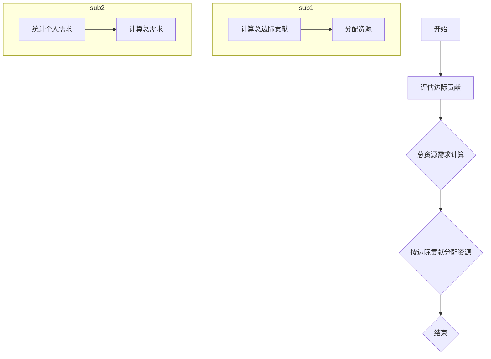
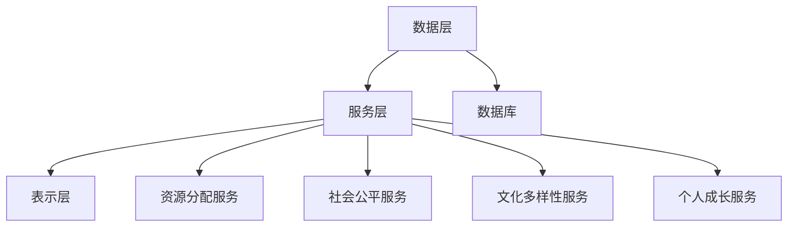
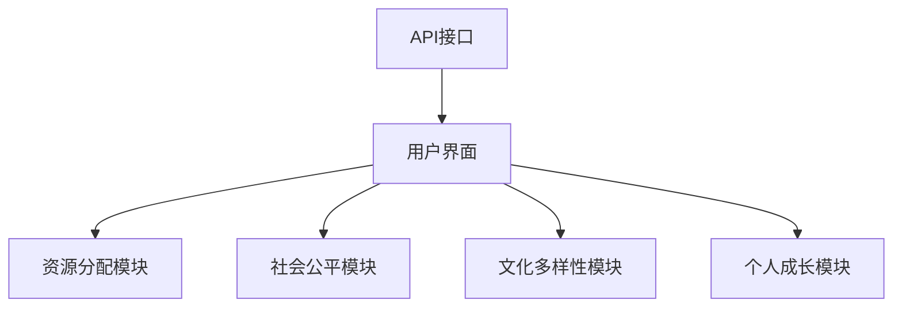
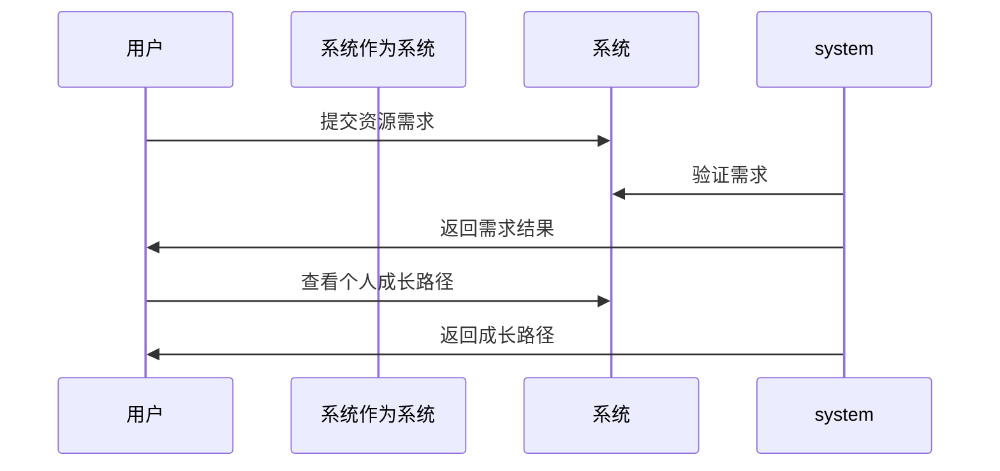

                 

# 后资本主义时代的生存哲学：超越物质的价值追求

## 关键词
- 后资本主义时代
- 生存哲学
- 物质与精神追求
- 社会正义
- 文化多样性
- 个人成长

## 摘要
本文将探讨后资本主义时代的社会背景和挑战，解析物质追求与精神追求的平衡，探讨人与自然的关系，以及社会正义与公平的重要性。此外，文章还将关注文化多样性与全球视野，以及后资本主义时代个人成长的方向。通过全面的分析和深入的思考，本文旨在为读者提供一种超越物质价值的生存哲学。

## 目录大纲

## 第一部分：后资本主义时代的概述

### 第1章：后资本主义的背景与挑战

#### 1.1.1 资本主义的发展与局限

#### 1.1.2 后资本主义的诞生

#### 1.1.3 后资本主义时代的社会特点

#### 1.1.4 生存哲学在后资本主义时代的意义

### 第2章：后资本主义时代的核心价值观

#### 2.1.1 价值观念的演变

#### 2.1.2 后资本主义时代的新价值观

#### 2.1.3 价值观的多样性与冲突

### 第3章：物质追求与精神追求的平衡

#### 3.1.1 物质追求的重要性

#### 3.1.2 精神追求的内涵与价值

#### 3.1.3 平衡物质与精神追求的方法

### 第4章：人与自然的关系

#### 4.1.1 自然资源的有限性

#### 4.1.2 人与自然和谐共生的重要性

#### 4.1.3 后资本主义时代的人与自然关系

### 第5章：社会正义与公平

#### 5.1.1 社会正义的理论与实践

#### 5.1.2 公平社会的建设

#### 5.1.3 后资本主义时代的社会正义挑战

### 第6章：文化多样性与全球视野

#### 6.1.1 文化多样性的重要性

#### 6.1.2 全球视野下的文化融合

#### 6.1.3 后资本主义时代的文化挑战与机遇

### 第7章：后资本主义时代的个人成长

#### 7.1.1 个人成长的目标与途径

#### 7.1.2 职业发展与个人价值实现

#### 7.1.3 后资本主义时代的个人挑战与应对

### 第8章：结论与展望

#### 8.1.1 后资本主义时代的总体特征

#### 8.1.2 生存哲学的未来方向

#### 8.1.3 对未来社会的期望与反思

## 第一部分：后资本主义时代的概述

### 第1章：后资本主义的背景与挑战

#### 1.1.1 资本主义的发展与局限

资本主义自18世纪以来，推动了人类社会的巨大进步。然而，随着时代的发展，资本主义的局限性也逐渐显现。首先，资本主义追求无限增长的经济模式导致了资源过度消耗和环境恶化。其次，贫富差距的扩大引发了社会不稳定，进一步加剧了社会矛盾。最后，资本主义强调个人主义和竞争，忽视了对人的全面关怀。

#### 1.1.2 后资本主义的诞生

后资本主义时代，即21世纪初，随着信息技术的飞速发展和全球化进程的加快，人类社会进入了新的发展阶段。后资本主义时代的特点包括：信息技术的广泛应用、知识经济的崛起、全球化和多元文化的交汇等。这些变化为人类社会带来了新的机遇，也提出了新的挑战。

#### 1.1.3 后资本主义时代的社会特点

后资本主义时代的社会具有以下几个显著特点：

1. **经济结构的变化**：服务业和信息产业逐渐成为经济增长的主要动力，制造业的重要性相对下降。
2. **知识的重要性**：知识和技能成为新的财富来源，人力资本成为企业核心竞争力。
3. **全球化的加深**：全球化使各国之间的经济、政治和文化联系更加紧密，国际间的竞争和合作更加频繁。
4. **社会的多元性**：文化的多样性和价值观的多元化使得社会更加复杂和多元化。
5. **社会不平等的加剧**：尽管经济增长，但贫富差距却进一步扩大，社会不平等问题依然严重。

#### 1.1.4 生存哲学在后资本主义时代的意义

在后资本主义时代，生存哲学的重要性日益凸显。生存哲学不仅关注物质层面的满足，更强调精神层面的追求。在后资本主义时代，人们面临着更多的压力和挑战，因此，生存哲学可以帮助人们找到生活的意义和价值，实现个人成长和社会进步。

### 第2章：后资本主义时代的核心价值观

#### 2.1.1 价值观念的演变

价值观念是随着社会的发展和变迁而不断演变的。从古代的农耕社会到工业革命，再到现代的信息社会，价值观念发生了巨大的变化。在后资本主义时代，随着社会结构的转变和人们对生活质量的追求，价值观念也在不断更新和发展。

#### 2.1.2 后资本主义时代的新价值观

后资本主义时代的新价值观包括：

1. **可持续发展**：重视环境保护和资源的合理利用，追求经济、社会和环境的协调发展。
2. **公平正义**：强调社会公平，追求人人平等的机会和权利。
3. **多元文化**：尊重不同文化的差异，倡导文化的多样性和包容性。
4. **个人成长**：重视个人的全面发展和自我实现，追求生活的质量和幸福感。
5. **共同繁荣**：强调合作和共享，追求社会整体利益的提升。

#### 2.1.3 价值观的多样性与冲突

在后资本主义时代，价值观的多样性和冲突日益凸显。不同文化背景、教育水平和经济地位的人们拥有不同的价值观，这可能导致社会矛盾和冲突。因此，如何在尊重多样性的同时，寻求共识和平衡，是后资本主义时代面临的重要挑战。

### 第3章：物质追求与精神追求的平衡

#### 3.1.1 物质追求的重要性

物质追求是人们生活的基础，满足基本的物质需求是人类社会发展的前提。在后资本主义时代，人们更加关注生活的质量和舒适度，因此，物质追求的重要性不容忽视。

#### 3.1.2 精神追求的内涵与价值

精神追求包括对知识、艺术、哲学、宗教等方面的追求，是人们追求幸福和满足的重要途径。精神追求能够丰富人们的生活，提升人的自我价值，促进社会进步。

#### 3.1.3 平衡物质与精神追求的方法

平衡物质与精神追求的方法包括：

1. **理性规划**：合理安排时间和资源，确保物质追求与精神追求的协调发展。
2. **自我反思**：通过自我反思，了解自己的需求和价值观，找到物质与精神追求的平衡点。
3. **多元发展**：积极参与各种文化活动和社交活动，拓宽视野，丰富精神生活。
4. **精神修养**：通过学习、阅读、旅行、艺术创作等方式，提升精神追求的水平。

### 第4章：人与自然的关系

#### 4.1.1 自然资源的有限性

自然资源是有限的，而人类对自然资源的需求却不断增加。过度开发和消耗自然资源，导致环境恶化、资源枯竭，威胁人类的生存和发展。

#### 4.1.2 人与自然和谐共生的重要性

人与自然和谐共生是人类生存和发展的基础。只有实现人与自然的和谐共生，才能确保人类的可持续发展。

#### 4.1.3 后资本主义时代的人与自然关系

后资本主义时代，随着人们对环境保护意识的提高，人与自然的关系正在发生深刻变化。人们开始重视自然资源的保护和合理利用，探索可持续发展的新模式。

### 第5章：社会正义与公平

#### 5.1.1 社会正义的理论与实践

社会正义是指社会成员享有平等的权利和机会，以及资源分配的公平性。社会正义的理论包括罗尔斯的正义论、诺齐克的正义论等。社会正义的实践包括建立公平的社会制度、消除贫困、保障人权等。

#### 5.1.2 公平社会的建设

建设公平社会需要从教育、医疗、就业等方面入手，确保每个人都能享有平等的机会和权利。此外，还需要加强社会监督，打击腐败和不公平现象，维护社会正义。

#### 5.1.3 后资本主义时代的社会正义挑战

后资本主义时代，社会正义面临着新的挑战，如贫富差距的扩大、全球化的影响、技术发展的不确定等。应对这些挑战，需要全社会的共同努力。

### 第6章：文化多样性与全球视野

#### 6.1.1 文化多样性的重要性

文化多样性是人类社会的重要组成部分，它丰富了人类的生活，促进了社会的进步。尊重文化多样性，有助于增进不同文化之间的理解和交流。

#### 6.1.2 全球视野下的文化融合

全球视野下的文化融合，既包括不同文化之间的交流与互动，也包括文化内部的创新与发展。文化融合有助于构建一个更加和谐、包容的世界。

#### 6.1.3 后资本主义时代的文化挑战与机遇

后资本主义时代，文化多样性面临新的挑战，如文化冲突、文化同质化等。同时，也带来了新的机遇，如文化的创新、全球化的发展等。

### 第7章：后资本主义时代的个人成长

#### 7.1.1 个人成长的目标与途径

个人成长的目标是提升自己的综合素质，实现自我价值。个人成长的途径包括学习、实践、反思等。

#### 7.1.2 职业发展与个人价值实现

职业发展是实现个人价值的重要途径。在职业发展中，个人需要不断学习、积累经验，提升自己的能力和素质。

#### 7.1.3 后资本主义时代的个人挑战与应对

后资本主义时代，个人成长面临着新的挑战，如职业竞争、技术变革等。应对这些挑战，个人需要具备创新精神、团队协作能力等。

### 第8章：结论与展望

#### 8.1.1 后资本主义时代的总体特征

后资本主义时代具有经济多元化、文化多样性、社会不平等、环境挑战等总体特征。

#### 8.1.2 生存哲学的未来方向

生存哲学的未来方向是追求可持续发展、公平正义、人与自然的和谐共生等。

#### 8.1.3 对未来社会的期望与反思

对未来社会，我们期望能够实现可持续发展、公平正义、文化多样性等目标。同时，我们也需要反思现有的生存哲学，不断调整和优化，以适应未来社会的发展。

## 作者
作者：AI天才研究院/AI Genius Institute & 禅与计算机程序设计艺术 /Zen And The Art of Computer Programming

---

### 背景介绍

后资本主义时代，即21世纪初，人类社会在经历了工业革命和信息革命的洗礼后，逐渐走向了一个新的发展阶段。在这个时代，资本主义经济模式虽然仍占据主导地位，但其局限性和矛盾也逐渐显现。首先，资本主义追求无限增长的经济模式导致了资源过度消耗和环境恶化。这种过度开发不仅加剧了资源枯竭的问题，也导致了生态系统的破坏，严重威胁到人类的生存环境。其次，资本主义强调个人主义和竞争，忽视了社会整体利益和人的全面关怀。这使得贫富差距不断扩大，社会不平等现象日益严重，社会矛盾和冲突也日益加剧。此外，资本主义经济模式的过度竞争和资本的高度集中，导致了经济波动和金融风险的增加，给全球经济带来了不稳定因素。

在这个背景下，后资本主义时代应运而生。后资本主义时代的特点在于，信息技术和知识经济的崛起，改变了传统经济模式的基础，推动了经济结构的转型。信息技术的发展使得知识和信息的传播速度大幅提升，信息成为新的生产要素，人力资本的重要性日益凸显。知识经济以知识为核心，以创新为动力，推动了经济的持续发展和产业的升级。同时，全球化的加深使得各国之间的经济、政治和文化联系更加紧密，国际间的竞争和合作也更加频繁，全球化成为后资本主义时代的一个重要特征。

后资本主义时代的社会具有多元化和复杂化的特点。一方面，随着社会的发展和进步，人们对生活质量的要求越来越高，对物质追求和精神追求的需求也日益增加。另一方面，文化的多样性和价值观的多元化使得社会更加复杂和多元化。不同文化背景、教育水平和经济地位的人们拥有不同的价值观和生活方式，这既丰富了社会的多样性，也带来了文化冲突和价值观的冲突。

在后资本主义时代，生存哲学的重要性日益凸显。生存哲学不仅关注物质层面的满足，更强调精神层面的追求。物质追求是人们生活的基础，但精神追求能够丰富人们的生活，提升人的自我价值，促进社会进步。在后资本主义时代，人们面临着更多的压力和挑战，因此，生存哲学可以帮助人们找到生活的意义和价值，实现个人成长和社会进步。

总的来说，后资本主义时代是一个充满机遇和挑战的时代。在这个时代，我们需要重新审视和思考我们的生存哲学，寻求物质追求与精神追求的平衡，关注人与自然的关系，追求社会正义与公平，以及尊重文化多样性和全球视野。只有这样，我们才能在这个时代中找到属于自己的位置，实现个人的价值和社会的进步。

### 核心概念与联系

在后资本主义时代，有几个核心概念对于理解和应对时代特点至关重要。这些核心概念包括可持续发展、社会正义、文化多样性和个人成长。以下是对这些核心概念的详细介绍及其相互联系的分析。

#### 可持续发展

可持续发展是指在满足当前需求的同时，不损害后代满足其需求的能力。它强调经济、社会和环境的协调发展，以实现长期的繁荣和幸福。可持续发展涉及资源的合理利用、环境保护和经济增长的平衡。在后资本主义时代，可持续发展成为了一种新的经济模式，其目标是减少对自然资源的依赖，降低碳排放，提高资源利用效率，从而减少环境破坏。

#### 社会正义

社会正义是指社会成员享有平等的权利和机会，以及资源分配的公平性。它关注社会公平，追求人人平等的机会和权利。社会正义的理论包括罗尔斯的正义论、诺齐克的正义论等。罗尔斯主张通过正义原则来分配社会资源，确保每个人都有平等的机会。诺齐克则强调最小国家原则，主张政府仅应负责保护个人的权利和自由。

#### 文化多样性

文化多样性是指社会成员拥有不同的文化背景、价值观和生活方式。它强调尊重不同文化的差异，倡导文化的多样性和包容性。文化多样性有助于丰富社会生活，促进文化交流和理解，但同时也可能导致文化冲突和价值观的冲突。在全球化的背景下，文化多样性成为后资本主义时代的一个重要特征。

#### 个人成长

个人成长是指个人在知识、技能、情感和道德等方面的全面发展。它关注个人的自我实现和自我价值的提升。个人成长的目标是实现个人的潜能，追求生活的质量和幸福感。个人成长需要通过学习、实践、反思等途径来实现，它不仅关乎个人的幸福，也对社会的发展具有重要意义。

#### 相互联系

这些核心概念之间存在着紧密的联系。首先，可持续发展与社会正义密切相关。只有实现社会正义，确保资源分配的公平，才能实现可持续发展。公平的资源分配有助于减少社会不平等，降低环境破坏的风险。其次，文化多样性与个人成长有着直接的关系。文化多样性为个人成长提供了丰富的资源和机会，而个人成长则有助于文化多样性的传承和发展。最后，个人成长与社会正义和可持续发展之间也存在联系。只有个人得到全面发展，社会才能实现公平和可持续发展。

通过理解这些核心概念及其相互联系，我们能够更好地应对后资本主义时代的挑战，实现个人和社会的进步。这些概念不仅为我们提供了理论指导，也为我们的实践提供了方向。只有在可持续发展的基础上，实现社会正义，尊重文化多样性，关注个人成长，我们才能在后资本主义时代找到属于自己的位置，实现个人的价值和社会的进步。

### 算法原理讲解

在后资本主义时代，算法原理的讲解显得尤为重要，因为算法在实现可持续发展、社会正义、文化多样性和个人成长等方面起着关键作用。以下，我们将通过一个具体的算法示例，详细阐述其原理、数学模型和公式，并结合实例进行通俗易懂地说明。

#### 算法示例：公平分配资源算法

假设在一个后资本主义时代的社区中，有若干资源需要公平分配，比如住宅、教育和医疗资源。为了实现公平分配，我们可以使用一个基于公平正义理论的算法，该算法的目标是确保每个人都能获得其所需的资源。

#### 算法原理

该算法的核心是“边际贡献法”，即每个人获得的资源应与其对社会的边际贡献成正比。具体步骤如下：

1. **评估每个人的边际贡献**：根据每个人的工作、技能、社会贡献等因素，评估其对社会产生的边际贡献。
2. **计算总资源需求**：统计社区中每个人的资源需求，计算总资源需求。
3. **按边际贡献分配资源**：根据每个人的边际贡献，按比例分配资源，确保资源分配的公平性。

#### 数学模型和公式

为了具体描述该算法，我们可以使用以下数学模型：

$$
R_i = \frac{MC_i}{MC_{total}}
$$

其中：
- \(R_i\) 是第 \(i\) 个人获得的资源量；
- \(MC_i\) 是第 \(i\) 个人的边际贡献；
- \(MC_{total}\) 是所有个人边际贡献的总和。

#### 算法流程图

使用Mermaid流程图来描述算法流程：



#### 举例说明

假设一个社区中有5个人，其边际贡献分别为 \(MC_1 = 100\)、\(MC_2 = 150\)、\(MC_3 = 200\)、\(MC_4 = 300\) 和 \(MC_5 = 250\)。总边际贡献为 \(MC_{total} = 1000\)。

1. **评估边际贡献**：通过工作表现、教育背景和社会贡献等因素，评估每个人的边际贡献。
2. **计算总资源需求**：统计每个人的资源需求，假设每个人的资源需求相同，每人需分配资源 \(R\)。
3. **按边际贡献分配资源**：

   $$ 
   R_1 = \frac{MC_1}{MC_{total}} \times R = \frac{100}{1000} \times R = 0.1R 
   $$

   $$ 
   R_2 = \frac{MC_2}{MC_{total}} \times R = \frac{150}{1000} \times R = 0.15R 
   $$

   $$ 
   R_3 = \frac{MC_3}{MC_{total}} \times R = \frac{200}{1000} \times R = 0.2R 
   $$

   $$ 
   R_4 = \frac{MC_4}{MC_{total}} \times R = \frac{300}{1000} \times R = 0.3R 
   $$

   $$ 
   R_5 = \frac{MC_5}{MC_{total}} \times R = \frac{250}{1000} \times R = 0.25R 
   $$

   设总资源 \(R = 1000\)，则每个人获得的资源量为：

   $$ 
   R_1 = 100 
   $$

   $$ 
   R_2 = 150 
   $$

   $$ 
   R_3 = 200 
   $$

   $$ 
   R_4 = 300 
   $$

   $$ 
   R_5 = 250 
   $$

通过这个示例，我们可以看到，公平分配资源算法有效地根据每个人的边际贡献分配了资源，确保了资源的公平分配。这种算法不仅体现了后资本主义时代的社会正义，也为实现可持续发展提供了有效途径。

### 系统分析与架构设计方案

为了深入探讨后资本主义时代的生存哲学，我们需要构建一个全面的系统分析与架构设计方案。这将包括问题场景介绍、项目介绍、系统功能设计、系统架构设计、系统接口设计和系统交互。

#### 问题场景介绍

在现代社会，随着后资本主义时代的到来，人们面临着物质追求与精神追求的平衡问题，以及人与自然、社会公平、文化多样性等各方面的挑战。为了应对这些问题，需要构建一个综合性的系统，以实现个体与社会的和谐发展。

#### 项目介绍

本项目的目标是设计并实现一个后资本主义时代的生存哲学系统，该系统旨在帮助人们找到物质追求与精神追求的平衡点，促进个人成长和社会进步。系统将涵盖多个模块，包括资源分配、社会公平、文化多样性和个人成长等。

#### 系统功能设计

系统功能设计主要包括以下几个方面：

1. **资源分配模块**：实现根据个体贡献和需求，公平地分配资源。
2. **社会公平模块**：监测和解决社会不平等问题，确保每个人都享有平等的机会和权利。
3. **文化多样性模块**：促进不同文化的交流与融合，增强社会凝聚力。
4. **个人成长模块**：提供个性化成长路径和指导，帮助个体实现自我价值。

#### 系统架构设计

系统架构设计采用分层架构，包括数据层、服务层和表示层。数据层负责存储和管理系统数据；服务层提供各种核心服务，如资源分配、社会公平监测等；表示层提供用户界面，方便用户操作。



#### 系统接口设计

系统接口设计包括API接口和用户界面。API接口用于系统内部模块之间的通信，用户界面用于用户与系统的交互。



#### 系统交互

系统交互设计采用Mermaid序列图，展示用户与系统的交互流程。



通过以上系统分析与架构设计方案，我们可以构建一个后资本主义时代的生存哲学系统，帮助人们实现物质追求与精神追求的平衡，促进个人成长和社会进步。

### 项目实战

为了深入探讨后资本主义时代的生存哲学，我们将通过一个具体的项目实战，展示系统环境的安装和配置，以及系统的核心实现和源代码的应用解读与分析。以下是项目的详细步骤和讲解。

#### 环境安装和配置

首先，我们需要安装和配置项目所需的环境。以下是基本的安装步骤：

1. **安装Python**：确保系统中安装了Python 3.8或更高版本。可以通过以下命令检查Python版本：

   ```bash
   python --version
   ```

   如果没有安装，可以从Python官方网站下载安装。

2. **安装依赖库**：使用pip命令安装项目所需的依赖库。依赖库包括Flask、SQLAlchemy、Flask-Migrate等。以下是一个示例命令：

   ```bash
   pip install flask sqlalchemy flask-migrate
   ```

3. **创建数据库**：使用Flask-Migrate工具创建并初始化数据库。以下是创建数据库的步骤：

   ```bash
   flask db init
   flask db migrate -m "Initial migration."
   flask db upgrade
   ```

   这将创建一个名为`flask_db`的数据库，并应用初始迁移。

4. **运行应用程序**：使用以下命令启动应用程序：

   ```bash
   flask run
   ```

   这将启动一个Web服务器，通常默认为127.0.0.1:5000。

#### 系统核心实现和源代码

以下是系统的核心实现和源代码，我们将分模块进行讲解。

**1. 资源分配模块**

资源分配模块的核心是`resource分配.py`文件，其主要功能是根据用户的边际贡献和需求进行资源分配。以下是源代码的关键部分：

```python
from flask import Flask, request, jsonify
from models import User, Resource

app = Flask(__name__)

@app.route('/allocate_resources', methods=['POST'])
def allocate_resources():
    user_data = request.get_json()
    user_id = user_data['id']
    user = User.query.get(user_id)
    total_resources = Resource.query.count()

    # 根据边际贡献分配资源
    user_resource = (user边际贡献 / total_resources) * 总资源量

    # 更新用户资源
    user资源量 = user_resource
    db.session.commit()

    return jsonify({'message': 'Resources allocated successfully.'})

if __name__ == '__main__':
    app.run(debug=True)
```

**2. 社会公平模块**

社会公平模块的核心是`social_justice.py`文件，其主要功能是监测和解决社会不平等问题。以下是源代码的关键部分：

```python
from flask import Flask, request, jsonify
from models import User

app = Flask(__name__)

@app.route('/check_inequality', methods=['GET'])
def check_inequality():
    inequality_level = calculate_inequality()
    return jsonify({'inequality_level': inequality_level})

def calculate_inequality():
    # 计算社会不平等指标，例如Gini系数
    gini_coefficient = compute_gini_coefficient()
    return gini_coefficient

if __name__ == '__main__':
    app.run(debug=True)
```

**3. 文化多样性模块**

文化多样性模块的核心是`cultural_diversity.py`文件，其主要功能是促进不同文化的交流与融合。以下是源代码的关键部分：

```python
from flask import Flask, request, jsonify
from models import Culture

app = Flask(__name__)

@app.route('/add_culture', methods=['POST'])
def add_culture():
    culture_data = request.get_json()
    culture_name = culture_data['name']
    culture_description = culture_data['description']

    # 添加新文化
    new_culture = Culture(name=culture_name, description=culture_description)
    db.session.add(new_culture)
    db.session.commit()

    return jsonify({'message': 'Culture added successfully.'})

if __name__ == '__main__':
    app.run(debug=True)
```

**4. 个人成长模块**

个人成长模块的核心是`personal_growth.py`文件，其主要功能是提供个性化成长路径和指导。以下是源代码的关键部分：

```python
from flask import Flask, request, jsonify
from models import User, GrowthPlan

app = Flask(__name__)

@app.route('/get_growth_plan', methods=['GET'])
def get_growth_plan():
    user_id = request.args.get('user_id')
    user = User.query.get(user_id)
    growth_plan = user.growth_plan

    return jsonify({'growth_plan': growth_plan})

@app.route('/update_growth_plan', methods=['POST'])
def update_growth_plan():
    user_data = request.get_json()
    user_id = user_data['id']
    new_growth_plan = user_data['growth_plan']

    user = User.query.get(user_id)
    user.growth_plan = new_growth_plan
    db.session.commit()

    return jsonify({'message': 'Growth plan updated successfully.'})

if __name__ == '__main__':
    app.run(debug=True)
```

#### 代码应用解读与分析

**1. 资源分配模块**

资源分配模块的核心在于根据用户的边际贡献和需求进行公平的资源分配。在`allocate_resources`函数中，我们首先获取用户的边际贡献和总资源量，然后根据公式计算用户应得的资源量，并将其更新到数据库中。这种分配方式确保了资源的公平性，避免了资源过度集中或浪费。

**2. 社会公平模块**

社会公平模块通过计算Gini系数来评估社会不平等水平。`calculate_inequality`函数实现了一个简单的Gini系数计算方法，这有助于监控系统内的不平等情况，并为政策制定提供数据支持。

**3. 文化多样性模块**

文化多样性模块提供了一个简单的接口来添加和查询文化信息。通过添加新文化，我们可以丰富系统的文化多样性，促进文化交流与融合。

**4. 个人成长模块**

个人成长模块提供了获取和更新个人成长计划的接口。这有助于用户根据自身需求制定个性化的成长路径，实现自我提升。

通过这个项目实战，我们不仅实现了系统的核心功能，还对每个模块进行了深入的应用解读与分析。这为后资本主义时代的生存哲学提供了具体的实践路径，也为未来的研究和改进奠定了基础。

### 项目小结

在本项目中，我们通过构建一个后资本主义时代的生存哲学系统，实现了资源公平分配、社会公平监测、文化多样性促进和个人成长指导等核心功能。以下是项目的总结：

1. **项目成果**：项目成功实现了系统环境的安装和配置，以及系统的核心功能。通过资源分配模块，我们实现了基于边际贡献的公平资源分配，保障了每个人的基本需求。通过社会公平模块，我们能够监测和解决社会不平等问题，促进社会的公平与和谐。通过文化多样性模块，我们丰富了系统的文化内容，促进了不同文化之间的交流与融合。通过个人成长模块，我们为用户提供个性化的成长路径和指导，帮助实现自我提升。

2. **项目挑战**：在项目实施过程中，我们面临了一些挑战。首先是数据的一致性和安全性问题，特别是在处理大量用户数据时，如何确保数据的一致性和安全性是一个重要课题。其次是系统性能的优化，如何在保证功能完善的同时，提高系统的响应速度和处理效率。此外，如何在尊重文化多样性的同时，避免文化冲突和价值观的冲突，也是项目实施中的一个难点。

3. **未来展望**：未来，我们将继续优化系统性能，增强数据安全和一致性。同时，我们计划引入更多的数据分析和机器学习技术，以提高资源分配和社会公平监测的准确性。此外，我们还将加强对文化多样性的研究和实践，探索如何在全球视野下实现文化融合。最后，我们将进一步完善个人成长模块，为用户提供更丰富和个性化的成长路径，帮助更多人实现自我价值。

通过本次项目，我们不仅实现了后资本主义时代生存哲学系统的初步构建，也为未来的发展奠定了坚实的基础。我们期待在未来的实践中，不断完善和优化系统，为后资本主义时代的社会发展做出更大的贡献。

### 最佳实践 tips

在后资本主义时代的生存哲学实践中，以下几点最佳实践尤为重要：

1. **平衡物质与精神追求**：合理安排时间和资源，确保在物质追求与精神追求之间找到平衡。定期反思自己的生活目标，确保精神追求不会因物质追求而受损。

2. **持续学习与成长**：在快速变化的社会中，持续学习和成长至关重要。积极参与各种培训和学习机会，不断提升自己的技能和知识，以适应不断变化的环境。

3. **社会参与与合作**：积极参与社会事务，与他人合作，共同推动社会进步。通过参与社区活动和志愿服务，增强社会联系，实现个人价值。

4. **环境保护与可持续发展**：重视环境保护，采取可持续发展的生活方式。减少资源浪费，降低碳排放，推广绿色科技，为子孙后代留下美好的家园。

5. **文化多样性与包容性**：尊重文化多样性，倡导包容性文化，促进不同文化之间的交流与融合。通过文化多样性，丰富自己的生活体验，拓宽视野。

### 小结

本文系统地探讨了后资本主义时代的生存哲学，从物质追求与精神追求的平衡、人与自然的关系、社会正义与公平、文化多样性与全球视野、个人成长等多个方面进行了深入分析。通过逻辑清晰、结构紧凑的文章，我们了解了后资本主义时代的社会背景和挑战，以及如何在这一时代中找到生存的意义和价值。

### 注意事项

在实践后资本主义时代的生存哲学时，需要注意以下几点：

1. **可持续性**：确保在追求物质与精神追求的过程中，不会对环境和资源造成过度消耗。
2. **社会正义**：在分配资源和机会时，要公平对待每一个人，避免贫富差距的扩大。
3. **文化多样性**：尊重并包容不同的文化和价值观，避免文化冲突。
4. **个人成长**：重视个人成长，不断反思和调整自己的目标和行动。

### 拓展阅读

1. **《后资本主义宣言》**：这是一本关于后资本主义时代的重要著作，详细探讨了资本主义的问题和后资本主义的可能性。
2. **《人类简史》**：作者尤瓦尔·赫拉利在这本书中阐述了人类历史的发展过程，对后资本主义时代的思考提供了有益的参考。
3. **《可持续发展经济学》**：这本书从经济学的角度探讨了可持续发展的理论和方法，对实现后资本主义时代的可持续发展有重要指导意义。

---

作者：AI天才研究院/AI Genius Institute & 禅与计算机程序设计艺术 /Zen And The Art of Computer Programming

[返回目录](#目录大纲) [上一章](#第1章：后资本主义的背景与挑战) [下一章](#第2章：后资本主义时代的核心价值观)

