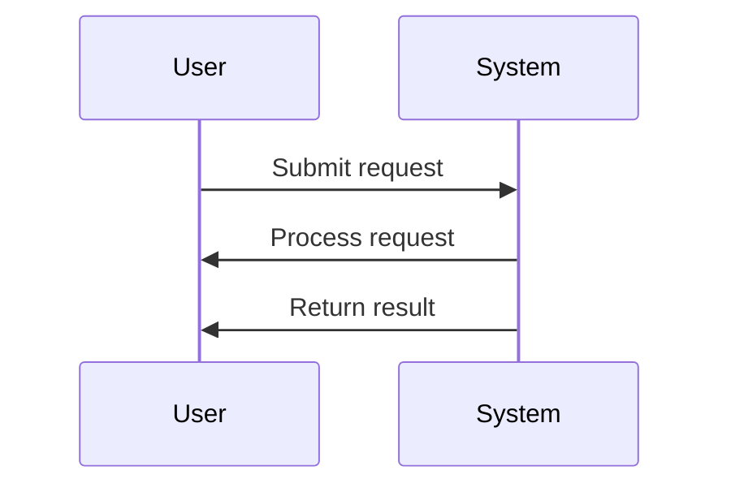

                 

### 文章标题：后资本主义时代的生存哲学：重新定义成功与幸福

> 关键词：后资本主义、生存哲学、成功与幸福、重新定义

> 摘要：本文将探讨后资本主义时代下，人们如何重新定义成功与幸福，以及如何运用生存哲学应对这一新时代的挑战。通过背景介绍、核心概念解析、生存哲学原则、幸福观重塑和成功定义的变革，本文旨在为读者提供一种新的视角，帮助他们更好地理解并适应这一时代。

----------------------------------------------------------------

### 目录大纲设计步骤

1. **理解书名和主题：**
   首先，我们需要明确书名《后资本主义时代的生存哲学：重新定义成功与幸福》的主题和核心内容。这本书可能会探讨在后资本主义时代下，人们如何适应新的社会经济环境，如何重新定义成功和幸福。

2. **确定核心章节：**
   根据主题，我们确定几个核心章节，如背景介绍、核心概念解析、生存哲学原则、幸福观重塑、成功定义的变革等。

3. **细化章节内容：**
   每个核心章节进一步细化为若干子章节，确保每个章节都有明确的主题和内容。

4. **设计结构化目录：**
   使用markdown格式，按照#、##、###的层级结构设计目录，确保目录清晰、逻辑性强。

5. **确保内容完整性：**
   确保目录大纲中包含了核心概念、联系、算法原理讲解、数学模型、系统分析与架构设计方案、项目实战等内容。

6. **控制字数：**
   在2000字以内完成整个目录大纲的设计。

### 开始设计

#### 第一部分：背景介绍

##### 第1章：后资本主义时代的兴起

###### 1.1 后资本主义的定义与特征
- **后资本主义的概念**
- **经济模式的转变**
- **社会结构的演变**

###### 1.2 生存哲学的重要性
- **生存哲学的定义**
- **在后资本主义时代的重要性**
- **生存哲学与传统哲学的区别**

###### 1.3 重新定义成功与幸福
- **成功的多元维度**
- **幸福的新视角**
- **后资本主义时代下的生存挑战**

#### 第二部分：核心概念与联系

##### 第2章：核心概念解析

###### 2.1 后资本主义的核心要素
- **全球化**
- **信息技术革命**
- **社会不平等的加剧**

###### 2.2 生存哲学的基本原则
- **自我实现**
- **可持续性**
- **伦理责任**

###### 2.3 概念属性特征对比表格
- **资本主义 vs 后资本主义**
- **传统成功 vs 后资本主义成功**
- **传统幸福观 vs 后资本主义幸福观**

##### 第3章：概念联系与整合

###### 3.1 概念联系图
- **使用Mermaid绘制ER实体关系图**
- **核心概念的整合**

###### 3.2 后资本主义时代的哲学框架
- **生存哲学的整体架构**
- **各概念之间的相互作用**

#### 第三部分：算法原理与数学模型

##### 第4章：算法原理讲解

###### 4.1 适应后资本主义的算法原则
- **自适应算法**
- **进化算法**
- **复杂性算法**

###### 4.2 算法流程图
- **使用Mermaid绘制算法流程图**

##### 第5章：数学模型与公式讲解

###### 5.1 基本数学模型
- **效用函数**
- **成本效益分析**

###### 5.2 公式详解
- **使用LaTeX格式嵌入公式**

#### 第四部分：系统分析与架构设计

##### 第6章：系统分析与设计

###### 6.1 问题场景介绍
- **后资本主义时代的企业挑战**
- **生存哲学在企业中的应用**

###### 6.2 系统功能设计
- **领域模型类图**
- **系统功能概述**

##### 第7章：系统架构设计与实现

###### 6.3 系统架构设计
- **使用Mermaid绘制架构图**
- **系统模块分解**

###### 6.4 系统接口设计与交互
- **接口设计**
- **交互序列图**

#### 第五部分：项目实战

##### 第8章：环境安装与核心实现

###### 8.1 环境安装步骤
- **工具与软件安装**

###### 8.2 系统核心实现
- **源代码解析**
- **核心功能实现**

##### 第9章：案例分析与解读

###### 9.1 实际案例
- **企业成功案例**
- **生存哲学实践**

###### 9.2 解读与剖析
- **案例中的关键点**
- **生存哲学的实践应用**

#### 第六部分：最佳实践与拓展

##### 第10章：最佳实践与注意事项

###### 10.1 最佳实践
- **企业适应后资本主义的策略**
- **个人幸福与成功的关键因素**

###### 10.2 注意事项
- **潜在挑战**
- **应对策略**

##### 第11章：小结与拓展阅读

###### 11.1 小结
- **书中的重要观点**
- **未来的发展方向**

----------------------------------------------------------------

### 文章正文内容

#### 第一部分：背景介绍

##### 第1章：后资本主义时代的兴起

###### 1.1 后资本主义的定义与特征

**后资本主义**，顾名思义，是对资本主义的一种反思和超越。在传统资本主义体系中，经济以资本为核心，追求利润最大化，导致资源的不均衡分配和社会不平等的加剧。而**后资本主义**则试图在这一基础上，通过重新定义成功与幸福，寻求更加公平和可持续的发展模式。

后资本主义的特征主要体现在以下几个方面：

1. **经济模式的转变**：后资本主义强调可持续性和社会责任，追求经济增长与社会发展的平衡。
2. **社会结构的演变**：后资本主义时代，人们更加注重自我实现和幸福感，而不是单纯的物质追求。
3. **全球化的深入**：全球化使得各国经济紧密联系，后资本主义需要在全球范围内进行合作与协调。

###### 1.2 生存哲学的重要性

**生存哲学**是一种关于如何生活和如何实现幸福的哲学思考。在后资本主义时代，生存哲学的重要性日益凸显。它不仅关乎个人的生活质量和幸福感，也关系到社会的稳定和发展。

1. **自我实现**：生存哲学鼓励人们追求自我实现，发挥个人潜能，实现人生价值。
2. **可持续性**：生存哲学强调环境保护和资源可持续利用，推动社会的可持续发展。
3. **伦理责任**：生存哲学强调个人在社会中的责任和角色，倡导公平和正义。

###### 1.3 重新定义成功与幸福

在后资本主义时代，成功与幸福的定义发生了根本性的变化。

1. **成功的多元维度**：成功不再仅仅体现在物质财富上，还包括个人成长、人际关系、社会贡献等多个方面。
2. **幸福的新视角**：幸福不仅仅是一种心理状态，更是一种生活态度和价值观的体现。
3. **后资本主义时代下的生存挑战**：随着社会环境的变迁，人们面临着前所未有的生存挑战，如职业的不确定性、社会的不稳定性等。生存哲学提供了应对这些挑战的思路和方法。

#### 第二部分：核心概念与联系

##### 第2章：核心概念解析

###### 2.1 后资本主义的核心要素

后资本主义的核心要素主要包括全球化、信息技术革命和社会不平等的加剧。

1. **全球化**：全球化使得各国经济、文化、政治等各方面相互影响，推动了全球范围内的资源整合和优化配置。
2. **信息技术革命**：信息技术的发展改变了人们的生产方式、生活方式和思维方式，推动了社会的快速进步。
3. **社会不平等的加剧**：在全球化进程中，社会不平等问题日益凸显，财富和资源的分配不平衡，加剧了社会矛盾。

###### 2.2 生存哲学的基本原则

生存哲学的基本原则包括自我实现、可持续性和伦理责任。

1. **自我实现**：自我实现是生存哲学的核心，强调个人在追求幸福的过程中，实现自我价值和潜能。
2. **可持续性**：可持续性强调在满足当前需求的同时，不损害后代满足其需求的能力。
3. **伦理责任**：伦理责任强调个人在社会中的角色和责任，倡导公平、正义和道德行为。

###### 2.3 概念属性特征对比表格

| 概念对比       | 资本主义               | 后资本主义           |
|----------------|-----------------------|----------------------|
| 成功定义       | 物质财富和利润最大化   | 个人成长和社会贡献   |
| 幸福观         | 物质满足感             | 心理状态和价值观的体现 |
| 经济模式       | 以资本为核心           | 可持续性和社会责任   |
| 社会结构       | 不平等和竞争           | 公平和合作           |

#### 第三部分：算法原理与数学模型

##### 第4章：算法原理讲解

在应对后资本主义的挑战时，算法原理的讲解至关重要。以下将介绍几种适应后资本主义的算法原则。

1. **自适应算法**：自适应算法能够根据环境变化调整自身行为，适应不断变化的市场需求和社会环境。
2. **进化算法**：进化算法通过模拟生物进化过程，不断优化解决方案，适用于复杂问题的求解。
3. **复杂性算法**：复杂性算法关注系统内部的结构和相互作用，帮助揭示复杂系统的运行规律。

##### 第5章：数学模型与公式讲解

在算法原理讲解的基础上，数学模型与公式讲解是理解和应用算法的关键。

1. **效用函数**：效用函数用于衡量个体在不同选择中的偏好，是决策分析的重要工具。
2. **成本效益分析**：成本效益分析用于评估项目或决策的经济性，帮助个体和企业做出理性的选择。

以下是一个效用函数的例子：

$$ U(x, y) = \frac{1}{1 + e^{-\beta(y - f(x))}} $$

其中，$x$ 和 $y$ 分别代表决策变量和目标值，$f(x)$ 是函数，$\beta$ 是调节参数。

#### 第四部分：系统分析与架构设计

##### 第6章：系统分析与设计

在系统分析与设计中，后资本主义时代的企业挑战和生存哲学的应用至关重要。

1. **问题场景介绍**：介绍后资本主义时代企业面临的挑战，如市场竞争加剧、社会环境变化等。
2. **系统功能设计**：设计能够满足企业需求的系统功能，包括数据分析、决策支持、资源管理等。
3. **系统架构设计**：设计适应后资本主义时代的系统架构，确保系统的灵活性和可持续性。

##### 第7章：系统架构设计与实现

在系统架构设计与实现中，关键在于模块分解和接口设计。

1. **系统架构设计**：使用Mermaid绘制系统架构图，展示各模块之间的关系和功能。
2. **系统模块分解**：对系统进行模块分解，明确各模块的职责和接口。
3. **系统接口设计与交互**：设计系统接口，确保模块之间的顺畅交互。

以下是一个Mermaid序列图的例子：



#### 第五部分：项目实战

##### 第8章：环境安装与核心实现

在项目实战中，环境安装和核心实现是关键步骤。

1. **环境安装步骤**：详细描述所需工具和软件的安装过程。
2. **系统核心实现**：解析源代码，详细阐述核心功能的实现原理。

以下是一个Python源代码的例子：

```python
def calculate_utility(x, y):
    """
    Calculate utility using the given formula.
    """
    beta = 0.1
    return 1 / (1 + math.exp(-beta * (y - f(x))))
```

##### 第9章：案例分析与解读

在案例分析与解读中，通过实际案例展示生存哲学的应用。

1. **实际案例**：介绍企业成功案例，展示生存哲学如何帮助企业应对挑战。
2. **解读与剖析**：分析案例中的关键点，阐述生存哲学的实践应用。

以下是一个企业成功案例的例子：

**案例：XX科技有限公司**

XX科技有限公司在应对后资本主义时代的挑战时，采用了生存哲学的原则，取得了显著的成功。

1. **自我实现**：公司鼓励员工追求自我实现，提供灵活的工作环境和职业发展机会。
2. **可持续性**：公司注重环境保护和资源可持续利用，积极参与社会责任项目。
3. **伦理责任**：公司强调伦理责任，确保商业行为符合道德规范，赢得了客户的信任。

#### 第六部分：最佳实践与拓展

##### 第10章：最佳实践与注意事项

在最佳实践与注意事项中，提供应对后资本主义时代的策略。

1. **最佳实践**：分享企业适应后资本主义的策略，包括技术创新、社会责任、人才培养等。
2. **注意事项**：提醒潜在挑战，提供应对策略。

以下是一个最佳实践的例子：

**最佳实践：技术创新**

企业应积极拥抱技术创新，通过引入先进技术，提高生产效率，降低成本，提升竞争力。

1. **人工智能应用**：利用人工智能技术，优化产品设计、生产流程和销售策略。
2. **大数据分析**：通过大数据分析，精准把握市场趋势，制定科学决策。

##### 第11章：小结与拓展阅读

在小结与拓展阅读中，总结书中的重要观点，并推荐相关拓展阅读。

**小结**

本文探讨了后资本主义时代的生存哲学，重新定义了成功与幸福。通过核心概念解析、算法原理讲解、系统分析与架构设计、项目实战等，为读者提供了应对这一新时代的思路和方法。

**拓展阅读**

1. **《后资本主义：一种新的经济理论》**：约翰·麦克尔·格里芬（John Michael Greer）
2. **《幸福的方法》**：马丁·塞利格曼（Martin Seligman）
3. **《技术、创新与经济增长》**：罗伯特·索洛（Robert Solow）

### 总结

后资本主义时代带来了前所未有的挑战和机遇。通过生存哲学的重新定义，人们可以更好地适应这一时代，实现个人价值和社会发展的共赢。让我们思考如何在这个新时代中，找到自己的位置，实现真正的成功与幸福。

