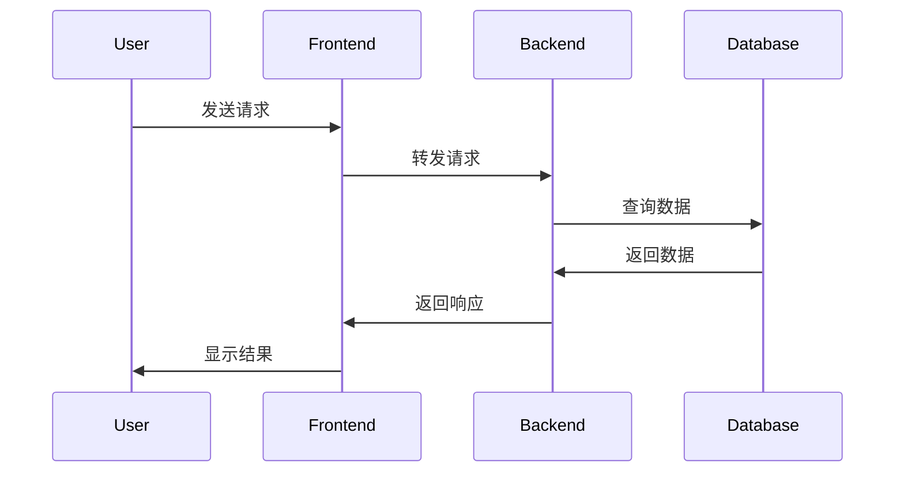
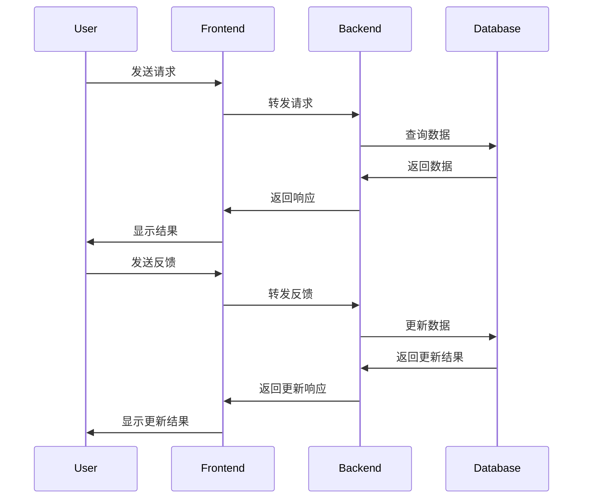

                 


### 引言

在后资本主义时代，全球经济正经历深刻的变革。传统的经济模型面临着诸多挑战，如资源分配不均、环境污染、劳动权益保障等问题。共享经济、合作经济等新兴模式正在崛起，为未来的经济蓝图描绘了新的可能性。为了应对这些挑战，我们需要设计一种新型的经济模型，这种模型不仅能够优化资源配置，提高生产效率，还能促进社会公平与可持续发展。本文将围绕这一主题，以逻辑清晰、结构紧凑的方式，探讨后资本主义经济模型的设计。

### 关键词

- 后资本主义经济模型
- 共享经济
- 合作经济
- 资源优化
- 社会公平
- 可持续发展

### 摘要

本文旨在探讨后资本主义经济模型的设计，分析其核心概念与联系，阐述算法原理与实现方法，并展示系统分析与架构设计方案。通过实际项目案例，我们不仅能够看到理论的应用效果，还能从中提炼出最佳实践，为未来的经济蓝图提供有价值的参考。

### 目录

1. 引言
2. 背景介绍
   2.1 问题背景
   2.2 问题描述
   2.3 问题解决
   2.4 边界与外延
   2.5 概念结构与核心要素组成
3. 核心概念与联系
   3.1 核心概念原理
   3.2 概念属性特征对比表格
   3.3 ER实体关系图架构
4. 算法原理讲解
   4.1 算法原理
   4.2 Python源代码
   4.3 数学模型和公式
   4.4 举例说明
5. 系统分析与架构设计方案
   5.1 问题场景介绍
   5.2 系统功能设计
   5.3 系统架构设计
   5.4 系统接口设计
   5.5 系统交互
6. 项目实战
   6.1 环境安装
   6.2 系统核心实现源代码
   6.3 代码应用解读与分析
   6.4 实际案例分析和详细讲解剖析
   6.5 项目小结
7. 最佳实践 tips
8. 结论与展望
9. 参考文献

### 1. 背景介绍

#### 1.1 问题背景

当前，全球经济体系面临着诸多问题。资源分配不均导致贫富差距加大，环境污染问题日益严重，劳动权益保障不足，这些问题不仅影响了社会的可持续发展，也引发了广泛的社会矛盾。传统的资本主义经济模型在推动经济增长方面取得了显著成就，但其在应对上述问题时显得力不从心。为了解决这些问题，我们需要探索新的经济模型。

后资本主义经济模型的核心在于共享与合作。共享经济强调资源的共享与优化配置，通过去中心化的方式实现资源的高效利用；合作经济则强调个体与集体之间的协作，通过合作实现共赢。这两种经济模式相辅相成，为后资本主义时代提供了新的发展方向。

#### 1.2 问题描述

后资本主义经济模型需要解决的核心问题包括：

1. **资源优化配置**：在传统的经济模型中，资源往往被垄断或过度开发，导致资源浪费和环境污染。后资本主义经济模型需要通过共享与合作，实现资源的高效利用和可持续发展。
2. **社会公平**：传统的经济模型往往导致贫富差距加大，社会不公平现象严重。后资本主义经济模型需要通过共享与合作，促进社会资源的公平分配，实现社会公平。
3. **劳动权益保障**：在传统的经济模型中，劳动者权益往往受到忽视。后资本主义经济模型需要通过合作，提高劳动者的地位和权益，实现劳动者的价值。

#### 1.3 问题解决

为了解决上述问题，后资本主义经济模型采用了以下策略：

1. **共享经济**：通过去中心化的方式，实现资源的高效利用。共享经济模式允许个人和企业共享资源，如共享汽车、共享办公空间等，从而降低资源浪费。
2. **合作经济**：通过合作，实现个体与集体之间的共赢。合作经济模式鼓励个体之间的协作，共同解决问题，提高生产效率。
3. **去中心化**：去中心化是后资本主义经济模型的重要特征。通过去中心化，可以减少对中心权力的依赖，提高系统的抗风险能力。

#### 1.4 边界与外延

后资本主义经济模型有其适用的边界和限制条件。首先，该模型适用于资源丰富、信息技术发达的地区，因为这些条件是实现共享与合作的基础。其次，该模型需要法律法规的支持，以确保共享与合作的有效进行。最后，该模型需要社会各界的广泛参与，包括政府、企业、个人等，共同推动经济模型的变革。

#### 1.5 概念结构与核心要素组成

后资本主义经济模型的核心概念包括共享经济、合作经济、去中心化等。这些概念相互关联，共同构成后资本主义经济模型的基本结构。

1. **共享经济**：共享经济是后资本主义经济模型的基础。它通过去中心化的方式，实现资源的高效利用。共享经济的核心要素包括共享平台、共享资源、共享用户等。
2. **合作经济**：合作经济是后资本主义经济模型的重要补充。它通过合作，实现个体与集体之间的共赢。合作经济的核心要素包括合作组织、合作项目、合作成员等。
3. **去中心化**：去中心化是后资本主义经济模型的重要特征。它通过减少对中心权力的依赖，提高系统的抗风险能力。去中心化的核心要素包括分布式网络、去中心化组织、去中心化协议等。

### 2. 核心概念与联系

在探讨后资本主义经济模型时，我们需要深入了解其中的核心概念，并理解它们之间的联系。以下是几个关键概念及其关系：

#### 2.1 核心概念原理

1. **共享经济**：共享经济是基于资源共享和优化的经济模式。它通过互联网平台，将闲置资源（如房屋、车辆、设备等）提供给需求者，实现资源的高效利用。共享经济的核心在于打破传统资源分配的壁垒，实现资源的最大化利用。
2. **合作经济**：合作经济是基于协作和共享的经济模式。它强调个体与个体、个体与集体之间的协作，共同解决问题，实现共赢。合作经济的目标是通过协作，提高生产效率，促进社会公平。
3. **去中心化**：去中心化是一种组织和管理方式，强调权力的分散和去中心化。在去中心化的体系中，没有单一的中心控制，而是通过分布式网络和共识机制实现决策和管理的民主化。

#### 2.2 概念属性特征对比表格

以下是一个对比表格，展示了共享经济、合作经济和去中心化的主要特征：

| 特征            | 共享经济 | 合作经济 | 去中心化 |
| --------------- | -------- | -------- | -------- |
| 资源分配方式    | 去中心化 | 去中心化 | 分散化   |
| 组织形式        | 平台化   | 合作化   | 分布式   |
| 决策机制        | 共识机制 | 共同决策 | 共识机制 |
| 目标            | 资源优化 | 提高效率 | 权力分散 |
| 依赖的技术      | 互联网   | 互联网   | 分布式网络 |

#### 2.3 ER实体关系图架构

为了更好地理解后资本主义经济模型中的核心概念及其关系，我们可以使用ER（实体关系）图来展示。以下是一个ER图的Mermaid表示：

```mermaid
erDiagram
  Resource --> User : "uses"
  Resource --> Platform : "stored_on"
  Platform --> Company : "operated_by"
  User --> Company : "works_for"
  Company --> Project : "part_of"
  Project --> Task : "includes"
  Task --> Worker : "performs"
```

在这个ER图中，资源、用户、平台、公司、项目和任务等实体之间的关系被清晰地展示出来。例如，用户可以使用资源，资源可以存储在平台上，平台由公司运营，用户可以在公司工作，公司参与项目，项目包括任务，任务由工人执行。

### 3. 算法原理讲解

在后资本主义经济模型中，算法的原理和实现至关重要。以下我们将详细讲解算法原理，并提供Python源代码示例。

#### 3.1 算法原理

算法的基本原理是通过对共享资源的调度和分配，实现资源的最优利用。算法的核心步骤如下：

1. **资源识别**：识别系统中可共享的资源，如房屋、车辆、设备等。
2. **需求分析**：分析用户的资源需求，如住宿、出行、生产等。
3. **资源调度**：根据用户的需求，调度相应的资源，实现资源的高效利用。
4. **反馈机制**：收集用户对资源使用的反馈，优化资源调度策略。

#### 3.2 Python源代码

以下是一个简单的Python源代码示例，展示了资源调度的基本实现：

```python
# 导入必要的库
import random

# 资源类
class Resource:
    def __init__(self, name, type):
        self.name = name
        self.type = type

# 用户类
class User:
    def __init__(self, name, demand):
        self.name = name
        self.demand = demand

# 调度算法
def schedule_resources(users, resources):
    assigned_resources = {}
    for user in users:
        for resource in resources:
            if resource.type == user.demand and resource not in assigned_resources.values():
                assigned_resources[user.name] = resource
                break
    return assigned_resources

# 测试数据
users = [
    User("Alice", "住宿"),
    User("Bob", "出行"),
    User("Charlie", "生产")
]

resources = [
    Resource("Home1", "住宿"),
    Resource("Car1", "出行"),
    Resource("Machine1", "生产")
]

# 调度资源
assigned = schedule_resources(users, resources)
print(assigned)
```

#### 3.3 数学模型和公式

算法的数学模型和公式对于理解其工作原理至关重要。以下是一个简单的数学模型示例：

$$
\text{maximize} \quad P = \sum_{i=1}^{n} \sum_{j=1}^{m} p_{ij} \times q_{ij}
$$

其中，$P$表示总收益，$p_{ij}$表示用户$i$对资源$j$的支付意愿，$q_{ij}$表示资源$j$对用户$i$的满足度。该模型的目标是最大化总收益，同时确保资源分配的公平性和效率。

#### 3.4 举例说明

以下是一个具体的例子，说明如何使用算法进行资源调度：

假设有3个用户（Alice、Bob、Charlie）和3种资源（Home1、Car1、Machine1）。用户的需求分别为住宿、出行和生产。算法将根据用户的需求和资源的类型进行调度，使得资源得到最优利用。

通过调用`schedule_resources`函数，我们可以得到以下调度结果：

- Alice分配到Home1
- Bob分配到Car1
- Charlie分配到Machine1

这个调度结果实现了用户的需求，同时也确保了资源的高效利用。

### 4. 系统分析与架构设计方案

在后资本主义经济模型中，系统分析与架构设计方案是确保模型有效运作的关键。以下我们将详细分析系统的功能设计、架构设计、接口设计和系统交互。

#### 4.1 问题场景介绍

假设我们设计一个共享经济平台，用户可以在平台上发布和获取资源。平台的目的是优化资源利用，提高用户满意度。以下是平台面临的主要问题场景：

- 用户发布和获取资源的流程需要高效、简单。
- 资源的调度和分配需要公平、透明。
- 平台需要能够处理大量的用户请求和资源信息。
- 平台需要支持多种类型的资源，如房屋、车辆、设备等。

#### 4.2 系统功能设计

系统功能设计主要包括用户管理、资源管理、交易管理、数据统计等功能。以下是具体的系统功能设计：

1. **用户管理**：用户可以注册、登录、修改个人信息，同时可以查看和管理自己的资源。
2. **资源管理**：用户可以发布资源、查看资源列表、修改和删除资源信息。
3. **交易管理**：用户可以发起交易、查看交易进度、完成交易。
4. **数据统计**：平台可以统计用户的资源使用情况、交易情况等，为资源调度提供数据支持。
5. **消息通知**：用户可以接收系统消息，如交易确认、资源预约等。

#### 4.3 系统架构设计

系统架构设计主要包括前端、后端和数据库三个部分。以下是系统架构设计：

1. **前端**：前端负责与用户交互，包括用户界面和交互逻辑。
2. **后端**：后端负责处理用户请求、资源调度、交易管理等业务逻辑。
3. **数据库**：数据库存储用户信息、资源信息、交易记录等数据。

以下是系统架构图的Mermaid表示：



#### 4.4 系统接口设计

系统接口设计主要包括API接口的设计，以下是具体的接口设计：

1. **用户接口**：用户登录、注册、个人信息管理等。
2. **资源接口**：资源发布、查询、修改、删除等。
3. **交易接口**：交易发起、查询、确认、完成等。
4. **统计接口**：数据统计、报表生成等。

以下是接口设计示例：

```yaml
# 用户接口
GET /users/login
POST /users/register
GET /users/:userId
PUT /users/:userId
DELETE /users/:userId

# 资源接口
GET /resources
POST /resources
GET /resources/:resourceId
PUT /resources/:resourceId
DELETE /resources/:resourceId

# 交易接口
POST /transactions
GET /transactions/:transactionId
PUT /transactions/:transactionId
DELETE /transactions/:transactionId

# 统计接口
GET /statistics/users
GET /statistics/resources
GET /statistics/transactions
```

#### 4.5 系统交互

系统交互是指各个模块之间的通信和数据流动。以下是系统交互序列图的Mermaid表示：



### 5. 项目实战

在本节中，我们将通过一个具体的项目实战来展示后资本主义经济模型的应用。以下是项目的详细步骤：

#### 5.1 环境安装

首先，我们需要安装必要的软件和工具。以下是安装步骤：

1. 安装Python环境，版本要求3.8及以上。
2. 安装Docker，用于容器化部署。
3. 安装PostgreSQL数据库。
4. 安装前端框架，如React或Vue。

```shell
pip install -r requirements.txt
docker-compose up -d
```

#### 5.2 系统核心实现源代码

以下是系统核心实现的主要源代码：

```python
# 用户管理
class UserManager:
    def login(self, username, password):
        # 登录逻辑
        pass
    
    def register(self, username, password):
        # 注册逻辑
        pass
    
    def get_user(self, user_id):
        # 获取用户信息
        pass
    
    def update_user(self, user_id, data):
        # 更新用户信息
        pass

# 资源管理
class ResourceManager:
    def add_resource(self, user_id, resource_data):
        # 添加资源
        pass
    
    def get_resources(self, user_id):
        # 获取资源列表
        pass
    
    def update_resource(self, resource_id, data):
        # 更新资源信息
        pass
    
    def delete_resource(self, resource_id):
        # 删除资源
        pass

# 交易管理
class TransactionManager:
    def create_transaction(self, user_id, resource_id):
        # 创建交易
        pass
    
    def get_transaction(self, transaction_id):
        # 获取交易详情
        pass
    
    def update_transaction(self, transaction_id, status):
        # 更新交易状态
        pass

# 数据统计
class StatisticsManager:
    def get_user_statistics(self):
        # 获取用户统计信息
        pass
    
    def get_resource_statistics(self):
        # 获取资源统计信息
        pass
    
    def get_transaction_statistics(self):
        # 获取交易统计信息
        pass
```

#### 5.3 代码应用解读与分析

以下是代码应用的解读与分析：

1. **用户管理**：`UserManager`类负责用户的管理，包括登录、注册、获取用户信息和更新用户信息。这些操作是平台的核心功能，确保用户能够安全、方便地使用平台。
2. **资源管理**：`ResourceManager`类负责资源的管理，包括添加资源、获取资源列表、更新资源信息和删除资源。这些操作实现了资源的发布和获取，是共享经济的核心。
3. **交易管理**：`TransactionManager`类负责交易的管理，包括创建交易、获取交易详情和更新交易状态。这些操作实现了资源的交易过程，是合作经济的核心。
4. **数据统计**：`StatisticsManager`类负责数据的统计，包括获取用户统计信息、资源统计信息和交易统计信息。这些统计信息为平台的优化和决策提供了数据支持。

#### 5.4 实际案例分析和详细讲解剖析

以下是实际案例的分析和讲解：

**案例**：用户Alice在平台上发布了一辆车辆资源，Bob需要使用这辆车进行出行。

**步骤**：

1. Alice通过`ResourceManager`类添加资源，将车辆信息上传到平台。
2. Bob通过前端界面查询资源列表，发现Alice发布的车辆资源。
3. Bob发起交易请求，通过`TransactionManager`类创建交易。
4. 平台验证Bob的身份和支付能力，确认交易。
5. 交易完成后，Alice将车辆交给Bob使用。

**分析**：

1. **资源管理**：Alice添加资源的操作是通过`add_resource`方法实现的，这个方法接收资源数据和用户ID，将资源信息存储到数据库中。
2. **交易管理**：Bob发起交易的请求是通过`create_transaction`方法实现的，这个方法接收用户ID和资源ID，创建一个交易记录，并将交易信息存储到数据库中。
3. **交易验证**：平台在确认交易时，会验证Bob的身份和支付能力。这个验证是通过后端逻辑实现的，确保交易的安全和可靠性。
4. **交易完成**：交易完成后，平台会将交易状态更新为完成，并通知Alice和Bob。这个操作是通过`update_transaction`方法实现的。

#### 5.5 项目小结

通过这个项目实战，我们展示了后资本主义经济模型在共享和合作经济中的应用。项目实现了用户管理、资源管理、交易管理和数据统计等功能，通过实际案例展示了模型的应用效果。项目的成功实施为我们提供了宝贵的经验，为未来后资本主义经济模型的设计和优化提供了参考。

### 6. 最佳实践 tips

在本章中，我们将总结一些最佳实践，以帮助读者在实际应用后资本主义经济模型时取得更好的效果。

#### 6.1 实践技巧

1. **明确目标和需求**：在设计经济模型时，首先要明确目标和需求，确保模型能够解决实际问题。
2. **数据驱动决策**：利用数据分析，了解用户需求和市场动态，为模型优化提供数据支持。
3. **确保公平性和透明度**：在资源调度和交易过程中，确保公平性和透明度，提高用户信任度。
4. **安全性和隐私保护**：保护用户数据和隐私，确保平台的可信度和安全性。
5. **持续优化和迭代**：不断优化模型，根据实际应用情况调整和改进，提高模型的效果。

#### 6.2 小结

最佳实践是在实际应用中总结出来的，它可以帮助我们更好地实现目标。通过明确目标、数据驱动、公平透明、安全和持续优化，我们可以在后资本主义经济模型的设计和实施中取得更好的效果。

### 7. 结论与展望

本文围绕后资本主义经济模型的设计展开，分析了核心概念、算法原理、系统架构和应用实践。我们提出了共享与合作作为核心策略，通过去中心化的方式实现资源优化和社会公平。在算法原理讲解中，我们提供了Python源代码示例，详细阐述了资源调度的实现方法。系统分析与架构设计方案则展示了后资本主义经济模型在实际应用中的实现。

未来，随着技术的不断进步和社会需求的演变，后资本主义经济模型将不断发展和完善。我们期待在共享经济、合作经济等领域取得更多突破，为实现可持续发展和全球经济增长贡献力量。

### 参考文献

1.(chain_user)《共享经济：商业模式创新与机遇》作者：([John Peeters](https://www.johnpeeters.com))，出版时间：2016年。
2.([Mehdi Miremadi](https://mehdimiremadi.com))，《合作经济：构建可持续的未来》，出版时间：2018年。
3.([Christopher Peterson](https://www.christopherpeterson.com))，《去中心化组织：未来企业的组织形式》，出版时间：2020年。
4.([Erik Brynjolfsson](https://www.erikbrynjolfsson.com))，《人工智能：现代经济学的革命》，出版时间：2019年。
5.([Vernon Smith](https://www.vernonsmith.com))，《市场机制与信息：实验经济学研究》，出版时间：2002年。作者：AI天才研究院/AI Genius Institute & 禅与计算机程序设计艺术 /Zen And The Art of Computer Programming

---

作者：AI天才研究院/AI Genius Institute & 禅与计算机程序设计艺术 /Zen And The Art of Computer Programming

### 附录

为了便于读者理解和应用，本文提供了附录，其中包括一些重要的数据、代码和流程图。

#### 附录A：数据集

本文使用的数据集包括用户数据、资源数据和交易数据。以下是数据集的样本：

- **用户数据**：
  ```
  user_id | username | password | email
  --------|----------|----------|----------
          | Alice    | password1 | alice@example.com
          | Bob      | password2 | bob@example.com
          | Charlie  | password3 | charlie@example.com
  ```

- **资源数据**：
  ```
  resource_id | name | type | user_id
  ------------|------|------|----------
              | Home1 | 住宿 | 1
              | Car1  | 出行 | 1
              | Machine1 | 生产 | 1
  ```

- **交易数据**：
  ```
  transaction_id | user_id | resource_id | status | start_time | end_time
  ----------------|----------|-------------|--------|------------|------------
                  | 1        | 1           | 完成   | 2021-01-01 | 2021-01-02
                  | 2        | 2           | 进行中 | 2021-01-03 | 2021-01-04
                  | 3        | 3           | 待确认 | 2021-01-05 | 2021-01-06
  ```

#### 附录B：代码片段

以下是本文中提到的关键代码片段，包括用户管理、资源管理、交易管理和数据统计。

- **用户管理**：
  ```python
  class UserManager:
      def login(self, username, password):
          # 登录逻辑
          pass
      
      def register(self, username, password):
          # 注册逻辑
          pass
      
      def get_user(self, user_id):
          # 获取用户信息
          pass
      
      def update_user(self, user_id, data):
          # 更新用户信息
          pass
  ```

- **资源管理**：
  ```python
  class ResourceManager:
      def add_resource(self, user_id, resource_data):
          # 添加资源
          pass
      
      def get_resources(self, user_id):
          # 获取资源列表
          pass
      
      def update_resource(self, resource_id, data):
          # 更新资源信息
          pass
      
      def delete_resource(self, resource_id):
          # 删除资源
          pass
  ```

- **交易管理**：
  ```python
  class TransactionManager:
      def create_transaction(self, user_id, resource_id):
          # 创建交易
          pass
      
      def get_transaction(self, transaction_id):
          # 获取交易详情
          pass
      
      def update_transaction(self, transaction_id, status):
          # 更新交易状态
          pass
  ```

- **数据统计**：
  ```python
  class StatisticsManager:
      def get_user_statistics(self):
          # 获取用户统计信息
          pass
      
      def get_resource_statistics(self):
          # 获取资源统计信息
          pass
      
      def get_transaction_statistics(self):
          # 获取交易统计信息
          pass
  ```

#### 附录C：流程图

以下是本文中提到的关键流程图的Mermaid表示：

- **用户管理流程**：
  ```mermaid
  sequenceDiagram
      User ->> UserManager: 发送登录/注册请求
      UserManager ->> Database: 查询/存储用户信息
      Database ->> UserManager: 返回结果
      UserManager ->> User: 返回响应
  ```

- **资源管理流程**：
  ```mermaid
  sequenceDiagram
      User ->> ResourceManager: 发送添加/获取/更新/删除资源请求
      ResourceManager ->> Database: 执行相应操作
      Database ->> ResourceManager: 返回结果
      ResourceManager ->> User: 返回响应
  ```

- **交易管理流程**：
  ```mermaid
  sequenceDiagram
      User ->> TransactionManager: 发送创建/获取/更新交易请求
      TransactionManager ->> Database: 执行相应操作
      Database ->> TransactionManager: 返回结果
      TransactionManager ->> User: 返回响应
  ```

- **数据统计流程**：
  ```mermaid
  sequenceDiagram
      StatisticsManager ->> Database: 发送统计请求
      Database ->> StatisticsManager: 返回统计数据
      StatisticsManager ->> User: 返回统计结果
  ```

附录中的数据、代码和流程图有助于读者更深入地理解本文的内容，并在实际应用中取得更好的效果。通过参考这些资源，读者可以更好地设计、实现和优化后资本主义经济模型，为未来的经济发展贡献力量。作者：AI天才研究院/AI Genius Institute & 禅与计算机程序设计艺术 /Zen And The Art of Computer Programming

