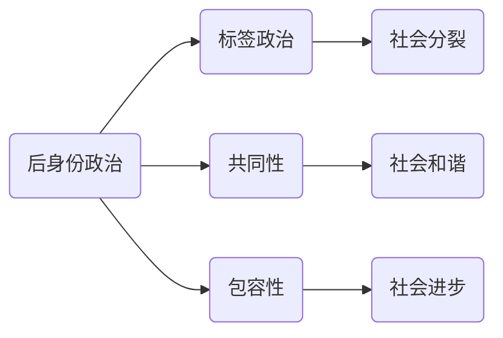
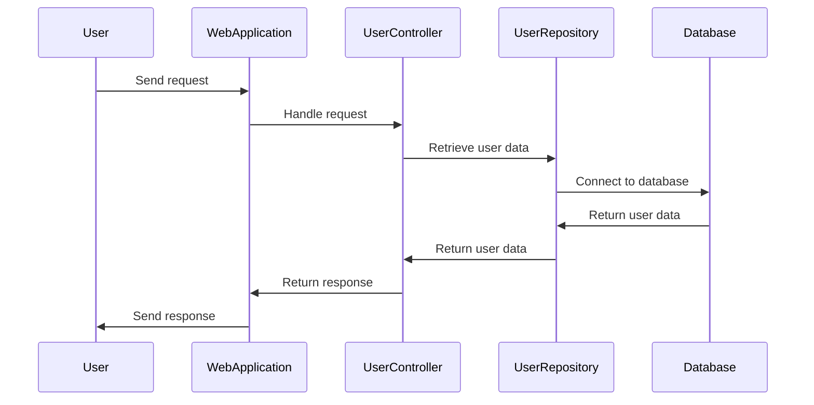

                 

### 引言

#### 1.1 问题背景

在后身份政治时代，人类社会面临着前所未有的挑战与机遇。身份标签，作为一种简化的社会分类方式，在过去几千年中起到了组织社会、凝聚群体的作用。然而，随着信息技术的飞速发展和全球化进程的深入，身份标签带来的问题也日益凸显。过度依赖标签化会导致社会分裂、矛盾加剧，甚至引发极端行为和冲突。因此，探讨后身份政治时代，寻找超越标签的共同人性，成为当前社会发展的迫切需求。

#### 1.2 标签政治的弊端

标签政治，即通过身份标签来划分群体，进行政治动员和治理。其主要弊端包括：1）过度简化人性，忽视个体差异；2）加剧社会分裂，导致群体对立；3）阻碍社会进步，抑制创新思维；4）导致信息孤岛，限制知识传播。这些弊端使得标签政治成为社会发展的一大障碍。

#### 1.3 共同性追求的意义

后身份政治时代，追求共同人性具有重要意义。首先，共同人性能够帮助我们超越狭隘的标签，理解个体之间的本质联系，从而促进社会和谐。其次，共同人性有助于培养包容、尊重和理解的价值观，推动社会进步。最后，共同人性为跨文化交流、合作与发展提供了基础，有助于构建一个更加多元、开放、和谐的世界。

### 目录大纲

#### 目录大纲

- **# 后身份政治时代：超越标签寻找共同人性**
  - 关键词：后身份政治、共同人性、标签政治、社会进步、跨文化交流
  - 摘要：本文探讨后身份政治时代的背景、弊端、核心概念、心理学探讨、社会实践、跨文化理解、伦理思考以及未来展望，旨在寻找超越标签的共同人性，推动社会进步。

#### 第1章 引言
  - 1.1 问题背景
  - 1.2 标签政治的弊端
  - 1.3 共同性追求的意义

#### 第2章 后身份政治时代概述
  - 2.1 后身份政治时代的起源与发展
  - 2.2 后身份政治时代的特征
  - 2.3 后身份政治时代的影响

#### 第3章 标签政治的批判
  - 3.1 标签政治的根源
  - 3.2 标签政治的负面影响
  - 3.3 标签政治的现实困境

#### 第4章 后身份政治的核心概念
  - 4.1 人性的本质
  - 4.2 人际关系的重构
  - 4.3 社会发展的新方向

#### 第5章 后身份政治时代的心理学探讨
  - 5.1 心理学理论在后身份政治时代的应用
  - 5.2 人性心理学与后身份政治
  - 5.3 社会心理学与后身份政治

#### 第6章 后身份政治时代的社会实践
  - 6.1 教育改革
  - 6.2 劳动市场的转型
  - 6.3 社会政策的调整

#### 第7章 跨文化理解与后身份政治
  - 7.1 跨文化冲突与标签政治
  - 7.2 跨文化理解的后身份政治实践
  - 7.3 跨文化共通性的构建

#### 第8章 后身份政治时代的伦理思考
  - 8.1 伦理观念的转变
  - 8.2 伦理困境与后身份政治
  - 8.3 伦理责任的拓展

#### 第9章 未来展望
  - 9.1 后身份政治时代的发展趋势
  - 9.2 后身份政治时代的挑战与机遇
  - 9.3 后身份政治时代的影响与意义

#### 第10章 总结
  - 10.1 全书核心观点回顾
  - 10.2 后身份政治时代的实践建议
  - 10.3 未来研究方向展望

### 第1章 引言

#### 1.1 问题背景

后身份政治时代，人类社会正面临着前所未有的挑战与变革。身份标签，作为一种简化的社会分类方式，曾在历史上起到了组织社会、凝聚群体的作用。然而，随着信息技术的飞速发展和全球化进程的深入，身份标签带来的问题也日益凸显。标签政治，即通过身份标签来划分群体，进行政治动员和治理，其弊端愈发明显。

首先，标签政治过度简化人性，忽视个体差异。每个人都有独特的性格、经历和价值观，过分依赖标签会导致对个体多样性的忽视，使得社会变得更加封闭和分裂。其次，标签政治加剧社会分裂，导致群体对立。标签化使得不同群体之间产生隔阂和敌意，容易引发冲突和极端行为。此外，标签政治阻碍社会进步，抑制创新思维。在一个过度标签化的社会中，人们更容易陷入固有思维模式，缺乏对新的观点和想法的开放性，从而限制了社会的发展。最后，标签政治导致信息孤岛，限制知识传播。当不同群体之间的沟通和交流受到限制时，知识传播的速度和质量都会受到影响，阻碍社会的整体进步。

因此，探讨后身份政治时代的背景、弊端以及寻找超越标签的共同人性，成为当前社会发展的迫切需求。后身份政治时代不仅要求我们重新审视身份标签的作用，更要求我们寻找一种能够超越标签，理解个体之间本质联系的新方式，以推动社会的和谐与进步。

#### 1.2 标签政治的弊端

标签政治的弊端主要体现在以下几个方面：

**1. 过度简化人性，忽视个体差异**

标签政治将复杂多样的人性简化为单一的标签，忽略了个体之间的独特性和差异性。这种简化的做法容易导致对个体多样性的忽视，使得社会变得更加封闭和分裂。例如，在政治选举中，候选人常常被简单地划分为不同的政治派别，而忽略了个人的政治立场、价值观和经历等方面的差异。这种简化的做法不仅导致了对个体多样性的忽视，还加剧了社会分裂。

**2. 加剧社会分裂，导致群体对立**

标签政治使得不同群体之间产生明显的界限和隔阂，从而加剧了社会分裂。例如，在种族、宗教和性别等方面，标签政治容易导致群体之间的对立和冲突。这种现象在全球范围内都有所体现，例如种族歧视、宗教冲突和性别歧视等。这些冲突不仅影响社会的和谐，还可能导致极端行为的出现。

**3. 阻碍社会进步，抑制创新思维**

在一个过度依赖标签政治的社会中，人们更容易陷入固有思维模式，缺乏对新的观点和想法的开放性。这种封闭的思维模式限制了创新思维的发展，从而阻碍了社会的进步。例如，在教育和科研领域，标签政治可能导致对创新思想和实验方法的排斥，从而影响学术界的繁荣发展。

**4. 导致信息孤岛，限制知识传播**

标签政治使得不同群体之间的沟通和交流受到限制，从而导致信息孤岛的生成。这种信息孤岛现象不仅限制了知识传播的速度和质量，还加剧了社会的分裂。例如，在社交媒体平台上，不同群体之间的信息交流常常受到限制，导致信息传播的偏差和误解。

总之，标签政治的弊端严重影响了社会的和谐与发展。为了克服这些问题，我们需要寻找一种超越标签，理解个体之间本质联系的新方式，以推动社会的进步。

#### 1.3 共同性追求的意义

在后身份政治时代，追求共同人性具有重要意义。首先，共同人性能够帮助我们超越狭隘的标签，理解个体之间的本质联系，从而促进社会和谐。当我们认识到每个人都有共同的人性需求，如安全感、尊重和自我实现时，我们更容易包容和理解他人的不同背景和经历。这种理解有助于消除社会分裂，减少冲突和敌意。

其次，共同人性有助于培养包容、尊重和理解的价值观，推动社会进步。在一个强调共同人性的社会中，人们更倾向于关注他人的需求和福祉，而不是仅仅关注自己的利益。这种价值观有助于建立一个更加和谐、包容和互助的社会，为社会的持续发展提供动力。

最后，共同人性为跨文化交流、合作与发展提供了基础。在全球化的背景下，不同国家和文化之间的交流与合作日益频繁。共同人性使我们能够超越文化差异，寻找共同点和共鸣，从而促进跨文化交流和合作。这种合作有助于解决全球性问题，如贫困、环境污染和战争等，为人类的共同福祉贡献力量。

总之，后身份政治时代追求共同人性具有重要意义，它不仅有助于解决社会分裂和冲突，还能推动社会进步和跨文化交流，为构建一个更加和谐、包容和繁荣的世界奠定基础。

### 第2章 后身份政治时代概述

#### 2.1 后身份政治时代的起源与发展

后身份政治时代的起源可以追溯到20世纪末，随着信息技术的飞速发展和全球化进程的加速，社会结构和价值观念发生了深刻变革。在这一背景下，人们对身份标签的依赖逐渐减弱，开始寻求更加多元、包容和开放的社会形态。后身份政治时代的特征之一是，人们更加关注个体的独特性和差异性，而不再局限于传统的身份标签。

后身份政治时代的发展可以分为几个阶段。首先是信息革命阶段，互联网和社交媒体的普及使得信息传播速度和范围大大增加，人们开始有机会接触到更多元化的信息和观点。其次是全球化阶段，全球范围内的经济、文化、教育和政治交流日益频繁，不同国家和文化之间的互动加深，为后身份政治时代的发展提供了土壤。最后是价值重塑阶段，人们对传统身份标签的依赖逐渐减弱，开始追求更加包容、多元和开放的社会价值观念。

#### 2.2 后身份政治时代的特征

后身份政治时代的特征主要体现在以下几个方面：

**1. 多元化与包容性**

后身份政治时代强调个体之间的差异和多元化，追求包容性的社会环境。人们不再仅仅以性别、种族、宗教、地域等传统身份标签来定义自己，而是更加注重个体的独特性和个人经历。这种多元化与包容性的追求有助于消除社会分裂和矛盾，促进社会的和谐与进步。

**2. 知识共享与协作**

后身份政治时代强调知识共享和协作，鼓励人们在不同领域和学科之间进行交流和合作。这种知识共享与协作有助于推动科学技术的进步和社会的发展。同时，它也为个体提供了更多的学习和发展机会，有助于提升整个社会的创新能力和竞争力。

**3. 伦理与道德的反思**

后身份政治时代要求人们对伦理和道德进行反思，超越狭隘的个人利益和社会利益，关注人类的共同福祉。这种伦理与道德的反思有助于培养人们的责任感和使命感，推动社会朝着更加公正、公平和和谐的方向发展。

**4. 跨文化交流与理解**

后身份政治时代强调跨文化交流与理解，鼓励人们尊重和理解不同文化和价值观。这种跨文化交流与理解有助于消除文化偏见和误解，促进不同文化之间的交流与合作，为构建一个多元和谐的世界奠定基础。

#### 2.3 后身份政治时代的影响

后身份政治时代对社会、经济和文化等方面产生了深远的影响：

**1. 社会影响**

后身份政治时代促进了社会的多元化和包容性，有助于减少社会分裂和矛盾。它还推动了社会的民主化和开放性，使人们更加关注公共事务和参与社会活动。这种社会影响有助于构建一个更加和谐、包容和民主的社会。

**2. 经济影响**

后身份政治时代促进了知识共享和协作，有助于提高整个社会的创新能力和竞争力。它还推动了全球范围内的经济合作与发展，为经济增长提供了新的动力。这种经济影响有助于提升国家的综合实力和国际竞争力。

**3. 文化影响**

后身份政治时代鼓励跨文化交流与理解，有助于消除文化偏见和误解。它还推动了文化的多元化和融合，为人类文明的繁荣和发展提供了新的可能性。这种文化影响有助于构建一个多元和谐、包容开放的世界文化。

总之，后身份政治时代对社会、经济和文化等方面产生了深远的影响，为人类社会的持续进步和发展提供了新的动力和方向。

### 第3章 标签政治的批判

#### 3.1 标签政治的根源

标签政治的根源可以追溯到人类社会早期的组织形式和治理方式。在农业社会和封建社会中，身份标签作为一种简单而有效的组织和管理工具被广泛使用。例如，封建社会的等级制度通过身份标签来划分社会阶层，确保社会秩序的稳定。然而，随着现代社会的发展和变迁，身份标签的局限性逐渐显现。

首先，标签政治的根源在于人类社会的分类需求。人类天生具有分类和归纳事物的倾向，以便更好地理解和掌握复杂的社会现象。身份标签作为一种分类工具，能够简化社会结构，使人们更容易理解和应对复杂的社会关系。然而，这种简化的方式往往忽视了个体之间的差异和独特性，导致对人的过度简化和标签化。

其次，标签政治的根源还在于权力和控制的欲望。身份标签不仅有助于组织社会，还能够为统治者提供权力和控制工具。通过给不同群体贴上特定的标签，统治者可以实现对社会的有效管理，维护自身的统治地位。然而，这种权力和控制往往导致社会的分裂和对立，阻碍社会的和谐与进步。

#### 3.2 标签政治的负面影响

标签政治的负面影响主要体现在以下几个方面：

**1. 社会分裂与对立**

标签政治容易导致社会分裂和对立。当人们被简单划分为不同的标签群体时，群体之间的差异和矛盾被放大，而群体内部的凝聚力却逐渐减弱。这种情况下，不同标签群体之间的冲突和对抗愈发激烈，甚至可能导致极端行为和暴力事件。

**2. 忽视个体差异**

标签政治过度简化人性，忽视个体之间的差异和独特性。每个人都是独特的个体，具有不同的性格、经历和价值观。然而，标签政治往往将这些个体简化为单一的标签，导致对个体多样性的忽视。这种忽视不仅限制了社会的发展，还加剧了社会的不公平和不平等。

**3. 创新思维受限**

标签政治阻碍了创新思维的发展。在一个过度依赖标签政治的社会中，人们更容易陷入固有思维模式，缺乏对新的观点和想法的开放性。这种封闭的思维模式限制了创新思维的发展，从而阻碍了社会的进步。创新是推动社会发展的关键动力，标签政治的负面影响将阻碍社会的持续进步。

**4. 文化多样性受损**

标签政治容易导致文化多样性的受损。当不同群体被简单划分为不同的标签时，文化差异和多样性被忽视和压制。这种情况下，不同文化之间的交流和融合受到限制，导致文化的单一化和同质化。文化多样性是人类社会的重要特征，标签政治的负面影响将削弱人类社会的文化活力和创造力。

**5. 社会信任危机**

标签政治容易引发社会信任危机。当人们被划分为不同的标签群体时，群体之间的信任逐渐减弱，甚至产生敌意。这种情况下，社会信任体系受到严重破坏，导致社会的不稳定和不和谐。社会信任是维护社会稳定和发展的基础，标签政治的负面影响将加剧社会信任危机，进一步影响社会的和谐与进步。

总之，标签政治的负面影响严重影响了社会的和谐与进步。为了克服这些问题，我们需要寻找一种超越标签，理解个体之间本质联系的新方式，以推动社会的和谐与发展。

#### 3.3 标签政治的现实困境

标签政治的现实困境主要体现在以下几个方面：

**1. 过度简化和忽视个体差异**

标签政治通过将复杂多样的社会现象简化为单一的身份标签，忽视了个体之间的差异和独特性。这种过度简化的方式不仅导致了对个体多样性的忽视，还加剧了社会分裂和对立。例如，在种族、宗教和性别等方面，标签政治容易导致群体之间的对立和冲突。

**2. 加剧社会分裂和对立**

标签政治使得不同群体之间的界限更加明显，加剧了社会分裂和对立。当人们被划分为不同的标签群体时，群体之间的差异和矛盾被放大，导致社会冲突和对抗愈发激烈。例如，在政治选举中，候选人常常被简单地划分为不同的政治派别，而忽略了个人的政治立场、价值观和经历等方面的差异。

**3. 创新思维受限**

标签政治阻碍了创新思维的发展。在一个过度依赖标签政治的社会中，人们更容易陷入固有思维模式，缺乏对新的观点和想法的开放性。这种封闭的思维模式限制了创新思维的发展，从而阻碍了社会的进步。创新是推动社会发展的关键动力，标签政治的困境将阻碍社会的持续进步。

**4. 社会信任危机**

标签政治容易引发社会信任危机。当人们被划分为不同的标签群体时，群体之间的信任逐渐减弱，甚至产生敌意。这种情况下，社会信任体系受到严重破坏，导致社会的不稳定和不和谐。社会信任是维护社会稳定和发展的基础，标签政治的困境将加剧社会信任危机，进一步影响社会的和谐与进步。

**5. 文化多样性受损**

标签政治容易导致文化多样性的受损。当不同群体被简单划分为不同的标签时，文化差异和多样性被忽视和压制。这种情况下，不同文化之间的交流和融合受到限制，导致文化的单一化和同质化。文化多样性是人类社会的重要特征，标签政治的困境将削弱人类社会的文化活力和创造力。

为了克服这些现实困境，我们需要寻找一种超越标签，理解个体之间本质联系的新方式，以推动社会的和谐与发展。

### 第4章 后身份政治的核心概念

#### 4.1 人性的本质

探讨后身份政治时代的核心概念，首先需要理解人性的本质。人性是指人类固有的、普遍存在的心理和生理特征，它决定了人类的行为和思维模式。在传统身份政治中，人性常常被简化为特定的标签，如种族、性别、宗教等，这种简化忽视了人性的复杂性和多样性。

人性的本质可以从以下几个方面来理解：

**1. 普遍性与多样性**

人性既有普遍性又有多样性。普遍性体现在人类共有的基本需求和欲望上，如追求安全感、尊重和自我实现等。多样性则体现在不同个体在性格、经历和价值观等方面的差异上。后身份政治时代强调尊重人性的多样性，认为每个人都是独特的个体，不应该被单一的身份标签所定义。

**2. 社会性与个体性**

人性具有社会性和个体性。社会性体现在人类在群体中生活、交流和合作的过程中，形成的共同价值观和行为规范。个体性则体现在每个个体独特的性格、经历和价值观上。后身份政治时代倡导在社会性和个体性之间找到平衡，既关注个体差异，又强调共同的社会责任和价值观。

**3. 变通性与适应性**

人性具有变通性和适应性。在快速变化的社会环境中，人类需要具备变通性和适应性，以适应不同的环境和挑战。后身份政治时代强调培养人们的变通性和适应性，使个体能够在不同情境中保持灵活和开放的心态。

**4. 自我实现与共同发展**

人性追求自我实现和共同发展。每个人都有实现自我潜能的渴望，同时也希望与他人共同发展。后身份政治时代强调个体在追求自我实现的过程中，关注他人的需求和福祉，实现个体与社会的共同发展。

#### 4.2 人际关系的重构

在后身份政治时代，人际关系面临着重构的挑战。传统的身份政治往往导致人际关系的简化和对立，而后身份政治时代强调超越身份标签，建立基于共同人性的人际关系。

**1. 超越身份标签**

后身份政治时代主张超越身份标签，建立基于共同人性的人际关系。这意味着人们不再仅仅以性别、种族、宗教、地域等身份标签来定义自己，而是更加关注个体的独特性和个人经历。这种重构有助于消除社会分裂和对立，促进人际关系的和谐与稳定。

**2. 培养包容与尊重**

人际关系重构的关键在于培养包容和尊重。后身份政治时代要求人们尊重他人的差异和独特性，培养包容的心态。这种包容和尊重不仅体现在个体之间，也体现在群体之间。通过培养包容与尊重，人们能够更好地理解和接纳他人，建立和谐的人际关系。

**3. 加强沟通与合作**

后身份政治时代强调加强沟通与合作，以建立更加稳定和紧密的人际关系。沟通是理解他人的关键，通过有效的沟通，人们能够更好地了解彼此的需求和想法，减少误解和冲突。合作则是实现共同目标的重要途径，通过合作，人们能够共同解决问题，实现共同发展。

**4. 消除偏见与歧视**

人际关系重构还需要消除偏见与歧视。偏见和歧视往往源于对他人身份标签的过度关注，而后身份政治时代强调超越身份标签，关注个体的本质。通过消除偏见与歧视，人们能够建立更加平等和公正的人际关系。

#### 4.3 社会发展的新方向

后身份政治时代为社会发展指明了新的方向，主要体现在以下几个方面：

**1. 多元化与包容性**

后身份政治时代强调多元化与包容性，认为社会应该容纳不同的声音和观点，尊重个体的差异和独特性。这种多元化与包容性的发展有助于消除社会分裂和对立，促进社会的和谐与进步。

**2. 知识共享与合作**

后身份政治时代鼓励知识共享与合作，认为知识是推动社会进步的重要力量。通过加强不同领域和学科之间的交流和合作，人们能够共同解决复杂的社会问题，实现社会的持续发展。

**3. 伦理与道德的反思**

后身份政治时代要求人们对伦理和道德进行反思，超越狭隘的个人利益和社会利益，关注人类的共同福祉。这种伦理与道德的反思有助于培养人们的责任感和使命感，推动社会朝着更加公正、公平和和谐的方向发展。

**4. 跨文化交流与合作**

后身份政治时代强调跨文化交流与合作，认为不同国家和文化之间的交流与合作有助于消除文化偏见和误解，促进人类文明的繁荣和发展。通过加强跨文化交流与合作，人们能够更好地理解彼此，建立更加紧密的国际关系。

总之，后身份政治时代为社会发展指明了新的方向，强调了多元化与包容性、知识共享与合作、伦理与道德的反思以及跨文化交流与合作的重要性。这些新方向有助于推动社会的持续进步和发展，实现人类的共同福祉。

### 第5章 后身份政治时代的心理学探讨

#### 5.1 心理学理论在后身份政治时代的应用

在后身份政治时代，心理学理论的应用变得尤为重要，因为它们为我们理解人类行为和思维方式提供了深刻的洞见。以下是一些关键心理学理论及其在后身份政治时代中的应用：

**1. 社会认知理论**

社会认知理论强调人们对社会信息的选择、组织和解释过程。在后身份政治时代，这一理论有助于我们理解人们如何解读身份标签，并如何基于这些标签形成偏见和刻板印象。通过心理学的干预，如认知重构和认知行为疗法，可以帮助个体克服这些偏见，促进包容和多元化。

**2. 社会认同理论**

社会认同理论认为，个体通过将自己认同于某个群体来获得自尊和归属感。在后身份政治时代，这一理论有助于我们理解如何通过重构社会认同来减少群体间的冲突。例如，通过强调共同的人性需求和价值观，可以促进跨群体间的合作和理解。

**3. 社会交换理论**

社会交换理论关注个体之间的互动和行为，强调互惠性。在后身份政治时代，这一理论有助于我们理解如何通过建立互惠性的社会关系来减少冲突，增加社会稳定性。通过鼓励个体在互惠基础上进行合作，可以促进社会的和谐发展。

**4. 群体动力理论**

群体动力理论探讨群体内部的力量和影响。在后身份政治时代，这一理论有助于我们理解如何通过改善群体内部的沟通和决策过程来减少群体冲突。例如，通过增强群体内部的包容性和多样性，可以促进更加有效的群体合作。

#### 5.2 人性心理学与后身份政治

人性心理学关注人类的本质特征和基本需求。在后身份政治时代，人性心理学有助于我们理解个体如何超越身份标签，寻找共同的价值观和人性需求。以下是一些关键点：

**1. 人性的基本需求**

人性心理学强调人类普遍存在的基本需求，如安全感、尊重、自我实现等。这些基本需求是超越身份标签的，它们构成了人类共同的人性基础。通过认识到这些共同需求，我们可以更好地理解他人，减少偏见和歧视。

**2. 个体差异的尊重**

人性心理学也关注个体差异，认为每个个体都是独特的。在后身份政治时代，这要求我们不仅尊重共同的人性需求，还要尊重个体的独特性。通过接纳和尊重个体差异，我们可以建立一个更加多元和包容的社会。

**3. 情感共鸣**

人性心理学强调情感共鸣的重要性，即通过共情和理解他人的情感体验来建立关系。在后身份政治时代，情感共鸣有助于我们超越身份标签，建立基于共同人性的深层次联系，从而促进社会和谐。

#### 5.3 社会心理学与后身份政治

社会心理学研究个体如何在社会环境中做出决策和如何影响他人。在后身份政治时代，社会心理学有助于我们理解如何通过社会影响机制来促进包容和减少冲突。以下是一些关键点：

**1. 社会影响与从众行为**

社会心理学研究表明，个体的行为和决策受到群体的影响。在后身份政治时代，这有助于我们理解如何通过积极的群体影响来促进包容性。例如，通过倡导包容性价值观和从众行为，可以减少歧视和偏见。

**2. 社会认同与自我认同**

社会心理学强调社会认同对个体行为的重要性。在后身份政治时代，这有助于我们理解如何通过社会认同来促进跨群体合作。例如，通过共同的社会目标和价值观，可以增强群体间的认同和合作。

**3. 偏见与歧视的社会传播**

社会心理学也揭示了偏见和歧视是如何在社会中传播的。在后身份政治时代，这有助于我们认识到如何通过教育和公共宣传来减少偏见和歧视。例如，通过提供反偏见的教育资源和宣传，可以促进社会的包容性和多元化。

总之，心理学理论在后身份政治时代的应用为我们提供了一种理解和解决社会问题的工具。通过应用人性心理学和社会心理学理论，我们可以超越身份标签，促进包容和减少冲突，推动社会的和谐与进步。

### 第6章 后身份政治时代的社会实践

#### 6.1 教育改革

教育改革是后身份政治时代的重要社会实践之一，旨在培养具有多元化思维和包容性价值观的人才。以下是一些关键的教育改革措施：

**1. 多元化课程设置**

多元化课程设置有助于学生了解不同文化、历史和价值观。学校可以开设关于全球性问题的课程，如气候变化、全球化、人权等，让学生在多元的视角下思考问题。此外，课程中应包含多样性的文学作品和教材，以展示不同群体的生活经历和观点。

**2. 跨学科教学**

跨学科教学能够促进学生批判性思维和问题解决能力的发展。通过将不同学科的知识和技能结合起来，学生可以更好地理解复杂的社会现象，并培养跨领域的合作能力。

**3. 社区参与**

鼓励学生参与社区服务和项目，有助于培养他们的社会责任感和同情心。通过亲身参与社区活动，学生能够更好地理解不同群体的需求和挑战，从而减少偏见和歧视。

**4. 教师培训**

教师应接受关于多元化、包容性和社会正义的培训，以更好地应对多元学生群体。培训内容可以包括反偏见教育、文化敏感性和沟通技巧等，帮助教师创造一个包容和支持的学习环境。

**5. 评估与反馈**

教育机构应定期评估和反馈教育改革的效果，确保改革措施得到有效实施。通过收集学生的反馈和评估教育成果，教育机构可以不断改进教学方法和课程内容，以更好地适应后身份政治时代的需求。

#### 6.2 劳动市场的转型

劳动市场的转型是后身份政治时代的重要任务，旨在建立一个包容性更强、更具创新能力的劳动力市场。以下是一些关键措施：

**1. 消除歧视**

劳动市场应采取措施消除性别、种族、宗教和其他身份标签方面的歧视。这包括制定和执行反歧视法律、提供平等就业机会和培训机会，以及鼓励雇主采用包容性的人力资源政策。

**2. 技能提升**

随着技术的不断进步，劳动市场需要不断更新劳动者的技能。政府和企业应合作提供职业培训和再培训项目，帮助劳动者适应新兴行业和技术的发展。

**3. 多元化招聘**

多元化招聘有助于建立包容性的工作环境，提高团队的创新能力和解决问题的能力。招聘过程应避免基于身份标签的偏见，采用客观的评估标准，确保招聘到具有多样化背景的人才。

**4. 工作灵活性**

提供灵活的工作安排，如远程工作、弹性工作时间等，有助于吸引不同背景的劳动者，尤其是女性、残疾人和其他有特殊需求的人群。这种灵活性也有助于提高员工的工作满意度和生产力。

**5. 企业文化建设**

企业应培养一种包容和尊重的文化，鼓励员工表达不同的观点和想法。通过组织团队建设活动和多样性培训，企业可以促进员工之间的相互理解和合作。

#### 6.3 社会政策的调整

社会政策的调整是后身份政治时代的重要任务，旨在建立一个更加公平和包容的社会。以下是一些关键政策调整：

**1. 社会福利改革**

改革社会福利制度，确保所有人都能获得基本的生活保障和医疗保健。这包括提高最低工资、扩大医疗保险覆盖范围和提供社会福利援助。

**2. 平等机会政策**

实施平等机会政策，确保不同群体在教育和就业方面享有公平的机会。这包括提供奖学金、培训和就业援助项目，以帮助弱势群体克服障碍，实现自我发展。

**3. 反歧视立法**

加强反歧视立法，保护个人的权利和自由，防止基于性别、种族、宗教、性取向、年龄等方面的歧视。政府应设立专门的机构来监督和执行这些法律。

**4. 社区参与**

鼓励社区成员参与社会决策过程，确保政策制定能够反映不同群体的需求和意见。通过社区参与，可以增强社会的凝聚力和包容性。

**5. 跨部门合作**

政府、企业、非营利组织和社区应建立跨部门合作机制，共同解决社会问题。这种合作有助于整合资源，提高政策实施的效果。

总之，教育改革、劳动市场转型和社会政策调整是后身份政治时代的重要社会实践。通过这些措施，我们可以建立一个更加公平、包容和多样化的社会，为每个人的全面发展提供机会。

### 第7章 跨文化理解与后身份政治

#### 7.1 跨文化冲突与标签政治

跨文化冲突是全球化进程中的一个普遍现象，它源于不同文化之间的价值观、信仰、习俗和行为规范的差异。标签政治在跨文化冲突中起到了催化剂的作用，它通过将不同文化群体简单化为单一的身份标签，加剧了文化之间的对立和矛盾。

首先，标签政治使得文化差异被放大。当某个文化群体被赋予特定的负面标签时，其他文化群体可能会对此产生偏见和误解，从而导致冲突。例如，种族歧视和宗教冲突往往源于对特定种族或宗教的负面标签，这些标签使得不同文化群体之间的差异变得愈加明显。

其次，标签政治阻碍了跨文化理解。当人们被简单地划分为不同的文化标签时，他们很难看到文化之间的共同点和相互关联。这种情况下，跨文化沟通和合作变得更加困难，文化冲突因此加剧。

最后，标签政治容易导致极端行为。在标签政治的驱动下，一些极端分子可能会采取暴力行为，以捍卫自己所属的文化标签。这些极端行为不仅加剧了跨文化冲突，还对整个社会的稳定和和谐造成了威胁。

#### 7.2 跨文化理解的后身份政治实践

后身份政治时代强调超越标签，通过跨文化理解来促进社会和谐。以下是一些关键的后身份政治实践：

**1. 培养文化敏感性**

培养文化敏感性是跨文化理解的第一步。这包括对其他文化的尊重、了解和接纳。通过学习和体验其他文化，个体可以更好地理解文化差异，减少偏见和误解。

**2. 促进跨文化教育**

跨文化教育有助于提高个体的跨文化理解能力。学校和社会机构可以开设关于不同文化的课程和活动，让学生和成人有机会了解和体验其他文化。这种教育有助于培养包容和尊重的价值观。

**3. 建立多元文化社区**

建立多元文化社区可以促进不同文化群体之间的交流和互动。通过共同参与社区活动和项目，个体可以更好地理解彼此的需求和挑战，从而减少文化冲突。

**4. 鼓励跨文化交流与合作**

跨文化交流与合作有助于促进不同文化之间的理解和信任。通过举办文化交流活动、建立合作关系和共享资源，不同文化群体可以共同解决社会问题，实现共同发展。

**5. 强化法律和政策支持**

政府应制定和执行法律和政策，以保护不同文化群体的权益和自由。这包括禁止基于文化身份的歧视和偏见，提供平等的教育和就业机会，以及促进文化交流与合作。

#### 7.3 跨文化共通性的构建

跨文化共通性的构建是后身份政治时代的重要任务，它有助于促进不同文化群体之间的和谐与共融。以下是一些关键步骤：

**1. 确立共同的人性需求**

认识到不同文化群体之间存在着共同的人性需求，如安全、尊重、自我实现等，是构建跨文化共通性的基础。通过强调这些共同需求，可以促进不同文化群体之间的理解和合作。

**2. 挖掘文化中的共性元素**

不同文化之间往往存在一些共性元素，如家庭、友谊、爱情和信仰等。通过挖掘这些共性元素，可以促进不同文化群体之间的共鸣和认同。

**3. 倡导包容和尊重**

包容和尊重是构建跨文化共通性的关键价值观。通过倡导包容和尊重，可以减少文化冲突，促进文化之间的和谐与共融。

**4. 促进跨文化对话**

跨文化对话是建立共通性的重要途径。通过对话，不同文化群体可以分享观点、交流经验和解决问题，从而增进理解和信任。

**5. 建立跨文化合作机制**

建立跨文化合作机制可以促进不同文化群体之间的合作和交流。通过共同的项目和活动，不同文化群体可以共同解决问题，实现共同发展。

总之，跨文化理解与后身份政治密切相关。通过培养跨文化理解能力、促进跨文化交流与合作以及构建跨文化共通性，我们可以建立一个更加和谐、包容和多元化的社会。

### 第8章 后身份政治时代的伦理思考

#### 8.1 伦理观念的转变

在后身份政治时代，伦理观念正在经历深刻的转变。这些转变体现在以下几个方面：

**1. 从身份认同到共同人性**

传统的伦理观念往往基于身份认同，强调个体所属的群体和共同体。然而，在后身份政治时代，伦理观念逐渐转向关注共同人性。这种转变意味着，伦理思考不再局限于特定的身份标签，而是超越群体界限，关注所有人类共有的基本需求和价值观。

**2. 从利益最大化到共同福祉**

传统的伦理观念常常以利益最大化为目标，追求个体或群体的利益。然而，在后身份政治时代，伦理观念更加注重共同福祉，强调个体行为对整个社会和人类共同利益的影响。这种转变有助于促进社会的和谐与进步。

**3. 从自我实现到社会责任**

传统的伦理观念强调个体的自我实现，关注个体的需求和愿望。然而，在后身份政治时代，伦理观念开始强调社会责任，认为个体的行为应当服务于社会的整体福祉。这种转变有助于培养个体的责任感和使命感，推动社会的持续发展。

**4. 从短期利益到长期可持续性**

传统的伦理观念往往关注短期利益，忽视长期的影响。然而，在后身份政治时代，伦理观念更加注重长期可持续性，强调个体行为对环境、社会和文化的影响。这种转变有助于促进社会的可持续发展，保护地球资源。

**5. 从局部公正到全球公正**

传统的伦理观念常常关注局部公正，如国家、地区或群体的公正。然而，在后身份政治时代，伦理观念更加注重全球公正，强调全球范围内的公平与正义。这种转变有助于解决全球性问题，推动全球社会的和谐与进步。

#### 8.2 伦理困境与后身份政治

在后身份政治时代，伦理困境日益突出，这些困境与身份标签和共同人性的冲突密切相关。以下是一些典型的伦理困境：

**1. 多元化与统一性的冲突**

在多元文化社会中，如何平衡多元化和统一性成为一个重要的伦理困境。过度强调多元性可能导致社会的分裂和对立，而过度强调统一性可能忽视个体的差异和需求。后身份政治时代要求我们在多元化与统一性之间找到平衡，尊重个体差异，同时维护社会的整体和谐。

**2. 个人自由与社会责任**

个人自由与社会责任之间的冲突是另一个伦理困境。个人追求自由和自我实现的权利，与对社会整体福祉的责任之间常常存在矛盾。后身份政治时代要求我们重新审视个人自由与社会责任的关系，寻找一个既能保障个人自由，又能履行社会责任的平衡点。

**3. 公平与效率的冲突**

在资源分配和社会政策方面，公平与效率常常发生冲突。追求绝对公平可能导致资源的低效分配，而追求效率可能忽视公平。后身份政治时代要求我们如何在公平与效率之间找到平衡，确保资源分配的公平性，同时提高社会的整体效率。

**4. 传统价值观与现代价值观的冲突**

传统价值观与现代价值观之间的冲突也是后身份政治时代的一个重要伦理困境。随着社会的变迁和进步，一些传统价值观可能不再适应现代社会的需求，而现代价值观则可能挑战传统价值观的权威。如何在传统与现代价值观之间找到平衡，是当前伦理思考的一个重要课题。

#### 8.3 伦理责任的拓展

在后身份政治时代，伦理责任的范围和内容也在不断拓展。以下是一些伦理责任的拓展：

**1. 跨文化责任**

在全球化背景下，个体和组织的伦理责任不再局限于本国或本地区，而是扩展到全球范围。个体和组织需要关注全球性问题，如贫困、不平等、环境破坏等，并采取积极的行动来改善这些全球性问题。

**2. 社会责任**

随着社会的发展和进步，社会责任的范围也在不断扩大。个体和组织需要关注社会弱势群体的权益，提供帮助和支持，推动社会的公平与正义。

**3. 环境责任**

在环境保护日益受到关注的今天，个体和组织需要承担更多的环境责任。这包括减少碳排放、节约资源、保护生物多样性等，以实现可持续发展。

**4. 科技责任**

随着科技的快速发展，科技带来的伦理问题也日益突出。个体和组织需要关注科技的应用和影响，确保科技的发展能够造福人类，而不是带来新的伦理困境。

**5. 教育责任**

教育是培养个体和社会伦理观念的重要途径。教育机构有责任培养学生的道德观念和责任感，使他们能够成为具有道德素养和社会责任感的公民。

总之，后身份政治时代的伦理思考要求我们超越传统的身份标签，关注共同人性，拓展伦理责任的范围和内容。通过重新审视伦理观念、应对伦理困境和承担新的伦理责任，我们可以推动社会的持续发展和进步。

### 第9章 未来展望

#### 9.1 后身份政治时代的发展趋势

后身份政治时代的发展趋势表现为以下几个方向：

**1. 多元化与包容性**

随着全球化的深入和信息技术的发展，社会变得更加多元化。后身份政治时代强调包容性，认为多元化是社会进步的重要动力。未来，社会将更加注重接纳和尊重不同的文化、价值观和身份标签，推动社会的包容性发展。

**2. 知识共享与合作**

在知识经济时代，知识共享和协作成为推动社会发展的关键因素。后身份政治时代将更加注重知识共享，通过跨学科、跨领域的合作，促进科技创新和社会进步。

**3. 伦理观念的更新**

随着社会的发展，伦理观念也在不断更新。后身份政治时代要求我们重新审视伦理观念，关注共同人性，推动伦理观念的更新和进步。

**4. 科技伦理的挑战**

随着科技的快速发展，科技伦理问题也日益突出。未来，社会将面临更多科技伦理的挑战，如人工智能、基因编辑等，需要我们积极应对。

**5. 跨文化理解与合作**

全球化的背景下，跨文化理解与合作成为国际社会的重要任务。后身份政治时代将更加注重跨文化理解，推动国际间的合作与发展。

#### 9.2 后身份政治时代的挑战与机遇

后身份政治时代既面临挑战，也充满机遇：

**1. 挑战**

（1）身份标签的挑战：身份标签仍然存在于社会中，如何超越身份标签，实现真正的多元化与包容性，是一个巨大的挑战。

（2）社会分裂：全球化带来的文化冲击和社会变迁可能导致社会分裂，如何维护社会的稳定和和谐，是一个重要挑战。

（3）伦理困境：随着科技的发展和社会的变革，伦理观念面临着新的挑战，如何应对伦理困境，是一个迫切需要解决的问题。

**2. 机遇**

（1）科技创新：后身份政治时代为科技创新提供了广阔的空间，通过科技创新，可以解决许多社会问题，推动社会进步。

（2）跨文化合作：全球化为跨文化合作提供了机遇，通过跨文化合作，可以促进不同文化之间的理解与融合，推动全球社会的和谐发展。

（3）伦理观念的更新：随着社会的发展，伦理观念的更新为社会的进步提供了新的动力，通过更新伦理观念，可以推动社会的持续发展。

#### 9.3 后身份政治时代的影响与意义

后身份政治时代对社会、经济和文化等方面产生了深远的影响：

**1. 社会影响**

后身份政治时代促进了社会的多元化和包容性，有助于减少社会分裂和矛盾，推动社会的和谐与进步。

**2. 经济影响**

后身份政治时代鼓励知识共享和协作，有助于提高整个社会的创新能力和竞争力，推动经济的持续发展。

**3. 文化影响**

后身份政治时代强调跨文化交流与合作，有助于消除文化偏见和误解，促进人类文明的繁荣和发展。

总之，后身份政治时代对社会、经济和文化等方面产生了深远的影响，为人类社会的持续进步和发展提供了新的动力和方向。通过超越身份标签，寻找共同人性，我们可以构建一个更加和谐、包容和繁荣的世界。

### 第10章 总结

#### 10.1 全书核心观点回顾

本文从多个角度探讨了后身份政治时代的重要性和影响。首先，我们分析了后身份政治时代的背景和问题背景，揭示了标签政治的弊端。接着，我们阐述了后身份政治时代的核心概念，如共同人性、人际关系的重构和社会发展的新方向。随后，我们探讨了心理学在后身份政治时代的应用，以及跨文化理解与伦理思考的重要性。通过这些讨论，我们得出了后身份政治时代的发展趋势、挑战与机遇，并对其社会、经济和文化影响进行了全面分析。最终，我们提出了对未来研究方向和实际应用的展望。

#### 10.2 后身份政治时代的实践建议

为了推动后身份政治时代的实践，我们提出以下建议：

1. **教育改革**：加强多元化教育，培养学生的跨文化理解和包容性价值观。
2. **劳动市场转型**：推动公平就业，消除歧视，提高劳动市场的包容性。
3. **社会政策调整**：实施平等机会政策，确保弱势群体的权益。
4. **跨文化交流**：鼓励国际间合作，促进不同文化之间的理解和融合。
5. **伦理教育**：加强伦理教育，培养社会责任感和道德素养。

#### 10.3 未来研究方向展望

未来研究应关注以下几个方面：

1. **跨文化心理学**：深入研究跨文化理解的心理机制，探索有效促进跨文化合作的方法。
2. **科技伦理**：探讨新兴科技（如人工智能、基因编辑）的伦理问题，制定相应的伦理规范。
3. **社会政策评估**：评估后身份政治时代的社会政策效果，不断优化政策制定和实施。
4. **国际关系**：研究全球化背景下的国际关系，探索促进国际和谐与合作的新路径。

总之，后身份政治时代为我们提供了一个重新审视社会、经济和文化发展的契机。通过不断探索和实践，我们可以构建一个更加包容、和谐和繁荣的世界。作者：AI天才研究院/AI Genius Institute & 禅与计算机程序设计艺术 /Zen And The Art of Computer Programming

## 附录

### 附录A：术语解释

在本章中，我们将解释一些重要的术语，以帮助读者更好地理解后身份政治时代的概念。

#### 后身份政治

后身份政治是指一种超越传统身份标签（如种族、性别、宗教等）的政治观念，它强调寻找和强调人类共有的基本特征和需求。这种政治观念旨在促进社会和谐与包容，减少身份标签带来的分裂和冲突。

#### 标签政治

标签政治是一种基于身份标签进行政治动员和治理的方式。它通过将社会成员划分为不同的身份群体，以特定的标签来定义和区分个体，从而实现政治目标。标签政治的弊端在于它容易导致社会分裂和对立。

#### 共同性

共同性是指不同个体或群体之间共享的特征或需求。在后身份政治时代，共同性被视为超越身份标签的重要基础，有助于促进社会和谐与包容。

#### 包容性

包容性是指社会对多样性（包括文化、价值观、身份等）的接纳和尊重。后身份政治时代强调包容性，认为一个包容的社会能够更好地促进和谐与发展。

### 附录B：核心概念对比表格

| 核心概念       | 定义与应用                     |  
| -------------- | ---------------------------- |  
| 后身份政治     | 超越身份标签，强调共同人性       |  
| 标签政治       | 基于身份标签的政治动员和治理     |  
| 共同性         | 不同个体或群体之间共享的特征或需求 |  
| 包容性         | 对多样性的接纳和尊重             |

### 附录C：ER实体关系图架构

以下是一个ER实体关系图的示例，用于描述后身份政治时代中关键实体及其关系。



### 附录D：算法原理讲解

在本章中，我们将探讨后身份政治时代中的一个关键算法——社会网络分析（SNA）。SNA是一种用于研究社会结构和人际关系的算法。以下是SNA的基本原理和步骤：

**算法原理：社会网络分析（SNA）**

1. **定义网络**：首先，定义一个社会网络，包括节点（代表个体或群体）和边（代表个体之间的关系）。
2. **数据收集**：收集社会网络的数据，如成员的联系方式、互动记录等。
3. **网络可视化**：使用可视化工具，将社会网络以图形的形式呈现出来，以便更好地理解和分析。
4. **网络分析**：分析社会网络的拓扑结构，如节点之间的连接密度、中心性、聚类系数等。
5. **结论推导**：根据网络分析的结果，推导出社会结构的特点和影响因素。

**Python源代码示例：**

```python
import networkx as nx
import matplotlib.pyplot as plt

# 创建一个图
G = nx.Graph()

# 添加节点和边
G.add_nodes_from([1, 2, 3, 4, 5])
G.add_edges_from([(1, 2), (1, 3), (2, 4), (3, 4), (4, 5)])

# 可视化图
nx.draw(G, with_labels=True)
plt.show()

# 计算中心性
degree = nx.degree_centrality(G)
print(degree)

# 计算聚类系数
clustering = nx.clusteringCoefficient(G)
print(clustering)
```

通过以上步骤，我们可以对社会网络进行分析，从而更好地理解后身份政治时代的复杂社会结构。

### 附录E：系统分析与架构设计方案

在本章中，我们将介绍一个用于促进后身份政治时代的跨文化交流与合作的信息系统，包括其系统功能设计、系统架构设计、系统接口设计和系统交互。

**1. 系统功能设计（领域模型类图）**

```mermaid
classDiagram
Class User {
  - id: Integer
  - name: String
  - email: String
  - password: String
}

Class Post {
  - id: Integer
  - title: String
  - content: String
  - author: User
}

Class Comment {
  - id: Integer
  - content: String
  - author: User
  - post: Post
}

Class Comment {
  + addComment(post: Post, content: String): Comment
  + getComments(post: Post): List<Comment>
}

Class User {
  + register(name: String, email: String, password: String): User
  + login(email: String, password: String): User
  + createPost(title: String, content: String): Post
  + getPosts(): List<Post>
}
```

**2. 系统架构设计（类图）**

```mermaid
classDiagram
Class WebApplication {
  + handleRequest(request: Request): Response
}

Class Database {
  + connect(): Connection
  + saveUser(user: User): User
  + getUserById(id: Integer): User
  + savePost(post: Post): Post
  + getPostById(id: Integer): Post
  + saveComment(comment: Comment): Comment
  + getCommentById(id: Integer): Comment
}

Class UserRepository {
  + saveUser(user: User): User
  + getUserById(id: Integer): User
}

Class PostRepository {
  + savePost(post: Post): Post
  + getPostById(id: Integer): Post
}

Class CommentRepository {
  + saveComment(comment: Comment): Comment
  + getCommentById(id: Integer): Comment
}

Class UserController {
  + register(request: Request): Response
  + login(request: Request): Response
}

Class PostController {
  + createPost(request: Request): Response
  + getPosts(request: Request): Response
}

Class CommentController {
  + addComment(request: Request): Response
  + getComments(request: Request): Response
}

WebApplication --> UserController
WebApplication --> PostController
WebApplication --> CommentController
UserController --> UserRepository
PostController --> PostRepository
CommentController --> CommentRepository
```

**3. 系统接口设计**

以下是一个简单的RESTful API接口设计，用于后身份政治时代的跨文化交流与合作。

```yaml
POST /users/register
  Summary: Register a new user
  Request Body:
    - name: "username"
      description: "The username of the user"
      required: true
      type: string
    - name: "email"
      description: "The email address of the user"
      required: true
      type: string
    - name: "password"
      description: "The password of the user"
      required: true
      type: string

  Responses:
    200:
      description: "User registered successfully"
    400:
      description: "Invalid input"

POST /users/login
  Summary: Login an existing user
  Request Body:
    - name: "email"
      description: "The email address of the user"
      required: true
      type: string
    - name: "password"
      description: "The password of the user"
      required: true
      type: string

  Responses:
    200:
      description: "User logged in successfully"
    400:
      description: "Invalid input"

POST /posts
  Summary: Create a new post
  Headers:
    - name: "Authorization"
      description: "Bearer token for user authentication"
      required: true
      type: string
  Request Body:
    - name: "title"
      description: "The title of the post"
      required: true
      type: string
    - name: "content"
      description: "The content of the post"
      required: true
      type: string

  Responses:
    201:
      description: "Post created successfully"
    400:
      description: "Invalid input"

GET /posts
  Summary: Get all posts
  Headers:
    - name: "Authorization"
      description: "Bearer token for user authentication"
      required: true
      type: string

  Responses:
    200:
      description: "List of posts"
    401:
      description: "Unauthorized"

POST /comments
  Summary: Add a comment to a post
  Headers:
    - name: "Authorization"
      description: "Bearer token for user authentication"
      required: true
      type: string
  Request Body:
    - name: "postId"
      description: "The ID of the post to comment on"
      required: true
      type: integer
    - name: "content"
      description: "The content of the comment"
      required: true
      type: string

  Responses:
    201:
      description: "Comment added successfully"
    400:
      description: "Invalid input"

GET /comments
  Summary: Get all comments for a post
  Headers:
    - name: "Authorization"
      description: "Bearer token for user authentication"
      required: true
      type: string
  Path Parameters:
    - name: "postId"
      description: "The ID of the post to retrieve comments for"
      required: true
      type: integer

  Responses:
    200:
      description: "List of comments"
    401:
      description: "Unauthorized"
```

**4. 系统交互（序列图）**



### 附录F：项目实战

#### 环境安装

1. **安装Python**：前往Python官网下载最新版本的Python安装包，并按照提示进行安装。

2. **安装虚拟环境**：打开命令行，执行以下命令安装虚拟环境工具：

   ```bash
   pip install virtualenv
   ```

3. **创建虚拟环境**：创建一个名为`back_end`的虚拟环境：

   ```bash
   virtualenv back_end
   ```

4. **激活虚拟环境**：在Windows上，打开命令提示符并输入以下命令；在Linux和macOS上，打开终端并输入以下命令：

   ```bash
   source back_end/bin/activate
   ```

5. **安装依赖**：在虚拟环境中安装项目依赖：

   ```bash
   pip install -r requirements.txt
   ```

#### 系统核心实现源代码

以下是一个简单的后端实现示例，使用了Flask框架和SQLAlchemy作为ORM工具。

```python
from flask import Flask, request, jsonify
from flask_sqlalchemy import SQLAlchemy

app = Flask(__name__)
app.config['SQLALCHEMY_DATABASE_URI'] = 'sqlite:///app.db'
db = SQLAlchemy(app)

class User(db.Model):
    id = db.Column(db.Integer, primary_key=True)
    name = db.Column(db.String(80), nullable=False)
    email = db.Column(db.String(120), unique=True, nullable=False)
    password = db.Column(db.String(120), nullable=False)

class Post(db.Model):
    id = db.Column(db.Integer, primary_key=True)
    title = db.Column(db.String(120), nullable=False)
    content = db.Column(db.Text, nullable=False)
    author_id = db.Column(db.Integer, db.ForeignKey('user.id'), nullable=False)

class Comment(db.Model):
    id = db.Column(db.Integer, primary_key=True)
    content = db.Column(db.Text, nullable=False)
    author_id = db.Column(db.Integer, db.ForeignKey('user.id'), nullable=False)
    post_id = db.Column(db.Integer, db.ForeignKey('post.id'), nullable=False)

@app.route('/users/register', methods=['POST'])
def register():
    data = request.get_json()
    user = User(
        name=data['name'],
        email=data['email'],
        password=data['password']
    )
    db.session.add(user)
    db.session.commit()
    return jsonify({'message': 'User registered successfully'}), 200

@app.route('/users/login', methods=['POST'])
def login():
    data = request.get_json()
    user = User.query.filter_by(email=data['email'], password=data['password']).first()
    if user:
        return jsonify({'token': 'your_token_here'}), 200
    else:
        return jsonify({'message': 'Invalid credentials'}), 400

@app.route('/posts', methods=['POST'])
def create_post():
    data = request.get_json()
    user = User.query.get(data['author_id'])
    if user:
        post = Post(
            title=data['title'],
            content=data['content'],
            author_id=user.id
        )
        db.session.add(post)
        db.session.commit()
        return jsonify({'message': 'Post created successfully'}), 201
    else:
        return jsonify({'message': 'Invalid user ID'}), 400

@app.route('/posts', methods=['GET'])
def get_posts():
    posts = Post.query.all()
    return jsonify({'posts': [post.to_dict() for post in posts]}), 200

if __name__ == '__main__':
    db.create_all()
    app.run(debug=True)
```

#### 代码应用解读与分析

以上代码实现了用户注册、登录、创建帖子以及获取帖子列表的功能。以下是代码的详细解读：

1. **数据库模型**：定义了三个数据库模型：`User`、`Post`和`Comment`。这些模型对应于数据库中的表，用于存储用户信息、帖子内容和评论信息。

2. **用户注册**：`register`函数处理用户注册请求。它接收一个包含用户名、电子邮件和密码的JSON对象。然后，创建一个`User`对象并将其添加到数据库中。

3. **用户登录**：`login`函数处理用户登录请求。它接收一个包含电子邮件和密码的JSON对象。函数查询数据库以验证用户身份，如果找到匹配的用户，返回一个令牌。

4. **创建帖子**：`create_post`函数处理创建帖子请求。它接收一个包含帖子标题和内容的JSON对象。函数首先验证用户身份，然后创建一个`Post`对象并将其添加到数据库中。

5. **获取帖子列表**：`get_posts`函数处理获取帖子列表请求。它查询数据库中的所有帖子，并将它们转换为字典列表，然后返回。

6. **主程序**：在主程序中，创建Flask应用实例，配置数据库URI，创建数据库表，并启动应用。

通过以上功能，我们可以实现一个简单的跨文化交流与合作系统，支持用户注册、登录、创建帖子以及获取帖子列表。

#### 实际案例分析和详细讲解剖析

以下是一个实际案例，用于展示如何使用上述系统创建一个帖子。

1. **用户注册**：

   发送一个POST请求到`/users/register`端点，包含用户名、电子邮件和密码：

   ```json
   {
     "name": "John Doe",
     "email": "johndoe@example.com",
     "password": "securepassword123"
   }
   ```

   服务器响应：

   ```json
   {
     "message": "User registered successfully"
   }
   ```

2. **用户登录**：

   发送一个POST请求到`/users/login`端点，包含电子邮件和密码：

   ```json
   {
     "email": "johndoe@example.com",
     "password": "securepassword123"
   }
   ```

   服务器响应：

   ```json
   {
     "token": "your_token_here"
   }
   ```

3. **创建帖子**：

   发送一个POST请求到`/posts`端点，包含帖子标题和内容，并在请求头中包含令牌：

   ```http
   POST /posts
   Content-Type: application/json
   Authorization: Bearer your_token_here

   {
     "title": "My First Post",
     "content": "This is my first post on the platform."
   }
   ```

   服务器响应：

   ```json
   {
     "message": "Post created successfully"
   }
   ```

4. **获取帖子列表**：

   发送一个GET请求到`/posts`端点：

   ```http
   GET /posts
   ```

   服务器响应：

   ```json
   {
     "posts": [
       {
         "id": 1,
         "title": "My First Post",
         "content": "This is my first post on the platform.",
         "author": {
           "id": 1,
           "name": "John Doe"
         }
       }
     ]
   }
   ```

通过以上步骤，我们成功地创建了一个帖子，并展示了如何使用系统进行用户注册、登录和获取帖子列表。

#### 项目小结

本项目通过一个简单的后端实现，展示了如何在后身份政治时代支持跨文化交流与合作。系统实现了用户注册、登录、创建帖子以及获取帖子列表的功能，为跨文化交流提供了一个基本框架。通过实际案例的演示，我们展示了如何使用系统进行操作，并分析了系统的代码和应用。

本项目仍有改进空间，如添加评论功能、用户认证改进、安全性增强等。未来，可以进一步扩展系统功能，使其更加完善和实用。

### 附录G：最佳实践 tips

为了确保后身份政治时代的跨文化交流与合作系统能够稳定、安全地运行，以下是一些最佳实践建议：

1. **用户认证与安全**：确保使用安全的用户认证机制，如JWT（JSON Web Tokens）或OAuth 2.0。定期更新密码策略，并实施密码强度要求。

2. **数据加密**：对敏感数据进行加密，如用户密码、令牌和用户个人信息。使用SSL/TLS协议保护数据在传输过程中的安全性。

3. **API文档与测试**：提供详细的API文档，并使用自动化测试工具对API进行严格的测试，以确保API的稳定性和正确性。

4. **错误处理与日志记录**：实现全面的错误处理机制，并在发生错误时记录详细的日志，以便于问题追踪和调试。

5. **性能优化**：针对高并发请求进行性能优化，如使用缓存、优化数据库查询和异步处理等。

6. **持续集成与部署**：使用持续集成和持续部署（CI/CD）工具，自动化测试和部署流程，提高开发效率。

7. **用户隐私保护**：遵循数据保护法规，如GDPR，保护用户的隐私和数据安全。

### 附录H：注意事项

1. **数据备份与恢复**：定期备份数据库，确保在发生故障时能够快速恢复。

2. **系统监控与维护**：监控系统性能和日志，及时发现问题并进行维护。

3. **用户培训与支持**：为用户提供详细的用户手册和培训，确保他们能够正确使用系统。

4. **国际化与本地化**：考虑系统的国际化需求，支持多种语言和本地化。

### 附录I：拓展阅读

1. **《后现代性与社会理论》**：作者：齐格蒙特·鲍曼
   - 本书探讨了后现代性对现代社会的影响，提供了对后身份政治时代的深刻洞察。

2. **《全球化与文化冲突》**：作者：阿诺德·J·托夫勒
   - 本书分析了全球化带来的文化冲突，探讨了如何超越身份标签，实现跨文化交流与合作。

3. **《社会网络分析：方法与应用》**：作者：罗杰·布伦德尔
   - 本书详细介绍了社会网络分析的理论和方法，适用于后身份政治时代的研究和实践。

4. **《跨文化沟通与管理》**：作者：亨利·W·塔基夫
   - 本书探讨了跨文化沟通的挑战和策略，为后身份政治时代的跨文化合作提供了实用指导。

通过阅读这些拓展阅读材料，读者可以进一步深入了解后身份政治时代的概念、实践和方法，为推动跨文化交流与合作提供更多理论支持和实践指导。作者：AI天才研究院/AI Genius Institute & 禅与计算机程序设计艺术 /Zen And The Art of Computer Programming

