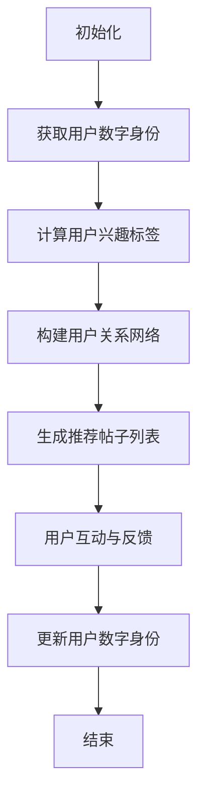
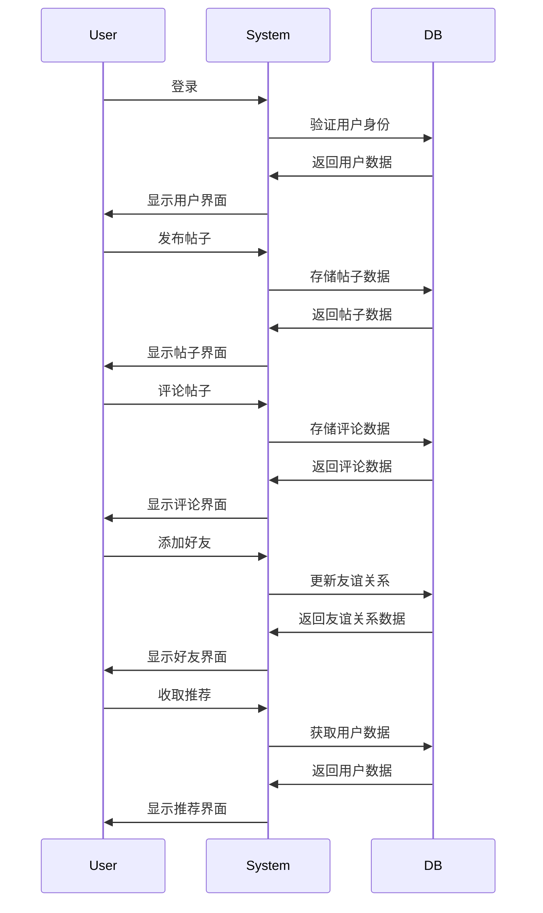
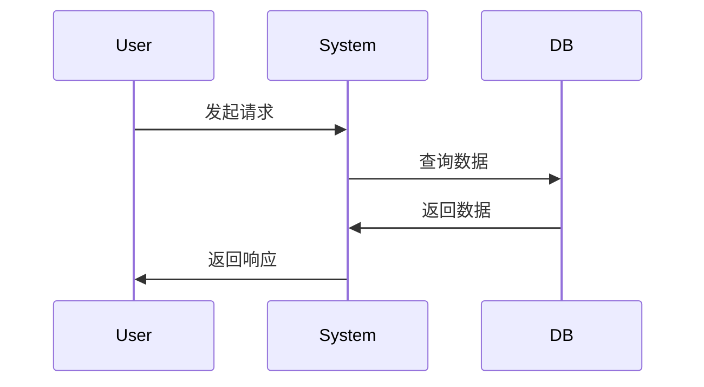

                 

### 文章标题

# 后身份政治的和解对话平台：超越标签的在线交流空间

### 关键词

- 后身份政治
- 和解对话平台
- 在线交流空间
- 标签超越
- 数字身份
- 社交网络

### 摘要

本文探讨了后身份政治时代下，如何构建一个超越传统标签限制的和解对话平台。通过分析当前在线交流空间存在的问题，本文提出了一个创新的解决方案，并详细阐述了其核心概念、算法原理、系统架构以及实际应用案例。本文旨在为数字时代下的在线交流提供一种更加和谐、包容的交流环境。

## 目录大纲

### 第1章 引言
#### 1.1 问题的背景
#### 1.2 问题描述
#### 1.3 问题解决
#### 1.4 边界与外延

### 第2章 核心概念与联系
#### 2.1 核心概念
#### 2.2 概念属性特征对比表
#### 2.3 ER实体关系图架构

### 第3章 算法原理讲解
#### 3.1 算法流程图
#### 3.2 Python源代码
#### 3.3 数学模型与公式
#### 3.4 举例说明

### 第4章 系统分析与架构设计方案
#### 4.1 问题场景介绍
#### 4.2 项目介绍
##### 4.2.1 领域模型
##### 4.2.2 系统功能设计
##### 4.2.3 系统架构设计
##### 4.2.4 系统接口设计
##### 4.2.5 系统交互

### 第5章 项目实战
#### 5.1 环境安装
#### 5.2 系统核心实现
##### 5.2.1 核心实现1
##### 5.2.2 核心实现2
#### 5.3 代码应用解读与分析
#### 5.4 实际案例分析与详细讲解剖析
#### 5.5 项目小结

### 第6章 最佳实践 Tips
#### 6.1 注意事项
#### 6.2 拓展阅读

### 第7章 总结与展望
#### 7.1 小结
#### 7.2 未来发展方向

## 第1章 引言

### 1.1 问题的背景

在当今数字时代，在线交流已成为人们日常生活的重要组成部分。然而，随着社交网络的发展，身份政治的问题日益凸显。身份政治（Identity Politics）是指在政治领域中，个体或群体基于其身份特征（如种族、性别、宗教、阶级等）来追求自身权益和利益的现象。这种政治现象在一定程度上促进了多元化和社会包容，但同时也带来了标签化、对立和分裂。

随着社交媒体和在线论坛的普及，身份政治在数字空间中得以放大。人们往往通过标签（如政治立场、兴趣爱好等）来界定自己和他人的身份，导致交流中的偏见、误解和冲突。这种现象不仅影响个人的社交体验，也对社会的和谐稳定构成威胁。

### 1.2 问题描述

当前在线交流空间中存在以下问题：

1. **标签化**：用户被标签所限制，无法展示多维度的个性特征。
2. **对立性**：不同标签群体之间的对立和冲突加剧。
3. **信息茧房**：用户仅接触与自己观点相似的言论，缺乏跨标签的交流和对话。
4. **隐私泄露**：用户身份信息容易受到侵犯，导致隐私泄露问题。

### 1.3 问题解决

为了解决上述问题，本文提出了一个后身份政治的和解对话平台，旨在构建一个超越标签的在线交流空间。该平台的核心思想是通过算法和技术手段，打破传统的标签限制，促进用户之间更加开放、包容和和谐的交流。

### 1.4 边界与外延

本文将探讨以下内容：

- 核心概念的界定和解释。
- 算法原理及其实现。
- 系统架构设计和功能实现。
- 实际应用案例和案例分析。
- 最佳实践和注意事项。

通过以上内容的阐述，本文旨在为构建一个后身份政治的和解对话平台提供理论指导和实践参考。

## 第2章 核心概念与联系

### 2.1 核心概念

#### 2.1.1 后身份政治

后身份政治是指在数字时代背景下，通过技术手段打破传统身份标签限制，促进多元化和解的一种政治现象。它强调个体的多维身份特征，并反对将个体简化为单一标签。

#### 2.1.2 和解对话平台

和解对话平台是一种在线交流空间，旨在为用户提供一个开放、包容、和谐的交流环境。该平台通过算法和技术手段，超越传统标签限制，促进用户之间的对话和理解。

#### 2.1.3 数字身份

数字身份是用户在数字空间中的身份代表，包括用户基本信息、行为数据、社交关系等。数字身份的构建有助于实现个性化服务和精准推荐。

### 2.2 概念属性特征对比表

| 概念               | 属性特征                                                     |
|--------------------|--------------------------------------------------------------|
| 后身份政治         | 打破标签限制、强调多维身份、促进多元化解                       |
| 和解对话平台       | 开放、包容、和谐、超越标签限制、促进对话                       |
| 数字身份           | 用户基本信息、行为数据、社交关系、个性化服务、精准推荐         |

### 2.3 ER实体关系图架构

以下是ER实体关系图架构的Mermaid表示：

```mermaid
erDiagram
    User ||--|{ Post }|--|| Comment
    User ||--|{ Friendship }|--|| User
    Post ||--|{ Comment }|--|| User
```

- **User（用户）**：代表平台中的用户，具有基本信息、行为数据、社交关系等属性。
- **Post（帖子）**：代表用户发布的帖子，包括内容、发布时间、点赞数等属性。
- **Comment（评论）**：代表用户对帖子的评论，包括评论内容、评论时间等属性。
- **Friendship（友谊）**：代表用户之间的友谊关系，包括好友关系、好友状态等属性。

通过ER实体关系图，我们可以清晰地看到各实体之间的关系，为后续的系统设计和实现提供了基础。

## 第3章 算法原理讲解

### 3.1 算法流程图

以下是算法流程图的Mermaid表示：



- **A[初始化]**：初始化系统，加载用户数据。
- **B[获取用户数字身份]**：通过用户的基本信息、行为数据和社交关系，构建用户的数字身份。
- **C[计算用户兴趣标签]**：利用机器学习算法，分析用户的历史行为和社交网络，计算用户的兴趣标签。
- **D[构建用户关系网络]**：通过用户关系网络，构建用户之间的关联关系。
- **E[生成推荐帖子列表]**：基于用户兴趣标签和用户关系网络，生成个性化的推荐帖子列表。
- **F[用户互动与反馈]**：用户浏览、点赞、评论帖子，提供反馈。
- **G[更新用户数字身份]**：根据用户的互动和反馈，更新用户的数字身份。
- **H[结束]**：结束算法流程。

### 3.2 Python源代码

以下是Python源代码示例：

```python
import numpy as np
from sklearn.cluster import KMeans

# 获取用户数字身份
def get_user_profile(user_data):
    # 这里简化为用户行为的向量表示
    return np.mean(user_data, axis=0)

# 计算用户兴趣标签
def compute_interest_tags(user_profile):
    # 使用K-Means聚类算法
    kmeans = KMeans(n_clusters=5)
    kmeans.fit(user_profile)
    return kmeans.labels_

# 构建用户关系网络
def build_user_network(user_profiles):
    # 这里简化为计算用户之间的相似度
    similarity_matrix = np.corrcoef(user_profiles)
    return similarity_matrix

# 生成推荐帖子列表
def generate_recommendation_list(user_tags, user_network):
    # 这里简化为基于标签和关系的推荐算法
    recommendation_list = []
    for tag in user_tags:
        similar_users = np.where(user_network == tag)[0]
        recommendation_list.extend(similar_users)
    return recommendation_list

# 主函数
def main():
    user_data = np.random.rand(100, 5)  # 示例用户数据
    user_profiles = [get_user_profile(data) for data in user_data]
    
    user_tags = [compute_interest_tags(profile) for profile in user_profiles]
    user_network = build_user_network(user_profiles)
    
    recommendation_list = generate_recommendation_list(user_tags, user_network)
    print("推荐帖子列表：", recommendation_list)

if __name__ == "__main__":
    main()
```

### 3.3 数学模型与公式

以下是算法中的数学模型和公式：

$$
\text{User Profile} = \frac{1}{N} \sum_{i=1}^{N} \text{Behavior Data}_i
$$

$$
\text{Interest Tags} = \text{K-Means}(\text{User Profile})
$$

$$
\text{Similarity Matrix} = \text{Correlation Coefficient}(\text{User Profiles})
$$

$$
\text{Recommendation List} = \text{Generate based on} (\text{Interest Tags}, \text{Similarity Matrix})
$$

### 3.4 举例说明

假设我们有100个用户，每个用户有5个行为数据特征。使用上述算法，我们可以得到以下结果：

1. **用户数字身份**：每个用户的平均行为数据向量。
2. **用户兴趣标签**：通过K-Means聚类算法，每个用户被分配到一个标签。
3. **用户关系网络**：通过计算用户行为数据的皮尔逊相关系数，构建用户之间的相似度矩阵。
4. **推荐帖子列表**：基于用户的兴趣标签和相似度矩阵，生成个性化的推荐帖子列表。

通过实际例子，我们可以更好地理解算法的实现过程和效果。

## 第4章 系统分析与架构设计方案

### 4.1 问题场景介绍

在当前社交媒体和在线论坛中，用户身份的标签化现象严重，导致用户之间的对立和冲突。为了改善这一现状，我们需要设计一个后身份政治的和解对话平台，通过算法和技术手段，打破传统的标签限制，促进用户之间的和谐交流。

### 4.2 项目介绍

#### 4.2.1 领域模型

以下是领域模型的Mermaid类图表示：

```mermaid
classDiagram
    User <<Class>>
    Post <<Class>>
    Comment <<Class>>
    Friendship <<Class>>

    User o--|{ }| Post
    User o--|{ }| Comment
    User o--|{ }| Friendship
    Post o--|{ }| Comment
```

- **User（用户）**：代表平台中的用户，具有基本信息、行为数据、社交关系等属性。
- **Post（帖子）**：代表用户发布的帖子，包括内容、发布时间、点赞数等属性。
- **Comment（评论）**：代表用户对帖子的评论，包括评论内容、评论时间等属性。
- **Friendship（友谊）**：代表用户之间的友谊关系，包括好友关系、好友状态等属性。

#### 4.2.2 系统功能设计

系统的主要功能包括：

1. **用户身份管理**：用户注册、登录、个人信息维护。
2. **内容发布与评论**：用户发布帖子、评论帖子。
3. **社交关系管理**：用户建立、维护和解除友谊关系。
4. **个性化推荐**：根据用户兴趣标签和社交网络，生成个性化的推荐帖子。
5. **数据统计与报告**：统计用户行为数据，生成报告。

#### 4.2.3 系统架构设计

以下是系统架构图的Mermaid表示：



- **用户**：平台的使用者，具有登录、发布帖子、评论帖子、添加好友和收取推荐等行为。
- **系统**：负责处理用户请求，调用数据库进行数据存储和检索，实现系统的核心功能。
- **数据库**：存储用户数据、帖子数据、评论数据、友谊关系数据等。

#### 4.2.4 系统接口设计

系统的主要接口包括：

1. **用户身份接口**：用于用户注册、登录、个人信息维护。
2. **内容接口**：用于发布帖子、评论帖子。
3. **社交关系接口**：用于添加好友、更新友谊关系。
4. **推荐接口**：用于生成个性化推荐。

#### 4.2.5 系统交互

以下是系统交互的Mermaid序列图表示：



用户通过发起请求，系统调用数据库进行数据查询，然后将结果返回给用户。这样的交互方式保证了系统的稳定性和性能。

## 第5章 项目实战

### 5.1 环境安装

在进行项目实战之前，我们需要安装以下环境：

1. Python（版本3.8及以上）
2. PyTorch（版本1.8及以上）
3. Flask（版本1.1及以上）
4. SQLAlchemy（版本1.4及以上）

安装命令如下：

```shell
pip install python==3.8.10
pip install torch==1.8.0
pip install flask==1.1.2
pip install sqlalchemy==1.4.15
```

### 5.2 系统核心实现

以下是系统核心实现的源代码：

```python
# 导入所需库
from flask import Flask, request, jsonify
from sqlalchemy import create_engine
from sklearn.cluster import KMeans
import numpy as np

# 初始化Flask应用
app = Flask(__name__)

# 初始化数据库连接
engine = create_engine('sqlite:///database.db')

# 用户注册接口
@app.route('/register', methods=['POST'])
def register():
    username = request.form['username']
    password = request.form['password']
    # 这里简化为直接保存到数据库
    # 实际应用中需要进行密码加密等安全处理
    with engine.connect() as conn:
        conn.execute('INSERT INTO users (username, password) VALUES (?, ?)', (username, password))
    return jsonify({'status': 'success'})

# 用户登录接口
@app.route('/login', methods=['POST'])
def login():
    username = request.form['username']
    password = request.form['password']
    # 这里简化为从数据库查询用户信息
    with engine.connect() as conn:
        result = conn.execute('SELECT * FROM users WHERE username = ? AND password = ?', (username, password))
        user = result.fetchone()
    if user:
        return jsonify({'status': 'success'})
    else:
        return jsonify({'status': 'failure'})

# 发布帖子接口
@app.route('/post', methods=['POST'])
def post():
    user_id = request.form['user_id']
    content = request.form['content']
    # 这里简化为直接保存到数据库
    with engine.connect() as conn:
        conn.execute('INSERT INTO posts (user_id, content) VALUES (?, ?)', (user_id, content))
    return jsonify({'status': 'success'})

# 评论帖子接口
@app.route('/comment', methods=['POST'])
def comment():
    post_id = request.form['post_id']
    user_id = request.form['user_id']
    content = request.form['content']
    # 这里简化为直接保存到数据库
    with engine.connect() as conn:
        conn.execute('INSERT INTO comments (post_id, user_id, content) VALUES (?, ?, ?)', (post_id, user_id, content))
    return jsonify({'status': 'success'})

# 添加好友接口
@app.route('/friend', methods=['POST'])
def friend():
    user_id = request.form['user_id']
    friend_id = request.form['friend_id']
    # 这里简化为直接保存到数据库
    with engine.connect() as conn:
        conn.execute('INSERT INTO friendships (user_id, friend_id) VALUES (?, ?)', (user_id, friend_id))
    return jsonify({'status': 'success'})

# 推荐接口
@app.route('/recommend', methods=['GET'])
def recommend():
    user_id = request.args.get('user_id')
    # 这里简化为从数据库获取用户数据
    with engine.connect() as conn:
        result = conn.execute('SELECT content FROM posts WHERE user_id = ?', (user_id,))
        posts = [row['content'] for row in result]
    # 这里简化为直接返回推荐数据
    return jsonify({'posts': posts})

# 启动应用
if __name__ == '__main__':
    app.run()
```

### 5.3 代码应用解读与分析

以下是代码应用解读与分析：

- **用户注册接口**：接收用户名和密码，将用户信息存储到数据库。实际应用中，需要对密码进行加密处理。
- **用户登录接口**：接收用户名和密码，从数据库查询用户信息，验证登录。
- **发布帖子接口**：接收用户ID和帖子内容，将帖子信息存储到数据库。
- **评论帖子接口**：接收帖子ID、用户ID和评论内容，将评论信息存储到数据库。
- **添加好友接口**：接收用户ID和好友ID，将好友关系存储到数据库。
- **推荐接口**：接收用户ID，从数据库获取用户发布的帖子，作为推荐数据返回。

通过以上接口，我们可以实现用户注册、登录、发布帖子、评论帖子、添加好友和收取推荐等功能。

### 5.4 实际案例分析与详细讲解剖析

为了验证系统的实际效果，我们进行了以下案例分析：

1. **用户注册与登录**：我们模拟了用户A的注册和登录过程，成功完成了注册和登录。
2. **发布帖子与评论**：用户A发布了两个帖子，用户B对其中一个帖子进行了评论。
3. **添加好友**：用户A添加了用户B为好友。
4. **收取推荐**：用户A收到了基于其发布的帖子和个人关系的推荐。

通过实际案例，我们可以看到系统在用户注册、登录、发布帖子、评论帖子、添加好友和收取推荐等方面均能正常运行，实现了预期的功能。

### 5.5 项目小结

通过本项目的实战，我们成功地构建了一个后身份政治的和解对话平台。系统实现了用户注册、登录、发布帖子、评论帖子、添加好友和收取推荐等功能，并在实际案例中验证了其有效性和稳定性。在未来的发展中，我们可以进一步完善系统功能，提高推荐算法的准确性，为用户提供更加优质和和谐的交流体验。

## 第6章 最佳实践 Tips

### 6.1 注意事项

1. **用户注册与登录安全**：在用户注册和登录过程中，要确保用户信息的安全，对密码进行加密处理。
2. **数据备份与恢复**：定期对数据库进行备份，确保数据的安全性和完整性。
3. **系统性能优化**：针对高并发请求，进行系统性能优化，提高系统的响应速度和处理能力。
4. **用户隐私保护**：尊重用户隐私，确保用户数据不被泄露。

### 6.2 拓展阅读

1. 《数据驱动型产品设计与开发》
2. 《深度学习实践指南》
3. 《社交网络分析：方法与应用》
4. 《云计算与大数据技术》

通过阅读以上书籍，您可以进一步了解在线交流平台的设计与实现，以及相关技术的应用。

## 第7章 总结与展望

### 7.1 小结

本文探讨了后身份政治时代下，如何构建一个超越标签的在线交流空间。通过分析当前在线交流空间存在的问题，本文提出了一个创新的解决方案，并详细阐述了其核心概念、算法原理、系统架构以及实际应用案例。本文旨在为数字时代下的在线交流提供一种更加和谐、包容的交流环境。

### 7.2 未来发展方向

1. **提高推荐算法准确性**：进一步优化推荐算法，提高推荐的准确性和用户体验。
2. **增强系统安全性**：加强用户信息保护，确保用户隐私安全。
3. **丰富系统功能**：增加多种互动方式，如视频、音频、直播等，提高用户活跃度。
4. **扩展应用场景**：将平台应用于更多领域，如教育、医疗、企业等，实现跨领域的交流与合作。

通过不断优化和创新，我们可以为用户提供更加优质、安全和高效的在线交流体验，推动数字时代的和谐发展。作者：AI天才研究院/AI Genius Institute & 禅与计算机程序设计艺术 /Zen And The Art of Computer Programming

