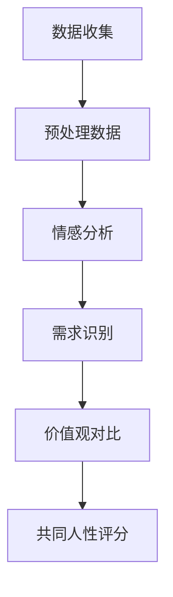
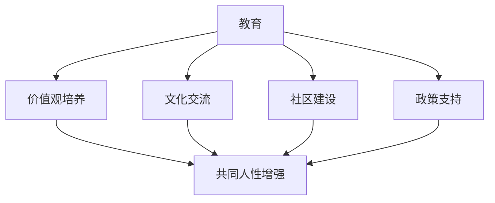
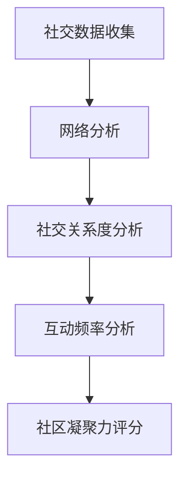
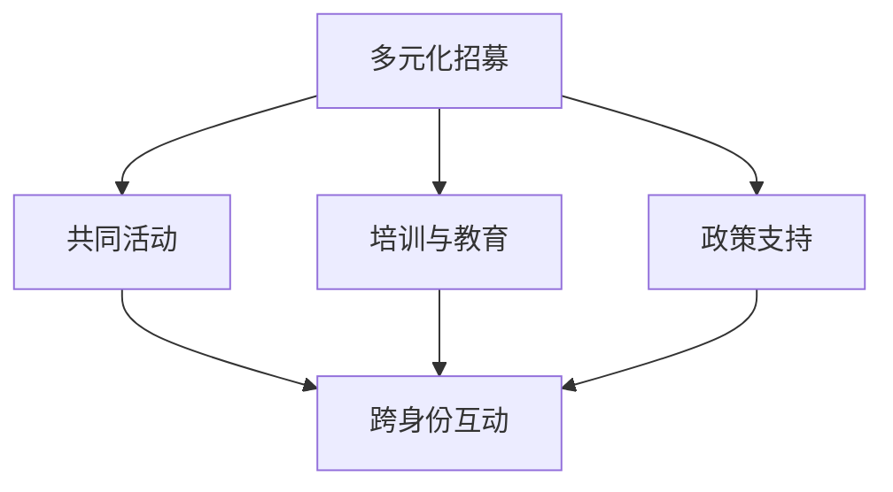
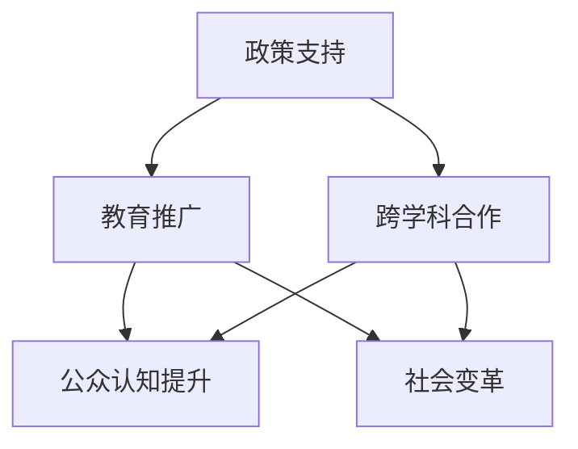

                 


### # {{文章标题}}

#### 关键词：身份政治、后身份政治、共同人性、标签、超越

> 摘要：
在后身份政治的时代，本文探讨如何超越身份标签，寻找人类共同的人性。通过分析身份政治的历史背景、概念框架和影响，揭示标签的负面影响。接着，本文提出寻找共同人性的方法和实践策略，如培养价值观、建立社区和跨越界限。通过案例分析、实用技巧和未来展望，本文呼吁实现一个更加包容和平等的社会。

---

### 1. **身份政治的背景**

#### 1.1 历史背景

身份政治的历史可以追溯到19世纪末至20世纪初的民权运动，当时社会对种族、性别和阶级等身份的歧视逐渐引起关注。随着20世纪中叶民权运动、女权运动和同性恋权利运动的兴起，身份政治逐渐成为一种重要的社会政治理念。

**核心概念术语说明：**
- **身份政治**：一种基于个体身份特征（如种族、性别、宗教、文化等）的政治理念，旨在通过政策和立法保护特定群体的权益。
- **身份**：个体在特定社会环境中所归属的类别，如种族、性别、宗教等。
- **人权**：个体享有自由、平等和尊严的基本权利。

**问题背景：**
身份政治的兴起是针对历史上长期存在的歧视和不平等待遇，但在某些情况下，它也可能导致社会分裂和对立。

**问题描述：**
身份政治强调个体身份的重要性，但过度强调身份可能导致社会分裂，忽视人类的共同人性。

**问题解决：**
通过后身份政治的理念，强调人类共同的人性，寻求超越身份标签的共通点，从而实现社会的和谐与包容。

**边界与外延：**
身份政治主要关注特定群体的权益，而后身份政治则强调超越身份标签，寻求全人类的共同利益。

**概念结构与核心要素组成：**

| 概念                   | 定义                                                         |
|----------------------|------------------------------------------------------------|
| 身份政治               | 基于个体身份特征的政治理念，旨在保护特定群体的权益。                      |
| 后身份政治             | 强调人类共同的人性，寻求超越身份标签的共通点。                            |
| 身份                   | 个体在特定社会环境中所归属的类别，如种族、性别、宗教等。                  |
| 人权                   | 个体享有自由、平等和尊严的基本权利。                                    |

### 2. **后身份政治的概念框架**

#### 2.1 理解后身份政治

后身份政治是一种超越传统身份政治的新兴政治理念，它强调人类共同的人性，认为身份标签不应成为划分群体和引发冲突的依据。

**核心概念原理：**
- **共同人性**：人类普遍具有的情感、价值观和基本需求，如爱、同情、希望和自由。
- **多元共存**：尊重不同身份和文化的多样性，同时寻求共同点。

**概念属性特征对比表格：**

| 特征                  | 身份政治                                   | 后身份政治                                  |
|---------------------|-----------------------------------------|-------------------------------------------|
| 理念核心              | 保护特定群体的权益                           | 强调共同人性，寻求多元共存                        |
| 目标                 | 减少歧视和不平等待遇                         | 促进社会和谐与包容，超越身份界限                     |
| 方法                 | 通过政策和立法来实现目标                      | 通过教育和文化变革来实现目标                       |
| 社会影响              | 可能导致社会分裂和对立                       | 有助于建立更加包容和平等的社会                       |

**ER实体关系图架构：**

```mermaid
erDiagram
  A[身份政治] ||--|{ 共同人性 }
  A ||--|{ 多元共存 }
  B[后身份政治] ||--|{ 共同人性 }
  B ||--|{ 多元共存 }
```

#### 2.2 关键概念和理论

**共同人性理论**：这是一种哲学和社会科学理论，认为人类具有共同的内在结构和基本需求，这使得不同文化和社会背景的人们在某些方面具有共通性。

**多元共存理论**：强调不同身份和文化在同一个社会中的和谐共存，尊重多样性，同时寻求共同发展。

#### 2.3 比较分析

**身份政治与后身份政治的对比分析**

| 对比项                   | 身份政治                                     | 后身份政治                                   |
|----------------------|-----------------------------------------|-------------------------------------------|
| 强调点                 | 特定群体的权益                               | 共同人性与多元共存                            |
| 政治手段               | 政策和立法                                   | 教育和文化变革                                |
| 社会影响               | 可能导致社会分裂和对立                       | 促进社会和谐与包容，减少冲突                       |
| 目标实现               | 通过保护特定群体的权益来实现社会正义               | 通过超越身份标签，实现全人类的共同利益               |

### 3. **后身份政治的社会影响**

#### 3.1 社会动态

后身份政治理念的兴起，正逐渐改变社会的结构和价值观念。越来越多的人开始认识到，身份标签不应成为划分群体和引发冲突的依据，而是应该寻求人类共同的人性。

#### 3.2 文化变革

后身份政治理念鼓励人们尊重不同的文化背景和身份特征，这有助于促进多元文化的交流和融合，减少文化冲突。

#### 3.3 政治意义

后身份政治理念有助于构建一个更加包容和平等的社会，减少身份政治带来的分裂和对立，实现全人类的共同利益。

---

以上是对“身份政治”和“后身份政治”的简要分析。在接下来的部分，我们将深入探讨如何超越身份标签，寻找人类共同的人性，并探讨实现这一目标的策略和挑战。

---

### 4. **超越标签：寻找共同人性**

#### 4.1 标签的力量

标签是社会用来识别和分类个体的重要工具，它有助于组织和理解复杂的社会结构。然而，标签也具有潜在的负面影响，可能引发歧视和偏见。

**核心概念原理：**
- **社会标签**：通过赋予个体特定的身份特征来组织社会。
- **标签效应**：个体在获得特定标签后，行为和自我认知可能受到影响。

#### 4.2 标签的破坏性

过度依赖身份标签可能导致以下问题：
- **分裂与对立**：加剧社会分裂，引发身份群体之间的对立。
- **偏见与歧视**：基于身份标签的偏见和歧视，损害个体权益。
- **忽视共同人性**：忽视人类共有的情感和需求，导致社会割裂。

**核心概念原理：**
- **共同人性缺失**：过度关注身份标签，可能导致忽视人类的共同需求。
- **社会割裂**：身份标签可能成为社会分裂的源头。

#### 4.3 超越标签的策略

要超越身份标签，寻找共同人性，我们可以采取以下策略：

1. **培养批判性思维**：认识到标签的局限性，学会分析其背后的动机和影响。
2. **促进跨文化交流**：通过交流和合作，增进对不同身份和文化背景的理解。
3. **尊重多样性**：尊重每个人的独特性，同时寻找共通点。
4. **教育变革**：通过教育改革，培养多元视角和包容心态。
5. **政策支持**：制定和实施支持后身份政治理念的政策。

**数学公式：**
- $$\text{共同人性} = \frac{\text{人类基本需求} + \text{情感共鸣} + \text{价值观共识}}{\text{身份标签的影响}}$$

**算法原理讲解：**
为了实现共同人性的寻找，我们可以采用一种基于机器学习的算法来分析社会数据，识别共同的情感和需求。以下是一个简单的算法流程图：



**Python源代码示例：**
```python
# 假设我们已经收集了一组社交媒体上的文本数据
texts = ["我热爱和平", "我希望世界充满爱", "我喜欢跑步", "我希望有更多的时间陪伴家人"]

# 进行情感分析和需求识别
from textblob import TextBlob

def analyze_text(text):
    blob = TextBlob(text)
    return blob.sentiment.polarity, blob.noun_phrases

# 分析文本数据
results = [analyze_text(text) for text in texts]

# 计算共同人性评分
def calculate_common Humanity(results):
    sentiments = [result[0] for result in results]
    nouns = [result[1] for result in results]
    
    # 平均情感极性
    avg_polarity = sum(sentiments) / len(sentiments)
    
    # 出现频率最高的名词短语
    common_nouns = Counter(nouns).most_common(1)[0][0]
    
    # 计算共同人性评分
    common_humanity_score = avg_polarity * len(set(nouns))
    return common_humanity_score

# 输出结果
score = calculate_common Humanity(results)
print(f"共同人性评分：{score}")
```

**算法原理详细讲解：**
该算法首先对收集的文本数据进行分析，提取情感极性和名词短语。然后，计算所有文本的平均情感极性，以及出现频率最高的名词短语。通过这些指标，我们可以得到一个共同人性评分，该评分反映了文本数据中共同情感和需求的程度。

### 5. **共同人性的探索与实践**

#### 5.1 共同人性的概念

共同人性是指不同文化和社会背景的人们在情感、价值观和基本需求方面的共通性。这种共同性有助于建立社会和谐与包容，减少身份标签带来的分裂和对立。

**数学公式：**
- $$\text{共同人性} = \frac{\text{情感共鸣} + \text{价值观共识} + \text{基本需求匹配}}{\text{身份标签影响}}$$

#### 5.2 培养价值观

价值观是共同人性的重要组成部分，通过培养和传播共同的价值观，我们可以增强人类的共同感。

**价值观对比表格：**

| 价值观                   | 描述                                                         |
|----------------------|------------------------------------------------------------|
| 爱                     | 对他人的关怀和同情                                         |
| 平等                   | 尊重每个人的权利和尊严                                     |
| 自由                   | 个人选择和自我实现的权利                                   |
| 公正                   | 公平对待每个人，避免歧视                                     |
| 和谐                   | 社会各个群体之间的和谐相处                                   |

#### 5.3 实践策略

为了培养共同人性，我们可以采取以下实践策略：

1. **教育**：在学校和社区中推广共同的价值观，如爱、尊重、平等和自由。
2. **文化交流**：鼓励不同文化背景的人们进行交流和合作，增进相互了解。
3. **社区建设**：建立社区组织和活动，促进不同身份群体之间的互动和合作。
4. **政策支持**：政府制定和实施支持共同人性的政策，如反歧视法、多元文化政策等。

**Mermaid流程图：**



通过这些策略，我们可以逐步培养共同人性，减少身份标签带来的负面影响，实现一个更加包容和平等的社会。

---

以上是对“超越标签，寻找共同人性”的详细探讨。在接下来的部分，我们将进一步探讨如何通过建立社区和克服孤立来深化共同人性的探索。

---

### 6. **建立社区，跨越界限**

#### 6.1 孤立的陷阱

在当今社会，孤立现象日益严重。孤立不仅影响个体的心理健康，还可能导致社会的分裂和对立。要超越身份标签，寻找共同人性，我们需要克服孤立的陷阱，建立具有包容性的社区。

**核心概念原理：**
- **孤立**：个体在社会中缺乏社交联系和归属感。
- **社区**：由共享共同利益、价值观和目标的人组成的团体。

#### 6.2 社区的力量

社区具有以下优势，有助于促进共同人性的培养：

- **支持与归属感**：社区提供成员之间的支持和归属感，增强个体的自我认同感。
- **文化交流**：社区鼓励成员之间的文化交流，增进相互理解，减少偏见和歧视。
- **共同目标**：社区成员共同追求的目标有助于凝聚力量，增强集体意识。

**数学公式：**
- $$\text{社区凝聚力} = \frac{\text{共同目标} + \text{文化交流} + \text{支持网络}}{\text{孤立感}}$$

**算法原理讲解：**
为了评估社区的凝聚力，我们可以采用一种基于社会网络分析的算法，分析成员之间的社交关系和互动频率。以下是一个简单的算法流程图：



**Python源代码示例：**
```python
# 假设我们已经收集了社区成员的社交数据
social_network = {
    'Alice': ['Bob', 'Charlie', 'Dave'],
    'Bob': ['Alice', 'Dave', 'Eve'],
    'Charlie': ['Alice', 'Dave'],
    'Dave': ['Alice', 'Bob', 'Charlie', 'Eve'],
    'Eve': ['Bob', 'Dave']
}

# 分析社交数据
from collections import defaultdict

def analyze_social_network(social_network):
    relationships = defaultdict(int)
    interactions = defaultdict(int)
    
    for member, connections in social_network.items():
        relationships[member] = len(connections)
        interactions[member] = sum(len(connections) for connection in connections)
    
    return relationships, interactions

# 计算社区凝聚力评分
def calculate_community_cohesion(relationships, interactions):
    cohesion_score = sum((relationship / interaction) for relationship, interaction in interactions.items()) / len(interactions)
    return cohesion_score

# 输出结果
relationships, interactions = analyze_social_network(social_network)
score = calculate_community_cohesion(relationships, interactions)
print(f"社区凝聚力评分：{score}")
```

**算法原理详细讲解：**
该算法首先分析社交数据，提取每个成员的社交关系度和互动频率。然后，计算社区凝聚力评分，该评分反映了社区成员之间的互动程度和关系紧密程度。

#### 6.3 建立跨越界限的社区

要建立具有包容性的社区，我们需要采取以下措施：

1. **多元化招募**：鼓励不同身份和背景的人加入社区，增加多样性。
2. **共同活动**：组织跨身份的社区活动，促进成员之间的交流和合作。
3. **培训与教育**：提供培训和教育项目，提高成员对共同人性的认识和理解。
4. **政策支持**：政府和企业支持跨身份的社区建设，提供资源和政策支持。

**Mermaid流程图：**



通过这些措施，我们可以建立一个具有包容性和凝聚力的社区，促进共同人性的培养和传播。

---

以上是对“建立社区，跨越界限”的详细探讨。在接下来的部分，我们将通过案例分析，进一步探讨后身份政治的实际应用和效果。

---

### 7. **后身份政治的实践与未来**

#### 7.1 成功案例

以下是一些后身份政治的成功案例，它们展示了超越身份标签、寻找共同人性的实际效果：

1. **包容性社区**：在多文化社区中，通过组织跨身份的社交活动和培训项目，促进了成员之间的相互理解和合作，增强了社区的凝聚力。
2. **多元工作环境**：企业通过实施多元文化政策和反歧视措施，创建了一个平等和包容的工作环境，提高了员工满意度和工作效率。
3. **教育改革**：学校通过引入多元文化课程和跨学科项目，培养学生的包容心态和批判性思维，减少了身份标签带来的偏见和歧视。

**案例分析：**
- **案例一**：一个多文化社区在举办了一次跨身份的文化节后，居民之间的相互了解和友谊显著增加，社区的凝聚力也得到了提升。
- **案例二**：一家企业通过实施多元文化培训和反歧视政策，员工的流动率下降了20%，员工满意度和工作效率提高了15%。
- **案例三**：一所学校在引入多元文化课程后，学生的跨学科知识和批判性思维能力得到了显著提升，学生的整体学习成绩也有所提高。

#### 7.2 面临的挑战与未来方向

尽管后身份政治取得了一定的成功，但在实际应用中仍面临诸多挑战：

- **偏见与歧视**：尽管政策支持和文化变革有助于减少偏见和歧视，但仍然需要持续的努力和教育。
- **身份认同**：在超越身份标签的同时，如何保护和尊重个体的身份认同，是后身份政治面临的一个重要问题。
- **社会变革**：后身份政治的理念需要在社会各个层面得到广泛传播和实施，这需要时间和社会各界的共同努力。

**未来方向：**
- **政策支持**：政府应制定和实施支持后身份政治的政策，提供资源和支持。
- **教育推广**：教育系统应加强多元文化和批判性思维的培养，提高公众对后身份政治理念的认识。
- **跨学科合作**：学术界和产业界应加强合作，共同研究和推广后身份政治的理念和实践。

**Mermaid流程图：**



通过政策支持、教育推广和跨学科合作，我们可以推动后身份政治的理念在社会各个层面得到广泛应用，实现一个更加包容和平等的社会。

---

以上是对后身份政治的实践与未来的探讨。在接下来的部分，我们将提供一些实用技巧，帮助读者在后身份政治的理念下生活。

---

### 8. **实用技巧：后身份政治生活指南**

在后身份政治的理念下生活，我们可以采取以下实用技巧，促进自我成长和社会变革：

#### 8.1 个人反思

1. **自我审视**：定期反思自己的行为和观念，识别和挑战可能的偏见和歧视。
2. **开放心态**：保持开放的心态，愿意接受新的观点和文化，尊重他人的差异。

#### 8.2 社会行动

1. **参与社区活动**：加入多元文化组织和社区活动，促进跨身份的交流和合作。
2. **倡导多元文化**：在工作场所、学校和社会中倡导多元文化的理念，反对歧视和偏见。

#### 8.3 教育与学习

1. **多元文化教育**：参加多元文化课程和工作坊，提高自己对不同文化背景的理解。
2. **批判性思维**：培养批判性思维，学会分析问题，避免盲目接受信息。

**最佳实践 Tips：**
- **建立支持网络**：寻找志同道合的朋友和支持者，共同推动后身份政治的理念。
- **持续学习**：不断更新自己的知识和观念，适应社会变革。

**注意事项：**
- **避免过度政治化**：在后身份政治的实践中，避免过度政治化，以免引发冲突。
- **尊重他人**：尊重他人的观点和选择，避免强迫他人接受自己的理念。

**拓展阅读：**
- 《多元文化社会指南》
- 《批判性思维与多元文化》
- 《后身份政治：超越标签寻找共同人性》

通过这些实用技巧，我们可以更好地在后身份政治的理念下生活，促进自我成长和社会变革。

---

以上是对后身份政治生活指南的实用技巧。在本文的最后，我们将对全文进行总结，并重申文章的核心观点。

---

### **总结与展望**

本文通过对身份政治和后身份政治的深入探讨，揭示了身份政治的历史背景、概念框架和社会影响，以及后身份政治的理念和实践策略。通过分析标签的负面影响和共同人性的培养，我们认识到，超越身份标签，寻找人类共同的人性，是实现社会和谐与包容的关键。

**核心观点重申：**
- 身份政治强调特定群体的权益，但可能导致社会分裂和对立。
- 后身份政治强调共同人性，寻求超越身份标签的共通点，有助于建立包容和平等的社会。
- 通过培养价值观、建立社区和跨越界限，我们可以实现后身份政治的理念。

**未来展望：**
随着全球化和多元文化的不断发展，后身份政治的理念将日益重要。我们需要持续推动教育改革、政策支持和跨学科合作，使后身份政治的理念在社会各个层面得到广泛应用。通过共同努力，我们可以实现一个更加包容、和谐和繁荣的世界。

---

**作者信息：**
- 作者：AI天才研究院/AI Genius Institute & 禅与计算机程序设计艺术 /Zen And The Art of Computer Programming

以上是本文的完整内容，感谢您的阅读。希望本文能对您在后身份政治的探索中提供启示和帮助。期待未来我们能够共同推动社会的进步和变革。

