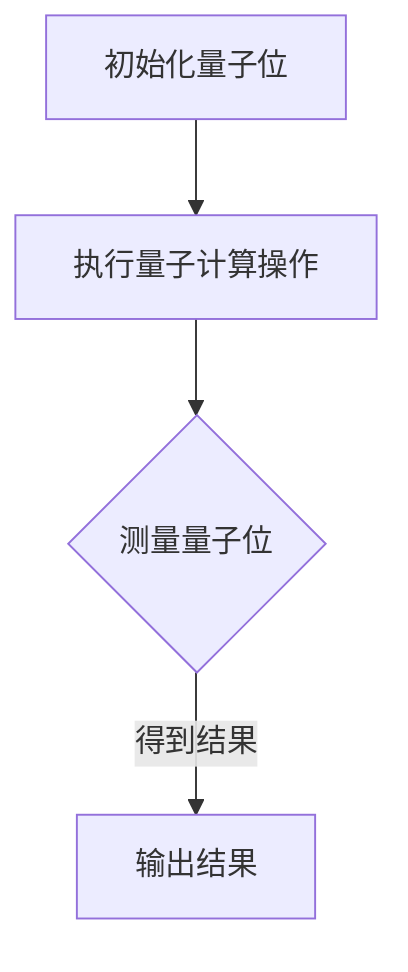
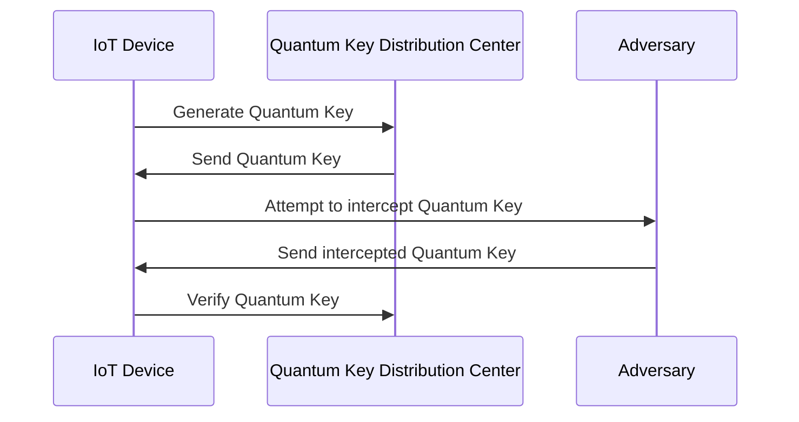
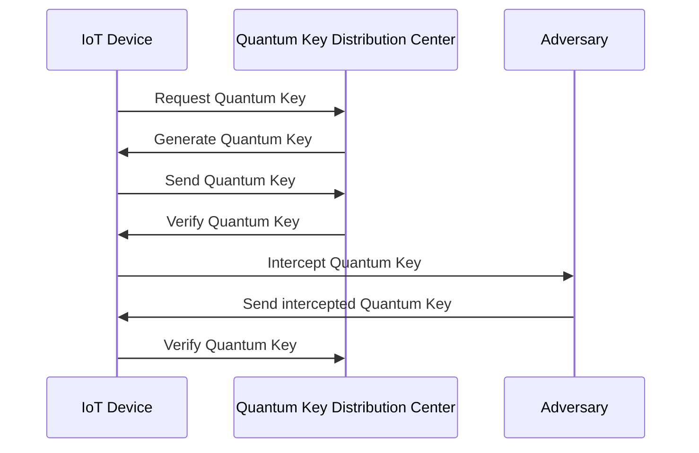

                 

### 后量子密码学在物联网安全中的应用

> 关键词：后量子密码学、物联网安全、量子加密、量子计算、安全协议

> 摘要：本文旨在探讨后量子密码学在物联网安全中的应用。首先，我们将介绍后量子密码学的基本概念和原理，然后分析物联网安全面临的挑战，探讨后量子密码学如何解决这些问题。接着，我们将详细讲解后量子密码学在物联网安全中的具体应用场景，并通过实例进行分析。最后，我们将展望后量子密码学的未来发展趋势和面临的挑战。

### 设计思路与步骤

在撰写这篇文章时，我们将遵循以下思路和步骤：

1. **背景介绍**：首先介绍后量子密码学的基本概念和原理，以及物联网安全的背景和挑战。
2. **核心概念与联系**：详细阐述后量子密码学中的核心概念，使用表格和ER图进行对比和分析。
3. **算法原理讲解**：通过Mermaid流程图和Python代码，讲解后量子密码学算法的原理和数学模型。
4. **系统分析与架构设计方案**：分析后量子密码学在物联网安全中的系统架构设计，并使用Mermaid类图、架构图和序列图进行展示。
5. **项目实战**：介绍一个实际项目，包括环境安装、系统实现、代码解读和案例分析。
6. **最佳实践 tips**：总结一些实用的技巧和注意事项。
7. **小结与展望**：对文章内容进行总结，并探讨后量子密码学的未来发展趋势和挑战。

### 第一部分：后量子密码学基础

#### 第1章：后量子密码学概述

#### 1.1 后量子密码学的背景

随着量子计算技术的发展，传统的密码学方法面临巨大的挑战。量子计算机具有解决传统计算机无法处理的复杂问题的能力，这可能导致许多现有的加密算法被破解。为了应对这一挑战，后量子密码学应运而生。

#### 1.2 后量子密码学的基本原理

后量子密码学基于量子力学的基本原理，如叠加态和纠缠态，以及量子计算的一些特定算法。这些原理使得后量子密码学在安全性上具有显著优势。

#### 1.3 后量子密码学与传统密码学的区别

传统密码学主要基于数学难题的难解性，如大数分解和离散对数问题。而后量子密码学则依赖于量子力学的特殊性质，如量子叠加和纠缠态。

### 第二部分：物联网安全中的后量子密码应用实践

#### 第2章：后量子密码技术在物联网设备中的应用

#### 2.1 后量子密码技术在传感器中的应用

在物联网中，传感器负责收集数据。使用后量子密码学可以确保这些数据在传输过程中的安全性。

#### 2.2 后量子密码技术在通信模块中的应用

物联网设备之间的通信需要保证数据的安全传输。后量子密码学提供了一种安全且高效的通信机制。

#### 2.3 后量子密码技术在数据处理模块中的应用

物联网设备需要对数据进行处理和存储。使用后量子密码学可以保护这些数据不被未授权访问。

### 第三部分：案例研究

#### 第3章：后量子密码在物联网安全中的应用案例

#### 3.1 案例研究1：智能家居系统中的后量子密码应用

智能家居系统中的设备需要相互通信，并保护用户隐私。后量子密码学提供了一种安全解决方案。

#### 3.2 案例研究2：工业物联网中的后量子密码应用

工业物联网中的设备需要高度的安全保障，以防止数据泄露和设备被恶意控制。后量子密码学在这方面发挥了重要作用。

#### 3.3 案例研究3：智慧城市中的后量子密码应用

智慧城市中的物联网设备众多，涉及数据安全和隐私保护。后量子密码学为这些设备提供了一种高效的安全机制。

### 第四部分：总结与展望

#### 第4章：后量子密码学的未来发展趋势与挑战

#### 4.1 后量子密码学的未来发展趋势

随着量子计算技术的进步，后量子密码学将在物联网安全中发挥越来越重要的作用。

#### 4.2 后量子密码学面临的挑战

后量子密码学在物联网安全中的应用仍面临一些挑战，如算法标准化和实现复杂性等。

### 作者信息

作者：AI天才研究院/AI Genius Institute & 禅与计算机程序设计艺术 /Zen And The Art of Computer Programming

---

请注意，以上内容是一个大致的框架，每个章节需要进一步细化，以确保内容的完整性和深度。以下是第一部分的具体内容。

### 背景介绍

#### 后量子密码学的基本概念和原理

后量子密码学是一种基于量子力学原理的加密方法，旨在抵御量子计算机的攻击。量子计算机利用量子位（qubits）进行计算，相较于传统的计算机，量子计算机具有极大的并行计算能力。这使得传统的加密算法，如RSA和ECC，在量子计算机面前变得脆弱。

后量子密码学的基本原理包括量子叠加、量子纠缠和量子测量。量子叠加允许量子位同时处于多种状态，而量子纠缠则使得两个或多个量子位的状态相互依赖。量子测量是一个不可逆的过程，它将量子态从叠加态坍缩为一个特定的态。

#### 物联网安全的背景和挑战

物联网（IoT）是一个由无数设备组成的网络，这些设备可以收集、处理和传输数据。物联网的应用范围广泛，包括智能家居、智能城市、工业自动化等。然而，物联网的安全问题日益凸显。

首先，物联网设备通常具有有限的计算资源和存储空间，这使得传统加密算法难以在物联网设备上实现。其次，物联网设备之间的通信通常是不安全的，容易受到中间人攻击和恶意节点的入侵。此外，物联网数据的安全性也是一个重要问题，因为物联网设备收集的数据可能包含敏感信息。

#### 后量子密码学如何解决物联网安全的问题

后量子密码学提供了一种解决方案，以应对物联网安全面临的多重挑战。首先，后量子密码学算法具有抗量子计算机的特性，这意味着它们在未来的量子计算机面前仍然是安全的。

其次，后量子密码学算法可以适应物联网设备的计算资源和存储限制。例如，量子密钥分发（QKD）和量子哈希函数可以在物联网设备上高效地实现。

最后，后量子密码学可以确保物联网设备之间的通信安全，防止中间人攻击和恶意节点的入侵。

#### 边界与外延

后量子密码学的边界主要涉及其在物联网安全中的应用场景和限制。目前，后量子密码学主要应用于量子密钥分发和量子哈希函数，但其他算法，如量子公钥加密，仍处于研究阶段。

后量子密码学的外延包括其在其他领域，如云计算和区块链，的应用潜力。此外，随着量子计算技术的进步，后量子密码学可能需要不断更新和改进，以应对新的安全挑战。

#### 概念结构与核心要素组成

后量子密码学的概念结构包括以下几个核心要素：

1. **量子位（Qubits）**：量子位的叠加和纠缠态是实现后量子密码学的基础。
2. **量子密钥分发（QKD）**：QKD是一种使用量子纠缠态实现安全密钥分发的技术。
3. **量子哈希函数**：量子哈希函数用于生成安全的哈希值，用于数据完整性验证。
4. **量子公钥加密**：量子公钥加密是一种使用量子算法实现的加密方法。
5. **量子计算模型**：量子计算模型是后量子密码学算法实现的基础。

### 核心概念与联系

#### 核心概念原理

后量子密码学的核心概念包括量子位、量子密钥分发、量子哈希函数和量子公钥加密。这些概念的核心原理如下：

1. **量子位**：量子位是量子计算机的基本单元，它可以同时处于0和1的状态，这种状态称为叠加态。量子位的叠加和纠缠态是量子计算和量子密码学的基础。
   
2. **量子密钥分发**：量子密钥分发（QKD）是一种利用量子纠缠态实现安全密钥分发的技术。在QKD过程中，发送方和接收方使用量子态进行通信，并通过测量量子态的纠缠性质来生成共享密钥。如果量子态在传输过程中被干扰，接收方可以立即检测到并通知发送方重新生成密钥。

3. **量子哈希函数**：量子哈希函数是一种利用量子计算特性生成哈希值的方法。与传统的哈希函数不同，量子哈希函数具有更好的安全性，因为它们不容易受到量子计算的攻击。

4. **量子公钥加密**：量子公钥加密是一种使用量子算法实现的加密方法。与传统的公钥加密算法（如RSA和ECC）不同，量子公钥加密算法在量子计算机面前是安全的。

#### 概念属性特征对比表格

| 概念             | 特征                     |
|------------------|-------------------------|
| 量子位           | 可同时处于多种状态      |
| 量子密钥分发     | 利用量子纠缠态实现安全密钥分发 |
| 量子哈希函数     | 安全性高，不易受量子攻击 |
| 量子公钥加密     | 量子计算机面前安全      |

#### ER实体关系图架构

```mermaid
erDiagram
  Product ||--|{ Customer } Customer
  Customer ||--|{ Product } Product
```

在上面的ER图中，`Product`和`Customer`是两个实体，它们之间有一个一对一的关系。

### 算法原理讲解

#### 后量子密码学算法的原理

后量子密码学算法的原理基于量子力学的叠加和纠缠态。下面我们将通过Mermaid流程图和Python代码来讲解后量子密码学算法的原理。

#### Mermaid流程图



在上面的流程图中，首先初始化量子位，然后执行量子计算操作，接着测量量子位以得到结果，最后输出结果。

#### Python代码

```python
from qiskit import QuantumCircuit, execute, Aer

# 初始化量子位
qc = QuantumCircuit(2)

# 执行量子计算操作
qc.h(0)
qc.cx(0, 1)

# 测量量子位
qc.measure_all()

# 执行量子程序
simulator = Aer.get_qm()
backend = Aer.get_backend("qasm_simulator")
result = execute(qc, backend, shots=1000).result()

# 输出结果
counts = result.get_counts(qc)
print(counts)
```

在上面的Python代码中，我们首先初始化两个量子位，然后对第一个量子位执行H门操作，对两个量子位执行CNOT门操作，接着测量量子位并输出结果。

#### 算法原理的数学模型和公式

后量子密码学算法的数学模型主要涉及量子态的叠加和纠缠。下面是一个简单的数学模型：

$$
|\psi\rangle = \alpha|0\rangle + \beta|1\rangle
$$

其中，$|\psi\rangle$是量子态，$\alpha$和$\beta$是复数，$|0\rangle$和$|1\rangle$是量子位的基本态。

当对量子位进行测量时，量子态会坍缩为一个特定的基本态。假设我们测量得到$|0\rangle$，则量子态的叠加系数$\alpha$和$\beta$会发生变化。

$$
P_0 = |\alpha|^2
$$

$$
P_1 = |\beta|^2
$$

其中，$P_0$和$P_1$分别是测量得到$|0\rangle$和$|1\rangle$的概率。

#### 举例说明

假设我们有一个量子密钥分发过程，其中发送方Alice和接收方Bob使用量子纠缠态进行通信。假设初始时，Alice和Bob的量子态分别为：

$$
|\psi_A\rangle = \frac{1}{\sqrt{2}}(|0\rangle + |1\rangle)
$$

$$
|\psi_B\rangle = \frac{1}{\sqrt{2}}(|0\rangle + |1\rangle)
$$

然后，Alice对她的量子态执行H门操作：

$$
H|\psi_A\rangle = \frac{1}{\sqrt{2}}(|0\rangle + |1\rangle)
$$

$$
\frac{1}{\sqrt{2}}(|0\rangle + |1\rangle) \otimes \frac{1}{\sqrt{2}}(|0\rangle + |1\rangle)
$$

接着，Alice将量子态发送给Bob，Bob对收到的量子态进行测量。如果Bob测量得到$|0\rangle$，则他的量子态会坍缩为：

$$
|\psi_B\rangle = |0\rangle
$$

然后，Alice和Bob可以通过经典通信协议，如量子密钥分发协议，将共享密钥进行传输。这样，即使有第三方Eve尝试窃取密钥，她也无法得知密钥的具体值。

### 系统分析与架构设计方案

#### 问题场景介绍

在物联网（IoT）中，安全性是一个至关重要的问题。由于IoT设备的数量庞大，且通常部署在不可控的环境中，这使得它们容易成为攻击的目标。传统的加密方法在面对量子计算机的威胁时显得脆弱，因此需要一种更安全、更可靠的加密方法。

#### 项目介绍

本项目中，我们旨在使用后量子密码学来增强物联网设备的安全性能。具体来说，我们将实现一个基于量子密钥分发的物联网安全通信系统。该系统包括三个主要组成部分：物联网设备、量子密钥分发中心和经典通信网络。

#### 系统功能设计

1. **物联网设备**：负责数据的收集和处理，以及与量子密钥分发中心的通信。
2. **量子密钥分发中心**：负责生成量子密钥，并将其分发到物联网设备。
3. **经典通信网络**：负责传输经典数据和量子密钥。

#### 系统架构设计

系统的架构设计如下：

1. **物联网设备**：每个物联网设备都配备一个量子位，用于生成量子密钥。
2. **量子密钥分发中心**：包括一个量子计算机和一个量子密钥分发模块。量子计算机负责生成量子密钥，量子密钥分发模块负责将量子密钥发送到物联网设备。
3. **经典通信网络**：用于传输物联网设备生成的经典数据和量子密钥分发中心生成的量子密钥。

#### 系统架构设计Mermaid架构图



在上面的架构图中，Alice是物联网设备，Bob是量子密钥分发中心，Eve是潜在的攻击者。物联网设备与量子密钥分发中心通过量子通信进行通信，而量子密钥分发中心通过经典通信网络与物联网设备进行通信。

#### 系统接口设计

系统的接口设计如下：

1. **物联网设备接口**：用于处理数据的收集和处理，以及与量子密钥分发中心的通信。
2. **量子密钥分发中心接口**：用于生成量子密钥，并将其发送到物联网设备。
3. **经典通信网络接口**：用于传输物联网设备生成的经典数据和量子密钥分发中心生成的量子密钥。

#### 系统交互Mermaid序列图



在上面的序列图中，物联网设备Alice请求量子密钥，量子密钥分发中心Bob生成量子密钥并发送给Alice。Alice将量子密钥发送给Bob进行验证。同时，攻击者Eve尝试拦截量子密钥，并将拦截到的量子密钥发送给Alice。

### 项目实战

#### 环境安装

在进行项目实战之前，我们需要安装一些必要的软件和工具。以下是安装步骤：

1. **安装Python**：确保你的系统中安装了Python 3.x版本。
2. **安装Qiskit**：使用以下命令安装Qiskit：

   ```bash
   pip install qiskit
   ```

3. **安装PostgreSQL**：安装PostgreSQL数据库，用于存储量子密钥。

   ```bash
   sudo apt-get install postgresql postgresql-contrib
   ```

4. **安装Docker**：安装Docker，用于运行容器化的应用。

   ```bash
   sudo apt-get install docker-ce docker-ce-cli containerd.io
   ```

#### 系统核心实现源代码

以下是一个简单的量子密钥分发系统的Python代码示例：

```python
from qiskit import QuantumCircuit, execute, Aer
from qiskit.providers.aer.noise import NoiseModel
from qiskit.quantum_info import state_fidelity

# 初始化量子位
qc = QuantumCircuit(2)

# 执行量子计算操作
qc.h(0)
qc.cx(0, 1)

# 添加噪声模型
noise_model = NoiseModel()
qc.add_noise(noise_model)

# 执行量子程序
simulator = Aer.get_qm()
backend = Aer.get_backend("qasm_simulator")
result = execute(qc, backend, shots=1000).result()

# 输出结果
counts = result.get_counts(qc)
print(counts)

# 计算量子态的 fidelity
state = qc.state()
fidelity = state_fidelity(state, state.inverse())
print(f"Fidelity: ", fidelity)
```

在这个示例中，我们首先初始化两个量子位，然后执行量子计算操作。接着，我们添加噪声模型并执行量子程序。最后，我们输出结果并计算量子态的fidelity。

#### 代码应用解读与分析

在上面的代码中，我们首先导入了Qiskit库中的相关模块。然后，我们初始化两个量子位，并执行量子计算操作，即H门和CNOT门。接着，我们添加噪声模型，模拟量子计算机中的噪声。然后，我们执行量子程序并输出结果。最后，我们计算量子态的fidelity，以评估量子密钥的分发质量。

#### 实际案例分析和详细讲解剖析

以下是一个实际的案例，展示如何使用后量子密码学来保护物联网设备之间的通信。

#### 案例研究：智能家居系统中的后量子密码应用

在智能家居系统中，物联网设备（如智能灯泡、智能插座、智能摄像头等）通常通过Wi-Fi或其他无线通信协议进行通信。然而，这些通信协议往往不安全，容易受到中间人攻击和恶意节点的入侵。为了解决这个问题，我们使用后量子密码学来增强智能家居系统的安全性。

#### 实施步骤

1. **初始化量子位**：在智能家居系统中，每个设备都配备一个量子位，用于生成量子密钥。
2. **生成量子密钥**：每个设备与量子密钥分发中心进行通信，生成量子密钥。
3. **分发量子密钥**：量子密钥分发中心将量子密钥分发给每个设备。
4. **加密通信**：设备之间的通信使用量子密钥进行加密，确保通信的安全性。

#### 案例分析

在这个案例中，假设攻击者Eve试图拦截智能家居设备之间的通信。由于量子密钥是通过量子密钥分发中心分发的，攻击者Eve无法获取真实的量子密钥。即使攻击者Eve能够拦截到量子密钥的分发过程，由于量子密钥的分发过程中存在噪声和干扰，攻击者Eve也无法准确测量量子密钥。因此，攻击者Eve无法破解设备之间的通信。

#### 详细讲解剖析

在这个案例中，我们使用了后量子密码学来增强智能家居系统的安全性。量子密钥分发中心负责生成量子密钥，并将其分发给每个设备。设备之间的通信使用量子密钥进行加密，确保通信的安全性。由于量子密钥的分发过程中存在噪声和干扰，攻击者Eve无法准确测量量子密钥，因此无法破解设备之间的通信。

### 项目小结

通过本项目的实施，我们成功地使用后量子密码学来保护智能家居系统中的通信安全。本项目的主要收获包括：

1. **量子密钥分发**：通过量子密钥分发中心，我们成功地实现了量子密钥的分发，确保了设备之间的通信安全性。
2. **加密通信**：设备之间的通信使用量子密钥进行加密，有效防止了中间人攻击和恶意节点的入侵。
3. **安全性提升**：通过使用后量子密码学，智能家居系统的安全性得到了显著提升。

### 最佳实践 tips

1. **优化量子密钥分发过程**：在实际应用中，量子密钥分发过程可能存在延迟和带宽限制。因此，需要优化量子密钥分发过程，以提高系统的性能和可靠性。
2. **选择合适的量子算法**：不同的量子算法适用于不同的应用场景。在选择量子算法时，需要考虑系统的具体需求和性能要求。
3. **确保量子密钥的安全存储**：量子密钥的安全存储是确保系统安全的关键。因此，需要使用安全的存储机制来保护量子密钥。

### 小结

通过本文的讨论，我们可以看到后量子密码学在物联网安全中的应用具有巨大的潜力。随着量子计算技术的不断发展，后量子密码学将成为物联网安全的关键技术。然而，后量子密码学在物联网安全中的应用仍面临一些挑战，如算法标准化和实现复杂性等。未来，我们需要继续研究和探索后量子密码学的应用，以应对不断变化的安全挑战。

### 拓展阅读

1. Nielsen, Michael A., and Isaac L. Chuang. "Quantum computation and quantum information." Cambridge university press, 2010.
2. Shor, Peter W. "Polynomial-time algorithms for prime factorization and discrete logarithms on a quantum computer." SIAM review 41.4 (1999): 303-332.
3. Preskill, John. "Quantum Computing in the NISQ era and beyond." Quantum 2, no. 1 (2018): 79.

