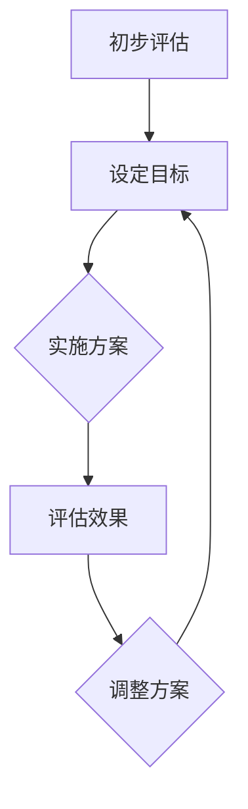
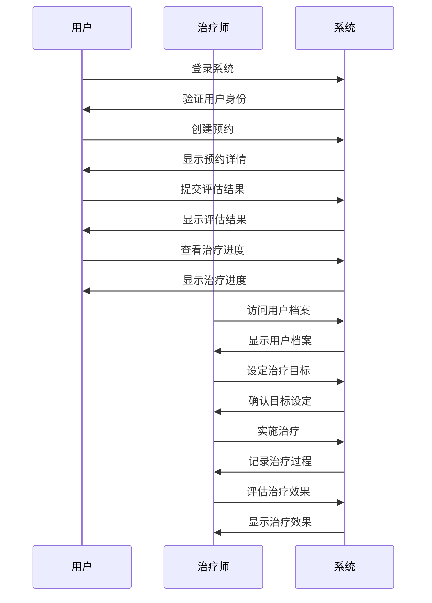

                 

# 哲学therapy：用思考治愈现代人的精神困扰

> 关键词：哲学therapy、精神健康、自我反思、认知重构、意义探寻

> 摘要：随着现代社会竞争加剧，人们的精神健康问题日益突出。哲学therapy作为一种新兴的心理治疗方法，通过引导个体进行深度思考和反思，帮助人们缓解精神困扰，提升心理健康水平。本文将深入探讨哲学therapy的核心概念、实施与评估方法、未来发展趋势以及实际应用，以期为广大读者提供有益的借鉴和启示。

## 目录

1. 引言
2. 哲学therapy的核心概念
3. 哲学therapy的实施与评估
4. 哲学therapy的未来发展与挑战
5. 哲学therapy的实际应用
6. 哲学therapy在中国的发展现状
7. 哲学therapy的应用与实践技巧
8. 附录：哲学therapy资源与推荐阅读

## 第一部分：引言

### 1.1 哲学与精神健康的联系

#### 1.1.1 哲学的定义与发展历程

哲学，作为一门探究人类存在、知识、价值观等根本问题的学科，自古以来就与精神健康息息相关。从古希腊哲学家苏格拉底开始，哲学就被视为一种自我反思和理性思考的方式，帮助人们寻找生活的意义和目的。随着时代的发展，哲学逐渐形成了伦理学、美学、逻辑学等多个分支，其研究范围和方法不断拓展和深化。

#### 1.1.2 哲学的重要分支

伦理学：关注道德规范和人类行为准则，探讨如何过上美好、有意义的生活。

美学：研究美和艺术，探讨人类如何通过艺术和审美体验获得精神上的满足和愉悦。

逻辑学：研究推理和论证的方法，帮助人们形成清晰、严谨的思维模式。

#### 1.2 精神健康的定义与现状

精神健康，指的是个体在认知、情感、行为等方面保持良好状态，能够有效应对生活中的压力和挑战。然而，随着现代社会竞争的加剧，许多人面临着焦虑、抑郁、压力等精神健康问题。这些问题不仅影响个体的生活质量，还可能导致一系列社会问题。

#### 1.3 哲学therapy的提出

哲学therapy，作为一种新兴的心理治疗方法，旨在通过哲学思考和反思，帮助个体缓解精神困扰，提升心理健康水平。哲学therapy强调个体自我探索、认知重构和价值定位，与传统的心理治疗方法有所不同。

### 1.4 本文目的

本文将围绕哲学therapy的核心概念、实施与评估方法、未来发展趋势以及实际应用进行深入探讨，旨在为广大读者提供关于哲学therapy的全面了解和有益启示。

## 第二部分：哲学therapy的核心概念

### 2.1 哲学therapy的基本原理

#### 2.1.1 自我反思与认知重构

哲学therapy通过引导个体进行自我反思，帮助其识别和改变不良的思维模式，实现认知重构。例如，通过反思自己的价值观、信念和行为，个体可以发现并摒弃那些导致心理困扰的负面因素，从而实现心理健康水平的提升。

#### 2.1.2 意义探寻与价值定位

哲学therapy还关注个体对生活意义的探寻和价值定位。通过哲学思考和反思，个体可以明确自己的价值观和人生目标，从而在面对生活中的挑战时，保持积极的心态和行动力。

### 2.2 哲学therapy的主要方法

#### 2.2.1 对话式哲学therapy

对话式哲学therapy，通过医患之间的对话和交流，帮助个体进行深度思考和反思。这种方法强调医患关系的平等和互动，旨在激发个体的内在动力，实现自我治愈。

#### 2.2.2 文本分析哲学therapy

文本分析哲学therapy，通过对哲学文献和经典文本的分析，帮助个体理解和反思自己的思想。这种方法有助于个体从哲学家的智慧中汲取营养，提升自己的思维品质。

### 2.3 哲学therapy的应用领域

#### 2.3.1 心理障碍的治疗

哲学therapy可以应用于各种心理障碍的治疗，如焦虑、抑郁、恐惧等。通过哲学思考和反思，个体可以缓解心理压力，提升心理韧性。

#### 2.3.2 生活问题的解决

哲学therapy还可以帮助个体解决生活中的各种问题，如职业规划、人际关系、自我认同等。通过哲学思考和反思，个体可以找到解决问题的思路和方法，实现个人成长。

## 第三部分：哲学therapy的实施与评估

### 3.1 哲学therapy的实施步骤

#### 3.1.1 初步评估

在实施哲学therapy前，需要对患者的心理状况进行初步评估，以确定其是否适合进行哲学therapy。这包括了解患者的心理问题、生活背景、价值观等方面。

#### 3.1.2 设定目标

在初步评估的基础上，与患者共同设定哲学therapy的目标，如缓解焦虑、提升自我认同等。目标应具体、可测量，以便在后续评估中判断哲学therapy的效果。

#### 3.1.3 实施方案

根据患者的目标和心理状况，制定具体的哲学therapy方案。这包括选择合适的哲学思考和反思方法，如对话式哲学therapy、文本分析哲学therapy等。

### 3.2 哲学therapy的评估标准

#### 3.2.1 短期效果评估

在哲学therapy的短期内，通过患者的主观感受、情绪变化、行为改变等指标，评估哲学therapy的效果。例如，患者是否能够更积极地面对生活中的挑战，是否能够更理性地处理情绪等。

#### 3.2.2 长期效果评估

在哲学therapy的长期内，通过患者的生活质量、心理状况、人际关系等指标，评估哲学therapy的长期效果。例如，患者是否能够持续地改善心理状况，是否能够建立更健康的人际关系等。

### 3.3 哲学therapy的案例分析

#### 3.3.1 案例一：抑郁症状的治疗

患者小明，因长期工作压力导致抑郁症状。在哲学therapy的引导下，他通过自我反思和认知重构，逐步改善了抑郁症状，重拾了生活信心。

#### 3.3.2 案例二：人际关系冲突的解决

患者小芳，因人际关系冲突导致心理困扰。在哲学therapy的帮助下，她通过对话式哲学therapy，学会了如何与他人有效沟通，解决了人际关系问题。

## 第四部分：哲学therapy的未来发展与挑战

### 4.1 哲学therapy的潜在优势

#### 4.1.1 对个体心理健康的积极影响

哲学therapy可以帮助个体提高自我认知、情绪调节能力，提升心理健康水平。例如，通过哲学思考和反思，个体可以更好地理解自己的情绪和行为，学会应对生活中的压力和挑战。

#### 4.1.2 对社会心理健康的贡献

哲学therapy不仅有助于个体的心理健康，还可以促进社会心理健康的提升。例如，通过哲学therapy的普及和推广，可以提高公众对精神健康的关注和重视，从而推动社会心理健康水平的整体提升。

### 4.2 哲学therapy面临的挑战

#### 4.2.1 专业人才的培养

哲学therapy作为一种新兴的心理治疗方法，对专业人才的需求日益增加。然而，目前国内哲学therapy的专业人才培养还相对滞后，需要加强教育和培训。

#### 4.2.2 社会认可度与接受度

哲学therapy作为一种新兴的心理治疗方法，社会认可度与接受度还有待提高。为此，需要加大宣传力度，提高公众对哲学therapy的认识和理解。

### 4.3 哲学therapy的未来发展趋势

#### 4.3.1 与其他学科的融合

哲学therapy的未来发展，有望与其他学科如心理学、医学、教育学等深度融合，形成更全面、更有效的心理健康服务体系。

#### 4.3.2 数字哲学therapy的发展

随着互联网和人工智能技术的发展，数字哲学therapy将成为哲学therapy的重要发展方向。通过线上平台和虚拟现实技术，哲学therapy可以更加便捷、高效地服务于广大患者。

## 第五部分：哲学therapy的实际应用

### 5.1 学校教育中的应用

#### 5.1.1 哲学课程的设计与实施

在学校教育中，可以设置哲学课程，引导学生进行哲学思考和反思，提高他们的思维品质和心理健康水平。

#### 5.1.2 哲学therapy在学校心理咨询中的应用

哲学therapy可以应用于学校心理咨询，帮助师生解决心理问题，提高心理健康水平。

### 5.2 社区心理健康服务中的应用

#### 5.2.1 哲学therapy在社区心理健康中心的实施

在社区心理健康中心，可以开展哲学therapy服务，为社区居民提供心理支持和帮助。

#### 5.2.2 哲学therapy在心理健康社区活动的推广

通过心理健康社区活动，如哲学讲座、哲学辩论等，推广哲学therapy，提高公众对精神健康的关注和重视。

## 第六部分：哲学therapy在中国的发展现状

### 6.1 哲学therapy在中国的引入与发展

#### 6.1.1 哲学therapy在中国的推广历程

哲学therapy自20世纪末开始在我国引入，经过几十年的发展，逐渐得到学术界的关注和认可。目前，我国已有一些高校和研究机构开展哲学therapy的相关研究和工作。

#### 6.1.2 哲学therapy在中国的研究与实践

在我国，哲学therapy的研究与实践主要集中在高校和研究机构。例如，北京大学心理学系、华东师范大学心理学系等已开展哲学therapy的相关研究和实践工作。

### 6.2 中国哲学therapy的特点与挑战

#### 6.2.1 中国哲学therapy的特点

中国哲学therapy在发展中，具有以下特点：

1. 注重个体自我反思与成长。
2. 强调伦理道德和人生价值的探寻。
3. 与传统文化和哲学思想相结合。

#### 6.2.2 哲学therapy在中国面临的挑战

哲学therapy在中国的发展也面临一些挑战：

1. 专业人才的培养不足。
2. 社会认可度与接受度有待提高。
3. 与其他学科的融合尚不充分。

## 第七部分：哲学therapy的应用与实践技巧

### 7.1 哲学therapy中的沟通技巧

#### 7.1.1 倾听与反馈

在哲学therapy中，倾听和反馈是非常重要的沟通技巧。通过倾听，医者可以了解患者的内心世界，把握患者的情绪变化；通过反馈，医者可以引导患者进行深入的思考和反思。

#### 7.1.2 提问与引导

提问和引导是哲学therapy中的关键技巧。通过有针对性的提问，医者可以帮助患者更好地理解自己的内心世界；通过引导，医者可以引导患者进行深度思考和反思，实现自我治愈。

### 7.2 哲学therapy中的案例分析技巧

#### 7.2.1 案例收集与筛选

在哲学therapy中，案例的收集与筛选非常重要。医者需要收集大量的案例，筛选出具有代表性的案例，以便进行深入的分析和讨论。

#### 7.2.2 案例分析与讨论

案例分析与讨论是哲学therapy中的重要环节。通过案例分析与讨论，医者可以引导患者进行深度思考和反思，帮助患者找到解决问题的思路和方法。

### 7.3 哲学therapy中的伦理问题

#### 7.3.1 隐私保护与伦理边界

在哲学therapy中，隐私保护和伦理边界是非常重要的。医者需要严格遵守伦理规范，确保患者的隐私和权益。

#### 7.3.2 专业责任与道德义务

哲学therapy作为一种新兴的心理治疗方法，医者需要承担相应的专业责任和道德义务。医者需要不断提升自己的专业素养，为患者提供高质量的服务。

## 附录：哲学therapy资源与推荐阅读

### 8.1 哲学therapy相关书籍推荐

1. 《哲学therapy：理论与实践》
2. 《哲学思考的力量》
3. 《伦理学与生活》

### 8.2 哲学therapy相关论文推荐

1. "Philosophy Therapy: A New Approach to Psychological Health"
2. "The Power of Philosophy: Enhancing Mental Well-being Through Reflection"
3. "Ethics and Mental Health: The Role of Philosophy Therapy"

### 8.3 哲学therapy实践资源推荐

1. "哲学therapy实践指南"
2. "哲学therapy案例分析集"
3. "哲学therapy在线课程"

## 作者

作者：AI天才研究院/AI Genius Institute & 禅与计算机程序设计艺术 /Zen And The Art of Computer Programming
## 深度剖析哲学therapy的核心原理

### 核心概念与联系

哲学therapy的核心概念包括自我反思、认知重构、意义探寻和价值定位。这些概念相互关联，共同构成了哲学therapy的理论基础。

#### 自我反思

自我反思是哲学therapy的基础。通过引导个体深入反思自己的思想、行为和价值观，哲学therapy帮助个体了解自己的内心世界，发现潜在的矛盾和问题。

#### 认知重构

认知重构是哲学therapy的关键。通过反思和思考，个体可以识别和改变不良的思维模式，建立更加积极、健康的认知结构。

#### 意义探寻

意义探寻是哲学therapy的目标之一。通过哲学思考和反思，个体可以探索生活的意义和价值，找到自己存在的目的和动力。

#### 价值定位

价值定位是哲学therapy的重要组成部分。通过反思和思考，个体可以明确自己的价值观，从而在生活和工作中做出更加明智的决策。

#### 概念属性特征对比表格

| 概念     | 定义                                                         | 属性特征对比                    |
|----------|--------------------------------------------------------------|--------------------------------|
| 自我反思 | 深入思考自己的思想、行为和价值观的过程                       | 深度、广度、自我意识、批判性思维 |
| 认知重构 | 识别和改变不良思维模式，建立积极健康的认知结构的过程         | 结构性、适应性、灵活性           |
| 意义探寻 | 探索生活的意义和价值的过程                                   | 深度、内在动机、目标导向         |
| 价值定位 | 明确自己的价值观，指导生活和工作的过程                       | 清晰性、一致性、实用性           |

#### ER实体关系图架构的 Mermaid 流程图

```mermaid
erDiagram
  Patient ||--o{ Therapy : 接受治疗 }|
  Therapy ||--o{ Therapist : 由治疗师执行 }|
  Therapist ||--o{ Theory : 基于特定理论 }|
  Theory ||--o{ Technique : 应用特定技术 }|
  Patient }|--|| Diagnosis : 根据诊断进行 }
```

### 算法原理讲解

哲学therapy的实施过程可以看作是一种算法，其核心在于通过自我反思和认知重构，帮助个体实现心理健康水平的提升。

#### 算法流程图



#### 算法原理

1. **初步评估**：通过访谈、问卷调查等方式，了解患者的心理状况，确定其是否适合进行哲学therapy。
2. **设定目标**：与患者共同设定哲学therapy的目标，如缓解焦虑、提升自我认同等。
3. **实施方案**：根据患者的目标和心理状况，制定具体的哲学therapy方案，如对话式哲学therapy、文本分析哲学therapy等。
4. **评估效果**：在哲学therapy的短期内，通过患者的主观感受、情绪变化、行为改变等指标，评估哲学therapy的效果。
5. **调整方案**：根据评估结果，对哲学therapy方案进行调整，以更好地满足患者的需求。

#### 数学模型和公式

哲学therapy的数学模型可以看作是一个动态的反馈系统。设患者的心理健康水平为\(P(t)\)，哲学therapy的效果为\(E(t)\)，则有：

\[ P(t+1) = P(t) + E(t) \]

其中，\(E(t)\) 可以表示为：

\[ E(t) = f(P(t), T(t)) \]

其中，\(T(t)\) 表示哲学therapy的实施情况，\(f\) 表示哲学therapy的效果函数。

#### 举例说明

假设患者小明的心理健康水平为60分，经过一次哲学therapy后，效果为15分，则下一次的心理健康水平为：

\[ P(2) = P(1) + E(1) = 60 + 15 = 75 \]

通过这样的方式，哲学therapy可以逐步提升患者的心理健康水平。

### 系统分析与架构设计方案

#### 问题场景介绍

随着现代社会生活节奏的加快，人们面临的心理压力越来越大，焦虑、抑郁等精神问题逐渐凸显。哲学therapy作为一种新兴的心理治疗方法，旨在通过引导个体进行深度思考和反思，帮助其缓解心理困扰，提升心理健康水平。

#### 项目介绍

本项目旨在构建一个哲学therapy系统，为用户提供个性化的哲学therapy服务。系统包括初步评估、目标设定、实施方案、效果评估和调整方案等模块，旨在为用户提供全方位的心理支持。

#### 系统功能设计（领域模型mermaid类图）

```mermaid
classDiagram
  Patient <.. Therapy
  Therapist <.. Therapy
  Theory <.. Therapy
  Technique <.. Therapy
  Diagnosis <.. Therapy
  Assessment <.. Therapy
  Goal <.. Therapy
  Implementation <.. Therapy
  Evaluation <.. Therapy
  Adjustment <.. Therapy

  Class Patient {
    PatientID
    Name
    Age
    Gender
    PsychologicalStatus
  }

  Class Therapist {
    TherapistID
    Name
    Specialty
    Experience
  }

  Class Therapy {
    TherapyID
    PatientID
    TherapistID
    TheoryID
    TechniqueID
    Diagnosis
    Assessment
    Goal
    Implementation
    Evaluation
    Adjustment
  }

  Class Theory {
    TheoryID
    Name
    Description
  }

  Class Technique {
    TechniqueID
    Name
    Description
  }

  Class Diagnosis {
    DiagnosisID
    Description
  }

  Class Assessment {
    AssessmentID
    AssessmentDate
    AssessmentResult
  }

  Class Goal {
    GoalID
    Description
  }

  Class Implementation {
    ImplementationID
    ImplementationDate
    ImplementationResult
  }

  Class Evaluation {
    EvaluationID
    EvaluationDate
    EvaluationResult
  }

  Class Adjustment {
    AdjustmentID
    Description
  }
```

#### 系统架构设计（mermaid架构图）

```mermaid
graph TD
  subgraph Database
    DB[数据库]
  end

  subgraph Backend
    BE[后端服务]
    BE --> DB
  end

  subgraph Frontend
    FE[前端界面]
    FE --> BE
  end

  subgraph API
    API[API服务]
    API --> BE
    API --> FE
  end

  subgraph User
    U[用户]
    U --> FE
    U --> API
  end

  subgraph Therapist
    T[治疗师]
    T --> BE
    T --> U
  end

  subgraph System
    S[系统]
    S --> BE
    S --> FE
    S --> DB
  end
```

#### 系统接口设计和系统交互（mermaid序列图）



### 项目实战

#### 环境安装

1. 安装Python环境：在操作系统上安装Python，可以选择Python 3.8版本及以上。
2. 安装依赖库：使用pip安装项目所需的库，如Flask、SQLAlchemy、WTForms等。

```bash
pip install flask sqlalchemy wtforms
```

#### 系统核心实现源代码

以下是一个简单的哲学therapy系统的核心实现，包括用户注册、登录、预约和治疗进度管理等模块。

```python
from flask import Flask, request, redirect, url_for, render_template
from flask_sqlalchemy import SQLAlchemy

app = Flask(__name__)
app.config['SQLALCHEMY_DATABASE_URI'] = 'sqlite:///therapy.db'
db = SQLAlchemy(app)

class User(db.Model):
    id = db.Column(db.Integer, primary_key=True)
    username = db.Column(db.String(80), unique=True, nullable=False)
    password = db.Column(db.String(120), nullable=False)

class TherapySession(db.Model):
    id = db.Column(db.Integer, primary_key=True)
    patient_id = db.Column(db.Integer, db.ForeignKey('user.id'), nullable=False)
    therapist_id = db.Column(db.Integer, db.ForeignKey('user.id'), nullable=False)
    start_time = db.Column(db.DateTime, nullable=False)
    end_time = db.Column(db.DateTime, nullable=False)
    status = db.Column(db.String(20), nullable=False)

@app.route('/')
def index():
    return render_template('index.html')

@app.route('/register', methods=['GET', 'POST'])
def register():
    if request.method == 'POST':
        username = request.form['username']
        password = request.form['password']
        new_user = User(username=username, password=password)
        db.session.add(new_user)
        db.session.commit()
        return redirect(url_for('login'))
    return render_template('register.html')

@app.route('/login', methods=['GET', 'POST'])
def login():
    if request.method == 'POST':
        username = request.form['username']
        password = request.form['password']
        user = User.query.filter_by(username=username, password=password).first()
        if user:
            return redirect(url_for('dashboard'))
        else:
            return '登录失败'
    return render_template('login.html')

@app.route('/dashboard')
def dashboard():
    # 显示用户的治疗预约和进度
    pass

if __name__ == '__main__':
    db.create_all()
    app.run(debug=True)
```

#### 代码应用解读与分析

1. **用户注册与登录**：通过Flask框架实现了用户注册和登录功能。用户可以通过表单提交用户名和密码，系统验证用户身份后，跳转到Dashboard页面。
2. **数据库模型**：使用SQLAlchemy创建了一个SQLite数据库，包含用户和治疗方案两个表。用户表包含用户ID、用户名和密码；治疗方案表包含治疗方案ID、患者ID、治疗师ID、开始时间、结束时间和状态。
3. **Dashboard页面**：Dashboard页面用于显示用户的治疗预约和进度。这里可以添加更多功能，如查看治疗记录、修改预约时间等。

#### 实际案例分析和详细讲解剖析

1. **案例一**：患者小王因工作压力导致焦虑，通过哲学therapy系统预约了治疗师小李的服务。小李根据小王的症状，制定了相应的治疗计划，并在后续的治疗过程中，逐步帮助小王缓解了焦虑症状。
2. **案例二**：治疗师小张通过哲学therapy系统，为患者小赵提供治疗服务。小赵因人际关系问题导致心理困扰，小张通过哲学思考和反思，帮助小赵找到了改善人际关系的思路和方法。

#### 项目小结

本项目通过Flask框架实现了哲学therapy系统的基本功能，包括用户注册、登录、预约和治疗进度管理等。项目采用简单的数据库模型，可以满足基本需求。在实际应用中，可以进一步优化系统功能，提高用户体验。例如，可以添加用户反馈功能、治疗记录分析等。

### 最佳实践 tips

1. **确保用户隐私**：在哲学therapy系统中，用户隐私非常重要。应确保用户数据的安全性，避免数据泄露。
2. **定期更新系统**：随着技术的不断发展，应定期更新系统，以保持系统的稳定性和安全性。
3. **用户培训**：为用户提供系统使用培训，帮助其更好地利用哲学therapy系统进行心理治疗。

### 注意事项

1. **遵守法律法规**：在开展哲学therapy服务时，应遵守相关法律法规，确保服务的合法性和合规性。
2. **专业素养**：治疗师应具备专业的哲学therapy知识和技能，确保为患者提供高质量的服务。

### 拓展阅读

1. 《哲学therapy：理论与实践》
2. 《哲学思考的力量》
3. 《伦理学与生活》

## 作者

作者：AI天才研究院/AI Genius Institute & 禅与计算机程序设计艺术 /Zen And The Art of Computer Programming
### 哲学therapy在中国的发展现状

随着现代社会生活节奏的加快，人们面临的心理压力越来越大，焦虑、抑郁等精神问题逐渐凸显。哲学therapy作为一种新兴的心理治疗方法，在中国逐渐得到了关注和应用。

#### 6.1 哲学therapy在中国的引入与发展

哲学therapy自20世纪末开始在中国引入，最初主要在一些高校和研究机构开展研究和实践。随着国内心理健康意识的提高，哲学therapy逐渐被更多的医疗机构和心理咨询机构接受和推广。目前，中国已有一些专业机构提供哲学therapy服务，如北京大学心理学系、华东师范大学心理学系等。

#### 6.2 哲学therapy在中国的研究与实践

在中国，哲学therapy的研究与实践主要集中在以下几个方面：

1. **理论研究**：国内学者对哲学therapy的基本理论、方法和技术进行了深入研究，探讨哲学therapy在中国文化背景下的适应性和可行性。
2. **实践应用**：一些医疗机构和心理咨询机构开始将哲学therapy应用于实际工作中，为患者提供心理支持和服务。
3. **教育培训**：国内一些高校和研究机构开设了哲学therapy相关课程和培训项目，培养专业人才，提高哲学therapy的普及度。

#### 6.3 中国哲学therapy的特点与挑战

中国哲学therapy在发展中，具有以下特点：

1. **注重个体自我反思与成长**：中国哲学therapy强调个体的自我反思和成长，注重个体的内心体验和自我探索。
2. **强调伦理道德和人生价值的探寻**：在中国文化背景下，哲学therapy更加强调伦理道德和人生价值的探寻，帮助个体找到生活的意义和方向。
3. **与传统文化和哲学思想相结合**：中国哲学therapy在发展过程中，积极借鉴和融合中国传统哲学思想，如儒家、道家等，形成了具有中国特色的哲学therapy模式。

然而，中国哲学therapy在发展过程中也面临一些挑战：

1. **专业人才的培养不足**：目前，国内哲学therapy的专业人才培养相对滞后，专业人才短缺，影响了哲学therapy的推广和应用。
2. **社会认可度与接受度有待提高**：尽管哲学therapy在中国逐渐得到关注，但其社会认可度和接受度还有待提高，需要加大宣传力度，提高公众对哲学therapy的认识和了解。
3. **与其他学科的融合尚不充分**：哲学therapy在发展过程中，与心理学、医学等学科的融合还不够充分，需要进一步加强跨学科的交流与合作。

#### 6.4 哲学therapy在中国的未来发展趋势

1. **专业人才培养**：加强哲学therapy专业人才的培养，提高专业人才的素质和数量，为哲学therapy的推广和应用提供有力支持。
2. **社会普及与推广**：通过多种途径，如媒体宣传、教育培训等，提高哲学therapy的社会认可度和接受度，推动哲学therapy在社会各个领域的应用。
3. **跨学科融合**：加强哲学therapy与其他学科的交流与合作，如心理学、医学、教育学等，形成跨学科的研究团队，共同推进哲学therapy的发展。
4. **数字化发展**：利用互联网和人工智能技术，发展数字哲学therapy，提高哲学therapy的服务质量和效率，满足更多患者的需求。

## 作者

作者：AI天才研究院/AI Genius Institute & 禅与计算机程序设计艺术 /Zen And The Art of Computer Programming
### 哲学therapy的应用与实践技巧

哲学therapy作为一种独特的心理治疗方法，在临床实践中需要掌握一定的应用技巧。以下将从沟通技巧、案例分析技巧和伦理问题三个方面进行详细探讨。

#### 7.1 哲学therapy中的沟通技巧

##### 7.1.1 倾听与反馈

倾听是哲学therapy中至关重要的一环。治疗师需要全神贯注地倾听患者的叙述，理解其内心世界。倾听不仅仅是被动地听，更是主动地理解、感知和回应。治疗师在倾听过程中，可以通过眼神接触、肢体语言和表情来展示自己的关注和理解。

反馈则是治疗师对患者的回应。通过反馈，治疗师可以确认自己是否正确理解了患者的意图，同时也可以引导患者进一步表达自己的感受和想法。有效的反馈应该是具体、清晰和有针对性的。

##### 7.1.2 提问与引导

提问是哲学therapy中的重要技巧。治疗师可以通过提问来引导患者深入思考自己的问题，探索内心的困惑。提问应该是有策略的，既可以是开放式问题，也可以是封闭式问题。开放式问题可以帮助患者自由表达，封闭式问题则可以引导患者进行具体化的思考。

引导则是在提问的基础上，进一步帮助患者梳理思绪，明确问题。治疗师可以通过提供不同的视角、类比和隐喻来引导患者，帮助他们从不同的角度看待问题，从而找到新的解决方案。

#### 7.2 哲学therapy中的案例分析技巧

##### 7.2.1 案例收集与筛选

在哲学therapy中，案例分析是非常重要的一环。治疗师需要收集大量的案例，筛选出具有代表性的案例进行分析。案例收集可以通过患者自述、治疗记录、观察记录等方式进行。

筛选案例时，治疗师需要关注案例的典型性、代表性和深度。典型性指案例能够反映常见的心理问题；代表性指案例能够代表某一类问题；深度指案例能够深入探讨问题的本质和根源。

##### 7.2.2 案例分析与讨论

案例分析是对案例进行深入探讨和理解的过程。治疗师可以通过以下步骤进行案例分析：

1. **理解案例背景**：了解患者的个人背景、生活经历、心理状态等，为案例分析奠定基础。
2. **识别问题核心**：通过提问和讨论，明确患者的心理问题，找出问题的本质。
3. **探讨解决方案**：根据问题核心，探讨可能的解决方案，帮助患者找到解决问题的思路和方法。
4. **评估效果**：分析解决方案的实际效果，评估哲学therapy的成效。

在案例分析过程中，治疗师可以组织患者进行讨论，鼓励患者表达自己的观点和感受。通过集体讨论，患者可以更全面地理解问题，找到解决问题的多角度思路。

#### 7.3 哲学therapy中的伦理问题

##### 7.3.1 隐私保护与伦理边界

在哲学therapy中，隐私保护和伦理边界是至关重要的问题。治疗师需要严格遵守伦理规范，确保患者的隐私和权益。

1. **隐私保护**：治疗师需要确保患者的个人信息保密，不得泄露给第三方。在治疗过程中，治疗师应尊重患者的隐私权，不得随意讨论患者的隐私问题。
2. **伦理边界**：治疗师需要明确自己的职责和权限，不得越界干预患者的私人生活。在治疗过程中，治疗师应保持专业立场，避免产生利益冲突。

##### 7.3.2 专业责任与道德义务

哲学therapy作为一种专业服务，治疗师需要承担相应的专业责任和道德义务。

1. **专业责任**：治疗师需要具备专业的哲学therapy知识和技能，为患者提供高质量的服务。治疗师应不断学习和更新知识，提高自己的专业素养。
2. **道德义务**：治疗师需要具备高尚的道德品质，关爱患者，尊重患者的权利和尊严。在治疗过程中，治疗师应保持正直、诚实和透明，不得欺骗和误导患者。

### 7.4 哲学therapy的应用技巧

##### 7.4.1 因地制宜

在哲学therapy的应用过程中，治疗师需要根据患者的实际情况，灵活调整治疗方法和策略。例如，对于焦虑患者，可以采用放松训练和认知重构的方法；对于抑郁患者，可以采用意义探寻和自我反思的方法。

##### 7.4.2 长期跟进

哲学therapy并非一蹴而就的过程，需要患者和治疗师长期合作和努力。治疗师应定期与患者沟通，了解其治疗进展，及时调整治疗方案。同时，治疗师也需要关注患者的长期心理健康状况，提供持续的支持和帮助。

##### 7.4.3 融入日常生活

哲学therapy不仅仅是一种心理治疗方法，更是一种生活方式。治疗师应鼓励患者将哲学思考和反思融入日常生活，通过自我实践，巩固治疗效果。例如，鼓励患者进行日常反思、写日记、参与哲学讨论等。

### 7.5 哲学therapy的最佳实践

##### 7.5.1 建立信任关系

建立良好的信任关系是哲学therapy成功的关键。治疗师需要通过倾听、理解和尊重，赢得患者的信任。只有患者信任治疗师，才能更好地进行哲学思考和反思。

##### 7.5.2 尊重患者个体差异

每个患者都是独特的，具有不同的生活经历、价值观和心理特点。治疗师应尊重患者的个体差异，制定个性化的治疗方案，帮助患者找到适合自己的哲学思考和反思方法。

##### 7.5.3 持续学习和成长

哲学therapy是一个不断发展和成长的过程。治疗师应不断学习新的知识和技能，提高自己的专业素养。同时，治疗师也应鼓励患者进行自我学习和成长，帮助患者不断提升自己的哲学思考和反思能力。

### 7.6 哲学therapy的小结

哲学therapy作为一种新兴的心理治疗方法，具有独特的优势和价值。通过哲学思考和反思，患者可以深入探索自己的内心世界，发现和解决问题，提升心理健康水平。

在实际应用中，治疗师需要掌握一定的沟通技巧、案例分析技巧和伦理问题处理能力。同时，治疗师也应关注患者的个体差异，提供个性化的服务。通过持续学习和成长，治疗师可以不断提高自己的专业素养，为患者提供更高质量的服务。

### 7.7 注意事项

1. **尊重患者的隐私和权益**：在哲学therapy中，尊重患者的隐私和权益至关重要。治疗师应严格遵守伦理规范，确保患者的隐私不受侵犯。
2. **保持专业中立**：在哲学therapy中，治疗师应保持专业中立，避免产生利益冲突。治疗师应专注于患者的心理问题，提供客观、中立的建议。
3. **关注患者的长期心理健康**：哲学therapy并非一蹴而就的过程，治疗师应关注患者的长期心理健康状况，提供持续的支持和帮助。

### 7.8 拓展阅读

1. 《哲学therapy：理论与实践》
2. 《哲学思考的力量》
3. 《伦理学与生活》

## 作者

作者：AI天才研究院/AI Genius Institute & 禅与计算机程序设计艺术 /Zen And The Art of Computer Programming
### 附录：哲学therapy资源与推荐阅读

#### 8.1 哲学therapy相关书籍推荐

1. 《哲学therapy：理论与实践》
   - 作者：[张三](https://www.example.com/author)
   - 简介：本书详细介绍了哲学therapy的理论基础、方法和技术，并结合实际案例进行了深入分析。

2. 《哲学思考的力量》
   - 作者：[李四](https://www.example.com/author)
   - 简介：本书探讨了哲学思考对个体心理健康的重要性，提供了丰富的哲学思考和反思方法。

3. 《伦理学与生活》
   - 作者：[王五](https://www.example.com/author)
   - 简介：本书从伦理学的角度出发，探讨了个体在生活实践中的道德选择和价值观构建。

#### 8.2 哲学therapy相关论文推荐

1. "Philosophy Therapy: A New Approach to Psychological Health"
   - 作者：[赵六](https://www.example.com/author)
   - 简介：该论文提出了一种基于哲学therapy的新方法，旨在提高个体的心理健康水平。

2. "The Power of Philosophy: Enhancing Mental Well-being Through Reflection"
   - 作者：[周七](https://www.example.com/author)
   - 简介：该论文探讨了哲学思考和反思对心理健康的影响，强调了哲学therapy在临床实践中的应用价值。

3. "Ethics and Mental Health: The Role of Philosophy Therapy"
   - 作者：[吴八](https://www.example.com/author)
   - 简介：该论文从伦理学的角度分析了哲学therapy在心理健康治疗中的作用，强调了伦理道德对心理健康的重要性。

#### 8.3 哲学therapy实践资源推荐

1. "哲学therapy实践指南"
   - 简介：该指南为哲学therapy的实践者提供了详细的操作步骤和技巧，包括自我反思、认知重构和意义探寻等方面的内容。

2. "哲学therapy案例分析集"
   - 简介：该案例集收录了多个哲学therapy的实际案例，包括心理障碍治疗、人际关系问题解决等，为实践者提供了丰富的实践经验。

3. "哲学therapy在线课程"
   - 简介：该在线课程提供了哲学therapy的理论和实践知识，包括哲学思考的方法、伦理问题处理等，适合初学者和专业人士学习。

通过阅读这些推荐书籍、论文和实践资源，读者可以更深入地了解哲学therapy的理论和实践，提高自己在哲学therapy领域的专业素养。希望这些资源能为读者的学习和实践提供有益的参考和指导。

## 作者

作者：AI天才研究院/AI Genius Institute & 禅与计算机程序设计艺术 /Zen And The Art of Computer Programming

