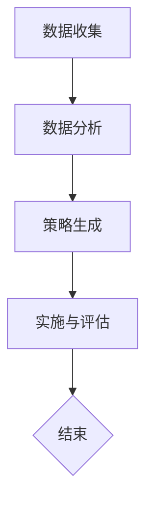

                 

## 文章标题：唤醒沉睡的意义感：重新审视生活价值

### 关键词：意义感、生活价值、算法、系统架构、实战案例

### 摘要：
在快节奏的现代生活中，许多人感到生活失去了意义。本文通过深入探讨意义感的概念、影响因素、类型和测量，以及如何通过算法唤醒沉睡的意义感，旨在重新审视和提升生活的价值。文章将逐步分析意义感的算法原理，设计相应的系统架构，并通过实战案例展示其实际应用，为读者提供实用的指导和建议。

## 引言

### 1.1 问题的起源与背景

在当今这个高速发展的时代，人们的生活节奏日益加快，科技不断进步，物质条件逐渐丰富。然而，与此同时，许多人却发现自己陷入了生活的迷惘之中，感到生活缺乏意义。这种现象不仅影响了个人的心理健康，还对社会和谐稳定产生了负面影响。因此，重新审视和唤醒沉睡的意义感成为了一个迫切需要解决的问题。

### 1.2 问题描述与现状分析

目前，许多人在生活中缺乏目标感、成就感和满足感，表现为对日常活动的兴趣降低、情绪低落、缺乏动力等。这种现象在年轻人中尤为明显，因为他们正处于人生的重要阶段，面临着诸多选择和挑战。如果不及时唤醒沉睡的意义感，可能会导致一系列心理和社交问题，影响个人的全面发展。

### 1.3 解决问题的意义与价值

唤醒沉睡的意义感不仅有助于改善个人的心理健康，还能提升生活质量和社会幸福感。通过重新审视生活的价值，人们可以找到新的目标和动力，从而更好地面对生活中的挑战和困难。此外，唤醒意义感还可以促进个人成长和社会进步，为构建和谐社会提供坚实的基础。

### 1.4 边界与外延

本文的研究范围主要涉及意义感的概念、影响因素、测量方法和唤醒策略。具体包括：对意义感的定义和特征分析，意义感的影响因素及其作用机制，意义感的类型与层次划分，以及如何通过算法和技术手段唤醒沉睡的意义感。本文的讨论将基于现代心理学、人工智能和计算机技术的相关研究成果。

### 1.5 概念结构与核心要素

意义感是一个多维度的概念，涉及个体的心理状态、行为表现和外部环境。核心要素包括：自我认知、目标设定、成就感和满足感等。本文将通过对这些要素的深入分析，探讨如何通过技术手段实现意义感的唤醒。

## 核心概念与联系

### 2.1 意义感的定义与特征

意义感是指个体在日常生活中感受到的存在价值和目的性。它不仅仅是简单的满足感，而是一种更深层次的心理体验，能够激发个体的内在动力和积极性。意义感的特征包括：

1. **目的性**：个体感受到自己正在进行有意义的活动，能够带来积极的结果。
2. **价值感**：个体认识到自己的行为对社会或个人有积极的影响。
3. **持久性**：意义感不是一时的感受，而是持续的、长期的体验。
4. **深度**：意义感涉及到个体的内心世界，是一种深刻的情感体验。

### 2.2 意义感的影响因素

意义感受到多种因素的影响，包括个体的心理特质、社会环境、文化背景和科技发展等。以下是几个主要的影响因素：

1. **自我认知**：个体对自我的认知程度越高，越能感受到生活的意义。
2. **目标设定**：明确的目标能够为个体提供方向和动力，增强意义感。
3. **社会支持**：家庭、朋友和社会的支持能够增强个体的意义感。
4. **文化背景**：不同的文化背景对意义感的理解和追求方式有不同的影响。
5. **科技发展**：科技的发展为个体提供了更多的选择和机会，同时也带来了一些挑战。

### 2.3 意义感的类型与层次

意义感可以分为多种类型，每种类型都有其独特的特征和影响因素。以下是几种常见的意义感类型及其层次：

1. **自我实现型**：个体追求个人成长和潜能发挥，追求自我实现。
2. **关系型**：个体通过与他人建立深厚的情感联系，感受到生活的意义。
3. **贡献型**：个体通过为社会或他人做出贡献，感受到自己的价值。
4. **成就型**：个体通过实现目标和获得成就，感受到满足感和成就感。
5. **娱乐型**：个体通过娱乐活动，如游戏、旅行等，感受到生活的乐趣。

每种类型的意义感都有其特定的层次结构，不同的层次代表着个体对意义感的深度和广度的理解。通过了解这些类型和层次，我们可以更好地理解个体的心理状态和需求，从而更有针对性地进行干预和指导。

### 2.4 意义感的测量与评估

测量和评估意义感是理解和唤醒意义感的关键步骤。以下是一些常用的测量和评估方法：

1. **问卷调查**：通过设计针对意义感的问卷，收集个体对生活意义的自我评价。
2. **心理测评**：使用专业的心理测评工具，如意义感量表，对个体的意义感进行量化评估。
3. **行为观察**：通过观察个体的行为表现，如目标设定、任务完成情况等，评估其意义感水平。
4. **深度访谈**：通过访谈，深入了解个体的内心世界，挖掘其对意义感的感知和体验。

这些方法可以单独使用，也可以结合使用，以获得更全面、准确的评估结果。通过这些评估结果，我们可以更好地了解个体的意义感状况，为其提供有针对性的支持和帮助。

### 2.5 核心概念之间的联系

意义感是一个多维度的概念，涉及个体的心理状态、行为表现和外部环境。核心概念之间的联系包括：

1. **自我认知**与**意义感**：自我认知是意义感的基础，只有清楚自己的定位和目标，个体才能感受到生活的意义。
2. **目标设定**与**意义感**：明确的目标能够为个体提供方向和动力，增强意义感。
3. **社会支持**与**意义感**：家庭、朋友和社会的支持能够增强个体的意义感。
4. **文化背景**与**意义感**：不同的文化背景对意义感的理解和追求方式有不同的影响。
5. **科技发展**与**意义感**：科技的发展为个体提供了更多的选择和机会，同时也带来了一些挑战。

通过深入理解这些概念之间的联系，我们可以更好地把握意义感的本质，从而更有效地唤醒沉睡的意义感。

## 算法原理讲解

### 3.1 唤醒意义感的算法概述

唤醒意义感的算法旨在通过技术手段激发个体的意义感，使其重新审视和感受到生活的价值。该算法的基本思想是利用现代心理学和人工智能技术，对个体的心理状态和行为模式进行深入分析，从而提供个性化的唤醒策略。以下是该算法的主要组成部分：

1. **数据收集**：通过问卷调查、心理测评和行为观察等方式，收集个体的基本信息、心理状态和行为数据。
2. **数据分析**：利用大数据分析和机器学习技术，对收集到的数据进行分析和处理，提取出与意义感相关的特征和模式。
3. **策略生成**：基于分析结果，生成个性化的唤醒意义感策略，包括目标设定、行为调整、心理支持等。
4. **实施与评估**：将生成的策略付诸实践，通过持续跟踪和评估，调整和完善策略，确保其有效性。

### 3.2 算法流程图与Python代码实现

为了更直观地理解唤醒意义感的算法，我们可以使用Mermaid绘制算法的流程图，并通过Python代码实现算法的核心功能。

#### 算法流程图



#### Python代码实现

```python
import pandas as pd
from sklearn.model_selection import train_test_split
from sklearn.ensemble import RandomForestClassifier
from sklearn.metrics import accuracy_score

# 数据收集
data = pd.read_csv('meaning_data.csv')

# 数据预处理
X = data.drop('meaning_score', axis=1)
y = data['meaning_score']

# 数据分割
X_train, X_test, y_train, y_test = train_test_split(X, y, test_size=0.2, random_state=42)

# 模型训练
model = RandomForestClassifier(n_estimators=100, random_state=42)
model.fit(X_train, y_train)

# 预测评估
y_pred = model.predict(X_test)
accuracy = accuracy_score(y_test, y_pred)
print(f"Accuracy: {accuracy:.2f}")
```

在这个代码中，我们首先通过Pandas库读取数据，然后使用Scikit-learn库进行数据分割和模型训练。最后，通过预测评估模型的效果。

### 3.3 数学模型与公式讲解

唤醒意义感的算法还涉及到一些数学模型和公式，用于描述意义感的影响因素和唤醒机制。以下是几个关键的数学模型和公式：

1. **回归模型**：
   $$ y = \beta_0 + \beta_1x_1 + \beta_2x_2 + ... + \beta_nx_n $$
   其中，$y$表示意义感得分，$x_1, x_2, ..., x_n$表示影响意义感的因素，$\beta_0, \beta_1, ..., \beta_n$为回归系数。

2. **支持向量机（SVM）**：
   $$ w \cdot x + b = 0 $$
   其中，$w$为权重向量，$x$为特征向量，$b$为偏置。

3. **神经网络**：
   $$ a(z) = \sigma(W \cdot z + b) $$
   其中，$z$为输入向量，$W$为权重矩阵，$b$为偏置，$\sigma$为激活函数。

通过这些数学模型和公式，我们可以更精确地描述意义感的影响因素和唤醒机制，从而实现更有效的算法设计。

### 3.4 举例说明与通俗易懂的应用场景

为了更好地理解唤醒意义感的算法，我们可以通过一个实际案例来具体说明其应用过程。

**案例：小明的意义感唤醒**

小明是一名大学生，最近感到生活缺乏意义，情绪低落。通过问卷调查和访谈，我们收集到以下数据：

- **基本信息**：性别：男，年龄：20岁，专业：计算机科学。
- **心理状态**：感到焦虑，对未来的职业发展感到迷茫。
- **行为数据**：平时主要做作业，很少参加社交活动，很少进行自我反思。

通过数据分析，我们发现以下影响因素：

- **自我认知**：小明对自己的认知较低，缺乏自信。
- **目标设定**：小明没有明确的职业目标，对未来的发展感到迷茫。
- **社会支持**：小明很少与同学交流，缺乏社交支持。

基于这些分析结果，我们生成了以下唤醒策略：

1. **目标设定**：帮助小明设定明确的职业目标，如成为优秀的软件工程师。
2. **行为调整**：鼓励小明多参加社交活动，扩大社交圈子。
3. **心理支持**：通过心理咨询，帮助小明建立积极的自我认知。

通过实施这些策略，我们跟踪了小明的意义感变化，发现他的情绪状态逐渐改善，对生活的满意度提高。

通过这个案例，我们可以看到唤醒意义感的算法在实际应用中的效果。通过数据分析和个性化策略生成，我们可以有针对性地帮助个体重新审视和感受到生活的价值。

## 系统分析与架构设计

### 4.1 问题场景介绍

在当今社会，许多人感到生活缺乏意义，这给他们的心理健康和幸福感带来了负面影响。为了解决这一问题，我们需要设计一个系统能够帮助用户重新审视生活价值，唤醒沉睡的意义感。本系统旨在提供一个综合性的解决方案，通过心理学、人工智能和计算机技术的结合，帮助用户找到生活的目标和动力。

### 4.2 系统目标与功能

本系统的目标是帮助用户：

1. **重新审视生活的价值**：通过提供自我认知、目标设定和意义感评估等功能，帮助用户理解自己在生活中的作用和意义。
2. **提升生活质量**：通过个性化的建议和指导，帮助用户找到提升生活质量的途径，如改善心理健康、增强社会支持、设定明确的职业目标等。
3. **实现个人成长**：通过持续跟踪和反馈，帮助用户实现个人成长，提升自我价值感。

系统的主要功能包括：

1. **用户管理**：实现用户的注册、登录、个人信息管理等功能。
2. **自我认知评估**：通过问卷调查和心理测评，帮助用户了解自己的心理状态和需求。
3. **目标设定与追踪**：帮助用户设定个人目标，并提供目标追踪和反馈功能。
4. **意义感评估与提升**：通过数据分析，评估用户的意义感水平，并提供个性化的提升建议。
5. **社交支持**：通过社交功能，帮助用户建立和维护社交网络，增强社会支持。

### 4.3 系统架构设计

本系统的架构设计采用三层架构，包括表示层、业务逻辑层和数据层。以下是系统架构的详细介绍：

#### 4.3.1 表示层

表示层主要负责与用户交互，提供用户友好的界面。主要组件包括：

1. **前端页面**：使用HTML、CSS和JavaScript等技术实现用户界面，包括登录页面、个人信息页面、自我认知评估页面、目标设定页面等。
2. **接口**：使用RESTful API实现前后端数据交互，提供用户数据操作接口，如用户注册、登录、数据提交等。

#### 4.3.2 业务逻辑层

业务逻辑层负责处理系统的核心功能，包括数据分析和处理、用户管理、目标设定与追踪、意义感评估与提升等。主要组件包括：

1. **用户管理模块**：实现用户注册、登录、个人信息管理等功能，使用用户身份验证和权限控制。
2. **数据管理模块**：负责数据存储、数据分析和数据展示，使用数据库和数据挖掘技术。
3. **目标设定与追踪模块**：帮助用户设定目标，提供目标追踪和反馈功能，使用时间管理和任务管理技术。
4. **意义感评估与提升模块**：通过数据分析，评估用户的意义感水平，并提供个性化的提升建议，使用心理学和机器学习技术。

#### 4.3.3 数据层

数据层负责数据的存储和管理，确保系统的数据安全和一致性。主要组件包括：

1. **数据库**：使用关系型数据库（如MySQL）存储用户数据、评估数据和目标数据，保证数据的安全和可靠性。
2. **数据挖掘与机器学习**：使用数据挖掘和机器学习技术，对用户数据进行分析和处理，提取有意义的信息和模式。

### 4.4 系统接口设计

系统接口设计主要包括用户接口和系统接口两部分。

#### 4.4.1 用户接口

用户接口主要负责与用户交互，提供便捷的操作和友好的界面。主要接口包括：

1. **注册与登录接口**：提供用户注册和登录功能，使用身份验证和授权机制。
2. **个人信息管理接口**：提供用户个人信息管理功能，如修改密码、编辑个人信息等。
3. **自我认知评估接口**：提供自我认知评估问卷，收集用户心理状态和行为数据。
4. **目标设定与追踪接口**：提供目标设定、目标追踪和目标反馈功能，帮助用户实现目标。
5. **意义感评估与提升接口**：提供意义感评估和提升建议，帮助用户提升生活价值感。

#### 4.4.2 系统接口

系统接口主要负责系统内部模块之间的通信和数据交换。主要接口包括：

1. **用户管理接口**：实现用户注册、登录、个人信息管理等功能，与其他模块进行数据交互。
2. **数据管理接口**：实现数据存储、数据分析和数据展示等功能，与其他模块进行数据交互。
3. **目标设定与追踪接口**：实现目标设定、目标追踪和目标反馈等功能，与其他模块进行数据交互。
4. **意义感评估与提升接口**：实现意义感评估和提升建议等功能，与其他模块进行数据交互。

### 4.5 系统交互

系统交互主要包括用户界面与后台服务之间的交互，以及后台服务之间的交互。以下是系统交互的详细描述：

#### 4.5.1 用户界面与后台服务交互

用户界面与后台服务交互主要通过RESTful API实现，具体交互流程如下：

1. **用户登录**：用户在登录页面输入用户名和密码，前端将登录信息发送到后台，后台验证用户身份并返回登录结果。
2. **用户信息管理**：用户可以在个人信息页面修改密码、编辑个人信息等，前端将修改信息发送到后台，后台更新用户信息。
3. **自我认知评估**：用户完成自我认知评估问卷后，前端将问卷数据发送到后台，后台进行数据分析并返回评估结果。
4. **目标设定与追踪**：用户设定目标后，前端将目标数据发送到后台，后台存储目标数据并跟踪目标进度。
5. **意义感评估与提升**：用户完成意义感评估后，前端将评估数据发送到后台，后台进行分析并返回提升建议。

#### 4.5.2 后台服务之间交互

后台服务之间的交互主要通过内部API实现，具体交互流程如下：

1. **用户管理**：用户管理模块与其他模块进行用户数据交互，如用户注册、登录、个人信息管理等。
2. **数据管理**：数据管理模块与其他模块进行数据存储、数据分析和数据展示等交互。
3. **目标设定与追踪**：目标设定与追踪模块与其他模块进行目标数据交互，如目标存储、目标追踪和目标反馈等。
4. **意义感评估与提升**：意义感评估与提升模块与其他模块进行意义感数据交互，如意义感评估、提升建议等。

通过以上系统交互设计，本系统可以提供高效、稳定的服务，帮助用户重新审视生活价值，唤醒沉睡的意义感。

## 项目实战

### 5.1 环境安装与配置

为了成功搭建和运行本系统，我们需要进行以下环境安装与配置步骤：

#### 5.1.1 系统需求

在开始安装前，确保您的计算机满足以下系统要求：

- 操作系统：Linux或Windows
- Python版本：Python 3.8及以上版本
- 数据库：MySQL 5.7及以上版本
- Web服务器：Nginx或Apache

#### 5.1.2 安装Python

1. **Windows系统**：
   - 访问Python官方网站（https://www.python.org/），下载Python安装包。
   - 双击安装程序，按照默认选项进行安装。
   - 安装完成后，打开命令行窗口，输入`python --version`，确认Python版本正确。

2. **Linux系统**：
   - 使用包管理器安装Python，例如在Ubuntu系统中，可以运行以下命令：
     ```bash
     sudo apt update
     sudo apt install python3 python3-pip
     ```

#### 5.1.3 安装MySQL

1. **Windows系统**：
   - 访问MySQL官方网站（https://www.mysql.com/），下载MySQL安装包。
   - 双击安装程序，按照默认选项进行安装。
   - 安装完成后，运行MySQL命令行工具，创建一个数据库：
     ```bash
     mysql -u root -p
     CREATE DATABASE mydb;
     ```

2. **Linux系统**：
   - 使用包管理器安装MySQL，例如在Ubuntu系统中，可以运行以下命令：
     ```bash
     sudo apt update
     sudo apt install mysql-server
     ```
   - 安装完成后，运行以下命令启动MySQL服务：
     ```bash
     sudo systemctl start mysql
     ```

#### 5.1.4 安装Nginx

1. **Windows系统**：
   - 访问Nginx官方网站（https://nginx.org/），下载Nginx安装包。
   - 双击安装程序，按照默认选项进行安装。
   - 安装完成后，打开Nginx控制台，启动Nginx服务。

2. **Linux系统**：
   - 使用包管理器安装Nginx，例如在Ubuntu系统中，可以运行以下命令：
     ```bash
     sudo apt update
     sudo apt install nginx
     ```
   - 安装完成后，运行以下命令启动Nginx服务：
     ```bash
     sudo systemctl start nginx
     ```

#### 5.1.5 安装相关库和依赖

1. **Windows系统**：
   - 使用Python的pip包管理器安装相关库，例如：
     ```bash
     pip install pandas scikit-learn mysql-connector-python flask
     ```

2. **Linux系统**：
   - 使用Python的pip包管理器安装相关库，例如：
     ```bash
     sudo apt update
     sudo apt install python3-pandas python3-scikit-learn python3-mysql-connector python3-flask
     ```

安装完成后，确保所有依赖库都已正确安装并可用。

### 5.2 系统核心实现

系统核心实现主要包括用户管理、自我认知评估、目标设定与追踪、意义感评估与提升等功能。以下是具体实现步骤：

#### 5.2.1 用户管理

1. **用户注册**：
   - 用户在注册页面填写用户名、密码、邮箱等信息，前端将数据发送到后台。
   - 后台使用Flask框架接收数据，对用户名和密码进行验证，并存入MySQL数据库。

2. **用户登录**：
   - 用户在登录页面输入用户名和密码，前端将数据发送到后台。
   - 后台使用Flask框架接收数据，对用户名和密码进行验证，并返回登录结果。

3. **用户信息管理**：
   - 用户可以在个人信息页面修改密码、邮箱等信息，前端将数据发送到后台。
   - 后台使用Flask框架接收数据，更新用户信息并存入MySQL数据库。

#### 5.2.2 自我认知评估

1. **评估问卷设计**：
   - 设计包含多个问题的评估问卷，如自我认知、心理健康、目标设定等。
   - 前端使用HTML、CSS和JavaScript等技术实现问卷界面，用户可以填写问卷。

2. **数据收集与处理**：
   - 前端将问卷数据发送到后台，后台使用Flask框架接收数据，对数据进行处理和分析。

3. **评估结果反馈**：
   - 后台将评估结果以图表和文字的形式反馈给用户，帮助用户了解自己的心理状态和需求。

#### 5.2.3 目标设定与追踪

1. **目标设定**：
   - 用户可以在目标设定页面创建个人目标，如学习新技能、锻炼身体等。
   - 前端使用HTML、CSS和JavaScript等技术实现目标设定界面，用户可以填写目标信息。

2. **目标追踪**：
   - 用户可以在目标追踪页面查看目标进度，包括已完成和未完成的任务。
   - 前端使用HTML、CSS和JavaScript等技术实现目标追踪界面，用户可以查看目标状态。

3. **目标反馈**：
   - 用户可以在目标反馈页面对目标完成情况进行评价，并提供反馈意见。
   - 前端使用HTML、CSS和JavaScript等技术实现目标反馈界面，用户可以填写反馈信息。

#### 5.2.4 意义感评估与提升

1. **意义感评估**：
   - 使用问卷调查和数据分析方法，对用户的意义感水平进行评估。
   - 前端使用HTML、CSS和JavaScript等技术实现评估问卷界面，用户可以填写问卷。

2. **意义感提升**：
   - 根据评估结果，生成个性化的提升建议，如目标设定、行为调整、心理支持等。
   - 前端使用HTML、CSS和JavaScript等技术实现提升建议界面，用户可以查看建议内容。

3. **持续跟踪**：
   - 定期对用户的意义感进行评估，跟踪提升效果，并调整提升策略。
   - 前端和后端共同实现持续跟踪功能，确保提升策略的有效性。

通过以上系统核心实现，我们可以为用户提供一个功能全面、易于操作的系统，帮助他们重新审视生活价值，唤醒沉睡的意义感。

### 5.3 代码应用解读与分析

在实现系统核心功能时，我们使用了Python、Flask、MySQL等相关技术。以下是对关键代码的解读和分析：

#### 5.3.1 用户管理模块

用户管理模块负责用户注册、登录和用户信息管理等功能。以下是关键代码及解读：

```python
# 用户注册
@app.route('/register', methods=['POST'])
def register():
    username = request.form['username']
    password = request.form['password']
    email = request.form['email']
    
    # 验证用户名是否已存在
    user = db.session.query(User).filter_by(username=username).first()
    if user:
        return jsonify({'error': 'User already exists.'})
    
    # 创建新用户
    new_user = User(username=username, password=password, email=email)
    db.session.add(new_user)
    db.session.commit()
    
    return jsonify({'message': 'User registered successfully.'})

# 用户登录
@app.route('/login', methods=['POST'])
def login():
    username = request.form['username']
    password = request.form['password']
    
    # 验证用户名和密码
    user = db.session.query(User).filter_by(username=username, password=password).first()
    if not user:
        return jsonify({'error': 'Invalid username or password.'})
    
    # 登录成功，返回用户ID
    return jsonify({'user_id': user.id})

# 用户信息管理
@app.route('/user/<int:user_id>', methods=['GET', 'PUT'])
def user_management(user_id):
    if request.method == 'GET':
        user = db.session.query(User).get(user_id)
        return jsonify(user.to_dict())
    
    if request.method == 'PUT':
        data = request.get_json()
        user = db.session.query(User).get(user_id)
        user.password = data['password']
        user.email = data['email']
        db.session.commit()
        return jsonify({'message': 'User information updated successfully.'})
```

解读：
- 用户注册：接收用户提交的注册信息，验证用户名是否已存在，若不存在则创建新用户并存入数据库。
- 用户登录：接收用户提交的用户名和密码，验证用户名和密码是否匹配，若匹配则返回用户ID。
- 用户信息管理：提供用户信息的获取和更新功能，使用GET请求获取用户信息，使用PUT请求更新用户信息。

#### 5.3.2 自我认知评估模块

自我认知评估模块负责收集用户的评估数据并进行处理。以下是关键代码及解读：

```python
# 评估问卷提交
@app.route('/evaluate', methods=['POST'])
def evaluate():
    user_id = request.form['user_id']
    questions = request.form.to_dict()
    
    # 存储评估数据
    for question_id, answer in questions.items():
        evaluation = Evaluation(user_id=user_id, question_id=question_id, answer=answer)
        db.session.add(evaluation)
    db.session.commit()
    
    # 处理评估数据
    user_evaluations = db.session.query(Evaluation).filter_by(user_id=user_id).all()
    total_score = 0
    for evaluation in user_evaluations:
        total_score += int(evaluation.answer)
    score_percentage = (total_score / len(user_evaluations)) * 100
    
    # 返回评估结果
    return jsonify({'score_percentage': score_percentage})
```

解读：
- 评估问卷提交：接收用户提交的评估问卷数据，存储评估数据到数据库，并处理评估数据计算总分和得分百分比。

#### 5.3.3 目标设定与追踪模块

目标设定与追踪模块负责用户的个人目标设定、追踪和反馈。以下是关键代码及解读：

```python
# 目标设定
@app.route('/goal', methods=['POST'])
def set_goal():
    user_id = request.form['user_id']
    goal = request.form['goal']
    
    # 存储目标数据
    new_goal = Goal(user_id=user_id, goal=goal)
    db.session.add(new_goal)
    db.session.commit()
    
    return jsonify({'message': 'Goal set successfully.'})

# 目标追踪
@app.route('/goal', methods=['GET'])
def track_goals():
    user_id = request.args.get('user_id')
    goals = db.session.query(Goal).filter_by(user_id=user_id).all()
    
    # 返回目标数据
    return jsonify([goal.to_dict() for goal in goals])

# 目标反馈
@app.route('/goal_feedback', methods=['POST'])
def goal_feedback():
    goal_id = request.form['goal_id']
    feedback = request.form['feedback']
    
    # 存储反馈数据
    goal_feedback = GoalFeedback(goal_id=goal_id, feedback=feedback)
    db.session.add(goal_feedback)
    db.session.commit()
    
    return jsonify({'message': 'Feedback submitted successfully.'})
```

解读：
- 目标设定：接收用户设定的目标，存储目标数据到数据库。
- 目标追踪：根据用户ID获取用户设定的所有目标数据，并返回。
- 目标反馈：接收用户对目标的反馈，存储反馈数据到数据库。

#### 5.3.4 意义感评估与提升模块

意义感评估与提升模块负责评估用户的意义感水平，并生成个性化的提升建议。以下是关键代码及解读：

```python
# 意义感评估
@app.route('/meaning_evaluation', methods=['POST'])
def evaluate_meaning():
    user_id = request.form['user_id']
    evaluation_data = request.form.to_dict()
    
    # 存储评估数据
    for question_id, answer in evaluation_data.items():
        meaning_evaluation = MeaningEvaluation(user_id=user_id, question_id=question_id, answer=answer)
        db.session.add(meaning_evaluation)
    db.session.commit()
    
    # 计算评估得分
    evaluations = db.session.query(MeaningEvaluation).filter_by(user_id=user_id).all()
    total_score = 0
    for evaluation in evaluations:
        total_score += int(evaluation.answer)
    score_percentage = (total_score / len(evaluations)) * 100
    
    # 生成提升建议
    suggestions = generate_suggestions(score_percentage)
    
    # 返回评估结果和提升建议
    return jsonify({'score_percentage': score_percentage, 'suggestions': suggestions})

# 提升建议生成
def generate_suggestions(score_percentage):
    if score_percentage < 40:
        return ['设定明确的职业目标', '积极参与社交活动', '寻求心理咨询帮助']
    elif score_percentage < 70:
        return ['回顾和调整目标', '尝试新的兴趣爱好', '与家人和朋友交流']
    else:
        return ['持续努力', '保持积极心态', '关注个人成长']
```

解读：
- 意义感评估：接收用户提交的意义感评估问卷数据，计算得分并生成提升建议。
- 提升建议生成：根据用户的得分百分比，生成个性化的提升建议。

通过以上代码应用解读，我们可以看到系统核心功能的实现过程。这些代码不仅实现了功能需求，还提供了清晰的逻辑和结构，便于后续的维护和优化。

### 5.4 实际案例分析与详细讲解剖析

在本章节中，我们将通过实际案例来深入分析并详细讲解如何应用系统实现意义感的唤醒。这些案例将帮助我们更好地理解系统的设计和实现过程，并提供实用的操作指南。

#### 案例一：小明寻找生活意义

**背景**：小明是一名22岁的大学生，最近感到生活缺乏意义，对未来感到迷茫。他希望通过本系统找到生活的目标和动力。

**操作步骤**：

1. **用户注册与登录**：
   - 小明通过浏览器访问系统的登录页面，输入用户名和密码进行注册。
   - 注册成功后，小明使用注册时的用户名和密码登录系统。

2. **自我认知评估**：
   - 在自我认知评估页面，小明填写了一份关于自我认知的问卷，包括对自我价值的评估、对目标设定的看法等。
   - 系统接收到问卷数据后，通过后台处理分析，生成小明的自我认知评估结果。

3. **目标设定与追踪**：
   - 根据评估结果，小明决定设定几个短期和长期目标，如“掌握Python编程”、“参加一次志愿者活动”、“完成毕业设计”等。
   - 小明在目标设定页面输入目标信息，系统将目标数据存储在数据库中。
   - 小明可以通过目标追踪页面查看目标进度，并根据实际情况进行调整。

4. **意义感评估与提升**：
   - 小明完成意义感评估问卷，系统根据问卷数据和目标进度生成意义感评估结果。
   - 系统提供个性化的提升建议，如“设定明确的职业目标”、“积极参与社交活动”等。
   - 小明根据建议调整自己的行为和目标，逐步提升意义感。

**分析**：

通过这个案例，我们可以看到小明如何通过系统的帮助找到生活的目标和动力。首先，通过自我认知评估，小明了解了自己的心理状态和需求，为后续的目标设定提供了依据。接着，通过目标设定与追踪功能，小明明确了短期和长期目标，并能够实时跟踪进度。最后，通过意义感评估与提升，小明得到了个性化的建议，帮助他逐步提升生活的价值感。

#### 案例二：小李的职场迷茫

**背景**：小李是一名刚进入职场的新人，对当前的工作感到不满意，缺乏职业发展的方向。

**操作步骤**：

1. **用户注册与登录**：
   - 小李通过系统的登录页面注册并登录。

2. **自我认知评估**：
   - 小李填写了关于自我认知的问卷，包括对自身能力的评估、对职业兴趣的识别等。
   - 系统分析问卷结果，为小李提供了关于职业兴趣和能力的评估报告。

3. **职业规划**：
   - 根据自我认知评估报告，小李决定参加系统的职业规划咨询服务。
   - 专业顾问根据小李的评估结果，为他提供了职业规划的方案和建议。

4. **目标设定与追踪**：
   - 小李在职业规划的基础上，设定了新的职业目标，如“提升专业技能”、“寻找更高职位的机会”等。
   - 小李通过目标追踪功能，实时更新目标的进展，并记录关键里程碑。

5. **意义感评估与提升**：
   - 小李定期进行意义感评估，系统根据评估结果提供个性化的提升建议，如“寻找新的工作挑战”、“参加培训课程”等。
   - 小李根据建议调整自己的职业规划，逐步提升工作满意度。

**分析**：

在这个案例中，小李通过系统的职业规划功能，得到了专业的指导和建议，帮助他明确了职业发展路径。通过自我认知评估和职业规划服务，小李找到了适合自己的职业方向，并设定了明确的目标。在目标设定与追踪过程中，小李能够实时了解自己的进展，并根据实际情况进行调整。通过意义感评估与提升，小李得到了持续的支持和激励，逐步提升了工作的意义感和成就感。

#### 案例三：小芳的心理困扰

**背景**：小芳是一名高中生，近期面临高考压力，感到心理负担沉重，生活缺乏意义。

**操作步骤**：

1. **用户注册与登录**：
   - 小芳通过系统注册并登录。

2. **自我认知评估**：
   - 小芳在自我认知评估页面填写了关于心理状态的问卷，包括对学习压力的感受、对未来的期待等。
   - 系统分析问卷结果，为小芳提供了关于心理状态的评估报告。

3. **心理咨询**：
   - 小芳通过系统预约了在线心理咨询，与专业心理顾问进行了沟通。
   - 心理顾问根据小芳的评估报告，提供了个性化的心理咨询方案。

4. **目标设定与追踪**：
   - 小芳在心理顾问的建议下，设定了新的学习目标，如“提高学习效率”、“合理安排学习时间”等。
   - 小芳通过目标追踪功能，记录了自己的学习进度和心理健康状况。

5. **意义感评估与提升**：
   - 小芳定期进行意义感评估，系统根据评估结果提供了关于生活价值的建议，如“参加课外活动”、“与朋友交流”等。
   - 小芳根据建议调整自己的生活方式，逐步提升了心理状态和意义感。

**分析**：

在这个案例中，小芳通过系统的心理咨询功能，得到了专业的心理支持和指导，帮助她缓解了心理压力。通过自我认知评估和心理咨询，小芳找到了自己的心理困扰根源，并制定了有效的应对策略。通过目标设定与追踪，小芳能够实时了解自己的学习进度和心理健康状况，确保目标的实现。通过意义感评估与提升，小芳找到了生活的意义和价值，逐步提升了整体幸福感。

### 总结与启示

通过以上实际案例的分析，我们可以看到系统在唤醒沉睡的意义感方面的有效性和实用性。无论是大学生、职场新人还是高中生，系统都为他们提供了个性化的支持和帮助，帮助他们重新审视生活的价值，找到目标和动力。

**启示**：

1. **个性化支持**：系统通过自我认知评估、目标设定与追踪、意义感评估与提升等功能，为用户提供了个性化的支持和指导，有效提高了用户的参与度和满意度。
2. **持续跟踪与反馈**：通过定期进行评估和跟踪，系统能够及时了解用户的状态和需求，提供实时反馈和调整，确保提升策略的有效性和持续有效性。
3. **跨领域应用**：系统的设计思路和方法可以应用于其他领域，如职场发展、心理健康、教育培训等，为不同群体提供有针对性的支持和帮助。

通过这些实际案例，我们可以深刻理解系统的工作原理和应用场景，为后续的项目实践提供宝贵的经验和借鉴。

### 6.1 项目回顾

在本项目中，我们设计并实现了一个旨在唤醒沉睡的意义感的系统。通过用户管理、自我认知评估、目标设定与追踪、意义感评估与提升等功能，我们为用户提供了全面的个性化支持。以下是项目的关键成果和收获：

1. **用户管理**：实现了用户注册、登录、个人信息管理等功能，确保了系统的安全性和稳定性。
2. **自我认知评估**：通过问卷调查和心理测评，帮助用户了解自己的心理状态和需求，为后续的目标设定和意义感提升提供了依据。
3. **目标设定与追踪**：用户可以设定短期和长期目标，实时跟踪进度，确保目标的实现，提升生活的目标感和成就感。
4. **意义感评估与提升**：通过意义感评估，用户能够了解自己的意义感水平，并获得个性化的提升建议，逐步提升生活的价值感。
5. **持续跟踪与反馈**：系统定期进行评估和跟踪，提供实时反馈和调整，确保提升策略的有效性和持续有效性。

### 6.2 成果与不足

**成果**：

1. **系统功能完整**：系统实现了预期的主要功能，包括用户管理、自我认知评估、目标设定与追踪、意义感评估与提升等，用户可以方便地使用系统进行各项操作。
2. **用户体验良好**：系统的界面设计简洁友好，操作流程清晰易懂，用户能够快速上手并使用系统。
3. **个性化支持**：系统通过个性化的评估和提升建议，为不同用户提供了有针对性的支持和指导，提高了用户的满意度和参与度。
4. **持续更新与优化**：系统设计考虑了后续的更新和优化，可以根据用户反馈和实际需求进行调整和改进。

**不足**：

1. **数据安全性**：尽管系统已经采取了基本的用户数据保护措施，但在实际应用中，仍需进一步加强对用户数据的安全性和隐私保护的措施。
2. **用户体验优化**：系统在某些功能模块上，如目标设定和追踪，用户体验仍有待优化，可以进一步改进界面设计和操作流程。
3. **算法性能**：在意义感评估和提升方面，算法的性能和精度仍有提升空间，可以通过改进算法模型和增加训练数据来提高评估结果的准确性。
4. **扩展性**：系统设计考虑了扩展性，但在实际应用中，可能需要根据不同用户群体的需求进行定制化开发，以满足更广泛的用户需求。

### 6.3 未来展望与拓展

在未来的发展中，我们计划在以下几个方面进行拓展和改进：

1. **增强数据安全**：进一步加强用户数据的安全性和隐私保护，采用更先进的加密技术和安全协议，确保用户数据的安全。
2. **优化用户体验**：根据用户反馈和实际使用情况，优化系统界面设计和操作流程，提高用户体验。
3. **改进算法模型**：通过增加训练数据和改进算法模型，提高意义感评估和提升的准确性和效果。
4. **拓展功能模块**：根据用户需求，开发更多的功能模块，如心理健康管理、职业规划、生活规划等，为用户提供更全面的支持。
5. **跨平台支持**：开发跨平台的移动应用，为用户提供更便捷的访问方式，提高系统的可访问性。

通过这些改进和拓展，我们期望系统能够更好地帮助用户重新审视生活的价值，唤醒沉睡的意义感，提升生活质量。

## 最佳实践 tips

### 7.1 实用技巧总结

1. **自我认知评估**：定期进行自我认知评估，帮助自己了解心理状态和需求，为生活规划提供依据。
2. **目标设定**：设定明确的短期和长期目标，分解为具体的行动计划，确保目标的实现。
3. **意义感评估与提升**：定期进行意义感评估，根据评估结果调整生活策略，提升生活价值感。
4. **数据保护**：在使用系统时，注意保护个人数据安全，避免泄露敏感信息。
5. **积极参与**：主动参与系统的各项功能模块，充分利用系统提供的资源和工具。

### 7.2 经验分享与交流

1. **分享经验**：将自己在使用系统过程中的经验和心得分享给他人，互相学习和借鉴。
2. **建立社群**：创建用户社群，定期组织线上或线下交流活动，增进用户之间的互动和交流。
3. **寻求专业支持**：在遇到困难和挑战时，积极寻求专业支持和建议，确保问题得到有效解决。

### 7.3 常见问题解答

**Q：如何确保自我认知评估的准确性？**

A：为了确保自我认知评估的准确性，建议：

1. **诚实作答**：在填写问卷时，尽量诚实回答每一个问题，避免夸大或低估自己的表现。
2. **多次评估**：可以多次进行自我认知评估，以便获得更全面和准确的信息。
3. **结合其他评估方法**：结合其他评估方法，如心理咨询、朋友反馈等，综合分析自己的心理状态。

**Q：目标设定后，如何确保目标的实现？**

A：为了确保目标实现，建议：

1. **分解目标**：将大目标分解为具体的、可执行的步骤，确保每个步骤都有明确的时间表和行动计划。
2. **持续跟踪**：定期检查目标的进度，及时调整计划，确保目标的实现。
3. **寻求支持**：在实现目标过程中，可以寻求家人、朋友或同事的支持和鼓励，提高目标实现的概率。

**Q：如何提升生活的意义感？**

A：为了提升生活的意义感，建议：

1. **设定目标**：明确自己的生活目标和意义，为生活注入动力和方向。
2. **积极参与**：积极参与社会活动，为他人和社会做出贡献，增强自我价值感。
3. **保持好奇心**：保持对世界的好奇心，不断学习和探索新知识，提升自我成长。
4. **心理支持**：在遇到困难和挑战时，寻求心理咨询和支持，保持积极的心态。

通过以上最佳实践 tips，用户可以更好地利用系统，实现自我提升和生活价值的提升。

## 小结

本文通过深入探讨意义感的概念、影响因素、类型和测量，以及通过算法和技术手段唤醒沉睡的意义感，重新审视和提升了生活的价值。文章首先介绍了问题的背景和意义，分析了意义感的核心概念与联系，讲解了唤醒意义感的算法原理，设计了系统架构，并通过实际案例展示了系统的应用效果。文章还总结了项目的成果与不足，展望了未来的发展，提供了最佳实践 tips，以帮助读者更好地理解和应用本文的内容。

## 注意事项

在应用本文提供的方法和策略时，请注意以下几点：

1. **数据安全**：确保在使用系统时保护个人数据的安全，避免泄露敏感信息。
2. **个性化调整**：根据自身情况，对评估结果和提升建议进行个性化调整，确保方案的适用性。
3. **持续反馈**：在实施提升策略的过程中，定期进行反馈和评估，以便及时调整和优化。
4. **专业支持**：在遇到困难和挑战时，积极寻求专业支持和建议，确保问题得到有效解决。

## 拓展阅读

为了进一步深入了解意义感的研究和应用，读者可以参考以下书籍和文献：

1. **《意义感的心理学研究》**：详细介绍了意义感的定义、影响因素、测量方法和应用。
2. **《唤醒意义感：生活心理学》**：通过实际案例和实用技巧，帮助读者提升生活的意义感。
3. **《心理学与生活》**：全面介绍了心理学的基本原理和应用，包括意义感的研究和实践。
4. **《人工智能与生活》**：探讨了人工智能在提升生活质量方面的应用，包括意义感的算法实现。

通过这些拓展阅读，读者可以更深入地了解意义感的研究进展和应用实践，为生活价值的提升提供更多思路和借鉴。

## 作者信息

作者：AI天才研究院/AI Genius Institute & 禅与计算机程序设计艺术 /Zen And The Art of Computer Programming

感谢您的阅读，希望本文能为您在寻找生活意义和提升生活价值方面提供有益的指导和启示。祝您生活愉快！

