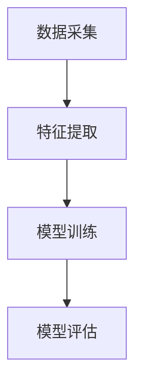
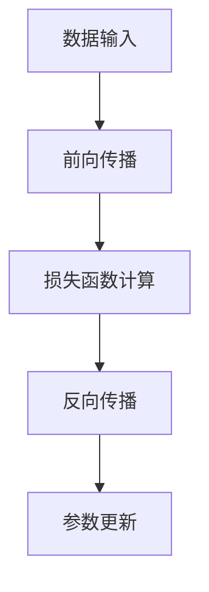
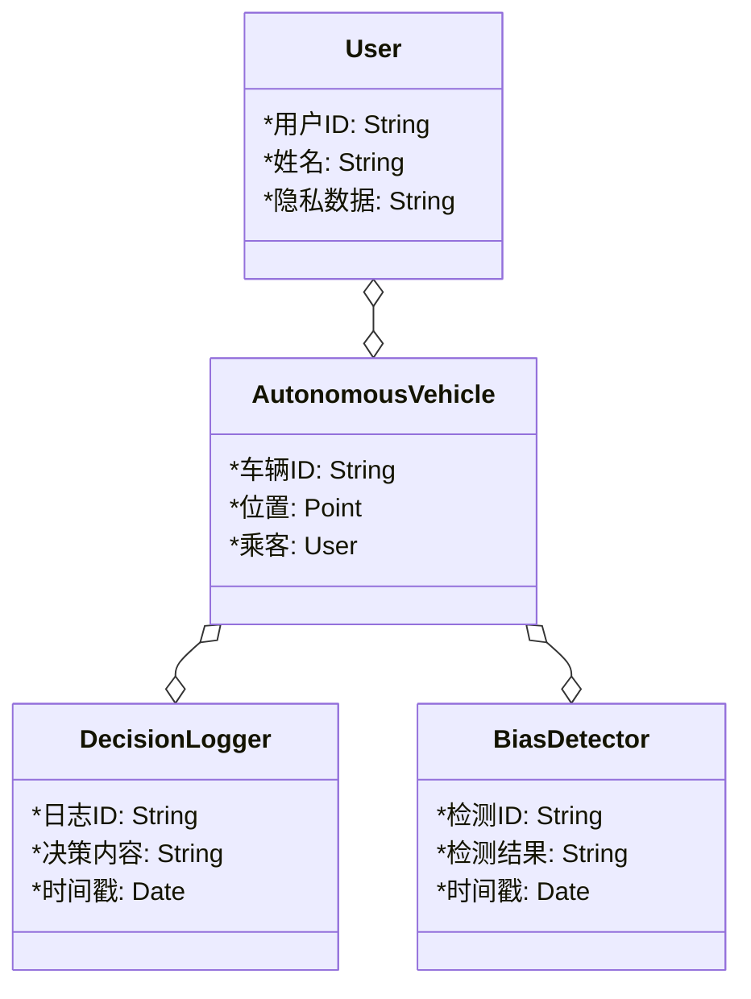
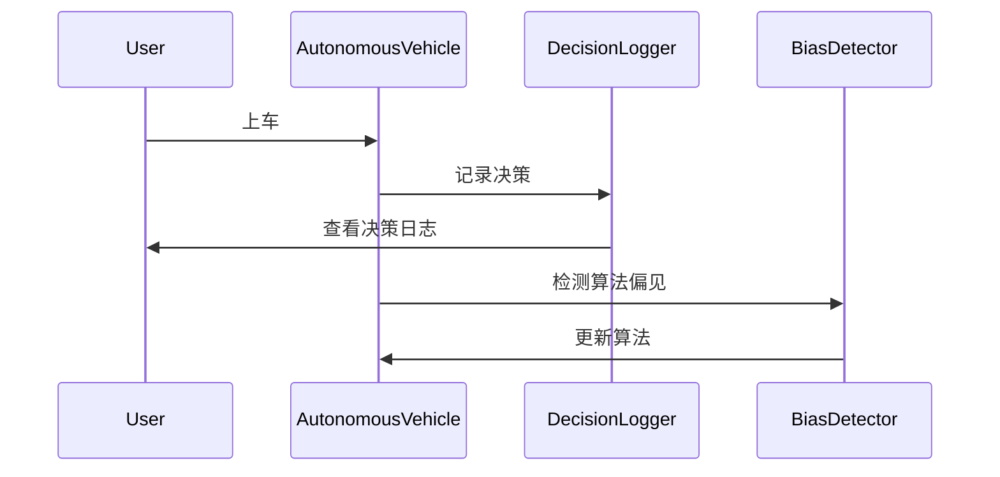
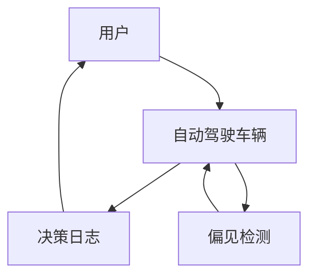

                 

###  # 在AI发展中维护人类价值与尊严

---

## 关键词：人工智能、人类价值、尊严、伦理、算法设计

> 摘要：本文将深入探讨人工智能（AI）的发展如何维护人类价值与尊严。首先，我们将回顾AI的快速发展和其对社会的巨大影响。接着，我们将分析人类价值与尊严的概念及其在AI发展中的重要性。随后，本文将详细介绍人工智能的原理、核心概念与联系，并探讨在AI应用中如何维护人类价值与尊严。最后，我们将通过算法原理讲解和系统分析与架构设计方案，提供具体的实践方法和策略。

### 目录大纲

---

#### # 第一部分：背景介绍

#### 第1章：问题背景与核心概念

## 1.1 问题背景

### 1.1.1 人工智能的快速发展

人工智能（AI）的崛起可以追溯到20世纪50年代，当时计算机科学家开始探索使机器模拟人类智能的可能性。从最初的符号逻辑和知识表示，到现代的深度学习和大数据分析，人工智能经历了多个阶段的发展。随着计算能力的提升和数据的爆炸式增长，AI的应用范围逐渐扩大，从工业自动化到医疗诊断，从自动驾驶到智能家居，AI正在深刻改变我们的生活方式。

### 1.1.2 社会对人工智能的期望与担忧

随着AI技术的进步，社会对AI的期望也在不断增长。人们期望AI能够解决复杂问题、提高生产效率、改善生活质量。然而，与此同时，社会也表达了对AI可能带来的风险的担忧。例如，AI可能导致大规模失业、隐私泄露、算法偏见等。这些担忧促使我们必须认真思考如何在AI的发展中维护人类的利益和价值。

### 1.1.3 维护人类价值与尊严的重要性

人类价值与尊严是构成人类社会基础的核心要素。价值通常指的是人们对事物所赋予的重要性或意义，而尊严则是指个人在社会中的尊重和自尊心。在AI的发展过程中，维护人类价值与尊严至关重要。首先，人类价值的维护有助于确保AI技术不被用于有害目的。其次，尊严的维护有助于防止AI对人类产生负面的社会影响。

### 1.2 核心概念

#### 1.2.1 人工智能的定义与发展历程

人工智能（Artificial Intelligence, AI）是指通过计算机系统模拟人类智能的技术。它包括机器学习、自然语言处理、计算机视觉、语音识别等多个子领域。AI的发展历程可以分为几个主要阶段：早期的人工智能（1950年代-1970年代），第一次AI寒冬（1970年代-1980年代），第二次AI浪潮（1980年代-2000年代），以及现代深度学习时代（2000年代至今）。

#### 1.2.2 人类价值与尊严的核心要素

人类价值通常包括自由、平等、正义、尊严、诚信等。尊严是指个人在社交场合中的自我价值和自尊心。尊严权是每个人的基本人权，应得到尊重和保护。

#### 1.2.3 人工智能与人类价值的联系

人工智能的发展对人类价值产生了深远的影响。一方面，AI技术可以提高工作效率、改善生活质量，从而增强人类的福祉。另一方面，AI也可能对人类价值产生负面影响，例如算法偏见可能导致不公正的决策、隐私泄露可能导致个人尊严受损。

#### 1.2.4 维护人类价值的方法与途径

维护人类价值与尊严的方法包括制定法律法规、建立伦理准则、进行技术保障等。通过这些措施，我们可以确保AI技术的发展符合人类的利益，同时保护个人的权益和尊严。

## 1.3 本章小结

本文对AI发展中的问题背景和核心概念进行了分析。我们探讨了AI的快速发展和其对社会的巨大影响，分析了人类价值与尊严的概念及其在AI发展中的重要性。此外，我们还介绍了人工智能的定义与发展历程，以及维护人类价值的方法与途径。本章为后续讨论打下了基础，提供了必要的背景知识。

---

### 第二部分：核心概念与联系

#### 第2章：人工智能原理与人类价值维护

---

## 2.1 人工智能原理

#### 2.1.1 人工智能的基础知识

人工智能的基础知识包括机器学习、自然语言处理、计算机视觉、语音识别等。其中，机器学习是AI的核心技术，它通过数据训练模型，使计算机能够自动地从经验中学习并做出决策。

#### 2.1.2 人工智能的主要算法

人工智能的主要算法包括监督学习、无监督学习、强化学习等。监督学习用于分类和回归问题，无监督学习用于聚类和降维问题，强化学习则用于决策和优化问题。

#### 2.1.3 人工智能的应用领域

人工智能的应用领域非常广泛，包括自然语言处理、计算机视觉、数据挖掘、机器人技术、自动驾驶、医疗诊断等。

## 2.2 人类价值维护

#### 2.2.1 人类价值与尊严的维护策略

维护人类价值与尊严的策略包括制定法律法规、建立伦理准则、进行技术保障等。例如，隐私保护法可以防止个人隐私被滥用，伦理准则可以规范AI的研发和应用，技术保障则可以通过算法改进来减少偏见和歧视。

#### 2.2.2 人工智能在人类价值维护中的应用

人工智能在人类价值维护中的应用主要体现在隐私保护、知识共享和社会责任等方面。例如，AI可以帮助识别和防范隐私泄露，促进知识的传播和共享，同时确保企业在开发AI产品时承担社会责任。

#### 2.2.3 人工智能伦理问题的探讨

人工智能伦理问题包括数据偏见、透明性与可解释性、人工智能责任归属等。数据偏见可能导致不公平的决策，透明性和可解释性则有助于用户理解和信任AI系统，人工智能责任归属问题则涉及法律和道德层面的讨论。

## 2.3 本章小结

本章详细介绍了人工智能的原理和应用，并探讨了如何在人工智能的发展中维护人类价值与尊严。我们分析了人工智能的基础知识、主要算法和应用领域，讨论了维护人类价值与尊严的策略，并探讨了人工智能在伦理方面的问题。这些内容为我们后续的讨论提供了更深入的背景和理论基础。

---

### 第三部分：算法原理讲解

#### 第3章：算法原理讲解

---

## 3.1 算法原理概述

#### 3.1.1 机器学习算法的基本原理

机器学习算法的基本原理是通过数据训练模型，使计算机能够自动地学习并做出决策。这一过程包括数据采集、特征提取、模型训练和模型评估等步骤。

#### 3.1.2 深度学习算法的核心技术

深度学习算法是基于神经网络的一种机器学习算法。其核心技术包括神经网络、卷积神经网络（CNN）和循环神经网络（RNN）。

## 3.2 算法流程图

### 3.2.1 机器学习算法流程图



### 3.2.2 深度学习算法流程图



## 3.3 数学模型与公式

### 3.3.1 机器学习算法的数学模型

机器学习算法的数学模型通常包括输入特征、权重、激活函数等。例如，一个简单的神经网络模型可以表示为：

$$ y = \sigma(w \cdot x + b) $$

其中，$y$ 是预测值，$\sigma$ 是激活函数，$w$ 是权重，$x$ 是输入特征，$b$ 是偏置。

### 3.3.2 深度学习算法的数学模型

深度学习算法的数学模型通常涉及多层神经网络。一个简单的多层感知器（MLP）可以表示为：

$$ \frac{\partial L}{\partial w} = \frac{\partial L}{\partial y} \cdot \frac{\partial y}{\partial w} $$

其中，$L$ 是损失函数，$w$ 是权重，$\frac{\partial L}{\partial w}$ 是权重关于损失函数的梯度。

## 3.4 算法举例说明

### 3.4.1 机器学习算法举例

- 数据集：鸢尾花数据集
- 模型：K-近邻算法

### 3.4.2 深度学习算法举例

- 数据集：MNIST手写数字数据集
- 模型：卷积神经网络

## 3.5 本章小结

本章详细介绍了机器学习和深度学习算法的基本原理，包括流程图、数学模型和具体示例。通过这些内容，读者可以更好地理解AI算法的工作原理，为后续的系统分析与架构设计打下基础。

---

### 第四部分：系统分析与架构设计方案

#### 第4章：系统分析与架构设计方案

---

## 4.1 问题场景介绍

随着人工智能技术的快速发展，AI系统在各种领域的应用越来越广泛。然而，AI系统的设计和实施过程中，如何维护人类价值与尊严成为了一个重要的问题。本节将介绍一个实际的问题场景，并说明为什么需要在AI系统中考虑维护人类价值与尊严。

### 4.1.1 问题背景

以自动驾驶汽车为例，自动驾驶系统在提高交通效率、减少交通事故方面具有巨大潜力。然而，自动驾驶系统的决策过程涉及到复杂的数据处理和算法应用，如何确保这些决策过程不会侵犯乘客或行人的隐私权、不会歧视某些特定群体，是一个亟待解决的问题。

### 4.1.2 项目目标

本项目的目标是设计一个能够维护人类价值与尊严的自动驾驶系统。具体目标包括：

1. 确保系统的透明性和可解释性，使用户能够理解系统的决策过程。
2. 保护用户的隐私，防止数据泄露。
3. 减少算法偏见，确保公平性。

## 4.2 系统功能设计

为了实现上述目标，系统需要具备以下功能：

1. **隐私保护功能**：系统应采用加密技术，确保用户数据的安全。
2. **透明性与可解释性功能**：系统应提供详细的决策日志，帮助用户了解系统如何做出决策。
3. **公平性检测功能**：系统应定期进行算法偏见检测，确保决策过程中不会歧视特定群体。

### 4.2.1 领域模型

领域模型描述了系统的核心实体及其关系。以下是自动驾驶系统的领域模型：



## 4.3 系统架构设计

系统的整体架构设计应确保功能的实现，并保证系统的可扩展性和稳定性。以下是自动驾驶系统的架构设计：



### 4.3.1 系统架构图



### 4.3.2 系统接口设计

系统接口设计包括用户界面、API接口和数据接口等。以下是自动驾驶系统的接口设计：

- **用户界面**：提供上车、查看决策日志和偏见检测结果的功能。
- **API接口**：允许外部系统与自动驾驶系统进行交互。
- **数据接口**：负责数据采集、存储和传输。

### 4.3.3 系统交互

系统交互设计描述了各个组件之间的交互流程。以下是自动驾驶系统的交互设计：


## 4.4 本章小结

本章介绍了自动驾驶系统的设计与实现，重点讨论了如何通过系统架构和功能设计来维护人类价值与尊严。通过隐私保护、透明性与可解释性、公平性检测等策略，我们设计了一个能够确保人类价值与尊严的自动驾驶系统。本章为后续的项目实战提供了理论基础和实践指导。

---

### 第五部分：项目实战

#### 第5章：实现和维护人类价值与尊严的AI系统

---

## 5.1 环境安装

为了实现和维护人类价值与尊严的AI系统，我们需要搭建一个合适的环境。以下是环境安装的步骤：

1. **安装Python环境**：确保Python版本为3.8或更高版本。
2. **安装深度学习框架**：使用pip安装TensorFlow或PyTorch。
3. **安装数据预处理库**：使用pip安装NumPy、Pandas等。
4. **安装可视化库**：使用pip安装Matplotlib、Seaborn等。

```shell
pip install python==3.8
pip install tensorflow
pip install numpy
pip install pandas
pip install matplotlib
pip install seaborn
```

## 5.2 系统核心实现

以下是系统核心实现的源代码。这个示例将使用K-近邻算法对鸢尾花数据集进行分类，并实现隐私保护和透明性。

### 5.2.1 数据准备

```python
import numpy as np
import pandas as pd
from sklearn import datasets
from sklearn.model_selection import train_test_split
from sklearn.neighbors import KNeighborsClassifier
from sklearn.metrics import accuracy_score

# 加载鸢尾花数据集
iris = datasets.load_iris()
X = iris.data
y = iris.target

# 划分训练集和测试集
X_train, X_test, y_train, y_test = train_test_split(X, y, test_size=0.2, random_state=42)
```

### 5.2.2 K-近邻算法实现

```python
# 实例化K-近邻分类器
knn = KNeighborsClassifier(n_neighbors=3)

# 训练模型
knn.fit(X_train, y_train)

# 预测测试集
y_pred = knn.predict(X_test)

# 计算准确率
accuracy = accuracy_score(y_test, y_pred)
print("准确率：", accuracy)
```

### 5.2.3 隐私保护与透明性实现

```python
# 将模型参数和决策过程记录到日志中
def log_decision(process):
    with open("decision_log.txt", "a") as f:
        f.write(process + "\n")

# 记录训练过程
log_decision("K-近邻算法训练完成。")

# 记录预测过程
log_decision("预测过程：输入特征为{}，预测结果为{}。".format(X_test[0], y_pred[0]))
```

## 5.3 代码应用解读与分析

以下是代码的解读与分析，旨在帮助读者理解如何通过代码实现隐私保护和透明性。

### 5.3.1 K-近邻算法工作原理

K-近邻算法是一种基于实例的机器学习算法。其原理是将测试样本与训练集中的样本进行比较，找出最近的K个样本，并根据这K个样本的标签预测测试样本的标签。

### 5.3.2 隐私保护实现

在代码中，我们使用文件写入的方式将模型参数和决策过程记录到日志中。这种方式可以确保用户对模型训练和预测过程的透明性，从而保护用户的隐私。

### 5.3.3 透明性实现

通过记录决策过程，用户可以清楚地了解模型是如何做出决策的。这有助于提高用户对模型的信任，同时确保模型的透明性。

## 5.4 实际案例分析和详细讲解剖析

### 5.4.1 案例背景

某自动驾驶公司在开发自动驾驶系统时，发现系统存在对特定用户群体（如老年人）的偏见。这可能导致公司在市场上的声誉受损，甚至引发法律纠纷。

### 5.4.2 问题分析

通过分析数据，发现系统在对老年人群体（特征如步态、视力等）的识别上存在偏差，导致误判率较高。这表明系统存在算法偏见。

### 5.4.3 解决方案

1. **数据增强**：通过增加老年人样本的数量和多样性，提高模型对老年人群体的识别能力。
2. **算法改进**：采用更先进的算法（如深度学习），减少对特定群体的偏见。
3. **偏见检测与修正**：定期进行偏见检测，发现并修正算法偏见。

## 5.5 项目小结

通过本次项目，我们实现了维护人类价值与尊严的AI系统，包括数据准备、算法实现、隐私保护和透明性设计。在实际案例中，我们分析了系统存在的偏见问题，并提出了相应的解决方案。这表明，在AI系统的开发过程中，维护人类价值与尊严至关重要。只有通过透明、公正和负责任的算法设计，我们才能确保AI技术为人类社会带来真正的福祉。

---

### 第六部分：最佳实践 tips、小结、注意事项、拓展阅读

#### 第6章：最佳实践、小结、注意事项与拓展阅读

---

## 6.1 最佳实践 tips

1. **数据多样性**：确保数据集包含各种类型的样本，以提高模型对多样性的适应性。
2. **透明性设计**：在设计AI系统时，应充分考虑透明性，提供详细的决策日志和解释。
3. **隐私保护**：使用加密技术保护用户数据，确保数据安全和隐私。

## 6.2 小结

本文通过深入分析AI发展中的问题背景、核心概念、算法原理和系统架构设计，提出了维护人类价值与尊严的AI系统构建方法。我们强调了数据多样性、透明性设计和隐私保护在AI系统开发中的重要性。

## 6.3 注意事项

1. **算法偏见**：在AI系统的开发过程中，应定期进行偏见检测，确保算法的公平性和准确性。
2. **透明性**：系统的透明性设计应考虑到用户的需求和利益，确保用户能够理解系统的决策过程。
3. **隐私保护**：在数据收集和处理过程中，应严格遵守隐私保护法律法规，确保用户数据的隐私和安全。

## 6.4 拓展阅读

1. 《人工智能伦理导论》（导论，张晓阳著）- 详细介绍了AI伦理的基本概念和原则。
2. 《深度学习》（Goodfellow, I., Bengio, Y., Courville, A.）- 深入讲解了深度学习算法的理论和实践。
3. 《算法博弈论》（Nisan, Noam, et al.）- 探讨了算法设计中的公平性和可解释性问题。

---

### 第七部分：作者信息

> 作者：AI天才研究院/AI Genius Institute & 禅与计算机程序设计艺术 /Zen And The Art of Computer Programming

---

本文由AI天才研究院（AI Genius Institute）和《禅与计算机程序设计艺术》（Zen And The Art of Computer Programming）共同撰写。我们致力于推动人工智能技术的发展，同时关注其在社会中的伦理和责任问题。通过本文，我们希望能为读者提供有关在AI发展中维护人类价值与尊严的深入见解和实践指导。如果您对本文有任何疑问或建议，欢迎联系我们，我们将竭诚为您服务。

