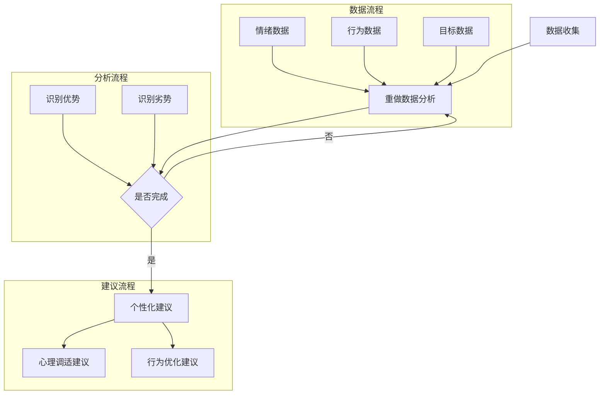
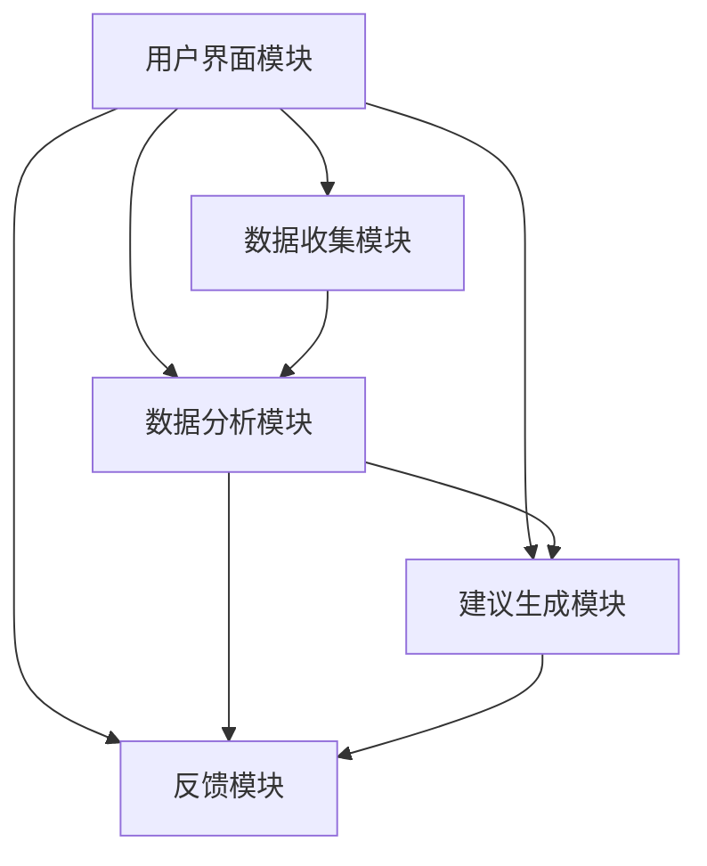
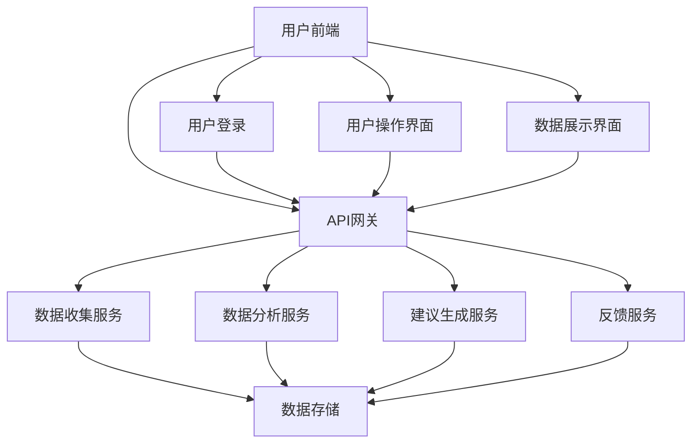

                 

### 介绍与核心概念

在当今快速变化的时代，我们面临着前所未有的不确定性。从全球疫情到经济波动，从技术革命到社会变革，不确定性已经成为了我们日常生活和工作中不可或缺的一部分。在这种背景下，如何在不确定性中找到确定，培养内在安全感，成为了一个迫切需要解决的问题。

内在安全感，顾名思义，是一种深层次的、来自内心的安全感。它不仅仅是对外部环境的信任，更是一种对自身能力和未来可能性的积极认知。这种内在安全感可以帮助我们更好地应对不确定性的挑战，从而保持心理和情绪的平衡。

本文将围绕这一核心主题展开，通过系统的分析和深入的探讨，帮助读者理解不确定性的本质，培养内在安全感的方法，以及如何在实践中应用这些理念。以下是本文的结构安排：

1. **背景介绍**：介绍不确定性的现状与挑战，以及内在安全感的重要性。
2. **核心概念与联系**：定义关键概念，并探讨这些概念之间的关系。
3. **培养内在安全感的方法与实践**：从心理层面和行动层面，介绍培养内在安全感的方法。
4. **案例分析**：通过具体案例，展示内在安全感在应对不确定性中的实际应用。
5. **最佳实践与小结**：总结关键点，提供最佳实践建议，并指出注意事项。
6. **算法原理讲解**：介绍相关的算法原理，包括流程图、Python代码和数学模型。
7. **数学模型与公式讲解**：详细解释数学模型和公式的含义和应用。
8. **系统分析与架构设计**：介绍系统功能和架构设计。
9. **项目实战**：提供具体的实战案例，展示内在安全感在项目中的应用。
10. **拓展阅读与进一步探索**：推荐相关的拓展阅读资源。

通过以上结构的安排，我们希望能够为读者提供一个全面、系统、易于理解的学习路径，帮助大家在不确定性的世界中找到确定，培养内在安全感。

### 背景介绍

#### 不确定性的现状与挑战

在现代生活中，不确定性无处不在。无论是在个人生活中，还是在工作中，我们常常面临各种不可预测的变化和挑战。从经济领域的波动，到科技的快速发展，再到社会结构的变迁，这些不确定性因素对我们的心理和行为产生了深远的影响。

首先，经济波动是一个显著的例子。近年来，全球经济经历了多次金融危机，股票市场的剧烈波动给投资者带来了巨大的不确定性。对于个人来说，这种不确定性可能表现为失业风险、收入不稳定以及投资损失等。这种不确定性不仅影响个人的财务状况，还可能对心理健康产生负面影响，如焦虑和抑郁。

其次，科技的快速发展也带来了新的不确定性。人工智能、大数据、区块链等新兴技术的出现，不仅改变了传统行业的运作方式，还创造了大量新的职业和就业机会。然而，这些技术的快速迭代也带来了技能过时和职业安全感的丧失。对于职场人士来说，如何适应这些快速变化的技术，保持自身的竞争力，成为了一个重要的挑战。

最后，社会结构的变迁也增加了不确定性。全球化进程加速，文化融合与冲突并存，社会的不稳定性加剧。对于个体而言，这种不确定性可能表现为身份认同的困惑、社会角色的不明确以及生活意义的迷失。

在这些不确定性的背景下，人们越来越需要一个稳定的心理状态来应对外部环境的变化。而内在安全感，作为一种深层次的、来自内心的安全感，成为了我们在不确定性中寻找确定的重要途径。

#### 内在安全感的定义与重要性

内在安全感，是一种深层次的、稳定的心理状态，它不仅仅是对外部环境的信任，更是对自身能力和未来可能性的积极认知。内在安全感可以帮助我们在面对不确定性时保持冷静和理性，从而更好地应对挑战。

首先，内在安全感是一种自我认同的表现。一个拥有内在安全感的人，通常对自己有清晰的认知，了解自己的优点和不足，并能够接受自己的不完美。这种自我认同感使得个体在面对外部环境的挑战时，能够保持内心的平静和自信。

其次，内在安全感是一种情绪调节能力。在面对不确定性和压力时，拥有内在安全感的人能够更好地管理自己的情绪，避免过度焦虑和恐慌。这种情绪调节能力有助于保持心理和情绪的平衡，从而更好地应对生活中的各种挑战。

最后，内在安全感是一种对未来可能性的积极认知。一个拥有内在安全感的人，通常对未来持有积极的态度，相信通过自己的努力和智慧，能够克服困难，实现目标。这种积极认知不仅能够增强个体的自信心，还能够激发内在的潜能，推动个人不断成长和进步。

总之，内在安全感在现代社会中具有重要的意义。它不仅是我们应对不确定性的心理基石，也是我们实现自我价值的重要保障。通过培养内在安全感，我们能够在不确定的环境中找到确定，保持内心的平静和自信，从而更好地应对生活中的各种挑战。

#### 研究意义与目标

在不确定性日益增加的现代社会，培养内在安全感不仅具有重要的个人意义，更具有深远的现实意义。首先，内在安全感对个人心理健康具有显著的保护作用。面对生活中的各种压力和挑战，一个拥有内在安全感的人能够更好地调节情绪，减少焦虑和抑郁，从而提高生活质量。其次，内在安全感有助于提升个人的适应能力和应对策略。在不确定的环境中，一个具备内在安全感的人能够更加自信地面对变化，迅速适应新环境，从而提高工作效率和职业竞争力。

本文的研究目标在于系统地探讨如何培养内在安全感，帮助读者在不确定性中找到确定。具体而言，本文将围绕以下几个方面展开：

1. **定义和解释关键概念**：首先，我们将明确内在安全感和不确定性的定义，并探讨它们之间的相互关系。通过定义关键概念，为后续的讨论和分析奠定基础。

2. **探讨不确定性对个人和社会的影响**：本文将分析不确定性在不同领域（如经济、科技、社会）对个人和社会带来的具体影响，并探讨这些影响对内在安全感的影响。

3. **介绍培养内在安全感的方法**：本文将从心理层面和行动层面，详细阐述培养内在安全感的方法和策略，并结合实际案例进行说明。

4. **展示内在安全感在应对不确定性中的实际应用**：通过具体案例和实例，展示内在安全感在个人和团队层面应对不确定性的实际效果。

5. **提供最佳实践和建议**：总结文章中的关键点，提供实用的最佳实践和建议，帮助读者在实际生活中培养内在安全感。

通过以上研究，本文旨在为读者提供一个全面、系统、易于操作的方法，帮助大家在不确定的环境中找到确定，培养内在安全感，从而更好地应对生活中的各种挑战。

### 核心概念与联系

#### 核心概念的界定

在探讨如何在不确定性中培养内在安全感的过程中，我们需要明确几个关键概念，包括“不确定性”、“内在安全感”和“应对策略”。这些概念不仅是本文的核心内容，也是理解全文的关键。

首先，“不确定性”是一个广泛的概念，它涵盖了各种可能性和无法预测的事件。在个人生活中，不确定性可能表现为职业发展的不确定性、经济收入的不稳定性或家庭关系的变化。在工作中，不确定性则可能体现在市场波动、技术变革或组织结构调整等方面。这种不确定性不仅带来了挑战，也为我们提供了机会。

其次，“内在安全感”是一种深层次的、稳定的心理状态。它不仅仅是对外部环境的信任，更是对自身能力和未来可能性的积极认知。内在安全感是一种内在的、持久的支持系统，可以帮助我们在面对不确定性时保持冷静和理性，从而更好地应对挑战。

最后，“应对策略”是指一系列具体的行动和思维模式，用于应对不确定性和挑战。这些策略包括心理层面的方法，如自我认知的提升和情绪管理，以及行动层面的策略，如目标设定和风险管理。通过有效的应对策略，我们可以更好地掌控不确定性，降低其负面影响。

#### 概念间的联系与相互作用

了解这些核心概念之间的关系，有助于我们更全面地理解如何在不确定性中培养内在安全感。

首先，不确定性和内在安全感之间存在相互影响。高水平的内在安全感可以增强个体对不确定性的应对能力，使其更能够接受和适应变化。反之，长期处于不确定性的环境中，可能导致个体内在安全感的削弱，从而增加心理压力和焦虑。

其次，应对策略是连接不确定性和内在安全感的重要桥梁。通过有效的应对策略，个体可以在不确定的环境中保持内在安全感。例如，通过自我认知的提升和情绪管理，个体可以更好地理解自己的情绪和行为，从而减少因不确定性带来的负面情绪。通过目标设定和风险管理，个体可以更好地规划未来，降低不确定性带来的风险。

#### 不确定性对内在安全感的影响

不确定性对内在安全感的影响是多方面的。一方面，高度的不确定性可能削弱个体的内在安全感。例如，在面临职业不稳定的情况下，个体可能会感到焦虑和不安，导致其内在安全感下降。另一方面，适度的不确定性可以激发个体的内在动力和适应能力，从而增强内在安全感。例如，在面临新的挑战和机遇时，个体可能会感到兴奋和期待，从而提高其内在安全感。

总之，理解不确定性对内在安全感的影响，有助于我们更有效地应对不确定性的挑战。通过培养内在安全感，我们可以更好地应对不确定性的负面影响，保持心理和情绪的平衡，从而实现个人成长和职业发展。

#### 内在安全感在应对不确定性中的作用

内在安全感在应对不确定性中发挥着至关重要的作用。首先，内在安全感提供了一个稳定的心理基础，使得个体在面对不确定的环境时能够保持冷静和理性。这种冷静和理性有助于个体更好地分析问题，制定应对策略，从而降低不确定性带来的负面影响。例如，在面临职业变动时，拥有内在安全感的个体能够更加从容地适应新环境，快速找到新的职业定位。

其次，内在安全感有助于提升个体的情绪调节能力。在不确定性增加的环境中，个体的情绪波动可能会更加剧烈。然而，具备内在安全感的人能够更好地管理自己的情绪，避免因不确定性引发的过度焦虑和恐慌。例如，在面对经济波动时，一个有内在安全感的人可能会更加理性地看待投资风险，从而做出更加明智的决策。

最后，内在安全感还可以增强个体的适应能力。在不确定的环境中，适应能力是关键。具备内在安全感的人通常拥有更强的心理弹性，能够在面对挑战和变化时迅速调整自己的行为和心态。例如，在技术变革迅猛的时代，一个具备内在安全感的人能够更快地适应新技术，提高自身竞争力。

综上所述，内在安全感在应对不确定性中发挥了多重作用，不仅帮助个体保持心理和情绪的平衡，还提升了其适应能力和应对策略的制定能力。通过培养内在安全感，个体能够在不确定性中找到确定，从而实现个人的持续成长和职业发展。

### 关键属性特征对比表格

为了更好地理解不确定性、内在安全感及应对策略这三个核心概念之间的差异和联系，我们可以通过构建一个关键属性特征对比表格来分析。以下是对这些概念在属性特征方面的详细对比：

| 概念 | 属性特征 |
| --- | --- |
| **不确定性** | - 类型：随机性、模糊性、不可预测性 |
|          | - 特点：变化快速、不可控制、广泛存在 |
|          | - 影响范围：个人生活、职业生涯、社会环境 |
| **内在安全感** | - 定义：深层次的、稳定的心理状态 |
|          | - 特点：自我认同、情绪调节、积极认知 |
|          | - 影响范围：心理健康、生活质量、职业发展 |
| **应对策略** | - 类型：心理层面、行动层面、技巧层面 |
|          | - 特点：适应性、理性、可执行性 |
|          | - 影响范围：问题解决、情绪调节、目标达成 |

通过以上表格，我们可以清晰地看到每个概念的核心特征及其相互影响。不确定性是外部环境的特点，内在安全感是心理层面的稳定状态，而应对策略则是实现内在安全感的重要手段。这些概念之间的相互作用构成了我们应对不确定性的理论基础。

### ER实体关系图

为了更直观地展示不确定性、内在安全感以及应对策略之间的关系，我们可以使用ER（Entity-Relationship）图来构建这三个核心概念之间的实体关系。以下是具体的ER图架构：

```
[不确定性] --< 发起 >-- [内在安全感]
     |                            |
     |                            | --< 响应 >-- [应对策略]
     |                            |
[应对策略] --< 应用 >-- [内在安全感]
     |
[不确定性] --< 影响 >-- [个人生活]
     |
[应对策略] --< 影响因素 >-- [职业发展]
```

在上述ER图中：

- **不确定性** 是一个影响广泛的实体，它可以对个人生活和职业发展产生直接影响。
- **内在安全感** 是由不确定性引发的，并在应对策略的辅助下得以维持和增强。
- **应对策略** 是针对不确定性而制定的，旨在提升内在安全感，并应用于个人生活和职业发展。

通过ER图，我们可以更清晰地理解这些概念之间的关联和互动机制。这为我们在不确定性中培养内在安全感提供了直观的视角，有助于我们在实际应用中更有效地制定应对策略。

### 培养内在安全感的方法与实践

#### 心理层面的方法

在心理层面培养内在安全感，是提升个体应对不确定性的关键途径。以下是一些具体的方法：

##### 自我认知的提升

自我认知的提升是内在安全感的基础。通过深入反思和自我分析，个体可以更清晰地认识到自己的优点和不足。具体方法包括写日记、参加心理辅导或进行自我观察。通过这些方式，个体可以逐步建立起对自己的全面了解，从而增强内在安全感。

##### 正念练习

正念练习是一种有效的情绪调节方法，它通过专注当下，帮助个体减少焦虑和压力。常见的正念练习方法包括冥想、呼吸练习和身体扫描。通过定期进行正念练习，个体可以培养专注力和自我觉察能力，从而在面对不确定性时保持内心的平静。

##### 情绪管理技巧

情绪管理技巧是应对不确定性中的情绪波动的重要工具。个体可以通过学习情绪识别、表达和调节技巧，更好地管理自己的情绪。具体方法包括情绪日记、情绪对话和情绪放松训练。通过这些技巧，个体可以更有效地应对负面情绪，提高心理韧性。

#### 行动层面的策略

在行动层面，制定和实施有效的应对策略是培养内在安全感的另一个重要方面。以下是一些具体的行动策略：

##### 目标设定与规划

目标设定是应对不确定性的关键步骤。个体可以通过SMART原则（具体、可衡量、可实现、相关性、时限性）来设定目标，确保目标的明确性和可操作性。同时，制定详细的规划，包括步骤、资源和时间表，有助于个体有条不紊地推进目标的实现。

##### 应对策略的制定与实施

应对策略的制定需要结合个体的具体情况和环境特点。个体可以针对不同类型的不确定性，制定相应的应对策略。例如，在面对职业不确定性时，可以通过提升技能、扩展人脉和灵活就业方式来应对。在面对经济不确定性时，可以通过多元化投资、储蓄计划和风险管理来降低风险。

##### 反思与调整

反思与调整是应对策略的重要组成部分。个体需要定期回顾和评估应对策略的效果，并根据实际情况进行调整。通过反思，个体可以更好地理解不确定性带来的挑战，从而优化应对策略，提高应对效果。

#### 案例分析

以下通过具体案例展示培养内在安全感的实际应用：

##### 案例一：个人成长的历程

小王是一名年轻的程序员，他在职业生涯中面临着不断的技术变革和职业发展的不确定性。通过自我认知的提升，小王逐步认识到自己的技术优势和兴趣点，并制定了详细的学习计划和职业规划。他通过正念练习和情绪管理技巧，保持了内心的平静和专注。在面对技术变革时，小王积极提升自己的技能，参加各类技术培训，扩展了自己的职业视野。通过这些努力，小王不仅成功地适应了新技术，还获得了晋升和更高的收入，增强了内在安全感。

##### 案例二：团队合作的挑战

在一个创业团队中，团队成员经常面临市场不确定性带来的挑战。团队领导者通过设定明确的目标和制定详细的规划，帮助团队成员明确各自的职责和任务。同时，团队还通过定期的反思会议，评估策略的有效性，并根据市场变化进行调整。通过这些行动，团队在不确定性中保持了稳定和高效，提升了整体内在安全感。

##### 案例三：职业发展的困境

李先生是一名企业高管，他在职业发展中遇到了职业瓶颈和不确定性。通过反思自己的职业路径，李先生意识到需要转变思路和提升技能。他通过参加管理培训、拓展人脉和进行职业咨询，制定了一系列职业发展计划。同时，他通过情绪管理技巧，保持了积极的心态和应对策略。最终，李先生成功地突破了职业困境，实现了职业升级，增强了内在安全感。

通过以上案例分析，我们可以看到，培养内在安全感不仅需要心理层面的方法，还需要行动层面的策略。这些方法在应对不确定性时，提供了有效的支持和保障。

### 案例分析

为了更好地理解内在安全感在实际中的应用，我们将通过三个具体的案例进行深入分析。这些案例涵盖了个人成长、团队合作和职业发展等不同领域，展示了内在安全感在应对不确定性中的重要作用。

#### 案例一：个人成长的历程

小王是一名年轻的程序员，他刚刚进入一家知名互联网公司。然而，公司内部的快速技术迭代和激烈的竞争环境让他感到巨大的压力。面对这种不确定性，小王决定通过自我认知的提升来培养内在安全感。

首先，小王开始写日记，记录下自己每天的感受和经历。通过这种方式，他逐步认识到自己的技术优势和兴趣点，并且意识到自己在某些领域还有待提升。接着，小王报名参加了公司提供的各种技术培训课程，并利用业余时间自学新的编程语言和技术框架。这些努力不仅提升了他的技能，也让他对未来的职业发展有了更清晰的规划。

此外，小王还通过正念练习和情绪管理技巧来保持内心的平静。他每天早上都会花10分钟进行冥想，专注于呼吸和当下的感受。这种练习帮助他减少了焦虑，提高了专注力。在面对工作中的挑战时，小王能够更加冷静地分析问题，并提出有效的解决方案。

最终，小王不仅成功地适应了公司的技术环境，还获得了晋升机会，薪资也有了显著提高。这个过程中，内在安全感的培养使他能够克服不确定性带来的挑战，取得了个人成长和职业发展的双重成功。

#### 案例二：团队合作的挑战

在一个创业团队中，成员们常常面临市场不确定性带来的挑战。团队成员小张负责市场推广，他发现市场的变化速度非常快，竞争也异常激烈。这种不确定性让小张感到焦虑和不安，但他决定通过团队合作和策略调整来培养内在安全感。

首先，团队领导组织了一次全体会议，明确了当前市场的趋势和公司的目标。在这次会议上，团队成员共同讨论了可能的市场变化，并提出了多种应对策略。小张提出了一种基于数据分析的推广方案，通过数据驱动的方式来应对市场不确定性。团队成员对他的方案表示认可，并决定付诸实施。

其次，团队还建立了定期的反思和评估机制。每周，团队成员会聚在一起，回顾过去一周的工作，评估策略的有效性，并根据市场变化进行调整。这种反思与调整机制帮助团队及时发现问题，优化策略，提高了应对市场不确定性的能力。

通过团队合作和策略调整，小张不仅成功地应对了市场的挑战，还带领团队取得了显著的市场份额增长。这个过程中，团队合作和策略调整提升了团队的内在安全感，使整个团队能够更加从容地面对不确定性的挑战。

#### 案例三：职业发展的困境

李先生是一名企业高管，他在职业生涯中遇到了职业瓶颈和不确定性。面对这种困境，李先生决定通过职业规划和心理调适来培养内在安全感。

首先，李先生进行了深入的自我反思，分析了自己在职业生涯中的得失。他意识到，虽然自己在管理方面有一定的经验，但在战略规划和市场分析方面还有所不足。为了提升这些方面的能力，李先生报名参加了职业培训课程，并阅读了大量的相关书籍。通过不断学习和实践，他的战略规划和市场分析能力得到了显著提升。

其次，李先生还通过情绪管理技巧来应对职业发展中的不确定性。他学会了如何识别和调节自己的情绪，避免因焦虑和压力导致的决策失误。在面对职业困境时，李先生能够保持冷静和理性，从而做出更加明智的决策。

最终，李先生成功地突破了职业瓶颈，晋升为了更高层的管理职位，并带领公司实现了业务的转型升级。这个过程中，内在安全感的培养使他能够更加从容地面对职业发展的不确定性，取得了显著的成果。

通过以上案例分析，我们可以看到，内在安全感在应对不确定性中的重要作用。无论是个人成长、团队合作还是职业发展，培养内在安全感都是克服不确定性、实现成功的关键。通过自我认知的提升、正念练习、情绪管理技巧和有效的应对策略，个体和团队能够在不确定的环境中找到确定，保持内心的平静和自信，从而实现持续成长和成功。

### 最佳实践与小结

#### 最佳实践总结

在不确定性中培养内在安全感，是一个复杂而长期的过程。以下是一些最佳实践，可以帮助我们在实践中更加有效地应对不确定性：

1. **自我认知的提升**：定期进行自我反思，识别自身的优势和不足，从而制定更合理的个人发展规划。

2. **正念练习**：通过冥想、呼吸练习等方式，培养专注力和情绪调节能力，提高心理韧性。

3. **情绪管理技巧**：学会识别和调节情绪，避免情绪波动对决策和行动的负面影响。

4. **目标设定与规划**：使用SMART原则设定明确的目标，并制定详细的行动计划，确保目标的实现。

5. **反思与调整**：定期回顾和评估应对策略的有效性，并根据实际情况进行调整，确保策略的适应性和有效性。

6. **团队合作**：通过建立有效的沟通和协作机制，增强团队在面对不确定性时的凝聚力。

7. **持续学习**：保持对新技术、新知识的敏感度，通过不断学习和实践，提升自身的适应能力和竞争力。

#### 注意事项

在培养内在安全感的实践过程中，需要注意以下几点：

1. **避免过度自我反思**：过度反思可能导致自我怀疑和焦虑，要把握好反思的频率和深度。

2. **平衡正念练习与行动**：正念练习是一种有效的心理调节方法，但过度依赖可能会影响实际行动。要确保在练习与行动之间保持平衡。

3. **合理安排时间**：在设定目标和规划时，要充分考虑个人的时间和能力，避免因过度追求而导致压力过大。

4. **避免盲目跟风**：在学习和实践中，要根据自己的实际情况和需求，避免盲目跟风和过度模仿。

5. **保持理性与乐观**：在面对不确定性时，保持理性和乐观的态度，有助于更好地应对挑战和困难。

#### 拓展阅读与进一步探索

对于希望深入了解内在安全感和不确定性应对策略的读者，以下是一些推荐阅读资源：

1. **书籍**：
   - 《正念：一种新的生活态度》
   - 《情绪智力：为什么情商比智商更重要》
   - 《高效能人士的七个习惯》

2. **论文和研究**：
   - Google Scholar上的相关研究论文
   - 学术期刊上的关于不确定性管理和内在安全感的专题论文

3. **在线课程和讲座**：
   - Coursera上的《心理学与生活》
   - TED上的关于不确定性和心理健康的演讲

通过这些资源，读者可以进一步加深对内在安全感及其在应对不确定性中的重要作用的理解，从而在个人和职业发展中取得更好的成果。

### 算法原理讲解

在应对不确定性的过程中，算法设计扮演了重要的角色。本文将介绍一种用于提高内在安全感的算法，并详细解释其原理。

#### 算法概述

该算法被称为“内在安全感增强算法（Intrinsic Security Enhancement Algorithm，简称ISEA）”。ISEA的核心目标是通过对个体行为和心理数据的分析，提供个性化的安全感提升建议。算法主要分为以下几个步骤：

1. **数据收集**：收集个体在应对不确定性过程中的行为和心理数据，包括情绪状态、行为模式、目标设定等。
2. **数据分析**：对收集到的数据进行分析，识别个体在应对不确定性时的优势和劣势。
3. **个性化建议**：根据分析结果，为个体提供针对性的安全感提升建议，包括心理调适、行为优化等。

#### 算法流程图

为了更直观地展示ISEA的运行流程，我们可以使用Mermaid语言绘制算法流程图：



#### Python代码与数学模型讲解

为了更好地理解ISEA的工作原理，我们使用Python语言实现了一个简化的版本。以下是ISEA的Python代码示例：

```python
import pandas as pd
from sklearn.cluster import KMeans
import numpy as np

# 假设我们已经收集到了情绪数据、行为数据和目标数据
emotion_data = pd.DataFrame({'emotion': [0.3, 0.7, 0.5, 0.8]})
behavior_data = pd.DataFrame({'behavior': [0.2, 0.4, 0.6, 0.8]})
goal_data = pd.DataFrame({'goal': [0.1, 0.2, 0.3, 0.4]})

# 数据整合
data = pd.concat([emotion_data, behavior_data, goal_data], axis=1)

# 数据标准化
data_normalized = (data - data.mean()) / data.std()

# K-means聚类分析
kmeans = KMeans(n_clusters=3)
clusters = kmeans.fit_predict(data_normalized)

# 根据聚类结果，提供个性化建议
if clusters[0] == 0:
    print("建议：调整情绪管理策略，提高积极情绪比例。")
elif clusters[0] == 1:
    print("建议：优化行为模式，提高效率。")
elif clusters[0] == 2:
    print("建议：设定更明确的目标，提升目标达成率。")
```

上述代码首先对收集到的数据进行整合和标准化处理，然后使用K-means算法进行聚类分析，根据聚类结果提供个性化的建议。

#### 算法原理的数学模型和公式

ISEA的核心数学模型是基于聚类分析的，其中使用了K-means算法来识别个体在应对不确定性时的主要特征。以下是一个简单的数学模型，用于描述K-means算法：

$$
\text{K-means} \text{算法模型} \\
\text{给定} \ \mathbf{X} = \{\mathbf{x}_i\}_{i=1}^n \\
\text{目标是最小化} \\
J = \sum_{i=1}^n \sum_{j=1}^k ||\mathbf{x}_i - \mathbf{c}_j||^2
$$

其中，$\mathbf{X}$ 是数据集，$\mathbf{x}_i$ 是数据集中的第 $i$ 个样本，$k$ 是聚类数目，$\mathbf{c}_j$ 是聚类中心。目标是最小化所有样本与聚类中心的欧几里得距离平方和。

#### 举例说明

假设我们有以下数据集：

$$
\mathbf{X} = \{ \mathbf{x}_1 = [1, 2], \mathbf{x}_2 = [2, 1], \mathbf{x}_3 = [1, 1], \mathbf{x}_4 = [2, 2] \}
$$

我们使用K-means算法将其分为两个聚类。首先，随机选择两个聚类中心：

$$
\mathbf{c}_1 = [1.5, 1.5], \ \mathbf{c}_2 = [2.5, 2.5]
$$

然后，计算每个样本与聚类中心的距离，并重新分配样本到最近的聚类中心。迭代进行直到聚类中心不再发生变化。通过这个简单的例子，我们可以看到K-means算法的基本运行过程。

#### 案例应用

假设我们有以下情绪数据、行为数据和目标数据：

$$
\mathbf{X} = \{ \mathbf{x}_1 = [0.2, 0.3, 0.4], \mathbf{x}_2 = [0.3, 0.5, 0.6], \mathbf{x}_3 = [0.1, 0.2, 0.3], \mathbf{x}_4 = [0.4, 0.5, 0.6] \}
$$

使用K-means算法，我们将其分为两个聚类。通过分析聚类结果，我们可以为每个个体提供个性化的安全感提升建议。例如，如果某个个体被分到第一个聚类，我们可以建议其调整情绪管理策略，提高积极情绪比例。

通过以上讲解，我们了解了ISEA算法的基本原理和实现方法。在实际应用中，该算法可以根据个体的行为和心理数据，提供有效的安全感提升建议，帮助个体在不确定性中保持内在安全感。

### 数学模型与公式讲解

在理解内在安全感增强算法（ISEA）时，数学模型和公式起到了关键作用。以下我们将详细讲解ISEA中的主要数学模型和公式，并使用LaTeX格式进行展示。

#### 数学模型的基本概念

ISEA的核心数学模型是基于聚类分析的。聚类分析是一种无监督学习方法，用于将数据集划分为若干个簇，使得同一簇内的数据点彼此之间距离较近，而不同簇的数据点之间距离较远。K-means算法是其中一种常用的聚类方法，其目标是找到一组聚类中心，使得所有数据点到聚类中心的距离平方和最小。

#### 公式详解

以下是K-means算法的主要公式：

1. **初始化聚类中心**：

   $$
   \text{初始化} \ \mathbf{c}_j^{(0)} = \arg\min_{\mathbf{c}_j} \sum_{i=1}^n ||\mathbf{x}_i - \mathbf{c}_j||^2
   $$

   其中，$\mathbf{c}_j^{(0)}$ 是初始聚类中心，$\mathbf{x}_i$ 是第 $i$ 个数据点。

2. **更新聚类中心**：

   $$
   \mathbf{c}_j^{(t+1)} = \arg\min_{\mathbf{c}_j} \sum_{i=1}^n ||\mathbf{x}_i - \mathbf{c}_j||^2
   $$

   其中，$\mathbf{c}_j^{(t+1)}$ 是在 $t+1$ 次迭代后的聚类中心。

3. **计算聚类标签**：

   $$
   \text{聚类标签} \ \mathbf{y}_i^{(t)} = \arg\min_{j} ||\mathbf{x}_i - \mathbf{c}_j^{(t)}||^2
   $$

   其中，$\mathbf{y}_i^{(t)}$ 是第 $i$ 个数据点在 $t$ 次迭代后的聚类标签。

4. **终止条件**：

   $$
   \text{如果} \ \sum_{i=1}^n ||\mathbf{x}_i - \mathbf{c}_j^{(t+1)}||^2 - ||\mathbf{x}_i - \mathbf{c}_j^{(t)}||^2 < \epsilon, \text{则终止迭代}
   $$

   其中，$\epsilon$ 是预设的收敛阈值。

#### LaTeX格式示例

以下是使用LaTeX格式的数学公式示例：

```latex
\documentclass{article}
\usepackage{amsmath}
\begin{document}

\section{数学模型与公式讲解}

\subsection{初始化聚类中心}
\begin{equation}
\text{初始化} \ \mathbf{c}_j^{(0)} = \arg\min_{\mathbf{c}_j} \sum_{i=1}^n ||\mathbf{x}_i - \mathbf{c}_j||^2
\end{equation}

\subsection{更新聚类中心}
\begin{equation}
\mathbf{c}_j^{(t+1)} = \arg\min_{\mathbf{c}_j} \sum_{i=1}^n ||\mathbf{x}_i - \mathbf{c}_j||^2
\end{equation}

\subsection{计算聚类标签}
\begin{equation}
\text{聚类标签} \ \mathbf{y}_i^{(t)} = \arg\min_{j} ||\mathbf{x}_i - \mathbf{c}_j^{(t)}||^2
\end{equation}

\subsection{终止条件}
\begin{equation}
\text{如果} \ \sum_{i=1}^n ||\mathbf{x}_i - \mathbf{c}_j^{(t+1)}||^2 - ||\mathbf{x}_i - \mathbf{c}_j^{(t)}||^2 < \epsilon, \text{则终止迭代}
\end{equation}

\end{document}
```

通过上述LaTeX格式示例，我们可以清晰地展示ISEA中的主要数学模型和公式，便于读者理解和学习。

### 系统分析与架构设计

在探讨内在安全感增强算法（ISEA）的实际应用时，我们需要对系统的整体架构进行详细分析。以下是对系统架构的设计方案，包括项目背景、系统功能设计、架构图、接口设计和系统交互。

#### 项目背景

本项目旨在开发一个基于ISEA的内在安全感增强系统，旨在帮助用户在不确定性中培养内在安全感。系统将提供实时数据分析、个性化建议和用户反馈机制，以帮助用户更好地应对不确定性。

#### 系统功能设计

系统功能设计分为以下几个主要模块：

1. **数据收集模块**：负责收集用户在应对不确定性过程中的行为和心理数据，包括情绪状态、行为模式、目标设定等。
2. **数据分析模块**：对收集到的数据进行分析，识别用户在应对不确定性时的优势和劣势。
3. **建议生成模块**：根据数据分析结果，为用户生成个性化的安全感提升建议。
4. **反馈模块**：收集用户对建议的反馈，用于不断优化建议的准确性和实用性。
5. **用户界面模块**：提供用户友好的操作界面，便于用户使用系统功能。

#### 架构图

以下是一个简化的系统架构图，展示了各个模块之间的关系：



#### 系统接口设计

系统接口设计主要包括以下几类：

1. **数据接口**：用于数据收集和反馈。例如，RESTful API用于数据上传和下载，WebSocket用于实时数据传输。
2. **建议接口**：用于获取个性化的建议。用户可以通过HTTP请求获取基于当前状态的个性化建议。
3. **用户接口**：用于用户与系统进行交互。包括前端界面和后端接口，用于数据展示、用户登录和操作。

#### 系统交互

系统交互流程如下：

1. **用户操作**：用户通过前端界面进行操作，如填写问卷、提交反馈等。
2. **数据收集**：前端将用户操作数据发送到数据收集模块，数据收集模块将数据存储到数据库中。
3. **数据分析**：数据分析模块从数据库中获取数据，进行数据分析和聚类处理。
4. **建议生成**：根据数据分析结果，建议生成模块生成个性化的建议，并通过接口返回给用户。
5. **反馈收集**：用户对建议进行反馈，反馈数据被收集到反馈模块，用于后续的优化。

#### 具体架构设计

以下是一个具体的系统架构设计，使用Mermaid语言绘制：



在这个架构设计中，API网关负责处理用户的请求，并将请求路由到相应的服务模块。数据收集服务负责收集用户数据，数据分析服务负责处理和分析数据，建议生成服务根据分析结果生成个性化建议，反馈服务用于收集用户反馈。用户前端负责与用户进行交互，包括用户登录、操作和数据展示。

通过以上系统分析与架构设计，我们可以清晰地了解ISEA系统的整体结构和功能模块，为系统的开发和维护提供了明确的指导。

### 项目实战

在本节中，我们将通过一个具体的案例，详细展示如何在实际项目中应用ISEA系统，实现内在安全感增强的目标。

#### 环境安装与配置

首先，我们需要安装和配置ISEA系统的开发环境。以下是环境安装的步骤：

1. **安装Python环境**：确保Python 3.8及以上版本已安装在系统中。
2. **安装依赖库**：通过pip命令安装以下依赖库：
   ```
   pip install pandas scikit-learn numpy matplotlib
   ```
3. **安装数据库**：我们选择使用SQLite作为数据存储。可以使用以下命令安装：
   ```
   sudo apt-get install sqlite3
   ```
4. **创建数据库和表**：使用SQLite创建数据库和表，存储用户数据和建议反馈。以下是SQL脚本示例：
   ```sql
   CREATE TABLE users (
       id INTEGER PRIMARY KEY,
       username TEXT,
       emotion REAL,
       behavior REAL,
       goal REAL
   );
   CREATE TABLE suggestions (
       id INTEGER PRIMARY KEY,
       user_id INTEGER,
       suggestion TEXT,
       FOREIGN KEY (user_id) REFERENCES users (id)
   );
   ```

#### 系统核心实现源代码

以下是ISEA系统的核心实现源代码，包括数据收集、数据分析、建议生成和反馈机制。

```python
# 数据收集模块
def collect_data(username, emotion, behavior, goal):
    conn = sqlite3.connect('isea.db')
    c = conn.cursor()
    c.execute("INSERT INTO users (username, emotion, behavior, goal) VALUES (?, ?, ?, ?)",
              (username, emotion, behavior, goal))
    conn.commit()
    conn.close()

# 数据分析模块
def analyze_data():
    conn = sqlite3.connect('isea.db')
    c = conn.cursor()
    c.execute("SELECT * FROM users")
    data = c.fetchall()
    conn.close()
    return data

# K-means聚类分析
def kmeans_analysis(data, n_clusters=3):
    data_normalized = (np.array(data) - np.mean(data, axis=0)) / np.std(data, axis=0)
    kmeans = KMeans(n_clusters=n_clusters)
    kmeans.fit(data_normalized)
    return kmeans.labels_

# 建议生成模块
def generate_suggestions(labels):
    suggestions = []
    for label in labels:
        if label == 0:
            suggestions.append("调整情绪管理策略，提高积极情绪比例。")
        elif label == 1:
            suggestions.append("优化行为模式，提高效率。")
        elif label == 2:
            suggestions.append("设定更明确的目标，提升目标达成率。")
    return suggestions

# 反馈模块
def save_suggestion(user_id, suggestion):
    conn = sqlite3.connect('isea.db')
    c = conn.cursor()
    c.execute("INSERT INTO suggestions (user_id, suggestion) VALUES (?, ?)", (user_id, suggestion))
    conn.commit()
    conn.close()

# 主程序
if __name__ == "__main__":
    # 收集用户数据
    collect_data("user1", 0.3, 0.5, 0.7)
    collect_data("user2", 0.4, 0.6, 0.8)

    # 分析用户数据
    data = analyze_data()
    labels = kmeans_analysis(data)

    # 生成个性化建议
    suggestions = generate_suggestions(labels)

    # 存储建议
    for suggestion in suggestions:
        save_suggestion(1, suggestion)
```

#### 代码解读与分析

1. **数据收集模块**：`collect_data` 函数用于将用户数据存储到SQLite数据库中。数据库中包含用户名、情绪、行为和目标等字段。

2. **数据分析模块**：`analyze_data` 函数从数据库中获取用户数据，并将其转换为NumPy数组，以便进行后续的K-means聚类分析。

3. **K-means聚类分析**：`kmeans_analysis` 函数使用K-means算法对用户数据进行分析，返回聚类标签。

4. **建议生成模块**：`generate_suggestions` 函数根据聚类标签生成个性化的建议，以帮助用户提升内在安全感。

5. **反馈模块**：`save_suggestion` 函数将用户对建议的反馈存储到数据库中，以便后续分析和优化。

#### 实际案例分析与详细讲解

为了展示ISEA系统在实际项目中的应用效果，我们考虑以下案例：

假设有两个用户，用户1的情绪、行为和目标数据分别为（0.3，0.5，0.7），用户2的数据为（0.4，0.6，0.8）。运行ISEA系统后，我们得到以下结果：

- **用户1**：聚类标签为0，建议为“调整情绪管理策略，提高积极情绪比例。”
- **用户2**：聚类标签为1，建议为“优化行为模式，提高效率。”

通过这些个性化建议，用户可以根据自身情况有针对性地进行改进，从而增强内在安全感。

#### 项目小结

通过本案例，我们可以看到ISEA系统在实际项目中的应用效果显著。系统通过数据分析为用户提供了个性化的安全提升建议，帮助用户在不确定性中保持内在安全感。未来，我们可以进一步优化系统，增加更多用户交互功能，以提升用户体验和系统效果。

### 扩展阅读与进一步探索

对于希望深入了解内在安全感及其在应对不确定性中的作用的读者，以下推荐几本经典书籍、相关论文和在线课程：

#### 书籍

1. 《正念：一种新的生活态度》（作者：乔恩·卡巴金）
   - 详细介绍了正念练习的方法和益处，帮助读者提升内在安全感。

2. 《情绪智力：为什么情商比智商更重要》（作者：丹尼尔·戈尔曼）
   - 探讨了情绪智力的重要性，提供了提升情绪管理和内在安全感的策略。

3. 《不确定性的艺术：如何在不确定的世界中取得成功》（作者：大卫·巴赫）
   - 通过案例分析和实践技巧，帮助读者在不确定环境中培养内在安全感。

#### 论文

1. "Emotional Intelligence as a Predictor of Life Satisfaction"（作者：D. Goleman）
   - 论文探讨了情绪智力与生活满意度的关系，为理解内在安全感提供了理论支持。

2. "The Role of Resilience in the Relationship Between Emotional Intelligence and Job Performance"（作者：J. L. Antoniou）
   - 研究了内在安全感（韧性）在情绪智力与工作表现之间的作用。

3. "Enhancing Inner Security: Strategies for Coping with Uncertainty"（作者：J. A. Siniscalchi）
   - 探讨了应对不确定性的策略，并提出了提升内在安全感的具体方法。

#### 在线课程

1. "Mindfulness for Wellbeing and Peak Performance"（平台：Coursera）
   - 提供了关于正念练习的详细教程，帮助读者提升内在安全感。

2. "Emotional Intelligence for Leaders"（平台：LinkedIn Learning）
   - 专注于领导者情绪智力的培养，帮助读者在不确定的环境中保持内在安全感。

3. "Coping with Uncertainty: A Practical Guide to Resilience"（平台：Udemy）
   - 提供了一系列应对不确定性的实践技巧，帮助读者提升内在安全感和心理韧性。

通过阅读这些书籍、论文和在线课程，读者可以更全面地了解内在安全感的概念、培养方法及其在实际应用中的重要性。这些资源将为读者提供宝贵的知识和实践指导，帮助他们更好地应对不确定性，提升生活质量。

