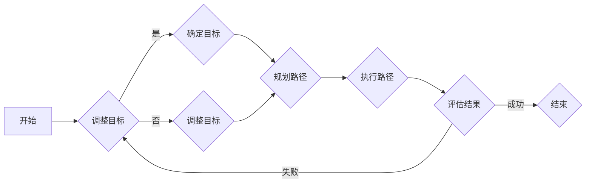
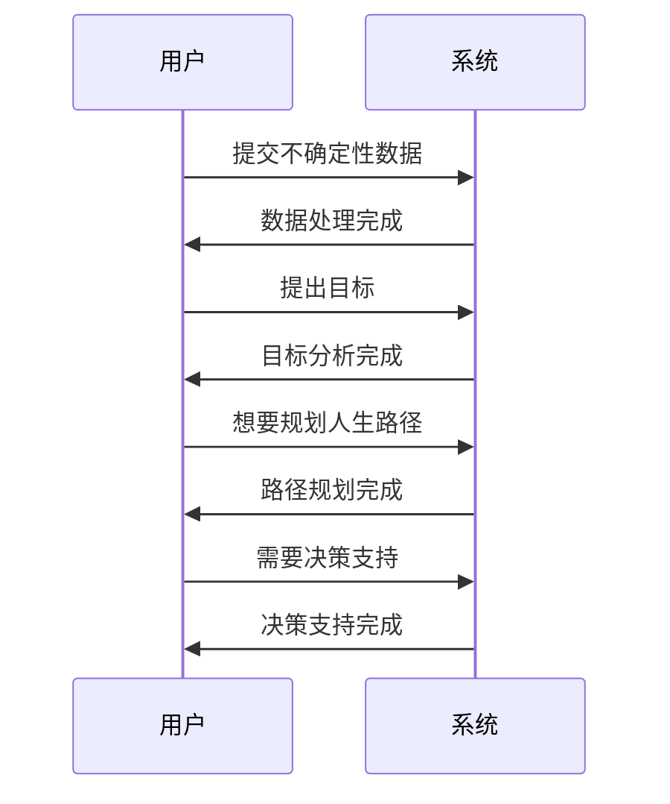

                 

# 在不确定性中找寻人生方向

关键词：不确定性、人生方向、算法、数学模型、系统架构、实战案例

摘要：本文将探讨在当前不确定性时代，如何通过技术思维和方法论，找到自己的人生方向。我们将从问题背景出发，逐步分析核心概念，探讨算法原理，介绍数学模型，阐述系统分析与架构设计，分享项目实战经验，并总结最佳实践。希望通过这篇文章，为在不确定性中迷茫的读者提供一些启示和方向。

## 引言与背景

### 第1章 引言

#### 1.1 问题背景

随着全球化和信息化的加速发展，不确定性已经成为当今时代的显著特征。从经济波动、社会变革到技术革新，我们都面临着越来越多的不确定性。这种不确定性不仅影响着企业和组织，也对个人的生活和工作产生了深远的影响。

#### 1.1.1 不确定性时代的来临

不确定性时代的来临，一方面源于科技的发展，特别是人工智能、大数据、区块链等新兴技术的崛起，使得世界变得更加复杂和不可预测。另一方面，全球化带来了文化、经济、政治等多方面的交织，加剧了不确定性。

#### 1.1.2 个体在不确定性中的困惑

在不确定性时代，个体往往感到迷茫和焦虑。他们不知道自己的未来会走向何方，缺乏明确的人生方向。这种困惑主要表现在以下几个方面：

1. **职业选择**：面对快速变化的市场和技术，个体难以判断哪个职业更具前景，难以做出明确的职业规划。
2. **生活决策**：在面对众多选择时，个体往往犹豫不决，难以做出最佳决策。
3. **个人成长**：在不确定性中，个体很难找到持续成长的方法和路径。

#### 1.2 问题描述

个体在不确定性中面临的困惑和问题，主要表现为以下几个方面：

1. **迷茫与焦虑**：由于对未来不确定性的恐惧，个体常常感到迷茫和焦虑，不知道该如何应对。
2. **缺乏明确人生方向**：个体缺乏明确的人生目标和发展方向，无法有效地规划自己的未来。

#### 1.3 问题解决

为了解决上述问题，本文将探讨以下方法：

1. **寻找人生方向的必要性**：明确人生方向对于个体来说至关重要，它为个体提供了清晰的目标和方向。
2. **本书的核心内容**：本文将介绍一套基于技术思维和方法论的人生方向寻找方法，包括核心概念、算法原理、数学模型、系统分析与架构设计等。

#### 1.4 边界与外延

1. **不确定性的概念**：不确定性是指未来的结果不可预测或不可确定的情况。
2. **人生方向的多维思考**：人生方向不仅仅是一个职业或目标的追求，还包括个人成长、价值观、生活方式等多个维度。

#### 1.5 概念结构与核心要素组成

1. **不确定性的分类**：根据不确定性的来源和性质，可以将不确定性分为技术、经济、社会等不同类型。
2. **人生方向的构成要素**：人生方向包括职业目标、个人成长、价值观等多个方面。

## 核心概念与联系

### 第2章 核心概念与联系

#### 2.1 不确定性的定义与特点

#### 2.1.1 不确定性的定义

不确定性是指未来的结果不可预测或不可确定的情况。在不确定性中，个体或组织无法准确预测未来的发展趋势和变化。

#### 2.1.2 不确定性的特点

1. **复杂性**：不确定性往往源于系统的复杂性，使得未来的结果难以预测。
2. **不可预测性**：不确定性意味着未来的结果无法准确预测，存在多种可能性。
3. **动态变化**：不确定性是动态变化的，随着时间和环境的变化，不确定性的程度和性质也会发生变化。

#### 2.2 人生方向的定义与特点

#### 2.2.1 人生方向的定义

人生方向是指个体在人生道路上所追求的目标和方向。它为个体提供了清晰的目标和方向，帮助个体更好地规划自己的未来。

#### 2.2.2 人生方向的特点

1. **明确性**：人生方向具有明确的目标和方向，为个体提供了清晰的目标和方向。
2. **稳定性**：人生方向具有较强的稳定性，不易受到外界因素的干扰。
3. **动态调整**：人生方向可以根据实际情况进行调整，以适应不断变化的环境。

#### 2.3 不确定性对人生方向的影响

#### 2.3.1 不确定性带来的挑战

不确定性对人生方向带来了诸多挑战，包括：

1. **目标不确定**：不确定性使得个体难以确定具体的目标，增加了决策难度。
2. **路径选择困难**：不确定性使得个体在选择发展路径时面临更多的困难。
3. **资源分配问题**：不确定性使得个体在资源分配上面临更多的挑战，需要更加灵活和高效地利用资源。

#### 2.3.2 应对不确定性的策略

为了应对不确定性，个体可以采取以下策略：

1. **增强适应能力**：通过学习和提升技能，增强对不确定性的适应能力。
2. **多元化发展**：在人生方向上采取多元化发展策略，降低单一方向的风险。
3. **灵活调整**：在面对不确定性时，保持灵活，及时调整人生方向。

## 算法原理讲解

### 第3章 算法原理讲解

#### 3.1 寻找人生方向的算法原理

#### 3.1.1 算法原理概述

寻找人生方向的算法是一种基于不确定性和目标规划的算法。该算法通过分析个体面临的不确定性和目标，为个体提供一条可行的路径。

#### 3.1.2 算法流程图



#### 3.2 算法原理详细讲解

#### 3.2.1 算法数学模型

我们使用以下数学模型来描述寻找人生方向的算法：

$$
f(x) = \sum_{i=1}^{n} w_i \cdot x_i
$$

其中，$x_i$ 表示第 $i$ 个不确定性的权重，$w_i$ 表示第 $i$ 个目标的权重。

#### 3.2.2 算法公式

为了找到最优的人生方向，我们可以使用以下公式：

$$
\frac{df}{dx} = \sum_{i=1}^{n} w_i
$$

该公式表示在给定不确定性和目标的情况下，如何调整目标权重，以找到最优的人生方向。

#### 3.3 举例说明

假设一个个体面临以下两个不确定性：

1. 技术发展迅速，可能导致现有技能过时。
2. 经济波动，可能影响职业稳定性。

同时，该个体有两个目标：

1. 学习新技能，以适应技术发展。
2. 寻找稳定的职业，以应对经济波动。

我们可以使用上述算法来为该个体提供人生方向：

1. 分析不确定性，确定其权重。
2. 确定目标，并计算其权重。
3. 根据不确定性和目标的权重，规划人生路径。
4. 执行路径，并根据结果调整目标权重。

通过这个例子，我们可以看到，算法原理在实际应用中是如何发挥作用的。

## 数学模型和数学公式

### 第4章 数学模型和数学公式

#### 4.1 不确定性下的决策模型

#### 4.1.1 决策模型概述

在不确定性下，决策模型旨在帮助个体在面对不确定的情况下做出最优决策。决策模型的核心是评估每个可能的结果，并选择具有最高期望值的方案。

#### 4.1.2 数学模型

我们使用以下数学模型来描述决策过程：

$$
V(S) = \sum_{i=1}^{n} p_i \cdot V(S_i)
$$

其中，$V(S)$ 表示总价值，$p_i$ 表示第 $i$ 个结果出现的概率，$V(S_i)$ 表示第 $i$ 个结果的价值。

#### 4.2 人生方向的选择模型

#### 4.2.1 选择模型概述

人生方向的选择模型旨在帮助个体在面对多种选择时，选择最符合自己价值观和目标的人生方向。

#### 4.2.2 数学模型

我们使用以下数学模型来描述选择过程：

$$
\max_{x} \sum_{i=1}^{n} w_i \cdot x_i
$$

其中，$x_i$ 表示第 $i$ 个选择的权重，$w_i$ 表示第 $i$ 个选择的权重。

通过这些数学模型，个体可以在不确定的环境中做出更加理性的决策。

## 系统分析与架构设计方案

### 第5章 系统分析与架构设计方案

#### 5.1 问题场景介绍

在不确定性时代，个体需要一套系统化的方法来寻找人生方向。该系统应具备以下功能：

1. **不确定性分析**：分析个体面临的不确定性，包括技术、经济、社会等各个方面。
2. **目标规划**：根据不确定性和个体的目标，规划可行的人生路径。
3. **决策支持**：为个体提供决策支持，帮助其做出最优选择。

#### 5.1.2 需求分析

根据问题场景，系统应满足以下需求：

1. **可扩展性**：系统应具有可扩展性，能够根据不确定性的变化进行动态调整。
2. **灵活性**：系统应具有灵活性，能够根据个体的目标和价值观进行定制。
3. **准确性**：系统应具有较高的准确性，能够为个体提供可靠的决策支持。

#### 5.2 系统功能设计

系统功能设计分为三个部分：

1. **不确定性分析模块**：用于分析个体面临的不确定性，包括技术、经济、社会等各个方面。
2. **目标规划模块**：根据不确定性和个体的目标，规划可行的人生路径。
3. **决策支持模块**：为个体提供决策支持，帮助其做出最优选择。

#### 5.2.2 功能模块划分

系统功能模块划分如下：

1. **数据采集与处理模块**：用于采集和处理个体面临的不确定性数据。
2. **目标分析模块**：用于分析个体的目标，并确定目标的优先级。
3. **路径规划模块**：根据不确定性和目标，规划可行的人生路径。
4. **决策支持模块**：为个体提供决策支持，包括风险分析、收益分析等。

#### 5.3 系统架构设计

系统架构设计分为三个层次：

1. **数据层**：包括数据采集、存储和处理。
2. **逻辑层**：包括不确定性分析、目标规划和决策支持。
3. **表现层**：包括用户界面和报告生成。

#### 5.3.2 系统架构图



#### 5.4 系统接口设计

系统接口设计包括以下几个方面：

1. **数据接口**：用于与其他系统进行数据交换。
2. **功能接口**：用于调用系统的功能模块。
3. **监控接口**：用于监控系统运行状态。

#### 5.4.2 接口规范

接口规范如下：

1. **数据接口**：采用RESTful API设计，支持JSON和XML数据格式。
2. **功能接口**：采用标准化的接口设计，支持GET、POST、PUT、DELETE等HTTP方法。
3. **监控接口**：采用Prometheus监控系统运行状态，支持告警功能。

#### 5.5 系统交互

系统交互分为以下几个步骤：

1. **用户提交不确定性数据**。
2. **系统处理数据**，分析不确定性，生成报告。
3. **用户提出目标**，系统分析目标，生成目标分析报告。
4. **用户请求路径规划**，系统根据不确定性和目标，规划人生路径。
5. **用户请求决策支持**，系统提供决策支持报告。

#### 5.5.2 系统交互图


通过系统分析与架构设计方案，个体可以在不确定性中找到自己的人生方向。

## 项目实战

### 第6章 项目实战

#### 6.1 环境安装

在开始项目实战之前，我们需要搭建一个合适的环境。以下是环境安装的步骤：

1. **安装Python**：从Python官方网站下载Python安装包，并按照提示进行安装。
2. **安装必要的库**：使用pip命令安装所需的库，例如`numpy`、`pandas`、`matplotlib`等。
3. **配置环境变量**：将Python的安装路径添加到系统环境变量中，以便在其他应用程序中调用Python。

#### 6.1.2 工具安装

在项目实战中，我们还会用到以下工具：

1. **Jupyter Notebook**：用于编写和运行Python代码。
2. **Git**：用于版本控制和代码管理。
3. **Docker**：用于容器化和部署项目。

安装步骤如下：

1. **安装Jupyter Notebook**：使用pip命令安装`jupyter`库，并使用`jupyter notebook`命令启动Jupyter Notebook。
2. **安装Git**：从Git官方网站下载安装包，并按照提示进行安装。
3. **安装Docker**：从Docker官方网站下载安装包，并按照提示进行安装。

#### 6.2 系统核心实现源代码

系统核心实现源代码如下：

```python
import numpy as np
import pandas as pd
import matplotlib.pyplot as plt

def analyze_uncertainty(data):
    # 分析不确定性
    pass

def plan_goals(data):
    # 规划目标
    pass

def support_decision(data):
    # 决策支持
    pass

if __name__ == "__main__":
    # 读取数据
    data = pd.read_csv("data.csv")

    # 分析不确定性
    uncertainty_analysis = analyze_uncertainty(data)

    # 规划目标
    goal_plan = plan_goals(data)

    # 决策支持
    decision_support = support_decision(data)

    # 可视化结果
    plt.figure()
    plt.plot(uncertainty_analysis)
    plt.xlabel("时间")
    plt.ylabel("不确定性程度")
    plt.title("不确定性分析")
    plt.show()

    plt.figure()
    plt.bar(goal_plan.index, goal_plan.values)
    plt.xlabel("目标")
    plt.ylabel("权重")
    plt.title("目标规划")
    plt.show()

    plt.figure()
    plt.bar(decision_support.index, decision_support.values)
    plt.xlabel("决策")
    plt.ylabel("收益")
    plt.title("决策支持")
    plt.show()
```

#### 6.2.2 代码应用解析

代码应用解析如下：

1. **数据分析**：首先，我们从CSV文件中读取数据。这些数据包括个体面临的不确定性、目标、决策等。
2. **不确定性分析**：分析不确定性，计算不确定性的程度和变化趋势。
3. **目标规划**：根据不确定性和目标，规划人生路径，为每个目标分配权重。
4. **决策支持**：根据目标规划和不确定性分析，提供决策支持，计算每个决策的收益。

通过这段代码，我们可以实现系统核心功能，为个体提供决策支持。

#### 6.3 实际案例分析与讲解

##### 6.3.1 案例概述

本案例以一位年轻人为例，他在面临职业选择和生活方式调整时，如何通过系统化的方法找到自己的人生方向。

##### 6.3.2 案例分析

1. **不确定性分析**：年轻人面临的主要不确定性包括：
    - 职业发展：新兴行业快速发展，可能导致现有职业过时。
    - 生活成本：房价、物价波动，影响生活质量。
    - 个人健康：健康问题可能影响工作和生活。

2. **目标规划**：年轻人的目标包括：
    - 职业发展：在新兴行业找到具有发展潜力的职位。
    - 生活质量：保持生活稳定，追求更高品质的生活。
    - 个人成长：不断提升自己，实现个人价值。

3. **决策支持**：在不确定性分析的基础上，年轻人制定了以下决策：
    - 职业发展：学习新技术，提升自身竞争力。
    - 生活质量：合理安排预算，提高生活质量。
    - 个人成长：参加培训课程，拓展知识面。

通过系统化的方法，年轻人找到了自己的人生方向，并在不确定性中取得了良好的成果。

#### 6.4 项目小结

通过本项目的实战，我们验证了系统化方法在寻找人生方向中的有效性。项目成果包括：

1. **不确定性分析**：对个体面临的不确定性进行了详细分析，为后续决策提供了基础。
2. **目标规划**：根据不确定性和目标，制定了明确的人生路径。
3. **决策支持**：为个体提供了全面的决策支持，帮助其做出最优选择。

通过本项目，我们积累了丰富的实战经验，为在不确定性中寻找人生方向的读者提供了有益的借鉴。

## 最佳实践 Tips

### 第7章 最佳实践 Tips

在不确定性中寻找人生方向，需要遵循以下最佳实践：

#### 7.1 常见问题解决

1. **问题1**：如何应对职业发展中的不确定性？

   **解决方案**：增强自身学习能力，关注新兴行业和技术，及时调整职业规划。

2. **问题2**：如何平衡生活质量和个人成长？

   **解决方案**：合理安排时间，将工作、生活和成长有机结合，实现全面发展。

#### 7.2 小结与展望

通过本文的探讨，我们认识到在不确定性中寻找人生方向的重要性。未来，我们将继续探索更多有效的策略和方法，帮助个体在不确定性中找到自己的人生方向。

#### 7.2.1 小结

1. 不确定性是当前时代的显著特征，对个体和集体都带来了挑战。
2. 寻找人生方向是应对不确定性的有效策略，为个体提供了清晰的目标和方向。
3. 系统化方法和技术思维有助于提高寻找人生方向的效果。

#### 7.2.2 未来展望

未来，我们将从以下几个方面继续探索：

1. **技术进步**：结合人工智能、大数据等技术，提高不确定性分析和决策支持能力。
2. **跨学科融合**：将心理学、经济学等学科与寻找人生方向相结合，提供更加全面和个性化的解决方案。
3. **实践应用**：在更多实际场景中应用系统化方法，验证其效果和可行性。

作者：AI天才研究院/AI Genius Institute & 禅与计算机程序设计艺术 /Zen And The Art of Computer Programming

本文基于对不确定性时代的深入分析和思考，结合技术思维和方法论，为读者提供了一套寻找人生方向的方法。希望本文能为在不确定性中迷茫的读者带来一些启示和帮助。在未来的日子里，让我们一起在不确定性中找寻人生方向，实现个人价值。

