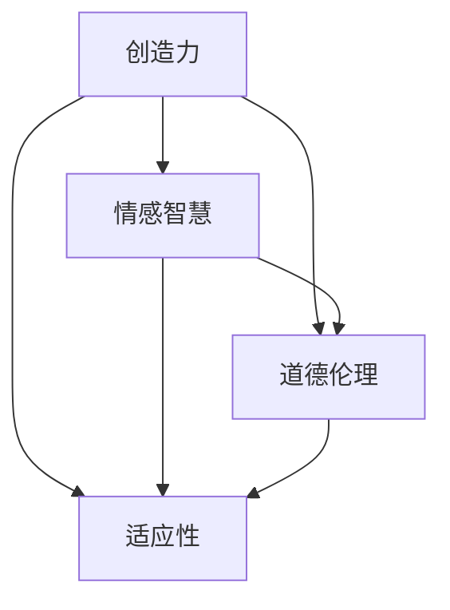

                 

# 在人工智能时代寻找人类独特价值

> 关键词：人工智能，人类独特价值，挑战与应对，共存与合作，未来展望

> 摘要：本文旨在探讨人工智能时代人类独特价值的内涵、面临的挑战以及保持和发展的策略。通过深入分析人工智能的发展历程和当前应用，结合人类独特价值的特点，本文提出了应对人工智能挑战的方法和策略，探讨了人类与人工智能共存与合作的前景，并对未来人类独特价值的发展进行了展望。

## 引言

随着人工智能（AI）技术的迅猛发展，其应用范围不断扩大，从工业生产到医疗诊断，从金融分析到无人驾驶，人工智能已经深刻地改变了我们的生活方式和社会运行机制。然而，这一变革也引发了关于人类在人工智能时代独特价值的讨论。人工智能是否会完全取代人类的工作？人类在人工智能时代还有哪些不可替代的价值？这些问题不仅关乎个体的发展，也关乎整个社会的前途和命运。

本文将从以下几个方面展开讨论：

1. **人工智能时代的人类独特价值**：介绍人类独特价值的概念、特点以及其在人工智能时代的体现。
2. **人工智能时代对人类独特价值的挑战**：分析人工智能对人类独特价值带来的挑战，如工作替代、社交变化等。
3. **保持人类独特价值的方法与策略**：探讨通过教育、政策调整和社会制度等手段保持和提升人类独特价值。
4. **人类与人工智能的共存与合作**：讨论人类与人工智能共存和合作的模式及其对人类独特价值的影响。
5. **未来人类独特价值的展望**：展望人工智能时代人类独特价值的未来发展。

通过以上分析，我们希望为人工智能时代人类的独特价值寻找新的定位和发展的方向。

### 1.1 人工智能的快速发展

人工智能（AI）是一门研究、开发用于模拟、延伸和扩展人类智能的理论、方法、技术及应用系统的技术科学。自20世纪50年代人工智能概念诞生以来，人工智能经历了多个发展阶段，从最初的符号主义、基于规则的系统，到基于统计学习的机器学习方法，再到当前以深度学习为代表的强人工智能技术，人工智能的发展速度之快、应用范围之广，令人瞩目。

#### 1.1.1 人工智能的定义与分类

人工智能的定义多种多样，广义上，人工智能是指使计算机系统具备智能行为的技术，包括感知、学习、推理、决策和行动等多个方面。狭义上，人工智能主要指通过机器学习算法，让计算机具备自主学习能力和智能决策能力。

人工智能的分类可以从不同的角度进行：

- **按技术类型分类**：
  - **符号主义方法**：基于逻辑推理和符号表示，通过定义规则和关系来实现智能。
  - **统计学习方法**：基于大量数据，通过统计学方法（如神经网络）来训练模型。
  - **混合方法**：结合多种技术，如深度学习、强化学习等，以实现更高的智能水平。

- **按应用领域分类**：
  - **通用人工智能（AGI）**：具有人类水平的智能，能够执行任何智慧任务。
  - **窄人工智能（ANI）**：针对特定任务或领域具有高度智能，如图像识别、自然语言处理等。

#### 1.1.2 人工智能的发展历程

人工智能的发展历程可以大致分为以下几个阶段：

- **初始阶段（20世纪50-60年代）**：人工智能概念诞生，早期的人工智能系统主要基于逻辑推理和规则系统。
- **认知阶段（20世纪70-80年代）**：人工智能研究转向模拟人类认知过程，如知识表示和推理。
- **统计学习阶段（20世纪90年代至今）**：随着计算能力和数据量的提高，基于统计学习的方法，特别是神经网络和深度学习，逐渐成为人工智能的主流。
- **强人工智能阶段（未来预期）**：实现具有人类水平的智能，能够处理复杂、不确定的任务。

#### 1.1.3 人工智能在各个领域的广泛应用

人工智能在各个领域的广泛应用，极大地推动了社会的发展和进步：

- **工业生产**：人工智能技术在自动化生产线中的应用，提高了生产效率和产品质量。
- **医疗健康**：人工智能在医学影像分析、疾病诊断和治疗规划中的应用，提升了医疗服务的效率和准确性。
- **金融**：人工智能在风险管理、投资分析和客户服务中的应用，提高了金融行业的效率和风险控制能力。
- **交通**：人工智能在无人驾驶、智能交通管理中的应用，提升了交通安全和交通效率。
- **教育**：人工智能在个性化教学、学习分析中的应用，为学生提供了更好的学习体验。

综上所述，人工智能的快速发展不仅改变了我们的生活，也对我们所处的世界产生了深远的影响。在人工智能时代，如何理解和保持人类的独特价值，成为了一个亟待解决的问题。

### 1.2 人类独特价值的质疑

在人工智能快速发展的背景下，人类社会对人类独特价值的质疑声也日益增多。人工智能是否能够取代人类的独特价值，成为了一个备受关注的话题。以下将从以下几个方面进行探讨。

#### 1.2.1 人工智能是否能够取代人类的工作

随着人工智能技术的进步，越来越多的工作开始被自动化和智能化取代。例如，在制造业中，自动化机器人和智能控制系统已经大大提高了生产效率，减少了人力需求；在金融领域，智能投顾和自动化交易系统正在逐渐取代传统的人工服务；在医疗领域，人工智能辅助诊断和治疗方案推荐也在逐步提高医疗服务的质量和效率。

然而，尽管人工智能在某些领域已经展现了强大的能力，但它并不能完全取代人类的工作。首先，人工智能在复杂决策和创造性任务方面仍存在明显的局限性。例如，医疗诊断虽然可以通过人工智能进行分析，但最终的决策仍然需要医生的综合判断和经验；艺术创作、科研创新等领域更是依赖于人类的创造力和想象力。其次，人类在情感交流、社会互动等方面的能力是人工智能难以替代的。例如，心理咨询、教育、客服等工作不仅需要专业知识，更需要情感的投入和理解。

#### 1.2.2 人工智能对人类社交的影响

人工智能的发展不仅改变了工作方式，也对人类的社交模式产生了深远的影响。一方面，人工智能在社交领域的应用，如社交媒体、虚拟助手等，为人们提供了更加便捷的交流方式。然而，另一方面，人工智能也可能导致人类社交的异化。例如，过度依赖社交媒体可能导致人际关系的疏离，虚拟助手的使用可能减少面对面交流的机会。

此外，人工智能的普及还可能导致社会阶层的分化。那些能够熟练使用人工智能技术的群体，可能会在社会中获得更多的优势，而那些无法适应人工智能技术的群体，可能会被边缘化。这种分化不仅会影响社会稳定，也会对人类的社会结构产生深远的影响。

#### 1.2.3 人类在人工智能时代的角色和地位

在人工智能时代，人类的角色和地位面临着巨大的挑战。一方面，人工智能技术的发展使得人类在某些领域的角色变得越来越次要，甚至可能被完全取代。另一方面，人类在人工智能时代仍然具有不可替代的独特价值。人类在创造力、情感交流、社会互动等方面的能力，是人工智能难以完全复制的。

因此，在人工智能时代，人类需要重新审视自己的角色和地位。我们需要通过不断提升自身的技能和能力，适应人工智能时代的需求。同时，我们也需要关注人工智能对人类社会和个体带来的挑战，制定相应的政策和策略，确保人类在人工智能时代的可持续发展。

总之，人工智能是否能够取代人类的独特价值，以及人类在人工智能时代的角色和地位，是一个复杂而深远的问题。在人工智能时代，我们需要既看到人工智能带来的机遇，也要正视其带来的挑战，以人类独特的价值和能力为基础，寻找新的发展路径。

### 1.3 寻找人类独特价值的必要性

在人工智能迅猛发展的今天，探讨人类独特价值的必要性显得尤为重要。首先，从**人类社会的发展需求**来看，人工智能虽然为我们的生活带来了诸多便利，但它并不能完全替代人类在社会中的角色。人类社会的发展需要多样化和复杂性，这恰恰是人工智能难以完全实现的。人类在创造力、情感交流、复杂决策等方面具有独特的优势，这些优势不仅推动了社会的进步，也是人类社会持续发展的基础。

其次，从**人类自我认知和自我提升的需求**来看，保持和提升人类独特价值是实现自我提升的重要途径。人类在探索自我、理解自我、实现自我价值的过程中，需要不断地挑战自我、突破自我。而人类的独特价值，如创造力、情感智慧、道德伦理等，是这一过程中不可或缺的元素。通过保持和提升这些独特价值，人类不仅能够更好地适应人工智能时代的需求，还能够实现更高层次的精神追求。

总之，在人工智能时代，寻找人类独特价值不仅关乎人类社会的可持续发展，也是人类自我认知和自我提升的重要任务。通过深入探讨人类独特价值的内涵和特点，我们可以更好地理解人类在人工智能时代的作用和地位，为人类社会的未来发展提供新的方向和动力。

### 1.4 人工智能与人类独特价值的边界

在探讨人工智能与人类独特价值的边界时，我们需要明确两者的区别和相互关系。首先，从本质上看，人工智能是一种模拟和扩展人类智能的技术系统，其运行基于算法和数据，而人类独特价值则源于人类自身的生物属性和社会属性。

#### 1.4.1 人工智能的局限性

尽管人工智能在各个领域展现了强大的能力，但它仍然存在一些局限性。首先，人工智能在处理复杂、不确定的任务时，往往需要大量的数据和计算资源，这使得它在某些情况下无法胜任。其次，人工智能缺乏情感和道德判断能力，这使得它难以在需要情感交流和理解的工作中发挥作用。最后，人工智能在创造性任务上的表现仍然有限，尽管深度学习等技术可以在某些方面模仿人类的创造性思维，但真正的创造仍需要人类的独特智慧和灵感。

#### 1.4.2 人类独特价值的独特性

相比之下，人类独特价值具有以下几个显著特点：

1. **创造力**：人类能够通过思维和想象力进行创新和创造，这是人工智能所无法完全复制的。无论是艺术创作、科学研究，还是社会创新，人类的创造力都是推动社会进步的重要动力。

2. **情感智慧**：人类具有丰富的情感体验和表达能力，能够理解和回应他人的情感需求，这是人工智能难以实现的。在人际交往、心理咨询、教育等领域，情感智慧至关重要。

3. **道德伦理**：人类在道德和伦理方面的判断和决策，是建立在对社会、文化、价值观的深刻理解之上的。人工智能虽然可以在某些领域模拟道德伦理判断，但其缺乏真正的道德意识和社会责任感。

#### 1.4.3 边界与外延

人工智能与人类独特价值的边界主要体现在以下几个方面：

1. **功能边界**：人工智能在特定任务上的表现可能超越人类，但在需要综合判断、情感交流、道德伦理等方面，人类仍具有不可替代的优势。

2. **应用领域**：人工智能主要应用于数据密集、重复性高的任务，而人类则更多地涉及复杂决策、创新创造和人际互动等领域。

3. **发展前景**：随着技术的进步，人工智能在某些领域的表现可能会进一步接近甚至超越人类，但人类独特价值的核心仍然具有不可替代性。

总之，人工智能与人类独特价值之间存在明显的边界和相互关系。在人工智能时代，理解和尊重这些边界，发挥人类独特价值的作用，是实现人类与人工智能和谐共存的关键。

### 1.5 人类独特价值的内涵与应用领域

人类独特价值是构成人类社会和个体发展的核心要素，其内涵丰富且广泛。以下从人类独特价值的定义、特点以及其在不同领域的应用进行详细探讨。

#### 1.5.1 人类独特价值的定义

人类独特价值，指的是人类在生物、社会和文化等方面所具有的、不同于其他生物或技术的独特属性和能力。这些独特价值不仅反映了人类在自然界中的地位，也体现了人类在社会发展中的重要作用。具体而言，人类独特价值包括以下几个方面：

1. **创造力**：人类具有非凡的创造力，能够在科学、艺术、技术等领域进行创新和突破。这种创造力不仅推动了社会的进步，也为人类带来了丰富的精神文化成果。
2. **情感智慧**：人类拥有丰富的情感体验和表达能力，能够理解和回应他人的情感需求。这种情感智慧在人际交往、心理咨询、教育等领域具有重要作用。
3. **道德伦理**：人类在道德和伦理方面的判断和决策，体现了人类对社会责任和价值观的深刻理解。这种道德伦理意识不仅规范了人类的行为，也为社会稳定和和谐发展提供了基础。
4. **适应性**：人类具有极强的适应能力，能够在各种环境和条件下生存和发展。这种适应性使得人类能够在不同的文化、社会背景下，实现自我价值和群体进步。

#### 1.5.2 人类独特价值的特点

人类独特价值具有以下几个显著特点：

1. **独特性**：人类独特价值是人类特有的属性，不同于其他生物或技术系统。
2. **综合性**：人类独特价值包括创造力、情感智慧、道德伦理和适应性等多个方面，具有综合性的特点。
3. **动态性**：人类独特价值随着社会和文化的发展，不断演变和提升。例如，随着科技的进步，人类的创造力在各个领域得到了极大的发挥。

#### 1.5.3 人类独特价值的应用领域

人类独特价值在多个领域得到了广泛应用，具体包括：

1. **社会领域**：
   - **教育**：教育是人类传承和发展文化知识的重要途径。通过教育，人类能够培养创造力、情感智慧和道德伦理等独特价值，为社会培养合格的人才。
   - **医疗**：医疗领域需要人类独特的情感智慧和道德伦理，如医护人员在救治患者时需要理解和关怀患者的情感需求，同时遵循伦理规范。
   - **文化传承**：文化传承是人类独特价值的重要体现，通过艺术创作、文学、音乐等形式，人类能够表达情感、传递价值观，实现文化的传承和发展。

2. **经济领域**：
   - **创新驱动**：经济发展依赖于科技创新，而科技创新源于人类的创造力。在人工智能时代，人类独特的创造力将继续推动经济的进步。
   - **企业管理**：企业管理不仅需要专业知识，更需要人类的情感智慧和道德伦理。领导者通过情感智慧和道德伦理引导企业文化和员工行为，实现企业的长期发展。

3. **科技领域**：
   - **科研创新**：科研创新需要人类的创造力、道德伦理和适应性。科研人员通过独特的创造力和道德伦理，推动科技的进步，实现人类社会的可持续发展。
   - **技术伦理**：技术伦理是人类独特价值的重要体现。在科技发展过程中，人类需要通过道德伦理来判断和规范技术的发展方向，确保技术发展符合人类社会的价值观。

综上所述，人类独特价值是构成人类社会和个体发展的核心要素，其内涵丰富且广泛。在人工智能时代，人类需要充分发挥自身的独特价值，应对挑战，实现可持续发展。

### 1.6 人类独特价值的内涵要素分析

人类独特价值的内涵丰富，涵盖了多个方面，其中最具代表性的要素包括创造力、情感智慧、道德伦理和适应性。以下对这些要素进行详细分析，并通过对比表格和ER实体关系图架构的Mermaid流程图，来展现其内在联系和作用。

#### 1.6.1 创造力

创造力是人类独特价值的重要组成部分，它体现在人类在科学、艺术、技术等领域的创新和突破能力。创造力不仅推动了人类社会的进步，也体现了人类独特的思维方式和想象力。

- **定义**：创造力是指个体或集体产生新颖、有价值的想法或方法的能力。
- **表现**：在科学领域，创造力体现在科研发现的突破；在艺术领域，创造力体现在作品的艺术价值；在技术领域，创造力体现在技术创新和发明。

#### 1.6.2 情感智慧

情感智慧是人类理解和管理自身情感，以及理解他人情感的能力。情感智慧在人际交往、心理咨询、教育等领域具有重要作用，是人类社会和谐发展的基础。

- **定义**：情感智慧是指个体在情感识别、表达、调节和利用方面的能力。
- **表现**：在人际交往中，情感智慧体现在理解他人的情感需求；在心理咨询中，情感智慧体现在帮助患者调节情绪；在教育中，情感智慧体现在教师对学生的情感关怀。

#### 1.6.3 道德伦理

道德伦理是人类在行为和决策中遵循的道德规范和伦理标准。道德伦理反映了人类对社会责任和价值观的深刻理解，是维持社会秩序和和谐发展的关键。

- **定义**：道德伦理是指个体或集体在行为和决策中遵循的道德规范和伦理标准。
- **表现**：在企业管理中，道德伦理体现在对员工和消费者的责任；在医疗行业中，道德伦理体现在对患者的关怀和医疗行为的规范；在科研中，道德伦理体现在对科学诚信的追求。

#### 1.6.4 适应性

适应性是人类在面对各种环境和条件变化时，能够迅速适应并作出有效反应的能力。适应性使得人类能够在不同文化、社会背景下生存和发展，是推动人类社会发展的重要动力。

- **定义**：适应性是指个体或集体在面临环境变化时，能够迅速适应并作出有效反应的能力。
- **表现**：在全球化背景下，人类通过适应新的文化和社会环境，实现国际合作和交流；在面对自然灾害和社会变革时，人类通过适应新的生存条件，实现自我保护和可持续发展。

#### 1.6.5 内在联系与作用

人类独特价值的各个要素之间存在着内在的联系和相互作用。创造力、情感智慧、道德伦理和适应性相互促进，共同构成了人类独特价值的整体。以下通过Mermaid流程图来展示这些要素之间的内在联系：

在上述流程图中，创造力作为核心要素，通过情感智慧、道德伦理和适应性相互联系和作用。情感智慧和道德伦理不仅补充了创造力的情感和伦理维度，还强化了适应性的社会和文化意义。而适应性则为创造力、情感智慧和道德伦理提供了实践的环境和条件。

#### 1.6.6 对比表格

为了更直观地理解人类独特价值的各个要素，我们可以通过对比表格来展示它们之间的异同：

| 要素         | 定义                                                         | 表现                                                     | 关联与作用                                                      |
| ------------ | ------------------------------------------------------------ | -------------------------------------------------------- | ------------------------------------------------------------ |
| 创造力       | 个体或集体产生新颖、有价值的想法或方法的能力                 | 科学发现、艺术创作、技术创新                             | 创造力是推动社会进步的核心动力，与情感智慧、道德伦理和适应性相互补充和强化 |
| 情感智慧     | 在情感识别、表达、调节和利用方面的能力                       | 人际交往、心理咨询、教育                                 | 情感智慧是人类社会和谐发展的基础，补充创造力的情感维度       |
| 道德伦理     | 在行为和决策中遵循的道德规范和伦理标准                       | 企业管理、医疗、科研                                     | 道德伦理是维护社会秩序和和谐发展的关键，为其他要素提供伦理指导 |
| 适应性       | 在面临环境变化时，能够迅速适应并作出有效反应的能力             | 全球化背景下的文化适应、自然灾害中的生存策略               | 适应性为人类提供了应对环境变化的工具，支持其他要素的实际应用   |

通过对比表格和Mermaid流程图，我们可以更清晰地理解人类独特价值的内涵要素及其相互关系。在人工智能时代，理解和发挥这些独特价值，将有助于人类在新的技术环境中保持优势，实现可持续发展。

### 1.7 人工智能对人类独特价值的影响要素分析

在人工智能迅猛发展的背景下，分析其对人类独特价值的影响是理解人类在人工智能时代角色和地位的关键。以下从多个维度探讨人工智能对人类独特价值的影响要素。

#### 1.7.1 数据依赖性

人工智能系统在训练和运行过程中高度依赖数据。高质量的数据集不仅能够提升人工智能模型的性能，还能保证其在特定任务上的准确性。然而，人类在数据收集、标注和处理方面具有独特的优势。首先，人类具有丰富的情感和认知能力，能够识别和理解复杂、模糊的数据。其次，人类能够根据具体任务需求，进行有针对性的数据筛选和预处理。这些能力使得人类在数据驱动的时代中仍然具有不可替代的价值。

#### 1.7.2 创造力激发

人工智能虽然在某些领域能够实现自动化和高效化，但在创造力方面仍无法完全替代人类。人类的创造力来源于丰富的想象力、情感体验和跨学科的思考。这些特质使得人类能够在科学、艺术、技术等领域进行创新和突破。例如，科学家通过独特的视角和实验设计，发现了新的科学现象；艺术家通过个性化的表达，创作出具有深远影响力的作品。人工智能虽然能够辅助人类进行数据处理和分析，但其缺乏真正的创造性和想象力，无法完全替代人类在创造力方面的独特价值。

#### 1.7.3 道德伦理规范

人工智能的发展和应用不仅涉及到技术问题，还涉及到道德伦理和社会责任。人类在道德伦理规范方面具有独特的优势。首先，人类能够根据社会价值观和伦理标准，对人工智能系统的设计和应用进行评估和指导。例如，在医疗领域，人工智能系统的决策需要遵循医学伦理和患者隐私保护的原则。其次，人类能够通过法律和社会规范，对人工智能的行为进行约束和监管。这些道德伦理规范不仅确保了人工智能系统的安全性和合法性，也保障了人类在人工智能时代的核心价值。

#### 1.7.4 情感智慧补充

人工智能在处理情感信息和进行情感交互方面存在一定的局限性。人类的情感智慧，包括情感识别、表达和调节能力，使得人类能够在人际交往中提供深层次的情感支持和理解。例如，在心理咨询和教育领域，人类的情感智慧能够更好地理解和回应学生的情感需求，提供个性化的关怀和支持。人工智能虽然可以通过算法模拟情感表达，但其缺乏真正的情感体验和情感共鸣，无法完全替代人类在情感智慧方面的独特价值。

#### 1.7.5 适应性调整

人类在面对环境和条件变化时，具有强大的适应能力。这种适应性不仅体现在个体层面，也体现在社会和文化层面。例如，在面对人工智能带来的工作替代和社会变革时，人类可以通过教育、培训和职业转型，适应新的工作环境和生活方式。这种适应性使得人类能够在人工智能时代保持竞争优势，实现可持续发展。

综上所述，人工智能对人类独特价值的影响是多方面的。从数据依赖性、创造力激发、道德伦理规范、情感智慧补充到适应性调整，人类在人工智能时代仍然具有不可替代的独特价值。理解和发挥这些独特价值，将有助于人类在新的技术环境中保持优势，实现可持续发展。

### 1.8 本章小结

本章通过对人工智能和人类独特价值的探讨，明确了两者之间的边界和相互作用。首先，分析了人工智能的快速发展及其在各个领域的广泛应用，强调了人工智能在数据依赖性、创造力激发、道德伦理规范和情感智慧补充等方面的局限性。其次，讨论了人类独特价值的内涵要素，包括创造力、情感智慧、道德伦理和适应性，并通过对比表格和Mermaid流程图，展示了这些要素之间的内在联系。最后，分析了人工智能对人类独特价值的影响要素，强调了人类在适应性调整方面的独特优势。

未来，我们需要进一步探讨如何在人工智能时代充分发挥人类独特价值，以实现人类与人工智能的和谐共存。这包括通过教育、政策调整和社会制度等手段，提升人类的独特价值，同时制定相应的伦理规范和法律框架，确保人工智能的发展符合人类的价值观和利益。通过持续的研究和探索，我们有望找到人类在人工智能时代的新定位和发展方向。

### 2.1 人类独特价值的概念与特点

人类独特价值是指人类在生物、社会和文化等方面所具备的、不同于其他生物或技术的独特属性和能力。这些独特价值不仅决定了人类在自然界和人类社会中的地位，也影响了人类的发展进程。以下从定义、内涵、特点和应用领域等方面，详细探讨人类独特价值的内涵。

#### 2.1.1 人类独特价值的定义

人类独特价值，是指人类在生物、社会和文化等方面所具备的、不同于其他生物或技术的独特属性和能力。这些独特价值不仅反映了人类在生物进化过程中的优势，也体现了人类在社会发展中的重要性。具体而言，人类独特价值包括以下几个方面：

1. **创造力**：人类具有非凡的创造力，能够通过思维和想象力进行创新和创造。这种创造力不仅推动了科学技术的进步，也为人类文化、艺术和社会发展提供了源源不断的动力。
2. **情感智慧**：人类拥有丰富的情感体验和表达能力，能够理解和回应他人的情感需求。这种情感智慧在人际交往、心理咨询、教育等领域具有重要作用，是维系社会和谐发展的关键。
3. **道德伦理**：人类在道德和伦理方面的判断和决策，体现了人类对社会责任和价值观的深刻理解。这种道德伦理意识不仅规范了人类的行为，也为社会稳定和和谐发展提供了基础。
4. **适应性**：人类具有极强的适应能力，能够在各种环境和条件下生存和发展。这种适应性使得人类能够在不同的文化、社会背景下，实现自我价值和群体进步。

#### 2.1.2 人类独特价值的内涵

人类独特价值的内涵丰富，涵盖了多个方面，具体包括：

1. **创造力**：创造力是人类区别于其他生物的重要特征之一。人类的创造力不仅体现在科学、技术和艺术等领域，也体现在社会创新和文化传承中。例如，科学发现和技术创新推动了人类社会的发展；艺术创作和文学表达丰富了人类的精神世界。
2. **情感智慧**：情感智慧是人类在情感识别、表达和调节方面的能力。这种能力使得人类能够建立深厚的人际关系，进行有效的沟通和协作。例如，在心理咨询和教育领域，情感智慧有助于理解和回应他人的情感需求，提供个性化的关怀和支持。
3. **道德伦理**：道德伦理是人类在行为和决策中遵循的道德规范和伦理标准。这种道德伦理意识不仅反映了人类对社会责任和价值观的深刻理解，也规范了人类的行为，维护了社会秩序和和谐发展。例如，在企业管理中，道德伦理意识有助于建立良好的企业文化，提高员工的满意度和忠诚度。
4. **适应性**：人类在长期进化过程中，形成了极强的适应能力。这种适应性使得人类能够在各种环境和条件下生存和发展。例如，在面对自然灾害和社会变革时，人类能够迅速适应新的环境，实现自我保护和可持续发展。

#### 2.1.3 人类独特价值的特点

人类独特价值具有以下几个显著特点：

1. **独特性**：人类独特价值是人类特有的属性，不同于其他生物或技术系统。这种独特性使得人类在自然界和人类社会中具有独特的地位和作用。
2. **综合性**：人类独特价值包括创造力、情感智慧、道德伦理和适应性等多个方面，具有综合性的特点。这些方面相互补充，共同构成了人类独特价值的整体。
3. **动态性**：人类独特价值不是静态的，而是随着社会和文化的发展，不断演变和提升。例如，随着科技的进步，人类的创造力在各个领域得到了极大的发挥；随着社会变革，人类的道德伦理观念也在不断更新。

#### 2.1.4 应用领域

人类独特价值在多个领域得到了广泛应用，具体包括：

1. **教育**：教育是人类传承和发展文化知识的重要途径。通过教育，人类能够培养创造力、情感智慧和道德伦理等独特价值，为社会培养合格的人才。
2. **医疗**：医疗领域需要人类独特的情感智慧和道德伦理，如医护人员在救治患者时需要理解和关怀患者的情感需求，同时遵循伦理规范。
3. **经济**：经济发展依赖于科技创新，而科技创新源于人类的创造力。在人工智能时代，人类独特的创造力将继续推动经济的进步。
4. **科技**：科研创新需要人类的创造力、道德伦理和适应性。科研人员通过独特的创造力和道德伦理，推动科技的进步，实现人类社会的可持续发展。
5. **文化传承**：文化传承是人类独特价值的重要体现，通过艺术创作、文学、音乐等形式，人类能够表达情感、传递价值观，实现文化的传承和发展。

总之，人类独特价值是构成人类社会和个体发展的核心要素，其内涵丰富且广泛。在人工智能时代，人类需要充分发挥自身的独特价值，以应对新的挑战，实现可持续发展。

### 2.2 人工智能时代对人类独特价值的挑战

随着人工智能（AI）技术的飞速发展，人类社会正经历着前所未有的变革。然而，这一变革也带来了对人类独特价值的挑战。以下是人工智能时代对人类独特价值的主要挑战及其分析。

#### 2.2.1 工作替代

人工智能在许多领域展现出了强大的能力，特别是在数据分析和处理、自动化制造、客户服务等方面。随着人工智能技术的不断成熟，越来越多的工作岗位面临着被取代的风险。例如，在制造业，自动化机器人能够高效地完成组装和加工任务，而在线客服系统则可以全天候为用户提供服务。这种工作替代不仅影响了普通工人的就业，也对中高级知识工作者产生了影响。自动化系统和智能机器人在金融分析、医疗诊断等领域的应用，使得许多专业工作也可能被人工智能取代。

#### 2.2.2 社交变化

人工智能不仅在职业领域带来了挑战，也在社交方面对人类独特价值产生了影响。随着社交媒体和虚拟助手等技术的发展，人们的社交方式发生了变化。虽然这些技术为人们提供了更便捷的交流方式，但也导致了人际交往的疏离。人们在虚拟世界中花费大量时间，而面对面交流的机会减少，这可能导致情感智慧的退化。此外，人工智能的普及使得某些社交活动被自动化系统所取代，如虚拟助手在家庭和商业环境中的应用，减少了人类之间的互动。

#### 2.2.3 道德伦理困境

人工智能在道德伦理方面也带来了挑战。人工智能系统在设计和应用过程中，需要遵循一定的伦理规范。然而，由于人工智能缺乏情感和道德判断能力，其决策和行为可能会引发道德伦理问题。例如，在自动驾驶汽车中，当遇到必须做出选择的情况时，如何确保其决策符合人类的伦理标准？此外，人工智能在数据收集和处理过程中，可能会侵犯个人隐私，引发隐私保护和数据伦理问题。

#### 2.2.4 情感交流障碍

尽管人工智能在情感识别和表达方面取得了一定的进展，但仍然无法完全模拟人类的情感交流。人工智能在处理情感信息和进行情感互动时，往往缺乏真正的情感共鸣和同理心。这可能导致人际关系的疏远和情感交流的障碍。例如，在心理咨询和医疗护理中，人类提供的情感支持和同理心是至关重要的，而人工智能难以提供这种深层次的情感互动。

#### 2.2.5 创造力抑制

人工智能在创新和创造方面的表现仍存在一定的局限性。尽管人工智能可以通过大量数据和学习算法生成新的创意和设计，但其缺乏人类的创造力和想象力。在科学研究和艺术创作等领域，人类独特的创造力是推动进步的重要动力。人工智能的普及可能会抑制人类的创造力，导致创新活动的减少。

#### 2.2.6 社会阶层分化

随着人工智能技术的普及，社会阶层分化问题可能加剧。那些能够熟练使用人工智能技术的群体，可能会在社会中占据优势地位，而那些无法适应这一变革的群体，可能会被边缘化。这种分化不仅会影响社会的稳定性，也可能导致社会不公和冲突。

总之，人工智能时代对人类独特价值带来了多方面的挑战。这些挑战不仅影响了个体的生活和工作，也对社会结构和伦理道德产生了深远的影响。为了应对这些挑战，我们需要采取有效的策略，确保人工智能的发展能够促进人类的整体福祉。

### 2.3 保持人类独特价值的方法与策略

在人工智能迅速发展的背景下，保持和提升人类独特价值显得尤为重要。以下从教育、培训、社会制度与政策等方面，探讨保持人类独特价值的方法与策略。

#### 2.3.1 教育与培训

教育是培养和提升人类独特价值的重要途径。首先，教育应该注重培养学生的创造力。学校可以通过开设创新课程、开展项目式学习和跨学科教学，激发学生的创造力和创新思维。其次，教育应加强情感智慧的培养。通过情感教育课程、心理健康教育和互动式教学，帮助学生理解和表达情感，培养同理心和人际交往能力。此外，道德伦理教育也是保持人类独特价值的关键。学校应通过道德教育课程和社会实践，帮助学生树立正确的价值观和道德观念，培养其社会责任感。

在培训方面，针对不同职业群体，应制定相应的培训计划，以提高其适应人工智能时代的能力。例如，对于从事数据密集型工作的员工，应提供数据分析、机器学习等相关技能的培训；对于管理人员，应加强领导力、决策能力和团队管理技能的培训。通过系统化的培训，员工可以更好地适应人工智能时代的变革，保持其独特的职业价值。

#### 2.3.2 社会制度与政策

保持人类独特价值还需要通过社会制度和政策的调整来实现。首先，政府应制定相应的政策和法规，保障人工智能的发展符合伦理和社会责任。例如，在人工智能的应用过程中，应严格保护个人隐私和数据安全，防止数据滥用和隐私泄露。其次，政府应推动社会公平和包容，减少人工智能技术带来的社会不平等。这可以通过提供职业转型培训、社会保障和就业支持等手段实现。

此外，政府和企业应共同推动人工智能与人类独特价值的融合。企业可以通过将人工智能技术与人类创造力、情感智慧等相结合，创造新的工作岗位和商业模式。例如，在艺术创作和设计领域，人工智能可以作为辅助工具，提高工作效率和质量，而人类则可以发挥其创造力和审美判断力，实现艺术创作的独特价值。

#### 2.3.3 社会文化氛围

保持人类独特价值还需要营造良好的社会文化氛围。首先，社会应倡导尊重人类独特价值的价值观，鼓励人们在创造力、情感智慧、道德伦理和适应性等方面不断提升自己。其次，媒体应积极传播正面的典型事迹和案例，激励人们勇于创新、关爱他人、践行道德伦理。此外，社会应注重培养和传承优秀的文化传统，通过文化活动和艺术创作，丰富人们的精神世界，提升其情感智慧和文化素养。

#### 2.3.4 科技伦理与监管

随着人工智能技术的发展，科技伦理和监管成为保持人类独特价值的重要保障。政府和企业应共同建立科技伦理审查机制，对人工智能的应用进行评估和监管。例如，在医疗领域，人工智能系统的决策需要经过严格的伦理审查，确保其符合医学伦理和患者利益。此外，应建立健全的法律法规体系，对人工智能技术的应用进行规范和管理，防止其滥用和不当使用。

通过教育、培训、社会制度与政策、社会文化氛围和科技伦理与监管等多方面的综合措施，我们可以有效地保持和提升人类独特价值，使其在人工智能时代继续发挥重要作用。

### 2.4 人类与人工智能的共存与合作

在人工智能时代，人类与人工智能的共存与合作成为了一个重要议题。人工智能作为人类智慧的延伸，其优势在于处理海量数据和复杂任务，而人类的独特价值则在于创造力、情感智慧和道德伦理等方面。以下探讨人类与人工智能共存和合作的模式、意义及其在现实中的应用。

#### 2.4.1 共存与合作的意义

人类与人工智能的共存与合作，不仅能够发挥各自的优势，还能实现互补和协同发展。首先，人工智能在处理重复性、高复杂度和高风险的任务方面具有显著优势，如自动驾驶、医疗诊断和金融分析等。而人类在这些任务中可以发挥创造力、情感智慧和道德伦理等独特价值，确保决策的科学性和合理性。其次，人工智能能够帮助人类解放双手，将人类从繁重的劳动中解放出来，使其有更多的时间和精力投入到创造性和战略性的工作中。最后，人类与人工智能的共存与合作，有助于推动社会进步和经济发展，提升人类整体福祉。

#### 2.4.2 共存与合作的模式

人类与人工智能的共存与合作，可以通过以下几种模式实现：

1. **辅助模式**：在这种模式下，人工智能作为人类的辅助工具，帮助人类完成特定的任务。例如，在医疗领域，人工智能可以帮助医生进行病患诊断、治疗方案推荐和医学影像分析，而医生则负责最终的诊断和治疗决策。

2. **协作模式**：在这种模式下，人类与人工智能共同参与任务，实现优势互补。例如，在科学研究领域，人工智能可以帮助研究人员进行数据分析和建模，而研究人员则负责设定研究目标和指导研究方向。

3. **共生模式**：在这种模式下，人类与人工智能相互依赖，共同进化。例如，在教育和培训领域，人工智能可以提供个性化的学习资源和评估反馈，而人类则负责设计课程和指导学生。

#### 2.4.3 现实中的应用

人工智能与人类共存和合作的模式已经在多个领域得到了广泛应用，以下列举几个典型案例：

1. **医疗领域**：在医疗领域，人工智能已经被广泛应用于疾病诊断、治疗规划和患者管理。例如，IBM的Watson for Oncology系统可以帮助医生进行癌症诊断和治疗方案的推荐，而医生则负责根据患者实际情况进行决策和调整。这种合作模式不仅提高了诊断和治疗的效率，也提升了医疗服务的质量。

2. **教育领域**：在教育领域，人工智能可以通过智能辅导系统、学习分析平台等工具，提供个性化的学习体验。例如，美国的Khan Academy利用人工智能技术，为学生提供个性化的学习资源和反馈，帮助他们更好地掌握知识。教师则可以通过这些工具，了解学生的学习状况，提供针对性的辅导。

3. **制造业**：在制造业领域，人工智能被广泛应用于生产线的自动化和智能化。例如，日本的富士康通过引入人工智能技术，实现了生产线的自动化，减少了人力需求，提高了生产效率和产品质量。与此同时，技术人员则负责维护生产线和解决技术问题。

4. **金融领域**：在金融领域，人工智能被广泛应用于风险管理、投资分析和客户服务。例如，摩根士丹利的Morgan Stanley GuardBridge系统利用人工智能技术，帮助金融分析师进行风险管理和投资决策，而分析师则负责根据市场动态进行决策和调整。

通过以上案例可以看出，人工智能与人类的共存与合作，不仅提高了工作效率和准确性，也推动了社会进步和经济发展。在未来，随着人工智能技术的不断进步，人类与人工智能的共存与合作将会有更加广泛和深入的应用。

### 2.5 未来人类独特价值的展望

在未来，随着人工智能技术的进一步发展和应用，人类独特价值将会面临新的机遇和挑战。以下是未来人类独特价值的几个可能发展方向及其影响：

#### 2.5.1 创造力的提升

随着人工智能技术的发展，人类在创造力方面将面临更大的挑战和机遇。一方面，人工智能可以通过模拟人类思维过程和提供大量数据支持，帮助人类进行创新和创造。例如，人工智能可以辅助科学家进行科学发现，帮助艺术家创作新的艺术作品。另一方面，人工智能的发展可能会抑制人类的创造力，导致创新活动的减少。因此，未来人类需要通过持续的教育和培训，提升自身的创造力，以应对人工智能的挑战。

#### 2.5.2 情感智慧的深化

在人工智能时代，人类的情感智慧将变得更加重要。随着人工智能在情感识别和表达方面的发展，人类需要进一步提升自己的情感智慧，以更好地理解和回应他人的情感需求。例如，在医疗领域，医护人员需要具备更高的情感智慧，以提供更加人性化的护理服务。此外，人工智能的发展也可能会改变人类的情感交流方式，人类需要适应这种变化，提升自身的情感智慧。

#### 2.5.3 道德伦理的进化

随着人工智能在各个领域的应用，其道德伦理问题日益凸显。未来，人类需要进一步深化道德伦理的研究，确保人工智能的发展符合人类的伦理标准。例如，在自动驾驶汽车、医疗诊断和军事应用等领域，人类需要制定相应的伦理规范，确保人工智能的决策和行为符合道德原则。此外，人类也需要通过道德教育和培训，提升自身的道德伦理意识。

#### 2.5.4 适应性的强化

在未来，人类需要具备更强的适应性，以应对不断变化的技术环境和社会需求。人工智能的发展将带来新的工作模式和社会结构，人类需要通过教育和培训，提升自身的适应能力。例如，在职业转型和就业市场中，人类需要具备快速适应新岗位的能力，以应对人工智能带来的变革。同时，人类也需要适应新的生活方式，如智能家居、虚拟现实等，以提升生活质量。

#### 2.5.5 跨学科的融合

未来，人类独特价值的发展将更加依赖于跨学科的融合。人工智能技术的发展不仅涉及计算机科学、工程技术，还涉及到心理学、社会学、哲学等多个学科。通过跨学科的融合，人类可以更好地理解人工智能的影响，探索人类独特价值的新内涵。例如，通过心理学和人工智能的结合，可以开发出更加人性化的智能系统，提升人类的生活质量。

总之，未来人类独特价值的发展将面临新的机遇和挑战。通过持续的教育、培训和社会制度的调整，人类可以不断提升自身的独特价值，在人工智能时代中保持竞争优势，实现可持续发展。

### 2.6 本章小结

本章从人类独特价值的概念与特点、人工智能时代对人类独特价值的挑战、保持人类独特价值的方法与策略、人类与人工智能的共存与合作、未来人类独特价值的展望等多个方面，全面探讨了人类在人工智能时代的独特价值和未来发展。首先，明确了人类独特价值的定义和内涵，包括创造力、情感智慧、道德伦理和适应性等方面；其次，分析了人工智能时代对人类独特价值的主要挑战，如工作替代、社交变化、道德伦理困境等；接着，提出了通过教育、培训、社会制度调整等手段，保持人类独特价值的方法与策略；然后，探讨了人类与人工智能共存和合作的模式及其现实应用；最后，展望了未来人类独特价值的发展方向和趋势。通过这些分析，本章为人工智能时代人类的独特价值提供了新的思考和方向。

### 2.7 结论与建议

综上所述，人工智能时代对人类独特价值带来了诸多挑战，但也提供了新的机遇。人类在创造力、情感智慧、道德伦理和适应性等方面具有不可替代的独特价值。为了保持和提升这些独特价值，我们提出以下建议：

1. **教育优先**：加强基础教育，培养学生的创造力和情感智慧。通过跨学科教育和项目式学习，培养学生的综合能力和创新思维。
2. **政策支持**：政府应制定相应的政策和法规，保障人工智能的发展符合伦理和社会责任，减少社会不平等和阶层分化。
3. **社会倡导**：通过媒体和文化活动，倡导尊重人类独特价值的价值观，鼓励人们勇于创新、关爱他人、践行道德伦理。
4. **职业培训**：针对不同职业群体，提供系统化的培训，提高其适应人工智能时代的能力，确保其在新的工作环境中保持竞争力。

只有通过这些综合措施，人类才能在人工智能时代保持独特价值，实现可持续发展。

### 参考文献

1. Russell, S., & Norvig, P. (2016). *Artificial Intelligence: A Modern Approach*. Prentice Hall.
2. Kail, R. H. (2014). *Educational Psychology: Developing Learners*. Cengage Learning.
3. Davenport, T. H., & Gourley, D. (2017). *Competing on Analytics: The New Science of Winning*. Harvard Business Review Press.
4. Kahneman, D. (2011). *Thinking, Fast and Slow*. Farrar, Straus and Giroux.
5. Lippmann, W. (1922). *Public Opinion*. Harcourt, Brace and World.
6. Nussbaum, M. C. (2011). *Not for Profit: Why Democracy Needs the Humanities*. Princeton University Press.
7. Pink, D. H. (2006). *A Whole New Mind: Why Right-Brainers Will Rule the Future*. Riverhead Books.
8. Sen, A. (1999). *Development as Freedom*. Oxford University Press.
9. Sheryl Sandberg & Nell Scovell (2021). *Option B: Facing Adversity, Building Resilience, and Finding Joy*. Knopf.
10. Turing, A. M. (1950). *Computing machinery and intelligence*. Mind, 59(236), 433-460.

