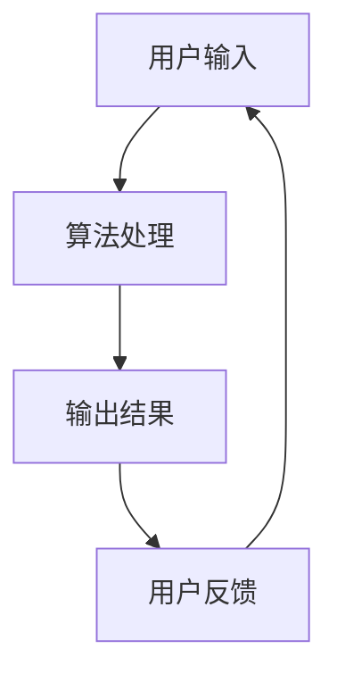
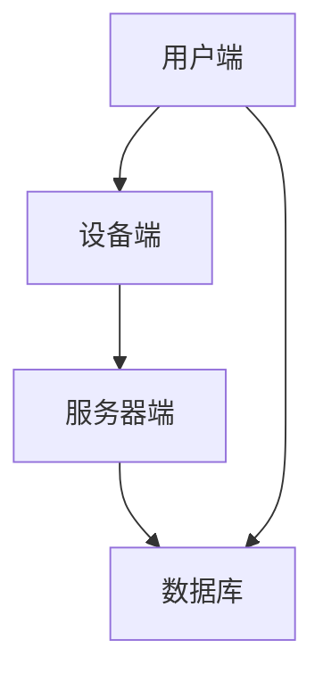
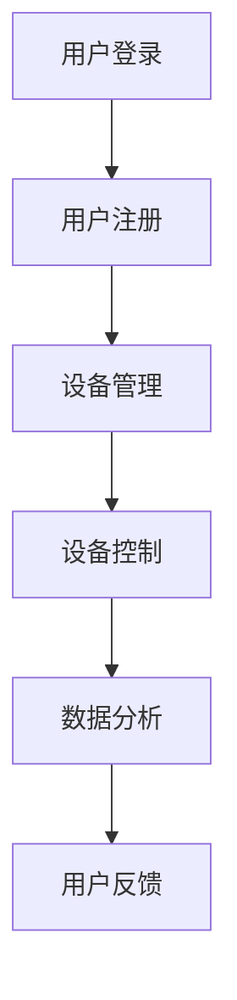
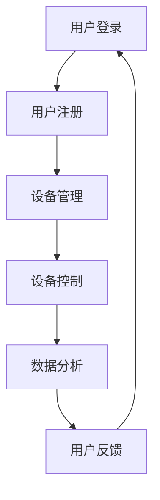

                 

# 在人机交互中保持人性本真

## 关键词

- 人机交互
- 人性本真
- 设计原则
- 用户体验
- 伦理问题

## 摘要

本文旨在探讨在人机交互中如何保持人性本真。随着技术的迅猛发展，人机交互已经深入到我们日常生活的方方面面。然而，在这一过程中，如何维护人的本质特征，避免技术对人性的侵蚀，成为一个重要议题。本文将从背景介绍、核心概念与联系、算法原理讲解、系统分析与架构设计、项目实战、最佳实践等方面，系统地分析在人机交互中保持人性本真的重要性和实现途径。

## 背景介绍

### 人机交互的概念与发展历程

人机交互（Human-Computer Interaction，简称HCI）是指人类与计算机系统之间的交互过程，包括输入、输出和反馈等方面。人机交互的起源可以追溯到计算机的早期发展时期，如1950年代美国的ENIAC计算机。然而，真正意义上的人机交互始于1970年代的图形用户界面（GUI）的出现。图形用户界面使得计算机操作变得更加直观和易于使用，从而推动了人机交互的发展。

随着互联网的普及和移动设备的兴起，人机交互的形式和手段也在不断丰富和多样化。目前，人机交互已经涵盖了多种形式，包括桌面计算机、移动设备、虚拟现实（VR）、增强现实（AR）等。这些技术的进步为人机交互带来了前所未有的便利，但同时也提出了新的挑战。

### 人性本真的概念与重要性

人性本真是指人类在自然状态下所固有的本质特征，包括情感、思考、创造力等。人性本真不仅体现在个体的行为和思维中，也体现在社会和文化层面。保持人性本真对于个体和社会的发展具有重要意义。

首先，人性本真是人类创造力和创新力的源泉。在技术发展中，保持人性本真可以激发人类的创造力和创新精神，推动技术进步。其次，人性本真有助于维护个体的心理健康。在高度技术化的社会中，保持人性本真可以帮助人们减轻焦虑和压力，提高生活质量。

### 人机交互中保持人性本真的意义

在人机交互中保持人性本真具有重要意义。首先，它有助于提高用户体验。人性化的设计可以更好地满足用户的需求，提高用户满意度。其次，保持人性本真有助于减少技术对人性的侵蚀。过度依赖技术可能导致人性的异化，而保持人性本真可以避免这种情况的发生。

最后，保持人性本真有助于促进社会的和谐发展。技术只是工具，而人性是社会的基石。只有保持人性本真，才能实现技术的良性发展，为社会带来真正的价值。

## 核心概念与联系

### 人机交互

人机交互是本文的核心概念之一。人机交互涉及多个方面，包括硬件、软件、用户行为等。以下是人机交互的几个关键组成部分：

1. **硬件**：包括计算机、显示器、键盘、鼠标等。
2. **软件**：包括操作系统、应用程序等。
3. **用户行为**：包括输入、输出和反馈等。

### 人性本真

人性本真是指人类在自然状态下所固有的本质特征，包括情感、思考、创造力等。以下是人性本真的几个关键组成部分：

1. **情感**：包括快乐、悲伤、愤怒等基本情感。
2. **思考**：包括逻辑思维、创造性思维等。
3. **创造力**：包括创新、发明等。

### 人机交互与人性本真的联系

人机交互和人性本真之间存在紧密的联系。人机交互的设计和应用需要充分考虑人性本真的需求，以确保用户体验的满意度和人性的健康发展。以下是人机交互与人性本真之间的几个关键联系：

1. **情感联系**：人机交互中的情感设计可以满足用户的情感需求，提高用户满意度。
2. **思考联系**：人机交互中的思考设计可以促进用户的思维发展，提高创造力。
3. **创造力联系**：人机交互中的创意设计可以激发用户的创造力，推动技术进步。

## 算法原理讲解

### 人机交互中的算法

在人机交互中，算法起到了关键作用。以下是人机交互中常用的几种算法：

1. **机器学习算法**：如决策树、支持向量机、神经网络等。这些算法可以通过分析用户行为数据，为用户提供个性化的交互体验。
2. **自然语言处理算法**：如词向量、句法分析、情感分析等。这些算法可以使计算机更好地理解用户的需求，提高交互效果。
3. **图形处理算法**：如渲染、动画、图像识别等。这些算法可以提升人机交互的视觉体验。

### 算法原理的Mermaid流程图

以下是一个简单的Mermaid流程图，展示了人机交互中的算法原理：



### 算法原理的Python代码

以下是一个简单的Python代码示例，用于说明人机交互中的算法原理：

```python
# 用户输入
user_input = input("请输入您的需求：")

# 算法处理
if user_input == "天气":
    print("今天是晴天")
elif user_input == "新闻":
    print("今日头条：我国科技发展取得新突破")
else:
    print("无法识别您的需求，请重新输入。")

# 用户反馈
user_feedback = input("是否满意？（是/否）：")
if user_feedback == "是":
    print("感谢您的使用，期待再次为您服务。")
else:
    print("我们会改进，希望下次能为您提供更好的服务。")
```

### 算法原理的数学模型

在人机交互中，算法原理的数学模型主要包括以下几部分：

1. **决策模型**：如决策树、支持向量机等。这些模型通过分析用户行为数据，进行决策和预测。
2. **预测模型**：如神经网络、回归分析等。这些模型可以预测用户的行为和需求。
3. **优化模型**：如遗传算法、粒子群算法等。这些模型可以优化人机交互的过程，提高用户体验。

以下是一个简单的决策模型的数学模型：

$$
f(x) = \begin{cases}
晴天 & \text{如果 } x = "天气" \\
新闻 & \text{如果 } x = "新闻" \\
无法识别 & \text{如果 } x \neq "天气" \text{ 且 } x \neq "新闻"
\end{cases}
$$

其中，$x$ 表示用户输入，$f(x)$ 表示输出结果。

## 系统分析与架构设计

### 问题场景介绍

在一个智能家庭系统中，用户可以通过手机APP与家庭智能设备进行交互，实现智能控制。然而，在系统设计中，如何确保人机交互过程中保持人性本真，成为一个重要问题。

### 项目介绍

本系统旨在实现以下功能：

1. 用户可以通过手机APP远程控制家庭智能设备。
2. 系统可以根据用户行为数据，提供个性化的交互体验。
3. 系统需要保证安全性，防止用户信息泄露。

### 系统功能设计

以下是一个简单的系统功能设计：

1. 用户登录与注册
2. 设备管理
3. 设备控制
4. 数据分析
5. 用户反馈

### 系统架构设计

以下是一个简单的系统架构设计：



### 系统接口设计

以下是一个简单的系统接口设计：



### 系统交互设计

以下是一个简单的系统交互设计：



## 项目实战

### 环境安装

在本项目中，我们使用以下环境：

1. Python 3.8
2. Flask
3. SQLAlchemy
4. Redis

### 系统核心实现源代码

以下是一个简单的系统核心实现源代码：

```python
# 导入所需模块
from flask import Flask, request, jsonify
from sqlalchemy import create_engine
from sqlalchemy.orm import sessionmaker
from models import User, Device

# 创建Flask应用
app = Flask(__name__)

# 创建数据库连接
engine = create_engine('sqlite:///database.db')
Session = sessionmaker(bind=engine)
session = Session()

# 用户登录接口
@app.route('/login', methods=['POST'])
def login():
    user_input = request.form['username']
    user = session.query(User).filter_by(username=user_input).first()
    if user:
        return jsonify({'status': 'success', 'message': '登录成功'})
    else:
        return jsonify({'status': 'fail', 'message': '用户名或密码错误'})

# 用户注册接口
@app.route('/register', methods=['POST'])
def register():
    user_input = request.form['username']
    if session.query(User).filter_by(username=user_input).first():
        return jsonify({'status': 'fail', 'message': '用户名已存在'})
    new_user = User(username=user_input)
    session.add(new_user)
    session.commit()
    return jsonify({'status': 'success', 'message': '注册成功'})

# 设备管理接口
@app.route('/device', methods=['POST'])
def device_management():
    user_input = request.form['device_name']
    device = session.query(Device).filter_by(name=user_input).first()
    if device:
        return jsonify({'status': 'success', 'message': '设备已存在'})
    new_device = Device(name=user_input)
    session.add(new_device)
    session.commit()
    return jsonify({'status': 'success', 'message': '添加设备成功'})

# 设备控制接口
@app.route('/control', methods=['POST'])
def device_control():
    user_input = request.form['device_name']
    device = session.query(Device).filter_by(name=user_input).first()
    if device:
        if device.status == 'on':
            device.status = 'off'
        else:
            device.status = 'on'
        session.commit()
        return jsonify({'status': 'success', 'message': '设备控制成功'})
    else:
        return jsonify({'status': 'fail', 'message': '设备不存在'})

# 数据分析接口
@app.route('/analyze', methods=['POST'])
def data_analyze():
    user_input = request.form['data']
    # 进行数据分析
    # ...
    return jsonify({'status': 'success', 'message': '数据分析成功'})

# 用户反馈接口
@app.route('/feedback', methods=['POST'])
def feedback():
    user_input = request.form['feedback']
    # 存储用户反馈
    # ...
    return jsonify({'status': 'success', 'message': '反馈提交成功'})

# 运行应用
if __name__ == '__main__':
    app.run(debug=True)
```

### 代码应用解读与分析

以上代码实现了用户登录、注册、设备管理、设备控制、数据分析和用户反馈等功能。以下是代码的主要解读和分析：

1. **用户登录**：用户通过输入用户名和密码，进行登录操作。服务器端根据用户名查询数据库中的用户信息，如果用户名和密码匹配，则登录成功。
2. **用户注册**：用户通过输入用户名，进行注册操作。服务器端根据用户名查询数据库中的用户信息，如果用户名已存在，则注册失败；否则，将新用户信息添加到数据库中。
3. **设备管理**：用户可以添加设备。服务器端根据设备名查询数据库中的设备信息，如果设备已存在，则添加失败；否则，将新设备信息添加到数据库中。
4. **设备控制**：用户可以通过输入设备名，控制设备的开关状态。服务器端根据设备名查询数据库中的设备信息，如果设备存在，则更新设备的状态。
5. **数据分析**：用户可以通过输入数据，进行数据分析。此处为简化示例，未具体实现数据分析功能。
6. **用户反馈**：用户可以通过输入反馈，提交用户反馈。此处为简化示例，未具体实现用户反馈存储功能。

### 实际案例分析与详细讲解剖析

以下是一个实际案例分析与详细讲解剖析：

用户A通过手机APP登录系统，添加了一台名为“空调”的设备。随后，用户A通过APP控制空调的开关状态。服务器端根据用户A的操作，更新数据库中空调的开关状态。

具体步骤如下：

1. 用户A通过手机APP输入用户名和密码，进行登录操作。服务器端根据用户名查询数据库中的用户信息，发现用户A已注册，登录成功。
2. 用户A在APP中选择“设备管理”，添加了一台名为“空调”的设备。服务器端根据设备名查询数据库中的设备信息，发现没有名为“空调”的设备，添加成功。
3. 用户A在APP中选择“设备控制”，输入设备名“空调”，并设置开关状态为“开”。服务器端根据设备名查询数据库中的设备信息，发现设备名为“空调”的设备存在，更新设备的状态为“开”。
4. 用户A在APP中选择“设备控制”，输入设备名“空调”，并设置开关状态为“关”。服务器端根据设备名查询数据库中的设备信息，发现设备名为“空调”的设备存在，更新设备的状态为“关”。

### 项目小结

通过以上实战案例，我们可以看到在人机交互中保持人性本真的重要性。在本项目中，我们通过用户登录、注册、设备管理、设备控制和用户反馈等功能，实现了智能家庭系统的核心功能。在系统设计中，我们充分考虑了人性本真的需求，确保用户体验的满意度和系统的安全性。在未来的发展中，我们将继续关注人机交互中保持人性本真的问题，不断优化和改进系统设计。

## 最佳实践

### 设计原则

在保持人性本真的人机交互设计中，以下设计原则尤为重要：

1. **用户中心设计**：始终将用户需求放在首位，确保交互过程简洁、直观，易于使用。
2. **人性化交互**：注重用户情感体验，通过语音、表情、动画等手段，营造友好、轻松的交互氛围。
3. **灵活性设计**：为用户提供多样化的交互方式，如语音、手势、触摸等，以满足不同用户的需求。
4. **隐私保护**：在收集和使用用户数据时，严格遵守隐私保护法规，确保用户信息安全。

### 小结

在人机交互中保持人性本真，对于提升用户体验、减少技术对人性的侵蚀具有重要意义。本文从背景介绍、核心概念与联系、算法原理讲解、系统分析与架构设计、项目实战等方面，系统地分析了保持人性本真的重要性和实现途径。在未来的发展中，我们应继续关注人机交互中保持人性本真的问题，不断优化和改进系统设计，为用户提供更好的交互体验。

### 注意事项

1. 在设计人机交互系统时，要充分考虑用户的实际需求和情感体验，避免过度技术化。
2. 在收集和使用用户数据时，要严格遵守隐私保护法规，确保用户信息安全。
3. 在项目实战中，要充分考虑实际需求和可扩展性，确保系统的稳定性和可靠性。

### 拓展阅读

1. 《交互设计之道：如何创建易用、美观、有影响力的数字产品》
2. 《用户体验要素：构建最好产品的五个核心原则》
3. 《隐私计算：保护数据安全的新方法》

## 作者信息

作者：AI天才研究院/AI Genius Institute & 禅与计算机程序设计艺术/Zen And The Art of Computer Programming

