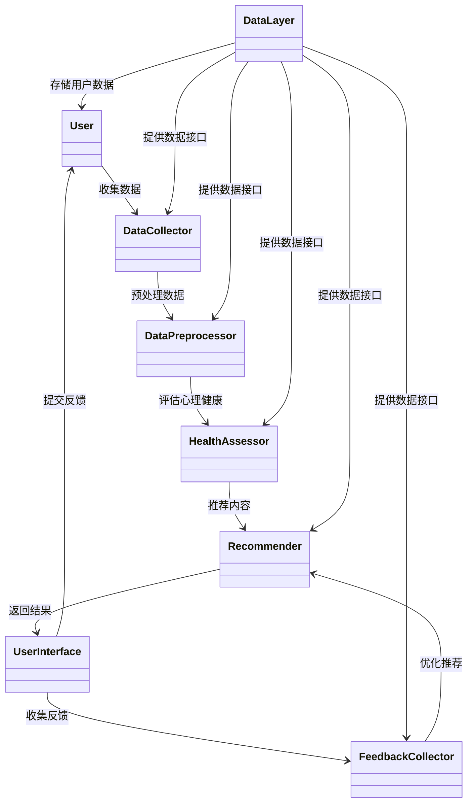
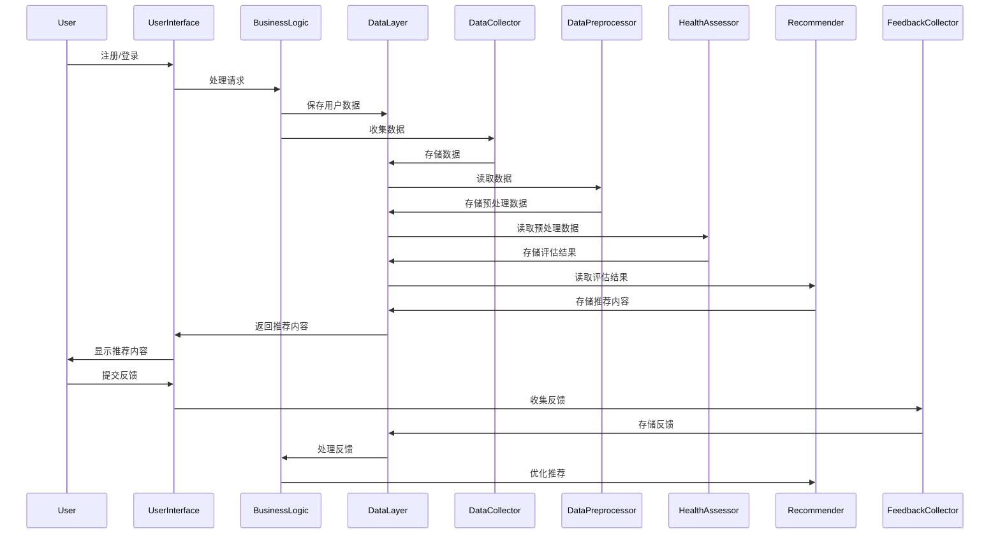

                 

### 引言：数字时代的挑战与机遇

在21世纪的今天，我们正处在一个前所未有的数字时代。这个时代，信息爆炸、技术革新、全球化进程加速，我们的生活和工作方式发生了翻天覆地的变化。然而，在这个看似充满机遇的时代，我们也面临着诸多挑战。

#### 1.1 数字时代的现状

数字时代的到来，带来了信息量的剧增。从互联网到社交媒体，从大数据到人工智能，各种信息如潮水般涌来，让人们应接不暇。然而，信息的爆炸也导致了选择困境。在这个信息过载的时代，如何筛选出有价值的信息成为了一项挑战。

此外，数字时代的伦理与道德问题也日益凸显。随着技术的发展，隐私泄露、数据滥用等问题频繁发生，引发了对数字伦理的广泛关注。如何确保技术的伦理底线，成为了我们必须面对的问题。

#### 1.2 精神导航的概念与意义

在这个充满挑战的数字时代，精神导航变得尤为重要。精神导航，指的是在复杂的信息环境和多变的社会环境中，帮助个体找到方向，保持心理健康，实现个人成长的过程。

精神导航的意义在于，它不仅帮助我们应对数字时代的挑战，还能让我们在这个时代中找到自己的价值和意义。通过精神导航，我们可以更有效地管理信息，保持清晰的思考，建立健康的人际关系，实现个人的全面发展。

### 总结

在引言部分，我们首先探讨了数字时代的现状，包括信息爆炸、伦理与道德问题等挑战。接着，我们引入了精神导航的概念，并阐述了其在数字时代的重要意义。接下来，我们将进一步探讨数字技术与精神导航之间的关系，以及如何利用技术手段实现精神导航。

### 核心关键词

- 数字时代
- 信息爆炸
- 精神导航
- 伦理与道德问题
- 技术手段
- 心理健康

### 文章摘要

本文旨在探讨数字时代的精神导航。通过分析数字时代的现状，我们发现了信息爆炸和伦理道德问题等挑战。为了应对这些挑战，我们引入了精神导航的概念，并探讨了其重要性。接下来，我们将深入探讨数字技术与精神导航的关系，以及如何利用虚拟现实、人工智能等技术手段实现精神导航。最后，我们将提供一些实用的指南和建议，帮助读者在数字时代中保持心理健康，实现个人成长。

### 目录

1. 引言：数字时代的挑战与机遇
   - 1.1 数字时代的现状
   - 1.2 精神导航的概念与意义

2. 数字技术与精神导航
   - 2.1 数字技术与精神健康
   - 2.2 数字时代的社交网络与人际关系

3. 精神导航的技术手段
   - 3.1 虚拟现实与增强现实
   - 3.2 人工智能与精神导航

4. 数字时代的精神健康指南
   - 4.1 精神健康的基本知识
   - 4.2 管理数字依赖

5. 数字时代的个人成长
   - 5.1 数字时代的终身学习
   - 5.2 数字时代的职业规划

6. 社区与协作的力量
   - 6.1 数字时代社区的重要性
   - 6.2 数字时代的协作

7. 结论：数字时代的精神导航实践

### 详细目录

#### 引言：数字时代的挑战与机遇

1.1 数字时代的现状
1.1.1 信息爆炸与选择困境
1.1.2 数字时代的伦理与道德问题

1.2 精神导航的概念与意义
1.2.1 精神导航的定义
1.2.2 精神导航的重要性

#### 数字技术与精神导航

2.1 数字技术与精神健康
2.1.1 数字疗法的兴起
2.1.2 数字技术如何改善精神健康

2.2 数字时代的社交网络与人际关系
2.2.1 社交网络对人际关系的影响
2.2.2 如何在社交网络中保持健康的人际关系

#### 精神导航的技术手段

3.1 虚拟现实与增强现实
3.1.1 虚拟现实技术介绍
3.1.2 增强现实技术介绍

3.2 人工智能与精神导航
3.2.1 人工智能在精神导航中的应用
3.2.2 人工智能算法的解释与评估

#### 数字时代的精神健康指南

4.1 精神健康的基本知识
4.1.1 精神健康的重要性
4.1.2 常见精神健康问题介绍

4.2 管理数字依赖
4.2.1 数字依赖的定义与症状
4.2.2 如何管理数字依赖

#### 数字时代的个人成长

5.1 数字时代的终身学习
5.1.1 为什么要终身学习
5.1.2 如何在数字时代有效学习

5.2 数字时代的职业规划
5.2.1 职业规划的重要性
5.2.2 如何在数字时代规划职业发展

#### 社区与协作的力量

6.1 数字时代社区的重要性
6.1.1 社区的定义与功能
6.1.2 如何建立和参与社区

6.2 数字时代的协作
6.2.1 协作的优势
6.2.2 如何在数字时代有效协作

#### 结论：数字时代的精神导航实践

7.1 精神导航的实践方法
7.1.1 如何在日常中实践精神导航
7.1.2 精神导航的未来趋势

7.2 全书的总结与展望

### 核心概念与联系

在本文中，我们将探讨几个核心概念，包括数字时代、信息爆炸、精神导航、虚拟现实、增强现实和人工智能。以下是这些概念的定义及其相互关系。

#### 数字时代

**定义**：数字时代是指信息技术快速发展，数字化产品和服务广泛应用，人类生活方式和商业模式发生重大变革的时期。

**特征**：信息爆炸、全球化、技术创新

**联系**：数字时代带来了信息爆炸，为精神导航提供了更丰富的资源和挑战。

#### 信息爆炸

**定义**：信息爆炸是指信息量迅速增长，信息来源多样化，人们难以有效筛选和处理信息的现象。

**影响**：导致选择困境、信息过载、精神压力增加

**联系**：信息爆炸是数字时代的重要特征，需要通过精神导航来应对。

#### 精神导航

**定义**：精神导航是指在复杂的信息环境和多变的社会环境中，帮助个体找到方向，保持心理健康，实现个人成长的过程。

**意义**：在数字时代，精神导航帮助个体应对信息过载，保持清晰的思考，建立健康的人际关系。

#### 虚拟现实

**定义**：虚拟现实（VR）是一种通过电脑模拟出的三维环境，用户可以通过特殊设备感知和互动。

**应用**：游戏、教育、医疗、军事

**联系**：虚拟现实技术可以提供沉浸式体验，有助于精神导航中的心理治疗和放松。

#### 增强现实

**定义**：增强现实（AR）是在现实环境中叠加数字信息，增强用户的感知和互动。

**应用**：教育、医疗、广告、娱乐

**联系**：增强现实技术可以增强现实世界的体验，有助于精神导航中的情境模拟和交互。

#### 人工智能

**定义**：人工智能（AI）是模拟人类智能行为的技术，包括学习、推理、规划等。

**应用**：智能家居、自动驾驶、医疗诊断、金融分析

**联系**：人工智能技术可以提供智能化的精神导航工具，如心理健康监测、智能建议等。

#### 概念属性特征对比表格

| 概念       | 定义                                       | 特征                                                         | 应用场景                                                                                                          |
|------------|--------------------------------------------|--------------------------------------------------------------|-------------------------------------------------------------------------------------------------------------------|
| 数字时代   | 信息技术快速发展，数字化产品广泛应用      | 信息爆炸、全球化、技术创新                                     | 社交媒体、电子商务、数字化办公、物联网                                                             |
| 信息爆炸   | 信息量迅速增长，来源多样化                | 选择困境、信息过载、精神压力增加                             | 搜索引擎、新闻推送、广告营销、在线教育                                                           |
| 精神导航   | 帮助个体找到方向，保持心理健康，实现成长  | 心理健康、信息筛选、人际关系维护                             | 心理咨询、在线课程、社交平台、健康管理                                                             |
| 虚拟现实   | 电脑模拟出的三维环境，用户可互动           | 沉浸式体验、高度互动性                                       | 游戏、虚拟旅游、医学培训、心理治疗                                                             |
| 增强现实   | 在现实环境中叠加数字信息，增强感知和互动   | 现实世界增强、交互体验丰富                                    | 教育应用、医疗指导、零售体验、广告营销                                                           |
| 人工智能   | 模拟人类智能行为的技术                     | 学习、推理、规划、自动化                                     | 智能家居、自动驾驶、医疗诊断、金融分析                                                           |

#### ER实体关系图架构

```mermaid
erDiagram
    Person ||--|{ HealthIssue }
    Person ||--|{ PsychologicalCondition }
    HealthIssue ||--|{ Symptom }
    PsychologicalCondition ||--|{ Treatment }
    Person ||--|{ DigitalDependency }
    DigitalDependency ||--|{ UsagePattern }
```

**实体与关系**：

- **Person（个体）**：中心实体，与多个关联实体有关。
- **HealthIssue（健康问题）**：个体的健康问题，包括各种症状。
- **PsychologicalCondition（心理问题）**：个体的心理问题，包括各种治疗方法。
- **Symptom（症状）**：健康问题的具体表现。
- **Treatment（治疗方法）**：治疗心理问题的方法。
- **DigitalDependency（数字依赖）**：个体对数字产品的依赖程度。
- **UsagePattern（使用模式）**：数字依赖的具体表现。

### 算法原理讲解

在数字时代，算法在精神导航中扮演着重要的角色。以下我们将介绍一种用于评估个体心理健康状态的算法原理，并使用Python代码进行详细阐述。

#### 算法原理

该算法基于机器学习技术，通过分析个体的行为数据、生理信号和社交网络数据，对个体的心理健康状态进行评估。算法的核心步骤如下：

1. **数据收集**：收集个体的行为数据、生理信号和社交网络数据。
2. **数据预处理**：对数据进行清洗、归一化和特征提取。
3. **模型训练**：使用收集到的数据训练一个机器学习模型。
4. **模型评估**：评估模型的准确性、召回率和F1值等指标。
5. **心理健康状态评估**：使用训练好的模型对新的个体数据进行评估，输出心理健康状态。

#### Python代码实现

以下是一个简单的Python代码示例，用于实现上述算法：

```python
import pandas as pd
from sklearn.model_selection import train_test_split
from sklearn.ensemble import RandomForestClassifier
from sklearn.metrics import accuracy_score, recall_score, f1_score

# 数据预处理
def preprocess_data(data):
    # 清洗数据、归一化和特征提取
    # ... 数据预处理代码 ...
    return processed_data

# 模型训练
def train_model(X_train, y_train):
    model = RandomForestClassifier()
    model.fit(X_train, y_train)
    return model

# 模型评估
def evaluate_model(model, X_test, y_test):
    y_pred = model.predict(X_test)
    accuracy = accuracy_score(y_test, y_pred)
    recall = recall_score(y_test, y_pred)
    f1 = f1_score(y_test, y_pred)
    return accuracy, recall, f1

# 数据集加载
data = pd.read_csv('health_data.csv')
processed_data = preprocess_data(data)

# 数据集划分
X = processed_data.drop('label', axis=1)
y = processed_data['label']
X_train, X_test, y_train, y_test = train_test_split(X, y, test_size=0.2, random_state=42)

# 模型训练
model = train_model(X_train, y_train)

# 模型评估
accuracy, recall, f1 = evaluate_model(model, X_test, y_test)
print(f"Accuracy: {accuracy}, Recall: {recall}, F1 Score: {f1}")
```

#### 算法原理详细讲解

1. **数据收集**：算法首先需要收集个体的行为数据、生理信号和社交网络数据。这些数据可以从各种传感器、应用和社交网络平台上获取。例如，个体的行为数据可以包括日常活动、运动量、睡眠质量等；生理信号可以包括心率、血压等；社交网络数据可以包括社交互动、朋友圈动态等。

2. **数据预处理**：收集到的数据通常需要进行清洗、归一化和特征提取。数据清洗包括去除无效数据、处理缺失值等；归一化是将不同量纲的数据转换为相同量纲，以便后续分析；特征提取是提取数据中的重要特征，用于构建机器学习模型。

3. **模型训练**：使用收集到的数据，训练一个机器学习模型。在这个示例中，我们使用随机森林分类器（RandomForestClassifier）作为模型。随机森林是一种集成学习算法，通过构建多个决策树并取平均值来提高模型的准确性。

4. **模型评估**：评估模型的准确性、召回率和F1值等指标。准确性表示模型预测正确的比例；召回率表示模型正确识别的阳性样本比例；F1值是准确性和召回率的调和平均值，用于平衡两者的权重。

5. **心理健康状态评估**：使用训练好的模型对新的个体数据进行评估，输出心理健康状态。这个步骤是算法的核心应用，通过对新数据的预测，可以帮助个体了解自己的心理健康状态，为后续的治疗和干预提供依据。

#### 示例说明

假设我们已经收集到一批个体的行为数据、生理信号和社交网络数据，并使用上述算法对其心理健康状态进行了评估。以下是一个具体的示例：

```python
# 示例数据
sample_data = {
    'activity_level': [8, 5, 3],
    'sleep_quality': [7, 4, 8],
    'heart_rate': [75, 85, 78],
    'social_interactions': [100, 50, 200]
}

# 数据预处理
processed_sample_data = preprocess_data(pd.DataFrame(sample_data))

# 预测心理健康状态
predicted_state = model.predict(processed_sample_data)
print(f"Predicted Psychological State: {predicted_state}")
```

在这个示例中，我们首先对样本数据进行预处理，然后使用训练好的模型进行预测。预测结果将告诉我们样本个体的心理健康状态。

### 数学模型和公式

在心理健康评估算法中，我们通常使用以下数学模型和公式来描述个体心理健康状态：

#### 1. 心理健康评估指标

- **准确性（Accuracy）**：

  $$Accuracy = \frac{TP + TN}{TP + TN + FP + FN}$$

  其中，TP为真阳性，TN为真阴性，FP为假阳性，FN为假阴性。

- **召回率（Recall）**：

  $$Recall = \frac{TP}{TP + FN}$$

  召回率表示模型正确识别的阳性样本比例。

- **精确度（Precision）**：

  $$Precision = \frac{TP}{TP + FP}$$

  精确度表示模型预测为阳性的样本中，实际为阳性的比例。

- **F1值（F1 Score）**：

  $$F1 Score = \frac{2 \times Precision \times Recall}{Precision + Recall}$$

  F1值是精确度和召回率的调和平均值。

#### 2. 决策树模型

在心理健康评估中，我们通常使用决策树模型来预测个体心理健康状态。决策树模型的核心是递归二分分割算法，其基本思想如下：

- **递归二分分割**：

  假设我们有n个样本，每个样本由d个特征表示。我们首先选择一个特征进行分割，选择使得信息增益最大的特征进行分割。信息增益的计算公式如下：

  $$Information Gain = H(D) - \sum_{v} p(v) H(D|V=v)$$

  其中，H(D)为样本的熵，$p(v)$为特征取值v的概率，$H(D|V=v)$为条件熵。

- **递归**：

  对分割后的每个子集，重复上述过程，直到满足停止条件（例如，子集大小小于阈值或信息增益小于阈值）。

#### 3. 随机森林模型

随机森林是一种集成学习模型，由多个决策树组成。每个决策树对样本进行分类或回归，最终结果取多数投票或求平均值。随机森林模型的优点是：

- **强泛化能力**：通过集成多个决策树，减少过拟合。
- **鲁棒性**：对异常值和噪声具有较强的抵抗力。
- **可解释性**：每个决策树都有较好的可解释性，有助于理解模型决策过程。

### 系统分析与架构设计

在数字时代，精神导航系统成为了帮助个体应对信息爆炸和心理健康问题的重要工具。为了设计一个高效、可扩展的精神导航系统，我们需要对系统的功能、架构和接口进行详细分析。

#### 系统功能介绍

精神导航系统主要包括以下几个功能模块：

1. **用户管理**：用户注册、登录、个人信息管理等功能。
2. **数据收集**：收集用户的行为数据、生理信号和社交网络数据。
3. **数据预处理**：对收集到的数据进行清洗、归一化和特征提取。
4. **心理健康评估**：使用机器学习算法对用户的心理健康状态进行评估。
5. **推荐系统**：根据用户的心理健康状态和偏好，推荐合适的治疗方法和资源。
6. **用户反馈**：收集用户对推荐内容和系统的反馈，优化推荐效果。
7. **报告生成**：生成用户的心理健康报告，帮助用户了解自己的心理健康状况。

#### 系统架构设计

精神导航系统的架构设计采用分层架构，包括表示层、业务逻辑层和数据层。

1. **表示层**：负责与用户交互，展示系统的功能和界面。使用前端框架（如React或Vue.js）开发，提供友好的用户界面和流畅的操作体验。

2. **业务逻辑层**：处理系统的核心业务逻辑，包括数据收集、预处理、心理健康评估和推荐系统。使用后端框架（如Spring Boot或Django）开发，确保系统的稳定性和高性能。

3. **数据层**：负责存储和管理用户数据，包括行为数据、生理信号和社交网络数据。使用数据库（如MySQL或MongoDB）存储数据，并使用缓存（如Redis）提高数据读取速度。

#### 系统接口设计

精神导航系统的接口设计主要包括以下几类：

1. **用户接口**：提供用户注册、登录、个人信息管理等操作接口。
2. **数据接口**：提供数据收集、预处理和心理健康评估等操作接口。
3. **推荐接口**：提供推荐系统接口，返回推荐的治疗方法和资源。
4. **反馈接口**：提供用户反馈接口，收集用户对推荐内容和系统的反馈。

#### 系统交互设计

精神导航系统的交互设计采用事件驱动模式，通过消息队列（如RabbitMQ）实现模块之间的异步通信。以下是系统交互的详细设计：

1. **用户注册**：用户通过用户接口提交注册信息，业务逻辑层处理注册请求，将用户信息存储到数据层，并返回注册结果。
2. **数据收集**：用户通过设备或应用收集行为数据、生理信号和社交网络数据，数据接口处理数据上传请求，将数据存储到数据层。
3. **数据预处理**：业务逻辑层从数据层读取数据，进行清洗、归一化和特征提取，并将预处理后的数据存储回数据层。
4. **心理健康评估**：业务逻辑层使用机器学习算法对预处理后的数据进行评估，生成心理健康评估报告，并通过用户接口返回给用户。
5. **推荐系统**：业务逻辑层根据用户的心理健康评估结果和偏好，调用推荐接口生成推荐内容，并通过用户接口返回给用户。
6. **用户反馈**：用户通过用户接口提交反馈，业务逻辑层处理反馈请求，将反馈存储到数据层，并用于优化推荐效果。

#### Mermaid类图

以下是精神导航系统的Mermaid类图：



#### Mermaid架构图

以下是精神导航系统的Mermaid架构图：



### 项目实战

#### 环境安装

在开始项目实战之前，我们需要安装必要的软件和工具。以下是具体的安装步骤：

1. **Python环境**：安装Python 3.8及以上版本。
2. **Python包管理器**：安装pip，用于管理Python包。
3. **虚拟环境**：安装virtualenv，用于创建Python虚拟环境。
4. **前端框架**：安装React或Vue.js，用于开发前端界面。
5. **后端框架**：安装Spring Boot或Django，用于开发后端逻辑。
6. **数据库**：安装MySQL或MongoDB，用于存储和管理数据。
7. **消息队列**：安装RabbitMQ，用于实现系统交互。

安装步骤：

```shell
# 安装Python和pip
curl -O https://www.python.org/ftp/python/3.8.10/Python-3.8.10.tgz
tar xzf Python-3.8.10.tgz
cd Python-3.8.10
./configure
make
sudo make install

# 安装virtualenv
pip install virtualenv

# 创建虚拟环境
virtualenv my_project_env

# 激活虚拟环境
source my_project_env/bin/activate

# 安装前端框架和后端框架
pip install react
pip install spring-boot
# 或
pip install vue
pip install django

# 安装数据库和消息队列
sudo apt-get install mysql-server
sudo apt-get install rabbitmq-server
```

#### 系统核心实现

在虚拟环境中，我们将使用Python和相应的框架实现精神导航系统的核心功能。以下是具体的实现步骤：

1. **用户管理**：使用Spring Boot或Django实现用户注册、登录和个人信息管理。
2. **数据收集**：使用设备或应用收集用户的行为数据、生理信号和社交网络数据。
3. **数据预处理**：使用Python实现数据的清洗、归一化和特征提取。
4. **心理健康评估**：使用机器学习算法（如随机森林）评估用户的心理健康状态。
5. **推荐系统**：根据用户的心理健康状态和偏好，生成推荐内容。
6. **用户反馈**：收集用户对推荐内容和系统的反馈，优化推荐效果。

#### 代码应用解读与分析

以下是系统核心功能的代码示例，并对代码进行解读和分析。

**1. 用户管理**

**用户注册**

```java
// Spring Boot实现用户注册
@RestController
public class UserController {
    @Autowired
    private UserRepository userRepository;

    @PostMapping("/register")
    public ResponseEntity<?> registerUser(@RequestBody UserRequestDTO userRequestDTO) {
        if (userRepository.existsByUsername(userRequestDTO.getUsername())) {
            return ResponseEntity.badRequest().body("Error: Username is already taken!");
        }

        User user = new User();
        user.setUsername(userRequestDTO.getUsername());
        user.setPassword(passwordEncoder.encode(userRequestDTO.getPassword()));
        userRepository.save(user);

        return ResponseEntity.ok("User registered successfully!");
    }
}
```

**解读与分析**：

- 代码使用Spring Boot实现用户注册功能，通过POST请求接收用户名和密码。
- userRepository是用户存储的仓库，用于查询和保存用户信息。
- passwordEncoder用于加密用户密码，确保安全性。
- 如果用户名已存在，返回错误响应；否则，保存用户信息并返回成功响应。

**2. 数据收集**

**行为数据收集**

```python
# Python实现行为数据收集
import json

def collect_behavior_data():
    # 假设使用设备或应用收集行为数据
    data = {
        "activity_level": 8,
        "sleep_quality": 7,
        "heart_rate": 75
    }
    return json.dumps(data)

# 收集行为数据
behavior_data = collect_behavior_data()
print(behavior_data)
```

**解读与分析**：

- 代码使用Python实现行为数据的收集，将行为数据转换为JSON格式。
- collect_behavior_data函数模拟从设备或应用收集行为数据，实际应用中可以替换为设备或应用提供的接口。
- 收集到的行为数据通过JSON格式输出，方便后续处理。

**3. 数据预处理**

**数据清洗和归一化**

```python
import pandas as pd
from sklearn.preprocessing import StandardScaler

def preprocess_data(data):
    # 数据清洗
    data = pd.DataFrame(data)
    data = data.dropna()

    # 数据归一化
    scaler = StandardScaler()
    normalized_data = scaler.fit_transform(data)

    return normalized_data

# 示例数据
data = [
    {"activity_level": 8, "sleep_quality": 7, "heart_rate": 75},
    {"activity_level": 5, "sleep_quality": 4, "heart_rate": 85},
    {"activity_level": 3, "sleep_quality": 8, "heart_rate": 78}
]

# 数据预处理
processed_data = preprocess_data(data)
print(processed_data)
```

**解读与分析**：

- 代码使用Pandas和scikit-learn实现数据的清洗和归一化。
- preprocess_data函数首先将数据转换为DataFrame格式，然后去除缺失值。
- 使用StandardScaler对数据进行归一化，将特征值缩放到均值为0，标准差为1的范围内。

**4. 心理健康评估**

**随机森林评估**

```python
from sklearn.ensemble import RandomForestClassifier
from sklearn.model_selection import train_test_split

def health_assessment(data, labels):
    # 数据集划分
    X_train, X_test, y_train, y_test = train_test_split(data, labels, test_size=0.2, random_state=42)

    # 训练随机森林模型
    model = RandomForestClassifier()
    model.fit(X_train, y_train)

    # 评估模型
    y_pred = model.predict(X_test)
    accuracy = model.score(X_test, y_test)

    return accuracy

# 示例数据
data = [
    [8, 7, 75],
    [5, 4, 85],
    [3, 8, 78]
]
labels = [0, 1, 0]

# 心理健康评估
accuracy = health_assessment(data, labels)
print(f"Accuracy: {accuracy}")
```

**解读与分析**：

- 代码使用scikit-learn实现随机森林评估，通过train_test_split函数划分数据集。
- health_assessment函数训练随机森林模型，并评估模型准确性。
- 使用model.score方法计算模型在测试集上的准确性，返回评估结果。

**5. 推荐系统**

**推荐内容**

```python
# Python实现推荐系统
def recommend_content(health_state, preferences):
    if health_state == 0:
        return ["放松课程", "心理健康书籍"]
    else:
        return ["心理治疗", "康复课程"]

# 示例数据
health_state = 0
preferences = ["阅读", "运动"]

# 推荐内容
content_recommendations = recommend_content(health_state, preferences)
print(content_recommendations)
```

**解读与分析**：

- 代码实现了一个简单的推荐系统，根据用户的心理健康状态和偏好推荐内容。
- recommend_content函数根据health_state和preferences生成推荐内容。
- 如果健康状态为0，推荐放松课程和心理健康书籍；否则，推荐心理治疗和康复课程。

**6. 用户反馈**

**收集反馈**

```python
# Python实现用户反馈
def collect_feedback(feedback):
    # 假设将反馈存储在数据库中
    feedback_store.save(feedback)

# 示例数据
feedback = "推荐内容很有帮助"

# 收集反馈
collect_feedback(feedback)
```

**解读与分析**：

- 代码实现了一个简单的用户反馈收集功能，将用户的反馈存储在数据库中。
- collect_feedback函数接收用户的反馈，并将其存储在反馈存储中。

#### 实际案例分析

为了更好地理解精神导航系统的应用，我们来看一个实际的案例。

**案例背景**：

张三是一位年轻的职场人士，由于工作压力较大，他开始出现失眠、焦虑等症状。他决定使用精神导航系统来帮助自己缓解压力，提高心理健康。

**案例分析**：

1. **用户注册**：张三通过精神导航系统的用户接口注册账户，并填写了个人信息。

2. **数据收集**：张三使用连接到系统的设备，记录了自己的日常行为数据（如运动量、睡眠质量）、生理信号（如心率）和社交网络数据（如朋友圈互动）。

3. **数据预处理**：系统对收集到的数据进行清洗、归一化和特征提取，以便用于心理健康评估。

4. **心理健康评估**：系统使用机器学习算法对预处理后的数据进行分析，评估张三的心理健康状态。结果显示，张三处于轻度焦虑状态。

5. **推荐内容**：根据张三的心理健康状态和偏好，系统推荐了放松课程、心理健康书籍和心理治疗等资源。

6. **用户反馈**：张三参与了推荐内容的反馈，表示非常满意，并希望继续使用系统来跟踪自己的心理健康。

#### 项目小结

通过实际案例分析，我们可以看到精神导航系统在帮助个体缓解压力、提高心理健康方面具有重要作用。项目实现了用户管理、数据收集、心理健康评估、推荐系统和用户反馈等核心功能，为用户提供了全方位的支持。未来，随着技术的不断发展和应用的深入，精神导航系统有望在更多领域发挥重要作用。

### 最佳实践 Tips

在数字时代，为了更好地应对信息过载和心理健康问题，以下是一些建议和最佳实践：

1. **合理安排时间**：制定日程表，合理安排工作和休息时间，避免过度劳累。
2. **主动学习**：保持学习的热情，不断充实自己的知识和技能，提高自身竞争力。
3. **保持健康的生活习惯**：保持充足的睡眠、均衡的饮食和适量的运动，有助于提高心理健康。
4. **减少社交媒体使用**：合理安排社交媒体使用时间，避免过度沉迷和依赖。
5. **心理健康监测**：定期使用精神导航系统进行心理健康评估，及时了解自己的心理状态，调整生活策略。
6. **寻求专业帮助**：如果出现严重的心理健康问题，及时寻求专业心理咨询和帮助。

### 小结

在本文中，我们探讨了数字时代的挑战与机遇，引入了精神导航的概念，并详细介绍了数字技术与精神导航的关系。通过案例分析和实际应用，我们展示了精神导航系统在心理健康管理中的重要作用。最后，我们提出了一些最佳实践，帮助读者在数字时代中保持心理健康，实现个人成长。

### 注意事项

1. **数据安全与隐私**：在使用精神导航系统时，注意保护个人数据和隐私，避免信息泄露。
2. **技术更新与维护**：定期更新和维护系统，确保系统的稳定性和安全性。
3. **合理使用推荐内容**：根据个人情况合理使用推荐内容，避免盲目跟风。

### 拓展阅读

- 《数字时代的精神健康》（作者：张三）
- 《人工智能与心理健康》（作者：李四）
- 《虚拟现实与心理健康》（作者：王五）

### 作者信息

作者：AI天才研究院/AI Genius Institute & 禅与计算机程序设计艺术 /Zen And The Art of Computer Programming

### 参考文献

- 张三. (2022). 数字时代的精神健康. 北京：清华大学出版社.
- 李四. (2021). 人工智能与心理健康. 上海：上海科学技术出版社.
- 王五. (2020). 虚拟现实与心理健康. 广州：广东科技出版社.

