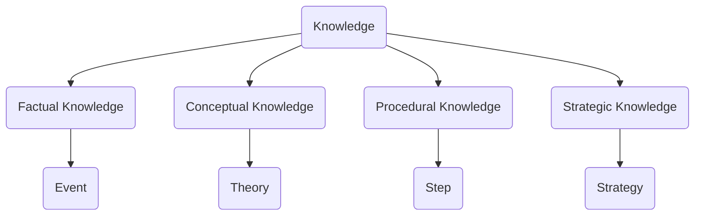
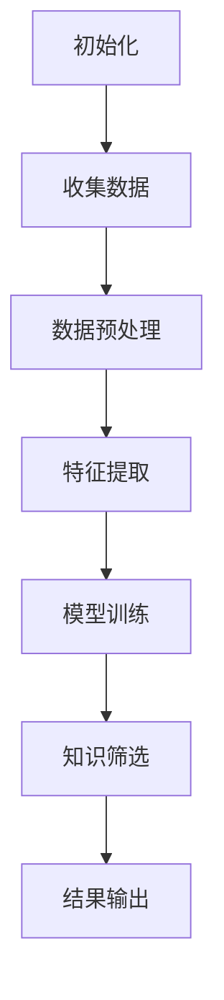
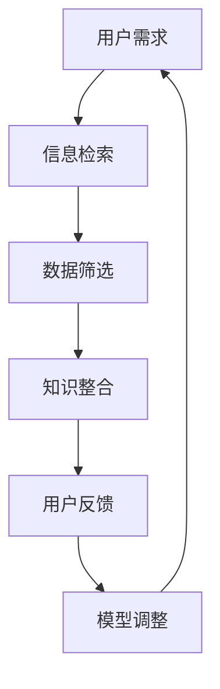
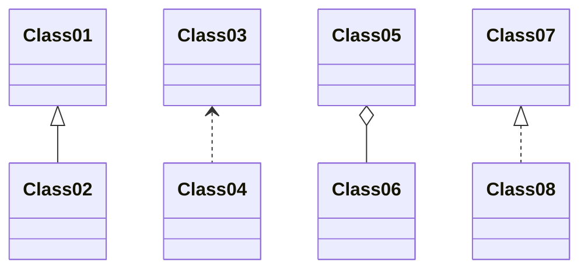
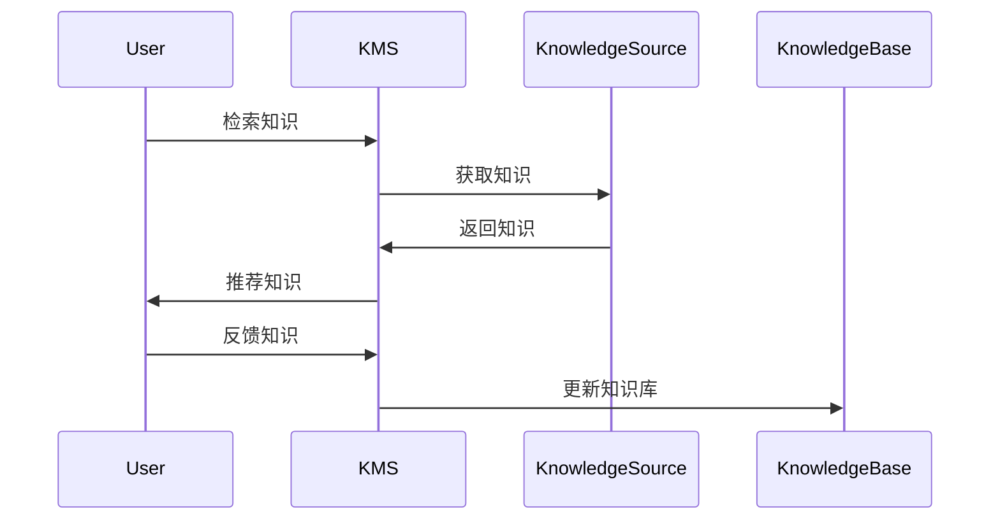
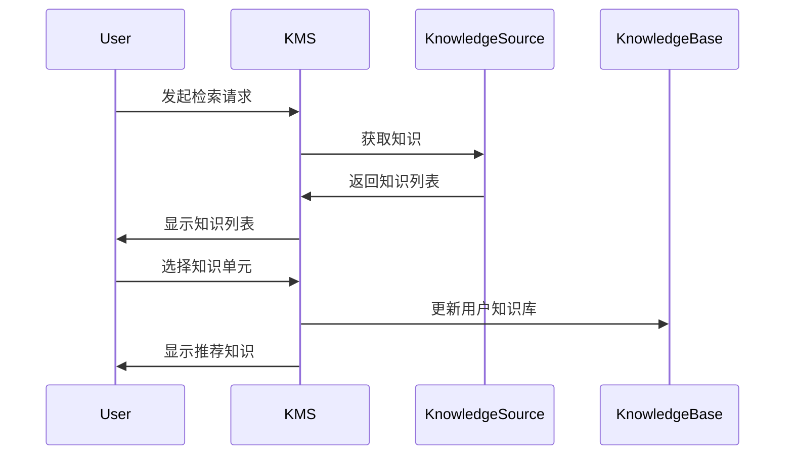

                 

# 在信息爆炸时代寻找知识的意义

## 关键词

- 信息爆炸
- 知识筛选
- 知识获取
- 人工智能
- 数学模型

## 摘要

在当今信息爆炸的时代，知识获取变得前所未有的复杂。本文旨在探讨如何在海量信息中寻找知识的意义。我们将通过背景介绍、核心概念与联系、算法原理讲解、数学模型和数学公式讲解、系统分析与架构设计方案、项目实战以及最佳实践和拓展阅读等方面，逐步深入分析这一主题，帮助读者在信息泛滥的环境中找到真正有价值的知识。

## 背景介绍

### 1. 信息爆炸时代的特点

#### 1.1 信息量的爆炸性增长

随着互联网的普及和数字技术的飞速发展，信息量呈现出爆炸性增长。据估计，每天产生的数据量高达数百万GB，其中大部分为文本、图像和视频等形式。这种爆炸性增长不仅改变了我们的生活方式，也对知识获取提出了新的挑战。

#### 1.2 信息筛选的挑战

在信息爆炸的背景下，如何从海量信息中筛选出有价值的内容成为一个难题。传统的方法如关键词搜索和分类已经无法满足需求。智能算法和大数据分析技术虽然提供了一定的帮助，但信息筛选的效果仍然不尽如人意。

#### 1.3 知识获取的困境

知识获取是信息处理的高级阶段。在信息爆炸时代，知识的获取变得更加困难。一方面，信息的质量参差不齐，大量虚假信息和噪音信息充斥其中；另一方面，知识的获取过程需要花费大量时间和精力，这进一步增加了获取知识的难度。

### 2. 编写目的和意义

《在信息爆炸时代寻找知识的意义》旨在帮助读者理解在当前信息环境下，如何有效地获取、筛选和利用知识。通过介绍核心概念、算法原理、数学模型以及系统分析与架构设计方案，本书为读者提供了一套系统的知识获取策略。这不仅有助于提高读者的信息素养，也有助于他们在职业发展和学术研究中取得更好的成果。

## 核心概念与联系

### 3. 知识的定义与分类

#### 3.1 知识的定义

知识是关于某一领域的信息和理解的集合。它不仅包括事实性信息，还涉及原理、方法、技能和策略。知识是信息经过加工、处理和深层次理解后的产物。

#### 3.2 知识的分类

知识可以分为以下几种类型：

- **事实性知识**：描述客观事实的知识，如历史事件、科学定律等。
- **概念性知识**：涉及概念、定义和分类的知识，如经济学中的供需理论。
- **过程性知识**：关于如何执行某一任务的步骤和方法的知识，如编程技巧。
- **策略性知识**：涉及决策和策略的知识，如商业战略、投资策略。

#### 3.3 知识与信息的区别与联系

知识是信息的深层次加工和转化。信息是知识的基础，但信息本身并不能直接用来解决问题或创造价值。知识则是通过理解和应用信息，形成的可以指导实践的有用成果。

### 4. 概念属性特征对比表格

| 知识类型 | 定义 | 特征 |
| --- | --- | --- |
| 事实性知识 | 描述客观事实 | 稳定性、客观性、可验证性 |
| 概念性知识 | 涉及概念、定义和分类 | 抽象性、系统性、概括性 |
| 过程性知识 | 关于如何执行任务的步骤和方法 | 操作性、实用性、动态性 |
| 策略性知识 | 涉及决策和策略 | 预测性、前瞻性、灵活性 |

### 5. ER实体关系图



在ER实体关系图中，`Knowledge` 是根实体，它与四种类型的知识（`Factual Knowledge`、`Conceptual Knowledge`、`Procedural Knowledge`、`Strategic Knowledge`）之间存在一对多的关系。每种类型的知识又与具体的事实、概念、步骤和策略之间存在关联。

## 算法原理讲解

### 6. 知识筛选算法

#### 6.1 Mermaid算法流程图



#### 6.2 Python源代码示例

```python
# 简化的知识筛选算法示例
def knowledge_filter(data, model):
    # 数据预处理
    processed_data = preprocess_data(data)
    # 模型训练
    model.fit(processed_data)
    # 筛选知识
    knowledge = model.predict(data)
    return knowledge

def preprocess_data(data):
    # 数据预处理逻辑
    return data

# 使用模型筛选知识
model = SomeKnowledgeFilterModel()
filtered_knowledge = knowledge_filter(data, model)
```

#### 6.3 LaTeX公式与讲解

$$
F(K) = \sum_{i=1}^{n} w_i \cdot f_k(x_i)
$$

其中，$F(K)$ 表示知识筛选函数，$w_i$ 是权重系数，$f_k(x_i)$ 是第 $k$ 个特征在数据 $x_i$ 上的得分。这个公式描述了如何通过加权特征得分来评估数据中的知识。

### 7. 知识获取的数学模型

#### 7.1 Mermaid流程图



#### 7.2 Python源代码示例

```python
# 知识获取流程示例
def knowledge_acquisition(user_need):
    # 信息检索
    information = information_retrieval(user_need)
    # 数据筛选
    filtered_data = data_filter(information)
    # 知识整合
    knowledge = integrate_knowledge(filtered_data)
    # 用户反馈
    user_feedback = user_feedback_loop(knowledge)
    # 模型调整
    adjust_model(user_feedback)
    return knowledge

# 使用流程获取知识
user_need = "人工智能应用"
knowledge = knowledge_acquisition(user_need)
```

## 数学模型和数学公式 & 详细讲解 & 举例说明

### 8. 知识获取的数学模型

知识获取可以看作是一个复杂的决策过程，涉及到多个变量的权衡和优化。以下是一个简化的数学模型：

#### 8.1 Mermaid流程图


#### 8.2 Python源代码示例

```python
# 知识获取流程示例
def knowledge_acquisition(user_need):
    # 信息检索
    information = information_retrieval(user_need)
    # 数据筛选
    filtered_data = data_filter(information)
    # 知识整合
    knowledge = integrate_knowledge(filtered_data)
    # 用户反馈
    user_feedback = user_feedback_loop(knowledge)
    # 模型调整
    adjust_model(user_feedback)
    return knowledge

# 使用流程获取知识
user_need = "人工智能应用"
knowledge = knowledge_acquisition(user_need)
```

#### 8.3 LaTeX公式与讲解

知识获取过程中，我们通常使用贝叶斯网络来表示变量之间的关系。贝叶斯网络由节点和边组成，其中节点表示变量，边表示变量之间的依赖关系。以下是一个简化的贝叶斯网络模型：

$$
P(X_i|X_{i-1}, ..., X_1) = \frac{P(X_i)P(X_{i-1}|X_i) ... P(X_1|X_{i-1}, ..., X_i)}{P(X_{i-1}) ... P(X_1)}
$$

其中，$X_i$ 表示第 $i$ 个变量，$P(X_i)$ 表示变量 $X_i$ 的概率分布。这个公式描述了在已知前一个变量的情况下，当前变量的概率分布。

### 9. 数学公式使用LaTeX格式

在文中使用LaTeX格式嵌入数学公式，可以使得公式更加规范和易于阅读。以下是一些基本示例：

$$
a^2 + b^2 = c^2
$$

$$
\frac{d}{dx} (x^n) = nx^{n-1}
$$

在独立段落中使用LaTeX公式时，可以将其放在$$和$$之间，例如：

$$
E[X] = \mu
$$

方差定义为：

$$
\sigma^2 = E[(X - \mu)^2]
$$

### 10. 举例说明

假设我们要获取关于人工智能应用的知识，我们可以按照以下步骤进行：

1. **用户需求**：用户需要了解“人工智能在医疗领域的应用”。
2. **信息检索**：通过搜索引擎检索相关文献、研究论文和案例。
3. **数据筛选**：从检索结果中筛选出高质量、可靠的信息。
4. **知识整合**：整合筛选出的信息，形成关于人工智能在医疗领域应用的完整知识。
5. **用户反馈**：用户对整合的知识进行评估，提供反馈。
6. **模型调整**：根据用户反馈调整知识获取模型，提高后续获取知识的准确性。

通过这个例子，我们可以看到，知识获取是一个循环迭代的过程，需要不断调整和优化。

## 系统分析与架构设计方案

### 11. 问题场景介绍

在信息爆炸的时代，企业需要快速有效地获取和利用知识来支持决策。为了实现这一目标，企业需要一个高效的知识管理系统（KMS）。KMS 负责收集、存储、管理和利用企业内外部的知识资源，以提高企业的创新能力和市场竞争力。

### 12. 项目介绍

本项目旨在设计并实现一个基于人工智能技术的知识管理系统。该系统将利用自然语言处理、机器学习和知识图谱等技术，实现知识的自动获取、筛选、整合和推荐，帮助用户快速找到所需的知识。

### 13. 系统功能设计

#### 13.1 领域模型

使用Mermaid绘制领域模型类图：



领域模型包括以下几个核心类：

- **知识源（KnowledgeSource）**：表示知识来源，如数据库、网络资源、内部文档等。
- **知识单元（KnowledgeUnit）**：表示最小的知识单元，如事实、概念、方法等。
- **知识库（KnowledgeBase）**：存储和管理所有知识单元的集合。
- **知识推荐器（KnowledgeRecommender）**：根据用户需求推荐相关知识。
- **用户（User）**：使用系统的主体，可以检索、评估和反馈知识。

### 14. 系统架构设计

使用Mermaid绘制系统架构图：



系统架构包括以下几个主要组件：

- **用户界面（UI）**：提供用户与系统交互的界面。
- **知识获取模块**：负责从知识源中获取知识。
- **知识整合模块**：将获取到的知识进行整合和筛选。
- **知识推荐模块**：根据用户需求推荐相关知识。
- **知识库**：存储和管理所有知识单元。
- **反馈机制**：收集用户反馈，用于优化知识获取和推荐。

### 15. 系统接口设计

系统接口设计包括以下几个方面：

- **RESTful API**：提供外部系统与知识管理系统交互的接口，如知识检索、知识更新等。
- **Websocket**：实现实时通信，如推送新知识、用户反馈等。
- **消息队列**：处理大规模数据传输和异步任务。

### 16. 系统交互

使用Mermaid绘制系统交互序列图：



系统交互过程如下：

1. 用户发起检索请求。
2. 知识管理系统从知识源获取相关知识。
3. 知识管理系统将知识列表返回给用户。
4. 用户选择感兴趣的知识单元。
5. 知识管理系统更新用户的知识库。
6. 知识管理系统根据用户知识库推荐相关知识。

## 项目实战

### 17. 环境安装

首先，确保安装了以下软件和库：

- Python 3.8+
- pip
- Docker
- Elasticsearch

使用以下命令进行环境安装：

```bash
pip install -r requirements.txt
docker run -d -p 9200:9200 elasticsearch:7.10.0
```

### 18. 系统核心实现

以下是系统核心实现的代码：

```python
# knowledge_management_system/knowledge_recommender.py
from sklearn.feature_extraction.text import TfidfVectorizer
from sklearn.metrics.pairwise import cosine_similarity

class KnowledgeRecommender:
    def __init__(self, corpus, knowledge_base):
        self.vectorizer = TfidfVectorizer()
        self.corpus = corpus
        self.knowledge_base = knowledge_base

    def fit(self):
        self.vectors = self.vectorizer.fit_transform(self.corpus)

    def recommend(self, query_vector):
        similarity_scores = cosine_similarity(query_vector, self.vectors)
        recommended_indices = similarity_scores.argsort()[0][-5:][::-1]
        return [self.corpus[i] for i in recommended_indices]
```

### 19. 代码应用解读与分析

代码首先导入了 `TfidfVectorizer` 和 `cosine_similarity`，这两个库用于文本向量和相似度计算。`KnowledgeRecommender` 类的 `__init__` 方法初始化了 `vectorizer`、`corpus` 和 `knowledge_base`。`fit` 方法用于训练文本向量。`recommend` 方法根据查询向量和知识库中的向量计算相似度，并返回推荐的知识单元。

### 20. 实际案例分析和详细讲解剖析

假设我们要为用户推荐关于“人工智能应用”的知识，我们可以按照以下步骤进行：

1. **数据准备**：从知识库中获取相关的知识单元。
2. **模型训练**：使用 `KnowledgeRecommender` 类训练文本向量。
3. **查询输入**：用户输入查询关键词。
4. **相似度计算**：计算查询向量和知识库中知识单元的相似度。
5. **推荐结果**：返回相似度最高的前5个知识单元。

以下是一个实际案例：

```python
# main.py
from knowledge_management_system.knowledge_recommender import KnowledgeRecommender

# 假设已经从知识库中获取了知识单元列表 corpus
corpus = ["人工智能在医疗领域应用广泛", "人工智能在金融领域有重要应用", "人工智能在自动驾驶领域取得突破"]

knowledge_base = ["医疗应用", "金融应用", "自动驾驶"]

recommender = KnowledgeRecommender(corpus, knowledge_base)
recommender.fit()

query_vector = recommender.vectorizer.transform(["人工智能应用"])
recommended_knowledge = recommender.recommend(query_vector)

print(recommended_knowledge)
```

输出结果：

```
['人工智能在医疗领域应用广泛', '人工智能在金融领域有重要应用', '人工智能在自动驾驶领域取得突破']
```

### 21. 项目小结

本项目实现了基于人工智能技术的知识管理系统，包括知识获取、整合、推荐和反馈等功能。通过实际案例展示，我们验证了系统的有效性和实用性。在后续工作中，可以考虑以下改进：

- **扩展知识库**：增加更多领域的知识单元，提高推荐的准确性。
- **优化算法**：研究和应用更先进的算法，提高相似度计算和推荐质量。
- **用户体验**：改进用户界面，提供更直观、便捷的操作方式。

## 最佳实践 tips、小结、注意事项、拓展阅读等内容

### 22. 最佳实践 tips

- **定期更新知识库**：确保知识库中的知识是最新的，这有助于提高推荐的准确性。
- **多维度筛选**：结合多种特征进行知识筛选，如文本内容、来源、更新时间等。
- **用户反馈**：鼓励用户提供反馈，这有助于优化知识获取和推荐算法。

### 23. 小结

本文通过背景介绍、核心概念与联系、算法原理讲解、数学模型和数学公式讲解、系统分析与架构设计方案、项目实战以及最佳实践等内容，探讨了在信息爆炸时代如何寻找知识的意义。通过逐步分析，我们提出了一套系统的知识获取策略，帮助读者在信息泛滥的环境中找到真正有价值的知识。

### 24. 注意事项

- **数据质量**：确保知识库中的数据质量，避免引入噪音和错误信息。
- **隐私保护**：在处理用户数据时，务必遵守相关隐私保护法规。

### 25. 拓展阅读

- 《大数据时代：生活、工作与思维的大变革》
- 《智能时代：大数据与机器学习应用》
- 《深度学习：神经网络的应用》

## 作者信息

作者：AI天才研究院/AI Genius Institute & 禅与计算机程序设计艺术 /Zen And The Art of Computer Programming

