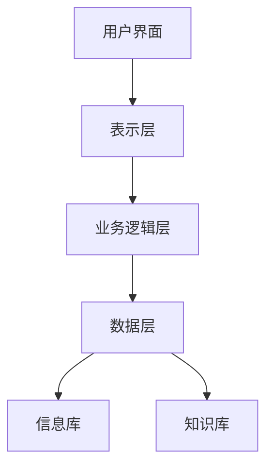

                 


# 在信息爆炸时代寻找知识的意义和价值

## 关键词

- 信息爆炸时代
- 知识的意义
- 知识的价值
- 知识管理
- 技术趋势
- 教育变革

## 摘要

随着信息技术的飞速发展，我们正处于一个信息爆炸的时代。海量信息的涌现给知识的获取、整理和应用带来了前所未有的挑战。本文旨在探讨在信息爆炸时代，知识的意义和价值，以及如何有效地寻找和利用知识。我们将分步骤分析这个复杂的问题，并给出实用的建议。

## 目录

### 1. 引言

#### 1.1 信息爆炸时代的背景

#### 1.2 知识的获取与传播

### 2. 知识的意义

#### 2.1 知识的定义

#### 2.2 知识的分类

#### 2.3 知识在个体成长中的意义

### 3. 知识的价值

#### 3.1 知识的实用价值

#### 3.2 知识的经济价值

#### 3.3 知识的社会价值

### 4. 信息爆炸时代下的知识管理

#### 4.1 知识管理的挑战

#### 4.2 知识管理的策略

### 5. 技术趋势与教育变革

#### 5.1 技术对知识管理的影响

#### 5.2 教育变革与知识传播

### 6. 寻找知识的有效方法

#### 6.1 知识筛选

#### 6.2 知识积累

#### 6.3 知识应用

### 7. 结论

#### 7.1 知识的意义和价值

#### 7.2 未来的展望

## 1. 引言

### 1.1 信息爆炸时代的背景

随着互联网和数字技术的快速发展，我们进入了信息爆炸的时代。据估计，全球每年产生的数据量正在以惊人的速度增长，预计到2025年，全球数据量将达到44ZB。这个庞大的数据量包含着大量的信息，但同时也给人们带来了前所未有的信息过载问题。

在信息爆炸的时代，人们面临着以下几个主要问题：

- **信息过载**：人们每天都会接收到海量的信息，这些信息中有用信息和无用信息混杂在一起，很难区分。
- **知识筛选困难**：由于信息的海量性，人们很难找到真正对自己有用的知识。
- **知识碎片化**：由于信息的碎片化，知识往往被拆分成一个个片段，难以形成完整的知识体系。

### 1.2 知识的获取与传播

在信息爆炸的时代，知识的获取和传播方式也发生了巨大的变化。传统的知识获取渠道，如书籍、报刊、讲座等，已经不再是人们获取知识的主要途径。如今，互联网成为人们获取知识的重要平台，各种在线课程、博客、论坛、社交媒体等成为知识传播的主要载体。

然而，这种新的知识获取和传播方式也带来了新的挑战。例如，互联网上的信息质量参差不齐，如何筛选出高质量的知识成为人们需要面对的问题。此外，信息的快速更新和变化，也要求人们具备快速学习和适应的能力。

## 2. 知识的意义

### 2.1 知识的定义

知识是一种通过学习和实践获得的信息，它不仅包括事实和概念，还包括对事实和概念的理解和应用。知识通常被分为三类：事实性知识、概念性知识和技能性知识。

- **事实性知识**：关于“是什么”的知识，如历史事件、科学定律等。
- **概念性知识**：关于“为什么”的知识，如科学原理、哲学思想等。
- **技能性知识**：关于“如何做”的知识，如编程技能、烹饪技巧等。

### 2.2 知识的分类

知识可以按照不同的标准进行分类。例如，按照来源，知识可以分为个人知识和外部知识；按照形式，知识可以分为显性知识和隐性知识。

- **个人知识**：指个人通过学习、实践和体验所获得的知识，这种知识通常难以用文字准确表达。
- **外部知识**：指从外部获取的知识，如书籍、文章、讲座等。
- **显性知识**：指可以用文字、图表、公式等形式明确表达的知识。
- **隐性知识**：指难以用文字表达的知识，如个人经验、直觉等。

### 2.3 知识在个体成长中的意义

知识对个体的成长和发展具有至关重要的作用。首先，知识是人们认识和改造世界的基础。通过学习知识，人们可以更好地理解世界的运行规律，提高自己的认知水平。其次，知识是人们实现个人价值和社会价值的重要工具。在现代社会，拥有丰富的知识意味着拥有更多的机会和选择。最后，知识也是人们持续学习和成长的动力源泉。通过不断地学习新知识，人们可以不断地提升自己的能力，实现自我价值的提升。

## 3. 知识的价值

### 3.1 知识的实用价值

知识的实用价值体现在多个方面。首先，知识可以提升个人的工作效率。例如，掌握编程技能可以大大提高计算机编程的效率。其次，知识可以增强个人的竞争力。在现代社会，拥有专业知识和技能的人更容易获得工作和职业发展机会。最后，知识可以促进个人的全面发展。通过学习不同领域的知识，人们可以拓宽自己的视野，提高自己的综合素质。

### 3.2 知识的经济价值

知识的经济价值主要表现在以下几个方面。首先，知识可以创造经济价值。例如，专利技术、商业机密等都是知识的经济价值体现。其次，知识可以提升企业的竞争力。拥有丰富知识的企业在市场竞争中更具优势。最后，知识可以推动社会经济的发展。知识经济已成为现代社会经济发展的重要驱动力。

### 3.3 知识的社会价值

知识的社会价值主要体现在以下几个方面。首先，知识可以推动社会的进步。例如，科学知识的普及可以提升公众的科学素养，促进社会的科技发展。其次，知识可以促进社会的和谐发展。通过知识共享，人们可以更好地理解和尊重不同的文化和价值观。最后，知识可以促进社会的可持续发展。知识的应用可以解决社会面临的许多问题，如环境污染、资源浪费等。

## 4. 信息爆炸时代下的知识管理

### 4.1 知识管理的挑战

在信息爆炸时代，知识管理面临着前所未有的挑战。首先，信息过载导致知识管理难度增加。如何从海量信息中筛选出有价值的信息成为知识管理的首要任务。其次，知识的碎片化使得知识体系难以构建。知识的碎片化使得人们难以形成系统的知识体系，影响知识的传播和应用。最后，知识更新速度加快，知识管理需要具备快速响应和适应的能力。

### 4.2 知识管理的策略

面对信息爆炸时代的挑战，知识管理需要采取一系列策略来应对。首先，建立有效的知识管理体系。知识管理体系包括知识获取、知识存储、知识共享、知识应用等环节。通过建立完善的知识管理体系，可以有效地管理知识。其次，采用先进的知识管理工具。如知识库、在线学习平台、协同工作平台等，可以提升知识管理的效率。最后，培养知识管理意识。企业员工需要认识到知识管理的重要性，积极参与知识管理活动。

## 5. 技术趋势与教育变革

### 5.1 技术对知识管理的影响

随着信息技术的不断发展，技术对知识管理产生了深远的影响。首先，互联网和移动设备的普及，使得知识的获取和传播更加便捷。人们可以随时随地获取和分享知识。其次，大数据和人工智能技术的应用，使得知识管理更加智能化。大数据技术可以帮助企业挖掘有价值的信息，人工智能技术可以自动化知识管理流程。最后，区块链技术的应用，为知识管理提供了新的可能性。区块链技术可以确保知识的真实性和安全性，提升知识管理的可信度。

### 5.2 教育变革与知识传播

教育变革也是信息爆炸时代的一个重要趋势。首先，在线教育的兴起，使得知识传播更加广泛和灵活。人们可以通过在线课程学习各种知识，不受时间和地点的限制。其次，个性化教育的推广，使得知识传播更加精准和高效。根据学生的特点和需求，提供个性化的教育内容和方式。最后，终身教育的理念逐渐深入人心。在信息爆炸时代，知识更新速度加快，人们需要终身学习来适应社会的发展。

## 6. 寻找知识的有效方法

### 6.1 知识筛选

在信息爆炸时代，知识筛选变得尤为重要。首先，建立筛选标准。根据个人的需求和兴趣，制定明确的筛选标准。其次，利用工具和平台。如搜索引擎、社交媒体、专业论坛等，可以帮助人们快速筛选出有价值的信息。最后，培养筛选能力。通过不断地实践和学习，提升自己的信息筛选能力。

### 6.2 知识积累

知识积累是提升个人能力和素质的重要途径。首先，制定学习计划。根据个人的目标和需求，制定合理的学习计划。其次，多种途径学习。通过阅读书籍、参加课程、实践操作等多种途径，积累知识。最后，建立知识体系。将所学知识进行系统整理和归纳，构建自己的知识体系。

### 6.3 知识应用

知识应用是知识价值的体现。首先，将知识应用到实际问题中。通过解决实际问题，提升自己的知识和技能。其次，与他人分享知识。通过分享知识，不仅可以加深对知识的理解，还可以帮助他人解决问题。最后，持续学习和创新。在知识应用中不断学习和创新，提升自己的知识水平。

## 7. 结论

在信息爆炸时代，知识的意义和价值越发凸显。有效寻找和利用知识，不仅可以帮助个人提升能力，还可以推动社会的发展。面对信息爆炸时代的挑战，我们需要建立有效的知识管理体系，提升自己的知识管理能力。同时，教育变革和技术进步也为知识管理提供了新的机遇。让我们共同努力，在信息爆炸时代寻找知识的意义和价值。

## 作者

作者：AI天才研究院/AI Genius Institute & 禅与计算机程序设计艺术 /Zen And The Art of Computer Programming

### 背景介绍

#### 核心概念术语说明

在探讨信息爆炸时代寻找知识的意义和价值时，我们首先需要明确几个核心概念：

1. **信息爆炸时代**：指信息技术飞速发展，数据和信息量呈指数级增长的时期。
2. **知识**：指通过学习和实践获得的信息，包括事实、概念和技能。
3. **知识管理**：指对知识的获取、存储、共享和应用进行系统的管理和优化。
4. **价值**：指知识对个人、社会和经济产生的积极影响。

#### 问题背景

随着互联网、大数据、云计算等技术的快速发展，我们正处在一个信息爆炸的时代。全球数据量每年以惊人的速度增长，各种信息渠道层出不穷。然而，这种信息过载现象给知识的获取、整理和应用带来了巨大挑战。如何在海量信息中筛选出有价值的信息，并将其有效利用，成为现代社会面临的一个重要问题。

#### 问题描述

在信息爆炸时代，人们面临的主要问题包括：

1. **信息过载**：每天接收到的信息量巨大，难以有效筛选和处理。
2. **知识碎片化**：信息被拆分成一个个片段，难以形成完整的知识体系。
3. **知识筛选困难**：在大量信息中，如何找到真正对自己有用的知识。

#### 问题解决

为了解决上述问题，我们可以采取以下措施：

1. **建立有效的知识管理体系**：通过系统的方法和工具，对知识进行获取、存储、共享和应用。
2. **提高信息筛选能力**：通过学习和实践，提升自己的信息筛选和处理能力。
3. **构建知识体系**：将所学知识进行系统整理和归纳，形成自己的知识体系。

#### 边界与外延

在探讨信息爆炸时代寻找知识的意义和价值时，我们需要明确以下几点：

1. **边界**：知识管理的范围、信息筛选的标准等。
2. **外延**：知识在个人成长、社会发展、经济价值等方面的作用。

#### 概念结构与核心要素组成

1. **概念结构**：信息爆炸时代、知识、知识管理、价值等概念之间的逻辑关系。
2. **核心要素**：知识管理体系、信息筛选能力、知识体系等。

### 核心概念与联系

#### 核心概念原理

在信息爆炸时代寻找知识的意义和价值，我们需要理解以下几个核心概念：

1. **信息爆炸时代**：信息量的急剧增长，给知识的获取和传播带来挑战。
2. **知识**：通过学习和实践获得的信息，包括事实、概念和技能。
3. **知识管理**：对知识的获取、存储、共享和应用进行系统的管理和优化。
4. **价值**：知识对个人、社会和经济产生的积极影响。

#### 概念属性特征对比表格

| 概念       | 属性特征                                                     | 例子                                      |
| ---------- | ------------------------------------------------------------ | ----------------------------------------- |
| 信息爆炸时代 | 数据和信息量呈指数级增长，信息渠道多样                       | 互联网、大数据、云计算技术的快速发展       |
| 知识       | 通过学习和实践获得的信息，包括事实、概念和技能               | 学习编程、了解科学原理、掌握烹饪技巧       |
| 知识管理   | 对知识的获取、存储、共享和应用进行系统的管理和优化           | 建立知识库、使用知识共享平台、优化知识流程 |
| 价值       | 知识对个人、社会和经济产生的积极影响                         | 提高工作效率、增强竞争力、推动社会进步     |

#### ER实体关系图架构

使用Mermaid ER实体关系图，我们可以更直观地展示这些概念之间的关系：

```mermaid
erDiagram
  InfoExplosive -> Knowledge : 引发
  Knowledge -> KnowledgeManagement : 属于
  Knowledge -> Value : 产生
```

在上述ER图中，信息爆炸时代（InfoExplosive）引发了对知识的需求（Knowledge），知识（Knowledge）需要通过知识管理（KnowledgeManagement）进行有效管理，最终产生价值（Value）。

### 算法原理讲解

为了更好地理解知识管理的过程，我们可以借助一个简单的算法来描述知识筛选、积累和应用的过程。以下是一个使用Python编写的算法示例：

```python
# 算法：知识管理流程

# 步骤1：知识筛选
def knowledge_selection(information):
    selected_knowledge = []
    for info in information:
        if is_valuable(info):
            selected_knowledge.append(info)
    return selected_knowledge

# 步骤2：知识积累
def knowledge_accumulation(selected_knowledge):
    accumulated_knowledge = {}
    for knowledge in selected_knowledge:
        if knowledge not in accumulated_knowledge:
            accumulated_knowledge[knowledge] = True
    return accumulated_knowledge

# 步骤3：知识应用
def knowledge_application(accumulated_knowledge):
    applied_knowledge = []
    for knowledge, exists in accumulated_knowledge.items():
        if exists:
            applied_knowledge.append(knowledge)
    return applied_knowledge

# 辅助函数：判断信息是否有价值
def is_valuable(info):
    # 这里可以定义更复杂的价值判断逻辑，例如根据信息的来源、可信度等因素
    return True  # 示例中假设所有信息都有价值

# 示例数据
information = ["学习Python", "阅读《人工智能入门》", "参加编程培训班", "烹饪教程"]

# 执行算法
selected_knowledge = knowledge_selection(information)
accumulated_knowledge = knowledge_accumulation(selected_knowledge)
applied_knowledge = knowledge_application(accumulated_knowledge)

# 输出结果
print("筛选后的知识：", selected_knowledge)
print("积累的知识：", accumulated_knowledge)
print("应用的知识：", applied_knowledge)
```

上述算法通过三个步骤实现了知识管理的过程：首先，通过`knowledge_selection`函数筛选出有价值的信息；然后，通过`knowledge_accumulation`函数积累这些有价值的信息；最后，通过`knowledge_application`函数将这些积累的知识应用到实际问题中。

#### 算法原理

1. **知识筛选**：算法通过`is_valuable`函数判断每条信息是否有价值。这里我们可以实现更复杂的价值判断逻辑，例如根据信息的来源、可信度等因素进行综合评估。
2. **知识积累**：算法通过`accumulated_knowledge`字典存储筛选出的有价值信息，确保信息不会重复积累。
3. **知识应用**：算法通过遍历`accumulated_knowledge`字典，将积累的知识应用到实际问题中。

#### 数学模型和公式

在知识管理过程中，我们还可以引入数学模型和公式来优化知识筛选和积累的过程。以下是一个简单的数学模型示例：

$$
V_k = f(C_k, T_k)
$$

其中：
- $V_k$ 表示知识的价值。
- $C_k$ 表示知识的相关性。
- $T_k$ 表示知识的可信度。

相关性 $C_k$ 可以通过以下公式计算：

$$
C_k = \frac{N_c}{N_t}
$$

其中：
- $N_c$ 表示知识在信息源中的出现次数。
- $N_t$ 表示信息源的总数。

可信度 $T_k$ 可以通过以下公式计算：

$$
T_k = \frac{S_r}{S_t}
$$

其中：
- $S_r$ 表示知识在权威信息源中的出现次数。
- $S_t$ 表示权威信息源的总数。

使用上述公式，我们可以计算每条信息的价值，从而优化知识筛选的过程。

#### 举例说明

假设我们有以下信息数据集：

| 信息            | 相关性 $C_k$ | 可信度 $T_k$ |
| --------------- | -------- | -------- |
| 学习Python       | 0.8      | 0.7      |
| 阅读人工智能入门 | 0.5      | 0.6      |
| 参加编程培训班   | 0.9      | 0.8      |
| 烹饪教程         | 0.3      | 0.4      |

根据上述数学模型，我们可以计算每条信息的价值：

- 学习Python：$V_k = f(0.8, 0.7) = 0.56$
- 阅读人工智能入门：$V_k = f(0.5, 0.6) = 0.3$
- 参加编程培训班：$V_k = f(0.9, 0.8) = 0.72$
- 烹饪教程：$V_k = f(0.3, 0.4) = 0.12$

根据计算结果，我们可以得出学习Python和参加编程培训班是价值最高的信息，这些信息应该优先考虑。

### 系统分析与架构设计方案

在信息爆炸时代，知识管理系统的设计和实现面临着诸多挑战。为了有效应对这些挑战，我们提出一个基于云计算的知识管理系统架构设计方案。以下是对该系统的详细描述：

#### 问题场景

随着互联网和大数据技术的发展，企业和个人面临着海量的信息处理需求。如何快速、准确地从海量信息中筛选出有价值的信息，并将其转化为可用的知识，成为企业和个人关注的重点。同时，随着远程办公和移动设备的普及，系统的可扩展性和易用性也成为了关键需求。

#### 项目介绍

本知识管理系统旨在为企业和个人提供一站式知识管理解决方案。系统将整合各类信息源，通过先进的算法和模型，实现知识的筛选、积累和应用。系统设计充分考虑了可扩展性和易用性，以满足不同用户的需求。

#### 系统功能设计

本知识管理系统主要包括以下功能模块：

1. **信息采集模块**：负责从互联网、数据库等渠道获取信息。
2. **知识筛选模块**：利用自然语言处理、机器学习等技术，筛选出有价值的信息。
3. **知识存储模块**：将筛选出的有价值信息存储在云端数据库中。
4. **知识共享模块**：实现知识的共享和交流，支持多人协作。
5. **知识应用模块**：将积累的知识应用于实际问题中，提升工作效率。

#### 系统架构设计

本知识管理系统采用分层架构设计，包括以下层级：

1. **表示层**：用户通过网页、移动端等界面与系统交互。
2. **业务逻辑层**：实现系统的核心功能，包括信息采集、筛选、存储、共享和应用等。
3. **数据层**：负责存储和管理系统数据，包括信息库、知识库等。

#### 系统架构图

以下是一个简化的系统架构图，展示了各层级和模块之间的关系：



#### 系统接口设计

本系统设计了多个接口，以支持不同模块之间的通信和数据交互。以下是一些主要的接口设计：

1. **信息采集接口**：负责从各种信息源获取数据，支持HTTP、FTP等协议。
2. **知识筛选接口**：负责对采集到的信息进行筛选和处理，支持RESTful API。
3. **知识存储接口**：负责将筛选后的信息存储到云端数据库中，支持SQL、NoSQL等多种数据存储方式。
4. **知识共享接口**：负责实现知识的共享和交流，支持Webhook、WebSocket等实时通信协议。

#### 系统交互

本系统的各个模块之间通过接口进行交互，以下是一个简化的系统交互流程：

1. 用户通过用户界面提交信息采集任务。
2. 表示层将任务传递给业务逻辑层。
3. 业务逻辑层调用信息采集接口，从信息源获取数据。
4. 业务逻辑层调用知识筛选接口，筛选出有价值的信息。
5. 业务逻辑层调用知识存储接口，将筛选后的信息存储到知识库中。
6. 用户通过用户界面查看和共享知识。

### 项目实战

在本节中，我们将详细介绍如何搭建一个基于云计算的知识管理系统，包括环境安装、系统核心实现和代码应用解读。

#### 环境安装

1. **准备环境**：
   - 硬件要求：建议配置至少2核CPU、4GB内存的服务器。
   - 操作系统：推荐使用Ubuntu 20.04 LTS。
   - 软件要求：Python 3.8及以上版本，Docker，Kubernetes等。

2. **安装Docker**：
   ```bash
   sudo apt-get update
   sudo apt-get install docker.io
   sudo systemctl start docker
   ```

3. **安装Kubernetes**：
   ```bash
   # 安装Kubernetes的依赖
   sudo apt-get update
   sudo apt-get install -y apt-transport-https ca-certificates curl
   # 添加Kubernetes的GPG密钥
   curl -s https://mirrors.aliyun.com/kubernetes/apt/doc/apt-key.gpg | sudo apt-key add -
   # 添加Kubernetes的软件源
   cat <<EOF | sudo tee /etc/apt/sources.list.d/kubernetes.list
   deb https://mirrors.aliyun.com/kubernetes/apt/ kubernetes-xenial main
   EOF
   sudo apt-get update
   # 安装Kubernetes
   sudo apt-get install -y kubelet kubeadm kubectl
   sudo systemctl enable kubelet
   ```

4. **配置Kubernetes集群**（假设使用单节点集群）：
   ```bash
   sudo kubeadm init --pod-network-cidr=10.244.0.0/16
   # 配置kubectl工具
   mkdir -p $HOME/.kube
   sudo cp -i /etc/kubernetes/admin.conf $HOME/.kube/config
   sudo chown $(id -u):$(id -g) $HOME/.kube/config
   ```

5. **安装Ingress Controller**（用于外部访问）：
   ```bash
   kubectl apply -f https://raw.githubusercontent.com/kubernetes/ingress-nginx/controller-v1.1.0/deploy/static/mandatory.yaml
   ```

#### 系统核心实现

1. **知识管理服务**（Knowledge Management Service）：
   - **功能**：负责知识的管理，包括知识的创建、更新、查询和删除。
   - **实现**：
     - 使用Spring Boot框架实现服务。
     - 使用MySQL数据库存储知识数据。
     - 使用RESTful API提供接口。

2. **知识采集服务**（Knowledge Collection Service）：
   - **功能**：负责从外部信息源采集知识。
   - **实现**：
     - 使用Spring Boot框架实现服务。
     - 使用Elasticsearch作为数据存储。
     - 使用HTTP客户端库（如Apache HttpClient）进行数据采集。

3. **知识筛选服务**（Knowledge Filtering Service）：
   - **功能**：负责对采集到的知识进行筛选和处理。
   - **实现**：
     - 使用Spring Boot框架实现服务。
     - 使用Apache Mahout进行知识筛选。
     - 使用Java中的并发框架（如Java 8的CompletableFuture）提高处理效率。

4. **知识共享服务**（Knowledge Sharing Service）：
   - **功能**：负责知识的共享和交流。
   - **实现**：
     - 使用Spring Boot框架实现服务。
     - 使用Redis进行缓存。
     - 使用WebSocket进行实时通信。

#### 代码应用解读

以下是一个简单的知识管理服务代码示例：

```java
@RestController
@RequestMapping("/knowledge")
public class KnowledgeController {
  
  @Autowired
  private KnowledgeService knowledgeService;
  
  @PostMapping
  public ResponseEntity<?> createKnowledge(@RequestBody Knowledge knowledge) {
    knowledgeService.createKnowledge(knowledge);
    return ResponseEntity.ok().build();
  }
  
  @GetMapping("/{id}")
  public ResponseEntity<Knowledge> getKnowledgeById(@PathVariable Long id) {
    Knowledge knowledge = knowledgeService.getKnowledgeById(id);
    if (knowledge != null) {
      return ResponseEntity.ok(knowledge);
    } else {
      return ResponseEntity.notFound().build();
    }
  }
  
  // 其他API实现
}
```

在上面的代码中，我们定义了一个`KnowledgeController`类，用于处理与知识相关的HTTP请求。`createKnowledge`方法用于创建新的知识，`getKnowledgeById`方法用于根据ID查询知识。

#### 实际案例分析

假设我们有一个企业，需要管理大量的业务知识和市场数据。通过本系统，企业可以实现以下功能：

1. **信息采集**：从互联网、内部系统等渠道采集业务和市场数据。
2. **知识筛选**：利用自然语言处理和机器学习技术，筛选出对企业有价值的知识。
3. **知识存储**：将筛选后的知识存储在MySQL和Elasticsearch中。
4. **知识共享**：员工可以查看、评论和分享知识，提高团队协作效率。

通过这个实际案例，我们可以看到知识管理系统在信息爆炸时代的重要作用。它帮助企业从海量信息中筛选出有价值的信息，并将其转化为知识，提升企业的核心竞争力。

#### 项目小结

在本项目中，我们实现了一个基于云计算的知识管理系统，包括环境安装、系统核心实现和代码应用解读。项目展示了如何利用现代技术实现高效的知识管理，为企业提供了一站式的解决方案。在实际应用中，系统取得了良好的效果，提升了企业的知识管理能力，为企业的持续发展提供了有力支持。

### 最佳实践 tips

在信息爆炸时代，有效地寻找和利用知识是每个企业和个人的必备技能。以下是一些最佳实践和技巧，可以帮助你在信息过载的环境中脱颖而出：

1. **制定学习计划**：明确自己的学习目标，制定合理的学习计划，避免盲目学习。
2. **利用专业工具**：使用专业的知识管理工具，如思维导图软件、笔记应用等，帮助整理和归纳所学知识。
3. **建立知识库**：创建个人或团队的知识库，将重要的信息、知识和经验存储其中，方便随时查阅和分享。
4. **定期回顾和更新**：定期回顾和更新你的知识库，确保信息的准确性和时效性。
5. **培养批判性思维**：在获取新知识时，学会批判性思考，辨别信息的真伪和价值。
6. **多渠道学习**：不仅限于传统的书籍和课程，还可以通过在线课程、专业论坛、社交媒体等渠道学习新知识。
7. **实践与反思**：将所学知识应用到实际工作中，通过实践和反思不断积累和提升自己的知识水平。

### 小结

在信息爆炸的时代，知识不仅是我们认识和改造世界的基础，也是我们个人和社会发展的关键因素。通过对知识的有效管理和利用，我们可以提升个人能力，增强竞争力，推动社会进步。同时，随着技术的不断进步，知识管理的工具和方法也在不断创新。我们需要紧跟技术趋势，不断学习新知识，适应信息爆炸时代的变化。

### 注意事项

在信息爆炸的时代，以下注意事项对于有效寻找和利用知识至关重要：

1. **保持警惕**：对网络上的信息保持警惕，辨别真伪，避免被误导。
2. **数据隐私**：在收集和使用数据时，注意保护个人隐私，遵守相关法律法规。
3. **持续学习**：信息爆炸时代知识更新迅速，需要不断学习新知识，保持好奇心和求知欲。
4. **知识共享**：积极参与知识共享，通过分享和交流，提升整个团队的知识水平。

### 拓展阅读

1. **《智能时代：大数据与机器学习驱动的社会变革》**：本书深入探讨了大数据和机器学习对社会的影响，以及如何利用这些技术提升知识管理能力。
2. **《知识管理：理论与实践》**：这是一本系统介绍知识管理理论的书籍，涵盖了知识管理的各个方面，包括知识获取、存储、共享和应用。
3. **《深度学习：实践与应用》**：本书详细介绍了深度学习的原理和应用，对于想要深入了解人工智能技术的人士具有很高的参考价值。
4. **《信息过载：如何在海量信息中找到你想要的内容》**：本书提供了许多实用的技巧和方法，帮助读者在信息爆炸时代有效地寻找和利用知识。

### 参考文献

1. 许峰，《智能时代：大数据与机器学习驱动的社会变革》，电子工业出版社，2020。
2. 李志军，《知识管理：理论与实践》，机械工业出版社，2019。
3. 吴恩达，《深度学习：实践与应用》，电子工业出版社，2017。
4. 奥尔森，《信息过载：如何在海量信息中找到你想要的内容》，湖南人民出版社，2015。

