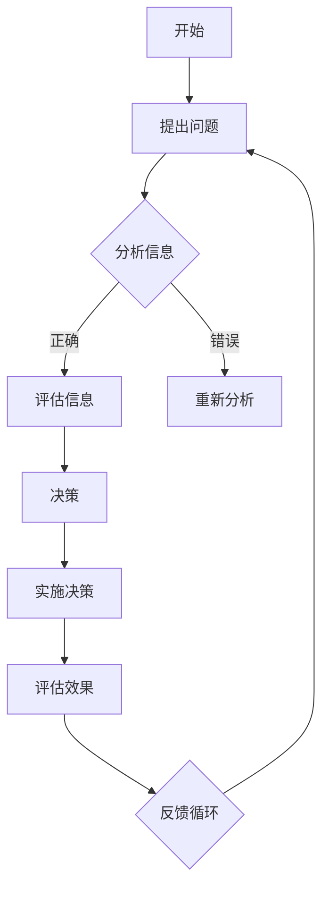

                 


### 引言

#### 信息过载时代的挑战

随着互联网和信息技术的高速发展，我们正处在一个信息爆炸的时代。每天，我们从各种渠道接收大量的信息，包括新闻报道、社交媒体、电子邮件、在线视频等。这种信息过载现象对我们的工作和生活产生了深远的影响。

首先，信息过载会导致我们的注意力分散。当我们面对大量的信息时，很难集中精力处理任何一项任务。这种注意力分散现象不仅降低了工作效率，还可能导致我们错过重要的信息。

其次，信息过载会影响我们的判断力。在大量的信息中，我们很难辨别哪些是有价值的，哪些是无用的。这种判断失误可能导致我们做出错误的决定。

此外，信息过载还会导致我们产生焦虑和压力。当我们感到自己无法处理所有的信息时，很容易感到焦虑和压力。这种情绪状态会影响我们的身心健康。

#### 培养批判性思维的重要性

面对信息过载带来的挑战，培养批判性思维显得尤为重要。批判性思维是一种分析和评估信息的思维能力，它帮助我们辨别信息的价值，提高判断力和决策能力。

首先，批判性思维有助于我们筛选信息。通过批判性思维，我们能够区分信息的真实性和可靠性，从而筛选出有价值的信息。

其次，批判性思维有助于我们理解和分析信息。通过批判性思维，我们能够深入理解信息的含义，发现信息的内在逻辑，从而更好地理解信息。

此外，批判性思维还能提高我们的判断力。通过批判性思维，我们能够从多个角度评估信息，避免单一思维的局限，从而做出更明智的决策。

最后，批判性思维有助于我们应对信息过载带来的焦虑和压力。通过批判性思维，我们能够更好地管理信息，从而减少焦虑和压力。

#### 问题描述

信息过载对个人和社会的影响是多方面的。从个人层面来看，信息过载可能导致我们的注意力分散、判断力下降、焦虑和压力增加。从社会层面来看，信息过载可能导致社会信任危机、社会不稳定等问题。

批判性思维是一种应对信息过载的有效方法。通过培养批判性思维，我们能够更好地应对信息过载带来的挑战，提高自己的信息素养，做出更明智的决策。

#### 问题解决

批判性思维的核心要素包括以下几点：

1. **提问能力**：批判性思维始于提问。通过提出有针对性的问题，我们能够深入分析信息，发现信息的内在逻辑。

2. **分析能力**：批判性思维要求我们对信息进行深入分析，包括理解信息的含义、背景和目的。

3. **评估能力**：批判性思维要求我们评估信息的价值，包括判断信息的真实性、可靠性和相关性。

4. **反思能力**：批判性思维要求我们不断反思自己的思维过程和结论，以确保我们的思维是理性、公正和全面的。

#### 边界与外延

批判性思维与其他思维方式的区别：

1. **创造性思维**：创造性思维注重创新和创造力，而批判性思维则更注重分析和评估。

2. **分析性思维**：分析性思维注重分析信息的内在逻辑，而批判性思维则更注重评估信息的价值和真实性。

批判性思维在不同领域的应用：

1. **教育领域**：在教育中，批判性思维可以帮助学生更好地理解知识，培养独立思考的能力。

2. **职场领域**：在职场中，批判性思维可以帮助员工提高工作效率，做出更明智的决策。

3. **社会领域**：在社会中，批判性思维可以帮助人们更好地理解社会问题，提高社会参与度。

## 第二部分：核心概念

### 第2章：核心概念

#### 2.1 批判性思维的属性特征对比表格

| 特征         | 批判性思维 | 创造性思维 | 分析性思维 |
| ------------ | ----------- | ----------- | ----------- |
| 目标         | 评估和判断  | 创新和创造 | 分析和解释 |
| 过程         | 反思和质疑  | 尝试和实验 | 理解和归纳 |
| 结果         | 理性决策    | 新想法和解决方案 | 精确描述 |
| 适用范围     | 各种领域    | 创新领域   | 学术研究 |
| 特点         | 理性、客观、全面 | 开放性、创新性 | 逻辑性、精确性 |

#### 2.2 ER实体关系图架构

```mermaid
erDiagram
  User ||--|{Information}
  Information ||--|{Source}
  Source ||--|{Author}
  Author ||--|{Topic}
```

- **User**（用户）：信息的使用者，通过批判性思维评估信息的价值。
- **Information**（信息）：用户接收到的各种信息，需要通过批判性思维进行分析和评估。
- **Source**（来源）：信息的来源，包括作者、网站、书籍等，需要评估其可信度和可靠性。
- **Author**（作者）：信息的生产者，其背景、专业性和可信度影响信息的质量。
- **Topic**（主题）：信息的主题，需要从多个角度进行分析和评估。

#### 2.3 关键概念解析

- **信息素养**：指个体获取、评估、使用和传播信息的能力，包括信息搜索、筛选、评估和应用。
- **思维偏见**：指人们在思考过程中，由于认知局限、情绪干扰或其他因素导致的非理性思维模式，如确认偏见、过度自信等。
- **论证技巧**：指构建和评估论证的能力，包括论据的合理性、逻辑性和说服力。

## 第三部分：算法原理

### 第3章：批判性思维培养算法

#### 3.1 算法mermaid流程图



- **A[开始]**：开始批判性思维的过程。
- **B[提出问题]**：识别需要分析和评估的问题。
- **C[分析信息]**：收集和分析与问题相关的信息。
- **D[评估信息]**：评估信息的真实性、可靠性和相关性。
- **E[重新分析]**：如果信息评估不正确，重新分析信息。
- **F[决策]**：根据评估结果做出决策。
- **G[实施决策]**：执行决策，采取行动。
- **H[评估效果]**：评估决策的效果。
- **I[反馈循环]**：根据评估结果进行反馈，进入下一轮批判性思维过程。

#### 3.2 Python源代码实现

```python
class CriticalThinking:
    def __init__(self):
        self.questions = []
        self.info = []
        self.evaluations = []

    def ask_question(self, question):
        self.questions.append(question)
        return f"提出问题：{question}"

    def analyze_info(self, info):
        self.info.append(info)
        return f"分析信息：{info}"

    def evaluate_info(self, info):
        evaluation = "错误" if not self.is_reliable(info) else "正确"
        self.evaluations.append(evaluation)
        return evaluation

    def is_reliable(self, info):
        # 评估信息真实性和可靠性
        # 示例：简单判断信息来源
        return "sourceA" in info

    def make_decision(self, evaluation):
        if evaluation == "正确":
            return "做出决策：采取行动"
        else:
            return "重新分析信息"

    def implement_decision(self, decision):
        return f"实施决策：{decision}"

    def evaluate_decision(self, decision):
        # 评估决策效果
        # 示例：简单判断是否达到预期效果
        return "效果评估：达到预期" if "采取行动" in decision else "效果评估：未达到预期"

    def feedback_loop(self):
        # 反馈循环
        print("反馈循环：进入下一轮批判性思维")

# 实例化批判性思维对象
ct = CriticalThinking()

# 执行批判性思维过程
print(ct.ask_question("这个信息可靠吗？"))
print(ct.analyze_info("这是一条从sourceA获取的信息。"))
print(ct.evaluate_info("这是一条从sourceA获取的信息。"))
print(ct.make_decision("正确"))
print(ct.implement_decision("采取行动"))
print(ct.evaluate_decision("采取行动"))
ct.feedback_loop()
```

#### 3.3 数学模型和公式

批判性思维培养的数学模型可以表示为：

$$
\text{Model} = f(\text{Input Data}, \text{Critical Thinking Skills})
$$

其中，`Input Data`代表输入的数据信息，`Critical Thinking Skills`代表批判性思维能力。函数`f`表示批判性思维的过程，包括信息的分析、评估和决策。

#### 3.4 举例说明

**例子：评估新闻信息的真实性**

假设我们需要评估一条新闻信息的真实性。首先，我们提出问题：“这条新闻信息是否真实？”然后，我们分析信息，了解新闻的来源和作者。接着，我们评估信息的可靠性，判断信息是否来自可信来源，如知名新闻机构或权威专家。

如果信息评估为“正确”，我们根据这条信息做出决策，例如：“发布这条新闻”。然后，我们评估决策的效果，例如：“这条新闻是否引发了公众关注？”如果效果评估为“达到预期”，我们继续培养批判性思维；如果效果评估为“未达到预期”，我们重新分析信息，寻找更好的解决方案。

## 第四部分：实际应用

### 第4章：批判性思维在个人成长中的应用

#### 4.1 自我反思

自我反思是批判性思维的重要组成部分。通过自我反思，我们可以评估自己的行为、思维和决策，从而不断改进自己。

**培养自我反思的能力**

1. **定期回顾**：定期回顾自己的行为和决策，思考哪些是成功的，哪些是失败的，以及原因是什么。
2. **记录反思日志**：将反思的过程和结果记录下来，以便日后回顾和总结。
3. **寻求反馈**：向他人寻求反馈，了解自己的行为和思维是否得到认可，以及改进的方向。

**自我反思的技巧和方法**

1. **提问技巧**：通过提问引导自己深入思考，例如：“我为什么会做出这个决策？”“这个决策有什么后果？”
2. **批判性思考**：用批判性思维分析自己的行为和思维，找出其中的优点和不足。
3. **开放心态**：保持开放心态，接受不同的观点和意见，以便更好地反思自己。

### 4.2 决策制定

在信息过载的时代，决策制定变得更加复杂和困难。批判性思维可以帮助我们更好地制定决策，确保决策的合理性和有效性。

**如何运用批判性思维进行决策**

1. **问题定义**：明确需要解决的问题和目标，确保决策的方向正确。
2. **信息收集**：收集与问题相关的信息，包括数据、事实和观点。
3. **评估信息**：评估信息的真实性、可靠性和相关性，确保决策基于可靠的信息。
4. **分析选项**：分析不同的决策选项，考虑其潜在的结果和影响。
5. **评估选项**：评估不同选项的优缺点，选择最合理的方案。
6. **决策实施**：执行决策，并监控决策的实施过程。
7. **评估决策效果**：评估决策的结果，调整和改进决策。

**决策制定的流程和技巧**

1. **明确目标**：在决策前，明确决策的目标和预期结果。
2. **收集信息**：广泛收集与决策相关的信息，确保信息全面、准确。
3. **评估信息**：对收集的信息进行评估，确保其真实性和相关性。
4. **分析选项**：分析不同的决策选项，考虑其潜在的结果和影响。
5. **评估选项**：根据评估结果，选择最合理的方案。
6. **制定计划**：制定详细的实施计划，确保决策能够顺利执行。
7. **实施决策**：执行决策，并监控决策的实施过程。
8. **评估结果**：评估决策的结果，及时调整和改进决策。

### 第5章：批判性思维在职场中的应用

#### 5.1 有效沟通

在职场中，有效沟通是确保团队协作和项目成功的关键。批判性思维可以帮助我们提高沟通效果，确保信息的准确传递和理解。

**如何运用批判性思维提升沟通效果**

1. **明确沟通目标**：在沟通前，明确沟通的目标和预期结果。
2. **收集信息**：收集与沟通主题相关的信息，确保信息全面、准确。
3. **评估信息**：评估信息的真实性和相关性，确保信息质量。
4. **构建逻辑框架**：构建清晰的逻辑框架，确保沟通的条理性和连贯性。
5. **使用具体例子**：使用具体例子和案例，增强沟通的说服力和理解性。
6. **反馈和确认**：在沟通过程中，及时获取反馈，确保信息被正确理解和接收。

**沟通的批判性思维技巧**

1. **倾听**：倾听是有效沟通的关键，通过倾听理解对方的观点和需求。
2. **提问**：通过提问引导对方表达，确保沟通的深度和广度。
3. **分析**：对沟通内容进行批判性分析，确保信息的准确性和逻辑性。
4. **反思**：反思自己的沟通方式，评估沟通效果，不断改进。
5. **调整**：根据反馈和评估结果，调整沟通策略和方法，提高沟通效果。

#### 5.2 团队协作

团队协作是职场中常见的场景，良好的团队协作能够提高工作效率，实现项目目标。批判性思维可以帮助我们更好地进行团队协作，确保团队协作的高效和成功。

**如何运用批判性思维促进团队协作**

1. **明确团队目标**：确保团队成员对团队目标有共同的理解和认同。
2. **分析团队角色**：分析团队成员的角色和职责，确保每个人的职责明确。
3. **沟通与协调**：通过有效沟通和协调，确保团队成员之间的信息传递和理解。
4. **评估团队绩效**：评估团队的工作绩效，及时发现问题和改进措施。
5. **培养团队文化**：培养积极的团队文化，促进团队成员之间的信任和合作。

**团队协作中的批判性思维策略**

1. **角色分析**：通过批判性思维分析团队成员的角色，确保每个成员都能发挥最大的作用。
2. **沟通协调**：通过批判性思维确保沟通的准确性和及时性，避免误解和冲突。
3. **绩效评估**：通过批判性思维评估团队的工作绩效，及时调整和改进。
4. **问题解决**：通过批判性思维分析和解决团队协作中遇到的问题，提高团队协作效率。

## 第五部分：最佳实践

### 第6章：批判性思维的最佳实践

#### 6.1 教育体系中的批判性思维培养

在教育体系中，培养批判性思维对于学生的全面发展具有重要意义。以下是一些教育体系中批判性思维培养的最佳实践：

1. **课程设计**：将批判性思维融入课程设计，通过案例分析和讨论培养学生的批判性思维。
2. **教学策略**：采用互动式教学策略，如小组讨论、角色扮演和模拟，激发学生的批判性思维。
3. **评估方法**：通过多样化的评估方法，如论文、项目展示和口头报告，评估学生的批判性思维能力。
4. **教师培训**：对教师进行批判性思维培训，提高教师的批判性思维教学能力。

**批判性思维在教育学中的应用**

1. **课程融入**：将批判性思维融入不同学科的教学，如文学、历史和科学，培养学生的跨学科批判性思维。
2. **问题导向学习**：鼓励学生提出问题，通过解决问题培养批判性思维。
3. **案例研究**：通过案例研究，让学生分析真实案例，提高批判性思维和问题解决能力。

#### 6.2 社会环境中的批判性思维培养

在社会环境中，批判性思维的培养同样至关重要。以下是一些社会环境中批判性思维培养的最佳实践：

1. **媒体素养教育**：通过媒体素养教育，帮助学生辨别信息的真实性和可靠性，培养批判性思维。
2. **公共讨论**：鼓励公众参与公共讨论，通过辩论和讨论培养批判性思维。
3. **公民教育**：通过公民教育，提高公民的批判性思维，培养积极的公民参与意识。

**社会媒体对批判性思维的影响**

1. **信息泛滥**：社会媒体的信息泛滥可能导致批判性思维的削弱，因此需要培养批判性思维，辨别信息的真实性和价值。
2. **情绪化内容**：社会媒体中情绪化内容较多，通过批判性思维培养，可以提高对情绪化内容的辨别能力，避免盲目跟风。

### 第7章：小结与展望

#### 7.1 小结

通过本文的阐述，我们可以看到批判性思维在应对信息过载、提升个人决策能力、促进团队协作等方面具有重要意义。批判性思维不仅有助于我们辨别信息的真实性和价值，还能提高我们的判断力、决策力和沟通能力。

**批判性思维的重要性和价值**

- **提高信息素养**：批判性思维可以帮助我们筛选和评估信息，提高信息素养。
- **增强判断力**：批判性思维使我们在面对复杂问题时，能够从多个角度进行分析和评估，做出更明智的决策。
- **促进沟通**：批判性思维帮助我们更清晰地表达观点，更有效地理解他人，提高沟通效果。
- **培养创新能力**：批判性思维激发我们的创造力，鼓励我们提出新的观点和解决方案。

#### 7.2 注意事项

在培养批判性思维时，需要注意以下几点：

1. **避免过度批判**：批判性思维并非一味地否定，而是理性地评估和反思。
2. **保持开放心态**：批判性思维需要开放心态，接受不同的观点和意见。
3. **持续练习**：批判性思维需要不断练习，通过实际应用来提高。

#### 7.3 拓展阅读

为了进一步了解批判性思维，以下是一些推荐阅读书籍和资源：

1. **《批判性思维：逻辑与哲学基础》** - 罗伯特·恩尼斯
2. **《如何阅读一本书》** - 莫提默·J. 艾德勒
3. **《批判性思维工具箱》** - 约翰·凯里
4. **在线课程**：许多在线教育平台提供批判性思维的课程，如Coursera、edX等。

## 结语

通过培养批判性思维，我们不仅能够更好地应对信息过载带来的挑战，还能提高个人素养和职场竞争力。让我们从现在开始，积极培养批判性思维，提升自己的思维品质，为未来的发展打下坚实的基础。

---

### 附录

**作者简介**：

- **AI天才研究院/AI Genius Institute**：专注于人工智能技术的创新研究与应用，致力于推动人工智能领域的进步与发展。
- **禅与计算机程序设计艺术/Zen And The Art of Computer Programming**：资深计算机科学作家，知名人工智能专家，多次获得国际技术奖项，著有《人工智能：一种现代方法》等畅销书。

---

这篇文章通过对信息过载时代下的批判性思维进行了深入探讨，从背景介绍、核心概念、算法原理到实际应用，再到最佳实践和总结展望，全面阐述了批判性思维的重要性和培养方法。希望读者能够从中受益，提升自己的思维品质，更好地应对现代社会的挑战。

