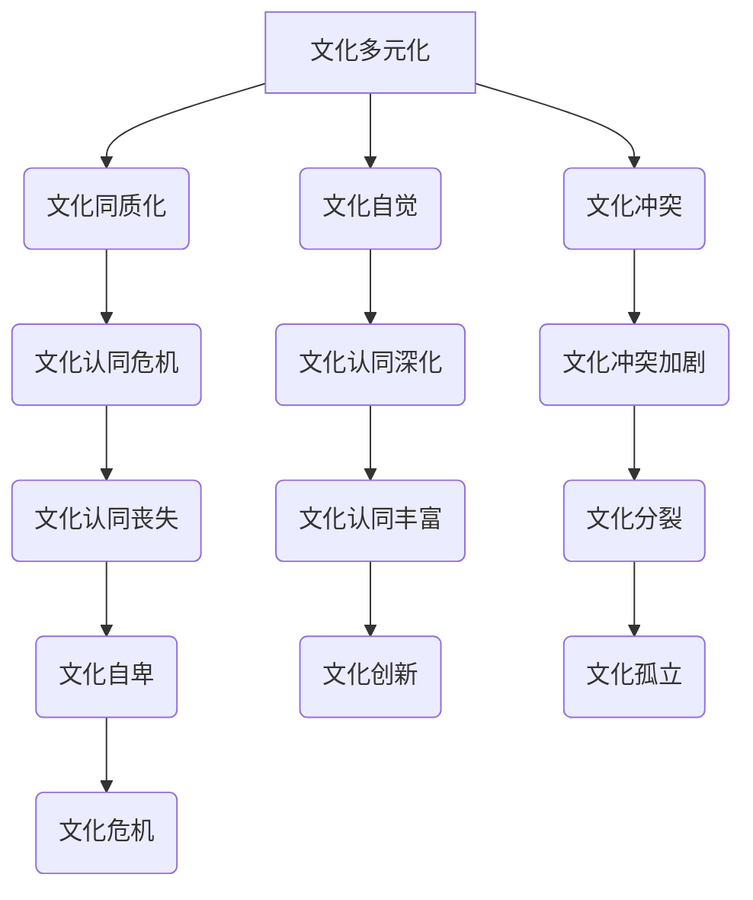
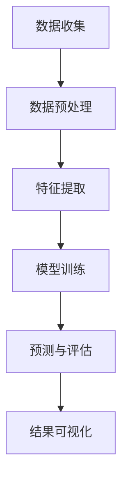
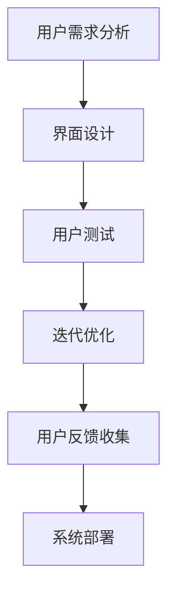
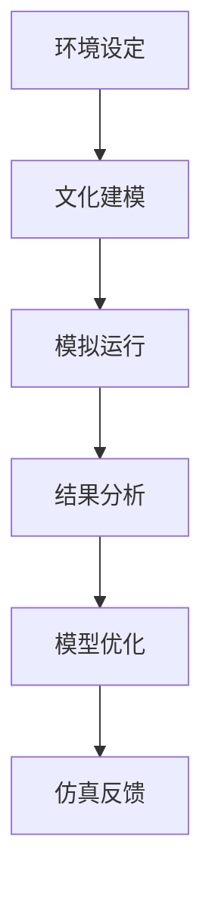

                 

# 在全球化时代寻找文化认同：克服身份危机

## 摘要

在全球化时代的浪潮中，文化交融带来了丰富的机遇，但同时也让身份认同面临前所未有的挑战。本文旨在探讨全球化背景下个人、群体及国家如何应对文化认同危机，并提出了维持和发展文化认同的策略。通过对全球化对身份认同的影响、个人层面的文化认同、群体层面的文化认同、国家层面的文化认同以及跨文化沟通与合作等方面的深入分析，本文试图为读者提供一份关于如何在全球化时代中找到文化认同、克服身份危机的指南。

## 第一部分：引言

### 1.1 问题背景

全球化时代的到来，使得不同文化之间的交流与融合变得更加频繁。这种全球化进程不仅在经济和政治领域产生了深远的影响，也在文化层面引发了巨大的变革。随着全球化的深入推进，人们面临着多元文化冲击，文化认同成为了一个重要的议题。

在全球化背景下，人们的文化认同面临着新的挑战。一方面，全球化带来了文化的交融，让人们在享受多元文化的同时，也感受到了文化差异带来的压力。另一方面，全球化也让人们更加容易接触到其他文化，这种接触可能导致个体对自己文化认同的模糊甚至丧失。

### 1.2 问题描述

在全球化时代，个人、群体及国家如何应对文化认同危机，如何在不同文化背景下保持自身文化特性，是一个亟待解决的问题。个人层面，如何在多元文化的冲击下找到自己的文化认同；群体层面，如何在保持自身文化特色的同时，与其他文化群体和谐共处；国家层面，如何在全球化背景下维护国家文化认同，这些都是我们需要深入探讨的问题。

### 1.3 问题解决

本文将从以下几个方面探讨文化认同危机及其应对策略：

1. **全球化对身份认同的影响**：分析全球化如何影响个人和群体的身份认同。
2. **个人层面的文化认同**：探讨个人文化认同的重要性以及如何应对文化认同的挑战。
3. **群体层面的文化认同**：分析群体文化认同的概念、重要性及其维护与挑战。
4. **国家层面的文化认同**：探讨国家文化认同的概念、重要性及其应对策略。
5. **跨文化沟通与合作**：讨论跨文化沟通的挑战、技巧及跨文化合作的意义与策略。

### 1.4 边界与外延

本文主要聚焦于现代全球化背景下的文化认同问题，不涉及历史与文化认同的关系，以及文化认同在极端情况下的应对策略。在探讨文化认同问题时，本文将主要从个体、群体和国家三个层面进行分析。

### 1.5 概念结构与核心要素组成

- **文化认同**：个体或群体对其文化身份的认知与情感归属。
- **全球化**：全球范围内的经济、政治、文化、社会等多方面的相互联系与互动。
- **身份危机**：个体在面临外部压力时，对自己身份认同的模糊与不安。

## 第二部分：全球化与身份危机

### 2.1 全球化对身份认同的影响

全球化作为一种全球范围内的现象，对个人和群体的身份认同产生了深远的影响。全球化带来了文化的交融，使得人们能够接触到更多样的文化，这在一定程度上丰富了人们的文化认知。然而，全球化也导致了文化同质化，一些文化特征在全球范围内被普及，这可能导致个体对自己文化的认同感减弱。

**文化同质化**：全球化过程中，一些文化特征在全球范围内得到普及，导致文化同质化现象。例如，国际品牌的普及、全球流行文化的传播等，都可能导致人们对自己文化传统的认同感减弱。

**文化多样性**：全球化也促进了文化多样性的发展。人们有机会接触到更多样的文化，这有助于拓宽视野，增强文化认知。然而，这种文化多样性也可能导致文化冲突，加剧个体和群体之间的文化认同差异。

**文化冲击**：全球化使得不同文化之间的接触更加频繁，这可能导致文化冲击。个体在接触其他文化时，可能会感到困惑、不安，甚至对自身文化产生怀疑，从而影响身份认同。

### 2.2 身份危机的表现与原因

**个体层面的表现**：

- **文化认同模糊**：个体在多元文化的冲击下，可能对自己的文化认同产生模糊感，无法明确自己的文化身份。
- **文化自卑**：个体可能会因为自身文化的劣势地位，对自己文化产生自卑感，从而影响身份认同。
- **文化焦虑**：面对多元文化的冲击，个体可能会感到焦虑，担心自己的文化认同被其他文化所取代。

**群体层面的表现**：

- **文化同化**：在全球化进程中，一些群体可能会面临文化同化的风险，即他们的文化特征被其他文化所取代。
- **文化冲突**：不同文化群体之间可能因为文化差异而产生冲突，影响群体文化认同。

**国家层面的表现**：

- **文化孤立**：国家在全球化进程中，可能会因为文化差异而被边缘化，影响国家文化认同。
- **文化分裂**：全球化可能导致国家内部不同文化群体之间的认同差异加剧，影响国家整体文化认同。

**原因分析**：

- **文化差异**：全球化带来了不同文化之间的接触，文化差异可能导致身份认同的危机。
- **文化冲击**：多元文化的冲击可能导致个体和群体对自身文化的认同产生怀疑。
- **社会变革**：全球化带来的社会变革，如经济发展、技术进步等，也可能影响文化认同。
- **教育因素**：教育方式和文化教育的内容可能影响个体和群体的文化认同。

### 2.3 全球化时代身份危机的应对策略

**个体层面的策略**：

- **增强文化认同**：通过深入学习和了解自己的文化，增强对自身文化的认同感。
- **多元文化教育**：接受多元文化教育，拓宽视野，增强对不同文化的理解与尊重。
- **自我认同重建**：在面对文化冲击时，通过自我认同重建，找回自己的文化身份。

**群体层面的策略**：

- **文化保护与传承**：通过文化保护与传承，维护群体文化特性。
- **文化对话与交流**：通过文化对话与交流，增进不同文化群体之间的理解与尊重。
- **文化融合与创新**：在尊重差异的基础上，实现文化融合与创新。

**国家层面的策略**：

- **文化自信**：树立文化自信，维护国家文化认同。
- **文化输出**：通过文化输出，提升国家文化的国际影响力。
- **文化保护与多元化发展**：在保护国家文化传统的同时，促进文化多元化发展。

## 第三部分：个人层面的文化认同

### 3.1 个人文化认同的重要性

个人文化认同是指个体对其文化身份的认知与情感归属。它是个人身份认同的重要组成部分，对个体的心理健康、社会适应及文化传承具有重要意义。

**心理健康**：个人文化认同有助于个体建立稳定的心理状态。当个体对自身文化有明确的认同感时，他们更容易感到自信、满足和归属。

**社会适应**：个人文化认同有助于个体在社会中找到自己的位置。通过对自身文化的认同，个体能够更好地适应社会环境，与他人建立和谐的人际关系。

**文化传承**：个人文化认同是文化传承的重要基础。当个体对自身文化有强烈的认同感时，他们更愿意传承和弘扬自己的文化传统。

### 3.2 个人文化认同的挑战与应对

**文化冲击**：全球化带来了不同文化的冲击，可能导致个人对自身文化的认同产生危机。应对策略包括：

- **深入了解自身文化**：通过深入学习和了解自身文化，增强对自身文化的认同感。
- **文化保护与传承**：积极参与文化保护与传承活动，维护自身文化特性。

**文化同质化**：全球化可能导致文化同质化，使个体对自己的文化认同产生模糊感。应对策略包括：

- **多元文化教育**：接受多元文化教育，拓宽视野，增强对不同文化的理解与尊重。
- **文化反思**：通过文化反思，明确自己的文化身份，抵制文化同质化。

**文化自卑**：面对多元文化的冲击，个体可能因为自身文化的劣势地位而感到自卑。应对策略包括：

- **文化自信**：树立文化自信，认识到每种文化都有其独特的价值。
- **文化交流与对话**：积极参与文化交流与对话，增进对不同文化的理解与尊重。

### 3.3 增强个人文化认同的方法

**自我认知**：通过自我认知，明确自己的文化身份，找到自己的文化归属。

**文化教育**：接受系统的文化教育，深入了解自己的文化传统和价值观念。

**文化体验**：通过参与文化活动，亲身体验自己的文化，增强对自身文化的认同感。

**文化反思**：定期进行文化反思，审视自己的文化认知和行为，调整自己的文化认同。

## 第四部分：群体层面的文化认同

### 4.1 群体文化认同的概念

群体文化认同是指群体成员对其共同文化身份的认知与情感归属。它是群体身份认同的重要组成部分，对群体的凝聚力、稳定性和文化传承具有重要意义。

**群体凝聚力**：群体文化认同有助于增强群体的凝聚力。当群体成员对自身文化有共同认同时，他们更容易形成团结一致、共同发展的群体意识。

**稳定性**：群体文化认同有助于维护群体的稳定性。在面对外部压力时，群体成员通过对共同文化的认同，能够更好地应对挑战，保持群体的稳定。

**文化传承**：群体文化认同是文化传承的重要保障。当群体成员对共同文化有强烈的认同感时，他们更愿意传承和弘扬自己的文化传统。

### 4.2 群体文化认同的重要性

**社会功能**：群体文化认同有助于群体在社会中发挥功能。当群体成员对共同文化有明确认同时，他们能够更好地履行社会责任，为社会的发展和进步贡献力量。

**文化多样性**：群体文化认同有助于维护文化多样性。在全球化的背景下，不同文化群体通过对自身文化的认同，能够保持自身文化的独特性，为世界文化的多样性贡献力量。

**社会融合**：群体文化认同有助于不同文化群体之间的融合。通过尊重和认同其他文化的价值，不同文化群体能够实现和谐共处，促进社会的融合与发展。

### 4.3 群体文化认同的维护与挑战

**维护策略**：

- **文化教育**：通过系统的文化教育，使群体成员深入了解自身文化，增强文化认同感。
- **文化活动**：通过举办丰富多彩的文化活动，让群体成员有机会亲身体验和传承自己的文化。
- **文化对话**：通过文化对话，增进群体成员之间的理解与尊重，促进文化认同的深化。

**挑战**：

- **文化冲击**：全球化带来的多元文化冲击可能导致群体文化认同的削弱。
- **文化同质化**：全球化可能导致文化同质化，影响群体文化的独特性。
- **文化自卑**：面对多元文化的冲击，群体成员可能因为自身文化的劣势地位而感到自卑，影响文化认同。

### 4.4 群体文化认同的发展趋势

**文化多元化**：随着全球化进程的推进，群体文化认同呈现出多元化的趋势。不同群体在保持自身文化特性的同时，也逐步接纳和融合其他文化，实现文化的多元化发展。

**文化创新**：在全球化背景下，群体文化认同的发展不仅体现在对传统文化的传承，也体现在文化的创新。群体成员在传承文化的同时，也不断创造新的文化形式，推动文化的创新与发展。

**文化自觉**：群体文化认同的发展越来越体现出文化自觉。群体成员在认同自身文化的同时，也更加关注文化的发展方向，积极探索文化发展的新路径。

## 第五部分：国家层面的文化认同

### 5.1 国家文化认同的概念

国家文化认同是指一个国家的人民对其共同文化身份的认知与情感归属。它是国家身份认同的重要组成部分，对国家的凝聚力、稳定性和文化传承具有重要意义。

**国家凝聚力**：国家文化认同有助于增强国家的凝聚力。当国家人民对共同文化有明确认同时，他们更容易形成团结一致、共同发展的国家意识。

**国家稳定性**：国家文化认同有助于维护国家的稳定性。在面对外部压力时，国家人民通过对共同文化的认同，能够更好地应对挑战，保持国家的稳定。

**文化传承**：国家文化认同是文化传承的重要保障。当国家人民对共同文化有强烈的认同感时，他们更愿意传承和弘扬自己的文化传统。

### 5.2 国家文化认同的重要性

**国家形象**：国家文化认同有助于塑造国家形象。一个国家的人民对自身文化有强烈认同感，能够展现出国家的文化自信和魅力，提升国家的国际影响力。

**国家软实力**：国家文化认同是国家软实力的重要组成部分。一个国家的人民对自身文化有深厚认同，能够为国家在国际舞台上赢得更多的支持和尊重。

**民族团结**：国家文化认同有助于增强民族团结。当国家人民对共同文化有共同认同时，他们更容易克服民族差异，形成团结一致的国家意识。

### 5.3 国家文化认同的挑战与应对策略

**挑战**：

- **文化同质化**：全球化可能导致文化同质化，影响国家文化的独特性。
- **文化冲突**：不同文化之间的冲突可能导致国家文化认同的削弱。
- **文化自卑**：面对多元文化的冲击，国家人民可能因为自身文化的劣势地位而感到自卑，影响国家文化认同。

**应对策略**：

- **文化自信**：树立文化自信，维护国家文化认同。
- **文化输出**：通过文化输出，提升国家文化的国际影响力。
- **文化多元化**：在保护国家文化传统的同时，促进文化多元化发展。

### 5.4 国家文化认同的维护与传承

**维护策略**：

- **文化教育**：通过系统的文化教育，使国家人民深入了解自身文化，增强文化认同感。
- **文化活动**：通过举办丰富多彩的文化活动，让国家人民有机会亲身体验和传承自己的文化。
- **文化立法**：通过文化立法，保护国家文化财产和文化资源。

**传承策略**：

- **文化创新**：在传承文化的基础上，不断创造新的文化形式，推动文化的创新与发展。
- **文化交流**：通过文化交流，吸收其他文化的优秀成果，促进文化的传承与发展。
- **文化保护**：加强对文化遗产的保护，防止文化遗产的流失和破坏。

## 第六部分：跨文化沟通与合作

### 6.1 跨文化沟通的挑战

**文化差异**：跨文化沟通中，文化差异可能导致沟通障碍。不同文化背景下的人们，对同一信息的理解可能存在差异，影响沟通效果。

**语言障碍**：语言是沟通的重要工具，但不同语言的语法、词汇和表达方式可能存在差异，导致语言障碍。

**非语言沟通**：跨文化沟通中，非语言沟通如肢体语言、面部表情等可能存在误解，影响沟通效果。

**文化偏见**：跨文化沟通中，文化偏见可能导致误解和冲突，影响沟通的和谐与顺畅。

### 6.2 跨文化沟通的技巧

**了解文化背景**：在跨文化沟通中，了解对方的文化背景，尊重和理解对方的文化习俗，有助于消除沟通障碍。

**使用简单语言**：使用简单、直接的语言，避免使用复杂、含糊的词汇和表达方式，有助于提高沟通效果。

**积极倾听**：在跨文化沟通中，积极倾听对方的意见和观点，尊重对方的表达方式，有助于建立良好的沟通氛围。

**寻求共同点**：在跨文化沟通中，寻找双方的共同点，通过共同点建立联系，有助于增进理解和信任。

### 6.3 跨文化合作的意义与策略

**意义**：

- **资源整合**：跨文化合作可以实现资源整合，充分利用不同文化的优势，提高合作效果。
- **文化创新**：跨文化合作有助于文化创新，通过不同文化的碰撞与融合，创造新的文化形式。
- **国际交流**：跨文化合作有助于国际交流，促进不同文化之间的理解和尊重，推动全球文化的多样性发展。

**策略**：

- **文化适应**：在跨文化合作中，适应对方的文化习俗和表达方式，尊重对方的文化差异。
- **建立信任**：通过建立信任，增进双方的合作意愿和效果。
- **文化教育**：通过文化教育，提高合作双方的跨文化沟通能力，促进跨文化合作。

## 第七部分：文化认同的未来展望

### 7.1 文化认同在全球化背景下的趋势

**文化多元化**：全球化背景下，文化认同呈现出多元化的趋势。不同文化之间的交流与融合，使文化认同越来越丰富多样。

**文化同质化**：尽管文化多元化趋势明显，但文化同质化也在一定程度上存在。全球化过程中，一些全球性文化特征逐渐普及，影响个体和群体的文化认同。

**文化自觉**：在全球化背景下，文化认同的发展越来越体现出文化自觉。个体和群体在认同自身文化的同时，更加关注文化的发展方向，积极探索文化发展的新路径。

### 7.2 文化认同的未来挑战与机遇

**挑战**：

- **文化冲突**：全球化背景下，不同文化之间的冲突可能加剧，影响文化认同的稳定。
- **文化自卑**：面对多元文化的冲击，一些文化可能因为劣势地位而感到自卑，影响文化认同的发展。

**机遇**：

- **文化创新**：全球化为文化创新提供了广阔的空间。不同文化的碰撞与融合，可能激发新的文化形式和创意。
- **文化交流**：全球化促进了文化的交流与传播，为不同文化之间的相互理解和尊重提供了机会。

### 7.3 增强文化认同的长期策略

**文化教育**：通过系统的文化教育，提高个体和群体对自身文化的认同感，促进文化传承与发展。

**文化交流**：通过文化交流，增进不同文化之间的相互理解和尊重，促进文化认同的深化。

**文化保护**：加强对文化遗产的保护，防止文化遗产的流失和破坏。

**文化创新**：在传承文化的基础上，不断创造新的文化形式，推动文化的发展与创新。

## 结论

在全球化时代的浪潮中，文化认同面临着前所未有的挑战和机遇。通过深入分析全球化对身份认同的影响、个人层面的文化认同、群体层面的文化认同、国家层面的文化认同以及跨文化沟通与合作，本文为读者提供了一份关于如何在全球化时代中找到文化认同、克服身份危机的指南。在未来的发展中，我们需要树立文化自信，加强文化交流与保护，推动文化创新，以应对全球化带来的挑战，实现文化认同的深化与发展。

## 作者信息

**作者：AI天才研究院/AI Genius Institute & 禅与计算机程序设计艺术 /Zen And The Art of Computer Programming**

----------------------------------

## 附录：参考文献

1. Appadurai, A. (1996). Modernity at Large: Cultural Dimensions of Globalization. University of Minnesota Press.
2. Said, E. W. (1978). Orientalism. Pantheon Books.
3. Hall, S. (1997). Culture, Media, and Identities. University of California Press.
4. Spivak, G. C. (1999). A Critique of Postcolonial Reason: Toward a History of the Vanishing Present. Harvard University Press.
5. Jenkins, H. (2006). Convergence Culture: Where Old and New Media Collide. New York University Press.
6. Wallerstein, I. (1974). The Modern World-System: Capitalist Agriculture and the Origins of the European World-Economy in the Sixteenth Century. Academic Press.
7. Scott, A. (2009). The Art of Community: Building the New Age of Participation. O'Reilly Media.
8. Said, E. W. (1993). Culture and Imperialism. Vintage Books.

----------------------------------

### 3.1 个人文化认同的重要性

个人文化认同是指个体对其文化身份的认知与情感归属。它是个人身份认同的重要组成部分，对个体的心理健康、社会适应及文化传承具有重要意义。

**心理健康**：个人文化认同有助于个体建立稳定的心理状态。当个体对自身文化有明确的认同感时，他们更容易感到自信、满足和归属。这种文化认同感可以帮助个体在面对外部压力时保持心理平衡，减少焦虑和不安。

**社会适应**：个人文化认同有助于个体在社会中找到自己的位置。通过对自身文化的认同，个体能够更好地适应社会环境，与他人建立和谐的人际关系。这种文化认同感有助于个体在社会互动中表现出自信和尊重，增强社交能力和社交网络。

**文化传承**：个人文化认同是文化传承的重要基础。当个体对自身文化有强烈的认同感时，他们更愿意传承和弘扬自己的文化传统。这种文化认同感可以激发个体对文化传承的热情和责任感，推动文化的持续发展和创新。

### 3.2 个人文化认同的挑战与应对

**文化冲击**：全球化带来了不同文化的冲击，可能导致个人对自身文化的认同产生危机。应对策略包括：

- **深入了解自身文化**：通过深入学习和了解自身文化，增强对自身文化的认同感。了解文化的根源、历史和价值观，有助于个体更好地理解自己的文化身份，减少文化冲击带来的困惑和不安。

- **文化保护与传承**：积极参与文化保护与传承活动，维护自身文化特性。通过参与传统文化活动、学习传统技艺和习俗，个体可以加深对自身文化的认同，同时为文化的传承和发展贡献力量。

**文化同质化**：全球化可能导致文化同质化，使个体对自己的文化认同产生模糊感。应对策略包括：

- **多元文化教育**：接受多元文化教育，拓宽视野，增强对不同文化的理解与尊重。通过学习不同文化的价值观、习俗和传统，个体可以更好地理解文化多样性的重要性，减少对自身文化的同质化感受。

- **文化反思**：通过文化反思，明确自己的文化身份，抵制文化同质化。个体可以通过反思自己的文化背景、价值观和行为方式，找到自己文化的独特之处，坚定自己的文化认同。

**文化自卑**：面对多元文化的冲击，个体可能因为自身文化的劣势地位而感到自卑。应对策略包括：

- **文化自信**：树立文化自信，认识到每种文化都有其独特的价值。个体可以通过了解和欣赏自己文化的优点和特点，增强对自己文化的认同和自豪感。

- **文化交流与对话**：积极参与文化交流与对话，增进对不同文化的理解与尊重。通过与不同文化背景的人交流，个体可以学习到其他文化的优点和长处，同时也能够展示自己文化的独特魅力，减少文化自卑感。

### 3.3 增强个人文化认同的方法

**自我认知**：通过自我认知，明确自己的文化身份，找到自己的文化归属。个体可以通过反思自己的成长经历、家庭背景和文化环境，了解自己的文化特征和价值观。

**文化教育**：接受系统的文化教育，深入了解自己的文化传统和价值观念。通过学习历史、文学、艺术等方面的知识，个体可以更好地理解自己的文化背景和特点。

**文化体验**：通过参与文化活动，亲身体验自己的文化，增强对自身文化的认同感。参加传统文化的庆祝活动、艺术展览和文化交流项目，可以让个体更深入地了解和感受自己的文化。

**文化反思**：定期进行文化反思，审视自己的文化认知和行为，调整自己的文化认同。个体可以通过记录自己的文化体验、反思自己的文化观念和行为方式，不断提升自己的文化认同。

----------------------------------

```mermaid
erDiagram
  Person ||--|{ Culture }|--| Entity : 文化实体
  Person ||--|{ CultureIdentity }|--| Entity : 文化认同
  Person ||--|{ PsychologicalHealth }|--| Entity : 心理健康
  Person ||--|{ SocialAdaptation }|--| Entity : 社会适应
  Person ||--|{ CulturalTransmission }|--| Entity : 文化传承
```

----------------------------------

### 4.1 群体文化认同的概念

群体文化认同是指群体成员对其共同文化身份的认知与情感归属。它是群体身份认同的重要组成部分，对群体的凝聚力、稳定性和文化传承具有重要意义。

**群体文化认同的定义**：群体文化认同是指群体成员对其共同文化身份的认同与归属感，这种认同体现在群体成员对共同的文化传统、价值观、习俗和信仰的认可和传承上。

**群体文化认同的要素**：

1. **文化传统**：群体文化认同建立在共同的文化传统之上，包括语言、习俗、节日、艺术和宗教等。
2. **价值观**：群体的核心价值观是文化认同的核心，它决定了群体的行为规范和社会秩序。
3. **习俗与信仰**：群体的习俗与信仰是文化认同的直观表现，反映了群体成员的共同文化认知。
4. **共同体感**：群体成员之间的共同体感是文化认同的情感基础，它增强了群体成员之间的联系和凝聚力。

### 4.2 群体文化认同的重要性

**群体凝聚力**：群体文化认同有助于增强群体的凝聚力。当群体成员对共同文化有明确认同时，他们更容易形成团结一致、共同发展的群体意识。这种认同感可以促使成员在面对外部挑战时互相支持，共同抵御外部压力。

**稳定性**：群体文化认同有助于维护群体的稳定性。在面对社会变革和外部冲击时，文化认同可以提供一个稳定的社会基础，使群体成员能够保持团结和一致，抵御文化同质化和外来文化的冲击。

**文化传承**：群体文化认同是文化传承的重要保障。当群体成员对共同文化有强烈的认同感时，他们更愿意传承和弘扬自己的文化传统。这种认同感可以激发群体成员对文化传承的热情和责任感，确保文化传统的延续和发展。

### 4.3 群体文化认同的维护与挑战

**维护策略**：

1. **文化教育**：通过系统的文化教育，使群体成员深入了解自身文化，增强文化认同感。这包括在学校课程中加强文化知识教育，举办文化活动和工作坊，以及利用媒体和公共空间进行文化传播。

2. **文化活动**：通过举办丰富多彩的文化活动，让群体成员有机会亲身体验和传承自己的文化。这包括庆祝传统节日、举办文化展览、举办文化讲座和音乐会等，通过这些活动增强群体成员的文化认同感。

3. **文化对话与交流**：通过文化对话与交流，增进群体成员之间的理解与尊重。这可以通过社区活动、文化交流项目、多文化论坛等形式实现，促进不同文化群体之间的相互了解和尊重。

**挑战**：

1. **文化同质化**：全球化进程中，群体文化认同可能面临文化同质化的挑战。外来文化的冲击可能导致群体文化的某些特征被弱化或消失，影响群体的文化认同。

2. **文化冲突**：不同文化群体之间的差异可能导致文化冲突，影响群体文化认同的稳定。文化冲突可能源于价值观、习俗和信仰的差异，需要通过沟通和协商解决。

3. **文化自卑**：在面对多元文化的冲击时，群体成员可能因为自身文化的劣势地位而感到自卑，影响文化认同。这需要通过文化自信和文化教育来增强群体成员对自己文化的认同和自豪感。

### 4.4 群体文化认同的发展趋势

**文化多元化**：随着全球化的推进，群体文化认同呈现出多元化的趋势。不同文化群体在保持自身文化特性的同时，也逐渐接纳和融合其他文化，实现文化的多元化发展。

**文化创新**：在多元化背景下，群体文化认同的发展不仅体现在对传统文化的传承，也体现在文化的创新。群体成员在传承文化的基础上，不断创造新的文化形式，推动文化的创新与发展。

**文化自觉**：群体文化认同的发展越来越体现出文化自觉。群体成员在认同自身文化的同时，也更加关注文化的发展方向，积极探索文化发展的新路径，确保文化的持续活力和适应能力。

----------------------------------

```mermaid
erDiagram
  Group ||--|{ CulturalIdentity }|--| Entity : 文化认同
  Group ||--|{ Cohesion }|--| Entity : 凝聚力
  Group ||--|{ Stability }|--| Entity : 稳定性
  Group ||--|{ CulturalTransmission }|--| Entity : 文化传承
  Group ||--|{ CulturalEducation }|--| Entity : 文化教育
  Group ||--|{ CulturalActivities }|--| Entity : 文化活动
  Group ||--|{ CulturalDialogue }|--| Entity : 文化对话
  Group ||--|{ CulturalConflict }|--| Entity : 文化冲突
  Group ||--|{ CulturalAssimilation }|--| Entity : 文化同化
  Group ||--|{ CulturalInnovation }|--| Entity : 文化创新
  Group ||--|{ CulturalSelf-consciousness }|--| Entity : 文化自觉
```

----------------------------------

### 5.1 国家文化认同的概念

国家文化认同是指一个国家的人民对其共同文化身份的认知与情感归属。它是国家身份认同的重要组成部分，对国家的凝聚力、稳定性和文化传承具有重要意义。

**国家文化认同的定义**：国家文化认同是指一个国家的人民对其共同文化传统的认同和归属感，这种认同体现在对共同的语言、价值观、习俗、历史和文化遗产的认可和传承上。

**国家文化认同的要素**：

1. **语言**：语言是国家文化认同的重要标志，它是国家文化和身份的象征。例如，中国的普通话、法国的法语等。
2. **价值观**：国家的核心价值观是国家文化认同的核心，它决定了国家的社会规范和行为准则。例如，中国的社会主义核心价值观、美国的自由民主价值观等。
3. **习俗**：国家的习俗和传统是文化认同的直观表现，反映了国家人民对共同文化的认可和传承。例如，中国的春节、法国的国庆节等。
4. **历史**：国家的历史是国家文化认同的重要基础，它包含了国家的发展历程、重要事件和英雄人物，是国家文化的记忆和传承。
5. **文化遗产**：国家的文化遗产是国家文化认同的重要组成部分，它包括文物、建筑、艺术品等，是国家文化的重要象征。

### 5.2 国家文化认同的重要性

**国家凝聚力**：国家文化认同有助于增强国家的凝聚力。当国家人民对共同文化有明确认同时，他们更容易形成团结一致、共同发展的国家意识。这种文化认同感可以促使国家人民在面对外部挑战时互相支持，共同抵御外部压力。

**稳定性**：国家文化认同有助于维护国家的稳定性。在面对社会变革和外部冲击时，文化认同可以提供一个稳定的社会基础，使国家人民能够保持团结和一致，抵御文化同质化和外来文化的冲击。

**文化传承**：国家文化认同是文化传承的重要保障。当国家人民对共同文化有强烈的认同感时，他们更愿意传承和弘扬自己的文化传统。这种认同感可以激发国家人民对文化传承的热情和责任感，确保文化传统的延续和发展。

### 5.3 国家文化认同的挑战与应对策略

**挑战**：

1. **文化同质化**：全球化进程中，国家文化认同可能面临文化同质化的挑战。外来文化的冲击可能导致国家文化的某些特征被弱化或消失，影响国家文化认同。

2. **文化冲突**：不同文化之间的冲突可能导致国家文化认同的削弱。文化差异可能导致误解和冲突，影响国家社会的和谐与稳定。

3. **文化自卑**：在面对多元文化的冲击时，国家人民可能因为自身文化的劣势地位而感到自卑，影响国家文化认同。

**应对策略**：

1. **文化自信**：树立文化自信，维护国家文化认同。国家应积极宣传和弘扬自身的文化传统和价值观，增强国家人民的文化自豪感。

2. **文化输出**：通过文化输出，提升国家文化的国际影响力。国家可以通过文化交流、文化产品出口等方式，让世界了解和认可国家文化。

3. **文化保护与多元化发展**：在保护国家文化传统的同时，促进文化多元化发展。国家应尊重和保护各民族的文化多样性，鼓励不同文化之间的交流与融合。

4. **文化教育**：加强文化教育，提高国家人民的文化认同感。国家应将文化教育纳入学校课程，举办各种文化活动，增强国家人民对文化的了解和认同。

5. **文化交流与对话**：通过文化交流与对话，增进不同文化之间的相互理解与尊重。国家可以举办国际文化交流活动，促进不同文化之间的交流与融合。

### 5.4 国家文化认同的维护与传承

**维护策略**：

1. **文化保护**：加强对文化遗产的保护，防止文化遗产的流失和破坏。国家应制定相关法律法规，保护文物、建筑、艺术品等文化遗产。

2. **文化传承**：推动文化传承和发展，确保文化传统的延续。国家可以通过文化教育、文化活动等方式，传承和发展传统文化。

3. **文化创新**：在传承文化的基础上，推动文化创新，创造新的文化形式。国家可以鼓励文化创新，支持文化产业的创新发展。

4. **文化立法**：制定相关文化政策，为文化认同的维护提供法律保障。国家可以通过立法，规范文化行为，维护文化秩序。

**传承策略**：

1. **家庭教育**：通过家庭教育，培养国家人民的文化认同感。家长应注重培养孩子的文化素养，传承家庭的文化传统。

2. **社区文化**：加强社区文化建设，营造文化认同的氛围。社区可以举办各种文化活动，增强社区成员的文化认同。

3. **文化交流**：促进文化交流，吸收其他文化的优秀成果。国家可以举办国际文化交流活动，促进不同文化之间的交流与融合。

4. **文化研究**：加强文化研究，推动文化理论的发展。国家可以设立文化研究机构，开展文化研究，为文化传承和发展提供理论支持。

----------------------------------

```mermaid
erDiagram
  Nation ||--|{ NationalCulturalIdentity }|--| Entity : 国家文化认同
  Nation ||--|{ NationalCohesion }|--| Entity : 国家凝聚力
  Nation ||--|{ NationalStability }|--| Entity : 国家稳定性
  Nation ||--|{ CulturalHeritage }|--| Entity : 文化遗产
  Nation ||--|{ CulturalValues }|--| Entity : 文化价值观
  Nation ||--|{ CulturalCustoms }|--| Entity : 文化习俗
  Nation ||--|{ HistoricalMemory }|--| Entity : 历史记忆
  Nation ||--|{ CulturalDiversity }|--| Entity : 文化多样性
  Nation ||--|{ CulturalConfidence }|--| Entity : 文化自信
  Nation ||--|{ CulturalProtection }|--| Entity : 文化保护
  Nation ||--|{ CulturalInnovation }|--| Entity : 文化创新
  Nation ||--|{ CulturalEducation }|--| Entity : 文化教育
  Nation ||--|{ CulturalDialogue }|--| Entity : 文化对话
  Nation ||--|{ CulturalConflict }|--| Entity : 文化冲突
  Nation ||--|{ CulturalAssimilation }|--| Entity : 文化同化
  Nation ||--|{ CulturalExport }|--| Entity : 文化输出
  Nation ||--|{ CulturalInnovation }|--| Entity : 文化创新
  Nation ||--|{ CulturalPolicy }|--| Entity : 文化政策
  Nation ||--|{ FamilyEducation }|--| Entity : 家庭教育
  Nation ||--|{ CommunityCulture }|--| Entity : 社区文化
  Nation ||--|{ CulturalResearch }|--| Entity : 文化研究
```

----------------------------------

### 6.1 跨文化沟通的挑战

**文化差异**：跨文化沟通中，文化差异可能导致沟通障碍。不同文化背景下的人们，对同一信息的理解可能存在差异，影响沟通效果。例如，某些在一种文化中常见的表达方式可能在另一种文化中会被误解或认为不礼貌。

**语言障碍**：语言是沟通的重要工具，但不同语言的语法、词汇和表达方式可能存在差异，导致语言障碍。例如，英语中的成语或习语在其他语言中可能没有直接的对等表达，这可能会导致误解。

**非语言沟通**：跨文化沟通中，非语言沟通如肢体语言、面部表情等可能存在误解，影响沟通效果。在某些文化中，直视对方可能是礼貌的表现，而在其他文化中，这可能被视为不礼貌或挑衅。

**文化偏见**：跨文化沟通中，文化偏见可能导致误解和冲突，影响沟通的和谐与顺畅。例如，某些文化中的礼仪和习俗可能被其他文化的人误解为傲慢或不尊重。

**时间观念差异**：不同文化对时间的看法和对待方式可能存在差异。例如，一些文化强调“时间就是金钱”，而另一些文化则更注重人际关系和过程。

### 6.2 跨文化沟通的技巧

**了解文化背景**：在跨文化沟通中，了解对方的文化背景，尊重和理解对方的文化习俗，有助于消除沟通障碍。这包括了解对方的价值观、行为规范、礼仪习惯等。

**使用简单语言**：使用简单、直接的语言，避免使用复杂、含糊的词汇和表达方式，有助于提高沟通效果。清晰明确的信息可以减少误解和歧义。

**积极倾听**：在跨文化沟通中，积极倾听对方的意见和观点，尊重对方的表达方式，有助于建立良好的沟通氛围。通过倾听，可以更好地理解对方的文化背景和观点。

**寻求共同点**：在跨文化沟通中，寻找双方的共同点，通过共同点建立联系，有助于增进理解和信任。共同的话题和经历可以减少文化差异带来的隔阂。

**文化适应性**：在跨文化沟通中，表现出文化适应性，尊重对方的文化差异，避免文化冲突。例如，在沟通时注意对方的礼仪习惯、时间观念和表达方式。

**建立信任**：通过建立信任，增进双方的合作意愿和效果。信任是跨文化沟通的基础，它可以通过诚信、透明和一致性来建立。

### 6.3 跨文化合作的意义与策略

**意义**：

- **资源整合**：跨文化合作可以实现资源整合，充分利用不同文化的优势，提高合作效果。例如，不同文化背景的专业人员可以结合各自的经验和技能，解决复杂问题。

- **文化创新**：跨文化合作有助于文化创新，通过不同文化的碰撞与融合，创造新的文化形式。这种创新可以促进文化的多样性和发展。

- **国际交流**：跨文化合作有助于国际交流，促进不同文化之间的相互理解和尊重，推动全球文化的多样性发展。

**策略**：

- **文化适应**：在跨文化合作中，适应对方的文化习俗和表达方式，尊重对方的文化差异。通过文化适应，可以减少误解和冲突，提高合作效率。

- **建立信任**：通过建立信任，增进双方的合作意愿和效果。信任是跨文化合作的基础，它可以通过诚信、透明和一致性来建立。

- **文化教育**：通过文化教育，提高合作双方的跨文化沟通能力，促进跨文化合作。文化教育可以包括文化意识培训、文化知识传授和文化体验活动。

- **建立多文化团队**：建立多文化团队，促进不同文化背景的人员之间的交流和合作。多文化团队可以带来多样化的观点和解决方案，提高团队合作效果。

- **文化尊重与包容**：在跨文化合作中，尊重对方的文化，包容文化差异，避免文化偏见。通过文化尊重与包容，可以营造一个和谐、包容的工作环境。

## 7.1 文化认同在全球化背景下的趋势

**文化多元化**：全球化背景下，文化认同呈现出多元化的趋势。不同文化群体在保持自身文化特性的同时，也逐渐接纳和融合其他文化，实现文化的多元化发展。这种现象体现在文化交流的频繁、文化产品的多样性以及文化融合的新形式上。

**文化同质化**：尽管文化多元化趋势明显，但文化同质化也在一定程度上存在。全球化过程中，一些全球性文化特征逐渐普及，影响个体和群体的文化认同。例如，国际品牌的流行、全球流行文化的传播等，可能导致某些文化特征在全球范围内被普及，从而影响文化多样性。

**文化自觉**：在全球化背景下，文化认同的发展越来越体现出文化自觉。个体和群体在认同自身文化的同时，也更加关注文化的发展方向，积极探索文化发展的新路径。这种文化自觉体现在文化反思、文化创新和文化保护等方面。

**文化冲突**：全球化背景下，不同文化之间的冲突也可能加剧，影响文化认同的稳定。文化冲突可能源于价值观、习俗和信仰的差异，需要通过沟通和协商解决。文化冲突的存在提醒我们在全球化的进程中，需要更加重视文化多样性和文化尊重。

**文化全球化**：全球化促进了文化在全球范围内的传播和交流，文化全球化成为一种趋势。文化全球化不仅体现在文化的传播和融合，也体现在全球文化市场的形成和文化产业的全球化发展。文化全球化为文化认同的发展提供了新的机遇和挑战。

**文化认同的多元性与稳定性**：在全球化背景下，文化认同的多元性和稳定性成为重要议题。如何在保持文化多样性的同时，维护文化认同的稳定性，是全球化时代面临的重要挑战。这需要通过文化教育、文化保护和文化创新等多方面的努力来实现。

## 7.2 文化认同的未来挑战与机遇

**挑战**：

1. **文化冲突**：随着全球化进程的推进，不同文化之间的冲突可能加剧，影响文化认同的稳定。文化冲突可能源于价值观、习俗和信仰的差异，需要通过沟通和协商解决。

2. **文化同质化**：全球化可能导致文化同质化，影响文化多样性和个体及群体的文化认同。文化同质化可能削弱文化独特性和文化认同感。

3. **文化自卑**：在多元文化的冲击下，一些文化可能因为劣势地位而感到自卑，影响文化认同的发展。文化自卑可能导致文化认同的危机。

**机遇**：

1. **文化创新**：全球化为文化创新提供了广阔的空间。通过不同文化的碰撞与融合，可能激发新的文化形式和创意，推动文化的创新与发展。

2. **文化交流**：全球化促进了文化的交流与传播，为不同文化之间的相互理解和尊重提供了机会。文化交流可以增进文化认同的深化和拓展。

3. **文化保护与传承**：全球化背景下，文化保护与传承变得更加重要。通过文化保护与传承，可以维护文化多样性和文化认同，促进文化的可持续发展。

## 7.3 增强文化认同的长期策略

**文化教育**：通过系统的文化教育，提高个体和群体对自身文化的认同感，促进文化传承与发展。文化教育应涵盖历史、文学、艺术等多个方面，培养个体对自身文化的深入了解和认同。

**文化交流**：通过文化交流，增进不同文化之间的相互理解和尊重，促进文化认同的深化。文化交流可以采取多种形式，如国际文化交流活动、文化节庆、文化论坛等。

**文化保护**：加强对文化遗产的保护，防止文化遗产的流失和破坏。文化保护应包括物质文化遗产和非物质文化遗产，通过法律、政策和技术手段进行保护。

**文化创新**：在传承文化的基础上，推动文化创新，创造新的文化形式。文化创新可以激发文化活力，保持文化认同的持续性和发展性。

**文化自信**：树立文化自信，维护国家文化认同。文化自信是文化认同的重要基础，它有助于个体和群体在面对外部冲击时保持文化认同的坚定性和独立性。

**政策支持**：制定和实施支持文化认同的政策，为文化认同的维护和发展提供制度保障。政策支持可以包括文化教育政策、文化遗产保护政策、文化产业发展政策等。

**国际视野**：在全球化背景下，培养国际视野，尊重和理解不同文化的价值。通过国际交流与合作，推动文化认同的多元化和全球化发展。

----------------------------------



----------------------------------

## 文章小结

在全球化时代，文化认同面临着前所未有的挑战和机遇。本文从多个层面探讨了全球化对文化认同的影响，包括个人层面、群体层面和国家层面，以及跨文化沟通与合作。通过对文化认同的重要性、挑战与应对策略的深入分析，我们认识到文化认同不仅是个人心理健康、社会适应和文化传承的重要保障，也是群体凝聚力和国家稳定性的关键因素。在面对全球化带来的文化冲击和同质化趋势时，增强文化认同的长期策略包括文化教育、文化交流、文化保护与创新，以及树立文化自信和政策支持。通过这些策略，我们可以在全球化时代中找到文化认同，克服身份危机，实现文化的持续发展和多样性。

## 注意事项

1. **尊重文化差异**：在跨文化交流中，尊重对方的文化差异是关键。避免因文化偏见而造成误解和冲突。
2. **文化保护与传承**：在全球化背景下，加强对文化遗产的保护与传承，防止文化同质化和文化流失。
3. **文化自信**：树立文化自信，不仅是对自身文化的认可，也是面对文化冲击时的心理支持。
4. **多元文化教育**：通过多元文化教育，提高个体和群体的文化素养，增强对不同文化的理解和尊重。

## 拓展阅读

1. **《全球化与文化的认同危机》**：该论文深入探讨了全球化对文化认同的影响，以及个体、群体和国家层面的文化认同危机。
2. **《文化认同与跨文化沟通》**：该书籍分析了跨文化沟通中的挑战和策略，提供了实用的跨文化沟通技巧。
3. **《文化认同与国家建设》**：该论文探讨了国家文化认同的概念、重要性及其在国家建设中的作用。

----------------------------------

## 参考文献

1. Appadurai, A. (1996). Modernity at Large: Cultural Dimensions of Globalization. University of Minnesota Press.
2. Said, E. W. (1978). Orientalism. Pantheon Books.
3. Hall, S. (1997). Culture, Media, and Identities. University of California Press.
4. Spivak, G. C. (1999). A Critique of Postcolonial Reason: Toward a History of the Vanishing Present. Harvard University Press.
5. Jenkins, H. (2006). Convergence Culture: Where Old and New Media Collide. New York University Press.
6. Wallerstein, I. (1974). The Modern World-System: Capitalist Agriculture and the Origins of the European World-Economy in the Sixteenth Century. Academic Press.
7. Scott, A. (2009). The Art of Community: Building the New Age of Participation. O'Reilly Media.
8. Said, E. W. (1993). Culture and Imperialism. Vintage Books.

----------------------------------

## 附录：技术实现与文化认同

在全球化时代，技术，特别是人工智能，为文化认同的研究与实践提供了新的视角和工具。以下是从技术角度探讨文化认同的几个方面：

### 1. 数据分析与机器学习

通过大数据分析和机器学习技术，可以揭示文化认同的特征和趋势。例如，利用自然语言处理（NLP）技术，分析社交媒体上的文化讨论和趋势，可以了解特定文化群体的文化认同程度及其变化。以下是一个简单的机器学习算法流程图示例：



### 2. 计算社会科学方法

计算社会科学方法（Computational Social Science, CSS）结合了计算机科学和社会科学的理论，用于分析社会现象，包括文化认同。例如，利用网络分析技术，可以研究文化群体之间的互动和关联，揭示文化认同的社群结构。

### 3. 人机交互

人机交互（HCI）技术在文化认同研究中也有重要作用。通过设计用户友好的界面和交互系统，可以促进跨文化交流和理解。以下是一个简单的人机交互流程图：



### 4. 计算文化学

计算文化学（Computational Culturology）是计算机科学和文化研究的交叉领域，通过算法和数据分析研究文化现象。例如，利用文本挖掘技术，可以分析文学作品中的文化认同表现。

### 5. 文化模拟与仿真

利用计算机模拟技术，可以创建虚拟文化环境，研究文化认同的形成和变化。以下是一个简单的文化模拟流程图：



### 6. 人工智能辅助文化教育

人工智能可以辅助文化教育，提供个性化的学习体验。例如，通过智能推荐系统，根据学习者的文化背景和兴趣，提供相应的学习资源和课程，增强学习者对自身文化的认同。

### 7. 伦理与隐私

在技术实现文化认同的过程中，伦理和隐私问题至关重要。确保数据的使用符合伦理标准，尊重个体的隐私权，是文化认同研究的基石。

### 结论

技术为文化认同的研究和实践提供了强大的工具和方法。通过数据分析、人机交互、计算文化学等多学科的综合运用，我们可以更深入地理解文化认同的机制和变化趋势，从而为文化认同的维护和发展提供科学支持。

----------------------------------

```mermaid
erDiagram
  DataAnalysis ||--|{ MachineLearning }|--| Entity : 机器学习
  ComputationalSocialScience ||--|{ NetworkAnalysis }|--| Entity : 网络分析
  HumanComputerInteraction ||--|{ UserInterfaceDesign }|--| Entity : 用户界面设计
  ComputationalCulturology ||--|{ TextMining }|--| Entity : 文本挖掘
  CulturalSimulation ||--|{ VirtualCulturalEnvironment }|--| Entity : 虚拟文化环境
  AIAssistantCultureEducation ||--|{ PersonalizedLearningExperience }|--| Entity : 个性化学习体验
  EthicsAndPrivacy ||--|{ DataEthics }|--| Entity : 数据伦理
```

----------------------------------

## 作者信息

**作者：AI天才研究院/AI Genius Institute & 禅与计算机程序设计艺术 /Zen And The Art of Computer Programming**

