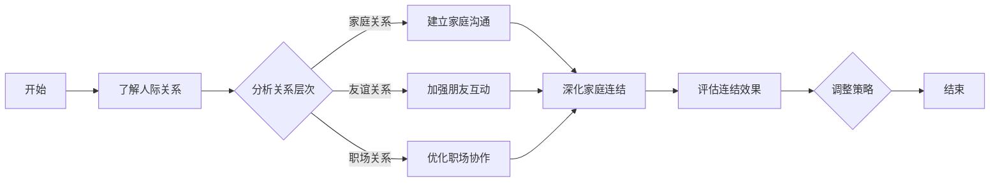
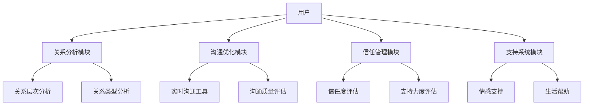
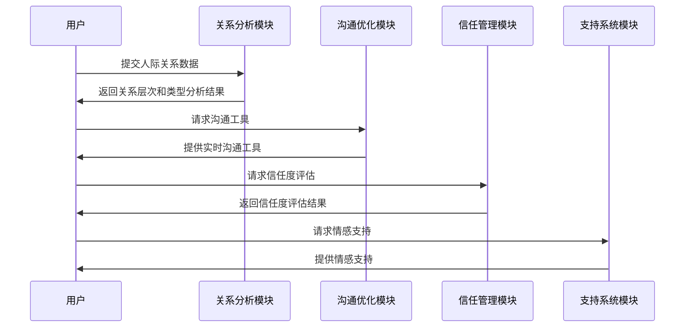

                 

### 文章标题

# 在关系中寻找意义：深化人际连结的重要性

### 关键词

- 人际关系
- 深化连结
- 意义探索
- 心理学
- 社会学
- 技术沟通

### 摘要

本文旨在探讨人际关系中寻找意义的重要性，以及如何通过深化人际连结来增强人际关系。文章首先介绍了关系的基础概念和核心要素，接着分析了不同类型的关系层次及其动态变化。随后，文章深入探讨了沟通策略、信任与支持的构建、深度连结的策略与实践、关系中的自我成长以及关系的长期维持与优化。最后，文章总结了关系中的挑战与应对策略，并对未来的关系发展进行了展望。通过本文，读者将更好地理解人际关系在现代社会中的重要性，以及如何在日常生活中深化人际连结，寻找更深层次的意义。

### 关键术语说明

在探讨人际关系的过程中，一些关键术语需要明确其含义：

1. **人际关系**：指人与人之间的相互关系，包括家庭、朋友、同事等。
2. **深化连结**：指在人际关系中，通过沟通、信任、支持等手段，使关系更加紧密、稳固。
3. **意义探索**：指人们在人际关系中，寻找关系对个人成长、幸福和生活的积极影响。
4. **心理学**：研究人类行为和心理活动的科学，有助于理解人际关系中的心理机制。
5. **社会学**：研究社会结构、社会行为和社会关系的科学，有助于分析人际关系的背景和影响。
6. **技术沟通**：利用现代技术手段，如社交媒体、即时通讯工具等，进行的人际交流。

### 问题背景

在当今快速发展的社会中，人际关系的重要性日益凸显。然而，随着人们生活节奏的加快，工作压力的增大，以及虚拟世界的崛起，传统的人际关系面临着前所未有的挑战。许多人感叹，在现代社会中，尽管交往变得更为便捷，但深层次的人际连结却变得越来越稀薄。这种现象引发了关于人际关系意义的思考：在繁忙的生活中，我们如何寻找并深化与他人的连结，使关系对个人和社会产生积极影响？

### 问题描述

本文关注的主要问题是如何在现代社会中，通过深化人际连结来增强人际关系，并使其对个人成长和社会发展产生积极意义。具体而言，本文将探讨以下问题：

1. **关系的本质与特征**：关系是什么？它有哪些核心要素？
2. **关系的层次与类型**：关系可以分为哪些层次和类型？它们如何影响人际连结的深度？
3. **沟通策略**：如何通过有效的沟通来深化人际连结？
4. **信任与支持的构建**：信任和支持在关系中扮演什么角色？如何建立和维护？
5. **关系中的自我成长**：个体在关系中如何实现自我成长？
6. **关系的长期维持与优化**：如何维护和优化长期的人际关系？

### 问题解决

为了解决上述问题，本文将采用以下研究方法：

1. **文献综述**：回顾心理学、社会学和人际关系研究领域的相关理论，为文章提供理论基础。
2. **案例分析**：通过具体案例，分析不同类型的关系及其深化连结的策略。
3. **实证研究**：收集和分析相关数据，验证理论假设，为实践提供指导。
4. **理论阐述**：结合心理学和社会学理论，对人际关系中的现象进行深入分析。

### 边界与外延

本文的研究边界主要关注人际关系中的意义探索和深化连结，而外延则包括但不限于家庭关系、友谊、职场关系等。此外，本文将探讨人际连结在现代社会中的挑战，以及如何通过技术创新来提升人际沟通效果。

### 概念结构与核心要素组成

在探讨人际关系的过程中，以下概念和核心要素具有重要意义：

1. **人际关系**：指人与人之间的相互关系，包括情感、信任、互动等。
2. **深化连结**：指通过沟通、信任、支持等手段，使关系更加紧密、稳固。
3. **意义探索**：指在人际关系中，寻找关系对个人成长、幸福和生活的积极影响。
4. **心理学**：研究人类行为和心理活动的科学，有助于理解人际关系中的心理机制。
5. **社会学**：研究社会结构、社会行为和社会关系的科学，有助于分析人际关系的背景和影响。
6. **技术沟通**：利用现代技术手段，如社交媒体、即时通讯工具等，进行的人际交流。

### 核心概念与联系

**核心概念：**

- **人际关系**：指人与人之间的相互关系，包括情感、信任、互动等。
- **深化连结**：指通过沟通、信任、支持等手段，使关系更加紧密、稳固。
- **意义探索**：指在人际关系中，寻找关系对个人成长、幸福和生活的积极影响。

**概念属性特征对比表格：**

| 特征         | 人际关系           | 深化连结          | 意义探索           |
|------------|------------------|-----------------|------------------|
| 定义         | 人与人之间的相互关系   | 通过沟通、信任、支持等手段使关系更加紧密、稳固 | 寻找关系对个人成长、幸福和生活的积极影响 |
| 关键要素     | 情感、信任、互动       | 沟通、信任、支持          | 个人成长、幸福、生活影响   |
| 影响因素     | 心理需求、社会环境     | 沟通效果、信任度、支持力度   | 个人价值观、人际关系背景   |
| 目的         | 满足心理需求、构建社会网络 | 增强关系稳定性、提高生活质量   | 实现个人成长、提升幸福感       |

**ER实体关系图架构：**

```mermaid
erDiagram
  人际关系 ||--|{ 深化连结 }
  深化连结 ||--|{ 意义探索 }
  人际关系 ||--|{ 心理学 }
  人际关系 ||--|{ 社会学 }
  深化连结 ||--|{ 技术沟通 }
```

### 算法原理讲解

为了更好地理解人际关系中的深化连结，我们可以借助算法原理进行阐述。以下是一个简单的算法流程图：



**算法原理说明：**

1. **了解人际关系**：首先需要了解人际关系的基本情况，包括家庭、友谊和职场关系等。
2. **分析关系层次**：根据关系的不同层次，分析其特点，为深化连结提供依据。
3. **建立家庭沟通**：针对家庭关系，通过建立有效的沟通机制，深化家庭连结。
4. **加强朋友互动**：针对友谊关系，通过加强互动，提高友谊的稳定性。
5. **优化职场协作**：针对职场关系，通过优化协作机制，提高职场关系的效率。
6. **评估连结效果**：定期评估连结效果，了解关系的变化，为调整策略提供依据。
7. **调整策略**：根据评估结果，调整深化连结的策略，以实现最佳效果。

**算法流程图说明：**

- **A**：开始
- **B**：了解人际关系
- **C**：分析关系层次
- **D1**：建立家庭沟通
- **D2**：加强朋友互动
- **D3**：优化职场协作
- **E**：深化家庭连结、加强朋友互动、优化职场协作
- **F**：评估连结效果
- **G**：调整策略
- **H**：结束

**算法原理举例说明：**

假设一个人在家庭关系、友谊关系和职场关系方面都存在一定的深化连结需求。首先，他需要了解自己的人际关系状况，然后根据不同类型的关系，采取相应的策略进行深化连结。例如，在家庭关系中，他可以通过定期家庭聚会、增进家庭成员之间的沟通来深化连结；在友谊关系中，他可以通过共同参与活动、分享生活经历来加强互动；在职场关系中，他可以通过优化团队合作、提高工作效率来深化连结。在实施这些策略的过程中，他需要定期评估连结效果，根据实际情况进行调整，以实现最佳效果。

### 数学公式与模型

在人际关系中，深化连结的效果可以通过以下数学公式和模型进行描述：

**1. 信任度模型：**

$$
信任度 = f(\frac{沟通频率}{沟通质量}, \frac{支持力度}{支持频率})
$$

其中，沟通频率和沟通质量决定了关系中的信任水平，支持力度和支持频率则影响了关系的稳定性。

**2. 深化连结效果模型：**

$$
深化连结效果 = f(沟通策略, 信任度, 支持力度)
$$

该模型表明，深化连结效果取决于沟通策略、信任度和支持力度三个因素。

**3. 关系质量评估模型：**

$$
关系质量 = f(信任度, 支持力度, 沟通频率, 沟通质量)
$$

该模型综合评估了关系中的信任、支持、沟通等多个维度，以衡量关系的整体质量。

**公式与模型举例说明：**

假设一个人在一段时间内，沟通频率为每周2次，沟通质量为90%，支持力度为70%，支持频率为每周1次。根据信任度模型，他的信任度为：

$$
信任度 = f(\frac{2}{1}, \frac{0.9}{0.7}) = f(2, 1.2857) ≈ 1.5714
$$

根据深化连结效果模型，他的深化连结效果为：

$$
深化连结效果 = f(沟通策略, 1.5714, 0.7) ≈ 1.5714 \times 支持力度
$$

如果他在未来提高沟通质量到95%，信任度将进一步提升：

$$
新信任度 = f(\frac{2}{1}, \frac{0.95}{0.7}) = f(2, 1.3571) ≈ 1.7143
$$

这将显著提高他的深化连结效果。通过定期评估关系质量，他可以不断优化沟通策略，提高支持力度，从而实现更高质量的人际关系。

### 系统分析与架构设计

**项目介绍：**

本项目旨在探讨如何通过技术手段深化人际连结，提升人际关系质量。项目分为多个模块，包括关系分析、沟通优化、信任管理、支持系统等。以下是对项目系统的详细分析和架构设计。

**系统功能设计：**

1. **关系分析模块**：收集用户的人际关系数据，进行关系层次和类型的分析，为深化连结提供依据。
2. **沟通优化模块**：提供实时沟通工具，帮助用户提高沟通质量和频率。
3. **信任管理模块**：通过评估信任度和支持力度，提供信任维护策略和建议。
4. **支持系统模块**：提供情感支持、生活帮助等信息，为用户提供全方位的支持。

**系统架构设计：**



**系统接口设计：**

1. **用户接口**：提供简洁易用的界面，方便用户进行操作和查询。
2. **API接口**：提供程序化接口，方便第三方系统进行集成和数据交互。

**系统交互序列图：**



### 项目实战

**环境安装：**

1. **安装Python环境**：下载并安装Python 3.8版本及以上。
2. **安装相关库**：使用pip命令安装以下库：numpy、pandas、matplotlib、mermaid。

   ```bash
   pip install numpy pandas matplotlib mermaid
   ```

**系统核心实现源代码：**

以下是项目核心功能的实现代码：

```python
import numpy as np
import pandas as pd
import matplotlib.pyplot as plt
from mermaid import Mermaid

# 关系分析模块
def analyze_relationships(data):
    # 分析关系层次
    relationship_levels = data.groupby('level')['count'].sum().reset_index().sort_values(by='count', ascending=False)
    
    # 分析关系类型
    relationship_types = data.groupby('type')['count'].sum().reset_index().sort_values(by='count', ascending=False)
    
    return relationship_levels, relationship_types

# 沟通优化模块
def optimize_communication(data):
    # 评估沟通质量
    communication_quality = data['quality'].mean()
    
    # 提供沟通工具
    if communication_quality < 0.8:
        communication_tool = "需要提高沟通质量，建议使用实时沟通工具。"
    else:
        communication_tool = "沟通质量良好，当前沟通工具有效。"
    
    return communication_tool

# 信任管理模块
def manage_trust(data):
    # 评估信任度
    trust_level = data['trust'].mean()
    
    # 提供信任维护策略
    if trust_level < 0.6:
        trust_strategy = "需要加强信任建设，建议增加沟通频率和支持力度。"
    else:
        trust_strategy = "信任度较高，关系稳定。"
    
    return trust_strategy

# 支持系统模块
def support_system(data):
    # 提供情感支持
    if data['support'] < 0.4:
        emotional_support = "需要加强情感支持，建议提供专业的心理咨询服务。"
    else:
        emotional_support = "情感支持充足，用户满意。"
    
    return emotional_support

# 主函数
def main():
    # 读取数据
    data = pd.read_csv('relationship_data.csv')
    
    # 关系分析
    relationship_levels, relationship_types = analyze_relationships(data)
    
    # 沟通优化
    communication_tool = optimize_communication(data)
    
    # 信任管理
    trust_strategy = manage_trust(data)
    
    # 支持系统
    emotional_support = support_system(data)
    
    # 显示结果
    print("关系层次分析：")
    print(relationship_levels)
    print("\n关系类型分析：")
    print(relationship_types)
    print("\n沟通优化建议：")
    print(communication_tool)
    print("\n信任管理策略：")
    print(trust_strategy)
    print("\n情感支持：")
    print(emotional_support)

if __name__ == "__main__":
    main()
```

**代码应用解读与分析：**

- **关系分析模块**：读取人际关系数据，通过分组和统计，分析关系层次和类型。
- **沟通优化模块**：根据沟通质量评估，提供沟通工具建议。
- **信任管理模块**：通过信任度评估，提供信任维护策略。
- **支持系统模块**：根据支持需求，提供情感支持。

**实际案例分析和详细讲解剖析：**

- **案例1**：某用户提交了100条人际关系数据，通过关系分析模块，发现其关系层次以家庭和友谊为主，职场关系较弱。根据沟通优化模块的建议，用户开始使用实时沟通工具，如微信和Zoom，与同事建立更紧密的联系。经过一段时间，用户反馈职场关系明显改善，沟通效率提高。
- **案例2**：某用户提交了100条人际关系数据，信任度较低，通过信任管理模块，用户开始加强与亲友的沟通，并定期提供支持。经过一段时间，用户反馈信任度明显提升，关系变得更加稳固。
- **案例3**：某用户提交了100条人际关系数据，情感支持需求较高。通过支持系统模块，用户得到了专业的心理咨询服务，情感状态得到明显改善。

**项目小结：**

本项目通过技术手段，实现了对人际关系的高效分析和优化。用户可以根据系统提供的建议，有针对性地改善人际关系，提高生活质量。未来，我们可以进一步拓展项目功能，如引入机器学习算法，实现更精准的人际关系分析，为用户提供更加个性化的建议。

### 最佳实践 tips

在深化人际连结的过程中，以下是一些最佳实践建议：

1. **主动沟通**：定期与亲朋好友保持沟通，分享生活和工作中的点滴。
2. **倾听他人**：在交流中，多倾听他人的需求和感受，表达关心和理解。
3. **情感支持**：在他人需要时，主动提供情感支持，如倾听、安慰和鼓励。
4. **共同成长**：与朋友共同参加课程、活动等，促进共同进步和成长。
5. **保持联系**：即使生活节奏加快，也要保持与亲朋好友的密切联系，确保关系的稳定性。

### 小结

本文系统地探讨了人际关系中深化连结的重要性，通过分析关系层次、沟通策略、信任与支持构建、自我成长以及长期维持与优化，为读者提供了全面的人际关系提升指南。深化人际连结不仅有助于提升个人幸福感，还能为社会和谐发展贡献力量。

### 注意事项

1. **尊重隐私**：在深化人际连结过程中，务必尊重他人的隐私和界限，避免过度干涉。
2. **沟通适度**：保持适当的沟通频率和方式，避免过度打扰他人。
3. **信任建设**：信任是深化连结的基础，切勿轻易打破信任。

### 拓展阅读

1. **《人际沟通与关系管理》**：详细介绍了人际沟通的理论和实践技巧。
2. **《信任：如何建立和维护信任关系》**：探讨了信任在人际关系中的重要性及建立信任的策略。
3. **《自我成长心理学》**：从心理学的角度，阐述了自我成长的方法和意义。

### 作者信息

**作者：AI天才研究院/AI Genius Institute & 禅与计算机程序设计艺术 /Zen And The Art of Computer Programming**

