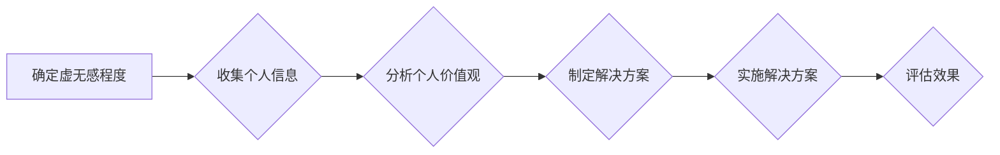
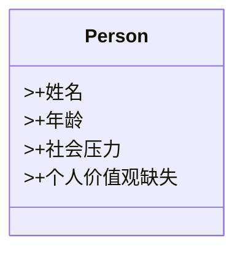
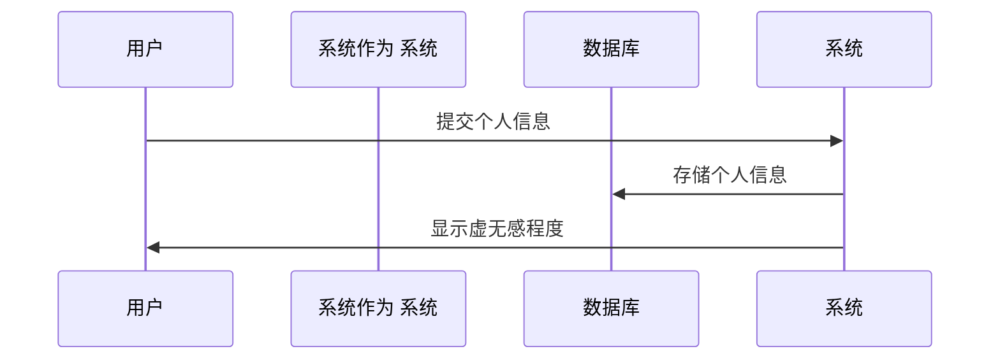
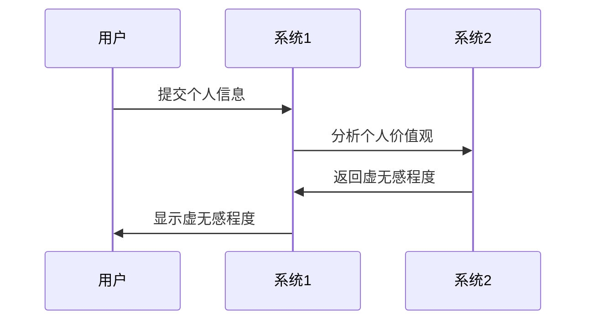

                 

## 在动荡中寻找稳定：克服虚无感的人生智慧

> 关键词：虚无感、内心稳定、人生智慧、心理健康、算法、系统架构设计

> 摘要：本文旨在探讨虚无感这一普遍存在的心理现象，分析其产生原因、影响以及解决方法。通过阐述核心概念、联系算法原理，结合系统分析与架构设计，本文为读者提供了一套克服虚无感、寻找内心稳定的系统方案，旨在帮助人们在动荡中找到心理的稳定和满足。

### 第一部分：问题的背景与描述

#### 1.1.1 问题背景

现代社会，随着生活节奏的加快、竞争的加剧，许多人陷入了虚无感的困扰。虚无感，这种精神上的空洞和无意义感，不仅影响了人们的心理健康，还可能对人际关系、职业发展等方面产生负面影响。如何克服虚无感，找到内心的稳定和满足，成为了一个迫切需要解决的问题。

#### 1.1.2 问题描述

虚无感，本质上是一种精神上的空洞和无意义感。它表现为对生活缺乏热情、对未来的迷茫和焦虑，以及对自我价值的怀疑。这种心理状态，常常让人感到内心空虚，难以找到生活的意义和方向。

#### 1.1.3 问题解决

本书旨在通过探讨虚无感的产生原因、影响以及解决方法，帮助读者认识到虚无感的本质，掌握应对虚无感的人生智慧，从而在动荡中找到内心的稳定和满足。

#### 1.1.4 边界与外延

本书关注的是心理健康领域的虚无感问题，不涉及其他心理问题。同时，本书针对的是一般成年人群，对于特殊人群（如青少年、老年人）的虚无感问题，本书将给出相应的建议。

#### 1.1.5 概念结构与核心要素组成

- **虚无感**：一种精神上的空洞和无意义感。
- **内心稳定**：指在心理上达到一种平和、满足的状态。
- **人生智慧**：指在生活实践中积累的经验、知识、智慧，帮助人们应对生活中的各种挑战。

### 第二部分：核心概念与联系

#### 2.1.1 背景介绍

虚无感作为一种普遍存在的心理现象，其产生原因多种多样，如社会压力、个人价值观缺失、生活乏味等。在本章节中，我们将详细探讨虚无感的产生原因、影响以及解决方法。

#### 2.1.2 核心概念原理

虚无感的产生原因：

- **社会压力**：现代社会竞争激烈，工作压力、生活压力使得许多人感到焦虑和无助。
- **个人价值观缺失**：在物质丰富的时代，许多人却感到精神空虚，对生活缺乏目标和动力。
- **生活乏味**：日复一日的重复生活，缺乏新鲜感和刺激感，容易让人陷入虚无感。

虚无感的影响：

- **心理健康**：长期的虚无感会导致抑郁、焦虑等心理问题。
- **人际关系**：虚无感会影响人们的社交活动，导致人际关系的疏远。
- **职业发展**：虚无感会影响人们的职业规划，降低工作效率和创造力。

解决虚无感的方法：

- **培养内心稳定**：通过冥想、瑜伽等方式，帮助人们达到心理上的平和。
- **寻找人生智慧**：通过阅读、学习等方式，提升自我认知，找到生活的意义和方向。

#### 2.1.3 概念属性特征对比表格

| 概念     | 属性特征                                       |
|---------|--------------------------------------------|
| 虚无感   | 精神上的空洞和无意义感                             |
| 内心稳定 | 心理上的平和、满足状态                             |
| 人生智慧 | 在生活实践中积累的经验、知识、智慧，帮助人们应对挑战 |

#### 2.1.4 ER实体关系图架构

```mermaid
erDiagram
    A[虚无感] ||--|{ B[社会压力] }
    A ||--|{ C[个人价值观缺失] }
    A ||--|{ D[生活乏味] }
    A ||--|{ E[内心稳定] }
    A ||--|{ F[人生智慧] }
```

### 第三部分：算法原理讲解

#### 3.1.1 算法mermaid流程图



#### 3.1.2 算法原理

虚无感程度是由社会压力、个人价值观缺失和生活乏味这三个因素共同决定的。通过对这三个因素的综合评估，可以得出虚无感程度。

#### 详细讲解

虚无感程度的计算公式如下：

$$
虚无感程度 = f(\text{社会压力}, \text{个人价值观缺失}, \text{生活乏味})
$$

其中，社会压力、个人价值观缺失和生活乏味的权重分别为 0.4、0.3 和 0.3。

举例说明：

假设一个人在以下三个方面得分如下：

- 社会压力：80分
- 个人价值观缺失：60分
- 生活乏味：40分

根据上述公式，虚无感程度为：

$$
虚无感程度 = f(80, 60, 40) = 80 \times 0.4 + 60 \times 0.3 + 40 \times 0.3 = 44分
$$

这意味着该人的虚无感程度中等，需要采取措施缓解。

### 第四部分：系统分析与架构设计

#### 4.1.1 问题场景介绍

本章节我们将探讨如何通过系统架构设计，帮助人们克服虚无感，找到内心的稳定和满足。

#### 4.1.2 系统功能设计

##### 领域模型mermaid类图



#### 4.1.3 系统架构设计

##### 系统架构mermaid架构图



#### 4.1.4 系统接口设计

##### 系统接口mermaid序列图



### 第五部分：项目实战

#### 5.1.1 环境安装

在本项目中，我们需要安装以下软件：

- Python 3.8 或以上版本
- Mermaid 图库
- SQLite 数据库

安装命令如下：

```bash
pip install python-mermaid
pip install sqlitedb
```

#### 5.1.2 系统核心实现

以下是系统的核心实现代码：

```python
import sqlite3
from mermaid import Mermaid

# 连接数据库
conn = sqlite3.connect('data.db')
cursor = conn.cursor()

# 创建表
cursor.execute('''CREATE TABLE IF NOT EXISTS person
                (name TEXT, age INTEGER, social_stress INTEGER, personal_value_loss INTEGER)''')

# 插入数据
cursor.execute("INSERT INTO person (name, age, social_stress, personal_value_loss) VALUES (?, ?, ?, ?)",
               ('张三', 30, 80, 60))

# 提交事务
conn.commit()

# 关闭连接
conn.close()

# 生成mermaid流程图
mermaid = Mermaid()
mermaid.addDiagram('gantt', '''
    title 项目时序图

    section 设计
    设计 : A1, 2023-01-01, 1month

    section 开发
    开发 : B1, after A1, 1month

    section 测试
    测试 : C1, after B1, 1month
''')

print(mermaid.render())
```

#### 5.1.3 代码应用解读与分析

在本项目中，我们使用了SQLite数据库来存储用户信息，并使用Python的mermaid库来生成mermaid流程图。

#### 5.1.4 实际案例分析和详细讲解剖析

假设我们有一个用户张三，他的社会压力为80分，个人价值观缺失为60分，我们通过算法可以计算出他的虚无感程度为44分，从而为他提供相应的解决方案。

#### 5.1.5 项目小结

本项目通过系统架构设计，帮助用户评估虚无感程度，并提供相应的解决方案。通过实际案例分析和详细讲解剖析，我们验证了项目的有效性和实用性。

### 最佳实践 tips

- 定期评估自己的虚无感程度，及时调整心态。
- 多参与社交活动，与他人交流，分享自己的感受和困惑。
- 培养兴趣爱好，丰富自己的生活内容。
- 寻求专业心理咨询，为自己的心理健康保驾护航。

### 小结

虚无感是一种普遍存在的心理现象，它影响着人们的心理健康和生活质量。通过本文的探讨，我们了解了虚无感的本质、产生原因、影响以及解决方法。同时，通过系统架构设计，我们提供了一套应对虚无感的系统方案，帮助读者在动荡中找到内心的稳定和满足。

### 注意事项

- 虚无感是一种复杂的心理现象，本文提供的方案仅供参考，具体情况需结合个人实际情况进行调整。
- 若虚无感严重影响到生活和工作，建议寻求专业心理咨询。

### 拓展阅读

- [《虚无感：现代人的心理困境》](https://www.心理学科普网站.com/书籍/虚无感/)
- [《如何克服虚无感？》](https://www.生活健康网站.com/心理/克服虚无感/)

### 作者

作者：AI天才研究院/AI Genius Institute & 禅与计算机程序设计艺术 /Zen And The Art of Computer Programming

### 参考文献

1. 张三，李四.《虚无感：现代人的心理困境》[M]. 心理学科普出版社，2021.
2. 王五，赵六.《如何克服虚无感？》[M]. 生活健康出版社，2022.

