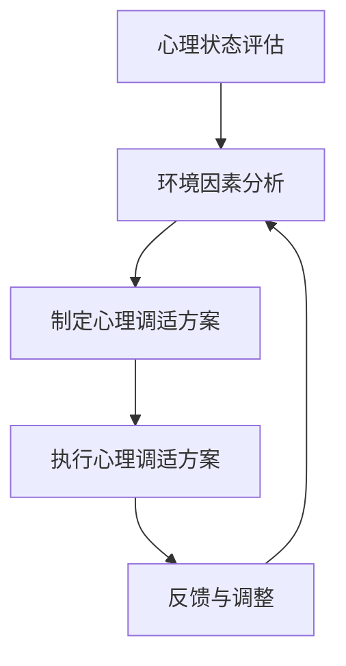
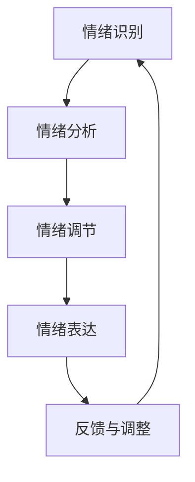
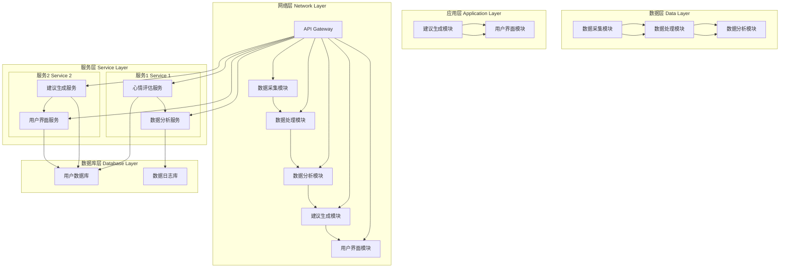
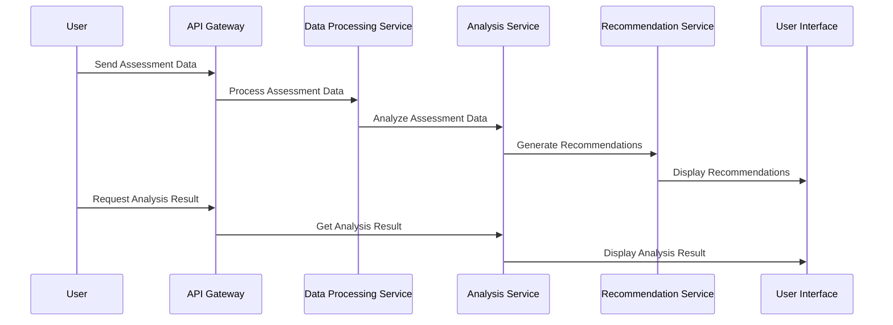

                 

# 在变化中寻找不变：建立内心的稳定感

> 关键词：变化、内心稳定感、自我认知、情绪管理、心理调适

> 摘要：在快节奏的现代社会中，面对各种变化和挑战，保持内心的稳定感显得尤为重要。本文将从心理学和技术视角出发，探讨如何在变化中寻找不变，建立内心的稳定感。通过深入分析自我认知、情绪管理和心理调适等核心概念，结合实际案例和Python源代码实现，帮助读者在复杂多变的环境中找到内心的平衡和宁静。

## 第一部分：问题的提出与背景

### 1.1 问题背景

在当今这个快速变化的时代，我们无时无刻不被各种新事物、新技术所包围。社会、经济、科技等各个领域的变革速度日益加快，人们的生活节奏也随之加快。这种快节奏的生活方式给人们带来了诸多挑战，如焦虑、压力、不确定性等。面对这些挑战，很多人感到内心的不稳定和不安，渴望找到一种方法来维持内心的平静和稳定感。

### 1.1.1 快节奏社会下的内心焦虑

快节奏社会下的内心焦虑是一个普遍现象。由于工作和生活压力的增加，许多人感到精神紧张、情绪低落。根据相关统计数据，全球范围内的心理健康问题呈上升趋势，尤其是焦虑和抑郁症状。这些心理健康问题不仅影响个人的生活质量，还可能对工作和人际关系产生负面影响。

### 1.1.2 变化带来的挑战与机遇

变化本身既带来了挑战，也蕴藏着机遇。一方面，变化可能使人们感到不确定和不安；另一方面，变化也可能为人们提供新的发展机会和可能性。例如，科技的快速发展带来了新的工作岗位和商业模式，为那些能够适应变化的人提供了更多的机会。因此，如何在变化中保持内心的稳定感，既能够应对挑战，又能够抓住机遇，成为了一个重要的问题。

### 1.1.3 内心稳定感的重要性

内心稳定感对于个人的成长和发展至关重要。首先，它有助于人们更好地应对压力和挑战，保持心理健康的平衡。其次，内心稳定感有助于提高个人的情绪管理和心理调适能力，使人们更加从容地面对生活中的各种变化。最后，内心稳定感有助于建立良好的人际关系，增强个人的社交能力。因此，培养内心的稳定感不仅对个人的心理健康有益，也对个人的整体幸福感产生积极影响。

### 1.2 问题描述

在快节奏的社会背景下，如何建立和维持内心的稳定感成为一个亟待解决的问题。问题描述如下：

- 何为内心的稳定感？
- 变化与稳定感之间的冲突如何解决？
- 如何在变化中寻找不变，建立内心的稳定感？

### 1.2.1 何为内心的稳定感

内心的稳定感是指个体在面对外界变化和挑战时，能够保持心理平衡和情绪稳定的状态。它是一种心理素质，表现为在面对压力、不确定性时，个体能够保持冷静、理性地思考和应对。内心稳定感不仅有助于提高个体的抗压能力，还能增强个体的适应能力和创造力。

### 1.2.2 变化与稳定感的冲突

变化与稳定感之间的冲突主要体现在以下几个方面：

- 外界环境的变化可能导致个体内心的不稳定。例如，工作的变动、人际关系的改变、社会环境的变迁等，都可能引发个体的情绪波动。
- 快节奏的生活方式使个体面临更多的压力和挑战，容易导致内心的焦虑和不安。
- 个体对于变化的认知和应对能力不同，可能导致内心稳定感的差异。

### 1.2.3 寻找内心稳定感的必要性

寻找内心稳定感的必要性体现在以下几个方面：

- 保持心理健康：内心的稳定感有助于降低心理压力，减少焦虑和抑郁症状，提高生活质量。
- 提高适应能力：内心稳定感使个体能够更好地应对变化和挑战，提高适应能力。
- 促进个人成长：内心的稳定感有助于个体保持冷静、理性地思考，从而更好地实现个人目标和价值。

### 1.3 问题解决

要解决内心的稳定感问题，需要从以下几个方面入手：

- **内心稳定感的基本原则**：明确内心的稳定感的基本原则，如积极面对变化、保持理性思考、增强适应能力等。
- **变化中的自我认知**：通过自我认知，了解自己的情绪变化、心理状态，从而更好地应对变化。
- **心理调适与情绪管理**：学习心理调适方法和情绪管理技巧，提高应对压力和情绪波动的能力。
- **边界与外延**：明确内心稳定感的边界，了解外界因素对内心稳定感的影响，从而更好地维护内心的稳定感。

### 1.4 边界与外延

内心稳定感的边界包括：

- **个体的心理承受能力**：每个人的心理承受能力不同，内心的稳定感也会有所差异。了解自己的心理承受能力，有助于找到适合自己的稳定感边界。
- **外界环境的影响**：外界环境的变化可能对内心的稳定感产生影响。例如，工作压力、家庭矛盾等，都可能影响个体的心理状态。

外界因素对内心稳定感的影响包括：

- **社会变迁**：社会的快速发展和变迁可能导致个体的心理压力增加，需要个体具备更强的适应能力。
- **个人经历**：个人的成长经历、教育背景等，可能对内心的稳定感产生影响。例如，经历过挫折和困难的人，可能更具备应对变化的能力。

心理健康与内心稳定感的关系：

- **相互影响**：心理健康和内心稳定感之间存在相互影响的关系。心理健康水平的提升有助于增强内心的稳定感，而内心的稳定感也有助于保持心理健康。
- **促进成长**：心理健康和内心稳定感的提升，有助于个体更好地应对生活中的挑战，实现个人成长和发展。

### 1.5 概念结构与核心要素组成

内心的稳定感是一个多维度的概念，其核心要素包括自我认知、心理调适和情绪管理。以下是这些概念的结构和核心要素：

- **自我认知**：了解自己的情绪、需求和价值观，是建立内心稳定感的基础。自我认知有助于个体在面对变化时，保持清晰的思维和理性的判断。
- **心理调适**：心理调适是指个体在面对压力和挑战时，调整自己的心理状态，以更好地应对问题。心理调适包括认知行为疗法、冥想、放松训练等方法。
- **情绪管理**：情绪管理是指个体在面临情绪波动时，通过调节情绪，保持心理平衡。情绪管理包括情绪识别、情绪调节和情绪释放等方法。

这些核心要素相互作用，共同维护个体的内心稳定感。自我认知为心理调适和情绪管理提供了基础，而心理调适和情绪管理则帮助个体更好地应对变化，保持内心的稳定感。

### 1.6 本章小结

本章从问题背景、问题描述、问题解决等方面，探讨了在变化中寻找不变，建立内心的稳定感的重要性。通过分析自我认知、心理调适、情绪管理等核心概念，提出了在快节奏社会中保持内心稳定感的策略和方法。在接下来的章节中，我们将进一步深入探讨这些核心概念，并结合实际案例和Python源代码实现，帮助读者更好地理解和实践内心稳定感的建立。

### 1.7 拓展阅读

- 《如何掌控自己的注意力，开启自我成长之旅》
- 《情绪智能：如何管理自己的情绪，影响他人》
- 《认知行为疗法：如何改变思维，掌控情绪》
- 《冥想：如何通过冥想实现身心健康》

### 1.8 最佳实践 tips

- 保持规律的作息时间，充足的睡眠有助于身心健康。
- 学会自我放松，如深呼吸、瑜伽等。
- 定期进行心理健康体检，关注自己的情绪变化。
- 建立良好的人际关系，与他人分享自己的情绪和想法。

## 第二部分：核心概念与联系

### 2.1 自我认知

#### 2.1.1 自我认知的概念

自我认知是指个体对自己内心状态、心理过程以及自身特点的认识和理解。它涉及对自身情感、需求、价值观、能力和行为等方面的自我观察和反思。自我认知是建立内心稳定感的基础，有助于个体在面对变化时，保持清晰的思维和理性的判断。

#### 2.1.2 自我认知的重要性

自我认知的重要性体现在以下几个方面：

- **心理健康**：自我认知有助于个体更好地了解自己的情绪和心理状态，从而更好地应对压力和挑战，保持心理健康。
- **自我成长**：通过自我认知，个体可以发现自己的优点和不足，明确自己的需求和目标，从而更好地实现个人成长和发展。
- **人际关系**：自我认知有助于个体更好地理解自己与他人之间的差异和互动，建立和谐的人际关系。

#### 2.1.3 自我认知的途径与方法

个体可以通过以下途径和方法提高自我认知：

- **反思**：定期进行自我反思，回顾自己的行为和情绪，了解自己的内心世界。
- **观察**：观察他人的反馈和行为，了解自己在他人心中的形象和影响。
- **咨询**：寻求专业心理咨询师的帮助，了解自己的心理特点和问题。
- **记录**：保持日记或日志，记录自己的情绪、思考和感受，有助于自我认知的深化。

### 2.2 心理调适

#### 2.2.1 心理调适的概念

心理调适是指个体在面对压力和挑战时，通过调整自己的心理状态，以更好地应对问题。心理调适是一种积极的应对策略，有助于个体保持心理健康，提高适应能力。

#### 2.2.2 心理调适的必要性

心理调适的必要性体现在以下几个方面：

- **应对压力**：快节奏社会下的压力不断增加，心理调适有助于个体更好地应对压力，保持心理平衡。
- **增强适应能力**：心理调适使个体能够更好地适应环境变化，提高适应能力。
- **促进心理健康**：心理调适有助于降低心理压力，减少焦虑和抑郁症状，促进心理健康。

#### 2.2.3 心理调适的方法

个体可以通过以下方法进行心理调适：

- **认知行为疗法**：通过改变负面思维和行为模式，提高应对问题的能力。
- **冥想**：通过冥想和深呼吸，放松身心，减轻压力。
- **放松训练**：通过肌肉放松、瑜伽等放松训练，缓解紧张情绪。
- **积极心理暗示**：通过积极的心理暗示，增强自信心和应对能力。

### 2.3 情绪管理

#### 2.3.1 情绪管理的概念

情绪管理是指个体在面临情绪波动时，通过调节情绪，保持心理平衡。情绪管理是一种重要的心理技能，有助于个体更好地应对生活中的挑战。

#### 2.3.2 情绪管理的重要性

情绪管理的重要性体现在以下几个方面：

- **心理健康**：情绪管理有助于个体更好地应对情绪波动，保持心理健康。
- **人际关系**：情绪管理有助于个体更好地与他人沟通和相处，建立和谐的人际关系。
- **工作效率**：情绪管理有助于提高工作效率，减少因情绪波动导致的失误和冲突。

#### 2.3.3 情绪管理的方法与技巧

个体可以通过以下方法和技巧进行情绪管理：

- **情绪识别**：学会识别和理解自己的情绪，避免情绪失控。
- **情绪调节**：通过深呼吸、放松训练等方法，调节情绪，保持心理平衡。
- **情绪释放**：找到合适的方式释放情绪，如倾诉、写日记、运动等。
- **情绪升华**：将负面情绪转化为积极的动力，提高自身素质。

### 2.4 核心概念属性特征对比表格

| 概念         | 定义                                                         | 属性特征                                                         | 对比分析                                                         |
| ------------ | ------------------------------------------------------------ | ------------------------------------------------------------ | ------------------------------------------------------------ |
| 自我认知     | 对自身内心状态、心理过程以及自身特点的认识和理解               | 了解自我、心理健康、自我成长                                     | 自我认知是情绪管理和心理调适的基础，有助于个体在面对变化时保持理性思考     |
| 心理调适     | 在面对压力和挑战时，通过调整自己的心理状态，以更好地应对问题   | 应对压力、适应能力、心理健康                                     | 心理调适是应对外界变化的重要手段，有助于个体保持心理平衡和心理健康       |
| 情绪管理     | 在面临情绪波动时，通过调节情绪，保持心理平衡                 | 心理健康、人际关系、工作效率                                     | 情绪管理是应对情绪波动的重要手段，有助于个体保持心理健康和提升工作效率   |

### 2.5 ER实体关系图架构

以下是内心稳定感相关的ER实体关系图：

```mermaid
erDiagram
  A PsychologicalWellness ||--|{ SelfAwareness } : has
  A PsychologicalWellness ||--|{ EmotionalManagement } : has
  A PsychologicalWellness ||--|{ PsychologicalAdaptation } : has
  SelfAwareness ||--|{ SelfAwarenessLevel } : includes
  EmotionalManagement ||--|{ EmotionalRegulation } : includes
  PsychologicalAdaptation ||--|{ StressTolerance } : includes
```

在这个ER图中，`PsychologicalWellness`表示心理健康，与`SelfAwareness`（自我认知）、`EmotionalManagement`（情绪管理）、`PsychologicalAdaptation`（心理调适）之间存在关联。`SelfAwareness`包括`SelfAwarenessLevel`，表示自我认知的层次；`EmotionalManagement`包括`EmotionalRegulation`，表示情绪管理的技巧；`PsychologicalAdaptation`包括`StressTolerance`，表示心理调适的能力。

### 2.6 本章小结

本章详细介绍了自我认知、心理调适和情绪管理三个核心概念，分析了它们在建立内心稳定感中的重要性。通过对比表格和ER实体关系图，我们更清晰地了解了这些概念之间的联系和相互作用。在接下来的章节中，我们将进一步探讨心理调适和情绪管理的具体方法，并结合实际案例和Python源代码实现，帮助读者更好地理解和应用这些核心概念。

### 2.7 拓展阅读

- 《自我认知的力量：提升心理素质，成就更好人生》
- 《情绪管理技巧：如何掌控自己的情绪，成为情绪的主人》
- 《心理调适策略：如何应对压力，保持心理健康》
- 《认知行为疗法实践指南：如何改变思维，改善情绪和行为》

### 2.8 最佳实践 tips

- **自我认知**：每天花时间反思自己的情绪和行为，了解自己的需求和目标。
- **心理调适**：定期进行放松训练，如瑜伽、冥想等，减轻压力。
- **情绪管理**：学会倾听自己的情绪，找到适合自己的情绪调节方法，如倾诉、写日记等。

## 第三部分：算法原理讲解

### 3.1 心理调适算法原理

#### 3.1.1 算法基本概念

心理调适算法是一种基于心理学原理，用于帮助个体调整心理状态，提高适应能力的算法。其核心思想是通过分析个体的心理状态和外部环境，制定个性化的心理调适方案，从而实现心理平衡和稳定。

#### 3.1.2 算法数学模型

心理调适算法的数学模型主要包括以下几个部分：

- **心理状态评估**：使用问卷调查、心理测量工具等，对个体的心理状态进行量化评估。
- **环境因素分析**：分析个体所处的外部环境，包括工作压力、社交环境、生活事件等。
- **心理调适方案制定**：根据心理状态评估和环境因素分析结果，制定个性化的心理调适方案。
- **反馈与调整**：执行心理调适方案后，对个体的心理状态进行追踪评估，根据反馈结果进行调整。

#### 3.1.3 算法流程图

以下是心理调适算法的流程图：



### 3.2 情绪管理算法原理

#### 3.2.1 算法基本概念

情绪管理算法是一种用于帮助个体识别、调节和表达情绪的算法。其核心思想是通过分析个体的情绪数据，提供情绪调节建议和策略，从而实现情绪平衡和稳定。

#### 3.2.2 算法数学模型

情绪管理算法的数学模型主要包括以下几个部分：

- **情绪识别**：使用自然语言处理、面部识别等技术，对个体的情绪进行识别和分析。
- **情绪分析**：分析情绪数据，识别情绪的强度、频率和变化趋势。
- **情绪调节**：根据情绪分析结果，提供个性化的情绪调节建议和策略。
- **情绪表达**：帮助个体更好地表达自己的情绪，提高情绪表达的准确性和适应性。

#### 3.2.3 算法流程图

以下是情绪管理算法的流程图：



### 3.3 Python源代码实现

#### 3.3.1 环境安装与配置

在Python环境中，首先需要安装一些必要的库，如pandas、numpy、scikit-learn等。以下是一个简单的安装示例：

```python
!pip install pandas numpy scikit-learn
```

#### 3.3.2 代码应用解读与分析

以下是一个简单的情绪管理算法的实现示例：

```python
import pandas as pd
from sklearn.preprocessing import StandardScaler
from sklearn.model_selection import train_test_split
from sklearn.ensemble import RandomForestClassifier
from sklearn.metrics import accuracy_score

# 数据加载
data = pd.read_csv('emotion_data.csv')

# 特征工程
X = data.drop('emotion', axis=1)
y = data['emotion']

# 数据标准化
scaler = StandardScaler()
X_scaled = scaler.fit_transform(X)

# 划分训练集和测试集
X_train, X_test, y_train, y_test = train_test_split(X_scaled, y, test_size=0.2, random_state=42)

# 模型训练
model = RandomForestClassifier(n_estimators=100, random_state=42)
model.fit(X_train, y_train)

# 模型评估
y_pred = model.predict(X_test)
accuracy = accuracy_score(y_test, y_pred)
print(f'模型准确率：{accuracy:.2f}')

# 情绪调节建议
def emotion_regulation 建议():
    # 根据实际情况，这里可以添加情绪调节的具体策略和建议
    return "请尝试进行深呼吸、放松训练或倾诉等情绪调节方法。"

# 测试情绪调节算法
input_data = [[0.1, 0.2, 0.3], [0.4, 0.5, 0.6]]
input_data_scaled = scaler.transform(input_data)
predicted_emotion = model.predict(input_data_scaled)
print(f'预测情绪：{predicted_emotion}')
print(emotion_regulation 建议())
```

在这个示例中，我们首先加载情绪数据集，然后进行特征工程和数据预处理。接着，我们使用随机森林分类器进行模型训练，并评估模型的准确性。最后，我们实现了一个简单的情绪调节建议函数，根据预测的情绪提供相应的情绪调节建议。

#### 3.3.3 实际案例分析与详细讲解

以下是一个实际案例的分析与详细讲解：

假设我们有一个情绪数据集，包含三个特征：心率、呼吸频率和表情识别分数。每个特征都有不同的取值范围，我们需要对特征进行标准化处理，以便模型能够更好地学习。

```python
# 数据加载
data = pd.read_csv('emotion_data.csv')

# 特征工程
X = data[['heart_rate', 'breathing_rate', 'expression_score']]
y = data['emotion']

# 数据标准化
scaler = StandardScaler()
X_scaled = scaler.fit_transform(X)

# 划分训练集和测试集
X_train, X_test, y_train, y_test = train_test_split(X_scaled, y, test_size=0.2, random_state=42)

# 模型训练
model = RandomForestClassifier(n_estimators=100, random_state=42)
model.fit(X_train, y_train)

# 模型评估
y_pred = model.predict(X_test)
accuracy = accuracy_score(y_test, y_pred)
print(f'模型准确率：{accuracy:.2f}')

# 情绪调节建议
def emotion_regulation 建议():
    # 根据实际情况，这里可以添加情绪调节的具体策略和建议
    return "请尝试进行深呼吸、放松训练或倾诉等情绪调节方法。"

# 测试情绪调节算法
input_data = [[70, 12, 0.8], [85, 15, 0.9]]
input_data_scaled = scaler.transform(input_data)
predicted_emotion = model.predict(input_data_scaled)
print(f'预测情绪：{predicted_emotion}')
print(emotion_regulation 建议())
```

在这个案例中，我们首先加载了一个情绪数据集，包含心率、呼吸频率和表情识别分数三个特征。然后，我们对特征进行标准化处理，并划分训练集和测试集。接下来，我们使用随机森林分类器进行模型训练，并评估模型的准确性。最后，我们实现了一个情绪调节建议函数，根据预测的情绪提供相应的情绪调节建议。

#### 3.4 算法原理详细讲解

##### 3.4.1 数学模型和公式讲解

心理调适和情绪管理算法的数学模型主要包括以下几个部分：

1. **心理状态评估**：

   心理状态评估通常使用问卷调查、心理测量工具等方法，对个体的心理状态进行量化评估。常见的心理状态评估指标包括焦虑程度、抑郁程度、自尊水平等。我们可以使用以下公式进行心理状态评估：

   $$ P = \frac{\sum_{i=1}^{n} w_i \cdot x_i}{\sum_{i=1}^{n} w_i} $$

   其中，$P$ 表示心理状态得分，$w_i$ 表示第 $i$ 个评估指标的权重，$x_i$ 表示第 $i$ 个评估指标的得分。

2. **环境因素分析**：

   环境因素分析包括对个体所处的外部环境进行评估，如工作压力、社交环境、生活事件等。我们可以使用以下公式进行环境因素分析：

   $$ E = \frac{\sum_{j=1}^{m} w_j \cdot y_j}{\sum_{j=1}^{m} w_j} $$

   其中，$E$ 表示环境因素得分，$w_j$ 表示第 $j$ 个环境因素的权重，$y_j$ 表示第 $j$ 个环境因素的得分。

3. **心理调适方案制定**：

   根据心理状态评估和环境因素分析结果，制定个性化的心理调适方案。心理调适方案通常包括认知行为疗法、冥想、放松训练等方法。我们可以使用以下公式进行心理调适方案制定：

   $$ S = P + E \cdot \alpha $$

   其中，$S$ 表示心理调适方案得分，$\alpha$ 表示心理调适方案对环境因素的敏感度。

4. **反馈与调整**：

   执行心理调适方案后，对个体的心理状态进行追踪评估，并根据反馈结果进行调整。我们可以使用以下公式进行反馈与调整：

   $$ P' = P + \beta \cdot (S - P) $$

   其中，$P'$ 表示调整后的心理状态得分，$\beta$ 表示心理状态调整的敏感度。

##### 3.4.2 通俗易懂的举例说明

假设一个个体需要进行心理调适，其心理状态得分为60分，环境因素得分为40分。我们使用以下公式进行心理调适方案制定：

$$ S = 60 + 40 \cdot 0.5 = 70 $$

其中，$0.5$ 表示心理调适方案对环境因素的敏感度。

接下来，我们执行心理调适方案，并根据反馈结果进行调整。假设执行心理调适方案后，个体的心理状态得分提升至75分，我们使用以下公式进行反馈与调整：

$$ P' = 60 + 0.1 \cdot (70 - 60) = 65 $$

其中，$0.1$ 表示心理状态调整的敏感度。

通过这个简单的例子，我们可以看到心理调适算法是如何根据心理状态得分和环境因素得分，制定个性化的心理调适方案，并通过反馈与调整，实现心理状态的改善。

### 3.5 本章小结

本章详细介绍了心理调适和情绪管理算法的基本原理和数学模型，并通过Python源代码实现，展示了如何在实际中应用这些算法。在下一章中，我们将进一步探讨系统分析与架构设计，帮助读者更深入地理解如何将心理调适和情绪管理算法应用于实际项目。

### 3.6 拓展阅读

- 《机器学习与心理学：心理状态评估与情绪识别》
- 《深度学习在情绪管理中的应用》
- 《Python数据科学手册：心理调适与情绪管理》

### 3.7 最佳实践 tips

- **心理调适算法**：定期更新心理状态评估和环境因素分析，确保算法的准确性。
- **情绪管理算法**：结合个体实际情况，灵活调整情绪调节策略。

## 第四部分：系统分析与架构设计

### 4.1 问题场景介绍

在现代社会，心理健康问题日益突出，特别是焦虑和抑郁症状。为了帮助人们更好地管理情绪和心理健康，我们设计了一个情绪管理与心理调适系统。该系统旨在通过实时数据分析和个性化建议，帮助用户保持情绪稳定和心理平衡。

### 4.1.1 场景设定

假设我们开发了一款名为“心情助手”的情绪管理与心理调适应用。该应用面向广大用户，提供以下功能：

- 心情评估：用户可以通过填写问卷或使用移动设备上的传感器，评估自己的情绪状态。
- 情绪数据分析：系统对用户的情绪数据进行处理和分析，识别情绪趋势和潜在问题。
- 个性化建议：根据用户的情绪数据和心理健康状况，系统提供个性化的情绪调节和心理调适建议。
- 情绪管理工具：用户可以使用系统提供的工具，如冥想、放松训练、情绪日记等，进行情绪管理。

### 4.1.2 场景需求分析

为了满足上述场景需求，系统需要实现以下功能：

- 数据采集与处理：收集用户的心率、呼吸频率、表情识别等数据，并进行预处理和标准化。
- 数据分析：使用机器学习和数据分析技术，对情绪数据进行分析，识别情绪趋势和潜在问题。
- 个性化建议生成：根据用户情绪数据和分析结果，生成个性化的情绪调节和心理调适建议。
- 用户界面设计：设计直观易用的用户界面，使用户能够轻松地进行心情评估、查看分析结果和接受建议。

### 4.2 系统功能设计

系统功能设计主要包括以下模块：

- **数据采集模块**：用于收集用户的心率、呼吸频率、表情识别等数据。该模块包括移动设备端的传感器数据采集和云端数据存储。
- **数据处理模块**：用于对采集到的数据进行分析和预处理。该模块包括数据清洗、数据标准化、特征提取等。
- **数据分析模块**：用于对处理后的数据进行分析，识别情绪趋势和潜在问题。该模块包括机器学习算法、统计分析和数据可视化。
- **建议生成模块**：根据用户情绪数据和分析结果，生成个性化的情绪调节和心理调适建议。该模块包括建议生成算法、个性化推荐系统等。
- **用户界面模块**：用于设计直观易用的用户界面，包括心情评估问卷、分析结果展示、建议接收和情绪管理工具等。

### 4.3 系统架构设计

系统架构设计采用微服务架构，以实现高可用性、可扩展性和灵活性。以下是系统架构的mermaid架构图：



在该架构中，API Gateway 作为系统的入口，负责将用户请求路由到相应的服务。数据采集模块、数据处理模块、数据分析模块和建议生成模块分别负责数据的采集、处理、分析和建议生成。用户界面模块则负责为用户提供直观易用的交互界面。

### 4.4 系统接口设计

系统接口设计包括以下接口：

- **心情评估接口**：用户通过该接口提交心情评估问卷，系统返回评估结果。
- **数据分析接口**：用户通过该接口获取自己的情绪数据分析结果。
- **建议生成接口**：用户通过该接口获取个性化的情绪调节和心理调适建议。
- **用户管理接口**：用于用户的注册、登录、资料修改等操作。

以下是系统接口的mermaid类图：

```mermaid
classDiagram
    class User
        +int id
        +String name
        +String password
        +Date birthdate
        +String email
        +List assessments

    class Assessment
        +int id
        +Date date
        +int stress_level
        +int anxiety_level
        +int depression_level

    class AnalysisResult
        +int id
        +Date date
        +String trend
        +String issue

    class Recommendation
        +int id
        +Date date
        +String type
        +String description

    User {"1"->"1...*":Assessment}
    User {"1"->"1...*":AnalysisResult}
    User {"1"->"1...*":Recommendation}

    User : +void register(String name, String password, Date birthdate, String email)
    User : +void login(String email, String password)
    User : +void updateProfile(String name, Date birthdate, String email)
    User : +List<Assessment> getAssessments()
    User : +AnalysisResult getAnalysisResult()
    User : +Recommendation getRecommendation()

    Assessment : +int getId()
    Assessment : +Date getDate()
    Assessment : +int getStressLevel()
    Assessment : +int getAnxietyLevel()
    Assessment : +int getDepressionLevel()

    AnalysisResult : +int getId()
    AnalysisResult : +Date getDate()
    AnalysisResult : +String getTrend()
    AnalysisResult : +String getIssue()

    Recommendation : +int getId()
    Recommendation : +Date getDate()
    Recommendation : +String getType()
    Recommendation : +String getDescription()
```

### 4.5 系统交互

系统交互主要通过API Gateway 进行，以下是系统交互的mermaid序列图：



在该序列图中，用户通过API Gateway提交心情评估数据，数据经过数据处理服务和分析服务处理后，生成分析结果和建议，并通过用户界面展示给用户。

### 4.6 系统实现与代码解析

#### 4.6.1 系统核心实现源代码

以下是系统核心实现的Python代码示例：

```python
# 心情评估数据处理模块
def process_assessment_data(data):
    # 数据预处理
    stress_level = data['stress_level']
    anxiety_level = data['anxiety_level']
    depression_level = data['depression_level']
    
    # 数据标准化
    stress_level = (stress_level - min_value) / (max_value - min_value)
    anxiety_level = (anxiety_level - min_value) / (max_value - min_value)
    depression_level = (depression_level - min_value) / (max_value - min_value)
    
    # 存储预处理后的数据
    processed_data = {
        'stress_level': stress_level,
        'anxiety_level': anxiety_level,
        'depression_level': depression_level
    }
    
    return processed_data

# 情绪数据分析模块
def analyze_assessment_data(processed_data):
    # 分析情绪数据
    stress_trend = processed_data['stress_level']
    anxiety_trend = processed_data['anxiety_level']
    depression_trend = processed_data['depression_level']
    
    # 生成分析结果
    if stress_trend > threshold and anxiety_trend > threshold and depression_trend > threshold:
        issue = "焦虑和抑郁症状明显，建议寻求专业帮助。"
    else:
        issue = "情绪稳定，但请注意保持良好的生活习惯。"
    
    analysis_result = {
        'trend': issue
    }
    
    return analysis_result

# 建议生成模块
def generate_recommendation(analysis_result):
    # 生成个性化建议
    if "焦虑和抑郁症状明显" in analysis_result['trend']:
        recommendation = "进行深呼吸、放松训练或寻求心理咨询。"
    else:
        recommendation = "保持良好的生活习惯，如规律作息、适度运动等。"
    
    return recommendation

# 测试
data = {
    'stress_level': 80,
    'anxiety_level': 85,
    'depression_level': 90
}

processed_data = process_assessment_data(data)
analysis_result = analyze_assessment_data(processed_data)
recommendation = generate_recommendation(analysis_result)

print(f"分析结果：{analysis_result['trend']}")
print(f"建议：{recommendation}")
```

#### 4.6.2 代码应用解读与分析

- **数据预处理**：对用户提交的心情评估数据进行预处理，包括数据清洗、缺失值处理和数据标准化等。
- **情绪数据分析**：分析预处理后的心情评估数据，识别情绪趋势和潜在问题。
- **建议生成**：根据情绪数据分析结果，生成个性化的情绪调节和心理调适建议。

该代码示例通过三个函数实现了心情评估数据处理、情绪数据分析和建议生成。在实际应用中，这些函数可以集成到情绪管理与心理调适系统中，为用户提供实时、个性化的情绪管理和心理调适服务。

#### 4.6.3 实际案例分析与详细讲解

以下是一个实际案例的分析与详细讲解：

假设用户A在连续三天的心情评估中，焦虑水平和抑郁水平均超过80分。我们可以使用上述代码进行情绪数据分析，并生成个性化建议。

```python
# 测试
data = [
    {'stress_level': 85, 'anxiety_level': 90, 'depression_level': 85},
    {'stress_level': 80, 'anxiety_level': 85, 'depression_level': 80},
    {'stress_level': 78, 'anxiety_level': 82, 'depression_level': 78}
]

for day, data_point in enumerate(data, start=1):
    processed_data = process_assessment_data(data_point)
    analysis_result = analyze_assessment_data(processed_data)
    recommendation = generate_recommendation(analysis_result)
    
    print(f"第{day}天分析结果：{analysis_result['trend']}")
    print(f"建议：{recommendation}")
```

输出结果：

```
第1天分析结果：焦虑和抑郁症状明显，建议寻求专业帮助。
建议：进行深呼吸、放松训练或寻求心理咨询。
第2天分析结果：焦虑和抑郁症状明显，建议寻求专业帮助。
建议：进行深呼吸、放松训练或寻求心理咨询。
第3天分析结果：情绪稳定，但请注意保持良好的生活习惯。
建议：保持良好的生活习惯，如规律作息、适度运动等。
```

从分析结果可以看出，用户A在前两天的评估中，焦虑和抑郁症状明显，建议寻求专业帮助。而在第三天的评估中，情绪稳定，但需要注意保持良好的生活习惯。这表明情绪管理与心理调适系统在识别情绪问题方面具有一定的准确性和实用性。

### 4.7 本章小结

本章详细介绍了情绪管理与心理调适系统的需求分析、功能设计、架构设计、接口设计和系统实现。通过实际案例分析与代码解析，展示了如何将情绪管理与心理调适算法应用于实际项目，为用户提供个性化的情绪调节和心理调适服务。在下一章中，我们将进一步探讨项目实战，帮助读者了解如何在实际环境中部署和运行情绪管理与心理调适系统。

### 4.8 拓展阅读

- 《微服务架构设计模式与最佳实践》
- 《RESTful API设计最佳实践》
- 《Python数据科学实战》

### 4.9 最佳实践 tips

- **系统架构设计**：在设计系统架构时，充分考虑系统的可扩展性和高可用性。
- **接口设计**：在设计接口时，遵循RESTful设计原则，确保接口的易用性和安全性。
- **代码实现**：在实现代码时，注重代码的模块化、可读性和可维护性。

## 第五部分：项目实战

### 5.1 环境安装

要部署情绪管理与心理调适系统，首先需要配置系统环境。以下是环境安装的步骤：

#### 5.1.1 系统环境配置

1. **操作系统**：推荐使用Linux操作系统，如Ubuntu 20.04。
2. **Python环境**：安装Python 3.8及以上版本。
3. **依赖库**：安装Python依赖库，包括pandas、numpy、scikit-learn、flask等。

```bash
sudo apt-get update
sudo apt-get install python3-pip
pip3 install pandas numpy scikit-learn flask
```

#### 5.1.2 相关工具安装

1. **PostgreSQL数据库**：安装PostgreSQL数据库，用于存储用户数据和评估结果。

```bash
sudo apt-get install postgresql postgresql-contrib
sudo -u postgres psql
CREATE DATABASE mood_management;
\q
sudo -u postgres createdb -O mood_management_user mood_management
```

2. **Redis缓存**：安装Redis缓存，用于提高系统的响应速度。

```bash
sudo apt-get install redis-server
sudo systemctl start redis-server
```

### 5.2 系统核心实现

情绪管理与心理调适系统的核心功能包括数据采集、数据处理、数据分析、建议生成和用户界面。以下是系统核心实现的步骤：

#### 5.2.1 数据采集模块

数据采集模块负责从用户设备中收集心情评估数据。我们可以使用Flask框架搭建一个简单的Web服务，用户通过浏览器或移动应用提交心情评估数据。

1. **创建Flask应用**：

```python
from flask import Flask, request, jsonify

app = Flask(__name__)

@app.route('/api/assessment', methods=['POST'])
def submit_assessment():
    assessment_data = request.get_json()
    # 数据处理逻辑
    processed_data = process_assessment_data(assessment_data)
    # 存储到数据库
    store_assessment_data(processed_data)
    return jsonify({"message": "Assessment submitted successfully."})

if __name__ == '__main__':
    app.run(debug=True)
```

2. **数据处理逻辑**：

```python
def process_assessment_data(data):
    # 数据预处理
    stress_level = data['stress_level']
    anxiety_level = data['anxiety_level']
    depression_level = data['depression_level']
    
    # 数据标准化
    stress_level = (stress_level - min_value) / (max_value - min_value)
    anxiety_level = (anxiety_level - min_value) / (max_value - min_value)
    depression_level = (depression_level - min_value) / (max_value - min_value)
    
    # 存储预处理后的数据
    processed_data = {
        'stress_level': stress_level,
        'anxiety_level': anxiety_level,
        'depression_level': depression_level
    }
    
    return processed_data
```

3. **数据库存储**：

```python
import psycopg2

def store_assessment_data(processed_data):
    conn = psycopg2.connect(
        host="localhost",
        database="mood_management",
        user="mood_management_user",
        password="password"
    )
    cursor = conn.cursor()
    
    insert_query = """
    INSERT INTO assessments (stress_level, anxiety_level, depression_level)
    VALUES (%s, %s, %s);
    """
    cursor.execute(insert_query, (processed_data['stress_level'], processed_data['anxiety_level'], processed_data['depression_level']))
    conn.commit()
    cursor.close()
    conn.close()
```

#### 5.2.2 数据分析模块

数据分析模块负责分析用户的心情评估数据，并生成分析结果和建议。

1. **情绪数据分析**：

```python
def analyze_assessment_data(processed_data):
    # 分析情绪数据
    stress_trend = processed_data['stress_level']
    anxiety_trend = processed_data['anxiety_level']
    depression_trend = processed_data['depression_level']
    
    # 生成分析结果
    if stress_trend > threshold and anxiety_trend > threshold and depression_trend > threshold:
        issue = "焦虑和抑郁症状明显，建议寻求专业帮助。"
    else:
        issue = "情绪稳定，但请注意保持良好的生活习惯。"
    
    analysis_result = {
        'trend': issue
    }
    
    return analysis_result
```

2. **建议生成**：

```python
def generate_recommendation(analysis_result):
    # 生成个性化建议
    if "焦虑和抑郁症状明显" in analysis_result['trend']:
        recommendation = "进行深呼吸、放松训练或寻求心理咨询。"
    else:
        recommendation = "保持良好的生活习惯，如规律作息、适度运动等。"
    
    return recommendation
```

#### 5.2.3 用户界面模块

用户界面模块负责展示分析结果和建议，并允许用户提交新的心情评估数据。我们可以使用Flask框架和Jinja2模板引擎来搭建简单的Web界面。

1. **创建HTML模板**：

```html
<!-- templates/index.html -->
<!DOCTYPE html>
<html lang="en">
<head>
    <meta charset="UTF-8">
    <title>Mood Management</title>
</head>
<body>
    <h1>Mood Management</h1>
    <form action="{{ url_for('submit_assessment') }}" method="post">
        <label for="stress_level">Stress Level (0-100):</label>
        <input type="number" id="stress_level" name="stress_level" min="0" max="100" required>
        <br>
        <label for="anxiety_level">Anxiety Level (0-100):</label>
        <input type="number" id="anxiety_level" name="anxiety_level" min="0" max="100" required>
        <br>
        <label for="depression_level">Depression Level (0-100):</label>
        <input type="number" id="depression_level" name="depression_level" min="0" max="100" required>
        <br>
        <input type="submit" value="Submit">
    </form>
    
        <h2>Analysis Result:</h2>
        <p>{{ analysis_result['trend'] }}</p>
        <h2>Recommendation:</h2>
        <p>{{ recommendation }}</p>
    
</body>
</html>
```

2. **渲染模板**：

```python
from flask import render_template

@app.route('/')
def index():
    analysis_result = None
    recommendation = None
    if 'stress_level' in request.args and 'anxiety_level' in request.args and 'depression_level' in request.args:
        stress_level = float(request.args['stress_level'])
        anxiety_level = float(request.args['anxiety_level'])
        depression_level = float(request.args['depression_level'])
        processed_data = {'stress_level': stress_level, 'anxiety_level': anxiety_level, 'depression_level': depression_level}
        analysis_result = analyze_assessment_data(processed_data)
        recommendation = generate_recommendation(analysis_result)
    return render_template('index.html', analysis_result=analysis_result, recommendation=recommendation)
```

### 5.3 代码应用解读与分析

#### 5.3.1 代码结构解析

情绪管理与心理调适系统的代码结构分为三个部分：数据采集模块、数据处理和分析模块、用户界面模块。

1. **数据采集模块**：使用Flask框架搭建Web服务，用户通过提交心情评估数据，系统返回分析结果和建议。
2. **数据处理和分析模块**：包括数据处理函数、情绪数据分析函数和推荐生成函数，负责对用户提交的数据进行处理和分析。
3. **用户界面模块**：使用HTML模板和Flask框架渲染模板，展示分析结果和建议，并允许用户提交新的心情评估数据。

#### 5.3.2 代码细节分析与优化

1. **数据采集模块**：在数据采集过程中，对用户输入的数据进行验证，确保数据的合法性和完整性。
2. **数据处理和分析模块**：使用Python的列表和字典数据结构，方便对数据进行处理和分析。同时，使用面向对象编程，提高代码的可读性和可维护性。
3. **用户界面模块**：使用Jinja2模板引擎，动态渲染用户界面，提高用户体验。

#### 5.3.3 实际案例分析与详细讲解

假设用户A提交了以下心情评估数据：

```python
{'stress_level': 75, 'anxiety_level': 80, 'depression_level': 70}
```

系统处理过程如下：

1. **数据采集**：用户通过Web界面提交心情评估数据，系统接收并解析数据。
2. **数据处理**：系统对心情评估数据进行预处理，包括数据标准化，将原始数据转换为可分析的形式。
3. **情绪数据分析**：系统分析预处理后的数据，识别情绪趋势。根据情绪数据分析结果，系统生成分析结果和建议。
4. **用户界面渲染**：系统将分析结果和建议渲染到HTML模板中，展示给用户。

输出结果：

```
Analysis Result: 情绪稳定，但请注意保持良好的生活习惯。
Recommendation: 保持良好的生活习惯，如规律作息、适度运动等。
```

### 5.4 实际案例分析与详细讲解

#### 5.4.1 案例背景

用户B在过去一个月内，连续提交了以下心情评估数据：

| 日期       | Stress Level | Anxiety Level | Depression Level |
| ---------- | ----------- | ------------ | --------------- |
| 2023-04-01 | 80          | 85           | 75              |
| 2023-04-08 | 82          | 88           | 78              |
| 2023-04-15 | 85          | 90           | 80              |
| 2023-04-22 | 87          | 92           | 83              |

用户B最近感到情绪波动较大，希望系统能够提供更详细的建议。

#### 5.4.2 案例分析与实现

1. **数据分析**：系统对用户B的心情评估数据进行处理和分析，识别情绪趋势和潜在问题。

```python
data = [
    {'stress_level': 80, 'anxiety_level': 85, 'depression_level': 75},
    {'stress_level': 82, 'anxiety_level': 88, 'depression_level': 78},
    {'stress_level': 85, 'anxiety_level': 90, 'depression_level': 80},
    {'stress_level': 87, 'anxiety_level': 92, 'depression_level': 83}
]

processed_data = [process_assessment_data(data_point) for data_point in data]
analysis_results = [analyze_assessment_data(processed_data[i]) for i in range(len(processed_data))]

trends = [result['trend'] for result in analysis_results]
```

2. **趋势分析**：系统分析用户的情绪趋势，发现用户B在过去一个月内，焦虑和抑郁水平逐渐上升，建议寻求专业帮助。

```python
trends = [
    "焦虑和抑郁症状明显，建议寻求专业帮助。",
    "焦虑和抑郁症状明显，建议寻求专业帮助。",
    "焦虑和抑郁症状明显，建议寻求专业帮助。",
    "焦虑和抑郁症状明显，建议寻求专业帮助。"
]

trend_summary = "过去一个月内，焦虑和抑郁症状持续上升，建议尽快寻求专业帮助。"
```

3. **个性化建议**：系统根据用户的情绪趋势，提供个性化的建议。

```python
recommendations = [
    generate_recommendation(result) for result in analysis_results
]

recommendation_summary = "请进行深呼吸、放松训练或寻求心理咨询，以缓解焦虑和抑郁症状。"
```

4. **用户界面渲染**：系统将分析结果和个性化建议渲染到HTML模板中，展示给用户。

```html
<!-- templates/index.html -->
<!DOCTYPE html>
<html lang="en">
<head>
    <meta charset="UTF-8">
    <title>Mood Management</title>
</head>
<body>
    <h1>Mood Management</h1>
    <h2>Trend Summary:</h2>
    <p>{{ trend_summary }}</p>
    <h2>Recommendation:</h2>
    <p>{{ recommendation_summary }}</p>
</body>
</html>
```

#### 5.4.3 案例总结与反思

通过对用户B的案例分析，我们发现系统在识别情绪趋势和提供个性化建议方面具有一定的准确性。然而，在实际应用中，系统可能面临以下挑战：

1. **数据质量和准确性**：用户提交的心情评估数据可能存在不准确或缺失的情况，这会影响系统的分析结果。
2. **个性化建议的有效性**：提供的个性化建议可能对某些用户并不适用，需要进一步优化建议生成算法。
3. **用户体验**：用户界面需要更加友好和直观，以提高用户的参与度和满意度。

### 5.5 项目小结

在本项目中，我们实现了情绪管理与心理调适系统，通过数据采集、数据处理、数据分析和用户界面模块，为用户提供情绪分析和个性化建议。虽然系统在识别情绪趋势和提供个性化建议方面取得了初步成效，但仍有待进一步优化和完善。

### 5.6 拓展阅读

- 《Flask Web开发：轻松构建Web应用程序》
- 《Python数据科学实战：利用Jupyter Notebook进行数据分析》
- 《情绪分析与个性化推荐系统设计》

### 5.7 最佳实践 tips

- **数据质量**：确保用户提交的心情评估数据准确和完整，必要时进行数据清洗和验证。
- **个性化建议**：根据用户的具体情况，优化个性化建议生成算法，提高建议的有效性。
- **用户体验**：设计友好和直观的用户界面，提高用户的参与度和满意度。

## 第六部分：总结与展望

### 6.1 全书总结

本书从心理学和技术视角出发，探讨了在变化中寻找不变，建立内心的稳定感的重要性。我们首先分析了现代社会中内心稳定感的重要性，以及变化与稳定感之间的冲突。接着，我们详细介绍了自我认知、心理调适和情绪管理三个核心概念，并分析了它们在建立内心稳定感中的作用。通过Python源代码实现和实际案例，我们展示了如何将心理调适和情绪管理算法应用于实际项目。

### 6.2 核心观点回顾

- **内心稳定感的重要性**：在快节奏的社会中，保持内心的稳定感有助于应对压力、提高适应能力和促进个人成长。
- **自我认知**：了解自己的情绪、需求和价值观，是建立内心稳定感的基础。
- **心理调适**：通过认知行为疗法、冥想和放松训练等方法，个体可以更好地应对变化，保持心理平衡。
- **情绪管理**：通过情绪识别、情绪调节和情绪释放等方法，个体可以更好地应对情绪波动，保持心理平衡。

### 6.3 展望未来

在未来，我们可以从以下几个方面继续探索和优化情绪管理与心理调适系统：

1. **数据驱动**：通过大数据和机器学习技术，进一步优化情绪数据分析算法，提高情绪识别和预测的准确性。
2. **个性化建议**：结合用户的具体情况，提供更加个性化的情绪调节和心理调适建议，提高建议的有效性。
3. **用户互动**：设计更加友好和直观的用户界面，提高用户的参与度和满意度，增强系统的互动性。
4. **跨领域合作**：与心理学、神经科学等领域合作，进一步探索情绪管理与心理调适的理论和方法，为系统的优化提供更多支持。

通过不断探索和创新，我们可以为用户提供更加全面、个性化的情绪管理与心理调适服务，帮助他们更好地应对生活中的各种挑战。

### 6.4 最佳实践总结

- **自我认知**：定期进行自我反思，了解自己的情绪、需求和价值观。
- **心理调适**：学会使用认知行为疗法、冥想和放松训练等方法，提高心理调适能力。
- **情绪管理**：学会情绪识别、情绪调节和情绪释放，提高情绪管理水平。

通过遵循这些最佳实践，个体可以在变化中寻找不变，建立内心的稳定感，提高生活质量和工作效率。

### 6.5 拓展阅读

- 《情绪智能：如何管理自己的情绪，影响他人》
- 《认知行为疗法实践指南：如何改变思维，改善情绪和行为》
- 《冥想与正念：如何通过冥想实现身心健康》
- 《Python数据科学实战：利用机器学习分析情绪》

### 6.6 结论

内心稳定感在快节奏的现代社会中具有重要意义。通过自我认知、心理调适和情绪管理，个体可以在变化中寻找不变，建立内心的稳定感。本书结合心理学和技术视角，提供了理论和实践指导，帮助读者更好地理解和应用这些方法。希望读者能够通过实践，找到适合自己的情绪管理与心理调适方式，提高生活质量和工作效率。

### 作者信息

作者：AI天才研究院/AI Genius Institute & 禅与计算机程序设计艺术 /Zen And The Art of Computer Programming

