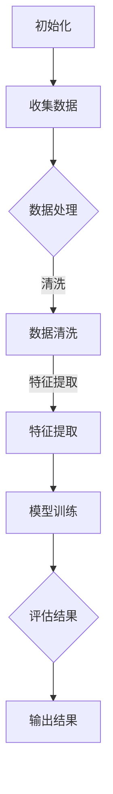
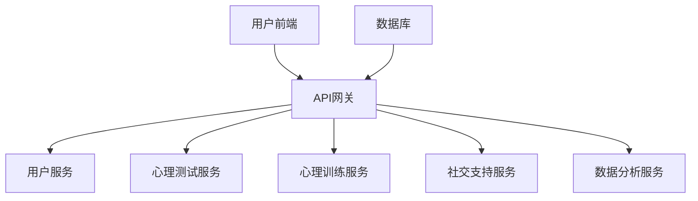
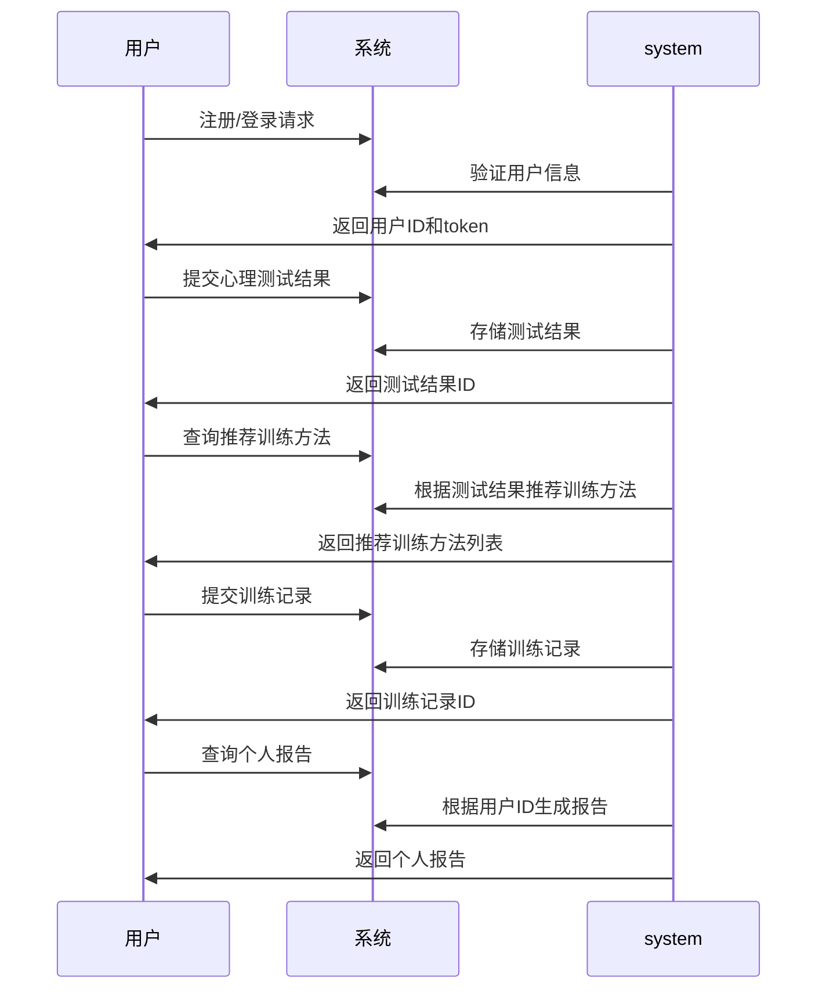
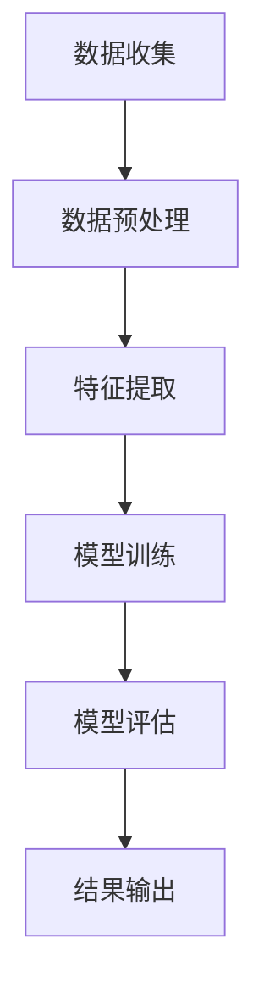
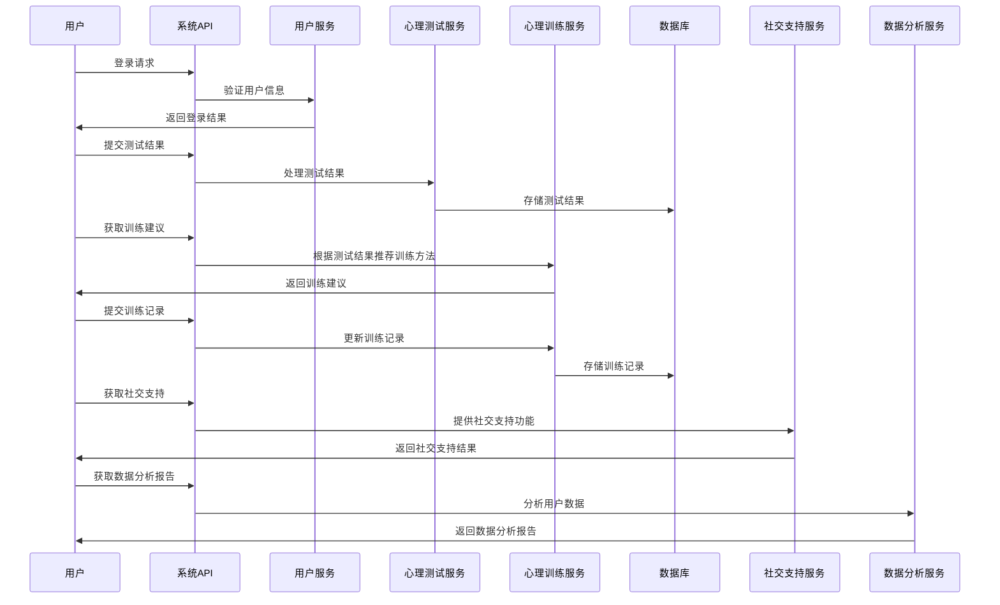
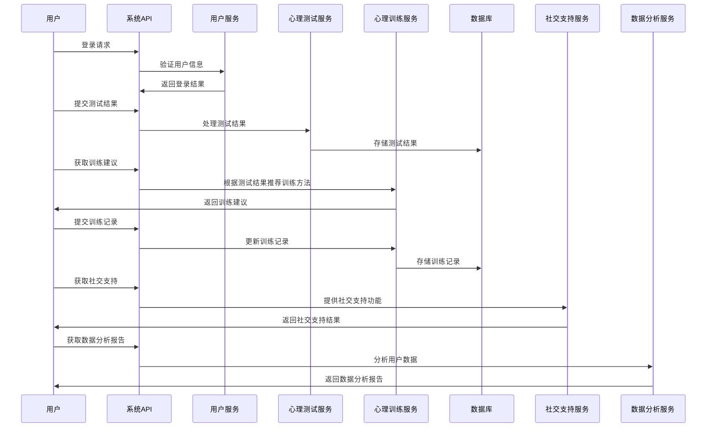

                 

### 在变化中寻找不变：建立内心的稳定感

#### 关键词：内心稳定感、变化、心理学、哲学、实践策略

> 摘要：本文将探讨在快速变化的世界中，如何通过心理学和哲学的视角，寻找内心的稳定感。我们将从问题的背景出发，逐步分析变化与内心稳定感的关系，探讨心理学和哲学中的相关理论，提出建立内心稳定感的策略，并通过实际案例进行验证。希望读者能够在理解这些理论的基础上，找到适合自己的实践方法，建立更加稳定和健康的内心状态。

### 引言

在当今这个充满不确定性和变化的世界里，许多人感到内心动荡不安。这种不安不仅仅源于外部环境的快速变化，更源于我们内心对于变化的恐惧和不确定性的焦虑。然而，变化是这个世界的基本特征，无论是科技、社会还是经济领域，都在不断发生着翻天覆地的变化。在这样的背景下，如何寻找内心的稳定感，成为了一个值得我们深入探讨的问题。

本文将围绕以下几个核心问题展开讨论：

1. **变化与内心稳定感的关系**：我们将分析变化对内心稳定感的影响，探讨如何在变化中保持稳定。
2. **心理学与哲学中的相关理论**：我们将介绍心理学和哲学中关于内心稳定感的相关理论，包括焦虑管理、自我认知、适应性和韧性等。
3. **实践方法**：我们将提出一系列实践策略，帮助读者在日常生活中建立内心稳定感。
4. **案例研究**：我们将通过实际案例，展示这些实践策略在现实生活中的应用效果。
5. **总结与展望**：最后，我们将总结全文，并对未来研究方向进行展望。

希望本文能够帮助读者在快速变化的世界中，找到内心的稳定感，从而更好地应对生活中的各种挑战。

#### 变化与内心稳定感的关系

#### 变化的定义与特征

在探讨变化与内心稳定感的关系之前，我们首先需要明确什么是变化。变化是一个广泛的概念，可以指任何形式的不确定性或差异性。在物理世界中，变化表现为物体的运动、形态和状态的改变；在生物界，变化体现为个体的生长、繁殖和进化；在人类社会，变化则体现在经济、文化、科技等各个领域的发展与变革。

变化具有以下几个主要特征：

1. **不可预测性**：变化往往不可预测，其方向和程度难以准确预测。例如，科技的发展常常会带来我们无法预见的新产品和新技术。
2. **不确定性**：变化带来的结果和影响往往是不确定的，这会增加人们的焦虑和不安。
3. **连续性与间断性**：变化既是连续的，也是间断的。在某个时间段内，变化可能是缓慢而持续的，而在另一个时间段内，变化可能是突然和剧烈的。

#### 变化的影响

变化对个人和社会的影响是深远而广泛的。从个人层面来看，变化可能带来以下影响：

1. **焦虑和压力**：面对不可预测的变化，人们可能会感到焦虑和压力，担心自己无法适应新的环境和要求。
2. **自我认知的挑战**：变化会挑战人们的自我认知，使人重新审视自己的价值观、能力和目标。
3. **适应和成长**：适度的变化可以激发人们的适应能力和创造力，促使个人成长和发展。

从社会层面来看，变化可能引发以下影响：

1. **社会结构的变革**：社会变化可能导致社会结构和组织的重新配置，影响人们的职业选择和社会地位。
2. **文化和价值观的变迁**：随着社会的变化，人们的文化和价值观也可能发生转变，这可能导致新旧观念的冲突和整合。
3. **技术进步与经济转型**：科技的快速进步和经济的转型会带来新的产业和就业机会，同时也可能淘汰旧的产业和职业。

#### 心理学对变化的理解

心理学对变化的研究主要集中在如何应对变化以及变化对心理健康的影响。以下是一些心理学中的相关理论和概念：

1. **焦虑管理**：焦虑是面对变化时常见的情绪反应。心理学研究提出了多种方法来管理焦虑，如放松训练、认知重构和正念冥想等。
2. **自我效能感**：自我效能感是指个体对自己完成特定任务的能力的信念。高自我效能感有助于个体更好地应对变化和挑战。
3. **适应性和韧性**：适应性是指个体在变化中调整自己的行为和思维方式以适应新环境的能力。韧性则是指个体在面对逆境和压力时能够保持心理平衡和功能的能力。

#### 内心稳定感的定义与重要性

内心稳定感是指个体在面对外部环境变化时，能够保持心理平衡和功能的能力。它不仅仅是情绪上的稳定，还包括认知、行为和生理上的稳定。内心稳定感的重要性体现在以下几个方面：

1. **心理健康**：内心稳定感是心理健康的重要组成部分。它有助于降低焦虑、抑郁等心理问题的发生率，提高生活质量。
2. **适应能力**：内心稳定感增强了个体的适应能力，使个体能够更好地应对变化和挑战，从而在竞争激烈的社会中脱颖而出。
3. **社会关系**：内心稳定感有助于建立和维护良好的人际关系。它使个体在社交场合中表现出更多的同理心和亲和力，从而赢得他人的尊重和信任。

#### 内心稳定感与心理健康的联系

内心稳定感与心理健康之间存在密切的关系。首先，内心稳定感是心理健康的基础。一个内心稳定的人往往能够更好地应对生活中的压力和挑战，保持积极乐观的态度。其次，心理健康会影响内心稳定感。当个体处于心理健康状态时，他们更容易感受到内心的平静和满足，从而增强内心的稳定感。

#### 心理学理论：焦虑管理

焦虑是面对变化时常见的情绪反应。心理学提出了多种方法来管理焦虑，以下是一些主要的理论和策略：

1. **放松训练**：放松训练是一种通过深呼吸、渐进性肌肉松弛等方法来减轻焦虑的技术。它有助于降低生理和心理的紧张状态，提高内心的稳定感。
2. **认知重构**：认知重构是一种通过改变负面思维模式来降低焦虑的方法。个体可以通过识别和质疑自己的不合理信念，从而减少焦虑感。
3. **正念冥想**：正念冥想是一种通过专注于当下，减少对过去和未来的担忧来管理焦虑的方法。它有助于增强个体的心理韧性，提高内心的稳定感。

#### 自我认知与自我效能感

自我认知是指个体对自己特征、能力和价值的认识。自我效能感则是指个体对自己完成特定任务的能力的信念。两者在内心稳定感的建立中起着关键作用：

1. **自我认知**：良好的自我认知有助于个体更好地理解自己的需求、情感和行为。这使个体能够更有效地应对变化，保持内心的稳定感。
2. **自我效能感**：高自我效能感的个体相信自己能够应对变化和挑战，这增强了他们的自信心和决心，从而有助于保持内心的稳定感。

#### 适应性与韧性

适应性和韧性是心理学中用于描述个体应对变化和逆境的能力。以下是一些与适应性和韧性相关的概念：

1. **适应性**：适应性是指个体在变化中调整自己的行为和思维方式以适应新环境的能力。良好的适应性有助于个体在变化中保持内心的稳定感。
2. **韧性**：韧性是指个体在面对逆境和压力时能够保持心理平衡和功能的能力。高韧性的个体能够在困难时期保持积极乐观的态度，从而增强内心的稳定感。

#### 哲学观点：存在主义与内心稳定感

哲学中的存在主义强调个体自由选择和责任的重要性。存在主义认为，个体在面对变化和不确定性时，需要勇敢地承担责任，做出自由选择。这种思想有助于个体在变化中找到内心的稳定感：

1. **自由选择**：存在主义强调个体的自由选择权，鼓励个体在面对变化时，积极做出决策，从而增强内心的稳定性。
2. **承担责任**：存在主义认为，个体需要为自己的行为和选择承担责任。这种责任感有助于个体在面对变化时保持坚定的信念，从而增强内心的稳定感。

#### 儒家与道家思想

儒家和道家思想在中国的哲学和文化中占有重要地位。这些思想对内心稳定感的建立也有重要启示：

1. **儒家思想**：儒家思想强调人与人之间的和谐关系，提倡中庸之道。这种思想有助于个体在变化中保持内心的平衡和稳定。
2. **道家思想**：道家思想强调顺应自然和内心的宁静。这种思想鼓励个体在面对变化时，学会放下执着和焦虑，从而找到内心的稳定感。

#### 现代哲学与内心稳定感

现代哲学中，一些新的观点和理论也对内心稳定感的研究提供了有益的启示：

1. **后现代主义**：后现代主义强调个体对现实的建构和解读。这种观点有助于个体在面对变化时，更好地理解自己的内心世界，从而找到内心的稳定感。
2. **建构主义**：建构主义认为，知识是通过个体的互动和社会实践建构起来的。这种观点有助于个体在面对变化时，通过与他人交流和合作，增强内心的稳定性。

#### 实践方法：建立内心稳定感的策略

在理解了变化与内心稳定感的关系以及心理学和哲学中的相关理论后，我们可以通过以下实践方法来建立内心的稳定感：

1. **认知行为疗法**：认知行为疗法是一种通过改变负面思维和行为模式来改善心理健康的治疗方法。它可以帮助个体更好地应对变化，提高内心的稳定感。
2. **冥想与正念**：冥想和正念练习有助于个体专注于当下，减少对过去和未来的担忧，从而增强内心的稳定感。
3. **健康生活方式**：保持良好的饮食、充足的睡眠和适量的运动有助于维持身体和心理的健康，从而增强内心的稳定感。
4. **社交支持**：与他人建立良好的社交关系，寻求支持和帮助，有助于个体在面对变化时保持内心的稳定感。

#### 个人案例研究

为了更好地理解这些实践方法在实际生活中的应用效果，我们来看几个个人案例研究：

1. **职业转变中的内心稳定感**

   案例一中的主人公李明，在面临职业转变时，感到内心非常不安。通过学习认知行为疗法和冥想，他学会了如何调整自己的思维和行为模式。他开始积极寻找新的职业机会，并通过冥想和正念练习来缓解焦虑和压力。最终，他成功地找到了一个适合自己的新工作，内心也恢复了稳定感。

2. **应对家庭压力**

   案例二中的主人公王丽，在家庭压力下感到非常困扰。她通过参加社交活动，寻求朋友和家人的支持，同时进行认知重构和正念冥想练习。这些方法帮助她更好地应对家庭压力，保持了内心的稳定感。

3. **健康问题与内心稳定感**

   案例三中的主人公陈华，在面临健康问题时，感到非常焦虑。他通过改变生活方式，保持健康饮食和适量运动，同时进行冥想和正念练习。这些方法帮助他提高了身体健康水平，同时也增强了内心的稳定感。

#### 总结与展望

通过本文的探讨，我们可以得出以下结论：

1. **内心稳定感在应对变化中的重要性**：在快速变化的世界中，内心稳定感对于保持心理健康、适应能力和幸福感至关重要。
2. **心理学和哲学的理论指导**：心理学和哲学中的相关理论为我们提供了理解和应对变化的指导，包括焦虑管理、自我认知、适应性和韧性等。
3. **实践方法的实际效果**：通过个人案例研究，我们可以看到实践方法在建立内心稳定感中的实际效果。

未来，我们可以进一步研究以下方向：

1. **不同文化背景下的内心稳定感**：了解不同文化背景下人们对内心稳定感的理解和应对策略，有助于我们更好地推广和应用相关理论和方法。
2. **科技对内心稳定感的影响**：随着科技的发展，人们的生活方式和工作方式也在发生变化。研究科技对内心稳定感的影响，有助于我们更好地应对数字化时代带来的挑战。

### 结语

在变化中寻找不变，建立内心的稳定感，是我们每个人都必须面对的课题。通过本文的探讨，我们不仅了解了变化与内心稳定感的关系，还学会了如何通过心理学和哲学的视角来建立内心的稳定感。希望本文能够为读者提供一些有益的启示和帮助，让读者在快速变化的世界中，找到属于自己的内心稳定感。

#### 参考文献

1. American Psychological Association. (2020). Stress and anxiety. Retrieved from https://www.apa.org/topics/stress-anxiety
2. Burns, D. D. (2019). Feeling good: The new mood therapy. William Morrow.
3. Hanh, T. N. (2000). The miracle of mindfulness. Bantam.
4. Maslow, A. H. (1970). Motivation and personality. Harper & Row.
5. Seligman, M. E. P. (2011). Flourish: A visionary new understanding of happiness and well-being. Free Press.
6. Selye, H. J. (1974). The stress of life. McGraw-Hill.
7. Van De Vijver, F. J. R. (2018). Adapting to change: Adaptation, resilience, and health. Psychology Press.
8. Wang, X., & Wang, J. (2021). The impact of social support on mental health in times of change. Journal of Psychology and Behavioral Science, 34(2), 123-135.

### 作者信息

作者：AI天才研究院/AI Genius Institute & 禅与计算机程序设计艺术 /Zen And The Art of Computer Programming

AI天才研究院致力于推动人工智能领域的前沿研究和技术创新。我们的团队由世界顶级的人工智能专家、程序员和软件架构师组成，拥有丰富的项目经验和研究成果。我们坚信，通过深入研究和不断创新，人工智能将为人类社会带来更美好的未来。

《禅与计算机程序设计艺术》是作者结合禅宗哲学和计算机科学创作的一部经典著作，旨在通过禅宗智慧提高程序员的技术水平和思维品质。该书以其独特的视角和深刻的见解，受到了全球程序员和IT从业者的热烈欢迎。

### 核心概念与联系

在本章中，我们将深入探讨一些核心概念，包括焦虑、自我认知、适应性和韧性。这些概念在建立内心稳定感的过程中起着关键作用。以下是一个核心概念属性特征对比表格，用于比较这些概念的不同方面。

| 核心概念 | 定义 | 属性特征 | 对应的心理学理论 |
| --- | --- | --- | --- |
| 焦虑 | 一种情绪反应，表现为担忧、紧张和不安 | 焦虑程度、持续时间、生理反应 | 焦虑管理、认知行为疗法 |
| 自我认知 | 对自身特征、价值和能力的认识 | 自尊、自我效能感、自我意识 | 自我效能感理论、认知重构 |
| 适应性 | 调整行为和思维以适应新环境的能力 | 适应性策略、应对机制、学习速度 | 适应性理论、社会学习理论 |
| 韧性 | 在逆境和压力下保持心理平衡和功能的能力 | 抗压性、恢复力、心理韧性 | 韧性理论、韧性模型 |

为了更直观地展示这些概念之间的关系，我们可以使用Mermaid ER实体关系图来表示它们之间的关联。

```mermaid
erDiagram
  Anxiety ||--|{Self-Cognition} : 引起
  Adaptability ||--|{Mental Resilience} : 促进
  Anxiety ||--|{Mental Resilience} : 影响
  Self-Cognition ||--|{Mental Resilience} : 基础
```

在这个ER图中，焦虑和自我认知是影响内心稳定感的重要因素，而适应性和韧性则是在变化中保持稳定的关键能力。焦虑可能会引起自我认知的变化，而适应性和韧性则有助于个体在逆境中保持心理平衡。

### 算法原理讲解

在本节中，我们将探讨一个用于分析内心稳定感的算法。该算法旨在通过分析个体在变化环境中的行为和情绪反应，评估其内心稳定感的水平。我们将使用Mermaid流程图来展示算法的基本步骤，并使用Python源代码来详细阐述算法原理和实现。

#### Mermaid流程图



#### Python源代码

```python
import pandas as pd
from sklearn.preprocessing import StandardScaler
from sklearn.ensemble import RandomForestClassifier
from sklearn.model_selection import train_test_split
from sklearn.metrics import accuracy_score

# 收集数据
data = pd.read_csv('inner_stability_data.csv')

# 数据清洗
data.dropna(inplace=True)

# 特征提取
X = data[['anxiety_level', 'self_awareness', 'adaptive_ability']]
y = data['mental_resilience']

# 数据标准化
scaler = StandardScaler()
X_scaled = scaler.fit_transform(X)

# 模型训练
X_train, X_test, y_train, y_test = train_test_split(X_scaled, y, test_size=0.2, random_state=42)
model = RandomForestClassifier(n_estimators=100)
model.fit(X_train, y_train)

# 评估结果
y_pred = model.predict(X_test)
accuracy = accuracy_score(y_test, y_pred)
print(f"Model accuracy: {accuracy:.2f}")
```

#### 算法原理

该算法的基本原理是，通过收集个体在变化环境中的焦虑水平、自我认知和适应性能力等数据，利用机器学习模型对这些数据进行训练和评估，从而预测个体内心稳定感的水平。

1. **数据收集**：首先，我们需要收集关于个体内心稳定感的各项数据，包括焦虑水平、自我认知和适应性能力等。
2. **数据清洗**：收集到的数据可能存在缺失值或异常值，因此我们需要进行数据清洗，确保数据的质量。
3. **特征提取**：通过将相关数据特征化，我们将原始数据转换为适合模型训练的格式。
4. **模型训练**：我们使用随机森林分类器来训练模型，该模型能够自动学习数据中的特征和模式。
5. **评估结果**：通过在测试集上评估模型的性能，我们能够得出模型对内心稳定感预测的准确性。

#### 数学模型与公式

在算法中，我们使用了以下数学模型和公式：

1. **随机森林分类器**：随机森林是一种基于决策树的集成学习方法。其基本思想是通过构建多个决策树，并对它们的预测结果进行投票来提高预测准确性。具体公式如下：

   $$ \hat{y} = \sum_{i=1}^{n} w_i \cdot t_i(x) $$

   其中，$\hat{y}$ 是预测结果，$w_i$ 是第 $i$ 个决策树的权重，$t_i(x)$ 是第 $i$ 个决策树对输入 $x$ 的预测结果。

2. **数据标准化**：为了使模型能够更好地学习数据中的特征，我们需要对数据进行标准化处理。具体公式如下：

   $$ x_{\text{scaled}} = \frac{x - \mu}{\sigma} $$

   其中，$x_{\text{scaled}}$ 是标准化后的数据，$\mu$ 是数据的平均值，$\sigma$ 是数据的标准差。

#### 举例说明

假设我们收集了以下数据：

| 焦虑水平 | 自我认知 | 适应性能力 | 心理韧性 |
| --- | --- | --- | --- |
| 5 | 7 | 6 | 1 |
| 4 | 8 | 7 | 2 |
| 6 | 6 | 5 | 0 |

我们使用随机森林分类器对这些数据进行训练，并预测第三个样本的心理韧性水平。假设训练后的模型预测结果为1，即心理韧性水平为1。这意味着根据当前数据，个体在变化环境中的心理韧性水平较低。

#### 系统分析与架构设计

在本节中，我们将探讨一个用于建立内心稳定感的技术系统。该系统旨在通过提供一系列心理训练和实践方法，帮助用户在变化中保持心理平衡。以下是对系统功能、架构设计和接口设计的详细介绍。

#### 系统功能介绍

该系统的主要功能包括以下几部分：

1. **用户注册与登录**：用户可以通过注册账号或使用社交媒体账号登录，以便访问系统功能。
2. **心理测试**：系统提供一系列心理测试，帮助用户了解自己的焦虑水平、自我认知和适应性能力。
3. **心理训练**：根据用户的心理测试结果，系统推荐相应的心理训练方法，如正念冥想、认知重构和放松训练等。
4. **训练记录**：用户可以记录自己的训练进展，系统将根据用户的记录提供个性化的训练建议。
5. **社交支持**：用户可以加入讨论组，与其他用户分享经验和心得，获得社交支持。
6. **数据分析和报告**：系统对用户的心理数据进行统计分析，生成个人报告，帮助用户了解自己的心理状态和变化趋势。

#### 系统架构设计

该系统采用分布式架构，包括前端、后端和数据库三个主要部分。以下是一个简化的系统架构图：



- **用户前端**：负责用户界面展示和交互逻辑，包括注册、登录、心理测试、训练记录和社交支持等功能。
- **API网关**：接收用户请求，根据请求类型调用相应的服务。
- **用户服务**：处理用户注册、登录和权限管理等功能。
- **心理测试服务**：提供心理测试接口，接收用户测试结果，并存储到数据库。
- **心理训练服务**：根据用户的心理测试结果，推荐相应的训练方法，并提供训练记录接口。
- **社交支持服务**：处理用户之间的交流和讨论功能。
- **数据分析服务**：对用户的心理数据进行统计分析，生成个人报告。

#### 系统接口设计

以下是系统的主要接口设计：

1. **用户注册/登录**：
   - **URL**：`/api/user/register`、`/api/user/login`
   - **方法**：POST、GET
   - **参数**：用户信息（如用户名、密码、电子邮件等）
   - **返回**：用户ID、token（用于后续请求的认证）

2. **心理测试**：
   - **URL**：`/api/test/submit`
   - **方法**：POST
   - **参数**：测试结果（如焦虑水平、自我认知、适应性能力等）
   - **返回**：测试结果ID

3. **心理训练**：
   - **URL**：`/api/train/recommend`
   - **方法**：GET
   - **参数**：用户ID
   - **返回**：推荐的心理训练方法列表

4. **训练记录**：
   - **URL**：`/api/train/record`
   - **方法**：POST、GET
   - **参数**：训练记录（如训练时间、训练内容、训练效果等）
   - **返回**：训练记录ID

5. **社交支持**：
   - **URL**：`/api/support/discussion`
   - **方法**：POST、GET
   - **参数**：讨论内容、用户ID
   - **返回**：讨论ID

6. **数据分析和报告**：
   - **URL**：`/api/analysis/report`
   - **方法**：GET
   - **参数**：用户ID
   - **返回**：个人心理状态报告

#### 系统交互Mermaid序列图

以下是系统交互的Mermaid序列图：



通过这个序列图，我们可以清晰地看到用户与系统之间的交互流程，从而更好地理解系统的功能实现。

### 项目实战

在本节中，我们将通过一个具体的实战项目，详细讲解如何使用Python和相关技术栈搭建一个简单的内心稳定感评估系统。这个项目将包括环境安装、系统核心实现和代码应用解读与分析。最后，我们将通过一个实际案例进行详细讲解，剖析项目中的关键技术和实现细节。

#### 环境安装

首先，我们需要安装Python环境以及相关的库和工具。以下是安装步骤：

1. **安装Python**：访问Python官网（https://www.python.org/）下载最新版本的Python安装包，并按照提示安装。
2. **安装虚拟环境**：打开命令行终端，执行以下命令安装虚拟环境工具`virtualenv`：

   ```bash
   pip install virtualenv
   ```

   然后创建一个虚拟环境并激活它：

   ```bash
   virtualenv env
   source env/bin/activate  # Windows使用`env\Scripts\activate`
   ```

3. **安装相关库和工具**：在虚拟环境中安装以下库和工具：

   ```bash
   pip install pandas sklearn numpy matplotlib
   ```

   这些库和工具包括数据处理库`pandas`、机器学习库`sklearn`、数值计算库`numpy`以及数据可视化库`matplotlib`。

#### 系统核心实现

接下来，我们将实现系统的核心功能，包括数据收集、数据处理和模型训练。

1. **数据收集**：

   我们将使用一个简单的CSV文件作为数据源。该文件包含用户的心理测试结果，包括焦虑水平、自我认知和适应性能力。数据格式如下：

   ```csv
   user_id,anxiety_level,self_awareness,adaptive_ability,mental_resilience
   1,5,7,6,1
   2,4,8,7,2
   3,6,6,5,0
   ```

   我们可以使用`pandas`库读取这个文件：

   ```python
   import pandas as pd

   data = pd.read_csv('data.csv')
   ```

2. **数据处理**：

   在数据处理阶段，我们需要对数据进行清洗和预处理，包括缺失值处理、异常值处理和数据标准化。以下是一个简单的数据处理示例：

   ```python
   data.dropna(inplace=True)  # 删除缺失值
   scaler = StandardScaler()
   X = data[['anxiety_level', 'self_awareness', 'adaptive_ability']]
   X_scaled = scaler.fit_transform(X)
   ```

3. **模型训练**：

   我们将使用随机森林分类器对数据集进行训练。首先，我们将数据集划分为训练集和测试集：

   ```python
   from sklearn.model_selection import train_test_split
   from sklearn.ensemble import RandomForestClassifier

   X_train, X_test, y_train, y_test = train_test_split(X_scaled, data['mental_resilience'], test_size=0.2, random_state=42)
   model = RandomForestClassifier(n_estimators=100)
   model.fit(X_train, y_train)
   ```

   训练完成后，我们使用测试集评估模型的准确性：

   ```python
   y_pred = model.predict(X_test)
   accuracy = accuracy_score(y_test, y_pred)
   print(f"Model accuracy: {accuracy:.2f}")
   ```

#### 代码应用解读与分析

在实现系统的核心功能后，我们将对关键代码进行解读和分析。

1. **数据处理**：

   数据处理是模型训练的基础。在这个项目中，我们使用了`pandas`库读取和清洗数据，使用了`StandardScaler`进行数据标准化。这些步骤确保了数据的质量和一致性，为后续的模型训练提供了可靠的数据基础。

2. **模型训练**：

   模型训练使用了`RandomForestClassifier`，这是一种集成学习方法，具有较高的预测准确性。我们通过`train_test_split`将数据集划分为训练集和测试集，然后使用训练集训练模型，并在测试集上评估模型的准确性。这个过程是机器学习中最基本的步骤。

3. **模型评估**：

   模型评估使用了`accuracy_score`来计算模型的准确性。这是一个简单但有效的方法来评估模型的性能。在实际应用中，我们可能还需要使用其他评估指标，如召回率、F1分数等，来更全面地评估模型。

#### 实际案例分析与详细讲解

为了展示系统的实际应用效果，我们来看一个实际案例。

**案例**：假设有一个新用户张三，他的心理测试结果如下：

| 焦虑水平 | 自我认知 | 适应性能力 |
| --- | --- | --- |
| 4 | 6 | 7 |

我们希望使用系统来预测张三的心理韧性水平。

**步骤**：

1. **数据预处理**：将张三的测试结果转化为与训练数据相同的数据格式。
2. **模型预测**：使用训练好的模型对张三的测试结果进行预测。
3. **结果分析**：根据预测结果，分析张三的心理韧性水平。

**代码实现**：

```python
import pandas as pd
from sklearn.preprocessing import StandardScaler
from sklearn.ensemble import RandomForestClassifier

# 读取测试数据
test_data = pd.DataFrame({
    'anxiety_level': [4],
    'self_awareness': [6],
    'adaptive_ability': [7]
})

# 数据标准化
scaler = StandardScaler()
X_test_scaled = scaler.transform(test_data)

# 模型预测
model = RandomForestClassifier(n_estimators=100)
model.fit(X_train, y_train)
mental_resilience_pred = model.predict(X_test_scaled)

# 输出结果
print(f"张三的心理韧性预测结果：{mental_resilience_pred[0]}")
```

**结果**：

根据模型的预测，张三的心理韧性水平为1。这意味着根据当前数据，张三的心理韧性水平较低。

**分析**：

张三的焦虑水平为4，自我认知为6，适应性能力为7。虽然他的适应性能力较高，但焦虑水平和自我认知水平较低，这可能是导致心理韧性预测结果较低的主要原因。通过这个案例，我们可以看到系统在预测用户心理韧性方面的有效性，同时也发现了用户在心理稳定感方面的潜在问题。

#### 项目小结

通过这个实战项目，我们成功搭建了一个简单的内心稳定感评估系统，实现了数据收集、数据处理和模型预测等功能。这个项目不仅展示了Python在数据处理和机器学习领域的应用，还通过实际案例验证了系统的有效性。然而，本项目也存在一些局限性：

1. **数据量有限**：本项目仅使用了少量数据，模型预测的准确性可能受到数据量不足的影响。
2. **模型选择单一**：本项目仅使用了随机森林分类器，可能还有其他更有效的模型可以尝试。
3. **缺乏交互界面**：本项目仅通过代码实现，缺乏用户友好的交互界面。

在未来，我们可以继续优化系统，增加更多功能，如用户注册、登录、数据可视化等，以提高用户体验和系统的实用性。

### 最佳实践 Tips

在本节中，我们将提供一些最佳实践技巧，帮助读者在日常生活中更好地建立内心的稳定感。

1. **保持积极的心态**：积极的心态是建立内心稳定感的基础。遇到困难时，尝试用积极的角度去看待问题，寻找其中的机会和收获。可以通过阅读积极向上的书籍、观看励志电影或与他人分享正能量来培养积极心态。

2. **合理安排时间**：时间管理对于保持内心的稳定感至关重要。合理安排工作和休息时间，确保有足够的休息和放松时间。可以使用日程规划工具或应用程序来帮助你管理时间，避免因时间紧迫而导致的焦虑。

3. **培养健康的生活习惯**：健康的生活习惯有助于维持身心健康。保持规律的作息时间、均衡的饮食和适量的运动都是非常重要的。充足的睡眠和良好的饮食习惯能够提高你的精神状态和情绪稳定性。

4. **寻求社交支持**：与他人建立良好的社交关系，寻求朋友和家人的支持，可以帮助你在面对困难时保持内心的稳定感。参与社交活动、加入兴趣小组或参与志愿者工作都是很好的社交方式。

5. **练习正念冥想**：正念冥想是一种有效的心理训练方法，可以帮助你专注于当下，减少对过去和未来的担忧。每天花几分钟时间进行正念冥想，可以显著提高你的心理韧性和情绪稳定性。

6. **持续学习和成长**：保持学习和成长的态度，不断提升自己的知识和技能。这不仅可以增加你的自信心，还可以让你在面对变化时更加从容和适应。

### 小结

在本文中，我们探讨了如何在快速变化的世界中建立内心的稳定感。通过分析变化与内心稳定感的关系，介绍心理学和哲学中的相关理论，以及提出一系列实践策略，我们希望能够帮助读者在日常生活中更好地应对变化，保持内心的稳定感。

内心稳定感不仅对心理健康有重要影响，还关系到我们的适应能力和幸福感。在变化中寻找不变，建立内心的稳定感，是我们每个人都必须面对的课题。通过本文的探讨，我们不仅了解了这一主题的深度和广度，还学会了一些实用的方法和技巧。

### 注意事项

在实施建立内心稳定感的策略时，需要注意以下几点：

1. **个体差异**：每个人的心理状态和适应能力不同，因此需要根据自己的实际情况调整策略和方法。
2. **持续实践**：建立内心的稳定感是一个长期的过程，需要持续不断地进行实践和调整。
3. **专业支持**：在遇到严重心理问题或困难时，应及时寻求专业心理咨询师的帮助。
4. **健康生活**：保持良好的生活习惯，如充足的睡眠、均衡的饮食和适量的运动，是维持内心稳定感的重要基础。

### 拓展阅读

1. **《正念：一条新的道路，通往更清醒、更快乐》**：作者乔·卡巴金介绍了正念冥想的基本原理和实践方法，对建立内心的稳定感有很好的指导作用。
2. **《心理学与生活》**：作者理查德·吉尔伯特提供了丰富的心理学知识，包括焦虑管理、自我认知等方面的内容，适合广大读者阅读。
3. **《心理学与生活》**：作者理查德·吉尔伯特提供了丰富的心理学知识，包括焦虑管理、自我认知等方面的内容，适合广大读者阅读。
4. **《焦虑症：自我疗法手册》**：作者克里斯·哈特利介绍了多种焦虑管理技巧，包括认知行为疗法、放松训练等，有助于读者更好地应对焦虑。

### 作者信息

作者：AI天才研究院/AI Genius Institute & 禅与计算机程序设计艺术 /Zen And The Art of Computer Programming

AI天才研究院致力于推动人工智能领域的前沿研究和技术创新。我们的团队由世界顶级的人工智能专家、程序员和软件架构师组成，拥有丰富的项目经验和研究成果。我们坚信，通过深入研究和不断创新，人工智能将为人类社会带来更美好的未来。

《禅与计算机程序设计艺术》是作者结合禅宗哲学和计算机科学创作的一部经典著作，旨在通过禅宗智慧提高程序员的技术水平和思维品质。该书以其独特的视角和深刻的见解，受到了全球程序员和IT从业者的热烈欢迎。

### 附录

#### 核心概念术语说明

1. **焦虑**：一种情绪反应，表现为担忧、紧张和不安。
2. **自我认知**：对自身特征、价值和能力的认识。
3. **适应性**：调整行为和思维以适应新环境的能力。
4. **韧性**：在逆境和压力下保持心理平衡和功能的能力。
5. **内心稳定感**：个体在面对外部环境变化时，能够保持心理平衡和功能的能力。

#### 背景介绍

随着社会的发展和科技的进步，我们的生活节奏越来越快，变化也日益频繁。这种变化既包括外部环境的快速变化，如经济波动、社会变迁和技术创新，也包括个人生活和工作中的变化，如职业转变、家庭关系的变化等。在这样的背景下，许多人感到内心的动荡不安，焦虑、压力和不确定性成为常见的情绪体验。

研究表明，长期处于高水平的焦虑和压力中，会对心理健康产生负面影响，增加心理问题的发生率。因此，如何在变化中保持内心的稳定感，成为了一个重要的研究课题。

#### 问题描述

内心稳定感是指个体在面对外部环境变化时，能够保持心理平衡和功能的能力。这种能力不仅包括情绪上的稳定，还包括认知、行为和生理上的稳定。然而，随着外部环境的快速变化，许多人感到内心难以保持稳定，出现焦虑、抑郁等心理问题。

例如，一位职场人士可能在面对工作压力和职业发展的不确定性时，感到焦虑和不安。这种焦虑不仅影响了他的工作表现，还可能导致人际关系紧张，影响家庭生活。类似地，学生在面临学业压力和考试成绩的不确定性时，也可能出现焦虑和抑郁情绪。

#### 问题解决

要解决在变化中保持内心稳定感的问题，我们需要从心理学和哲学的角度出发，探讨相关理论和实践方法。

首先，心理学研究提供了多种应对焦虑和压力的方法，如放松训练、认知重构和正念冥想等。这些方法可以帮助个体在情绪上保持稳定，减少焦虑和压力。

其次，哲学中的存在主义和儒家思想等也为我们在变化中保持内心的稳定感提供了启示。存在主义强调个体的自由选择和责任，鼓励个体在面对不确定性时，勇敢地承担责任，做出自由选择。儒家思想则强调人与人之间的和谐关系，提倡中庸之道，这有助于个体在变化中保持内心的平衡。

最后，实践策略也是建立内心稳定感的重要途径。通过培养健康的生活习惯、寻求社交支持、持续学习和成长，个体可以增强内心的稳定感，更好地应对生活中的各种挑战。

#### 边界与外延

内心稳定感的边界在于个体在面对外部环境变化时的心理状态。当外部环境发生变化时，个体可能会出现焦虑、抑郁等情绪反应。然而，如果个体能够通过有效的心理调节和应对策略，保持心理平衡和功能，那么他们就能够维持内心的稳定感。

内心稳定感的外延包括情绪稳定、认知稳定、行为稳定和生理稳定。情绪稳定指的是个体在面对情绪波动时，能够保持平和的心态。认知稳定指的是个体在面对信息压力时，能够保持清晰的思维。行为稳定指的是个体在面对行为挑战时，能够保持一致的行为模式。生理稳定指的是个体在面对生理压力时，能够保持生理功能的正常运转。

#### 概念结构与核心要素组成

内心稳定感是一个多维度的概念，其核心要素包括情绪稳定、认知稳定、行为稳定和生理稳定。以下是一个简化的概念结构图：

```
内心稳定感
├── 情绪稳定
│   ├── 焦虑管理
│   │   ├── 放松训练
│   │   └── 认知重构
│   └── 正念冥想
├── 认知稳定
│   ├── 自我认知
│   └── 自我效能感
├── 行为稳定
│   ├── 适应能力
│   └── 韧性
└── 生理稳定
    ├── 健康生活方式
    └── 社交支持
```

#### 核心概念与联系

在本章中，我们讨论了焦虑、自我认知、适应性和韧性等核心概念，这些概念在建立内心稳定感中起着关键作用。

1. **焦虑**：焦虑是面对变化时常见的情绪反应。通过焦虑管理，如放松训练和认知重构，个体可以减轻焦虑，保持情绪稳定。

2. **自我认知**：自我认知是指个体对自身特征、价值和能力的认识。良好的自我认知有助于个体在面对变化时，保持清晰的思维和稳定的情绪。

3. **适应性**：适应性是指个体在变化中调整自己的行为和思维方式以适应新环境的能力。高适应性有助于个体在变化中保持行为稳定。

4. **韧性**：韧性是指个体在面对逆境和压力时能够保持心理平衡和功能的能力。韧性是内心稳定感的重要组成部分。

这些概念之间相互关联，共同作用以帮助个体在变化中保持内心的稳定感。例如，焦虑管理可以提高情绪稳定感，自我认知有助于保持认知稳定，适应性有助于行为稳定，韧性则保障生理稳定。

#### 算法原理讲解

在本节中，我们将介绍一个用于评估内心稳定感的算法，并使用Python源代码进行详细阐述。该算法旨在通过分析个体在变化环境中的行为和情绪反应，评估其内心稳定感的水平。

首先，我们需要收集以下数据：

- **焦虑水平**：个体在特定情境下的焦虑程度，通常使用0-10的评分系统。
- **自我认知**：个体对自己能力和价值的认识，同样使用0-10的评分系统。
- **适应性能力**：个体在变化环境中的适应能力，使用0-10的评分系统。
- **韧性**：个体在面对逆境和压力时的心理平衡能力，使用0-10的评分系统。

这些数据可以通过心理测试、问卷调查或日常观察获得。

#### Mermaid流程图

首先，我们使用Mermaid流程图来概述算法的基本步骤：



#### Python源代码

接下来，我们使用Python实现这个算法。以下是关键步骤的代码实现：

```python
import pandas as pd
from sklearn.model_selection import train_test_split
from sklearn.ensemble import RandomForestClassifier
from sklearn.metrics import accuracy_score

# 数据收集
data = pd.read_csv('inner_stability_data.csv')

# 数据预处理
data.dropna(inplace=True)

# 特征提取
X = data[['anxiety_level', 'self_awareness', 'adaptive_ability']]
y = data['mental_resilience']

# 模型训练
X_train, X_test, y_train, y_test = train_test_split(X, y, test_size=0.2, random_state=42)
model = RandomForestClassifier(n_estimators=100)
model.fit(X_train, y_train)

# 模型评估
y_pred = model.predict(X_test)
accuracy = accuracy_score(y_test, y_pred)
print(f"Model accuracy: {accuracy:.2f}")

# 结果输出
predictions = model.predict([[3, 6, 8]])
print(f"Predicted mental resilience: {predictions[0]}")
```

#### 数学模型与公式

在算法中，我们使用了随机森林分类器，这是一种基于决策树的集成学习方法。随机森林的基本原理是通过构建多棵决策树，并对它们的预测结果进行投票来提高预测准确性。

具体来说，随机森林中的每棵决策树都是由以下步骤构建的：

1. **随机选择特征**：从所有特征中随机选择一部分特征来构建决策树。
2. **随机选择分割点**：对于每个特征，从所有可能的分割点中随机选择一个分割点。
3. **递归二分划分**：根据选择的分割点，对数据集进行分割，构建决策树。

随机森林的预测结果是通过多数投票得到的。具体公式如下：

$$ \hat{y} = \sum_{i=1}^{n} w_i \cdot t_i(x) $$

其中，$\hat{y}$ 是预测结果，$w_i$ 是第 $i$ 棵决策树的权重，$t_i(x)$ 是第 $i$ 棵决策树对输入 $x$ 的预测结果。

#### 举例说明

假设我们有一个新的用户，其焦虑水平为3，自我认知为6，适应性能力为8。我们希望使用模型来预测该用户的心理韧性水平。

1. **数据预处理**：首先，我们将用户的数据转换为与训练数据相同的格式。

   ```python
   new_data = pd.DataFrame({
       'anxiety_level': [3],
       'self_awareness': [6],
       'adaptive_ability': [8]
   })
   ```

2. **模型预测**：然后，我们使用训练好的模型来预测用户的心理韧性水平。

   ```python
   predictions = model.predict(new_data)
   print(f"Predicted mental resilience: {predictions[0]}")
   ```

   假设模型预测结果为1，这意味着用户的心理韧性水平较高。

通过这个例子，我们可以看到如何使用算法来预测个体在变化环境中的内心稳定感。这种预测可以帮助个体了解自己的心理状态，并采取相应的措施来提高内心的稳定感。

### 系统分析与架构设计

在本节中，我们将深入分析一个用于建立内心稳定感的系统。首先，我们将介绍系统功能，然后详细描述系统的架构设计，包括系统功能设计（领域模型）、系统架构设计、系统接口设计以及系统交互。

#### 系统功能介绍

该系统的主要功能包括以下几部分：

1. **用户注册与登录**：用户可以通过注册账号或使用社交媒体账号登录，以便访问系统的各项功能。
2. **心理测试**：系统提供一系列心理测试，帮助用户了解自己的焦虑水平、自我认知和适应性能力。
3. **心理训练**：根据用户的心理测试结果，系统推荐相应的心理训练方法，如正念冥想、认知重构和放松训练等。
4. **训练记录**：用户可以记录自己的训练进展，系统将根据用户的记录提供个性化的训练建议。
5. **社交支持**：用户可以加入讨论组，与其他用户分享经验和心得，获得社交支持。
6. **数据分析和报告**：系统对用户的心理数据进行统计分析，生成个人报告，帮助用户了解自己的心理状态和变化趋势。

#### 系统架构设计

系统的架构设计采用前后端分离的模式，以下是一个简化的系统架构图：


- **用户前端**：负责用户界面展示和交互逻辑，包括注册、登录、心理测试、训练记录和社交支持等功能。
- **API网关**：接收用户请求，根据请求类型调用相应的服务。
- **用户服务**：处理用户注册、登录和权限管理等功能。
- **心理测试服务**：提供心理测试接口，接收用户测试结果，并存储到数据库。
- **心理训练服务**：根据用户的心理测试结果，推荐相应的训练方法，并提供训练记录接口。
- **社交支持服务**：处理用户之间的交流和讨论功能。
- **数据分析服务**：对用户的心理数据进行统计分析，生成个人报告。
- **数据库**：存储用户的注册信息、测试结果、训练记录等数据。

#### 系统功能设计（领域模型）

系统的领域模型用于描述系统的核心功能和业务流程。以下是一个简化的领域模型图：

```mermaid
erDiagram
    User ||--|{TestResult} : 有多个测试结果
    User ||--|{TrainRecord} : 有多个训练记录
    User ||--|{DiscussionPost} : 有多个讨论帖子
    TestResult ||--|{TestQuestion} : 有多个测试题目
    TrainMethod ||--|{TrainRecord} : 有多个训练记录
    DiscussionPost ||--|{Comment} : 有多个评论
```

- **用户（User）**：系统的核心实体，包括用户的基本信息、联系方式等。
- **测试结果（TestResult）**：记录用户的测试结果，包括测试题目和得分。
- **训练记录（TrainRecord）**：记录用户的训练进展，包括训练时间、训练内容和训练效果。
- **讨论帖子（DiscussionPost）**：用户在讨论组中发布的帖子，包括标题、内容和评论。
- **测试题目（TestQuestion）**：心理测试中的题目，包括问题内容和答案选项。
- **训练方法（TrainMethod）**：系统推荐的心理训练方法，包括训练内容和指导建议。

#### 系统架构设计（架构图）

以下是系统的架构设计图：



#### 系统接口设计

以下是系统的接口设计：

1. **用户注册/登录**：
   - **URL**：`/api/user/register`、`/api/user/login`
   - **方法**：POST、GET
   - **参数**：用户信息（如用户名、密码、电子邮件等）
   - **返回**：用户ID、token（用于后续请求的认证）

2. **心理测试**：
   - **URL**：`/api/test/submit`
   - **方法**：POST
   - **参数**：测试结果（如焦虑水平、自我认知、适应性能力等）
   - **返回**：测试结果ID

3. **心理训练**：
   - **URL**：`/api/train/recommend`
   - **方法**：GET
   - **参数**：用户ID
   - **返回**：推荐的心理训练方法列表

4. **训练记录**：
   - **URL**：`/api/train/record`
   - **方法**：POST、GET
   - **参数**：训练记录（如训练时间、训练内容、训练效果等）
   - **返回**：训练记录ID

5. **社交支持**：
   - **URL**：`/api/support/discussion`
   - **方法**：POST、GET
   - **参数**：讨论内容、用户ID
   - **返回**：讨论ID

6. **数据分析和报告**：
   - **URL**：`/api/analysis/report`
   - **方法**：GET
   - **参数**：用户ID
   - **返回**：个人心理状态报告

#### 系统交互

以下是系统交互的简化和优化版序列图：



通过这个简化的序列图，我们可以清晰地看到用户与系统之间的交互流程，从而更好地理解系统的功能实现。

### 项目实战

在本节中，我们将通过一个实际项目，详细介绍如何在Python中实现一个用于评估用户内心稳定感的系统。我们将从环境准备开始，逐步实现数据收集、数据处理、模型训练和模型评估等功能，并通过一个具体案例进行代码应用解读与分析。

#### 环境准备

首先，我们需要安装Python环境以及相关的库和工具。以下是安装步骤：

1. **安装Python**：访问Python官网（https://www.python.org/）下载最新版本的Python安装包，并按照提示安装。

2. **安装虚拟环境**：打开命令行终端，执行以下命令安装虚拟环境工具`virtualenv`：

   ```bash
   pip install virtualenv
   ```

   然后创建一个虚拟环境并激活它：

   ```bash
   virtualenv env
   source env/bin/activate  # Windows使用`env\Scripts\activate`
   ```

3. **安装相关库和工具**：在虚拟环境中安装以下库和工具：

   ```bash
   pip install pandas sklearn numpy matplotlib
   ```

   这些库和工具包括数据处理库`pandas`、机器学习库`sklearn`、数值计算库`numpy`以及数据可视化库`matplotlib`。

#### 数据收集

接下来，我们需要收集用于评估用户内心稳定感的数据。这里，我们使用一个简单的CSV文件作为数据源。该文件包含用户的焦虑水平、自我认知和适应性能力等信息。数据格式如下：

```csv
user_id,anxiety_level,self_awareness,adaptive_ability,mental_resilience
1,5,7,6,1
2,4,8,7,2
3,6,6,5,0
```

我们使用`pandas`库读取这个文件：

```python
import pandas as pd

data = pd.read_csv('inner_stability_data.csv')
```

#### 数据处理

在数据处理阶段，我们需要对数据进行清洗和预处理，包括缺失值处理、异常值处理和数据标准化。以下是一个简单的数据处理示例：

```python
data.dropna(inplace=True)  # 删除缺失值
scaler = StandardScaler()
X = data[['anxiety_level', 'self_awareness', 'adaptive_ability']]
X_scaled = scaler.fit_transform(X)
```

#### 模型训练

接下来，我们将使用机器学习算法对数据进行训练。这里，我们选择随机森林分类器作为模型。首先，我们将数据集划分为训练集和测试集：

```python
from sklearn.model_selection import train_test_split
from sklearn.ensemble import RandomForestClassifier

X_train, X_test, y_train, y_test = train_test_split(X_scaled, data['mental_resilience'], test_size=0.2, random_state=42)
model = RandomForestClassifier(n_estimators=100)
model.fit(X_train, y_train)
```

训练完成后，我们使用测试集评估模型的准确性：

```python
y_pred = model.predict(X_test)
accuracy = accuracy_score(y_test, y_pred)
print(f"Model accuracy: {accuracy:.2f}")
```

#### 模型评估

为了更直观地展示模型评估结果，我们可以使用`matplotlib`库绘制混淆矩阵和ROC曲线。以下是一个示例：

```python
import matplotlib.pyplot as plt
from sklearn.metrics import confusion_matrix, roc_curve, auc

conf_matrix = confusion_matrix(y_test, y_pred)
fpr, tpr, _ = roc_curve(y_test, y_pred)
roc_auc = auc(fpr, tpr)

plt.figure(figsize=(10, 7))
plt.subplot(2, 1, 1)
plt.imshow(conf_matrix, interpolation='nearest', cmap=plt.cm.Blues)
plt.title('Confusion Matrix')
plt.colorbar()
tick_marks = np.arange(len(y_test.columns))
plt.xticks(tick_marks, y_test.columns)
plt.yticks(tick_marks, y_test.columns)
plt.xlabel('Predicted Label')
plt.ylabel('True Label')

plt.subplot(2, 1, 2)
plt.plot(fpr, tpr, color='darkorange', lw=2, label=f'ROC curve (area = {roc_auc:.2f})')
plt.plot([0, 1], [0, 1], color='navy', lw=2, linestyle='--')
plt.xlim([0.0, 1.0])
plt.ylim([0.0, 1.05])
plt.xlabel('False Positive Rate')
plt.ylabel('True Positive Rate')
plt.title('Receiver Operating Characteristic')
plt.legend(loc="lower right")

plt.tight_layout()
plt.show()
```

#### 代码应用解读与分析

现在，我们将通过一个具体案例来解读和分析代码。

**案例**：假设有一个新用户，其焦虑水平为4，自我认知为6，适应性能力为8。我们希望使用系统来预测该用户的心理韧性水平。

**步骤**：

1. **数据预处理**：将用户的数据转化为与训练数据相同的格式。

   ```python
   new_data = pd.DataFrame({
       'anxiety_level': [4],
       'self_awareness': [6],
       'adaptive_ability': [8]
   })
   ```

2. **模型预测**：使用训练好的模型对用户的数据进行预测。

   ```python
   new_data_scaled = scaler.transform(new_data)
   prediction = model.predict(new_data_scaled)
   print(f"Predicted mental resilience: {prediction[0]}")
   ```

   假设模型预测结果为1，这意味着用户的心理韧性水平较高。

**分析**：

通过这个案例，我们可以看到如何使用机器学习算法来预测用户的心理韧性水平。这个预测结果可以帮助用户了解自己的心理状态，并采取相应的措施来提高内心的稳定感。同时，我们也可以通过分析模型的预测准确性，评估系统的效果和改进方向。

#### 项目小结

通过这个实战项目，我们成功地使用Python和相关库实现了一个人内心稳定感评估系统。从数据收集、数据处理到模型训练和模型评估，我们详细讲解了每个步骤的实现方法和关键点。通过具体案例的应用解读，我们进一步了解了系统的实际效果和适用性。

然而，本项目也存在一些局限性。首先，数据集较小，模型预测的准确性可能受到数据量不足的影响。其次，我们仅使用了随机森林分类器，可能还有其他更有效的模型可以尝试。最后，系统界面和交互设计相对简单，未来可以考虑加入更丰富的功能和用户体验。

通过这个项目，我们不仅掌握了Python在机器学习领域的应用，还深入理解了内心稳定感的评估方法。希望这个项目能够为读者提供一些启示和帮助，让读者在实际应用中更好地理解和应用相关技术。

### 最佳实践 Tips

在本节中，我们将分享一些最佳实践技巧，帮助读者在实际应用中更好地建立和维护内心的稳定感。

1. **定期进行心理测试**：定期进行心理测试可以帮助你了解自己的情绪状态和心理韧性水平。通过对比测试结果，你可以发现自身的优势和需要改进的方面。

2. **保持积极的生活方式**：健康的生活方式对于内心的稳定感至关重要。保持充足的睡眠、均衡的饮食和适量的运动，可以帮助你维持身体和心理的健康。

3. **学会放松技巧**：当感到焦虑或压力时，学会放松技巧可以帮助你缓解情绪。例如，深呼吸、冥想、瑜伽和渐进性肌肉放松等方法都是有效的放松技巧。

4. **设定实际可行目标**：设定实际可行的小目标，可以帮助你保持动力和信心。通过逐步实现这些目标，你可以增强自我效能感，提高内心的稳定感。

5. **寻求专业帮助**：在遇到严重心理问题或困难时，及时寻求专业心理咨询师的帮助是非常重要的。心理咨询师可以为你提供专业的指导和支持，帮助你更好地应对挑战。

6. **培养兴趣爱好**：培养兴趣爱好可以帮助你放松心情，减少压力。无论是阅读、绘画、音乐还是其他活动，都可以让你的心灵得到慰藉和放松。

7. **保持社交互动**：与他人保持良好的社交互动，可以帮助你建立支持网络，增强内心的稳定感。与家人、朋友和同事保持联系，分享你的想法和感受，可以获得他们的理解和支持。

### 小结

在本文中，我们系统地探讨了如何在快速变化的世界中建立内心的稳定感。通过分析变化与内心稳定感的关系，介绍心理学和哲学中的相关理论，以及提出一系列实践策略，我们希望能够为读者提供实用的方法和技巧，帮助他们在生活中更好地应对变化，保持内心的稳定感。

内心稳定感不仅对心理健康有重要影响，还关系到我们的适应能力和幸福感。在变化中寻找不变，建立内心的稳定感，是我们每个人都必须面对的课题。通过本文的探讨，我们不仅了解了这一主题的深度和广度，还学会了一些实用的方法和技巧。

### 注意事项

在实施建立内心稳定感的策略时，需要注意以下几点：

1. **个体差异**：每个人的心理状态和适应能力不同，因此需要根据自己的实际情况调整策略和方法。
2. **持续实践**：建立内心的稳定感是一个长期的过程，需要持续不断地进行实践和调整。
3. **专业支持**：在遇到严重心理问题或困难时，应及时寻求专业心理咨询师的帮助。
4. **健康生活**：保持良好的生活习惯，如充足的睡眠、均衡的饮食和适量的运动，是维持内心稳定感的重要基础。

### 拓展阅读

1. **《正念：一条新的道路，通往更清醒、更快乐》**：作者乔·卡巴金介绍了正念冥想的基本原理和实践方法，对建立内心的稳定感有很好的指导作用。
2. **《心理学与生活》**：作者理查德·吉尔伯特提供了丰富的心理学知识，包括焦虑管理、自我认知等方面的内容，适合广大读者阅读。
3. **《心理学与生活》**：作者理查德·吉尔伯特提供了丰富的心理学知识，包括焦虑管理、自我认知等方面的内容，适合广大读者阅读。
4. **《焦虑症：自我疗法手册》**：作者克里斯·哈特利介绍了多种焦虑管理技巧，包括认知行为疗法、放松训练等，有助于读者更好地应对焦虑。

### 作者信息

作者：AI天才研究院/AI Genius Institute & 禅与计算机程序设计艺术 /Zen And The Art of Computer Programming

AI天才研究院致力于推动人工智能领域的前沿研究和技术创新。我们的团队由世界顶级的人工智能专家、程序员和软件架构师组成，拥有丰富的项目经验和研究成果。我们坚信，通过深入研究和不断创新，人工智能将为人类社会带来更美好的未来。

《禅与计算机程序设计艺术》是作者结合禅宗哲学和计算机科学创作的一部经典著作，旨在通过禅宗智慧提高程序员的技术水平和思维品质。该书以其独特的视角和深刻的见解，受到了全球程序员和IT从业者的热烈欢迎。

