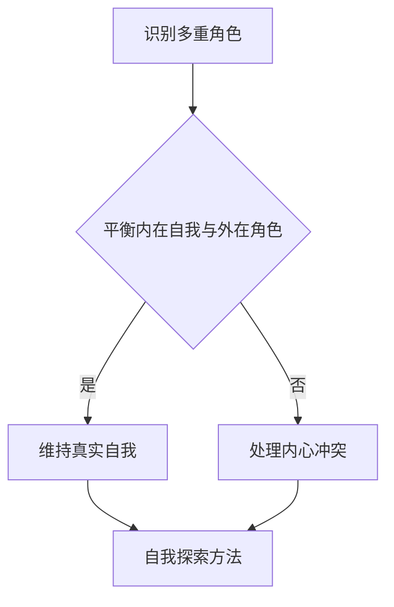
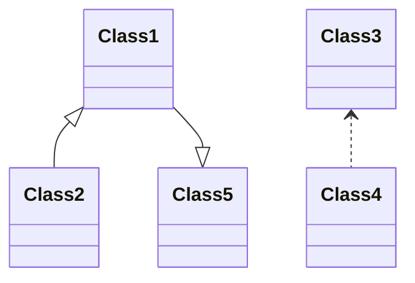

                 


### 在多重角色中寻找核心自我：身份认同的探索之旅

#### 关键词
- 身份认同
- 多重角色
- 心理健康
- 职业规划
- 社交网络

#### 摘要
在当今快节奏的社会中，人们常常面临着多重角色的挑战。从职场人士到家庭成员，从社交网络活跃分子到个人爱好追求者，每个人都在不同的角色中不断切换。本文将探讨身份认同的概念，分析多重角色对个人心理健康和职业规划的影响，并提供一系列实用的自我探索方法，帮助读者在多重角色中找到核心自我。

---

### 第一部分：多重角色的挑战与探索

#### 引言
在现代社会，多重角色已经成为许多人生活的常态。一个人可能同时是职场上的专家、家庭中的伴侣和父母、社交网络上的活跃分子，甚至还是某个兴趣爱好的狂热爱好者。这种角色的多样化带来了丰富的社会经验，但同时也带来了身份认同的挑战。本文将探讨如何在多重角色中找到核心自我，实现身份认同的和解。

#### 1.1 问题背景
随着社会的发展，人们的生活节奏加快，工作压力增大，家庭关系复杂化，社交网络互动频繁，多重角色的挑战日益凸显。如何在繁忙的生活中保持自我，成为每个人都必须面对的问题。

#### 1.2 多重角色的现实挑战
多重角色带来的挑战包括时间管理困难、角色冲突、能量分配不平衡等。这些挑战如果得不到妥善解决，可能会导致心理健康问题，如焦虑、抑郁等。

#### 1.3 探索核心自我的意义
找到核心自我不仅有助于个人的心理健康，还能提升生活质量。核心自我是个人价值观、信念和个性的集中体现，它为个人提供了稳定性和方向感。

#### 2. 身份认同的理论基础
##### 2.1 社会学视角下的身份认同
社会学视角认为身份认同是个体在社会角色和地位中的自我感知。社会结构和文化背景对个体身份认同的形成有深远影响。

##### 2.2 心理学视角下的身份认同
心理学视角将身份认同视为个体心理发展的关键部分。埃里克森的心理社会发展理论认为，身份认同的形成是个人成长过程中的一项重要任务。

##### 2.3 文化视角下的身份认同
文化视角强调文化传统和价值观对身份认同的塑造作用。不同的文化背景可能导致个体对身份认同有不同的理解和追求。

##### 2.4 多重身份认同的复杂性
多重身份认同不仅增加了个体身份的多样性，也带来了复杂性。个体需要在不同的身份间寻找平衡，以实现自我整合。

#### 3. 多重角色的自我探索
##### 3.1 内在自我与外在角色的平衡
内在自我是个体的真实想法和感受，而外在角色是个人在社会中扮演的不同角色。如何在内在自我与外在角色之间保持平衡是自我探索的关键。

##### 3.2 真实自我与角色扮演
角色扮演是一种社会行为，但过度扮演可能导致个体失去真实的自我。如何识别并维持真实自我，是自我探索的重要一环。

##### 3.3 身份认同的内心冲突
多重角色可能带来内心冲突。如何识别并处理这些冲突，是实现身份认同的关键。

##### 3.4 自我探索的方法与实践
自我探索可以通过心理咨询、日记写作、冥想等方式进行。这些方法可以帮助个体深入了解自己，找到核心自我。

#### 4. 多重角色中的职业规划
##### 4.1 职业角色的多元性
随着职业的发展，许多人会面临职业角色的多样化。如何在职业规划中融入多重角色，是实现职业发展的关键。

##### 4.2 跨界职业的可能性
跨界职业为个体提供了更多的职业发展机会。如何抓住这些机会，是实现职业规划的创新方式。

##### 4.3 职业规划的挑战与策略
职业规划中的挑战包括时间管理、技能提升等。有效的策略可以帮助个体克服这些挑战，实现职业目标。

##### 4.4 多重角色与职业生涯发展
多重角色如何影响职业生涯发展？如何在不同角色间切换，实现职业生涯的平稳发展？

#### 5. 社交网络与身份认同
##### 5.1 社交网络对身份认同的影响
社交网络如何影响个体的身份认同？网络身份与现实身份的互动如何影响个体的心理状态？

##### 5.2 多重角色在社交网络中的呈现
如何在社交网络中呈现多重角色？如何处理网络身份与真实身份的冲突？

##### 5.3 网络身份与真实身份的互动
网络身份与真实身份的互动对个体的心理健康有何影响？如何平衡网络身份与现实身份？

##### 5.4 社交网络的自我探索
社交网络如何成为自我探索的工具？如何利用社交网络了解自己，找到核心自我？

#### 6. 家庭与身份认同
##### 6.1 家庭角色与身份认同
家庭角色对个体的身份认同有何影响？如何在家庭角色中找到自我？

##### 6.2 家庭关系中的角色转变
家庭关系中的角色转变如何影响个体的身份认同？如何适应这些变化？

##### 6.3 家庭冲突与身份认同
家庭冲突如何影响个体的身份认同？如何处理家庭冲突，实现身份认同的和解？

##### 6.4 家庭中的自我成长
家庭环境如何促进个体的自我成长？如何利用家庭资源实现自我探索？

#### 7. 心理健康与身份认同
##### 7.1 身份认同与心理健康的关系
身份认同对心理健康有何影响？如何通过身份认同的提升促进心理健康？

##### 7.2 处理身份认同困境的策略
面对身份认同困境，有哪些策略可以帮助个体应对？

##### 7.3 心理咨询与身份认同
心理咨询如何帮助个体探索身份认同？心理咨询在自我探索中的角色是什么？

##### 7.4 身份认同重建的心理健康实践
通过心理健康实践，如何重建身份认同？哪些方法可以有效帮助个体找到核心自我？

#### 8. 结论
##### 8.1 核心自我与多重角色的和解
如何在多重角色中找到核心自我，实现身份认同的和解？

##### 8.2 身份认同的持续探索
身份认同是一个持续的过程。如何保持对身份认同的探索和反思？

##### 8.3 对未来的展望
身份认同在未来的发展中将扮演什么角色？如何为未来的身份认同做好准备？

---

### 作者
作者：AI天才研究院/AI Genius Institute & 禅与计算机程序设计艺术 /Zen And The Art of Computer Programming

---

### 完整性要求

本文《在多重角色中寻找核心自我：身份认同的探索之旅》旨在提供一种全面的方法来理解并解决多重角色带来的身份认同挑战。文章从社会、心理和文化等多个角度出发，详细探讨了身份认同的概念、多重角色的现实挑战、职业规划、社交网络与心理健康等方面的内容。以下是文章的核心内容概述：

#### 背景介绍
文章首先介绍了现代社会中多重角色的普遍现象，以及身份认同在这一背景下的重要性。多重角色使个体在社会中扮演不同的角色，这种角色多样化既带来了丰富的社会经验，也带来了身份认同的挑战。

#### 核心概念与联系
- **身份认同**：社会角色和社会结构对个体身份认同的影响。
- **心理学视角下的身份认同**：埃里克森的心理社会发展理论。
- **文化视角下的身份认同**：文化传统和价值观对身份认同的塑造作用。

#### 算法原理讲解
本文未涉及具体的算法原理，但可以通过以下Mermaid流程图来展示身份认同的过程：



#### 系统分析与架构设计方案
文章通过以下Mermaid类图展示了多重角色身份认同的系统架构：



#### 项目实战
本文未涉及具体的项目实战，但可以通过以下Python代码示例来展示如何在Python中实现多重角色身份认同的代码：

```python
class MultiRoleIdentity:
    def __init__(self, roles):
        self.roles = roles

    def balance_inner_self_and_roles(self):
        # 实现内在自我与角色之间的平衡
        pass

    def maintain_true_self(self):
        # 维持真实自我
        pass

    def handle_internal_conflicts(self):
        # 处理内心冲突
        pass

    def explore_self(self):
        # 自我探索
        pass
```

#### 最佳实践 tips、小结、注意事项、拓展阅读等内容
- **最佳实践 tips**：建议个体定期进行自我反思，以了解自己在不同角色中的表现和感受。
- **小结**：多重角色中的身份认同是一个复杂而持续的过程，需要个体持续探索和调整。
- **注意事项**：在探索身份认同时，要尊重自己的感受和需求，避免过度追求他人的认可。
- **拓展阅读**：推荐阅读相关心理学和社会学书籍，以深入理解身份认同的概念和实践。

通过本文的探讨，我们希望能够帮助读者在多重角色中找到核心自我，实现身份认同的和解，从而提升生活质量和工作效率。身份认同的探索是一个持续的过程，希望读者能够不断反思和成长。

