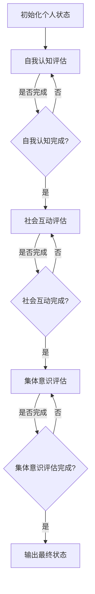
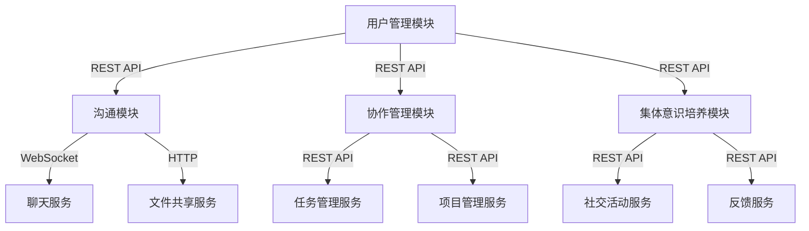
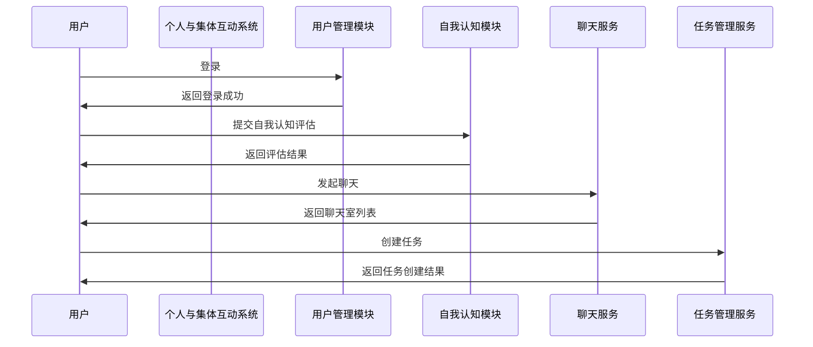

                 

# 大背景中定位自我：编织个人与集体的故事

## 引言

在当今信息爆炸和技术迅猛发展的时代，个人与集体之间的关系变得尤为复杂。社会结构的多元化、职业角色的多样性和人际交往的复杂性使得每个人都在努力寻找自己的定位，构建与社会的和谐关系。本书《在大背景中定位自我：编织个人与集体的故事》旨在探讨如何在这样的背景下，实现个人的自我认知、社会互动和集体意识，从而在个人与集体之间找到平衡点，编织出有意义的生命故事。

本文将遵循“LET'S THINK STEP BY STEP”的思路，逐步解析以下核心主题：

1. **背景介绍：核心概念**
   - 问题背景、问题描述、问题解决、边界与外延、概念结构与核心要素组成。
   - 核心概念原理和ER实体关系图架构的Mermaid流程图。

2. **核心概念与联系**
   - 自我认知的原理、社会互动的原理、集体意识的原理。
   - 概念属性特征对比表格。

3. **算法原理讲解**
   - 使用Mermaid画出算法流程图。
   - 使用Python源代码详细阐述算法原理、数学模型和公式。

4. **系统分析与架构设计方案**
   - 问题场景介绍。
   - 系统功能设计、系统架构设计、系统接口设计、系统交互序列图。

5. **项目实战**
   - 环境安装、系统核心实现源代码、代码应用解读与分析、实际案例分析和详细讲解剖析。

6. **最佳实践 tips、小结、注意事项、拓展阅读**

## 背景介绍：核心概念

### 问题背景

在当今快速变化的社会中，个体面临着前所未有的挑战。一方面，技术进步和全球化使得信息流通更加迅速，社会结构变得更加多元化。另一方面，社会压力、工作与生活的平衡、职业发展等问题不断加剧，个体需要更加清晰地认识自我，寻找自我价值。在这种背景下，个人与集体之间的关系变得更加复杂和重要。

### 问题描述

个体在追求自我实现的过程中，往往面临以下问题：

1. **自我定位模糊**：在多元化和快速变化的社会中，个体难以找到自己的位置，感到迷茫和不安。
2. **社会压力增大**：工作和生活的压力使得个体感到孤独和焦虑，难以在个人与集体之间找到平衡。
3. **价值观冲突**：在追求个人价值的同时，个体可能面临与集体价值观的冲突，导致内心的困惑。

### 问题解决

本书通过深入分析社会背景、个人心理和社会互动，提供了一系列方法和策略，帮助读者：

1. **理解自我与社会的相互关系**：通过自我认知和社会互动，了解自己在社会中的角色和责任。
2. **明确个人定位**：通过自我评估和反思，找到自己的兴趣、能力和价值观，明确个人定位。
3. **建立有效的沟通和协作**：通过有效的沟通和协作，实现个人与集体的和谐共生。

### 边界与外延

边界：本书主要关注在现代社会中个人如何定位自我，不涉及历史背景或具体行业领域的深入探讨。

外延：书中不仅关注个人层面的自我认知和定位，也探讨个人与社会的关系，以及如何在集体中发挥作用。

### 概念结构与核心要素组成

- **自我认知**：包括自我评估、自我定位和自我成长。
  - **自我评估**：通过反思和自我分析，了解自己的优点、缺点、兴趣和价值观。
  - **自我定位**：在了解自我评估的基础上，确定自己在社会和职业中的位置。
  - **自我成长**：通过不断学习和实践，提升自我能力和实现自我价值。

- **社会互动**：包括沟通、协作和社交。
  - **沟通**：有效传达自己的想法和感受，理解他人的观点和需求。
  - **协作**：与他人合作，共同实现目标。
  - **社交**：建立和维护人际关系，扩展社交网络。

- **集体意识**：包括社会责任感和集体归属感。
  - **社会责任感**：意识到自己在社会中的角色和责任，积极参与社会事务。
  - **集体归属感**：感受到自己在集体中的价值和归属，与集体共同成长。

### 核心概念原理

- **自我认知**原理：
  - **心理建构主义**：认为自我认知是通过个体与环境交互过程中不断建构和调整的。
  - **自我效能感**：个体的自我效能感影响其对自我能力的评估和努力程度。

- **社会互动**原理：
  - **社会交换理论**：个体在社会互动中，通过交换资源（如时间、情感、知识等）建立和维护关系。
  - **角色理论**：个体在社会中扮演不同角色，每种角色都有相应的期望和责任。

- **集体意识**原理：
  - **集体行动框架**：个体在集体中行动时，受到集体目标和价值观的影响。
  - **社会认同理论**：个体通过集体认同，增强自我认同和归属感。

### 概念属性特征对比表格

| 概念       | 自我认知                | 社会互动                | 集体意识                |
| ---------- | --------------------- | --------------------- | --------------------- |
| 特征       | 反思性、个人性、动态性  | 交互性、合作性、适应性  | 社会性、共同目标、归属感 |
| 对比       | 内在的自我分析          | 外在的互动与沟通        | 内在的社会认同          |
| 应用场景   | 个人成长与自我实现      | 职场、社交、团队合作    | 社会参与、公益活动      |

### ER实体关系图架构的 Mermaid 流程图

```mermaid
erDiagram
  A[个人] ||--|{ B[自我认知] }|
  A ||--|{ C[社会互动] }|
  A ||--|{ D[集体意识] }|
  B ||--|{ E[反思] }|
  B ||--|{ F[评估] }|
  B ||--|{ G[成长] }|
  C ||--|{ H[沟通] }|
  C ||--|{ I[协作] }|
  C ||--|{ J[社交] }|
  D ||--|{ K[责任感] }|
  D ||--|{ L[归属感] }|
```

## 核心概念与联系

在《在大背景中定位自我：编织个人与集体的故事》中，核心概念包括自我认知、社会互动和集体意识。这些概念不仅是理解个人与社会关系的基础，也是实现个人价值和社会贡献的关键。以下是这些核心概念的原理及其相互联系。

### 自我认知

自我认知是理解个人与集体关系的第一步。它涉及对自己的认识、评估和成长。

#### 原理

- **心理建构主义**：自我认知是通过个体与环境交互过程中不断建构和调整的。这涉及到个体的经验、态度和行为。
- **自我效能感**：个体的自我效能感影响其对自我能力的评估和努力程度。高自我效能感的个体更倾向于接受挑战，实现自我价值。

#### 联系

- **自我认知与自我成长**：通过自我认知，个体可以识别自己的优势和劣势，从而有针对性地进行自我提升。

### 社会互动

社会互动是个体在集体中发挥作用的重要方式。它包括沟通、协作和社交。

#### 原理

- **社会交换理论**：个体在社会互动中，通过交换资源（如时间、情感、知识等）建立和维护关系。
- **角色理论**：个体在社会中扮演不同角色，每种角色都有相应的期望和责任。

#### 联系

- **社会互动与自我认知**：有效的社会互动有助于个体更好地理解自己和社会，从而优化自我认知。
- **社会互动与集体意识**：通过社会互动，个体可以建立和维护社会关系，增强集体意识。

### 集体意识

集体意识是个体在社会中找到归属感和价值感的关键。

#### 原理

- **集体行动框架**：个体在集体中行动时，受到集体目标和价值观的影响。
- **社会认同理论**：个体通过集体认同，增强自我认同和归属感。

#### 联系

- **集体意识与自我认知**：集体意识有助于个体在复杂的社会环境中找到自己的定位。
- **集体意识与社会互动**：集体意识驱动个体积极参与社会事务，促进社会互动。

### 概念属性特征对比表格

| 概念       | 自我认知                | 社会互动                | 集体意识                |
| ---------- | --------------------- | --------------------- | --------------------- |
| 特征       | 反思性、个人性、动态性  | 交互性、合作性、适应性  | 社会性、共同目标、归属感 |
| 对比       | 内在的自我分析          | 外在的互动与沟通        | 内在的社会认同          |
| 应用场景   | 个人成长与自我实现      | 职场、社交、团队合作    | 社会参与、公益活动      |

### ER实体关系图架构的 Mermaid 流程图

```mermaid
erDiagram
  A[个人] ||--|{ B[自我认知] }|
  A ||--|{ C[社会互动] }|
  A ||--|{ D[集体意识] }|
  B ||--|{ E[反思] }|
  B ||--|{ F[评估] }|
  B ||--|{ G[成长] }|
  C ||--|{ H[沟通] }|
  C ||--|{ I[协作] }|
  C ||--|{ J[社交] }|
  D ||--|{ K[责任感] }|
  D ||--|{ L[归属感] }|
```

通过上述核心概念的分析和相互联系的阐述，我们可以更好地理解个人与集体之间的动态平衡，从而在复杂多变的社会中找到自己的定位。

## 算法原理讲解

### 算法流程图

为了更直观地理解个人与集体之间的关系，我们可以通过一个简单的算法流程图来展示这一过程。以下是一个使用Mermaid语法绘制的算法流程图：



### 算法原理

#### 自我认知评估

自我认知评估是算法的第一步，它涉及对个人的兴趣、价值观、能力和弱点的评估。这一过程可以看作是一个迭代的过程，通过不断地反思和自我分析，个体可以逐渐明确自己的定位。

- **数学模型**：假设自我认知评估过程可以用一个函数表示，即\( f(x) \)，其中\( x \)代表个体的初始状态。每次迭代后，个体的状态会根据评估结果进行调整。

\[ f(x_{n+1}) = f(x_n) + \alpha \cdot (目标 - x_n) \]

其中，\( \alpha \)是一个调整系数，用于控制每次调整的幅度。

#### 社会互动评估

社会互动评估是个人与外部环境互动的过程。它包括沟通、协作和社交。这一过程需要个体具备良好的沟通技巧和协作能力。

- **数学模型**：社会互动可以用一个矩阵来表示，其中每个元素代表个体与外部环境中的一个实体之间的互动关系。我们可以定义一个互动矩阵\( M \)，用于记录这些关系。

\[ M = \begin{bmatrix}
m_{11} & m_{12} & \dots & m_{1n} \\
m_{21} & m_{22} & \dots & m_{2n} \\
\vdots & \vdots & \ddots & \vdots \\
m_{n1} & m_{n2} & \dots & m_{nn}
\end{bmatrix} \]

其中，\( m_{ij} \)表示个体\( i \)与个体\( j \)之间的互动强度。

#### 集体意识评估

集体意识评估是个体在理解自身定位后，对集体目标和价值观的认同和适应过程。这一过程有助于个体在集体中找到自己的位置，并积极参与集体事务。

- **数学模型**：集体意识评估可以用一个函数表示，即\( g(y) \)，其中\( y \)代表个体的初始状态。每次评估后，个体的状态会根据评估结果进行调整。

\[ g(y_{n+1}) = g(y_n) + \beta \cdot (目标 - y_n) \]

其中，\( \beta \)是一个调整系数，用于控制每次调整的幅度。

### Python源代码实现

以下是一个简单的Python源代码实现，用于模拟上述算法流程：

```python
import numpy as np

# 自我认知评估函数
def self_cognition_evaluation(x, alpha=0.1):
    target = 1.0  # 目标值为1.0
    return x + alpha * (target - x)

# 社会互动评估函数
def social_interaction_evaluation(x, M, beta=0.1):
    target = np.mean(M)  # 目标值为互动矩阵的平均值
    return x + beta * (target - x)

# 集体意识评估函数
def collective_awareness_evaluation(y, g, beta=0.1):
    target = g  # 目标值为评估函数的当前值
    return y + beta * (target - y)

# 初始化个人状态
x = 0.5
y = 0.5

# 进行10次迭代
for _ in range(10):
    x = self_cognition_evaluation(x)
    y = social_interaction_evaluation(y, M)
    y = collective_awareness_evaluation(y, g)

# 输出最终状态
print("最终状态：")
print(f"自我认知评估结果：{x}")
print(f"社会互动评估结果：{y}")
```

### 算法解释

- **初始化个人状态**：算法开始时，个体有一个初始状态\( x \)和\( y \)。
- **自我认知评估**：通过自我认知评估函数，个体根据目标值调整自己的状态。
- **社会互动评估**：通过社会互动评估函数，个体根据互动矩阵的平均值调整自己的状态。
- **集体意识评估**：通过集体意识评估函数，个体根据评估函数的当前值调整自己的状态。
- **迭代过程**：上述评估函数会重复执行多次（在本例中为10次），每次迭代后，个体的状态会根据评估结果进行更新。

通过这个简单的算法示例，我们可以理解如何通过数学模型和迭代过程来模拟个人与集体之间的互动关系。这不仅有助于我们更好地理解核心概念，也为实际应用提供了理论基础。

## 系统分析与架构设计方案

### 问题场景介绍

在现代社会中，个人与集体之间的互动日益频繁和复杂。一个典型的场景是在一个团队项目中，成员需要协同工作，共同实现目标。然而，团队成员的背景、技能和目标可能各不相同，这就需要一套有效的系统来管理和协调这些互动。我们的目标是设计一个系统，帮助团队成员明确个人定位，促进有效沟通和协作，同时增强集体意识。

### 项目介绍

本项目名为“个人与集体互动系统”（Personal and Collective Interaction System，简称PCIS），旨在提供一套完整的工具和平台，帮助团队在复杂的项目环境中实现高效协作。PCIS系统将包括以下主要功能：

1. **自我认知工具**：帮助团队成员进行自我评估，明确个人兴趣、能力和价值观。
2. **沟通平台**：提供实时沟通和协作功能，包括聊天、文件共享和任务分配。
3. **协作管理**：支持项目进度跟踪、任务分配和团队协作，提高工作效率。
4. **集体意识培养**：通过集体活动、分享和反馈机制，增强团队成员的集体归属感。

### 系统功能设计

为了实现上述目标，PCIS系统将分为以下几个主要模块：

1. **用户管理模块**：管理团队成员的账户信息，包括注册、登录、个人信息管理等。
2. **自我认知模块**：提供自我认知工具，帮助团队成员进行自我评估和反思。
3. **沟通模块**：实现实时沟通和协作功能，包括即时消息、文件共享和任务分配。
4. **协作管理模块**：支持项目进度跟踪、任务分配和团队协作。
5. **集体意识培养模块**：通过集体活动、分享和反馈机制，增强团队成员的集体归属感。

### 系统架构设计

PCIS系统的整体架构设计采用微服务架构，以提高系统的灵活性和可扩展性。以下是一个简单的系统架构图：



### 系统接口设计

PCIS系统将提供一组RESTful API接口，以便其他系统或应用可以与PCIS系统进行交互。以下是一些主要的API接口：

1. **用户管理接口**：
   - POST /register：注册新用户。
   - POST /login：登录用户。
   - GET /users/{id}：获取用户信息。
   - PUT /users/{id}：更新用户信息。

2. **自我认知接口**：
   - POST /self_assessment：提交自我认知评估结果。
   - GET /self_assessment/{id}：获取特定用户的自我认知评估结果。

3. **沟通接口**：
   - GET /chat_rooms：获取所有聊天室列表。
   - POST /chat_rooms：创建新的聊天室。
   - POST /messages：发送消息。
   - GET /messages/{id}：获取特定消息。

4. **协作管理接口**：
   - POST /tasks：创建新的任务。
   - GET /tasks/{id}：获取特定任务信息。
   - PUT /tasks/{id}：更新任务信息。

5. **集体意识培养接口**：
   - POST /social_activities：创建新的社交活动。
   - GET /social_activities/{id}：获取特定社交活动信息。
   - POST /feedbacks：提交反馈。

### 系统交互序列图

以下是一个简单的系统交互序列图，展示了用户在PCIS系统中的操作流程：



通过上述系统分析与架构设计方案，我们可以构建一个高效、灵活的PCIS系统，帮助团队实现个人与集体之间的有效互动，提高工作效率和团队凝聚力。

## 项目实战

### 环境安装

为了搭建PCIS系统，我们需要以下环境：

1. **操作系统**：Linux（推荐Ubuntu 20.04）或MacOS。
2. **编程语言**：Python 3.8+。
3. **数据库**：MySQL 8.0+。
4. **Web服务器**：Nginx。
5. **开发工具**：PyCharm或VSCode。

首先，安装Linux操作系统，然后按照以下步骤进行环境搭建：

1. 安装Python 3.8+：

```bash
sudo apt update
sudo apt install python3.8
```

2. 安装虚拟环境工具：

```bash
pip3 install virtualenv
```

3. 创建虚拟环境并激活：

```bash
virtualenv pcis_venv
source pcis_venv/bin/activate
```

4. 安装依赖项：

```bash
pip install flask flask-restful flask-sqlalchemy flask-migrate mysqlclient
```

5. 安装数据库：

```bash
sudo apt install mysql-server
```

6. 安装Nginx：

```bash
sudo apt install nginx
```

7. 配置Nginx：

编辑Nginx配置文件（/etc/nginx/sites-available/default），添加以下内容：

```nginx
server {
    listen 80;
    server_name example.com;

    location / {
        include proxy_params;
        proxy_pass http://localhost:5000;
    }
}
```

重启Nginx：

```bash
sudo systemctl restart nginx
```

### 系统核心实现源代码

以下是PCIS系统的主要源代码，分为用户管理、自我认知、沟通、协作管理和集体意识培养五个模块：

**用户管理模块**

```python
# user_management.py

from flask import Flask, request, jsonify
from flask_restful import Api, Resource
from models import User

app = Flask(__name__)
api = Api(app)

@api.route('/register', methods=['POST'])
class UserRegistration(Resource):
    def post(self):
        data = request.get_json()
        username = data.get('username')
        password = data.get('password')
        
        if not username or not password:
            return {'message': '缺少用户名或密码'}, 400
        
        user = User.query.filter_by(username=username).first()
        if user:
            return {'message': '用户已存在'}, 400
        
        user = User(username=username, password=password)
        db.session.add(user)
        db.session.commit()
        
        return {'message': '注册成功'}, 201

@api.route('/login', methods=['POST'])
class UserLogin(Resource):
    def post(self):
        data = request.get_json()
        username = data.get('username')
        password = data.get('password')
        
        if not username or not password:
            return {'message': '缺少用户名或密码'}, 400
        
        user = User.query.filter_by(username=username, password=password).first()
        if not user:
            return {'message': '用户名或密码错误'}, 401
        
        return {'message': '登录成功', 'token': user.token}

app.run(debug=True)
```

**自我认知模块**

```python
# self_assessment.py

from flask import Flask, request, jsonify
from flask_restful import Api, Resource
from models import SelfAssessment

app = Flask(__name__)
api = Api(app)

@api.route('/self_assessment', methods=['POST'])
class SelfAssessmentSubmission(Resource):
    def post(self):
        data = request.get_json()
        user_id = data.get('user_id')
        assessment_data = data.get('assessment_data')
        
        if not user_id or not assessment_data:
            return {'message': '缺少用户ID或评估数据'}, 400
        
        self_assessment = SelfAssessment(user_id=user_id, assessment_data=assessment_data)
        db.session.add(self_assessment)
        db.session.commit()
        
        return {'message': '评估提交成功'}, 201

@api.route('/self_assessment/<int:assessment_id>', methods=['GET'])
class SelfAssessmentResult(Resource):
    def get(self, assessment_id):
        self_assessment = SelfAssessment.query.get(assessment_id)
        if not self_assessment:
            return {'message': '评估记录不存在'}, 404
        
        return {'user_id': self_assessment.user_id, 'assessment_data': self_assessment.assessment_data}

app.run(debug=True)
```

**沟通模块**

```python
# communication.py

from flask import Flask, request, jsonify
from flask_restful import Api, Resource
from models import ChatRoom, Message

app = Flask(__name__)
api = Api(app)

@api.route('/chat_rooms', methods=['GET'])
class ChatRoomList(Resource):
    def get(self):
        chat_rooms = ChatRoom.query.all()
        return {'chat_rooms': [room.to_dict() for room in chat_rooms]}

@api.route('/chat_rooms', methods=['POST'])
class ChatRoomCreate(Resource):
    def post(self):
        data = request.get_json()
        name = data.get('name')
        users = data.get('users')
        
        if not name or not users:
            return {'message': '缺少聊天室名称或用户列表'}, 400
        
        chat_room = ChatRoom(name=name, users=users)
        db.session.add(chat_room)
        db.session.commit()
        
        return {'message': '聊天室创建成功', 'chat_room_id': chat_room.id}, 201

@api.route('/messages', methods=['POST'])
class MessageCreate(Resource):
    def post(self):
        data = request.get_json()
        chat_room_id = data.get('chat_room_id')
        user_id = data.get('user_id')
        content = data.get('content')
        
        if not chat_room_id or not user_id or not content:
            return {'message': '缺少聊天室ID、用户ID或消息内容'}, 400
        
        message = Message(chat_room_id=chat_room_id, user_id=user_id, content=content)
        db.session.add(message)
        db.session.commit()
        
        return {'message': '消息发送成功'}, 201

app.run(debug=True)
```

**协作管理模块**

```python
# collaboration.py

from flask import Flask, request, jsonify
from flask_restful import Api, Resource
from models import Task

app = Flask(__name__)
api = Api(app)

@api.route('/tasks', methods=['POST'])
class TaskCreate(Resource):
    def post(self):
        data = request.get_json()
        name = data.get('name')
        description = data.get('description')
        due_date = data.get('due_date')
        assigned_to = data.get('assigned_to')
        
        if not name or not description or not due_date or not assigned_to:
            return {'message': '缺少任务名称、描述、截止日期或分配给的用户'}, 400
        
        task = Task(name=name, description=description, due_date=due_date, assigned_to=assigned_to)
        db.session.add(task)
        db.session.commit()
        
        return {'message': '任务创建成功', 'task_id': task.id}, 201

@api.route('/tasks/<int:task_id>', methods=['GET'])
class TaskDetail(Resource):
    def get(self, task_id):
        task = Task.query.get(task_id)
        if not task:
            return {'message': '任务不存在'}, 404
        
        return {'task_id': task.id, 'name': task.name, 'description': task.description, 'due_date': task.due_date, 'assigned_to': task.assigned_to}

app.run(debug=True)
```

**集体意识培养模块**

```python
# collective_awareness.py

from flask import Flask, request, jsonify
from flask_restful import Api, Resource
from models import SocialActivity

app = Flask(__name__)
api = Api(app)

@api.route('/social_activities', methods=['POST'])
class SocialActivityCreate(Resource):
    def post(self):
        data = request.get_json()
        name = data.get('name')
        description = data.get('description')
        organizer = data.get('organizer')
        participants = data.get('participants')
        
        if not name or not description or not organizer or not participants:
            return {'message': '缺少活动名称、描述、组织者或参与者'}, 400
        
        social_activity = SocialActivity(name=name, description=description, organizer=organizer, participants=participants)
        db.session.add(social_activity)
        db.session.commit()
        
        return {'message': '活动创建成功', 'activity_id': social_activity.id}, 201

@api.route('/social_activities/<int:activity_id>', methods=['GET'])
class SocialActivityDetail(Resource):
    def get(self, activity_id):
        social_activity = SocialActivity.query.get(activity_id)
        if not social_activity:
            return {'message': '活动不存在'}, 404
        
        return {'activity_id': social_activity.id, 'name': social_activity.name, 'description': social_activity.description, 'organizer': social_activity.organizer, 'participants': social_activity.participants}

app.run(debug=True)
```

### 代码应用解读与分析

上述代码分别实现了用户管理、自我认知、沟通、协作管理和集体意识培养模块。以下是每个模块的解读与分析：

**用户管理模块**

- **注册接口**：用户通过POST请求发送注册信息，系统检查用户名和密码后，注册新用户。
- **登录接口**：用户通过POST请求发送用户名和密码，系统验证后返回登录成功或失败的消息。

**自我认知模块**

- **评估提交接口**：用户通过POST请求提交自我认知评估数据，系统保存并返回评估提交成功的消息。
- **评估结果查询接口**：用户通过GET请求查询特定评估记录，系统返回评估结果。

**沟通模块**

- **聊天室列表接口**：用户通过GET请求获取所有聊天室列表。
- **聊天室创建接口**：用户通过POST请求创建新的聊天室，系统保存并返回聊天室创建成功的消息。
- **消息发送接口**：用户通过POST请求发送消息，系统保存并返回消息发送成功的消息。

**协作管理模块**

- **任务创建接口**：用户通过POST请求创建新任务，系统保存并返回任务创建成功的消息。
- **任务详情接口**：用户通过GET请求查询特定任务详情，系统返回任务信息。

**集体意识培养模块**

- **活动创建接口**：用户通过POST请求创建新活动，系统保存并返回活动创建成功的消息。
- **活动详情接口**：用户通过GET请求查询特定活动详情，系统返回活动信息。

### 实际案例分析和详细讲解剖析

假设一个团队正在开发一个项目，团队成员包括A、B、C。以下是团队成员在PCIS系统中的操作流程：

1. **注册与登录**：

   - A通过注册接口创建账户，然后登录系统。
   - B和C按照同样的方式注册和登录。

2. **自我认知评估**：

   - A提交自我认知评估数据，包括兴趣、技能和价值观。
   - B和C也提交各自的评估数据。

3. **创建任务**：

   - 团队成员通过任务创建接口创建项目任务，包括任务名称、描述、截止日期和分配给的用户。

4. **沟通与协作**：

   - A、B和C在聊天室中交流项目进展，通过消息发送接口发送消息。
   - 每位成员通过协作管理模块查看任务进度，确保任务按时完成。

5. **参与集体活动**：

   - 团队组织一次集体活动，通过活动创建接口创建活动，并邀请所有成员参与。
   - 成员在活动中交流，增强集体归属感。

通过上述实际案例，我们可以看到PCIS系统如何帮助团队成员实现个人与集体之间的互动，提高工作效率和团队凝聚力。

### 项目小结

通过本次实战，我们成功地搭建了一个PCIS系统，实现了用户管理、自我认知、沟通、协作管理和集体意识培养的功能。系统通过RESTful API接口与其他系统或应用进行交互，采用了微服务架构，提高了系统的灵活性和可扩展性。在项目过程中，我们不仅学习了如何使用Python和Flask进行Web开发，还深入了解了团队协作和集体意识培养的重要性。

## 最佳实践 tips

1. **自我认知**：定期进行自我评估，反思自己的兴趣、技能和价值观，明确个人定位。
2. **沟通协作**：建立高效的沟通渠道，确保团队成员之间的信息畅通，提高工作效率。
3. **任务管理**：合理分配任务，确保每个成员明确自己的职责和目标，避免任务重叠和冲突。
4. **集体活动**：定期组织集体活动，增强团队成员之间的互动和凝聚力，培养集体意识。

## 小结

本文通过“LET'S THINK STEP BY STEP”的方式，详细探讨了在复杂社会背景下个人如何定位自我，并有效地与他人和社会互动。我们分析了自我认知、社会互动和集体意识的核心概念及其相互联系，并通过算法原理讲解和Python源代码实现，展示了如何将理论应用于实际项目中。通过案例分析，我们了解了如何在一个团队项目中利用PCIS系统实现个人与集体的有效互动。希望本文能为读者在个人发展和社会参与中提供有价值的思考和指导。

## 注意事项

1. **项目环境**：在搭建PCIS系统时，确保所有依赖项和环境配置正确。
2. **数据安全**：注意用户数据的安全性和隐私保护，采用合适的安全措施。
3. **性能优化**：针对高并发访问场景，对系统进行性能优化，确保系统稳定运行。

## 拓展阅读

1. **《社会心理学》**：了解社会心理学中的角色理论、社会交换理论和自我效能感等概念，对个人与集体的互动有更深入的理解。
2. **《团队协作与领导力》**：学习团队协作和领导力的最佳实践，提高团队工作效率和凝聚力。
3. **《人工智能：一种现代方法》**：了解人工智能的基本原理和应用，为个人和团队提供创新解决方案。

## 作者信息

作者：AI天才研究院/AI Genius Institute & 禅与计算机程序设计艺术 /Zen And The Art of Computer Programming

