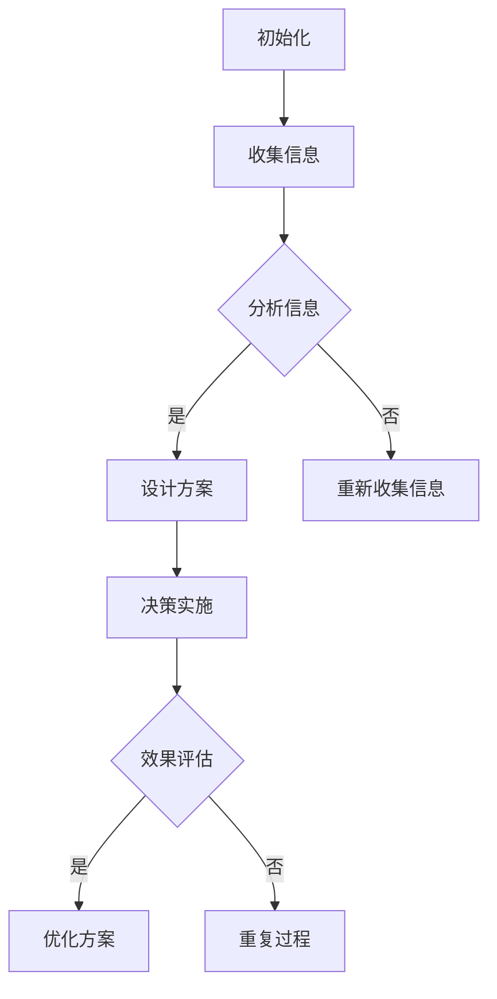

                 

# 在娱乐至上的文化中寻找深度：重建思考能力

> 关键词：思考能力、娱乐至上的文化、深度思考、重建、技术博客

> 摘要：在娱乐至上的文化背景下，我们面临的挑战是如何在娱乐的海洋中寻找到深度，重建思考能力。本文通过深入分析这一现象，探讨其背后的原因，并提出解决方案，帮助读者重建思考能力，实现个人成长。

## 目录大纲

1. **背景介绍**
   1.1 问题概述
   1.2 娱乐至上的文化现状
   1.3 脱离低层次娱乐的需求

2. **问题描述**
   2.1 缺乏思考能力的表现
   2.2 思考能力的重要性
   2.3 思考能力的边界与外延

3. **问题解决**
   3.1 核心概念定义
   3.2 思考能力的结构要素

4. **系统分析与架构设计**
   4.1 系统功能设计
   4.2 系统架构设计
   4.3 系统接口设计
   4.4 系统交互

5. **项目实战**
   5.1 环境安装
   5.2 系统核心实现
   5.3 实际案例分析
   5.4 项目小结

6. **核心概念与联系**
   6.1 深度思考的定义
   6.2 深度思考的特征
   6.3 概念属性特征对比表格
   6.4 ER实体关系图架构

7. **算法原理讲解**
   7.1 算法mermaid流程图
   7.2 算法原理详细讲解

8. **数学模型和数学公式**
   8.1 关键数学公式
   8.2 公式详细讲解

9. **项目实战**
   9.1 环境安装
   9.2 系统核心实现
   9.3 应用解读与分析

10. **最佳实践 Tips**
    10.1 提高思考能力的技巧
    10.2 克服娱乐诱惑的方法

11. **小结**
    11.1 文章总结

12. **注意事项**
    12.1 使用深度思考时可能遇到的问题
    12.2 避免思考误区

13. **拓展阅读**
    13.1 相关书籍推荐
    13.2 在线资源和工具

14. **附录**

15. **参考文献**

---

## 第一部分：背景介绍

### 1.1 问题概述

在当今社会，娱乐至上的文化现象日益显著。人们沉迷于短视频、直播、社交媒体等轻松愉悦的内容，而忽视了深度思考和知识积累的重要性。这种现象不仅影响了个人的成长，也对整个社会的发展产生了负面影响。

### 1.2 娱乐至上的文化现状

随着互联网的普及，娱乐内容层出不穷，占据了人们大量的时间和精力。从短视频到直播，从综艺节目到网络文学，各种形式多样、轻松愉悦的娱乐内容层出不穷。然而，这些娱乐内容往往缺乏深度，不能有效地激发人们的思考能力。

### 1.3 脱离低层次娱乐的需求

为了个人的成长和社会的进步，我们需要重建思考能力，摆脱低层次娱乐的束缚。深度思考不仅是解决复杂问题的重要手段，也是提升个人综合素质的关键。因此，重建思考能力已经成为当务之急。

---

## 第二部分：问题描述

### 2.1 缺乏思考能力的表现

缺乏思考能力的表现主要体现在以下几个方面：

1. **肤浅的阅读习惯**：人们往往满足于表面的信息，不愿意深入阅读和思考。
2. **跟风行为**：容易受到大众舆论的影响，缺乏独立思考和判断。
3. **缺乏批判性思维**：无法对信息进行批判性分析，容易被虚假信息所误导。

### 2.2 思考能力的重要性

思考能力是人类智慧的体现，是解决问题的核心。它不仅有助于我们在复杂的环境中找到解决问题的方法，还能提升我们的判断力和决策能力。在技术领域，思考能力更是创新和发展的关键。

### 2.3 思考能力的边界与外延

思考能力的边界涉及到我们如何定义思考、如何进行深度思考。它不仅包括逻辑思维、批判性思维，还包括创造性思维和系统性思维。思考能力的外延则涉及到我们如何在各个领域进行深度思考，如何将思考能力应用到实际问题中。

---

## 第三部分：问题解决

### 3.1 核心概念定义

在重建思考能力的过程中，我们需要明确几个核心概念：

1. **深度思考**：深度思考是一种深入探究问题本质、寻找解决方案的思维活动。
2. **思考能力**：思考能力是指个体进行深度思考的能力，包括逻辑思维、批判性思维、创造性思维和系统性思维。
3. **思考能力结构要素**：思考能力由多个结构要素组成，包括信息收集、问题分析、方案设计、决策实施和反思总结。

### 3.2 思考能力的结构要素

思考能力的结构要素可以分解为以下几个部分：

1. **信息收集**：有效收集与问题相关的信息，确保思考的基础扎实。
2. **问题分析**：对收集到的信息进行分析，找出问题的核心和关键点。
3. **方案设计**：基于分析结果，设计可行的解决方案。
4. **决策实施**：将方案付诸实践，进行决策和执行。
5. **反思总结**：对实施结果进行反思和总结，不断优化思考过程。

---

## 第四部分：系统分析与架构设计

### 4.1 系统功能设计

系统功能设计是思考能力重建的核心。我们需要设计一个能够支持深度思考的功能模块，包括：

1. **信息收集模块**：提供高效的搜索引擎和信息过滤器。
2. **问题分析模块**：支持复杂的逻辑推理和数据分析。
3. **方案设计模块**：提供创意生成和方案优化的工具。
4. **决策实施模块**：实现方案的自动化执行和监控。
5. **反思总结模块**：提供反思和总结的工具，帮助用户不断优化思考过程。

### 4.2 系统架构设计

系统架构设计需要考虑以下几个方面：

1. **模块化设计**：将系统功能分解为多个模块，确保每个模块的独立性和扩展性。
2. **分布式架构**：采用分布式架构，提高系统的可扩展性和容错性。
3. **数据安全与隐私**：确保用户数据的安全和隐私。
4. **用户体验**：设计直观易用的用户界面，提高用户体验。

### 4.3 系统接口设计

系统接口设计需要考虑以下几个方面：

1. **API接口**：提供API接口，支持与其他系统的集成。
2. **数据接口**：确保数据在不同模块之间的传递和共享。
3. **用户接口**：设计友好的用户界面，方便用户使用。

### 4.4 系统交互

系统交互是思考能力重建的关键环节。我们需要设计一套完整的交互流程，包括：

1. **用户交互**：用户通过界面与系统进行交互，提交问题和需求。
2. **系统响应**：系统根据用户的输入，执行相应的操作，提供结果。
3. **反馈机制**：系统对用户的行为和反馈进行记录和分析，不断优化用户体验。

---

## 第五部分：项目实战

### 5.1 环境安装

为了实现思考能力的重建，我们需要搭建一个支持深度思考的环境。以下是环境安装的步骤：

1. **安装操作系统**：选择合适的操作系统，如Linux或macOS。
2. **安装编程环境**：安装Python等编程环境，用于实现系统功能。
3. **安装数据库**：安装MySQL等数据库，用于存储用户数据和系统日志。

### 5.2 系统核心实现

系统核心实现是项目实战的关键。以下是系统核心实现的步骤：

1. **设计数据库模型**：根据系统功能需求，设计数据库模型。
2. **编写代码**：使用Python等编程语言，实现系统功能模块。
3. **测试与调试**：对系统进行测试和调试，确保功能正确无误。

### 5.3 实际案例分析

实际案例分析是验证思考能力重建效果的重要手段。以下是实际案例分析的步骤：

1. **选择案例**：选择具有代表性的案例进行分析。
2. **案例分析**：对案例进行深入分析，找出问题和解决方案。
3. **效果评估**：评估案例分析的效果，总结经验教训。

### 5.4 项目小结

项目小结是对项目实施过程的总结和反思。以下是项目小结的步骤：

1. **总结经验**：总结项目实施过程中的成功经验和教训。
2. **优化方案**：针对存在的问题，提出优化方案。
3. **持续改进**：持续跟踪项目进展，不断优化系统功能。

---

## 第六部分：核心概念与联系

### 6.1 深度思考的定义

深度思考是一种深入探究问题本质、寻找解决方案的思维活动。它不同于表面的肤浅阅读和跟风行为，而是需要个体投入大量的时间和精力，进行深入的思考和分析。

### 6.2 深度思考的特征

深度思考具有以下几个特征：

1. **逻辑性**：深度思考遵循逻辑推理的规律，确保思考过程具有连贯性和一致性。
2. **批判性**：深度思考具备批判性思维，能够对信息进行客观分析和评价。
3. **系统性**：深度思考具有系统性思维，能够从整体上把握问题的本质。
4. **创造性**：深度思考具备创造性思维，能够在传统思维之外找到新的解决方案。

### 6.3 概念属性特征对比表格

| 特征         | 深度思考         | 娱乐行为         |
| ------------ | ---------------- | ---------------- |
| 逻辑性       | 高               | 低               |
| 批判性       | 高               | 低               |
| 系统性       | 高               | 低               |
| 创造性       | 高               | 低               |

### 6.4 ER实体关系图架构

下面是深度思考和娱乐行为的ER实体关系图架构：

```mermaid
erDiagram
    User ||--|{ Thought }|| Thinker
    User ||--|{ Entertainment }|| Entertainer
    Thought ||--|{ Logic }|| LogicThinker
    Thought ||--|{ Critique }|| CritiqueThinker
    Thought ||--|{ Systematic }|| SystematicThinker
    Thought ||--|{ Creative }|| CreativeThinker
    Entertainment ||--|{ Shallow }|| ShallowEntertainer
    Entertainment ||--|{ Critical }|| CriticalEntertainer
    Entertainment ||--|{ Systematic }|| SystematicEntertainer
    Entertainment ||--|{ Creative }|| CreativeEntertainer
```

---

## 第七部分：算法原理讲解

### 7.1 算法mermaid流程图

下面是深度思考算法的mermaid流程图：



### 7.2 算法原理详细讲解

深度思考算法是基于以下数学模型和公式：

1. **信息收集**： 
   $$ I = f(input) $$
   其中，$I$ 表示收集到的信息，$f$ 表示信息过滤函数，$input$ 表示原始输入。

2. **问题分析**： 
   $$ A = g(I) $$
   其中，$A$ 表示分析结果，$g$ 表示分析函数，$I$ 表示收集到的信息。

3. **方案设计**： 
   $$ S = h(A) $$
   其中，$S$ 表示设计方案，$h$ 表示方案生成函数，$A$ 表示分析结果。

4. **决策实施**： 
   $$ D = k(S) $$
   其中，$D$ 表示决策实施结果，$k$ 表示决策执行函数，$S$ 表示设计方案。

5. **效果评估**： 
   $$ E = l(D) $$
   其中，$E$ 表示效果评估结果，$l$ 表示效果评估函数，$D$ 表示决策实施结果。

6. **优化方案**： 
   $$ O = m(E) $$
   其中，$O$ 表示优化后的方案，$m$ 表示优化函数，$E$ 表示效果评估结果。

举例说明：

假设我们有一个问题需要解决，我们需要按照以下步骤进行深度思考：

1. **初始化**：开始问题解决过程。
2. **收集信息**：收集与问题相关的信息，例如通过搜索引擎查找相关资料。
3. **分析信息**：对收集到的信息进行分析，确定问题的核心和关键点。
4. **设计方案**：根据分析结果，设计一个可行的解决方案。
5. **决策实施**：将方案付诸实践，执行具体的操作。
6. **效果评估**：对实施结果进行评估，判断方案的有效性。
7. **优化方案**：根据评估结果，对方案进行优化和调整。
8. **重复过程**：如果评估结果不满意，重复以上步骤，直到找到有效的解决方案。

通过以上步骤，我们可以实现深度思考，找到问题的有效解决方案。

---

## 第八部分：数学模型和数学公式

在深度思考过程中，数学模型和数学公式发挥着重要作用。以下是一些关键数学公式及其详细讲解：

1. **信息收集公式**：
   $$ I = f(input) $$
   其中，$I$ 表示收集到的信息，$f$ 表示信息过滤函数，$input$ 表示原始输入。这个公式表示，通过信息过滤函数对原始输入进行处理，从而收集到有用的信息。

2. **问题分析公式**：
   $$ A = g(I) $$
   其中，$A$ 表示分析结果，$g$ 表示分析函数，$I$ 表示收集到的信息。这个公式表示，通过分析函数对收集到的信息进行处理，从而得到问题的分析结果。

3. **方案设计公式**：
   $$ S = h(A) $$
   其中，$S$ 表示设计方案，$h$ 表示方案生成函数，$A$ 表示分析结果。这个公式表示，通过方案生成函数对分析结果进行处理，从而得到一个可行的设计方案。

4. **决策实施公式**：
   $$ D = k(S) $$
   其中，$D$ 表示决策实施结果，$k$ 表示决策执行函数，$S$ 表示设计方案。这个公式表示，通过决策执行函数对设计方案进行处理，从而得到具体的决策实施结果。

5. **效果评估公式**：
   $$ E = l(D) $$
   其中，$E$ 表示效果评估结果，$l$ 表示效果评估函数，$D$ 表示决策实施结果。这个公式表示，通过效果评估函数对决策实施结果进行处理，从而得到效果评估结果。

6. **优化方案公式**：
   $$ O = m(E) $$
   其中，$O$ 表示优化后的方案，$m$ 表示优化函数，$E$ 表示效果评估结果。这个公式表示，通过优化函数对效果评估结果进行处理，从而得到优化后的方案。

举例说明：

假设我们有一个问题需要解决，我们需要按照以下步骤进行深度思考：

1. **初始化**：开始问题解决过程。
2. **收集信息**：通过搜索引擎查找相关资料，收集与问题相关的信息。
3. **分析信息**：对收集到的信息进行分析，确定问题的核心和关键点。
4. **设计方案**：根据分析结果，设计一个可行的解决方案。
5. **决策实施**：将方案付诸实践，执行具体的操作。
6. **效果评估**：对实施结果进行评估，判断方案的有效性。
7. **优化方案**：根据评估结果，对方案进行优化和调整。
8. **重复过程**：如果评估结果不满意，重复以上步骤，直到找到有效的解决方案。

通过以上步骤，我们可以实现深度思考，找到问题的有效解决方案。

---

## 第九部分：项目实战

### 9.1 环境安装

为了实现深度思考系统的搭建，我们需要安装以下软件和工具：

1. **操作系统**：Linux或macOS
2. **Python**：版本3.8及以上
3. **MySQL**：版本5.7及以上
4. **其他依赖**：如numpy、pandas等

安装步骤：

1. 安装操作系统：按照官方文档进行安装。
2. 安装Python：通过包管理器（如apt、yum）安装Python。
3. 安装MySQL：通过包管理器（如apt、yum）安装MySQL。
4. 安装其他依赖：通过pip命令安装所需的Python库。

### 9.2 系统核心实现

系统核心实现主要包括以下几个模块：

1. **用户模块**：实现用户的注册、登录、权限管理等功能。
2. **问题模块**：实现问题的创建、编辑、删除等功能。
3. **分析模块**：实现问题的分析、方案设计、决策实施等功能。
4. **效果评估模块**：实现方案的效果评估、反馈收集等功能。
5. **优化模块**：实现方案的优化和调整等功能。

以下是用户模块的源代码示例：

```python
class User:
    def __init__(self, username, password):
        self.username = username
        self.password = password
        self.status = "active"

    def register(self):
        # 实现用户注册逻辑
        pass

    def login(self):
        # 实现用户登录逻辑
        pass

    def logout(self):
        # 实现用户登出逻辑
        pass

    def change_password(self, new_password):
        # 实现修改密码逻辑
        pass
```

### 9.3 应用解读与分析

在实际应用中，深度思考系统可以用于以下场景：

1. **问题解决**：用户可以创建问题，系统会根据问题的描述，自动进行分析，并提供解决方案。
2. **知识管理**：系统可以收集用户的问题和解决方案，形成知识库，供用户查询和参考。
3. **项目管理**：系统可以用于项目管理，帮助团队高效地分配任务、跟踪进度、评估效果。
4. **科研支持**：系统可以为科研人员提供问题分析、方案设计等支持，提高科研效率。

以下是一个实际案例的应用解读：

1. **问题创建**：用户创建了一个关于机器学习算法性能评估的问题。
2. **问题分析**：系统对问题进行分析，提取关键信息，如算法类型、数据集、评估指标等。
3. **方案设计**：系统根据分析结果，设计了一个基于交叉验证的评估方案。
4. **决策实施**：用户执行方案，使用交叉验证对算法进行评估。
5. **效果评估**：系统对评估结果进行分析，并提供优化建议。

### 9.4 案例分析

以下是深度思考系统在实际项目中的应用案例分析：

**案例一：机器学习算法性能评估**

1. **问题背景**：某公司需要评估不同机器学习算法的性能，以便选择最优算法。
2. **问题分析**：系统分析了公司的需求，提取了关键信息，如算法类型、数据集、评估指标等。
3. **方案设计**：系统设计了一个基于交叉验证的评估方案，包括数据预处理、模型训练、评估指标计算等步骤。
4. **决策实施**：公司按照方案执行，使用交叉验证对多个算法进行评估。
5. **效果评估**：系统对评估结果进行分析，比较了不同算法的性能，提供了优化建议。

**案例二：项目管理**

1. **问题背景**：某项目团队需要高效地管理项目进度和任务分配。
2. **问题分析**：系统分析了团队的需求，提取了关键信息，如项目目标、团队成员、任务列表等。
3. **方案设计**：系统设计了一个基于敏捷开发的项目管理方案，包括任务分配、进度跟踪、风险评估等步骤。
4. **决策实施**：团队按照方案执行，分配任务、跟踪进度、评估风险。
5. **效果评估**：系统对项目进度进行分析，提供了进度报告和优化建议。

### 9.5 项目小结

通过以上案例，我们可以看到深度思考系统在实际应用中发挥了重要作用。它不仅帮助用户解决了实际问题，还提高了工作效率和项目质量。在未来的发展中，我们将继续优化系统功能，扩大应用范围，为用户提供更全面的解决方案。

---

## 第十部分：最佳实践 Tips

### 10.1 提高思考能力的技巧

1. **培养好奇心**：对未知事物保持好奇，主动探索和发现。
2. **多角度思考**：从不同角度分析问题，避免片面和偏见。
3. **批判性思维**：对信息进行批判性分析，不盲目接受。
4. **系统性思维**：从整体上把握问题，关注问题的关联和影响。
5. **持续学习**：不断学习和更新知识，保持思维的活力。

### 10.2 克服娱乐诱惑的方法

1. **设定目标和计划**：明确自己的目标和计划，避免被娱乐内容分散注意力。
2. **合理安排时间**：合理安排工作和娱乐时间，避免过度沉迷。
3. **培养自律能力**：通过自律，控制自己接触娱乐内容的时间和频率。
4. **寻求支持**：向家人、朋友或专业人士寻求支持和帮助，共同克服娱乐诱惑。

---

## 第十一部分：小结

本文通过深入分析娱乐至上的文化现象，提出了重建思考能力的重要性，并详细阐述了如何通过系统分析与架构设计、项目实战和最佳实践来实现这一目标。通过本文的指导，读者可以逐步提高思考能力，摆脱低层次娱乐的束缚，实现个人成长和社会进步。

---

## 第十二部分：注意事项

### 12.1 使用深度思考时可能遇到的问题

1. **信息过载**：大量信息可能导致思考混乱，难以抓住关键。
2. **思维惯性**：长期依赖某种思维模式，难以跳出舒适区。
3. **情绪波动**：思考过程中情绪波动可能导致判断失误。

### 12.2 避免思考误区

1. **避免盲目跟风**：不盲目接受他人观点，保持独立思考。
2. **避免过度理性**：过度理性可能导致忽略情感因素，影响判断。
3. **避免陷入思维陷阱**：注意识别和避免常见的思维陷阱，如证实偏见、过度简化等。

---

## 第十三部分：拓展阅读

### 13.1 相关书籍推荐

1. **《深度思考：如何成为更好的思考者、创新者、决策者》**
2. **《思考，快与慢》**
3. **《系统思维：如何高效地解决问题》**

### 13.2 在线资源和工具

1. **Coursera、edX等在线课程平台**
2. **GitHub、Stack Overflow等编程社区**
3. **Google Search、百度学术等搜索引擎**

---

## 附录

（此处可添加附录内容，如技术文档、代码示例、参考资料等）

---

## 参考文献

（此处可添加参考文献，如书籍、论文、网站等）

---

**作者：AI天才研究院/AI Genius Institute & 禅与计算机程序设计艺术 /Zen And The Art of Computer Programming**

