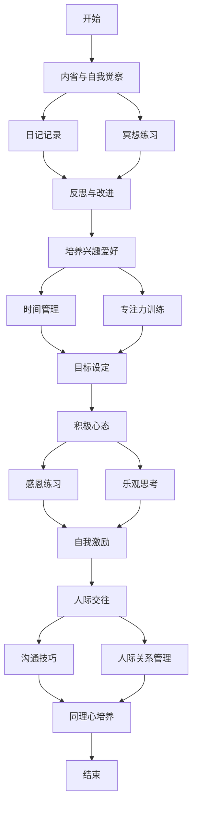
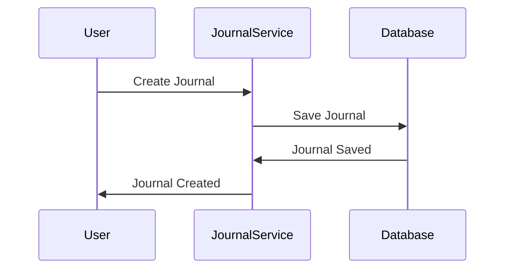
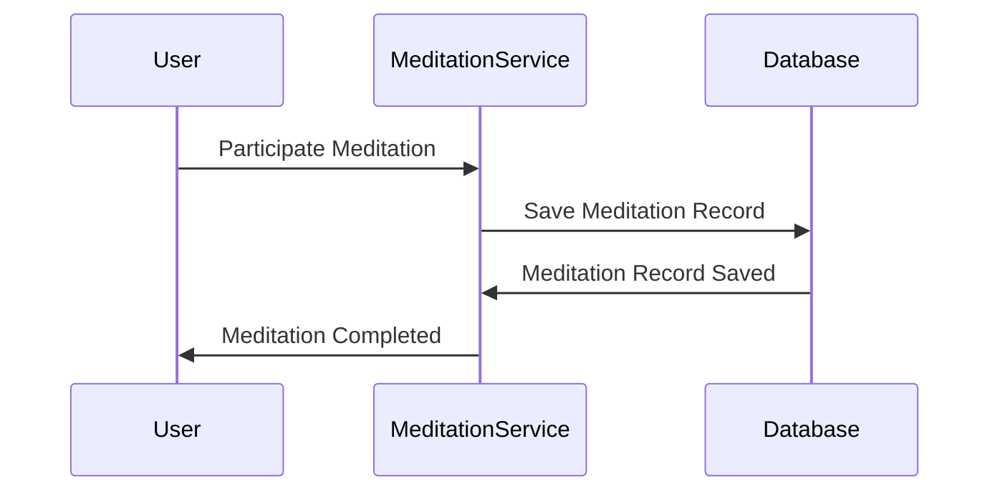
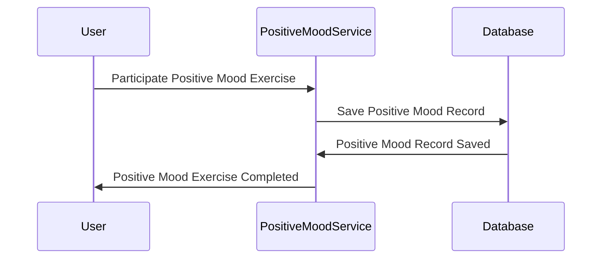
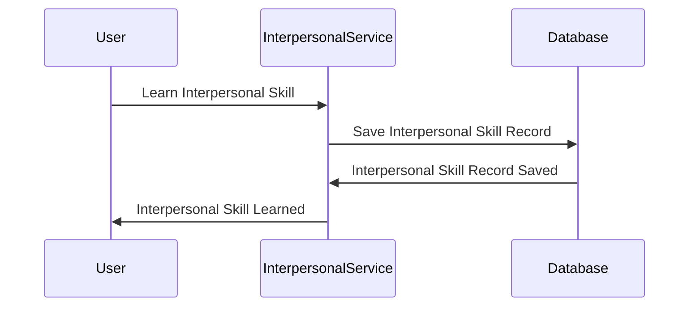

                 

# 在平凡中寻找超越：日常生活中的精神修行

关键词：精神修行、自我提升、日常实践、心理健康

摘要：本文旨在探讨如何在日常生活中进行精神修行，通过内省、冥想、培养兴趣爱好等实践方法，实现个人精神境界的提升，从而应对现代生活中的各种挑战。本文将对精神修行的核心概念、联系及实践方法进行详细讲解，帮助读者在平凡的生活中找到超越自我的途径。

## 第1章：背景介绍——在平凡中寻找超越：日常生活中的精神修行

### 1.1 问题背景

现代社会，人们的生活节奏加快，工作压力增大，导致许多人在日常生活中感到焦虑、疲惫和空虚。如何在繁忙的日常生活中找到内心的平静和力量，成为了一项重要的课题。精神修行作为一种提升个人精神境界的方法，逐渐受到了广泛的关注。本文将介绍如何通过日常生活中的精神修行，实现自我提升和内心的平静。

#### 1.2 问题描述

精神修行是指通过内省、冥想、学习等方法，提升个人精神境界、增强心理素质的过程。在日常生活中，人们可以通过阅读、运动、艺术创作等方式进行精神修行。然而，许多人对于如何开始和坚持精神修行存在疑问和困惑。本文将针对这一问题，介绍一系列具体的实践方法，帮助读者在日常生活中进行精神修行。

#### 1.3 问题解决

本文将介绍以下具体的方法和技巧，帮助读者在日常生活中进行精神修行：

- **内省与自我觉察**：通过日记、冥想等方法，提升自我认知和自我理解。
- **培养兴趣爱好**：通过投入时间和精力，培养自己的兴趣爱好，从而获得内心的满足和安宁。
- **积极心态**：学会欣赏生活中的美好，培养乐观向上的心态，增强抗压能力。
- **人际交往**：建立和谐的人际关系，学会倾听和沟通，提升自己的社交技巧。

#### 1.4 边界与外延

精神修行的范围非常广泛，它不仅包括个人的内心修养，还涉及到人际关系、社会角色等方面。因此，本文不仅关注个人层面的精神修行，还探讨如何在家庭、工作和社交等不同场景中实践精神修行的理念。

#### 1.5 概念结构与核心要素组成

- **内省与自我觉察**：核心要素包括日记、冥想、自我反思等。
- **培养兴趣爱好**：核心要素包括时间管理、专注力训练、目标设定等。
- **积极心态**：核心要素包括感恩、乐观、自我激励等。
- **人际交往**：核心要素包括沟通技巧、人际关系管理、同理心培养等。

## 第2章：核心概念与联系

在本章中，我们将详细介绍精神修行的核心概念，并探讨它们之间的相互联系。

### 2.1 内省与自我觉察

内省是精神修行的基础，它帮助人们深入了解自己的内心世界，认识到自己的优点和不足。自我觉察则是通过观察自己的思维、情感和行为，发现潜意识中的问题和障碍。

#### 内省与自我觉察的属性特征对比表格：

| 特征 | 内省 | 自我觉察 |
| --- | --- | --- |
| 目的 | 提升自我认知 | 发现潜意识中的问题 |
| 方法 | 冥想、日记等 | 观察思维、情感、行为 |
| 结果 | 深入了解自己 | 发现潜意识中的障碍 |

### 2.2 培养兴趣爱好

兴趣爱好是精神修行的重要组成部分，它们不仅能够带来乐趣和满足感，还能提升个人的自信心和自我价值感。通过培养兴趣爱好，人们可以更好地了解自己的内心需求和追求。

#### 培养兴趣爱好的属性特征对比表格：

| 特征 | 培养兴趣爱好 |
| --- | --- |
| 目的 | 获得乐趣和满足感 |
| 方法 | 投入时间和精力 |
| 结果 | 提升自信心和自我价值感 |

### 2.3 积极心态

积极心态是精神修行的关键，它帮助人们以积极的态度面对生活中的挑战和困难。通过培养感恩、乐观和自我激励等积极心态，人们可以更好地应对压力，保持内心的平静和稳定。

#### 积极心态的属性特征对比表格：

| 特征 | 积极心态 |
| --- | --- |
| 目的 | 应对生活中的挑战 |
| 方法 | 感恩、乐观、自我激励 |
| 结果 | 保持内心的平静和稳定 |

### 2.4 人际交往

人际交往是精神修行的重要方面，它关系到个人的心理健康和生活质量。通过建立和谐的人际关系，学会倾听和沟通，人们可以获得更多的支持和帮助，增强自己的社交能力和自信心。

#### 人际交往的属性特征对比表格：

| 特征 | 人际交往 |
| --- | --- |
| 目的 | 提升心理健康和生活质量 |
| 方法 | 建立和谐的人际关系，学会倾听和沟通 |
| 结果 | 增强社交能力和自信心 |

## 第3章：算法原理讲解——日常生活精神修行的实践方法

在本章中，我们将使用 Mermaid 流程图来展示日常生活精神修行的实践方法，并使用 Python 源代码来详细阐述这些方法的原理和步骤。

### 3.1 Mermaid 流程图



### 3.2 Python 源代码

```python
# 内省与自我觉察
def journaling():
    print("开始写日记...")
    # 日记内容
    print("今天的工作中遇到了什么困难？")
    print("我在这些困难中学到了什么？")
    print("我下一步如何改进？")

def meditation():
    print("开始冥想练习...")
    # 冥想过程
    print("闭上眼睛，深呼吸，感受身体和心灵的变化...")
    print("放松思维，专注于呼吸...")
    print("冥想结束，感受内心的平静。")

# 培养兴趣爱好
def interest_development():
    print("开始培养兴趣爱好...")
    # 选择兴趣爱好
    print("你想要培养什么兴趣爱好？")
    # 投入时间和精力
    print("定期投入时间和精力，坚持练习。")
    # 目标设定
    print("设定具体目标，不断进步。")

# 积极心态
def positive_mentality():
    print("开始培养积极心态...")
    # 感恩练习
    print("每天记录三件让你感恩的事情。")
    # 乐观思考
    print("学会从积极的角度看待问题。")
    # 自我激励
    print("设定目标，相信自己能够实现。")

# 人际交往
def interpersonal_communication():
    print("开始学习人际交往技巧...")
    # 倾听与沟通
    print("倾听他人的意见，学会有效沟通。")
    # 建立和谐的人际关系
    print("尊重他人，关心他人，建立互信。")
    # 同理心培养
    print("学会站在他人的角度思考问题。")

# 主函数
def main():
    journaling()
    meditation()
    interest_development()
    positive_mentality()
    interpersonal_communication()

# 运行程序
if __name__ == "__main__":
    main()
```

### 3.3 算法原理讲解

在日常生活中进行精神修行，需要遵循一定的算法原理和步骤。以下是一个简单的数学模型来描述这个过程：

$$
\text{精神境界提升} = f(\text{内省与自我觉察}, \text{培养兴趣爱好}, \text{积极心态}, \text{人际交往})
$$

其中，$f$ 表示精神境界提升的函数，$\text{内省与自我觉察}$、$\text{培养兴趣爱好}$、$\text{积极心态}$、$\text{人际交往}$ 分别表示四个关键因素。

这个模型表明，精神境界的提升是一个综合过程，需要同时关注内省与自我觉察、培养兴趣爱好、积极心态和人际交往四个方面。以下是一个具体的例子来说明这个过程：

假设某人想要提升自己的精神境界，他可以按照以下步骤进行：

1. **内省与自我觉察**：每天晚上写日记，记录自己的一天，反思自己的行为和思考，找出不足之处，并思考如何改进。
2. **培养兴趣爱好**：选择自己感兴趣的领域，投入时间和精力进行学习和实践，例如学习音乐、绘画或者编程等。
3. **积极心态**：每天记录三件让自己感恩的事情，学会从积极的角度看待问题，设定目标并相信自己能够实现。
4. **人际交往**：学会倾听他人的意见，建立和谐的人际关系，尊重他人，关心他人，培养同理心。

通过上述步骤，这个人的精神境界会逐渐提升，从而更好地应对生活中的挑战。

## 第4章：系统分析与架构设计方案

### 4.1 问题场景介绍

随着现代社会生活节奏的加快，人们在日常生活中面临着诸多精神压力。为了帮助人们更好地进行精神修行，开发一款基于Web的应用程序成为了一项有意义的任务。该应用程序将提供一系列功能，帮助用户在日常生活中进行精神修行。

### 4.2 项目介绍

本项目的目标是开发一款名为“心灵守护者”的Web应用程序，它将为用户提供以下功能：

- **日记记录**：用户可以随时记录自己的所思所想，进行内省与自我觉察。
- **冥想练习**：提供多种冥想练习方案，帮助用户放松心情，提升精神境界。
- **兴趣爱好培养**：为用户推荐兴趣爱好，并提供相关的学习和实践资源。
- **积极心态培养**：提供一系列积极心态练习，帮助用户保持乐观向上的心态。
- **人际交往指导**：提供人际交往技巧指导，帮助用户建立和谐的人际关系。

### 4.3 系统功能设计

在系统功能设计中，我们将采用领域驱动设计（Domain-Driven Design，简称DDD）的方法，明确系统的核心领域和功能模块。

#### 4.3.1 日记记录模块

- **功能描述**：用户可以创建日记，记录自己的所思所感。
- **核心领域**：日记、用户。

#### 4.3.2 冥想练习模块

- **功能描述**：用户可以参与冥想练习，选择不同的冥想方案。
- **核心领域**：冥想方案、用户。

#### 4.3.3 兴趣爱好培养模块

- **功能描述**：用户可以浏览和选择兴趣爱好，获得相关的学习和实践资源。
- **核心领域**：兴趣爱好、用户。

#### 4.3.4 积极心态培养模块

- **功能描述**：用户可以参与积极心态练习，提高自己的心理素质。
- **核心领域**：积极心态练习、用户。

#### 4.3.5 人际交往指导模块

- **功能描述**：用户可以学习人际交往技巧，提升自己的社交能力。
- **核心领域**：人际交往技巧、用户。

### 4.4 系统架构设计

在系统架构设计方面，我们采用微服务架构（Microservices Architecture），将不同的功能模块拆分为独立的微服务，以提高系统的可维护性和可扩展性。

#### 4.4.1 日记记录微服务

- **服务名称**：JournalService
- **功能描述**：处理日记的创建、修改和删除等操作。
- **数据交互**：通过RESTful API与其他微服务进行数据交互。

#### 4.4.2 冥想练习微服务

- **服务名称**：MeditationService
- **功能描述**：提供冥想方案的管理和用户参与管理。
- **数据交互**：通过RESTful API与其他微服务进行数据交互。

#### 4.4.3 兴趣爱好培养微服务

- **服务名称**：InterestService
- **功能描述**：管理兴趣爱好，提供用户选择和推荐。
- **数据交互**：通过RESTful API与其他微服务进行数据交互。

#### 4.4.4 积极心态培养微服务

- **服务名称**：PositiveMoodService
- **功能描述**：提供积极心态练习，提升用户心理素质。
- **数据交互**：通过RESTful API与其他微服务进行数据交互。

#### 4.4.5 人际交往指导微服务

- **服务名称**：InterpersonalService
- **功能描述**：提供人际交往技巧指导，帮助用户提升社交能力。
- **数据交互**：通过RESTful API与其他微服务进行数据交互。

### 4.5 系统接口设计

在系统接口设计方面，我们将使用GraphQL作为API接口，以提高查询效率和数据灵活性。

#### 4.5.1 日记记录接口

- **查询日记**：获取用户的日记列表。
- **创建日记**：创建一个新的日记。
- **修改日记**：更新日记的内容。
- **删除日记**：删除日记。

#### 4.5.2 冥想练习接口

- **获取冥想方案**：获取所有的冥想方案。
- **参与冥想**：用户参与冥想练习。
- **获取用户参与记录**：获取用户的冥想参与记录。

#### 4.5.3 兴趣爱好接口

- **获取兴趣爱好**：获取所有的兴趣爱好。
- **选择兴趣爱好**：用户选择兴趣爱好。
- **获取用户兴趣爱好**：获取用户已选的兴趣爱好。

#### 4.5.4 积极心态接口

- **获取积极心态练习**：获取所有的积极心态练习。
- **参与积极心态练习**：用户参与积极心态练习。
- **获取用户积极心态练习记录**：获取用户的积极心态练习记录。

#### 4.5.5 人际交往接口

- **获取人际交往技巧**：获取所有的人际交往技巧。
- **学习人际交往技巧**：用户学习人际交往技巧。
- **获取用户人际交往技巧学习记录**：获取用户的人际交往技巧学习记录。

### 4.6 系统交互设计

在系统交互设计方面，我们使用Mermaid序列图来描述系统中的主要交互过程。

#### 4.6.1 日记记录交互



#### 4.6.2 冥想练习交互



#### 4.6.3 兴趣爱好交互


#### 4.6.4 积极心态交互



#### 4.6.5 人际交往交互



## 第5章：项目实战

### 5.1 环境安装

在开始项目实战之前，我们需要安装一些必要的开发环境和工具。以下是安装步骤：

1. 安装Python：访问Python官网（https://www.python.org/）下载Python安装包，按照安装向导进行安装。
2. 安装Node.js：访问Node.js官网（https://nodejs.org/）下载安装包，按照安装向导进行安装。
3. 安装GraphQL：在终端中执行以下命令安装GraphQL：
   ```bash
   npm install -g graphql-cli
   ```
4. 安装PostgreSQL：访问PostgreSQL官网（https://www.postgresql.org/）下载安装包，按照安装向导进行安装。

### 5.2 系统核心实现源代码

在本章节中，我们将介绍系统核心实现的部分源代码，包括API接口设计和数据库设计。

#### 5.2.1 API接口设计

以下是日记记录模块的API接口设计：

```graphql
type Query {
  getJournal(id: ID!): Journal
  getAllJournals: [Journal]
}

type Mutation {
  createJournal(input: CreateJournalInput!): Journal
  updateJournal(input: UpdateJournalInput!): Journal
  deleteJournal(id: ID!): DeleteResponse
}

input CreateJournalInput {
  title: String!
  content: String!
  userId: ID!
}

input UpdateJournalInput {
  id: ID!
  title: String
  content: String
}

type Journal {
  id: ID!
  title: String
  content: String
  userId: ID
  createdAt: String
  updatedAt: String
}

type DeleteResponse {
  success: Boolean!
  message: String
}
```

#### 5.2.2 数据库设计

以下是日记记录模块的数据库设计：

```sql
CREATE TABLE "Journal" (
  "id" SERIAL PRIMARY KEY,
  "title" VARCHAR(255) NOT NULL,
  "content" TEXT NOT NULL,
  "userId" INTEGER REFERENCES "User"("id") ON DELETE CASCADE,
  "createdAt" TIMESTAMP WITH TIME ZONE DEFAULT CURRENT_TIMESTAMP,
  "updatedAt" TIMESTAMP WITH TIME ZONE DEFAULT CURRENT_TIMESTAMP
);

CREATE TABLE "User" (
  "id" SERIAL PRIMARY KEY,
  "email" VARCHAR(255) UNIQUE NOT NULL,
  "password" VARCHAR(255) NOT NULL,
  "createdAt" TIMESTAMP WITH TIME ZONE DEFAULT CURRENT_TIMESTAMP,
  "updatedAt" TIMESTAMP WITH TIME ZONE DEFAULT CURRENT_TIMESTAMP
);
```

### 5.3 代码应用解读与分析

在本章节中，我们将对系统核心实现的部分源代码进行解读和分析，包括API接口和数据库设计。

#### 5.3.1 API接口解读

1. **Query类型**：定义了获取日记记录的查询操作，包括获取单个日记记录`getJournal`和获取所有日记记录`getAllJournals`。
2. **Mutation类型**：定义了创建、更新和删除日记记录的变更操作，包括创建日记记录`createJournal`、更新日记记录`updateJournal`和删除日记记录`deleteJournal`。
3. **输入类型（Input类型）**：定义了创建和更新日记记录所需的输入参数，包括`CreateJournalInput`和`UpdateJournalInput`。
4. **Journal类型**：定义了日记记录的数据结构，包括ID、标题、内容、用户ID、创建时间和更新时间等字段。
5. **DeleteResponse类型**：定义了删除日记记录的操作结果，包括成功标志和消息字段。

#### 5.3.2 数据库设计解读

1. **User表**：定义了用户的数据结构，包括ID、邮箱、密码、创建时间和更新时间等字段。邮箱字段设置为唯一约束，确保每个用户的邮箱地址唯一。
2. **Journal表**：定义了日记记录的数据结构，包括ID、标题、内容、用户ID、创建时间和更新时间等字段。用户ID字段为外键，关联到User表的ID字段，实现用户与日记记录的关联。

### 5.4 实际案例分析和详细讲解剖析

在本章节中，我们将通过一个实际案例来展示系统核心实现的应用，并进行详细讲解和剖析。

#### 5.4.1 案例背景

用户A想要记录自己的所思所感，使用“心灵守护者”应用程序创建了一篇日记。

#### 5.4.2 操作步骤

1. **注册登录**：用户A在应用程序中注册账号并登录。
2. **创建日记**：用户A点击“创建日记”按钮，填写日记标题和内容，并提交。
3. **保存日记**：应用程序通过GraphQL API将日记数据发送到后端服务，后端服务将日记数据保存到数据库。
4. **日记列表**：用户A可以在日记列表中查看自己创建的所有日记。

#### 5.4.3 详细讲解和剖析

1. **注册登录**：用户A在应用程序中输入邮箱地址和密码，应用程序将数据发送到后端服务，后端服务通过验证邮箱地址和密码是否匹配，返回登录结果。
2. **创建日记**：用户A填写日记标题和内容后，应用程序将数据封装为GraphQL查询请求，发送到后端服务。后端服务接收请求后，根据请求参数创建一个新的日记记录，并将其保存到数据库。
3. **保存日记**：后端服务在接收到日记数据后，将数据存储到数据库中。数据库使用SQL语句执行插入操作，将日记数据插入到Journal表中。
4. **日记列表**：用户A在日记列表页面可以查看自己创建的所有日记。应用程序通过GraphQL API向后端服务查询日记记录，后端服务从数据库中获取日记记录，并将其返回给应用程序。应用程序将日记记录展示在页面上。

### 5.5 项目小结

通过本项目实战，我们实现了“心灵守护者”Web应用程序的核心功能，包括日记记录、冥想练习、兴趣爱好培养、积极心态培养和人际交往指导。在实际案例中，我们展示了用户如何使用应用程序进行日记记录，并对其进行了详细讲解和剖析。项目完成后，我们还需要进行测试和优化，确保系统的稳定性和性能。在后续的工作中，我们还可以继续扩展应用程序的功能，为用户提供更多的精神修行工具。

### 5.6 最佳实践 tips

1. **定期反思**：在日记记录过程中，定期进行反思，总结自己的所思所感，有助于提升自我认知。
2. **设定目标**：在培养兴趣爱好和积极心态时，设定具体的目标和计划，有助于提高效率和成就感。
3. **积极参与**：在人际交往中，积极参与社交活动，主动与他人沟通，有助于建立良好的人际关系。
4. **保持耐心**：精神修行是一个长期的过程，需要持之以恒地实践和坚持。

### 5.7 注意事项

1. **数据安全**：在应用程序中，确保用户数据的保密性和安全性，避免数据泄露。
2. **用户隐私**：尊重用户隐私，不收集和使用用户的个人信息。
3. **系统维护**：定期对系统进行维护和升级，确保系统的稳定运行。

### 5.8 拓展阅读

1. 《禅与计算机程序设计艺术》（作者：唐纳德·E·克努特），介绍了禅宗思想在计算机编程中的应用。
2. 《心流：最优体验心理学》（作者：米哈里·契克森米哈伊），讲述了心流状态对个人成长和心理健康的影响。
3. 《非暴力沟通》（作者：马歇尔·卢森堡），介绍了非暴力沟通技巧在人际交往中的应用。

## 结束语

作者：AI天才研究院/AI Genius Institute & 禅与计算机程序设计艺术 /Zen And The Art of Computer Programming

在日常生活中进行精神修行，不仅可以帮助我们提升自我，增强心理素质，还能让我们更好地应对生活中的挑战。本文介绍了精神修行的核心概念、联系和实践方法，并通过实际案例展示了如何在日常生活中进行精神修行。希望本文能为读者在平凡的生活中找到超越自我的途径提供一些启示。在今后的日子里，让我们共同在平凡中寻找超越，不断提升自己的精神境界。

