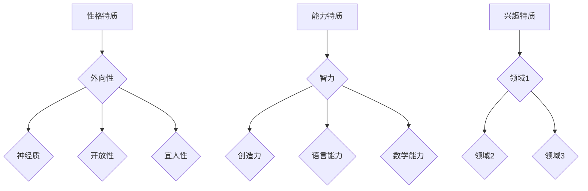
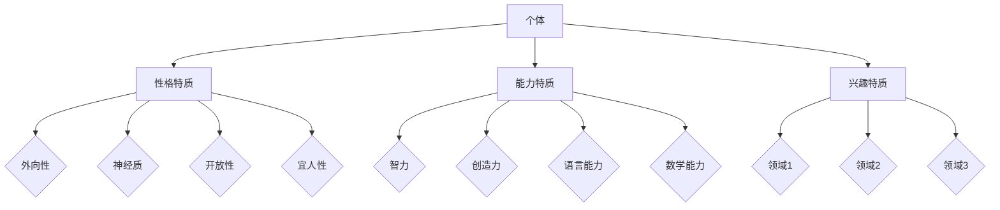
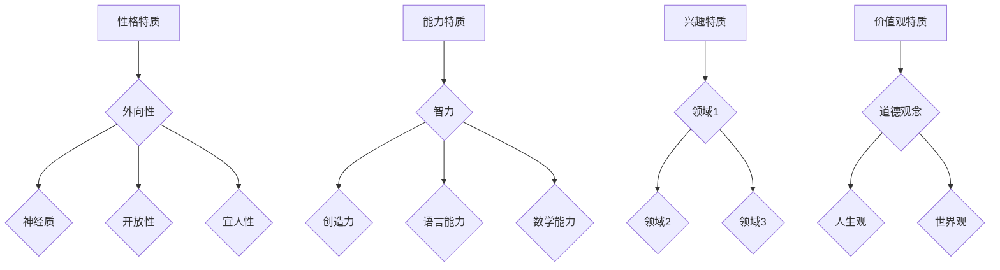
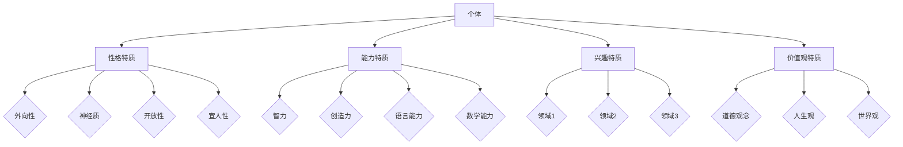

                 

# 在平凡中彰显个人特质：发掘内在光芒

## 关键词

- 个人特质
- 自我认知
- 自我提升
- 环境适应
- 人际关系

## 摘要

本文将探讨如何在平凡的生活中发掘并彰显个人特质，通过自我认知、自我提升和环境适应等方面的实践，帮助读者在人群中脱颖而出。文章将结合具体案例，详细讲解个人特质的核心概念、发掘方法和实践策略。

### 目录大纲

----------------------------------------------------------------

## 第一部分：背景介绍

### 第1章：问题背景与问题描述

### 第2章：核心概念原理

## 第二部分：个人特质发掘

### 第3章：自我认知

### 第4章：自我提升

### 第5章：环境适应

## 第三部分：个人特质展现

### 第6章：人际关系

### 第7章：职业规划

## 结论与启示

----------------------------------------------------------------

### 第1章：问题背景与问题描述

在当今社会，个性化和差异化越来越受到重视。人们渴望在平凡的生活中发掘并彰显个人特质，以实现自我价值的提升。然而，如何在众多人中脱颖而出，成为独特的个体，成为了许多人面临的问题。

首先，我们需要明确什么是个人特质。个人特质是指个体在性格、能力、兴趣等方面的独特性和稳定性。它决定了个体在行为、思维和情感上的差异性。每个人都是独一无二的，拥有自己独特的个人特质。

然而，在现实生活中，许多人往往忽视个人特质的存在，或者认为自己没有独特的特质。这种认识上的误区导致了很多人在追求成功的道路上迷失方向，无法充分发挥自己的潜力。

本文旨在探讨如何在平凡的生活中发掘并彰显个人特质。通过自我认知、自我提升和环境适应等方面的实践，帮助读者认识到个人特质的内在光芒，并找到适合自己的发展路径。

### 第2章：核心概念原理

为了更好地理解个人特质，我们需要明确几个核心概念原理。

#### 2.1 个人特质的概念

个人特质是指个体在性格、能力、兴趣等方面的独特性和稳定性。它是个体在长期的生活和学习过程中形成的，具有一定的一致性和持续性。

个人特质可以分为以下几个维度：

- **性格特质：** 包括外向性、神经质、开放性、宜人性等。
- **能力特质：** 包括智力、创造力、语言能力、数学能力等。
- **兴趣特质：** 包括对特定领域的热情和兴趣。

#### 2.2 个人特质的概念属性特征对比表格

为了更直观地了解个人特质的概念属性特征，我们可以使用Mermaid流程图进行对比。

#### 2.3 ER实体关系图架构

为了更好地理解个人特质的概念结构，我们可以使用Mermaid流程图来绘制ER实体关系图。

通过上述核心概念原理的讲解，我们能够更好地理解个人特质的概念及其维度。在接下来的章节中，我们将深入探讨如何发掘和提升个人特质。

----------------------------------------------------------------

### 第一部分：背景介绍

#### 第1章：问题背景与问题描述

在现代社会的快速发展中，人们越来越注重个性化和差异化。无论是在职业领域还是日常生活中，拥有独特的个人特质都成为了脱颖而出的关键。然而，如何在实际生活中发掘并彰显这些特质，成为一个备受关注的问题。

#### 核心问题背景

现代社会对个性化和差异化需求的增长，源于以下几个方面：

1. **职业竞争激烈：** 随着科技的发展，各行各业的专业技能门槛逐渐提高，使得在职场中具备独特特质的人才更具竞争力。
2. **社交网络庞大：** 社交媒体和互联网的普及，让人们有机会展示自己不同的一面，从而在社交圈中脱颖而出。
3. **自我认知的需求：** 人们越来越意识到，个人的成长和满足感不仅来自于物质成就，更来自于自我实现和独特性的展现。

#### 问题描述

如何在平凡的生活中发掘并彰显个人特质，让自己在人群中脱颖而出，成为了许多人面临的问题。具体来说，这个问题可以分解为以下几个子问题：

1. **如何识别自己的个人特质？**
2. **如何提升和塑造个人特质？**
3. **如何在不同环境和情境中展现个人特质？**
4. **如何在人际关系中运用个人特质建立良好关系？**
5. **如何将个人特质融入职业规划和发展？**

#### 问题解决

为了解决上述问题，本文将从以下三个方面进行探讨：

1. **自我认知：** 通过自我反思和观察，帮助读者了解自己的特质和潜力。
2. **自我提升：** 通过学习和实践，提升个人特质和技能。
3. **环境适应：** 在不同的环境和情境中，调整和展现个人特质。

#### 边界与外延

个人特质涵盖的范围广泛，包括但不限于以下方面：

1. **性格特质：** 包括外向性、神经质、开放性、宜人性等。
2. **能力特质：** 包括智力、创造力、语言能力、数学能力等。
3. **兴趣特质：** 包括对特定领域的热情和兴趣。
4. **价值观特质：** 包括道德观念、人生观、世界观等。

#### 概念结构与核心要素组成

个人特质的核心要素包括以下几个方面：

1. **自我认知：** 通过自我反思和评估，了解自己的性格、能力和兴趣。
2. **自我提升：** 通过学习新知识和技能，提升个人素质和能力。
3. **环境适应：** 在不同环境和情境中，灵活调整和展现个人特质。
4. **人际关系：** 在人际交往中，运用个人特质建立良好关系。
5. **职业规划：** 结合个人特质进行职业定位和发展。

通过上述分析，我们可以看出，个人特质在现代社会中具有重要的地位。接下来，我们将进一步探讨个人特质的核心概念原理，为读者提供更深入的理解和实践方法。

----------------------------------------------------------------

### 第2章：核心概念原理

在深入探讨如何发掘并彰显个人特质之前，我们需要对相关核心概念进行明确和阐述。个人特质不仅是个人独有的特征，也是个体在行为、思维和情感上的表现。理解这些核心概念有助于我们更系统地分析和实践个人特质的提升。

#### 核心概念原理

个人特质是指个体在性格、能力、兴趣、价值观等方面的独特性和稳定性。它不仅仅体现在表面的行为上，更深刻地影响着个体的内心世界和对外界的认知。以下是几个关键概念的解释：

1. **性格特质**：性格特质是指个体在行为和情感上的稳定表现，包括外向性、神经质、开放性和宜人性等。这些特质在一定程度上是遗传的，但也受到环境的影响。
   
2. **能力特质**：能力特质是指个体在特定领域或任务上的能力和潜力，包括智力、创造力、语言能力和数学能力等。这些特质可以通过教育、训练和经验不断发展和提升。

3. **兴趣特质**：兴趣特质是指个体对特定活动或领域的热情和投入。兴趣往往与个人的长期目标和价值观相关，也是个人特质的重要组成部分。

4. **价值观特质**：价值观特质是指个体对事物和行为的评价和偏好，包括道德观念、人生观和世界观等。价值观特质对个人的决策和行为具有指导作用。

#### 概念属性特征对比表格

为了更直观地了解这些核心概念，我们可以使用Mermaid流程图来展示它们的属性特征对比。

#### ER实体关系图架构

为了更好地理解这些核心概念的结构和关系，我们可以使用Mermaid流程图来绘制实体关系图。

通过上述对比表格和ER实体关系图的构建，我们可以清晰地看到个人特质的不同维度和它们之间的关系。这些核心概念不仅为我们理解个人特质提供了理论依据，也为后续的实践提供了指导方向。

接下来，我们将进一步探讨如何通过自我认知来发掘个人特质。这将帮助我们更好地理解自己，并为个人特质的发展奠定基础。

----------------------------------------------------------------

### 第二部分：个人特质发掘

在了解了个人特质的核心概念后，接下来我们将探讨如何通过自我认知、自我提升和环境适应来发掘个人特质。这个过程不仅有助于我们更好地认识自己，还可以为个人成长和职业发展提供方向。

#### 第3章：自我认知

自我认知是发掘个人特质的第一步，它涉及到如何通过自我反思、自我评估和自我认可来了解自己的特质和潜力。以下是一些具体的方法：

##### 3.1 自我反思

自我反思是指通过深入思考自己的行为、情感和思维过程，来了解自己的内在特质。以下是一些实践方法：

- **写日记**：每天花一些时间记录自己的所思所感，可以帮助你更好地了解自己的内心世界。
- **提问自己**：在遇到重要决策或问题时，尝试问自己一些深入的问题，如“我为什么做出这样的决策？”或“我在这个情境中有什么感受？”
- **与他人交流**：与他人分享你的想法和感受，听取他们的反馈，这有助于你从不同的角度看待自己。

##### 3.2 自我评估

自我评估是指通过对比自己与他人，或者对比自己的过去和现在，来了解自己的特质和能力。以下是一些实践方法：

- **定期的自我检查**：每隔一段时间，对自己的行为和表现进行一次全面的评估，包括工作、学习、社交等方面。
- **设定目标和标准**：为自己设定明确的目标和标准，并在实现这些目标时进行自我评估。
- **寻求外部反馈**：向家人、朋友或同事寻求反馈，了解他们如何看待你的特质和能力。

##### 3.3 自我认可

自我认可是自我认知的重要环节，它涉及到如何接受和珍惜自己的特质，并在不同情境中展现自己的优势。以下是一些实践方法：

- **积极肯定**：每天对自己说一些积极的肯定语句，如“我很聪明”、“我有独特的见解”等。
- **庆祝成就**：无论大小，都要庆祝自己的每一个成就，这可以增强自信心和自我认可感。
- **保持真诚**：在展现个人特质时，保持真诚和自然，不要过分刻意。

#### 第4章：自我提升

自我提升是通过学习新知识和技能，提升个人素质和能力的过程。以下是一些具体的策略：

##### 4.1 知识学习

知识学习是自我提升的基础，以下是一些实践方法：

- **持续学习**：定期阅读专业书籍、订阅相关杂志和博客，参加线上或线下的课程和讲座。
- **实践应用**：将学到的知识应用到实际工作中，通过实践来加深理解和掌握技能。
- **跨学科学习**：尝试学习不同领域的知识，这可以拓宽视野，增强创新能力。

##### 4.2 技能训练

技能训练是通过不断练习和挑战来提升个人技能的过程。以下是一些实践方法：

- **定期练习**：为提升某项技能，制定一个长期的练习计划，并持之以恒。
- **设定挑战**：为自己设定一些具有挑战性的任务或项目，通过解决这些难题来提升技能。
- **学习借鉴**：观察他人的成功经验，学习他们的方法和技巧，并将其应用到自己的实践中。

##### 4.3 心理调适

心理调适是自我提升的重要组成部分，它涉及到如何保持积极的心态和应对压力。以下是一些实践方法：

- **放松身心**：通过冥想、瑜伽或深呼吸等方法来放松身心，减轻压力。
- **保持乐观**：积极看待生活中的挑战和困难，相信自己有能力克服它们。
- **寻求支持**：在遇到困难时，向家人、朋友或专业人士寻求支持和帮助。

通过自我认知和自我提升，我们可以更好地发掘自己的个人特质，并在平凡的生活中脱颖而出。在接下来的章节中，我们将探讨如何在不同的环境和情境中适应和展现个人特质。

----------------------------------------------------------------

### 第3章：自我认知

自我认知是发掘个人特质的关键步骤，它涉及到如何通过自我反思、自我评估和自我认可来了解自己的特质和潜力。以下将详细探讨自我认知的过程和方法。

#### 3.1 自我反思

自我反思是指通过深入思考自己的行为、情感和思维过程，来了解自己的内在特质。以下是一些实践方法：

1. **日记法**：坚持写日记，记录自己的日常行为和内心感受。通过回顾日记，可以发现自己行为的模式和心理状态。
2. **提问法**：定期问自己一些问题，如“我今天的决策是否明智？”“我在这个情境中的反应是否恰当？”通过这些问题，可以激发自我反思。
3. **心灵对话**：与自己进行深刻的对话，思考自己的价值观、人生目标和兴趣爱好。这种方法有助于澄清内心的困惑和找到自我认知的方向。

#### 3.2 自我评估

自我评估是通过对比自己与他人，或者对比自己的过去和现在，来了解自己的特质和能力。以下是一些实践方法：

1. **定期自我检查**：每隔一段时间，对自己的行为、工作表现和人际关系进行全面检查。通过这种方式，可以发现自己的优点和不足。
2. **设定目标和标准**：为自己设定具体的目标和标准，然后定期评估自己是否达到这些目标。这种做法有助于自我提升。
3. **寻求外部反馈**：向家人、朋友或同事寻求反馈，了解他们如何看待你的特质和能力。外部反馈可以提供新的视角，有助于更客观地认识自己。

#### 3.3 自我认可

自我认可是自我认知的重要环节，它涉及到如何接受和珍惜自己的特质，并在不同情境中展现自己的优势。以下是一些实践方法：

1. **积极肯定**：每天对自己说一些积极的肯定语句，如“我有独特的见解”、“我能够胜任这个任务”。这些肯定语句有助于提升自信心。
2. **庆祝成就**：无论大小，都要庆祝自己的每一个成就。这种庆祝可以增强自我认可感。
3. **保持真诚**：在展现个人特质时，保持真诚和自然，不要过分刻意。真诚是建立信任和认可的基础。

通过自我反思、自我评估和自我认可，我们可以更好地认识自己，了解自己的特质和潜力。接下来，我们将探讨如何通过自我提升来进一步发掘个人特质。

----------------------------------------------------------------

### 第4章：自我提升

自我提升是一个持续的过程，它涉及知识学习、技能训练和心理调适等多个方面。通过不断提升自己，我们可以更好地发掘和展现个人特质，从而在生活和工作中取得更好的成就。

#### 4.1 知识学习

知识学习是自我提升的基础。以下是一些实践方法：

1. **持续学习**：定期阅读专业书籍、订阅相关杂志和博客，参加线上或线下的课程和讲座。这些学习资源可以帮助我们不断更新知识，跟上行业发展的步伐。
2. **实践应用**：将学到的知识应用到实际工作中，通过实践来加深理解和掌握技能。实践是检验知识的重要手段，也是提升自我能力的有效途径。
3. **跨学科学习**：尝试学习不同领域的知识，这可以拓宽视野，增强创新能力。跨学科知识可以帮助我们从不同角度看待问题，找到更有效的解决方案。

#### 4.2 技能训练

技能训练是通过不断练习和挑战来提升个人技能的过程。以下是一些实践方法：

1. **定期练习**：为提升某项技能，制定一个长期的练习计划，并持之以恒。例如，如果你想提高编程能力，可以每天花一定的时间编写代码。
2. **设定挑战**：为自己设定一些具有挑战性的任务或项目，通过解决这些难题来提升技能。挑战可以激发我们的潜力，帮助我们突破舒适区。
3. **学习借鉴**：观察他人的成功经验，学习他们的方法和技巧，并将其应用到自己的实践中。借鉴他人的经验可以帮助我们更快地提升自己。

#### 4.3 心理调适

心理调适是自我提升的重要组成部分，它涉及到如何保持积极的心态和应对压力。以下是一些实践方法：

1. **放松身心**：通过冥想、瑜伽或深呼吸等方法来放松身心，减轻压力。身心健康是自我提升的基础。
2. **保持乐观**：积极看待生活中的挑战和困难，相信自己有能力克服它们。乐观的心态有助于我们面对困难时保持冷静和坚定。
3. **寻求支持**：在遇到困难时，向家人、朋友或专业人士寻求支持和帮助。与他人分享自己的困惑和挑战，可以获得新的视角和建议。

通过知识学习、技能训练和心理调适，我们可以不断提升自己，发掘和展现个人特质。在接下来的章节中，我们将探讨如何在不同的环境和情境中适应和展现个人特质。

----------------------------------------------------------------

### 第5章：环境适应

在个人成长和职业发展中，环境适应能力至关重要。不同的环境和情境会对个人特质提出不同的要求，因此，我们需要学会在不同的环境中灵活调整和展现个人特质。

#### 5.1 社会环境

社会环境是我们日常生活和工作的主要背景。以下是一些在社会环境中适应和展现个人特质的方法：

1. **文化敏感性**：了解和尊重不同文化背景的人，避免因文化差异而产生误解和冲突。例如，在国际团队中工作时，尊重其他国家的饮食习惯和沟通方式。
2. **社交技巧**：提升社交技巧，包括沟通、倾听和解决问题的能力。良好的社交技巧有助于我们与他人建立积极的关系，展现个人特质。
3. **灵活应对**：面对社会环境中的变化和挑战，保持灵活和适应能力。例如，在职业生涯中，随着公司的业务调整，我们需要快速适应新的工作环境和职责。

#### 5.2 工作环境

工作环境是个人展现特质的重要场所。以下是一些在工作环境中适应和展现个人特质的方法：

1. **目标明确**：在工作中设定明确的目标和计划，确保个人特质与工作目标相一致。例如，如果你具有创新思维，可以在项目提案中展现你的创意。
2. **团队合作**：在工作中，与团队成员建立良好的合作关系，发挥个人特质的优势。例如，如果你具有领导能力，可以担任项目负责人，带领团队完成任务。
3. **持续进步**：在工作中不断学习和提升自己的技能，以适应不断变化的工作需求。例如，如果你对新技术有浓厚的兴趣，可以参加相关培训，提升自己的技术水平。

#### 5.3 人际关系

人际关系是个人成长的重要方面。以下是一些在人际关系中适应和展现个人特质的方法：

1. **尊重差异**：尊重他人的观点和感受，避免因为个人特质的不同而产生冲突。例如，在与朋友或同事交流时，尊重他们的个性和习惯。
2. **建立信任**：通过诚实、可靠和负责任的行为来建立信任。信任是人际关系中最重要的特质之一。
3. **有效沟通**：提升沟通技巧，包括倾听、表达和解决问题的能力。有效的沟通有助于建立良好的人际关系。

#### 5.4 情境适应

不同的情境会对个人特质提出不同的要求。以下是一些情境适应的方法：

1. **灵活调整**：根据不同的情境，灵活调整自己的行为和表现。例如，在正式的商务场合，保持专业和礼貌；在休闲场合，可以展现轻松和幽默的一面。
2. **目标导向**：在面对不同情境时，明确目标，确保个人特质有助于实现这些目标。例如，在解决问题时，发挥分析能力和创造力；在团队合作时，发挥协作和领导能力。

通过在不同环境和情境中适应和展现个人特质，我们可以更好地融入社会，实现个人成长和职业发展。在接下来的章节中，我们将探讨如何在人际交往中运用个人特质建立良好的人际关系。

----------------------------------------------------------------

### 第6章：人际关系

在个人成长和职业发展中，人际关系起着至关重要的作用。良好的人际关系不仅有助于我们获得支持和帮助，还能为我们的职业发展提供机会。在这一章中，我们将探讨如何在人际交往中运用个人特质建立良好的人际关系。

#### 6.1 沟通技巧

沟通技巧是建立良好人际关系的基础。以下是一些在人际交往中运用个人特质来提升沟通技巧的方法：

1. **倾听**：倾听是有效沟通的关键。通过倾听他人的观点和需求，我们可以更好地理解对方，建立信任。例如，如果你具有耐心和同理心，可以在对话中展现出这些特质。
2. **表达**：清晰、准确地表达自己的观点和想法，避免误解和冲突。如果你具有逻辑思维和分析能力，可以在表达中运用这些优势。
3. **反馈**：给予他人建设性的反馈，帮助他们改进。例如，如果你具有批判性思维，可以在反馈中提出具体的改进建议。

#### 6.2 合作能力

合作能力是团队成功的重要因素。以下是一些在人际交往中运用个人特质来提升合作能力的方法：

1. **协同工作**：在团队中，与成员共同分担工作，发挥各自的优势。例如，如果你具有领导能力，可以担任项目负责人，带领团队完成任务。
2. **包容差异**：尊重团队成员的个性和观点，包容不同的意见。例如，如果你具有开放性和包容性，可以在团队中营造一个和谐的工作氛围。
3. **解决问题**：在团队中，主动解决问题，为团队的成功贡献力量。例如，如果你具有创新思维，可以在面对挑战时提出创新的解决方案。

#### 6.3 冲突解决

在人际交往中，冲突是不可避免的。以下是一些在人际交往中运用个人特质来有效解决冲突的方法：

1. **冷静处理**：在冲突发生时，保持冷静，避免情绪化的回应。例如，如果你具有情绪稳定性和自我控制能力，可以在冲突中保持冷静，理性地解决问题。
2. **沟通协商**：通过开放和诚实的沟通，寻求双方的共识。例如，如果你具有沟通技巧和协商能力，可以在冲突中发挥这些优势，找到解决问题的方法。
3. **换位思考**：站在对方的角度考虑问题，理解对方的立场和感受。例如，如果你具有同理心和换位思考能力，可以在冲突中更好地理解对方，找到解决问题的方法。

#### 6.4 建立信任

信任是良好人际关系的基石。以下是一些在人际交往中运用个人特质来建立信任的方法：

1. **诚实守信**：始终保持诚实，遵守承诺。例如，如果你具有诚信和责任感，可以在人际交往中树立信任的基础。
2. **关心他人**：关心他人的需求和感受，为他人提供帮助。例如，如果你具有同理心和关心他人的特质，可以在人际交往中展现这些优势。
3. **透明沟通**：在沟通中保持透明，不隐瞒重要信息。例如，如果你具有开放性和透明度，可以在人际交往中建立信任。

通过在人际交往中运用个人特质，我们可以提升沟通技巧、合作能力、冲突解决能力和建立信任的能力，从而建立良好的人际关系。在接下来的章节中，我们将探讨如何利用个人特质进行职业规划和发展。

----------------------------------------------------------------

### 第7章：职业规划

在个人成长和职业发展的过程中，职业规划起着至关重要的作用。通过合理的职业规划，我们可以更好地发掘和利用个人特质，实现职业目标和人生价值。以下是一些结合个人特质进行职业规划的方法：

#### 7.1 职业目标设定

设定清晰的职业目标是职业规划的第一步。以下是一些结合个人特质设定职业目标的方法：

1. **了解个人特质**：在设定职业目标前，首先需要了解自己的个人特质，包括性格、能力和兴趣。例如，如果你具有创新思维和领导能力，可以考虑从事与科技创新或管理相关的职业。
2. **目标具体化**：将职业目标具体化，设定可量化的目标。例如，如果你的目标是成为技术领导者，可以设定每年发表一定数量的技术论文或参与重要项目等。
3. **长期与短期结合**：设定长期职业目标的同时，也要设定短期目标，以便逐步实现长期目标。例如，长期目标是成为技术专家，短期目标是通过参加培训提升专业技能。

#### 7.2 职业路径规划

职业路径规划是指确定从当前职位到目标职位所需的发展路径。以下是一些结合个人特质进行职业路径规划的方法：

1. **分析职业需求**：了解目标职位所需的技能和经验，分析自己在这些方面的优势和劣势。例如，如果你希望在某个领域成为专家，需要具备哪些技能和知识。
2. **制定发展计划**：根据分析结果，制定一个详细的发展计划，包括学习目标、培训计划、项目经验等。例如，为了提升项目管理能力，可以参加项目管理培训、参与实际项目等。
3. **动态调整**：职业规划是一个动态的过程，需要根据实际情况进行调整。例如，在实现职业目标的过程中，可能会遇到新的机遇和挑战，需要灵活调整职业路径。

#### 7.3 职业发展评估

职业发展评估是指定期对自己的职业发展进行评估，以确保目标的实现和职业规划的合理性。以下是一些结合个人特质进行职业发展评估的方法：

1. **自我评估**：定期对自己的职业发展进行自我评估，包括专业技能、工作表现、人际关系等方面。例如，可以通过自我反思、同事反馈等方式了解自己的优势和不足。
2. **外部评估**：寻求外部评估，如同事、上司或职业顾问的建议和反馈。这些外部评估可以提供新的视角和建议，有助于更客观地了解自己的职业发展状况。
3. **调整策略**：根据评估结果，调整职业发展的策略和计划。例如，如果发现自己在某个领域存在明显不足，可以制定针对性的学习和发展计划。

通过结合个人特质进行职业规划，我们可以更好地发掘和利用个人潜力，实现职业目标和人生价值。在职业规划的过程中，保持灵活和持续学习，将有助于我们在职业生涯中取得更大的成功。

----------------------------------------------------------------

## 第三部分：个人特质展现

#### 第6章：人际关系

在个人成长和职业发展的过程中，人际关系扮演着至关重要的角色。建立和维护良好的人际关系不仅能够帮助我们获取更多的机会和资源，还能提升我们的工作效率和生活质量。在这一章中，我们将探讨如何在人际关系中运用个人特质，建立良好的人际关系。

#### 6.1 沟通技巧

沟通技巧是人际关系中不可或缺的一部分。良好的沟通技巧能够帮助我们更好地表达自己的想法和需求，同时也能够理解他人的观点和情感。以下是一些在人际关系中运用个人特质提升沟通技巧的方法：

1. **倾听**：倾听是一种尊重他人的表现，也是建立信任的重要基础。如果你具有耐心和同理心，可以在沟通中更好地倾听他人的意见和感受。例如，当同事遇到困难时，耐心倾听他们的倾诉，给予关心和支持。

2. **表达**：清晰、准确地表达自己的观点和想法，避免因沟通不畅而产生的误解和冲突。如果你具有逻辑思维和分析能力，可以在表达中运用这些优势，使自己的观点更具说服力。例如，在团队会议中，使用逻辑清晰的陈述来阐述自己的建议。

3. **反馈**：在沟通中给予他人建设性的反馈，帮助他们改进。例如，如果你具有批判性思维，可以在反馈中提出具体的改进建议，而不是仅仅指出问题。

#### 6.2 合作能力

合作能力是团队成功的关键。在人际关系中，我们需要与不同背景和性格的人合作，共同实现目标。以下是一些在人际关系中运用个人特质提升合作能力的方法：

1. **协同工作**：在团队中，与成员共同分担工作，发挥各自的优势。例如，如果你具有领导能力，可以担任项目负责人，带领团队完成任务。

2. **包容差异**：尊重团队成员的个性和观点，包容不同的意见。例如，如果你具有开放性和包容性，可以在团队中营造一个和谐的工作氛围。

3. **解决问题**：在团队中，主动解决问题，为团队的成功贡献力量。例如，如果你具有创新思维，可以在面对挑战时提出创新的解决方案。

#### 6.3 冲突解决

在人际关系中，冲突是不可避免的。有效的冲突解决能力能够帮助我们维护良好的人际关系，提高团队的工作效率。以下是一些在人际关系中运用个人特质解决冲突的方法：

1. **冷静处理**：在冲突发生时，保持冷静，避免情绪化的回应。例如，如果你具有情绪稳定性和自我控制能力，可以在冲突中保持冷静，理性地解决问题。

2. **沟通协商**：通过开放和诚实的沟通，寻求双方的共识。例如，如果你具有沟通技巧和协商能力，可以在冲突中发挥这些优势，找到解决问题的方法。

3. **换位思考**：站在对方的角度考虑问题，理解对方的立场和感受。例如，如果你具有同理心和换位思考能力，可以在冲突中更好地理解对方，找到解决问题的方法。

#### 6.4 建立信任

信任是良好人际关系的基石。建立信任需要时间，但失去信任可能只需要一次失误。以下是一些在人际关系中运用个人特质建立信任的方法：

1. **诚实守信**：始终保持诚实，遵守承诺。例如，如果你具有诚信和责任感，可以在人际交往中树立信任的基础。

2. **关心他人**：关心他人的需求和感受，为他人提供帮助。例如，如果你具有同理心和关心他人的特质，可以在人际交往中展现这些优势。

3. **透明沟通**：在沟通中保持透明，不隐瞒重要信息。例如，如果你具有开放性和透明度，可以在人际交往中建立信任。

通过在人际关系中运用个人特质，我们可以提升沟通技巧、合作能力、冲突解决能力和建立信任的能力，从而建立良好的人际关系。在接下来的章节中，我们将探讨如何将个人特质融入职业规划和发展。

----------------------------------------------------------------

### 第7章：职业规划

在职业生涯中，职业规划至关重要。合理的职业规划可以帮助我们更好地发掘和利用个人特质，实现职业目标和人生价值。以下是一些结合个人特质进行职业规划的方法：

#### 7.1 设定职业目标

设定明确的职业目标是职业规划的第一步。以下是一些结合个人特质设定职业目标的方法：

1. **了解个人特质**：在设定职业目标前，首先要了解自己的个人特质，包括性格、能力和兴趣。例如，如果你具有创新思维和领导能力，可以考虑从事与科技创新或管理相关的职业。

2. **目标具体化**：将职业目标具体化，设定可量化的目标。例如，如果你的目标是成为技术领导者，可以设定每年发表一定数量的技术论文或参与重要项目等。

3. **长期与短期结合**：设定长期职业目标的同时，也要设定短期目标，以便逐步实现长期目标。例如，长期目标是成为技术专家，短期目标是通过参加培训提升专业技能。

#### 7.2 确定职业路径

职业路径规划是指确定从当前职位到目标职位所需的发展路径。以下是一些结合个人特质进行职业路径规划的方法：

1. **分析职业需求**：了解目标职位所需的技能和经验，分析自己在这些方面的优势和劣势。例如，如果你希望在某个领域成为专家，需要具备哪些技能和知识。

2. **制定发展计划**：根据分析结果，制定一个详细的发展计划，包括学习目标、培训计划、项目经验等。例如，为了提升项目管理能力，可以参加项目管理培训、参与实际项目等。

3. **动态调整**：职业规划是一个动态的过程，需要根据实际情况进行调整。例如，在实现职业目标的过程中，可能会遇到新的机遇和挑战，需要灵活调整职业路径。

#### 7.3 定期评估与调整

职业发展评估是指定期对自己的职业发展进行评估，以确保目标的实现和职业规划的合理性。以下是一些结合个人特质进行职业发展评估的方法：

1. **自我评估**：定期对自己的职业发展进行自我评估，包括专业技能、工作表现、人际关系等方面。例如，可以通过自我反思、同事反馈等方式了解自己的优势和不足。

2. **外部评估**：寻求外部评估，如同事、上司或职业顾问的建议和反馈。这些外部评估可以提供新的视角和建议，有助于更客观地了解自己的职业发展状况。

3. **调整策略**：根据评估结果，调整职业发展的策略和计划。例如，如果发现自己在某个领域存在明显不足，可以制定针对性的学习和发展计划。

通过结合个人特质进行职业规划，我们可以更好地发掘和利用个人潜力，实现职业目标和人生价值。在职业规划的过程中，保持灵活和持续学习，将有助于我们在职业生涯中取得更大的成功。

----------------------------------------------------------------

## 结论与启示

在本文中，我们系统地探讨了如何在平凡的生活中发掘并彰显个人特质。通过自我认知、自我提升和环境适应，我们不仅可以更好地认识自己，还能在职场和生活中脱颖而出。以下是一些总结和启示：

1. **自我认知**：通过自我反思、自我评估和自我认可，了解自己的特质和潜力。写日记、提问自己和寻求外部反馈都是有效的自我认知方法。

2. **自我提升**：持续学习新知识和技能，通过实践提升个人素质。定期练习、设定挑战和学习借鉴他人的成功经验都是有效的自我提升策略。

3. **环境适应**：在不同环境和情境中灵活调整和展现个人特质。培养文化敏感性、提升沟通技巧和解决冲突能力都是适应不同环境的重要技能。

4. **人际关系**：在人际交往中运用个人特质建立良好的人际关系。倾听、表达、反馈、合作、冲突解决和建立信任都是维护良好人际关系的关键。

5. **职业规划**：结合个人特质进行职业规划，设定明确的目标和路径。分析职业需求、制定发展计划和定期评估与调整都是职业规划的重要组成部分。

通过这些实践，我们可以在平凡中彰显个人特质，实现个人成长和职业发展。让我们从现在开始，积极发掘并彰显自己的内在光芒，创造一个更加精彩的人生。

## 作者信息

作者：AI天才研究院/AI Genius Institute & 禅与计算机程序设计艺术 /Zen And The Art of Computer Programming

AI天才研究院致力于推动人工智能领域的研究和应用，培养具备创新精神和实践能力的人工智能专家。禅与计算机程序设计艺术则关注计算机编程的哲学和艺术，强调程序设计的简洁性和效率。两位作者结合各自领域的专业知识和实践经验，为广大读者提供了丰富而有价值的技术内容。希望通过本文，能够帮助读者在平凡中发掘并彰显个人特质，实现个人成长和职业发展。

