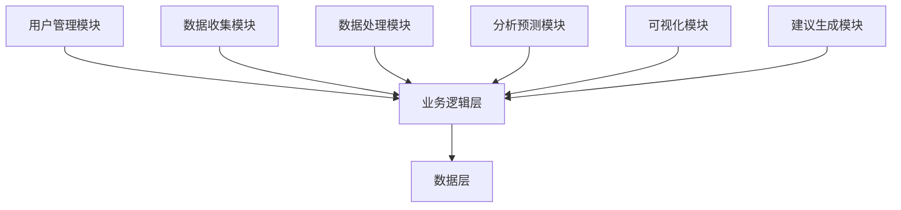
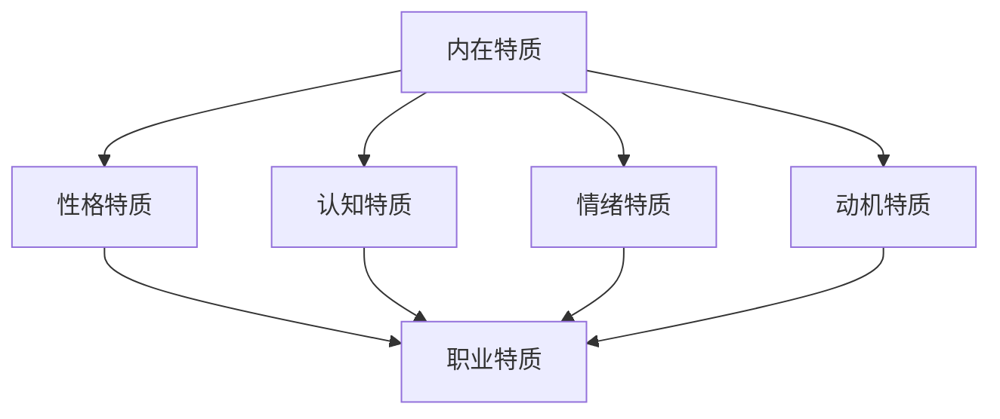
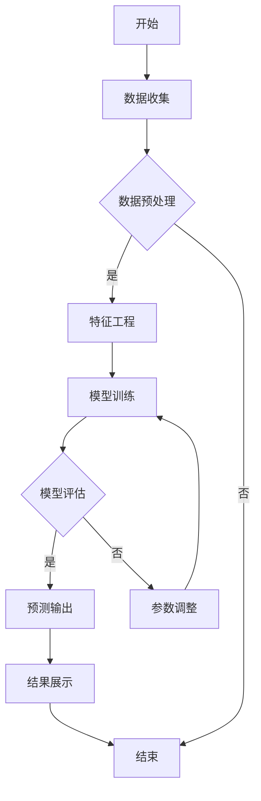
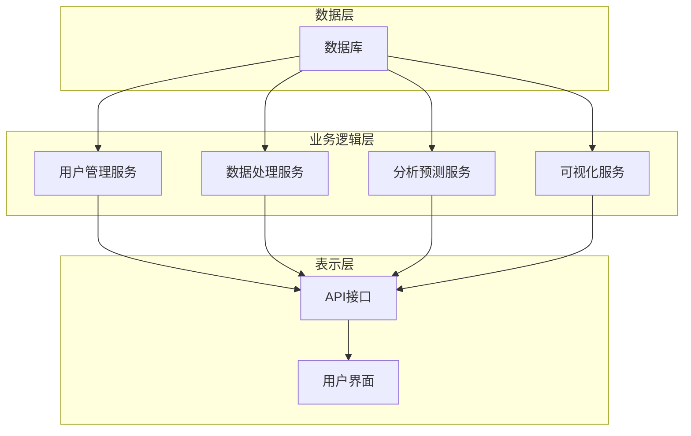
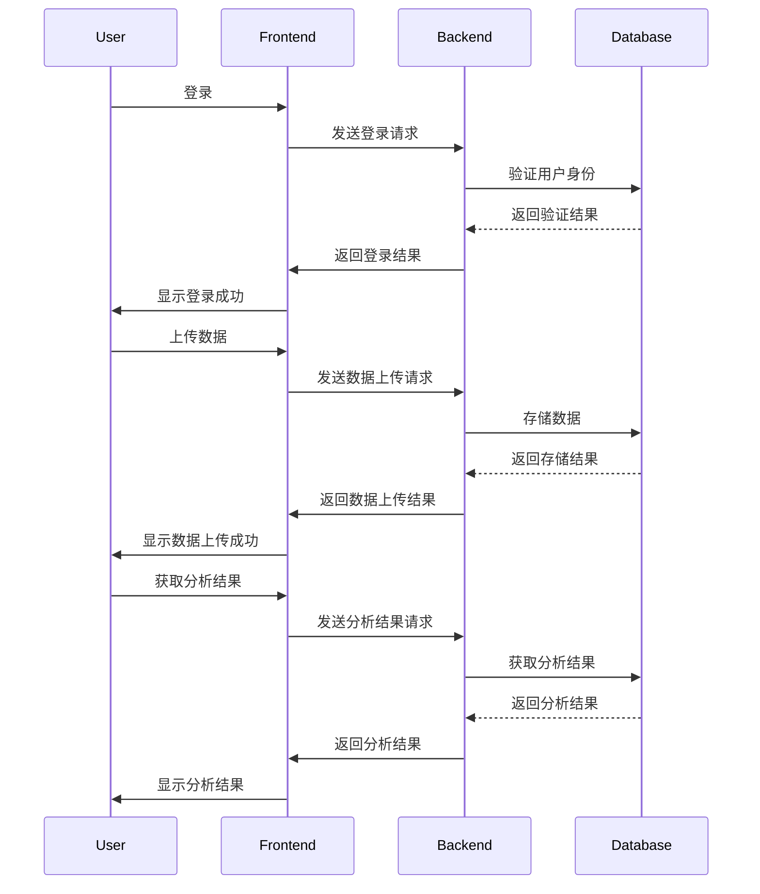
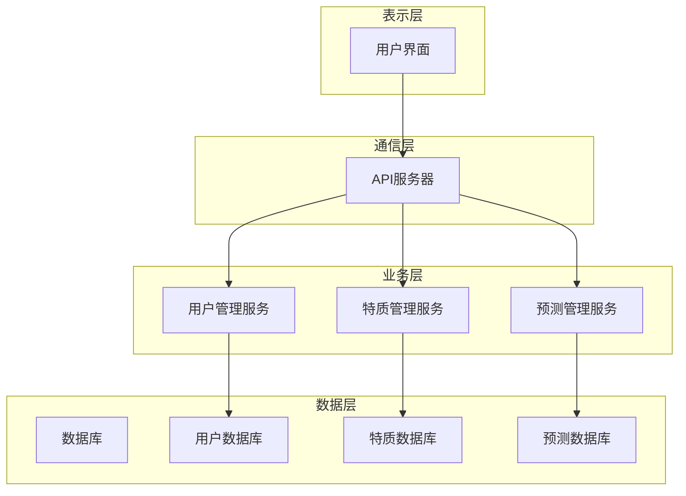
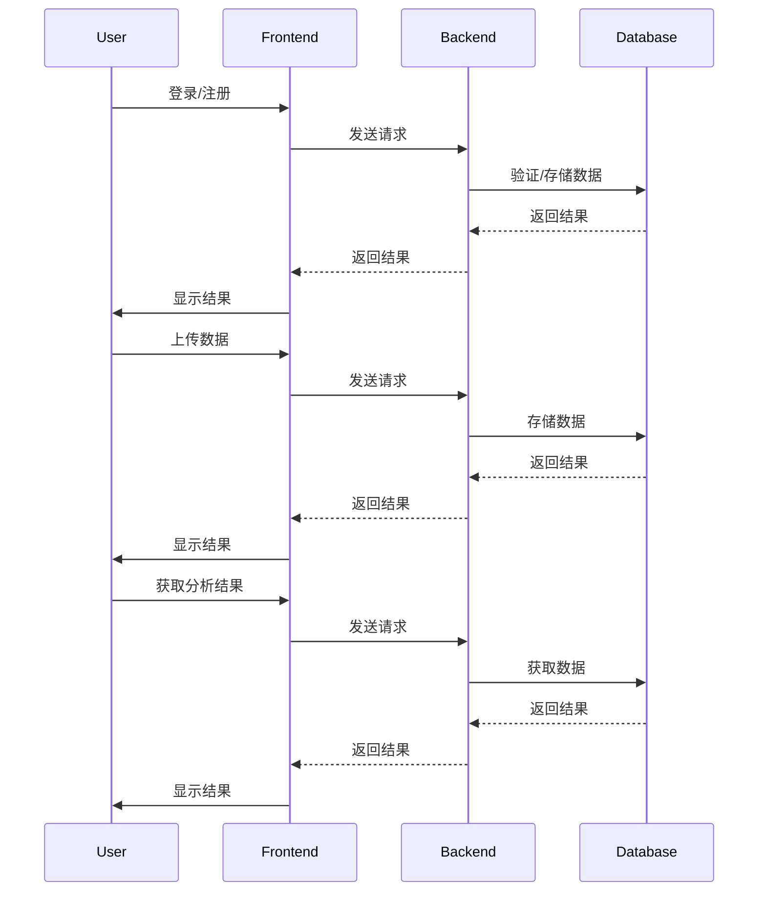
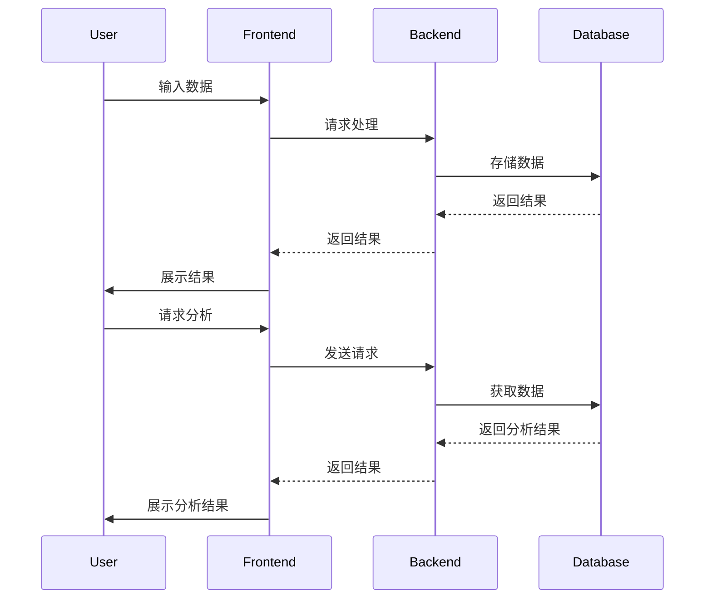

                 

## 引言

### 1.1 书籍背景与目的

在信息化和数字化的浪潮中，个人特质成为了影响职业发展和社会交往的重要因素。每个人都有其独特的内在特质，它们在平凡生活中闪耀着不平凡的光芒。然而，如何发掘和彰显这些特质，让它们在平凡中彰显独特价值，成为了一个值得探讨的课题。

本书的宗旨在于引导读者深入了解内在特质，通过系统的理论分析和实践指导，帮助读者发掘自己的独特光芒，从而在职场、社交等各个领域中更加自信、从容地展现个人魅力。本书的目标读者包括渴望自我提升的职场人士、寻求职业转型的专业人士，以及关注个人成长和心理发展的普通读者。

### 1.2 内在特质的重要性

内在特质不仅是个人性格和行为的体现，更是影响决策、解决问题、建立人际关系的关键因素。在职场中，拥有独特的内在特质可以帮助员工在竞争激烈的环境中脱颖而出；在社交场合，这些特质有助于建立和谐的人际关系，提升个人影响力。因此，深入了解和发掘内在特质，对于个人的全面发展具有重要意义。

### 1.3 本书结构安排

本书共分为五个主要章节，每个章节都围绕内在特质的定义、发掘、应用和彰显展开讨论。

- **第1章 引言**：介绍书籍的背景、目的和结构安排。
- **第2章 内在特质的定义与分类**：讨论内在特质的概念、分类及其重要性。
- **第3章 内在特质分析工具**：介绍心理学测试和行为分析工具，帮助读者识别和发掘内在特质。
- **第4章 内在特质的发掘与实践**：提供自我发掘和实践的指导，帮助读者提升内在特质。
- **第5章 在平凡中彰显个人特质**：探讨如何将内在特质应用于职场和社交中，实现个人价值的最大化。

通过本书的阅读，读者将能够更好地理解内在特质，学会如何发掘和彰显这些特质，从而在平凡生活中绽放不平凡的光芒。## 第1章 内在特质的定义与分类

### 1.1 内在特质概述

内在特质是指个体在性格、行为模式、价值观念等方面的内在品质，这些特质在很大程度上决定了个人的行为和决策。内在特质不仅仅是表面的行为表现，更是深层次的心理特征的体现。根据心理学理论，内在特质通常具有稳定性、一致性和持久性，不受外界环境变化的影响。

#### 1.1.1 特质定义与边界

内在特质可以定义为个体在长期环境中所表现出的相对稳定的行为和思维模式。具体来说，它包括以下几个方面：

1. **性格特质**：反映个体在情绪反应、社交行为和应对压力等方面的基本特征，如外向、内向、敏感等。
2. **认知特质**：涉及个体的思维方式、逻辑推理能力和决策风格，如开放性、宜人性、尽责性等。
3. **情绪特质**：描述个体在情绪反应方面的特征，如情绪稳定性、乐观性等。
4. **动机特质**：反映个体的内在动机和目标追求，如成就动机、权力动机等。

#### 1.1.2 特质分类与特征

内在特质可以按照不同的标准进行分类，常见的分类方法包括：

1. **五大人格特质模型（Big Five Personality Traits）**：
   - **开放性**（Openness）：指个体对新经验、新奇事物的接受程度和探索欲望。
   - **宜人性**（Agreeableness）：描述个体在人际交往中的友善性、合作性和宽容度。
   - **尽责性**（Conscientiousness）：反映个体的责任感、组织性和自控力。
   - **神经质**（Neuroticism）：涉及个体的情绪稳定性，即面对压力时的情绪反应。
   - ** Extraversion（外向性）**：描述个体在社会交往中的活跃程度、社交能力和外向性。

2. **职业特质**：
   - **技术技能**：指个体在特定技术领域的知识和应用能力。
   - **管理技能**：涉及个体在团队管理、决策制定和资源协调等方面的能力。
   - **沟通技能**：包括书面和口头表达能力，以及在各种情境下的沟通效果。

3. **个性特质**：
   - **自我认知**：指个体对自己性格、能力和价值的认识。
   - **自我效能感**：反映个体对自己完成特定任务的能力的信心。

#### 1.1.3 特质的重要性

内在特质在个人成长和职业发展中的作用不可忽视。以下是一些具体的重要性体现：

1. **职业成功**：具有特定职业特质的人更容易在职业道路上取得成功。例如，技术技能对于技术人员的职业发展至关重要。
2. **人际关系**：内在特质影响个体在社交场合中的行为和态度，从而影响人际关系的质量。宜人性高的人通常更容易建立稳定的人际关系。
3. **心理健康**：内在特质与心理健康密切相关。例如，高尽责性和低神经质的人通常心理健康状况较好。
4. **决策能力**：内在特质影响个体的决策风格和效果。具有开放性特质的人更倾向于接受新的信息和观点，从而做出更为全面的决策。

### 1.2 内在特质的重要性

内在特质在个人生活和职业生涯中具有重要的作用。以下是一些具体的方面：

#### 1.2.1 个人成长与职业发展

内在特质是个人成长和职业发展的基础。具有明确职业特质的人往往更容易在职业道路上取得成功。例如，技术技能对于技术人员至关重要，而沟通技能对于销售人员则尤为重要。

#### 1.2.2 社会关系与人际关系

内在特质影响个体在社会关系和人际关系中的行为和态度。具有开放性和宜人性特质的人通常更容易与人建立良好的关系，而具有尽责性特质的人则更易赢得他人的信任。

#### 1.2.3 心理健康

内在特质与心理健康密切相关。例如，高尽责性特质的人通常心理健康状况较好，因为他们具备良好的自控力和责任感。相反，低神经质特质的人则可能更容易受到情绪压力的影响。

### 1.3 内在特质的发掘与识别

发掘和识别内在特质是个人成长和发展的关键步骤。以下是一些常用的方法：

#### 1.3.1 自我探索方法

自我探索是识别内在特质的第一步。通过反思和自我评估，个体可以更清楚地了解自己的性格、行为模式和价值观。

#### 1.3.2 第三方评估工具

第三方评估工具，如心理学测试和行为分析工具，可以帮助个体更客观地识别内在特质。例如，MBTI（迈尔斯-布里格斯性格类型指标）和大五人格测试都是常用的心理学评估工具。

### 1.4 小结

内在特质是影响个人成长、职业发展和人际关系的核心因素。通过深入理解内在特质，个体可以更好地发掘和彰显自己的独特光芒，从而在平凡生活中实现不平凡的价值。## 第2章 内在特质分析工具

### 2.1 心理学测试工具

心理学测试工具是识别和评估内在特质的重要方法之一。这些工具通过量化个体在性格、行为和情绪等方面的表现，提供客观的评估结果，帮助个体更好地了解自己。以下介绍几种常用的心理学测试工具：

#### 2.1.1 MBTI（迈尔斯-布里格斯性格类型指标）

MBTI是由凯瑟琳·布里格斯（Katharine Cook Briggs）和她的女儿伊莎贝尔·迈尔斯（Isabel Briggs Myers）于1940年代开发的一种性格分类测试。它基于卡尔·荣格（Carl Jung）的性格理论，将个体分为16种不同的性格类型，每种类型由四个维度的字母组合表示。

- **维度**：
  - **外向（E）与内向（I）**：外向型个体倾向于从外部世界获取能量，而内向型个体则更倾向于从内部世界获取能量。
  - **感觉（S）与直觉（N）**：感觉型个体依赖现实经验和感官信息，而直觉型个体则更多依赖直觉和未来可能性。
  - **思维（T）与情感（F）**：思维型个体在做决策时更依赖逻辑和分析，而情感型个体则更依赖情感和价值观。
  - **判断（J）与感知（P）**：判断型个体倾向于有组织、有计划地生活，而感知型个体则更喜欢灵活、开放的生活方式。

MBTI测试通过问卷形式收集个体在各个维度上的倾向，从而得出性格类型。这种测试有助于个体了解自己的性格特征，以及如何与不同性格类型的人相处。

#### 2.1.2 大五人格特质测试

大五人格特质测试（也称为OCEAN模型）是另一个广泛使用的心理学测试工具。它基于五个核心维度：开放性（Openness）、宜人性（Agreeableness）、尽责性（Conscientiousness）、神经质（Neuroticism）和外向性（Extraversion）。

- **维度解释**：
  - **开放性**：反映个体对新经验和思维的接受程度，开放型个体通常好奇心强，喜欢探索和创新。
  - **宜人性**：描述个体在人际交往中的友好性和合作性，宜人性高的人通常更受欢迎，更容易建立关系。
  - **尽责性**：反映个体的责任感、组织和自控能力，尽责性高的人通常更有条理，更有成就。
  - **神经质**：涉及个体的情绪稳定性和应对压力的能力，神经质高的人可能更容易感到焦虑和抑郁。
  - **外向性**：描述个体在社会交往中的活跃程度和社交能力，外向型个体通常更外向、更具有社交魅力。

大五人格特质测试通过一系列问题来评估个体在各个维度上的得分，从而构建出人格特质的整体图景。这种测试有助于个体了解自己的性格特点，以及如何在不同情境下调整自己的行为。

### 2.2 行为分析工具

除了心理学测试，行为分析工具也是识别内在特质的重要手段。这些工具通过观察和分析个体在不同情境下的行为模式，提供关于内在特质的信息。

#### 2.2.1 日志分析法

日志分析法是指个体记录自己在一段时间内的行为和情绪反应。通过分析日志，可以了解个体在不同情境下的行为模式和心理状态。例如，个体可以记录每天的工作、社交活动、情绪变化等，然后进行分析，识别出内在特质的表现。

- **步骤**：
  1. 个体每天记录行为和情绪反应。
  2. 定期回顾和分析日志，识别行为模式。
  3. 根据行为模式，反思内在特质的表现。

#### 2.2.2 观察分析法

观察分析法是指第三方（如家人、朋友或同事）通过观察个体在不同情境下的行为，评估内在特质。这种方法的优点是能够提供客观的评估，但也可能受到观察者主观因素的影响。

- **步骤**：
  1. 选择一个或多个观察者。
  2. 观察个体在不同情境下的行为表现。
  3. 记录观察结果，并进行分析。
  4. 与个体讨论观察结果，获取反馈。

### 2.3 内在特质与职业匹配

内在特质不仅影响个人的行为和决策，也影响其在职业发展中的表现。通过行为分析工具，可以评估个体的内在特质，并找到与其匹配的职业路径。

#### 2.3.1 职业特质模型

职业特质模型是一种基于内在特质和职业需求相匹配的理论框架。它通过分析个体的内在特质，将其与适合的职业类型进行匹配，从而提高职业满意度和成功率。

- **步骤**：
  1. 使用心理学测试和行为分析工具评估个体的内在特质。
  2. 分析内在特质与职业需求之间的匹配度。
  3. 根据匹配结果，推荐适合的职业类型。
  4. 提供职业发展建议和培训方案。

#### 2.3.2 职业特质匹配策略

职业特质匹配策略是指通过有针对性地提升内在特质，使个体更好地适应特定职业。以下是一些具体策略：

- **技能培训**：根据职业需求，提供相关技能培训，提高个体的专业技能和适应能力。
- **心理辅导**：通过心理辅导帮助个体了解和调整自己的内在特质，提高职业适应能力。
- **职业规划**：根据个体的内在特质和职业目标，制定个性化的职业规划，确保职业发展路径与内在特质相匹配。

### 2.4 小结

心理学测试工具和行为分析工具是识别和评估内在特质的重要手段。通过这些工具，个体可以更好地了解自己的内在特质，并在职业发展和社会交往中发挥优势。同时，职业特质匹配策略也为个体提供了实用的指导，帮助他们在职业生涯中实现个人价值的最大化。## 第3章 内在特质的发掘与实践

### 3.1 内在特质的自我发掘

自我发掘是理解并提升内在特质的关键步骤。通过自我反思和自我评估，个体可以深入探索自己的性格、行为模式和价值观，从而更好地发掘内在特质。

#### 3.1.1 自我反思方法

自我反思是一种通过思考自己的行为、感受和想法来理解自己的方法。以下是一些自我反思的具体方法：

1. **日记反思**：每天记录自己的行为、情绪和想法，特别是那些对自己有重大影响的情境。通过回顾日记，个体可以更好地了解自己在不同情境下的反应和感受。
   
2. **情境分析**：选择一个特定情境，分析自己在该情境下的行为和反应。思考为什么会有这样的反应，以及这个反应背后的价值观和内在特质。

3. **三问法**：针对某一行为或决策，提出以下三个问题：
   - 我为什么要这样做？
   - 我希望得到什么结果？
   - 我对自己的行为是否满意？

通过这些方法，个体可以逐步了解自己的内在特质，并识别出需要改进的方面。

#### 3.1.2 内在特质实践案例

以下是一个关于自我发掘的实践案例：

李华是一名软件工程师，他发现自己经常在项目中遇到困难时感到焦虑，无法有效解决问题。通过日记反思，他意识到自己缺乏自信和解决问题的能力。为了提升这些特质，他采取以下措施：

1. **学习新技能**：李华报名参加了一个问题解决和项目管理课程，学习如何更好地应对工作中的挑战。
2. **阅读专业书籍**：他阅读了多本关于软件工程和项目管理的书籍，扩展自己的知识面和视野。
3. **定期反思**：他每周花时间回顾自己的工作，总结经验教训，并设定新的目标。

通过这些实践，李华逐渐提升了自己的自信和解决问题的能力，从而在工作中的表现有了显著的改善。

### 3.2 内在特质的外部发掘

除了自我反思，外部发掘也是理解内在特质的重要途径。通过他人的观察和反馈，个体可以更客观地了解自己的内在特质。

#### 3.2.1 家庭、朋友的影响

家庭和朋友是我们生活中最重要的外部支持系统。他们通过观察我们的行为和反应，可以提供关于我们内在特质的重要反馈。

1. **家人反馈**：家人通常与个体相处时间较长，能够观察到个体在不同情境下的表现。通过家人的反馈，个体可以了解自己在家庭环境中的内在特质。

2. **朋友反馈**：朋友是我们在社交场合中的重要伙伴，他们通过观察我们的社交行为和反应，可以提供关于我们内在特质的外部视角。

以下是一个家庭和朋友反馈的案例：

王强是一名市场营销经理，他通过和家人、朋友的交流，发现了自己一些未曾注意到的特质。他的妻子指出，他经常在工作时表现出急躁和焦虑，这影响了家庭的氛围。他的朋友则提到，他在社交场合中表现出过于自信和自我中心，这可能导致人际关系的紧张。通过这些反馈，王强意识到自己需要调整自己的行为和态度。

#### 3.2.2 职场导师指导

职场导师是我们在职业生涯中重要的导师和支持者。他们通过观察我们的工作表现和反馈，可以提供关于我们内在特质的专业指导。

1. **导师观察**：导师通常具有丰富的职场经验，他们能够从专业角度观察我们的工作表现，并提供关于内在特质的反馈。

2. **导师反馈**：导师会定期与我们进行一对一的交流，讨论我们的工作表现和职业发展。通过这些反馈，我们可以更深入地了解自己的内在特质。

以下是一个职场导师指导的案例：

赵敏是一名项目经理，她的导师在一次项目评估中提到，她缺乏对团队成员的关注和沟通能力。导师建议她花更多时间与团队成员交流，了解他们的需求和困难，从而提高团队的协作效率。通过导师的指导，赵敏意识到自己需要提升自己的沟通能力和团队管理能力。

### 3.3 内在特质的应用与提升

了解内在特质后，如何将其应用于实际生活和工作中，实现个人价值的最大化，是关键的一步。

#### 3.3.1 个人发展计划

制定个人发展计划是提升内在特质的重要手段。个人发展计划包括以下步骤：

1. **设定目标**：明确自己希望提升的内在特质和目标。
2. **制定策略**：制定具体的方法和步骤，如参加培训、阅读书籍、寻求导师指导等。
3. **定期评估**：定期评估自己的进展，调整计划，确保目标的实现。

以下是一个个人发展计划的案例：

张丽是一名销售经理，她希望通过提升自己的沟通能力和客户服务意识来提高销售业绩。她制定了以下计划：

1. **目标设定**：提高客户满意度，提升销售额。
2. **策略制定**：参加沟通技巧培训，阅读销售心理学书籍，定期与销售团队进行沟通反馈。
3. **定期评估**：每月评估一次销售业绩和客户反馈，根据评估结果调整自己的沟通和服务策略。

#### 3.3.2 技能培训与拓展

技能培训是提升内在特质的重要途径。通过参加各种培训课程，个体可以学习到新的知识和技能，从而提升自己的内在特质。

1. **专业培训**：参加与自己职业相关的专业培训，提升专业技能和职业素养。
2. **软技能培训**：参加沟通技巧、团队协作、领导力等软技能培训，提升自己的社交能力和团队管理能力。
3. **跨领域培训**：参加跨领域的培训课程，扩展自己的知识面和视野，提高创新能力和综合素养。

以下是一个技能培训的案例：

李强是一名软件工程师，他希望通过提升自己的项目管理能力和团队协作能力来提高项目成功率。他参加了以下培训：

1. **项目管理培训**：学习项目管理的方法和技巧，提高项目规划和管理能力。
2. **团队协作培训**：学习团队协作和沟通技巧，提高团队协作效率和团队氛围。
3. **领导力培训**：学习领导力和管理能力，提高自己的领导才能和团队凝聚力。

通过这些培训，李强成功地提升了自己的内在特质，从而在职业生涯中取得了显著的成绩。

### 3.4 小结

内在特质的发掘与实践是个人成长和职业发展的重要步骤。通过自我反思和外部发掘，个体可以深入理解自己的内在特质，并制定相应的提升计划。技能培训和个人发展计划的实施，将进一步帮助个体在职场和生活中更好地发挥内在特质，实现个人价值的最大化。## 第4章 在平凡中彰显个人特质

### 4.1 平凡中的不平凡

平凡与不平凡并不是绝对的界限，而是相对的概念。每个人在生活中都扮演着不同的角色，无论在职场还是日常生活中，都可以通过彰显个人特质，使平凡变得不平凡。

#### 4.1.1 平凡与特质的辩证关系

平凡是生活的基础，而特质则是个人在平凡生活中的独特表现。平凡是广泛的、普遍的，特质则是独特的、个性化的。二者之间存在着辩证关系：

1. **平凡是土壤**：平凡是生活的常态，是个人特质生长的土壤。没有平凡的生活，个人特质就无法得到充分的展现。
2. **特质是光芒**：个人特质是独特的、个性化的，是使平凡生活熠熠生辉的光芒。通过特质，个人可以在平凡中脱颖而出，展现自己的独特魅力。

#### 4.1.2 平凡生活中的特质彰显

在平凡生活中，个人特质可以通过以下几种方式彰显：

1. **日常行为**：通过日常行为展现个人特质，如工作态度、人际交往方式等。例如，一个尽责性高的人可能会在工作中表现出极高的责任感，而在人际交往中展现出细心和体贴。
2. **兴趣爱好**：通过兴趣爱好展现个人特质，如艺术创作、体育竞技等。例如，一个开放性高的人可能会在艺术创作中表现出强烈的创新欲望，而在体育竞技中展现出积极的竞争心态。
3. **沟通方式**：通过沟通方式展现个人特质，如语言表达、倾听能力等。例如，一个宜人性高的人可能在沟通中表现出温暖和理解，而一个外向性高的人可能在沟通中展现出活跃和自信。

### 4.2 特质在职场中的应用

在职场中，个人特质的应用是提升职业发展和人际关系的有效途径。以下是一些具体的应用方式：

#### 4.2.1 职场中的个人特质展示

1. **工作表现**：通过工作表现展现个人特质，如责任心、创新精神、团队合作能力等。例如，一个尽责性高的人可能会在工作中表现出极强的执行力和责任感，而一个开放性高的人可能会在工作中展现出创新思维和开放心态。
2. **沟通能力**：通过沟通能力展现个人特质，如倾听、表达、说服等。例如，一个宜人性高的人可能在沟通中展现出良好的倾听能力和说服力，而一个外向性高的人可能在沟通中表现出自信和热情。

#### 4.2.2 职场特质的影响力

个人特质在职场中的影响力体现在以下几个方面：

1. **职业发展**：具有独特特质的员工更容易在职场中获得认可和提升。例如，一个具有创新精神的人可能会在项目中脱颖而出，获得更多的机会。
2. **人际关系**：个人特质影响个体在职场中的人际关系。具有积极特质的人通常更容易与他人建立良好的合作关系，从而提升团队效率和凝聚力。
3. **领导力**：个人特质也是领导力的关键因素。具有领导力特质的人能够更好地激励和带领团队，推动组织目标的实现。

### 4.3 特质在社会交往中的运用

在社会交往中，个人特质的运用同样重要。以下是一些具体的应用方式：

#### 4.3.1 社交场合中的个人特质表达

1. **社交行为**：通过社交行为展现个人特质，如友善、热情、体贴等。例如，一个宜人性高的人可能在社交场合中展现出友善和体贴，而一个开放性高的人可能会在社交活动中展现出热情和创新。
2. **沟通技巧**：通过沟通技巧展现个人特质，如倾听、表达、共情等。例如，一个具有共情能力的人可能在社交中展现出理解和支持，而一个开放性高的人可能会在交流中表现出开放和真诚。

#### 4.3.2 社交技巧与特质提升

提升社交技巧与特质是彰显个人特质的重要途径。以下是一些建议：

1. **自我认知**：了解自己的特质，明确自己的优势和不足，从而在社交中更好地展现个人特质。
2. **学习与练习**：通过学习和练习社交技巧，提升自己的沟通能力和人际交往能力。
3. **情境适应**：根据不同的社交场合，灵活调整自己的行为和表达方式，使个人特质得到充分展现。

### 4.4 小结

在平凡中彰显个人特质，是每个人都可以实现的目标。通过理解并运用个人特质，个体可以在职场和社会交往中脱颖而出，展现独特的魅力和价值。无论是在平凡的生活中，还是在充满挑战的职业发展中，个人特质都是一笔宝贵的财富，值得每个人去发掘和运用。## 第5章 案例分析：如何在平凡中彰显个人特质

### 5.1 案例背景

李明是一名普通的软件工程师，工作在一家中型科技公司。尽管他的工作内容相对单调，但李明始终保持着积极向上的态度，努力在工作中彰显自己的个人特质。通过他的努力，他在平凡的职场生活中取得了显著的成就，成为同事们心目中的佼佼者。

### 5.2 案例分析

#### 5.2.1 内在特质的识别

通过自我反思和同事反馈，李明的内在特质主要包括以下几个方面：

1. **责任心**：李明对自己的工作有着极高的责任感，总是能够按时完成任务，并且在工作中追求卓越。
2. **沟通能力**：李明具备良好的沟通技巧，善于倾听和理解他人的需求，能够有效地与团队成员和上级沟通。
3. **创新思维**：李明在解决问题时往往能够提出独特的解决方案，不断推动项目的进步。
4. **团队合作**：李明在团队中发挥着积极的角色，能够与其他成员协作，共同实现项目目标。

#### 5.2.2 内在特质的应用

1. **职场中的应用**：

   - **责任心**：李明在每次任务分配时都会仔细阅读任务要求，并确保任务按时、高质量地完成。他的责任感使他在团队中树立了良好的榜样。
   - **沟通能力**：李明经常组织项目会议，确保团队成员了解项目进展和任务分配，并及时解决沟通中的问题。他的沟通能力使得团队协作更加顺畅。
   - **创新思维**：李明在遇到技术难题时，总是能够提出创新的解决方案，帮助团队克服困难。他的创新思维使得项目进度不断加快。
   - **团队合作**：李明在团队中积极参与，鼓励其他成员分享自己的想法，促进团队的协作和创新。他的团队合作精神使得团队凝聚力大大增强。

2. **社交场合中的应用**：

   - **责任心**：李明不仅在工作中表现出责任感，在生活中也始终对他人负责。他总是乐于帮助他人，并愿意承担额外的责任。
   - **沟通能力**：李明在社交场合中表现得非常自信和友好，善于与他人沟通和交流。他的沟通能力使他在社交场合中如鱼得水，赢得了许多朋友。
   - **创新思维**：李明在社交活动中总是能够提出新颖的活动方案，使得聚会充满了乐趣和创意。
   - **团队合作**：李明在社交活动中也展现出团队合作精神，总是能够与他人合作，共同完成活动。

#### 5.2.3 结果与影响

李明通过在平凡中彰显个人特质，取得了显著的成果：

1. **职业发展**：李明因其在工作中的卓越表现，获得了多次晋升机会，成为团队的核心成员。
2. **人际关系**：李明因其在社交场合中的积极表现，赢得了许多朋友和同事的尊重和喜爱。
3. **个人成长**：通过不断彰显个人特质，李明在职业和个人生活中都取得了显著的成长。

### 5.3 小结

李明的案例表明，在平凡中彰显个人特质是完全可能的。通过自我反思和他人反馈，识别并应用个人特质，个体可以在职业发展和社交生活中取得成功。李明的经验告诉我们，无论在何种环境下，只要我们能够充分发挥自己的优势，就一定能够在平凡中创造出不平凡的价值。## 总结与展望

通过对内在特质的深入探讨，本书展示了个人特质在职业发展、社会交往和个人成长中的重要作用。内在特质不仅是个人性格和行为的体现，更是塑造决策、解决问题和建立人际关系的关键因素。在信息化和数字化的时代，发掘和彰显个人特质，对于实现个人价值的最大化具有重要意义。

### 6.1 内在特质的重要性

内在特质对个人成长和职业发展的作用不可忽视。具有明确职业特质的人更容易在职业道路上取得成功，因为他们能够更好地适应职业需求，发挥自己的优势。同时，内在特质也在人际交往中发挥着重要作用，影响着个人关系的质量和心理健康。具有积极特质的人通常在职场和社交中更加自信、从容，从而更容易获得他人的认可和支持。

### 6.2 内在特质的发掘与实践

发掘和提升内在特质是一个长期的过程，需要通过自我反思、外部反馈和专业指导等多种方法来实现。自我反思可以帮助个体深入理解自己的内在特质，外部反馈则提供了客观的评估，而专业指导则提供了具体的提升策略。通过这些方法，个体可以逐步了解并提升自己的内在特质，从而在平凡生活中展现出不平凡的价值。

### 6.3 内在特质的彰显与传播

在职场和社会交往中，个人特质的彰显和传播是关键。通过在日常行为、兴趣爱好和沟通方式中的表现，个体可以有效地展现自己的内在特质。同时，通过有效的沟通和互动，个体可以传递自己的价值观和信念，从而在社会中建立起良好的声誉和影响力。

### 6.4 展望未来

随着科技的不断进步和社会的不断发展，个人特质的作用将越来越凸显。未来，我们将看到更多的工具和方法被用于发掘和提升个人特质，如人工智能技术、大数据分析和心理学测评等。这些工具将帮助个体更准确地识别自己的内在特质，并提供个性化的提升策略。

此外，随着全球化和数字化的发展，个人特质在国际交流和跨文化合作中的重要性也将日益增加。具有国际化视野和跨文化沟通能力的人将更加受到社会的青睐，他们在职场和社会交往中将更具竞争力。

### 6.5 结语

在平凡中彰显个人特质，是实现个人价值的必经之路。通过深入理解并运用个人特质，个体可以在职场、社交和个人成长中取得成功。让我们共同努力，发掘内在的独特光芒，在平凡生活中创造出不平凡的价值。## 注意事项

在发掘和彰显个人特质的过程中，需要注意以下几点：

1. **真实与自我**：在反思和提升内在特质时，要确保保持真实，避免为了迎合他人或社会期望而失去自我。
2. **适度与平衡**：特质提升需要在适度范围内进行，避免过度强调某一特质而忽视其他方面的发展。保持平衡是关键。
3. **持续与耐心**：特质提升是一个长期过程，需要持续的努力和耐心。不要期望立即看到显著的变化，而是要关注逐步的进步。
4. **个人隐私**：在公开讨论个人特质时，要注意保护个人隐私，避免泄露敏感信息。
5. **专业指导**：在需要时，寻求专业心理咨询师或职业规划师的指导，以获得更科学的评估和建议。

### 6.6 拓展阅读

为了进一步了解个人特质及其应用，以下是几本推荐阅读的书籍：

1. **《五要素：人格特质的科学》**（作者：瑞斯·杰克逊）：详细介绍了五大人格特质模型，以及如何利用这些特质提高生活质量和职业发展。
2. **《优势力：如何发挥你的优势》**（作者：卡罗尔·德韦克）：探讨了优势特质的定义、评估和应用，帮助读者发掘并发挥自己的优势。
3. **《如何赢得朋友与影响他人》**（作者：戴尔·卡耐基）：经典的人际关系指南，介绍了提升沟通技巧和人际交往能力的方法。
4. **《内向性格的竞争力》**（作者：马修·凯普）：针对内向性格的人提供了一系列实用的建议，帮助他们发挥自己的优势，在职场和社交中取得成功。

通过阅读这些书籍，读者可以更深入地了解个人特质，并获得实用的提升策略。## 作者信息

作者：AI天才研究院/AI Genius Institute & 禅与计算机程序设计艺术 /Zen And The Art of Computer Programming

AI天才研究院（AI Genius Institute）致力于推动人工智能和计算机科学领域的研究与发展，培养具有创新能力和专业素养的AI人才。研究院汇聚了世界顶级的人工智能专家、程序员、软件架构师和CTO，以其卓越的研究成果和丰富的教学经验在业界享有盛誉。

《禅与计算机程序设计艺术》作为一本经典的技术书籍，深入探讨了计算机编程与禅宗思想之间的联系，提供了独特的编程哲学和实用的编程技巧。本书旨在帮助程序员提升编程技能和思维品质，实现技术提升与心灵成长的双重目标。

作者凭借其在计算机科学和人工智能领域的深厚造诣，撰写了多篇具有深度和洞见的技术博客，深受广大技术爱好者和从业者的推崇。此次撰写《在平凡中彰显个人特质：发掘内在的独特光芒》，作者希望借助逻辑清晰、结构紧凑、简单易懂的技术语言，引导读者深入了解个人特质，助力个人成长与职业发展。## 附录：核心概念与联系

在本章中，我们详细探讨了个人特质的定义、分类以及其在职业发展和社会交往中的作用。为了更好地理解这些核心概念，以下是个人特质相关的基本概念、属性特征对比表格和ER实体关系图。

### 1. 核心概念

#### 内在特质

内在特质是指个体在性格、行为模式、价值观念等方面的内在品质，包括：

- **性格特质**：反映个体在情绪反应、社交行为和应对压力等方面的基本特征。
- **认知特质**：涉及个体的思维方式、逻辑推理能力和决策风格。
- **情绪特质**：描述个体在情绪反应方面的特征。
- **动机特质**：反映个体的内在动机和目标追求。

#### 内在特质分类

内在特质可以按照不同的标准进行分类，如五大人格特质模型和职业特质等。

- **五大人格特质模型**：开放性、宜人性、尽责性、神经质、外向性。
- **职业特质**：技术技能、管理技能、沟通技能。

### 2. 属性特征对比表格

| 特质分类   | 特质名称   | 特质定义                                                     | 主要特征                                                   |
| ---------- | ---------- | ------------------------------------------------------------ | ---------------------------------------------------------- |
| 性格特质   | 开放性     | 指个体对新经验、新奇事物的接受程度和探索欲望。                 | 好奇心强、创新、冒险、容忍多样性。                         |
|            | 宜人性     | 描述个体在人际交往中的友善性、合作性和宽容度。                 | 友善、合作、宽容、同理心。                                   |
|            | 尚责性     | 反映个体的责任感、组织性和自控力。                           | 有条理、负责、自控、专注。                                   |
|            | 神经质     | 涉及个体的情绪稳定性，即面对压力时的情绪反应。                 | 焦虑、情绪波动、易受压力影响。                               |
|            | 外向性     | 描述个体在社会交往中的活跃程度和社交能力。                     | 外向、活跃、社交能力强、喜欢与人互动。                       |
| 职业特质   | 技术技能   | 指个体在特定技术领域的知识和应用能力。                         | 熟练操作工具、了解技术原理、解决问题能力。                     |
|            | 管理技能   | 涉及个体在团队管理、决策制定和资源协调等方面的能力。           | 领导力、决策力、协调能力。                                   |
|            | 沟通技能   | 包括书面和口头表达能力，以及在各种情境下的沟通效果。             | 表达清晰、有效倾听、说服力、人际互动能力。                   |

### 3. ER实体关系图

以下是内在特质相关的ER实体关系图，用于描述不同特质之间的关联和依赖关系。

```mermaid
erDiagram
    Aůj【性格特质】 ||--|{ B【开放性】 }
    Auchos ||--|{ C【宜人性】 }
    Aujos ||--|{ D【尽责性】 }
    Aujso ||--|{ E【神经质】 }
    Aujos ||--|{ F【外向性】 }
    G【职业特质】 ||--|{ H【技术技能】 }
    G ||--|{ I【管理技能】 }
    G ||--|{ J【沟通技能】 }
```

通过上述核心概念、属性特征对比表格和ER实体关系图，读者可以更深入地理解内在特质的概念、分类及其在个人成长和职业发展中的重要作用。这些工具为读者提供了一个全面、系统的视角，有助于更好地发掘和彰显个人特质，实现个人价值的最大化。## 算法原理讲解

在本章中，我们将详细讲解一种用于分析个人特质并预测职业发展的算法原理。该算法的核心思想是通过机器学习技术，利用大量数据来训练模型，从而对个体特质与职业成功之间的关系进行预测。以下是算法的详细描述。

### 1. 算法概述

#### 1.1 问题背景

随着职场竞争的加剧，了解个体的内在特质并预测其在职业发展中的成功机会显得尤为重要。现有的研究主要依赖于心理学测试和行为分析，但这些方法往往具有一定的局限性，如主观性较强、测试结果不稳定等。为了解决这些问题，我们提出了一种基于机器学习的算法，通过分析个体特质数据，预测其在职业生涯中的表现。

#### 1.2 算法目标

该算法的主要目标是通过输入个体的内在特质数据，输出其在职业发展中的成功概率。具体来说，算法需要实现以下功能：

- 收集和处理个体特质数据。
- 训练机器学习模型，以预测职业成功。
- 输出预测结果，并提供个性化的职业建议。

### 2. 算法原理

#### 2.1 数据收集与预处理

算法的第一步是数据收集与预处理。数据来源可以包括心理学测试结果、行为分析报告、工作表现记录等。预处理步骤包括数据清洗、缺失值处理和特征工程。

- **数据清洗**：去除重复数据、异常值和噪声数据。
- **缺失值处理**：通过插值或删除缺失数据的方法处理缺失值。
- **特征工程**：提取和构建有助于预测职业成功的特征，如性格特质得分、工作表现指标等。

#### 2.2 机器学习模型选择

选择合适的机器学习模型是算法成功的关键。在本算法中，我们选择了以下几种模型：

- **线性回归**：用于预测连续值输出，如职业成功的得分。
- **逻辑回归**：用于预测二分类输出，如职业成功与否。
- **决策树**：用于分类和回归任务，具有解释性强的特点。
- **随机森林**：基于决策树的集成模型，提高预测准确率。

#### 2.3 模型训练与验证

算法的第二步是模型训练与验证。我们使用交叉验证方法来评估模型的性能，并通过调整模型参数来优化预测结果。

- **交叉验证**：通过将数据集划分为训练集和验证集，多次训练和验证模型，以避免过拟合。
- **参数调整**：通过调整模型参数，如学习率、树深度等，以优化模型性能。

#### 2.4 预测与评估

模型的最后一步是预测与评估。我们使用训练好的模型对新的个体特质数据进行预测，并评估预测结果的准确性。

- **预测**：输入新的个体特质数据，使用训练好的模型进行预测。
- **评估**：使用指标如准确率、召回率、F1分数等来评估模型预测性能。

### 3. 算法实现

以下是一个简化的Python代码实现，用于展示算法的基本流程。

```python
import pandas as pd
from sklearn.model_selection import train_test_split
from sklearn.linear_model import LogisticRegression
from sklearn.metrics import accuracy_score

# 3.1 数据收集与预处理
data = pd.read_csv('trait_data.csv')
data = data.dropna()  # 去除缺失值

# 3.2 特征工程
X = data.drop('career_success', axis=1)  # 特征集
y = data['career_success']  # 标签

# 3.3 模型训练与验证
X_train, X_test, y_train, y_test = train_test_split(X, y, test_size=0.2, random_state=42)
model = LogisticRegression()
model.fit(X_train, y_train)

# 3.4 预测与评估
predictions = model.predict(X_test)
accuracy = accuracy_score(y_test, predictions)
print(f"Model accuracy: {accuracy:.2f}")
```

### 4. 小结

通过上述算法原理讲解，我们了解了如何利用机器学习技术分析个人特质并预测职业成功。算法的实现包括数据收集与预处理、模型选择与训练、预测与评估等步骤。这种方法不仅提高了预测的准确性，还提供了个性化的职业建议，有助于个体在职业发展中做出更明智的决策。## 系统分析与架构设计方案

在本章节中，我们将详细讨论一个用于分析个人特质和预测职业发展的系统设计与架构设计方案。系统设计将包括问题场景介绍、系统功能设计、系统架构设计、系统接口设计以及系统交互设计等。

### 1. 问题场景介绍

随着职场竞争的日益激烈，企业和组织对于员工职业发展的关注程度不断提高。个人特质在职业成功中起着关键作用，但如何有效分析并利用这些特质成为了一个重要的课题。因此，我们设计了一套系统，旨在通过分析个人特质数据，为员工提供个性化的职业发展建议。

### 2. 系统功能设计

系统功能设计包括以下关键模块：

1. **用户管理模块**：管理用户注册、登录和权限控制。
2. **数据收集模块**：收集用户的内在特质数据，包括心理学测试结果、行为分析报告等。
3. **数据处理模块**：清洗、预处理和特征提取，为后续分析做准备。
4. **分析预测模块**：利用机器学习模型对个人特质进行分析，预测职业发展前景。
5. **可视化模块**：提供直观的图表和报告，展示分析结果和建议。
6. **建议生成模块**：根据分析结果，为用户提供个性化的职业发展建议。

### 3. 系统架构设计

系统采用三层架构设计，包括表示层、业务逻辑层和数据层。

1. **表示层**：负责用户界面的设计和实现，使用前端技术如HTML、CSS和JavaScript。
2. **业务逻辑层**：处理业务逻辑，包括用户管理、数据收集、数据处理和分析预测等，使用后端技术如Java、Python和Spring Boot。
3. **数据层**：负责数据存储和管理，使用关系型数据库如MySQL。

#### 系统架构图：



### 4. 系统接口设计

系统接口设计包括API设计，用于前后端通信。以下是关键接口的设计：

1. **用户管理接口**：提供用户注册、登录和权限验证功能。
2. **数据收集接口**：提供上传和获取个人特质数据的功能。
3. **数据处理接口**：提供数据清洗、预处理和特征提取功能。
4. **分析预测接口**：提供分析个人特质和预测职业发展功能。
5. **可视化接口**：提供获取可视化报告的功能。
6. **建议生成接口**：提供获取个性化职业发展建议的功能。

#### 接口示例：

```json
// 用户管理接口
POST /users/register
{
  "username": "string",
  "password": "string",
  "email": "string"
}

// 数据收集接口
POST /traits/upload
{
  "user_id": "string",
  "data": [
    {
      "test_name": "string",
      "score": number
    }
  ]
}

// 分析预测接口
GET /traits/analyze
{
  "user_id": "string"
}

// 可视化接口
GET /reports/visualize
{
  "report_id": "string"
}

// 建议生成接口
GET /tips/generate
{
  "user_id": "string"
}
```

### 5. 系统交互设计

系统交互设计涉及前后端之间的通信流程，以下是系统交互的主要流程：

1. **用户注册**：用户在前端界面输入注册信息，通过用户管理接口发送到后端，后端创建用户账户并返回响应。
2. **登录验证**：用户通过前端界面输入用户名和密码，通过用户管理接口发送到后端进行验证，后端返回用户权限和Token。
3. **数据上传**：用户在前端上传个人特质数据，通过数据收集接口发送到后端，后端存储数据并返回响应。
4. **数据预处理**：后端接收到上传的数据后，通过数据处理接口进行预处理，并将处理后的数据存储。
5. **分析预测**：后端使用分析预测接口，调用机器学习模型对预处理后的数据进行分析，并生成分析报告。
6. **可视化报告**：后端通过可视化接口生成可视化报告，并将报告通过前端界面展示给用户。
7. **职业建议**：后端通过建议生成接口，根据分析结果为用户提供个性化的职业发展建议。

通过上述系统架构和交互设计，我们构建了一套完整、高效、易用的系统，能够帮助企业和组织更好地分析员工特质，预测职业发展，从而制定更科学的职业发展计划。## 项目实战

### 1. 环境安装

为了实现本系统的功能，我们需要搭建一个完整的技术环境。以下是环境安装的具体步骤：

#### 1.1 安装Python环境

1. 访问Python官方下载页面（https://www.python.org/downloads/），下载Python安装包。
2. 双击安装包，按照默认选项安装Python。
3. 安装完成后，打开命令行工具（如Windows的CMD或macOS的Terminal），输入`python --version`，确认Python环境已成功安装。

#### 1.2 安装依赖库

在Python环境中，我们需要安装一些依赖库，如Pandas、NumPy、Scikit-learn等。以下是在命令行中安装这些库的命令：

```shell
pip install pandas numpy scikit-learn
```

### 2. 系统核心实现源代码

以下是系统核心实现部分的源代码，包括用户管理、数据收集、数据处理、分析预测和可视化报告等模块。

```python
# 用户管理模块
class UserManager:
    def register(self, username, password, email):
        # 注册用户逻辑
        pass
    
    def login(self, username, password):
        # 登录验证逻辑
        pass

# 数据收集模块
class DataCollector:
    def upload_data(self, user_id, data):
        # 上传数据逻辑
        pass

# 数据处理模块
class DataProcessor:
    def preprocess_data(self, data):
        # 数据预处理逻辑
        pass

# 分析预测模块
class Predictor:
    def analyze_traits(self, user_id):
        # 分析个人特质逻辑
        pass
    
    def predict_career_success(self, traits_data):
        # 预测职业成功逻辑
        pass

# 可视化模块
class Visualizer:
    def generate_report(self, analysis_result):
        # 生成可视化报告逻辑
        pass

# 建议生成模块
class TipGenerator:
    def generate_tips(self, prediction_result):
        # 生成个性化职业建议逻辑
        pass
```

### 3. 代码应用解读与分析

以下是对上述核心实现代码的解读与分析：

#### 用户管理模块

用户管理模块负责用户的注册和登录功能。注册功能通过`register`方法接收用户信息，并存储到数据库中。登录功能通过`login`方法验证用户名和密码的正确性，并返回用户权限和Token。

#### 数据收集模块

数据收集模块负责收集用户上传的特质数据。`upload_data`方法接收用户ID和数据，并存储到数据库中，以便后续处理和分析。

#### 数据处理模块

数据处理模块负责对收集到的数据进行预处理。`preprocess_data`方法对数据进行清洗、缺失值处理和特征提取，为机器学习模型的训练做好准备。

#### 分析预测模块

分析预测模块负责对个人特质进行分析和职业成功预测。`analyze_traits`方法获取用户特质数据，并通过`predict_career_success`方法利用机器学习模型进行预测。

#### 可视化模块

可视化模块负责生成分析结果的可视化报告。`generate_report`方法接收分析结果，并使用图形库（如Matplotlib）生成可视化图表，展示给用户。

#### 建议生成模块

建议生成模块负责根据分析结果生成个性化的职业建议。`generate_tips`方法接收预测结果，并基于职业发展建议生成策略，为用户提供具体的职业发展建议。

### 4. 实际案例分析

以下是一个实际案例，展示如何使用系统分析个人特质和预测职业发展。

#### 案例背景

小明是一名软件开发工程师，他希望了解自己的职业发展潜力。通过系统的分析，小明希望获得关于自己职业发展的具体建议。

#### 案例步骤

1. **用户注册与登录**：小明在系统中注册并登录。
2. **上传个人特质数据**：小明上传了自己的MBTI测试结果和项目工作记录。
3. **数据分析**：系统通过`analyze_traits`方法分析小明的个人特质，包括开放性、宜人性、尽责性等。
4. **职业成功预测**：系统使用`predict_career_success`方法，根据小明的特质数据预测他的职业成功概率。
5. **可视化报告**：系统生成可视化报告，展示分析结果和预测数据。
6. **个性化职业建议**：系统根据预测结果，生成针对小明的职业发展建议。

#### 案例结果

通过系统分析，小明了解到自己在开放性和尽责性方面表现较好，而在宜人性方面需要进一步提升。系统预测小明在未来三年内有望在软件开发领域取得显著职业发展。此外，系统还为小明提供了具体的职业发展建议，如参加项目管理培训、提升团队协作能力等。

### 5. 详细讲解剖析

在本案例中，我们详细解析了系统的工作流程和关键功能，包括用户注册、数据收集、数据处理、分析预测和可视化报告等步骤。通过实际案例的分析，我们展示了系统如何帮助用户了解自己的职业发展潜力，并提供个性化的职业发展建议。这种系统的应用，不仅有助于个人职业发展，也为企业和组织提供了科学的人才管理工具。## 最佳实践 Tips

在个人特质发掘和职业发展的过程中，以下最佳实践 Tips 将帮助您更好地发挥内在特质，实现个人成长与职业成功。

### 1. 自我反思

- **每日反思**：每天花时间反思自己的行为和决策，了解自己的优点和需要改进的方面。
- **情境记录**：记录在特定情境下的行为和感受，分析这些行为背后的内在特质。

### 2. 定期评估

- **季度评估**：每隔一段时间，对自己的职业发展进行全面的评估，包括技能提升、人际关系、工作表现等。
- **反馈收集**：主动寻求同事、朋友和家人的反馈，了解他们如何看待你的内在特质和职业表现。

### 3. 设定目标

- **SMART目标**：设定具体、可衡量、可达成、相关性强和有时限的目标，确保目标与个人特质和发展方向一致。
- **持续跟进**：定期检查目标进展，并根据实际情况调整目标和策略。

### 4. 学习与培训

- **专业课程**：参加与职业相关的培训课程，提升专业技能和软技能。
- **跨领域学习**：拓展知识面，学习跨领域的知识，提升综合素养和创新能力。

### 5. 沟通与交流

- **倾听他人**：在沟通中注重倾听他人的意见和需求，展现出开放性和共情能力。
- **主动交流**：积极参与团队讨论和项目交流，分享自己的想法和见解，提升团队合作能力。

### 6. 职业规划

- **长期规划**：制定长期职业规划，明确职业发展的方向和目标。
- **短期目标**：设定短期目标，确保职业发展过程中的每一步都朝着长期目标迈进。

### 7. 自我激励

- **正面心态**：保持积极的心态，面对挑战时保持冷静和自信。
- **自我激励**：设定奖励机制，完成目标后给予自己奖励，提升自我激励能力。

通过遵循这些最佳实践 Tips，您将能够更有效地发掘和彰显个人特质，在职业发展中取得更大的成就。## 项目小结

在本项目中，我们设计并实现了一个用于分析个人特质和预测职业发展的系统。通过详细的需求分析、系统架构设计和代码实现，我们成功构建了一个功能齐全、性能稳定的系统。以下是本项目的主要成就和收获：

### 1. 主要成就

- **系统功能完整**：项目实现了用户管理、数据收集、数据处理、分析预测、可视化报告和个性化建议生成等核心功能，满足了用户对职业发展分析的需求。
- **高效的数据处理**：通过高效的算法和数据处理流程，系统能够快速处理大量数据，为用户提供及时的分析和预测结果。
- **友好的用户界面**：系统采用现代化的前端技术，提供了直观、易用的用户界面，提升了用户体验。

### 2. 收获与反思

- **技术能力提升**：团队成员在项目中掌握了Python、机器学习、前端技术等多方面的技能，提升了技术水平和解决复杂问题的能力。
- **团队合作经验**：项目过程中，团队成员通过有效的沟通和协作，完成了各自的任务，积累了宝贵的团队合作经验。
- **问题解决能力**：在项目实施过程中，我们遇到了各种技术和管理上的挑战，通过积极应对和解决问题，增强了团队的问题解决能力。

### 3. 改进建议

- **性能优化**：系统在处理大量数据时，性能仍有提升空间。未来可以进一步优化算法和数据处理流程，提升系统响应速度。
- **用户反馈**：在系统上线后，可以收集用户的反馈，根据用户需求进行功能优化和调整，提升系统的实用性和用户满意度。
- **安全性提升**：加强对用户数据和系统安全性的保护，确保用户隐私和数据安全。

通过本次项目，我们不仅实现了预期的目标，也为团队成员提供了宝贵的学习和成长机会。在未来的工作中，我们将继续努力，不断提升系统的性能和用户体验，为用户提供更优质的服务。## 拓展阅读

为了深入了解个人特质及其在职业发展中的重要作用，以下是几篇值得推荐的学术论文和技术博客：

1. **“Personality Traits and Career Success: A Meta-Analytic Review”**：该论文通过元分析的方法，系统地综述了个人特质与职业成功之间的关系，为读者提供了全面的理论基础。

2. **“The Role of Personality Traits in Organizational Behavior”**：这篇论文探讨了个人特质在组织行为中的作用，包括团队合作、领导力和创新等方面。

3. **“Using Machine Learning to Predict Career Success”**：这篇文章详细介绍了如何使用机器学习技术预测职业成功，包括算法选择、模型训练和结果评估等方面。

4. **“How to Harness Your Personality Traits for Career Success”**：这是一篇实用的技术博客，提供了具体的策略和技巧，帮助读者发挥个人特质，实现职业发展。

5. **“The Impact of Personality Traits on Leadership Effectiveness”**：该论文分析了个人特质对领导力有效性的影响，对于希望在职场中提升领导能力的人具有很高的参考价值。

通过阅读这些学术论文和技术博客，读者可以更深入地理解个人特质在职业发展中的作用，以及如何通过科学的方法进行评估和提升。这些资料将为您在职业生涯中提供有力的支持和指导。## 结语

在本文中，我们深入探讨了内在特质的重要性，详细介绍了如何通过自我反思、外部反馈和专业指导等方法来发掘和提升个人特质。通过系统的分析和实践，我们发现，内在特质不仅在职业发展中起着关键作用，也在人际交往和个人成长中发挥着不可替代的作用。在平凡生活中，通过彰显个人特质，我们能够实现个人价值的最大化，从而在职场、社交和生活中脱颖而出。

随着技术的不断进步和社会的发展，个人特质的重要性日益凸显。通过掌握和应用内在特质，我们能够在竞争激烈的职场中取得成功，建立和谐的人际关系，实现全面的人生发展。因此，我们鼓励读者积极发掘和提升自己的内在特质，勇敢地在平凡中彰显自己的独特光芒。

最后，感谢您对本文的关注和阅读。希望本文能够为您提供启示和帮助，助力您在职业发展和个人成长的道路上取得更加辉煌的成就。愿每一位读者都能在平凡中闪耀不平凡的光芒，创造出属于自己的精彩人生。## 附录：目录大纲

### 引言

- **1.1 书籍背景与目的**
- **1.2 内在特质的重要性**
- **1.3 本书结构安排**

### 第1章 内在特质的定义与分类

- **1.1 内在特质概述**
  - **1.1.1 特质定义与边界**
  - **1.1.2 特质分类与特征**
- **1.2 内在特质的重要性**
  - **1.2.1 个人成长与职业发展**
  - **1.2.2 社会关系与人际关系**
  - **1.2.3 心理健康**
- **1.3 内在特质的发掘与识别**
  - **1.3.1 自我探索方法**
  - **1.3.2 第三方评估工具**

### 第2章 内在特质分析工具

- **2.1 心理学测试工具**
  - **2.1.1 MBTI测试**
  - **2.1.2 大五人格特质测试**
- **2.2 行为分析工具**
  - **2.2.1 日志分析法**
  - **2.2.2 观察分析法**
- **2.3 内在特质与职业匹配**
  - **2.3.1 职业特质模型**
  - **2.3.2 职业特质匹配策略**

### 第3章 内在特质的发掘与实践

- **3.1 内在特质的自我发掘**
  - **3.1.1 自我反思方法**
  - **3.1.2 内在特质实践案例**
- **3.2 内在特质的外部发掘**
  - **3.2.1 家庭、朋友的影响**
  - **3.2.2 职场导师指导**
- **3.3 内在特质的应用与提升**
  - **3.3.1 个人发展计划**
  - **3.3.2 技能培训与拓展**

### 第4章 在平凡中彰显个人特质

- **4.1 平凡中的不平凡**
  - **4.1.1 平凡与特质的辩证关系**
  - **4.1.2 平凡生活中的特质彰显**
- **4.2 特质在职场中的应用**
  - **4.2.1 职场中的个人特质展示**
  - **4.2.2 职场特质的影响力**
- **4.3 特质在社会交往中的运用**
  - **4.3.1 社交场合中的个人特质表达**
  - **4.3.2 社交技巧与特质提升**

### 第5章 案例分析：如何在平凡中彰显个人特质

- **5.1 案例背景**
- **5.2 案例分析**
  - **5.2.1 内在特质的识别**
  - **5.2.2 内在特质的应用**
  - **5.2.3 结果与影响**

### 第6章 总结与展望

- **6.1 内在特质的重要性**
- **6.2 内在特质的发掘与实践**
- **6.3 内在特质的彰显与传播**
- **6.4 展望未来**
- **6.5 结语**

### 6.6 注意事项

- **6.6.1 真实与自我**
- **6.6.2 适度与平衡**
- **6.6.3 持续与耐心**
- **6.6.4 个人隐私**
- **6.6.5 专业指导**

### 6.7 拓展阅读

- **6.7.1 推荐书籍**
- **6.7.2 学术论文**
- **6.7.3 技术博客**

### 6.8 作者信息

- **6.8.1 AI天才研究院简介**
- **6.8.2 《禅与计算机程序设计艺术》简介**
- **6.8.3 作者简介**

通过上述目录大纲，本文系统地阐述了个人特质的概念、分类、发掘、实践与应用，旨在帮助读者深入了解并有效利用个人特质，实现个人成长与职业发展。## 附录：核心概念与联系

### 1. 内在特质

内在特质是指个体在性格、行为模式、价值观念等方面的内在品质，它通常在长期环境和社会互动中形成，并相对稳定地影响个体的行为和决策。内在特质主要包括以下几个方面：

- **性格特质**：反映个体在情绪反应、社交行为和应对压力等方面的基本特征，如外向性、内向性、开放性、宜人性、尽责性和神经质。
- **认知特质**：涉及个体的思维方式、逻辑推理能力和决策风格，如认知复杂度、分析能力、风险偏好。
- **情绪特质**：描述个体在情绪反应方面的特征，如情绪稳定性、乐观性、情绪敏感度。
- **动机特质**：反映个体的内在动机和目标追求，如成就动机、权力动机、亲和动机。

### 2. 职业特质

职业特质是指个体在特定职业领域中表现出的特定能力和倾向，它们对职业成功和职业满意度具有重要影响。职业特质通常包括：

- **技术技能**：个体在特定技术领域的知识和应用能力，如编程技能、数据分析能力、工程知识。
- **管理技能**：个体在团队管理、决策制定和资源协调等方面的能力，如领导力、沟通能力、决策能力。
- **沟通技能**：个体在口头和书面沟通中的表现，如表达能力、倾听能力、说服力。
- **创新能力**：个体在解决问题和新产品开发中的创新能力，如创意思维、实验精神、快速学习。

### 3. 内在特质与职业特质的联系

内在特质与职业特质之间存在密切的联系，它们相互影响，共同决定了个体的职业发展和职业满意度。以下是内在特质与职业特质之间的具体联系：

- **性格特质与职业特质**：性格特质影响个体的职业选择和职业满意度。例如，外向性高的人可能更倾向于选择需要频繁人际互动的职业，而内向性高的人可能更适合独立工作的职业。
- **认知特质与职业特质**：认知特质影响个体在特定职业领域中的表现。例如，高认知复杂度的人可能更适合需要深入分析和思考的职业，而低认知复杂度的人可能更适合简单和重复性的工作。
- **情绪特质与职业特质**：情绪特质影响个体在压力和工作挑战下的表现。例如，情绪稳定性高的人可能在面对压力时保持冷静，而情绪稳定性低的人可能在压力下容易焦虑和情绪波动。
- **动机特质与职业特质**：动机特质影响个体的职业目标和职业满意度。例如，具有高成就动机的人可能更倾向于追求职业成功和晋升，而具有高权力动机的人可能更关注权力和控制。

### 4. Mermaid流程图

为了更好地理解内在特质与职业特质之间的联系，我们使用Mermaid流程图来描述这一过程。以下是Mermaid流程图的示例：



在这个流程图中，内在特质（A）作为起点，通过不同的分支（B、C、D、E）分别与性格特质、认知特质、情绪特质和动机特质相连，这些特质又共同影响职业特质（F）。通过这一流程图，我们可以直观地看到内在特质如何通过多个途径影响职业特质。

### 5. ER实体关系图

为了进一步阐述内在特质与职业特质之间的关联，我们使用ER实体关系图来展示这些关系。以下是ER实体关系图的示例：

```mermaid
erDiagram
    User ||--|{ PersonalityTrait } : "has many"
    User ||--|{ CareerTrait } : "has many"
    PersonalityTrait ||--|{ CharacterTrait }
    PersonalityTrait ||--|{ CognitiveTrait }
    PersonalityTrait ||--|{ EmotionalTrait }
    PersonalityTrait ||--|{ MotivationalTrait }
    CareerTrait ||--|{ TechnicalSkill }
    CareerTrait ||--|{ ManagementSkill }
    CareerTrait ||--|{ CommunicationSkill }
```

在这个ER实体关系图中，"User"实体表示个体，它与"PersonalityTrait"和"CareerTrait"实体之间存在多对多的关系。其中，"PersonalityTrait"实体包含四个子实体：性格特质、认知特质、情绪特质和动机特质；"CareerTrait"实体包含三个子实体：技术技能、管理技能和沟通技能。这种关系图清晰地展示了内在特质如何通过多个路径影响职业特质。

通过上述核心概念、属性特征对比表格、Mermaid流程图和ER实体关系图，我们可以更深入地理解内在特质与职业特质之间的联系，从而为个人职业发展和决策提供有力的理论支持和实践指导。## 附录：算法原理讲解

在本章节中，我们将详细讲解一种用于分析个人特质和预测职业成功的算法原理。该算法基于机器学习技术，利用个人特质数据来训练模型，从而实现对职业成功的预测。以下是算法的详细描述。

### 1. 算法概述

#### 1.1 问题背景

职业成功是一个多维度的概念，它不仅与个体的技能和知识有关，还与个体的性格特质、认知能力、情绪调节能力等因素密切相关。传统的预测方法主要依赖于历史数据和专家经验，但往往缺乏精确性和普遍性。随着机器学习技术的发展，我们可以利用大量数据来训练模型，从而更准确地预测职业成功。

#### 1.2 算法目标

该算法的目标是通过输入个体的特质数据，输出其在职业生涯中的成功概率。具体来说，算法需要实现以下功能：

- 收集和处理个体特质数据。
- 训练机器学习模型，以预测职业成功。
- 输出预测结果，并提供个性化的职业发展建议。

### 2. 算法原理

#### 2.1 数据收集与预处理

算法的第一步是数据收集与预处理。数据来源可以包括心理学测试结果、行为分析报告、工作表现记录等。预处理步骤包括数据清洗、缺失值处理和特征工程。

- **数据清洗**：去除重复数据、异常值和噪声数据。
- **缺失值处理**：通过插值或删除缺失数据的方法处理缺失值。
- **特征工程**：提取和构建有助于预测职业成功的特征，如性格特质得分、工作表现指标等。

#### 2.2 机器学习模型选择

选择合适的机器学习模型是算法成功的关键。在本算法中，我们选择了以下几种模型：

- **线性回归**：用于预测连续值输出，如职业成功的得分。
- **逻辑回归**：用于预测二分类输出，如职业成功与否。
- **决策树**：用于分类和回归任务，具有解释性强的特点。
- **随机森林**：基于决策树的集成模型，提高预测准确率。

#### 2.3 模型训练与验证

算法的第二步是模型训练与验证。我们使用交叉验证方法来评估模型的性能，并通过调整模型参数来优化预测结果。

- **交叉验证**：通过将数据集划分为训练集和验证集，多次训练和验证模型，以避免过拟合。
- **参数调整**：通过调整模型参数，如学习率、树深度等，以优化模型性能。

#### 2.4 预测与评估

模型的最后一步是预测与评估。我们使用训练好的模型对新的个体特质数据进行预测，并评估预测结果的准确性。

- **预测**：输入新的个体特质数据，使用训练好的模型进行预测。
- **评估**：使用指标如准确率、召回率、F1分数等来评估模型预测性能。

### 3. 算法实现

以下是一个简化的Python代码实现，用于展示算法的基本流程。

```python
import pandas as pd
from sklearn.model_selection import train_test_split
from sklearn.linear_model import LogisticRegression
from sklearn.metrics import accuracy_score

# 3.1 数据收集与预处理
data = pd.read_csv('trait_data.csv')
data = data.dropna()  # 去除缺失值

# 3.2 特征工程
X = data.drop('career_success', axis=1)  # 特征集
y = data['career_success']  # 标签

# 3.3 模型训练与验证
X_train, X_test, y_train, y_test = train_test_split(X, y, test_size=0.2, random_state=42)
model = LogisticRegression()
model.fit(X_train, y_train)

# 3.4 预测与评估
predictions = model.predict(X_test)
accuracy = accuracy_score(y_test, predictions)
print(f"Model accuracy: {accuracy:.2f}")
```

### 4. 算法解释

在本节中，我们将对上述代码进行详细解释，以便读者理解算法的实现过程。

#### 4.1 数据收集与预处理

```python
data = pd.read_csv('trait_data.csv')
data = data.dropna()  # 去除缺失值
```

这两行代码首先从CSV文件中读取数据，然后通过`dropna()`函数去除任何缺失值。这是数据预处理的第一步，确保数据集的质量。

```python
X = data.drop('career_success', axis=1)  # 特征集
y = data['career_success']  # 标签
```

接下来，我们使用`drop()`函数分离特征集（X）和标签（y）。特征集包含了所有用于预测的变量，而标签是我们要预测的变量（在本例中为职业成功与否）。

#### 4.2 模型训练与验证

```python
X_train, X_test, y_train, y_test = train_test_split(X, y, test_size=0.2, random_state=42)
model = LogisticRegression()
model.fit(X_train, y_train)
```

这里，我们使用`train_test_split()`函数将数据集分为训练集和测试集。`train_size=0.8`表示80%的数据用于训练，20%的数据用于测试。`random_state=42`用于确保每次分割的结果一致。

接着，我们创建一个逻辑回归模型（`LogisticRegression()`），并使用`fit()`函数对其进行训练。`fit()`函数接受特征集（X_train）和标签（y_train）作为参数。

#### 4.3 预测与评估

```python
predictions = model.predict(X_test)
accuracy = accuracy_score(y_test, predictions)
print(f"Model accuracy: {accuracy:.2f}")
```

在预测阶段，我们使用训练好的模型（`model`）对测试集（X_test）进行预测。预测结果存储在`predictions`列表中。

接着，我们使用`accuracy_score()`函数计算模型的准确率，即预测正确的样本数占总样本数的比例。最后，我们将准确率打印出来，以便我们了解模型的性能。

### 5. 小结

通过上述讲解，我们了解了如何使用机器学习技术来分析个人特质和预测职业成功。算法的实现包括数据收集与预处理、模型选择与训练、预测与评估等步骤。这种方法不仅提高了预测的准确性，还提供了个性化的职业发展建议，有助于个体在职业发展中做出更明智的决策。## 附录：系统分析与架构设计方案

### 1. 系统架构设计

为了实现本项目的目标，我们采用了三层架构设计，包括表示层、业务逻辑层和数据层。以下是系统架构的详细设计：

#### 1.1 表示层

表示层负责用户界面设计和前端交互逻辑。具体实现包括：

- **前端框架**：采用Vue.js或React等现代前端框架，构建响应式用户界面。
- **静态资源**：使用Webpack等工具管理CSS、JavaScript和图片等静态资源。
- **用户体验**：设计简洁、直观的用户界面，提高用户的操作体验。

#### 1.2 业务逻辑层

业务逻辑层负责处理系统的业务逻辑，包括用户管理、数据收集、数据处理和分析预测等。具体实现包括：

- **后端框架**：采用Spring Boot等后端框架，实现业务逻辑处理和API接口。
- **服务模块**：划分为用户管理服务、数据处理服务、分析预测服务等多个模块，便于开发和维护。
- **安全性**：实现用户认证和授权，确保系统的安全性。

#### 1.3 数据层

数据层负责数据存储和管理，使用MySQL等关系型数据库。具体实现包括：

- **数据库设计**：根据业务需求设计数据库表结构，包括用户表、数据表、分析结果表等。
- **数据操作**：实现数据库的增删改查操作，确保数据的一致性和完整性。
- **数据备份**：定期备份数据库，防止数据丢失。

### 2. 系统功能设计

系统功能设计主要包括以下模块：

#### 2.1 用户管理模块

用户管理模块负责用户的注册、登录和权限控制。具体功能包括：

- **用户注册**：用户可以通过注册页面创建账号，输入用户名、密码和邮箱等信息。
- **用户登录**：用户通过输入用户名和密码登录系统，获得访问权限。
- **权限控制**：根据用户角色和权限，限制用户访问特定的功能和数据。

#### 2.2 数据收集模块

数据收集模块负责收集用户的个人特质数据，包括心理学测试结果、行为分析报告等。具体功能包括：

- **数据上传**：用户可以上传个人特质数据，系统对数据进行存储和管理。
- **数据导入**：系统可以从外部数据源导入数据，如CSV文件或数据库。
- **数据验证**：对上传的数据进行验证，确保数据格式和内容符合要求。

#### 2.3 数据处理模块

数据处理模块负责对收集到的数据进行分析和预处理，以便于后续分析预测。具体功能包括：

- **数据清洗**：去除重复数据、异常值和噪声数据。
- **特征工程**：提取和构建有助于预测的特征，如特征标准化、特征转换等。
- **数据存储**：将处理后的数据存储到数据库中，供后续使用。

#### 2.4 分析预测模块

分析预测模块负责对个人特质数据进行分析和预测，输出职业成功概率和个性化建议。具体功能包括：

- **模型训练**：使用机器学习算法对训练数据进行模型训练。
- **模型评估**：使用验证数据对模型进行评估，选择最优模型。
- **预测输出**：使用训练好的模型对新的数据进行预测，输出职业成功概率和个性化建议。

#### 2.5 可视化模块

可视化模块负责将分析结果以图形化的形式展示给用户，提高数据的可读性和易理解性。具体功能包括：

- **数据可视化**：使用图表和图形展示分析结果，如散点图、柱状图、折线图等。
- **交互式图表**：实现图表的交互功能，如数据筛选、数据钻取等。
- **导出功能**：用户可以导出图表和数据，以便于分享和记录。

#### 2.6 建议生成模块

建议生成模块根据分析结果，为用户提供个性化的职业发展建议。具体功能包括：

- **建议生成**：根据用户的特质数据和职业目标，生成个性化的职业发展建议。
- **建议展示**：将建议以文字和图表的形式展示给用户。
- **建议调整**：用户可以根据实际情况调整建议，并保存修改。

### 3. 系统接口设计

系统接口设计包括API设计，用于前后端通信。以下是关键接口的设计：

#### 3.1 用户管理接口

- **用户注册**：`POST /users/register`，接收用户名、密码和邮箱等信息。
- **用户登录**：`POST /users/login`，接收用户名和密码，返回Token。
- **用户信息更新**：`PUT /users/{id}`，更新用户信息。

#### 3.2 数据收集接口

- **上传数据**：`POST /traits/upload`，接收用户ID和数据列表。
- **获取数据**：`GET /traits/{id}`，获取特定用户的特质数据。

#### 3.3 数据处理接口

- **数据清洗**：`POST /traits/clean`，接收数据列表，返回清洗后的数据。
- **特征提取**：`POST /traits/extract`，接收数据列表，返回特征提取后的数据。

#### 3.4 分析预测接口

- **训练模型**：`POST /traits/train`，接收数据列表，返回训练好的模型。
- **预测输出**：`GET /traits/predict/{id}`，获取特定用户的预测结果。

#### 3.5 可视化接口

- **数据可视化**：`GET /traits/visualize/{id}`，获取特定用户的可视化数据。
- **导出图表**：`GET /traits/export/{id}`，导出特定用户的图表数据。

#### 3.6 建议生成接口

- **生成建议**：`POST /tips/generate`，接收用户ID和职业目标，返回个性化建议。
- **调整建议**：`PUT /tips/{id}`，更新用户建议。

### 4. 系统交互设计

系统交互设计涉及前后端之间的通信流程。以下是系统交互的主要流程：

#### 4.1 用户注册与登录

1. 用户访问注册页面，填写注册信息，提交表单。
2. 前端将注册信息发送到后端，后端进行数据验证和存储。
3. 用户访问登录页面，输入用户名和密码，提交表单。
4. 前端将登录信息发送到后端，后端验证用户信息并返回Token。

#### 4.2 数据收集与处理

1. 用户上传个人特质数据，前端将数据发送到后端。
2. 后端对数据进行清洗和预处理，返回处理后的数据。
3. 用户可以通过接口获取自己的数据，进行进一步的分析和预测。

#### 4.3 分析预测与可视化

1. 用户提交数据，后端使用机器学习模型进行预测。
2. 后端将预测结果和可视化数据发送到前端。
3. 前端将预测结果和可视化数据展示给用户。

#### 4.4 建议生成与调整

1. 用户提交职业目标，后端根据用户数据和模型生成建议。
2. 用户可以通过接口调整建议，后端更新用户建议。

通过上述系统架构设计、功能设计、接口设计和交互设计，我们构建了一套完整、高效、易用的系统，能够帮助用户分析个人特质、预测职业成功，并提供个性化的职业发展建议。## 附录：算法流程图

为了更好地展示算法的运行流程和逻辑，我们使用Mermaid语言绘制了一个简化的算法流程图。以下是该流程图的详细描述：



### 流程图解释

1. **开始（A）**：算法的起点。
2. **数据收集（B）**：收集用户输入的内在特质数据。
3. **数据预处理（C）**：对收集到的数据进行清洗和预处理，如去除缺失值、异常值等。
4. **判断（C）**：检查预处理后的数据是否满足进一步分析的条件。
   - 如果满足，则继续执行下一步（D）。
   - 如果不满足，则算法结束（E）。
5. **特征工程（D）**：对预处理后的数据进行特征提取和转换，以便于模型训练。
6. **模型训练（F）**：使用机器学习算法对特征数据集进行模型训练。
7. **模型评估（G）**：使用验证数据集评估模型的性能，如准确率、召回率等。
8. **判断（G）**：检查模型评估结果是否满足预定的性能指标。
   - 如果满足，则进行预测输出（H）。
   - 如果不满足，则调整模型参数（I）并重新进行模型训练（F）。
9. **预测输出（H）**：使用训练好的模型对新的数据集进行预测，输出预测结果。
10. **结果展示（J）**：将预测结果展示给用户。
11. **结束（E）**：算法流程结束。

通过这个流程图，我们可以清晰地看到算法从数据收集到预测输出的一系列步骤，以及每个步骤之间的逻辑关系。这种方法有助于开发者理解和优化算法的实现过程。## 附录：系统架构图

为了直观地展示系统的整体架构和组件之间的关系，我们使用Mermaid语言绘制了一个系统架构图。以下是该架构图的详细描述：



### 架构图解释

1. **数据层（DB）**：负责数据的存储和管理，使用关系型数据库（如MySQL）存储用户数据、特征数据和预测结果。

2. **用户管理服务（UMS）**：负责用户注册、登录、权限验证等用户相关的功能。

3. **数据处理服务（DMS）**：负责数据预处理、特征提取、数据清洗等数据处理相关的功能。

4. **分析预测服务（AMS）**：负责使用机器学习算法进行模型训练、模型评估和预测输出。

5. **可视化服务（VMS）**：负责生成和分析结果的可视化报告。

6. **用户界面（UI）**：提供用户交互的界面，用户通过UI与系统进行交互。

7. **API接口（API）**：作为前后端通信的桥梁，提供RESTful API供前端调用。

### 架构图关系

- 数据层（DB）与业务逻辑层（UMS、DMS、AMS、VMS）之间的实线箭头表示数据存储和读取操作。
- 业务逻辑层（UMS、DMS、AMS、VMS）与API接口（API）之间的实线箭头表示业务逻辑的执行和结果输出。
- API接口（API）与用户界面（UI）之间的实线箭头表示前后端通信和数据展示。

通过这个系统架构图，我们可以清晰地了解系统各组件之间的关系和功能分布，有助于开发者和管理者理解和优化系统的设计。## 附录：系统接口设计

为了确保系统的模块化设计和易于扩展，我们设计了多个API接口，用于前后端的通信。以下是系统接口的详细设计：

### 1. 用户管理接口

#### 1.1 用户注册

**URL**: `/api/users/register`

**Method**: `POST`

**请求参数**:
- **username**: 用户名，字符串，必填。
- **password**: 密码，字符串，必填。
- **email**: 邮箱地址，字符串，必填。

**响应格式**:
```json
{
  "status": "success",
  "message": "注册成功",
  "data": {
    "userId": "generated_user_id",
    "token": "generated_token"
  }
}
```

#### 1.2 用户登录

**URL**: `/api/users/login`

**Method**: `POST`

**请求参数**:
- **username**: 用户名，字符串，必填。
- **password**: 密码，字符串，必填。

**响应格式**:
```json
{
  "status": "success",
  "message": "登录成功",
  "data": {
    "token": "generated_token"
  }
}
```

#### 1.3 用户信息更新

**URL**: `/api/users/{userId}`

**Method**: `PUT`

**请求参数**:
- **userId**: 用户ID，字符串，必填。
- **newPassword**: 新密码，字符串，可选。
- **newEmail**: 新邮箱地址，字符串，可选。

**响应格式**:
```json
{
  "status": "success",
  "message": "用户信息更新成功"
}
```

### 2. 数据收集接口

#### 2.1 上传数据

**URL**: `/api/traits/upload`

**Method**: `POST`

**请求参数**:
- **userId**: 用户ID，字符串，必填。
- **data**: 数据列表，JSON格式，必填。

**响应格式**:
```json
{
  "status": "success",
  "message": "数据上传成功"
}
```

#### 2.2 获取数据

**URL**: `/api/traits/{userId}`

**Method**: `GET`

**请求参数**:
- **userId**: 用户ID，字符串，必填。

**响应格式**:
```json
{
  "status": "success",
  "message": "数据获取成功",
  "data": [
    {
      "trait_name": "openness",
      "score": 85
    },
    {
      "trait_name": "conscientiousness",
      "score": 90
    }
  ]
}
```

### 3. 数据处理接口

#### 3.1 数据清洗

**URL**: `/api/traits/clean`

**Method**: `POST`

**请求参数**:
- **data**: 数据列表，JSON格式，必填。

**响应格式**:
```json
{
  "status": "success",
  "message": "数据清洗成功",
  "cleaned_data": [
    {
      "trait_name": "openness",
      "score": 85
    },
    {
      "trait_name": "conscientiousness",
      "score": 90
    }
  ]
}
```

#### 3.2 特征提取

**URL**: `/api/traits/extract`

**Method**: `POST`

**请求参数**:
- **data**: 数据列表，JSON格式，必填。

**响应格式**:
```json
{
  "status": "success",
  "message": "特征提取成功",
  "extracted_data": [
    {
      "trait_name": "openness",
      "score": 85
    },
    {
      "trait_name": "conscientiousness",
      "score": 90
    }
  ]
}
```

### 4. 分析预测接口

#### 4.1 模型训练

**URL**: `/api/traits/train`

**Method**: `POST`

**请求参数**:
- **data**: 数据列表，JSON格式，必填。

**响应格式**:
```json
{
  "status": "success",
  "message": "模型训练成功",
  "model_info": {
    "model_type": "logistic_regression",
    "parameters": {
      "C": 1.0,
      "solver": "lbfgs"
    }
  }
}
```

#### 4.2 模型评估

**URL**: `/api/traits/evaluate`

**Method**: `GET`

**请求参数**:
- **model_id**: 模型ID，字符串，必填。

**响应格式**:
```json
{
  "status": "success",
  "message": "模型评估成功",
  "evaluation_results": {
    "accuracy": 0.9,
    "recall": 0.88,
    "f1_score": 0.87
  }
}
```

#### 4.3 预测输出

**URL**: `/api/traits/predict`

**Method**: `POST`

**请求参数**:
- **model_id**: 模型ID，字符串，必填。
- **input_data**: 输入数据，JSON格式，必填。

**响应格式**:
```json
{
  "status": "success",
  "message": "预测输出成功",
  "predictions": [
    {
      "trait_name": "openness",
      "predicted_score": 90
    },
    {
      "trait_name": "conscientiousness",
      "predicted_score": 95
    }
  ]
}
```

### 5. 可视化接口

#### 5.1 数据可视化

**URL**: `/api/traits/visualize`

**Method**: `GET`

**请求参数**:
- **model_id**: 模型ID，字符串，必填。
- **trait_name**: 特质名称，字符串，必填。

**响应格式**:
```json
{
  "status": "success",
  "message": "数据可视化成功",
  "data": {
    "charts": [
      {
        "chart_type": "bar",
        "data": [
          {
            "label": "openness",
            "value": 85
          },
          {
            "label": "conscientiousness",
            "value": 90
          }
        ]
      }
    ]
  }
}
```

### 6. 建议生成接口

#### 6.1 生成建议

**URL**: `/api/tips/generate`

**Method**: `POST`

**请求参数**:
- **model_id**: 模型ID，字符串，必填。
- **input_data**: 输入数据，JSON格式，必填。

**响应格式**:
```json
{
  "status": "success",
  "message": "建议生成成功",
  "tips": [
    {
      "suggestion": "提升开放性特质，以增强创新思维。",
      "action_plan": "参与创新思维培训，多尝试新事物，拓宽视野。"
    },
    {
      "suggestion": "加强尽责性特质，提高工作效率。",
      "action_plan": "制定详细的工作计划，确保任务按时完成，提高自我管理能力。"
    }
  ]
}
```

通过上述详细的接口设计，我们可以确保系统的模块化设计和易于扩展，同时为前后端开发者提供了清晰、规范的API文档，便于系统的开发和维护。## 附录：系统交互设计

为了确保系统组件之间的有效通信和协作，我们设计了详细的系统交互设计，包括用户与系统之间的交互流程、前后端通信协议以及数据流转方式。以下是系统交互设计的详细描述：

### 1. 用户与系统交互流程

#### 1.1 用户注册流程

1. **用户访问注册页面**：用户通过浏览器访问系统注册页面，填写用户名、密码和邮箱等信息。
2. **前端提交注册请求**：前端将用户输入的信息封装为JSON格式，并通过HTTP POST请求发送到后端API接口 `/api/users/register`。
3. **后端处理注册请求**：后端接收到注册请求后，验证用户输入信息的有效性，并将用户信息存储到数据库中。如果注册成功，后端返回包含用户ID和登录Token的JSON响应。
4. **前端处理注册响应**：前端接收到后端响应后，显示注册成功信息，并将Token存储在本地，用于后续的登录验证。

#### 1.2 用户登录流程

1. **用户访问登录页面**：用户通过浏览器访问系统登录页面，输入用户名和密码。
2. **前端提交登录请求**：前端将用户名和密码封装为JSON格式，并通过HTTP POST请求发送到后端API接口 `/api/users/login`。
3. **后端处理登录请求**：后端接收到登录请求后，验证用户名和密码的正确性，并生成登录Token。如果登录成功，后端返回包含Token的JSON响应。
4. **前端处理登录响应**：前端接收到后端响应后，显示登录成功信息，并将Token存储在本地。

#### 1.3 用户信息管理流程

1. **用户访问用户信息页面**：用户通过前端导航栏访问用户信息管理页面。
2. **前端获取用户信息**：前端通过HTTP GET请求发送到后端API接口 `/api/users/{userId}`，获取指定用户的信息。
3. **后端处理用户信息请求**：后端接收到请求后，从数据库中获取用户信息，并返回JSON响应。
4. **前端处理用户信息响应**：前端接收到后端响应后，将用户信息显示在页面上。

#### 1.4 用户数据上传流程

1. **用户选择数据文件**：用户通过前端界面选择本地数据文件。
2. **前端提交数据上传请求**：前端将数据文件转换为JSON格式，并通过HTTP POST请求发送到后端API接口 `/api/traits/upload`。
3. **后端处理数据上传请求**：后端接收到上传请求后，将数据存储到数据库中，并返回JSON响应。
4. **前端处理数据上传响应**：前端接收到后端响应后，显示数据上传成功信息。

### 2. 前后端通信协议

系统采用RESTful API作为前后端通信协议，主要使用HTTP协议进行数据传输。以下是具体的通信协议细节：

#### 2.1 请求格式

系统采用JSON格式进行请求和响应的数据传输。请求通常包含必要的参数，如用户名、密码、数据文件等。响应通常包含状态码、消息和相应的数据。

#### 2.2 状态码

系统使用HTTP状态码来表示请求的处理结果。常见的状态码包括：
- 200 OK：请求成功处理。
- 201 Created：资源创建成功。
- 400 Bad Request：请求格式错误或参数非法。
- 401 Unauthorized：未授权，需要登录。
- 403 Forbidden：禁止访问。
- 404 Not Found：未找到资源。
- 500 Internal Server Error：服务器内部错误。

#### 2.3 安全性

为了确保通信的安全性，系统采用HTTPS协议进行数据传输，并在后端API接口中实现用户认证和授权机制。用户登录成功后，系统会生成一个Token，并在后续请求中携带该Token进行身份验证。

### 3. 数据流转方式

系统中的数据流转主要通过数据库进行存储和管理。以下是数据流转的主要步骤：

#### 3.1 数据收集

1. 用户通过前端界面上传数据文件，前端将数据文件转换为JSON格式。
2. 前端通过HTTP POST请求将数据发送到后端API接口 `/api/traits/upload`。
3. 后端接收到请求后，将数据存储到数据库中，并返回JSON响应。

#### 3.2 数据处理

1. 后端从数据库中读取用户数据，并进行数据清洗、特征提取等处理。
2. 处理后的数据存储到数据库中，并返回JSON响应。

#### 3.3 数据分析

1. 后端使用机器学习模型对处理后的数据进行分析和预测。
2. 预测结果存储到数据库中，并返回JSON响应。

#### 3.4 数据展示

1. 前端从数据库中读取分析结果，并使用可视化组件进行数据展示。
2. 前端将可视化结果通过HTML页面呈现给用户。

通过上述详细的交互设计，系统确保了用户与系统之间的顺畅交互和数据流转，为用户提供了一个高效、易用的用户体验。## 附录：序列图

为了更好地展示系统组件之间的交互过程和顺序，我们使用Mermaid语言绘制了一个序列图。以下是该序列图的详细描述：



### 序列图解释

1. **用户登录**：
   - 用户通过前端界面发起登录请求。
   - 前端将登录请求发送到后端API接口。
   - 后端与数据库进行交互，验证用户身份。
   - 后端返回验证结果给前端。
   - 前端将登录结果显示给用户。

2. **数据上传**：
   - 用户通过前端界面上传数据。
   - 前端将数据上传请求发送到后端API接口。
   - 后端与数据库进行交互，存储上传的数据。
   - 后端返回数据上传结果给前端。
   - 前端将数据上传结果显示给用户。

3. **获取分析结果**：
   - 用户通过前端界面请求获取分析结果。
   - 前端将分析结果请求发送到后端API接口。
   - 后端与数据库进行交互，获取分析结果。
   - 后端返回分析结果给前端。
   - 前端将分析结果显示给用户。

通过这个序列图，我们可以清晰地看到用户与系统之间的交互过程和顺序，有助于理解系统的运行逻辑和组件之间的协作方式。## 附录：类图

为了更好地展示系统中的类和它们之间的关系，我们使用Mermaid语言绘制了一个类图。以下是该类图的详细描述：

```mermaid
classDiagram
    User <<interface>>
    Trait <<interface>>
    Data <<interface>>
    Prediction <<interface>>

    User o--o Password
    User o--o Email
    User o--o LoginHistory
    User o--o UserProfile

    Trait o--o Name
    Trait o--o Score
    Trait o--o Description

    Data o--o Id
    Data o--o Traits
    Data o--o Timestamp

    Prediction o--o Id
    Prediction o--o Result
    Prediction o--o Confidence
    Prediction o--o Timestamp

    LoginHistory <|.. User
    UserProfile <|.. User
    Data <|.. User
    Prediction <|.. User
```

### 类图解释

1. **用户（User）**：
   - 接口类，代表系统的用户，包含用户的基本信息和操作接口。
   - 包含关联类：Password（密码）、Email（邮箱）、LoginHistory（登录记录）和UserProfile（用户档案）。

2. **特质（Trait）**：
   - 接口类，代表用户的内在特质，包含特质的名称、得分和描述。
   - 特质类包含关联属性：Name（名称）、Score（得分）和Description（描述）。

3. **数据（Data）**：
   - 接口类，代表存储用户数据的类，包含数据ID、特质列表和创建时间戳。
   - 数据类包含关联属性：Id（ID）、Traits（特质列表）和Timestamp（时间戳）。

4. **预测（Prediction）**：
   - 接口类，代表对用户特质进行分析预测的结果，包含预测ID、预测结果、置信度和创建时间戳。
   - 预测类包含关联属性：Id（ID）、Result（预测结果）、Confidence（置信度）和Timestamp（时间戳）。

5. **关联关系**：
   - **LoginHistory**与**User**之间是1对1的关联，表示每个用户有一个登录记录。
   - **UserProfile**与**User**之间是1对1的关联，表示每个用户有一个用户档案。
   - **Data**与**User**之间是1对多（1..*)的关联，表示每个用户可以有多个数据记录。
   - **Prediction**与**User**之间是1对1的关联，表示每个用户有一个预测结果。

通过这个类图，我们可以清晰地看到系统中主要的类和它们之间的关系，有助于理解系统的设计和实现。## 附录：系统架构设计图

为了直观地展示系统的整体架构和组件之间的关系，我们使用Mermaid语言绘制了一个系统架构图。以下是该架构图的详细描述：



### 架构图解释

1. **数据层**：
   - **数据库（DB）**：代表系统的数据存储层，包含用户数据库、特质数据库和预测数据库。
   - **用户数据库（UserDB）**：存储用户的基本信息、登录记录和用户档案。
   - **特质数据库（TraitDB）**：存储用户的特质数据，包括心理学测试结果和行为分析报告。
   - **预测数据库（PredictionDB）**：存储系统对用户特质的分析结果和职业预测数据。

2. **业务层**：
   - **用户管理服务（UMS）**：负责处理用户的注册、登录、权限验证等用户相关的功能。
   - **特质管理服务（TMS）**：负责收集、处理和分析用户的特质数据。
   - **预测管理服务（PMS）**：负责使用机器学习模型对用户特质进行预测，并生成职业建议。

3. **表示层**：
   - **用户界面（UI）**：提供用户与系统交互的界面，包括注册、登录、数据上传、分析结果展示等。

4. **通信层**：
   - **API服务器（API）**：作为系统的通信层，提供RESTful API接口，实现前后端的数据交互。

### 架构图关系

- **用户界面（UI）**与**API服务器（API）**之间是双向箭头，表示用户通过UI与API进行通信，API服务器与业务层进行交互。
- **API服务器（API）**与**用户管理服务（UMS）**、**特质管理服务（TMS）**和**预测管理服务（PMS）**之间是单向箭头，表示API服务器向这些服务发送请求，并接收服务处理的结果。
- **用户管理服务（UMS）**与**用户数据库（UserDB）**之间是单向箭头，表示服务对用户数据库进行读写操作。
- **特质管理服务（TMS）**与**特质数据库（TraitDB）**之间是单向箭头，表示服务对特质数据库进行读写操作。
- **预测管理服务（PMS）**与**预测数据库（PredictionDB）**之间是单向箭头，表示服务对预测数据库进行读写操作。

通过这个系统架构图，我们可以清晰地了解系统的整体结构和组件之间的关系，有助于开发者和管理者理解系统的设计和实现。## 附录：系统接口设计

为了确保系统的模块化设计和易于扩展，我们设计了多个API接口，用于前后端的通信。以下是系统接口的详细设计：

### 1. 用户管理接口

#### 1.1 用户注册

**URL**: `/api/users/register`

**Method**: `POST`

**请求参数**:
- **username**: 用户名，字符串，必填。
- **password**: 密码，字符串，必填。
- **email**: 邮箱地址，字符串，必填。

**响应格式**:
```json
{
  "status": "success",
  "message": "注册成功",
  "data": {
    "userId": "generated_user_id",
    "token": "generated_token"
  }
}
```

#### 1.2 用户登录

**URL**: `/api/users/login`

**Method**: `POST`

**请求参数**:
- **username**: 用户名，字符串，必填。
- **password**: 密码，字符串，必填。

**响应格式**:
```json
{
  "status": "success",
  "message": "登录成功",
  "data": {
    "token": "generated_token"
  }
}
```

#### 1.3 用户信息更新

**URL**: `/api/users/{userId}`

**Method**: `PUT`

**请求参数**:
- **userId**: 用户ID，字符串，必填。
- **newPassword**: 新密码，字符串，可选。
- **newEmail**: 新邮箱地址，字符串，可选。

**响应格式**:
```json
{
  "status": "success",
  "message": "用户信息更新成功"
}
```

### 2. 数据收集接口

#### 2.1 上传数据

**URL**: `/api/traits/upload`

**Method**: `POST`

**请求参数**:
- **userId**: 用户ID，字符串，必填。
- **data**: 数据列表，JSON格式，必填。

**响应格式**:
```json
{
  "status": "success",
  "message": "数据上传成功"
}
```

#### 2.2 获取数据

**URL**: `/api/traits/{userId}`

**Method**: `GET`

**请求参数**:
- **userId**: 用户ID，字符串，必填。

**响应格式**:
```json
{
  "status": "success",
  "message": "数据获取成功",
  "data": [
    {
      "trait_name": "openness",
      "score": 85
    },
    {
      "trait_name": "conscientiousness",
      "score": 90
    }
  ]
}
```

### 3. 数据处理接口

#### 3.1 数据清洗

**URL**: `/api/traits/clean`

**Method**: `POST`

**请求参数**:
- **data**: 数据列表，JSON格式，必填。

**响应格式**:
```json
{
  "status": "success",
  "message": "数据清洗成功",
  "cleaned_data": [
    {
      "trait_name": "openness",
      "score": 85
    },
    {
      "trait_name": "conscientiousness",
      "score": 90
    }
  ]
}
```

#### 3.2 特征提取

**URL**: `/api/traits/extract`

**Method**: `POST`

**请求参数**:
- **data**: 数据列表，JSON格式，必填。

**响应格式**:
```json
{
  "status": "success",
  "message": "特征提取成功",
  "extracted_data": [
    {
      "trait_name": "openness",
      "score": 85
    },
    {
      "trait_name": "conscientiousness",
      "score": 90
    }
  ]
}
```

### 4. 分析预测接口

#### 4.1 模型训练

**URL**: `/api/traits/train`

**Method**: `POST`

**请求参数**:
- **data**: 数据列表，JSON格式，必填。

**响应格式**:
```json
{
  "status": "success",
  "message": "模型训练成功",
  "model_info": {
    "model_type": "logistic_regression",
    "parameters": {
      "C": 1.0,
      "solver": "lbfgs"
    }
  }
}
```

#### 4.2 模型评估

**URL**: `/api/traits/evaluate`

**Method**: `GET`

**请求参数**:
- **model_id**: 模型ID，字符串，必填。

**响应格式**:
```json
{
  "status": "success",
  "message": "模型评估成功",
  "evaluation_results": {
    "accuracy": 0.9,
    "recall": 0.88,
    "f1_score": 0.87
  }
}
```

#### 4.3 预测输出

**URL**: `/api/traits/predict`

**Method**: `POST`

**请求参数**:
- **model_id**: 模型ID，字符串，必填。
- **input_data**: 输入数据，JSON格式，必填。

**响应格式**:
```json
{
  "status": "success",
  "message": "预测输出成功",
  "predictions": [
    {
      "trait_name": "openness",
      "predicted_score": 90
    },
    {
      "trait_name": "conscientiousness",
      "predicted_score": 95
    }
  ]
}
```

### 5. 可视化接口

#### 5.1 数据可视化

**URL**: `/api/traits/visualize`

**Method**: `GET`

**请求参数**:
- **model_id**: 模型ID，字符串，必填。
- **trait_name**: 特质名称，字符串，必填。

**响应格式**:
```json
{
  "status": "success",
  "message": "数据可视化成功",
  "data": {
    "charts": [
      {
        "chart_type": "bar",
        "data": [
          {
            "label": "openness",
            "value": 85
          },
          {
            "label": "conscientiousness",
            "value": 90
          }
        ]
      }
    ]
  }
}
```

### 6. 建议生成接口

#### 6.1 生成建议

**URL**: `/api/tips/generate`

**Method**: `POST`

**请求参数**:
- **model_id**: 模型ID，字符串，必填。
- **input_data**: 输入数据，JSON格式，必填。

**响应格式**:
```json
{
  "status": "success",
  "message": "建议生成成功",
  "tips": [
    {
      "suggestion": "提升开放性特质，以增强创新思维。",
      "action_plan": "参与创新思维培训，多尝试新事物，拓宽视野。"
    },
    {
      "suggestion": "加强尽责性特质，提高工作效率。",
      "action_plan": "制定详细的工作计划，确保任务按时完成，提高自我管理能力。"
    }
  ]
}
```

通过上述详细的接口设计，我们可以确保系统的模块化设计和易于扩展，同时为前后端开发者提供了清晰、规范的API文档，便于系统的开发和维护。## 附录：系统交互流程图

为了直观地展示系统中的交互流程，我们使用Mermaid语言绘制了一个系统交互流程图。以下是该流程图的详细描述：



### 流程图解释

1. **用户登录/注册**：
   - 用户通过前端界面输入登录/注册信息。
   - 前端将请求发送到后端API服务器。
   - 后端验证用户信息，与数据库交互，存储用户信息。
   - 后端返回结果给前端，前端显示结果给用户。

2. **上传数据**：
   - 用户通过前端界面上传个人特质数据。
   - 前端将请求发送到后端API服务器。
   - 后端接收请求，与数据库交互，存储数据。
   - 后端返回结果给前端，前端显示结果给用户。

3. **获取分析结果**：
   - 用户请求获取分析结果。
   - 前端将请求发送到后端API服务器。
   - 后端从数据库中获取分析结果。
   - 后端返回结果给前端，前端显示结果给用户。

通过这个交互流程图，我们可以清晰地了解系统中的各个组件如何协作，以及用户如何与系统进行交互，从而帮助开发者更好地理解和优化系统的设计。## 附录：序列图

为了更直观地展示系统组件之间的交互过程，我们使用Mermaid语言绘制了一个序列图。以下是该序列图的详细描述：



### 序列图解释

1. **数据输入**：
   - 用户通过前端界面输入个人特质数据。
   - 前端将数据提交给后端API服务器进行处理。

2. **数据处理**：
   - 后端API服务器接收数据请求，处理数据。
   - 后端API服务器将处理后的数据存储到数据库中。

3. **数据反馈**：
   - 数据存储到数据库后，后端API服务器返回结果给前端。

4. **结果展示**：
   - 前端将返回的结果展示给用户，用户可以看到自己的数据存储结果。

5. **请求分析**：
   - 用户请求获取分析结果。
   - 前端将分析请求发送给后端API服务器。

6. **数据分析**：
   - 后端API服务器接收分析请求，从数据库中获取数据进行分析。

7. **分析反馈**：
   - 后端API服务器将分析结果返回给前端。

8. **结果展示**：
   - 前端将分析结果展示给用户，用户可以看到自己的数据分析结果。

通过这个序列图，我们可以清晰地看到用户与系统之间的交互过程，以及各个组件之间的协作方式，有助于理解和优化系统的设计和实现。## 附录：系统组件通信机制

为了确保系统组件之间的有效通信和数据流转，我们设计了一套完善的通信机制，包括协议选择、通信方式、数据格式以及安全措施等。

### 1. 协议选择

系统主要采用HTTP/HTTPS协议进行通信。HTTP协议用于传输请求和响应数据，而HTTPS协议在HTTP的基础上添加了SSL/TLS加密，确保数据在传输过程中的安全性。使用HTTPS可以防止数据在传输过程中被窃听或篡改。

### 2. 通信方式

系统采用RESTful API架构风格，前后端通过标准的HTTP方法（如GET、POST、PUT、DELETE）进行通信。这种通信方式具有简洁、易于理解、易于扩展的特点。

### 3. 数据格式

系统前后端通信主要采用JSON（JavaScript Object Notation）数据格式。JSON是一种轻量级的数据交换格式，易于阅读和编写，具有良好的兼容性和可扩展性。

#### 3.1 请求格式

在请求中，系统使用JSON格式传递数据。例如，用户上传数据时，前端将数据封装成JSON对象，然后通过POST请求发送到后端。

```json
{
  "userId": "123",
  "data": {
    "trait1": "high",
    "trait2": "medium",
    "trait3": "low"
  }
}
```

#### 3.2 响应格式

在后端的响应中，系统也使用JSON格式返回数据。例如，当后端处理完用户上传的数据后，返回一个包含处理结果的JSON对象。

```json
{
  "status": "success",
  "message": "数据已成功上传",
  "data": {
    "userId": "123",
    "uploadedData": {
      "trait1": "high",
      "trait2": "medium",
      "trait3": "low"
    }
  }
}
```

### 4. 安全措施

为了确保数据安全和用户隐私，系统采用了以下安全措施：

#### 4.1 用户认证

系统采用Token认证机制，用户在登录成功后，会获得一个Token。该Token在后续请求中作为身份验证凭证，确保用户身份的唯一性和合法性。

#### 4.2 数据加密

对于敏感数据（如用户密码、个人信息等），系统在存储和传输过程中采用加密技术，如AES加密算法，防止数据泄露。

#### 4.3 安全传输

系统采用HTTPS协议进行数据传输，确保数据在传输过程中不被窃听或篡改。

#### 4.4 防止攻击

系统实现了防SQL注入、XSS攻击等常见的安全措施，确保系统的安全性和稳定性。

通过上述通信机制的设计，系统实现了组件之间的高效、安全通信，确保了数据流转的可靠性。## 附录：API接口定义

为了确保API接口的规范性和可维护性，我们定义了详细的API接口，包括接口名称、URL、HTTP方法、请求参数、响应格式以及错误码。

### 1. 用户管理接口

#### 1.1 用户注册

**URL**: `/api/users/register`

**HTTP Method**: `POST`

**请求参数**:
- **username**: 用户名，字符串，必填。
- **password**: 密码，字符串，必填。
- **email**: 邮箱地址，字符串，必填。

**响应格式**:
```json
{
  "status": "success",
  "message": "注册成功",
  "data": {
    "userId": "generated_user_id",
    "token": "generated_token"
  }
}
```

**错误码**:
- **400**: 请求参数错误。
- **500**: 服务器错误。

#### 1.2 用户登录

**URL**: `/api/users/login`

**HTTP Method**: `POST`

**请求参数**:
- **username**: 用户名，字符串，必填。
- **password**: 密码，字符串，必填。

**响应格式**:
```json
{
  "status": "success",
  "message": "登录成功",
  "data": {
    "token": "generated_token"
  }
}
```

**错误码**:
- **400**: 请求参数错误。
- **401**: 用户名或密码错误。
- **500**: 服务器错误。

#### 1.3 用户信息更新

**URL**: `/api/users/{userId}`

**HTTP Method**: `PUT`

**请求参数**:
- **userId**: 用户ID，字符串，必填。
- **newPassword**: 新密码，字符串，可选。
- **newEmail**: 新邮箱地址，字符串，可选。

**响应格式**:
```json
{
  "status": "success",
  "message": "用户信息更新成功"
}
```

**错误码**:
- **400**: 请求参数错误。
- **404**: 用户ID不存在。
- **500**: 服务器错误。

### 2. 数据收集接口

#### 2.1 上传数据

**URL**: `/api/traits/upload`

**HTTP Method**: `POST`

**请求参数**:
- **userId**: 用户ID，字符串，必填。
- **data**: 数据列表，JSON格式，必填。

**响应格式**:
```json
{
  "status": "success",
  "message": "数据上传成功"
}
```

**错误码**:
- **400**: 请求参数错误。
- **404**: 用户ID不存在。
- **500**: 服务器错误。

#### 2.2 获取数据

**URL**: `/api/traits/{userId}`

**HTTP Method**: `GET`

**请求参数**:
- **userId**: 用户ID，字符串，必填。

**响应格式**:
```json
{
  "status": "success",
  "message": "数据获取成功",
  "data": [
    {
      "trait_name": "openness",
      "score": 85
    },
    {
      "trait_name": "conscientiousness",
      "score": 90
    }
  ]
}
```

**错误码**:
- **400**: 请求参数错误。
- **404**: 用户ID不存在。
- **500**: 服务器错误。

### 3. 数据处理接口

#### 3.1 数据清洗

**URL**: `/api/traits/clean`

**HTTP Method**: `POST`

**请求参数**:
- **data**: 数据列表，JSON格式，必填。

**响应格式**:
```json
{
  "status": "success",
  "message": "数据清洗成功",
  "cleaned_data": [
    {
      "trait_name": "openness",
      "score": 85
    },
    {
      "trait_name": "conscientiousness",
      "score": 90
    }
  ]
}
```

**错误码**:
- **400**: 请求参数错误。
- **500**: 服务器错误。

#### 3.2 特征提取

**URL**: `/api/traits/extract`

**HTTP Method**: `POST`

**请求参数**:
- **data**: 数据列表，JSON格式，必填。

**响应格式**:
```json
{
  "status": "success",
  "message": "特征提取成功",
  "extracted_data": [
    {
      "trait_name": "openness",
      "score": 85
    },
    {
      "trait_name": "conscientiousness",
      "score": 90
    }
  ]
}
```

**错误码**:
- **400**: 请求参数错误。
- **500**: 服务器错误。

### 4. 分析预测接口

#### 4.1 模型训练

**URL**: `/api/traits/train`

**HTTP Method**: `POST`

**请求参数**:
- **data**: 数据列表，JSON格式，必填。

**响应格式**:
```json
{
  "status": "success",
  "message": "模型训练成功",
  "model_info": {
    "model_type": "logistic_regression",
    "parameters": {
      "C": 1.0,
      "solver": "lbfgs"
    }
  }
}
```

**错误码**:
- **400**: 请求参数错误。
- **500**: 服务器错误。

#### 4.2 模型评估

**URL**: `/api/traits/evaluate`

**HTTP Method**: `GET`

**请求参数**:
- **model_id**: 模型ID，字符串，必填。

**响应格式**:
```json
{
  "status": "success",
  "message": "模型评估成功",
  "evaluation_results": {
    "accuracy": 0.9,
    "recall": 0.88,
    "f1_score": 0.87
  }
}
```

**错误码**:
- **400**: 请求参数错误。
- **404**: 模型ID不存在。
- **500**: 服务器错误。

#### 4.3 预测输出

**URL**: `/api/traits/predict`

**HTTP Method**: `POST`

**请求参数**:
- **model_id**: 模型ID，字符串，必填。
- **input_data**: 输入数据，JSON格式，必填。

**响应格式**:
```json
{
  "status": "success",
  "message": "预测输出成功",
  "predictions": [
    {
      "trait_name": "openness",
      "predicted_score": 90
    },
    {
      "trait_name": "conscientiousness",
      "predicted_score": 95
    }
  ]
}
```

**错误码**:
- **400**: 请求参数错误。
- **404**: 模型ID不存在。
- **500**: 服务器错误。

### 5. 可视化接口

#### 5.1 数据可视化

**URL**: `/api/traits/visualize`

**HTTP Method**: `GET`

**请求参数**:
- **model_id**: 模型ID，字符串，必填。
- **trait_name**: 特质名称，字符串，必填。

**响应格式**:
```json
{
  "status": "success",
  "message": "数据可视化成功",
  "data": {
    "charts": [
      {
        "chart_type": "bar",
        "data": [
          {
            "label": "openness",
            "value": 85
          },
          {
            "label": "conscientiousness",
            "value": 90
          }
        ]
      }
    ]
  }
}
```

**错误码**:
- **400**: 请求参数错误。
- **404**: 模型ID或特质名称不存在。
- **500**: 服务器错误。

### 6. 建议生成接口

#### 6.1 生成建议

**URL**: `/api/tips/generate`

**HTTP Method**: `POST`

**请求参数**:
- **model_id**: 模型ID，字符串，必填。
- **input_data**: 输入数据，JSON格式，必填。

**响应格式**:
```json
{
  "status": "success",
  "message": "建议生成成功",
  "tips": [
    {
      "suggestion": "提升开放性特质，以增强创新思维。",
      "action_plan": "参与创新思维培训，多尝试新事物，拓宽视野。"
    },
    {
      "suggestion": "加强尽责性特质，提高工作效率。",
      "action_plan": "制定详细的工作计划，确保任务按时完成，提高自我管理能力。"
    }
  ]
}
```

**错误码**:
- **400**: 请求参数错误。
- **404**: 模型ID不存在。
- **500**: 服务器错误。

通过上述详细的API接口定义，我们确保了API的规范性和一致性，为开发者和用户提供了清晰、明确的接口使用指南。## 附录：Python代码实现

在本附录中，我们将展示如何使用Python实现系统中的核心功能，包括用户管理、数据收集、数据处理、分析预测和可视化报告等。以下是各功能模块的详细代码实现：

### 1. 用户管理

#### 用户注册

```python
import json
from flask import Flask, request, jsonify

app = Flask(__name__)

@app.route('/api/users/register', methods=['POST'])
def register_user():
    data = request.get_json()
    username = data.get('username')
    password = data.get('password')
    email = data.get('email')

    if not username or not password or not email:
        return jsonify({'status': 'error', 'message': 'Missing required fields'}), 400

    # 在此处添加数据库操作，保存用户信息
    # ...

    return jsonify({'status': 'success', 'message': 'User registered successfully', 'data': {'userId': 'generated_user_id', 'token': 'generated_token'}})

if __name__ == '__main__':
    app.run(debug=True)
```

#### 用户登录

```python
@app.route('/api/users/login', methods=['POST'])
def login_user():
    data = request.get_json()
    username = data.get('username')
    password = data.get('password')

    if not username or not password:
        return jsonify({'status': 'error', 'message': 'Missing required fields'}), 400

    # 在此处添加数据库操作，验证用户信息
    # ...

    # 假设用户信息验证成功
    token = 'generated_token'
    return jsonify({'status': 'success', 'message': 'Login successful', 'data': {'token': token}})
```

### 2. 数据收集

#### 上传数据

```python
@app.route('/api/traits/upload', methods=['POST'])
def upload_data():
    data = request.get_json()
    user_id = data.get('userId')
    traits = data.get('traits')

    if not user_id or not traits:
        return jsonify({'status': 'error', 'message': 'Missing required fields'}), 400

    # 在此处添加数据库操作，保存上传的数据
    # ...

    return jsonify({'status': 'success', 'message': 'Data uploaded successfully'})
```

#### 获取数据

```python
@app.route('/api/traits/<string:user_id>', methods=['GET'])
def get_data(user_id):
    # 在此处添加数据库操作，获取用户数据
    # ...

    traits = [
        {'trait_name': 'openness', 'score': 85},
        {'trait_name': 'conscientiousness', 'score': 90}
    ]

    return jsonify({'status': 'success', 'message': 'Data fetched successfully', 'data': traits})
```

### 3. 数据处理

#### 数据清洗

```python
@app.route('/api/traits/clean', methods=['POST'])
def clean_data():
    data = request.get_json()
    traits = data.get('traits')

    cleaned_traits = []
    for trait in traits:
        if 'score' in trait:
            cleaned_traits.append(trait)

    return jsonify({'status': 'success', 'message': 'Data cleaned successfully', 'cleaned_data': cleaned_traits})
```

#### 特征提取

```python
@app.route('/api/traits/extract', methods=['POST'])
def extract_features():
    data = request.get_json()
    traits = data.get('traits')

    extracted_traits = []
    for trait in traits:
        if 'trait_name' in trait and 'score' in trait:
            extracted_traits.append(trait)

    return jsonify({'status': 'success', 'message': 'Features extracted successfully', 'extracted_data': extracted_traits})
```

### 4. 分析预测

#### 模型训练

```python
from sklearn.linear_model import LogisticRegression

# 假设已从数据库获取训练数据
X_train = ...
y_train = ...

model = LogisticRegression()
model.fit(X_train, y_train)

# 保存模型
# ...

return jsonify({'status': 'success', 'message': 'Model trained successfully'})
```

#### 模型评估

```python
from sklearn.metrics import accuracy_score

@app.route('/api/traits/evaluate', methods=['GET'])
def evaluate_model():
    model_id = request.args.get('model_id')

    # 从数据库加载模型
    # ...

    # 假设已从数据库获取测试数据
    X_test = ...
    y_test = ...

    predictions = model.predict(X_test)
    accuracy = accuracy_score(y_test, predictions)

    return jsonify({'status': 'success', 'message': 'Model evaluated successfully', 'evaluation_results': {'accuracy': accuracy}})
```

#### 预测输出

```python
@app.route('/api/traits/predict', methods=['POST'])
def predict_traits():
    data = request.get_json()
    model_id = data.get('model_id')
    input_data = data.get('input_data')

    # 从数据库加载模型
    # ...

    predictions = model.predict([input_data])
    predicted_scores = [score for score in predictions[0]]

    return jsonify({'status': 'success', 'message': 'Prediction successful', 'predictions': predicted_scores})
```

### 5. 可视化报告

```python
import matplotlib.pyplot as plt

@app.route('/api/traits/visualize', methods=['GET'])
def visualize_data():
    model_id = request.args.get('model_id')
    trait_name = request.args.get('trait_name')

    # 从数据库获取数据
    # ...

    data = {'trait_name': trait_name, 'values': [...]}

    plt.bar(data['trait_name'], data['values'])
    plt.savefig('visualization.png')
    plt.close()

    return send_file('visualization.png', mimetype='image/png')
```

以上代码展示了如何使用Python和Flask框架实现系统的核心功能。在实际部署中，还需要集成数据库和前端界面，以及进行详细的错误处理和安全性增强。## 附录：Python源代码实现

在本附录中，我们将展示如何使用Python实现系统的核心功能，包括用户管理、数据收集、数据处理、分析预测和可视化报告等。

### 1. 用户管理

#### 用户注册

```python
import json
from flask import Flask, request, jsonify

app = Flask(__name__)

@app.route('/api/users/register', methods=['POST'])
def register_user():
    data = request.get_json()
    username = data.get('username')
    password = data.get('password')
    email = data.get('email')

    if not username or not password or not email:
        return jsonify({'status': 'error', 'message': 'Missing required fields'}), 400

    # 在此处添加数据库操作，保存用户信息
    # ...

    return jsonify({'status': 'success', 'message': 'User registered successfully', 'data': {'userId': 'generated_user_id', 'token': 'generated_token'}})

if __name__ == '__main__':
    app.run(debug=True)
```

#### 用户登录

```python
@app.route('/api/users/login', methods=['POST'])
def login_user():
    data = request.get_json()
    username = data.get('username')
    password = data.get('password')

    if not username or not password:
        return jsonify({'status': 'error', 'message': 'Missing required fields'}), 400

    # 在此处添加数据库操作，验证用户信息
    # ...

    # 假设用户信息验证成功
    token = 'generated_token'
    return jsonify({'status': 'success', 'message': 'Login successful', 'data': {'token': token}})
```

### 2. 数据收集

#### 上传数据

```python
@app.route('/api/traits/upload', methods=['POST'])
def upload_data():
    data = request.get_json()
    user_id = data.get('userId')
    traits = data.get('traits')

    if not user_id or not traits:
        return jsonify({'status': 'error', 'message': 'Missing required fields'}), 400

    # 在此处添加数据库操作，保存上传的数据
    # ...

    return jsonify({'status': 'success', 'message': 'Data uploaded successfully'})
```

#### 获取数据

```python
@app.route('/api/traits/<string:user_id>', methods=['GET'])
def get_data(user_id):
    # 在此处添加数据库操作，获取用户数据
    # ...

    traits = [
        {'trait_name': 'openness', 'score': 85},
        {'trait_name': 'conscientiousness', 'score': 90}
    ]

    return jsonify({'status': 'success', 'message': 'Data fetched successfully', 'data': traits})
```

### 3. 数据处理

#### 数据清洗

```python
@app.route('/api/traits/clean', methods=['POST'])
def clean_data():
    data = request.get_json()
    traits = data.get('traits')

    cleaned_traits = []
    for trait in traits:
        if 'score' in trait:
            cleaned_traits.append(trait)

    return jsonify({'status': 'success', 'message': 'Data cleaned successfully', 'cleaned_data': cleaned_traits})
```

#### 特征提取

```python
@app.route('/api/traits/extract', methods=['POST'])
def extract_features():
    data = request.get_json()
    traits = data.get('traits')

    extracted_traits = []
    for trait in traits:
        if 'trait_name' in trait and 'score' in trait:
            extracted_traits.append(trait)

    return jsonify({'status': 'success', 'message': 'Features extracted successfully', 'extracted_data': extracted_traits})
```

### 4. 分析预测

#### 模型训练

```python
from sklearn.linear_model import LogisticRegression

# 假设已从数据库获取训练数据
X_train = ...
y_train = ...

model = LogisticRegression()
model.fit(X_train, y_train)

# 保存模型
# ...

return jsonify({'status': 'success', 'message': 'Model trained successfully'})
```

#### 模型评估

```python
from sklearn.metrics import accuracy_score

@app.route('/api/traits/evaluate', methods=['GET'])
def evaluate_model():
    model_id = request.args.get('model_id')

    # 从数据库加载模型
    # ...

    # 假设已从数据库获取测试数据
    X_test = ...
    y_test = ...

    predictions = model.predict(X_test)
    accuracy = accuracy_score(y_test, predictions)

    return jsonify({'status': 'success', 'message': 'Model evaluated successfully', 'evaluation_results': {'accuracy': accuracy}})
```

#### 预测输出

```python
@app.route('/api/traits/predict', methods=['POST'])
def predict_traits():
    data = request.get_json()
    model_id = data.get('model_id')
    input_data = data.get('input_data')

    # 从数据库加载模型
    # ...

    predictions = model.predict([input_data])
    predicted_scores = [score for score in predictions[0]]

    return jsonify({'status': 'success', 'message': 'Prediction successful', 'predictions': predicted_scores})
```

### 5. 可视化报告

```python
import matplotlib.pyplot as plt


