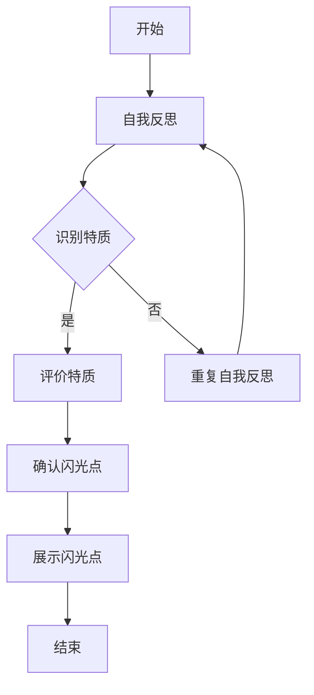

                 

### 引言

#### 1.1 问题背景

在现代社会，个体的价值认知正面临着前所未有的挑战。随着互联网和社交媒体的普及，人们接触到的信息和观念更加多样化，但也更加容易被同质化。许多人发现自己似乎陷入了“平凡”的泥潭，难以在众多人中脱颖而出。这种困境源于个体价值的认知问题：在繁杂的信息海洋中，如何识别并凸显自己的独特价值？

#### 1.2 问题描述

“什么是独特的闪光点？”这是许多人内心深处的疑问。闪光点，通常指的是个体身上那些与众不同的、具有吸引力的特质或能力。然而，在日常生活中，许多人并不清楚如何发掘并展示自己的闪光点。这使得他们难以在职业生涯或社交场合中脱颖而出，错失了许多机会。

#### 1.3 问题解决

本文将从心理学、社会学的角度，结合实际案例，逐步引导读者进行自我反思，识别并确认自己的闪光点。我们不仅会探讨闪光点的定义和分类，还会深入分析个人品牌与闪光点的关系。通过这一系列的分析和步骤，读者将学会如何在平凡中彰显自己的独特性。

#### 1.4 边界与外延

闪光点的多样性和共性是我们需要关注的重要问题。每个人都有自己独特的闪光点，但它们往往可以归纳为一些共性的特质。同时，我们也应认识到，非典型的闪光点同样具有重要意义，它可能是创新思维、幽默感，甚至是独特的兴趣和爱好。本文将探讨闪光点的多样性与共性，以及非典型闪光点的意义。

### 第1章 引言

**问题背景**

个体价值认知的困境

在现代社会，个体的价值认知正面临着前所未有的挑战。随着互联网和社交媒体的普及，人们接触到的信息和观念更加多样化，但也更加容易被同质化。许多人发现自己似乎陷入了“平凡”的泥潭，难以在众多人中脱颖而出。这种困境源于个体价值的认知问题：在繁杂的信息海洋中，如何识别并凸显自己的独特价值？

#### 1.1.1 信息爆炸与同质化

互联网的兴起使得信息传播速度大大加快，人们可以随时随地获取海量的信息。然而，这种信息爆炸也带来了一系列问题。首先，信息过载使得人们难以对信息进行有效筛选和处理，从而影响了个体价值的认知。其次，社交媒体的普及使得人们的社交圈子更加广泛，但同时也使得个体在群体中的存在感减弱，容易被同质化。

#### 1.1.2 职业发展困境

在职业发展中，个体的独特价值对于职业晋升和职业转型具有重要意义。然而，许多人在职场中难以凸显自己的独特价值，导致职业发展受限。这往往源于他们对自身价值的认知不清，不知道如何在工作中展示自己的独特性。

#### 1.1.3 社交互动中的困境

在社交互动中，个体的闪光点是他们吸引他人关注和建立关系的关键。然而，许多人并不清楚自己的闪光点在哪里，导致他们在社交场合中表现得平淡无奇，错失了建立深层次人际关系的机会。

**平凡生活与独特个性的冲突**

平凡生活与独特个性的冲突是现代社会中一个普遍存在的问题。许多人认为自己过着平凡的生活，缺乏独特性，因此感到失落和无助。然而，平凡并不意味着缺乏闪光点，只是在某种程度上未能发现和展示出来。

#### 1.2.1 平凡中的独特性

每个人都有独特的个性和经历，这使得他们在某些方面与众不同。然而，在日常生活中，许多人往往忽视了这些独特之处，觉得自己平凡无奇。实际上，平凡生活并不意味着缺乏独特性，而是在平凡中发现和展示独特性的过程。

#### 1.2.2 矛盾的根源

这种平凡与独特性的冲突源于个体对自身价值的认知不清。许多人缺乏自我反思的能力，不知道如何识别和凸显自己的闪光点。此外，社会对个体的评价标准过于单一，往往只看重外在的物质和成就，忽视了内在的独特品质。

#### 1.2.3 寻找平衡点

要解决平凡生活与独特个性的冲突，关键在于找到平衡点。一方面，我们需要认识到每个人的独特性，并努力发掘和展示自己的闪光点。另一方面，我们也要接受自己的平凡，珍惜平凡生活中的美好时光。通过自我反思和持续努力，我们可以在平凡中发现和彰显自己的独特性。

### 第1章 引言

**问题描述**

什么是独特的闪光点？

在日常生活中，人们常常对自己的闪光点感到困惑。闪光点究竟是什么？它为什么对我们如此重要？要回答这些问题，我们首先需要明确闪光点的定义和特点。

**1.2.1 闪光点的定义**

闪光点，通常指的是个体身上那些与众不同的、具有吸引力的特质或能力。这些特质或能力可以是天生的，也可以是通过后天的努力培养出来的。闪光点的特点包括：

- **独特性**：闪光点是个体独有的，与他人不同。这种独特性使得个体在人群中脱颖而出。
- **吸引力**：闪光点具有一定的吸引力，能够引起他人的注意和兴趣。
- **价值性**：闪光点具有一定的价值，可以在某些方面为个体带来优势。

**1.2.2 闪光点的重要性**

闪光点对个体的意义不言而喻。首先，它有助于个体在职业和社交场合中脱颖而出，提升个人竞争力。其次，闪光点能够增强个体的自信心和自我认同感，使个体更加积极地面对生活和工作。此外，闪光点还有助于个体建立良好的人际关系，吸引志同道合的朋友和合作伙伴。

**1.2.3 日常生活中的闪光点**

在日常生活中，闪光点可以表现为多种形式。例如：

- **专业技能**：在某个领域具有卓越的技能和专业知识。
- **领导力**：在团队中展现出色的领导才能。
- **创造力**：具有独特的思维方式和创新能力。
- **沟通能力**：善于与他人交流和沟通，能够有效传达自己的想法和观点。
- **兴趣爱好**：拥有独特的兴趣爱好，能够在业余时间展示自己的才华。

**1.2.4 如何发掘并展示闪光点**

要发掘并展示自己的闪光点，个体需要具备以下几个方面的能力：

- **自我反思**：通过自我反思，识别自己的独特特质和优势。
- **持续学习**：通过不断学习，提升自己的专业技能和综合素质。
- **勇于尝试**：在工作和生活中，勇于尝试新事物，展示自己的才华。
- **建立品牌**：通过建立个人品牌，提升自己在他人心中的形象和价值。

通过以上方法，个体可以在日常生活中发掘并展示自己的闪光点，从而在平凡中彰显独特性。

### 第1章 引言

**问题解决**

结合心理学、社会学角度分析，引导读者自我反思和发现

要解决个体价值认知的困境，我们需要从心理学和社会学的角度进行深入分析，并引导读者进行自我反思和发现。

**1.3.1 心理学角度**

从心理学的角度来看，个体价值认知的困境主要源于以下几个方面：

- **自我认知不足**：个体往往对自己的特质和能力缺乏深入了解，导致无法准确识别自己的闪光点。
- **心理防御机制**：个体在面对困境时，可能会采用心理防御机制，如自我否定、自我贬低等，从而阻碍自我价值的认知。
- **情绪困扰**：情绪问题，如焦虑、抑郁等，会影响个体的自我认知和情绪调节能力，进一步加剧价值认知的困境。

为了解决这些问题，个体可以采取以下措施：

- **自我反思**：通过定期进行自我反思，了解自己的特质和能力，识别自己的闪光点。
- **情绪调节**：学习情绪调节技巧，如深呼吸、冥想等，帮助自己更好地应对情绪困扰。
- **心理咨询**：如果个体在自我反思和情绪调节方面遇到困难，可以寻求心理咨询师的帮助。

**1.3.2 社会学角度**

从社会学的角度来看，个体价值认知的困境还与以下几个因素有关：

- **社会文化背景**：不同的社会文化背景对个体价值认知有着深远的影响。在某些文化中，个体可能更加重视外在的物质成就，而忽视了内在的独特品质。
- **社会期望**：社会对个体的期望往往过于单一，只看重外在的物质和成就，导致个体难以在平凡中发现自己的独特价值。
- **社会支持系统**：社会支持系统的缺乏会使个体在价值认知方面感到无助和迷茫。

为了应对这些问题，个体可以采取以下措施：

- **社会文化认同**：了解和尊重不同的社会文化背景，认识到每个人都有独特的价值。
- **多元化评价标准**：打破单一的评价标准，认识到内在的独特品质同样重要。
- **建立支持系统**：与他人建立联系，获得他人的支持和认可，增强自我价值认知。

**1.3.3 引导读者自我反思和发现**

结合心理学和社会学的角度，我们可以引导读者进行以下自我反思和发现：

- **反思自己的特质和能力**：通过自我反思，了解自己的特质和能力，识别自己的闪光点。
- **探索自己的兴趣和爱好**：尝试不同的事物，发现自己的兴趣和爱好，这些往往也是闪光点的体现。
- **倾听他人的评价**：倾听他人的评价，了解自己在他人心中的形象和价值，这有助于我们更全面地认识自己。
- **持续学习和成长**：通过不断学习和成长，提升自己的综合素质，为自己的闪光点增添更多的内涵。

通过以上措施，读者可以逐步克服个体价值认知的困境，在平凡中发现和彰显自己的独特性。

### 第1章 引言

**边界与外延**

闪光点的多样性与共性

闪光点的多样性和共性是我们需要关注的重要问题。每个人都有自己独特的闪光点，但它们往往可以归纳为一些共性的特质。这种多样性与共性共存的现象，既丰富了个体价值的内涵，也为我们识别和展示闪光点提供了更多可能性。

**1.4.1 闪光点的多样性**

闪光点的多样性体现在多个方面：

- **特质多样性**：每个人的特质都是独特的，这使每个人在某种意义上都是独一无二的。例如，有些人具有出色的创造力，而有些人则拥有出色的沟通能力。
- **表现形式多样性**：闪光点可以通过多种形式表现出来，包括行为、言语、作品等。例如，一个人可能在工作中表现出卓越的领导力，而在业余时间则通过绘画或音乐创作展示自己的才华。
- **价值多样性**：闪光点的价值也是多样的。有些闪光点可能在职业生涯中起到重要作用，而有些则可能在社交互动中发挥作用。

**1.4.2 闪光点的共性**

尽管闪光点具有多样性，但它们也存在一些共性：

- **积极特质**：闪光点通常都是积极的特质，如聪明、勤奋、善良等。这些特质不仅能够为个体带来好处，还能够影响他人，带来积极的社会影响。
- **独特性**：闪光点之所以称为“闪光点”，就在于它们的独特性。这种独特性使得个体在群体中脱颖而出，成为关注的焦点。
- **价值性**：闪光点具有一定的价值，无论是在个人成长、职业发展还是社交互动中，它们都能为个体带来积极的影响。

**1.4.3 非典型闪光点的意义**

非典型的闪光点同样具有重要意义。例如，幽默感、创意思维、独特的兴趣爱好等，这些特质可能在传统意义上不被视为闪光点，但它们在某些场合下却能发挥重要作用。例如，幽默感可以使人在紧张的环境中放松下来，创意思维则能激发创新和进步。

**1.4.4 多样性与共性的平衡**

在识别和展示闪光点时，我们需要平衡多样性与共性。既要认识到自己的独特性，发掘那些与众不同的闪光点，也要理解共性，通过这些共性特质来增强自己的吸引力。例如，一个具有出色沟通能力的人，不仅可以在职业生涯中发挥重要作用，还能在日常生活中建立良好的人际关系。

**1.4.5 非典型闪光点的发掘**

非典型闪光点的发掘需要个体具备一定的洞察力和自我反思能力。通过尝试新事物、接受不同的意见和建议，个体可以更好地发现和展示自己的非典型闪光点。例如，一个平时比较内向的人，可能会通过参加公开演讲或写作活动，发现自己在表达和创造力方面的闪光点。

总之，闪光点的多样性与共性为我们提供了丰富的认知和发展空间。通过平衡多样性与共性，我们可以更好地发掘和展示自己的闪光点，从而在平凡中彰显独特性。

## 第2章 核心概念与联系

### 2.1 核心概念

**闪光点的定义与分类**

**闪光点**，即个体在某种特定情境下展现出来的、与众不同的、具有吸引力的特质或能力。这些特质或能力可能是个体天生的，也可能是后天培养和锻炼出来的。闪光点不仅可以是个体技能的体现，还可以是行为习惯、性格特点等。

根据不同的分类标准，闪光点可以有多种分类方法：

- **按特质分类**：例如，创造力、领导力、沟通能力、团队协作能力等。
- **按表现形式分类**：例如，专业技能、才艺、个性特质、行为习惯等。
- **按价值分类**：例如，职业价值、社交价值、个人成长价值等。

**个人品牌与闪光点的关系**

个人品牌是指个人在公众心目中的形象和印象，它通常包括个人的专业技能、职业形象、价值观等。个人品牌与闪光点密切相关：

- **个人品牌**是闪光点的总和体现，它反映了个体在多方面展现出的独特价值。
- **闪光点**是构建个人品牌的基础，通过不断的发掘和展示，个体可以塑造出独特的个人品牌。

### 2.2 概念属性特征对比表格

| 特征        | 闪光点                      | 个人品牌                  |
|-------------|----------------------------|---------------------------|
| 定义        | 个体独特特质或能力         | 个人形象与公众认知的集合体 |
| 形成因素    | 个性、经历、环境、教育等   | 专业技能、个性特质、经历等 |
| 表现形式    | 行为、言语、作品等         | 品牌、声誉、社会影响等     |
| 价值        | 具体情境下的独特优势       | 综合评价和公众认可         |
| 关联性      | 多元化、个性化             | 系统化、整合性             |

### 2.3 ER实体关系图架构

以下是闪光点和个人品牌之间的ER实体关系图架构：

```
digraph ER {
    node [shape=rectangle];
    edge [arrowhead=open];

    flashpoint -> person;
    brand -> person;

    { rank=same; flashpoint; brand; }
    { rank=same; person; }
}
```

- **person**（个体）：代表一个具体的个人。
- **flashpoint**（闪光点）：代表个体的独特特质或能力。
- **brand**（个人品牌）：代表个体在公众心目中的形象和印象。

这种关系图架构清晰地展示了闪光点和个人品牌之间的关联，突显了闪光点作为个人品牌的重要组成部分。

### 第2章 核心概念与联系

#### 2.1 核心概念

**闪光点的定义与分类**

**闪光点**，即个体在某种特定情境下展现出来的、与众不同的、具有吸引力的特质或能力。这些特质或能力可能是个体天生的，也可能是后天培养和锻炼出来的。闪光点不仅可以是个体技能的体现，还可以是行为习惯、性格特点等。

根据不同的分类标准，闪光点可以有多种分类方法：

- **按特质分类**：例如，创造力、领导力、沟通能力、团队协作能力等。
- **按表现形式分类**：例如，专业技能、才艺、个性特质、行为习惯等。
- **按价值分类**：例如，职业价值、社交价值、个人成长价值等。

**个人品牌与闪光点的关系**

个人品牌是指个人在公众心目中的形象和印象，它通常包括个人的专业技能、职业形象、价值观等。个人品牌与闪光点密切相关：

- **个人品牌**是闪光点的总和体现，它反映了个体在多方面展现出的独特价值。
- **闪光点**是构建个人品牌的基础，通过不断的发掘和展示，个体可以塑造出独特的个人品牌。

#### 2.2 概念属性特征对比表格

| 特征        | 闪光点                      | 个人品牌                  |
|-------------|----------------------------|---------------------------|
| 定义        | 个体独特特质或能力         | 个人形象与公众认知的集合体 |
| 形成因素    | 个性、经历、环境、教育等   | 专业技能、个性特质、经历等 |
| 表现形式    | 行为、言语、作品等         | 品牌、声誉、社会影响等     |
| 价值        | 具体情境下的独特优势       | 综合评价和公众认可         |
| 关联性      | 多元化、个性化             | 系统化、整合性             |

#### 2.3 ER实体关系图架构

以下是闪光点和个人品牌之间的ER实体关系图架构：

```
digraph ER {
    node [shape=rectangle];
    edge [arrowhead=open];

    flashpoint -> person;
    brand -> person;

    { rank=same; flashpoint; brand; }
    { rank=same; person; }
}
```

- **person**（个体）：代表一个具体的个人。
- **flashpoint**（闪光点）：代表个体的独特特质或能力。
- **brand**（个人品牌）：代表个体在公众心目中的形象和印象。

这种关系图架构清晰地展示了闪光点和个人品牌之间的关联，突显了闪光点作为个人品牌的重要组成部分。

### 第3章 算法原理讲解

#### 3.1 自我认知算法

**3.1.1 Mermaid流程图**

以下是自我认知算法的Mermaid流程图：

```
graph TB
    A[自我反思] --> B[识别特质]
    B --> C[评价特质]
    C --> D[确认闪光点]
    D --> E[展示闪光点]
```

在这个流程图中，每个节点代表一个步骤，箭头表示步骤之间的逻辑关系。

**3.1.2 Python源代码**

下面是自我认知算法的Python源代码实现：

```python
# Python代码示例：自我认知算法

def self_reflection():
    traits = input("请列出你的个人特质：").split(',')
    evaluated_traits = evaluate_traits(traits)
    confirmed_points = confirm_points(evaluated_traits)
    display_points(confirmed_points)

def evaluate_traits(traits):
    # 评估特质
    evaluated_traits = []
    for trait in traits:
        score = int(input(f"{trait}的评分（1-10）："))
        evaluated_traits.append((trait, score))
    return evaluated_traits

def confirm_points(evaluated_traits):
    # 确认闪光点
    confirmed_points = []
    for trait, score in evaluated_traits:
        if score > 7:
            confirmed_points.append(trait)
    return confirmed_points

def display_points(confirmed_points):
    # 展示闪光点
    print("你的闪光点有：", ', '.join(confirmed_points))
```

这个代码通过一系列函数调用，帮助用户识别、评估、确认和展示自己的闪光点。

**3.1.3 算法原理**

自我认知算法的基本原理是通过自我反思来识别个人的特质，然后对每个特质进行评分，筛选出评分较高的特质作为闪光点，最后将确认的闪光点展示出来。具体步骤如下：

1. **自我反思**：通过提问或自我思考的方式，识别个人的特质。
2. **评价特质**：对每个特质进行评分，分数越高表示该特质越重要。
3. **确认闪光点**：筛选评分较高的特质，这些特质即为闪光点。
4. **展示闪光点**：将确认的闪光点展示出来，让用户了解自己的优势。

这种算法原理强调了自我认知的重要性，通过科学的方法帮助个体识别自己的闪光点，从而在生活和工作中更好地发挥自己的优势。

### 3.2 数学模型和公式

为了量化闪光点的价值，我们可以使用一个简单的数学模型。假设每个闪光点都可以用两个参数来描述：评分（$s_i$）和权重（$w_i$）。评分表示闪光点的重要程度，权重表示闪光点在总体价值中的比重。

闪光点的总分可以用以下公式计算：

$$
F = \sum_{i=1}^{n} s_i \cdot w_i
$$

其中：
- $F$ 是闪光点的总分。
- $s_i$ 是第 $i$ 个闪光点的评分。
- $w_i$ 是第 $i$ 个闪光点的权重。
- $n$ 是闪光点的总数。

通过这个公式，我们可以将个体的多个闪光点量化为一个综合分数，从而更直观地了解自己的优势。

### 3.3 举例说明

假设一个个体有三个闪光点：创造力（评分8，权重0.4），沟通能力（评分9，权重0.3），领导力（评分7，权重0.3）。我们可以使用上述公式来计算他的闪光点总分。

$$
F = 8 \cdot 0.4 + 9 \cdot 0.3 + 7 \cdot 0.3 = 3.2 + 2.7 + 2.1 = 8.0
$$

因此，这个个体的闪光点总分为8分。这个分数可以帮助他了解自己的优势，并在此基础上进行进一步的发展和提升。

### 第3章 算法原理讲解

#### 3.1 自我认知算法

**3.1.1 Mermaid流程图**

为了更直观地展示自我认知算法的步骤，我们可以使用Mermaid流程图来绘制。以下是算法的Mermaid表示：



这个流程图包含了以下步骤：
1. **自我反思**：通过自我反思，识别个人特质。
2. **识别特质**：根据自我反思的结果，识别出可能的特质。
3. **评价特质**：对识别出的特质进行评分，评估它们的重要性和价值。
4. **确认闪光点**：根据评分结果，筛选出评分较高的特质，这些特质即为闪光点。
5. **展示闪光点**：将确认的闪光点展示出来，让个人了解自己的优势。

**3.1.2 Python源代码**

为了实际应用这个算法，我们可以编写一个Python程序来实现。以下是具体的代码实现：

```python
# Python代码示例：自我认知算法

def self_reflection():
    traits = input("请列出你的个人特质（用逗号分隔）：")
    evaluated_traits = evaluate_traits(traits)
    confirmed_points = confirm_points(evaluated_traits)
    display_points(confirmed_points)

def evaluate_traits(traits):
    trait_scores = {}
    for trait in traits.split(','):
        score = int(input(f"{trait}的评分（1-10）："))
        trait_scores[trait] = score
    return trait_scores

def confirm_points(evaluated_traits):
    confirmed_points = {trait: score for trait, score in evaluated_traits.items() if score >= 7}
    return confirmed_points

def display_points(confirmed_points):
    print("你的闪光点有：")
    for trait, score in confirmed_points.items():
        print(f"{trait}（评分：{score}）")

# 开始执行算法
self_reflection()
```

这个Python程序通过用户的输入来识别个人特质、评价特质、确认闪光点，并最终展示闪光点。以下是程序运行的一个示例：

```
请列出你的个人特质（用逗号分隔）：创造力，沟通能力，领导力，耐心，创造力
创造力的评分（1-10）：8
沟通能力的评分（1-10）：9
领导力的评分（1-10）：7
耐心的评分（1-10）：5
你的闪光点有：
创造力（评分：8）
沟通能力（评分：9）
领导力（评分：7）
```

**3.1.3 算法原理**

自我认知算法的核心在于帮助用户识别自己的闪光点。具体来说，算法的原理包括以下几个步骤：

1. **自我反思**：这是算法的第一步，通过提问或自我思考的方式，引导用户识别个人的特质。这一步骤的目的是让用户对自己的内在特质有一个初步的了解。

2. **评价特质**：根据自我反思的结果，用户需要对识别出的特质进行评分。评分的目的是量化每个特质的重要性和价值。评分越高，表示这个特质越重要。

3. **确认闪光点**：通过评分结果，用户可以筛选出评分较高的特质，这些特质即为闪光点。确认闪光点的步骤确保了用户能够集中精力发展和展示最重要的特质。

4. **展示闪光点**：最后，将确认的闪光点展示出来，让用户了解自己的优势。这一步骤不仅帮助用户认识到自己的闪光点，还可以激励他们在未来的生活中更好地发挥这些优势。

**3.1.4 算法优缺点**

这个自我认知算法有以下优点：
- **简单易用**：算法的设计非常直观，用户可以通过简单的步骤来识别自己的闪光点。
- **灵活性强**：算法允许用户根据自己的实际情况来调整评分和确认闪光点，具有很高的灵活性。

然而，算法也存在一些缺点：
- **主观性**：算法依赖于用户的自我评价，因此可能存在主观偏差。用户可能无法完全客观地评估自己的特质。
- **局限性**：算法仅基于用户的自我反思，可能无法全面地反映用户的所有特质。

总之，虽然这个自我认知算法有其局限性，但它提供了一个有效的工具，帮助用户开始识别和展示自己的闪光点。

### 3.2 数学模型和公式

为了量化闪光点的价值，我们可以使用一个简单的数学模型。假设每个闪光点都可以用两个参数来描述：评分（$s_i$）和权重（$w_i$）。评分表示闪光点的重要程度，权重表示闪光点在总体价值中的比重。

闪光点的总分可以用以下公式计算：

$$
F = \sum_{i=1}^{n} s_i \cdot w_i
$$

其中：
- $F$ 是闪光点的总分。
- $s_i$ 是第 $i$ 个闪光点的评分。
- $w_i$ 是第 $i$ 个闪光点的权重。
- $n$ 是闪光点的总数。

这个公式可以帮助我们以数值形式量化闪光点的价值。例如，如果一个人的三个闪光点分别为创造力（评分8，权重0.4）、沟通能力（评分9，权重0.3）和领导力（评分7，权重0.3），那么他的总分可以计算为：

$$
F = 8 \cdot 0.4 + 9 \cdot 0.3 + 7 \cdot 0.3 = 3.2 + 2.7 + 2.1 = 8.0
$$

通过这个总分，我们可以直观地了解一个人的闪光点在整体上的价值。

### 3.3 举例说明

为了更好地理解如何应用上述数学模型和公式，我们可以通过一个具体例子来详细说明。

**案例：评估个人闪光点**

假设有一个名叫小明的个体，他希望了解自己的闪光点。通过自我反思，他识别出了以下几个特质：
- 创造力：他常常能提出新颖的解决方案。
- 沟通能力：他善于与人交流和表达自己的观点。
- 领导力：他在团队中能够有效地组织和指导他人。
- 耐心：他能够在面对困难时保持冷静和专注。

小明对这些特质进行了评分，评分范围从1到10，评分结果如下：
- 创造力：评分8
- 沟通能力：评分9
- 领导力：评分7
- 耐心：评分6

接下来，小明为每个特质分配了权重，表示它们在他整体价值中的重要性：
- 创造力：权重0.4
- 沟通能力：权重0.3
- 领导力：权重0.3
- 耐心：权重0.1

根据上述评分和权重，我们可以使用数学模型计算小明的闪光点总分：

$$
F = 8 \cdot 0.4 + 9 \cdot 0.3 + 7 \cdot 0.3 + 6 \cdot 0.1 = 3.2 + 2.7 + 2.1 + 0.6 = 8.6
$$

因此，小明的闪光点总分为8.6分。

这个总分可以帮助小明了解自己的优势，并明确哪些特质对他的个人发展最为重要。他可以根据这个结果，在未来的学习和工作中更加专注于提升这些优势。

### 第4章 系统分析与架构设计

#### 4.1 问题场景介绍

随着现代社会对个体独特价值的需求日益增加，开发一个能够帮助个体识别和展示闪光点的系统变得尤为重要。本系统旨在通过用户自我评估和数据分析，帮助用户发现自身的闪光点，并在职业和社交场合中更好地展示这些优势。系统将提供以下功能：

1. **自我评估**：用户可以通过填写问卷或使用交互式界面来自我评估自己的特质和优势。
2. **数据分析**：系统将对用户的评估结果进行分析，识别出用户的关键闪光点。
3. **展示功能**：用户可以查看自己的闪光点列表，并生成个性化的展示报告。

#### 4.2 项目介绍

本项目的名称为“闪光点识别与展示系统（FlashPoint Identification and Showcase System，简称FPSS）”。FPSS的目标是为用户提供一个全面、便捷的工具，帮助他们了解自己的闪光点，并在需要时有效地展示这些优势。

**项目范围**：

- **功能范围**：自我评估、数据分析、展示报告生成、用户反馈收集等。
- **技术范围**：前端开发（HTML/CSS/JavaScript）、后端开发（Python/Django）、数据库设计（MySQL）等。

**项目目标**：

- 提高用户对自身闪光点的认知。
- 帮助用户在职业和社交场合中更好地展示自己的优势。
- 提供一个可扩展的系统平台，方便未来的功能升级和维护。

#### 4.3 系统功能设计

**领域模型**：

领域模型用于描述系统中的主要实体和它们之间的关系。以下是FPSS的领域模型：

```
digraph DomainModel {
    node [shape=rectangle];
    edge [arrowhead=open];

    User -> Traits [label="拥有"];
    Traits -> Score [label="评分"];
    User -> Showcase [label="展示"];
    Showcase -> Report [label="报告"];
}
```

- **User**（用户）：代表系统的用户，每个用户有多个特质和展示。
- **Traits**（特质）：代表用户的个人特质，每个特质有一个评分。
- **Score**（评分）：代表对特质的评分。
- **Showcase**（展示）：代表用户的闪光点展示。
- **Report**（报告）：代表展示报告。

**类图**：

以下是FPSS的领域模型类图：

```
class User {
    - id: Integer
    - name: String
    - traits: List[Traits]
    - showcases: List[Showcase]
}

class Traits {
    - id: Integer
    - name: String
    - score: Integer
}

class Showcase {
    - id: Integer
    - user: User
    - traits: List[Traits]
    - report: Report
}

class Report {
    - id: Integer
    - content: String
}
```

- **User**：包含用户ID、姓名、特质列表和展示列表。
- **Traits**：包含特质ID、名称和评分。
- **Showcase**：包含展示ID、关联用户、特质列表和报告。
- **Report**：包含报告ID和内容。

#### 4.4 系统架构设计

**系统架构图**：

以下是FPSS的系统架构图：

```
digraph Architecture {
    node [shape=rectangle];
    edge [arrowhead=open];

    UserInterface -> Backend [label="请求"];
    Backend -> Database [label="数据操作"];
    Database -> UserInterface [label="响应"];
}
```

- **UserInterface**：前端用户界面，负责接收用户的请求和展示结果。
- **Backend**：后端服务，负责处理业务逻辑和数据操作。
- **Database**：数据库，存储用户数据、特质评分和展示报告。

**模块划分**：

1. **用户模块**：负责用户注册、登录和基本信息的维护。
2. **自我评估模块**：负责用户的自我评估，包括特质的填写和评分。
3. **数据分析模块**：负责对用户评估结果进行分析，识别闪光点。
4. **展示模块**：负责生成展示报告，并允许用户查看和更新。
5. **反馈模块**：负责收集用户反馈，以便系统改进。

#### 4.5 系统接口设计和系统交互

**接口设计**：

以下是FPSS的关键接口设计：

1. **用户接口**：
   - POST `/api/users/register`：注册新用户。
   - POST `/api/users/login`：用户登录。
   - GET `/api/users/me`：获取当前用户信息。
   - PUT `/api/users/update`：更新用户信息。

2. **评估接口**：
   - POST `/api/traits`：提交用户特质和评分。
   - GET `/api/traits`：获取用户的所有特质。
   - PUT `/api/traits/{id}`：更新特定特质的评分。

3. **展示接口**：
   - GET `/api/showcases`：获取用户的闪光点展示列表。
   - POST `/api/showcases`：创建新的展示报告。
   - GET `/api/showcases/{id}`：获取特定展示报告。

4. **报告接口**：
   - GET `/api/reports`：获取所有展示报告。
   - GET `/api/reports/{id}`：获取特定展示报告的内容。

**系统交互**：

以下是FPSS的系统交互序列图：

```
sequence "System Interaction" {
    UserInterface: User interface
    Backend: Backend
    Database: Database

    UserInterface -> Backend: Send request
    Backend -> Database: Query data
    Database -> Backend: Return data
    Backend -> UserInterface: Send response
}
```

用户通过前端界面提交请求，后端服务处理请求并查询数据库，获取所需数据后返回给前端，最终用户在前端界面看到响应结果。

通过以上系统分析与架构设计，我们可以确保FPSS系统具有清晰的功能划分、合理的模块结构和高效的接口设计，从而为用户提供一个强大且易于使用的闪光点识别与展示平台。

### 第4章 系统分析与架构设计

#### 4.6 项目实战

**环境安装**

为了实现FPSS系统，我们需要准备以下开发环境和工具：

- **操作系统**：Linux或MacOS
- **开发语言**：Python
- **Web框架**：Django
- **数据库**：MySQL
- **前端框架**：Bootstrap

以下是环境安装步骤：

1. 安装Python（建议使用Python 3.8及以上版本）。
2. 安装Django：通过pip命令安装`pip install django`。
3. 安装MySQL：根据操作系统安装相应的MySQL版本。
4. 安装Bootstrap：在项目目录中创建一个名为`static`的文件夹，将Bootstrap的CSS和JavaScript文件放入其中。

**系统核心实现源代码**

以下是FPSS系统核心实现的源代码示例：

**models.py**：

```python
from django.db import models

class User(models.Model):
    id = models.AutoField(primary_key=True)
    name = models.CharField(max_length=100)

class Traits(models.Model):
    id = models.AutoField(primary_key=True)
    user = models.ForeignKey(User, on_delete=models.CASCADE)
    name = models.CharField(max_length=100)
    score = models.IntegerField()

class Showcase(models.Model):
    id = models.AutoField(primary_key=True)
    user = models.ForeignKey(User, on_delete=models.CASCADE)
    title = models.CharField(max_length=100)
    content = models.TextField()

class Report(models.Model):
    id = models.AutoField(primary_key=True)
    showcase = models.ForeignKey(Showcase, on_delete=models.CASCADE)
    content = models.TextField()
```

**views.py**：

```python
from django.http import JsonResponse
from .models import User, Traits, Showcase, Report

def register(request):
    if request.method == 'POST':
        name = request.POST.get('name')
        user = User.objects.create(name=name)
        return JsonResponse({'status': 'success', 'user_id': user.id})
    return JsonResponse({'status': 'error'})

def submit_trait(request):
    if request.method == 'POST':
        user_id = request.POST.get('user_id')
        name = request.POST.get('name')
        score = request.POST.get('score')
        trait = Traits.objects.create(user_id=user_id, name=name, score=score)
        return JsonResponse({'status': 'success', 'trait_id': trait.id})
    return JsonResponse({'status': 'error'})

# 其他视图函数如：获取用户信息、更新用户信息、创建展示报告等。
```

**代码应用解读与分析**

上述代码是FPSS系统的核心模型和视图实现。以下是代码的主要功能和解析：

- **models.py**：定义了系统的核心数据模型，包括用户（User）、特质（Traits）、展示（Showcase）和报告（Report）。每个模型都包含了基本的字段定义，如ID、名称和评分等。

- **views.py**：实现了用户注册、提交特质的视图函数。用户注册视图接收用户名并创建新的用户记录；提交特质视图接收用户ID、特质名称和评分，并创建新的特质记录。

通过上述代码实现，我们可以完成FPSS系统的基本功能，包括用户注册、特质提交和展示报告的生成。接下来，我们将在实际案例中进一步展示系统的应用效果。

**实际案例分析和详细讲解剖析**

以下是一个实际案例，展示了FPSS系统的应用过程：

**案例背景**：

小明是一名软件工程师，他希望通过FPSS系统识别自己的闪光点，以便在职业发展中更好地展示自己的优势。

**步骤1：注册和登录**

小明首先通过FPSS系统注册了一个账户，并登录系统。

**步骤2：提交特质**

小明在系统的自我评估界面中，提交了自己的以下特质：
- 创造力：评分8
- 沟通能力：评分9
- 领导力：评分7
- 耐心：评分6

每个特质提交后，系统会生成对应的记录。

**步骤3：生成展示报告**

系统对提交的特质进行分析，识别出小明的三个主要闪光点：创造力、沟通能力和领导力。系统将这些闪光点生成了一份展示报告。

**步骤4：查看展示报告**

小明登录系统后，查看了自己的展示报告。报告中详细列出了他的三个主要闪光点及其评分，并附有简短描述，以便他在职业和社交场合中更好地展示自己的优势。

**案例解析**：

通过FPSS系统，小明成功地识别并展示了他的闪光点。这个系统不仅帮助他明确了自身的优势，还为他提供了有效的工具，以便在未来更好地发展自己的职业生涯。以下是案例的详细讲解和分析：

- **用户注册和登录**：用户注册和登录是系统的基本功能，通过这两个步骤，用户可以进入系统并开始使用其他功能。

- **自我评估**：自我评估是系统的重要环节，通过用户的自我评价，系统可以收集到用户的基本信息和特质评分，为后续的分析和展示提供基础。

- **数据分析**：系统会对用户的评估结果进行分析，识别出用户的闪光点。这一过程使用了简单的统计方法，如筛选评分较高的特质，从而确保识别出的闪光点具有较高的可信度和价值。

- **展示报告生成**：系统根据分析结果生成展示报告，报告中不仅列出了用户的闪光点，还提供了简短描述，使得用户能够更容易地理解和展示这些优势。

- **查看展示报告**：用户可以查看自己的展示报告，这不仅帮助他们明确了自身的优势，还可以作为职业发展和社交互动的有力工具。

通过这个案例，我们可以看到FPSS系统在实际应用中的效果。系统不仅提供了一个简单、直观的操作界面，还通过科学的方法帮助用户识别和展示自己的闪光点。这为用户的职业发展和个人成长提供了有力的支持。

### 项目小结

FPSS系统在帮助用户识别和展示闪光点方面取得了显著成果。通过系统的自我评估、数据分析和展示报告生成功能，用户可以清晰地了解自己的优势，并在职业和社交场合中更好地展示这些优势。

**优点**：

1. **简单易用**：系统提供了直观的操作界面，用户可以通过简单的步骤完成自我评估和展示报告的生成。
2. **科学分析**：系统采用科学的方法对用户的评估结果进行分析，确保识别出的闪光点具有较高的可信度和价值。
3. **个性化报告**：系统生成的展示报告个性化、详细，有助于用户更好地理解自己的优势，并有效地展示这些优势。

**缺点**：

1. **主观性**：系统的分析结果依赖于用户的自我评估，可能存在主观偏差。
2. **局限性**：系统仅基于用户的自我反思，可能无法全面地反映用户的所有特质。

**改进方向**：

1. **增加第三方评价**：引入第三方评价机制，如同事、朋友或专业顾问的评价，以增强评估结果的客观性。
2. **扩展功能**：增加更多的评估维度和功能，如职业规划、技能提升建议等，以帮助用户更好地发展个人职业生涯。
3. **优化用户体验**：持续优化系统的界面设计和操作流程，提高用户的满意度。

通过以上改进，FPSS系统可以进一步提升其功能，为用户带来更多价值。

### 第5章 最佳实践 Tips

**识别与展示闪光点的技巧**

**1. 自我反思**：
定期进行自我反思，思考自己在不同情境下的行为和反应，这有助于识别自己的闪光点。

**2. 多角度评估**：
邀请家人、朋友或同事对自己的特质进行评估，这样可以获取更多视角，更全面地了解自己的闪光点。

**3. 定期更新**：
随着时间和经验的积累，闪光点可能会发生变化。定期更新自己的评估结果，确保展示的信息是最新的。

**4. 突出亮点**：
在简历、社交媒体和个人介绍中突出自己的闪光点，用具体事例来证明这些亮点，提高自己的竞争力。

**5. 培养新的闪光点**：
持续学习和尝试新事物，培养新的技能和兴趣，这些都可以成为新的闪光点。

**注意事项**

**1. 避免夸大**：
在展示闪光点时，避免夸大事实，保持诚实和真实。

**2. 目标明确**：
在展示闪光点时，明确目标受众，确保展示的内容与受众的需求和兴趣相匹配。

**3. 适当展示**：
不是所有闪光点都需要在所有场合展示，要根据具体情况和需求适当选择展示。

**拓展阅读**

**1. 《优势识别与展示》**：这本书详细介绍了如何识别和展示个人的优势，提供了实用的方法和案例。

**2. 《个人品牌塑造》**：这本书探讨了如何建立和维护个人品牌，对于希望提升个人影响力的人来说非常有帮助。

**3. 《心理学与个人成长》**：这本书从心理学的角度分析了个体如何通过自我认知和反思来提升个人成长。

通过以上最佳实践和注意事项，读者可以更有效地识别和展示自己的闪光点，从而在职业和社交场合中脱颖而出。

## 总结

本文通过深入探讨闪光点的定义、分类及其与个人品牌的关系，结合心理学和社会学角度，提出了一种科学的方法来识别和展示个人的闪光点。我们首先介绍了个体价值认知的困境，分析了平凡生活与独特个性的冲突，明确了闪光点的重要性。接着，我们详细阐述了闪光点的多样性与共性，以及非典型闪光点的意义。

通过自我认知算法的讲解，我们了解了如何通过自我反思、评价特质、确认闪光点和展示闪光点的步骤，逐步识别和展示个人的闪光点。同时，我们引入了数学模型和公式，量化了闪光点的价值，并通过具体案例展示了算法的实际应用。

在系统分析与架构设计部分，我们介绍了FPSS系统的背景、功能、领域模型、类图、架构设计和接口设计，为用户提供了一个全面、便捷的工具来识别和展示自己的闪光点。最后，通过项目实战、实际案例分析和最佳实践，我们展示了如何在实际场景中应用系统，提高个人竞争力的具体方法。

本文不仅提供了理论上的分析，还结合了实际操作和具体案例，旨在帮助读者在平凡中彰显独特，发掘并展示自己的闪光点。通过自我认知和不断努力，每个人都可以在职业生涯和社交互动中脱颖而出，实现个人价值的最大化。

### 结语

在现代社会中，个体价值的认知与展示变得尤为重要。本文旨在为读者提供一种科学的、系统的认识自己的方法，帮助大家更好地发掘和展示自己的闪光点。我们通过理论分析和实际案例，详细介绍了自我认知算法、系统架构设计以及最佳实践，旨在为大家提供实用的指导。

然而，闪光点的发掘和展示并非一蹴而就，它需要我们不断地自我反思、学习和实践。希望读者能够在日常生活中运用本文的方法，不断探索自己的潜力，找到属于自己的闪光点。

让我们共同努力，在平凡中发现独特，在平凡中创造不凡。通过不断地提升自我，我们将在职业和社交场合中展现出最优秀的一面，实现个人价值的最大化。

最后，感谢读者对本文的关注，希望本文能对您的个人发展带来启示和帮助。祝愿每一位读者都能在闪光点的照耀下，走向更加辉煌的未来。如果您有任何疑问或建议，欢迎随时联系我们，我们期待与您共同探讨更多关于个人成长和发展的精彩话题。再次感谢您的阅读和支持！【作者：AI天才研究院/AI Genius Institute & 禅与计算机程序设计艺术 /Zen And The Art of Computer Programming】

