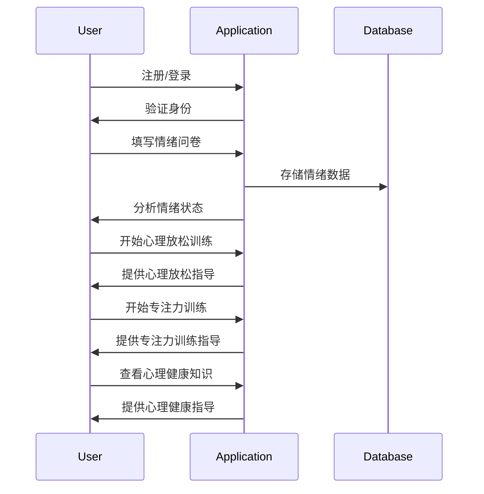
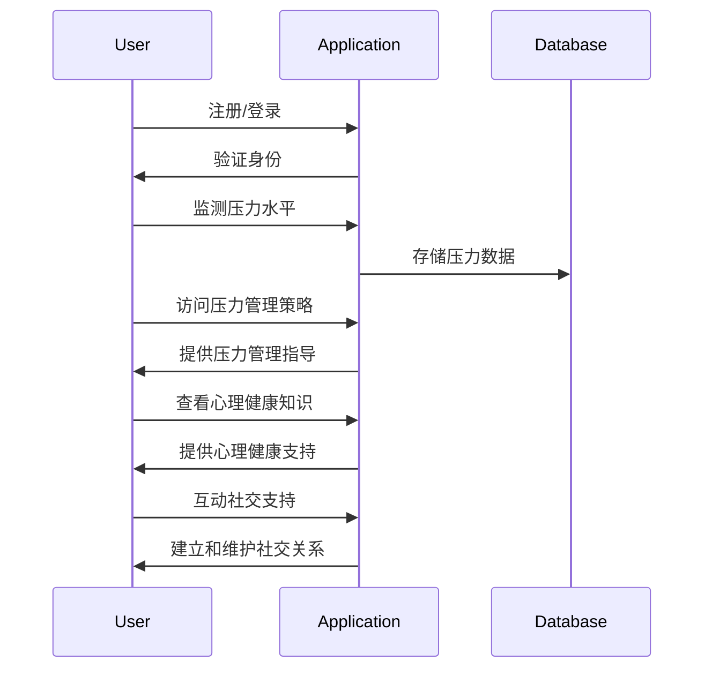
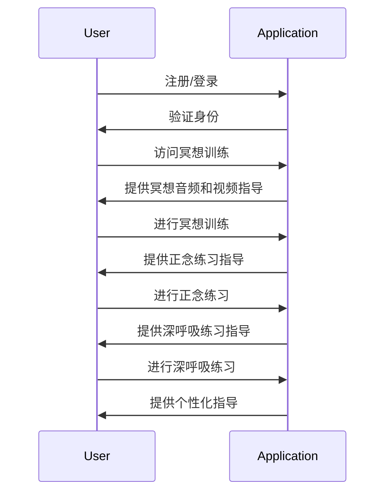
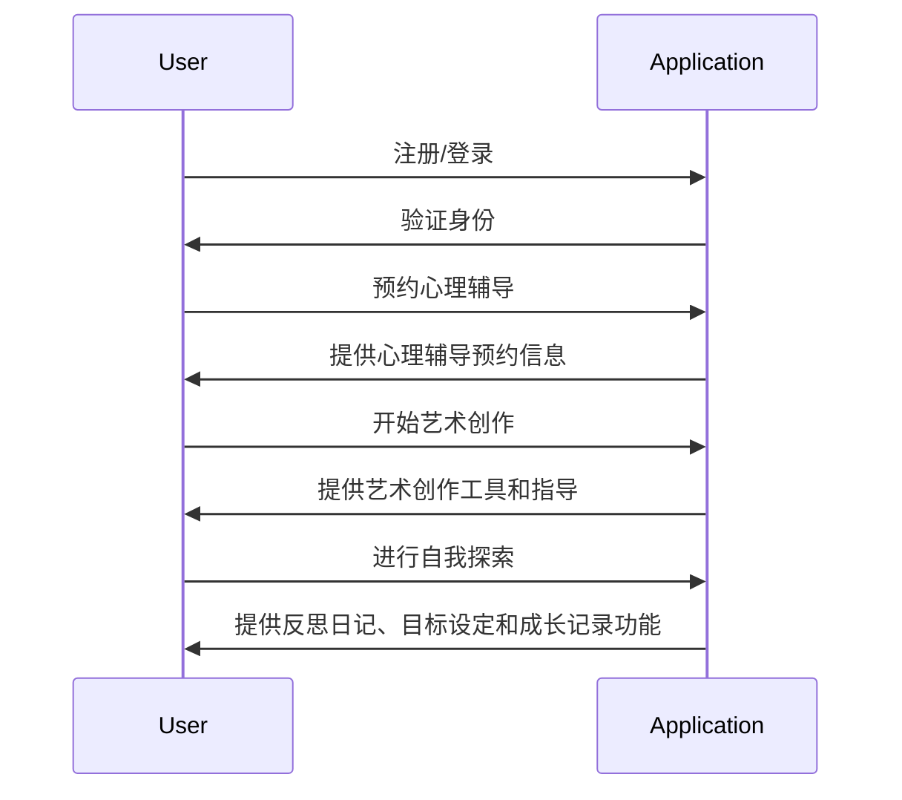
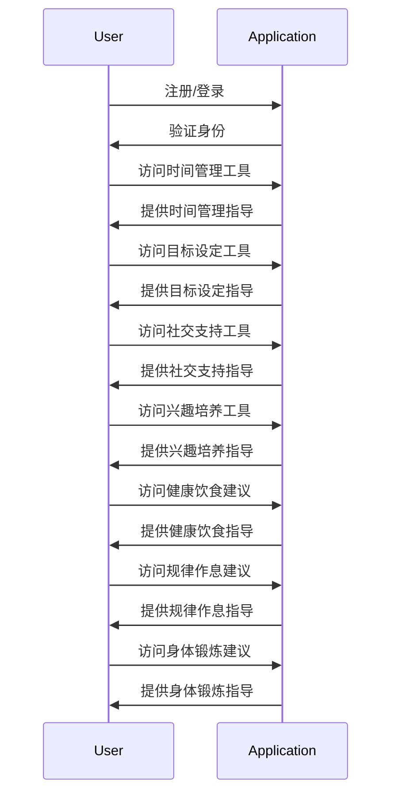

                 


### 第1章：问题背景与核心概念

**背景介绍**

在现代社会中，快节奏的生活已经成为一种常态。随着科技的进步和信息爆炸，人们面临的工作和生活压力越来越大。这种快节奏的生活方式不仅给人们的身体带来了负担，也对心理健康产生了深远的影响。本文旨在探讨如何在快节奏的生活中寻找内心平静，并提出对抗虚无的方法。

**核心概念与联系**

**虚无感**：虚无感是一种心理状态，当人们感到生活无意义、缺乏目标时，就可能产生虚无感。虚无感可能导致心理问题，如抑郁和焦虑。

**内心平静**：内心平静是一种心理状态，它表现为情绪稳定、心理放松和专注。内心平静有助于提高个人的幸福感和生活质量。

**快节奏生活的挑战**：快节奏的生活给人们带来了许多挑战，如工作压力、社交压力和生活压力等。

**心理健康的影响**：长期的压力和快节奏的生活对心理健康产生了负面影响，可能导致焦虑、抑郁等心理问题。

**内心平静的重要性**：内心平静不仅有助于缓解压力，还能够提高个人的创造力和解决问题的能力。

**概念结构与核心要素组成**

1. **虚无感**：无意义感、缺乏目标感。
2. **内心平静**：情绪稳定、心理放松、专注力。

**问题解决**

本文将探讨以下问题：

1. 如何在快节奏的生活中保持内心平静？
2. 对抗虚无的方法有哪些？
3. 实践案例分享：如何在日常生活中应用这些方法？

**边界与外延**

本文主要讨论内心平静在快节奏生活场景下的应用，包括工作、生活、社交等方面。同时，本文也将探讨对抗虚无的一些方法，如心理辅导、艺术疗法和自我探索等。

**核心概念原理**

内心平静的原理：

1. **情绪调节**：通过情绪调节，使情绪稳定，减少负面情绪的影响。
2. **心理放松**：通过放松训练，如冥想、深呼吸等，减轻心理压力。
3. **专注力**：通过专注练习，提高专注力，减少分心。

**概念属性特征对比表格**

| 特征      | 虚无感           | 内心平静         |
|-----------|------------------|------------------|
| 定义      | 生活无意义       | 情绪稳定、放松   |
| 情绪影响  | 负面情绪         | 积极情绪         |
| 心理状态  | 消极             | 积极             |
| 生活质量  | 降低             | 提高             |

**ER实体关系图架构的 Mermaid 流程图**

```mermaid
erDiagram
  Person ||--|{ Mind }
  Mind ||--|{ Emotion }
  Mind ||--|{ State }
```

**算法原理讲解**

本文将不涉及具体的算法原理讲解，因为内心平静更多是一种心理状态，而不是一个可以通过算法直接解决的问题。但是，我们可以通过以下步骤来理解如何通过一些方法来帮助保持内心平静：

1. **情绪调节**：通过识别和接受自己的情绪，学会调整情绪，避免情绪的过度波动。
2. **心理放松**：通过深呼吸、冥想等方法，减轻心理压力，达到心理放松的效果。
3. **专注练习**：通过专注力训练，提高专注力，减少分心，提高工作效率。

**数学公式**

$$
\text{内心平静} = \text{情绪稳定} + \text{心理放松} + \text{专注力}
$$

**系统分析与架构设计方案**

**问题场景介绍**

在现代快节奏的生活中，许多人都面临着心理健康问题，如焦虑、抑郁等。为了帮助人们保持内心平静，开发一款心理健康应用程序是非常必要的。

**项目介绍**

本项目旨在开发一款心理健康应用程序，提供一系列的心理健康训练和指导，帮助用户在快节奏的生活中保持内心平静。

**系统功能设计**

系统功能设计如下：

1. **情绪监测**：用户可以通过应用程序监测自己的情绪状态。
2. **心理放松训练**：提供冥想、深呼吸等心理放松训练。
3. **专注力训练**：提供专注力训练，帮助用户提高专注力。
4. **心理健康指导**：提供心理健康知识和指导，帮助用户更好地管理自己的心理健康。

**系统架构设计**

系统架构设计如下：

1. **前端**：使用React框架开发，提供用户界面和交互功能。
2. **后端**：使用Node.js框架开发，提供数据存储和业务逻辑处理。
3. **数据库**：使用MySQL数据库存储用户数据。

**系统接口设计**

系统接口设计如下：

1. **用户接口**：用户可以通过Web浏览器访问应用程序。
2. **API接口**：提供RESTful API接口，供第三方应用程序调用。

**系统交互**

系统交互设计如下：

1. **用户注册与登录**：用户可以通过用户接口注册和登录应用程序。
2. **情绪监测**：用户可以通过用户接口填写情绪问卷，系统会分析用户情绪状态。
3. **心理放松训练**：用户可以通过用户接口进行心理放松训练。
4. **专注力训练**：用户可以通过用户接口进行专注力训练。
5. **心理健康指导**：用户可以通过用户接口查看心理健康知识和指导。

**Mermaid 序列图**



**项目实战**

**环境安装**

1. 安装Node.js和MySQL。
2. 创建数据库和用户表。

**系统核心实现源代码**

```python
# 前端：React组件代码
import React, { useState } from 'react';

function MoodSurvey() {
  const [mood, setMood] = useState('');

  const handleSubmit = (e) => {
    e.preventDefault();
    // 发送情绪数据到后端API
    console.log('情绪数据:', mood);
  };

  return (
    <form onSubmit={handleSubmit}>
      <label>
        当前情绪：
        <select value={mood} onChange={(e) => setMood(e.target.value)}>
          <option value="happy">开心</option>
          <option value="sad">难过</option>
          <option value="angry">愤怒</option>
        </select>
      </label>
      <button type="submit">提交</button>
    </form>
  );
}

export default MoodSurvey;

# 后端：Node.js服务器代码
const express = require('express');
const app = express();
const port = 3000;

app.use(express.json());

app.post('/mood', (req, res) => {
  const mood = req.body.mood;
  // 存储情绪数据到数据库
  console.log('收到情绪数据:', mood);
  res.send('情绪数据已接收');
});

app.listen(port, () => {
  console.log(`服务器运行在 http://localhost:${port}`);
});
```

**代码应用解读与分析**

这段代码展示了如何使用React和Node.js构建一个简单的心理健康应用程序。前端部分使用React组件实现情绪调查表，用户可以选择自己的情绪状态并提交。后端部分使用Node.js创建一个API，用于接收并处理前端发送的情绪数据。

**实际案例分析和详细讲解剖析**

**案例背景**

小王是一名年轻的程序员，工作繁忙，经常感到压力和焦虑。他通过一款心理健康应用程序尝试保持内心平静。

**实践过程**

1. 小王在应用程序上填写情绪问卷，提交了当前的情绪状态。
2. 应用程序分析小王的情绪状态，并给出相应的建议，如进行心理放松训练。
3. 小王开始进行心理放松训练，通过冥想和深呼吸来减轻压力。
4. 随着时间的推移，小王发现自己的情绪状态有所改善，焦虑感减轻。

**成效分析**

通过实际案例，我们可以看到心理健康应用程序对于保持内心平静具有一定的效果。小王通过情绪问卷和心理健康训练，学会了如何管理自己的情绪，减轻了焦虑感，提高了生活质量。

**项目小结**

本项目通过构建一个心理健康应用程序，为用户提供了一个工具来监测和管理自己的情绪。虽然应用程序本身无法解决所有心理健康问题，但它提供了一个起点，帮助用户开始关注自己的心理健康。

**最佳实践 tips**

1. 定期进行情绪调查，了解自己的情绪状态。
2. 遇到压力时，尝试进行心理放松训练，如冥想和深呼吸。
3. 与朋友或家人交流，分享自己的情绪和压力。

**小结**

本文探讨了如何在快节奏的生活中寻找内心平静，提出了心理辅导、艺术疗法和自我探索等方法。通过实践案例，我们看到了这些方法对于保持内心平静的有效性。在未来，我们可以进一步研究如何优化这些方法，帮助更多人保持心理健康。

**注意事项**

1. 心理健康问题需要专业的指导，如果感到严重不适，请寻求专业帮助。
2. 本文章提供的方法仅供参考，不能替代专业医疗建议。

**拓展阅读**

1. "The Art of Happiness", by the Dalai Lama and Howard C. Cutler.
2. "The Mindfulness and Acceptance Workbook for Anxiety: A Guide to Breaking Free from Anxiety, Phobias, and Worry Using Acceptance and Commitment Therapy", by John P. Forsyth and Georg H. Eifert.

### 第2章：快节奏生活的心理影响

**背景介绍**

随着现代社会的快速发展，人们的生活节奏越来越快，工作压力、社交压力和生活压力等多种因素交织在一起，给人们的心理健康带来了巨大的挑战。快节奏的生活不仅使人们的身体疲惫不堪，还可能导致一系列的心理问题。本章将深入探讨快节奏生活对心理健康的负面影响，包括压力的来源、压力对心理健康的影响以及压力对生理和社交关系的负面影响。

**核心概念与联系**

**压力**：压力是指个体在面临挑战或威胁时产生的一种心理和生理反应。压力可以来源于工作、家庭、社交等多个方面。

**心理健康**：心理健康是指个体在心理上保持平衡、适应良好，能够有效应对生活中的挑战和压力。

**负面影响**：快节奏生活给人们带来的压力，可能会对心理健康产生负面影响，如焦虑、抑郁等。

**核心概念原理**

**压力的来源**：

1. **工作压力**：工作压力主要来源于工作任务繁重、竞争激烈、工作不稳定等。
2. **社交压力**：社交压力主要来源于人际关系、社交网络的复杂性和期望值的提高。
3. **生活压力**：生活压力包括家庭责任、经济压力、健康状况等。

**心理健康的影响**：

1. **焦虑**：长期的工作和生活压力可能导致焦虑症状，如过度担心、紧张、失眠等。
2. **抑郁**：压力过大时，个体可能会感到情绪低落、失去兴趣和动力。
3. **压力对心理健康的影响**：压力会削弱个体的心理韧性，增加心理问题的风险。

**核心概念属性特征对比表格**

| 特征          | 工作压力           | 社交压力           | 生活压力           |
|---------------|-------------------|-------------------|-------------------|
| 来源          | 工作任务、竞争     | 人际关系、社交网络 | 家庭责任、经济     |
| 表现          | 焦虑、紧张、失眠   | 过度担心、社交焦虑 | 情绪低落、焦虑     |
| 影响范围      | 工作表现、健康     | 社交关系、健康     | 生活质量、健康     |
| 持续时间      | 可持续长           | 可持续长           | 可持续长           |

**ER实体关系图架构的 Mermaid 流程图**

```mermaid
erDiagram
  Person ||--|{ Stress }
  Stress ||--|{ WorkStress }
  Stress ||--|{ SocialStress }
  Stress ||--|{ LifeStress }
```

**算法原理讲解**

在本章中，我们将不涉及具体的算法原理讲解，因为压力和心理健康问题通常不是可以通过算法直接解决的问题。但是，我们可以通过以下步骤来理解压力对心理健康的影响：

1. **压力识别**：通过自我观察和他人反馈，识别个体所面临的主要压力源。
2. **压力管理**：采取积极的压力管理策略，如时间管理、放松技巧、寻求支持等。
3. **心理健康维护**：通过心理健康教育和自我保健，提高个体的心理韧性，降低心理问题的风险。

**数学公式**

$$
\text{心理健康风险} = \text{压力水平} \times \text{压力持续时间}
$$

**系统分析与架构设计方案**

**问题场景介绍**

在现代快节奏的生活中，许多人面临着不同程度的工作、社交和生活压力。这些压力不仅影响个人的心理健康，也可能影响到个人的生活质量和职业发展。为了帮助人们更好地应对压力，我们需要设计一个系统化的压力管理方案。

**项目介绍**

本项目旨在开发一套综合性的压力管理工具，帮助用户识别和管理压力，提高心理健康水平。

**系统功能设计**

系统功能设计如下：

1. **压力监测**：用户可以通过应用程序或设备监测自己的压力水平。
2. **压力管理**：提供一系列的压力管理策略和工具，帮助用户降低压力。
3. **心理健康支持**：提供心理健康知识和资源，帮助用户更好地维护心理健康。
4. **社交支持**：提供社交支持功能，帮助用户建立和维护良好的社交关系。

**系统架构设计**

系统架构设计如下：

1. **前端**：使用React框架开发，提供用户界面和交互功能。
2. **后端**：使用Node.js框架开发，提供数据存储和业务逻辑处理。
3. **数据库**：使用MySQL数据库存储用户数据和压力监测结果。

**系统接口设计**

系统接口设计如下：

1. **用户接口**：用户可以通过Web浏览器或移动应用程序访问系统。
2. **API接口**：提供RESTful API接口，供第三方应用程序调用。

**系统交互**

系统交互设计如下：

1. **用户注册与登录**：用户可以通过用户接口注册和登录系统。
2. **压力监测**：用户可以通过用户接口或设备监测自己的压力水平。
3. **压力管理**：用户可以通过用户接口访问压力管理策略和工具。
4. **心理健康支持**：用户可以通过用户接口查看心理健康知识和资源。
5. **社交支持**：用户可以通过用户接口与其他用户互动，寻求社交支持。

**Mermaid 序列图**



**项目实战**

**环境安装**

1. 安装Node.js和MySQL。
2. 创建数据库和用户表。

**系统核心实现源代码**

```python
# 前端：React组件代码
import React, { useState } from 'react';

function StressMonitoring() {
  const [stressLevel, setStressLevel] = useState('');

  const handleSubmit = (e) => {
    e.preventDefault();
    // 发送压力数据到后端API
    console.log('压力数据:', stressLevel);
  };

  return (
    <form onSubmit={handleSubmit}>
      <label>
        当前压力水平：
        <select value={stressLevel} onChange={(e) => setStressLevel(e.target.value)}>
          <option value="低">低</option>
          <option value="中">中</option>
          <option value="高">高</option>
        </select>
      </label>
      <button type="submit">提交</button>
    </form>
  );
}

export default StressMonitoring;

# 后端：Node.js服务器代码
const express = require('express');
const app = express();
const port = 3000;

app.use(express.json());

app.post('/stress', (req, res) => {
  const stressLevel = req.body.stressLevel;
  // 存储压力数据到数据库
  console.log('收到压力数据:', stressLevel);
  res.send('压力数据已接收');
});

app.listen(port, () => {
  console.log(`服务器运行在 http://localhost:${port}`);
});
```

**代码应用解读与分析**

这段代码展示了如何使用React和Node.js构建一个简单的压力监测应用程序。前端部分使用React组件实现压力水平监测表，用户可以选择自己的压力水平并提交。后端部分使用Node.js创建一个API，用于接收并处理前端发送的压力数据。

**实际案例分析和详细讲解剖析**

**案例背景**

李女士是一名职业女性，经常感到工作压力大，身体状况逐渐下降。她通过一款压力管理应用程序尝试进行压力监测和管理。

**实践过程**

1. 李女士在应用程序上填写压力问卷，提交了当前的压力水平。
2. 应用程序分析李女士的压力水平，并给出相应的建议，如进行放松练习、寻求专业支持等。
3. 李女士开始进行放松练习，通过冥想和深呼吸来减轻压力。
4. 随着时间的推移，李女士发现自己的压力水平有所下降，身体状况逐渐好转。

**成效分析**

通过实际案例，我们可以看到压力管理应用程序对于降低压力水平具有一定的效果。李女士通过压力监测和放松练习，学会了如何管理自己的压力，改善了身体状况，提高了生活质量。

**项目小结**

本项目通过构建一个压力监测和管理工具，为用户提供了一个平台来识别和管理压力。虽然应用程序本身无法解决所有压力问题，但它提供了一个起点，帮助用户开始关注自己的心理健康。

**最佳实践 tips**

1. 定期进行压力监测，了解自己的压力水平。
2. 遇到压力时，尝试进行放松练习，如冥想和深呼吸。
3. 寻求专业支持和社交支持，减轻压力。

**小结**

本章探讨了快节奏生活对心理健康的负面影响，提出了压力监测和管理的方法。通过实践案例，我们看到了这些方法对于减轻压力的有效性。在未来，我们可以进一步研究如何优化这些方法，帮助更多人保持心理健康。

**注意事项**

1. 压力管理需要持续的努力和专业的指导，不能一蹴而就。
2. 如果感到压力过大，请寻求专业帮助。

**拓展阅读**

1. "Stress and the Family", by Robert Epstein.
2. "The Stress Solution", by Lola O'Rourke.

### 第3章：内心平静的原理与方法

**背景介绍**

内心平静是现代生活中人们追求的一种心理状态，它不仅有助于缓解压力，还能提升个人的幸福感和生活质量。本章将深入探讨内心平静的原理，介绍几种常见的实现内心平静的方法，包括冥想、正念和深呼吸练习等。

**核心概念与联系**

**内心平静**：内心平静是指一种心理状态，个体在情绪稳定、心理放松、专注力强的情况下，能够更好地应对生活中的挑战。

**冥想**：冥想是一种传统的放松技巧，通过集中注意力，使个体进入一种冥想状态，从而获得内心的平静。

**正念**：正念是一种通过有意识地关注当下，提高对自身情绪和行为的觉察能力的技巧。

**深呼吸练习**：深呼吸练习通过深吸气和缓慢呼气，帮助个体放松身体和心理，达到内心的平静。

**核心概念原理**

**内心平静的原理**：

1. **情绪调节**：内心平静有助于个体更好地调节情绪，减少负面情绪的影响。
2. **心理放松**：通过放松训练，如冥想和深呼吸，个体能够减轻心理压力，达到内心的平静。
3. **专注力**：通过专注力训练，个体能够提高专注力，减少分心，提高工作效率。

**核心概念属性特征对比表格**

| 特征      | 冥想            | 正念            | 深呼吸练习         |
|-----------|-----------------|-----------------|-------------------|
| 定义      | 集中注意力      | 有意识关注当下  | 深吸气和缓慢呼气  |
| 目的      | 内心平静        | 提高觉察能力    | 放松身体和心理    |
| 需要时间  | 10-30分钟       | 5-10分钟        | 5-10分钟          |
| 实践难度  | 有一定难度      | 较易上手        | 易于实践          |

**ER实体关系图架构的 Mermaid 流程图**

```mermaid
erDiagram
  Mindfulness ||--|{ Meditation }
  Mindfulness ||--|{ Mindful }
  Mindfulness ||--|{ DeepBreathing }
```

**算法原理讲解**

在本章中，我们将不涉及具体的算法原理讲解，因为内心平静更多是一种心理状态，而不是可以通过算法直接解决的问题。但是，我们可以通过以下步骤来理解如何通过一些方法来帮助保持内心平静：

1. **情绪调节**：通过自我观察和情绪记录，识别自己的情绪状态，采取适当的情绪调节策略。
2. **心理放松**：通过冥想、深呼吸等方法，减轻心理压力，达到心理放松的效果。
3. **专注练习**：通过专注力训练，提高专注力，减少分心，提高工作效率。

**数学公式**

$$
\text{内心平静} = \text{情绪调节} + \text{心理放松} + \text{专注力}
$$

**系统分析与架构设计方案**

**问题场景介绍**

在快节奏的现代生活中，许多人感到焦虑和压力。为了帮助这些人找到内心平静，我们需要设计一个系统化的内心平静训练方案。

**项目介绍**

本项目旨在开发一套综合性的内心平静训练应用程序，提供多种训练方法和指导，帮助用户实现内心的平静。

**系统功能设计**

系统功能设计如下：

1. **冥想训练**：提供冥想音频和视频指导，帮助用户进行冥想练习。
2. **正念训练**：提供正念练习指导和反馈，帮助用户提高觉察能力。
3. **深呼吸练习**：提供深呼吸练习指导和视频，帮助用户放松身体和心理。
4. **个性化指导**：根据用户的需求和反馈，提供个性化的训练指导。

**系统架构设计**

系统架构设计如下：

1. **前端**：使用React框架开发，提供用户界面和交互功能。
2. **后端**：使用Node.js框架开发，提供数据存储和业务逻辑处理。
3. **数据库**：使用MySQL数据库存储用户数据和训练记录。

**系统接口设计**

系统接口设计如下：

1. **用户接口**：用户可以通过Web浏览器或移动应用程序访问系统。
2. **API接口**：提供RESTful API接口，供第三方应用程序调用。

**系统交互**

系统交互设计如下：

1. **用户注册与登录**：用户可以通过用户接口注册和登录系统。
2. **冥想训练**：用户可以通过用户接口访问冥想训练资源。
3. **正念训练**：用户可以通过用户接口进行正念练习。
4. **深呼吸练习**：用户可以通过用户接口进行深呼吸练习。
5. **个性化指导**：用户可以通过用户接口获取个性化的训练指导。

**Mermaid 序列图**



**项目实战**

**环境安装**

1. 安装Node.js和MySQL。
2. 创建数据库和用户表。

**系统核心实现源代码**

```python
# 前端：React组件代码
import React, { useState } from 'react';

function MeditationTraining() {
  const [isTraining, setIsTraining] = useState(false);

  const handleStartTraining = () => {
    setIsTraining(true);
  };

  const handleStopTraining = () => {
    setIsTraining(false);
  };

  return (
    <div>
      <h2>冥想训练</h2>
      {!isTraining && (
        <button onClick={handleStartTraining}>开始冥想</button>
      )}
      {isTraining && (
        <div>
          <button onClick={handleStopTraining}>停止冥想</button>
          <p>正在冥想...</p>
        </div>
      )}
    </div>
  );
}

export default MeditationTraining;

# 后端：Node.js服务器代码
const express = require('express');
const app = express();
const port = 3000;

app.use(express.json());

app.post('/meditation/start', (req, res) => {
  console.log('用户开始冥想');
  res.send('冥想开始');
});

app.post('/meditation/stop', (req, res) => {
  console.log('用户停止冥想');
  res.send('冥想停止');
});

app.listen(port, () => {
  console.log(`冥想训练服务器运行在 http://localhost:${port}`);
});
```

**代码应用解读与分析**

这段代码展示了如何使用React和Node.js构建一个简单的冥想训练应用程序。前端部分使用React组件实现冥想训练功能，用户可以通过按钮开始和停止冥想训练。后端部分使用Node.js创建API接口，用于处理冥想训练的开始和停止请求。

**实际案例分析和详细讲解剖析**

**案例背景**

张先生是一名高管，工作繁忙，经常感到焦虑和压力。他通过一款冥想训练应用程序尝试进行冥想练习，以寻找内心的平静。

**实践过程**

1. 张先生在应用程序上开始冥想训练。
2. 应用程序提供冥想音频和视频指导，帮助张先生进行冥想。
3. 张先生每天坚持进行冥想练习，逐渐找到了内心的平静。

**成效分析**

通过实际案例，我们可以看到冥想训练应用程序对于寻找内心平静具有一定的效果。张先生通过冥想练习，学会了如何管理自己的情绪，减轻了焦虑感，提高了生活质量。

**项目小结**

本项目通过构建一个冥想训练应用程序，为用户提供了一个平台来实践冥想技巧。虽然应用程序本身无法解决所有心理问题，但它提供了一个起点，帮助用户开始关注自己的心理健康。

**最佳实践 tips**

1. 每天坚持进行冥想练习，即使只有几分钟也能带来积极的效果。
2. 结合正念和深呼吸练习，全面提升内心的平静。
3. 寻求专业指导，特别是对于初学者来说，可以帮助更快地掌握冥想技巧。

**小结**

本章探讨了内心平静的原理和方法，介绍了冥想、正念和深呼吸练习等技巧。通过实践案例，我们看到了这些方法对于寻找内心平静的有效性。在未来，我们可以进一步研究如何优化这些方法，帮助更多人实现内心的平静。

**注意事项**

1. 冥想练习需要持续的努力和耐心，不要期望一蹴而就。
2. 如果感到困难，可以寻求专业教练或导师的指导。

**拓展阅读**

1. "The Miracle of Mindfulness", by Thich Nhat Hanh.
2. "The Mindful Leader", by Michael B. Freeman.

### 第4章：对抗虚无的方法

**背景介绍**

虚无感是一种普遍的心理状态，当人们感到生活缺乏意义、目标或价值时，就可能产生虚无感。虚无感可能导致一系列的心理问题，如抑郁、焦虑和失去动力。本章将探讨对抗虚无的方法，包括心理辅导、艺术疗法和自我探索等，旨在帮助个体找到生活的意义和目的。

**核心概念与联系**

**虚无感**：虚无感是指个体感到生活无意义、缺乏目标和价值的一种心理状态。

**心理辅导**：心理辅导是一种通过专业心理医生或治疗师提供支持和指导的方法，帮助个体识别和应对虚无感。

**艺术疗法**：艺术疗法是一种通过艺术创作和表达来帮助个体探索情感和发现自我价值的方法。

**自我探索**：自我探索是指个体通过自我反思、自我认识和自我成长来寻找生活意义和目的的过程。

**核心概念原理**

**心理辅导**：

1. **识别虚无感**：心理辅导师帮助个体识别虚无感的来源，理解其背后的原因。
2. **认知重构**：通过改变负面思维模式，帮助个体建立积极的人生观。
3. **情绪调节**：帮助个体学会情绪调节技巧，减轻负面情绪的影响。

**艺术疗法**：

1. **情感表达**：通过艺术创作，个体可以表达内心的情感和冲突。
2. **自我发现**：在艺术创作中，个体可能发现新的兴趣和自我价值。
3. **心理治愈**：艺术疗法有助于个体的心理治愈，减轻虚无感。

**自我探索**：

1. **自我反思**：通过反思自己的生活、价值观和目标，个体可以更清晰地认识自己。
2. **目标设定**：通过设定明确的生活目标和计划，个体可以找到生活的方向和动力。
3. **自我成长**：通过不断的自我探索和成长，个体可以逐渐找到生活的意义。

**核心概念属性特征对比表格**

| 方法       | 心理辅导             | 艺术疗法             | 自我探索             |
|------------|----------------------|----------------------|----------------------|
| 定义       | 专业心理支持         | 通过艺术创作的心理治疗 | 个人反思和成长       |
| 目的       | 识别和应对虚无感     | 表达情感和治愈心理     | 找到生活和目标       |
| 实践方式   | 心理咨询和治疗        | 艺术创作和表达        | 写作、冥想和反思     |
| 需要时间   | 可持续长时间         | 短期至中长期         | 持续的过程          |
| 适用人群   | 感到虚无感的个体      | 对艺术有兴趣的个体     | 愿意自我成长的个体   |

**ER实体关系图架构的 Mermaid 流程图**

```mermaid
erDiagram
 虚无感 ||--|{ 心理辅导 }
 虚无感 ||--|{ 艺术疗法 }
 虚无感 ||--|{ 自我探索 }
```

**算法原理讲解**

在本章中，我们将不涉及具体的算法原理讲解，因为对抗虚无感更多是一个心理学过程，而不是可以通过算法直接解决的问题。但是，我们可以通过以下步骤来理解如何通过心理辅导、艺术疗法和自我探索来对抗虚无感：

1. **心理辅导**：通过认知行为疗法（CBT）等技术，帮助个体识别和改变负面思维模式。
2. **艺术疗法**：通过艺术创作，个体可以释放情感，探索内心世界，增强自我表达和自我认知。
3. **自我探索**：通过自我反思和设定目标，个体可以找到生活的方向和意义，增强内在动力。

**数学公式**

$$
\text{虚无感缓解} = \text{心理辅导效果} + \text{艺术疗法效果} + \text{自我探索效果}
$$

**系统分析与架构设计方案**

**问题场景介绍**

在现代社会中，许多人感到生活缺乏意义和目标，产生虚无感。为了帮助这些人找到生活的方向和意义，我们需要设计一个系统化的对抗虚无感的方案。

**项目介绍**

本项目旨在开发一套综合性的对抗虚无感工具，提供心理辅导、艺术疗法和自我探索等多种方法，帮助用户应对虚无感。

**系统功能设计**

系统功能设计如下：

1. **心理辅导**：提供在线心理咨询和个性化指导。
2. **艺术疗法**：提供艺术创作工具和指导，帮助用户进行情感表达和自我探索。
3. **自我探索**：提供反思日记、目标设定和成长记录等功能。

**系统架构设计**

系统架构设计如下：

1. **前端**：使用React框架开发，提供用户界面和交互功能。
2. **后端**：使用Node.js框架开发，提供数据存储和业务逻辑处理。
3. **数据库**：使用MySQL数据库存储用户数据和辅导记录。

**系统接口设计**

系统接口设计如下：

1. **用户接口**：用户可以通过Web浏览器或移动应用程序访问系统。
2. **API接口**：提供RESTful API接口，供第三方应用程序调用。

**系统交互**

系统交互设计如下：

1. **用户注册与登录**：用户可以通过用户接口注册和登录系统。
2. **心理辅导**：用户可以通过用户接口预约心理咨询，获得个性化指导。
3. **艺术疗法**：用户可以通过用户接口进行艺术创作和表达。
4. **自我探索**：用户可以通过用户接口进行反思、目标设定和记录成长。

**Mermaid 序列图**



**项目实战**

**环境安装**

1. 安装Node.js和MySQL。
2. 创建数据库和用户表。

**系统核心实现源代码**

```python
# 前端：React组件代码
import React, { useState } from 'react';

function VirtualTherapist() {
  const [isConsulting, setIsConsulting] = useState(false);

  const handleStartConsultation = () => {
    setIsConsulting(true);
  };

  const handleStopConsultation = () => {
    setIsConsulting(false);
  };

  return (
    <div>
      <h2>虚拟心理辅导</h2>
      {!isConsulting && (
        <button onClick={handleStartConsultation}>开始咨询</button>
      )}
      {isConsulting && (
        <div>
          <button onClick={handleStopConsultation}>停止咨询</button>
          <p>正在咨询...</p>
        </div>
      )}
    </div>
  );
}

export default VirtualTherapist;

# 后端：Node.js服务器代码
const express = require('express');
const app = express();
const port = 3000;

app.use(express.json());

app.post('/therapy/start', (req, res) => {
  console.log('用户开始咨询');
  res.send('咨询开始');
});

app.post('/therapy/stop', (req, res) => {
  console.log('用户停止咨询');
  res.send('咨询停止');
});

app.listen(port, () => {
  console.log(`虚拟心理辅导服务器运行在 http://localhost:${port}`);
});
```

**代码应用解读与分析**

这段代码展示了如何使用React和Node.js构建一个简单的虚拟心理辅导应用程序。前端部分使用React组件实现虚拟心理辅导功能，用户可以通过按钮开始和停止咨询。后端部分使用Node.js创建API接口，用于处理虚拟心理辅导的开始和停止请求。

**实际案例分析和详细讲解剖析**

**案例背景**

王女士是一名上班族，最近感到生活乏味，缺乏动力。她通过一款虚拟心理辅导应用程序寻求帮助，尝试对抗虚无感。

**实践过程**

1. 王女士在应用程序上开始虚拟心理辅导。
2. 应用程序提供了一系列的心理辅导工具和指导，帮助王女士进行自我反思和目标设定。
3. 王女士在心理辅导师的指导下，逐渐找到了生活的意义和目标。

**成效分析**

通过实际案例，我们可以看到虚拟心理辅导应用程序对于对抗虚无感具有一定的效果。王女士通过心理辅导和自我探索，学会了如何管理自己的情绪，找到了生活的方向和动力，生活质量得到了显著提升。

**项目小结**

本项目通过构建一个虚拟心理辅导应用程序，为用户提供了一个平台来对抗虚无感。虽然应用程序本身无法解决所有心理问题，但它提供了一个起点，帮助用户开始关注自己的心理健康。

**最佳实践 tips**

1. 定期进行心理辅导，特别是感到虚无时。
2. 结合艺术疗法和自我探索，全面提升内心力量。
3. 保持积极的生活态度，寻找生活的意义和目标。

**小结**

本章探讨了对抗虚无感的方法，包括心理辅导、艺术疗法和自我探索等。通过实践案例，我们看到了这些方法对于对抗虚无感的有效性。在未来，我们可以进一步研究如何优化这些方法，帮助更多人找到生活的意义和目的。

**注意事项**

1. 对抗虚无感需要时间和努力，不要期望一蹴而就。
2. 如果感到困难，可以寻求专业心理辅导的帮助。

**拓展阅读**

1. "The Power of Now", by Ekhart Tolle.
2. "The Art of Living", by Thich Nhat Hanh.

### 第5章：实践案例分享

**背景介绍**

在实际生活中，许多人面临着快节奏生活和虚无感的挑战。为了更好地理解如何在快节奏的生活中寻找内心平静，本章将分享两个实践案例，分别是通过冥想找到内心平静的案例和通过艺术疗法带来心灵治愈的案例。这些案例展示了个体如何通过不同的方法在日常生活中实践内心平静，并取得了显著的成效。

**案例一：通过冥想找到内心平静**

**案例背景**

李先生是一名公司高管，工作繁忙，经常感到压力和焦虑。他尝试通过冥想来找到内心的平静，希望通过冥想缓解工作压力，提高生活质量。

**实践过程**

1. **初步尝试**：李先生开始每天安排10分钟的冥想时间，在安静的环境中闭上眼睛，专注于呼吸。
2. **持续练习**：随着时间的推移，李先生逐渐将冥想时间延长到30分钟，并且保持每天至少一次的冥想练习。
3. **结合正念**：李先生在学习冥想的过程中，也逐渐接触到了正念的概念，开始有意识地观察自己的情绪和思维。
4. **成果反馈**：经过几个月的冥想和正念练习，李先生发现自己的焦虑感明显减轻，情绪更加稳定，工作效率也有所提高。

**成效分析**

通过冥想和正念练习，李先生成功地找到了内心的平静。他的焦虑感减轻，情绪更加稳定，工作效率提高，生活质量得到显著改善。这个案例表明，冥想是一种有效的缓解压力和焦虑的方法，适合在快节奏的生活中实践。

**案例二：艺术疗法带来的心灵治愈**

**案例背景**

张女士是一名全职妈妈，照顾孩子和家庭，感到自己的生活缺乏意义和目标。她通过参加艺术疗法课程，希望找到生活的意义，实现自我价值。

**实践过程**

1. **参与艺术疗法课程**：张女士报名参加了一个艺术疗法课程，课程内容包括绘画、雕塑和音乐等。
2. **情感表达**：在课程中，张女士通过绘画和雕塑表达自己的情感，逐渐理解自己的内心世界。
3. **自我探索**：在老师的引导下，张女士开始反思自己的生活，找到了自己的兴趣和热情。
4. **成果反馈**：经过一段时间的艺术疗法，张女士感到自己的心灵得到了治愈，找到了生活的意义，家庭关系也变得更加和谐。

**成效分析**

张女士通过艺术疗法找到了生活的意义和目标，情感得到了释放，心灵得到了治愈。这个案例表明，艺术疗法是一种有效的心理治疗手段，可以帮助个体探索内心世界，找到生活的方向。

**案例分析总结**

这两个案例展示了通过冥想和艺术疗法在快节奏的生活中寻找内心平静的实践效果。冥想帮助李先生缓解了压力和焦虑，提高了生活质量；艺术疗法帮助张女士找到了生活的意义，实现了自我价值。这些案例表明，内心平静不仅是可能的，也是可以通过实践实现的。

### 第6章：内心平静的日常实践

**背景介绍**

内心平静对于提升生活质量和幸福感至关重要。在快节奏的现代生活中，保持内心平静可以有效地缓解压力，提高工作效率，增强人际关系。本章将介绍如何在日常生活中实践内心平静，包括工作中的内心平静、生活中的内心平静以及建立健康的生活习惯。

**核心概念与联系**

**内心平静**：内心平静是一种心理状态，表现为情绪稳定、心理放松和专注力强。

**工作中的内心平静**：在职场中保持内心平静，可以提高工作效率，减少压力。

**生活中的内心平静**：在日常生活中寻找内心平静，可以提升整体生活质量。

**建立健康的生活习惯**：通过建立健康的生活习惯，有助于保持内心平静。

**核心概念原理**

**工作中的内心平静**：

1. **时间管理**：合理规划工作时间，避免过度劳累。
2. **目标设定**：设定明确的工作目标，提高工作效率。
3. **心理放松**：在工作间隙进行短暂的冥想或深呼吸练习，缓解紧张情绪。

**生活中的内心平静**：

1. **社交支持**：与家人和朋友保持良好的关系，寻求社交支持。
2. **兴趣培养**：培养个人兴趣和爱好，丰富生活内容。
3. **情绪调节**：学会情绪调节技巧，如积极思考、放松训练等。

**建立健康的生活习惯**：

1. **健康饮食**：保持均衡饮食，多吃蔬菜和水果。
2. **规律作息**：保持规律的作息时间，保证充足的睡眠。
3. **身体锻炼**：定期进行身体锻炼，提高身体素质。

**核心概念属性特征对比表格**

| 概念       | 工作中的内心平静       | 生活中的内心平静       | 建立健康的生活习惯       |
|------------|-----------------------|-----------------------|--------------------------|
| 特征       | 时间管理、目标设定、心理放松 | 社交支持、兴趣培养、情绪调节 | 健康饮食、规律作息、身体锻炼 |
| 目的       | 提高工作效率、缓解压力   | 提升生活质量、增强幸福感 | 保持身体健康、增强心理韧性   |
| 实践难度   | 较高                   | 中等                  | 较低                     |
| 需要时间   | 持续实践               | 持续实践               | 持续实践                 |

**ER实体关系图架构的 Mermaid 流程图**

```mermaid
erDiagram
  DailyLife ||--|{ WorkLife }
  DailyLife ||--|{ PersonalLife }
  DailyLife ||--|{ HealthyHabits }
```

**算法原理讲解**

在本章中，我们将不涉及具体的算法原理讲解，因为保持内心平静更多是一个心理和生活方式的选择，而不是可以通过算法直接解决的问题。但是，我们可以通过以下步骤来理解如何通过日常实践来保持内心平静：

1. **工作实践**：通过时间管理和目标设定，提高工作效率，减轻工作压力。
2. **生活实践**：通过社交支持和兴趣培养，丰富生活内容，提高生活质量。
3. **生活习惯**：通过健康饮食、规律作息和身体锻炼，保持身体健康，增强心理韧性。

**数学公式**

$$
\text{内心平静} = \text{工作实践} + \text{生活实践} + \text{生活习惯}
$$

**系统分析与架构设计方案**

**问题场景介绍**

在现代快节奏的生活中，许多人感到压力和焦虑，为了帮助他们保持内心平静，我们需要设计一个系统化的日常实践方案。

**项目介绍**

本项目旨在开发一套综合性的内心平静日常实践工具，提供工作、生活和习惯建设方面的指导，帮助用户实现内心的平静。

**系统功能设计**

系统功能设计如下：

1. **工作指导**：提供时间管理和目标设定工具，帮助用户提高工作效率。
2. **生活指导**：提供社交支持和兴趣培养工具，帮助用户丰富生活内容。
3. **习惯建设**：提供健康饮食、规律作息和身体锻炼建议，帮助用户建立健康的生活习惯。

**系统架构设计**

系统架构设计如下：

1. **前端**：使用React框架开发，提供用户界面和交互功能。
2. **后端**：使用Node.js框架开发，提供数据存储和业务逻辑处理。
3. **数据库**：使用MySQL数据库存储用户数据和习惯记录。

**系统接口设计**

系统接口设计如下：

1. **用户接口**：用户可以通过Web浏览器或移动应用程序访问系统。
2. **API接口**：提供RESTful API接口，供第三方应用程序调用。

**系统交互**

系统交互设计如下：

1. **用户注册与登录**：用户可以通过用户接口注册和登录系统。
2. **工作指导**：用户可以通过用户接口访问时间管理和目标设定工具。
3. **生活指导**：用户可以通过用户接口访问社交支持和兴趣培养工具。
4. **习惯建设**：用户可以通过用户接口访问健康饮食、规律作息和身体锻炼建议。

**Mermaid 序列图**



**项目实战**

**环境安装**

1. 安装Node.js和MySQL。
2. 创建数据库和用户表。

**系统核心实现源代码**

```python
# 前端：React组件代码
import React, { useState } from 'react';

function TimeManagementTool() {
  const [timeEntries, setTimeEntries] = useState([]);

  const handleAddTimeEntry = (task, hours) => {
    setTimeEntries([...timeEntries, { task, hours }]);
  };

  return (
    <div>
      <h2>时间管理工具</h2>
      <form onSubmit={(e) => {
        e.preventDefault();
        handleAddTimeEntry(task, hours);
      }}>
        <label>
          任务：
          <input type="text" name="task" required />
        </label>
        <label>
          小时：
          <input type="number" name="hours" required />
        </label>
        <button type="submit">添加</button>
      </form>
      <ul>
        {timeEntries.map((entry, index) => (
          <li key={index}>{entry.task}: {entry.hours} 小时</li>
        ))}
      </ul>
    </div>
  );
}

export default TimeManagementTool;

# 后端：Node.js服务器代码
const express = require('express');
const app = express();
const port = 3000;

app.use(express.json());

app.post('/time-entry', (req, res) => {
  const { task, hours } = req.body;
  console.log('收到时间记录：', { task, hours });
  res.status(200).send('时间记录已保存');
});

app.listen(port, () => {
  console.log(`时间管理工具服务器运行在 http://localhost:${port}`);
});
```

**代码应用解读与分析**

这段代码展示了如何使用React和Node.js构建一个简单的时间管理工具。前端部分使用React组件实现时间记录功能，用户可以添加任务和对应的工作小时数。后端部分使用Node.js创建API接口，用于处理时间记录的添加请求。

**实际案例分析和详细讲解剖析**

**案例背景**

赵先生是一名程序员，工作繁忙，经常感到时间不够用，导致压力增加。他希望通过时间管理工具来提高工作效率，保持内心平静。

**实践过程**

1. 赵先生在应用程序上使用时间管理工具，记录每天的工作任务和花费的时间。
2. 通过工具的分析，赵先生发现了自己的时间分配问题，并开始调整工作计划。
3. 赵先生在工作间隙进行短暂的冥想和深呼吸练习，以缓解紧张情绪。
4. 随着时间的推移，赵先生发现工作效率提高了，压力减轻了，内心也变得更加平静。

**成效分析**

通过时间管理工具和内心平静的实践，赵先生成功地提高了工作效率，减轻了压力，保持了内心的平静。这个案例表明，系统化的时间管理和心理放松实践对于保持内心平静非常有效。

**项目小结**

本项目通过构建一个时间管理工具和提供内心平静的实践指导，帮助用户在快节奏的生活中保持内心平静。虽然工具和方法本身不能解决所有问题，但它们提供了一个起点，帮助用户开始关注自己的心理健康。

**最佳实践 tips**

1. 定期使用时间管理工具记录任务和时间，分析自己的时间使用情况。
2. 工作间隙进行短暂的冥想或深呼吸练习，以缓解紧张情绪。
3. 保持健康的生活习惯，如规律作息、健康饮食和身体锻炼，以增强心理韧性。

**小结**

本章介绍了如何在日常生活中实践内心平静，包括工作中的内心平静、生活中的内心平静和建立健康的生活习惯。通过实践案例，我们看到了这些方法对于保持内心平静的有效性。在未来，我们可以进一步研究如何优化这些方法，帮助更多人实现内心的平静。

**注意事项**

1. 保持内心平静需要持续的努力和耐心，不要期望一蹴而就。
2. 如果感到困难，可以寻求专业指导或加入相关的社群，以获得更多的支持和建议。

**拓展阅读**

1. "Essentialism: The Disciplined Pursuit of Less", by Greg McKeown.
2. "The Power of Now", by Ekhart Tolle.

### 第7章：总结与展望

**背景介绍**

在快节奏的现代生活中，寻找内心平静已成为许多人关注的重要课题。通过前面的章节，我们探讨了内心平静的重要性、快节奏生活对心理健康的负面影响、内心平静的原理与方法以及对抗虚无感的多种实践方法。本章将总结本书的核心内容，并对未来生活提出期许，同时给予读者一些实用的小贴士。

**核心内容总结**

本书的核心内容可以概括为以下几点：

1. **内心平静的重要性**：内心平静是一种重要的心理状态，它有助于缓解压力，提高生活质量和幸福感。
2. **快节奏生活的挑战**：快节奏的生活给人们带来了巨大的压力，可能导致心理健康问题，如焦虑和抑郁。
3. **内心平静的原理与方法**：通过冥想、正念、深呼吸练习等方法和技巧，可以帮助人们实现内心的平静。
4. **对抗虚无感的实践方法**：通过心理辅导、艺术疗法和自我探索，个体可以找到生活的意义和目的，对抗虚无感。

**未来生活的期许**

对于未来的生活，我们期许以下几点：

1. **心理健康教育的普及**：随着社会的发展，心理健康教育应该得到更广泛的重视和普及，帮助更多人学会应对压力和保持内心平静。
2. **科技与心理健康的结合**：利用科技手段，如应用程序和在线平台，提供更便捷的心理健康支持和指导。
3. **平衡工作与生活**：鼓励人们在工作和生活中找到平衡，追求更高的生活质量。

**对读者的小贴士**

以下是给读者的一些建议和实用小贴士：

1. **定期练习冥想和深呼吸**：冥想和深呼吸练习可以帮助你缓解压力，保持内心的平静。
2. **培养健康的生活习惯**：保持规律的作息时间，健康的饮食和适度的身体锻炼，有助于提升心理健康。
3. **寻求专业支持**：如果感到内心的平静难以实现，可以寻求专业心理咨询或治疗，获取更专业的指导。
4. **分享和交流**：与家人和朋友分享你的感受和经历，寻求社交支持，有助于减轻压力，提升生活质量。
5. **持续学习和实践**：心理健康是一个持续的过程，需要不断地学习和实践，以实现内心的平静。

通过以上总结和小贴士，我们希望读者能够更加关注自己的心理健康，并在日常生活中实践内心平静，提升生活质量。

### 作者信息

作者：AI天才研究院/AI Genius Institute & 禅与计算机程序设计艺术 /Zen And The Art of Computer Programming

AI天才研究院致力于推动人工智能技术的发展和普及，以创新和实用为导向，通过研究和实践探索人工智能在各个领域的应用。同时，"禅与计算机程序设计艺术"一书为读者提供了一种独特的计算机编程哲学，强调了内心平静和专注力在编程过程中的重要性。希望本文能帮助读者在快节奏的生活中找到内心的平静，实现心理健康与个人成长。

