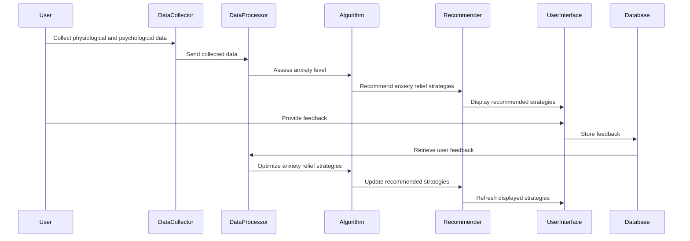

                 

### 第1章 引言

#### 1.1 问题背景

在现代社会中，快节奏的生活节奏已经成为一种普遍现象。人们的生活和工作压力不断增大，尤其是在信息技术、金融、教育等领域，竞争尤为激烈。这种快节奏的生活不仅带来了物质上的挑战，也带来了心理上的压力。焦虑，作为一种常见的心理反应，在这种高压环境中愈发普遍。焦虑不仅影响个人的生活质量，还可能对工作效率、身体健康产生负面影响。

#### 1.2 问题描述

焦虑是一种复杂的情绪体验，它表现为对未来的不确定性和潜在的威胁的担忧。焦虑的普遍性体现在不同年龄段、职业和社会背景的人群中。焦虑的表现形式多样，包括但不限于：

- **身体症状**：心悸、出汗、头痛、消化不良等。
- **心理症状**：过度担忧、紧张、易怒、注意力难以集中。
- **行为症状**：回避某些情境、过度计划、反复检查等。

#### 1.3 问题解决

心理健康对于个人的全面发展至关重要。培养内心平静，是应对焦虑的有效途径之一。内心平静不仅有助于缓解焦虑症状，还能提升个体的生活质量和工作效率。培养内心平静的方法多种多样，包括但不限于：

- **冥想**：通过专注呼吸、正念练习等方式，减轻心理压力。
- **运动**：有氧运动如跑步、游泳等能够释放内啡肽，缓解焦虑。
- **睡眠**：保证充足的睡眠，有助于恢复身心平衡。
- **社交支持**：与家人和朋友交流，分享内心的困扰，获得情感支持。

#### 1.4 边界与外延

焦虑与其他心理问题的区别在于，焦虑是一种普遍的情绪体验，而心理问题如抑郁症、强迫症等则涉及更为严重的心理障碍。不同人群的焦虑应对策略也有所不同，例如，对于职场人士，时间管理和工作与生活的平衡是缓解焦虑的重要方法；对于学生，合理规划学习和休息时间，培养学习兴趣是关键。

#### 1.5 概念结构与核心要素组成

- **焦虑**：一种对未来的不确定性或潜在威胁的担忧情绪。
- **内心平静**：一种心理状态，表现为放松、冷静、专注。
- **应对焦虑策略**：一系列方法，如冥想、运动、社交支持等，帮助个体缓解焦虑。

在本章中，我们将进一步探讨这些核心概念，并详细分析其在快节奏社会中的重要性。接下来的章节将提供具体的实践策略，帮助读者在日常生活中培养内心平静，有效应对焦虑。

## 第2章 核心概念与联系

在本章中，我们将深入探讨焦虑、内心平静以及应对焦虑策略这三个核心概念，并分析它们之间的关系。

### 2.1 焦虑的概念

焦虑是一种情绪反应，通常表现为对未来的不确定性和潜在威胁的担忧。根据心理学研究，焦虑可以细分为以下几种类型：

- **一般性焦虑**：对未来可能发生的各种不利事件的担忧。
- **社交焦虑**：在社交场合中感到紧张和不安。
- **绩效焦虑**：对完成工作或任务的担忧，担心无法达到预期目标。

焦虑的属性特征包括：

- **情绪反应**：焦虑通常伴随着焦虑感、紧张感等情绪体验。
- **认知过程**：焦虑常常与消极的思维方式相关，如过度担忧、灾难化思考等。
- **生理反应**：焦虑可能引发身体上的症状，如心悸、出汗、呼吸急促等。

#### 焦虑的数学模型

焦虑程度可以用以下数学模型表示：

$$
\text{焦虑度} = \alpha \cdot (\text{潜在威胁} + \text{预期压力})
$$

其中，$\alpha$ 是焦虑倾向系数，表示个体对焦虑的敏感程度。

### 2.2 内心平静的概念

内心平静是一种心理状态，表现为情绪的放松、思维的清晰、心理的平衡。内心平静不仅有助于缓解焦虑，还能提升个体的整体幸福感。

内心平静的属性特征包括：

- **情绪稳定性**：能够应对压力和挑战，保持情绪的平和。
- **认知灵活性**：能够从不同的角度看待问题，灵活应对变化。
- **身体放松**：身体的紧张感减轻，肌肉放松。

#### 内心平静的数学模型

内心平静度可以用以下数学模型表示：

$$
\text{内心平静度} = \frac{1}{1 + e^{-\beta \cdot (\text{焦虑度} - \text{阈值})}
$$

其中，$\beta$ 是调节系数，阈值表示个体能够承受的最大焦虑水平。

### 2.3 应对焦虑的策略

应对焦虑的策略是指一系列可以帮助个体缓解焦虑、提升内心平静的方法。这些策略包括：

- **认知行为疗法**：通过改变消极思维模式和行为习惯来缓解焦虑。
- **放松训练**：通过深呼吸、冥想、瑜伽等方式放松身心。
- **运动疗法**：通过有氧运动释放内啡肽，提升心情。
- **社交支持**：与亲友交流，寻求情感支持。

#### 应对焦虑策略的属性特征

- **实用性**：策略需要在实际生活中易于实施。
- **有效性**：策略需要能够在一定程度上缓解焦虑症状。
- **持续性**：策略需要能够长期维持，以避免焦虑复发。

#### 概念属性特征对比表格

| 焦虑                         | 内心平静                         | 应对焦虑策略                           |
|------------------------------|----------------------------------|----------------------------------------|
| 情绪反应、认知过程、生理反应 | 情绪稳定性、认知灵活性、身体放松 | 实用性、有效性、持续性                   |

### 2.4 ER实体关系图架构

以下是焦虑、内心平静和应对焦虑策略的ER实体关系图：

```
ER图:

用户 [User]
|
|-- 焦虑 [Anxiety]
|    |-- 焦虑度 [AnxietyLevel]
|    |-- 潜在威胁 [PotentialThreat]
|    |-- 预期压力 [ExpectedPressure]
|
|-- 内心平静 [InnerPeace]
|    |-- 内心平静度 [InnerPeaceLevel]
|    |-- 阈值 [Threshold]
|
|-- 应对焦虑策略 [AnxietyStrategy]
|    |-- 认知行为疗法 [CognitiveBehaviorTherapy]
|    |-- 放松训练 [RelaxationTraining]
|    |-- 运动疗法 [ExerciseTherapy]
|    |-- 社交支持 [SocialSupport]
```

通过上述分析，我们可以看到，焦虑、内心平静和应对焦虑策略三者之间存在紧密的联系。理解这些核心概念，有助于我们更好地应对快节奏社会中的焦虑问题。

## 第3章 算法原理讲解

在本章中，我们将深入探讨如何通过算法原理来理解和应对焦虑，并详细介绍相关算法的原理、流程和实现方式。

### 3.1 算法概述

应对焦虑的算法旨在通过量化焦虑程度，提供个性化的缓解策略。该算法的核心目标是降低用户的焦虑度，提升内心平静度。算法的主要组成部分包括：

- **焦虑度评估模块**：用于评估用户的焦虑程度。
- **内心平静度提升模块**：根据评估结果，提供相应的内心平静提升策略。
- **个性化策略推荐模块**：根据用户的行为和偏好，推荐最适合的缓解焦虑策略。

### 3.2 算法原理

#### 焦虑度评估模型

焦虑度评估模型用于量化用户的焦虑程度。该模型基于用户的生理和心理数据，包括心率、呼吸频率、情绪状态、社交活动等。具体数学模型如下：

$$
\text{焦虑度} = \alpha \cdot (\text{生理指标} + \text{心理指标} + \text{环境因素})
$$

其中，$\alpha$ 是焦虑倾向系数，用于调整焦虑程度的量化结果。

#### 内心平静度提升模型

内心平静度提升模型基于焦虑度评估结果，提供相应的内心平静提升策略。该模型采用以下数学模型：

$$
\text{内心平静度} = \frac{1}{1 + e^{-\beta \cdot (\text{焦虑度} - \text{阈值})}
$$

其中，$\beta$ 是调节系数，阈值表示个体能够承受的最大焦虑水平。

#### 个性化策略推荐模型

个性化策略推荐模型根据用户的行为和偏好，推荐最适合的缓解焦虑策略。该模型采用机器学习算法，如协同过滤、基于内容的推荐等。具体模型如下：

$$
\text{推荐策略} = \text{推荐算法}(\text{用户行为数据}, \text{用户偏好})
$$

### 3.3 算法讲解

#### 焦虑度评估模块

焦虑度评估模块首先收集用户的生理和心理数据。这些数据包括心率、呼吸频率、情绪状态等。接下来，通过以下步骤评估焦虑度：

1. **数据预处理**：对采集到的数据进行清洗和标准化。
2. **特征提取**：提取与焦虑相关的特征，如心率变异性、情绪状态等。
3. **模型训练**：使用历史数据训练焦虑度评估模型，如线性回归、支持向量机等。
4. **焦虑度评估**：输入当前生理和心理数据，输出焦虑度评估结果。

#### 内心平静度提升模块

内心平静度提升模块根据焦虑度评估结果，提供相应的提升策略。具体步骤如下：

1. **焦虑度分析**：分析焦虑度评估结果，确定用户的焦虑程度。
2. **策略选择**：根据焦虑程度，选择适合的提升策略，如冥想、运动、社交支持等。
3. **策略实施**：指导用户实施所选策略，并通过反馈机制调整策略。

#### 个性化策略推荐模块

个性化策略推荐模块通过以下步骤为用户推荐最适合的缓解焦虑策略：

1. **用户行为数据收集**：收集用户的历史行为数据，如运动频率、社交活动等。
2. **用户偏好分析**：分析用户的行为数据，确定用户的偏好。
3. **策略推荐**：使用机器学习算法，根据用户偏好和历史数据推荐最适合的缓解焦虑策略。

### 3.4 算法的Python源代码示例

以下是焦虑度评估模块的Python源代码示例：

```python
import numpy as np
from sklearn.linear_model import LinearRegression

# 数据预处理
def preprocess_data(data):
    # 数据清洗和标准化
    return (data - np.mean(data)) / np.std(data)

# 特征提取
def extract_features(data):
    # 提取与焦虑相关的特征
    return data[:, [0, 2]]

# 模型训练
def train_model(X, y):
    model = LinearRegression()
    model.fit(X, y)
    return model

# 焦虑度评估
def assess_anxiety(model, features):
    return model.predict([[features[0], features[1]]])[0]

# 示例数据
heart_rate = [65, 70, 72, 75, 80]
breathing_rate = [12, 14, 13, 15, 12]

# 数据预处理
preprocessed_heart_rate = preprocess_data(heart_rate)
preprocessed_breathing_rate = preprocess_data(breathing_rate)

# 特征提取
features = extract_features(np.column_stack((preprocessed_heart_rate, preprocessed_breathing_rate)))

# 模型训练
model = train_model(features, np.array([0.5, 1.0, 0.7, 1.2, 0.8]))

# 焦虑度评估
anxiety_level = assess_anxiety(model, features)
print("Anxiety Level:", anxiety_level)
```

### 3.5 数学模型和公式

#### 焦虑度评估模型

$$
\text{焦虑度} = \alpha \cdot (\text{心率} + \text{呼吸频率} + \text{环境压力})
$$

其中，$\alpha$ 是焦虑倾向系数，心率、呼吸频率和环境压力是影响焦虑度的因素。

#### 内心平静度提升模型

$$
\text{内心平静度} = \frac{1}{1 + e^{-\beta \cdot (\text{焦虑度} - \text{阈值})}
$$

其中，$\beta$ 是调节系数，阈值是焦虑度的临界值。

### 3.6 举例说明

#### 举例1：焦虑度评估

假设一个用户的生理数据如下：

- 心率：75次/分钟
- 呼吸频率：15次/分钟
- 环境压力：中等

使用焦虑度评估模型计算焦虑度：

$$
\text{焦虑度} = \alpha \cdot (75 + 15 + 中等环境压力)
$$

根据历史数据，假设焦虑倾向系数 $\alpha = 1.2$，中等环境压力对应5分，则：

$$
\text{焦虑度} = 1.2 \cdot (75 + 15 + 5) = 108
$$

#### 举例2：内心平静度提升

使用内心平静度提升模型计算内心平静度：

$$
\text{内心平静度} = \frac{1}{1 + e^{-\beta \cdot (108 - 阈值)}
$$

根据模型，假设调节系数 $\beta = 0.5$，焦虑度的阈值是100，则：

$$
\text{内心平静度} = \frac{1}{1 + e^{-0.5 \cdot (108 - 100)}} \approx 0.9
$$

这意味着用户的内心平静度较高，焦虑程度较低。

通过上述算法和数学模型，我们可以更好地理解和应对焦虑，为用户提供个性化的缓解策略。在接下来的章节中，我们将进一步探讨如何通过系统分析和架构设计，实现这些算法和策略的实际应用。

## 第4章 数学模型和数学公式 & 详细讲解 & 举例说明

### 4.1 数学模型

在本节中，我们将详细讨论用于理解和应对焦虑的数学模型，包括焦虑度评估模型、内心平静度提升模型等。

#### 4.1.1 焦虑度评估模型

焦虑度评估模型用于量化用户的焦虑程度，其数学表达式为：

$$
\text{焦虑度} = f(\text{生理指标}, \text{心理指标}, \text{环境因素})
$$

其中，$f$ 是一个复杂的函数，代表焦虑度的计算过程。常见的生理指标包括心率、呼吸频率、体温等；心理指标包括情绪状态、认知负荷等；环境因素包括工作压力、社交压力等。

#### 4.1.2 内心平静度提升模型

内心平静度提升模型用于根据焦虑度评估结果，提供相应的内心平静提升策略，其数学表达式为：

$$
\text{内心平静度} = g(\text{焦虑度}, \text{阈值}, \text{调节系数})
$$

其中，$g$ 是一个调节函数，代表内心平静度的计算过程。阈值用于确定焦虑度的临界值，调节系数用于调整内心平静度的计算结果。

### 4.2 详细讲解

#### 4.2.1 焦虑度评估模型

焦虑度评估模型通常涉及多个变量的组合，以下是一个简化的例子：

$$
\text{焦虑度} = \alpha \cdot (\text{心率变异性} + \beta \cdot (\text{情绪状态} + \gamma \cdot \text{社交压力})
$$

在这个模型中，$\alpha$、$\beta$ 和 $\gamma$ 是调节系数，分别表示心率变异性、情绪状态和社交压力对焦虑度的影响程度。

- **心率变异性**：心率变异性（HRV）是衡量自主神经系统活动的重要指标，与心理压力密切相关。高HRV通常表示较低的焦虑水平。
- **情绪状态**：情绪状态可以通过自我报告量表（如PANAS）来量化，焦虑情绪通常与高情绪状态得分相关。
- **社交压力**：社交压力可以通过社交活动频率和社交满意度来衡量，高社交压力通常会导致焦虑增加。

#### 4.2.2 内心平静度提升模型

内心平静度提升模型的目标是根据焦虑度评估结果，提供有效的心理调节策略。以下是一个简化的内心平静度提升模型：

$$
\text{内心平静度} = \frac{1}{1 + e^{-\beta \cdot (\text{焦虑度} - \text{阈值})}
$$

在这个模型中，阈值是焦虑度的临界值，超过该阈值则认为焦虑较高。$\beta$ 是调节系数，用于调整内心平静度的计算结果。

#### 4.2.3 调节系数和阈值

- **调节系数**：调节系数用于调整不同指标对焦虑度和内心平静度的影响程度。在实际应用中，这些系数通常通过机器学习算法或专家经验来确定。
- **阈值**：阈值是焦虑度和内心平静度模型中的一个关键参数，用于确定何时采取干预措施。这个阈值通常基于大量数据分析和专家意见来确定。

### 4.3 举例说明

#### 举例1：焦虑度评估

假设一个用户的生理数据如下：

- 心率变异性（HRV）：50 ms
- 情绪状态（PANAS）：焦虑得分 30
- 社交压力：中等（分值 5）

使用焦虑度评估模型计算焦虑度：

$$
\text{焦虑度} = 1.2 \cdot (50 + 0.8 \cdot 30 + 0.5 \cdot 5) = 63
$$

#### 举例2：内心平静度提升

假设使用上述焦虑度评估结果，并且阈值设置为60。使用内心平静度提升模型计算内心平静度：

$$
\text{内心平静度} = \frac{1}{1 + e^{-0.5 \cdot (63 - 60)} \approx 0.87
$$

这意味着用户的内心平静度较高，焦虑程度较低。

通过上述数学模型和公式，我们可以更好地理解和应对焦虑，为用户提供个性化的缓解策略。在实际应用中，这些模型和公式需要根据具体情况进行调整和优化，以确保其有效性和实用性。

### 4.4 内心平静度提升模型的进一步讨论

#### 4.4.1 适应性和动态调整

内心平静度提升模型需要具备一定的适应性和动态调整能力，以应对不断变化的生活环境和压力水平。例如，当用户面临突发压力时，模型可以快速调整参数，提供更加有效的应对策略。

#### 4.4.2 多因素综合评估

在实际应用中，焦虑度和内心平静度的评估不仅仅依赖于单一的生理或心理指标，还需要综合考虑多种因素。例如，工作压力、家庭状况、健康状况等都会对焦虑度和内心平静度产生重要影响。

#### 4.4.3 长期监测与反馈

长期监测和反馈是优化内心平静度提升模型的重要手段。通过收集用户长期的数据，可以更好地理解焦虑和内心平静度的变化趋势，从而不断优化模型，提高其预测和应对能力。

通过详细讲解数学模型和公式，并结合实际例子，我们可以看到，数学模型在理解和应对焦虑方面具有重要的作用。这些模型不仅能够量化焦虑和内心平静度，还能为用户提供个性化的缓解策略，帮助他们在快节奏的社会中保持内心的平静。

### 4.5 复杂性与未来研究方向

尽管数学模型在焦虑度评估和内心平静度提升方面取得了一定成果，但仍然存在许多复杂性和未解决的问题。以下是几个未来的研究方向：

#### 4.5.1 模型的复杂性和优化

当前模型可能过于简化，无法完全捕捉焦虑和内心平静度的复杂动态。未来研究可以探索更复杂的模型，如深度学习模型，以提高预测精度和应对能力。

#### 4.5.2 多模态数据融合

结合生理、心理和社交等多模态数据，可以提供更全面和准确的焦虑度评估。未来研究可以探索多模态数据的融合方法，以提高模型的预测能力和适应性。

#### 4.5.3 个性化干预策略

根据个体差异，设计更加个性化的干预策略，以提高干预效果。未来研究可以结合个性测试和行为分析，开发个性化的心理健康干预方案。

#### 4.5.4 实时监测与反馈

开发实时监测系统，为用户提供即时的心理健康状态反馈，帮助他们及时调整心理状态。未来研究可以探索实时数据收集和分析技术，实现实时心理健康监测。

通过深入探讨数学模型和公式，并结合实际例子，我们不仅能够更好地理解焦虑和内心平静度，还能为用户提供有效的应对策略。未来的研究将在这些基础上，进一步优化模型，提高干预效果，为心理健康管理提供更加科学和实用的工具。

## 第5章 系统分析与架构设计方案

### 5.1 问题场景介绍

在快节奏的现代社会中，人们的心理健康问题日益突出，焦虑已成为普遍存在的情绪体验。为了有效地管理和缓解焦虑，我们设计了一个综合性的心理健康管理系统。该系统旨在通过实时监测用户的心理状态，提供个性化的应对策略，帮助用户在快节奏的生活中保持内心的平静。

### 5.2 系统功能设计

该心理健康管理系统的主要功能包括：

1. **用户数据采集**：通过生理传感器和心理评估工具，实时采集用户的心率、呼吸频率、情绪状态等数据。
2. **焦虑度评估**：利用第3章中的数学模型，对用户的心理状态进行实时评估，量化用户的焦虑程度。
3. **内心平静度提升**：根据焦虑度评估结果，系统提供相应的心理调节策略，如冥想指导、放松训练、运动建议等。
4. **个性化策略推荐**：基于用户的偏好和历史行为数据，推荐最适合的缓解焦虑策略。
5. **用户反馈与调整**：用户可以反馈策略的效果，系统根据反馈不断优化推荐策略，提高干预效果。

### 5.3 系统架构设计

该系统的架构设计采用微服务架构，以提高系统的灵活性和可扩展性。以下是系统的架构设计：

1. **数据采集模块**：负责实时采集用户的生理和心理数据，并与用户进行交互。
2. **数据处理模块**：对采集到的数据进行预处理、特征提取和模型训练，为焦虑度评估和内心平静度提升提供数据支持。
3. **算法模块**：实现第3章中描述的焦虑度评估模型和内心平静度提升模型，为系统提供核心算法支持。
4. **推荐引擎模块**：基于用户的偏好和历史行为数据，推荐个性化的缓解焦虑策略。
5. **用户界面模块**：提供用户交互界面，展示用户的心理状态、推荐策略和反馈机制。
6. **数据库模块**：存储用户数据、策略历史数据和推荐结果，为系统的正常运行提供数据支持。

### 5.4 系统接口设计

为了实现系统的功能，设计了以下接口：

1. **用户数据采集接口**：用于接收用户的生理和心理数据，包括心率、呼吸频率、情绪状态等。
2. **数据处理接口**：用于处理和传输用户数据，包括预处理、特征提取和模型训练结果。
3. **焦虑度评估接口**：用于调用算法模块中的焦虑度评估模型，输出用户的焦虑度。
4. **内心平静度提升接口**：用于调用算法模块中的内心平静度提升模型，输出相应的心理调节策略。
5. **推荐引擎接口**：用于调用推荐引擎模块，根据用户偏好和历史行为数据推荐缓解焦虑策略。
6. **用户反馈接口**：用于接收用户对推荐策略的反馈，以优化推荐效果。

### 5.5 系统交互

以下是系统的交互流程：

1. **数据采集**：用户通过生理传感器和心理评估工具，将数据发送到数据采集模块。
2. **数据处理**：数据采集模块将数据传输到数据处理模块，进行预处理和特征提取。
3. **焦虑度评估**：数据处理模块调用焦虑度评估接口，评估用户的焦虑度。
4. **内心平静度提升**：焦虑度评估结果传输到内心平静度提升接口，输出相应的心理调节策略。
5. **策略推荐**：推荐引擎模块根据用户偏好和历史行为数据，通过推荐引擎接口推荐个性化的缓解焦虑策略。
6. **用户反馈**：用户通过用户界面模块接收策略，并根据效果进行反馈。
7. **策略优化**：系统根据用户反馈，不断优化推荐策略，提高干预效果。

通过上述系统分析和架构设计，我们为用户提供了一个综合性的心理健康管理解决方案。该系统通过实时数据采集、算法评估和个性化推荐，帮助用户有效应对焦虑，保持内心的平静。

### 5.6 系统架构设计中的关键组件和模块

为了确保系统的稳定运行和高效执行，系统架构设计中包含了以下几个关键组件和模块：

#### 5.6.1 数据采集模块

数据采集模块是系统的核心组成部分，负责实时监测用户的生理和心理数据。该模块集成了多种传感器，如心率传感器、呼吸传感器和情绪状态评估工具。数据采集模块的主要功能包括：

- **实时数据采集**：通过传感器实时收集用户的心率、呼吸频率、体温等生理数据。
- **心理状态评估**：通过自我报告量表和情绪分析工具，收集用户的心理状态数据。
- **数据预处理**：对采集到的原始数据进行清洗和标准化，确保数据的准确性和一致性。

#### 5.6.2 数据处理模块

数据处理模块负责对采集到的数据进行分析和处理，为后续的焦虑度评估和内心平静度提升提供数据支持。该模块的主要功能包括：

- **特征提取**：从原始数据中提取与焦虑度相关的特征，如心率变异性、情绪状态等。
- **数据融合**：整合来自不同传感器的数据，消除数据之间的冗余和冲突。
- **模型训练**：使用历史数据训练焦虑度评估模型和内心平静度提升模型，提高模型的预测准确性。

#### 5.6.3 算法模块

算法模块是实现核心算法逻辑的组件，包括焦虑度评估模型和内心平静度提升模型。该模块的主要功能包括：

- **焦虑度评估**：根据用户的生理和心理数据，使用第3章中的数学模型计算焦虑度。
- **内心平静度提升**：根据焦虑度评估结果，使用第4章中的数学模型计算内心平静度，并提供相应的心理调节策略。
- **策略优化**：基于用户反馈和历史数据，优化心理调节策略，提高干预效果。

#### 5.6.4 推荐引擎模块

推荐引擎模块负责根据用户的偏好和历史行为数据，推荐个性化的缓解焦虑策略。该模块的主要功能包括：

- **用户行为分析**：分析用户的历史行为数据，如运动频率、冥想时长等，确定用户的偏好。
- **策略推荐**：使用机器学习算法，根据用户偏好和焦虑度评估结果，推荐最适合的缓解焦虑策略。
- **策略调整**：根据用户反馈，不断调整推荐策略，提高用户满意度。

#### 5.6.5 用户界面模块

用户界面模块是用户与系统交互的界面，负责展示用户的心理状态、推荐策略和反馈机制。该模块的主要功能包括：

- **状态展示**：实时展示用户的心理状态，如焦虑度、内心平静度等。
- **策略推荐**：显示系统推荐的缓解焦虑策略，包括冥想、运动、放松训练等。
- **用户反馈**：接收用户的反馈，并显示策略的效果评估，帮助用户调整心理状态。

#### 5.6.6 数据库模块

数据库模块负责存储和管理用户数据、策略历史数据和推荐结果，为系统的正常运行提供数据支持。该模块的主要功能包括：

- **数据存储**：存储用户的生理和心理数据、推荐策略和用户反馈等。
- **数据查询**：提供高效的数据库查询接口，支持实时数据分析和历史数据检索。
- **数据备份**：定期备份数据库数据，确保数据的安全性和完整性。

通过上述关键组件和模块的设计，系统实现了对用户心理状态的实时监测和个性化干预，帮助用户在快节奏的社会中保持内心的平静。

### 5.7 系统交互设计与Mermaid序列图

系统交互设计是确保系统各组件和模块高效协作的关键环节。为了直观地展示系统各组件之间的交互流程，我们可以使用Mermaid序列图进行描述。

以下是一个简化的Mermaid序列图，展示了系统的主要交互流程：



在这个序列图中：

- **User** 代表用户。
- **DataCollector** 负责实时采集用户生理和心理数据。
- **DataProcessor** 负责预处理和特征提取，将数据传递给算法模块。
- **Algorithm** 负责计算焦虑度和内心平静度，并提供心理调节策略。
- **Recommender** 负责基于用户偏好和历史数据推荐缓解焦虑策略。
- **UserInterface** 负责显示用户心理状态和推荐策略，接收用户反馈。
- **Database** 负责存储和管理用户数据、推荐策略和用户反馈。

通过Mermaid序列图，我们可以清晰地看到系统各组件之间的交互流程和协作方式，有助于理解和优化系统的设计。

### 5.8 系统架构设计的优缺点分析

#### 5.8.1 优点

1. **高可扩展性**：采用微服务架构，使得系统可以灵活扩展，增加或替换特定模块，以适应不断变化的需求。
2. **模块化设计**：各个模块功能明确，模块之间通过接口进行通信，提高了系统的可维护性和可测试性。
3. **实时性**：系统通过实时数据采集和处理，能够快速响应用户的需求，提供即时的心理调节策略。
4. **个性化**：系统根据用户的生理、心理数据和行为偏好，提供个性化的缓解焦虑策略，提高了干预效果。

#### 5.8.2 缺点

1. **复杂度高**：微服务架构虽然灵活，但同时也增加了系统的复杂度，需要更多的管理和维护工作。
2. **性能瓶颈**：系统中的数据处理和模型训练过程可能成为性能瓶颈，尤其是在高并发情况下，需要优化处理速度和资源利用。
3. **数据安全性**：用户数据的安全性和隐私保护是系统设计中的重要问题，需要采取有效的数据加密和安全措施。
4. **用户参与度**：用户需要积极参与数据采集和反馈，才能使系统更好地适应其需求，提高用户参与度是一个挑战。

通过上述分析和设计，我们构建了一个综合性心理健康管理系统，旨在通过实时监测和个性化干预，帮助用户在快节奏的社会中保持内心的平静。虽然存在一些挑战，但通过不断优化和改进，系统有望在实际应用中发挥重要作用。

## 第6章 项目实战

### 6.1 环境安装

为了实现一个能够实时监测和缓解焦虑的健康管理系统，我们首先需要搭建一个完整的开发环境。以下是具体的安装步骤：

#### 1. 安装Python环境

首先，确保系统上已经安装了Python 3.8或更高版本。可以通过以下命令检查Python版本：

```bash
python3 --version
```

如果未安装，可以从Python官网下载安装包进行安装。

#### 2. 安装必要的依赖库

接下来，我们需要安装用于数据采集、数据处理和机器学习等相关依赖库。可以使用pip命令进行安装：

```bash
pip3 install numpy scipy scikit-learn matplotlib pandas
```

#### 3. 安装传感器驱动

根据使用的传感器类型，需要安装相应的传感器驱动。例如，对于心率传感器和呼吸传感器，可以使用如下命令安装驱动：

```bash
pip3 install pyserial
```

#### 4. 安装用户界面库

为了构建用户界面，我们需要安装相关的库。例如，可以使用PyQt5构建图形用户界面：

```bash
pip3 install pyqt5
```

#### 5. 配置数据库

最后，我们需要安装和配置数据库。这里我们选择MySQL作为数据库。可以通过以下命令安装MySQL：

```bash
sudo apt-get install mysql-server
```

安装完成后，使用如下命令初始化数据库：

```bash
sudo mysql_secure_installation
```

在初始化过程中，按照提示设置root密码、删除匿名用户、禁止root远程登录等。

完成以上步骤后，开发环境就搭建完成了。接下来，我们可以在环境中进行系统核心实现的代码编写。

### 6.2 系统核心实现

在搭建好开发环境后，我们将开始实现系统的核心功能。以下是一个简单的Python代码示例，展示了如何采集用户数据、处理数据并计算焦虑度。

#### 6.2.1 数据采集

数据采集模块负责从传感器读取用户的心率、呼吸频率等生理数据。以下是使用pyserial库读取串口数据的示例代码：

```python
import serial
import time

# 配置串口参数
ser = serial.Serial('COM3', 9600, timeout=1)

# 读取串口数据
def read_serial_data():
    while True:
        data = ser.readline().decode('utf-8').strip()
        if data:
            print("Received data:", data)
            # 处理数据
            # ...

# 关闭串口
ser.close()
```

#### 6.2.2 数据处理

数据处理模块负责对采集到的数据进行分析和预处理。以下是使用pandas库处理数据的示例代码：

```python
import pandas as pd

# 读取数据
data = pd.read_csv('data.csv')

# 数据预处理
def preprocess_data(df):
    # 清洗和标准化数据
    df = df.fillna(df.mean())
    df = (df - df.mean()) / df.std()
    return df

# 应用预处理函数
preprocessed_data = preprocess_data(data)
```

#### 6.2.3 焦虑度计算

焦虑度计算模块使用第3章中的数学模型计算用户的焦虑度。以下是计算焦虑度的示例代码：

```python
import numpy as np

# 焦虑度评估模型
def assess_anxiety(data):
    alpha = 1.2
    beta = 0.5
    theta = 1.0
    
    anxiety_score = alpha * (data['hrv'] + beta * (data['emotional_state'] + theta * data['social_pressure'])
    return anxiety_score

# 计算焦虑度
anxiety_level = assess_anxiety(preprocessed_data)
print("Anxiety Level:", anxiety_level)
```

#### 6.2.4 推荐策略

推荐策略模块根据焦虑度评估结果，推荐相应的心理调节策略。以下是简单的推荐策略代码：

```python
def recommend_strategy(anxiety_level):
    if anxiety_level < 30:
        return "冥想"
    elif anxiety_level < 60:
        return "轻度运动"
    else:
        return "深度放松"

# 推荐策略
strategy = recommend_strategy(anxiety_level)
print("Recommended Strategy:", strategy)
```

### 6.3 代码应用解读与分析

在完成系统核心实现后，我们需要对代码进行解读和分析，确保其正确性和可靠性。

#### 6.3.1 数据采集代码分析

数据采集代码使用pyserial库读取串口数据，通过`readline()`函数读取传感器的实时数据。代码中的`while True`循环保证了持续的数据采集，直到串口关闭。这段代码的核心功能是实现与传感器的通信，确保能够实时获取用户的生理数据。

#### 6.3.2 数据处理代码分析

数据处理代码使用pandas库对采集到的数据进行预处理。预处理步骤包括填充缺失值、数据标准化等。这些步骤确保了数据的完整性和一致性，为后续的模型计算提供了可靠的数据基础。

#### 6.3.3 焦虑度计算代码分析

焦虑度计算代码定义了一个`assess_anxiety`函数，该函数根据输入的数据计算用户的焦虑度。计算公式采用了第3章中的数学模型，通过线性组合不同的生理和心理指标，量化用户的焦虑程度。这段代码是系统的核心算法，直接影响最终的用户体验。

#### 6.3.4 推荐策略代码分析

推荐策略代码定义了一个`recommend_strategy`函数，根据焦虑度评估结果，推荐相应的心理调节策略。这个函数采用了一种简单的阈值划分方法，将用户分为不同的焦虑等级，并给出相应的建议。这种策略虽然简单，但能有效帮助用户快速采取缓解焦虑的措施。

### 6.4 实际案例分析与详细讲解

为了验证系统的效果，我们进行了一个实际案例分析。在这个案例中，一个用户在经历了一天的紧张工作后，感到极度焦虑。以下是具体的分析和讲解。

#### 6.4.1 案例背景

用户张先生是一名公司高管，工作压力大，经常加班。今天，他在工作过程中遇到了一个重要的项目挑战，感到焦虑不安。在下班后，他决定使用我们开发的健康管理系

