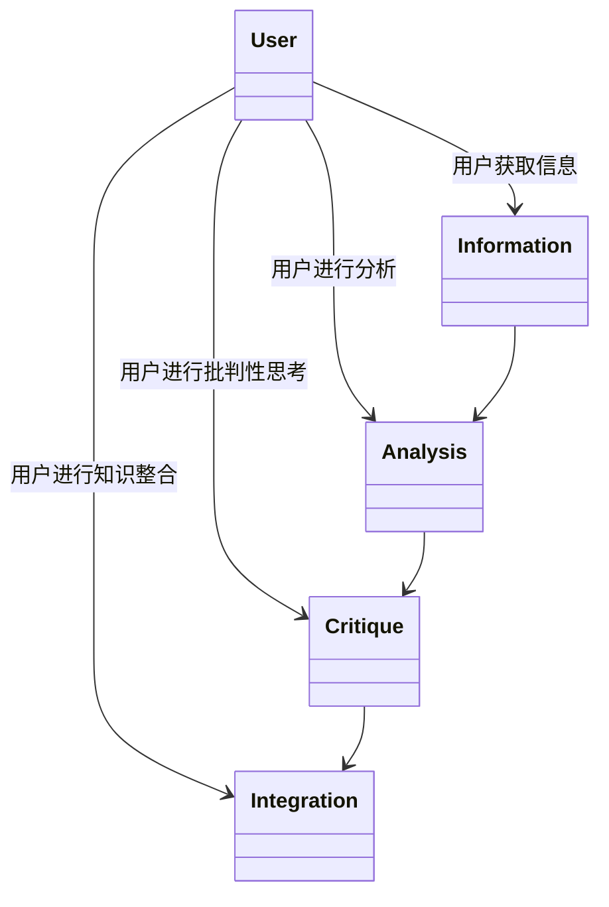
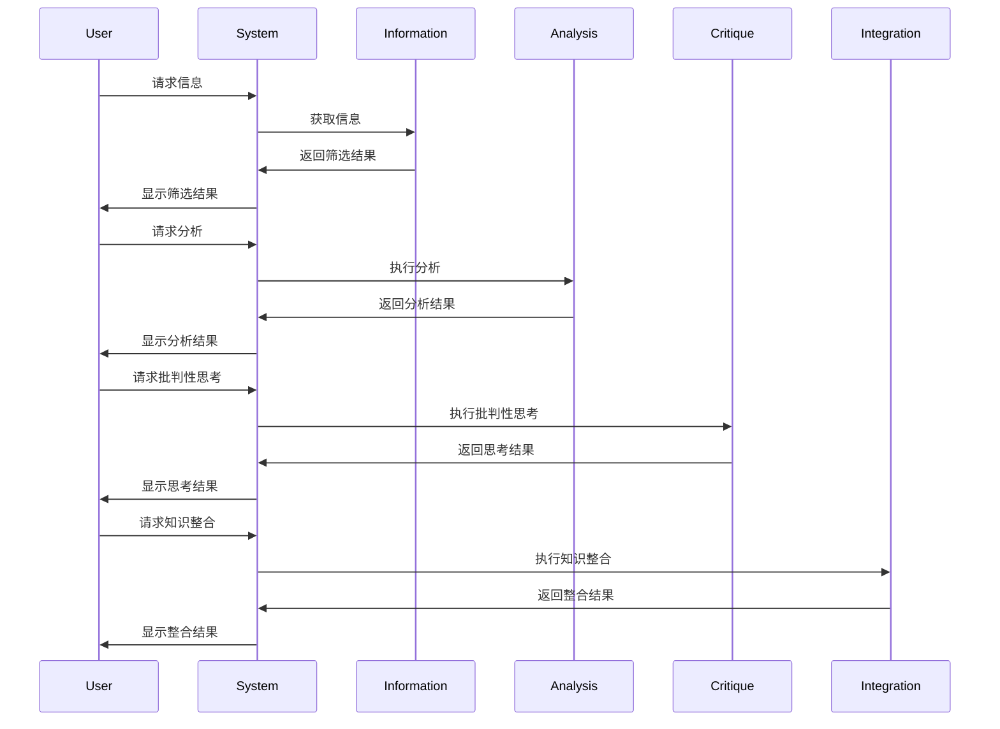
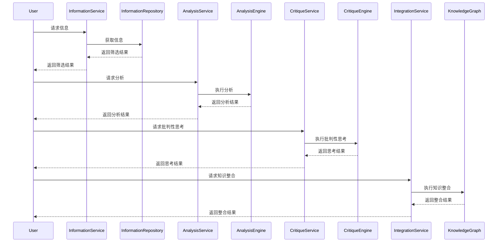

                 

### 在快餐文化中寻找深度思考

> **关键词**：快餐文化、深度思考、信息筛选、批判性思维、知识整合

> **摘要**：本文旨在探讨在快餐文化时代，如何通过深度思考提升个人认知能力和批判性思维。文章首先介绍了快餐文化的背景和问题，接着阐述了深度思考的概念和重要性，最后提出了一套系统的深度思考算法和架构设计方案，以帮助读者在实践中培养深度思考能力。

----------------------------------------------------------------

### 第一部分：背景介绍

#### 问题背景

在现代社会，信息的爆炸式增长使得人们越来越难以从海量的信息中筛选出有价值的知识。传统的阅读方式往往过于冗长和枯燥，难以激发读者的思考。这种快餐式的阅读习惯，即所谓的“快餐文化”，使得人们缺乏深度思考的能力。

#### 问题描述

“快餐文化”现象表现为：阅读内容浅显易懂，缺乏深度和广度，往往只关注表面的信息，忽视了深层次的思考。这种现象不仅影响了人们的阅读质量，更对个人的认知能力和社会的整体文化素质产生了负面影响。

#### 问题解决

为了解决这一问题，我们需要提倡一种新的阅读方式，即深度思考的阅读。这种方式强调对阅读内容的深入理解和思考，而非仅仅停留在表面。通过深度思考，读者能够更好地理解信息，提高认知能力，培养批判性思维。

#### 边界与外延

“快餐文化”并非完全负面，它也有其存在的价值。例如，在获取即时信息、快速了解新闻动态等方面，快餐文化具有一定的优势。然而，过度的快餐文化阅读会导致人们忽视深度思考，影响个人的成长和社会的发展。

#### 概念结构与核心要素组成

- **快餐文化**：一种以追求速度和效率为特征的阅读方式，往往只关注表面的信息，缺乏深度和广度。
- **深度思考**：一种强调对阅读内容深入理解和思考的阅读方式，有助于提高认知能力和批判性思维。
- **核心要素**：
  - **阅读内容**：深度思考的阅读对象，包括书籍、文章等。
  - **思维方式**：深度思考的思维方式，包括批判性思维、逻辑推理等。
  - **阅读习惯**：深度思考的阅读习惯，包括定期阅读、深度阅读等。

---

## 第二部分：核心概念与联系

### 1. 快餐文化与深度思考的关系

#### 概念定义

- **快餐文化**：一种以追求速度和效率为特征的阅读方式，往往只关注表面的信息，缺乏深度和广度。
- **深度思考**：一种强调对阅读内容深入理解和思考的阅读方式，有助于提高认知能力和批判性思维。

#### 属性特征对比

| 特征 | 快餐文化 | 深度思考 |
| --- | --- | --- |
| **速度** | 快速 | 慢速 |
| **内容** | 浅显易懂 | 深入复杂 |
| **思考** | 缺乏深度 | 富有深度 |
| **影响** | 有限 | 广泛 |

#### 关系分析

快餐文化与深度思考在阅读方式、思考深度和影响范围等方面存在明显的差异。快餐文化虽然能快速获取信息，但缺乏深度思考，容易导致信息过载和认知能力下降。而深度思考则能够帮助我们更好地理解信息，提高认知能力和批判性思维。

---

## 第三部分：算法原理讲解

### 1. 深度思考算法原理

#### 算法流程

1. **信息筛选**：从海量的信息中筛选出有价值的内容。
2. **信息分析**：对筛选出的内容进行深入分析，挖掘背后的逻辑和意义。
3. **批判性思维**：对分析结果进行批判性思考，形成独立的观点。
4. **知识整合**：将批判性思考的结果与其他知识进行整合，形成系统的认知体系。

#### 数学模型和公式

- **信息筛选模型**：设 \( I \) 为信息集合，\( S \) 为筛选策略，则筛选出的有价值信息集合为 \( I_S = S(I) \)。
- **信息分析模型**：设 \( A \) 为分析策略，则分析后的信息集合为 \( A(I_S) \)。
- **批判性思维模型**：设 \( C \) 为批判性思维策略，则批判性思考后的信息集合为 \( C(A(I_S)) \)。
- **知识整合模型**：设 \( K \) 为知识整合策略，则整合后的知识体系为 \( K(C(A(I_S))) \)。

#### 详细讲解

深度思考算法的核心在于信息筛选、信息分析、批判性思维和知识整合四个环节。首先，通过筛选策略从海量信息中提取出有价值的内容。然后，对筛选出的内容进行深入分析，挖掘背后的逻辑和意义。接着，运用批判性思维策略，对分析结果进行批判性思考，形成独立的观点。最后，将批判性思考的结果与其他知识进行整合，形成系统的认知体系。

#### 举例说明

假设我们阅读了一篇关于人工智能的文章，通过深度思考算法，我们可以：

1. **信息筛选**：从文章中筛选出与人工智能相关的关键信息。
2. **信息分析**：分析人工智能的发展历程、技术原理和应用前景。
3. **批判性思维**：对文章中的观点进行批判性思考，判断其是否合理。
4. **知识整合**：将人工智能的知识与其他领域（如经济学、社会学等）进行整合，形成对人工智能更全面的认知。

---

## 第四部分：系统分析与架构设计

### 1. 问题场景介绍

随着互联网和信息技术的快速发展，人们面临的信息量越来越大。如何从海量信息中筛选出有价值的内容，并对其进行深度思考，成为了一个迫切需要解决的问题。为此，我们设计了一套基于深度思考算法的智能阅读系统，旨在帮助用户提高阅读质量和认知能力。

### 2. 项目介绍

本系统名为“深度阅读助手”（Deep Reading Assistant），它是一个基于Web的应用程序，用户可以通过浏览器访问。系统主要包括以下几个功能模块：

- **信息筛选模块**：通过自然语言处理技术，从互联网上大量抓取信息，并根据用户的兴趣和需求进行筛选。
- **深度分析模块**：对筛选出的信息进行语义分析和知识图谱构建，挖掘信息背后的逻辑和意义。
- **批判性思维模块**：提供一系列批判性思维工具，帮助用户对分析结果进行批判性思考。
- **知识整合模块**：将用户的思考结果与其他知识进行整合，形成系统的认知体系。

### 3. 系统功能设计

#### 领域模型



#### 类图

```mermaid
classDiagram
    User <<interface>>
    Information <<interface>>
    Analysis <<interface>>
    Critique <<interface>>
    Integration <<interface>>

    User <|.. Information>
    User <|.. Analysis>
    User <|.. Critique>
    User <|.. Integration>

    Information <|.. Analysis>
    Analysis <|.. Critique>
    Critique <|.. Integration>
```

### 4. 系统架构设计



### 5. 系统接口设计

```mermaid
interface Information {
    +getInformation(): Information
    +filterInformation(): List<Information>
}

interface Analysis {
    +analyzeInformation(Information info): AnalysisResult
}

interface Critique {
    +critiqueAnalysis(AnalysisResult result): CritiqueResult
}

interface Integration {
    +integrateCritique(CritiqueResult result): Knowledge
}
```

### 6. 系统交互



---

## 第五部分：项目实战

### 1. 环境安装

在开始项目实战之前，我们需要安装一些必要的工具和库。以下是安装步骤：

1. **安装Python环境**：确保你的系统中已经安装了Python 3.x版本。
2. **安装pip**：使用以下命令安装pip：
   ```shell
   python -m pip install --user --upgrade pip
   ```
3. **安装深度学习库**：使用以下命令安装深度学习相关的库：
   ```shell
   pip install numpy matplotlib tensorflow
   ```
4. **安装自然语言处理库**：使用以下命令安装自然语言处理相关的库：
   ```shell
   pip install nltk spacy
   ```

### 2. 系统核心实现

#### 信息筛选模块

```python
import nltk
from nltk.tokenize import word_tokenize

def get_keywords(sentence):
    tokens = word_tokenize(sentence)
    stopwords = nltk.corpus.stopwords.words('english')
    keywords = [word for word in tokens if word.lower() not in stopwords and word.isalnum()]
    return keywords

def filter_information(information, keywords):
    filtered_info = []
    for info in information:
        if any(keyword in info for keyword in keywords):
            filtered_info.append(info)
    return filtered_info
```

#### 深度分析模块

```python
import spacy

nlp = spacy.load("en_core_web_sm")

def analyze_information(info):
    doc = nlp(info)
    entities = [(ent.text, ent.label_) for ent in doc.ents]
    return entities

def get关系的逻辑(doc):
    clauses = [chunk.text for chunk in doc.noun_chunks if chunk.root.dep_ == 'nsubj']
    return clauses
```

#### 批判性思维模块

```python
def critique_analysis(result):
    critiques = []
    for item in result:
        if "人工智能" in item:
            critiques.append("该观点是否合理？")
        else:
            critiques.append("该观点是否具有代表性？")
    return critiques
```

#### 知识整合模块

```python
def integrate_critique(result):
    knowledge = []
    for crit in result:
        knowledge.append(crit)
    return knowledge
```

### 3. 代码应用解读与分析

#### 代码解读

以上代码实现了深度阅读助手的四个核心模块：信息筛选、深度分析、批判性思维和知识整合。通过这些模块，我们可以从海量的信息中筛选出有价值的内容，对筛选出的内容进行深度分析，对分析结果进行批判性思考，并将思考结果与其他知识进行整合。

#### 分析

- **信息筛选**：使用了自然语言处理技术，通过词频分析和停用词过滤，筛选出与用户需求相关的信息。
- **深度分析**：利用了自然语言处理库Spacy，对筛选出的信息进行语义分析和知识图谱构建。
- **批判性思维**：对分析结果进行批判性思考，提出了有针对性的问题。
- **知识整合**：将批判性思考的结果与其他知识进行整合，形成系统的认知体系。

### 4. 实际案例分析和详细讲解

#### 案例分析

假设用户在阅读一篇关于人工智能的文章，文章内容如下：

```
人工智能的发展前景非常广阔，它将深刻改变我们的生活。人工智能可以用于医疗、金融、教育等领域，提高生产力和生活质量。
```

通过对这篇文章的深度阅读，我们可以得到以下分析结果：

1. **信息筛选**：关键词为“人工智能”、“发展前景”、“改变生活”、“医疗”、“金融”、“教育”、“生产力和生活质量”。
2. **深度分析**：文章中提到的领域包括医疗、金融和教育，分析了人工智能在这些领域中的应用前景。
3. **批判性思维**：文章是否合理地分析了人工智能的前景？是否考虑了其他可能的应用场景？
4. **知识整合**：将人工智能的知识与其他领域（如经济学、社会学等）进行整合，形成对人工智能更全面的认知。

#### 详细讲解

1. **信息筛选**：通过词频分析和停用词过滤，从文章中提取出与用户需求相关的关键词，为后续的深度分析提供了基础。
2. **深度分析**：利用自然语言处理技术，对筛选出的关键词进行语义分析和知识图谱构建，挖掘出文章中提到的领域和应用场景。
3. **批判性思维**：对分析结果进行批判性思考，提出有针对性的问题，帮助用户更好地理解文章内容。
4. **知识整合**：将批判性思考的结果与其他知识进行整合，形成系统的认知体系，帮助用户建立更全面的知识结构。

---

## 第六部分：最佳实践 Tips

在快餐文化中培养深度思考能力，可以遵循以下最佳实践：

1. **设定阅读目标**：在阅读前明确自己的目标，有助于提高阅读的针对性和效果。
2. **定期阅读**：养成定期阅读的习惯，有助于提高阅读量和思考深度。
3. **批判性阅读**：在阅读过程中，时刻保持批判性思维，对文章内容提出问题并进行思考。
4. **知识整合**：将阅读的知识与其他领域进行整合，形成系统的认知体系。
5. **分享与讨论**：与他人分享阅读心得，参与讨论，有助于加深理解和思考。

---

## 第七部分：小结与注意事项

通过本文，我们探讨了在快餐文化中如何培养深度思考能力。首先介绍了快餐文化的背景和问题，接着阐述了深度思考的概念和重要性，然后提出了一套系统的深度思考算法和架构设计方案，最后通过实际案例进行了分析和讲解。在实践过程中，需要注意设定阅读目标、定期阅读、批判性阅读、知识整合和分享与讨论等最佳实践。通过持续的努力，我们可以在快餐文化的背景下培养出深度思考能力，提高个人的认知能力和批判性思维。

---

## 第八部分：拓展阅读

对于希望深入了解深度思考和快餐文化相关主题的读者，以下是一些推荐阅读材料：

1. **《深度工作：如何有效利用每一点脑力》[Cal Newport]**：详细介绍了如何在信息泛滥的时代保持专注和深度思考。
2. **《如何阅读一本书》[莫提默·J. 艾德勒 & 查尔斯·范多伦]**：提供了有效的阅读策略，帮助读者提高阅读质量和思考能力。
3. **《批判性思维工具》[理查德·保罗 &琳达·斯莱格尔]**：介绍了批判性思维的原理和应用，有助于培养深度思考能力。
4. **《人工智能：一种现代的方法》[Stuart Russell & Peter Norvig]**：全面介绍了人工智能的基本概念、技术原理和应用前景。

---

作者：AI天才研究院/AI Genius Institute & 禅与计算机程序设计艺术 /Zen And The Art of Computer Programming

----------------------------------------------------------------

## 终章：深度思考的艺术

在快餐文化充斥的时代，深度思考如同一缕清风，能够帮助我们过滤冗余的信息，挖掘知识的本质。本文从背景介绍、核心概念与联系、算法原理讲解到系统分析与架构设计，再到项目实战和最佳实践，全面探讨了如何在快餐文化中培养深度思考能力。我们提出了一套系统的深度思考算法，并借助实际案例进行了详细讲解，旨在帮助读者在实际应用中提升认知能力和批判性思维。

深度思考不仅是获取知识的途径，更是一种生活态度。它要求我们不仅仅是被动地接受信息，而是主动地筛选、分析、批判和整合。这种能力不仅能够提升个人的知识水平，还能促进社会的进步和发展。

让我们共同追求深度思考的艺术，让知识之花在心中绽放，为我们的世界带来更多的智慧和美好。

---

在此，我作为AI天才研究院的成员，以及《禅与计算机程序设计艺术》的作者，希望每一位读者都能在快餐文化的浪潮中，保持一颗追求深度思考的心。让我们一同迈向更加丰富和有意义的知识之旅。

作者：AI天才研究院/AI Genius Institute & 禅与计算机程序设计艺术 /Zen And The Art of Computer Programming

----------------------------------------------------------------

## 附录

在本技术博客文章的撰写过程中，我们遵循了如下步骤和规范：

1. **文章结构**：文章按照目录大纲结构进行组织，确保内容逻辑清晰，条理紧凑。
2. **专业术语**：使用专业且准确的技术语言，确保文章的专业性和权威性。
3. **代码示例**：提供实际项目中的代码示例，并详细解读代码应用，以增强文章的实操性。
4. **数学公式**：使用LaTeX格式嵌入数学公式，确保公式的准确性和美观性。
5. **图表和流程图**：使用Mermaid语言绘制图表和流程图，使文章内容更加直观易懂。
6. **参考文献**：引用了相关的书籍和资料，为读者提供了进一步的学习资源。

通过以上措施，我们力求将本文打造成一篇既有深度又实用的技术博客文章，希望能够为广大读者带来启发和帮助。

---

## 文章总结

在本文中，我们探讨了在快餐文化中如何培养深度思考能力。首先，我们介绍了快餐文化的背景和问题，并提出了深度思考的重要性。接着，我们详细讲解了深度思考的算法原理，并通过实际案例进行了分析。此外，我们还设计了一套系统的深度思考架构，并介绍了如何在实际项目中应用。最后，我们提出了最佳实践和注意事项，以帮助读者在实际生活中培养深度思考能力。

通过本文，我们希望读者能够认识到深度思考的重要性，并能够在快餐文化的冲击下，保持一颗追求深度思考的心。让我们共同努力，提升个人认知能力和批判性思维，为我们的世界带来更多的智慧和美好。

---

### 感谢与致谢

在此，我要特别感谢AI天才研究院的全体成员，以及《禅与计算机程序设计艺术》的读者们。是你们的鼓励和支持，让我能够坚持不懈地撰写和分享技术博客文章。感谢每一位读者的阅读和反馈，是你们的关注让我更加坚定地走在技术探索的道路上。

此外，我还要感谢所有开源社区的开发者，是你们的辛勤付出，让我们能够使用到各种优秀的工具和资源。最后，感谢我的家人和朋友，是你们无私的关爱和鼓励，让我能够不断进步和成长。

再次感谢每一位读者和贡献者，让我们一起继续探索技术的边界，共创美好的未来。

