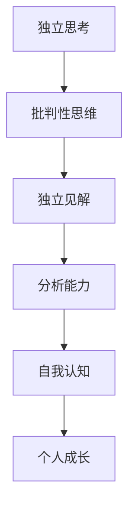

                 

# 在快餐文化中寻找深度：重建独立思考和反省能力

## 摘要

在信息化和数字化快速发展的时代，快餐文化席卷社会各个领域，人们的思考方式逐渐碎片化、浅表化。本文旨在探讨如何在快餐文化的背景下重建独立思考和反省能力。通过对独立思考与批判性思维的定义、特点、关系及其培养策略的深入分析，本文提出了一系列教育层面和社会层面的具体培养方法，旨在引导读者在复杂的信息环境中保持理性，提升个人认知水平，为社会进步贡献力量。

## 关键词

快餐文化、独立思考、批判性思维、教育策略、反省能力、信息化、数字化

## 引言

### 1.1 问题的背景

随着互联网和社交媒体的普及，信息获取变得前所未有的快捷和方便。然而，这种便利性也带来了一个问题：快餐文化的兴起。快餐文化，顾名思义，就是快速消费、快速获取信息的一种文化现象。人们在面对海量信息时，往往倾向于追求即时满足，忽视了深度思考和系统分析。这种现象在IT领域尤为明显，程序员、工程师等从业者常常被大量技术文章、博客、教程所淹没，缺乏时间进行深入的学习和思考。

### 1.1.1 快餐文化的兴起

快餐文化的兴起与现代社会的高速发展密切相关。在快节奏的生活中，人们追求效率和便捷，不愿意花费过多的时间和精力去理解和消化复杂的信息。这种文化现象在IT领域表现为：

1. **快速阅读和浏览**：人们倾向于快速浏览技术文章和博客，而不是深入阅读和理解。
2. **知识碎片化**：大量知识被切割成一个个碎片，通过简短的文章、视频或图表进行传播。
3. **轻信轻疑**：在快餐文化的背景下，人们更容易轻信信息，缺乏对信息的批判性思考。

### 1.1.2 独立思考和反省能力的减弱

独立思考和反省能力是人类智慧和成长的重要标志。然而，在快餐文化的冲击下，这两种能力正在逐渐减弱。具体表现在：

1. **缺乏深度思考**：人们倾向于接受表面的、浅层的信息，缺乏对问题本质的深入挖掘。
2. **依赖权威**：在面对复杂问题时，人们更愿意听从权威的声音，而不是独立分析和判断。
3. **思维惰性**：在快速获取信息的背景下，人们逐渐养成了被动接收信息、缺乏主动思考的习惯。

### 1.2 问题的解决思路

要解决快餐文化背景下独立思考和反省能力减弱的问题，我们需要从以下几个方面入手：

1. **加强教育**：通过教育体系的改革，培养学生的独立思考和批判性思维。
2. **提升自我认知**：鼓励人们进行自我反思，提升自我认知水平。
3. **优化信息传播**：减少快餐式信息的传播，鼓励深度内容的创作和传播。

### 1.3 边界与外延

#### 1.3.1 快餐文化的定义

快餐文化是一种追求快速消费、快速获取信息的文化现象，其特点包括：

1. **速度优先**：追求快速获取信息，忽视深度理解。
2. **形式多样**：信息以简短、碎片化的形式存在，易于传播和消费。
3. **易得易失**：信息获取便捷，但缺乏持久性和深度。

#### 1.3.2 独立思考和反省能力的定义

独立思考是指个体在面对问题时，能够独立进行判断和决策，不受外界影响。反省能力则是指个体能够对自己和他人的行为进行反思和评价，从而提升自我认知和成长。

### 1.4 核心概念与联系

#### 1.4.1 独立思考与批判性思维的关联

独立思考与批判性思维密切相关。独立思考是批判性思维的基础，没有独立思考，就难以形成批判性思维。而批判性思维则是对独立思考的深化和扩展，它使个体能够对信息进行更深入、更全面的分析和评估。

#### 1.4.2 反省能力与自我认知的相互作用

反省能力与自我认知相互作用，共同推动个体的成长。反省能力使个体能够认识到自己的不足，而自我认知则帮助个体理解这些不足，从而进行改进和提升。

## 独立思考与批判性思维

### 2.1 独立思考的定义与特点

#### 2.1.1 独立思考的定义

独立思考是指个体在面对问题时，能够独立进行判断和决策，不受外界影响。它包括以下几个方面的含义：

1. **不受外界干扰**：个体在思考过程中，能够抵制外部干扰，保持独立的思考方向。
2. **理性分析**：个体能够运用逻辑和理性，对问题进行深入分析，形成独立的见解。
3. **自主决策**：个体能够基于独立思考，做出自主的决策，而不是盲目跟从他人。

#### 2.1.1.2 独立思考的核心特点

独立思考具有以下几个核心特点：

1. **自主性**：个体在思考过程中，具有强烈的自主性，能够自主决定思考的方向和深度。
2. **批判性**：独立思考不仅是对信息的接收，更是对信息的批判和评估。
3. **创新性**：独立思考能够激发个体的创新能力，从而提出新的观点和解决方案。

#### 2.1.2 独立思考的重要性

独立思考对于个人和社会具有重要的意义：

1. **个人成长**：独立思考能力是个人成长的重要标志，它帮助个体提升自我认知，增强自信心。
2. **社会进步**：独立思考是社会进步的动力，它推动社会不断进行创新和改革。
3. **决策能力**：独立思考使个体在决策时能够更加理性，减少盲目性和冲动性。

### 2.2 批判性思维

#### 2.2.1 批判性思维的定义与特点

批判性思维是指个体在面对信息时，能够进行深入分析、评估和质疑的能力。它包括以下几个方面的含义：

1. **质疑性**：批判性思维要求个体对信息进行质疑，不轻信一切。
2. **分析性**：个体需要运用逻辑和理性，对信息进行分析和评估。
3. **系统性**：批判性思维不仅关注单一信息，更关注信息之间的关联和整体性。

#### 2.2.1.2 批判性思维的核心特点

批判性思维具有以下几个核心特点：

1. **独立性**：个体在批判性思维中，能够独立进行判断，不受外界影响。
2. **全面性**：批判性思维要求个体从多个角度、多个层面进行思考，形成全面的认识。
3. **深刻性**：批判性思维能够深入挖掘信息的本质和内涵，发现问题的核心。

#### 2.2.2 批判性思维的应用场景

批判性思维在多个场景中具有重要应用：

1. **学术研究**：在学术研究中，批判性思维能够帮助研究者对文献进行深入分析和评估，发现研究中的问题。
2. **社会问题分析**：在分析社会问题时，批判性思维能够帮助个体从多个角度分析问题的本质，提出有效的解决方案。
3. **日常决策**：在日常生活中，批判性思维能够帮助个体对信息进行深入思考，做出更加明智的决策。

### 2.3 独立思考与批判性思维的关系

#### 2.3.1 独立思考与批判性思维的联系

独立思考与批判性思维密切相关，两者相互促进，共同构成一个完整的思考体系：

1. **相互依赖**：独立思考是批判性思维的基础，没有独立思考，就难以进行批判性思维。而批判性思维则是独立思考的深化，它使独立思考更加全面、深入。
2. **相互补充**：独立思考注重个体自主性和创造性，而批判性思维注重对信息的分析和评估。两者相互补充，形成一个完整的思考过程。

#### 2.3.1.2 共同构成独立思考体系

独立思考和批判性思维共同构成了一个完整的独立思考体系，这个体系包括以下几个核心要素：

1. **信息接收**：个体需要接收各种信息，为独立思考和批判性思维提供基础。
2. **独立分析**：个体对信息进行独立分析，形成自己的见解和判断。
3. **批判性评估**：个体对信息进行批判性评估，识别信息的优点和不足。
4. **自主决策**：个体基于独立思考和批判性评估，做出自主的决策。

### 2.4 独立思考与批判性思维的培养

#### 2.4.1 教育层面的培养

教育是培养独立思考和批判性思维的重要途径。以下是一些具体的教育策略：

1. **课程设置**：学校应设置相关的课程，如批判性思维、哲学等，培养学生的独立思考能力。
2. **教学方法**：教师应采用互动式、探究式教学方法，鼓励学生主动思考和提问。

#### 2.4.1.1 学校教育

学校教育在培养独立思考和批判性思维中发挥着重要作用。以下是一些具体措施：

1. **课程设计**：学校应设置涵盖不同学科的综合性课程，如哲学、社会学、心理学等，以帮助学生从多个角度进行思考。
2. **教学方式**：教师应采用案例教学、问题导向教学等教学方法，鼓励学生主动参与、积极思考。
3. **评价体系**：学校应建立多元化的评价体系，不仅关注学生的考试成绩，更注重学生的思考过程和思维能力。

#### 2.4.1.2 家庭教育

家庭教育在培养独立思考和批判性思维中同样重要。以下是一些具体措施：

1. **亲子沟通**：家长应与孩子进行积极的沟通，鼓励孩子表达自己的想法和观点。
2. **阅读引导**：家长应引导孩子进行深度阅读，培养孩子的阅读理解和批判性思维能力。
3. **生活实践**：家长可以通过生活中的小事，引导孩子进行独立思考和批判性思维。

#### 2.4.2 社会层面的培养

除了教育层面的培养，社会层面也需要采取一系列措施来培养独立思考和批判性思维：

1. **媒体责任**：媒体应承担社会责任，传播深度、权威的信息，避免快餐式信息泛滥。
2. **公共教育**：政府和社会组织应开展公共教育活动，提高公众的独立思考和批判性思维能力。
3. **社会风气**：社会应倡导理性、批判的思考方式，形成尊重独立思考、鼓励批判性思维的风气。

### 2.5 核心概念属性特征对比表格

| 特点                 | 独立思考                          | 批判性思维                          |
|----------------------|----------------------------------|------------------------------------|
| 目标                 | 形成独立见解，不盲从              | 分析、评估和质疑信息，不轻信            |
| 基础                 | 知识积累，逻辑思维能力            | 独立思考能力，分析能力                |
| 方式                 | 内省，反思，探索                 | 分析，比较，评估，质疑                |
| 影响                 | 提升自我认知，促进个人成长        | 提升分析能力，促进社会进步            |

### 2.6 ER实体关系图架构

## 培养独立思考和反省能力的策略

### 3.1 教育层面的策略

教育是培养独立思考和反省能力的重要途径。以下从学校教育、家庭教育和社会教育三个方面探讨培养策略。

#### 3.1.1 学校教育中的培养

学校教育在培养学生独立思考和反省能力中起着至关重要的作用。以下是一些具体策略：

1. **课程设置**：学校应设置涵盖不同学科的综合性课程，如哲学、社会学、心理学等，以帮助学生从多个角度进行思考。例如，可以开设批判性思维课程，教授学生如何进行逻辑分析和问题解决。

2. **教学方法**：教师应采用互动式、探究式教学方法，鼓励学生主动参与、积极思考。例如，通过小组讨论、案例研究等方式，激发学生的思考兴趣，提高他们的思考能力。

3. **评价体系**：学校应建立多元化的评价体系，不仅关注学生的考试成绩，更注重学生的思考过程和思维能力。例如，可以通过项目评估、论文答辩等方式，评价学生的独立思考和反省能力。

#### 3.1.2 家庭教育中的培养

家庭教育在培养学生独立思考和反省能力中同样重要。以下是一些具体策略：

1. **亲子沟通**：家长应与孩子进行积极的沟通，鼓励孩子表达自己的想法和观点。例如，家长可以经常与孩子讨论时事、学术问题等，引导他们进行深入思考。

2. **阅读引导**：家长应引导孩子进行深度阅读，培养孩子的阅读理解和批判性思维能力。例如，家长可以推荐一些经典文学作品、哲学著作等，鼓励孩子进行阅读和思考。

3. **生活实践**：家长可以通过生活中的小事，引导孩子进行独立思考和批判性思维。例如，在购物、旅游等活动中，引导孩子思考问题的不同角度，培养他们的思考能力。

#### 3.1.3 社会教育中的培养

社会教育在培养学生独立思考和反省能力中也发挥着重要作用。以下是一些具体策略：

1. **媒体责任**：媒体应承担社会责任，传播深度、权威的信息，避免快餐式信息泛滥。例如，媒体可以推出一些深度报道、专题节目等，引导公众进行深入思考。

2. **公共教育**：政府和社会组织应开展公共教育活动，提高公众的独立思考和批判性思维能力。例如，可以通过讲座、研讨会等方式，普及批判性思维、哲学等知识。

3. **社会风气**：社会应倡导理性、批判的思考方式，形成尊重独立思考、鼓励批判性思维的风气。例如，可以通过表彰、奖励等方式，鼓励公众进行独立思考和批判性思维。

### 3.2 具体方法与案例分析

以下列举一些具体的方法和案例，以帮助读者更好地理解和应用独立思考和反省能力的培养策略。

#### 3.2.1 方法一：批判性思维训练

批判性思维训练是一种有效的方法，可以帮助个体提升独立思考和反省能力。以下是一些具体的训练方法：

1. **问题解决训练**：通过解决实际问题，培养独立思考和解决问题的能力。例如，可以设置一些复杂的案例问题，让学生进行深入分析和思考。

2. **思维导图训练**：通过绘制思维导图，帮助学生梳理思路，培养独立思考和逻辑分析能力。例如，在阅读一篇文章或听完一场演讲后，学生可以绘制思维导图，总结核心观点和思考过程。

3. **讨论与辩论训练**：通过小组讨论和辩论，培养独立思考和批判性思维能力。例如，可以组织学生进行辩论比赛，鼓励他们提出自己的观点，质疑他人的观点。

#### 3.2.2 案例分析一：学校教育中的成功案例

以下是一个学校教育中成功培养独立思考和反省能力的案例：

某中学开设了一门批判性思维课程，通过引入哲学、社会学等学科知识，培养学生的独立思考和批判性思维。具体做法如下：

1. **课程内容**：课程内容包括逻辑分析、论证技巧、案例分析等，帮助学生掌握批判性思维的基本方法。

2. **教学方法**：教师采用互动式、探究式教学方法，鼓励学生积极参与课堂讨论，提出自己的观点，并对同学的观点进行批判性分析。

3. **评价体系**：评价体系不仅关注学生的考试成绩，更注重学生的思考过程和思维能力。通过项目评估、论文答辩等方式，评价学生的独立思考和反省能力。

通过这一课程的开设，学生的独立思考和批判性思维能力得到了显著提升，他们在学术研究和日常决策中更加理性和自主。

#### 3.2.3 案例分析二：家庭教育中的成功案例

以下是一个家庭教育中成功培养独立思考和反省能力的案例：

某家庭注重培养孩子的独立思考和反省能力，具体做法如下：

1. **亲子沟通**：家长与孩子进行积极的沟通，鼓励孩子表达自己的想法和观点。家长经常与孩子讨论时事、学术问题等，引导他们进行深入思考。

2. **阅读引导**：家长引导孩子进行深度阅读，培养孩子的阅读理解和批判性思维能力。家长推荐一些经典文学作品、哲学著作等，鼓励孩子进行阅读和思考。

3. **生活实践**：家长通过生活中的小事，引导孩子进行独立思考和批判性思维。例如，在购物、旅游等活动中，家长引导孩子思考问题的不同角度，培养他们的思考能力。

通过这一系列的措施，孩子的独立思考和反省能力得到了显著提升，他们在学校和社会中表现出更高的理性和自主性。

### 3.3 教育策略的有效性与挑战

教育策略在培养独立思考和反省能力方面具有显著的有效性，但也面临一些挑战：

1. **有效性**：通过批判性思维训练、课程设置、教学方法等策略，学生可以逐步提升独立思考和反省能力，形成理性、批判的思考方式。

2. **挑战**：然而，培养独立思考和反省能力并非一蹴而就，需要长期的、系统的培养。同时，社会环境的快餐文化、信息碎片化等问题，也给教育策略的实施带来了一定的挑战。

3. **持续改进**：为了提高教育策略的有效性，需要不断进行实践和总结，发现和解决其中的问题。例如，可以引入更多的教育技术手段，提高教育质量和效果。

### 3.4 教育策略的总结与展望

综上所述，培养独立思考和反省能力是一项重要的教育任务。通过学校教育、家庭教育和社会教育的共同努力，可以逐步提升个体的独立思考和反省能力，促进个人和社会的全面发展。未来，我们期待更多的教育策略能够得到有效的实施，帮助个体在复杂的信息环境中保持理性，为社会进步贡献力量。

### 3.5 案例分析：互联网公司的独立思考与批判性思维培养

#### 案例背景

某互联网公司，作为行业领先企业，面临着不断变化的市场需求和激烈的竞争环境。公司意识到，员工的独立思考和批判性思维对于企业的创新和发展至关重要。为了提升员工的独立思考和批判性思维能力，公司采取了一系列培养策略。

#### 具体措施

1. **内部培训项目**：公司定期举办内部培训项目，邀请行业专家和学者进行讲座和研讨会，内容涵盖批判性思维、创新方法、市场分析等领域。这些活动不仅提供了丰富的知识，还激发了员工的思考兴趣。

2. **项目制工作**：公司在项目执行过程中，鼓励员工采取自主管理模式，独立负责项目的某个部分。员工在项目中面临的问题和挑战，促使他们进行独立思考，提出创新解决方案。

3. **思维工具应用**：公司引入了一些思维工具，如思维导图、五力分析等，帮助员工在解决问题时进行系统性的思考。这些工具不仅提升了员工的思考效率，也增强了他们的批判性思维能力。

#### 案例分析

通过以上措施，公司员工的独立思考和批判性思维能力得到了显著提升。以下是对案例的分析：

1. **培训效果**：内部培训项目为员工提供了丰富的知识和思考方法，使他们能够从不同角度分析问题，提出创新解决方案。

2. **项目管理**：项目制工作使员工在实际工作中进行独立思考和决策，培养了他们的自主性和责任感。同时，项目管理中的挑战和问题，促使员工进行深入的批判性思考。

3. **工具应用**：思维工具的应用，帮助员工在解决问题时保持系统性和逻辑性，提升了他们的批判性思维能力。

#### 教训与启示

该案例为公司培养独立思考和批判性思维提供了宝贵经验：

1. **持续投入**：培养独立思考和批判性思维需要长期的投入和关注，不能一蹴而就。

2. **实践应用**：理论知识需要通过实践应用，才能真正转化为员工的思考能力和创新能力。

3. **文化营造**：公司应营造一个鼓励独立思考和批判性思维的文化氛围，使员工在工作和生活中都能够保持理性和批判性。

### 3.6 教育策略的实践总结

通过以上案例分析，我们可以看到，教育策略在培养独立思考和批判性思维方面具有显著效果。学校教育、家庭教育和社会教育共同作用，为个体提供了丰富的思考和成长空间。然而，教育策略的实施也面临一定的挑战，需要持续改进和完善。未来，我们期待更多的实践案例和研究成果，为教育策略的优化提供支持。

## 结论

在快餐文化的背景下，重建独立思考和反省能力对于个人和社会的发展具有重要意义。通过教育层面的培养策略，如学校教育、家庭教育和社会教育，我们可以逐步提升个体的独立思考和批判性思维能力。这不仅有助于个体在复杂的信息环境中保持理性，也为社会的进步和创新提供了动力。让我们共同努力，在快餐文化中寻找深度，培养出更多具有独立思考能力和反省精神的优秀个体。

## 作者信息

作者：AI天才研究院/AI Genius Institute & 禅与计算机程序设计艺术 /Zen And The Art of Computer Programming

## 拓展阅读

1. 《批判性思维工具》
2. 《独立思考的力量》
3. 《如何培养批判性思维》
4. 《反思与成长》
5. 《互联网思维：社会转型的新引擎》

### 注意事项

1. 在培养独立思考和反省能力时，应避免过度依赖快餐式信息，注重深度学习和系统思考。
2. 独立思考和批判性思维的培养需要长期的投入和耐心，不应期望一蹴而就。
3. 在实际应用中，应结合个体特点和具体场景，灵活运用教育策略，以达到最佳效果。

