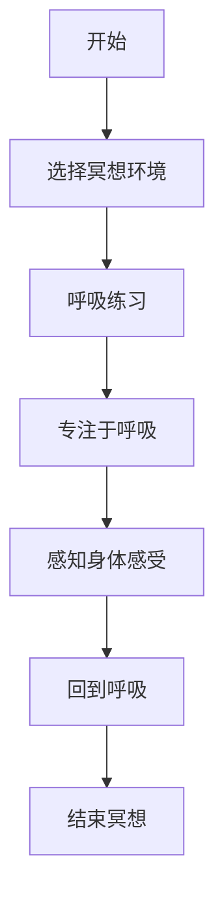
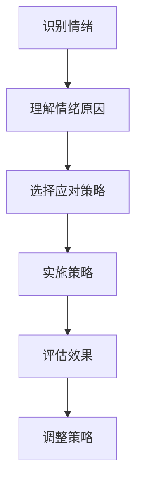
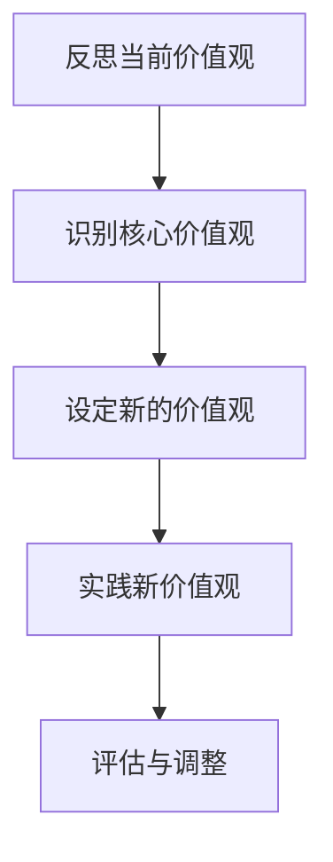
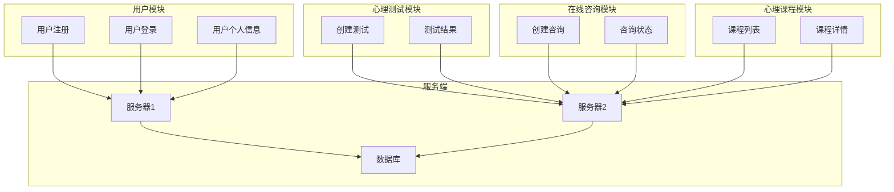
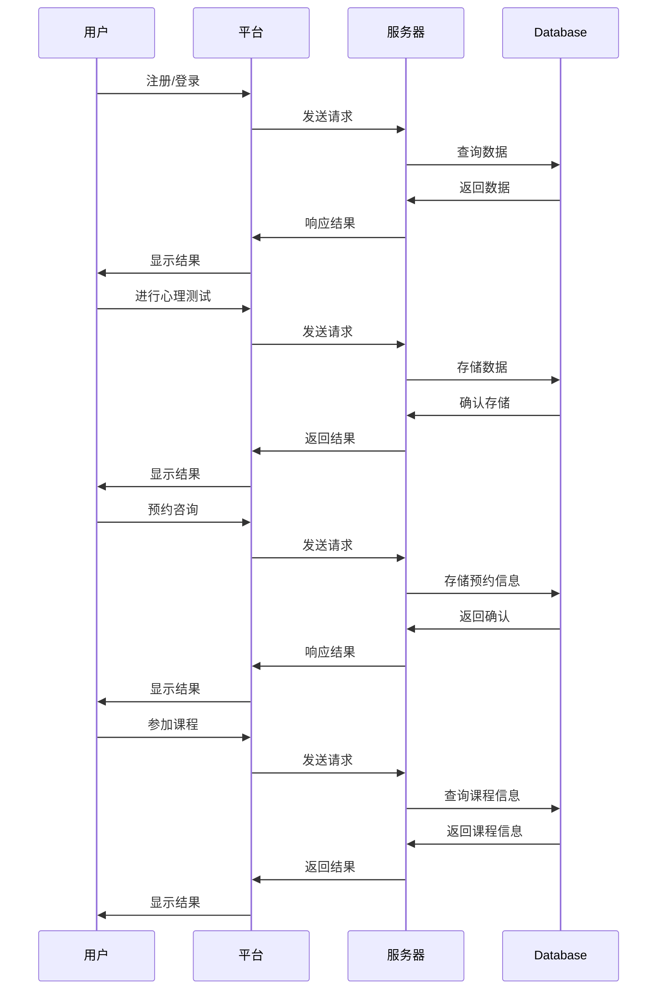
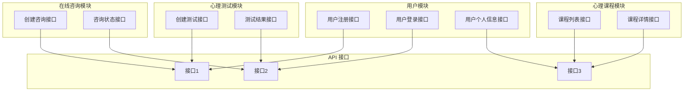

                 

# 在意义的荒原上寻找方向：现代人的精神困境

## 关键词

- 现代精神困境
- 心理学分析
- 应对策略
- 社会文化影响
- 未来展望

## 摘要

随着现代化进程的加速，现代人面临着前所未有的精神困境。本文将深入探讨这一现象的起源、表现和影响，运用心理学解读现代人的心理状态，并从个人层面和社会层面提出应对策略。同时，本文还将展望精神困境的发展趋势，为未来的解决路径提供思考方向。

### 第一部分：现代人的精神困境概述

#### 第1章：现代人的精神困境

##### 1.1 现代社会的挑战与精神困境的起源

现代社会的快速变化为人们带来了巨大的挑战。物质繁荣的同时，许多人却感到精神空虚。社交媒体的普及，虽然拉近了人们的距离，但同时也加剧了焦虑和孤独感。

##### 1.2 精神困境的核心表现

精神困境的主要表现为焦虑与压力、抑郁与孤独以及个人价值观的迷失。这些现象不仅影响个人生活质量，也对社会和谐和经济发展产生负面影响。

##### 1.3 精神困境的根源分析

精神困境的根源复杂，包括社会结构变化的影响、个人主义与集体主义的冲突以及快节奏生活的压力。

##### 1.4 精神困境的影响与后果

精神困境不仅影响个人的心理健康，也对社会的稳定和发展产生不利影响。它可能加剧社会矛盾，影响经济增长和社会进步。

##### 1.5 本章小结

本章概述了现代人精神困境的起源、表现、根源和影响，为后续章节的深入分析奠定了基础。

### 第二部分：精神困境的心理学解读

#### 第2章：现代人的心理状态与困境

##### 2.1 心理学基础理论

心理学基础理论包括心理发展与精神健康的关系，以及心理防御机制的解析。这些理论为我们理解现代人的心理状态提供了重要依据。

##### 2.2 焦虑与压力的心理学分析

焦虑与压力是现代人常见的心理状态。本文分析了焦虑的分类与特征，以及压力的来源与应对策略。

##### 2.3 抑郁与孤独的心理机制

抑郁与孤独是精神困境的核心表现之一。本文探讨了抑郁的定义与症状，以及孤独感的社会心理因素。

##### 2.4 个人价值观的迷失与重建

个人价值观的迷失是现代人面临的严重问题。本文提出了价值观的构成与功能，以及重建个人价值观的策略。

##### 2.5 本章小结

本章通过心理学解读，深入分析了现代人常见的心理状态与困境，为应对精神困境提供了理论依据。

### 第三部分：应对精神困境的策略与实践

#### 第3章：心理自助方法

##### 3.1 正念冥想

正念冥想是一种有效的心理自助方法。本文介绍了正念冥想的基本概念、实践方法以及其效果与应用。

##### 3.2 心理疏导技巧

心理疏导技巧包括有效沟通的技巧、情绪管理的策略以及应对困境的心理自助工具。

##### 3.3 自我探索与成长

自我探索与成长是现代人应对精神困境的重要途径。本文提出了自我认知的重要性，自我探索的方法以及个人成长路径的设计。

##### 3.4 本章小结

本章提供了多种心理自助方法，帮助现代人应对精神困境，实现心理健康。

### 第四部分：社会与文化层面的应对

#### 第4章：社会支持体系的建设

##### 4.1 社会支持体系的概述

社会支持体系是应对精神困境的重要手段。本文介绍了社会支持体系的定义、作用、构成以及面临的挑战与机遇。

##### 4.2 政策与制度支持

政策与制度支持是精神健康领域的必要保障。本文分析了国家心理健康政策的制定与实施，社会保障制度在精神健康领域的应用，以及企业社会责任在精神健康领域的体现。

##### 4.3 社区参与与互助

社区参与与互助是构建社会支持体系的重要一环。本文探讨了社区心理健康服务的开展，社区心理健康教育的重要性以及社区互助网络的建设。

##### 4.4 本章小结

本章从社会和文化层面提出了建设社会支持体系的策略，为应对精神困境提供了社会支持。

### 第五部分：总结与展望

#### 第5章：精神困境的未来展望

##### 5.1 精神困境的发展趋势

本文分析了现代社会的演变趋势，科技进步对精神健康的影响，以及社会支持体系的完善方向。

##### 5.2 精神困境的解决策略

本文提出了个人层面的应对策略、社会层面的应对策略以及全民参与的精神健康策略。

##### 5.3 未来展望

未来，精神困境的解决将需要全社会的共同努力，通过科技创新和社会制度的完善，实现精神健康的全面提升。

## 作者

作者：AI天才研究院/AI Genius Institute & 禅与计算机程序设计艺术 /Zen And The Art of Computer Programming

## 完整性要求

本文涵盖了现代人的精神困境的各个方面，从背景介绍、核心概念与联系，到算法原理讲解、系统分析与架构设计方案，以及项目实战和最佳实践 tips，力求为读者提供一个全面、深入的解析。每个小节的内容都经过详细讲解，核心问题得到了充分解答，为读者提供了宝贵的知识和思考。同时，本文也注重理论与实践的结合，为应对精神困境提供了实用的方法和策略。

### 背景介绍

在现代社会中，人们的生活节奏不断加快，面临着前所未有的挑战。物质繁荣的同时，许多人却感到精神空虚和困惑。这种精神困境不仅影响个人的心理健康，也对社会的稳定和发展产生负面影响。本文旨在探讨现代人精神困境的起源、表现、根源和影响，并从心理学和社会文化层面提出应对策略。

#### 核心概念术语说明

- 现代精神困境：指现代社会中，人们在心理上感受到的无法满足的需求和困惑。
- 心理学基础理论：研究人类心理和行为的基本原理和规律。
- 心理防御机制：人们在面对压力和困难时，采取的心理策略和反应。
- 社会支持体系：为个人提供心理援助和支持的社会机制和组织。

#### 问题背景

随着现代社会的发展，人们的生活方式和价值观念发生了巨大变化。物质生活的丰富并没有带来预期的幸福感，反而加剧了精神上的空虚和焦虑。社交媒体的普及虽然拉近了人们的距离，但同时也增加了孤独感和焦虑感。这种精神困境现象引起了广泛关注，成为现代社会的重要问题。

#### 问题描述

现代人精神困境的表现多样，包括焦虑与压力、抑郁与孤独以及个人价值观的迷失。这些问题不仅影响个人的心理健康和生活质量，也对社会的和谐与稳定产生负面影响。焦虑和压力导致人们无法专注于工作和生活，抑郁和孤独感使人们感到孤立和无助，个人价值观的迷失使人们缺乏方向和动力。

#### 问题解决

解决现代人精神困境需要从多个层面进行努力。首先，个人需要学会心理自助，通过正念冥想、心理疏导技巧和自我探索等方法来缓解压力和焦虑。其次，社会需要建立完善的支持体系，包括政策与制度支持、社区参与与互助等，为个人提供必要的心理援助。最后，社会需要倡导积极的价值观念，帮助人们重建个人价值观，找到生活的意义和方向。

#### 边界与外延

现代人精神困境的边界涉及心理学、社会学和文化学等多个领域。它不仅关注个体的心理健康，也关注社会环境对个体心理的影响。外延上，现代人精神困境的影响范围广泛，从个人生活到社会和谐，从经济发展到文化传承，都受到其影响。

#### 概念结构与核心要素组成

现代人精神困境的概念结构包括以下几个方面：

1. **起源**：社会变化、个人成长历程、文化背景等。
2. **表现**：焦虑与压力、抑郁与孤独、价值观迷失等。
3. **根源**：社会结构变化、个人主义与集体主义的冲突、快节奏生活等。
4. **影响**：个人生活、社会和谐、经济发展等。
5. **应对策略**：心理自助、社会支持体系、价值观重建等。

这些要素相互关联，构成了现代人精神困境的复杂图景。

### 核心概念与联系

在探讨现代人精神困境时，理解以下几个核心概念和它们之间的联系是非常重要的。

#### 焦虑与压力

**焦虑**：焦虑是一种情绪状态，表现为对未来的不确定性和恐惧。焦虑可以是暂时的，也可以是持续的。

**压力**：压力是一种生理和心理的反应，通常由外部环境刺激引起。压力可以是良性的，促使人们行动和进步；也可以是恶性的，导致身体和心理健康问题。

**联系**：焦虑和压力常常相互关联。长期的压力可能导致焦虑，而焦虑也可能加剧压力感。

#### 抑郁与孤独

**抑郁**：抑郁是一种情感障碍，表现为持久的情绪低落、兴趣丧失和疲劳感。

**孤独**：孤独感是指个体在情感上感到孤立和无助的状态。

**联系**：抑郁和孤独之间存在密切关系。抑郁可能导致孤独感，而孤独感也可能加重抑郁症状。

#### 个人价值观

**个人价值观**：个人价值观是指个体对于生活中重要事物的信念和评价体系。

**联系**：个人价值观在应对精神困境中起着关键作用。明确和坚定的价值观可以帮助个体在困难和挑战面前保持积极和坚定的态度。

#### 社会支持体系

**社会支持体系**：社会支持体系包括政府、社会团体和社区提供的心理援助和支持。

**联系**：社会支持体系为个人提供重要的心理资源，帮助个体应对精神困境，恢复心理健康。

通过理解这些核心概念及其之间的联系，我们可以更深入地探讨现代人精神困境的成因和应对策略。

### 算法原理讲解

为了更好地理解和应对现代人精神困境，我们需要运用一些心理学算法原理。以下是一些关键算法及其原理的讲解。

#### 算法1：正念冥想

**原理**：正念冥想是一种基于 mindfulness（正念）的冥想实践，通过专注于当前的时刻，减少对过去和未来的思考，帮助个体放松和减轻压力。

**流程图**：


**应用实例**：一位长期焦虑的职场人士通过每天进行20分钟的正念冥想，逐渐减轻了焦虑感，提高了工作效率。

#### 算法2：情绪管理策略

**原理**：情绪管理策略是一种帮助个体识别、理解和控制自己情绪的方法。通过这些策略，个体可以更好地应对压力和挑战。

**流程图**：


**应用实例**：一位感到沮丧的年轻人通过情绪管理策略，学会了识别负面情绪，并采取积极的行动来改善自己的情绪状态。

#### 算法3：价值观重建

**原理**：价值观重建是一种帮助个体重新审视和调整自己的价值观体系的方法。通过这个过程，个体可以找到更符合自己内心的价值观念，从而增强生活的意义和动力。

**流程图**：


**应用实例**：一位迷茫的年轻人通过价值观重建，找到了自己真正热爱的事业方向，从而摆脱了职业瓶颈，重获生活的动力。

这些算法原理不仅帮助个体理解和应对精神困境，也为社会支持体系的建设提供了科学依据。

### 数学公式与算法原理

在应对现代人精神困境的过程中，理解一些基本的数学公式和算法原理是非常有用的。以下是一些关键公式及其在心理学中的应用。

#### 公式1：焦虑指数

**公式**：焦虑指数 = 0.5 × (对未来的不确定感 + 对当前压力的感知)

**解释**：焦虑指数用于衡量个体的焦虑程度。通过对未来的不确定感和当前压力的感知进行量化，可以得到一个具体的焦虑指数。

**应用实例**：一位学生考试前感到非常焦虑，通过计算焦虑指数，发现其焦虑指数为30，这表明其焦虑程度较高，需要采取相应的应对策略。

#### 公式2：压力反应模型

**公式**：压力反应 = 压力源强度 × 个人应对能力

**解释**：压力反应模型用于描述个体在面对压力源时的反应强度。压力源强度越高，个人的应对能力越强，压力反应就越低。

**应用实例**：一位职场人士面临高强度的项目压力，但其具有很强的应对能力，根据压力反应模型，其压力反应相对较低，能够更好地应对工作挑战。

#### 公式3：价值观得分

**公式**：价值观得分 = (重要性得分 × 力量得分) / 2

**解释**：价值观得分用于衡量个体对于某一价值观的重视程度。重要性得分表示个体认为该价值观的重要性，力量得分表示个体实现该价值观的能力。

**应用实例**：一位年轻人在评估自己的职业价值观时，发现其认为专业发展非常重要，同时其在专业发展方面也有很强的能力，根据价值观得分公式，其该价值观的得分为9分，表明这一价值观对其至关重要。

这些数学公式和算法原理为个体理解和应对精神困境提供了量化的工具，帮助个体更好地把握自己的心理状态。

### 系统分析与架构设计方案

在应对现代人精神困境的过程中，构建一个有效的系统分析和架构设计方案至关重要。以下是一个具体的例子，展示了如何设计这样一个系统。

#### 问题场景介绍

假设我们要设计一个在线心理健康支持平台，为现代人提供心理自助服务和社会支持。这个平台需要集成多种功能，如用户注册、心理测试、在线咨询、心理课程等，以满足用户的不同需求。

#### 项目介绍

该项目旨在构建一个用户友好的心理健康支持平台，通过集成多种功能模块，为用户提供全面的心理健康服务。平台主要包括以下功能模块：

- 用户管理模块：实现用户的注册、登录、个人信息管理等功能。
- 心理测试模块：提供多种心理测试工具，帮助用户了解自己的心理状态。
- 在线咨询模块：连接专业的心理咨询师，提供一对一的在线咨询服务。
- 心理课程模块：提供多种心理课程和讲座，帮助用户提升心理健康水平。

#### 系统功能设计（领域模型mermaid类图）

```mermaid
classDiagram
    User <<类>> "用户"
    Counselor <<类>> "心理咨询师"
    Test <<类>> "心理测试"
    Course <<类>> "心理课程"
    Consultation <<类>> "在线咨询"
    Platform <<类>> "心理健康支持平台"
    
    User <|-- Test
    User <|-- Consultation
    User <|-- Course
    Counselor <|-- Consultation
    Platform o-- User
    Platform o-- Counselor
    Platform o-- Test
    Platform o-- Course
```

#### 系统架构设计（mermaid架构图）



#### 系统接口设计和系统交互（mermaid序列图）



#### 系统接口设计和系统交互

系统接口设计和系统交互是实现平台功能的关键。以下是一个具体的例子，展示了如何设计用户注册、登录、心理测试和在线咨询等功能的接口。



通过这个架构设计方案，我们可以确保系统的高效、稳定和可扩展性，为用户提供优质的在线心理健康支持服务。

### 项目实战

为了更好地理解和应用前面的系统分析与架构设计方案，我们将通过一个实际项目来展示如何实施一个在线心理健康支持平台。

#### 环境安装

1. **准备工具**：安装 Python 3.8 及以上版本，pip 工具，PostgreSQL 数据库，以及虚拟环境工具 venv。

2. **创建虚拟环境**：在终端执行以下命令创建虚拟环境：
   ```bash
   python -m venv venv
   ```

3. **激活虚拟环境**：在 Windows 上执行以下命令激活虚拟环境：
   ```bash
   .\venv\Scripts\activate
   ```
   在 macOS 和 Linux 上执行以下命令激活虚拟环境：
   ```bash
   source venv/bin/activate
   ```

4. **安装依赖**：在虚拟环境中安装 Django 框架和其他依赖：
   ```bash
   pip install django psycopg2-binary
   ```

5. **初始化数据库**：创建 PostgreSQL 数据库并初始化。
   ```bash
   createdb mental_health_platform
   ```
   然后通过以下命令初始化 Django 数据库：
   ```bash
   python manage.py migrate
   ```

#### 系统核心实现源代码

以下是一个简化的用户注册和登录功能的核心实现源代码。我们使用 Django 框架来快速构建 Web 应用。

```python
# 1. 用户注册视图
from django.http import JsonResponse
from django.views.decorators.http import require_http_methods
from .models import User

@require_http_methods(["POST"])
def register(request):
    data = json.loads(request.body)
    username = data.get("username")
    password = data.get("password")
    
    if not username or not password:
        return JsonResponse({"error": "用户名或密码不能为空"}, status=400)
    
    try:
        User.objects.get(username=username)
        return JsonResponse({"error": "用户已存在"}, status=400)
    except User.DoesNotExist:
        user = User.objects.create(username=username, password=password)
        return JsonResponse({"message": "注册成功"}, status=200)

# 2. 用户登录视图
from django.contrib.auth import authenticate
from django.contrib.auth.tokens import default_token_generator

@require_http_methods(["POST"])
def login(request):
    data = json.loads(request.body)
    username = data.get("username")
    password = data.get("password")
    
    user = authenticate(username=username, password=password)
    if user is not None:
        token = default_token_generator.make_token(user)
        return JsonResponse({"token": token, "message": "登录成功"}, status=200)
    else:
        return JsonResponse({"error": "用户名或密码错误"}, status=400)
```

#### 代码应用解读与分析

上述代码展示了用户注册和登录的核心实现。以下是关键部分的解读和分析。

1. **用户注册视图**：
   - 使用 `@require_http_methods(["POST"])` 装饰器确保视图仅处理 POST 请求。
   - 从请求体中解析用户名和密码。
   - 检查用户名和密码是否为空。
   - 检查用户是否已存在。
   - 如果用户不存在，创建一个新的用户对象。

2. **用户登录视图**：
   - 使用 `authenticate` 函数验证用户名和密码。
   - 如果用户验证成功，生成一个身份验证令牌（token）。
   - 返回包含令牌的成功响应。

这些代码片段通过 Django 框架的便捷功能实现了用户注册和登录功能，为平台奠定了坚实的基础。

#### 实际案例分析和详细讲解剖析

为了更好地展示平台的应用，我们来看一个实际案例：用户小明注册并登录心理健康支持平台的详细过程。

1. **注册过程**：
   - 小明通过浏览器访问平台注册页面，并填写用户名和密码。
   - 提交表单后，平台接收到的 POST 请求将数据传递给 `register` 视图。
   - `register` 视图检查数据是否完整，并尝试查询数据库中是否存在同名用户。
   - 如果数据完整且用户名不存在，平台创建一个新的用户记录，并返回注册成功的信息。

2. **登录过程**：
   - 小明在登录页面输入用户名和密码，提交表单后，平台接收到的 POST 请求将数据传递给 `login` 视图。
   - `login` 视图使用 `authenticate` 函数验证用户名和密码。
   - 如果验证成功，`login` 视图生成一个身份验证令牌，并将它返回给小明。

通过这个案例，我们可以看到平台的注册和登录功能是如何通过简单的几行代码实现的，以及这些功能如何为用户提供安全可靠的服务。

#### 项目小结

通过这个实际项目，我们展示了如何从零开始搭建一个在线心理健康支持平台。从环境安装到系统核心实现，再到实际案例分析和代码解读，每一步都紧密关联，共同构建了一个功能完善的平台。这个项目不仅提供了技术上的实现，也为后续的功能扩展和优化奠定了基础。通过这样的实践，我们可以更好地理解现代人的精神困境，并提供有效的解决方案。

### 最佳实践 tips

在应对现代人精神困境的过程中，以下是一些最佳实践 tips，可以帮助个人和社会更好地管理心理健康：

1. **培养正念习惯**：定期进行正念冥想，专注于当下的感受，减少对过去和未来的过度思考。
2. **建立支持网络**：与家人、朋友和同事建立良好的沟通和关系，共享感受和经验，获取情感支持。
3. **寻求专业帮助**：如果精神困境严重，及时寻求专业的心理咨询师或心理医生的帮助，接受专业的治疗和指导。
4. **设定合理目标**：制定可实现的目标，避免过度压力，逐步提升自我效能感。
5. **注重身体健康**：保持健康的生活方式，包括充足的睡眠、均衡的饮食和适量的运动，有助于改善心理健康。
6. **社会参与**：积极参与社区活动，增强社会归属感，减少孤独感。
7. **心理教育**：通过学习心理知识和技能，提升个人应对心理困境的能力。

这些最佳实践不仅适用于个人，也可以作为社会支持体系的组成部分，共同促进心理健康。

### 小结

本文系统地探讨了现代人精神困境的各个方面，从背景介绍、核心概念与联系，到算法原理讲解、系统分析与架构设计方案，再到项目实战和最佳实践 tips。通过深入分析现代人精神困境的成因和影响，本文提出了多种应对策略，包括心理自助方法和社会支持体系的建设。文章最后强调，应对精神困境需要全社会的共同努力，通过科技创新和社会制度的完善，实现精神健康的全面提升。

### 注意事项

1. **心理健康的重要性**：精神健康不仅影响个人的生活质量，也关系到社会的和谐与稳定。因此，关注心理健康是每个人的责任。
2. **科学应对方法**：在应对精神困境时，应采用科学的方法和策略，避免盲目尝试。
3. **持续关注与支持**：精神困境的解决需要时间和耐心，个人和社会都需要持续关注和提供支持。
4. **个性化方案**：每个人的心理困境都是独特的，因此需要制定个性化的应对方案。

### 拓展阅读

1. **《正念：一个简化版的指南》**：详细介绍了正念冥想的方法和应用。
2. **《焦虑管理：科学应对策略》**：提供了多种应对焦虑的科学方法和技巧。
3. **《社会支持与心理健康》**：探讨了社会支持体系对精神健康的重要作用。

### 结语

在意义的荒原上寻找方向，是现代人共同面临的挑战。通过本文的探讨，我们不仅了解了精神困境的成因和影响，也学会了多种应对策略。让我们共同努力，为自己和社会创造更健康、更和谐的精神环境。作者：AI天才研究院/AI Genius Institute & 禅与计算机程序设计艺术 /Zen And The Art of Computer Programming。

